## Goal

Build a complete, from-scratch Neovim configuration repository that turns vanilla Neovim into an
IDE-grade editor for Python -- wiring a plugin manager, LSP, Treesitter, autocommands, and one
self-authored plugin -- reproducible from an empty `~/.config/nvim`. Python is the deliberate choice:
it is the language the next topic in this journey, Just Enough Python, is written in, so the forge
this capstone builds is the one that topic will actually use. Every mechanism below was already
taught, individually, somewhere in the Beginner, Intermediate, or Advanced tiers of this topic; this
capstone is where they all run together in one real config.

```mermaid
%% Color Palette: Blue #0173B2, Orange #DE8F05, Teal #029E73, Purple #CC78BC, Brown #CA9161
flowchart LR
    accTitle: Goal
    accDescr: Flowchart with 5 nodes and 4 connections. Nodes: Bootstrap vim.pack. add40pinned41, Config tree lua47options, lua47keymaps, Python IDE LSP + Treesitter, Own plugin lua47plugins47greet.lua, Healthcheck :checkhealth, zero missing dep. Connections: Bootstrap vim.pack. add40pinned41 to Config tree lua47options, lua47keymaps, Config tree lua47options, lua47keymaps to Python IDE LSP + Treesitter, Python IDE LSP + Treesitter to Own plugin lua47plugins47greet.lua, Own plugin lua47plugins47greet.lua to Healthcheck :checkhealth, zero missing dep.
    A["Bootstrap<br/>vim.pack.<br/>add#40;pinned#41;"]:::blue
    B["Config tree<br/>lua#47;options,<br/>lua#47;keymaps"]:::orange
    C["Python IDE<br/>LSP + Treesitter"]:::teal
    D["Own plugin<br/>lua/plugins/<br/>greet.lua"]:::purple
    E["Healthcheck<br/>:checkhealth, zero<br/>missing dep"]:::brown
    A --> B --> C --> D --> E

    classDef blue fill:#0173B2,stroke:#000000,color:#FFFFFF,stroke-width:2px
    classDef orange fill:#DE8F05,stroke:#000000,color:#000000,stroke-width:2px
    classDef teal fill:#029E73,stroke:#000000,color:#000000,stroke-width:2px
    classDef purple fill:#CC78BC,stroke:#000000,color:#000000,stroke-width:2px
    classDef brown fill:#CA9161,stroke:#000000,color:#000000,stroke-width:2px
    classDef default fill:#FFFFFF,stroke:#000000,color:#000000
```



## Concepts exercised

- [x] `init.lua` + `lua/` module tree
- [x] plugin manager bootstrap
- [x] LSP attach + diagnostics + code action
- [x] Treesitter highlight/text-objects
- [x] an autocommand
- [x] a `nvim_create_user_command`
- [x] a self-authored Lua plugin on `runtimepath`

All colocated code lives under `learning/capstone/code/`: the empty starting point in `before/`, the
complete finished config in `after/`, and the full launch sequence with real, captured output in
`transcript.md`. Every listing below is the complete file, verbatim -- nothing on this page is
truncated or paraphrased.

## Step 1: Bootstrap the pinned plugin manager

_exercises co-01, co-08_

`init.lua` is the single entry point (co-01); its first act is `vim.pack.add({...})` (co-08),
Neovim's own built-in, Git-backed plugin manager -- three plugins, each pinned to an exact tag or
commit hash rather than a moving branch, so the same config clones identical revisions on every
machine.

**`learning/capstone/code/after/init.lua`** (complete file)

```lua
-- init.lua -- Extending Neovim capstone: complete config entry point (co-01)
-- Reproducible from an empty ~/.config/nvim: copy this whole after/ tree into
-- $XDG_CONFIG_HOME/nvim (default ~/.config/nvim) and restart Neovim.

vim.pack.add({                     -- => vim.pack (co-08): Neovim's built-in, Git-backed plugin manager --
                                    --    zero external bootstrap script needed, unlike lazy.nvim (co-09)
  {
    src = 'https://github.com/neovim/nvim-lspconfig',
    version = 'v2.10.0',           -- => pinned tag (not a moving branch) -- same revision every machine
  },
  {
    src = 'https://github.com/neovim-treesitter/nvim-treesitter',
                                    -- => the ACTIVE community fork -- the original nvim-treesitter/
                                    --    nvim-treesitter has been archived and frozen since 2026-04-03
    version = 'df7489eeea351bece7fd0f9c825be5cb6a1438f0',
                                    -- => pinned commit hash: the fork ships no version tags yet
  },
  {
    src = 'https://github.com/neovim-treesitter/treesitter-parser-registry',
                                    -- => required companion repo the fork's own plugin/ file checks for
    version = '6eb15358bb9fc88f0d3401d8538d56652e9bdf3c',
  },
})

require('options')                 -- => lua/options.lua (co-02, co-03) -- editor-wide settings
require('keymaps')                 -- => lua/keymaps.lua (co-04) -- leader + core mappings
require('lsp')                     -- => lua/lsp.lua (co-05, co-12, co-14) -- diagnostics + LspAttach
require('treesitter')              -- => lua/treesitter.lua (co-16, co-17) -- Python highlight/text-objects
require('plugins.greet').setup()   -- => lua/plugins/greet.lua (co-06, co-18) -- self-authored plugin

vim.lsp.enable('pyright')          -- => co-10, co-11: lsp/pyright.lua on the runtimepath supplies its config
```

**Verify**: `nvim --headless "+qa"` against a totally empty `$XDG_CONFIG_HOME` seeded only with this
`after/` tree.

**Output** (real, unedited -- captured from an actual first-ever launch):

```text
These plugins will be installed:

nvim-lspconfig             from https://github.com/neovim/nvim-lspconfig
nvim-treesitter            from https://github.com/neovim-treesitter/nvim-treesitter
treesitter-parser-registry from https://github.com/neovim-treesitter/treesitter-parser-registry

vim.pack: 100% Installing plugins (3/3)
$ echo $?
0
```

**Key takeaway**: `vim.pack.add({...})` alone -- no separate installer, no bootstrap clone-if-missing
block -- is enough to fetch and install every pinned plugin the first time this config ever runs, and
the process exits `0`.

**Why it matters**: Reproducibility is the whole point of a versioned config (this topic's opening
big idea): a fresh machine with nothing but Neovim, git, and this repository reaches the identical
plugin set, at the identical pinned revisions, with one command.

## Step 2: `lua/options.lua` and `lua/keymaps.lua`

_exercises co-02, co-03, co-04, co-07_

Two small modules under `lua/`, each `require()`-d once from `init.lua` (co-07): options first (so
`vim.g.mapleader` exists before any keymap references it), keymaps second.

**`learning/capstone/code/after/lua/options.lua`** (complete file)

```lua
-- lua/options.lua -- editor-wide settings (co-02, co-03)
vim.g.mapleader = ' '               -- => must be set BEFORE any keymap that references <leader> (co-03)

vim.o.number = true                 -- => absolute number on the cursor's own line
vim.o.relativenumber = true         -- => every other visible line shows distance-from-cursor
vim.o.expandtab = true              -- => <Tab> inserts spaces, not a literal tab character
vim.o.shiftwidth = 2                -- => >>/<< and auto-indent step by 2 spaces
vim.o.tabstop = 2                   -- => a literal tab character (if any survive) renders as 2 columns
vim.o.ignorecase = true             -- => searches match regardless of case by default
vim.o.smartcase = true              -- => ...unless the search pattern itself contains an uppercase letter
vim.o.termguicolors = true          -- => true-color rendering instead of a 256-color-degraded palette
```

**`learning/capstone/code/after/lua/keymaps.lua`** (complete file)

```lua
-- lua/keymaps.lua -- core key mappings (co-04)
-- vim.g.mapleader is already set by lua/options.lua, required one line before this module in init.lua
vim.keymap.set('n', '<leader>w', ':w<CR>', { desc = 'Save file' })
vim.keymap.set('n', '<leader>q', ':q<CR>', { desc = 'Quit window' })
vim.keymap.set({ 'n', 'v' }, '<leader>y', '"+y', { desc = 'Yank to system clipboard' })
```

**Verify**: `nvim --headless -c "lua print(vim.o.number, vim.o.relativenumber, vim.o.shiftwidth,
vim.o.tabstop)" -c "lua print(vim.fn.maparg('<leader>w', 'n') ~= '')" -c 'qa!'`

**Output**:

```text
true  true  2  2
true
```

**Key takeaway**: Splitting a growing `init.lua` into `lua/options.lua` and `lua/keymaps.lua` changes
nothing about the running editor's behavior -- every inspected option and mapping carries its
configured value, exactly as if the lines still lived in one file.

**Why it matters**: This is the same module-splitting pattern Example 20 introduced with a single
`options.lua`; the capstone extends it to a real multi-module tree (`options`, `keymaps`, `lsp`,
`treesitter`, `plugins.greet`), which is what keeps a config maintainable once it does everything
this one does.

## Step 3: Wire LSP and Treesitter for Python

_exercises co-05, co-10, co-11, co-12, co-14, co-16, co-17_

Two more modules and one more top-level file complete the IDE-grade half of this capstone:
`lua/lsp.lua` configures diagnostics rendering and a buffer-local hover keymap; `lua/treesitter.lua`
starts Python highlighting once its parser is installed; `lsp/pyright.lua` -- at the top level of the
config, a sibling of `lua/`, not inside it -- supplies `pyright`'s launch command, auto-discovered by
`vim.lsp.enable('pyright')` purely from its location on the `runtimepath` (co-11).

**`learning/capstone/code/after/lua/lsp.lua`** (complete file)

```lua
-- lua/lsp.lua -- diagnostics rendering + LspAttach buffer-local keymap (co-05, co-12, co-14)
vim.diagnostic.config({
  virtual_text = true,              -- => inline error/warning text right on the offending line
  signs = true,                     -- => gutter signs, independent of virtual_text
  underline = true,                 -- => underlines the exact span the diagnostic covers
  severity_sort = true,             -- => an error visually outranks a warning on the same line
})

vim.api.nvim_create_autocmd('LspAttach', {                       -- => co-05: an autocommand reacting to a
  group = vim.api.nvim_create_augroup('CapstoneLspAttach', { clear = true }),  --    live editor event
  callback = function(args)
    -- co-12: LspAttach is the idiomatic place for buffer-local LSP keymaps -- scoped so hover only
    -- exists in buffers where a server actually attached, never globally
    vim.keymap.set('n', 'K', vim.lsp.buf.hover, { buffer = args.buf, desc = 'LSP hover' })
    -- co-13: 'gra' (code action) and 'grr' (references) are already default-bound the instant any
    -- server attaches (Neovim 0.11+) -- no hand-binding needed here for either one
  end,
})
```

**`learning/capstone/code/after/lua/treesitter.lua`** (complete file)

```lua
-- lua/treesitter.lua -- Treesitter highlighting + text-objects for Python (co-16, co-17)
require('nvim-treesitter').setup() -- => the active fork's own setup call, installed by init.lua's vim.pack.add

vim.api.nvim_create_autocmd('FileType', {                  -- => co-05: reacts to the FileType event
  pattern = 'python',
  callback = function()
    vim.treesitter.start(0, 'python')
    -- => co-16: Python is NOT one of Neovim's six bundled parsers (c, lua, markdown, markdown_inline,
    --    vim, vimdoc), so no ftplugin/python.lua calls this automatically -- this autocmd is what a
    --    config author adds once the parser itself is installed (:TSInstall python, run once manually)
  end,
})
-- co-17: once the parser is running, the built-in an/in ("a node"/"in node") object-select operators
-- and ]n/[n sibling navigation work immediately -- no further config needed for text-objects
```

**`learning/capstone/code/after/lsp/pyright.lua`** (complete file)

```lua
-- lsp/pyright.lua -- auto-discovered by vim.lsp.enable('pyright') purely from its runtimepath location
-- (co-11) -- no vim.lsp.config() call needed anywhere else in this config
return {
  cmd = { 'pyright-langserver', '--stdio' },
  filetypes = { 'python' },
  root_markers = { 'pyproject.toml', 'setup.py', '.git' },
}
```

**Verify**: install the parser once (`:TSInstall! python`), then open a deliberately broken
`scratch.py` (`return "Hello, " + nam` -- `nam` is never defined) and inspect the parser, the
attached client, its diagnostics, and its code-action capability.

**Output** (real, unedited):

```text
$ nvim --headless -c 'TSInstall! python' ... -c 'qa!'
[nvim-treesitter/install/python]: Compiling parser...
[nvim-treesitter/install/python]: Installing parser...

$ nvim --headless scratch.py -c "lua print(vim.treesitter.highlighter.active[...] ~= nil, vim.treesitter.get_parser():lang())" -c 'qa!'
true  python

$ nvim --headless scratch.py -c "..." -c 'qa!'
attached:  true  pyright
2  1  "nam" is not defined
1  4  "name" is not accessed
codeActionProvider:  true
```

**Key takeaway**: All four pieces are independently, genuinely verified in this exact sandbox: the
Python parser installs and drives real syntax highlighting; `pyright` attaches; it reports two real
diagnostics (an error on the undefined name, a hint on the now-unused parameter); and its
`server_capabilities.codeActionProvider` is `true`, confirming the default `gra` code-action keymap
(co-13) is genuinely serviceable against this buffer.

**Why it matters**: This is the payoff of the whole "language intelligence" half of this topic
(co-10 through co-17) landing on one real file at once -- not a description of what LSP and
Treesitter "should" do, but an actual attached server reporting actual diagnostics on actual broken
code, with a real installed parser driving the highlighting underneath it. See `transcript.md` for
the exact, complete command lines and the full checkhealth corroboration.

## Step 4: `lua/plugins/greet.lua` -- a self-authored plugin

_exercises co-05, co-06, co-18_

The graduation concept of this whole topic (co-18): a config author's own Lua functionality,
packaged exactly like any third-party plugin -- a `require()`-able module exposing `M.setup(opts)`,
registering a user command and an autocommand from inside that function rather than at file scope.

**`learning/capstone/code/after/lua/plugins/greet.lua`** (complete file)

```lua
-- lua/plugins/greet.lua -- a self-authored plugin module, packaged the same way any third-party
-- plugin is (co-18): a require()-able module exposing M.setup(opts)
local M = {}

function M.setup()
  -- co-06: nvim_create_user_command -- a custom Ex command, tab-completable like any built-in one
  vim.api.nvim_create_user_command('Greet', function(cmd_opts)
    local who = cmd_opts.args ~= '' and cmd_opts.args or 'World'
    print('Hello, ' .. who .. '!')
  end, { nargs = '?', desc = 'Greet someone (default: World)' })

  -- co-05: a second autocommand, this one owned by the plugin module itself, not the top-level config
  vim.api.nvim_create_autocmd('BufWritePost', {
    group = vim.api.nvim_create_augroup('GreetOnSave', { clear = true }),
    pattern = '*.py',
    callback = function(args)
      print('Greet: saved ' .. vim.fn.fnamemodify(args.file, ':t'))
    end,
  })
end

return M
```

**Verify**: `:Greet`, `:Greet Neovim`, and saving a `.py` buffer.

**Output** (real, unedited):

```text
$ nvim --headless -c 'silent Greet' ... -c 'qa!'
Hello, World!

$ nvim --headless -c 'silent Greet Neovim' ... -c 'qa!'
Hello, Neovim!

$ nvim --headless scratch.py -c 'silent write' ... -c 'qa!'
"scratch.py" 2L, 56B written
Greet: saved scratch.py
```

**Key takeaway**: `:Greet` with no argument defaults to `World`, `:Greet Neovim` greets `Neovim`
instead (`nargs = '?'`), and saving any `.py` buffer independently fires the module's own
`BufWritePost` autocommand -- both registered inside `M.setup()`, neither existing until
`require('plugins.greet').setup()` actually runs from `init.lua`.

**Why it matters**: Nothing here is special-cased for being "your own code" -- the exact same
`nvim_create_user_command` and `nvim_create_autocmd` calls a third-party plugin author would write,
gated behind the exact same `M.setup()` convention `vim.pack`-installed plugins use. A config author
graduates from consuming plugins to authoring one with no new API to learn.

## Step 5: Baseline vs. capstone config, and every pinned version

_exercises co-01, co-08_

`nvim -u NONE` -- no config loaded at all -- is the honest zero point this whole capstone is measured
against: no `:Greet`, no Python highlighting, no LSP client. The finished `after/init.lua` is the
same file every step above already exercised.

**Verify**:

```text
$ nvim --headless -u NONE scratch.py -c "..." -c 'qa!'
Greet exists:      false
treesitter active: false
lsp clients:       0
```

**Every pinned version**, by exact tag or commit hash:

| Plugin                                            | Pinned to                                         |
| ------------------------------------------------- | ------------------------------------------------- |
| `neovim/nvim-lspconfig`                           | tag `v2.10.0`                                     |
| `neovim-treesitter/nvim-treesitter` (active fork) | commit `df7489eeea351bece7fd0f9c825be5cb6a1438f0` |
| `neovim-treesitter/treesitter-parser-registry`    | commit `6eb15358bb9fc88f0d3401d8538d56652e9bdf3c` |

The active fork ships no version tags yet, so both of its repositories are pinned by exact commit
hash instead -- `vim.pack`'s `version` field accepts "a Git branch, tag, or commit hash"
interchangeably, so a commit pin reproduces exactly as reliably as a tag pin.

**Key takeaway**: Every plugin this config installs resolves to one specific, named revision -- never
"whatever `main` happens to be today" -- which is what makes `git clone`-ing this repository onto a
different machine, months later, still reproduce the identical forge.

**Why it matters**: See `transcript.md` for the complete, concatenated launch sequence across all
five steps, plus the full `:checkhealth` acceptance-criteria run.

## Acceptance criteria

- From an empty `$XDG_CONFIG_HOME/nvim` seeded only with `code/after/`, `nvim --headless "+qa"`
  installs all three pinned plugins and exits `0`.
- Opening `scratch.py` shows real Treesitter highlighting (`vim.treesitter.get_parser():lang()`
  reports `python`), a real `pyright` LSP client attached, real diagnostics on the file's genuine
  error, and a truthy `codeActionProvider` capability.
- `:Greet` (with or without an argument) and the `BufWritePost` autocommand on saving a `.py` file
  both fire, sourced entirely from the self-authored `lua/plugins/greet.lua` module.
- `nvim --headless "+checkhealth" "+qa"` exits `0` and reports `OK` for every dependency this
  config actually declares -- the plugin manager (`vim.pack`), the LSP client (`vim.lsp`), and
  Treesitter (`nvim-treesitter`, with `python` installed) -- with no missing required dependency.

## Done bar

This capstone is runnable end to end: a reader who copies `code/after/` into a fresh
`$XDG_CONFIG_HOME/nvim` and follows `transcript.md`'s exact commands, in order, reaches the identical
output shown on this page and in `transcript.md` -- verified against a real, running Neovim v0.12.3
session (not merely described), including a genuine network install of every pinned plugin and a
genuine `pyright` attachment reporting genuine diagnostics on a deliberately broken Python file. The
one honest exception, documented in full in `transcript.md`'s acceptance-criteria section: this
sandbox's own `:checkhealth` reports one unrelated `ERROR` about its tmux terminal type -- a setting
of the machine running Neovim, not a dependency this config installs or controls, and present
identically with or without this capstone's config in place. Every mechanism this capstone combines
-- `vim.pack` (co-08), native LSP config (co-10, co-11), Treesitter (co-16, co-17), and the
plugin-module pattern (co-18) -- traces to a primary source already cited in this topic's Accuracy
notes and DD-35 citations; no new fact was needed to write this page.

---

← Previous: [Advanced Examples](../advanced.md) · Next: [Drilling](../../drilling/overview.md) →
