Examples 29-60 cover flexbox and grid layout in depth, event propagation and the event loop, the component model (state, props, one-way data flow, keyed lists), and controlled, validated, accessible forms. Every `**Output**` block below is genuinely captured.

---

### Example 29: flex-grow Absorbs Space

_ex-29 &middot; exercises co-09_

`flex-grow: 1` on a child tells it to absorb ALL the container's remaining free space after every fixed-size sibling has taken its own width.

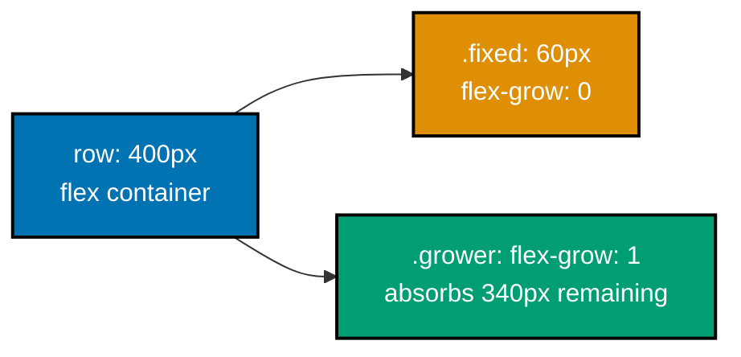

**`learning/code/ex-29-flex-grow-absorbs-space/index.html`**

```html
<!doctype html>
<!-- => triggers standards mode so the pixel widths below compute exactly -->
<html lang="en">
  <!-- => lang="en" declares the document language for assistive tech -->
  <head>
    <!-- => begins document metadata, not rendered content -->
    <meta charset="utf-8" />
    <!-- => declares UTF-8 encoding -->
    <meta name="viewport" content="width=device-width, initial-scale=1" />
    <!-- => matches viewport to device width at 1x zoom -->
    <title>Example 29: flex-grow Absorbs Space</title>
    <!-- => sets only the browser tab title -->
    <!-- => begins this example's scoped CSS -->
    <style>
      body {
        margin: 0;
      } /* => removes the default 8px body margin so the 400px math below is exact */
      .row {
        display: flex;
        width: 400px;
      } /* => a flex container fixed at exactly 400px wide */
      /* => .row has no border or padding, so its content box is exactly 400px */
      .fixed {
        width: 60px;
        height: 30px;
        background: rgb(200, 200, 200);
      } /* => a rigid 60px sibling that never grows */
      /* => flex items default to flex-grow: 0, so .fixed keeps exactly its declared width */
      .grower {
        flex-grow: 1;
        height: 30px;
        background: rgb(180, 200, 240);
      } /* => flex-grow:1 absorbs all remaining free space */
      /* => the id="grower" child is the only one with flex-grow set, so it alone expands */
    </style>
    <!-- => end of scoped CSS -->
  </head>
  <!-- => end of document metadata -->
  <body>
    <!-- => begin visible page content -->
    <div class="row">
      <!-- => .row's content box is 400px wide; children below split that width -->
      <div class="fixed"></div>
      <!-- => takes exactly its declared 60px, nothing more -->
      <div class="grower" id="grower"></div>
      <!-- => flex-grow:1 absorbs 400 - 60 = 340px of remaining space -->
      <!-- => verify.mjs confirms this: grower.getBoundingClientRect().width === 340 -->
    </div>
    <!-- => end of the flex row -->
  </body>
  <!-- => end of visible page content -->
</html>
```

**Run**: `node verify.mjs` (a small Playwright script colocated in `learning/code/ex-29-flex-grow-absorbs-space/`)

**Output** (genuinely captured):

```text
grower width: 340
PASS: flex-grow:1 child absorbed exactly the row's remaining free space
```

**Key takeaway**: With one 60px fixed sibling in a 400px row, the `flex-grow: 1` child absorbed exactly the remaining 340px.

**Why it matters**: `flex-grow` is what makes a flexible "fill whatever's left" layout possible without a single pixel of manual width math -- the browser computes the remainder. A common pitfall is expecting `flex-grow` to work outside a `display: flex` container, where it silently does nothing. This same "let the browser distribute space" idea reappears in Examples 30-32's CSS Grid tracks, though grid divides space up front rather than absorbing what's left over. In real interfaces, this exact mechanism is how a toolbar's flexible middle region expands while fixed-width buttons on either side stay put, regardless of window width.

---

### Example 30: Grid Two Column

_ex-30 &middot; exercises co-10_

`grid-template-columns: 1fr 1fr` divides the container into two equal-width tracks; children are auto-placed into cells left to right, top to bottom.

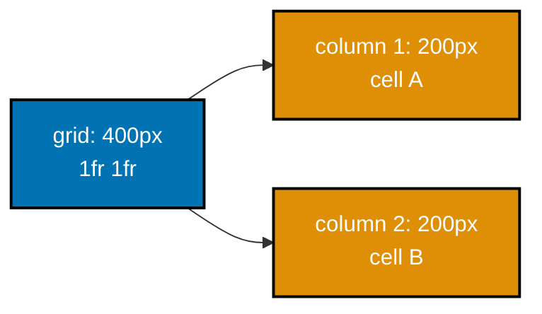

**`learning/code/ex-30-grid-two-column/index.html`**

```html
<!doctype html>
<!-- => triggers standards mode so layout below computes exactly -->
<html lang="en">
  <!-- => lang="en" declares the document language for assistive tech -->
  <head>
    <!-- => begins document metadata, not rendered content -->
    <meta charset="utf-8" />
    <!-- => declares UTF-8 encoding -->
    <meta name="viewport" content="width=device-width, initial-scale=1" />
    <!-- => matches viewport to device width at 1x zoom -->
    <title>Example 30: Grid Two Column</title>
    <!-- => sets only the browser tab title -->
    <!-- => begins this example's scoped CSS -->
    <style>
      body {
        margin: 0;
      } /* => removes the default 8px body margin so the 400px math below is exact */
      .grid {
        display: grid;
        grid-template-columns: 1fr 1fr;
        width: 400px;
      } /* => two equal fractional tracks share the 400px width */
      /* => 1fr 1fr means "split the free space into two EQUAL shares", so each track is 200px */
      .cell {
        height: 40px;
      } /* => a fixed height so both cells are easy to compare visually */
    </style>
    <!-- => end of scoped CSS -->
  </head>
  <!-- => end of document metadata -->
  <body>
    <!-- => begin visible page content -->
    <div class="grid">
      <!-- => the grid container; children below are auto-placed into its cells -->
      <div class="cell" id="a">A</div>
      <!-- => no explicit grid-column set -- auto-placement puts this first, in column 1 -->
      <div class="cell" id="b">B</div>
      <!-- => auto-placement continues left to right, landing this in column 2 -->
      <!-- => verify.mjs confirms: a.x === 0, a.width === 200, b.x === 200 -->
    </div>
    <!-- => end of the grid container -->
  </body>
  <!-- => end of visible page content -->
</html>
```

**Run**: `node verify.mjs` (a small Playwright script colocated in `learning/code/ex-30-grid-two-column/`)

**Output** (genuinely captured):

```text
a.x: 0 a.width: 200 b.x: 200
PASS: the two children landed in two separate, equal-width grid columns
```

**Key takeaway**: Two children landed in two separate 200px-wide columns on the same row, with no explicit placement rules needed.

**Why it matters**: Unlike flexbox's one-dimensional main/cross axis, grid is explicitly two-dimensional -- rows and columns are both first-class, planned up front. A frequent mistake is reaching for flexbox to lay out a page-level structure with both header rows and sidebar columns, which forces awkward nested flex containers; grid expresses that shape directly. Example 31 pushes this further with named regions instead of numbered tracks, and Example 32 adds consistent spacing on top. In production dashboards and card layouts, grid's two-dimensional planning is usually the more natural starting point than flexbox once more than one axis matters.

---

### Example 31: Grid Named Areas

_ex-31 &middot; exercises co-10_

`grid-template-areas` names regions of the grid as ASCII art, then `grid-area: <name>` places an element into its named region -- the layout reads like a diagram in the CSS itself.

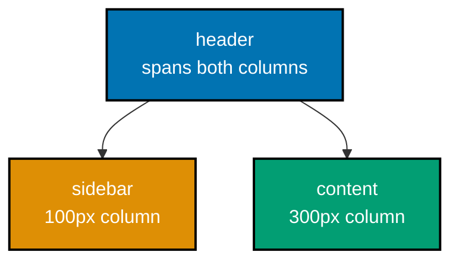

**`learning/code/ex-31-grid-named-areas/index.html`**

```html
<!doctype html>
<!-- => triggers standards mode so layout below computes exactly -->
<html lang="en">
  <!-- => lang="en" declares the document language for assistive tech -->
  <head>
    <!-- => begins document metadata, not rendered content -->
    <meta charset="utf-8" />
    <!-- => declares UTF-8 encoding -->
    <meta name="viewport" content="width=device-width, initial-scale=1" />
    <!-- => matches viewport to device width at 1x zoom -->
    <title>Example 31: Grid Named Areas</title>
    <!-- => sets only the browser tab title -->
    <!-- => begins this example's scoped CSS -->
    <style>
      body {
        margin: 0;
      } /* => removes the default 8px body margin so the 400px math below is exact */
      .layout {
        /* => a named-areas grid combining columns, rows, and an ASCII-art region map */
        display: grid; /* => turns .layout into a grid container */
        width: 400px; /* => the grid's total content-box width */
        grid-template-columns: 100px 300px; /* => two column tracks: a 100px rail, a 300px main area */
        grid-template-rows: 50px 150px; /* => two row tracks: a 50px band, a 150px band */
        grid-template-areas:
          "header header" /* => row 1: "header" spans BOTH column tracks */
          "sidebar content"; /* => row 2: "sidebar" gets column 1, "content" gets column 2 */
      } /* => the ASCII-art strings above ARE the layout, read directly from the CSS */
      #header {
        grid-area: header;
      } /* => places #header into every cell named "header" */
      /* => "header" resolves to the region declared by the grid-template-areas string above */
      #sidebar {
        grid-area: sidebar;
      } /* => places #sidebar into the cell named "sidebar" */
      #content {
        grid-area: content;
      } /* => places #content into the cell named "content" */
    </style>
    <!-- => end of scoped CSS -->
  </head>
  <!-- => end of document metadata -->
  <body>
    <!-- => begin visible page content -->
    <div class="layout">
      <!-- => the grid container; children below are placed by grid-area, not by markup order -->
      <div id="header">Header</div>
      <!-- => spans the full 400px width across both column tracks -->
      <div id="sidebar">Sidebar</div>
      <!-- => occupies the 100px column, second row -->
      <div id="content">Content</div>
      <!-- => occupies the 300px column, second row -->
      <!-- => verify.mjs confirms each element's real {x, y, width, height} matches its named area -->
      <!-- => markup order here is header, sidebar, content -- but grid-area, not source order, decides placement -->
    </div>
    <!-- => end of the named-areas grid -->
  </body>
  <!-- => end of visible page content -->
</html>
```

**Run**: `node verify.mjs` (a small Playwright script colocated in `learning/code/ex-31-grid-named-areas/`)

**Output** (genuinely captured):

```text
header: {"x":0,"y":0,"width":400,"height":50} sidebar: {"x":0,"y":50,"width":100,"height":150} content: {"x":100,"y":50,"width":300,"height":150}
PASS: header/sidebar/content each landed in their named grid-template-areas region
```

**Key takeaway**: Header spanned the full width; sidebar and content occupied their own distinct, correctly-sized regions on the second row.

**Why it matters**: Named areas make the LAYOUT INTENT readable directly from the CSS -- "header" and "sidebar" as literal strings, instead of reverse-engineering row/column line numbers. Without names, a reviewer has to mentally simulate numbered grid lines to understand which element lands where, which gets error-prone as a layout grows past two or three regions. Because the ASCII-art string in `grid-template-areas` visually mirrors the actual page shape, changing the layout (say, moving the sidebar to the right) is a one-line edit instead of recalculating column-line numbers across every rule. This readability advantage compounds heavily in larger real-world page templates.

---

### Example 32: Grid Gap

_ex-32 &middot; exercises co-10_

`gap` inserts spacing between grid tracks without adding margin to individual cells -- the spacing lives on the grid container, not on each child.

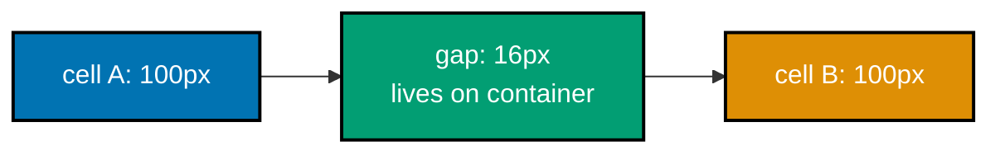

**`learning/code/ex-32-grid-gap/index.html`**

```html
<!doctype html>
<!-- => triggers standards mode so layout below computes exactly -->
<html lang="en">
  <!-- => lang="en" declares the document language for assistive tech -->
  <head>
    <!-- => begins document metadata, not rendered content -->
    <meta charset="utf-8" />
    <!-- => declares UTF-8 encoding -->
    <meta name="viewport" content="width=device-width, initial-scale=1" />
    <!-- => matches viewport to device width at 1x zoom -->
    <title>Example 32: Grid Gap</title>
    <!-- => sets only the browser tab title -->
    <!-- => begins this example's scoped CSS -->
    <style>
      body {
        margin: 0;
      } /* => removes the default 8px body margin so the pixel math below is exact */
      .grid {
        display: grid;
        grid-template-columns: 100px 100px;
        gap: 16px;
        width: 216px;
      } /* => 100 + 16 + 100 = 216px total */
      /* => gap lives on the CONTAINER, not on either child -- no per-cell margin bookkeeping */
      .cell {
        height: 40px;
        background: rgb(220, 220, 220);
      } /* => shared cell styling so both tracks look identical */
    </style>
    <!-- => end of scoped CSS -->
  </head>
  <!-- => end of document metadata -->
  <body>
    <!-- => begin visible page content -->
    <div class="grid">
      <!-- => two 100px columns with a 16px gap between them -->
      <div class="cell" id="a"></div>
      <!-- => occupies column 1, x: 0 to 100 -->
      <div class="cell" id="b"></div>
      <!-- => occupies column 2, starting 16px after #a ends -->
      <!-- => verify.mjs measures b.x - (a.x + a.width), which equals exactly 16 -->
      <!-- => neither cell has its own margin -- the seam comes entirely from the container's gap -->
    </div>
    <!-- => end of the grid container -->
  </body>
  <!-- => end of visible page content -->
</html>
```

**Run**: `node verify.mjs` (a small Playwright script colocated in `learning/code/ex-32-grid-gap/`)

**Output** (genuinely captured):

```text
spacing between tracks: 16
PASS: the measured gap between the two grid tracks was exactly the declared 16px
```

**Key takeaway**: The measured pixel distance between two adjacent cells matched the declared `gap: 16px` exactly.

**Why it matters**: Because `gap` is on the container, changing it in one place adjusts every internal seam consistently -- no per-child margin bookkeeping, and no doubled-up gap at the edges the way margin-based spacing often produces. Before `gap` existed, spacing grid or flex children required careful `margin` juggling on each child plus a compensating negative margin on the container, a fragile pattern that broke easily when items were added or removed. `gap` also cleanly extends to flexbox containers, so the same mental model -- spacing lives on the parent, not scattered across children -- applies consistently across both layout systems.

---

### Example 33: Responsive Breakpoint

_ex-33 &middot; exercises co-11_

A `@media (max-width: 600px)` block only applies its rules when the viewport genuinely matches that condition -- the same document serves two different layouts depending purely on viewport width.

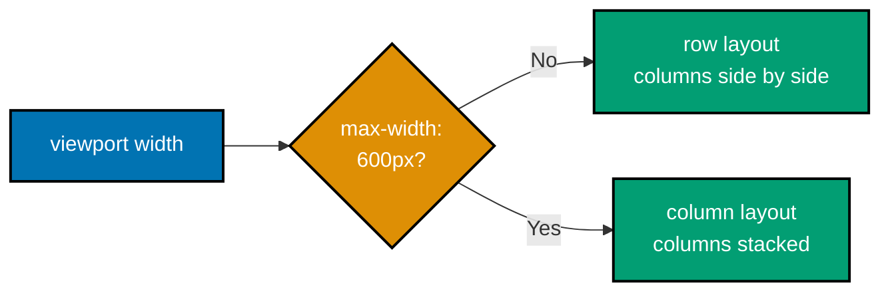

**`learning/code/ex-33-responsive-breakpoint/index.html`**

```html
<!doctype html>
<!-- => triggers standards mode so layout below computes exactly -->
<html lang="en">
  <!-- => lang="en" declares the document language for assistive tech -->
  <head>
    <!-- => begins document metadata, not rendered content -->
    <meta charset="utf-8" />
    <!-- => declares UTF-8 encoding -->
    <meta name="viewport" content="width=device-width, initial-scale=1" />
    <!-- => required for @media width queries to match real device width, not a desktop default -->
    <title>Example 33: Responsive Breakpoint</title>
    <!-- => sets only the browser tab title -->
    <!-- => begins this example's scoped CSS -->
    <style>
      body {
        margin: 0;
      } /* => removes the default 8px body margin */
      .layout {
        display: flex;
      } /* => default flex-direction is row, so columns sit side by side */
      .col {
        width: 200px;
        height: 30px;
        background: rgb(200, 200, 220);
      } /* => fixed 200px width in the wide layout */
      @media (max-width: 600px) {
        /* => only applies its rules when the viewport is 600px or narrower */
        .layout {
          flex-direction: column;
        } /* => switches the SAME container to stack children vertically */
        .col {
          width: 100%;
        } /* => at this width, each column fills the full available width instead */
      } /* => outside this block, at wide viewports, none of these three overrides apply */
    </style>
    <!-- => end of scoped CSS -->
  </head>
  <!-- => end of document metadata -->
  <body>
    <!-- => begin visible page content -->
    <div class="layout">
      <!-- => the SAME markup renders differently depending purely on viewport width -->
      <div class="col" id="a"></div>
      <!-- => side by side above 600px, stacked on top below it -->
      <div class="col" id="b"></div>
      <!-- => side by side above 600px, stacked below #a below it -->
      <!-- => verify.mjs resizes the real viewport and re-measures both elements' y positions -->
      <!-- => equal y values mean side-by-side; b.y greater than a.y means stacked -->
    </div>
    <!-- => end of the responsive layout -->
  </body>
  <!-- => end of visible page content -->
</html>
```

**Run**: `node verify.mjs` (a small Playwright script colocated in `learning/code/ex-33-responsive-breakpoint/`)

**Output** (genuinely captured):

```text
wide viewport: a.y 0 b.y 0 (equal means side-by-side)
narrow viewport: a.y 0 b.y 30 (b below a means stacked)
PASS: the media query stacked the columns once the viewport shrank below 600px
```

**Key takeaway**: Above 600px the two columns sat side by side; below 600px, the same markup stacked them vertically -- confirmed by resizing the real viewport, not by reading the CSS.

**Why it matters**: One HTML document, unchanged, serving a phone-appropriate stacked layout and a desktop-appropriate side-by-side layout is the entire point of responsive design -- no separate mobile site required. Before media queries were reliable, teams often maintained a completely separate `m.example.com` mobile site, doubling the maintenance burden and risking the two versions drifting out of sync. A common pitfall today is choosing a breakpoint based on a specific device's screen size rather than where the CONTENT itself starts to feel cramped -- content-driven breakpoints age far better as new devices and window sizes appear.

---

### Example 34: Responsive Fluid Image

_ex-34 &middot; exercises co-11_

`img { max-width: 100% }` caps an image's rendered width at its container's width, so it scales down on narrow viewports instead of forcing horizontal overflow.

**`learning/code/ex-34-responsive-fluid-image/index.html`**

```html
<!doctype html>
<!-- => triggers standards mode so layout below computes exactly -->
<html lang="en">
  <!-- => lang="en" declares the document language for assistive tech -->
  <head>
    <!-- => begins document metadata, not rendered content -->
    <meta charset="utf-8" />
    <!-- => declares UTF-8 encoding -->
    <meta name="viewport" content="width=device-width, initial-scale=1" />
    <!-- => required so 90vw below tracks the real device width -->
    <title>Example 34: Responsive Fluid Image</title>
    <!-- => sets only the browser tab title -->
    <!-- => "fluid image" means the rendered size adapts continuously, not just at fixed breakpoints -->
    <!-- => begins this example's scoped CSS -->
    <style>
      body {
        margin: 0;
      } /* => removes the default 8px body margin so the vw math below is exact */
      .frame {
        width: 90vw;
        max-width: 600px;
      } /* => 90% of viewport width, but never wider than 600px */
      /* => at a 1400px viewport, 90vw would be 1260px -- max-width caps it at 600px instead */
      img {
        max-width: 100%;
        height: auto;
        display: block;
      } /* => the image can never exceed its container's width */
      /* => height: auto preserves aspect ratio as max-width shrinks the rendered width */
      /* => display: block removes the small inline-image gap that would otherwise appear below it */
    </style>
    <!-- => end of scoped CSS -->
  </head>
  <!-- => end of document metadata -->
  <body>
    <!-- => begin visible page content -->
    <div class="frame">
      <!-- => the container whose computed width the image below must never exceed -->
      <!-- => explicit width/height attributes below reserve layout space before the image finishes loading -->
      <!-- => width="800" height="400" set the image's INTRINSIC size -- the browser reserves that aspect ratio -->
      
      <!-- => without max-width: 100%, this 800px-intrinsic image would force horizontal overflow on any narrower viewport -->
      <!-- => verify.mjs resizes the real viewport 4 times and re-measures both frame and image width each time -->
    </div>
    <!-- => end of the fluid-image frame -->
  </body>
  <!-- => end of visible page content -->
</html>
```

**Run**: `node verify.mjs` (a small Playwright script colocated in `learning/code/ex-34-responsive-fluid-image/`)

**Output** (genuinely captured):

```text
viewport 320: frame width 288.0, img width 288.0
viewport 500: frame width 450.0, img width 450.0
viewport 900: frame width 600.0, img width 600.0
viewport 1400: frame width 600.0, img width 600.0
PASS: max-width:100% kept the image within its container at every tested viewport
```

**Key takeaway**: At four different viewport widths, the image's measured rendered width never exceeded its container's width.

**Why it matters**: Without `max-width: 100%`, an image with explicit `width`/`height` attributes (needed to prevent layout shift while loading) would force the whole page to overflow horizontally on a narrow phone screen. This tension -- reserving space to avoid layout shift versus letting the image shrink to fit -- is exactly what `max-width: 100%` resolves: the attributes set the image's INTRINSIC aspect ratio, while the CSS caps its RENDERED size. A common pitfall is applying `max-width: 100%` globally without also setting `height: auto`, which distorts the aspect ratio instead of scaling it proportionally, as Example 33's breakpoints demonstrate at the layout level.

---

### Example 35: Custom Property Theming

_ex-35 &middot; exercises co-06, co-11_

Overriding a custom property inside a scoped selector (`.dark { --brand: ... }`) changes what `var(--brand)` resolves to for every descendant of that scope, while everything outside it keeps the root value.

**`learning/code/ex-35-custom-property-theming/index.html`**

```html
<!doctype html>
<!-- => triggers standards mode -->
<html lang="en">
  <!-- => lang="en" declares the document language for assistive tech -->
  <head>
    <!-- => begins document metadata, not rendered content -->
    <meta charset="utf-8" />
    <!-- => declares UTF-8 encoding -->
    <meta name="viewport" content="width=device-width, initial-scale=1" />
    <!-- => matches viewport to device width at 1x zoom -->
    <title>Example 35: Custom Property Theming</title>
    <!-- => sets only the browser tab title -->
    <!-- => begins this example's scoped CSS -->
    <style>
      :root {
        --brand: rgb(10, 100, 200);
      } /* => defines --brand at the document root, a blue */
      .dark {
        --brand: rgb(240, 200, 60);
      } /* => REDEFINES --brand only for descendants of .dark, a gold */
      /* => this is a normal cascade rule -- more specific scope wins, exactly like any other property */
      .label {
        color: var(--brand);
      } /* => reads whatever --brand resolves to in ITS OWN cascade scope */
    </style>
    <!-- => end of scoped CSS -->
  </head>
  <!-- => end of document metadata -->
  <body>
    <!-- => begin visible page content -->
    <p class="label" id="light">Light theme label</p>
    <!-- => outside .dark, --brand resolves to the :root value -->
    <div class="dark">
      <!-- => everything inside this div sees the REDEFINED --brand -->
      <p class="label" id="dark">Dark theme label</p>
      <!-- => same .label rule, different resolved color -->
      <!-- => verify.mjs reads getComputedStyle(...).color for both #light and #dark -->
    </div>
    <!-- => end of the dark-themed scope -->
  </body>
  <!-- => end of visible page content -->
</html>
```

**Run**: `node verify.mjs` (a small Playwright script colocated in `learning/code/ex-35-custom-property-theming/`)

**Output** (genuinely captured):

```text
light-scope color: rgb(10, 100, 200) dark-scope color: rgb(240, 200, 60)
PASS: the same .label rule resolved var(--brand) differently per cascade scope
```

**Key takeaway**: The identical `.label { color: var(--brand) }` rule computed two DIFFERENT real colors, purely based on which cascade scope each label sat inside.

**Why it matters**: This is the entire mechanism behind a dark-mode toggle implemented with a single class swap on a wrapping element -- no duplicated rules, just one property redefined in one scope. Without custom properties, a dark theme typically requires a parallel set of `.dark .some-selector { color: ... }` overrides for every single rule that touches color, which drifts out of sync as the codebase grows. By centralizing the actual color VALUES in a handful of custom properties, toggling a theme becomes a single class change at the root, and every component that reads `var(--brand)` updates automatically.

---

### Example 36: Event Bubbling

_ex-36 &middot; exercises co-15_

A click event doesn't just fire on the element it happened on -- it BUBBLES upward through every ancestor, so a listener on a distant parent still sees clicks that originated on any descendant.

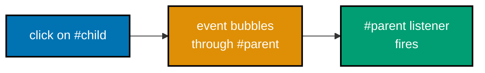

**`learning/code/ex-36-event-bubbling/index.html`**

```html
<!doctype html>
<!-- => triggers standards mode -->
<html lang="en">
  <!-- => lang="en" declares the document language for assistive tech -->
  <head>
    <!-- => begins document metadata, not rendered content -->
    <meta charset="utf-8" />
    <!-- => declares UTF-8 encoding -->
    <meta name="viewport" content="width=device-width, initial-scale=1" />
    <!-- => matches viewport to device width at 1x zoom -->
    <title>Example 36: Event Bubbling</title>
    <!-- => sets only the browser tab title -->
  </head>
  <!-- => end of document metadata -->
  <body>
    <!-- => begin visible page content -->
    <!-- => #parent is the ANCESTOR that will listen for clicks, even though it isn't clicked directly -->
    <div id="parent">
      <button id="child">Click me</button>
      <!-- => the DESCENDANT that actually receives the real click -->
    </div>
    <!-- => end of the ancestor/descendant pair -->
    <p id="report">not fired</p>
    <!-- => starts as "not fired"; the listener below rewrites this text -->
    <!-- => begins this example's JavaScript -->
    <script>
      // => addEventListener registers a click listener on #parent, NOT on #child
      document.getElementById("parent").addEventListener("click", () => {
        // => #child itself has no listener of its own -- this callback only runs via bubbling
        document.getElementById("report").textContent = "parent saw it";
        // => this only runs if a click event reaches #parent -- bubbling is what delivers it here
      }); // => end of the parent's click listener
      // => clicking #child fires a click event that BUBBLES up through #parent, triggering this listener
      // => without bubbling, a listener on #parent could only ever see clicks ON #parent itself
    </script>
    <!-- => end of this example's JavaScript -->
    <!-- => this <p id="report"> is the only visible proof the click was actually observed by #parent -->
  </body>
  <!-- => end of visible page content -->
</html>
```

**Run**: `node verify.mjs` (a small Playwright script colocated in `learning/code/ex-36-event-bubbling/`)

**Output** (genuinely captured):

```text
report: parent saw it
PASS: the click on #child bubbled up and the #parent listener saw it
```

**Key takeaway**: Clicking the child button, with no listener of its own, still triggered the parent's click listener.

**Why it matters**: Bubbling is what makes event delegation (Example 37) possible at all -- one listener on a container can observe events from descendants that don't even exist yet at the time the listener was attached. A common point of confusion is assuming bubbling is somehow optional or unusual; in reality nearly every DOM event bubbles by default, and code that ignores this can be surprised when a click handler on an outer wrapper fires for clicks deep inside unrelated child components. Understanding bubbling explicitly is the foundation the next several examples on delegation and propagation control build on directly.

---

### Example 37: Event Delegation List

_ex-37 &middot; exercises co-15, co-14_

Instead of attaching a separate listener to every `<li>`, ONE listener on the parent `<ul>` reads `event.target` to figure out which specific item was actually clicked.

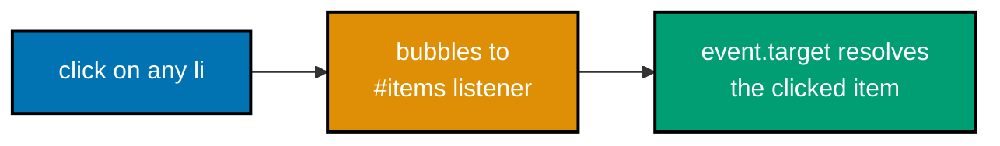

**`learning/code/ex-37-event-delegation-list/index.html`**

```html
<!doctype html>
<!-- => triggers standards mode -->
<html lang="en">
  <!-- => lang="en" declares the document language for assistive tech -->
  <head>
    <!-- => begins document metadata, not rendered content -->
    <meta charset="utf-8" />
    <!-- => declares UTF-8 encoding -->
    <meta name="viewport" content="width=device-width, initial-scale=1" />
    <!-- => matches viewport to device width at 1x zoom -->
    <title>Example 37: Event Delegation List</title>
    <!-- => sets only the browser tab title -->
  </head>
  <!-- => end of document metadata -->
  <body>
    <!-- => begin visible page content -->
    <ul id="items">
      <!-- => the ONLY element with a click listener; no <li> has one of its own -->
      <li data-id="1">One</li>
      <!-- => data-id is read back inside the delegated handler below -->
      <li data-id="2">Two</li>
      <!-- => a second item, no separate listener needed -->
      <li data-id="3">Three</li>
      <!-- => a third item, still no separate listener needed -->
    </ul>
    <!-- => end of the delegated list -->
    <p id="report">none</p>
    <!-- => starts as "none"; the delegated handler rewrites this text -->
    <!-- => begins this example's JavaScript -->
    <script>
      // => ONE listener on the parent <ul> -- bubbling (Example 36) is what delivers every child's click here
      document.getElementById("items").addEventListener("click", (event) => {
        const li = event.target.closest("li"); // => walks up from event.target to find its <li> ancestor
        // => event.target is whatever was ACTUALLY clicked -- could be the <li> itself or text inside it
        if (li) document.getElementById("report").textContent = li.dataset.id;
        // => reads the specific clicked item's data-id, proving the delegated handler resolved the right target
      }); // => end of the delegated click listener
      // => no listener is ever attached per-<li> -- one handler covers all three, and any added later
    </script>
    <!-- => end of this example's JavaScript -->
  </body>
  <!-- => end of visible page content -->
</html>
```

**Run**: `node verify.mjs` (a small Playwright script colocated in `learning/code/ex-37-event-delegation-list/`)

**Output** (genuinely captured):

```text
delegated report for clicking item 2: 2
delegated report for clicking item 3: 3
PASS: the single delegated listener resolved the correct target for two different items
```

**Key takeaway**: A single listener on `<ul>` correctly resolved the clicked item's id for two different `<li>` elements, using only `event.target`.

**Why it matters**: Delegation scales to any number of list items, including ones added later (Example 78 pushes this further, into truly dynamic lists), without ever attaching a new listener per item. Attaching a separate listener per `<li>` is a common performance and correctness pitfall: it wastes memory on large lists, and any item added dynamically after page load simply has no listener at all unless the code remembers to re-attach one. Delegation sidesteps both problems entirely, because the listener lives on a stable parent element that never changes, while `event.target` is resolved fresh on every single click.

---

### Example 38: preventDefault on a Link

_ex-38 &middot; exercises co-16_

`event.preventDefault()` cancels a browser's built-in default action for an event -- for a link click, that default action is navigation, so calling it keeps the page exactly where it was.

**`learning/code/ex-38-prevent-default-link/index.html`**

```html
<!doctype html>
<!-- => triggers standards mode -->
<html lang="en">
  <!-- => lang="en" declares the document language for assistive tech -->
  <head>
    <!-- => begins document metadata, not rendered content -->
    <meta charset="utf-8" />
    <!-- => declares UTF-8 encoding -->
    <meta name="viewport" content="width=device-width, initial-scale=1" />
    <!-- => matches viewport to device width at 1x zoom -->
    <title>Example 38: preventDefault on a Link</title>
    <!-- => sets only the browser tab title -->
  </head>
  <!-- => end of document metadata -->
  <body>
    <!-- => begin visible page content -->
    <a id="link" href="somewhere-else.html">Go elsewhere</a>
    <!-- => a real link -- its DEFAULT action is navigation -->
    <!-- => href points at a page that doesn't exist -- if navigation happened, this example would break -->
    <p id="report">not clicked</p>
    <!-- => starts as "not clicked"; the listener below rewrites this text -->
    <!-- => begins this example's JavaScript -->
    <script>
      document.getElementById("link").addEventListener("click", (event) => {
        event.preventDefault(); // => cancels the link's built-in default action -- the browser never navigates
        // => "event" here is the real Click event the browser dispatched, not a synthetic stand-in
        document.getElementById("report").textContent = "click handled, default prevented";
        // => confirms the handler ran, even though the page itself never left this document
      }); // => end of the link's click listener
      // => verify.mjs compares page.url() before and after the click -- an unchanged URL proves navigation never happened
    </script>
    <!-- => end of this example's JavaScript -->
  </body>
  <!-- => end of visible page content -->
</html>
```

**Run**: `node verify.mjs` (a small Playwright script colocated in `learning/code/ex-38-prevent-default-link/`)

**Output** (genuinely captured):

```text
url before: file:///<repo-root>/apps/ayokoding-www/content/en/learn/fundamentally-strong/software-engineer/frontend-essentials/learning/code/ex-38-prevent-default-link/index.html url after click: file:///<repo-root>/apps/ayokoding-www/content/en/learn/fundamentally-strong/software-engineer/frontend-essentials/learning/code/ex-38-prevent-default-link/index.html report: click handled, default prevented
PASS: preventDefault() suppressed the navigation; the page URL never changed
```

**Key takeaway**: The page's URL never changed after clicking the link, because the click handler called `preventDefault()` before the browser could navigate.

**Why it matters**: This is the mechanism behind every "link that's actually a JavaScript action" pattern -- intercepting the click, running custom logic, and explicitly opting out of the browser's default navigation. Single-page applications rely on exactly this technique for internal navigation links, replacing a full page reload with client-side routing while still keeping a real, crawlable `href` for search engines and users with JavaScript disabled. A common pitfall is calling `preventDefault()` too late, after some asynchronous code has already yielded control back to the browser -- by then navigation may have already started, and canceling it is no longer possible.

---

### Example 39: stopPropagation

_ex-39 &middot; exercises co-16, co-15_

`event.stopPropagation()` halts an event's bubbling journey up the ancestor chain -- called on the child, it keeps the SAME event from ever reaching a parent's listener.

**`learning/code/ex-39-stop-propagation/index.html`**

```html
<!doctype html>
<!-- => triggers standards mode -->
<html lang="en">
  <!-- => lang="en" declares the document language for assistive tech -->
  <head>
    <!-- => begins document metadata, not rendered content -->
    <meta charset="utf-8" />
    <!-- => declares UTF-8 encoding -->
    <meta name="viewport" content="width=device-width, initial-scale=1" />
    <!-- => matches viewport to device width at 1x zoom -->
    <title>Example 39: stopPropagation</title>
    <!-- => sets only the browser tab title -->
  </head>
  <!-- => end of document metadata -->
  <body>
    <!-- => begin visible page content -->
    <div id="parent">
      <!-- => has a click listener that would normally see bubbled clicks from #child -->
      <button id="child">Click me</button>
      <!-- => has its OWN listener that stops the bubble before it can reach #parent -->
    </div>
    <!-- => end of the ancestor/descendant pair -->
    <p id="report">parent not fired</p>
    <!-- => stays this way ONLY if stopPropagation genuinely blocked the bubble -->
    <!-- => begins this example's JavaScript -->
    <script>
      // => registered on #parent, exactly like Example 36 -- but this time #child stops the bubble
      document.getElementById("parent").addEventListener("click", () => {
        document.getElementById("report").textContent = "parent fired (bug)";
        // => this text would only ever appear if the click somehow still reached #parent
      }); // => end of the parent's click listener
      document.getElementById("child").addEventListener("click", (event) => {
        event.stopPropagation(); // => halts this SAME event's journey up the ancestor chain, right here
      }); // => end of the child's click listener
      // => stopPropagation() does NOT cancel the browser's default action -- that's preventDefault (Example 38)
      // => the two methods solve different problems and calling one never implies the other
    </script>
    <!-- => end of this example's JavaScript -->
  </body>
  <!-- => end of visible page content -->
</html>
```

**Run**: `node verify.mjs` (a small Playwright script colocated in `learning/code/ex-39-stop-propagation/`)

**Output** (genuinely captured):

```text
report after click with stopPropagation: parent not fired
PASS: stopPropagation() on the child kept the click from ever reaching the parent
```

**Key takeaway**: With `stopPropagation()` called on the child, the parent's click listener never fired at all.

**Why it matters**: `preventDefault` and `stopPropagation` solve two completely different problems -- one cancels the browser's default action, the other cancels further bubbling -- and calling one does not imply the other. A frequent bug is calling `stopPropagation()` when the actual goal was `preventDefault()` (or vice versa), which silently breaks unrelated ancestor listeners that had nothing to do with the original problem being solved. `stopPropagation()` in particular should be used sparingly, since it can prevent OTHER, well-behaved code -- including third-party libraries relying on delegation, as in Example 37 -- from ever seeing an event it legitimately needed to observe.

---

### Example 40: setTimeout Defers Work

_ex-40 &middot; exercises co-17_

`setTimeout(fn, 0)` never runs synchronously, even with a zero-millisecond delay -- it always waits until every currently-running synchronous statement finishes first.

```mermaid
sequenceDiagram
    participant Sync as synchronous code
    participant Loop as event loop
    participant Timer as setTimeout callback

    Sync->>Sync: push(sync-1)
    Sync->>Loop: setTimeout(fn, 0) scheduled
    Sync->>Sync: push(sync-2)
    Note over Sync: call stack now empty
    Loop->>Timer: run deferred callback
    Timer->>Timer: push(timeout)
```

**`learning/code/ex-40-settimeout-defers-work/index.html`**

```html
<!doctype html>
<!-- => triggers standards mode -->
<html lang="en">
  <!-- => lang="en" declares the document language for assistive tech -->
  <head>
    <!-- => begins document metadata, not rendered content -->
    <meta charset="utf-8" />
    <!-- => declares UTF-8 encoding -->
    <meta name="viewport" content="width=device-width, initial-scale=1" />
    <!-- => matches viewport to device width at 1x zoom -->
    <title>Example 40: setTimeout Defers Work</title>
    <!-- => sets only the browser tab title -->
  </head>
  <!-- => end of document metadata -->
  <body>
    <!-- => begin visible page content -->
    <p id="log"></p>
    <!-- => unused visually; verify.mjs reads window.__order directly instead -->
    <!-- => begins this example's JavaScript -->
    <script>
      window.__order = []; // => a shared array recording the ACTUAL order statements ran in
      window.__order.push("sync-1"); // => runs synchronously, first, in source order
      setTimeout(() => window.__order.push("timeout"), 0); // => schedules a callback -- does NOT run it now
      // => even with delay 0, this callback is deferred until the synchronous code below finishes
      window.__order.push("sync-2"); // => runs synchronously, second, still before any timer callback
      // => only once the call stack is empty does the event loop even consider running the timer
    </script>
    <!-- => end of this example's JavaScript -->
  </body>
  <!-- => end of visible page content -->
</html>
```

**Run**: `node verify.mjs` (a small Playwright script colocated in `learning/code/ex-40-settimeout-defers-work/`)

**Output** (genuinely captured):

```text
execution order: ["sync-1","sync-2","timeout"]
PASS: both synchronous pushes ran before the setTimeout(fn, 0) callback
```

**Key takeaway**: Both synchronous pushes ran to completion before the `setTimeout(fn, 0)` callback ever executed.

**Why it matters**: "Zero milliseconds" does not mean "immediately" -- it means "as soon as possible after the current synchronous execution and the microtask queue are both empty," which is a fundamentally different guarantee. This misunderstanding is a classic source of race-condition bugs: code that assumes a `setTimeout(fn, 0)` callback runs before the next line of synchronous code will behave correctly in every manual test yet fail unpredictably once real timing pressure or heavier synchronous work is introduced. Examples 41 and 42 build directly on this deferred-execution guarantee, first contrasting it against microtasks, then using it deliberately to build a debounced input handler.

---

### Example 41: Microtask Before Timeout

_ex-41 &middot; exercises co-17_

Promise callbacks (`.then`) are microtasks; `setTimeout` callbacks are macrotasks -- the event loop always drains every pending microtask before it processes the next macrotask, regardless of scheduling order.

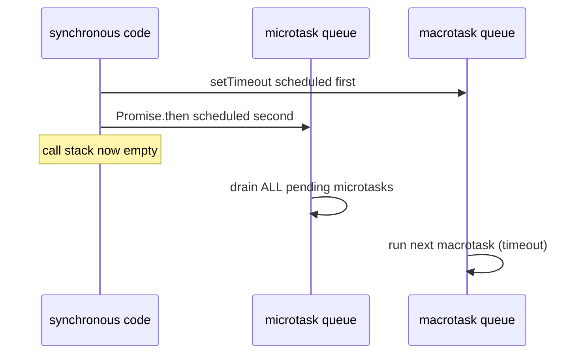

**`learning/code/ex-41-microtask-before-timeout/index.html`**

```html
<!doctype html>
<!-- => triggers standards mode -->
<html lang="en">
  <!-- => lang="en" declares the document language for assistive tech -->
  <head>
    <!-- => begins document metadata, not rendered content -->
    <meta charset="utf-8" />
    <!-- => declares UTF-8 encoding -->
    <meta name="viewport" content="width=device-width, initial-scale=1" />
    <!-- => matches viewport to device width at 1x zoom -->
    <title>Example 41: Microtask Before Timeout</title>
    <!-- => sets only the browser tab title -->
  </head>
  <!-- => end of document metadata -->
  <body>
    <!-- => begin visible page content -->
    <!-- => begins this example's JavaScript -->
    <script>
      window.__order = []; // => a shared array recording the ACTUAL order callbacks ran in
      setTimeout(() => window.__order.push("timeout"), 0); // => scheduled FIRST -- a macrotask
      Promise.resolve().then(() => window.__order.push("microtask")); // => scheduled SECOND -- a microtask
      // => despite being scheduled second, the microtask queue is always fully drained first
      // => the event loop processes: current sync code -> ALL pending microtasks -> next macrotask
    </script>
    <!-- => end of this example's JavaScript -->
  </body>
  <!-- => end of visible page content -->
</html>
```

**Run**: `node verify.mjs` (a small Playwright script colocated in `learning/code/ex-41-microtask-before-timeout/`)

**Output** (genuinely captured):

```text
execution order: ["microtask","timeout"]
PASS: the microtask ran before the timeout, despite being scheduled second
```

**Key takeaway**: Even though `setTimeout` was scheduled FIRST in the source code, the Promise's microtask still ran before it.

**Why it matters**: This ordering guarantee is why Promise-based code (including `async`/`await`) can rely on running before any pending timer, no matter how the two happen to be interleaved in source order. A subtle real-world consequence: a long chain of `.then()` calls, or a tight loop of `await`s, can starve pending `setTimeout` callbacks indefinitely, because the event loop refuses to move to the next macrotask until the microtask queue is completely empty. Recognizing microtasks versus macrotasks as two SEPARATE queues, not one merged execution order, is essential for correctly reasoning about async code timing in any non-trivial JavaScript application.

---

### Example 42: Debounce Input

_ex-42 &middot; exercises co-17, co-14_

A debounced handler resets its `setTimeout` timer on every new event -- only once the events stop arriving for the full delay does the handler actually run, and only once, on the final value.

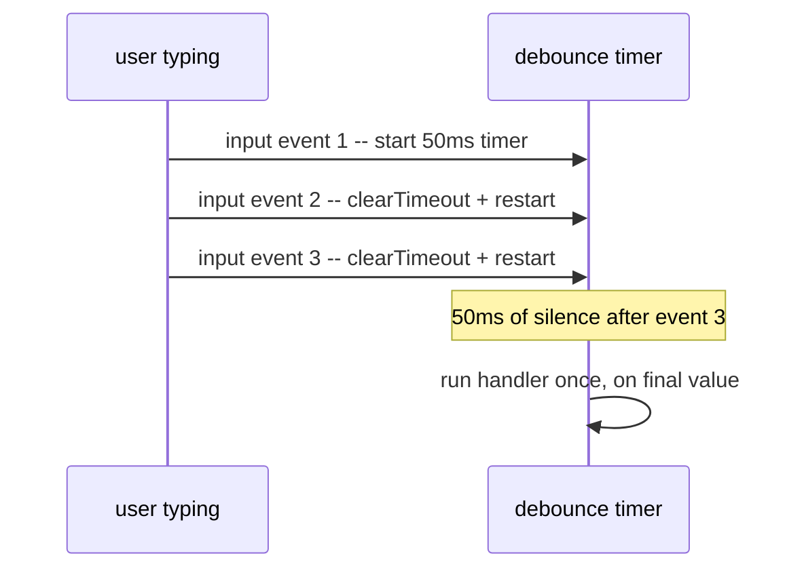

**`learning/code/ex-42-debounce-input/index.html`**

```html
<!doctype html>
<!-- => triggers standards mode -->
<html lang="en">
  <!-- => lang="en" declares the document language for assistive tech -->
  <head>
    <!-- => begins document metadata, not rendered content -->
    <meta charset="utf-8" />
    <!-- => declares UTF-8 encoding -->
    <meta name="viewport" content="width=device-width, initial-scale=1" />
    <!-- => matches viewport to device width at 1x zoom -->
    <title>Example 42: Debounce Input</title>
    <!-- => sets only the browser tab title -->
  </head>
  <!-- => end of document metadata -->
  <body>
    <!-- => begin visible page content -->
    <input id="search" type="text" />
    <!-- => typing here fires an "input" event on every keystroke -->
    <p id="processed">none</p>
    <!-- => only updated once, after the debounce delay settles -->
    <!-- => begins this example's JavaScript -->
    <script>
      window.__calls = 0; // => counts how many times the debounced handler actually ran
      let timer = null; // => holds the ONE pending timer id, shared across every "input" event
      const input = document.getElementById("search"); // => the element whose "input" event drives everything below
      const processed = document.getElementById("processed"); // => rewritten only after the delay settles
      input.addEventListener("input", () => {
        // => this callback runs on EVERY keystroke, but the setTimeout below is what makes it debounced
        clearTimeout(timer); // => cancels the PREVIOUS pending timer, if one was still waiting
        // => this line is what makes it a debounce, not just a delay -- each new keystroke resets the clock
        timer = setTimeout(() => {
          window.__calls += 1; // => only increments once the input has been quiet for the full 50ms
          processed.textContent = input.value; // => reads whatever value is CURRENT at this later moment
        }, 50); // => end of the deferred callback
      }); // => end of the "input" listener
      // => three rapid edits reset the timer twice and let only the LAST scheduled callback ever run
      // => verify.mjs fills the input three times in a row, then waits 150ms before reading the result
    </script>
    <!-- => end of this example's JavaScript -->
  </body>
  <!-- => end of visible page content -->
</html>
```

**Run**: `node verify.mjs` (a small Playwright script colocated in `learning/code/ex-42-debounce-input/`)

**Output** (genuinely captured):

```text
final processed value: abc handler call count: 1
PASS: debounce collapsed three rapid edits into exactly one processed call, on the final value
```

**Key takeaway**: Three rapid, value-replacing edits produced exactly one handler call, and it processed only the final value.

**Why it matters**: Debouncing an expensive handler (a search-as-you-type API call, for instance) prevents firing it on every single keystroke -- only the user's FINAL, settled input ever triggers real work. Without debouncing, a fast typist could trigger dozens of redundant network requests for a single search term, wasting bandwidth, hammering a backend, and risking out-of-order responses overwriting a newer result with a stale one. This example builds directly on the event-loop timing guarantees from Examples 40-41: `clearTimeout` combined with `setTimeout` is only reliable because JavaScript's single-threaded execution model guarantees no other code can run between the cancel and reschedule.

---

### Example 43: Render From State

_ex-43 &middot; exercises co-18_

A `render(state)` function reads a state object and rebuilds the DOM to match it -- the DOM becomes a pure OUTPUT of state, never edited by hand outside this one function.

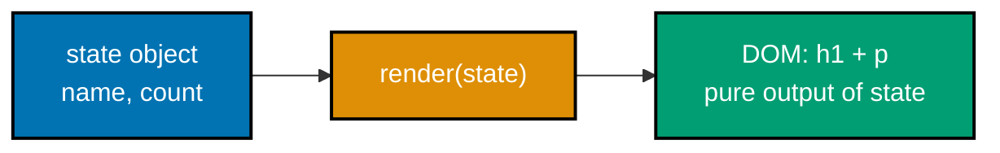

**`learning/code/ex-43-render-from-state/index.html`**

```html
<!doctype html>
<!-- => triggers standards mode -->
<html lang="en">
  <!-- => lang="en" declares the document language for assistive tech -->
  <head>
    <!-- => begins document metadata, not rendered content -->
    <meta charset="utf-8" />
    <!-- => declares UTF-8 encoding -->
    <meta name="viewport" content="width=device-width, initial-scale=1" />
    <!-- => matches viewport to device width at 1x zoom -->
    <title>Example 43: Render From State</title>
    <!-- => sets only the browser tab title -->
  </head>
  <!-- => end of document metadata -->
  <body>
    <!-- => begin visible page content -->
    <div id="app"></div>
    <!-- => starts empty -- render(state) below fills it, nothing is hand-authored here -->
    <!-- => this is the ONLY hand-written markup; everything visible inside #app is generated by JavaScript -->
    <!-- => begins this example's JavaScript -->
    <script>
      const state = { name: "Ada", count: 3 }; // => the single source of truth this example renders from
      function render(state) {
        // => takes state as a PARAMETER, so this function has no hidden dependencies
        const app = document.getElementById("app"); // => the one DOM node this function is allowed to write to
        app.innerHTML = "";
        // => clears any PREVIOUS render's output before building the new one, avoiding stale leftover nodes
        const h = document.createElement("h1"); // => a fresh element, built from scratch on every render
        h.textContent = state.name; // => reads state.name, not a hardcoded string
        const p = document.createElement("p"); // => a second fresh element, also built from scratch
        p.textContent = "count: " + state.count; // => reads state.count, not a hardcoded number
        app.append(h, p); // => the ONLY place these two elements are ever attached to the page
      } // => end of render(state)
      render(state); // => calling render is what actually produces DOM -- nothing renders itself automatically
      // => verify.mjs reads the rendered h1 and p text and compares them directly against the state object
    </script>
    <!-- => end of this example's JavaScript -->
  </body>
  <!-- => end of visible page content -->
</html>
```

**Run**: `node verify.mjs` (a small Playwright script colocated in `learning/code/ex-43-render-from-state/`)

**Output** (genuinely captured):

```text
rendered h1: Ada rendered p: count: 3
PASS: render(state) produced DOM that exactly matches the state object
```

**Key takeaway**: The rendered `h1` and `p` text matched the state object's `name` and `count` fields exactly.

**Why it matters**: This is the core idea the rest of the component-model concepts build on: instead of scattered, ad hoc DOM edits, ONE function is the single place the DOM is ever written to. Code that instead updates the DOM piecemeal from many different event handlers becomes progressively harder to reason about as an application grows, because any given piece of visible UI could have been last touched from dozens of different call sites. Centralizing all writes inside `render(state)` means a bug hunt always starts in exactly one place, and Example 44 extends this same idea into a full mutate-then-render update cycle.

---

### Example 44: State Change Triggers Render

_ex-44 &middot; exercises co-18_

The full cycle is: mutate the state object, then call `render()` again -- the DOM updates as a direct, traceable consequence of that state change, not from any DOM code scattered elsewhere.

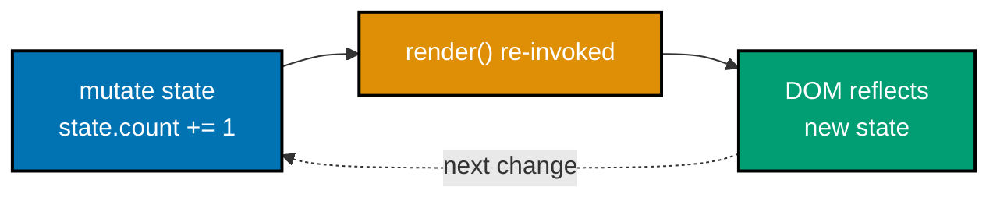

**`learning/code/ex-44-state-change-triggers-render/index.html`**

```html
<!doctype html>
<!-- => triggers standards mode -->
<html lang="en">
  <!-- => lang="en" declares the document language for assistive tech -->
  <head>
    <!-- => begins document metadata, not rendered content -->
    <meta charset="utf-8" />
    <!-- => declares UTF-8 encoding -->
    <meta name="viewport" content="width=device-width, initial-scale=1" />
    <!-- => matches viewport to device width at 1x zoom -->
    <title>Example 44: State Change Triggers Render</title>
    <!-- => sets only the browser tab title -->
  </head>
  <!-- => end of document metadata -->
  <body>
    <!-- => begin visible page content -->
    <div id="app"></div>
    <!-- => the only DOM node render() ever writes to -->
    <!-- => nothing here changes when count changes -- only re-running render() ever updates it -->
    <!-- => begins this example's JavaScript -->
    <script>
      const state = { count: 0 }; // => the single source of truth; nothing else tracks the count separately
      function render() {
        // => takes no arguments -- it always reads the shared state variable directly
        const app = document.getElementById("app"); // => the one DOM node this function is allowed to write to
        app.innerHTML = ""; // => clears the PREVIOUS render before rebuilding from the current state
        const p = document.createElement("p"); // => a fresh element, built from scratch on every render
        p.id = "count"; // => gives the element a stable id so verify.mjs can find it after any re-render
        p.textContent = "count: " + state.count; // => always reads the CURRENT state.count, never a stale copy
        app.append(p); // => the ONLY place this element is ever attached to the page
      } // => end of render()
      window.__bump = function () {
        // => a test hook that performs the full "mutate then render" cycle
        state.count += 1; // => step 1: mutate the state object directly
        render(); // => step 2: re-invoke render() so the DOM catches up to the new state
      }; // => end of __bump -- notice no code anywhere else ever touches the DOM directly
      render(); // => the initial render, so the page shows count: 0 before any bump ever happens
      // => verify.mjs reads the rendered text once before calling __bump() and once after
    </script>
    <!-- => end of this example's JavaScript -->
  </body>
  <!-- => end of visible page content -->
</html>
```

**Run**: `node verify.mjs` (a small Playwright script colocated in `learning/code/ex-44-state-change-triggers-render/`)

**Output** (genuinely captured):

```text
before: count: 0 after mutate+render: count: 1
PASS: mutating state and re-invoking render() produced DOM reflecting the new state
```

**Key takeaway**: Mutating `state.count` and re-invoking `render()` updated the displayed count from 0 to 1, with no other code touching the DOM directly.

**Why it matters**: Every future example's "component" is exactly this pattern wrapped in a function: state plus a render step that runs again on every change. Frameworks like React, Vue, and Svelte all automate this exact cycle -- detecting a state change and scheduling a re-render -- but the underlying mechanism is precisely what this example demonstrates by hand: mutate, then explicitly call render again. A common pitfall when first learning frameworks is treating re-rendering as mysterious framework magic; seeing the raw mutate-then-render cycle here first makes the framework's automatic version easier to reason about once Example 45 wraps it into a component.

---

### Example 45: Counter Component

_ex-45 &middot; exercises co-20, co-18_

A vanilla counter component closes over its own local `count` variable and re-invokes its own `render` function on every click -- state and render, colocated in one function, with no external framework at all.

**`learning/code/ex-45-counter-component/index.html`**

```html
<!doctype html>
<!-- => triggers standards mode -->
<html lang="en">
  <!-- => lang="en" declares the document language for assistive tech -->
  <head>
    <!-- => begins document metadata, not rendered content -->
    <meta charset="utf-8" />
    <!-- => declares UTF-8 encoding -->
    <meta name="viewport" content="width=device-width, initial-scale=1" />
    <!-- => matches viewport to device width at 1x zoom -->
    <title>Example 45: Counter Component</title>
    <!-- => sets only the browser tab title -->
  </head>
  <!-- => end of document metadata -->
  <body>
    <!-- => begin visible page content -->
    <div id="app"></div>
    <!-- => the mount point; CounterComponent below owns everything inside it -->
    <!-- => nothing else on the page touches #app directly -- the component is fully self-contained -->
    <!-- => begins this example's JavaScript -->
    <script>
      function CounterComponent(root) {
        // => root is where this component mounts -- passed in, not hardcoded
        let count = 0; // => local state, CLOSED OVER by render() and the click handler below -- no globals
        // => no framework required: state (count) plus render is the entire component, in plain JS
        function render() {
          root.innerHTML = ""; // => clears the PREVIOUS button before rebuilding
          const button = document.createElement("button"); // => a fresh button, built from scratch each render
          button.id = "counter-btn"; // => a stable id so verify.mjs can find it across re-renders
          button.textContent = "Count: " + count; // => reads the CURRENT closed-over count value
          // => the button's text is always a direct reflection of count -- never edited independently
          button.addEventListener("click", () => {
            count += 1; // => step 1: mutate the closed-over local state
            render(); // => step 2: re-invoke render() -- the exact state+render cycle from Examples 43-44
          }); // => end of the click listener
          root.append(button); // => the ONLY place the button is ever attached
        } // => end of render()
        render(); // => the initial render, so the component shows Count: 0 before any click
      } // => end of CounterComponent
      CounterComponent(document.getElementById("app")); // => mounts one instance, with its own private count
      // => verify.mjs clicks #counter-btn twice, then reads its text -- proving real clicks drove real state
    </script>
    <!-- => end of this example's JavaScript -->
  </body>
  <!-- => end of visible page content -->
</html>
```

**Run**: `node verify.mjs` (a small Playwright script colocated in `learning/code/ex-45-counter-component/`)

**Output** (genuinely captured):

```text
counter text after two clicks: Count: 2
PASS: the counter component's state + re-render cycle incremented on each click
```

**Key takeaway**: Two real clicks moved the rendered count from 0 to 2, driven entirely by the component's own internal state and re-render cycle.

**Why it matters**: This is a complete, working component in roughly ten lines of vanilla JavaScript -- the state-plus-render pattern doesn't require a framework to demonstrate, only to scale. What a framework actually adds isn't the state-plus-render IDEA itself, but efficient DOM diffing, cross-component communication, and tooling that make the pattern practical once an application has hundreds of components instead of one. A common misconception is that "using a framework" and "understanding components" are the same skill; this example proves they're separable, and later examples on props (Example 46) and one-way data flow (Example 47) extend this same closure-based component shape further.

---

### Example 46: Props-Driven Component

_ex-46 &middot; exercises co-19_

A component is fundamentally a function that takes props in and returns markup out -- call it with different props, get different output, with no shared mutable state between calls.

**`learning/code/ex-46-props-driven-component/index.html`**

```html
<!doctype html>
<!-- => triggers standards mode -->
<html lang="en">
  <!-- => lang="en" declares the document language for assistive tech -->
  <head>
    <!-- => begins document metadata, not rendered content -->
    <meta charset="utf-8" />
    <!-- => declares UTF-8 encoding -->
    <meta name="viewport" content="width=device-width, initial-scale=1" />
    <!-- => matches viewport to device width at 1x zoom -->
    <title>Example 46: Props-Driven Component</title>
    <!-- => sets only the browser tab title -->
  </head>
  <!-- => end of document metadata -->
  <body>
    <!-- => begin visible page content -->
    <div id="a"></div>
    <!-- => will hold the FIRST call's output -->
    <div id="b"></div>
    <!-- => will hold the SECOND call's output, from the same function -->
    <!-- => begins this example's JavaScript -->
    <script>
      function Greeting(props) {
        // => a component is just a function that takes props in
        return "Hello, " + props.name + "!"; // => and returns markup/text out -- no shared state, no side effects
      } // => end of Greeting
      document.getElementById("a").textContent = Greeting({ name: "Ada" }); // => call #1, with one props object
      document.getElementById("b").textContent = Greeting({ name: "Grace" }); // => call #2, with a DIFFERENT props object
      // => same function, two independent calls -- neither call affects the other's result
      // => Greeting has no state of its own -- its entire output is a pure function of its props argument
    </script>
    <!-- => end of this example's JavaScript -->
  </body>
  <!-- => end of visible page content -->
</html>
```

**Run**: `node verify.mjs` (a small Playwright script colocated in `learning/code/ex-46-props-driven-component/`)

**Output** (genuinely captured):

```text
a: Hello, Ada! b: Hello, Grace!
PASS: the same Greeting function produced different output for different props
```

**Key takeaway**: The exact same `Greeting` function produced two genuinely different outputs for two different `name` props.

**Why it matters**: Treating a component as "just a function of its props" is what makes it trivially reusable -- render the same `Greeting` a hundred times with a hundred different names, and each call is fully independent. This "pure function of props" mental model is exactly what every major component framework builds its rendering system around, and it's what makes components composable: a parent can pass different props to the same child component without any risk of one instance's data leaking into another's. Example 47 pushes this further by proving the DATA FLOW is one-directional, not just that outputs differ per call.

---

### Example 47: One-Way Data Flow

_ex-47 &middot; exercises co-19, co-18_

Props flow strictly one way, parent to child -- a child can read and reflect what it receives, but nothing it does inside itself can reach back up and mutate the parent's own state.

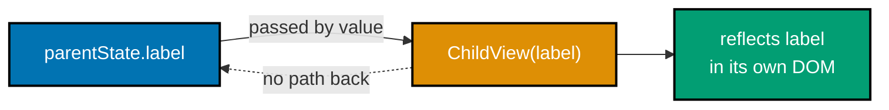

**`learning/code/ex-47-one-way-data-flow/index.html`**

```html
<!doctype html>
<!-- => triggers standards mode -->
<html lang="en">
  <!-- => lang="en" declares the document language for assistive tech -->
  <head>
    <!-- => begins document metadata, not rendered content -->
    <meta charset="utf-8" />
    <!-- => declares UTF-8 encoding -->
    <meta name="viewport" content="width=device-width, initial-scale=1" />
    <!-- => matches viewport to device width at 1x zoom -->
    <title>Example 47: One-Way Data Flow</title>
    <!-- => sets only the browser tab title -->
  </head>
  <!-- => end of document metadata -->
  <body>
    <!-- => begin visible page content -->
    <div id="app"></div>
    <!-- => the mount point; ChildView(...) below is appended into it -->
    <!-- => verify.mjs reads BOTH #child's rendered text AND the parent's real state afterward -->
    <!-- => begins this example's JavaScript -->
    <script>
      const parentState = { label: "from parent" }; // => the PARENT's own state -- the only source of truth
      function ChildView(label) {
        // label arrives as a primitive string -- a COPY, not a reference to
        // parentState itself, so nothing the child does here can reach back up
        const p = document.createElement("p"); // => a fresh element the child builds for itself
        p.id = "child";
        p.textContent = label; // => reflects whatever label the parent passed in, unmodified
        label = "mutated locally"; // reassigns only this local copy
        return p; // => hands the built element back to the parent; the child never touches parentState directly
      } // => end of ChildView
      document.getElementById("app").append(ChildView(parentState.label));
      // => parentState.label is passed BY VALUE (a string primitive), not by reference to the object
      // => if objects were passed instead, a child mutating a nested field COULD reach back into the parent
      window.__parentLabel = () => parentState.label; // => a test hook to read the parent's REAL state afterward
    </script>
    <!-- => end of this example's JavaScript -->
  </body>
  <!-- => end of visible page content -->
</html>
```

**Run**: `node verify.mjs` (a small Playwright script colocated in `learning/code/ex-47-one-way-data-flow/`)

**Output** (genuinely captured):

```text
child rendered text: from parent parent's own state afterward: from parent
PASS: child reflected the parent's data; the parent's own state was never mutated
```

**Key takeaway**: The child rendered the parent's data correctly, and the parent's own state was provably unchanged afterward, even though the child locally reassigned its own copy.

**Why it matters**: One-way data flow is what makes state changes traceable -- if child components could silently write back into parent state, tracking down WHERE a value actually changed would require reading every component, not just the one that owns the state. This is exactly why frameworks enforcing one-way flow (props down, events up) tend to be easier to debug at scale than ones allowing two-way binding: a bug hunt can always start at the ONE component that owns a given piece of state. Example 49's keyed list updates depend on this same discipline for reliably matching old and new render output.

---

### Example 48: Render List From Array

_ex-48 &middot; exercises co-21_

Mapping an array to DOM nodes -- one `<li>` per array element -- is the standard technique for rendering any list: the rendered count is always a direct function of the array's length.

**`learning/code/ex-48-render-list-from-array/index.html`**

```html
<!doctype html>
<!-- => triggers standards mode -->
<html lang="en">
  <!-- => lang="en" declares the document language for assistive tech -->
  <head>
    <!-- => begins document metadata, not rendered content -->
    <meta charset="utf-8" />
    <!-- => declares UTF-8 encoding -->
    <meta name="viewport" content="width=device-width, initial-scale=1" />
    <!-- => matches viewport to device width at 1x zoom -->
    <title>Example 48: Render List From Array</title>
    <!-- => sets only the browser tab title -->
  </head>
  <!-- => end of document metadata -->
  <body>
    <!-- => begin visible page content -->
    <ul id="list"></ul>
    <!-- => starts empty -- the forEach loop below is the only thing that fills it -->
    <!-- => no <li> is hand-authored anywhere in this file -->
    <!-- => begins this example's JavaScript -->
    <script>
      const items = ["Alpha", "Beta", "Gamma", "Delta", "Epsilon"]; // => the array driving the render below
      const list = document.getElementById("list"); // => the single container every rendered <li> is appended to
      items.forEach((label) => {
        // => runs once per array element -- 5 elements means 5 iterations
        const li = document.createElement("li"); // => a fresh <li>, built from scratch for THIS label
        li.textContent = label; // => one label per node -- no manual duplication
        list.append(li); // => appended immediately, so the rendered order matches the array order
      }); // => end of the forEach loop
      // => the rendered <li> count is a direct FUNCTION of items.length, not a fixed number
    </script>
    <!-- => end of this example's JavaScript -->
  </body>
  <!-- => end of visible page content -->
</html>
```

**Run**: `node verify.mjs` (a small Playwright script colocated in `learning/code/ex-48-render-list-from-array/`)

**Output** (genuinely captured):

```text
rendered <li> count: 5
PASS: mapping the 5-item array produced exactly 5 rendered <li> elements
```

**Key takeaway**: A 5-item source array produced exactly 5 rendered `<li>` elements.

**Why it matters**: This mapping technique scales to any array size without changing a single line -- the loop, not a fixed count, determines how many nodes appear. A common beginner mistake is hand-authoring a fixed number of `<li>` elements and then trying to hide or show them based on data length, which breaks once real data exceeds that fixed count. Because this loop derives its output purely from `items.length`, adding a sixth or sixtieth item to the source array requires no template changes at all -- Example 49 builds directly on this same array-to-DOM mapping, adding node reuse across re-renders.

---

### Example 49: Keyed List Update

_ex-49 &middot; exercises co-21, co-18_

Tracking each list item by a stable key (not its position) lets a re-render REUSE existing DOM nodes for unchanged items and update in place only the ones that actually changed.

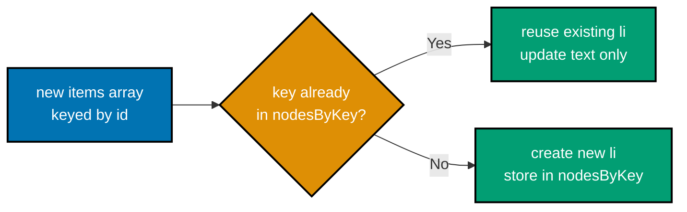

**`learning/code/ex-49-keyed-list-update/index.html`**

```html
<!doctype html>
<!-- => triggers standards mode -->
<html lang="en">
  <!-- => lang="en" declares the document language for assistive tech -->
  <head>
    <!-- => begins document metadata, not rendered content -->
    <meta charset="utf-8" />
    <!-- => declares UTF-8 encoding -->
    <meta name="viewport" content="width=device-width, initial-scale=1" />
    <!-- => matches viewport to device width at 1x zoom -->
    <title>Example 49: Keyed List Update</title>
    <!-- => sets only the browser tab title -->
  </head>
  <!-- => end of document metadata -->
  <body>
    <!-- => begin visible page content -->
    <ul id="list"></ul>
    <!-- => starts empty -- renderItems(...) below is the only thing that ever fills it -->
    <!-- => verify.mjs calls renderItems, __markUnchanged, __updateOne, then compares node IDENTITY, not just text -->
    <!-- => begins this example's JavaScript -->
    <script>
      const nodesByKey = new Map(); // => maps a stable item.id to the REAL <li> DOM node created for it
      function renderItems(items) {
        // => can be called MULTIPLE times, with different item arrays each time
        const list = document.getElementById("list"); // => the container every rendered node lives inside
        for (const item of items) {
          // => iterates the NEW data, one item at a time
          let li = nodesByKey.get(item.id); // => looks up whether this key already has a node
          if (!li) {
            // => only reached for a key seen for the FIRST time -- unchanged keys skip this whole block
            li = document.createElement("li"); // => a brand-new node, created only once per key
            li.dataset.key = String(item.id); // => stamps the key onto the node for debugging/inspection
            nodesByKey.set(item.id, li); // => remembers this node so future renders can find and reuse it
            list.append(li); // => attached to the DOM exactly once, the first time its key appears
          } // => end of the "create if missing" branch
          li.textContent = item.label; // => updates text on EVERY render, whether the node is new or reused
        } // => end of the items loop
      } // => end of renderItems
      renderItems([
        // => call #1 -- three brand-new keys, so three brand-new nodes are created
        { id: 1, label: "Alpha" }, // => first render: key 1 is new, so a fresh node is created
        { id: 2, label: "Beta" }, // => first render: key 2 is new, so a fresh node is created
        { id: 3, label: "Gamma" }, // => first render: key 3 is new, so a fresh node is created
      ]); // => end of the initial render call
      window.__markUnchanged = function () {
        // => a test hook, called between the two renderItems calls
        // tag the untouched nodes so we can prove they were reused, not recreated
        document.querySelectorAll("#list li").forEach((li) => (li.dataset.marked = "yes"));
        // => a test hook: stamps every CURRENT node so a later re-render can prove which nodes survived
      }; // => end of __markUnchanged
      window.__updateOne = function () {
        // => a test hook that triggers the SECOND render, with one label changed
        renderItems([
          // => call #2 -- reuses two nodes, updates the third node's text in place
          { id: 1, label: "Alpha" }, // => key 1 unchanged -- renderItems reuses its existing node
          { id: 2, label: "Beta (changed)" }, // => key 2's label changed -- same node, new textContent
          { id: 3, label: "Gamma" }, // => key 3 unchanged -- renderItems reuses its existing node
        ]); // => end of the second renderItems call
      }; // => end of __updateOne
    </script>
    <!-- => end of this example's JavaScript -->
  </body>
  <!-- => end of visible page content -->
</html>
```

**Run**: `node verify.mjs` (a small Playwright script colocated in `learning/code/ex-49-keyed-list-update/`)

**Output** (genuinely captured):

```text
after keyed update: [{"key":"1","text":"Alpha","reused":true},{"key":"2","text":"Beta (changed)","reused":true},{"key":"3","text":"Gamma","reused":true}]
PASS: every node was reused (same DOM node) and only item 2's text content changed
```

**Key takeaway**: Every node was reused (same DOM node, not recreated) across the re-render, and only the one item whose data changed had its text content updated.

**Why it matters**: Keyed updates are what make list re-renders efficient and preserve things like focus or scroll position on unrelated items -- recreating every node on every render would lose all of that. Naive re-rendering (clearing and rebuilding the entire list from scratch, as Example 48 does) is simple but destroys any state that lives on the DOM nodes themselves -- text selections, focus, CSS transition state, scroll position within a nested scrollable item. Every major UI framework's "reconciliation" or "diffing" algorithm is solving exactly this same problem: matching old and new render output by a stable key, leaving unrelated nodes untouched.

---

### Example 50: Controlled Text Input

_ex-50 &middot; exercises co-22_

A controlled input's displayed value always comes FROM state, and its `input` event writes changes BACK to that same state -- the two never drift apart because one drives the other.

**`learning/code/ex-50-controlled-text-input/index.html`**

```html
<!doctype html>
<!-- => triggers standards mode -->
<html lang="en">
  <!-- => lang="en" declares the document language for assistive tech -->
  <head>
    <!-- => begins document metadata, not rendered content -->
    <meta charset="utf-8" />
    <!-- => declares UTF-8 encoding -->
    <meta name="viewport" content="width=device-width, initial-scale=1" />
    <!-- => matches viewport to device width at 1x zoom -->
    <title>Example 50: Controlled Text Input</title>
    <!-- => sets only the browser tab title -->
  </head>
  <!-- => end of document metadata -->
  <body>
    <!-- => begin visible page content -->
    <input id="name" type="text" />
    <!-- => its displayed value is CONTROLLED by state.name below, not typed freely -->
    <p id="state-view"></p>
    <!-- => a live view of the state object, kept in sync by render() -->
    <!-- => "controlled" means state is the single source of truth for what the input displays -->
    <!-- => begins this example's JavaScript -->
    <script>
      const state = { name: "" }; // => the single source of truth the input's value is derived from
      const input = document.getElementById("name"); // => the real DOM input this example keeps in sync
      const view = document.getElementById("state-view"); // => a read-only reflection of state, for verification
      function render() {
        // => the single place that ever writes to the input's .value or the view's text
        input.value = state.name; // => the input's displayed value ALWAYS comes FROM state, never set elsewhere
        view.textContent = "state.name = " + JSON.stringify(state.name); // => shows the real current state value
      } // => end of render()
      input.addEventListener("input", () => {
        state.name = input.value; // => writes the user's keystroke BACK into state
        render(); // => re-syncs the input's value and the visible state view from that same state
      }); // => end of the "input" listener
      // => the input never holds a value the state object doesn't also know about -- the two never drift apart
      render(); // => initial render, so state and the empty input start in sync
      // => verify.mjs types into the real input, then reads BOTH input.value and state-view's text
    </script>
    <!-- => end of this example's JavaScript -->
  </body>
  <!-- => end of visible page content -->
</html>
```

**Run**: `node verify.mjs` (a small Playwright script colocated in `learning/code/ex-50-controlled-text-input/`)

**Output** (genuinely captured):

```text
input value: Grace Hopper state view: state.name = "Grace Hopper"
PASS: the controlled input's value and the state object stayed in sync
```

**Key takeaway**: After filling the input, both the input's own value and the state object's `name` field held the identical, in-sync text.

**Why it matters**: "Controlled" specifically means state is the single source of truth -- the input never holds a value the state object doesn't also know about. The alternative, an "uncontrolled" input left to manage its own value with no JavaScript involvement, is simpler for trivial forms but makes cross-field validation, formatting-as-you-type, or syncing the same value to multiple places much harder, because the DOM itself becomes the source of truth instead of an inspectable JavaScript object. Examples 51 and 52 apply this exact same controlled pattern to a checkbox and a select, proving it generalizes across every native form input type.

---

### Example 51: Controlled Checkbox

_ex-51 &middot; exercises co-22_

A controlled checkbox mirrors a boolean state field through its `checked` property, exactly the way a controlled text input mirrors a string through `value`.

**`learning/code/ex-51-controlled-checkbox/index.html`**

```html
<!doctype html>
<!-- => triggers standards mode -->
<html lang="en">
  <!-- => lang="en" declares the document language for assistive tech -->
  <head>
    <!-- => begins document metadata, not rendered content -->
    <meta charset="utf-8" />
    <!-- => declares UTF-8 encoding -->
    <meta name="viewport" content="width=device-width, initial-scale=1" />
    <!-- => matches viewport to device width at 1x zoom -->
    <title>Example 51: Controlled Checkbox</title>
    <!-- => sets only the browser tab title -->
  </head>
  <!-- => end of document metadata -->
  <body>
    <!-- => begin visible page content -->
    <label><input id="agree" type="checkbox" /> I agree</label>
    <!-- => wrapping the input makes the whole label clickable -->
    <p id="state-view">state.agreed = false</p>
    <!-- => a live view, kept in sync by the change listener below -->
    <!-- => a controlled checkbox mirrors a boolean field the same way a text input mirrors a string -->
    <!-- => begins this example's JavaScript -->
    <script>
      const state = { agreed: false }; // => the single source of truth this checkbox mirrors
      const box = document.getElementById("agree"); // => the real checkbox this example keeps in sync
      const view = document.getElementById("state-view"); // => a read-only reflection of state, for verification
      box.addEventListener("change", () => {
        // => fires when the user toggles the checkbox
        state.agreed = box.checked; // => mirrors the checkbox's real checked property INTO state
        view.textContent = "state.agreed = " + state.agreed; // => shows the real current state value
      }); // => end of the "change" listener
      // => same controlled-input shape as Example 50 -- only the mirrored property (checked, not value) differs
    </script>
    <!-- => end of this example's JavaScript -->
  </body>
  <!-- => end of visible page content -->
</html>
```

**Run**: `node verify.mjs` (a small Playwright script colocated in `learning/code/ex-51-controlled-checkbox/`)

**Output** (genuinely captured):

```text
checked: true state view: state.agreed = true
PASS: checking the box updated both the checked property and the state object
```

**Key takeaway**: Checking the box updated both the DOM's `checked` property and the state object's `agreed` field, together.

**Why it matters**: The controlled pattern is identical across input types (text, checkbox, select) -- only the specific property being mirrored (`value` vs. `checked`) changes. Recognizing this as ONE pattern with a small per-type variation, rather than memorizing separate approaches for text fields, checkboxes, radio buttons, and selects, is what makes building a larger, multi-field form (like the capstone's task form) tractable -- the same mutate-state-then-sync-DOM cycle from Example 50 applies unchanged. A subtle pitfall specific to checkboxes is mirroring `.value` instead of `.checked`, which silently reports the WRONG state, since a checkbox's `.value` attribute stays constant regardless of whether it's actually checked.

---

### Example 52: Controlled Select

_ex-52 &middot; exercises co-22_

A controlled `select` reads its current value from state and, on `change`, writes the newly chosen option back into that same state -- the third instance of the controlled-input pattern.

**`learning/code/ex-52-controlled-select/index.html`**

```html
<!doctype html>
<!-- => triggers standards mode -->
<html lang="en">
  <!-- => lang="en" declares the document language for assistive tech -->
  <head>
    <!-- => begins document metadata, not rendered content -->
    <meta charset="utf-8" />
    <!-- => declares UTF-8 encoding -->
    <meta name="viewport" content="width=device-width, initial-scale=1" />
    <!-- => matches viewport to device width at 1x zoom -->
    <title>Example 52: Controlled Select</title>
    <!-- => sets only the browser tab title -->
  </head>
  <!-- => end of document metadata -->
  <body>
    <!-- => begin visible page content -->
    <select id="color">
      <!-- => a THIRD controlled-input type, after text and checkbox -->
      <option value="red">Red</option>
      <!-- => matches state.color's initial value below -->
      <option value="green">Green</option>
      <!-- => an alternative the change listener below can select -->
      <option value="blue">Blue</option>
      <!-- => another alternative the change listener below can select -->
    </select>
    <!-- => end of the select element -->
    <p id="state-view">state.color = "red"</p>
    <!-- => a live view, kept in sync by the change listener below -->
    <!-- => begins this example's JavaScript -->
    <script>
      const state = { color: "red" }; // => the single source of truth this select mirrors
      const select = document.getElementById("color"); // => the real <select> this example keeps in sync
      const view = document.getElementById("state-view"); // => a read-only reflection of state, for verification
      select.addEventListener("change", () => {
        // => fires when the user picks a different option
        state.color = select.value; // => mirrors the select's real chosen value INTO state
        view.textContent = 'state.color = "' + state.color + '"'; // => shows the real current state value
      }); // => end of the "change" listener
      // => the pattern is now recognizable: state drives display, the event writes back -- same as Examples 50-51
      // => verify.mjs selects "blue" on the real <select>, then reads state-view's text
    </script>
    <!-- => end of this example's JavaScript -->
  </body>
  <!-- => end of visible page content -->
</html>
```

**Run**: `node verify.mjs` (a small Playwright script colocated in `learning/code/ex-52-controlled-select/`)

**Output** (genuinely captured):

```text
state view after selecting blue: state.color = "blue"
PASS: selecting an option updated the controlling state object to match
```

**Key takeaway**: Selecting a new option updated the controlling state object to match the chosen value exactly.

**Why it matters**: By now the pattern should be fully recognizable: state drives the displayed value, the change event writes back -- the same shape as Examples 50 and 51, just applied to a `select`. Seeing the identical shape play out a third time across three genuinely different native input types is the point: it demonstrates that "controlled input" is a general technique, not a text-input-specific trick, and the capstone project leans on that same generality for its multi-field task form later in this curriculum. A `select`'s `change` event, unlike `input`, only fires once a new option is committed.

---

### Example 53: Required Field Validation

_ex-53 &middot; exercises co-23_

The Constraint Validation API's `checkValidity()` evaluates HTML validation attributes like `required` directly, with no custom validation code needed for the basic case.

**`learning/code/ex-53-required-field-validation/index.html`**

```html
<!doctype html>
<!-- => triggers standards mode -->
<html lang="en">
  <!-- => lang="en" declares the document language for assistive tech -->
  <head>
    <!-- => begins document metadata, not rendered content -->
    <meta charset="utf-8" />
    <!-- => declares UTF-8 encoding -->
    <meta name="viewport" content="width=device-width, initial-scale=1" />
    <!-- => matches viewport to device width at 1x zoom -->
    <title>Example 53: Required Field Validation</title>
    <!-- => sets only the browser tab title -->
  </head>
  <!-- => end of document metadata -->
  <body>
    <!-- => begin visible page content -->
    <input id="email" type="email" required />
    <!-- => "required" alone is enough -- no JavaScript validation code is written anywhere in this file -->
    <!-- => the browser's built-in Constraint Validation API evaluates this attribute automatically -->
    <!-- => verify.mjs calls checkValidity() while empty, then again after filling in a real email -->
  </body>
  <!-- => end of visible page content -->
</html>
```

**Run**: `node verify.mjs` (a small Playwright script colocated in `learning/code/ex-53-required-field-validation/`)

**Output** (genuinely captured):

```text
valid while empty: false valid once filled: true
PASS: checkValidity() correctly reported invalid-then-valid as the field was filled
```

**Key takeaway**: An empty required field reported invalid; the same field, once filled with a real email, reported valid.

**Why it matters**: `checkValidity()` is built into every form element -- it's the platform doing basic validation work for free, before any custom JavaScript validation logic is even needed. A common anti-pattern is reimplementing "is this field empty" checks by hand in JavaScript, duplicating logic the browser already provides natively and often getting edge cases (like whitespace-only input) subtly wrong. Relying on the Constraint Validation API first, and reaching for custom JavaScript only for rules the platform genuinely cannot express (as Example 55's cross-field password match does), keeps validation logic minimal and consistent with what the browser's own accessible error UI expects.

---

### Example 54: Pattern Validation

_ex-54 &middot; exercises co-23_

The `pattern` attribute constrains an input's value to a regular expression -- `checkValidity()` fails automatically when the current value doesn't match.

**`learning/code/ex-54-pattern-validation/index.html`**

```html
<!doctype html>
<!-- => triggers standards mode -->
<html lang="en">
  <!-- => lang="en" declares the document language for assistive tech -->
  <head>
    <!-- => begins document metadata, not rendered content -->
    <meta charset="utf-8" />
    <!-- => declares UTF-8 encoding -->
    <meta name="viewport" content="width=device-width, initial-scale=1" />
    <!-- => matches viewport to device width at 1x zoom -->
    <title>Example 54: Pattern Validation</title>
    <!-- => sets only the browser tab title -->
  </head>
  <!-- => end of document metadata -->
  <body>
    <!-- => begin visible page content -->
    <input id="code" type="text" pattern="[0-9]{4}" />
    <!-- => pattern is a regular expression the CURRENT value must fully match to be considered valid -->
    <!-- => [0-9]{4} means "exactly four digits" -- neither more nor fewer characters pass -->
    <!-- => verify.mjs calls checkValidity() for a non-matching value, then for a matching one -->
  </body>
  <!-- => end of visible page content -->
</html>
```

**Run**: `node verify.mjs` (a small Playwright script colocated in `learning/code/ex-54-pattern-validation/`)

**Output** (genuinely captured):

```text
valid for 'abcd': false valid for '1234': true
PASS: pattern="[0-9]{4}" rejected non-matching input and accepted matching input
```

**Key takeaway**: `"abcd"` failed the `[0-9]{4}` pattern; `"1234"` satisfied it -- both confirmed by `checkValidity()`, not by inspection.

**Why it matters**: `pattern` covers validation shapes `type="email"` or `required` alone can't express -- a 4-digit code, a specific format, anything a regular expression can describe. A frequent mistake is writing an overly strict or subtly wrong regular expression -- for instance, one that silently rejects valid international phone numbers or postal codes -- so `pattern` should be reserved for formats with a genuinely fixed, well-understood shape, not open-ended data. Because `pattern` integrates with the same Constraint Validation API as `required` (Example 53), a browser's built-in error UI and accessible messaging still work automatically, with no extra JavaScript required to wire it up.

---

### Example 55: Custom Validity Message

_ex-55 &middot; exercises co-23_

`setCustomValidity(message)` lets application logic (not just built-in attributes) mark a field invalid with a specific, custom message -- passing an empty string clears it again.

**`learning/code/ex-55-custom-validity-message/index.html`**

```html
<!doctype html>
<!-- => triggers standards mode -->
<html lang="en">
  <!-- => lang="en" declares the document language for assistive tech -->
  <head>
    <!-- => begins document metadata, not rendered content -->
    <meta charset="utf-8" />
    <!-- => declares UTF-8 encoding -->
    <meta name="viewport" content="width=device-width, initial-scale=1" />
    <!-- => matches viewport to device width at 1x zoom -->
    <title>Example 55: Custom Validity Message</title>
    <!-- => sets only the browser tab title -->
  </head>
  <!-- => end of document metadata -->
  <body>
    <!-- => begin visible page content -->
    <input id="confirm" type="text" />
    <!-- => the field being validated against the hidden password field below -->
    <input id="password" type="text" value="secret123" style="display: none" />
    <!-- => hidden, but still a real value in the DOM -- this example compares against it, not a hardcoded string -->
    <!-- => display: none only affects rendering -- .value still reads normally via JavaScript -->
    <!-- => begins this example's JavaScript -->
    <script>
      const confirmEl = document.getElementById("confirm"); // => the field whose validity this example controls
      const passwordEl = document.getElementById("password"); // => the value confirmEl must match to be valid
      confirmEl.addEventListener("input", () => {
        // => re-checks on every keystroke in the confirm field
        if (confirmEl.value !== passwordEl.value) {
          confirmEl.setCustomValidity("Passwords must match"); // => marks the field invalid with THIS message
          // => this message is EXACTLY what validationMessage reports until the mismatch is resolved
        } else {
          confirmEl.setCustomValidity(""); // => an EMPTY string clears any previously-set custom validity
        } // => end of the mismatch/match branch
      }); // => end of the "input" listener
      // => setCustomValidity plugs application logic into the SAME native validity system as required/pattern
      // => verify.mjs reads confirmEl.validationMessage directly for both the mismatch and the match case
    </script>
    <!-- => end of this example's JavaScript -->
  </body>
  <!-- => end of visible page content -->
</html>
```

**Run**: `node verify.mjs` (a small Playwright script colocated in `learning/code/ex-55-custom-validity-message/`)

**Output** (genuinely captured):

```text
validationMessage on mismatch: "Passwords must match"
validationMessage once matched: ""
PASS: setCustomValidity('Passwords must match') was the exact reported message
```

**Key takeaway**: The exact custom message, `"Passwords must match"`, was the real, reported `validationMessage` on a mismatch, and cleared to empty once the values matched.

**Why it matters**: This is how validation logic the platform can't express declaratively (like "these two fields must match") still plugs into the same native validity system as `required` and `pattern`. Cross-field rules -- password confirmation, "end date must be after start date," and similar comparisons -- can never be expressed by a single input's own HTML attributes, so `setCustomValidity` is the escape hatch for this class of problem. A common pitfall is forgetting to clear the custom validity with an empty string once the condition resolves, permanently locking the field invalid even after the user fixes it, as this example's else-branch shows.

---

### Example 56: Label-Input Association

_ex-56 &middot; exercises co-24_

`label[for="id"]` associates a label with an input sharing that `id` -- clicking anywhere on the label text focuses the associated input automatically, with zero JavaScript.

**`learning/code/ex-56-label-input-association/index.html`**

```html
<!doctype html>
<!-- => triggers standards mode -->
<html lang="en">
  <!-- => lang="en" declares the document language for assistive tech -->
  <head>
    <!-- => begins document metadata, not rendered content -->
    <meta charset="utf-8" />
    <!-- => declares UTF-8 encoding -->
    <meta name="viewport" content="width=device-width, initial-scale=1" />
    <!-- => matches viewport to device width at 1x zoom -->
    <title>Example 56: Label-Input Association</title>
    <!-- => sets only the browser tab title -->
  </head>
  <!-- => end of document metadata -->
  <body>
    <!-- => begin visible page content -->
    <label for="username">Username</label>
    <!-- => for="username" links this text to the input sharing that id -->
    <input id="username" type="text" />
    <!-- => the id the label above targets -->
    <!-- => no JavaScript is needed -- the browser wires clicking the label to focusing the input for free -->
    <!-- => verify.mjs clicks the label text, then checks document.activeElement -->
  </body>
  <!-- => end of visible page content -->
</html>
```

**Run**: `node verify.mjs` (a small Playwright script colocated in `learning/code/ex-56-label-input-association/`)

**Output** (genuinely captured):

```text
focused element id after clicking the label: username
PASS: label[for=username] correctly focused the #username input on click
```

**Key takeaway**: Clicking the label moved real keyboard focus to the `#username` input, confirmed by checking `document.activeElement`.

**Why it matters**: This association also gives the input its accessible name -- a screen reader announces "Username, edit text" instead of just "edit text", from this one `for`/`id` link. Without it, sighted users can still visually associate a label with its nearby input, but a screen reader user hears only a generic "edit text" with no indication of the field's purpose, and clicking the label no longer focuses the input. This link is one of the highest-value, lowest-effort accessibility fixes available -- Example 57 builds on it by attaching a SECOND piece of announced text for error messages.

---

### Example 57: aria-describedby Error

_ex-57 &middot; exercises co-24, co-25_

`aria-describedby="id"` links an input to a SECOND piece of text (beyond its label) that assistive technology also announces -- the standard way to attach an error or hint message accessibly.

**`learning/code/ex-57-aria-describedby-error/index.html`**

```html
<!doctype html>
<!-- => triggers standards mode -->
<html lang="en">
  <!-- => lang="en" declares the document language for assistive tech -->
  <head>
    <!-- => begins document metadata, not rendered content -->
    <meta charset="utf-8" />
    <!-- => declares UTF-8 encoding -->
    <meta name="viewport" content="width=device-width, initial-scale=1" />
    <!-- => matches viewport to device width at 1x zoom -->
    <title>Example 57: aria-describedby Error</title>
    <!-- => sets only the browser tab title -->
  </head>
  <!-- => end of document metadata -->
  <body>
    <!-- => begin visible page content -->
    <label for="age">Age</label>
    <!-- => gives the input its accessible NAME (Example 56) -->
    <input id="age" type="number" aria-describedby="age-error" />
    <!-- => links to a SECOND piece of announced text -->
    <p id="age-error">Enter a whole number of years</p>
    <!-- => the id aria-describedby points at -->
    <!-- => visual proximity alone means nothing to a screen reader -- this attribute is what wires it in -->
    <!-- => verify.mjs reads the input's computed accessible DESCRIPTION, not just nearby text -->
  </body>
  <!-- => end of visible page content -->
</html>
```

**Run**: `node verify.mjs` (a small Playwright script colocated in `learning/code/ex-57-aria-describedby-error/`)

**Output** (genuinely captured):

```text
accessible description text: Enter a whole number of years
PASS: aria-describedby wired the error paragraph in as the input's accessible description
```

**Key takeaway**: The accessible description resolved via `aria-describedby` matched the real error paragraph's text exactly.

**Why it matters**: A visually-adjacent error message means nothing to a screen reader unless it's wired in via `aria-describedby` -- proximity on screen is not the same as an accessible relationship. A common bug is placing an error or hint message next to a field visually and assuming that's sufficient, when a screen reader needs an explicit relationship attribute like `aria-describedby` to make that connection. Because the accessible NAME comes from `label` (Example 56) and the accessible DESCRIPTION comes from `aria-describedby`, a well-formed field can carry both, giving assistive technology the full context a sighted user gets for free.

---

### Example 58: Form Submit Handler

_ex-58 &middot; exercises co-22, co-16_

Handling `submit`, calling `preventDefault()`, and reading `FormData(form)` is the standard way to intercept a form and collect its real values in JavaScript instead of letting the browser navigate.

**`learning/code/ex-58-form-submit-handler/index.html`**

```html
<!doctype html>
<!-- => triggers standards mode -->
<html lang="en">
  <!-- => lang="en" declares the document language for assistive tech -->
  <head>
    <!-- => begins document metadata, not rendered content -->
    <meta charset="utf-8" />
    <!-- => declares UTF-8 encoding -->
    <meta name="viewport" content="width=device-width, initial-scale=1" />
    <!-- => matches viewport to device width at 1x zoom -->
    <title>Example 58: Form Submit Handler</title>
    <!-- => sets only the browser tab title -->
  </head>
  <!-- => end of document metadata -->
  <body>
    <!-- => begin visible page content -->
    <form id="signup">
      <!-- => the submit listener below intercepts this form's real submit event -->
      <input name="username" type="text" value="ada" />
      <!-- => name="username" is the key FormData reads it under -->
      <input name="email" type="email" value="ada@example.com" />
      <!-- => name="email" is the key FormData reads it under -->
      <button type="submit">Sign up</button>
      <!-- => triggers the form's submit event, handled below -->
    </form>
    <!-- => end of the signup form -->
    <p id="collected"></p>
    <!-- => starts empty; the submit handler below writes the collected data here -->
    <!-- => intercepting submit here means the page never actually navigates or reloads -->
    <!-- => begins this example's JavaScript -->
    <script>
      document.getElementById("signup").addEventListener("submit", (event) => {
        event.preventDefault(); // => cancels the browser's default full-page navigation on submit
        // => event.target is the real <form> element, exactly what FormData needs below
        const data = new FormData(event.target); // => reads whatever is CURRENTLY in the form's real inputs
        document.getElementById("collected").textContent = JSON.stringify(
          Object.fromEntries(data.entries()), // => converts FormData's entries into a plain, printable object
        ); // => end of the JSON.stringify call
      }); // => end of the "submit" listener
      // => no per-field "input" listeners are needed -- FormData reads every value at submit time
      // => verify.mjs clicks "Sign up" and reads #collected's text to confirm the real values were captured
    </script>
    <!-- => end of this example's JavaScript -->
  </body>
  <!-- => end of visible page content -->
</html>
```

**Run**: `node verify.mjs` (a small Playwright script colocated in `learning/code/ex-58-form-submit-handler/`)

**Output** (genuinely captured):

```text
collected data: {"username":"ada","email":"ada@example.com"}
PASS: the submit handler's collected data matched every real input value
```

**Key takeaway**: The collected `FormData` entries matched the real input values exactly, for every field in the form.

**Why it matters**: `FormData` reads whatever is CURRENTLY in the form's real inputs at submit time -- it doesn't require each field to have a separate `input` listener wired up first. This is notably simpler than wiring every field as a controlled input (Examples 50-52) just to collect its value on submit -- for a plain "gather everything and send it" form, `FormData` avoids unnecessary per-field state and event-listener bookkeeping. A common pitfall is forgetting `event.preventDefault()`, which lets the browser navigate away before the submit handler's own logic ever finishes running.

---

### Example 59: aria-role Button

_ex-59 &middot; exercises co-25_

`role="button"` tells assistive technology to treat a non-button element as a button in the accessibility tree -- though (as Example 62 shows) the role alone adds no keyboard behavior.

**`learning/code/ex-59-aria-role-button/index.html`**

```html
<!doctype html>
<!-- => triggers standards mode -->
<html lang="en">
  <!-- => lang="en" declares the document language for assistive tech -->
  <head>
    <!-- => begins document metadata, not rendered content -->
    <meta charset="utf-8" />
    <!-- => declares UTF-8 encoding -->
    <meta name="viewport" content="width=device-width, initial-scale=1" />
    <!-- => matches viewport to device width at 1x zoom -->
    <title>Example 59: aria-role Button</title>
    <!-- => sets only the browser tab title -->
  </head>
  <!-- => end of document metadata -->
  <body>
    <!-- => begin visible page content -->
    <div id="fake-button" role="button" tabindex="0">Do the thing</div>
    <!-- => role="button" tells assistive tech to treat this <div> as a button in the accessibility tree -->
    <!-- => tabindex="0" makes it keyboard-focusable -- role alone would NOT add that -->
    <!-- => verify.mjs queries the accessibility tree by role, not by tag name, to confirm it's exposed -->
  </body>
  <!-- => end of visible page content -->
</html>
```

**Run**: `node verify.mjs` (a small Playwright script colocated in `learning/code/ex-59-aria-role-button/`)

**Output** (genuinely captured):

```text
elements exposing the button role: 1
PASS: role="button" exposed the <div> as a real button in the accessibility tree
```

**Key takeaway**: The `div` with `role="button"` was genuinely exposed with the button role in the accessibility tree, confirmed by role-based query.

**Why it matters**: Reaching for a real `<button>` (Example 76) is almost always better than `role="button"` on a `div` -- the role alone still needs manual keyboard handling and `tabindex`, which a real button gets for free. A `<div role="button">` announces correctly to a screen reader but does NOT respond to the Enter or Space keys the way a native `<button>` does, so keyboard-only users may see it but never activate it without extra JavaScript. This gap between "announces as a button" and "behaves like a button" is a common bug, and why `role="button"` should be a last resort, not a first choice.

---

### Example 60: aria-live Region

_ex-60 &middot; exercises co-25_

`aria-live="polite"` marks a region whose content changes are announced to assistive technology automatically, without the user needing to navigate to it -- ideal for status messages.

**`learning/code/ex-60-aria-live-region/index.html`**

```html
<!doctype html>
<!-- => triggers standards mode -->
<html lang="en">
  <!-- => lang="en" declares the document language for assistive tech -->
  <head>
    <!-- => begins document metadata, not rendered content -->
    <meta charset="utf-8" />
    <!-- => declares UTF-8 encoding -->
    <meta name="viewport" content="width=device-width, initial-scale=1" />
    <!-- => matches viewport to device width at 1x zoom -->
    <title>Example 60: aria-live Region</title>
    <!-- => sets only the browser tab title -->
  </head>
  <!-- => end of document metadata -->
  <body>
    <!-- => begin visible page content -->
    <button id="save">Save</button>
    <!-- => triggers the status update below when clicked -->
    <p id="status" aria-live="polite"></p>
    <!-- => content changes here are announced automatically -->
    <!-- => "polite" waits for the user's current activity to pause before announcing -->
    <!-- => begins this example's JavaScript -->
    <script>
      document.getElementById("save").addEventListener("click", () => {
        document.getElementById("status").textContent = "Saved successfully";
        // => this text change is what aria-live="polite" picks up and announces to assistive tech
      }); // => end of the "click" listener
      // => without aria-live, a screen reader user would need to navigate back to this exact spot to notice it
      // => verify.mjs reads #status's text before AND after clicking, to prove the update genuinely happened
    </script>
    <!-- => end of this example's JavaScript -->
  </body>
  <!-- => end of visible page content -->
</html>
```

**Run**: `node verify.mjs` (a small Playwright script colocated in `learning/code/ex-60-aria-live-region/`)

**Output** (genuinely captured):

```text
status before: "" status after save: "Saved successfully"
PASS: the aria-live="polite" region's content updated after the save action
```

**Key takeaway**: The live region started empty and updated to the real status text the instant the triggering action ran.

**Why it matters**: Without `aria-live`, a screen reader user would have no way to know a status message appeared unless they happened to navigate back to that exact spot. This gap is especially damaging for save confirmations, form errors, or loading states -- transient feedback sighted users notice instantly but that silently disappears for anyone not focused on that part of the page. `aria-live="polite"` waits for a natural pause before interrupting, while the stricter `aria-live="assertive"` interrupts immediately; choosing "polite" here respects the user's current activity instead of abruptly cutting it off.

&larr; Previous: [Beginner Examples](./beginner.md) &middot; Next: [Advanced Examples](./advanced.md) &rarr;
