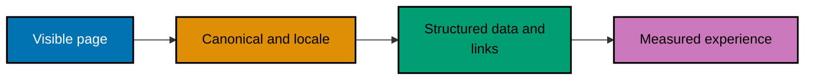

## Make the public surface coherent

Advanced implementation is consistency across localized versions, redirect behavior, structured data, links, and evidence from measurement.

### Public-Page Consistency Flow



### Example 39: Model an Article in JSON-LD

_ex-39 · exercises co-20_

**Brief explanation**: Article JSON-LD states a visible article subject in machine-readable form.

**Artifact**: [article.json](./code/ex-39-jsonld-article/article.json)

```json
{
  "@context": "https://schema.org",
  "@type": "Article",
  "headline": "Semantic HTML guide",
  "datePublished": "2026-07-31"
}
```

**Verify**: Parse the JSON and confirm @type is Article.

**Key takeaway**: Structured data must describe visible content.

**Why it matters**: Reliable discovery depends on the visible page and its technical signals agreeing. This example is deliberately small enough to inspect, validate, and compare with a rendered page before a change reaches a public URL. That discipline prevents a technically valid but misleading implementation.

### Example 40: Model a Breadcrumb Trail

_ex-40 · exercises co-20_

**Brief explanation**: Breadcrumb markup expresses the same hierarchy a reader sees.

**Artifact**: [breadcrumb.json](./code/ex-40-jsonld-breadcrumb/breadcrumb.json)

```json
{
  "@context": "https://schema.org",
  "@type": "BreadcrumbList",
  "itemListElement": [{ "@type": "ListItem", "position": 1, "name": "Guides", "item": "https://example.test/guides" }]
}
```

**Verify**: Confirm name and URL agree with the navigation hierarchy.

**Key takeaway**: A breadcrumb is structure, not a keyword list.

**Why it matters**: Reliable discovery depends on the visible page and its technical signals agreeing. This example is deliberately small enough to inspect, validate, and compare with a rendered page before a change reaches a public URL. That discipline prevents a technically valid but misleading implementation.

### Example 41: Model a Product Offer

_ex-41 · exercises co-20_

**Brief explanation**: Product JSON-LD must include an honest product and offer description.

**Artifact**: [product.json](./code/ex-41-jsonld-product/product.json)

```json
{
  "@context": "https://schema.org",
  "@type": "Product",
  "name": "Example planner",
  "offers": { "@type": "Offer", "price": "29.00", "priceCurrency": "USD" }
}
```

**Verify**: Confirm product name, price, and currency exist.

**Key takeaway**: Only mark up facts shown and maintained on the page.

**Why it matters**: Reliable discovery depends on the visible page and its technical signals agreeing. This example is deliberately small enough to inspect, validate, and compare with a rendered page before a change reaches a public URL. That discipline prevents a technically valid but misleading implementation.

### Example 42: Keep JSON-LD Aligned with a Page

_ex-42 · exercises co-20_

**Brief explanation**: Structured data must not drift from its visible source.

**Artifact**: [decision.md](./code/ex-42-jsonld-matches-page/decision.md)

```text
Visible heading: Semantic HTML guide. JSON-LD headline: Semantic HTML guide.
```

**Verify**: Compare the visible heading with the JSON-LD value.

**Key takeaway**: Honesty prevents misleading machine-readable claims.

**Why it matters**: Reliable discovery depends on the visible page and its technical signals agreeing. This example is deliberately small enough to inspect, validate, and compare with a rendered page before a change reaches a public URL. That discipline prevents a technically valid but misleading implementation.

### Example 43: Validate Rich-Result Eligibility

_ex-43 · exercises co-20_

**Brief explanation**: Validation finds syntax and property errors before publication.

**Artifact**: [decision.md](./code/ex-43-rich-results-validate/decision.md)

```text
Validation checklist: valid JSON, recognized type, required properties, values match visible content.
```

**Verify**: Confirm all four checks are present.

**Key takeaway**: Validation improves markup quality; it does not promise a rich result.

**Why it matters**: Reliable discovery depends on the visible page and its technical signals agreeing. This example is deliberately small enough to inspect, validate, and compare with a rendered page before a change reaches a public URL. That discipline prevents a technically valid but misleading implementation.

### Example 44: Link Alternate Locales Both Ways

_ex-44 · exercises co-23_

**Brief explanation**: Each language variant identifies the complete alternate set, including itself.

**Artifact**: [page.html](./code/ex-44-hreflang-bidirectional/page.html)

```html
<!doctype html>
<html lang="en">
  <head>
    <link rel="alternate" hreflang="en" href="https://example.test/en/guide" />
    <link rel="alternate" hreflang="id" href="https://example.test/id/panduan" />
  </head>
  <body>
    <main><h1>Guide</h1></main>
  </body>
</html>
```

**Verify**: Confirm every locale page carries reciprocal links.

**Key takeaway**: Hreflang is a relationship among equivalent localized pages.

**Why it matters**: Reliable discovery depends on the visible page and its technical signals agreeing. This example is deliberately small enough to inspect, validate, and compare with a rendered page before a change reaches a public URL. That discipline prevents a technically valid but misleading implementation.

### Example 45: Provide an x-default Fallback

_ex-45 · exercises co-23_

**Brief explanation**: x-default gives unmatched visitors a deliberate fallback.

**Artifact**: [page.html](./code/ex-45-hreflang-x-default/page.html)

```html
<!doctype html>
<html lang="en">
  <head>
    <link rel="alternate" hreflang="x-default" href="https://example.test/guide" />
  </head>
  <body>
    <main><h1>Choose a language</h1></main>
  </body>
</html>
```

**Verify**: Confirm the fallback URL is declared with x-default.

**Key takeaway**: A fallback should help people choose, not silently mislabel content.

**Why it matters**: Reliable discovery depends on the visible page and its technical signals agreeing. This example is deliberately small enough to inspect, validate, and compare with a rendered page before a change reaches a public URL. That discipline prevents a technically valid but misleading implementation.

### Example 46: Redirect a Moved Resource with 301

_ex-46 · exercises co-24_

**Brief explanation**: A permanent redirect communicates that a URL has moved for good.

**Artifact**: [headers.txt](./code/ex-46-redirect-301/headers.txt)

```text
HTTP/1.1 301 Moved Permanently Location: https://example.test/guides/semantic-html
```

**Verify**: Confirm the status is 301 and the destination is canonical.

**Key takeaway**: Permanent migrations preserve user routes and consolidate signals.

**Why it matters**: Reliable discovery depends on the visible page and its technical signals agreeing. This example is deliberately small enough to inspect, validate, and compare with a rendered page before a change reaches a public URL. That discipline prevents a technically valid but misleading implementation.

### Example 47: Choose 302 for a Temporary Move

_ex-47 · exercises co-24_

**Brief explanation**: Redirect status tells clients and crawlers the intended duration.

**Artifact**: [decision.md](./code/ex-47-redirect-302-vs-301/decision.md)

```text
302 is temporary; 301 is permanent. Use 302 for a short campaign or maintenance route that will return.
```

**Verify**: Identify the case that should return to its original URL.

**Key takeaway**: Do not use permanent redirects for temporary experiments.

**Why it matters**: Reliable discovery depends on the visible page and its technical signals agreeing. This example is deliberately small enough to inspect, validate, and compare with a rendered page before a change reaches a public URL. That discipline prevents a technically valid but misleading implementation.

### Example 48: Preserve a Method with 308

_ex-48 · exercises co-24_

**Brief explanation**: A 308 permanent redirect preserves the HTTP method and request body.

**Artifact**: [verify.mjs](./code/ex-48-redirect-308-method/verify.mjs) and
[headers.txt](./code/ex-48-redirect-308-method/headers.txt)

```text
node verify.mjs
```

**Verify**: Run `node verify.mjs`; it follows a local 308 and asserts that the target receives a POST.

**Key takeaway**: Method preservation matters for non-idempotent request flows.

**Why it matters**: Reliable discovery depends on the visible page and its technical signals agreeing. This example is deliberately small enough to inspect, validate, and compare with a rendered page before a change reaches a public URL. That discipline prevents a technically valid but misleading implementation.

### Example 49: Measure Core Web Vitals

_ex-49 · exercises co-25_

**Brief explanation**: LCP, INP, and CLS measure complementary user experience outcomes.

**Artifact**: [metrics.json](./code/ex-49-cwv-measure-seo/metrics.json)

```json
{ "lcpMs": 2100, "inpMs": 140, "cls": 0.03, "source": "field-like test sample" }
```

**Verify**: Parse the metrics and confirm all three values exist.

**Key takeaway**: Page experience is one signal among many, not a substitute for content.

**Why it matters**: Reliable discovery depends on the visible page and its technical signals agreeing. This example is deliberately small enough to inspect, validate, and compare with a rendered page before a change reaches a public URL. That discipline prevents a technically valid but misleading implementation.

### Example 50: Write Descriptive Internal Links

_ex-50 · exercises co-26_

**Brief explanation**: Anchor text should predict the target page for people and crawlers.

**Artifact**: [page.html](./code/ex-50-internal-linking-anchor/page.html)

```html
<!doctype html>
<html lang="en">
  <body>
    <main>
      <h1>Guides</h1>
      <a href="/guides/semantic-html">Read the semantic HTML guide</a>
    </main>
  </body>
</html>
```

**Verify**: Confirm the link names its destination.

**Key takeaway**: Descriptive links improve navigation and contextual relationships.

**Why it matters**: Reliable discovery depends on the visible page and its technical signals agreeing. This example is deliberately small enough to inspect, validate, and compare with a rendered page before a change reaches a public URL. That discipline prevents a technically valid but misleading implementation.

### Example 51: Explain a Link Graph

_ex-51 · exercises co-26_

**Brief explanation**: Internal links form meaningful paths through a site graph.

**Artifact**: [decision.md](./code/ex-51-pagerank-annotate/decision.md)

```text
Guide A links to Guide B; the graph lets a search system infer that B is a related destination. Link relevance and quality matter; links are not votes to manufacture.
```

**Verify**: Confirm the graph idea and its anti-manipulation caveat.

**Key takeaway**: Build links for discovery, not artificial authority.

**Why it matters**: Reliable discovery depends on the visible page and its technical signals agreeing. This example is deliberately small enough to inspect, validate, and compare with a rendered page before a change reaches a public URL. That discipline prevents a technically valid but misleading implementation.

### Example 52: Compare Search Console and Lighthouse

_ex-52 · exercises co-28_

**Brief explanation**: Measurement tools observe different layers and timescales.

**Artifact**: [decision.md](./code/ex-52-search-console-lighthouse/decision.md)

```text
Record one public URL in Search Console and run a Lighthouse SEO audit for that same URL. Compare findings, dates, and environment before drawing conclusions.
```

**Verify**: Confirm both tools name the same URL.

**Key takeaway**: A report is evidence to investigate, not a substitute for judgment.

**Why it matters**: Reliable discovery depends on the visible page and its technical signals agreeing. This example is deliberately small enough to inspect, validate, and compare with a rendered page before a change reaches a public URL. That discipline prevents a technically valid but misleading implementation.

### Example 53: Assemble a Discoverable Site

_ex-53 · exercises co-05, co-08, co-11, co-15, co-20, co-25_

**Brief explanation**: A discoverable public site requires layers that agree with one another.

**Artifact**: [checklist.md](./code/ex-53-seo-capstone/checklist.md)

```md
Taxonomy, semantic HTML, sitemap, robots policy, canonical URL, JSON-LD, and Core Web Vitals measurement are all checked together.
```

**Verify**: Confirm every layer appears in the capstone checklist.

**Key takeaway**: End-to-end consistency is the durable SEO strategy.

**Why it matters**: Reliable discovery depends on the visible page and its technical signals agreeing. This example is deliberately small enough to inspect, validate, and compare with a rendered page before a change reaches a public URL. That discipline prevents a technically valid but misleading implementation.
