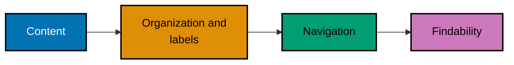

## Structure is shared meaning

These examples make the same content legible to a reader, a crawler, and assistive technology. The
linked artifact for each example is deliberately local: inspect it first, then serve or validate it
without publishing a page.

### Information Architecture Flow



### Semantic Page Flow


### Example 1: Name the Four IA Systems

_ex-01 · exercises co-01_

**Brief explanation**: Information architecture connects organization, labeling, navigation, and search.
The artifact identifies all four systems in one small documentation site map.

**Artifact**: [decision.md](./code/ex-01-four-systems/decision.md)

```text
# => Organization groups the content.
documentation -> guides
# => Labels, navigation, and search expose the group.
```

**Verify**: Confirm all four systems appear in the artifact.

**Key takeaway**: IA is the set of structures that makes content understandable and findable.

**Why it matters**: A site can have useful pages and still make them hard to discover if categories,
names, and navigation disagree. Naming the systems separates a content problem from a visual-design
problem, so teams can test each structure and make a stable, reviewable improvement.

### Example 2: Prefer Information Scent

_ex-02 · exercises co-02_

**Brief explanation**: A navigation label should predict its destination. Compare a descriptive label
with an opaque one before asking a reader to choose.

**Artifact**: [decision.md](./code/ex-02-information-scent/decision.md)

```text
# => Strong scent tells the reader what follows.
API Reference -> endpoints and request formats
# => Opaque scent hides the destination.
```

**Verify**: Confirm the descriptive label predicts its destination.

**Key takeaway**: Labels carry information scent when they help a reader predict the next page.

**Why it matters**: Readers decide whether to follow a link before they see the destination. Honest
labels reduce backtracking, support internal search, and make analytics about navigation meaningful
because a click represents an understandable expectation rather than a guess.

### Example 3: Run an Open Card Sort

_ex-03 · exercises co-03_

**Brief explanation**: In an open card sort, participants create the category names as they group
content cards. The artifact records the resulting user-created groups.

**Artifact**: [decision.md](./code/ex-03-open-card-sort/decision.md)

```text
# => Participants create this category name.
Deployments: [rollback, release, monitoring]
# => No predefined bucket constrained the grouping.
```

**Verify**: Confirm categories emerge from participants rather than a fixed menu.

**Key takeaway**: Open card sorting generates taxonomy candidates from a participant mental model.

**Why it matters**: A team’s internal vocabulary can differ from the vocabulary people use to find
information. Recording participant-created groups exposes that mismatch early, before a deep URL and
navigation hierarchy makes a locally intuitive label expensive to change.

### Example 4: Run a Closed Card Sort

_ex-04 · exercises co-03_

**Brief explanation**: A closed card sort gives participants fixed categories and tests where they
would place each content card. It evaluates labels and grouping rules already under consideration.

**Artifact**: [decision.md](./code/ex-04-closed-card-sort/decision.md)

```text
# => The bucket is predefined before the participant sorts.
Operations: [rollback]
# => Every card must choose an available bucket.
```

**Verify**: Confirm every card is placed in a predefined category.

**Key takeaway**: Closed card sorting evaluates a proposed taxonomy instead of generating one.

**Why it matters**: A stable navigation proposal still needs evidence that its labels match user
expectations. Closed sorting makes ambiguity measurable, highlights cards that repeatedly land in a
different bucket, and gives a team a concrete reason to refine names or boundaries.

### Example 5: Tree-Test a Hierarchy

_ex-05 · exercises co-04_

**Brief explanation**: Tree testing asks participants to locate an item in a hierarchy without visual
design distractions. The artifact records the chosen path and whether it reached the expected node.

**Artifact**: [decision.md](./code/ex-05-tree-test/decision.md)

```text
# => The task begins at the hierarchy root.
Docs -> Operations -> Rollback
# => Success records the expected destination.
```

**Verify**: Confirm success or failure is recorded for each tested item.

**Key takeaway**: Tree testing evaluates whether a proposed hierarchy supports findability.

**Why it matters**: Attractive page design can mask a confusing category structure. Testing the bare
tree isolates information architecture, shows which branches mislead people, and protects a team from
polishing visual navigation before the underlying destination logic works.

### Example 6: Design a Shallow Taxonomy

_ex-06 · exercises co-05_

**Brief explanation**: A small documentation taxonomy groups related content without creating needless
depth. The artifact keeps a guide close to the category that explains its purpose.

**Artifact**: [decision.md](./code/ex-06-taxonomy/decision.md)

```text
# => Related operations remain in one category.
Operations -> Deploy -> Rollback guide
# => The depth stays understandable.
```

**Verify**: Confirm related content groups together without an unnecessary level.

**Key takeaway**: Taxonomy is a maintainable grouping and labeling contract.

**Why it matters**: Every additional category level makes navigation and URLs harder to change later.
A shallow truthful taxonomy gives contributors a predictable home for new content while still giving
readers enough structure to distinguish adjacent topics quickly.

### Example 7: Use Hyphens in URLs

_ex-07 · exercises co-06_

**Brief explanation**: Readable URL words use hyphens as separators. The artifact compares a
hyphenated public path with an underscore variant.

**Artifact**: [decision.md](./code/ex-07-url-hyphens/decision.md)

```text
# => Hyphens separate readable URL words.
/guides/release-notes
# => Underscores are not the preferred word separator.
```

**Verify**: Confirm the selected path uses hyphens.

**Key takeaway**: Hyphenated URL words are a clear, search-documentation-supported convention.

**Why it matters**: URLs are copied into browsers, messages, logs, and documentation. A readable
separator makes the path legible in every surface, avoids an avoidable crawler interpretation concern,
and gives a content system one durable naming rule for future pages.

### Example 8: Replace an Opaque URL

_ex-08 · exercises co-06_

**Brief explanation**: A public URL should communicate the page subject without an opaque query ID.
The artifact maps one implementation identifier to a human-legible slug.

**Artifact**: [decision.md](./code/ex-08-url-readable/decision.md)

```text
# => The readable path names the content.
/guides/rollback-a-release
# => The opaque ID does not describe its destination.
```

**Verify**: Confirm the replacement path explains the destination in words.

**Key takeaway**: Public URLs should express stable human-readable meaning.

**Why it matters**: A reader should be able to assess a link before opening it, and a maintainer
should be able to recognize a path in logs or analytics. Meaningful slugs also reduce accidental URL
duplication that otherwise needs later canonicalization and redirect work.

### Example 9: Mirror Taxonomy in a URL

_ex-09 · exercises co-06_

**Brief explanation**: A hierarchical path can mirror a stable content taxonomy. The artifact maps
one guide through its section and subsection.

**Artifact**: [decision.md](./code/ex-09-url-hierarchy/decision.md)

```text
# => Each segment states a taxonomy level.
/operations/deployments/rollback
# => The page lives where navigation suggests.
```

**Verify**: Confirm the URL path reflects the artifact taxonomy.

**Key takeaway**: A path hierarchy should agree with the content hierarchy a reader sees.

**Why it matters**: When navigation, breadcrumbs, and URLs disagree, readers cannot build a reliable
mental model of the site. One shared hierarchy makes links easier to predict, reduces duplicate paths,
and creates a stable basis for future sitemap and internal-linking decisions.

### Example 10: Preserve a Changed URL

_ex-10 · exercises co-07_

**Brief explanation**: A public URL change needs an explicit redirect from the old path to its
replacement. The artifact makes the old contract and new destination visible together.

**Artifact**: [redirects.txt](./code/ex-10-url-stability/redirects.txt)

```text
# => The old public path still has a destination.
/guides/release -> /guides/release-management
# => A redirect preserves existing links.
```

**Verify**: Confirm the old URL maps to the replacement URL.

**Key takeaway**: A URL is a public contract, so migration requires a redirect rather than a silent break.

**Why it matters**: Bookmarks, search results, and external links outlive a content reorganization.
Recording a redirect preserves the reader journey and lets crawler signals move with the content instead
of turning a harmless taxonomy improvement into a collection of dead links.

### Example 11: Replace Div Soup with Semantic HTML

_ex-11 · exercises co-08_

**Brief explanation**: Generic div containers reveal layout but not page meaning. The semantic artifact
uses elements that identify navigation, main content, and article content.

**Artifact**: [page.html](./code/ex-11-semantic-html/page.html)

```html
<!-- => nav labels the navigation region. -->
<nav aria-label="Primary">...</nav>
<!-- => main contains the page's primary content. -->
<main><article>...</article></main>
```

**Verify**: Confirm semantic landmarks replace the generic div roles.

**Key takeaway**: Semantic HTML gives multiple consumers one meaningful page structure.

**Why it matters**: A browser can render div soup, but a crawler and a screen reader lose the page
regions that help them interpret it. Semantic elements reduce duplicated ARIA work and keep the visual
layout free to change without changing the document’s structural meaning.

### Example 12: Add Page Landmarks

_ex-12 · exercises co-08_

**Brief explanation**: Landmarks divide a page into navigation, main content, article, and complementary
content. The artifact supplies a short semantic page with each region.

**Artifact**: [page.html](./code/ex-12-landmarks/page.html)

```html
<!-- => nav creates a navigation landmark. -->
<nav aria-label="Primary">...</nav>
<!-- => main and aside identify primary and complementary regions. -->
<main><article>...</article></main>
<aside>Related</aside>
```

**Verify**: Confirm each region has the intended landmark role.

**Key takeaway**: Landmarks make large pages navigable without depending on visual placement.

**Why it matters**: Landmark navigation lets assistive-technology users jump directly to a region,
while crawlers receive the same segmentation from the markup. A small investment in semantic regions
therefore improves both accessibility and machine legibility without inventing separate structures.

### Example 13: Build a Heading Outline

_ex-13 · exercises co-09, co-10_

**Brief explanation**: A document outline starts with a page topic, then nests sections in order.
The artifact uses h1, h2, and h3 without skipping a rank.

**Artifact**: [page.html](./code/ex-13-heading-outline/page.html)

```html
<!-- => h1 names the document subject. -->
<h1>Release management</h1>
<!-- => h2 and h3 nest related detail. -->
<h2>Rollback</h2>
<h3>Verify</h3>
```

**Verify**: Confirm the heading ranks increase one level at a time.

**Key takeaway**: Ordered headings form the machine-readable outline of a page.

**Why it matters**: A clear outline lets readers scan a long document and lets assistive technology
provide meaningful heading navigation. It also keeps authors from using heading size as styling, which
would make visual changes accidentally alter the logical structure of content.

### Example 14: Find a Heading-Skip Bug

_ex-14 · exercises co-09_

**Brief explanation**: Jumping directly from h1 to h3 omits an intermediate level in the outline.
The artifact marks the missing h2 and its corrected structure.

**Artifact**: [decision.md](./code/ex-14-heading-skip/decision.md)

```html
<!-- => h1 begins the document. -->
<h1>Operations</h1>
<!-- => h3 skips the required h2 level. -->
<h3>Rollback</h3>
```

**Verify**: Confirm the missing h2 is reported.

**Key takeaway**: Heading ranks should not skip levels in a document outline.

**Why it matters**: A heading skip can make the relationship between sections ambiguous to someone
navigating by structure rather than visual indentation. Detecting it in source review protects the
outline before a page reaches readers, crawlers, and assistive technology.

### Example 15: Keep One Descriptive H1

_ex-15 · exercises co-09_

**Brief explanation**: A public page generally benefits from one descriptive h1 matching its subject.
The artifact counts one h1 and uses h2 for its main sections.

**Artifact**: [page.html](./code/ex-15-single-h1/page.html)

```html
<!-- => One h1 states the page subject. -->
<h1>Release rollback guide</h1>
<!-- => h2 begins a subsection, not another page title. -->
<h2>Before you roll back</h2>
```

**Verify**: Confirm exactly one h1 is present.

**Key takeaway**: One descriptive h1 is a robust page-title best practice.

**Why it matters**: A consistent primary heading helps readers, search systems, and content authors
identify the page’s central subject. It also keeps a design component from accidentally producing
multiple competing page titles when visual sections are assembled together.

### Example 16: Write Alt Text by Image Role

_ex-16 · exercises co-27_

**Brief explanation**: Informative images need an equivalent text alternative, while decorative images
use an empty alt value. The artifact shows both roles in one semantic page.

**Artifact**: [page.html](./code/ex-16-alt-text/page.html)

```html
<!-- => The chart conveys content, so its alt describes the trend. -->

<!-- => The decorative flourish adds no content. -->

```

**Verify**: Confirm each alt value matches the image’s role.

**Key takeaway**: Text alternatives provide the equivalent purpose of non-text content.

**Why it matters**: Meaningful alt text gives a screen-reader user information that would otherwise
exist only as pixels, and it gives machines a truthful textual signal about image content. Decorative
images should stay silent so they do not interrupt navigation with irrelevant repetition.

### Example 17: Use the nav Landmark

_ex-17 · exercises co-08, co-27_

**Brief explanation**: The nav element has an implicit navigation role. A label distinguishes one
navigation region from another on a page with multiple menus.

**Artifact**: [page.html](./code/ex-17-navigation-landmark/page.html)

```html
<!-- => nav has the implicit navigation landmark role. -->
<nav aria-label="Documentation">...</nav>
<!-- => The label distinguishes this navigation region. -->
<main>Guide content</main>
```

**Verify**: Confirm accessibility tooling exposes the region as navigation.

**Key takeaway**: Native landmark elements convey roles without redundant custom ARIA roles.

**Why it matters**: Native semantics give browsers, crawlers, and assistive technology a consistent
contract. A meaningful landmark label lets a reader distinguish primary navigation from related links
without requiring visual location or an application-specific interaction pattern.

### Example 18: Inspect the Document Outline

_ex-18 · exercises co-10_

**Brief explanation**: Browser DevTools can expose the heading and accessibility structure rendered
from markup. The artifact provides a small page whose source and visible outline should agree.

**Artifact**: [decision.md](./code/ex-18-outline-devtools/decision.md)

```html
<!-- => Source establishes one page title and nested section. -->
<h1>Deployments</h1>
<h2>Rollback</h2>
<!-- => DevTools should expose the same outline. -->
<main><article>Procedure</article></main>
```

**Verify**: Inspect the served page and confirm DevTools matches the markup outline.

**Key takeaway**: The rendered accessibility tree is a practical check on authored semantic structure.

**Why it matters**: Source can look plausible while templates or client code change the rendered tree.
Inspecting the actual page closes that gap, gives a team evidence for semantic regressions, and connects
markup review to the experience received by readers and assistive technology.
