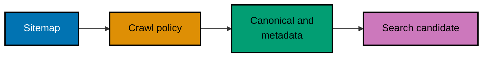

## Crawl, index, and describe public content

These examples expose the technical signals around a well-organized page. A crawler needs a reachable, consistent, honest version of the site.

### Discovery Signal Flow



### Example 19: Publish a Valid XML Sitemap

_ex-19 · exercises co-11_

**Brief explanation**: A sitemap declares canonical URLs a crawler can discover.

**Artifact**: [sitemap.xml](./code/ex-19-xml-sitemap/sitemap.xml)

```xml
<?xml version="1.0"?><urlset xmlns="http://www.sitemaps.org/schemas/sitemap/0.9"><url><loc>https://example.test/guides/semantic-html</loc><lastmod>2026-07-31</lastmod></url></urlset>
```

**Verify**: Parse the XML and confirm a loc element exists.

**Key takeaway**: A sitemap is a discovery aid, not an indexing guarantee.

**Why it matters**: Search systems combine technical signals with observed page content. This example makes one signal visible and testable, so a team can change it deliberately, compare it with the rest of the site, and avoid treating one tag or file as a substitute for coherent public content.

### Example 20: Respect Sitemap File Limits

_ex-20 · exercises co-11_

**Brief explanation**: A sitemap must stay within protocol limits.

**Artifact**: [decision.md](./code/ex-20-sitemap-limits/decision.md)

```md
A sitemap has at most 50,000 URLs and a 50 MB uncompressed size limit. Split larger collections and publish an index.
```

**Verify**: Confirm both protocol limits are stated.

**Key takeaway**: Large collections need partitioning, not oversized files.

**Why it matters**: Search systems combine technical signals with observed page content. This example makes one signal visible and testable, so a team can change it deliberately, compare it with the rest of the site, and avoid treating one tag or file as a substitute for coherent public content.

### Example 21: Group Files with a Sitemap Index

_ex-21 · exercises co-12_

**Brief explanation**: An index points crawlers at bounded child sitemaps.

**Artifact**: [sitemap-index.xml](./code/ex-21-sitemap-index/sitemap-index.xml)

```xml
<?xml version="1.0"?><sitemapindex xmlns="http://www.sitemaps.org/schemas/sitemap/0.9"><sitemap><loc>https://example.test/sitemaps/guides.xml</loc></sitemap></sitemapindex>
```

**Verify**: Parse the XML and confirm every child entry has loc.

**Key takeaway**: An index scales discovery while retaining validity.

**Why it matters**: Search systems combine technical signals with observed page content. This example makes one signal visible and testable, so a team can change it deliberately, compare it with the rest of the site, and avoid treating one tag or file as a substitute for coherent public content.

### Example 22: Set a Basic robots.txt Rule

_ex-22 · exercises co-13_

**Brief explanation**: robots.txt communicates crawl preferences at the site root.

**Artifact**: [robots.txt](./code/ex-22-robots-txt-basic/robots.txt)

```text
User-agent: * Disallow: /private/ Sitemap: https://example.test/sitemap.xml
```

**Verify**: Confirm the rule covers every crawler and only the private path.

**Key takeaway**: Crawl control is separate from index eligibility.

**Why it matters**: Search systems combine technical signals with observed page content. This example makes one signal visible and testable, so a team can change it deliberately, compare it with the rest of the site, and avoid treating one tag or file as a substitute for coherent public content.

### Example 23: Use Allow to Carve Out a Path

_ex-23 · exercises co-13_

**Brief explanation**: A specific Allow rule can keep one resource crawlable.

**Artifact**: [robots.txt](./code/ex-23-robots-txt-allow/robots.txt)

```text
User-agent: * Disallow: /downloads/ Allow: /downloads/public-guide.pdf
```

**Verify**: Confirm the allowed URL is more specific than the prefix.

**Key takeaway**: Keep crawler exceptions explicit and narrow.

**Why it matters**: Search systems combine technical signals with observed page content. This example makes one signal visible and testable, so a team can change it deliberately, compare it with the rest of the site, and avoid treating one tag or file as a substitute for coherent public content.

### Example 24: Handle an Unreachable robots.txt

_ex-24 · exercises co-13_

**Brief explanation**: Crawl-policy failure is an operational requirement.

**Artifact**: [decision.md](./code/ex-24-robots-unreachable-disallow/decision.md)

```md
RFC 9309 says a crawler must assume complete disallow when robots.txt is unreachable because of server errors.
```

**Verify**: Distinguish an unreachable file from a valid empty file.

**Key takeaway**: Availability of directives is public-site reliability.

**Why it matters**: Search systems combine technical signals with observed page content. This example makes one signal visible and testable, so a team can change it deliberately, compare it with the rest of the site, and avoid treating one tag or file as a substitute for coherent public content.

### Example 25: Keep a Page out of an Index

_ex-25 · exercises co-14_

**Brief explanation**: A meta robots directive applies index policy to HTML.

**Artifact**: [page.html](./code/ex-25-meta-robots-noindex/page.html)

```html
<!doctype html>
<html lang="en">
  <head>
    <meta charset="utf-8" />
    <meta name="robots" content="noindex" />
    <title>Preview</title>
  </head>
  <body>
    <main><h1>Private preview</h1></main>
  </body>
</html>
```

**Verify**: Inspect the head and find noindex.

**Key takeaway**: A crawler must fetch a page to read its directive.

**Why it matters**: Search systems combine technical signals with observed page content. This example makes one signal visible and testable, so a team can change it deliberately, compare it with the rest of the site, and avoid treating one tag or file as a substitute for coherent public content.

### Example 26: Send an X-Robots-Tag

_ex-26 · exercises co-14_

**Brief explanation**: An HTTP header applies policy to non-HTML resources.

**Artifact**: [headers.txt](./code/ex-26-x-robots-tag/headers.txt)

```text
HTTP/1.1 200 OK Content-Type: application/pdf X-Robots-Tag: noindex
```

**Verify**: Confirm it belongs to a PDF response.

**Key takeaway**: Use X-Robots-Tag when no HTML head exists.

**Why it matters**: Search systems combine technical signals with observed page content. This example makes one signal visible and testable, so a team can change it deliberately, compare it with the rest of the site, and avoid treating one tag or file as a substitute for coherent public content.

### Example 27: Declare a Canonical URL

_ex-27 · exercises co-15_

**Brief explanation**: A canonical link identifies a preferred representative URL.

**Artifact**: [page.html](./code/ex-27-canonical-tag/page.html)

```html
<!doctype html>
<html lang="en">
  <head>
    <meta charset="utf-8" />
    <link rel="canonical" href="https://example.test/guides/semantic-html" />
    <title>Semantic HTML</title>
  </head>
  <body>
    <main><h1>Semantic HTML</h1></main>
  </body>
</html>
```

**Verify**: Confirm it is absolute and points to the representative.

**Key takeaway**: Canonicalization needs consistent site signals.

**Why it matters**: Search systems combine technical signals with observed page content. This example makes one signal visible and testable, so a team can change it deliberately, compare it with the rest of the site, and avoid treating one tag or file as a substitute for coherent public content.

### Example 28: Consolidate a Duplicate URL

_ex-28 · exercises co-15_

**Brief explanation**: A duplicate view should nominate the same representative as its primary counterpart.

**Artifact**: [duplicate.html](./code/ex-28-canonical-duplicate/duplicate.html)

```html
<!doctype html>
<html lang="en">
  <head>
    <link rel="canonical" href="https://example.test/guides/semantic-html" />
  </head>
  <body>
    <main><h1>Semantic HTML print view</h1></main>
  </body>
</html>
```

**Verify**: Compare its canonical target with the primary page canonical.

**Key takeaway**: Duplicates need one chosen address, not competing declarations.

**Why it matters**: Search systems combine technical signals with observed page content. This example makes one signal visible and testable, so a team can change it deliberately, compare it with the rest of the site, and avoid treating one tag or file as a substitute for coherent public content.

### Example 29: Treat Canonicalization as a Hint

_ex-29 · exercises co-15_

**Brief explanation**: A canonical tag alone cannot correct contradictory site signals.

**Artifact**: [decision.md](./code/ex-29-canonical-hint-not-rule/decision.md)

```text
A canonical element is a strong preference, not an absolute command.
```

**Verify**: Confirm the caveat says hint rather than rule.

**Key takeaway**: Consistency makes a canonical preference credible.

**Why it matters**: Search systems combine technical signals with observed page content. This example makes one signal visible and testable, so a team can change it deliberately, compare it with the rest of the site, and avoid treating one tag or file as a substitute for coherent public content.

### Example 30: Write a Descriptive Title

_ex-30 · exercises co-19_

**Brief explanation**: A title summarizes the distinct page topic for tabs and potential search results.

**Artifact**: [page.html](./code/ex-30-title-tag/page.html)

```html
<title>Configure email notifications | Example Docs</title>
```

**Verify**: Confirm the title identifies the page rather than a generic phrase.

**Key takeaway**: Truthful titles help people more than keyword lists.

**Why it matters**: Search systems combine technical signals with observed page content. This example makes one signal visible and testable, so a team can change it deliberately, compare it with the rest of the site, and avoid treating one tag or file as a substitute for coherent public content.

### Example 31: Describe the Page for Search

_ex-31 · exercises co-19_

**Brief explanation**: A meta description explains the page value in plain language.

**Artifact**: [page.html](./code/ex-31-meta-description/page.html)

```html
<meta name="description" content="Choose delivery channels and timing for Example notifications." />
```

**Verify**: Confirm the description agrees with the visible page subject.

**Key takeaway**: Search engines may choose another snippet, so write for readers.

**Why it matters**: Search systems combine technical signals with observed page content. This example makes one signal visible and testable, so a team can change it deliberately, compare it with the rest of the site, and avoid treating one tag or file as a substitute for coherent public content.

### Example 32: Annotate a SERP Snippet

_ex-32 · exercises co-19_

**Brief explanation**: A search-result snippet is assembled from signals, not a pixel-perfect template.

**Artifact**: [decision.md](./code/ex-32-serp-snippet-annotate/decision.md)

```text
Title link: Configure email notifications
Description: Choose delivery channels and timing
```

**Verify**: Confirm title and description are labeled separately.

**Key takeaway**: Useful metadata helps even when a search engine renders it differently.

**Why it matters**: Search systems combine technical signals with observed page content. This example makes one signal visible and testable, so a team can change it deliberately, compare it with the rest of the site, and avoid treating one tag or file as a substitute for coherent public content.

### Example 33: Add Open Graph Metadata

_ex-33 · exercises co-21_

**Brief explanation**: Open Graph gives social platforms a consistent description of a shared URL.

**Artifact**: [page.html](./code/ex-33-open-graph-tags/page.html)

```html
<meta property="og:title" content="Semantic HTML guide" />
```

**Verify**: Confirm title, type, image, and URL are all present.

**Key takeaway**: Social metadata should match the destination a reader reaches.

**Why it matters**: Search systems combine technical signals with observed page content. This example makes one signal visible and testable, so a team can change it deliberately, compare it with the rest of the site, and avoid treating one tag or file as a substitute for coherent public content.

### Example 34: Choose a Twitter Card Type

_ex-34 · exercises co-22_

**Brief explanation**: A Twitter card type tells a consuming platform how to frame shared content.

**Artifact**: [page.html](./code/ex-34-twitter-card/page.html)

```html
<meta name="twitter:card" content="summary_large_image" />
```

**Verify**: Confirm twitter:card has a descriptive value.

**Key takeaway**: Cards augment previews; they do not replace meaningful content.

**Why it matters**: Search systems combine technical signals with observed page content. This example makes one signal visible and testable, so a team can change it deliberately, compare it with the rest of the site, and avoid treating one tag or file as a substitute for coherent public content.

### Example 35: Separate Crawling from Indexing

_ex-35 · exercises co-16_

**Brief explanation**: Crawling retrieves a URL; indexing selects it for search.

**Artifact**: [decision.md](./code/ex-35-crawling-vs-indexing/decision.md)

```text
Fetched /preview → noindex → not indexed
```

**Verify**: Identify the crawled-but-unindexed case.

**Key takeaway**: Diagnose the pipeline stage before changing directives.

**Why it matters**: Search systems combine technical signals with observed page content. This example makes one signal visible and testable, so a team can change it deliberately, compare it with the rest of the site, and avoid treating one tag or file as a substitute for coherent public content.

### Example 36: Focus Crawl Budget on Large Sites

_ex-36 · exercises co-17_

**Brief explanation**: Crawl-budget work matters chiefly where scale or capacity constrains discovery.

**Artifact**: [decision.md](./code/ex-36-crawl-budget-large-site/decision.md)

```text
Prioritize crawl-budget work around 1,000,000+ pages.
```

**Verify**: Confirm the approximate million-page threshold and caveat.

**Key takeaway**: Start with useful crawlable content before optimizing a bottleneck.

**Why it matters**: Search systems combine technical signals with observed page content. This example makes one signal visible and testable, so a team can change it deliberately, compare it with the rest of the site, and avoid treating one tag or file as a substitute for coherent public content.

### Example 37: Keep Mobile and Desktop Equivalent

_ex-37 · exercises co-18_

**Brief explanation**: Mobile and desktop must expose the same primary content and index signals.

**Artifact**: [decision.md](./code/ex-37-mobile-first-parity/decision.md)

```text
content + canonical + robots + structured data = parity
```

**Verify**: Confirm the four parity dimensions are present.

**Key takeaway**: Responsive presentation must not hide essential meaning.

**Why it matters**: Search systems combine technical signals with observed page content. This example makes one signal visible and testable, so a team can change it deliberately, compare it with the rest of the site, and avoid treating one tag or file as a substitute for coherent public content.

### Example 38: Align Every URL Signal

_ex-38 · exercises co-06, co-15_

**Brief explanation**: Sitemap, canonical, and internal links should name one representative URL.

**Artifact**: [decision.md](./code/ex-38-url-canonical-consistency/decision.md)

```text
https://example.test/guides/semantic-html
```

**Verify**: Compare the sitemap, canonical, and internal-link URLs.

**Key takeaway**: Consistency removes avoidable crawler ambiguity.

**Why it matters**: Search systems combine technical signals with observed page content. This example makes one signal visible and testable, so a team can change it deliberately, compare it with the rest of the site, and avoid treating one tag or file as a substitute for coherent public content.
