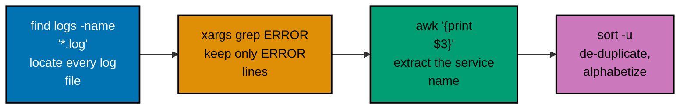

Examples 29-60 cover `case` dispatch, functions (definition, `local` scoping, return status),
positional parameters (`$1`/`$#`/`shift`/`"$@"`), reading input (`read`, here-docs, here-strings),
the core text-pipeline toolkit (`grep`/`sed`/`awk`/`cut`/`sort`/`uniq`/`tr`/`find`/`xargs`), I/O
redirection (`2>&1`, `/dev/null`), `getopts` flag parsing, parameter-expansion defaults, and
`pipefail`. Every example is a complete, self-contained `.sh` script colocated under
`learning/code/`; run each one with `bash example.sh` from inside its own directory, unless a
caption says otherwise.

---

### Example 29: Case Statement -- Dispatching on an Action Word

_ex-29 &middot; exercises co-11_

A `case` statement matches one value against a list of glob-style patterns, running only the first
matching branch. This example wraps `case` in a function and drives it with three sample inputs to
show every branch, including the catch-all.

**`learning/code/ex-29-case-statement-dispatch/example.sh`**

```bash
#!/usr/bin/env bash
# Example 29: case statement -- dispatching on an action word
set -euo pipefail

dispatch() {                  # => dispatch takes one action word and routes it
  case "$1" in                # => case matches $1 against each pattern below, top to bottom
  start)                      # => matches the literal word "start"
    echo "starting service"   # => branch body: runs only for the start case
    ;;                        # => ;; ends this branch and skips every other pattern
  stop)                       # => matches the literal word "stop"
    echo "stopping service"   # => branch body: runs only for the stop case
    ;;                        # => ;; ends this branch
  *)                          # => * is the catch-all pattern, matches anything else
    echo "unknown action: $1" # => branch body for every action that is not start or stop
    ;;                        # => ;; ends the catch-all branch
  esac                        # => esac closes the case statement
}                             # => closes the dispatch function

for action in start stop restart; do # => drives dispatch with three sample inputs
  dispatch "$action"                 # => calls dispatch, routing through case each time
done                                 # => closes the for-loop
# => Output: "starting service", then "stopping service", then "unknown action: restart"
```

**Run**: `bash example.sh`

**Output**:

```text
starting service
stopping service
unknown action: restart
```

**Key takeaway**: `case "$value" in pattern) ... ;; esac` matches top to bottom and stops at the
first hit; a trailing `*)` branch catches everything nothing else matched.

**Why it matters**: `case` is the idiomatic way to dispatch on a fixed set of known values --
`start`/`stop`/`restart` subcommands, `-v`/`-h` flags spelled out by hand, or a value pulled from
`$OSTYPE`. It reads far more clearly than a chain of `if`/`elif` string comparisons once there are
more than two or three branches, and every pattern can itself be a glob (`a|b`, `*.txt`), not just
a literal word.

---

### Example 30: Defining and Calling a Function

_ex-30 &middot; exercises co-13_

A function groups reusable commands under a name; `name() { ... }` defines it, and `name arg1
arg2` calls it exactly like any other command. Arguments arrive as `$1`, `$2`, and so on, scoped
to that call.

**`learning/code/ex-30-function-define-call/example.sh`**

```bash
#!/usr/bin/env bash
# Example 30: defining and calling a function
set -euo pipefail

greet() {      # => defines a function named greet
  echo "Hi $1" # => prints a greeting using the function's first argument
}              # => closes the function body

greet "Ada" # => calls greet with one argument: "Ada"
# => Output: Hi Ada
```

**Run**: `bash example.sh`

**Output**:

```text
Hi Ada
```

**Key takeaway**: `greet() { ... }` defines a function; calling it with `greet "Ada"` runs the body
with `$1` bound to `"Ada"`, exactly like calling any other command.

**Why it matters**: Functions are the primary way to avoid repeating the same handful of commands
throughout a script -- a logging helper, a validation check, or a cleanup routine all become one
named call instead of copy-pasted lines. Every later example in this tier that reasons about
`local` scoping (Example 31), return status (Example 32), or `getopts` parsing (Examples 56-57)
builds directly on this definition-and-call shape.

---

### Example 31: Function-Local Variables with `local`

_ex-31 &middot; exercises co-13_

By default, a variable assigned inside a function is global -- it leaks out and overwrites any
same-named variable in the caller. `local` scopes a variable to the current function call only,
restoring it (or leaving it undefined) once the function returns.

**`learning/code/ex-31-function-local-var/example.sh`**

```bash
#!/usr/bin/env bash
# Example 31: function-local variables with `local`
set -euo pipefail

name="global" # => an outer variable named name, holding "global"

set_name() {              # => defines a function that tries to change name
  local name="local-only" # => local creates a NEW name, scoped only to this function call
  echo "inside: $name"    # => reads the function-local name, not the outer one
}                         # => closes the function; the local name is destroyed here

set_name              # => calls set_name; its local name never touches the outer one
echo "outside: $name" # => the outer name is completely unchanged
# => Output: "inside: local-only", then "outside: global"
```

**Run**: `bash example.sh`

**Output**:

```text
inside: local-only
outside: global
```

**Key takeaway**: `local name=value` inside a function creates a variable that shadows any
outer `name` for the duration of the call, without ever touching the caller's copy.

**Why it matters**: Without `local`, every variable a function assigns is global by default --
a helper function that happens to use a loop counter named `i` can silently clobber the caller's
own `i`. Reaching for `local` on every function-internal variable (as Example 30's `greet` did not
need to, since it never assigned anything) is the single habit that prevents this entire class of
bug.

---

### Example 32: Checking a Function's Return Status

_ex-32 &middot; exercises co-13, co-09_

A function's `return N` sets its exit status, exactly like a command's own exit code; `return`
with no argument uses the status of the last command run inside it. Calling the function directly
inside an `if` checks that status without a separate `$?` lookup.

**`learning/code/ex-32-function-return-status/example.sh`**

```bash
#!/usr/bin/env bash
# Example 32: checking a function's return status
set -euo pipefail

is_even() {               # => defines a function that reports even/odd via exit status
  local n="$1"            # => n is the number to check, scoped to this call
  if ((n % 2 == 0)); then # => arithmetic test: true when n has no remainder mod 2
    return 0              # => return 0 means "success" (n is even)
  else                    # => otherwise n is odd
    return 1              # => return 1 means "failure" (n is odd)
  fi                      # => closes the if/else
}                         # => closes the function

if is_even 3; then # => calling is_even inside `if` checks its return status directly
  echo "3 is even" # => this branch runs only if is_even returned 0
else               # => is_even returned non-zero (1), so the failure branch runs
  echo "3 is odd"  # => branch body confirming the failure path was taken
fi                 # => closes the if/else
# => Output: 3 is odd
```

**Run**: `bash example.sh`

**Output**:

```text
3 is odd
```

**Key takeaway**: `return 0` signals success and `return 1` (or any non-zero) signals failure from
a function, exactly like a command's exit code; `if is_even 3; then` reads that status directly.

**Why it matters**: Treating functions as boolean-ish predicates -- success means "yes", any
non-zero return means "no" -- lets a function slot directly into `if`, `while`, and `&&`/`||`
without any extra `$?` bookkeeping. Example 59 reuses this exact same "call it inside `if`" shape,
but with a real command (`grep -q`) instead of a hand-written function.

---

### Example 33: Positional Parameters -- `$1`, `$2`, `$#`

_ex-33 &middot; exercises co-19_

A script's (or function's) arguments arrive as positional parameters: `$1` is the first, `$2` the
second, and `$#` holds the total count. `set -- ...` rewrites the current positional parameters,
which is how this self-contained example simulates real command-line arguments.

**`learning/code/ex-33-positional-params/example.sh`**

```bash
#!/usr/bin/env bash
# Example 33: positional parameters -- $1, $2, $#
set -euo pipefail

set -- alpha beta gamma # => set -- simulates script arguments: $1=alpha, $2=beta, $3=gamma

echo "first: $1"  # => $1 is the first positional parameter
echo "second: $2" # => $2 is the second positional parameter
echo "count: $#"  # => $# is the total number of positional parameters (3)
# => Output: "first: alpha", "second: beta", "count: 3"
```

**Run**: `bash example.sh`

**Output**:

```text
first: alpha
second: beta
count: 3
```

**Key takeaway**: `$1`, `$2`, ... refer to arguments by position, and `$#` reports how many there
are in total; `set -- a b c` is the standard way to simulate arguments inside a self-contained
example.

**Why it matters**: Positional parameters are how every Bash script receives its command-line
arguments -- there is no named-parameter syntax like a typical function signature. Examples 34
and 35 build directly on this: looping over every argument safely, and consuming them one at a
time with `shift`.

---

### Example 34: Looping Over All Arguments with `"$@"`

_ex-34 &middot; exercises co-19, co-06_

`"$@"` expands to every positional parameter as its own separate, correctly quoted word -- even
one that itself contains spaces. This is different from `$*` or an unquoted `$@`, both of which
can split an argument containing spaces into multiple words.

**`learning/code/ex-34-all-args-quoted/example.sh`**

```bash
#!/usr/bin/env bash
# Example 34: looping over all arguments with "$@"
set -euo pipefail

set -- "alpha beta" gamma # => two arguments: one contains a space, one does not

for arg in "$@"; do # => "$@" expands to each argument as its OWN word, spaces intact
  echo "$arg"       # => prints the argument exactly as it was passed
done                # => closes the for-loop
# => Output: "alpha beta" (kept as ONE line, space intact), then "gamma"
```

**Run**: `bash example.sh`

**Output**:

```text
alpha beta
gamma
```

**Key takeaway**: `for arg in "$@"; do` (quotes required) preserves each argument's word
boundaries exactly as the caller passed them; dropping the quotes reintroduces word-splitting on
every space.

**Why it matters**: This is the single most common quoting bug in real scripts: forgetting the
quotes around `"$@"` breaks the moment a caller passes a filename or argument containing a space.
`"$@"` inside a loop, and `"$@"` when forwarding arguments to another command, should be treated
as one inseparable idiom -- always quoted, never `$@` bare.

---

### Example 35: Consuming Arguments with `shift`

_ex-35 &middot; exercises co-19_

`shift` drops `$1` and renumbers every remaining positional parameter down by one, so `$2` becomes
the new `$1`. Combined with a `while [ "$#" -gt 0 ]` loop, this processes arguments one at a time
without ever needing an index variable.

**`learning/code/ex-35-shift-args/example.sh`**

```bash
#!/usr/bin/env bash
# Example 35: consuming arguments with shift
set -euo pipefail

set -- alpha beta gamma # => three simulated arguments to consume one at a time

while [ "$#" -gt 0 ]; do # => loops while at least one positional parameter remains
  echo "processing: $1"  # => $1 always refers to the CURRENT first remaining argument
  shift                  # => drops $1 and renumbers the rest down by one ($2 becomes $1)
done                     # => closes the while-loop

echo "remaining: $#" # => all arguments have been shifted away, so $# is 0
# => Output: three "processing: ..." lines (alpha, beta, gamma), then "remaining: 0"
```

**Run**: `bash example.sh`

**Output**:

```text
processing: alpha
processing: beta
processing: gamma
remaining: 0
```

**Key takeaway**: `shift` removes `$1` and slides every other positional parameter down by one, so
a `while [ "$#" -gt 0 ]; do ... shift; done` loop drains the argument list completely.

**Why it matters**: `shift` is the workhorse behind hand-written flag parsers -- peek at `$1`,
decide what to do with it, `shift`, repeat -- before reaching for `getopts` (Examples 56-57) for
anything more structured than a handful of positional arguments. It is also how a script forwards
"everything after the first two arguments" to another command without any index arithmetic.

---

### Example 36: Reading a Line from Piped stdin

_ex-36 &middot; exercises co-17_

`read -r line` reads a single line of input into the variable `line`, stopping at the first
newline. Piping text into a command group (`{ ...; }`) lets that group's `read` consume the piped
input directly.

**`learning/code/ex-36-read-from-stdin/example.sh`**

```bash
#!/usr/bin/env bash
# Example 36: reading a line from piped stdin
set -euo pipefail

printf 'hello from stdin\n' | { # => pipes one line of text into the command group below
  read -r line                  # => read -r reads exactly one line into $line (no backslash escaping)
  echo "got: $line"             # => echoes back exactly what was read from the pipe
}                               # => closes the command group
# => Output: got: hello from stdin
```

**Run**: `bash example.sh`

**Output**:

```text
got: hello from stdin
```

**Key takeaway**: `read -r line` pulls one line from whatever is connected to stdin -- here, the
output of `printf` piped in -- and the `-r` flag stops backslashes from being treated as escape
characters.

**Why it matters**: `read` is Bash's general-purpose way to bring outside data into a variable,
whether that data comes from a pipe (this example), a redirected file (Example 37), or an
interactive terminal. Always pairing it with `-r` avoids a subtle, easy-to-miss bug where a
backslash in the input silently disappears or joins the next line.

---

### Example 37: Reading a File Line by Line

_ex-37 &middot; exercises co-17, co-12_

`while IFS= read -r line; do ... done < file` is the standard idiom for processing a file one line
at a time. `IFS=` prevents `read` from trimming leading/trailing whitespace, and redirecting the
file into the `while` loop (rather than piping it in) keeps the loop in the current shell, not a
subshell.

**`learning/code/ex-37-read-loop-file/names.txt`**

```text
alice
bob
carol
```

**`learning/code/ex-37-read-loop-file/example.sh`**

```bash
#!/usr/bin/env bash
# Example 37: reading a file line by line
set -euo pipefail

# names.txt (colocated in this directory) holds three names, one per line: alice, bob, carol
while IFS= read -r line; do # => IFS= keeps leading/trailing whitespace intact; -r keeps backslashes literal
  echo "line: $line"        # => prints each line exactly as it appears in the file
done <names.txt             # => redirects names.txt as the loop's stdin, one read per iteration
# => Output: "line: alice", "line: bob", "line: carol"
```

**Run**: `bash example.sh`

**Output**:

```text
line: alice
line: bob
line: carol
```

**Key takeaway**: `while IFS= read -r line; do ... done < file` reads a file one line at a time
inside the current shell, so any variables the loop body sets are still visible after the loop
ends.

**Why it matters**: This exact idiom -- `while IFS= read -r line; do ... done < file` -- is
the single most reliable way to process a file line by line in Bash, and it shows up constantly in
real scripts: reading a list of hostnames, a CSV export, or a config file one entry at a time. The
`< file` redirection (rather than `cat file |`) is what keeps the loop's variables from vanishing
into a subshell once the loop ends.

---

### Example 38: Heredoc with Variable Expansion

_ex-38 &middot; exercises co-16_

A heredoc (`<<DELIMITER`) feeds a multi-line block of text to a command's stdin. With an unquoted
delimiter, that block behaves like a double-quoted string: variables and other expansions inside
it are substituted before the command ever sees the text.

**`learning/code/ex-38-heredoc/example.sh`**

```bash
#!/usr/bin/env bash
# Example 38: heredoc with variable expansion
set -euo pipefail

name="Ada" # => a variable to interpolate inside the heredoc body

# This example proves an unquoted heredoc behaves like a double-quoted string: variables expand
# The unquoted delimiter <<EOF below means variables ARE expanded inside the block
# $name is substituted with its value BEFORE cat ever receives the text
cat <<EOF
Hello, $name!
Welcome.
EOF
# => the bare EOF on its own line ends the heredoc
# => output: "Hello, Ada!" followed by "Welcome." -- $name was expanded to "Ada"
```

**Run**: `bash example.sh`

**Output**:

```text
Hello, Ada!
Welcome.
```

**Key takeaway**: `cat <<EOF ... EOF` (unquoted delimiter) expands `$variables` inside the block
exactly like a double-quoted string would, before the receiving command ever sees the text.

**Why it matters**: Heredocs are how a script builds a multi-line piece of text -- an email body,
a config file, a usage message -- without a wall of `echo` calls chained together with `\n`. This
unquoted form is the right choice whenever the block needs to include a live variable's value;
Example 39 shows the opposite, quoted form for when it must not.

---

### Example 39: Heredoc with a Quoted Delimiter (No Expansion)

_ex-39 &middot; exercises co-16_

Quoting the heredoc's delimiter (`<<'EOF'`, with the quotes around `EOF` itself) disables every
kind of expansion inside the block. Variables, command substitutions, and backslash escapes all
print exactly as typed -- useful whenever the text is a literal template rather than live data.

**`learning/code/ex-39-heredoc-quoted/example.sh`**

```bash
#!/usr/bin/env bash
# Example 39: heredoc with a quoted delimiter (no expansion)
set -euo pipefail

# shellcheck disable=SC2034 # name is deliberately unused below -- that IS the point of this example
name="Ada" # => a variable that will NOT be expanded inside the heredoc below

# The quoted delimiter <<'EOF' below disables ALL expansion inside the block
# $name prints LITERALLY here, exactly as typed, because the delimiter is quoted
cat <<'EOF'
Hello, $name!
EOF
# => the bare EOF on its own line ends the heredoc
# => output: "Hello, $name!" -- the dollar sign and variable name print unexpanded
```

**Run**: `bash example.sh`

**Output**:

```text
Hello, $name!
```

**Key takeaway**: `cat <<'EOF' ... EOF` (delimiter wrapped in quotes) treats the block as a
literal template -- `$name` prints as the two literal characters `$name`, with no substitution at
all.

**Why it matters**: This quoted form is exactly what to reach for when generating a script,
template, or example file whose OWN content should contain literal `$variable` syntax --
generating a `.env.example` file, a shell-script template, or documentation showing Bash syntax
all need this, since the unquoted form from Example 38 would substitute those variables away
instead of preserving them.

---

### Example 40: Here-String Matching with grep

_ex-40 &middot; exercises co-16, co-18_

`<<<` (a here-string) feeds a single string directly to a command's stdin, without a temporary
file or a separate `echo |` pipe. It is the most concise way to run a stdin-reading command, like
`grep`, against a value already held in a variable.

**`learning/code/ex-40-here-string/example.sh`**

```bash
#!/usr/bin/env bash
# Example 40: here-string matching with grep
set -euo pipefail

text="the quick foo fox" # => the string to search, held in a variable

if grep -q foo <<<"$text"; then # => <<< feeds $text to grep's stdin as a single line, no temp file needed
  echo "matched"                # => runs because grep found "foo" inside $text
else                            # => runs only if grep found no match
  echo "no match"               # => not reached in this run
fi                              # => closes the if/else
# => Output: matched
```

**Run**: `bash example.sh`

**Output**:

```text
matched
```

**Key takeaway**: `command <<< "$var"` feeds `$var` to `command`'s stdin as if it were piped in,
without spawning a subshell for a pipe or writing a temporary file.

**Why it matters**: Here-strings are the concise alternative to `echo "$text" | grep foo`: same
result, one fewer process, and no risk of the pipe's `echo` mangling a value that starts with a
dash. Reach for `<<<` any time a variable's contents (rather than a real file) need to feed a
stdin-reading command like `grep`, `sed`, `wc`, or `read`.

---

### Example 41: Piping printf into grep

_ex-41 &middot; exercises co-15, co-18_

A pipe (`|`) connects one command's stdout directly to the next command's stdin. Here, `printf`
generates four lines of text and `grep '^a'` filters them down to just the ones starting with
`a`.

**`learning/code/ex-41-pipe-grep/example.sh`**

```bash
#!/usr/bin/env bash
# Example 41: piping printf into grep
set -euo pipefail

# printf writes four fruit lines; grep '^a' keeps only the lines that START with "a"
printf 'apple\nbanana\navocado\ncherry\n' | grep '^a' # => grep '^a' matches "apple" and "avocado", not "banana"/"cherry"
# => Output: apple, then avocado
```

**Run**: `bash example.sh`

**Output**:

```text
apple
avocado
```

**Key takeaway**: `producer | grep 'pattern'` filters the producer's output down to only the lines
that match; `^` anchors the pattern to the start of the line.

**Why it matters**: `grep` filtering a pipeline is the most common single step in any real text
pipeline -- narrowing a large stream of lines (log output, a file listing, a command's verbose
output) down to just the ones worth looking at. Examples 42 through 53 build up the rest of this
toolkit (`sed`, `awk`, `cut`, `sort`, `find`, `xargs`) around this same pipe-and-filter shape.

---

### Example 42: Counting Matches with grep -c

_ex-42 &middot; exercises co-18_

`grep -c pattern file` prints only the count of matching lines, not the lines themselves --
useful whenever the answer needed is "how many", not "which ones".

**`learning/code/ex-42-grep-count/sample.log`**

```text
error: disk full
info: startup complete
error: timeout
warning: low memory
```

**`learning/code/ex-42-grep-count/example.sh`**

```bash
#!/usr/bin/env bash
# Example 42: counting matches with grep -c
set -euo pipefail

# sample.log (colocated in this directory) has 4 lines, 2 of which contain "error"
grep -c error sample.log # => -c prints only the COUNT of matching lines, not the lines themselves
# => Output: 2
```

**Run**: `bash example.sh`

**Output**:

```text
2
```

**Key takeaway**: `grep -c pattern file` prints a single number -- the count of matching lines --
instead of printing the matching lines themselves.

**Why it matters**: `-c` turns `grep` into a quick tally tool: counting how many lines contain
`error` in a log file, how many files in a listing end in `.txt`, or how many rows in a CSV match
a condition. It avoids piping into `wc -l` just to count what `grep` can count directly.

---

### Example 43: Substituting Text with sed

_ex-43 &middot; exercises co-18_

`sed 's/pattern/replacement/g'` substitutes every occurrence of `pattern` with `replacement` on
each line; the trailing `g` (global) flag is what makes it replace every match per line, not just
the first.

**`learning/code/ex-43-sed-substitute/example.sh`**

```bash
#!/usr/bin/env bash
# Example 43: substituting text with sed
set -euo pipefail

# the input line contains "old" three times, once per word
echo "old cat, old hat, old mat" | sed 's/old/new/g' # => s/old/new/g substitutes EVERY "old" with "new" (g = global)
# => Output: new cat, new hat, new mat
```

**Run**: `bash example.sh`

**Output**:

```text
new cat, new hat, new mat
```

**Key takeaway**: `sed 's/old/new/g'` is `sed`'s substitute command -- `s`, then the pattern to
find, the replacement, and a trailing `g` to replace every match on the line rather than only the
first.

**Why it matters**: Text substitution is one of the two things `sed` is used for constantly in
real scripts (the other being line deletion, Example 44) -- renaming a placeholder in a template,
normalizing whitespace, or rewriting a path across many lines all reduce to one `s///g` pattern.
Dropping the trailing `g` is a common bug: without it, `sed` stops after the first match per line.

---

### Example 44: Deleting Matching Lines with sed

_ex-44 &middot; exercises co-18_

`sed '/pattern/d'` deletes every line that contains `pattern`, printing everything else
unchanged. This is `sed`'s other everyday mode: instead of transforming text in place, it filters
whole lines out.

**`learning/code/ex-44-sed-delete-lines/queries.txt`**

```text
SELECT * FROM users;
DROP TABLE users;
INSERT INTO users VALUES (1);
DROP TABLE logs;
```

**`learning/code/ex-44-sed-delete-lines/example.sh`**

```bash
#!/usr/bin/env bash
# Example 44: deleting matching lines with sed
set -euo pipefail

# queries.txt (colocated in this directory) has 4 lines; 2 contain "DROP"
sed '/DROP/d' queries.txt # => /DROP/d deletes every line that CONTAINS the pattern "DROP"
# => Output: "SELECT * FROM users;" then "INSERT INTO users VALUES (1);" -- both DROP lines are gone
```

**Run**: `bash example.sh`

**Output**:

```text
SELECT * FROM users;
INSERT INTO users VALUES (1);
```

**Key takeaway**: `sed '/pattern/d'` removes every line matching `pattern` from the output; every
non-matching line passes through completely unchanged.

**Why it matters**: Line deletion by pattern is how a script strips comment lines, blank lines, or
(as here) specific unwanted statements out of a text stream before further processing. Combined
with Example 43's substitution, these two `sed` one-liners cover the large majority of real-world
`sed` usage without ever needing `sed`'s more obscure scripting features.

---

### Example 45: Extracting a Field with awk

_ex-45 &middot; exercises co-18_

`awk` splits each input line into whitespace-separated fields, numbered `$1`, `$2`, and so on
(note: these are `awk`'s own field variables, unrelated to Bash's positional parameters from
Example 33). `{print $2}` prints just the second field of every line.

**`learning/code/ex-45-awk-field/example.sh`**

```bash
#!/usr/bin/env bash
# Example 45: extracting a field with awk
set -euo pipefail

# two space-separated records: name, age, role
printf 'alice 30 engineer\nbob 25 designer\n' | awk '{print $2}' # => $2 is the 2nd whitespace-separated field on each line
# => Output: 30, then 25 -- the age field from each record
```

**Run**: `bash example.sh`

**Output**:

```text
30
25
```

**Key takeaway**: `awk '{print $2}'` splits each line on whitespace and prints only the second
field; `$1`, `$3`, and so on address any other column the same way.

**Why it matters**: `awk`'s field-splitting is the natural tool for pulling one column out of
loosely space-separated output -- `ps` output, `df` output, or any command whose columns are not a
strict CSV. Example 47 shows `cut` doing something similar for a fixed-delimiter format like CSV;
knowing when each tool fits is part of building the right pipeline quickly.

---

### Example 46: Summing a Column with awk

_ex-46 &middot; exercises co-18_

`awk` can accumulate a running total across every input line in its main block, then print that
total once at the end in an `END {}` block, which runs exactly once after all input has been
consumed.

**`learning/code/ex-46-awk-sum/example.sh`**

```bash
#!/usr/bin/env bash
# Example 46: summing a column with awk
set -euo pipefail

# three numbers, one per line, to be totaled
printf '10\n20\n30\n' | awk '{sum += $1} END {print sum}' # => sum accumulates $1 per line; END{} prints it once, after all lines
# => Output: 60 -- 10 + 20 + 30
```

**Run**: `bash example.sh`

**Output**:

```text
60
```

**Key takeaway**: `awk '{sum += $1} END {print sum}'` accumulates `$1` from every line into `sum`,
then the `END {}` block prints the final total exactly once, after the last line.

**Why it matters**: This `{accumulate} END {print}` shape is `awk`'s answer to "total up a column
of numbers" -- disk usage per file, bytes transferred per log entry, or scores per record. It
needs no external `bc` or arithmetic-in-a-loop workaround; the accumulation and the final print
are both native to `awk`.

---

### Example 47: Extracting a CSV Column with cut

_ex-47 &middot; exercises co-18_

`cut -d, -f2` splits each line on a fixed delimiter (here, a comma) and prints only the requested
field number. Unlike `awk`, `cut` has no scripting language of its own -- it does exactly one
thing, quickly.

**`learning/code/ex-47-cut-columns/people.csv`**

```text
name,age,role
alice,30,engineer
bob,25,designer
```

**`learning/code/ex-47-cut-columns/example.sh`**

```bash
#!/usr/bin/env bash
# Example 47: extracting a CSV column with cut
set -euo pipefail

# people.csv (colocated in this directory) has a header row plus two data rows
cut -d, -f2 people.csv # => -d, sets the delimiter to a comma; -f2 keeps only the 2nd field
# => Output: "age" (the header), then "30", then "25"
```

**Run**: `bash example.sh`

**Output**:

```text
age
30
25
```

**Key takeaway**: `cut -d<delim> -f<n>` splits each line on `<delim>` and keeps only field `<n>`;
`-d,` picks a comma delimiter for a simple CSV.

**Why it matters**: For a well-formed, fixed-delimiter file like plain CSV, `cut` is faster to
reach for than `awk -F,`, since there is no pattern-matching syntax to remember. `cut` does not
handle quoted commas inside a CSV field, though -- a genuinely quoted CSV needs a real CSV parser,
not `cut` or `awk`.

---

### Example 48: Counting Duplicates with sort | uniq -c

_ex-48 &middot; exercises co-18_

`uniq -c` only collapses **adjacent** duplicate lines, prefixing each with a count -- so `sort`
must run first to bring equal lines next to each other before `uniq -c` can count them correctly.

**`learning/code/ex-48-sort-uniq-count/example.sh`**

```bash
#!/usr/bin/env bash
# Example 48: counting duplicates with sort | uniq -c
set -euo pipefail

# six fruit names, with "apple" and "banana" each repeated, in no particular order
printf 'apple\nbanana\napple\ncherry\nbanana\napple\n' |
  sort |  # => uniq -c only counts ADJACENT duplicates, so sort groups equal lines together first
  uniq -c # => -c prefixes each unique line with how many times it appeared
# => Output: "3 apple", "2 banana", "1 cherry" -- each count right-aligned by uniq -c
```

**Run**: `bash example.sh`

**Output**:

```text
   3 apple
   2 banana
   1 cherry
```

**Key takeaway**: `sort | uniq -c` is a fixed idiom: `sort` groups equal lines together, then
`uniq -c` collapses each group into one line prefixed with its count.

**Why it matters**: This exact `sort | uniq -c` pipeline is the standard one-liner for "how many
times does each distinct value appear" -- counting repeated log messages, repeated IP addresses,
or repeated words in a file. Skipping the `sort` is the classic mistake: `uniq -c` alone would
report three separate one-line groups instead of the correct totals, since it never merges
non-adjacent duplicates.

---

### Example 49: Translating Characters with tr

_ex-49 &middot; exercises co-18_

`tr set1 set2` translates each character in `set1` to the character at the same position in
`set2`, one character at a time -- it has no concept of "lines" or "fields" the way `sed` and
`awk` do.

**`learning/code/ex-49-tr-translate/example.sh`**

```bash
#!/usr/bin/env bash
# Example 49: translating characters with tr
set -euo pipefail

# a lowercase greeting to be uppercased
echo "hello world" | tr 'a-z' 'A-Z' # => tr maps each char in set 1 (a-z) to the char at the same position in set 2 (A-Z)
# => Output: HELLO WORLD
```

**Run**: `bash example.sh`

**Output**:

```text
HELLO WORLD
```

**Key takeaway**: `tr 'a-z' 'A-Z'` maps every lowercase letter to its uppercase counterpart,
character by character, across the entire input stream.

**Why it matters**: `tr` is the lightest-weight tool for character-level transforms --
uppercasing/lowercasing text, collapsing repeated characters (`tr -s`), or deleting a specific
character class (`tr -d`) -- without the overhead of `sed`'s pattern syntax for a job that never
needed patterns in the first place.

---

### Example 50: Finding Files by Name

_ex-50 &middot; exercises co-18_

`find dir -name 'pattern'` walks a directory tree and prints every path matching a glob pattern,
at any nesting depth. This example builds a small real directory tree first, so the `find` below
has something concrete to search.

**`learning/code/ex-50-find-files/example.sh`**

```bash
#!/usr/bin/env bash
# Example 50: finding files by name
set -euo pipefail

mkdir -p sample-dir/sub                                      # => builds a small real directory tree to search
touch sample-dir/a.txt sample-dir/b.txt sample-dir/sub/c.txt # => three .txt files at two nesting depths
touch sample-dir/notes.md                                    # => one non-matching file, to prove find filters it out

find sample-dir -name '*.txt' | sort # => -name '*.txt' matches only .txt files, at any depth
# => sort makes the listing order deterministic
```

**Run**: `bash example.sh`

**Output**:

```text
sample-dir/a.txt
sample-dir/b.txt
sample-dir/sub/c.txt
```

**Key takeaway**: `find dir -name 'pattern'` recurses through every subdirectory of `dir`,
printing every path whose filename matches the glob `pattern` -- `sample-dir/notes.md` was
correctly excluded since it does not end in `.txt`.

**Why it matters**: `find` is the tool for locating files by name or type across a directory tree,
something neither `ls` nor a shell glob does recursively by default. Piping its output into `sort`
(as here) makes the listing order deterministic, which matters whenever that output feeds into a
later pipeline stage that depends on a stable order.

---

### Example 51: Deleting Files Found by find

_ex-51 &middot; exercises co-18_

`find dir -name 'pattern' -delete` removes every matching file in place, without a separate `xargs
rm` step. `-delete` must come last in the `find` expression; it is an action, not a filter.

**`learning/code/ex-51-find-exec-delete/example.sh`**

```bash
#!/usr/bin/env bash
# Example 51: deleting files found by find
set -euo pipefail

mkdir -p tmp-dir                                         # => builds a small real directory to clean up
touch tmp-dir/keep.txt tmp-dir/old.tmp tmp-dir/cache.tmp # => one file to keep, two .tmp files to remove

find tmp-dir -name '*.tmp' -delete # => -delete removes every file find matches, in place

find tmp-dir -type f | sort # => lists what remains, to prove only the .tmp files are gone
# => Output: tmp-dir/keep.txt -- both old.tmp and cache.tmp were deleted
```

**Run**: `bash example.sh`

**Output**:

```text
tmp-dir/keep.txt
```

**Key takeaway**: `find dir -name 'pattern' -delete` deletes every matching file directly, with no
separate `rm` or `xargs` step needed for the deletion itself.

**Why it matters**: `-delete` is the safe, built-in way to prune matched files -- temp files,
build artifacts, old logs -- from a `find` expression, and it is generally preferable to piping
into `xargs rm` for deletion specifically, since it avoids spawning an external `rm` process per
batch. As with any bulk delete, it is worth testing the `find ... -name 'pattern'` part alone
first (without `-delete`) to confirm exactly what will be removed.

---

### Example 52: Piping find Results into xargs grep

_ex-52 &middot; exercises co-18, co-15_

`xargs` takes a stream of lines on stdin and turns them into arguments for another command --
here, turning a list of filenames from `find` into the file arguments for a single `grep -l`
call, rather than running `grep` once per file.

**`learning/code/ex-52-xargs-pipeline/example.sh`**

```bash
#!/usr/bin/env bash
# Example 52: piping find results into xargs grep
set -euo pipefail

mkdir -p project                         # => builds a small real project directory to search
printf 'TODO: fix this\n' >project/a.txt # => a.txt contains a TODO marker
printf 'nothing here\n' >project/b.txt   # => b.txt has no TODO marker
printf 'TODO: refactor\n' >project/c.txt # => c.txt also contains a TODO marker

find project -name '*.txt' | sort | xargs grep -l TODO # => xargs turns the file list into grep's file arguments
# => -l prints only the NAMES of files containing a match
```

**Run**: `bash example.sh`

**Output**:

```text
project/a.txt
project/c.txt
```

**Key takeaway**: `find ... | xargs grep -l pattern` turns a list of filenames into arguments for
one `grep` invocation across all of them; `-l` prints only the names of files that matched, not
the matching lines themselves.

**Why it matters**: This `find | xargs` shape is the standard way to run a command across every
file `find` locates, in far fewer processes than looping and invoking the command once per file.
The synthetic filenames here are deliberately space-free to keep the example focused; when
filenames might contain spaces, the safe general form is `find ... -print0 | xargs -0 ...`, which
uses a NUL byte instead of whitespace to separate entries.

---

### Example 53: A Multi-Stage find | grep | awk | sort Pipeline

_ex-53 &middot; exercises co-15, co-18_

Real text-processing chores usually need more than one tool chained together. This example builds
a small `logs/` directory, then finds every `.log` file, greps their `ERROR` lines, extracts the
service name with `awk`, and de-duplicates the result with `sort -u` -- the exact same building
blocks from Examples 41-52, composed into one pipeline.



**`learning/code/ex-53-pipeline-chore/example.sh`**

```bash
#!/usr/bin/env bash
# Example 53: a multi-stage find | grep | awk | sort pipeline
set -euo pipefail

mkdir -p logs # => builds a small real logs directory for the chore below
# auth.log gets one INFO line and one ERROR line
printf '2024-01-01 INFO auth started\n2024-01-01 ERROR auth timeout\n' >logs/auth.log
# billing.log gets one ERROR line and one INFO line
printf '2024-01-01 ERROR billing failed\n2024-01-01 INFO billing ok\n' >logs/billing.log
# extra.log gets a second ERROR line, also for the auth service
printf '2024-01-01 ERROR auth retry\n' >logs/extra.log
# => three log files simulate a real "find every service with an ERROR line" chore

find logs -name '*.log' | sort | # => finds every .log file, sorted for a deterministic file order
  xargs grep ERROR |             # => greps ERROR lines across all files; output is prefixed "path:line"
  awk '{print $3}' |             # => field 3 is the service name (field 1 is "path:date", field 2 is ERROR)
  sort -u                        # => sorts and de-duplicates the service names into a final report
# => Output: "auth" then "billing" -- two services had at least one ERROR line, alphabetically sorted
```

**Run**: `bash example.sh`

**Output**:

```text
auth
billing
```

**Key takeaway**: `find | xargs grep | awk | sort -u` chains four single-purpose tools into one
report; each stage's output becomes the next stage's input, with no intermediate files ever
written to disk.

**Why it matters**: This is what a "real" shell one-liner chore looks like in practice --
combining `find`, `grep`, `awk`, and `sort` from Examples 41-52 into a single pipeline that
answers a genuine question ("which services logged an error today") without writing a single line
of a general-purpose scripting language. Recognizing which single-purpose tool handles which stage
is the core skill this whole `co-18` toolkit builds toward.

---

### Example 54: Merging stderr into stdout

_ex-54 &middot; exercises co-14, co-15_

`2>&1` redirects file descriptor 2 (stderr) to wherever file descriptor 1 (stdout) currently
points. Placed **before** a pipe, this merges both streams so that a downstream command like
`grep` can see stderr output too, since a plain `|` only ever carries stdout.

**`learning/code/ex-54-stderr-to-stdout/example.sh`**

```bash
#!/usr/bin/env bash
# Example 54: merging stderr into stdout
set -euo pipefail

noisy() {                           # => a function that writes to both stdout and stderr
  echo "info: starting"             # => an ordinary stdout line
  echo "error: something broke" >&2 # => explicitly written to stderr (fd 2), not stdout
  echo "info: done"                 # => a second ordinary stdout line
}                                   # => closes the function

noisy 2>&1 | grep error # => 2>&1 redirects stderr into stdout BEFORE the pipe, so grep sees both streams
# => Output: error: something broke -- the two "info:" lines don't match "error" and are filtered out
```

**Run**: `bash example.sh`

**Output**:

```text
error: something broke
```

**Key takeaway**: `command 2>&1 | next` merges stderr into stdout before the pipe runs, so `next`
receives both streams interleaved; a bare `command | next` (no `2>&1`) would only forward stdout.

**Why it matters**: A plain pipe silently drops stderr from the receiving command's view -- a
common source of confusion when grepping a command's output for an error message that turns out to
have gone to stderr, not stdout. `2>&1` (placed before the pipe symbol) is the fix, and it is worth
memorizing exactly where it goes: `cmd 2>&1 | grep`, not `cmd | grep 2>&1`.

---

### Example 55: Discarding Output to /dev/null

_ex-55 &middot; exercises co-14_

`/dev/null` is a special file that silently discards anything written to it. Redirecting both
stdout and stderr there (`> /dev/null 2>&1`) silences a command completely while still preserving
its exit status for the caller to inspect.

**`learning/code/ex-55-devnull-discard/example.sh`**

```bash
#!/usr/bin/env bash
# Example 55: discarding output to /dev/null
set -euo pipefail

noisy_cmd() {             # => a function that prints to both streams, then fails on purpose
  echo "stdout noise"     # => an ordinary stdout line
  echo "stderr noise" >&2 # => an ordinary stderr line
  return 3                # => a non-zero exit status to prove it survives the redirection below
}                         # => closes the function

if noisy_cmd >/dev/null 2>&1; then # => `if` guards the call so set -e does not abort on the non-zero return
  status=0                         # => not reached in this run, since noisy_cmd always returns 3
else                               # => runs because noisy_cmd returned non-zero
  status=$?                        # => captures the real exit status (3) inside the else branch
fi                                 # => closes the if/else; no stdout/stderr from noisy_cmd was printed

echo "exit status: $status" # => proves the exit status survived even though all output was discarded
# => Output: exit status: 3 -- no "stdout noise" or "stderr noise" ever appears
```

**Run**: `bash example.sh`

**Output**:

```text
exit status: 3
```

**Key takeaway**: `cmd > /dev/null 2>&1` discards every byte a command writes to stdout or stderr,
but its exit status still comes through unaffected -- redirection never changes what a command
returns, only where its output goes.

**Why it matters**: Silencing a noisy command's output while still checking whether it succeeded
is a routine need -- probing whether a tool is installed, whether a network host is reachable, or
whether a background setup step worked, without cluttering the script's own output with that
command's internal chatter. Wrapping the call in `if` (rather than calling it bare) is what keeps
this safe under `set -e`, since a bare failing command would otherwise abort the script.

---

### Example 56: Parsing Flags with getopts

_ex-56 &middot; exercises co-20_

`getopts optstring name` is Bash's built-in flag parser: each letter in `optstring` is a valid
flag, and a trailing `:` after a letter means that flag takes a value (captured in `$OPTARG`). A
`while getopts ...; do case "$opt" in ... esac; done` loop is the standard shape for using it.

**`learning/code/ex-56-getopts-flags/example.sh`**

```bash
#!/usr/bin/env bash
# Example 56: parsing flags with getopts
set -euo pipefail

set -- -v -o result.txt # => simulates script arguments: a flag (-v) and a flag with a value (-o result.txt)

verbose="false" # => default value, overwritten only if -v is present
outfile=""      # => default value, overwritten only if -o is present

while getopts "vo:" opt; do # => "vo:" declares flag -v (no value) and flag -o (colon means it TAKES a value)
  case "$opt" in            # => $opt holds the option letter getopts just parsed
  v)                        # => matches when -v was passed
    verbose="true"          # => records that verbose mode was requested
    ;;                      # => ends this branch
  o)                        # => matches when -o was passed
    outfile="$OPTARG"       # => $OPTARG holds the value that followed -o (here, "result.txt")
    ;;                      # => ends this branch
  *) ;;                     # => catch-all for any other option; nothing to do here
  esac                      # => closes the case statement
done                        # => closes the while-loop; getopts returns non-zero once options are exhausted

echo "verbose: $verbose" # => shows the flag was recorded
echo "outfile: $outfile" # => shows the flag's value was captured
# => Output: "verbose: true" then "outfile: result.txt"
```

**Run**: `bash example.sh`

**Output**:

```text
verbose: true
outfile: result.txt
```

**Key takeaway**: `getopts "vo:" opt` parses `-v` as a value-less flag and `-o value` as a
flag-with-value (the trailing `:` after `o`), placing the flag letter in `$opt` and any value in
`$OPTARG`.

**Why it matters**: `getopts` is Bash's built-in, standard way to parse short flags -- more
structured than hand-rolled `shift`-based parsing (Example 35) once a script accepts more than one
or two flags, and it correctly handles combined short flags and flags-with-values without any
extra code. Example 57 extends this same loop with usage text and proper error handling for an
invalid flag.

---

### Example 57: Usage Text and Errors with getopts

_ex-57 &middot; exercises co-20, co-09_

Prefixing `getopts`'s option string with a leading `:` switches it into "silent errors" mode: an
invalid flag sets `$opt` to `?` (matched with the pattern `\?`) instead of printing its own
built-in error message, letting the script report the error -- and its exit status -- on its own
terms.

**`learning/code/ex-57-getopts-usage/example.sh`**

```bash
#!/usr/bin/env bash
# Example 57: usage text and errors with getopts
set -euo pipefail

usage() {                            # => prints one-line usage text, shared by every caller that needs it
  echo "usage: example.sh [-h] [-v]" # => the text itself
}                                    # => closes usage

parse() {                                 # => parses one simulated set of flags, passed in as "$@"
  local OPTIND=1 opt                      # => local OPTIND resets getopts state on every call to parse
  while getopts ":hv" opt "$@"; do        # => leading : enables SILENT error handling (no built-in message)
    case "$opt" in                        # => $opt holds the parsed option letter, or ? on an invalid one
    h)                                    # => matches when -h was passed
      usage                               # => prints the shared usage text
      return 0                            # => -h exits successfully (status 0)
      ;;                                  # => ends this branch
    v)                                    # => matches when -v was passed
      echo "verbose mode"                 # => confirms verbose mode was recognized
      ;;                                  # => ends this branch
    \?)                                   # => matches any option NOT in ":hv" (an invalid flag)
      echo "invalid option: -$OPTARG" >&2 # => $OPTARG holds the invalid letter; reported on stderr
      return 1                            # => an invalid option exits with a non-zero status
      ;;                                  # => ends this branch
    esac                                  # => closes the case statement
  done                                    # => closes the while-loop
  return 0                                # => reached only if every flag parsed cleanly with no -h
}                                         # => closes parse

# two probes: a valid -h flag, then an invalid -x flag, to exercise both branches of parse
parse -h                 # => runs the -h branch above
echo "exit after -h: $?" # => $? here is parse's return status from the -h call (0)

parse -x && echo "unexpected success" || echo "exit after -x: $?" # => -x is invalid, so the || branch runs
# => $? here is parse's return status (1)
# => Output: usage line, "exit after -h: 0", "invalid option: -x", "exit after -x: 1"
```

**Run**: `bash example.sh`

**Output**:

```text
usage: example.sh [-h] [-v]
exit after -h: 0
invalid option: -x
exit after -x: 1
```

**Key takeaway**: A leading `:` in the option string (`":hv"`, not `"hv"`) hands error handling to
the script itself: an unrecognized flag sets `$opt` to `?` and `$OPTARG` to the offending letter,
instead of printing `getopts`'s own generic error message.

**Why it matters**: Every real command-line tool needs to do two things well: print usage text on
`-h`, and fail clearly (with a non-zero exit status) on a bad flag. This `":optstring"` pattern is
what makes both possible from inside a single `getopts` loop, without needing a second pass over
the arguments or a separate validation step afterward.

---

### Example 58: Default Values with Parameter Expansion

_ex-58 &middot; exercises co-05, co-19_

`${var:-default}` expands to `$var` if it is set and non-empty, or to the literal `default`
otherwise -- without ever modifying `$var` itself. Applied to `$1`, this is the standard way to
give an optional argument a fallback value.

**`learning/code/ex-58-default-value-param/example.sh`**

```bash
#!/usr/bin/env bash
# Example 58: default values with parameter expansion
set -euo pipefail

show_name() {                # => a function that greets by name, or falls back to a default
  local name="${1:-default}" # => ${1:-default} uses $1 if set and non-empty, else the literal "default"
  echo "name: $name"         # => prints whichever value was chosen
}                            # => closes the function

show_name       # => called with NO argument, so $1 is unset and "default" is used
show_name "Ada" # => called WITH an argument, so "Ada" is used instead of the default
# => Output: "name: default" then "name: Ada"
```

**Run**: `bash example.sh`

**Output**:

```text
name: default
name: Ada
```

**Key takeaway**: `${1:-default}` reads as "use `$1`, or fall back to `default` if `$1` is unset
or empty" -- one expression, no `if` statement needed to check whether the argument was provided.

**Why it matters**: This is the standard way to make a positional argument optional without an
explicit `if [ -z "$1" ]` check beforehand -- an output path that defaults to `./out`, a log level
that defaults to `info`, or (as here) a name that defaults to a placeholder. It composes cleanly
with `local` (Example 31): the default lives right where the variable is declared.

---

### Example 59: Branching on a Command's Exit Status

_ex-59 &middot; exercises co-09, co-10_

Any command run directly as an `if` condition has its exit status checked automatically: `0`
(success) takes the `then` branch, anything else takes the `else` branch. `grep -q` (quiet mode,
no output) is a common command to use this way, since its exit status alone answers "did it
match".

**`learning/code/ex-59-check-command-success/example.sh`**

```bash
#!/usr/bin/env bash
# Example 59: branching on a command's exit status
set -euo pipefail

printf 'apple\nbanana\ncherry\n' >fruits.txt # => builds a small real data file to search

if grep -q banana fruits.txt; then # => -q runs grep silently; `if` checks its exit status directly
  echo "found banana"              # => runs because grep found a match (exit status 0)
else                               # => runs only if grep found no match (exit status 1)
  echo "banana missing"            # => not reached in this run
fi                                 # => closes the if/else
# => Output: found banana
```

**Run**: `bash example.sh`

**Output**:

```text
found banana
```

**Key takeaway**: `if grep -q pattern file; then ... fi` checks `grep`'s exit status directly --
`0` if it found a match, `1` if it did not -- with `-q` suppressing grep's normal line-printing
output entirely.

**Why it matters**: This is the general shape behind Example 32's function-return-status check,
now applied to a real external command instead of a hand-written one: any command that reports
success/failure via its exit status can drive an `if` directly, with no separate `$?` comparison
needed. It is the idiomatic way to ask a yes/no question of the filesystem or another program.

---

### Example 60: pipefail Catches a Failing First Stage

_ex-60 &middot; exercises co-03, co-15_

Without `pipefail`, a pipeline's exit status is only ever the **last** command's status -- an
earlier stage can fail silently. `set -o pipefail` changes this: the pipeline's exit status
becomes the rightmost command that failed, or `0` if every stage succeeded.

**`learning/code/ex-60-pipefail-catches-failure/example.sh`**

```bash
#!/usr/bin/env bash
# Example 60: pipefail catches a failing first stage
set -uo pipefail # => deliberately omits -e here, so the script can inspect $? after a failing pipeline

grep quux /dev/null | wc -l # => grep finds no "quux" in empty input, so grep itself exits 1 (no match)
# => wc -l still succeeds (exit 0), printing the line count "0"
echo "pipeline exit status: $?" # => with pipefail ON, $? is grep's FAILING status (1), not wc -l's success (0)
```

**Run**: `bash example.sh`

**Output**:

```text
       0
pipeline exit status: 1
```

**Key takeaway**: `set -o pipefail` makes a pipeline's exit status reflect ANY failing stage, not
just the last one; here `wc -l` succeeds (printing a right-justified `0` -- BSD/macOS `wc -l` pads
single counts with leading spaces, unlike GNU `wc -l`'s unpadded form) but `grep`'s earlier failure
(no match) still makes the whole pipeline report exit status `1`.

**Why it matters**: Without `pipefail`, a pipeline like `curl ... | jq ...` would report success
even if `curl` failed outright, since `jq`'s own exit status (likely `0`, having successfully
processed empty input) is all that gets checked by default. `pipefail` closes this real,
easy-to-miss gap, which is exactly why `set -euo pipefail` (all three flags together) is the
standard strict-mode preamble for any script that is not deliberately inspecting a pipeline's
failure the way this example does.

---

← Previous: [Beginner Examples](./beginner.md) &middot; Next: [Advanced Examples](./advanced.md) →
