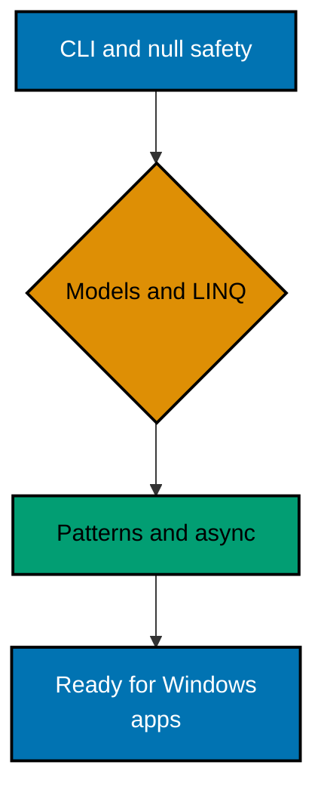

**Want to get productive with C# before building a Windows application?** This code-first primer
teaches the bounded C# surface that Windows App Development assumes: the .NET CLI, nullability,
models, LINQ, and an async preview.

Save a normal example as `Program.cs` in a console project created with `dotnet new console`, then
run `dotnet run`.
Install the .NET 10 LTS SDK: the colocated example projects target `net10.0`, and .NET 10
is supported through November 2028. The C# snippets use the SDK's implicit usings and nullable
analysis unless a lesson shows a different setting.

## Prerequisites

This course requires [Object-Oriented Programming Essentials](../object-oriented-programming-essentials/learning/overview.md).
It also assumes general typed-language fluency and a terminal. The Windows SDK, XAML, WinUI/WPF,
lifecycle APIs, and desktop deployment belong to Windows App Development, not this primer.

## Learning path

## Scope boundary

This is just enough C# to read and make small, safe changes in the paired Windows course. It
deliberately stops before XAML, WinUI/WPF, dependency injection frameworks, reflection, unsafe
code, advanced threading, and platform packaging. It teaches productive foundations, not
comprehensive C# mastery.

## Primary references

- [C# language reference](https://learn.microsoft.com/en-us/dotnet/csharp/language-reference/) covers the syntax
  in the lessons.
- [.NET releases and support](https://learn.microsoft.com/en-us/dotnet/core/releases-and-support) lists .NET 10
  as LTS.
- [Nullable reference types](https://learn.microsoft.com/en-us/dotnet/csharp/fundamentals/null-safety/nullable-reference-types)
  explains compile-time analysis and runtime limits.
- [LINQ deferred execution](https://learn.microsoft.com/en-us/dotnet/standard/linq/deferred-execution-lazy-evaluation)
  explains when queries run.
- [Asynchronous programming](https://learn.microsoft.com/en-us/dotnet/csharp/asynchronous-programming/) explains task
  completion, awaiting, and exceptions.
