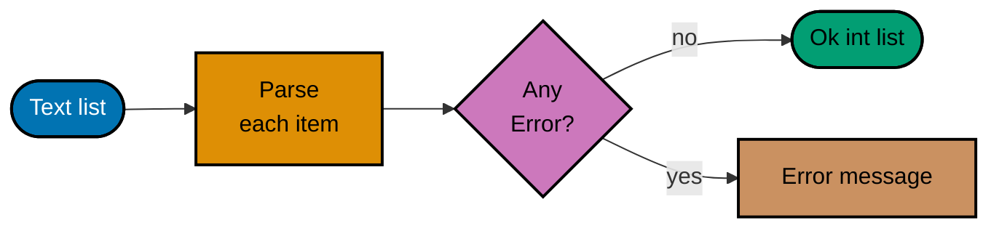
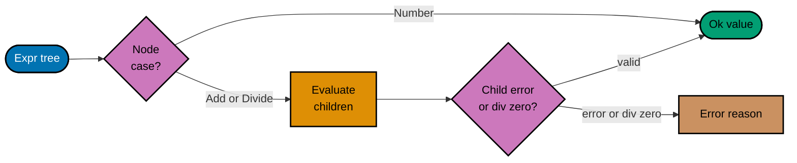

These examples build on the previous level. Each script runs independently: save the code as `main.fsx` and run `dotnet fsi main.fsx`. Predict the result before running it; each printed value provides a quick check.

## Example 53: Partial active pattern

Match a parsed number while allowing a non-match. A partial active pattern returns Some or None.

```fsharp
// => A partial active pattern returns Some or None.
let (|Integer|_|) (text: string) =
    // => TryParse decides whether this text can be viewed as an integer.
    match System.Int32.TryParse text with
    // => On success, the active pattern supplies the parsed number.
    | true, value -> Some value
    // => On failure, None lets the next match pattern run.
    | false, _ -> None
// => The pattern extracts the parsed value.
let describe text = match text with Integer n -> $"number {n}" | _ -> "other"
// => This prints number 42.
printfn "%s" (describe "42")
```

**Observe:** Running the script prints:

```text
number 42
```

**Key takeaway:** A partial active pattern makes parsing available as a reusable pattern.

**Why It Matters:** Its None case means the pattern does not match, so the caller still needs a fallback branch. A
partial active pattern makes parsing available as a reusable pattern. This works well when several
matches need the same view of input, but a simple parsing function is easier for one call site. Try
invalid text and see why the fallback branch is required.

## Example 54: Partition by a predicate

Split all items into matching and nonmatching lists. partition returns a tuple of two lists.

```fsharp
// => partition returns a tuple of two lists.
let even, odd = [1; 2; 3; 4] |> List.partition (fun n -> n % 2 = 0)
// => Both groups preserve input order.
let result = even, odd
// => This prints ([2; 4], [1; 3]).
printfn "%A" result
```

**Observe:** Running the script prints:

```text
([2; 4], [1; 3])
```

**Key takeaway:** Partition is useful when both accepted and rejected items matter.

**Why It Matters:** It evaluates the predicate for every item and returns both sides at once. Partition is useful when
both accepted and rejected items matter. A filter would discard one side, requiring another pass if
the rejected values later need an explanation or report. Change the predicate to positive numbers
and inspect both output lists.

## Example 55: Aggregate grouped data

Count values after grouping by a category. Group the words by their first character.

```fsharp
// => Group the words by their first character.
let counts =
    // => The three words provide two first-letter groups.
    ["apple"; "apricot"; "berry"]
    // => The key is each nonempty word’s first character.
    |> List.groupBy (fun word -> word.[0])
    // => Replace each group with its key and member count.
    |> List.map (fun (letter, words) -> letter, List.length words)
// => This prints [('a', 2); ('b', 1)].
printfn "%A" counts
```

**Observe:** Running the script prints:

```text
[('a', 2); ('b', 1)]
```

**Key takeaway:** Grouping produces each key with its associated values; a subsequent map can turn those groups into a summary.

**Why It Matters:** This two-step form makes the aggregation clear. Grouping produces each key with its associated
values; a subsequent map can turn those groups into a summary. Indexing word.[0] assumes nonempty
words, so validate or filter empty input before using this in an input boundary. Add an empty word
only after deciding how to guard the indexing operation.

## Example 56: Zip aligned lists

Pair items from two equally sized collections. Each name aligns with one score by position.

```fsharp
// => Each name aligns with one score by position.
let names = ["Ayu"; "Budi"]
// => Both scores align positionally with the two names.
let scores = [8; 9]
// => List.zip creates a pair for each position.
let rows = List.zip names scores
// => This prints [("Ayu", 8); ("Budi", 9)].
printfn "%A" rows
```

**Observe:** Running the script prints:

```text
[("Ayu", 8); ("Budi", 9)]
```

**Key takeaway:** Zip is a concise way to combine positional data when lengths match.

**Why It Matters:** It raises an error if the lists have different lengths, so check that invariant at an untrusted
boundary. Zip is a concise way to combine positional data when lengths match. If a shared key
exists, keyed records are safer than depending on position. Remove one score and observe the error
caused by unequal list lengths.

## Example 57: Memoize a recursive calculation

Cache repeated results in a dictionary bound at script level. The recursive function reads that
binding, and later expressions in the same script could also access it.

```fsharp
// => This script-level dictionary is shared by calls to fib.
let cache = System.Collections.Generic.Dictionary<int, int>()
// => The recursive function first handles a base case or cache lookup.
let rec fib n =
    // => Zero and one are returned without further calls.
    if n < 2 then n
    // => Only inputs above one reach the cache branch.
    else
        // => TryGetValue reports whether this n was already calculated.
        match cache.TryGetValue n with
        // => A cache hit returns the stored integer immediately.
        | true, value -> value
        // => A miss requires two smaller Fibonacci values.
        | false, _ ->
            // => Add the two recursive answers for the missing input.
            let value = fib (n - 1) + fib (n - 2)
            // => Save this result so repeated subproblems avoid recomputation.
            cache.[n] <- value
            // => Return the newly stored value to the caller.
            value
// => This prints 55.
printfn "%d" (fib 10)
```

**Observe:** Running the script prints:

```text
55
```

**Key takeaway:** Memoization trades memory for avoiding repeated computation.

**Why It Matters:** The function first checks whether a result is already known, then stores a newly computed result.
Memoization trades memory for avoiding repeated computation. Here the mutable dictionary is bound
at script level, so later calls to `fib` reuse entries and later script code could access the cache.
Encapsulate it if independent callers need separate caches, and do not assume the dictionary is
thread-safe. Integer overflow also limits large Fibonacci inputs. Change the input to eleven and
inspect which results are reused.

## Example 58: Fold a recursive tree

Compute one summary from every node of a tree. A tree is either a leaf or a branch with two
children.

```fsharp
// => A tree is either a leaf or a branch with two children.
type Tree = Leaf of int | Branch of Tree * Tree
// => The match visits every leaf exactly once.
let rec sum tree =
    // => Inspect whether the tree node is a leaf or branch.
    match tree with
    // => A leaf contributes exactly its stored integer.
    | Leaf value -> value
    // => A branch contributes the sums of both child trees.
    | Branch(left, right) -> sum left + sum right
// => This prints 9.
printfn "%d" (sum (Branch(Leaf 4, Leaf 5)))
```

**Observe:** Running the script prints:

```text
9
```

**Key takeaway:** Recursive traversal mirrors the shape of the recursive union.

**Why It Matters:** The leaf branch provides the base value, and the branch case combines summaries of children.
Recursive traversal mirrors the shape of the recursive union. This is a small tree fold; the same
structure can count nodes, render text, or evaluate expressions. Add a nested branch and compute its
expected sum before running.

## Example 59: Safe division with Result

Make a domain error explicit in a small arithmetic function. A zero divisor is a normal rejected
input.

```fsharp
// => A zero divisor is a normal rejected input.
let divide numerator denominator =
    // => Reject a zero divisor before doing integer division.
    if denominator = 0 then Error "division by zero"
    // => A nonzero divisor produces the quotient in Ok.
    else Ok(numerator / denominator)
// => The caller sees an Error case.
printfn "%A" (divide 9 0)
```

**Observe:** Running the script prints:

```text
Error "division by zero"
```

**Key takeaway:** Division by zero is predictable from the input, so the function can represent it as data.

**Why It Matters:** The result type forces a caller to handle the error or deliberately pass it onward. Division by zero
is predictable from the input, so the function can represent it as data. This pattern gives the
evaluator capstone a clear error path without using an exception for expected invalid expressions.
Try a nonzero divisor and compare Ok with Error.

## Example 60: Traverse a list of Results

Stop at the first failed conversion while preserving successful values. Parsing produces Result
rather than silently dropping errors.

The diagram shows the two possible batch outcomes. Each text item is parsed first; the fold then
keeps successful integers in order or carries an error to the caller.



```fsharp
// => Parsing produces Result rather than silently dropping errors.
let parse (text: string) =
    // => TryParse separates valid integer text from invalid text.
    match System.Int32.TryParse text with
    // => A valid item becomes Ok with its integer value.
    | true, value -> Ok value
    // => Invalid text retains the rejected text in an Error.
    | false, _ -> Error $"invalid integer: {text}"
// => Fold from right to keep the original order.
let sequence results =
    // => Fold the result list from right to left.
    results |> List.foldBack (fun item state ->
        // => Compare the current item with the accumulated state.
        match item, state with
        // => Prepend a successful value to the successful tail.
        | Ok value, Ok values -> Ok(value :: values)
        // => An error in the current item becomes the batch error.
        | Error error, _ -> Error error
        // => An error already in the tail passes through unchanged.
        | _, Error error -> Error error) <| Ok []
// => This prints Ok [2; 3].
printfn "%A" (["2"; "3"] |> List.map parse |> sequence)
```

**Observe:** Running the script prints:

```text
Ok [2; 3]
```

**Key takeaway:** A list of individual Results does not by itself say whether the whole batch succeeded.

**Why It Matters:** Sequencing converts it into one Result containing a list, or the first failure. A list of individual
Results does not by itself say whether the whole batch succeeded. This preserves useful error
information and keeps successful values in order. For several simultaneous errors, choose an
accumulating validation design instead. Insert one invalid text value and identify which error
reaches the caller.

## Example 61: Convert Option to Result

Add a domain message when absence needs explanation. List.tryHead reports only presence or absence.

```fsharp
// => List.tryHead reports only presence or absence.
let firstOrError values =
    // => Check whether the input list has a first item.
    match List.tryHead values with
    // => A present head becomes an Ok value.
    | Some first -> Ok first
    // => An empty list gets an explanatory Error.
    | None -> Error "list is empty"
// => This prints Error "list is empty".
printfn "%A" (firstOrError [])
```

**Observe:** Running the script prints:

```text
Error "list is empty"
```

**Key takeaway:** Option is enough when a caller only cares whether a value exists.

**Why It Matters:** Matching `Some` and `None` lets this boundary turn absence into a specific
`Error` message. `Option` remains enough for the reusable `List.tryHead` lookup, whose only job is
to report whether an item exists. Add the explanation where the caller knows why an empty list
matters. Pass a nonempty list and trace how its head becomes `Ok`; the lookup itself still returns
the original option value.

## Example 62: Nested record copy and update

Replace one nested immutable value without changing the source. Both levels are immutable records.

```fsharp
// => Both levels are immutable records.
type Address = { City: string; Postcode: string }
// => Customer stores the Address record as a named field.
type Customer = { Name: string; Address: Address }
// => The starting value has Bandung as its city.
let before = { Name = "Ayu"; Address = { City = "Bandung"; Postcode = "40111" } }
// => Copy the address, then copy the containing customer.
let after = { before with Address = { before.Address with City = "Bogor" } }
// => The source and result have different cities.
printfn "%s, %s" before.Address.City after.Address.City
```

**Observe:** Running the script prints:

```text
Bandung, Bogor
```

**Key takeaway:** An immutable nested update names both levels being replaced.

**Why It Matters:** The original customer and address remain unchanged, so a caller can retain the earlier state. An
immutable nested update names both levels being replaced. This is useful for predictable state
transitions. For deeply nested data, a focused update function can make repeated edits less verbose.
Print both whole customer records to locate the copied nested value.

## Example 63: Custom sorting

Order records by a chosen field. The record carries a name and a score.

```fsharp
// => The record carries a name and a score.
type Player = { Name: string; Score: int }
// => Budi’s score of 10 is higher than Ayu’s 8.
let players = [{ Name = "Ayu"; Score = 8 }; { Name = "Budi"; Score = 10 }]
// => sortByDescending chooses Score as the key.
let ranked = players |> List.sortByDescending (fun player -> player.Score)
// => Budi appears first.
printfn "%s" ranked.Head.Name
```

**Observe:** Running the script prints:

```text
Budi
```

**Key takeaway:** Sorting by a projection makes the ordering rule explicit.

**Why It Matters:** The original list remains intact; the result is a new list. Sorting by a projection makes the
ordering rule explicit. If equal scores need a defined tie order, include another field in the key,
such as a tuple of negative score and name. Give both players equal scores and decide whether a
tie-breaker is needed.

## Example 64: Detect duplicates with a Set

Compare a list count to its distinct count. A Set retains one copy of each ID.

```fsharp
// => A Set retains one copy of each ID.
let ids = ["a"; "b"; "a"]
// => Comparing counts detects at least one duplicate.
let hasDuplicates = List.length ids <> (ids |> Set.ofList |> Set.count)
// => This prints true.
printfn "%b" hasDuplicates
```

**Observe:** Running the script prints:

```text
true
```

**Key takeaway:** A set is a natural tool when uniqueness is the invariant.

**Why It Matters:** Comparing counts gives a compact duplicate check for a small collection. A set is a natural tool
when uniqueness is the invariant. If the caller needs to know which IDs repeat, keep counts in a map
instead of returning only a Boolean. Remove the repeated ID and verify that the Boolean flips.

## Example 65: Update a Map immutably

Add a key without modifying the original map. The initial map has one entry.

```fsharp
// => The initial map has one entry.
let original = Map.ofList ["tea", 2]
// => Map.add returns a new map.
let updated = Map.add "coffee" 3 original
// => The old map lacks coffee; the new one has it.
printfn "%A, %A" (Map.tryFind "coffee" original) (Map.tryFind "coffee" updated)
```

**Observe:** Running the script prints:

```text
None, Some 3
```

**Key takeaway:** Map.add is a value transformation: it returns a map with the new key-value pair.

**Why It Matters:** Other code may still use the original map safely. Map.add is a value transformation: it returns a
map with the new key-value pair. Adding an existing key replaces its value in the result, so check
for a preexisting key first when duplicate insertion must be rejected. Add the same key with another
value and inspect the original map afterward.

## Example 66: Transform Map values

Preserve keys while changing each associated value. Map.map receives both key and value.

```fsharp
// => Map.map receives both key and value.
let prices = Map.ofList ["tea", 3; "coffee", 5]
// => Ignore the key because only the price changes.
let increased = prices |> Map.map (fun _ price -> price + 1)
// => Tea now costs 4 in the new map.
printfn "%A" (Map.tryFind "tea" increased)
```

**Observe:** Running the script prints:

```text
Some 4
```

**Key takeaway:** Map.map expresses a uniform transformation over values while preserving keys.

**Why It Matters:** It creates a new map and leaves the source untouched. Map.map expresses a uniform transformation
over values while preserving keys. The callback receives each key too, so a transformation can
depend on it when that is part of the rule. Prefer a named function for a more involved pricing
policy. Print the original prices as well as the new map to check immutability.

## Example 67: Lazy sequence evaluation

A sequence can describe values before producing any of them. The counter stays at zero until `Seq.toList` requests two values through `Seq.take`.

```fsharp
// => The counter starts before any sequence item is requested.
let mutable produced = 0
// => Defining the sequence does not run its body.
let numbers = seq {
    // => Each requested item advances the generator once.
    for n in 1..3 do
        // => Count only an item actually pulled by a consumer.
        produced <- produced + 1
        // => Yield the current number after counting it.
        yield n
}
// => This prints zero before enumeration.
printfn "before: %d" produced
// => take is lazy; toList requests exactly two items.
// => The third value is never requested.
let firstTwo = numbers |> Seq.take 2 |> Seq.toList
// => The counter is now two and the values are [1; 2].
printfn "after: %d; values: %A" produced firstTwo
```

**Observe:** Running the script prints:

```text
before: 0
after: 2; values: [1; 2]
```

**Key takeaway:** Sequence expressions defer production until iteration.

**Why It Matters:** The visible counter distinguishes sequence definition from enumeration: it is zero before the consumer runs and two afterward. This matters when the source is large or when only an early prefix is needed. The body can run again on a later enumeration, so avoid hidden effects in an ordinary sequence or materialize a stable snapshot deliberately. Change `Seq.take 2` to `Seq.take 1` and predict both the counter and the list.

## Example 68: Cache an enumerated sequence

`Seq.cache` remembers values as a source sequence produces them. The generation counter makes a second pass observable rather than merely comparing equal lists.

```fsharp
// => Count how many source items are actually generated.
let mutable generated = 0
// => Source enumeration increments the counter for each item.
let source = seq {
    // => The loop can yield three squared numbers.
    for n in 1..3 do
        // => This side effect makes a repeated enumeration visible.
        generated <- generated + 1
        // => Each item is the square of its input.
        yield n * n
}
// => Cache each generated value as the first consumer requests it.
let cached = source |> Seq.cache
// => The first pass produces all three values.
let first = cached |> Seq.toList
// => Capture the count before the second pass.
let afterFirst = generated
// => This pass reuses the cache instead of running source again.
let second = cached |> Seq.toList
// => Both lists match and the count stays at three.
// => The unchanged count is the evidence of caching.
printfn "%A; %A; generated %d -> %d" first second afterFirst generated
```

**Observe:** Running the script prints:

```text
[1; 4; 9]; [1; 4; 9]; generated 3 -> 3
```

**Key takeaway:** Seq.cache stores values as they are produced and serves them again on later enumerations.

**Why It Matters:** The unchanged generation count after the second pass is evidence that `Seq.cache` reused values rather than rerunning the source. This can avoid repeated expensive or effectful generation when a sequence must be enumerated more than once. The cache grows as consumers request more items, so it costs memory and is a poor default for an unbounded stream. Remove `Seq.cache` and predict the new final count before running again.

## Example 69: Async workflows

Run a small asynchronous computation and await its result. async describes deferred work.

```fsharp
// => async describes deferred work.
let work = async {
    // => The workflow returns 42 as its result.
    return 6 * 7
}
// => RunSynchronously waits for this small local example.
// => RunSynchronously obtains the deferred value at the script boundary.
let answer = Async.RunSynchronously work
// => This prints 42.
printfn "%d" answer
```

**Observe:** Running the script prints:

```text
42
```

**Key takeaway:** An async workflow represents work that can be composed without blocking at every step.

**Why It Matters:** Here the calculation itself is immediate; the example isolates the workflow syntax. An async
workflow represents work that can be composed without blocking at every step. In an application, let
the caller await the workflow instead of calling RunSynchronously inside a request handler. Change
the returned expression and keep RunSynchronously only at this script boundary.

## Example 70: Combine independent async work

Two independent workflows each wait on an asynchronous timer and then return a value. `Async.Parallel` combines them into one workflow whose results follow input order.

```fsharp
// => The first workflow waits without blocking a thread.
// => It eventually produces the integer 2.
let first = async {
    // => The timer is asynchronous work, unlike an immediate constant.
    do! Async.Sleep 10
    // => The first result is available after the wait.
    return 2
}
// => The second independent workflow follows the same pattern.
// => It produces 3 after its own wait.
let second = async {
    // => This timer can be pending alongside the first one.
    do! Async.Sleep 10
    // => The second result is 3.
    return 3
}
// => Running the combined workflow starts both jobs.
// => Parallel returns an array in input order.
let results = [first; second] |> Async.Parallel |> Async.RunSynchronously
// => Output order does not measure which job finished first.
printfn "%A" results
```

**Observe:** Running the script prints:

```text
[|2; 3|]
```

**Key takeaway:** Async.Parallel starts independent workflows and collects results in input order.

**Why It Matters:** Each `Async.Sleep` yields while its timer is pending, so the jobs model asynchronous waiting rather than two immediate constants. `Async.Parallel` starts the independent workflows when the combined workflow runs and returns their results in input order. The printed array demonstrates aggregation and ordering; it does not establish a speedup or reveal completion order. For real I/O, also consider cancellation and a limit on how many jobs may run at once.

## Example 71: Task computation expression

Return a .NET Task from F# code. task creates a Task<int>.

```fsharp
// => task creates a Task<int>.
let work = task {
    // => The Task returns 42 as its integer result.
    return 21 * 2
}
// => Awaiting through GetAwaiter is only for this standalone script.
// => GetResult obtains the value for this standalone script.
let answer = work.GetAwaiter().GetResult()
// => This prints 42.
printfn "%d" answer
```

**Observe:** Running the script prints:

```text
42
```

**Key takeaway:** The task computation expression integrates with .NET APIs that use Task.

**Why It Matters:** A task begins execution when created, unlike a cold F# async workflow. The task computation
expression integrates with .NET APIs that use Task. At an asynchronous application boundary, await
the task rather than blocking on GetResult; the blocking call here keeps the standalone script
simple. Return a string instead and inspect the inferred Task result type.

## Example 72: Call a .NET date API

Use a framework type without a special F# wrapper. DateOnly is a .NET value type.

```fsharp
// => DateOnly is a .NET value type.
let date = System.DateOnly(2026, 10, 9)
// => AddDays returns a new date value.
let next = date.AddDays 1
// => ISO formatting produces 2026-10-10.
printfn "%s" (next.ToString("yyyy-MM-dd"))
```

**Observe:** Running the script prints:

```text
2026-10-10
```

**Key takeaway:** F# can call .NET methods directly, so existing framework libraries remain available.

**Why It Matters:** The method result here is a new date value, which fits immutable data flow. F# can call .NET methods
directly, so existing framework libraries remain available. When presenting dates to users, choose a
format and culture intentionally instead of relying on a machine default. Change the day near a
month boundary and check that DateOnly handles the transition.

## Example 73: Regular expression matching

Check a narrow text pattern with a .NET regular expression. The anchors require the whole string to
match.

```fsharp
// => The anchors require the whole string to match.
let pattern = System.Text.RegularExpressions.Regex("^[A-Z]{2}[0-9]{2}$")
// => IsMatch returns a Boolean.
let accepted = pattern.IsMatch "AB12"
// => This prints true.
printfn "%b" accepted
```

**Observe:** Running the script prints:

```text
true
```

**Key takeaway:** A regular expression can describe a compact lexical pattern.

**Why It Matters:** Anchors matter: without them, a longer string containing a valid fragment could pass. A regular
expression can describe a compact lexical pattern. This checks shape only, not business meaning. For
complex rules, named parsing functions and typed results are easier to maintain. Try a lowercase
code and explain why this pattern rejects it.

## Example 74: Serialize a record as JSON

Serialize a plain F# record through `System.Text.Json`. Its public fields become JSON properties without an attribute in this one-way example.

```fsharp
// => The serializer can read the record's public properties.
type Item = { Name: string; Count: int }
// => Construct a value to cross the JSON boundary.
let item = { Name = "book"; Count = 2 }
// => Serialize those properties into JSON text.
let json = System.Text.Json.JsonSerializer.Serialize item
// => This prints JSON with Name and Count.
printfn "%s" json
```

**Observe:** Running the script prints:

```text
{"Name":"book","Count":2}
```

**Key takeaway:** Serialization is an interoperability boundary.

**Why It Matters:** The serializer reads the record’s public properties to produce the shown JSON text; the `CLIMutable` attribute is not needed for this serialization example. This matters at a .NET interop boundary because the JSON shape may become a contract with another system. Deserializing records and richer F# types, especially discriminated unions, has different construction and converter concerns. Test the exact JSON shape when a consumer depends on it, and choose an explicit representation for unsupported types.

## Example 75: Assert a concrete behavior

Make one expectation executable in a script. A small pure function has one clear contract.

```fsharp
// => A small pure function has one clear contract.
let double value = value * 2
// => An assertion fails the script when the value is wrong.
assert (double 4 = 8)
// => Reaching this line means the check passed.
printfn "passed"
```

**Observe:** Running the script prints:

```text
passed
```

**Key takeaway:** An assertion gives a fast executable check while learning a language construct.

**Why It Matters:** It should fail for a wrong result, not merely print whatever happened. An assertion gives a fast
executable check while learning a language construct. For a growing application, use a test project
that organizes cases and reports failures, including error paths and edge cases. Intentionally
change the expected value to see the assertion fail.

## Example 76: Check an invariant over inputs

Verify one property across several representative values. Doubling a nonnegative integer remains
nonnegative here.

```fsharp
// => Doubling a nonnegative integer remains nonnegative here.
let double value = value * 2
// => Keep values small enough to avoid integer overflow.
let samples = [0; 1; 5; 100]
// => Every sample must satisfy the same property.
assert (samples |> List.forall (fun value -> double value >= 0))
// => This prints passed.
printfn "passed"
```

**Observe:** Running the script prints:

```text
passed
```

**Key takeaway:** An invariant describes a rule that should hold for many valid inputs, rather than one expected output.

**Why It Matters:** These samples are only a small check, not a proof. An invariant describes a rule that should hold
for many valid inputs, rather than one expected output. A property-based test generator can later
explore a wider input range; include overflow limits in the property domain. Add a negative sample
and decide whether the stated property still applies.

## Example 77: Add context to a Result error

Translate an error at the boundary that knows its context. The original failure remains a Result
value.

```fsharp
// => The original failure remains a Result value.
let parsed: Result<int, string> = Error "zero divisor"
// => mapError changes only the Error payload.
let labeled = parsed |> Result.mapError (fun message -> "evaluation: " + message)
// => This prints Error "evaluation: zero divisor".
printfn "%A" labeled
```

**Observe:** Running the script prints:

```text
Error "evaluation: zero divisor"
```

**Key takeaway:** Result.mapError preserves successful values while adding context to a failure.

**Why It Matters:** This helps a caller explain which operation failed without changing the core function that detected
the problem. Result.mapError preserves successful values while adding context to a failure. Add
context where it becomes meaningful, and avoid repeatedly prefixing the same message at every layer.
Replace Error with Ok and confirm that the successful value is unchanged.

## Example 78: Assemble a small evaluator

Combine a recursive union, Result, and a pipeline. The expression has literal, addition, and
division cases.

The branch labels below show why the evaluator must handle both child errors and a zero divisor
before it can produce a successful arithmetic result.



```fsharp
// => The expression has literal, addition, and division cases.
type Expr = Number of int | Add of Expr * Expr | Divide of Expr * Expr
// => The match handles every case and propagates errors.
let rec evaluate expression =
    // => Inspect the expression’s union case.
    match expression with
    // => A Number leaf succeeds with its stored integer.
    | Number value -> Ok value
    // => Add has two child expressions to evaluate.
    | Add(left, right) ->
        // => Compute both child results before combining them.
        match evaluate left, evaluate right with
        // => Two successful child values can be added.
        | Ok a, Ok b -> Ok(a + b)
        // => If either child failed, keep that error.
        | Error error, _ | _, Error error -> Error error
    // => Divide likewise has a left and right child.
    | Divide(left, right) ->
        // => Evaluate both children before checking the divisor.
        match evaluate left, evaluate right with
        // => Preserve a child error before considering zero division.
        | Error error, _ | _, Error error -> Error error
        // => When both succeed but the divisor is zero, reject it.
        | Ok _, Ok 0 -> Error "division by zero"
        // => Only two successful values with a nonzero divisor are divided.
        | Ok a, Ok b -> Ok(a / b)
// => The pipeline formats a successful answer.
let shown = Add(Number 2, Number 3) |> evaluate |> Result.map string
// => This prints Ok "5".
printfn "%A" shown
```

**Observe:** Running the script prints:

```text
Ok "5"
```

**Key takeaway:** This final example connects the primer ideas before the capstone: union cases describe legal syntax, recursion follows tree structure, Result carries a domain error, and a pipeline formats success.

**Why It Matters:** Each concern remains small enough to test independently. This final example connects the primer
ideas before the capstone: union cases describe legal syntax, recursion follows tree structure,
Result carries a domain error, and a pipeline formats success. The capstone adds a labeled record
and more behavior checks. Replace the final Add with Divide by zero and trace the propagated error.
