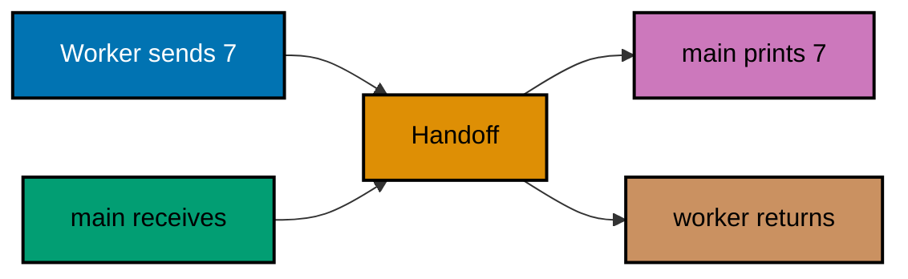

Examples 55–78 apply JSON, generics, a deliberately shallow concurrency preview, testing,
formatting, and context cancellation. CSP depth belongs in the next course.

## Example 55: Round-Trip JSON

_ex-55 · exercises co-18_

`json.Marshal` encodes a struct and `json.Unmarshal` decodes it into another value. Compare the decoded struct with the original only after both JSON operations succeed. The code block is rendered from `learning/code/ex-55-json-marshal-unmarshal/main.go`.

```go
package main

import (
	"encoding/json"
	"fmt"
)

type Release struct { // => The tag maps Go Name to JSON name.
	Name string `json:"name"` // => JSON uses lower-case name as the key.
}

func main() { // => Round-trips one Release value through JSON.
	original := Release{Name: "ship"}    // => Value before crossing the JSON boundary.
	bytes, err := json.Marshal(original) // => Encode Name as {"name":"ship"}.
	if err != nil {                      // => Guard against failed encoding.
		fmt.Println("encode failed:", err) // => Surface the encoder's error.
		return                             // => There is no valid JSON to decode.
	}
	var decoded Release                                     // => Zero-valued destination for Unmarshal.
	if err := json.Unmarshal(bytes, &decoded); err != nil { // => Populate decoded through its address.
		fmt.Println("decode failed:", err) // => Surface malformed JSON or type mismatch.
		return                             // => Avoid comparing a partially decoded value.
	}
	fmt.Println(decoded == original) // => Output: true.
}
```

**Run**: `go run main.go` from this example directory.

**Expected observation**: The program prints `true` when the decoded value equals the original.

**Key takeaway**: `json.Marshal` encodes a struct and `json.Unmarshal` decodes it into another value.

**Why it matters**: A round trip is a useful check that the selected fields survive encoding, but it does not prove that every field or external contract is preserved. Both operations return errors that a real program must handle. Compare the JSON bytes as well as the final Go value to see exactly what crossed the boundary. Add a field with no JSON tag and inspect its wire name.

## Example 56: Omit an Empty JSON Field

_ex-56 · exercises co-18_

The `omitempty` tag leaves an empty field out of encoded JSON. The empty string has no JSON key because its field tag requests omission. The code block is rendered from `learning/code/ex-56-json-omitempty/main.go`.

```go
package main

import (
	"encoding/json"
	"fmt"
)

type Release struct { // => The tag omits empty Name during encoding.
	Name string `json:"name,omitempty"` // => Empty Name is absent from the JSON object.
}

func main() { // => Encodes the zero-valued struct.
	bytes, err := json.Marshal(Release{}) // => Name has its empty-string zero value.
	if err != nil {                       // => Check Marshal before using bytes.
		fmt.Println("encode failed:", err) // => Report the encoder's error.
		return                             // => Do not treat failed output as JSON.
	}
	fmt.Println(string(bytes)) // => Output: {}.
}
```

**Run**: `go run main.go` from this example directory.

**Expected observation**: An empty `Release` encodes as `{}`.

**Key takeaway**: The `omitempty` tag leaves an empty field out of encoded JSON.

**Why it matters**: Omission changes the wire shape; it is not merely a display option. A receiver may distinguish an absent key from a present empty value. Use `omitempty` only when that difference fits the API contract, and remember that its definition of empty depends on the Go field type. Set the field and compare both JSON documents.

## Example 57: Write a Generic Function

_ex-57 · exercises co-19_

The generic `Map` takes a slice of `T` values and a transform from `T` to `U`, returning a slice of `U`. The input integers become distinct string values rather than remaining integers. The code block is rendered from `learning/code/ex-57-generic-function/main.go`.

```go
package main

import "fmt"

func Map[T, U any](values []T, transform func(T) U) []U { // => Input and output types may differ.
	result := make([]U, len(values)) // => One output slot per input.
	for i, value := range values {   // => Keep each transformed value at its input index.
		result[i] = transform(value) // => Here int 1 becomes string "n=1".
	}
	return result // => []U is []string for the call below.
}

func main() { // => Calls Map with integer input and string output.
	words := Map([]int{1, 2}, func(value int) string { return fmt.Sprintf("n=%d", value) }) // => T=int, U=string.
	fmt.Println(words)                                                                      // => Output: [n=1 n=2].
}
```

**Run**: `go run main.go` from this example directory.

**Expected observation**: The example prints `[n=1 n=2]`, making the integer-to-string transformation visible.

**Key takeaway**: Separate type parameters let `Map` turn `[]T` into `[]U` while preserving both concrete types.

**Why it matters**: Generics let `Map` use one iteration algorithm while preserving the input and output types at compile time. It accepts integers and produces strings here; the output prefix makes that change visible. An `any` slice would need assertions before applying a type-specific transform. Keep a generic helper only when callers need the same operation for different types. Try mapping strings to their lengths.

## Example 58: Constrain a Generic Number

_ex-58 · exercises co-19_

A type constraint limits which numeric operations the generic function can perform. The constraint admits only types on which the chosen arithmetic operation is valid. The code block is rendered from `learning/code/ex-58-generic-constraint/main.go`.

```go
package main

import "fmt"

type Number interface{ int | float64 } // => Type set includes int and float64, without named variants.

func Double[T Number](value T) T { return value + value } // => Both permitted types support +.

func main() { fmt.Println(Double(3), Double(2.5)) } // => Output: 6 5.
```

**Run**: `go run main.go` from this example directory.

**Expected observation**: The calls print `6 5` for the chosen numeric types.

**Key takeaway**: A type constraint limits which numeric operations the generic function can perform.

**Why it matters**: A constraint documents the operations a generic algorithm requires and lets the compiler reject unsupported types. It is more precise than accepting `any` and failing at runtime. When building a new generic function, start from the operation inside it, then choose the smallest type set that permits that operation. Try a string argument and inspect the compile error.

## Example 59: Use a Comparable Constraint

_ex-59 · exercises co-19_

The `comparable` constraint allows equality comparison of values of the same type. Equality is permitted by `comparable`, but ordering would require a different constraint. The code block is rendered from `learning/code/ex-59-comparable-constraint/main.go`.

```go
package main

import "fmt"

func Contains[T comparable](values []T, wanted T) bool { // => T must support ==.
	for _, value := range values { // => Inspect each candidate.
		if value == wanted { // => Compare same-type values.
			return true // => First match ends the search.
		}
	}
	return false // => No element matched wanted.
}

func main() { fmt.Println(Contains([]string{"go", "rust"}, "go")) } // => Output: true.
```

**Run**: `go run main.go` from this example directory.

**Expected observation**: The equality check prints `true`.

**Key takeaway**: The `comparable` constraint allows equality comparison of values of the same type.

**Why it matters**: Not every Go type is comparable: slices, maps, and functions cannot be compared with `==` except against nil where allowed. A generic equality helper needs this constraint so invalid calls fail at compile time. The constraint does not imply ordering with `<` or `>`; those are different capabilities. Try calling the helper with a slice.

## Example 60: Start a Goroutine

_ex-60 · exercises co-20_

A goroutine runs a function concurrently, while `WaitGroup` keeps `main` alive until it finishes. `Wait` ensures the command does not exit before the launched function completes. The code block is rendered from `learning/code/ex-60-goroutine-preview/main.go`.

```go
package main

import (
	"fmt"
	"sync"
)

func main() { // => Waits for one worker to print before exit.
	var wait sync.WaitGroup                                     // => Tracks the single worker.
	wait.Add(1)                                                 // => Register it before starting.
	go func() { defer wait.Done(); fmt.Println("goroutine") }() // => Done runs after printing.
	wait.Wait()                                                 // => Main waits, so the message is observable.
}
```

**Run**: `go run main.go` from this example directory.

**Expected observation**: The worker prints `goroutine` before the process exits.

**Key takeaway**: A goroutine runs a function concurrently, while `WaitGroup` keeps `main` alive until it finishes.

**Why it matters**: Starting a goroutine does not make the process wait for it. Without an owner that waits or cancels, work can be lost when `main` returns. This preview demonstrates only lifetime coordination; it does not establish a general design for shared data, errors, cancellation, or a pipeline. Remove `Wait` and explain why output becomes unreliable.

## Example 61: Start an Anonymous Goroutine

_ex-61 · exercises co-20_

An anonymous function can receive an argument when started as a goroutine. The worker receives its label as an argument rather than reading mutable outer state. The code block is rendered from `learning/code/ex-61-goroutine-anonymous/main.go`.

```go
package main

import (
	"fmt"
	"sync"
)

func main() { // => Passes a label to one anonymous worker.
	var wait sync.WaitGroup                                                      // => Tracks the anonymous worker.
	wait.Add(1)                                                                  // => Register before launch.
	go func(label string) { defer wait.Done(); fmt.Println(label) }("anonymous") // => Pass label at launch.
	wait.Wait()                                                                  // => Output: anonymous before main exits.
}
```

**Run**: `go run main.go` from this example directory.

**Expected observation**: The worker prints `anonymous` before exit.

**Key takeaway**: An anonymous function can receive an argument when started as a goroutine.

**Why it matters**: Passing a value to the goroutine makes its input explicit at launch. That helps avoid surprising captures of variables that may change before the function runs. The `WaitGroup` still owns completion: without it, the command could end before the print occurs. Keep both data hand-off and lifetime visible. Change the label argument and trace where it is captured.

## Example 62: Synchronize with an Unbuffered Channel

_ex-62 · exercises co-21_

An unbuffered channel send pairs with a receive before either operation completes. The channel
cannot store `7` while the receiver is absent. The code block is rendered from
`learning/code/ex-62-unbuffered-channel/main.go`.



```go
package main

import "fmt"

func main() { // => Pairs one worker send with one main receive.
	values := make(chan int)    // => Zero capacity means each send needs a receiver.
	go func() { values <- 7 }() // => Worker blocks until main receives 7.
	fmt.Println(<-values)       // => Receive pairs with send; output: 7.
}
```

**Run**: `go run main.go` from this example directory.

**Expected observation**: The value `7` reaches the receiver.

**Key takeaway**: An unbuffered channel send pairs with a receive before either operation completes.

**Why it matters**: The hand-off gives two goroutines a synchronization point as well as a value. A send with no possible receiver blocks, so identify who receives and how a blocked worker can stop. This simple exchange is the foundation for later concurrent patterns, but it is not a complete cancellation policy. Remove the receive: the worker cannot finish its send before `main` exits.

## Example 63: Buffer a Channel

_ex-63 · exercises co-21_

A buffered channel can hold values up to its capacity without an immediate receiver. Two values fit in the buffer before a receiver starts draining them. The code block is rendered from `learning/code/ex-63-buffered-channel/main.go`.

```go
package main

import "fmt"

func main() { // => Queues exactly two values in a two-slot buffer.
	values := make(chan int, 2)     // => Buffer holds two queued integers.
	values <- 1                     // => First send fits without a receiver.
	values <- 2                     // => Second send fills the buffer.
	fmt.Println(<-values, <-values) // => FIFO receives print 1 2.
}
```

**Run**: `go run main.go` from this example directory.

**Expected observation**: The two received values print `1 2`.

**Key takeaway**: A buffered channel can hold values up to its capacity without an immediate receiver.

**Why it matters**: Buffering changes when a send blocks, not whether every sent value must eventually be handled. Choosing capacity can absorb short bursts, but a full buffer still blocks and can hide backpressure. Use a buffer for a stated reason rather than as a default fix for a blocked send. Reduce the capacity and compare send behavior.

## Example 64: Hand Off a Channel Value

_ex-64 · exercises co-21_

A channel carries a typed value from one goroutine to another. The receive gives `main` the worker’s string and waits for its send. The code block is rendered from `learning/code/ex-64-channel-handoff/main.go`.

```go
package main

import "fmt"

func main() { // => Receives one string from a worker.
	result := make(chan string)      // => Carries one string with no buffer.
	go func() { result <- "ship" }() // => Worker waits for main to receive.
	fmt.Println(<-result)            // => Handoff completes; output: ship.
}
```

**Run**: `go run main.go` from this example directory.

**Expected observation**: The receiver prints `ship`.

**Key takeaway**: A channel carries a typed value from one goroutine to another.

**Why it matters**: A typed channel makes the hand-off contract explicit and lets the compiler reject the wrong payload type. The receiver also provides a synchronization point. In a larger task, decide who owns the channel, whether it closes, and how cancellation ends a blocked send or receive. Change the channel type and inspect the compile error.

## Example 65: Close and Range a Channel

_ex-65 · exercises co-21_

Closing a channel lets a `range` loop stop after buffered or sent values are drained. Closing after the final send lets the receiving range loop terminate. The code block is rendered from `learning/code/ex-65-channel-close-range/main.go`.

```go
package main

import "fmt"

func main() { // => Closes a filled buffer so range can terminate.
	values := make(chan int, 2) // => Room for both values before reads.
	values <- 1                 // => First queued value.
	values <- 2                 // => Second queued value.
	close(values)               // => Signal that no further values will arrive.
	for value := range values { // => Drain buffer; stop when closed and empty.
		fmt.Println(value) // => Prints 1, then 2.
	}
}
```

**Run**: `go run main.go` from this example directory.

**Expected observation**: The receiver prints `1` and `2`, then ends.

**Key takeaway**: Closing a channel lets a `range` loop stop after buffered or sent values are drained.

**Why it matters**: Only the sender should normally close a channel, and closing says no more values will arrive; it does not erase queued values. Without closure or another stop signal, a range receiver can wait forever. This pattern is useful for finite streams when ownership is clear. Remove `close` and explain why the loop cannot finish.

## Example 66: Detect a Closed Channel

_ex-66 · exercises co-21_

The two-result receive distinguishes a zero value from a closed, drained channel. The boolean distinguishes a drained closed channel from a real zero value. The code block is rendered from `learning/code/ex-66-channel-comma-ok/main.go`.

```go
package main

import "fmt"

func main() { // => Reads from an already closed empty channel.
	values := make(chan int) // => Channel starts open and empty.
	close(values)            // => No values can arrive now.
	value, open := <-values  // => Closed empty channel yields 0, false.
	fmt.Println(value, open) // => Output: 0 false.
}
```

**Run**: `go run main.go` from this example directory.

**Expected observation**: The receive prints `0 false`.

**Key takeaway**: The two-result receive distinguishes a zero value from a closed, drained channel.

**Why it matters**: A closed channel can still yield buffered values first. Once drained, it yields the element type’s zero value with `ok == false`. Ignoring the boolean can mistake end-of-stream for real data when zero is valid. Use this form where a receiver must detect completion explicitly. Buffer a value before closing and compare successive receives.

## Example 67: Select a Ready Channel

_ex-67 · exercises co-22_

`select` chooses one channel operation that is ready; if several are ready, the choice is not ordered. Both channels are ready, so either branch can be selected on a run. The code block is rendered from `learning/code/ex-67-select-basic/main.go`.

```go
package main

import "fmt"

func main() { // => Makes both select branches ready before selection.
	left, right := make(chan string, 1), make(chan string, 1) // => Each has one slot.
	left <- "left"                                            // => Left receive is ready.
	right <- "right"                                          // => Right receive is also ready.
	select {                                                  // => Choose one ready case; no ordering guarantee.
	case value := <-left: // => One possible branch.
		fmt.Println(value) // => Could print left.
	case value := <-right: // => Other possible branch.
		fmt.Println(value) // => Could print right.
	}
}
```

**Run**: `go run main.go` from this example directory.

**Expected observation**: The program may print `left` or `right`.

**Key takeaway**: `select` chooses one channel operation that is ready; if several are ready, the choice is not ordered.

**Why it matters**: This example intentionally prepares two ready channels, so neither branch has priority. Tests that expect `left` every time would be flaky despite correct Go behavior. Use `select` to wait on alternative operations, not to encode ordering; establish priority with explicit logic when a contract requires it. Run repeatedly and observe that either branch is allowed.

## Example 68: Use a Non-Blocking Select

_ex-68 · exercises co-22_

A `default` case lets `select` proceed when no channel case is ready. The fallback branch runs immediately when the channel has no value ready. The code block is rendered from `learning/code/ex-68-select-default-nonblock/main.go`.

```go
package main

import "fmt"

func main() { // => Uses default because no sender makes receive ready.
	values := make(chan int) // => No sender exists, so receive is unready.
	select {                 // => Default prevents waiting indefinitely.
	case value := <-values: // => Cannot run for this program state.
		fmt.Println(value) // => Would print only if a value arrived.
	default: // => Runs immediately when receive is unready.
		fmt.Println("not ready") // => Output: not ready.
	}
}
```

**Run**: `go run main.go` from this example directory.

**Expected observation**: The program prints `not ready`.

**Key takeaway**: A `default` case lets `select` proceed when no channel case is ready.

**Why it matters**: A nonblocking check can be useful for optional work, but a busy loop around `default` can waste CPU. If the program should actually wait for a value or cancellation, omit `default` and supply a suitable context or stop channel. To compare branches, change the channel to `make(chan int, 1)`, send a value before `select`, and observe the receive case; a direct unbuffered send would block before reaching `select`.

## Example 69: Select with a Timeout

_ex-69 · exercises co-22_

`time.After` provides a channel that becomes ready after a duration. With no competing case, the timer channel is the only way this select can proceed. The code block is rendered from `learning/code/ex-69-select-timeout/main.go`.

```go
package main

import (
	"fmt"
	"time"
)

func main() { // => Waits for the only select case, a timer.
	select { // => Waits because there is no default branch.
	case <-time.After(time.Millisecond): // => Timer channel becomes ready after roughly 1 ms.
		fmt.Println("timed out") // => Only possible output.
	}
}
```

**Run**: `go run main.go` from this example directory.

**Expected observation**: The program prints `timed out` after its timer fires.

**Key takeaway**: `time.After` provides a channel that becomes ready after a duration.

**Why it matters**: A timeout bounds waiting, but this isolated example has no competing operation: it is effectively a timer demonstration. In a real select, the timer case competes with useful work, and simultaneous readiness is nondeterministic. Decide what result or cleanup is needed when time runs out. Add a second ready case and explain the selection rule.

## Example 70: Coordinate with a WaitGroup

_ex-70 · exercises co-23_

A `WaitGroup` tracks two goroutines and lets `main` wait for both. The worker values can print in either order, but `all done` follows both. The code block is rendered from `learning/code/ex-70-waitgroup/main.go`.

```go
package main

import (
	"fmt"
	"sync"
)

func main() { // => Waits for two workers before printing completion.
	var wait sync.WaitGroup  // => Counts unfinished workers.
	for i := 0; i < 2; i++ { // => Launch workers for 0 and 1.
		wait.Add(1)                                                     // => Register each before launch.
		go func(value int) { defer wait.Done(); fmt.Println(value) }(i) // => Pass i; print order varies.
	}
	wait.Wait()             // => Blocks until both Done calls.
	fmt.Println("all done") // => Always printed after both numbers.
}
```

**Run**: `go run main.go` from this example directory.

**Expected observation**: Both numbers appear in either order, followed by `all done`.

**Key takeaway**: A `WaitGroup` tracks two goroutines and lets `main` wait for both.

**Why it matters**: The group coordinates completion, not output order. Each goroutine calls `Done` exactly once after a matching `Add`; missing either side can hang or let work escape. Use a group when you need to wait for a known set of tasks, then choose another mechanism for values and errors. Run repeatedly and avoid asserting which number prints first.

## Example 71: Guard State with a Mutex

_ex-71 · exercises co-23_

A mutex protects the shared counter while two goroutines update it. The mutex protects the increment, while the wait group protects completion before printing. The code block is rendered from `learning/code/ex-71-mutex/main.go`.

```go
package main

import (
	"fmt"
	"sync"
)

func main() { // => Protects two concurrent increments with a mutex.
	var mutex sync.Mutex     // => Protects shared count.
	count := 0               // => Both workers increment this one value.
	var wait sync.WaitGroup  // => Tracks both workers.
	for i := 0; i < 2; i++ { // => Spawn two increments.
		wait.Add(1)                                                                    // => Register before starting each goroutine.
		go func() { defer wait.Done(); mutex.Lock(); defer mutex.Unlock(); count++ }() // => Lock surrounds count++.
	}
	wait.Wait()        // => Read count only after both writers finish.
	fmt.Println(count) // => Output: 2.
}
```

**Run**: `go run main.go` from this example directory.

**Expected observation**: The final count prints `2`.

**Key takeaway**: A mutex protects the shared counter while two goroutines update it.

**Why it matters**: `count++` reads and writes shared state, so concurrent updates without synchronization can race or lose increments. A mutex makes the critical section exclusive; the `WaitGroup` separately ensures both workers finish before printing. Those two tools solve different problems. Run the race detector when changing shared-state examples. Remove the lock and test with `go test -race` in a suitable test.

## Example 72: Write a Basic Test

_ex-72 · exercises co-24_

A Go test lives in a `_test.go` file and checks behavior with `testing.T`. The companion test checks `double` directly; the command’s print is not the assertion. The code block is rendered from `learning/code/ex-72-test-basic/main.go`.

```go
package main

import "fmt"

func double(value int) int { return value * 2 } // => For input 4, returns 8.

func main() { fmt.Println(double(4)); fmt.Println("Put TestDouble in main_test.go and run go test") } // => Shows result, then test command hint.
```

**Companion test source (`main_test.go`)**:

```go
package main

import "testing"

func TestDouble(t *testing.T) { // => go test discovers this Test-prefixed function.
	if got := double(2); got != 4 { // => Input 2 must produce 4.
		t.Fatalf("double(2) = %d", got) // => Report the actual result on failure.
	}
}
```

Run `go test main.go main_test.go` to exercise this exact test source.

**Run**: `go test main.go main_test.go` from this example directory.

**Expected observation**: `go test` passes; running `main.go` prints a separate demonstration message.

**Key takeaway**: A Go test lives in a `_test.go` file and checks behavior with `testing.T`.

**Why it matters**: Tests should call the behavior and fail on a wrong result, not merely run the command and inspect a reassuring print. The companion file checks `double` directly. This is a small unit test you can extend with a failing case before changing the implementation. Change the expected result and confirm a failing assertion.

## Example 73: Use a Table-Driven Test

_ex-73 · exercises co-24_

A table-driven test runs one behavior against input and expected-output rows. This table groups two input and expected-result pairs under one test function. The code block is rendered from `learning/code/ex-73-table-driven-test/main.go`.

```go
package main

import "fmt"

func double(value int) int { return value * 2 } // => Function under the two cases below.

func main() { // => Evaluates two table rows against double.
	for _, test := range []struct{ in, want int }{{2, 4}, {3, 6}} { // => Inputs 2 and 3 expect 4 and 6.
		fmt.Println(double(test.in) == test.want) // => Prints true for both cases.
	}
}
```

**Companion test source (`main_test.go`)**:

```go
package main

import "testing"

func TestDoubleCases(t *testing.T) { // => One test function checks two rows.
	for _, test := range []struct{ in, want int }{{2, 4}, {3, 6}} { // => 2→4 and 3→6.
		if got := double(test.in); got != test.want { // => Compare output with this row's want.
			t.Fatalf("double(%d) = %d", test.in, got) // => Identify the failing input and actual value.
		}
	}
}
```

Run `go test main.go main_test.go` to exercise this exact test source.

**Run**: `go test main.go main_test.go` from this example directory.

**Expected observation**: `go test` passes for the table’s cases.

**Key takeaway**: A table-driven test runs one behavior against several input and expected-output rows.

**Why it matters**: A table keeps related cases together and makes omissions easier to spot. Each row should describe a behavior, especially edge and failure cases, so a failed run points to what broke. A table is useful when the same assertion applies across several inputs, not as ceremony for one case. Add a row that first fails, then fix the function.

## Example 74: Name Subtests

_ex-74 · exercises co-24_

`t.Run` gives each case a named subtest in test output. Subtest names appear in verbose output and identify which case fails. The code block is rendered from `learning/code/ex-74-subtests-run/main.go`.

```go
package main

import "fmt"

func main() { // => Shows two test case names printed in sequence.
	for _, name := range []string{"positive", "zero"} { // => Two case labels.
		fmt.Println("subtest:", name) // => Prints each label; actual subtests are in main_test.go.
	}
}
```

**Companion test source (`main_test.go`)**:

```go
package main

import "testing"

func TestNamedCases(t *testing.T) { // => Parent test groups named cases.
	for _, name := range []string{"positive", "zero"} { // => Each label becomes a subtest name.
		t.Run(name, func(t *testing.T) { t.Log(name) }) // => Full subtest names end in /positive or /zero.
	}
}
```

Run `go test main.go main_test.go` to exercise this exact test source.

**Run**: `go test main.go main_test.go` from this example directory.

**Expected observation**: `go test` passes; verbose mode shows each subtest name.

**Key takeaway**: `t.Run` gives each case a named subtest in test output.

**Why it matters**: Subtests make a suite easier to diagnose because a failure identifies its scenario. They also allow selecting a subset during local work. Names should state the behavior or boundary, not just an index. Keep each assertion focused so the subtest’s result remains informative. Run `go test -v` and inspect the reported names.

## Example 75: Format with gofmt

_ex-75 · exercises co-25_

`gofmt` produces Go’s standard source formatting. Use the deliberately unformatted fixture to see a real formatter diff without editing source. The runnable `main.go` prints a reminder; the
unformatted fixture below is the input for the formatting command.

```go
package main

import "fmt"

func main() { fmt.Println("run gofmt -d unformatted.go.txt to inspect formatting") } // => Output names the fixture command.
```

**Unformatted input (`unformatted.go.txt`)**:

```go
package main
import "fmt"
func main(){fmt.Println("formatted by gofmt")}
```

**Run**: `gofmt -d unformatted.go.txt` to see the whitespace changes, then
`gofmt unformatted.go.txt` to print the formatted source without changing either file.

**Expected observation**: the diff adds a blank line and spaces around the function body; the
second command prints a valid, formatted Go program. `gofmt -d` exits with status 1 because the
fixture differs from formatted source.

**Key takeaway**: `gofmt` produces Go’s standard source formatting.

**Why it matters**: Consistent formatting removes style debates and makes diffs easier to review.
The meaningful operation here is the formatter command, not the reminder printed by the program.
`-d` displays proposed edits and the command without `-w` prints formatted source, so both are safe
to inspect before changing a file. Use `gofmt -w` only when you want the source rewritten.

## Example 76: Apply Exported Naming

_ex-76 · exercises co-25_

Identifiers beginning with an uppercase letter are exported from a package. The exported field remains reachable outside the package while the constructor stays local. The code block is rendered from `learning/code/ex-76-effective-go-naming/main.go`.

```go
package main

import "fmt"

type Release struct{ Name string } // => Exported type and field use capital initials.

func newRelease(name string) Release { return Release{Name: name} } // => Unexported helper uses lower-case initial.

func main() { fmt.Println(newRelease("ship").Name) } // => Output: ship.
```

**Run**: `go run main.go` from this example directory.

**Expected observation**: The sample prints `ship`.

**Key takeaway**: Identifiers beginning with an uppercase letter are exported from a package.

**Why it matters**: Exported naming is a visibility rule, not just a style choice. Another package can refer to an exported declaration, while a lower-case declaration stays package-local. Choose the smallest public surface that callers need, and use clear names because exported names become part of the package contract. Try importing an unexported identifier from another package.

## Example 77: Cancel a Context

_ex-77 · exercises co-26_

Calling a context’s cancel function closes its `Done` channel and records cancellation. Canceling closes `Done` and sets an error that cooperating work can inspect. The code block is rendered from `learning/code/ex-77-context-cancel/main.go`.

```go
package main

import (
	"context"
	"fmt"
)

func main() { // => Cancels a child context before reading Done.
	ctx, cancel := context.WithCancel(context.Background()) // => Obtain a cancelable child context.
	cancel()                                                // => Closes Done and records Canceled.
	<-ctx.Done()                                            // => Immediate receive after cancellation.
	fmt.Println(ctx.Err() == context.Canceled)              // => Output: true.
}
```

**Run**: `go run main.go` from this example directory.

**Expected observation**: The comparison with `context.Canceled` prints `true`.

**Key takeaway**: Calling a context’s cancel function closes its `Done` channel and records cancellation.

**Why it matters**: Cancellation is a signal that work receiving the context must observe; it does not forcibly stop arbitrary goroutines. Call the cancel function when ownership ends to release associated resources, even if a timeout would eventually fire. This example checks the signal; later concurrent code must wire that signal into blocking operations. Pass this context to a worker and check its stop path.

## Example 78: Time Out a Context

_ex-78 · exercises co-26_

A timeout context cancels itself when its deadline passes. The deadline eventually closes `Done` and records `DeadlineExceeded`. The code block is rendered from `learning/code/ex-78-context-timeout/main.go`.

```go
package main

import (
	"context"
	"fmt"
	"time"
)

func main() { // => Waits for the deadline before reading Err.
	ctx, cancel := context.WithTimeout(context.Background(), time.Millisecond) // => Deadline about 1 ms away.
	defer cancel()                                                             // => Release timer resources after main.
	<-ctx.Done()                                                               // => Wait until deadline closes Done.
	fmt.Println(ctx.Err() == context.DeadlineExceeded)                         // => Output: true.
}
```

**Run**: `go run main.go` from this example directory.

**Expected observation**: The comparison with `context.DeadlineExceeded` prints `true`.

**Key takeaway**: A timeout context cancels itself when its deadline passes.

**Why it matters**: A deadline bounds work only when the called operation cooperates with the context. The returned cancel function should still be called to release resources promptly. Distinguish deadline expiry from manual cancellation when a caller needs a different response or retry decision. Shorten the timeout and inspect the same error category.
