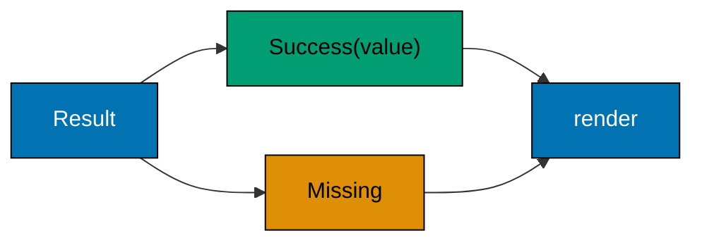

Build on the first section with validated records, sealed hierarchies, patterns, generics, maps, and streams. Guarded switch patterns work on Java 21 and later.

## Example 27: record compact ctor

**Purpose:** A compact record constructor validates components before generated field assignment. The compact constructor rejects a negative priority before Java assigns the validated components.

```java
public final class Example27 {
    record Task(String name, int priority) {
        // => A Task carries two components whose generated fields are final.
        Task {
            // => This compact form receives component parameters before field assignment.
            if (name.isBlank() || priority < 0) { // => Blank names and negative priorities enter the rejection branch.
            // => | priority < 0) {|Either invalid condition is enough to reject the value.
                throw new IllegalArgumentException("invalid task");
                // => No Task is returned from a failing constructor.
            } // => compact constructor validates before field assignment
        }
    }
    public static void main(String[] args) {
        System.out.println(new Task("read", 1).priority()); // => 1
        // => The valid record retains priority 1.
    }
}
```

Run from the `learning/` directory: `cd code/ex-27-record-compact-ctor && javac Example27.java && java Example27`.

Expected output:

```text
1
```

**Try it:** Pass a negative priority and inspect the failure.

**Key takeaway:** Validated records keep data carrier invariants near construction.

**Why it matters:** A compact record constructor validates components before Java assigns them to
the generated fields. That puts the invariant next to the data declaration, where every construction
path uses it. A task with a negative priority would be hard to rank or display consistently, so this
example rejects it immediately. Test both valid and invalid construction when you add such a rule.

## Example 28: sealed interface

**Purpose:** A sealed interface names the only permitted direct implementors. The permits clause closes the set of direct implementations to the types named there.

```java
public final class Example28 {
    sealed interface Result permits Success, Missing {}
    // => Only Success and Missing may directly implement Result.
    record Success(String value) implements Result {}
    // => Success carries a String payload.
    record Missing() implements Result {}
    // => Missing has no payload components.
    public static void main(String[] args) {
        Result result = new Missing(); // => result has the permitted Missing variant.
        // => The static type is Result; the runtime variant is Missing.
        System.out.println(result instanceof Missing); // => true
        // => The type check succeeds for this variant.
    }
}
```

Run from the `learning/` directory: `cd code/ex-28-sealed-interface && javac Example28.java && java Example28`.

Expected output:

```text
true
```

**Try it:** Try adding another implementation outside the permits list.

**Key takeaway:** A closed variant set lets the compiler reason about all cases.

**Why it matters:** A sealed interface limits which types may directly implement a result contract.
This matters when a program must account for every outcome, such as success and missing data,
without unknown implementations appearing later. The example shows the permitted variants as records
and checks one at runtime. The real payoff comes when a switch can be exhaustive over the closed
set.

## Example 29: sealed record hierarchy

**Purpose:** Records implement each sealed variant, and an exhaustive switch renders them. Each record carries a different result shape, which the switch renders through its corresponding case.

The sealed declaration restricts the result shapes the switch must handle:



```java
public final class Example29 {
    sealed interface Result permits Success, Missing {}
    // => The permits list gives the switch a closed set of cases.
    record Success(String value) implements Result {}
    // => Success carries the value returned by its case.
    record Missing() implements Result {}
    // => Missing needs its own case because it has no value.
    static String render(Result result) {
        // => The method returns a String for either permitted variant.
        return switch (result) {
            // => The switch produces a value rather than only executing statements.
            case Success(var value) -> value; // => Success returns its carried value.
            // => The record pattern binds value from the Success component.
            case Missing ignored -> "missing"; // => Missing returns a label because it carries no value.
        }; // => all permitted record variants covered
    }
    public static void main(String[] args) {
        System.out.println(render(new Success("ready"))); // => ready
        // => Success("ready") selects the first case.
    }
}
```

Run from the `learning/` directory: `cd code/ex-29-sealed-record-hierarchy && javac Example29.java && java Example29`.

Expected output:

```text
ready
```

**Try it:** Render Missing as well as Success.

**Key takeaway:** The model exposes each result shape without sentinel strings.

**Why it matters:** A sealed hierarchy and records work well together for outcomes with different
data shapes. Success carries a value, while Missing carries none, so a caller cannot accidentally
read a nonexistent success value. The switch handles each permitted variant and returns a label.
When you add a new result type, compilation points to places where the new case needs attention.

## Example 30: instanceof pattern

**Purpose:** An instanceof pattern tests type and introduces a scoped variable in one step. The pattern variable exists only after the type test succeeds, so the branch can use it safely.

```java
public final class Example30 {
    public static void main(String[] args) {
        Object value = "java"; // => value holds a String even though its declared type is Object.
        // => The declared Object type permits many runtime values.
        if (value instanceof String text) { // => text is in scope on match
        // => The match both checks String and binds text.
            System.out.println(text.toUpperCase()); // => JAVA
        }
    }
}
```

Run from the `learning/` directory: `cd code/ex-30-instanceof-pattern && javac Example30.java && java Example30`.

Expected output:

```text
JAVA
```

**Try it:** Pass a non-string object and inspect the branch.

**Key takeaway:** Pattern variables remove redundant casts while retaining type safety.

**Why it matters:** An instanceof pattern combines a type test and a scoped variable, so the code
does not need an unchecked cast after the condition. This is useful at a boundary that receives a
broad Object value but should use string behavior only when appropriate. The example prints
uppercase text only for a String. A non-string value follows another path rather than causing a
ClassCastException.

## Example 31: switch pattern

**Purpose:** A pattern switch chooses behavior from the runtime variant of a sealed hierarchy. The switch selects the Circle or Square calculation according to the runtime record type.

```java
public final class Example31 {
    sealed interface Shape permits Circle, Square {}
    // => Only Circle and Square are permitted direct shapes.
    record Circle(int radius) implements Shape {}
    // => A Circle stores one radius component.
    record Square(int side) implements Shape {}
    // => A Square stores one side component.
    static int measure(Shape shape) {
        // => The helper accepts either subtype through Shape.
        return switch (shape) {
            // => The selected arm supplies the int returned by measure.
            case Circle circle -> circle.radius();
            // => The Circle pattern binds circle before its accessor runs.
            // => For Circle(2), the selected arm evaluates to 2.
            case Square square -> square.side();
            // => The Square pattern binds square before its accessor runs.
        }; // => chooses by runtime variant
    }
    public static void main(String[] args) {
        System.out.println(measure(new Circle(2))); // => 2
        // => The Square arm is skipped for this runtime value.
    }
}
```

Run from the `learning/` directory: `cd code/ex-31-switch-pattern && javac Example31.java && java Example31`.

Expected output:

```text
2
```

**Try it:** Measure a Square and compare with Circle.

**Key takeaway:** Pattern switches centralize behavior over small variant sets.

**Why it matters:** Pattern switches dispatch on the runtime variant of a small, known hierarchy. In
a shape model, each variant owns different data, and the switch gives each case a type-safe
variable. The example returns a simple measurement to keep dispatch visible. For larger models,
consider whether the operation belongs on the types themselves or in one central visitor function.

## Example 32: switch exhaustive

**Purpose:** An exhaustive switch over a sealed type needs no default branch. Covering every permitted subtype lets the switch expression produce a value without a default case.

```java
public final class Example32 {
    sealed interface Shape permits Circle, Square {}
    // => The sealed parent exposes every permitted variant to the compiler.
    record Circle(int radius) implements Shape {}
    // => Circle carries the radius used by its area formula.
    record Square(int side) implements Shape {}
    // => Square carries the side used by its area formula.
    static int area(Shape shape) {
        // => The one method handles either Shape subtype.
        return switch (shape) {
            // => An exhaustive switch expression must yield an int.
            case Circle c -> (int) Math.round(Math.PI * c.radius() * c.radius());
            // => Circle uses πr², rounded to int.
            case Square s -> s.side() * s.side();
            // => Square(3) yields 3 × 3 = 9.
            // => The Square arm is selected for the value created below.
        }; // => no default needed: Shape is sealed
    }
    public static void main(String[] args) {
        System.out.println(area(new Square(3))); // => 9
        // => Adding another permitted subtype would require another case.
    }
}
```

Run from the `learning/` directory: `cd code/ex-32-switch-exhaustive && javac Example32.java && java Example32`.

Expected output:

```text
9
```

**Try it:** Add a third permitted shape and observe the compiler diagnostic.

**Key takeaway:** Compile-time exhaustiveness catches newly added variants.

**Why it matters:** An exhaustive switch over a sealed type lets the compiler help detect missing
variants. Without a default case, adding a new Shape requires reviewing this area calculation rather
than silently falling into a generic branch. The example computes a rounded circle area and an exact
square area. Notice that the two cases have different formulas, which is why every case deserves an
explicit rule.

## Example 33: switch guard

**Purpose:** A when guard adds a condition to a matching record pattern; this syntax is available in Java 21. A matching Circle reaches the guarded branch only when its radius passes the extra condition.

```java
public final class Example33 {
    record Circle(int radius) {}
    // => The pattern can deconstruct this one-component record.
    static String describe(Object value) {
        // => Object admits Circle and non-Circle inputs.
        return switch (value) {
            // => Cases are tested in order until one matches.
            case Circle(var radius) when radius > 0 -> "positive circle";
            // => The bound radius is 2 and passes the guard.
            // => The guarded case must appear before the broader Circle case.
            case Circle ignored -> "empty circle";
            // => This broader Circle case handles zero or negative radius.
            default -> "not a circle";
            // => Non-Circle values reach the fallback.
        }; // => guarded case must precede unguarded Circle
    }
    public static void main(String[] args) {
        System.out.println(describe(new Circle(2))); // => positive circle
        // => The result is the guarded branch's text.
    }
}
```

Run from the `learning/` directory: `cd code/ex-33-switch-guard && javac Example33.java && java Example33`.

Expected output:

```text
positive circle
```

**Try it:** Try radius zero and then a non-circle value.

**Key takeaway:** Guard order makes overlapping cases unambiguous.

**Why it matters:** A guarded case matches a pattern and then checks a further condition. A circle
with a positive radius takes the first branch; another circle reaches the next branch, and unrelated
values reach default. Case order matters because the unguarded circle case would otherwise consume
all circles. Java finalized guarded pattern switches in 21, so this example needs no Java 25-only
syntax.

The [`when` guard is part of Java 21 pattern switches](https://openjdk.org/jeps/441).

## Example 34: switch record deconstruct

**Purpose:** A record pattern extracts components inside a switch case. The record pattern binds coordinates directly, avoiding separate calls to x() and y().

```java
public final class Example34 {
    record Point(int x, int y) {}
    // => The Point record exposes two ordered components.
    public static void main(String[] args) {
        Object value = new Point(2, 3); // => The runtime value is a Point with components 2 and 3.
        String location = switch (value) { // => location receives the selected pattern’s result.
        // => A String is assigned from whichever case matches.
            case Point(var x, var y) -> x + "," + y; // => record pattern
            // => The pattern binds x=2 and y=3.
            default -> "unknown";
            // => A non-Point object would produce unknown.
        };
        System.out.println(location); // => 2,3
    }
}
```

Run from the `learning/` directory: `cd code/ex-34-switch-record-deconstruct && javac Example34.java && java Example34`.

Expected output:

```text
2,3
```

**Try it:** Change the point coordinates and predict the joined text.

**Key takeaway:** Deconstruction avoids repeated accessor calls in variant handling.

**Why it matters:** Record patterns expose component values directly in a switch case. This is
helpful when rendering a small structured value such as a coordinate, especially when an operation
needs several components at once. The example joins x and y into text and keeps an explicit fallback
for other object types. A named accessor remains fine when only one component is needed.

## Example 35: generic method

**Purpose:** A generic method uses one type variable across arguments and return value. Both arguments determine one inferred type parameter that also describes the return value.

```java
public final class Example35 {
    static <T> T choose(T first, T second, boolean useFirst) {
        // => The type variable relates both arguments to the return type.
        return useFirst ? first : second; // => result and arguments share T
        // => True selects first; false selects second.
    }
    public static void main(String[] args) {
        System.out.println(choose("left", "right", true)); // => left
        // => String is inferred for T at this call.
    }
}
```

Run from the `learning/` directory: `cd code/ex-35-generic-method && javac Example35.java && java Example35`.

Expected output:

```text
left
```

**Try it:** Call choose with integers, then predict the inferred return type.

**Key takeaway:** Type parameters preserve relationships that Object would erase.

**Why it matters:** A generic method expresses a relationship between its inputs and output without
fixing the method to one concrete type. Choosing between two String values returns String, and the
same method can choose between two Integer values. That relationship would be lost with Object and
casts. The example keeps the selection rule simple so the type parameter's role stays visible.

## Example 36: generic class

**Purpose:** A generic class retains a value's element type across methods. A Box<String> stores and returns a String without asking the caller to cast.

```java
public final class Example36 {
    static final class Box<T> {
        // => T names the stored element type for this Box instance.
        private final T value;
        // => A Box<Integer> field stores an Integer value.
        Box(T value) { this.value = value; }
        // => Construction initializes the field with the supplied T.
        T get() { return value; }
        // => get preserves T without returning Object.
    }
    public static void main(String[] args) {
        Box<Integer> box = new Box<>(7); // => box stores an Integer value of 7.
        // => The diamond infers Integer from the target type.
        System.out.println(box.get() + 1); // => 8
        // => The returned Integer is unboxed for arithmetic.
    }
}
```

Run from the `learning/` directory: `cd code/ex-36-generic-class && javac Example36.java && java Example36`.

Expected output:

```text
8
```

**Try it:** Create a Box of String and call get.

**Key takeaway:** Reusable containers can remain statically typed.

**Why it matters:** A generic class can store a value while preserving its type for all readers. A
Box<Integer> returns an Integer that the caller can use in arithmetic without casting, and a
Box<String> can serve another use. This is the foundation of typed collections and repositories. The
example does not add complex container behavior; its purpose is to show type retention across a
constructor and method.

## Example 37: bounded type

**Purpose:** An upper bound lets a generic method call Number behavior on its input. The Number bound makes doubleValue available while still admitting different numeric wrapper types.

```java
public final class Example37 {
    static <T extends Number> double doubled(T value) {
        // => The Number bound permits numeric wrapper arguments.
        return value.doubleValue() * 2; // => Number method available via bound
        // => An Integer 3 becomes double 3.0 before multiplication.
    }
    public static void main(String[] args) {
        System.out.println(doubled(3)); // => 6.0
        // => The generic call infers Integer for T.
    }
}
```

Run from the `learning/` directory: `cd code/ex-37-bounded-type && javac Example37.java && java Example37`.

Expected output:

```text
6.0
```

**Try it:** Try an Integer and a Double value.

**Key takeaway:** Bounds express exactly what operations a generic algorithm needs.

**Why it matters:** An upper bound promises that a type variable supports operations from Number.
The method can call doubleValue without knowing whether the caller supplied Integer or Double. A
bound is better than accepting Object and checking types at runtime when all valid inputs share a
capability. The example prints a doubled result and makes the permitted operation easy to identify.

## Example 38: wildcard

**Purpose:** An extends wildcard accepts lists of different Number subtypes for reading. The extends wildcard permits reading numeric elements from lists with different concrete element types.

```java
import java.util.List;
public final class Example38 {
    static double sum(List<? extends Number> numbers) {
        // => The wildcard accepts List<Integer> and List<Double>.
        // => The unknown subtype prevents adding an arbitrary Number.
        return numbers.stream().mapToDouble(Number::doubleValue).sum(); // => The Integer inputs become doubles, then sum to 6.0.
        // => Each element can be read as a Number.
    } // => reads any subtype of Number; cannot add an arbitrary Number
    public static void main(String[] args) {
        System.out.println(sum(List.of(1, 2, 3))); // => 6.0
        // => The three integer inputs contribute 1.0, 2.0, and 3.0.
    }
}
```

Run from the `learning/` directory: `cd code/ex-38-wildcard && javac Example38.java && java Example38`.

Expected output:

```text
6.0
```

**Try it:** Pass a List<Double> and compare its sum.

**Key takeaway:** Wildcards let APIs read subtype collections without unsafe casts.

**Why it matters:** A List<? extends Number> can be read as numbers even when its actual element
type is Integer or Double. Because the concrete subtype is unknown, adding an arbitrary Number would
be unsafe. This pattern matters in APIs that consume collections from several numeric sources. The
example reads and sums values, illustrating the useful side of an upper-bounded wildcard.

## Example 39: map iterate

**Purpose:** A map's iteration order is not promised by its interface; sorting entries makes output stable. Sorting entries by key establishes a display order that the Map contract alone does not promise.

```java
import java.util.Map;
public final class Example39 {
    public static void main(String[] args) {
        Map<String, Integer> scores = Map.of("Ada", 9, "Linus", 7); // => The map holds two key-value entries.
        // => The map contract does not promise traversal order.
        scores.entrySet().stream().sorted(Map.Entry.comparingByKey()) // => Sorting by key makes Ada appear before Linus.
        // => The entry set exposes both keys and values to the stream.
                .forEach(entry -> System.out.println(entry.getKey() + ":" + entry.getValue())); // => The report prints Ada:9, then Linus:7.
                // => The terminal operation emits one line per sorted entry.
    }
}
```

Run from the `learning/` directory: `cd code/ex-39-map-iterate && javac Example39.java && java Example39`.

Expected output:

```text
Ada:9
Linus:7
```

**Try it:** Change one key and observe sorted output.

**Key takeaway:** Deterministic reports and tests should establish their own ordering.

**Why it matters:** A Map is designed for key access, not guaranteed presentation order. If a report
prints entries in whichever order a hash-based map happens to produce, tests and readers may see
unstable output. Sorting entry objects by key gives a deliberate order. This example uses a small
score map so you can inspect the two keys and verify the final sequence.

## Example 40: map compute

**Purpose:** Map.merge inserts a missing key or combines with its current value. A missing key starts at the supplied value; an existing key combines its old count with the new one.

```java
import java.util.HashMap;
import java.util.Map;
public final class Example40 {
    public static void main(String[] args) {
        Map<String, Integer> counts = new HashMap<>(); // => The initial map contains no counts.
        // => HashMap permits later counter updates.
        counts.merge("java", 1, Integer::sum); // => The first merge inserts java with count 1.
        // => No combining function runs when java is absent.
        counts.merge("java", 1, Integer::sum); // => existing count updated
        // => The second call combines old 1 with new 1.
        System.out.println(counts.get("java")); // => 2
        // => The final key lookup returns the merged count.
    }
}
```

Run from the `learning/` directory: `cd code/ex-40-map-compute && javac Example40.java && java Example40`.

Expected output:

```text
2
```

**Try it:** Add a third occurrence and inspect the count.

**Key takeaway:** Merge expresses counter updates without separate lookup branches.

**Why it matters:** Map.merge combines the insert and update cases of a counter into one operation.
In a word-frequency report, a first occurrence starts at one and later occurrences add to the
current count. This example uses a named merge function so the update rule stays visible. It also
avoids a separate containsKey check followed by get and put.

## Example 41: stream map

**Purpose:** Stream.map transforms every input into a corresponding output. The mapping function runs for each source element when the terminal collection is evaluated.

```java
import java.util.List;
public final class Example41 {
    public static void main(String[] args) {
        List<Integer> doubled = List.of(1, 2, 3).stream() // => The ordered source provides 1, 2, then 3.
        // => The stream is not consumed until toList runs.
                .map(number -> number * 2).toList(); // => transform each element
                // => The mapper yields 2, 4, and 6 in encounter order.
        System.out.println(doubled); // => [2, 4, 6]
        // => The collected list makes the transformation visible.
    }
}
```

Run from the `learning/` directory: `cd code/ex-41-stream-map && javac Example41.java && java Example41`.

Expected output:

```text
[2, 4, 6]
```

**Try it:** Change the multiplier and predict the new list.

**Key takeaway:** Mapping separates transformation from traversal.

**Why it matters:** Stream.map changes each element while preserving the number and order of
elements for this ordered source. That makes it a good fit for independent transformations such as
converting quantities or formatting labels. The example doubles numbers and prints a list to make
the mapping result visible. Keep side effects out of the mapper when a pure transformation will do.

## Example 42: stream filter

**Purpose:** Stream.filter retains only values satisfying a predicate. Only values satisfying the predicate reach the collected result.

```java
import java.util.List;
public final class Example42 {
    public static void main(String[] args) {
        List<Integer> even = List.of(1, 2, 3, 4).stream() // => The source contains both matching and nonmatching numbers.
        // => The stream visits values in list encounter order.
                .filter(number -> number % 2 == 0).toList(); // => retain matches
                // => The predicate is true for 2 and 4 only.
        System.out.println(even); // => [2, 4]
        // => The selected values retain their encounter order.
    }
}
```

Run from the `learning/` directory: `cd code/ex-42-stream-filter && javac Example42.java && java Example42`.

Expected output:

```text
[2, 4]
```

**Try it:** Change the predicate to odd numbers.

**Key takeaway:** Filtering states a selection rule directly.

**Why it matters:** Stream.filter expresses which elements to keep through a predicate. A report of
only active tasks or even numbers can state its selection rule at the point where values flow
through the pipeline. The example filters a tiny list so every accepted value can be checked by eye.
Remember that filter is intermediate; the terminal toList actually evaluates the stream.

## Example 43: stream collect list

**Purpose:** Collectors.toList creates a list that this example mutates after collection. Collectors.toList supplies the mutable result used by the following add operation.

```java
import java.util.List;
import java.util.stream.Collectors;
public final class Example43 {
    public static void main(String[] args) {
        List<String> result = List.of("a", "b").stream() // => The input holds two lowercase strings.
        // => The source list itself is unmodifiable.
                .map(String::toUpperCase).collect(Collectors.toList()); // => The collected list holds A and B and can be mutated here.
                // => The method reference produces A, then B.
        result.add("C"); // => The mutable result now holds A, B, C.
        // => This mutation is on the collected result, not the source.
        System.out.println(result); // => [A, B, C]
        // => C appears after the two mapped elements.
    }
}
```

Run from the `learning/` directory: `cd code/ex-43-stream-collect-list && javac Example43.java && java Example43`.

Expected output:

```text
[A, B, C]
```

**Try it:** Remove result.add and compare it with Stream.toList.

**Key takeaway:** Choose collection operations according to required mutability.

**Why it matters:** Collectors.toList and Stream.toList both produce lists, but their mutability
contracts differ. This example deliberately mutates the collected list after the stream finishes,
making that choice observable. In production, accidental reliance on a collection's mutability can
cause a later failure when an implementation changes. Choose the terminal operation according to
whether a caller truly needs to add or remove values.

## Example 44: stream collect map

**Purpose:** Collectors.toMap indexes record values by a selected key. The selected ID becomes the map key; a repeated ID needs an explicit merge policy.

```java
import java.util.List;
import java.util.Map;
import java.util.stream.Collectors;
public final class Example44 {
    record Task(int id, String name) {}
    // => Task::id and Task::name refer to generated accessors.
    // => Duplicate IDs, not duplicate names, conflict in this map.
    public static void main(String[] args) {
        Map<Integer, String> byId = List.of(new Task(1, "read"), new Task(2, "write")) // => The input records have distinct IDs 1 and 2.
        // => The output key type is Integer and value type is String.
                .stream().collect(Collectors.toMap(Task::id, Task::name)); // => The map associates each ID with its task name.
                // => ID 1 maps to read and ID 2 maps to write.
                // => A repeated ID would make this two-argument collector throw.
        System.out.println(byId.get(2)); // => ID 2 resolves to the name write
        // => The lookup selects the value paired with ID 2.
        // Duplicate keys require an explicit merge function or fail.
    }
}
```

Run from the `learning/` directory: `cd code/ex-44-stream-collect-map && javac Example44.java && java Example44`.

Expected output:

```text
write
```

**Try it:** Add a task with the same ID and inspect the failure.

**Key takeaway:** Map collection needs an explicit duplicate-key policy.

**Why it matters:** Collectors.toMap turns a sequence of records into a lookup structure keyed by
one component. That is useful when a report or service repeatedly finds tasks by ID instead of
scanning a list. Duplicate IDs are a real policy question: the no-merge overload fails rather than
silently picking a winner. The example keeps distinct IDs so you can first see the successful
mapping.

## Example 45: stream reduce

**Purpose:** Reduce folds stream values into one total starting from an identity. The identity is the starting total, and each stream element updates that total through the accumulator.

```java
import java.util.List;
public final class Example45 {
    public static void main(String[] args) {
        int total = List.of(4, 7, 9).stream() // => The stream supplies 4, 7, and 9 to the reduction.
        // => No sum is computed until reduce terminates the stream.
                .reduce(0, Integer::sum); // => identity 0 and accumulator
                // => The accumulator combines 0 + 4 + 7 + 9.
        System.out.println(total); // => 20
        // => The identity zero does not change the result.
    }
}
```

Run from the `learning/` directory: `cd code/ex-45-stream-reduce && javac Example45.java && java Example45`.

Expected output:

```text
20
```

**Try it:** Change the identity from zero and predict total.

**Key takeaway:** Reductions express aggregation without an external accumulator.

**Why it matters:** Reduce combines all stream elements into one value using an identity and
accumulator. With zero and integer addition, an empty stream still has a meaningful total of zero.
The example makes those parts visible before introducing more elaborate reductions. For sums of
primitives, a specialized IntStream sum method may be clearer; this example teaches the more general
fold idea.

## Example 46: stream count

**Purpose:** Count is a terminal operation that evaluates the preceding filter. The count terminal operation triggers the filter and produces the number of matching words.

```java
import java.util.List;
public final class Example46 {
    public static void main(String[] args) {
        long count = List.of("red", "blue", "rose").stream() // => Two of the three words begin with r.
        // => The source has three words before filtering.
                .filter(word -> word.startsWith("r")).count(); // => terminal count
                // => The filter keeps red and rose before count evaluates.
        System.out.println(count); // => 2
        // => count returns a long, so the variable is long.
    }
}
```

Run from the `learning/` directory: `cd code/ex-46-stream-count && javac Example46.java && java Example46`.

Expected output:

```text
2
```

**Try it:** Change the prefix and count matching words.

**Key takeaway:** Terminal operations turn a lazy stream pipeline into a result.

**Why it matters:** Count is a terminal operation, so it triggers evaluation of the filter before
returning a long value. This is useful for summaries that need a number of matching records rather
than a new collection. The example counts words by prefix and prints the result. Change the prefix
to confirm that only matching items contribute and that the stream itself does no work until count.

## Example 47: lambda basic

**Purpose:** A lambda supplies the single abstract method of a functional interface. The lambda implements the functional interface's one abstract operation for the supplied text.

```java
import java.util.function.Predicate;
public final class Example47 {
    public static void main(String[] args) {
        Predicate<String> nonBlank = text -> !text.isBlank(); // => lambda implements one method
        // => The functional method is test(String).
        System.out.println(nonBlank.test(" Java ")); // => true
        // => Whitespace around Java does not make it blank.
        System.out.println(nonBlank.test(" ")); // => false
        // => A space-only string is blank.
    }
}
```

Run from the `learning/` directory: `cd code/ex-47-lambda-basic && javac Example47.java && java Example47`.

Expected output:

```text
true
false
```

**Try it:** Test empty and nonblank text.

**Key takeaway:** Lambdas keep short behavior close to its use.

**Why it matters:** A functional interface lets a lambda travel as a value with a known method
signature. Predicate<String> names a test returning boolean, which can be reused in filters or
validation. This example keeps the condition local and tests both outcomes. In larger code, name a
predicate when its rule deserves explanation or several callers share it.

## Example 48: lambda comparator

**Purpose:** A Comparator lambda decides ordering by comparing two strings. The comparator's result determines which string sorts first, so swapping arguments reverses the ordering.

```java
import java.util.Comparator;
import java.util.List;
public final class Example48 {
    public static void main(String[] args) {
        Comparator<String> byLength = (left, right) -> Integer.compare(left.length(), right.length()); // => The comparator orders shorter strings before longer ones.
        // => A negative comparison result puts left before right.
        // => Equal lengths compare as zero; no lexical tie-break is supplied.
        List<String> sorted = List.of("pear", "fig", "apple").stream() // => The unsorted input lengths are 4, 3, and 5.
        // => Input order differs from length order.
                .sorted(byLength).toList(); // => fig, pear, apple
                // => Length three comes before lengths four and five.
        System.out.println(sorted);
        // => The printed list is [fig, pear, apple].
    }
}
```

Run from the `learning/` directory: `cd code/ex-48-lambda-comparator && javac Example48.java && java Example48`.

Expected output:

```text
[fig, pear, apple]
```

**Try it:** Reverse the comparator's arguments and predict order.

**Key takeaway:** Custom order belongs in a comparator rather than manual sorting code.

**Why it matters:** A comparator defines order by comparing two values, and the sorting operation
applies that comparison across a collection. A report might order labels by length, date, or
priority instead of natural alphabetical order. The example uses a lambda so the comparison rule is
visible. If equal-length items need stable tie-breaking, add a second comparison key deliberately.

## Example 49: method reference

**Purpose:** A method reference names an existing method as a stream mapping function. The method reference passes each stream element to the existing method without an adapter body.

```java
import java.util.List;
public final class Example49 {
    public static void main(String[] args) {
        List<String> upper = List.of("ada", "linus").stream() // => The stream visits ada before linus.
        // => Each lower-case name enters the mapper once.
                .map(String::toUpperCase).toList(); // => method reference in place of lambda
                // => The method reference is equivalent to name -> name.toUpperCase().
        System.out.println(upper); // => [ADA, LINUS]
        // => The result keeps the source order.
    }
}
```

Run from the `learning/` directory: `cd code/ex-49-method-reference && javac Example49.java && java Example49`.

Expected output:

```text
[ADA, LINUS]
```

**Try it:** Rewrite the reference as an equivalent lambda.

**Key takeaway:** Method references reduce syntax when an existing method fits exactly.

**Why it matters:** A method reference passes an existing method where a functional interface is
expected. String::toUpperCase reads as the operation applied to every stream element, while a lambda
could express the same call. This is useful when a method already captures the intended
transformation without extra arguments or logic. Prefer a lambda when it makes a more complex
operation clearer.

## Example 50: optional basic

**Purpose:** Optional.empty represents an expected missing result explicitly. The fallback value is used because the Optional contains no result.

```java
import java.util.Optional;
public final class Example50 {
    public static void main(String[] args) {
        Optional<String> missing = Optional.empty(); // => explicit absence
        // => There is no contained String to read.
        // => The type still records that a String may be present.
        System.out.println(missing.orElse("guest")); // => guest
        // => orElse supplies guest when the Optional is empty.
    }
}
```

Run from the `learning/` directory: `cd code/ex-50-optional-basic && javac Example50.java && java Example50`.

Expected output:

```text
guest
```

**Try it:** Replace empty with Optional.of and inspect orElse.

**Key takeaway:** Optional makes lookup absence visible to the caller.

**Why it matters:** Optional.empty communicates expected absence through a return-shaped value
rather than a null that callers might dereference. A catalog lookup that finds no record can return
an Optional and let its caller choose a fallback label. This example shows the simplest case with
orElse. Avoid using Optional merely to hide a failure that deserves an exception or diagnostic.

## Example 51: optional map

**Purpose:** Optional.map transforms a present value and preserves absence. The mapping function runs for a present value and is skipped for an empty Optional.

```java
import java.util.Optional;
public final class Example51 {
    public static void main(String[] args) {
        Optional<String> value = Optional.of("java"); // => The optional contains java, so map will run.
        // => Optional.of rejects null and holds the supplied String.
        Optional<Integer> length = value.map(String::length); // => map keeps Optional shape
        // => The mapping yields present Integer 4.
        System.out.println(length.orElse(0)); // => 4
        // => The fallback zero is not selected for a present value.
    }
}
```

Run from the `learning/` directory: `cd code/ex-51-optional-map && javac Example51.java && java Example51`.

Expected output:

```text
4
```

**Try it:** Start with Optional.empty and inspect the fallback.

**Key takeaway:** Composing optional transformations avoids unsafe get calls.

**Why it matters:** Optional.map applies a transformation only when a value exists and keeps absence
in the result type. A caller can ask for a string's length without first unwrapping it unsafely. The
example then provides a fallback for the missing case. This composition helps when a lookup result
flows through several small operations before the final decision is made.

## Example 52: stream of records

**Purpose:** A record list flows through a predicate and projection to produce open task names. Filtering selects open tasks before mapping their names into a report list.

```java
import java.util.List;
public final class Example52 {
    record Task(String name, boolean done) {}
    // => Each task carries its name and completion flag.
    public static void main(String[] args) {
        List<String> open = List.of(new Task("read", false), new Task("write", true)) // => Only read has done equal to false.
        // => The input has one unfinished and one finished task.
                .stream().filter(task -> !task.done()).map(Task::name).toList(); // => The report retains the open task and projects its name.
                // => Filtering precedes projection, so only read is mapped.
        System.out.println(open); // => [read]
        // => The report contains names, not Task records.
    }
}
```

Run from the `learning/` directory: `cd code/ex-52-stream-of-records && javac Example52.java && java Example52`.

Expected output:

```text
[read]
```

**Try it:** Mark both tasks open and compare the report.

**Key takeaway:** Streams can express read-only reports over domain data.

**Why it matters:** A stream over records can filter by one component and project another into a
report. That keeps the task model separate from the presentation list and avoids mutating the source
collection. This example selects open tasks and prints names, so the effect of each pipeline stage
is visible. In a larger report, add an explicit sort if output order is part of the contract.
