## Goal

Write one small, self-contained Lua program that uses tables, closures, a `require`d module, a
metatable, and `pcall` error handling **together** -- a mini "config-value store" whose shape you
will recognize as soon as [3 · Extending Neovim](../../../extending-neovim/learning/overview.md)
starts merging user options over plugin defaults. This capstone is a light consolidation, not a
new project: every mechanism it combines was already taught, individually, somewhere in the
Beginner, Intermediate, or Advanced tiers of this primer.

```mermaid
%% Color Palette: Blue #0173B2, Orange #DE8F05, Teal #029E73, Purple #CC78BC, Brown #CA9161
flowchart LR
    accTitle: Goal
    accDescr: Flowchart with 5 nodes and 4 connections. Nodes: store.lua module returns new = ..., new() closure get/set share one store table, defaults + __index metatable fallback, main.lua set/get, ipairs/pairs, pcall(get_ required) nil, err printed cleanly. Connections: store.lua module returns new = ... to new() closure get/set share one store table, new() closure get/set share one store table to defaults + __index metatable fallback, defaults + __index metatable fallback to main.lua set/get, ipairs/pairs, main.lua set/get, ipairs/pairs to pcall(get_ required) nil, err printed cleanly.
    A["store.lua module<br/>returns #123;new =<br/>...#125;"]:::blue
    B["new#40;#41; closure<br/>get#47;set share one<br/>store table"]:::orange
    C["defaults + __index<br/>metatable fallback"]:::teal
    D["main.lua<br/>set#47;get,<br/>ipairs#47;pairs"]:::purple
    E["pcall#40;get_<br/>required#41;<br/>nil, err printed<br/>cleanly"]:::brown
    A --> B --> C --> D --> E

    classDef blue fill:#0173B2,stroke:#000000,color:#FFFFFF,stroke-width:2px
    classDef orange fill:#DE8F05,stroke:#000000,color:#000000,stroke-width:2px
    classDef teal fill:#029E73,stroke:#000000,color:#000000,stroke-width:2px
    classDef purple fill:#CC78BC,stroke:#000000,color:#000000,stroke-width:2px
    classDef brown fill:#CA9161,stroke:#000000,color:#000000,stroke-width:2px
    classDef default fill:#FFFFFF,stroke:#000000,color:#000000
```



## Concepts exercised

- [x] tables as records+arrays
- [x] `ipairs`/`pairs`
- [x] closures capturing state
- [x] a module returning a function table
- [x] `__index` metatable defaulting
- [x] `pcall`/`nil, err`

All colocated code lives under `learning/capstone/code/`: the module in `store.lua`, the runnable
entry point in `main.lua`. Both are complete, verbatim listings below -- nothing on this page is
truncated or paraphrased.

## Step 1: The module skeleton -- a table of closures behind `require`

_exercises co-03, co-06, co-07, co-14_

`store.lua` must return a table (co-14's whole module contract), and that table exposes exactly
one field: `new`, a constructor. Before defaults or error handling exist, the skeleton already
needs closures: `new()` builds one private `store` table per call and returns `get`/`set`
functions that both close over that same table as an upvalue.

**The starting shape** (not saved separately -- shown here only to introduce the idea before Step
2 completes the real file):

```lua
local M = {}                       -- the module table this file will return

function M.new()
  local store = {}                 -- one PRIVATE table per call to new()

  local function get(key) return store[key] end   -- closes over `store`
  local function set(key, value) store[key] = value end -- closes over the SAME `store`

  return { get = get, set = set }  -- a table of closures, sharing one upvalue
end

return M
```

**Verify**

```text
$ lua -e 'require("store")'
$
```

No output and a zero exit code confirm the file parses and runs to completion without error --
`require` only checks that the module _loads_, not that its behavior is complete yet.

## Step 2: Defaults via a `__index` metatable

_exercises co-03, co-04, co-06, co-07, co-10, co-13, co-17_

Two more closures complete `store.lua`: `get_required`, which raises a clean, position-free error
(`error(msg, 0)`, the same level-0 idiom Example 62 taught) when a key is missing entirely, and
`keys`, which lists every key actually _set_ on this instance -- sorted with `table.sort`
(Example 34) so the output is deterministic regardless of hash-table iteration order. The
constructor's own `store` table is now `setmetatable`-wired to `defaults`, so any read that misses
`store` falls through to `defaults` automatically (the same `__index` mechanism Example 54 used).

**`learning/capstone/code/store.lua`** (complete file)

```lua
-- store.lua -- a tiny closure-backed config-value store with metatable-defaulted lookups.
-- The whole contract of a Lua module: this file RETURNS a table (Example 57's pattern),
-- here holding exactly one field, `new`, the store's constructor.

local defaults = {                 -- record-shaped table: baked-in defaults for known config keys
  theme = "default",
  timeout = 30,
}

local M = {}                       -- the module table this file returns to every require("store") caller

function M.new()
  local store = setmetatable({}, { __index = defaults })
  -- store starts EMPTY; every field access that misses store falls through to defaults (Example 54's pattern)

  local function get(key)
    return store[key]              -- ordinary table read -- __index fires automatically on a miss
  end

  local function set(key, value)
    store[key] = value             -- ordinary table write -- always lands in store itself, never in defaults
  end

  local function get_required(key)
    local value = get(key)
    if value == nil then
      error("missing required key: " .. key, 0)
      -- level 0 (Example 62's pattern) suppresses the "file:line:" prefix -- a clean message for pcall's err
    end
    return value
  end

  local function keys()
    local list = {}
    for k in pairs(store) do       -- pairs walks store's OWN keys only -- __index never affects iteration
      list[#list + 1] = k
    end
    table.sort(list)               -- deterministic order regardless of hash-table iteration order
    return list
  end

  return { get = get, set = set, get_required = get_required, keys = keys }
  -- get/set/get_required/keys are all closures sharing the ONE `store` upvalue above --
  -- each call to M.new() creates a fresh, independent store (Example 48's pattern)
end

return M
```

**Verify**

```text
$ lua -e 'local store = require("store"); local s = store.new(); print(s.get("theme"))'
default
```

`"theme"` was never `set` on this fresh instance, yet `get` returns `"default"` -- proof the
`__index` fallback to `defaults` works before a single call to `set` ever happens.

## Step 3: `main.lua` -- set/get, `ipairs`/`pairs`, and a `pcall`-guarded failure

_exercises co-03, co-04, co-05, co-13, co-14_

`main.lua` is the whole point of this capstone: it `require`s `store`, exercises both record-shaped
keys (`get`/`set` on plain string fields) and an array-shaped one (a `tags` list walked with
`ipairs`), lists every key actually set with `pairs`-backed `keys()`, and finally wraps a lookup on
a key that has neither a stored value nor a default in `pcall`, printing `nil` alongside the
caught error message -- the classic Lua "no value, here is why" idiom.

**`learning/capstone/code/main.lua`** (complete file)

```lua
-- main.lua -- capstone: tables, closures, a required module, a metatable, and pcall error handling together
local store = require("store")     -- => runs store.lua once, caches its return value: {new = <function>}

local s = store.new()              -- => a fresh closure-backed store instance; its internal data starts empty

-- Set and get several keys ---------------------------------------------------
s.set("username", "alice")         -- => writes directly into this instance's own data
print(s.get("username"))           -- => Output: alice

print(s.get("theme"))              -- => "theme" was never set on this instance -- __index falls through
                                    -- => Output: default
s.set("theme", "dark")             -- => an explicit set always overrides whatever default __index would supply
print(s.get("theme"))              -- => Output: dark

-- An array-shaped value, walked with ipairs ----------------------------------
s.set("tags", { "work", "urgent" })
for i, tag in ipairs(s.get("tags")) do
  print(i, tag)                    -- => Output: 1  work   then   2  urgent
end

-- Every key actually set on this instance, walked with pairs (then sorted) ---
for _, key in ipairs(s.keys()) do
  print(key)                       -- => Output: tags, theme, username -- one per line, alphabetical
end

-- A deliberately failing lookup, caught cleanly with pcall -------------------
local ok, result = pcall(function() return s.get_required("api_key") end)
if not ok then
  print(nil, result)               -- => pcall caught the error -- print nil (no value) beside the err message
                                    -- => Output: nil  missing required key: api_key
else
  print(result)
end
```

**Verify**

```text
$ lua -e 'require("store")' && echo "module loads cleanly"
module loads cleanly
```

Re-running Step 1's load check against the now-complete `store.lua` confirms adding `defaults`,
`get_required`, and `keys` did not break the module's basic contract.

## Step 4: Run it end to end

_exercises co-13_

`lua main.lua`, run from inside `learning/capstone/code/` (so Lua's default `./?.lua` search path
finds `store.lua` next to it), is the single command that exercises every concept in this
capstone's checklist in one pass.

**Run**: `lua main.lua`

**Output** (captured by actually running the two files above, not merely predicted)

```text
alice
default
dark
1 work
2 urgent
tags
theme
username
nil missing required key: api_key
```

**Exit code**

```text
$ lua main.lua > /dev/null; echo $?
0
```

Every `print` call above separates its arguments with a literal tab character (the same
`print()` behavior noted in the [primer overview](../overview.md)) -- the `1<TAB>work`,
`2<TAB>urgent`, and `nil<TAB>missing required key: api_key` lines each contain one embedded tab,
not multiple spaces. The failing `get_required("api_key")` call never reaches `main.lua` as an
uncaught error: `pcall` converts it into an `ok = false, result = "missing required key: api_key"`
pair, and the script finishes normally, which is exactly why the process still exits `0`.

## Acceptance criteria

- `lua main.lua` exits `0` and prints the nine lines shown in Step 4's Output block, in that exact
  order.
- The failing `get_required("api_key")` lookup is caught by `pcall` -- no uncaught Lua error
  reaches the terminal, and the script still reaches its final `print` call.
- `store.lua` loads cleanly on its own (`lua -e 'require("store")'` produces no output and exits
  `0`), independent of whether `main.lua` ever runs.
- A `get` on any key with no stored value but a `defaults` entry (`"theme"` before it is set)
  returns the default, not `nil`.
- Every listing on this page (`store.lua`, `main.lua`) is the complete file, runnable exactly as
  shown -- nothing here is a fragment that depends on code the page does not also show.

## Done bar

This capstone is runnable end to end: a reader who copies `store.lua` and `main.lua` into one
directory and runs `lua main.lua` there reaches the identical output block shown in Step 4,
verified against a real `lua` interpreter run (Lua 5.5.0, not merely described). Every mechanism
combined here -- modules-and-`require` (co-14), `__index` metatable defaulting (co-10),
closures-and-upvalues (co-07), `array-part-vs-hash-part` (co-04), and `error-handling-with-pcall`
(co-13) -- traces to a primary source already cited in this primer's Accuracy notes and DD-35
citations; no new fact was needed to write this page.

---

← Previous: [Advanced Examples](../advanced.md) · Next:
[3 · Extending Neovim](../../../extending-neovim/learning/overview.md) →
