## Goal

Write one small multi-module Python CLI that reads an inventory JSON file,
validates it, summarizes each item's total value, writes the summary back out as JSON, and ships a
`pytest` suite -- a light consolidation, not a new project: every mechanism it combines was already
taught, individually, somewhere in the Beginner, Intermediate, or Advanced tiers of this primer.

```mermaid
%% Color Palette: Blue #0173B2, Orange #DE8F05, Teal #029E73, Purple #CC78BC, Brown #CA9161
flowchart LR
    accTitle: Goal
    accDescr: Flowchart with 5 nodes and 4 connections. Nodes: in.json inventory records, app.__main__ argparse CLI, app.transform validate_records, app.transform summarize + grand_total, out.json summary + total. Connections: in.json inventory records to app.__main__ argparse CLI, app.__main__ argparse CLI to app.transform validate_records, app.transform validate_records to app.transform summarize + grand_total, app.transform summarize + grand_total to out.json summary + total.
    A["in.json<br/>inventory records"]:::blue
    B["app.__main__<br/>argparse CLI"]:::orange
    C["app.transform<br/>validate_records"]:::teal
    D["app.transform<br/>summarize +<br/>grand_total"]:::purple
    E["out.json<br/>summary + total"]:::brown
    A --> B --> C --> D --> E

    classDef blue fill:#0173B2,stroke:#000000,color:#FFFFFF,stroke-width:2px
    classDef orange fill:#DE8F05,stroke:#000000,color:#000000,stroke-width:2px
    classDef teal fill:#029E73,stroke:#000000,color:#000000,stroke-width:2px
    classDef purple fill:#CC78BC,stroke:#000000,color:#000000,stroke-width:2px
    classDef brown fill:#CA9161,stroke:#000000,color:#000000,stroke-width:2px
    classDef default fill:#FFFFFF,stroke:#000000,color:#000000
```



## Concepts exercised

- [x] `argparse` CLI
- [x] `venv` + `pip`
- [x] collections + comprehensions
- [x] `try`/`except` with a raised custom error
- [x] `json` read/write with `with`
- [x] `if __name__` guard
- [x] focused `pytest` tests for valid data and failure paths

All colocated code lives under `learning/capstone/code/`: the pure logic in `app/transform.py`, the
CLI entry point in `app/__main__.py`, the package marker `app/__init__.py`, and the tests in
`tests/test_transform.py` and `tests/test_cli.py`. Every listing below is the complete file --
nothing on this page is truncated or paraphrased.

## Step 1: A fresh venv, installed with `pytest`

_exercises co-02_

Every capstone step below assumes a project-local virtual environment, exactly like Example 3's
`ex-03-create-venv-install`. Create one inside `learning/capstone/code/` and install `pytest` into it.

**Verify**

```text
$ python3 -m venv .venv
$ .venv/bin/pip install pytest
[... pip install output ...]
$ .venv/bin/pip show pytest
Name: pytest
Version: 9.1.1
...
```

A version string printed by `pip show pytest`, with exit code `0`, confirms the venv is real and
`pytest` is installed into it -- not the system Python. The displayed version is a captured
example; your installed patch may differ.

## Step 2: `app/transform.py` -- pure functions, unit-tested in isolation

_exercises co-06, co-11, co-14, co-17, co-21, co-24_

`transform.py` has no file I/O and no `argparse`: its functions are testable without a filesystem
or a CLI. `json.load` can return any JSON shape, so `validate_records` checks the root and each
field before constructing typed records. A `TypedDict` documents the accepted shape (Example 81's
pattern); `InvalidRecordError` (Example 65's pattern) reports a rejected record cleanly. The
transform also rejects prices that cannot fit in a finite float and totals that overflow during
multiplication or addition.

This capstone uses `float` to practice a small JSON transformation. For money calculations that
require exact decimal behavior, use a suitable representation such as Python's
[`decimal` module](https://docs.python.org/3/library/decimal.html).

**`learning/capstone/code/app/transform.py`** (complete file)

```python
"""Capstone: pure transform functions -- validate and summarize inventory records.

No file I/O and no argparse here on purpose: every function in this module is pure,
which is exactly what makes it trivially unit-testable in tests/test_transform.py
without touching a filesystem or a CLI.
"""

from __future__ import annotations

import math
from typing import TypedDict


class InvalidRecordError(Exception):
    """Raised when an inventory record fails validation."""


class InventoryRecord(TypedDict):
    """One row of the input JSON: an item name, its count, and its unit price."""

    name: str
    quantity: int
    price: float


class SummaryRecord(TypedDict):
    """One row of the output JSON: the item name plus its computed total value."""

    name: str
    quantity: int
    total_value: float


def validate_records(records: object) -> list[InventoryRecord]:
    """Check the JSON shape and return typed, nonnegative records.

    A type hint on json.load would not validate its runtime data. This function
    narrows each field before constructing an InventoryRecord for the rest of the
    program to use.
    """
    if not isinstance(records, list):
        raise InvalidRecordError("expected a top-level JSON array")

    validated: list[InventoryRecord] = []
    for index, raw_record in enumerate(records, start=1):
        if not isinstance(raw_record, dict):
            raise InvalidRecordError(f"record {index} must be an object")

        name: object = raw_record.get("name")
        quantity: object = raw_record.get("quantity")
        price: object = raw_record.get("price")
        if not isinstance(name, str):
            raise InvalidRecordError(f"record {index} needs a string name")
        if isinstance(quantity, bool) or not isinstance(quantity, int):
            raise InvalidRecordError(f"record {index} needs an integer quantity")
        if quantity < 0:
            raise InvalidRecordError(f"{name!r} has a negative quantity")
        if isinstance(price, bool) or not isinstance(price, (int, float)):
            raise InvalidRecordError(f"record {index} needs a numeric price")
        try:
            numeric_price = float(price)
        except OverflowError as err:
            raise InvalidRecordError(f"record {index} needs a finite price") from err
        if not math.isfinite(numeric_price):
            raise InvalidRecordError(f"record {index} needs a finite price")
        if numeric_price < 0:
            raise InvalidRecordError(f"{name!r} has a negative price")

        validated.append({"name": name, "quantity": quantity, "price": numeric_price})
    return validated


def _total_value(record: InventoryRecord) -> float:
    """Compute one row, rejecting results outside the finite float range."""
    try:
        value = record["quantity"] * record["price"]
    except OverflowError as err:
        raise InvalidRecordError(f"{record['name']!r} needs a finite total") from err
    if not math.isfinite(value):
        raise InvalidRecordError(f"{record['name']!r} needs a finite total")
    return round(value, 2)


def summarize(records: list[InventoryRecord]) -> list[SummaryRecord]:
    """Compute each record's total value (quantity * price) via a comprehension."""
    return [
        {
            "name": record["name"],
            "quantity": record["quantity"],
            "total_value": _total_value(record),
            # => reject overflow before rounding; round is for display, not exact money arithmetic
        }
        for record in records  # => one comprehension replaces a build-up loop (Example 29's pattern)
    ]


def grand_total(summary: list[SummaryRecord]) -> float:
    """Sum every summary row's total_value -- a generator expression, not a loop."""
    total = sum(row["total_value"] for row in summary)
    # => sum(... for ...) is Example 33's generator-expression pattern, not a materialized list
    if not math.isfinite(total):
        raise InvalidRecordError("expected a finite grand total")
    return round(total, 2)
```

**`learning/capstone/code/tests/test_transform.py`** (complete file)

```python
"""Capstone: pytest coverage for the pure functions in app.transform."""

import pytest

from app.transform import (
    InvalidRecordError,
    InventoryRecord,
    SummaryRecord,
    grand_total,
    summarize,
    validate_records,
)


def test_validate_records_accepts_clean_data() -> None:
    records: list[InventoryRecord] = [{"name": "widget", "quantity": 2, "price": 5.0}]
    assert validate_records(records) == records


def test_validate_records_rejects_negative_quantity() -> None:
    records: list[InventoryRecord] = [{"name": "widget", "quantity": -1, "price": 5.0}]
    with pytest.raises(InvalidRecordError):
        validate_records(records)


@pytest.mark.parametrize(
    ("records", "message"),
    [
        ({"name": "widget"}, "top-level JSON array"),
        ([{"name": "widget", "quantity": 1}], "price"),
        ([{"name": "widget", "quantity": True, "price": 2.5}], "quantity"),
        ([{"name": "widget", "quantity": 1, "price": True}], "price"),
        ([{"name": "widget", "quantity": 1, "price": "2.5"}], "price"),
        ([{"name": "widget", "quantity": 1, "price": -2.5}], "negative price"),
        ([{"name": "widget", "quantity": 1, "price": float("nan")}], "finite price"),
        ([{"name": "widget", "quantity": 1, "price": 10**400}], "finite price"),
    ],
)
def test_validate_records_rejects_invalid_json_shape(
    records: object, message: str
) -> None:
    with pytest.raises(InvalidRecordError, match=message):
        validate_records(records)


def test_summarize_computes_total_value() -> None:
    records: list[InventoryRecord] = [{"name": "widget", "quantity": 3, "price": 2.5}]
    assert summarize(records) == [{"name": "widget", "quantity": 3, "total_value": 7.5}]


def test_summarize_rejects_nonfinite_total() -> None:
    records: list[InventoryRecord] = [{"name": "widget", "quantity": 2, "price": 1e308}]
    with pytest.raises(InvalidRecordError, match="finite total"):
        summarize(records)


def test_grand_total_sums_every_row() -> None:
    summary: list[SummaryRecord] = [
        {"name": "widget", "quantity": 3, "total_value": 7.5},
        {"name": "gadget", "quantity": 1, "total_value": 12.0},
    ]
    assert grand_total(summary) == 19.5


def test_grand_total_rejects_nonfinite_sum() -> None:
    summary: list[SummaryRecord] = [
        {"name": "a", "quantity": 1, "total_value": 1e308},
        {"name": "b", "quantity": 1, "total_value": 1e308},
    ]
    with pytest.raises(InvalidRecordError, match="finite grand total"):
        grand_total(summary)
```

**`learning/capstone/code/tests/test_cli.py`** (complete file)

```python
"""CLI regression tests for invalid input files."""

import subprocess
import sys
from pathlib import Path


def test_malformed_json_reports_one_line_without_writing_output(tmp_path: Path) -> None:
    input_path = tmp_path / "bad.json"
    output_path = tmp_path / "out.json"
    input_path.write_text("{bad json", encoding="utf-8")

    result = subprocess.run(
        [sys.executable, "-m", "app", str(input_path), str(output_path)],
        cwd=Path(__file__).parents[1],
        capture_output=True,
        text=True,
        check=False,
    )

    assert result.returncode != 0
    assert "invalid JSON" in result.stderr
    assert "Traceback" not in result.stderr
    assert not output_path.exists()


def test_invalid_text_encoding_reports_error_without_writing_output(
    tmp_path: Path,
) -> None:
    input_path = tmp_path / "invalid-utf8.json"
    output_path = tmp_path / "out.json"
    input_path.write_bytes(b"\xff")

    result = subprocess.run(
        [sys.executable, "-m", "app", str(input_path), str(output_path)],
        cwd=Path(__file__).parents[1],
        capture_output=True,
        text=True,
        check=False,
    )

    assert result.returncode != 0
    assert "cannot decode input" in result.stderr
    assert "Traceback" not in result.stderr
    assert not output_path.exists()


def test_missing_input_reports_one_line_without_writing_output(tmp_path: Path) -> None:
    output_path = tmp_path / "out.json"

    result = subprocess.run(
        [sys.executable, "-m", "app", str(tmp_path / "missing.json"), str(output_path)],
        cwd=Path(__file__).parents[1],
        capture_output=True,
        text=True,
        check=False,
    )

    assert result.returncode != 0
    assert "cannot read input" in result.stderr
    assert "Traceback" not in result.stderr
    assert not output_path.exists()


def test_unwritable_output_reports_one_line(tmp_path: Path) -> None:
    input_path = Path(__file__).parents[1] / "in.json"

    result = subprocess.run(
        [sys.executable, "-m", "app", str(input_path), str(tmp_path)],
        cwd=Path(__file__).parents[1],
        capture_output=True,
        text=True,
        check=False,
    )

    assert result.returncode != 0
    assert "cannot write output" in result.stderr
    assert "Traceback" not in result.stderr


def test_overflowing_total_reports_error_without_writing_output(tmp_path: Path) -> None:
    input_path = tmp_path / "large.json"
    output_path = tmp_path / "out.json"
    input_path.write_text(
        '[{"name":"widget","quantity":2,"price":1e308}]', encoding="utf-8"
    )

    result = subprocess.run(
        [sys.executable, "-m", "app", str(input_path), str(output_path)],
        cwd=Path(__file__).parents[1],
        capture_output=True,
        text=True,
        check=False,
    )

    assert result.returncode != 0
    assert "finite total" in result.stderr
    assert "Traceback" not in result.stderr
    assert not output_path.exists()
```

(`tests/__init__.py` is an empty file -- it exists only to make `tests` an importable package
alongside `app`.)

**Verify**

```text
$ .venv/bin/pytest -q
...................                                                      [100%]
19 passed
```

## Step 3: `app/__main__.py` -- wire `argparse` around the pure functions

_exercises co-20, co-22, co-23_

`app/__main__.py` is the only part of this capstone that touches the filesystem or `argparse`.
It reports read, decode, shape, nonfinite total, and write failures as one-line messages on
`stderr` with a nonzero exit code. It checks strict JSON serialization before opening the output
file; on success it writes and prints the same JSON.
`app/__init__.py` is a one-line docstring -- its only job is making `app` a package runnable with
`python3 -m app` (Example 64's shape).

**`learning/capstone/code/app/__init__.py`** (complete file)

```python
"""Capstone: app package -- a small inventory-summarizer CLI."""
```

**`learning/capstone/code/app/__main__.py`** (complete file)

```python
"""Capstone: app.__main__ -- the argparse CLI entry point (`python3 -m app`).

Reads an inventory JSON file, validates and summarizes it via app.transform, then
writes and prints the resulting summary JSON. A validation failure is caught here
and reported as a clean one-line message with a non-zero exit code, never a raw
traceback -- the CLI's whole job is translating transform.py's exceptions into
something a terminal user can act on.
"""

from __future__ import annotations

import argparse
import json
import sys
from pathlib import Path

# A cross-module import within the SAME package (Example 64's shape).
from app.transform import (
    InvalidRecordError,
    InventoryRecord,
    grand_total,
    summarize,
    validate_records,
)


def main() -> int:
    parser = argparse.ArgumentParser(
        description="Summarize an inventory JSON file's total value per item."
    )
    parser.add_argument("input", type=str, help="path to the input inventory JSON file")
    parser.add_argument("output", type=str, help="path to write the summary JSON file")
    # Example 61's argparse pattern, with two positionals instead of one.
    args = parser.parse_args()

    input_path = Path(args.input)
    output_path = Path(args.output)

    try:
        # json.load returns untrusted data; a type hint alone cannot validate it.
        with input_path.open(encoding="utf-8") as f:
            raw_records: object = json.load(f)
    except OSError as err:
        print(f"cannot read input: {err}", file=sys.stderr)
        return 1
    except json.JSONDecodeError as err:
        print(f"invalid JSON: {err.msg} at line {err.lineno}", file=sys.stderr)
        return 1
    except UnicodeError as err:
        print(f"cannot decode input: {err}", file=sys.stderr)
        return 1

    try:
        records: list[InventoryRecord] = validate_records(raw_records)
        summary = summarize(records)
        payload = {"items": summary, "grand_total": grand_total(summary)}
        # Strict JSON rejects NaN and Infinity before opening the output file.
        serialized = json.dumps(payload, allow_nan=False)
    except InvalidRecordError as err:
        # Example 65's custom-exception-class pattern: a clean message, not a raw traceback.
        print(f"invalid inventory data: {err}", file=sys.stderr)
        return 1
    except ValueError as err:
        print(f"invalid inventory data: {err}", file=sys.stderr)
        return 1

    try:
        with output_path.open("w", encoding="utf-8") as f:
            f.write(serialized)
    except OSError as err:
        print(f"cannot write output: {err}", file=sys.stderr)
        return 1

    # Echoes the same payload to stdout for the caller to see.
    print(serialized)
    return 0


# Example 46's guard -- app.__main__ only runs main() when invoked directly
# (e.g. via `python3 -m app`), never when merely imported.
if __name__ == "__main__":
    raise SystemExit(main())
```

**Verify**

```text
$ .venv/bin/pytest -q
...................                                                      [100%]
19 passed
```

Re-running Step 2's full test suite against the now-complete package confirms adding `__main__.py`
and `__init__.py` didn't break `app.transform`'s importability or behavior.

## Step 4: Run it end to end

_exercises co-01, co-20_

`python3 -m app in.json out.json`, run from inside `learning/capstone/code/`, is the single command
that exercises every concept in this capstone's checklist in one pass, against the sample input
below.

**`learning/capstone/code/in.json`** (complete file)

```json
[
  { "name": "widget", "quantity": 3, "price": 2.5 },
  { "name": "gadget", "quantity": 1, "price": 12.0 }
]
```

**Run**: `python3 -m app in.json out.json`

**Output** (genuinely captured -- the CLI both writes `out.json` and echoes the same payload to
stdout):

```text
{"items": [{"name": "widget", "quantity": 3, "total_value": 7.5}, {"name": "gadget", "quantity": 1, "total_value": 12.0}], "grand_total": 19.5}
```

**Exit code**: `0`.

**The invalid-input path**: `learning/capstone/code/in_invalid.json` deliberately has a negative
quantity:

```json
[{ "name": "widget", "quantity": -1, "price": 2.5 }]
```

**Run**: `python3 -m app in_invalid.json out_bad.json`

**Output** (genuinely captured, on `stderr`):

```text
invalid inventory data: 'widget' has a negative quantity
```

**Exit code**: `1` -- and `out_bad.json` is never written, because `main()` returns before the
`output_path.open("w")` call is reached.

**Quality gates**: `ruff check .` (from inside `learning/capstone/code/`) reports `All checks
passed!`; `pyright --pythonpath .venv/bin/python .` reports `0 errors, 0 warnings, 0 informations`
(the explicit `--pythonpath` flag points `pyright` at this project's own venv interpreter, so it can
resolve the `pytest` import in `tests/test_transform.py` the same way `pytest` itself does).

## Acceptance criteria

- `python3 -m app in.json out.json` exits `0`, writes `out.json` matching Step 4's Output block, and
  echoes the identical JSON to stdout.
- `python3 -m app in_invalid.json out_bad.json` exits `1`, prints a clean one-line message to
  `stderr` (never a raw traceback), and never writes `out_bad.json` at all.
- A malformed JSON file, invalid UTF-8, missing input file, invalid record shape, nonfinite
  calculated total, or unwritable output exits
  nonzero with a one-line error and no raw traceback.
- `.venv/bin/pytest -q` reports `19 passed` across the transform and CLI tests.
- `ruff check .` and `pyright --pythonpath .venv/bin/python .` both report zero findings.
- Every listing on this page (`app/__init__.py`, `app/transform.py`, `app/__main__.py`,
  `tests/test_transform.py`, `tests/test_cli.py`) is the complete file, runnable exactly as shown -- nothing here is a
  fragment that depends on code the page does not also show.

## Done bar

This capstone is runnable end to end: a reader who copies the five files above into a
`learning/capstone/code/`-shaped tree, creates a venv, installs `pytest`, and runs `python3 -m app
in.json out.json` there reaches the identical output block shown in Step 4, verified with CPython
3.14.7. Every mechanism combined here --
`argparse`-CLIs (co-20), collections-and-comprehensions (co-14), `try`/`except` with a custom
exception (co-21), `json`-file-I/O (co-22/co-23), the `if __name__` guard (co-20), and `pytest`
(co-17) -- traces to a primary source already cited in this primer's Accuracy notes and DD-35
citations.

---

← Previous: [Advanced Examples](../advanced.md) · Next: [Drilling](../../drilling/overview.md) →
