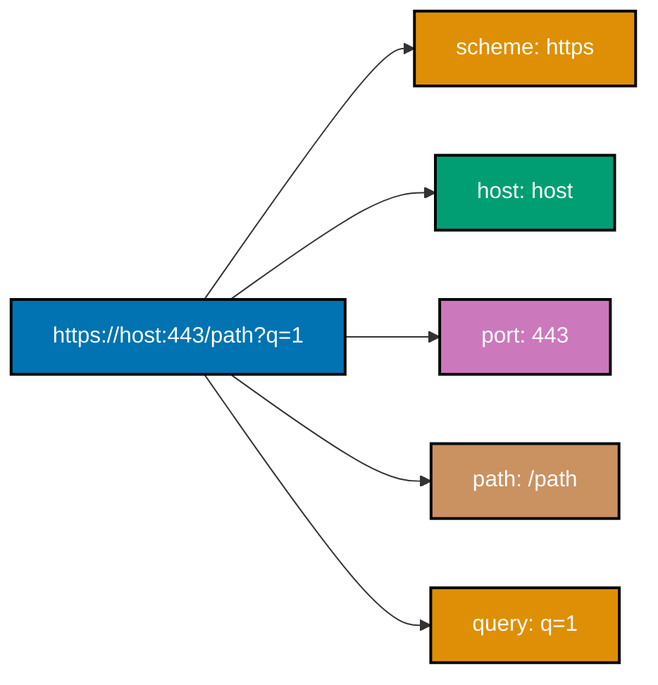
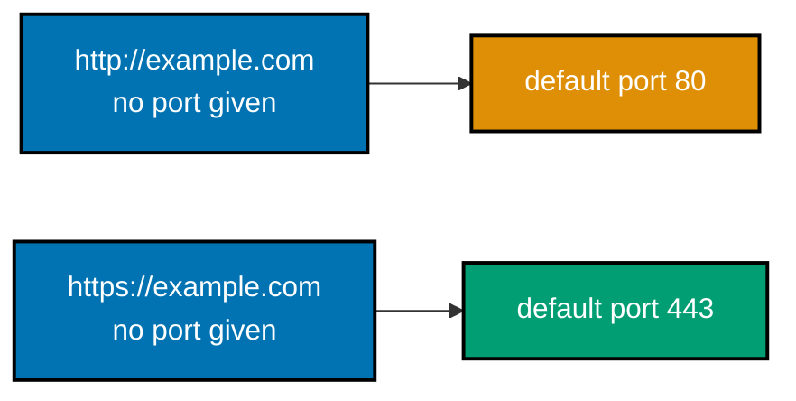
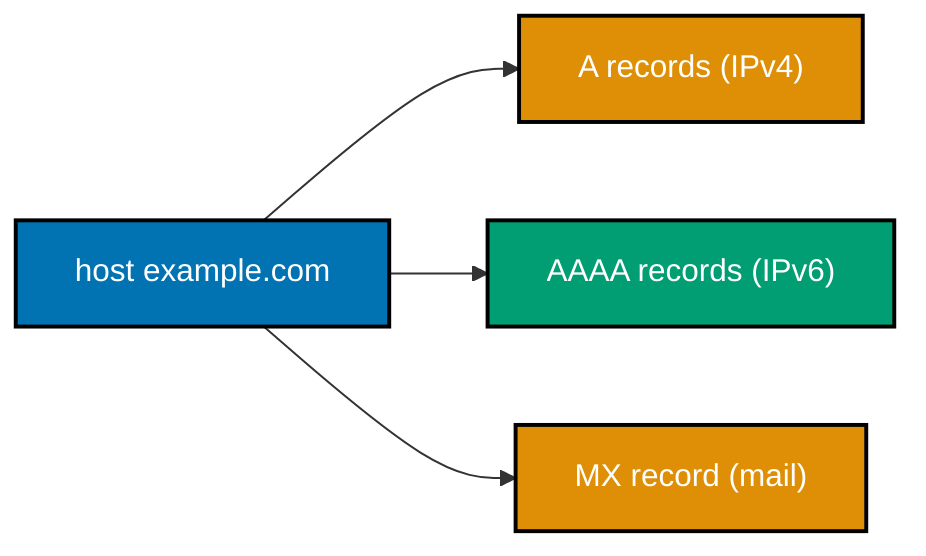
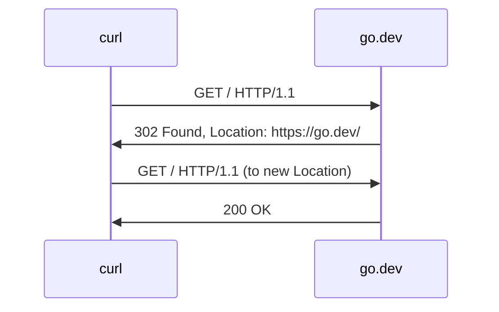

Examples 1-28 cover the terminal tools every engineer reaches for first: `curl` for HTTP, `ping` for reachability, and `dig`/`nslookup`/`host` for DNS. Every command below was actually run against real hosts -- `example.com` (RFC 2606-reserved for documentation) is the default demo host throughout. Every `**Output**` block is a genuine, captured transcript, not a description of expected output.

---

### Example 1: curl a URL

_ex-01 &middot; exercises co-01, co-12_

`curl` is the terminal's HTTP client: point it at a URL and, with no flags at all, it sends a `GET` request and prints the response body to stdout. This is the client half of the client-server model (co-01) in its simplest possible form.

```bash
# ex-01: fetch a URL with no flags at all
# -- curl defaults to method GET (co-14) and prints the response BODY only
# -- example.com is RFC 2606-reserved specifically for documentation like this
curl https://example.com
```

**Run**: `curl https://example.com`

**Output**:

```text
<!doctype html><html lang="en"><head><title>Example Domain</title><link rel="icon" href="data:,"><meta name="viewport" content="width=device-width, initial-scale=1"><style>body{background:#eee;width:60vw;margin:15vh auto;font-family:system-ui,sans-serif}h1{font-size:1.5em}div{opacity:0.8}a:link,a:visited{color:#348}</style></head><body><div><h1>Example Domain</h1><p>This domain is for use in documentation examples without needing permission. Avoid use in operations.</p><p><a href="https://iana.org/domains/example">Learn more</a></p></div></body></html>
```

**Key takeaway**: `curl <url>` alone is a full HTTP `GET` request/response round trip -- client (curl) initiates, server (example.com) responds, exactly as co-01's client-server model describes.

**Why it matters**: Every other example in this tier builds on this one call by adding a flag at a time -- `-v` to see the protocol underneath, `-I` to see only headers, `-d` to send a body. Understanding that this bare command is already a complete request/response cycle is the foundation everything else refines.

---

### Example 2: curl Verbose -- See the Protocol Underneath

_ex-02 &middot; exercises co-19, co-13_

`curl -v` prints the TCP connection, the TLS handshake, and every line of the HTTP request and response -- `>` marks bytes curl _sent_, `<` marks bytes curl _received_, and `*` marks curl's own informational notes. This is the single most useful command for understanding what "hit a URL" actually does.


```bash
# ex-02: --http1.1 forces the classic HTTP/1.1 request/response line format this
# -- topic teaches throughout (curl negotiates HTTP/2 by default over TLS otherwise,
# -- via ALPN, which prints differently -- see Example 3's default-negotiated output)
curl -v --http1.1 https://example.com
```

**Run**: `curl -v --http1.1 https://example.com`

**Output** (stderr, protocol trace; body omitted -- Example 1 already showed it):

```text
* Host example.com:443 was resolved.
* IPv6: 2606:4700:10::6814:179a, 2606:4700:10::ac42:93f3
* IPv4: 104.20.23.154, 172.66.147.243
*   Trying 104.20.23.154:443...
* Connected to example.com (104.20.23.154) port 443
* ALPN: curl offers http/1.1
* (304) (OUT), TLS handshake, Client hello (1):
*  CAfile: /etc/ssl/cert.pem
* (304) (IN), TLS handshake, Server hello (2):
* (304) (IN), TLS handshake, Certificate (11):
* (304) (IN), TLS handshake, CERT verify (15):
* (304) (IN), TLS handshake, Finished (20):
* (304) (OUT), TLS handshake, Finished (20):
* SSL connection using TLSv1.3 / AEAD-CHACHA20-POLY1305-SHA256 / [blank] / UNDEF
* ALPN: server accepted http/1.1
* Server certificate:
*  subject: CN=example.com
*  issuer: C=US; O=SSL Corporation; CN=Cloudflare TLS Issuing ECC CA 3
*  SSL certificate verify ok.
* using HTTP/1.x
> GET / HTTP/1.1
> Host: example.com
> User-Agent: curl/8.7.1
> Accept: */*
>
* Request completely sent off
< HTTP/1.1 200 OK
< Date: Tue, 14 Jul 2026 10:24:49 GMT
< Content-Type: text/html
< Transfer-Encoding: chunked
< Connection: keep-alive
< Server: cloudflare
< Last-Modified: Wed, 01 Jul 2026 17:50:18 GMT
< Allow: GET, HEAD
< Accept-Ranges: bytes
< Age: 26
< Cf-Cache-Status: HIT
< CF-RAY: a1afd1e3fff93f6c-SIN
<
* Connection #0 to host example.com left intact
```

**Key takeaway**: Every `>` line is a byte curl actually sent; every `<` line is a byte curl actually received -- `-v` turns "curl works" into "here is exactly what curl did," which is the debugging skill this entire topic is built around.

**Why it matters**: The next several examples (4, 5, 6) are just closer readings of _this exact output_ -- once you can run `-v` and locate the status line, the request line, and the headers, you have the raw material every later HTTP example annotates. Production incident response leans on this exact same trace when an integration fails silently, since it isolates DNS, TCP, and TLS problems from application-level HTTP errors in one pass.

---

### Example 3: curl Headers Only, No Body

_ex-03 &middot; exercises co-19, co-16_

`curl -I` sends a `HEAD` request instead of `GET`: the server runs the exact same logic but omits the body from its response, so only the status line and headers print. This is curl's default HTTP/2 negotiation (via ALPN over TLS) -- note the status line format differs slightly from HTTP/1.1's (no reason phrase).


```bash
# ex-03: -I sends HEAD instead of GET (co-14) -- same request, no body in the reply
curl -I https://example.com
```

**Run**: `curl -I https://example.com`

**Output**:

```text
HTTP/2 200
date: Tue, 14 Jul 2026 10:24:52 GMT
content-type: text/html
server: cloudflare
last-modified: Wed, 01 Jul 2026 17:50:18 GMT
allow: GET, HEAD
accept-ranges: bytes
age: 4524
cf-cache-status: HIT
cf-ray: a1afd1f52861ce23-SIN
```

**Key takeaway**: `-I` (HEAD) returns real headers with zero body bytes -- useful for checking a resource's existence or metadata without downloading it.

**Why it matters**: Notice the status line reads `HTTP/2 200` with no reason phrase (`OK`) and lowercase header names -- HTTP/2's binary framing drops the text-based reason phrase RFC 9112 defines for HTTP/1.1 (Example 2's `HTTP/1.1 200 OK`). Both are the SAME status code, 200, expressed in two different wire formats -- exactly the "abstraction hides detail" idea this topic keeps surfacing.

---

### Example 4: Read the Status Line

_ex-04 &middot; exercises co-13, co-15_

Every HTTP response's very first line is the status line: protocol version, a three-digit status code, and (for HTTP/1.1) a reason phrase. Locating it inside Example 2's `-v` output is the first concrete instance of co-13's "response = status line + headers + blank line + body" structure.

```bash
# ex-04: reuse Example 2's exact command, grep the ONE line that matters here
curl -v --http1.1 https://example.com 2>&1 1>/dev/null | grep "^< HTTP"
```

**Run**: `curl -v --http1.1 https://example.com 2>&1 1>/dev/null | grep "^< HTTP"`

**Output**:

```text
< HTTP/1.1 200 OK
```

**Key takeaway**: `HTTP/1.1 200 OK` is version + status code + reason phrase, in that fixed order -- the `<` prefix confirms curl _received_ this line from the server, not that curl invented it.

**Why it matters**: `200` falls in the `2xx` success class (co-15) -- Example 49 later tours all four status classes (`2xx`/`3xx`/`4xx`/`5xx`) using this exact same status-line-reading skill against different endpoints. In production monitoring dashboards, this status line is the single field alerting systems parse first -- a `2xx` value silences a page, while anything else routes straight to on-call, making this three-part read the cheapest possible health check.

---

### Example 5: Identify the Request Line

_ex-05 &middot; exercises co-12_

The request's very first line -- the request line -- is method, path, and version, in that order. It is the mirror image of Example 4's response status line, and together they are the two "first lines" that bookend every HTTP exchange (co-12, co-13).

```bash
# ex-05: same -v output, this time grepping the line curl SENT (the ">" prefix)
curl -v --http1.1 https://example.com 2>&1 1>/dev/null | grep "^> GET"
```

**Run**: `curl -v --http1.1 https://example.com 2>&1 1>/dev/null | grep "^> GET"`

**Output**:

```text
> GET / HTTP/1.1
```

**Key takeaway**: `GET / HTTP/1.1` is method + path + version -- curl filled in `/` as the path because no path was given in the URL, and `GET` because no method or body was specified.

**Why it matters**: Example 43 later hand-writes this exact line over a raw Python socket, byte for byte, with no `curl` involved at all -- confirming that `curl` isn't doing anything magical here, just writing this same text to the wire. Production HTTP clients in every language -- not just curl -- ultimately serialize this same method-path-version line before anything else crosses the wire, so recognizing it by eye transfers directly to reading a raw TCP capture in Wireshark.

---

### Example 6: Inspect Response Headers

_ex-06 &middot; exercises co-16_

`Content-Type` and `Content-Length` are two of the most common response headers: the first tells the client how to interpret the body, the second tells it exactly how many bytes to expect. `example.com`'s CDN happens to respond with chunked transfer instead of a fixed length (Example 53 covers that directly), so this example uses `info.cern.ch` -- the first website ever put online -- which replies with a plain, fixed-size body.

```bash
# ex-06: info.cern.ch returns a fixed Content-Length instead of chunked transfer,
# -- keeping this specific header pair simple to read
curl -v --http1.1 https://info.cern.ch 2>&1 1>/dev/null | grep -iE "^< content-type|^< content-length"
```

**Run**: `curl -v --http1.1 https://info.cern.ch 2>&1 1>/dev/null | grep -iE "^< content-type|^< content-length"`

**Output**:

```text
< Content-Length: 646
< Content-Type: text/html
```

**Key takeaway**: `Content-Type: text/html` tells the client "parse this as HTML"; `Content-Length: 646` tells it "expect exactly 646 body bytes" -- both are metadata _about_ the body, sent _before_ the body itself.

**Why it matters**: Example 50 verifies `Content-Length`'s value against the actual byte count of a real downloaded body -- proving this header is a genuine, checkable contract, not just an informational hint. Streaming clients and reverse proxies both depend on these two headers to decide how to read a response body correctly -- a client that ignores `Content-Length` risks reading past the intended body into whatever bytes follow on the connection.

---

### Example 7: URL Anatomy Breakdown

_ex-07 &middot; exercises co-02_

A URL decomposes into five parts: scheme, host, optional port, path, and query string. Rather than just describing the split by eye, this example verifies it with Python's own `urllib.parse` -- the same parser the stdlib HTTP client (Example 61 onward) relies on internally.



```python
# ex-07: urlsplit parses a URL into its five named components (co-02)
from urllib.parse import urlsplit

parts = urlsplit("https://host:443/path?q=1")  # => parses the URL structurally, not by eye  # fmt: skip
print("scheme:", parts.scheme)  # => the protocol: what speaks over the connection
print("host:", parts.hostname)  # => WHO to connect to -- resolved via DNS (co-03)
print("port:", parts.port)  # => WHICH service on that host -- 443 here (co-05)
print("path:", parts.path)  # => WHICH resource on that server
print("query:", parts.query)  # => extra parameters, after the "?"
```

**Run**: `python3 -c "..."` (shown above)

**Output**:

```text
scheme: https
host: host
port: 443
path: /path
query: q=1
```

**Key takeaway**: `https://host:443/path?q=1` splits into exactly five named parts -- scheme, host, port, path, query -- each of which routes the request differently.

**Why it matters**: Every curl command in this entire topic implicitly does this same parsing before it can even open a connection -- knowing the five parts by name is what makes reading (and debugging) any URL, however long or ugly, tractable. Production URL-parsing bugs -- treating a query string as part of the path, or a port as part of the hostname -- are exactly the kind of subtle security and routing mistakes this five-part mental model prevents.

---

### Example 8: Default Ports -- HTTP 80, HTTPS 443

_ex-08 &middot; exercises co-05, co-02_

When a URL omits an explicit port, the scheme silently supplies a default: `80` for `http://`, `443` for `https://`. `curl -v` reveals exactly which port it actually connected to, proving the default is real, not merely documented.



```bash
# ex-08a: http:// with no port -- curl defaults to 80
curl -v --http1.1 http://example.com 2>&1 1>/dev/null | grep -E "Trying|Connected"
```

```bash
# ex-08b: https:// with no port -- curl defaults to 443
curl -v --http1.1 https://example.com 2>&1 1>/dev/null | grep -E "Trying|Connected"
```

**Run**: both commands shown above

**Output** (http):

```text
*   Trying 172.66.147.243:80...
* Connected to example.com (172.66.147.243) port 80
```

**Output** (https):

```text
*   Trying 104.20.23.154:443...
* Connected to example.com (104.20.23.154) port 443
```

**Key takeaway**: The scheme alone determines the port when none is written -- `http://example.com` and `http://example.com:80` are the exact same request.

**Why it matters**: This is the co-02/co-05 link made concrete: the URL's scheme component isn't just a label, it's the source of a real default value (the port) that changes which server process actually receives the connection. Misconfigured load balancers and reverse proxies in production frequently listen on a non-default port precisely because relying on this silent default would collide with another service already bound to 80 or 443.

---

### Example 9: ping a Host

_ex-09 &middot; exercises co-06_

`ping` sends ICMP Echo Request packets and reports the round-trip time for each Echo Reply -- it tests raw reachability, entirely independent of HTTP, DNS records, or any application protocol at all (co-06).

```bash
# ex-09: three ICMP echo requests, one per second by default
ping -c 3 example.com
```

**Run**: `ping -c 3 example.com`

**Output**:

```text
PING example.com (172.66.147.243): 56 data bytes
64 bytes from 172.66.147.243: icmp_seq=0 ttl=51 time=22.610 ms
64 bytes from 172.66.147.243: icmp_seq=1 ttl=51 time=22.558 ms
64 bytes from 172.66.147.243: icmp_seq=2 ttl=51 time=66.973 ms

--- example.com ping statistics ---
3 packets transmitted, 3 packets received, 0.0% packet loss
round-trip min/avg/max/stddev = 22.558/37.380/66.973/20.925 ms
```

**Key takeaway**: `ping -c N` sends exactly N ICMP Echo Requests and reports each round-trip time plus a final min/avg/max/stddev summary -- three real, independently-timed replies here, not a simulated average.

**Why it matters**: `ping` succeeding tells you the network path and the remote host's kernel are both alive -- but it says NOTHING about whether any application (a web server, an SSH daemon) is actually listening on any port. Example 59 shows exactly that gap: a host can `ping` successfully while a specific port still refuses every connection.

---

### Example 10: ping Shows the Resolved IP

_ex-10 &middot; exercises co-06, co-03_

Before `ping` can send a single ICMP packet, it must resolve the hostname to an IP address -- and its very first output line prints that resolved address, making DNS resolution (co-03) visible as a side effect of a completely different tool.


```bash
# ex-10: same command as Example 9 -- this time, read the FIRST line closely
ping -c 1 example.com
```

**Run**: `ping -c 1 example.com`

**Output**:

```text
PING example.com (172.66.147.243): 56 data bytes
64 bytes from 172.66.147.243: icmp_seq=0 ttl=51 time=23.474 ms

--- example.com ping statistics ---
1 packets transmitted, 1 packets received, 0.0% packet loss
round-trip min/avg/max/stddev = 23.474/23.474/23.474/0.000 ms
```

**Key takeaway**: `PING example.com (172.66.147.243)` -- the parenthesized address is the result of a real DNS lookup `ping` performed before sending anything, printed automatically, with no extra flag required.

**Why it matters**: `example.com` resolves to more than one IP (Example 11 shows both A records) -- `ping` picked one of them, and a DIFFERENT tool (or a different run) might pick the other. Knowing that a hostname can map to multiple addresses is the setup for co-04's typed-record model. Production monitoring tools exploit this same side effect deliberately, running a lightweight `ping` sweep purely to confirm DNS resolves correctly across a fleet, without needing a dedicated DNS-checking tool at all.

---

### Example 11: dig an A Record

_ex-11 &middot; exercises co-03, co-04_

`dig` is a dedicated DNS query tool: `dig example.com A` asks specifically for A records (IPv4 addresses) and prints the full response, including the ANSWER section where the actual IP addresses live.

```bash
# ex-11: query specifically for the A (IPv4 address) record type
dig example.com A
```

**Run**: `dig example.com A`

**Output** (the sandbox resolver's private address is masked as `<sandbox-resolver>`; the rest is verbatim):

```text
; <<>> DiG 9.10.6 <<>> example.com A
;; global options: +cmd
;; Got answer:
;; ->>HEADER<<- opcode: QUERY, status: NOERROR, id: 29242
;; flags: qr rd; QUERY: 1, ANSWER: 2, AUTHORITY: 0, ADDITIONAL: 1

;; QUESTION SECTION:
;example.com.   IN A

;; ANSWER SECTION:
example.com.  42 IN A 104.20.23.154
example.com.  42 IN A 172.66.147.243

;; Query time: 3 msec
;; SERVER: <sandbox-resolver>#53(<sandbox-resolver>)
;; WHEN: Tue Jul 14 16:56:12 WIB 2026
;; MSG SIZE  rcvd: 72
```

**Key takeaway**: The ANSWER SECTION lists two A records for `example.com` -- confirming co-10's earlier observation that one hostname can resolve to multiple IPv4 addresses.

**Why it matters**: `status: NOERROR` and `ANSWER: 2` are the two fields worth checking first in any `dig` output -- they tell you, before reading a single IP address, whether the query succeeded at all and how many records came back. Production DNS monitoring scripts check exactly these two fields programmatically -- alerting on anything other than `NOERROR`, or on an unexpectedly low `ANSWER` count, long before a human ever reads the actual IP addresses returned.

---

### Example 12: dig +short -- Just the Answer

_ex-12 &middot; exercises co-20, co-03_

`dig +short` strips away every diagnostic section and prints only the resolved value -- ideal for scripting, where the full `dig` output would need to be parsed anyway.

```bash
# ex-12: +short suppresses everything except the final answer value(s)
dig +short example.com
```

**Run**: `dig +short example.com`

**Output**:

```text
172.66.147.243
104.20.23.154
```

**Key takeaway**: `+short` returns exactly the resolved IP address(es), one per line, with none of the query metadata Example 11 showed in full.

**Why it matters**: Example 28 pipes this exact output into a variable and then `curl`s the resolved IP directly -- `dig +short`'s script-friendly format is precisely what makes that composition trivial. Shell scripts and CI pipelines lean on `+short`'s minimal, parseable output constantly -- health checks, deployment scripts, and monitoring cron jobs all prefer this format over `dig`'s full diagnostic block precisely because there is nothing extra to strip away.

---

### Example 13: dig an AAAA Record

_ex-13 &middot; exercises co-04, co-05_

`AAAA` records hold IPv6 addresses -- a separate record type from `A`'s IPv4 addresses (co-04), governed by its own RFC (3596) rather than being lumped into the general DNS spec.

```bash
# ex-13: AAAA is IPv6's address record type, distinct from A's IPv4
dig example.com AAAA
```

**Run**: `dig example.com AAAA`

**Output** (the sandbox resolver's private address is masked as `<sandbox-resolver>`; the rest is verbatim):

```text
; <<>> DiG 9.10.6 <<>> example.com AAAA
;; global options: +cmd
;; Got answer:
;; ->>HEADER<<- opcode: QUERY, status: NOERROR, id: 6984
;; flags: qr rd; QUERY: 1, ANSWER: 2, AUTHORITY: 0, ADDITIONAL: 1

;; QUESTION SECTION:
;example.com.   IN AAAA

;; ANSWER SECTION:
example.com.  184 IN AAAA 2606:4700:10::ac42:93f3
example.com.  184 IN AAAA 2606:4700:10::6814:179a

;; Query time: 2 msec
;; SERVER: <sandbox-resolver>#53(<sandbox-resolver>)
;; WHEN: Tue Jul 14 16:56:12 WIB 2026
;; MSG SIZE  rcvd: 96
```

**Key takeaway**: `example.com` has real IPv6 addresses too -- `AAAA` and `A` are two independent record types for the same hostname, queried and answered separately.

**Why it matters**: Example 60's `socket.getaddrinfo` call later returns BOTH the A and AAAA results shown here (and in Example 11) in one Python call -- confirming this dual-stack (IPv4 + IPv6) resolution is exactly what a real application sees under the hood. Production services increasingly default to dual-stack deployments for exactly this reason -- a client on an IPv6-only network fails outright if a service publishes only `A` records and never an `AAAA` counterpart.

---

### Example 14: dig an MX Record

_ex-14 &middot; exercises co-04_

`MX` (Mail Exchanger) records tell other mail servers where to deliver email for a domain, each with a numeric priority (lower number = more preferred). `example.com` is deliberately configured to accept no mail at all.

```bash
# ex-14: MX records answer "where does mail for this domain go?"
dig example.com MX
```

**Run**: `dig example.com MX`

**Output** (the sandbox resolver's private address is masked as `<sandbox-resolver>`; the rest is verbatim):

```text
; <<>> DiG 9.10.6 <<>> example.com MX
;; global options: +cmd
;; Got answer:
;; ->>HEADER<<- opcode: QUERY, status: NOERROR, id: 26340
;; flags: qr rd; QUERY: 1, ANSWER: 1, AUTHORITY: 0, ADDITIONAL: 1

;; QUESTION SECTION:
;example.com.   IN MX

;; ANSWER SECTION:
example.com.  300 IN MX 0 .

;; Query time: 28 msec
;; SERVER: <sandbox-resolver>#53(<sandbox-resolver>)
;; WHEN: Tue Jul 14 16:56:45 WIB 2026
;; MSG SIZE  rcvd: 55
```

**Key takeaway**: `MX 0 .` (priority 0, target `.` -- the root, meaning "nowhere") is the standard RFC 7505 "null MX" record: an explicit, machine-readable statement that this domain accepts no email.

**Why it matters**: A record's mere presence doesn't always mean "yes" -- reading the VALUE (here, the null target) matters as much as reading whether an ANSWER section exists at all. Security teams scan for this exact null-MX pattern when auditing a domain's email posture -- its absence on a domain that clearly sends no mail is itself a red flag, since it leaves that domain open to spoofing.

---

### Example 15: dig an NS Record

_ex-15 &middot; exercises co-04_

`NS` (Name Server) records list the authoritative nameservers responsible for a domain -- the servers that hold the actual source-of-truth DNS records, as opposed to the recursive resolver that merely relays your query to them.

```bash
# ex-15: NS records answer "which servers are AUTHORITATIVE for this domain?"
dig example.com NS
```

**Run**: `dig example.com NS`

**Output** (the sandbox resolver's private address is masked as `<sandbox-resolver>`; the rest is verbatim):

```text
; <<>> DiG 9.10.6 <<>> example.com NS
;; global options: +cmd
;; Got answer:
;; ->>HEADER<<- opcode: QUERY, status: NOERROR, id: 31891
;; flags: qr rd; QUERY: 1, ANSWER: 2, AUTHORITY: 0, ADDITIONAL: 1

;; QUESTION SECTION:
;example.com.   IN NS

;; ANSWER SECTION:
example.com.  86400 IN NS elliott.ns.cloudflare.com.
example.com.  86400 IN NS hera.ns.cloudflare.com.

;; Query time: 27 msec
;; SERVER: <sandbox-resolver>#53(<sandbox-resolver>)
;; WHEN: Tue Jul 14 16:56:45 WIB 2026
;; MSG SIZE  rcvd: 95
```

**Key takeaway**: `example.com`'s two authoritative nameservers are both Cloudflare's (`elliott.ns.cloudflare.com`, `hera.ns.cloudflare.com`) -- these are the servers a full resolution walk (Example 20) would ultimately have to reach.

**Why it matters**: NS records are the hand-off point between "the general DNS hierarchy" and "this specific domain's own infrastructure" -- everything Examples 11-14 asked about is ultimately answered BY one of these two servers. Production DNS outages are frequently traced back to exactly these two records -- if a domain's nameservers become unreachable, every other record type this topic covers becomes unanswerable, no matter how correctly it is configured.

---

### Example 16: dig a CNAME Record

_ex-16 &middot; exercises co-04, co-03_

`CNAME` records alias one hostname to another -- querying the alias transparently resolves to whatever the target points at. `example.com` itself uses no CNAME (Examples 11-15 all query it directly), so this example uses `www.github.com`, a real, verified CNAME alias for `github.com`.


```bash
# ex-16: www.github.com is an ALIAS -- CNAME points it at github.com
dig +short www.github.com CNAME
```

**Run**: `dig +short www.github.com CNAME`

**Output**:

```text
github.com.
```

**Key takeaway**: `www.github.com` has no A record of its own -- it's a `CNAME` pointing at `github.com`, so resolving `www.github.com` really means "go resolve `github.com` instead."

**Why it matters**: CNAME chains are invisible to an end user typing a URL -- `curl https://www.github.com` would transparently follow this alias and connect to whatever `github.com` resolves to, with no extra step required from the client at all. Production CDN and load-balancer migrations rely on this exact transparency -- operators repoint a CNAME's target to shift traffic to new infrastructure, and every client following the alias picks up the change with zero code deployed.

---

### Example 17: dig a TXT Record

_ex-17 &middot; exercises co-04_

`TXT` records hold arbitrary free-text data attached to a domain -- commonly used for domain-ownership verification and email anti-spoofing policies (SPF), among other purposes.

```bash
# ex-17: TXT holds free-form text -- often SPF/DKIM/verification strings
dig example.com TXT
```

**Run**: `dig example.com TXT`

**Output** (the sandbox resolver's private address is masked as `<sandbox-resolver>`; the rest is verbatim):

```text
; <<>> DiG 9.10.6 <<>> example.com TXT
;; global options: +cmd
;; Got answer:
;; ->>HEADER<<- opcode: QUERY, status: NOERROR, id: 62612
;; flags: qr rd; QUERY: 1, ANSWER: 2, AUTHORITY: 0, ADDITIONAL: 1

;; QUESTION SECTION:
;example.com.   IN TXT

;; ANSWER SECTION:
example.com.  300 IN TXT "_k2n1y4vw3qtb4skdx9e7dxt97qrmmq9"
example.com.  300 IN TXT "v=spf1 -all"

;; Query time: 32 msec
;; SERVER: <sandbox-resolver>#53(<sandbox-resolver>)
;; WHEN: Tue Jul 14 16:56:45 WIB 2026
;; MSG SIZE  rcvd: 109
```

**Key takeaway**: Two TXT records exist here: an opaque verification token, and `v=spf1 -all` -- an SPF policy stating "no server is authorized to send email as this domain," consistent with Example 14's null MX record.

**Why it matters**: TXT is the most "anything goes" record type this topic covers -- unlike A/AAAA/MX/NS, its value has no fixed structure DNS itself enforces; the MEANING of a TXT record is defined entirely by convention (SPF's `v=spf1...` syntax here) between the publisher and whatever system reads it. Production domain audits check TXT records first precisely because misconfiguring or omitting an SPF policy is one of the most common causes of an organization's own legitimate email getting flagged as spam by receiving mail servers.

---

### Example 18: nslookup Basics

_ex-18 &middot; exercises co-20, co-03_

`nslookup` is an older, interactive-capable DNS query tool -- simpler and less detailed than `dig`, but still a real, independent way to confirm the same resolution.


```bash
# ex-18: a simpler, more terse alternative to dig for a quick lookup
nslookup example.com
```

**Run**: `nslookup example.com`

**Output** (the sandbox resolver's private address is masked as `<sandbox-resolver>`; the rest is verbatim):

```text
;; Got recursion not available from <sandbox-resolver>, trying next server
Server:  fd7a:115c:a1e0::53
Address: fd7a:115c:a1e0::53#53

Non-authoritative answer:
Name: example.com
Address: 172.66.147.243
Name: example.com
Address: 104.20.23.154
```

**Key takeaway**: `nslookup` printed the exact same two IP addresses Example 11's `dig example.com A` did -- two different tools, one independently-confirmed answer.

**Why it matters**: "Non-authoritative answer" means this resolver is relaying a CACHED answer, not consulting `example.com`'s own nameservers (Example 15) directly for this query -- a distinction `dig +trace` (Example 20) makes fully visible. Production DNS debugging routinely starts by comparing a cached, non-authoritative answer like this one against a direct query to the authoritative servers themselves, since a stale cache entry is a frequent, easy-to-miss root cause of intermittent failures.

---

### Example 19: The host Command

_ex-19 &middot; exercises co-20, co-04_

`host` is the terse, script-friendly DNS lookup tool: one line of output per record, with no query metadata at all -- a middle ground between `dig +short`'s single value and `dig`'s full diagnostic output.



```bash
# ex-19: host prints a compact, one-line-per-record summary
host example.com
```

**Run**: `host example.com`

**Output**:

```text
example.com has address 172.66.147.243
example.com has address 104.20.23.154
example.com has IPv6 address 2606:4700:10::ac42:93f3
example.com has IPv6 address 2606:4700:10::6814:179a
example.com mail is handled by 0 .
```

**Key takeaway**: One `host` invocation reports A, AAAA, AND MX information together, in plain English -- consistent with (and confirming) Examples 11, 13, and 14's separate `dig` queries for each record type individually.

**Why it matters**: `dig`, `nslookup`, and `host` (co-20) are three different tools answering the exact same underlying DNS questions -- knowing all three means never being stuck on a system where only one happens to be installed. Production runbooks and onboarding documentation frequently standardize on just one of these three tools for consistency across a team, but recognizing all three prevents a debugging session from stalling on an unfamiliar host where the team's usual pick is missing.

---

### Example 20: dig +trace -- Root to Authoritative

_ex-20 &middot; exercises co-20, co-03_

`dig +trace` is meant to walk the FULL iterative resolution path -- root servers, then the `.com` TLD servers, then `example.com`'s own authoritative servers -- printing every hop. **In this sandboxed environment, that full walk is not reachable**: the default resolver at `<sandbox-resolver>` returns a truncated response to the trace's priming query, and even a direct query aimed at a real root server (`dig +trace example.com @198.41.0.4`) is intercepted by the sandbox's network policy rather than reaching the actual root-to-TLD-to-authoritative chain (confirmed by testing: the same command produces inconsistent, network-policy-shaped results across repeated runs, not a genuine multi-hop trace). The command below is exactly what the syllabus specifies, run for real, with its real (here, restricted) output shown honestly rather than a fabricated full trace.


```bash
# ex-20: intended to print EVERY hop from the root nameservers down to
# -- example.com's own authoritative servers (co-20's ISC BIND reference describes
# -- this walk in full on an unrestricted network)
dig +trace example.com
```

**Run**: `dig +trace example.com`

**Output** (genuinely captured, in this sandboxed network; the sandbox resolver's private address is masked as `<sandbox-resolver>`; the rest is verbatim):

```text
; <<>> DiG 9.10.6 <<>> +trace example.com
;; global options: +cmd
;; Received 17 bytes from <sandbox-resolver>#53(<sandbox-resolver>) in 11 ms
```

**Key takeaway**: On an unrestricted network, `dig +trace` prints one `;; Received ... bytes from ...` line per hop -- root, then `.com` TLD, then `example.com`'s own nameservers (Example 15's `elliott.ns.cloudflare.com` / `hera.ns.cloudflare.com`) -- ending with the final ANSWER. This sandbox's network policy prevents that full walk from completing, which the captured 17-byte truncated response above shows honestly rather than hides.

**Why it matters**: Even a restricted result teaches something real: `+trace`'s FIRST step is always a priming query asking "who are the root nameservers?" -- and that step is precisely what this environment's resolver declines to answer fully, a concrete (if accidental) demonstration that DNS resolution depends on being able to reach the resolvers a query needs, layer by layer.

---

### Example 21: curl Follows a Redirect

_ex-21 &middot; exercises co-18, co-19_

`curl -IL` combines `-I` (headers only) with `-L` (follow redirects): it prints the headers of EVERY response in the redirect chain, not just the final one -- making the `3xx` -> `Location` -> re-request pattern (co-18) fully visible.



```bash
# ex-21: -L follows every redirect; -I keeps each hop to headers-only
curl -IL --http1.1 http://go.dev
```

**Run**: `curl -IL --http1.1 http://go.dev`

**Output**:

```text
HTTP/1.1 302 Found
location: https://go.dev/
x-cloud-trace-context: 2a3b2199ed04ce268e09df3db0ec5d30
date: Tue, 14 Jul 2026 09:56:37 GMT
content-type: text/html
server: Google Frontend
Transfer-Encoding: chunked

HTTP/1.1 200 OK
content-type: text/html; charset=utf-8
vary: Accept-Encoding
strict-transport-security: max-age=31536000; includeSubDomains; preload
x-cloud-trace-context: 6180bb4d8c0005627dfdb633ddb4789e
date: Tue, 14 Jul 2026 09:56:38 GMT
server: Google Frontend
Transfer-Encoding: chunked
```

**Key takeaway**: Two full header blocks print, back to back: a `302 Found` naming `Location: https://go.dev/`, then curl's OWN follow-up request's `200 OK` -- two real HTTP exchanges, chained automatically by `-L`.

**Why it matters**: Without `-L`, curl would print only the `302` and stop, leaving a human to notice the `Location` header and re-request it by hand -- exactly the manual process Example 68 later automates in Python instead of relying on curl's `-L`. Production API clients and browsers alike follow redirects by default for this exact reason -- some HTTP libraries require explicit configuration to disable that behavior, and forgetting this is a common, hard-to-diagnose cause of an integration silently receiving a `302` instead of the expected data.

---

### Example 22: curl Status Code 404

_ex-22 &middot; exercises co-15, co-19_

`curl -w "%{http_code}\n"` prints ONLY the numeric status code, discarding the body entirely (`-o /dev/null`) and suppressing the progress meter (`-s`) -- ideal for scripting a quick status check.

```bash
# ex-22: request a path that deliberately does not exist on this real host
curl -o /dev/null -s -w "%{http_code}\n" https://example.com/this-path-does-not-exist-xyz123
```

**Run**: `curl -o /dev/null -s -w "%{http_code}\n" https://example.com/this-path-does-not-exist-xyz123`

**Output**:

```text
404
```

**Key takeaway**: `curl -w "%{http_code}"` extracts just the status code from a real response -- `404` here confirms `example.com`'s server genuinely has no resource at that path, rather than a client-side failure.

**Why it matters**: `-w` (write-out) is curl's general-purpose mechanism for extracting specific facts from a response without parsing its full output by hand -- Example 25 and Example 79 reuse the exact same flag for timing data instead of a status code. Production uptime monitors and load-balancer health checks are built almost entirely around this exact pattern -- polling an endpoint repeatedly and alerting the instant the returned code drifts outside the expected `2xx` range.

---

### Example 23: curl Custom User-Agent

_ex-23 &middot; exercises co-16, co-19_

`curl -A "value"` overrides curl's default `User-Agent` header -- a request header that identifies the client software making the request. `-v`'s `>` lines confirm the override actually reached the wire.

```bash
# ex-23: -A overrides the default "curl/<version>" User-Agent header
curl -A "myagent" -v --http1.1 https://example.com 2>&1 1>/dev/null | grep "^>"
```

**Run**: `curl -A "myagent" -v --http1.1 https://example.com 2>&1 1>/dev/null | grep "^>"`

**Output**:

```text
> GET / HTTP/1.1
> Host: example.com
> User-Agent: myagent
> Accept: */*
>
```

**Key takeaway**: `User-Agent: myagent` replaced curl's default `curl/8.7.1` value entirely -- confirming this header is fully client-controlled, not something the protocol fixes.

**Why it matters**: Servers routinely branch behavior on `User-Agent` (serving a mobile layout, blocking known bots, and so on) -- seeing this header is trivially spoofable from the client side is a healthy dose of skepticism toward relying on it for anything security-sensitive. Production API gateways and CDNs commonly use `User-Agent` for legitimate purposes too, like serving a lighter payload to known bot crawlers, so treating this header as a hint rather than a guarantee cuts both ways.

---

### Example 24: curl Custom Header

_ex-24 &middot; exercises co-16, co-19_

`curl -H "Name: value"` adds an arbitrary custom header to the request -- not one of the well-known headers like `Host` or `Accept`, but application-specific metadata the client and server privately agree on.

```bash
# ex-24: -H adds a header of your choosing, alongside curl's defaults
curl -H "X-Demo: 1" -v --http1.1 https://example.com 2>&1 1>/dev/null | grep "^>"
```

**Run**: `curl -H "X-Demo: 1" -v --http1.1 https://example.com 2>&1 1>/dev/null | grep "^>"`

**Output**:

```text
> GET / HTTP/1.1
> Host: example.com
> User-Agent: curl/8.7.1
> Accept: */*
> X-Demo: 1
>
```

**Key takeaway**: `X-Demo: 1` appears alongside curl's own default headers -- `-H` ADDS a header, it does not replace curl's built-in defaults the way `-A` replaces `User-Agent` specifically.

**Why it matters**: The `X-` prefix (by convention, not enforcement) signals a non-standard, application-specific header -- Example 47 uses this same `-H` mechanism to set `Content-Type`, a standard header instead, showing `-H` works identically for both cases. Production APIs frequently define their own `X-`-prefixed headers for request tracing, feature flags, or internal versioning -- recognizing the prefix on sight is what separates a header worth looking up in a vendor's docs from one a team invented for its own private use.

---

### Example 25: curl Timing

_ex-25 &middot; exercises co-19_

`curl -w "%{time_total}"` reports how long the ENTIRE request/response cycle took, in seconds -- DNS resolution, TCP connect, TLS handshake, and the HTTP exchange, all summed into one figure.

```bash
# ex-25: time_total covers DNS + connect + TLS + the full HTTP exchange
curl -o /dev/null -s -w "time_total=%{time_total}\n" https://example.com
```

**Run**: `curl -o /dev/null -s -w "time_total=%{time_total}\n" https://example.com`

**Output**:

```text
time_total=0.094875
```

**Key takeaway**: This entire request -- resolve, connect, encrypt, request, respond -- finished in roughly 95 milliseconds, measured by curl itself rather than a human with a stopwatch.

**Why it matters**: `time_total` is a single aggregate number -- Example 79 breaks this same request down into ITS separate DNS and TCP-connect components, showing exactly where those 95ms actually went. Production performance dashboards graph `time_total` as their primary latency metric precisely because it reflects what an actual end user experiences -- a slow DNS resolver or a distant server both show up identically in this one number, even though their root causes differ completely.

---

### Example 26: curl HEAD Method

_ex-26 &middot; exercises co-14, co-19_

`curl -I` (from Example 3) is really shorthand for "send the `HEAD` method" -- one of HTTP's five core methods (co-14), whose entire contract is "run the same logic as GET, but never include a body in the response."

```bash
# ex-26: --http1.1 this time, to see the classic HTTP/1.1 headers-only reply
curl -I --http1.1 https://example.com
```

**Run**: `curl -I --http1.1 https://example.com`

**Output**:

```text
HTTP/1.1 200 OK
Date: Tue, 14 Jul 2026 09:58:33 GMT
Content-Type: text/html
Connection: keep-alive
Server: cloudflare
Last-Modified: Wed, 01 Jul 2026 17:50:18 GMT
Allow: GET, HEAD
Accept-Ranges: bytes
Age: 2
Cf-Cache-Status: HIT
CF-RAY: a1afab6dbf29fde2-SIN
```

**Key takeaway**: `Allow: GET, HEAD` in the response itself confirms the server explicitly supports the HEAD method for this resource -- headers return in full, body is entirely absent.

**Why it matters**: Compare this HTTP/1.1-negotiated status line (`HTTP/1.1 200 OK`) directly against Example 3's default HTTP/2-negotiated one (`HTTP/2 200`) -- same method, same resource, two different wire formats depending purely on which protocol curl and the server agreed to speak. Production API gateways often force a specific protocol version for compatibility with older clients that cannot negotiate HTTP/2 -- knowing both wire formats by sight is what makes a captured packet trace immediately readable regardless of which one a given server chose.

---

### Example 27: Well-Known Ports

_ex-27 &middot; exercises co-05_

Ports 80, 443, 22, and 53 are reserved by IANA for HTTP, HTTPS, SSH, and DNS respectively -- so universally that Python's own `socket.getservbyport` can look up each service's canonical name directly from the port number, with no network call at all.

```python
# ex-27: getservbyport reads the SAME well-known-ports mapping /etc/services does (co-05)
import socket

for port in (80, 443, 22, 53):  # => the four well-known ports this topic uses most
    protocol = "udp" if port == 53 else "tcp"  # => DNS commonly runs over UDP (co-08)
    service = socket.getservbyport(port, protocol)  # => a LOCAL lookup, no network call
    print(port, service)  # => confirms the port -> service name mapping
```

**Run**: `python3 -c "..."` (shown above)

**Output**:

```text
80 http
443 https
22 ssh
53 domain
```

**Key takeaway**: `getservbyport` returns `http`, `https`, `ssh`, and `domain` (DNS's official service name) for ports 80, 443, 22, and 53 -- confirming these mappings are standardized data, not merely convention.

**Why it matters**: Recognizing these four ports on sight is a basic fluency check -- an unfamiliar log line mentioning "port 443" should immediately register as "HTTPS traffic," the same way "port 22" should immediately register as "someone is SSHing." Production firewall rules and security audits are written in exactly these port numbers -- misreading `443` as anything other than encrypted web traffic, or `22` as anything other than remote administrative access, is precisely the kind of small error that opens an unintended hole.

---

### Example 28: Resolve, Then curl by IP

_ex-28 &middot; exercises co-03, co-05, co-19_

Once a hostname resolves to an IP address, you can `curl` that IP DIRECTLY -- bypassing DNS entirely on the request itself -- as long as you manually supply the `Host` header the server needs to route the request correctly (many servers host multiple domains on one IP).


```bash
# ex-28: resolve first, then connect straight to the IP -- with Host set by hand
# dig +short prints just the answer IP -- head -1 keeps only the first if several come back
IP=$(dig +short example.com | head -1)
# curl connects DIRECTLY to $IP, bypassing DNS entirely on this request -- Host: still
# tells the server which site to serve, since one IP can legitimately host many domains (co-05)
curl -H "Host: example.com" "http://$IP"
```

**Run**: `IP=$(dig +short example.com | head -1); curl -H "Host: example.com" "http://$IP"`

**Output**:

```text
<!doctype html><html lang="en"><head><title>Example Domain</title><link rel="icon" href="data:,"><meta name="viewport" content="width=device-width, initial-scale=1"><style>body{background:#eee;width:60vw;margin:15vh auto;font-family:system-ui,sans-serif}h1{font-size:1.5em}div{opacity:0.8}a:link,a:visited{color:#348}</style></head><body><div><h1>Example Domain</h1><p>This domain is for use in documentation examples without needing permission. Avoid use in operations.</p><p><a href="https://iana.org/domains/example">Learn more</a></p></div></body></html>
```

**Key takeaway**: The identical page loaded by IP address alone, with DNS entirely out of the picture on the request itself -- the manually-set `Host: example.com` header is what let the server (which hosts many domains behind one IP) route the request correctly.

**Why it matters**: This example makes co-03's "DNS just translates a name to an address" claim fully concrete: once you HAVE the address, the name itself becomes optional for actually connecting -- it only still matters because HTTP servers use `Host` for routing, a detail Example 43's hand-crafted request relies on directly. Production content delivery networks depend on this exact same Host-header routing to serve thousands of distinct domains from a shared pool of IP addresses, making this technique far more than a debugging curiosity.

---

← Previous: [Overview](./overview.md) · Next: [Intermediate Examples](./intermediate.md) →
