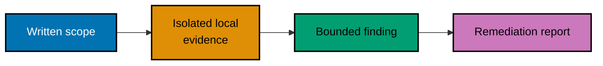

> **Authorized lab target only.** Each example is either an annotation over synthetic evidence or a
> program that accepts only an owned `localhost` lab. If you cannot show written authorization and
> isolation, stop instead of adapting an example.

## How to use these examples

The examples follow a professional engagement: scope first, observe a bounded lab second, interpret
the evidence third, and document a fix last. They do not provide instructions, payloads, target lists,
or operational steps for unauthorized real-world exploitation. The runnable examples have no network
client: they parse static local fixtures and fail closed when the lab scope is invalid.

## Concepts

- **Engagement discipline**: authorization, rules of engagement, responsible disclosure, lab
  isolation, the attack lifecycle, PTES phases, and the Cyber Kill Chain. [PTES](https://pentest-standard.readthedocs.io/)
  is the phase reference; it never overrides a written scope.
- **Evidence, not probing**: passive versus active reconnaissance, OSINT, service and version
  inventory, enumeration, and an application attack-surface map. [Nmap's reference](https://nmap.org/book/man-briefoptions.html)
  defines the vocabulary; this course uses recorded local output rather than issuing scans.
- **Finding classes**: SQL injection, XSS, broken authentication, broken access control, request
  tampering, and common framework/payload terminology are studied only as local, synthetic finding
  models. See [CWE-89](https://cwe.mitre.org/data/definitions/89.html), [CWE-79](https://cwe.mitre.org/data/definitions/79.html),
  and [CWE-307](https://cwe.mitre.org/data/definitions/307.html).
- **Communication and limits**: CVE/CVSS context, evidence handling, impact, remediation, cleanup,
  and responsible disclosure. [FIRST CVSS](https://www.first.org/cvss/) supplies the scoring model.

## Examples by level

- [Beginner Examples](./beginner.md) covers examples 1–26: authorization, isolation, methodology,
  and synthetic discovery evidence.
- [Intermediate Examples](./intermediate.md) covers examples 27–54: local web-finding interpretation
  and harmless request-record analysis.
- [Advanced Examples](./advanced.md) covers examples 55–78: memory/network concepts as annotations,
  evidence-based severity, reporting, cleanup, and capstone preparation.

Run the safe local parsers with `python3 learning/code/parse_lab_evidence.py` and
`sh learning/code/check_scope.sh`. Both read only files in this course directory.
