## Goal

Produce a compact **delivery plan** for a small project -- the Nimbus Notification Service, a
4-person team's six-week build of a multi-channel (email, SMS, push) notification service -- that
assembles a work-breakdown structure with a dependency graph and critical path, a velocity-based
estimate, a sprint/backlog plan, a risk register, and a metrics plan into one decision artifact a
team could execute against directly. This is a leadership `‡` design/decision capstone: no code,
zero runnable files. Every mechanism combined here was already taught, individually, somewhere in
the Beginner, Intermediate, or Advanced scenarios of this topic; this capstone is where they run
together on one new project, at a larger and more realistic scale than any single worked scenario.

```mermaid
%% Color Palette: Blue #0173B2, Orange #DE8F05, Teal #029E73, Purple #CC78BC, Brown #CA9161
flowchart LR
    accTitle: Goal
    accDescr: Flowchart with 5 nodes and 4 connections. Nodes: WBS + dependency graph critical path marked, Velocity estimate sprint47backlog plan, Risk register likelihood x impact, Metrics plan burndown + cycle time, One internally consistent plan.md. Connections: WBS + dependency graph critical path marked to Velocity estimate sprint47backlog plan, Velocity estimate sprint47backlog plan to Risk register likelihood x impact, Risk register likelihood x impact to Metrics plan burndown + cycle time, Metrics plan burndown + cycle time to One internally consistent plan.md.
    A["WBS + dependency<br/>graph<br/>critical path marked"]:::blue
    B["Velocity estimate<br/>sprint#47;backlog<br/>plan"]:::orange
    C["Risk register<br/>likelihood x impact"]:::teal
    D["Metrics plan<br/>burndown + cycle<br/>time"]:::purple
    E["One internally<br/>consistent plan.md"]:::brown
    A --> B --> C --> D --> E

    classDef blue fill:#0173B2,stroke:#000000,color:#FFFFFF,stroke-width:2px
    classDef orange fill:#DE8F05,stroke:#000000,color:#000000,stroke-width:2px
    classDef teal fill:#029E73,stroke:#000000,color:#000000,stroke-width:2px
    classDef purple fill:#CC78BC,stroke:#000000,color:#000000,stroke-width:2px
    classDef brown fill:#CA9161,stroke:#000000,color:#000000,stroke-width:2px
    classDef default fill:#FFFFFF,stroke:#000000,color:#000000
```

_Diagram: the capstone's build order -- schedule the work, estimate and plan the sprints, register
the risks, and plan the metrics, all landing in one cohesive `plan.md`._

## Concepts exercised

- [x] WBS + dependency graph + critical path (co-03, co-04)
- [x] velocity/story-point estimation (co-05)
- [x] a sprint/backlog plan respecting capacity and dependencies (co-07)
- [x] a risk register with likelihood/impact/mitigation/owner (co-10)
- [x] a metrics plan naming a decision per metric (co-09)

The full plan lives in **[`learning/capstone/plan.md`](./plan.md)** -- one cohesive document, not
five separate files. Nothing on this page is a repeat of `plan.md`'s content; this page narrates the
build order and cites the concepts each step exercises.

## Step 1: WBS, dependency graph, and critical path

_exercises co-03, co-04_

`plan.md` opens with the Nimbus Notification Service's work breakdown structure: three branches
(Delivery Channels, Core Service, Launch Readiness) decomposed into nine leaves, each independently
estimable and independently assignable (co-03) -- the same test every WBS leaf in this topic's
worked scenarios had to pass. A Mermaid dependency graph then encodes every genuine "must finish
before" relation between those nine leaves, with durations in working days, and marks the critical
path -- the single longest cumulative-duration chain, with zero slack on every task along it (co-04).

**Verify**: the marked critical path is the longest of every computed path through the graph, and
recomputing durations confirms zero slack on each task along it -- the same computation Worked
Scenario 5 walked through for the Aurora project, applied here to a new one.

## Step 2: Velocity estimate and sprint/backlog plan

_exercises co-05, co-07_

`plan.md` continues with a story-point estimate against a calibrated reference story, a three-sprint
historical velocity average, and the resulting completion forecast (co-05) -- expressed in points,
never in hours. The backlog is then split into sprints that never exceed the team's velocity ceiling
and never schedule a task ahead of an unmet dependency (co-07).

**Verify**: every estimate is stated relative to the reference story, the forecast uses a
multi-sprint average, and every sprint's committed points stay at or under the velocity ceiling with
no dependency violated.

## Step 3: Risk register and metrics plan

_exercises co-10, co-09_

`plan.md` closes with a five-risk register -- each entry scored by likelihood times impact, paired
with a mitigation specific enough to act on, and assigned a named owner (co-10) -- and a metrics
plan pairing burndown and cycle time with the concrete decision each one informs (co-09).

**Verify**: every risk entry has a computed score, a concrete mitigation, and a named owner; every
metric in the metrics plan states a "when this shows X, we do Y" decision rule.

## Acceptance criteria

- The plan is internally consistent: the critical path (Step 1) drives the schedule commitment, the
  velocity-based sprint plan (Step 2) covers the full backlog across exactly the forecast number of
  sprints, and the sprint-length working-day budget comfortably accommodates the critical path's
  duration with room for the risk register's contingencies.
- Every WBS leaf is independently estimable and assignable; every dependency-graph edge is a genuine
  precedence relation; the critical path is the longest path with zero slack.
- Every sprint respects the velocity ceiling and every task's dependency order.
- Every risk entry has a score, a concrete mitigation, and a named owner; the top-ranked risks by
  score have mitigations actively in flight.
- Every metric in the metrics plan names the specific decision it informs.
- The plan is executable without hand-waving: a reader could hand `plan.md` to a real 4-person team
  and they would know exactly what to build, in what order, by when, and what to watch for.

## Done bar

This capstone produces the stated artifact: a complete, internally consistent delivery plan for the
Nimbus Notification Service, combining every mechanism this topic taught -- the triple-constraint
framing (co-01, implicit in the fixed 3-sprint/17-day schedule this plan commits to), work
breakdown and critical-path scheduling (co-03, co-04), velocity-based estimation and sprint planning
(co-05, co-07), risk management (co-10), and a decision-mapped metrics plan (co-09) -- into one
document, exactly as Worked Scenario 25 already demonstrated at a smaller scale for the Aurora
project. Every technique used here traces to a primary source already cited in this topic's Accuracy
notes and DD-35 citations (the Scrum Guide, November 2020 revision, for velocity and sprint
planning; the Critical Path Method's DuPont/Remington Rand and PERT's US Navy lineage for the
dependency graph and critical path); no new fact was needed to write this page or `plan.md`.

---

Next: [Drilling](../../drilling/overview.md) →
