> **No unattended install.** This is an acceptance-plan capstone. It contains neither a real endpoint nor a
> token, private key, LAN range, DNS name, ACME account, object-store credential, or image digest. An owner
> must provide those values outside version control and execute each approved production-shaped lab step
> with current vendor documentation open.

## Goal

Operate a three-server, embedded-etcd k3s control plane with a worker and a policy-enforcing CNI; then add
MetalLB, replicated storage, ingress and certificate automation; and reconcile one workload from a Git
repository through dev, staging, and production overlays. Demonstrate the same immutable image digest in
every environment, no plaintext Git secret, self-healing after a controlled deletion, and a documented
Velero restore drill.

## Ordered evidence gates

1. Record owner, isolated nodes, console recovery, time sync, backups, rollback, and the quorum model.
   Verify three servers remain healthy when one planned-fault server is unavailable (`co-06`–`co-15`).
2. Install and test the selected CNI and a default-deny-plus-explicit-allow NetworkPolicy. Verify intended
   connectivity and denied traffic with disposable workloads (`co-16`–`co-18`).
3. Configure an owner-reserved MetalLB pool, selected advertisement mode, storage class/PVC, ingress
   controller, and a certificate issuer. Verify each controller's reported readiness before exposing a
   service (`co-19`–`co-24`).
4. Commit a `base/` plus `overlays/dev`, `overlays/staging`, and `overlays/prod` layout. Argo CD or Flux
   reconciles the reviewed path; promotion changes only the already-built digest in the next overlay
   (`co-25`–`co-30`).
5. Deliver a secret with Sealed Secrets or External Secrets; inspect only metadata. Create a scheduled
   backup and restore into a clean owner-approved target, then record application and persistent-data
   evidence (`co-31`–`co-33`).

## Acceptance criteria

- Three control-plane servers hold quorum across the stated single-server fault.
- A policy-enforcing CNI, explicitly reserved load-balancer address, durable PVC, ingress, and TLS work as
  one reviewed platform boundary.
- Git reconciliation reports the three environments converged; the same image digest is promoted without
  a rebuild; a manual drift attempt is reverted or recorded by the chosen controller.
- No plaintext secret enters Git, terminal history retained with the project, or the published evidence.
- A restore drill proves the agreed RPO/RTO rather than treating a successful backup job as recovery.

```mermaid
%% Color Palette: Blue #0173B2, Orange #DE8F05, Teal #029E73, Purple #CC78BC; labels carry meaning.
flowchart LR
    accTitle: Acceptance criteria
    accDescr: Flowchart with 5 nodes and 4 connections. Nodes: Three-server quorum, On-prem add-ons, Git desired state, Digest promotion, Backup and restore evidence. Connections: Three-server quorum to On-prem add-ons, On-prem add-ons to Git desired state, Git desired state to Digest promotion, Digest promotion to Backup and restore evidence.
    Q["Three-server quorum"]:::blue --> A["On-prem add-ons"]:::orange
    A --> D["Git desired state"]:::teal
    D --> P["Digest promotion"]:::purple
    P --> B["Backup and restore<br/>evidence"]:::blue
    classDef blue fill:#0173B2,stroke:#000000,color:#FFFFFF,stroke-width:2px
    classDef orange fill:#DE8F05,stroke:#000000,color:#000000,stroke-width:2px
    classDef teal fill:#029E73,stroke:#000000,color:#000000,stroke-width:2px
    classDef purple fill:#CC78BC,stroke:#000000,color:#000000,stroke-width:2px
    classDef default fill:#FFFFFF,stroke:#000000,color:#000000
```

