## Goal

Produce a compact **product brief** for a small feature -- an auto-reminder SMS sent before an
upcoming shift on Kestrel, the fictional shift-scheduling SaaS this topic has followed throughout
-- that assembles a validated problem statement (with a job story), an MVP scope with explicit
non-goals, a RICE-prioritized backlog, a north-star plus supporting metrics, and an A/B experiment
design into one decision artifact an engineer could act on directly. This is a leadership `‡`
design/decision capstone: no code, zero runnable files. Every mechanism combined here was already
taught, individually, somewhere in the Beginner, Intermediate, or Advanced scenarios of this
topic; this capstone is where they run together on one new feature, at a larger and more
realistic scale than any single worked scenario.

The feature traces directly back to Worked Scenario 19's opportunity-solution tree: "employees
forget upcoming shifts" was the first of three named opportunities under the "reduce no-show shift
incidents by 30%" outcome, and this capstone is where that opportunity's solution -- SMS reminders
-- gets fully specified as a product brief, rather than the one-line sketch the tree gave it.

```mermaid
%% Color Palette: Blue #0173B2, Orange #DE8F05, Teal #029E73, Purple #CC78BC, Brown #CA9161
flowchart LR
    accTitle: Goal
    accDescr: Flowchart with 5 nodes and 4 connections. Nodes: Problem + JTBD evidence, MVP scope + explicit non-goals, RICE-ranked backlog, North-star + metrics + A47B experiment, One internally consistent brief.md. Connections: Problem + JTBD evidence to MVP scope + explicit non-goals, MVP scope + explicit non-goals to RICE-ranked backlog, RICE-ranked backlog to North-star + metrics + A47B experiment, North-star + metrics + A47B experiment to One internally consistent brief.md.
    A["Problem + JTBD<br/>evidence"]:::blue
    B["MVP scope<br/>+ explicit non-goals"]:::orange
    C["RICE-ranked<br/>backlog"]:::teal
    D["North-star + metrics<br/>+ A#47;B experiment"]:::purple
    E["One internally<br/>consistent brief.md"]:::brown
    A --> B --> C --> D --> E

    classDef blue fill:#0173B2,stroke:#000000,color:#FFFFFF,stroke-width:2px
    classDef orange fill:#DE8F05,stroke:#000000,color:#000000,stroke-width:2px
    classDef teal fill:#029E73,stroke:#000000,color:#000000,stroke-width:2px
    classDef purple fill:#CC78BC,stroke:#000000,color:#000000,stroke-width:2px
    classDef brown fill:#CA9161,stroke:#000000,color:#000000,stroke-width:2px
    classDef default fill:#FFFFFF,stroke:#000000,color:#000000
```

_Diagram: the capstone's build order -- frame the problem, scope the MVP, rank the backlog, define
success, and design the experiment, all landing in one cohesive `brief.md`._

## Concepts exercised

- [x] problem vs solution framing via JTBD (co-02, co-03)
- [x] MVP scope + explicit non-goals (co-12)
- [x] RICE prioritization with a defended ordering (co-07)
- [x] north-star + AARRR funnel metrics (co-17, co-18)
- [x] an A/B experiment with hypothesis, primary metric, and guardrail (co-15)

The full brief lives in **[`learning/capstone/brief.md`](./brief.md)** -- one cohesive document,
not several separate files. Nothing on this page repeats `brief.md`'s content; this page narrates
the build order and cites the concepts each step exercises.

## Step 1: Problem statement, JTBD, and evidence

_exercises co-02, co-03_

`brief.md` opens with a problem statement that names the user (employees on a Kestrel-scheduled
team), the circumstance (a shift days out, easy to lose track of in a busy week), and the desired
outcome (fewer forgotten, missed shifts) -- withholding any specific solution (co-02). A job story
follows, naming the circumstance, the motivation, and the expected progress (co-03), backed by
evidence tracing to Worked Scenario 19's opportunity-solution tree.

**Verify**: the problem statement states the user's problem, not a pre-chosen solution -- reading
the problem-statement and JTBD sections alone, before the MVP scope appears, gives no indication
that the eventual answer will be an SMS reminder specifically.

## Step 2: MVP scope, non-goals, and RICE-ranked backlog

_exercises co-12, co-07_

`brief.md` continues with an MVP scope naming exactly what ships (fixed-timing SMS reminders) and
an explicit non-goals list (no per-shift customization, no email channel, no reminders past a
7-day window) that keeps the MVP from silently growing (co-12). A three-item RICE-scored backlog
then ranks the reminder work, with each score's Reach/Impact/Confidence/Effort stated and the
resulting order defended (co-07).

**Verify**: every RICE score in the backlog is justified with stated units, and the backlog's
order follows the computed scores exactly -- the same standard Worked Scenarios 6 and 11 already
demonstrated, applied here to a new backlog.

## Step 3: Metrics and A/B experiment design

_exercises co-17, co-18, co-15_

`brief.md` closes with a metrics section naming Kestrel's north-star (teams with an active
published schedule in the last 7 days) and this feature's specific supporting metric (no-show
rate), mapped to the Retention stage of the AARRR funnel (co-17, co-18) -- and an A/B experiment
design naming exactly one hypothesis, one primary (OEC) metric, and a guardrail against
notification fatigue (co-15).

**Verify**: the experiment names exactly one hypothesis, exactly one primary metric, and at least
one guardrail distinct from the primary -- the same standard Worked Scenario 20 already
demonstrated, applied here to the reminder feature.

## Acceptance criteria

- The brief is internally consistent: the MVP scope (Step 2) serves the problem stated in Step 1
  (fixed-timing SMS reminders directly address "forgets an upcoming shift," nothing more), the
  metrics (Step 3) measure the outcome named in Step 1 (a lower no-show rate is the direct,
  measurable version of "fewer forgotten shifts"), and the experiment (Step 3) tests the
  hypothesis the MVP scope implies (reminders reduce no-shows without a hidden opt-out cost).
- The RICE-ranked backlog's order is defended, not merely asserted -- every score traces to stated
  Reach/Impact/Confidence/Effort values.
- The A/B experiment names exactly one hypothesis, one primary (OEC) metric, and at least one
  guardrail metric distinct from the primary.
- The brief is executable without hand-waving: a reader could hand `brief.md` to a real product
  trio and they would know exactly what to build, why, in what order, and how to know whether it
  worked.

## Done bar

This capstone produces the stated artifact: a complete, internally consistent product brief for
Kestrel's auto-reminder SMS feature, combining every mechanism this topic taught -- problem-before-
solution framing and JTBD (co-02, co-03), MVP scoping with explicit non-goals (co-12), RICE
prioritization with a defended ordering (co-07), north-star and AARRR-mapped metrics (co-17,
co-18), and a properly guarded A/B experiment (co-15) -- into one document, exactly as Worked
Scenario 30 already demonstrated at a smaller scale for the shift-swap-approval feature. Every
technique used here traces to a primary source already cited in this topic's Accuracy notes and
2026-07-18 re-verification pass (Christensen's Jobs-to-be-Done framing; Sean McBride's RICE
formula, Intercom, 2018; Sean Ellis's north-star concept as systematized by Amplitude; Dave
McClure's AARRR funnel, 2007; Kohavi, Tang & Xu's guardrail-metric standard, 2020); no new fact was
needed to write this page or `brief.md`.

---

← Previous: [Advanced Scenarios](../advanced.md) · Next: [Drilling](../../drilling/overview.md) →
