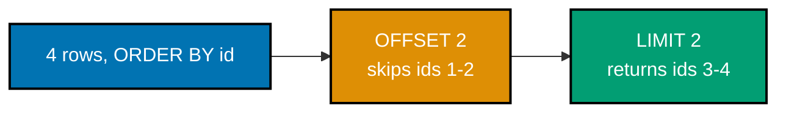
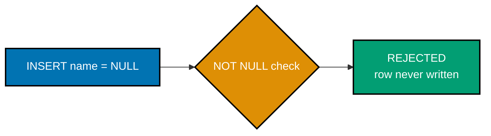
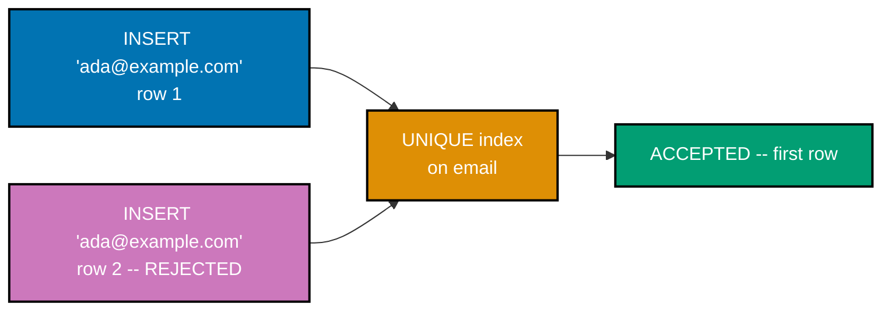
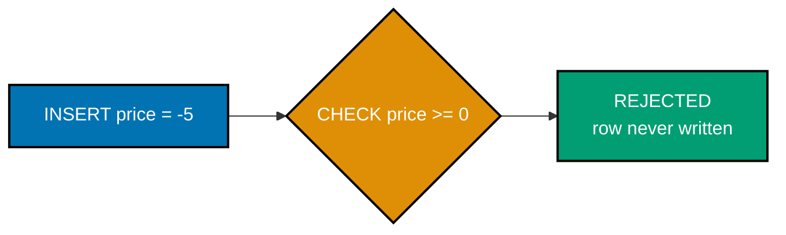
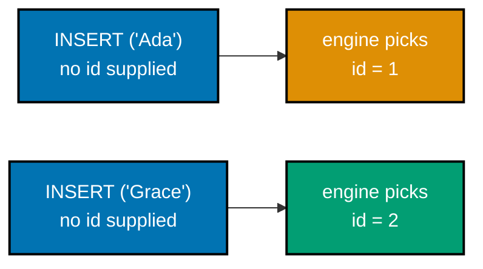
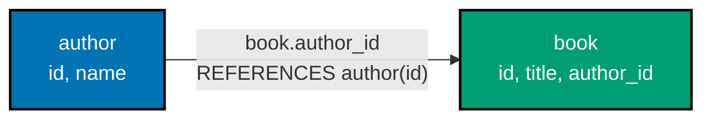
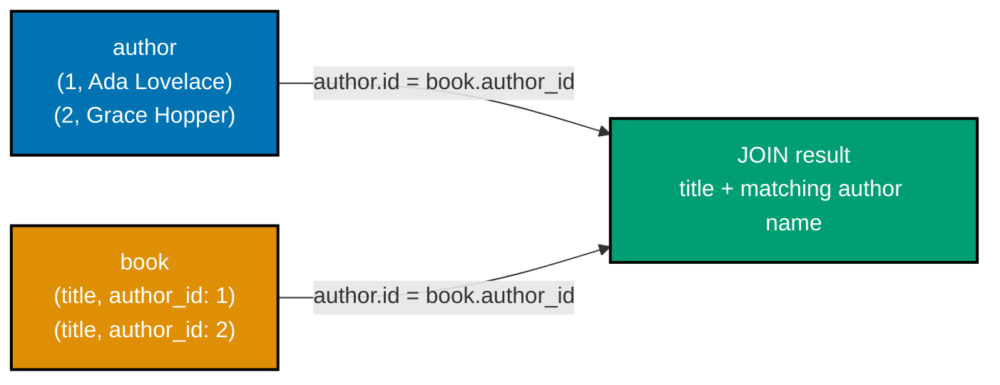
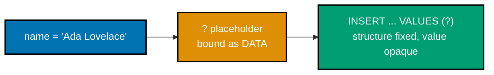

Examples 1-30 cover schema declaration (`CREATE TABLE`, `.schema`), the CRUD basics (`INSERT`,
`SELECT`, `UPDATE`, `DELETE`), `WHERE`/`ORDER BY`/`LIMIT` filtering and paging, the four core
constraints (`NOT NULL`, `UNIQUE`, `DEFAULT`, `CHECK`), foreign keys, a first `JOIN`, and the first
two Python `sqlite3` examples. Every example is fully self-contained: each one creates its own table(s)
and inserts its own rows, so none of them depend on state left behind by an earlier example. Run each
`.sql` example with `sqlite3 app.db < example.sql` from inside a fresh, empty directory; run each
`.py` example with `python3 example.py`.

---

### Example 1: Create Author Table

_ex-01 &middot; exercises co-07, co-02, co-01_

`CREATE TABLE` is how a relation (co-01) comes into existence: a name, a column list, and the
constraints that apply to every future row. `.schema <table>` proves what the engine actually stored,
byte-for-byte -- SQLite keeps the original `CREATE TABLE` text (including its comments) in its
internal `sqlite_master` table and echoes it back verbatim.

**`learning/code/ex-01-create-author-table/example.sql`**

```sql
-- Example 1: Create Author Table.
-- CREATE TABLE declares a new relation (co-07): a name, a column list, and constraints.
CREATE TABLE author(
    id INTEGER PRIMARY KEY,        -- => INTEGER PRIMARY KEY aliases SQLite's rowid (co-02)
                                    -- => the engine auto-assigns this on insert -- no id needed
    name TEXT NOT NULL             -- => TEXT column; NOT NULL forbids a missing name value
);

-- .schema prints the stored definition back verbatim -- proof of what the engine kept.
-- NOTE: dot-commands take the rest of their line as arguments -- no trailing "--" comment here.
.schema author
```

**Run**: `sqlite3 app.db < example.sql`

**Output**:

```text
CREATE TABLE author(
    id INTEGER PRIMARY KEY,        -- => INTEGER PRIMARY KEY aliases SQLite's rowid (co-02)
                                    -- => the engine auto-assigns this on insert -- no id needed
    name TEXT NOT NULL             -- => TEXT column; NOT NULL forbids a missing name value
);
```

**Key takeaway**: `.schema` echoes the exact `CREATE TABLE` text SQLite stored, comments included --
there is no separate, normalized "schema representation" hiding underneath.

**Why it matters**: Production teams rely on `.schema` (and its programmatic cousin,
`sqlite_master`) to answer "what does this database actually look like right now?" without trusting
stale documentation. Because SQLite stores the literal DDL text, a well-commented `CREATE TABLE`
statement becomes living, self-verifying documentation -- exactly the kind of source of truth
migration tooling (Example 59, Advanced tier) depends on when deciding whether a column already
exists.

---

### Example 2: Open Database CLI

_ex-02 &middot; exercises co-24_

The `sqlite3` CLI is the entire toolchain for this topic -- no server process, no GUI, just a binary
and dot-commands. Opening a database that does not yet exist on disk does not immediately write
anything; SQLite only touches the filesystem once the first statement actually needs to.

**`learning/code/ex-02-open-database-cli/example.sql`**

```sql
-- Example 2: Open Database CLI. Dot-commands take the rest of their line as
-- arguments, so comments here live on their own separate line.
.databases
-- => lists attached databases -- shows "main: <path-to-app.db> r/w"
.tables
-- => lists table names -- empty: a fresh database starts with zero tables
```

**Run**: `sqlite3 app.db < example.sql`

**Output** (path generalized to `/home/<user>/project/app.db` -- your own path will differ):

```text
main: /home/<user>/project/app.db r/w
```

`.tables` prints nothing at all -- an empty line, not an error. That is the correct, expected result
for a database with zero tables.

**Key takeaway**: `.databases` confirms which file is attached and in what mode (`r/w`); `.tables`
with no output means "zero tables," not a failure.

**Why it matters**: Every `sqlite3` session in this topic starts from exactly this state, so knowing
what "nothing has gone wrong yet" looks like matters as much as knowing what success looks like.
Production debugging sessions often begin with `.databases`/`.tables` to confirm you are even looking
at the file you think you are -- a surprisingly common source of "why is my data missing" confusion
when multiple `.db` files exist in a project.

---

### Example 3: Insert Single Row

_ex-03 &middot; exercises co-10_

`INSERT INTO table(columns) VALUES(...)` adds exactly one row. Omitting the `id` column lets the
`INTEGER PRIMARY KEY` column auto-assign it, a pattern this entire topic leans on rather than
hand-managing ids.

**`learning/code/ex-03-insert-single-row/example.sql`**

```sql
-- Example 3: Insert Single Row.
CREATE TABLE author(id INTEGER PRIMARY KEY, name TEXT NOT NULL);
                                    -- => author table exists, currently empty (0 rows)

-- INSERT INTO ... VALUES (co-10) adds exactly one new row to the relation.
INSERT INTO author(name) VALUES('Ada');
                                    -- => id is omitted -- INTEGER PRIMARY KEY auto-assigns 1
                                    -- => author now holds exactly one row: (1, 'Ada')

-- dot-commands take the rest of their line as arguments -- comments live on their own line.
.headers on
-- => turns on a column-name header row for readability
.mode column
-- => aligns SELECT output into fixed-width columns
SELECT * FROM author;              -- => projects every column of every row -- confirms one row
```

**Run**: `sqlite3 app.db < example.sql`

**Output**:

```text
id  name
--  ----
1   Ada
```

**Key takeaway**: An `INSERT` that leaves out the primary key column, not sets it to `NULL`, is how
you delegate id assignment to the engine.

**Why it matters**: Hand-assigning primary keys invites duplicate-id bugs the moment two writers
insert concurrently. Letting SQLite's rowid-backed `INTEGER PRIMARY KEY` assign the next value removes
an entire class of coordination problems, and every later example in this topic that inserts an
`author` or `book` row follows this same omit-the-id convention.

---

### Example 4: Insert Multiple Rows

_ex-04 &middot; exercises co-10_

A single `INSERT` statement can carry several comma-separated value tuples, inserting many rows in
one round-trip to the engine instead of issuing one `INSERT` per row.

**`learning/code/ex-04-insert-multiple-rows/example.sql`**

```sql
-- Example 4: Insert Multiple Rows.
CREATE TABLE author(id INTEGER PRIMARY KEY, name TEXT NOT NULL);
                                    -- => author table exists, ready for a bulk insert

-- One INSERT statement, three comma-separated value tuples (co-10) -- a single
-- round-trip to the engine instead of three separate INSERT statements.
INSERT INTO author(name) VALUES
    ('Ada Lovelace'),               -- => row 1: id auto-assigns to 1
    ('Grace Hopper'),                -- => row 2: id auto-assigns to 2
    ('Alan Turing');                 -- => row 3: id auto-assigns to 3

.headers on
.mode column
-- => the pair above produces an aligned, headered table for readability
SELECT count(*) FROM author;        -- => count(*) counts every row -- confirms all 3 landed
```

**Run**: `sqlite3 app.db < example.sql`

**Output**:

```text
count(*)
--------
3
```

**Key takeaway**: One multi-value `INSERT` is one transaction and one round-trip -- cheaper than
three separate `INSERT` statements when you already have all the rows in hand.

**Why it matters**: Batch-inserting seed or migration data this way is the difference between a
seed script that takes milliseconds and one that takes seconds, because every separate `INSERT`
statement pays its own transaction overhead. Example 74 (Advanced tier) builds directly on this
pattern to seed a database from a `.sql` file in one shot.

---

### Example 5: Select All Columns

_ex-05 &middot; exercises co-08, co-01_

`SELECT *` projects every declared column of a relation (co-01), in the order the columns were
declared in `CREATE TABLE`. It is the simplest possible query: no filtering, no column selection,
just "give me everything."

**`learning/code/ex-05-select-all-columns/example.sql`**

```sql
-- Example 5: Select All Columns.
-- SELECT * (co-08) projects every declared column, in declaration order.
CREATE TABLE book(id INTEGER PRIMARY KEY, title TEXT NOT NULL, price REAL NOT NULL, author_id INTEGER);
                                    -- => book table exists, currently empty (0 rows)
INSERT INTO book(id, title, price, author_id) VALUES
    (1, 'The Pragmatic Programmer', 34.99, 1),  -- => row 1: author_id 1
    (2, 'Clean Code', 29.99, 1),                -- => row 2: same author_id 1
    (3, 'The Mythical Man-Month', 24.5, 2);       -- => row 3: a different author_id
                                    -- => book now holds 3 rows across 4 columns each

.headers on
.mode column
SELECT * FROM book;                -- => returns all 3 rows, all 4 columns -- the full relation
```

**Run**: `sqlite3 app.db < example.sql`

**Output**:

```text
id  title                     price  author_id
--  ------------------------  -----  ---------
1   The Pragmatic Programmer  34.99  1
2   Clean Code                29.99  1
3   The Mythical Man-Month    24.5   2
```

**Key takeaway**: `SELECT *` returns every column in declaration order -- convenient for exploring a
table, but every later example that only needs a subset of columns should project explicitly instead
(Example 6).

**Why it matters**: `SELECT *` is the natural first query anyone runs against an unfamiliar table,
and it is exactly how this topic verifies every earlier `INSERT` actually landed. In production code,
though, `SELECT *` is usually avoided in favor of explicit column lists (Example 6), because a later
`ALTER TABLE ADD COLUMN` silently changes what `*` returns to every caller.

---

### Example 6: Select Projection

_ex-06 &middot; exercises co-08_

Naming one column instead of `*` is projection: fewer columns come back, the same number of rows.
`price` and `author_id` never leave the storage engine for this particular query.

**`learning/code/ex-06-select-projection/example.sql`**

```sql
-- Example 6: Select Projection.
CREATE TABLE book(id INTEGER PRIMARY KEY, title TEXT NOT NULL, price REAL NOT NULL, author_id INTEGER);
                                    -- => book table exists, currently empty
INSERT INTO book(id, title, price, author_id) VALUES
    (1, 'The Pragmatic Programmer', 34.99, 1),  -- => row 1
    (2, 'Clean Code', 29.99, 1),                -- => row 2
    (3, 'The Mythical Man-Month', 24.5, 2);       -- => row 3

.headers on
.mode column
-- Naming one column instead of * (co-08) is projection -- fewer columns come back,
-- same number of rows. price/author_id never leave the engine for this query.
SELECT title FROM book;            -- => returns only the title column, all 3 rows
```

**Run**: `sqlite3 app.db < example.sql`

**Output**:

```text
title
------------------------
The Pragmatic Programmer
Clean Code
The Mythical Man-Month
```

**Key takeaway**: Projection is choosing columns; it never changes how many rows come back -- only
`WHERE` (Example 7) changes row count.

**Why it matters**: Requesting only the columns a caller actually needs reduces the bytes the engine
has to serialize and the client has to parse -- meaningful at scale, and free to adopt from day one.
It also documents intent: a query that names `title` explicitly tells the next reader exactly what
the caller depends on, unlike `SELECT *`, which hides that dependency.

---

### Example 7: Where Equality

_ex-07 &middot; exercises co-08_

`WHERE` performs row selection (co-08): the engine evaluates the predicate once per row and keeps
only the rows where it is true. `=` tests exact equality.

**`learning/code/ex-07-where-equality/example.sql`**

```sql
-- Example 7: Where Equality.
CREATE TABLE book(id INTEGER PRIMARY KEY, title TEXT NOT NULL, price REAL NOT NULL, author_id INTEGER);
                                    -- => book table exists, currently empty
INSERT INTO book(id, title, price, author_id) VALUES
    (1, 'The Pragmatic Programmer', 34.99, 1),  -- => id 1
    (2, 'Clean Code', 29.99, 1),                -- => id 2
    (3, 'The Mythical Man-Month', 24.5, 2);       -- => id 3

-- turn on headers + column alignment so the result below reads as a table
.headers on
.mode column
-- WHERE selects rows (co-08) -- = tests exact equality, evaluated per row before output.
SELECT * FROM book WHERE id = 1;   -- => keeps only the row whose id equals 1 -- exactly one row
```

**Run**: `sqlite3 app.db < example.sql`

**Output**:

```text
id  title                     price  author_id
--  ------------------------  -----  ---------
1   The Pragmatic Programmer  34.99  1
```

**Key takeaway**: `WHERE id = 1` filters rows, not columns -- projection (Example 6) and selection
(this example) are independent, orthogonal operations you combine in a single query.

**Why it matters**: Point lookups by primary key (`WHERE id = ?`) are the single most common query
shape in production applications -- fetching one record by its identifier backs nearly every "view
detail" page and API endpoint. Example 30 (Python) reuses this same equality idiom with a bound
parameter instead of a literal value.

---

### Example 8: Where Comparison

_ex-08 &middot; exercises co-08_

`>` is a comparison operator: it keeps rows where the predicate evaluates true, exactly like `=` in
Example 7 but for an ordering relationship instead of exact equality.

**`learning/code/ex-08-where-comparison/example.sql`**

```sql
-- Example 8: Where Comparison.
CREATE TABLE book(id INTEGER PRIMARY KEY, title TEXT NOT NULL, price REAL NOT NULL, author_id INTEGER);
                                    -- => book table exists, currently empty
INSERT INTO book(id, title, price, author_id) VALUES
    (1, 'The Pragmatic Programmer', 34.99, 1),  -- => price above the threshold below
    (2, 'Clean Code', 29.99, 1),                -- => price above the threshold below
    (3, 'The Mythical Man-Month', 24.5, 2);       -- => price BELOW the threshold below

.headers on
.mode column
-- > is a comparison operator (co-08) -- keeps rows where the predicate is true.
SELECT * FROM book WHERE price > 25;
                                    -- => 34.99 and 29.99 pass the threshold; 24.5 does not
                                    -- => returns 2 rows (ids 1, 2), excludes id 3
```

**Run**: `sqlite3 app.db < example.sql`

**Output**:

```text
id  title                     price  author_id
--  ------------------------  -----  ---------
1   The Pragmatic Programmer  34.99  1
2   Clean Code                29.99  1
```

**Key takeaway**: `>`, `<`, `>=`, `<=` all work the same way as `=` in Example 7 -- one predicate,
evaluated per row, before any output is produced.

**Why it matters**: Threshold filtering (price ranges, date ranges, quantity thresholds) is the
backbone of report queries and search filters in almost every real application. Because the engine
evaluates `WHERE` before `ORDER BY` and `LIMIT` (Examples 12-15), understanding predicate evaluation
order here is a prerequisite for reasoning about paginated, filtered results correctly.

---

### Example 9: Where And Or

_ex-09 &middot; exercises co-08_

`AND` keeps a row only when both predicates evaluate true for that row -- a stricter filter than
either predicate alone.

**`learning/code/ex-09-where-and-or/example.sql`**

```sql
-- Example 9: Where And Or.
CREATE TABLE book(id INTEGER PRIMARY KEY, title TEXT NOT NULL, price REAL NOT NULL, author_id INTEGER);
                                    -- => book table exists, currently empty
INSERT INTO book(id, title, price, author_id) VALUES
    (1, 'The Pragmatic Programmer', 34.99, 1),  -- => passes both conditions below
    (2, 'Clean Code', 29.99, 1),                -- => passes both conditions below
    (3, 'The Mythical Man-Month', 24.5, 2),      -- => fails author_id = 1
    (4, 'Cheap Notes', 5.0, 1);                   -- => fails price > 10

.headers on
.mode column
-- AND (co-08) keeps a row only when BOTH predicates evaluate true for that row.
SELECT * FROM book WHERE price > 10 AND author_id = 1;
                                    -- => id 3 excluded by author_id, id 4 excluded by price
                                    -- => returns exactly ids 1 and 2
```

**Run**: `sqlite3 app.db < example.sql`

**Output**:

```text
id  title                     price  author_id
--  ------------------------  -----  ---------
1   The Pragmatic Programmer  34.99  1
2   Clean Code                29.99  1
```

**Key takeaway**: `AND` narrows a result set -- adding a second condition can only remove rows,
never add ones a single condition would not already have matched.

**Why it matters**: Multi-condition filters (`AND`) power every "search with filters" UI: price
range, category, and in-stock status combined. `OR` behaves the opposite way -- it widens a result
set -- and mixing the two without parentheses is a classic source of logic bugs, since `AND` binds
tighter than `OR` in SQL's operator precedence, exactly like most programming languages.

---

### Example 10: Where Like Prefix

_ex-10 &middot; exercises co-08_

`LIKE` pattern-matches text; `%` is a wildcard standing in for zero or more characters, making prefix,
suffix, and substring matching possible without a full text-search engine.

**`learning/code/ex-10-where-like-prefix/example.sql`**

```sql
-- Example 10: Where Like Prefix.
CREATE TABLE book(id INTEGER PRIMARY KEY, title TEXT NOT NULL, price REAL NOT NULL, author_id INTEGER);
                                    -- => book table exists, currently empty
INSERT INTO book(id, title, price, author_id) VALUES
    (1, 'The Pragmatic Programmer', 34.99, 1),  -- => title starts with "The "
    (2, 'Clean Code', 29.99, 1),                -- => title does NOT start with "The "
    (3, 'The Mythical Man-Month', 24.5, 2);       -- => title starts with "The "

.headers on
.mode column
-- LIKE (co-08) pattern-matches text -- % is a wildcard for zero-or-more characters.
SELECT * FROM book WHERE title LIKE 'The %';
                                    -- => matches any title starting with the literal "The "
                                    -- => returns ids 1 and 3; "Clean Code" does not match
```

**Run**: `sqlite3 app.db < example.sql`

**Output**:

```text
id  title                     price  author_id
--  ------------------------  -----  ---------
1   The Pragmatic Programmer  34.99  1
3   The Mythical Man-Month    24.5   2
```

**Key takeaway**: `'The %'` matches a fixed prefix followed by anything; `'%word%'` (not shown) would
match `word` anywhere in the text -- both are `LIKE` patterns, only the wildcard placement differs.

**Why it matters**: `LIKE` is the simplest text search SQLite ships with -- no extension, no separate
index required, though it is a full table scan without one. It is the right tool for small tables or
exact prefix/suffix matching; SQLite's separate FTS5 extension (out of this topic's scope) is the
right tool once text search needs to scale or support ranking.

---

### Example 11: Where In Set

_ex-11 &middot; exercises co-08_

`IN` tests set membership -- shorthand for chaining several `OR`-equality checks together into one
readable clause.

**`learning/code/ex-11-where-in-set/example.sql`**

```sql
-- Example 11: Where In Set.
CREATE TABLE book(id INTEGER PRIMARY KEY, title TEXT NOT NULL, price REAL NOT NULL, author_id INTEGER);
                                    -- => book table exists, currently empty
INSERT INTO book(id, title, price, author_id) VALUES
    (1, 'The Pragmatic Programmer', 34.99, 1),  -- => id in the set below
    (2, 'Clean Code', 29.99, 1),                -- => id NOT in the set below
    (3, 'The Mythical Man-Month', 24.5, 2);       -- => id in the set below

.headers on
.mode column
-- IN (co-08) tests set membership -- shorthand for chained OR-equality checks.
SELECT * FROM book WHERE id IN (1, 3);
                                    -- => keeps rows whose id matches ANY value in the list
                                    -- => returns ids 1 and 3, skips id 2
```

**Run**: `sqlite3 app.db < example.sql`

**Output**:

```text
id  title                     price  author_id
--  ------------------------  -----  ---------
1   The Pragmatic Programmer  34.99  1
3   The Mythical Man-Month    24.5   2
```

**Key takeaway**: `WHERE id IN (1, 3)` is equivalent to `WHERE id = 1 OR id = 3`, but scales to
dozens of values without becoming unreadable.

**Why it matters**: `IN (...)` is the standard way to batch-fetch a known set of ids in one query
instead of one query per id -- exactly the fix Example 64 (Advanced tier) applies to eliminate an
N+1 query pattern. Recognizing "I am about to loop and issue one query per item" as a signal to
reach for `IN (...)` instead is one of the highest-leverage habits in this entire topic.

---

### Example 12: Order By Ascending

_ex-12 &middot; exercises co-09_

`ORDER BY` sorts the result set; `ASC` (the default direction) sorts low-to-high for numbers and
A-to-Z for text. Storage order is never the same thing as output order -- only `ORDER BY` controls
what order rows come back in.

**`learning/code/ex-12-order-by-ascending/example.sql`**

```sql
-- Example 12: Order By Ascending.
CREATE TABLE book(id INTEGER PRIMARY KEY, title TEXT NOT NULL, price REAL NOT NULL);
                                    -- => book table exists, currently empty
INSERT INTO book(id, title, price) VALUES
    (1, 'The Pragmatic Programmer', 34.99),  -- => stored first, but storage order != output order
    (2, 'Clean Code', 29.99),                -- => stored second
    (3, 'The Mythical Man-Month', 24.5);       -- => stored third

-- turn on headers + column alignment so the sorted result reads as a table
.headers on
.mode column
-- ORDER BY (co-09) sorts the result set; ASC (the default) sorts low-to-high / A-to-Z.
SELECT * FROM book ORDER BY title ASC;
                                    -- => "Clean Code" sorts before "The..." titles alphabetically
```

**Run**: `sqlite3 app.db < example.sql`

**Output**:

```text
id  title                     price
--  ------------------------  -----
2   Clean Code                29.99
3   The Mythical Man-Month    24.5
1   The Pragmatic Programmer  34.99
```

**Key takeaway**: Row 1 was inserted first but sorts last -- `ORDER BY` is the only thing that
determines output order; insertion order gives no guarantee whatsoever.

**Why it matters**: Relying on "rows probably come back in insertion order" is a latent bug: SQLite's
query planner is free to return rows in whatever order is cheapest, and that order can change between
runs, SQLite versions, or after an index is added. Every query that needs a predictable order must
say so explicitly with `ORDER BY` -- there are no exceptions.

---

### Example 13: Order By Descending

_ex-13 &middot; exercises co-09_

`DESC` reverses the sort direction -- highest value first -- the standard shape for "most expensive
first" or "most recent first" report queries.

**`learning/code/ex-13-order-by-descending/example.sql`**

```sql
-- Example 13: Order By Descending.
CREATE TABLE book(id INTEGER PRIMARY KEY, title TEXT NOT NULL, price REAL NOT NULL);
                                    -- => book table exists, currently empty
INSERT INTO book(id, title, price) VALUES
    (1, 'The Pragmatic Programmer', 34.99),  -- => the most expensive row
    (2, 'Clean Code', 29.99),                -- => the middle-priced row
    (3, 'The Mythical Man-Month', 24.5);       -- => the cheapest row

.headers on
.mode column
-- DESC (co-09) reverses the sort direction -- highest value first, most useful
-- for "most expensive first" or "most recent first" style reports.
SELECT * FROM book ORDER BY price DESC;
                                    -- => 34.99, then 29.99, then 24.5 -- strictly decreasing
```

**Run**: `sqlite3 app.db < example.sql`

**Output**:

```text
id  title                     price
--  ------------------------  -----
1   The Pragmatic Programmer  34.99
2   Clean Code                29.99
3   The Mythical Man-Month    24.5
```

**Key takeaway**: `ORDER BY price DESC` is `ASC`'s mirror image -- same clause, opposite direction --
and this dataset happens to already be in descending price order, which is exactly what the sort
confirms rather than coincidentally matches.

**Why it matters**: "Newest first" feeds and "highest value first" leaderboards are two of the most
common report shapes in production software, and both are just `ORDER BY <column> DESC`. Combined
with `LIMIT` (Example 14), this single clause pair implements the vast majority of "top N" queries
you will ever write.

---

### Example 14: Limit Rows

_ex-14 &middot; exercises co-09_

`LIMIT` caps how many rows the engine returns. It is evaluated after `ORDER BY`, so pairing the two
is how "first N" queries get a well-defined, deterministic meaning.

**`learning/code/ex-14-limit-rows/example.sql`**

```sql
-- Example 14: Limit Rows.
CREATE TABLE book(id INTEGER PRIMARY KEY, title TEXT NOT NULL, price REAL NOT NULL);
                                    -- => book table exists, currently empty
INSERT INTO book(id, title, price) VALUES
    (1, 'The Pragmatic Programmer', 34.99),  -- => row 1 -- kept by LIMIT 2 below
    (2, 'Clean Code', 29.99),                -- => row 2 -- kept by LIMIT 2 below
    (3, 'The Mythical Man-Month', 24.5);       -- => row 3 -- cut off by LIMIT 2 below

.headers on
.mode column
-- LIMIT (co-09) caps the row count the engine returns -- evaluated AFTER ORDER BY,
-- so pair it with ORDER BY whenever "first N" needs to mean something specific.
SELECT * FROM book LIMIT 2;        -- => stops after 2 rows even though 3 rows match overall
```

**Run**: `sqlite3 app.db < example.sql`

**Output**:

```text
id  title                     price
--  ------------------------  -----
1   The Pragmatic Programmer  34.99
2   Clean Code                29.99
```

**Key takeaway**: `LIMIT` without `ORDER BY` returns _some_ 2 rows, not a meaningful "first 2" --
without a sort, "first" has no defined meaning.

**Why it matters**: Every paginated API endpoint and every "show top 10" widget relies on `LIMIT`.
Used without `ORDER BY`, though, `LIMIT` is a footgun: the engine is free to return whichever rows
are cheapest to produce, so the same query can return different rows on different runs unless a sort
pins the order down first.

---

### Example 15: Limit Offset Paging

_ex-15 &middot; exercises co-09_

`OFFSET` skips N rows before `LIMIT` starts counting -- the standard "page 2 of results" pattern:
page size 2 with `OFFSET 2` skips exactly the first page's rows.



**`learning/code/ex-15-limit-offset-paging/example.sql`**

```sql
-- Example 15: Limit Offset Paging.
CREATE TABLE book(id INTEGER PRIMARY KEY, title TEXT NOT NULL, price REAL NOT NULL);
                                    -- => book table exists, currently empty
INSERT INTO book(id, title, price) VALUES
    (1, 'The Pragmatic Programmer', 34.99),  -- => page 1 -- skipped by OFFSET 2 below
    (2, 'Clean Code', 29.99),                -- => page 1 -- skipped by OFFSET 2 below
    (3, 'The Mythical Man-Month', 24.5),      -- => page 2 -- returned below
    (4, 'Refactoring', 39.99);                 -- => page 2 -- returned below

.headers on
.mode column
-- OFFSET (co-09) skips N rows before LIMIT starts counting -- the standard
-- "page 2 of results" pattern: page size 2, OFFSET 2 skips page 1's rows.
SELECT * FROM book ORDER BY id LIMIT 2 OFFSET 2;
                                    -- => skips ids 1-2 (page 1), returns ids 3-4 (page 2)
```

**Run**: `sqlite3 app.db < example.sql`

**Output**:

```text
id  title                   price
--  ----------------------  -----
3   The Mythical Man-Month  24.5
4   Refactoring             39.99
```

**Key takeaway**: `LIMIT <page-size> OFFSET <page-size * (page-number - 1)>` is the arithmetic behind
every "page N of results" query -- always paired with `ORDER BY` for a stable, repeatable order.

**Why it matters**: Offset-based pagination is simple to implement and universally supported, though
it degrades at very high offsets (the engine still has to scan and discard every skipped row) --
production systems serving deep pagination often switch to keyset ("seek") pagination instead. For
the row counts most applications actually deal with, `LIMIT`/`OFFSET` remains the pragmatic default.

---

### Example 16: Select Distinct

_ex-16 &middot; exercises co-08_

`DISTINCT` collapses duplicate result rows -- here, two books share the same `author_id`, and
`DISTINCT` reduces them to one appearance in the output.

**`learning/code/ex-16-select-distinct/example.sql`**

```sql
-- Example 16: Select Distinct.
CREATE TABLE book(id INTEGER PRIMARY KEY, title TEXT NOT NULL, author_id INTEGER);
                                    -- => book table exists, currently empty
INSERT INTO book(id, title, author_id) VALUES
    (1, 'The Pragmatic Programmer', 1),  -- => author_id 1 -- first occurrence
    (2, 'Clean Code', 1),                -- => author_id 1 -- a duplicate value
    (3, 'The Mythical Man-Month', 2);      -- => author_id 2 -- first occurrence

-- turn on headers + column alignment so the result below reads as a table
.headers on
.mode column
-- DISTINCT (co-08) collapses duplicate result rows -- here, two books share author_id 1.
SELECT DISTINCT author_id FROM book;
                                    -- => 3 input rows collapse to 2 distinct author_id values
```

**Run**: `sqlite3 app.db < example.sql`

**Output**:

```text
author_id
---------
1
2
```

**Key takeaway**: `DISTINCT` operates on the projected result, not the underlying table -- three rows
went in, two distinct `author_id` values came out.

**Why it matters**: "Which distinct values does this column hold?" is a common exploratory question
when getting to know an unfamiliar dataset -- distinct author ids, distinct status values, distinct
categories. `DISTINCT` answers it in one line without a `GROUP BY` (Example 34, Intermediate tier),
though `GROUP BY` becomes necessary the moment you need a count or other aggregate alongside each
distinct value.

---

### Example 17: Type Affinity

_ex-17 &middot; exercises co-06_

SQLite uses type **affinity**, not rigid enforcement: a declared column type is a storage-class
preference the engine tries to honor, not a hard runtime barrier the way it is in most other
relational databases.

**`learning/code/ex-17-type-affinity/example.sql`**

```sql
-- Example 17: Type Affinity.
-- SQLite uses type AFFINITY (co-06), not rigid enforcement -- a declared type is a
-- storage-class preference the engine tries to honor, not a hard runtime barrier.
CREATE TABLE demo(n INTEGER);

-- '42' is a TEXT literal, but the column's INTEGER affinity converts it on insert.
INSERT INTO demo(n) VALUES('42');   -- => the string '42' gets stored as the integer 42

.headers on
.mode column
-- typeof() reveals the ACTUAL storage class the engine chose, not the declared type.
SELECT n, typeof(n) FROM demo;     -- => typeof(n) reports "integer" -- affinity coerced it
```

**Run**: `sqlite3 app.db < example.sql`

**Output**:

```text
n   typeof(n)
--  ---------
42  integer
```

**Key takeaway**: `typeof()` reveals the actual storage class SQLite chose for a value, which can
differ from what the declared column type might suggest -- affinity is a preference, not a guarantee.

**Why it matters**: Affinity is a deliberate SQLite design choice, not a bug: it trades the rigid
type enforcement of PostgreSQL or MySQL for schema flexibility that suits SQLite's embedded,
zero-configuration use case. Understanding affinity up front prevents surprising debugging sessions
later, when a numeric-looking string in a TEXT column stays TEXT (no affinity match) while the same
string in an INTEGER column silently becomes a number.

---

### Example 18: Not Null Constraint

_ex-18 &middot; exercises co-04_

`NOT NULL` is an invariant the engine enforces on every write, not a suggestion: any `INSERT` or
`UPDATE` that would leave the column `NULL` is rejected outright, and no partial row is ever written.



**`learning/code/ex-18-not-null-constraint/example.sql`**

```sql
-- Example 18: Not Null Constraint.
-- NOT NULL (co-04) is an invariant the engine enforces on EVERY write, not a suggestion.
CREATE TABLE author(id INTEGER PRIMARY KEY, name TEXT NOT NULL);

-- This INSERT explicitly supplies NULL for a column the schema forbids NULL on.
INSERT INTO author(name) VALUES(NULL);
                                    -- => the engine rejects the write before it commits
                                    -- => raises: NOT NULL constraint failed: author.name

.headers on
.mode column
SELECT count(*) FROM author;       -- => confirms the rejected row never landed -- table stays empty
```

**Run**: `sqlite3 app.db < example.sql`

**Output** (captured for real -- this is SQLite 3.43.2's exact error text):

```text
Runtime error near line 6: NOT NULL constraint failed: author.name (19)
count(*)
--------
0
```

**Exit code**: non-zero (`$?` is `1`).

**Key takeaway**: The `sqlite3` CLI does not stop at the first error by default -- it reports the
failure and keeps processing the rest of the script, which is why the follow-up `SELECT count(*)`
still runs and confirms the table stayed empty.

**Why it matters**: `NOT NULL` moves a data-integrity rule out of application code and into the
schema, where it is enforced no matter which code path writes to the table -- a background job, an
ad-hoc script, or a future feature the original author never anticipated. This is strictly stronger
than an application-layer "required field" check, which only protects the one code path that
remembers to run it.

---

### Example 19: Unique Constraint

_ex-19 &middot; exercises co-04_

`UNIQUE` forbids two rows from sharing the same value in that column -- the engine builds an index
to enforce it, and any write that would create a duplicate is rejected.



**`learning/code/ex-19-unique-constraint/example.sql`**

```sql
-- Example 19: Unique Constraint.
-- UNIQUE (co-04) forbids two rows from sharing the same value in that column.
CREATE TABLE author(id INTEGER PRIMARY KEY, email TEXT UNIQUE);

INSERT INTO author(email) VALUES('ada@example.com');
                                    -- => first insert succeeds -- no prior row to conflict with

-- Same email value again -- the UNIQUE index the engine built now blocks this write.
INSERT INTO author(email) VALUES('ada@example.com');
                                    -- => the engine rejects the duplicate before it commits
                                    -- => raises: UNIQUE constraint failed: author.email

.headers on
.mode column
SELECT count(*) FROM author;       -- => confirms exactly one row survived -- the duplicate never landed
```

**Run**: `sqlite3 app.db < example.sql`

**Output** (captured for real):

```text
Runtime error near line 9: UNIQUE constraint failed: author.email (19)
count(*)
--------
1
```

**Exit code**: non-zero (`$?` is `1`).

**Key takeaway**: `UNIQUE` on a single column (rather than `PRIMARY KEY`) is how you enforce "no two
rows share this value" for columns that are not themselves the row's identity -- an email address,
a username, a slug. The follow-up count confirms only the first, successful insert survived.

**Why it matters**: "Duplicate email" and "username already taken" errors in production applications
almost always trace back to a `UNIQUE` constraint firing exactly like this one. Enforcing uniqueness
at the database layer, not just in application code, is essential once more than one process can
write to the same table -- a race between two concurrent signups can only be closed reliably by the
engine itself.

---

### Example 20: Default Value

_ex-20 &middot; exercises co-04_

`DEFAULT` supplies a value automatically whenever an `INSERT` omits that column entirely -- distinct
from setting the column to `NULL`, which is an explicit choice, not an omission.

**`learning/code/ex-20-default-value/example.sql`**

```sql
-- Example 20: Default Value.
-- DEFAULT (co-04) supplies a value automatically when an INSERT omits that column.
CREATE TABLE account(id INTEGER PRIMARY KEY, status TEXT DEFAULT 'active');

-- This INSERT lists only id -- status is left out entirely, not set to NULL.
INSERT INTO account(id) VALUES(1);
                                    -- => the engine substitutes 'active' for the missing column

.headers on
.mode column
SELECT * FROM account;             -- => status shows 'active' even though we never wrote it
```

**Run**: `sqlite3 app.db < example.sql`

**Output**:

```text
id  status
--  ------
1   active
```

**Key takeaway**: `DEFAULT` only applies when a column is omitted from the `INSERT`'s column list --
`INSERT INTO account(id, status) VALUES(1, NULL)` would insert an actual `NULL`, not `'active'`.

**Why it matters**: Defaults keep every INSERT statement from having to repeat boilerplate values
(a new row's `status`, `created_at`, or `is_active` flag) while still guaranteeing the column is
never accidentally left `NULL` by a caller that forgot about it. Example 59 (Advanced tier) reuses
this exact mechanism to add a new column to an already-populated table without breaking existing rows.

---

### Example 21: Check Constraint

_ex-21 &middot; exercises co-04_

`CHECK` enforces an arbitrary boolean expression on every write to that row -- a business invariant
(here, "price cannot be negative") that the schema itself now guarantees, not just application code.



**`learning/code/ex-21-check-constraint/example.sql`**

```sql
-- Example 21: Check Constraint.
-- CHECK (co-04) enforces an arbitrary boolean expression on every write to that row.
CREATE TABLE book(id INTEGER PRIMARY KEY, price REAL CHECK(price >= 0));

-- -5 violates price >= 0 -- a business invariant the schema itself now guarantees.
INSERT INTO book(price) VALUES(-5);
                                    -- => the engine evaluates CHECK(price >= 0) as false
                                    -- => raises: CHECK constraint failed: price >= 0

.headers on
.mode column
SELECT count(*) FROM book;         -- => confirms the rejected row never landed -- table stays empty
```

**Run**: `sqlite3 app.db < example.sql`

**Output** (captured for real):

```text
Runtime error near line 6: CHECK constraint failed: price >= 0 (19)
count(*)
--------
0
```

**Exit code**: non-zero (`$?` is `1`).

**Key takeaway**: `CHECK(<expression>)` can reference any of the row's own columns and any SQL
expression that evaluates to a boolean -- far more flexible than `NOT NULL` or `UNIQUE` alone.

**Why it matters**: Business rules like "price cannot be negative," "end date must be after start
date," or "discount cannot exceed 100%" belong in a `CHECK` constraint whenever they can be expressed
as a single-row condition, because that closes off every write path at once -- the admin console, the
API, and any future script -- rather than trusting each one to re-implement the same validation.

---

### Example 22: Autoincrement Rowid

_ex-22 &middot; exercises co-02_

`INTEGER PRIMARY KEY` aliases SQLite's internal `rowid` (co-02): omitting it on `INSERT` lets the
engine pick the next value automatically, one higher than the current maximum.



**`learning/code/ex-22-autoincrement-rowid/example.sql`**

```sql
-- Example 22: Autoincrement Rowid.
-- INTEGER PRIMARY KEY aliases rowid (co-02) -- omitting it lets SQLite pick the next value.
CREATE TABLE author(id INTEGER PRIMARY KEY, name TEXT NOT NULL);
                                    -- => author table exists, currently empty

INSERT INTO author(name) VALUES('Ada');
                                    -- => no id supplied -- engine auto-assigns id = 1
INSERT INTO author(name) VALUES('Grace');
                                    -- => engine auto-assigns id = 2 (one higher than the max so far)

.headers on
.mode column
SELECT * FROM author;              -- => ids came from the engine, not from us: 1, then 2
```

**Run**: `sqlite3 app.db < example.sql`

**Output**:

```text
id  name
--  -----
1   Ada
2   Grace
```

**Key takeaway**: `INTEGER PRIMARY KEY` id assignment is "one higher than the current maximum," not
strictly sequential without gaps -- a deleted row's id is never reused unless it happened to be the
current maximum.

**Why it matters**: This is the exact mechanism behind Example 3's "leave out the id" pattern --
understanding _why_ it works (rowid aliasing, not magic) matters once you hit edge cases like
concurrent inserts or explicit id reuse after a `DELETE`. SQLite's separate `AUTOINCREMENT` keyword
(not shown here, and out of this topic's scope) adds a stricter no-reuse guarantee at a small
performance cost -- most schemas do not need it.

---

### Example 23: Update One Row

_ex-23 &middot; exercises co-11_

`UPDATE ... SET ... WHERE` mutates only the rows the `WHERE` clause matches -- every other row in the
table is left completely untouched.

**`learning/code/ex-23-update-one-row/example.sql`**

```sql
-- Example 23: Update One Row.
CREATE TABLE book(id INTEGER PRIMARY KEY, title TEXT NOT NULL, price REAL NOT NULL);
                                    -- => book table exists, currently empty
INSERT INTO book(id, title, price) VALUES
    (1, 'The Pragmatic Programmer', 34.99),  -- => the row the WHERE clause below will match
    (2, 'Clean Code', 29.99);                  -- => not matched -- stays untouched below

-- UPDATE ... SET ... WHERE (co-11) mutates only the rows the WHERE clause matches.
UPDATE book SET price = 15 WHERE id = 1;
                                    -- => only the row with id = 1 changes -- id 2 is untouched

-- turn on headers + column alignment so the result below reads as a table
.headers on
.mode column
SELECT * FROM book;                -- => id 1 now shows 15.0, id 2 still shows its original 29.99
```

**Run**: `sqlite3 app.db < example.sql`

**Output**:

```text
id  title                     price
--  ------------------------  -----
1   The Pragmatic Programmer  15.0
2   Clean Code                29.99
```

**Key takeaway**: `SET price = 15` and `WHERE id = 1` are independent clauses -- `SET` decides what
changes, `WHERE` decides which rows the change applies to.

**Why it matters**: Targeted single-row updates -- editing one product's price, one user's profile
field -- are the most common write operation in CRUD applications after inserts. The `WHERE` clause
is what makes an `UPDATE` surgical rather than catastrophic, which is exactly the contrast Example 24
demonstrates by omitting it.

---

### Example 24: Update All Rows

_ex-24 &middot; exercises co-11_

No `WHERE` clause means the predicate is implicitly "true for every row" -- `UPDATE` then touches the
entire table. This is easy to trigger by accident, so it deserves its own worked example.

**`learning/code/ex-24-update-all-rows/example.sql`**

```sql
-- Example 24: Update All Rows.
CREATE TABLE book(id INTEGER PRIMARY KEY, title TEXT NOT NULL, in_stock INTEGER NOT NULL DEFAULT 0);
                                    -- => book table exists, currently empty
INSERT INTO book(id, title, in_stock) VALUES
    (1, 'The Pragmatic Programmer', 0),  -- => starts out of stock
    (2, 'Clean Code', 0);                  -- => starts out of stock

-- No WHERE clause (co-11) means the predicate is implicitly "true for every row" --
-- UPDATE touches the entire table. This is easy to do by accident -- always double-check.
UPDATE book SET in_stock = 1;
                                    -- => every row's in_stock flips from 0 to 1, no exceptions

.headers on
.mode column
SELECT * FROM book;                -- => both rows now show in_stock = 1
```

**Run**: `sqlite3 app.db < example.sql`

**Output**:

```text
id  title                     in_stock
--  ------------------------  --------
1   The Pragmatic Programmer  1
2   Clean Code                1
```

**Key takeaway**: An `UPDATE` (or `DELETE`) with no `WHERE` clause is valid SQL, not an error -- the
engine has no way to know you forgot the clause versus meant to update everything.

**Why it matters**: A missing `WHERE` clause on `UPDATE` or `DELETE` is one of the most common
catastrophic mistakes in production database work -- it is syntactically identical to "update
everything on purpose." Many teams mitigate this with a linter rule, a code-review checklist item, or
running ad-hoc mutations inside an explicit transaction (Example 51, Intermediate tier) that can be
rolled back before committing.

---

### Example 25: Delete Row

_ex-25 &middot; exercises co-12_

`DELETE FROM ... WHERE` removes only the matching rows -- the table itself, its schema, and every
other row remain exactly as they were.

**`learning/code/ex-25-delete-row/example.sql`**

```sql
-- Example 25: Delete Row.
CREATE TABLE book(id INTEGER PRIMARY KEY, title TEXT NOT NULL);
                                    -- => book table exists, currently empty
INSERT INTO book(id, title) VALUES
    (1, 'The Pragmatic Programmer'),  -- => survives the DELETE below
    (2, 'Clean Code'),                  -- => targeted by the DELETE below
    (3, 'The Mythical Man-Month');       -- => survives the DELETE below

-- DELETE FROM ... WHERE (co-12) removes only the matching rows -- the table stays.
DELETE FROM book WHERE id = 2;     -- => row id 2 is gone permanently; ids 1 and 3 remain

-- turn on headers + column alignment so the result below reads as a table
.headers on
.mode column
SELECT * FROM book;                -- => only ids 1 and 3 remain, in that order
SELECT count(*) FROM book;         -- => count drops from 3 to 2 -- exactly one row removed
```

**Run**: `sqlite3 app.db < example.sql`

**Output**:

```text
id  title
--  ------------------------
1   The Pragmatic Programmer
3   The Mythical Man-Month
count(*)
--------
2
```

**Key takeaway**: `DELETE FROM book WHERE id = 2` removes exactly one row -- `DELETE FROM book` alone
(no `WHERE`) would remove every row, the `DELETE` equivalent of Example 24's unqualified `UPDATE`.

**Why it matters**: `DELETE` without a `WHERE` clause is, if anything, more dangerous than an
unqualified `UPDATE`, because there is no "previous value" left to recover from once every row is
gone (short of restoring a backup or replaying a transaction log). Production teams frequently favor
a "soft delete" pattern -- an `UPDATE` that sets a `deleted_at` flag instead of a real `DELETE` -- for
exactly this reason, trading storage for recoverability.

---

### Example 26: Declare Foreign Key

_ex-26 &middot; exercises co-03_

`REFERENCES` declares that `book.author_id` must point at a real `author.id` -- a static,
self-documenting invariant that lives directly in the schema. Declaring it is a separate step from
enforcing it (Example 27).



**`learning/code/ex-26-declare-foreign-key/example.sql`**

```sql
-- Example 26: Declare Foreign Key.
CREATE TABLE author(id INTEGER PRIMARY KEY, name TEXT NOT NULL);
                                    -- => author table exists -- the FK below will point at it

-- REFERENCES (co-03) declares that book.author_id must point at a real author.id --
-- a static, self-documenting invariant that lives in the schema itself.
CREATE TABLE book(
    id INTEGER PRIMARY KEY,        -- => book's own primary key
    title TEXT NOT NULL,           -- => every book must have a title
    author_id INTEGER REFERENCES author(id)
                                    -- => declares the FK -- enforcement is a SEPARATE step (Example 27)
);

-- .schema prints back the stored definition -- proof the REFERENCES clause was kept.
.schema book
```

**Run**: `sqlite3 app.db < example.sql`

**Output**:

```text
CREATE TABLE book(
    id INTEGER PRIMARY KEY,        -- => book's own primary key
    title TEXT NOT NULL,           -- => every book must have a title
    author_id INTEGER REFERENCES author(id)
                                    -- => declares the FK -- enforcement is a SEPARATE step (Example 27)
);
```

**Key takeaway**: `REFERENCES author(id)` is purely declarative in this example -- it documents the
relationship and shows up in `.schema`, but by itself it does not yet stop an orphaned `author_id`
from being inserted (that requires Example 27's pragma).

**Why it matters**: Declaring foreign keys, even before enforcing them, documents the shape of your
data model directly in the schema where every developer, migration tool, and ER-diagram generator can
read it. This is the mechanism that makes Example 28's `JOIN` meaningful: `book.author_id` and
`author.id` are related columns by design, not by coincidence of naming.

---

### Example 27: Enforce Foreign Key

_ex-27 &middot; exercises co-03_

**CRITICAL**: foreign keys are **off by default** in SQLite. `PRAGMA foreign_keys=ON` must run on
every connection, every time, or `REFERENCES` clauses are decoration only -- exactly as Example 26
demonstrated.


**`learning/code/ex-27-enforce-foreign-key/example.sql`**

```sql
-- Example 27: Enforce Foreign Key.
-- CRITICAL: foreign keys are OFF by default in SQLite -- this pragma must run per
-- connection, every time, or REFERENCES clauses are decoration only (co-03).
PRAGMA foreign_keys=ON;

CREATE TABLE author(id INTEGER PRIMARY KEY, name TEXT NOT NULL);
                                    -- => author table exists, currently empty -- no id 99 in it
CREATE TABLE book(
    id INTEGER PRIMARY KEY,        -- => book's own primary key
    title TEXT NOT NULL,           -- => every book must have a title
    author_id INTEGER REFERENCES author(id)
    -- => REFERENCES alone does nothing without the PRAGMA above -- both are required
);

-- author_id 99 does not exist in the author table -- an orphan reference.
INSERT INTO book(title, author_id) VALUES('Ghost Book', 99);
                                    -- => with the pragma ON, the engine checks the reference first
                                    -- => raises: FOREIGN KEY constraint failed

.headers on
.mode column
SELECT count(*) FROM book;         -- => confirms the rejected row never landed -- table stays empty
```

**Run**: `sqlite3 app.db < example.sql`

**Output** (captured for real):

```text
Runtime error near line 16: FOREIGN KEY constraint failed (19)
count(*)
--------
0
```

**Exit code**: non-zero (`$?` is `1`).

**Key takeaway**: Without `PRAGMA foreign_keys=ON`, the identical `INSERT` with `author_id = 99`
would succeed silently, leaving an orphaned row -- the pragma is not optional if referential integrity
matters to your application, and the follow-up count confirms the orphan never landed.

**Why it matters**: SQLite's foreign-key-off-by-default design is a documented, verified fact from
[sqlite.org's Foreign Key Support page](https://www.sqlite.org/foreignkeys.html) ("Foreign key
constraints are disabled by default"), and it surprises developers coming from PostgreSQL or MySQL,
where they are always on. Every application that cares about referential integrity must set this
pragma explicitly on every single connection -- typically right after `sqlite3.connect()` in Python
(Example 29) -- because it does not persist as a database-level setting.

---

### Example 28: Inner Join Two Tables

_ex-28 &middot; exercises co-13_

`JOIN ... ON` recombines normalized data: the engine matches `book.author_id` to `author.id`, row by
row, and only rows with a match on both sides appear in the output -- the workhorse operation for
undoing normalization (co-05) at query time.



**`learning/code/ex-28-inner-join-two-tables/example.sql`**

```sql
-- Example 28: Inner Join Two Tables.
CREATE TABLE author(id INTEGER PRIMARY KEY, name TEXT NOT NULL);
                                    -- => author table exists, currently empty
CREATE TABLE book(id INTEGER PRIMARY KEY, title TEXT NOT NULL, author_id INTEGER REFERENCES author(id));
                                    -- => book table exists, currently empty
INSERT INTO author(id, name) VALUES
    (1, 'Ada Lovelace'),            -- => referenced by book row 1 below
    (2, 'Grace Hopper');             -- => referenced by book row 2 below
INSERT INTO book(title, author_id) VALUES
    ('Notes on the Analytical Engine', 1),  -- => author_id 1 -- pairs with Ada Lovelace
    ('Compilers and Computers', 2);           -- => author_id 2 -- pairs with Grace Hopper

-- turn on headers + column alignment so the joined result reads as a table
.headers on
.mode column
-- JOIN ... ON (co-13) recombines normalized data -- matches book.author_id to author.id,
-- row by row, and only rows with a match on BOTH sides appear in the output.
SELECT book.title, author.name
FROM book                          -- => the left side of the join -- one row per book
JOIN author ON book.author_id = author.id;
                                    -- => the ON clause -- the exact key equality the join tests
                                    -- => each book row pairs with exactly its own author's name
```

**Run**: `sqlite3 app.db < example.sql`

**Output**:

```text
title                           name
------------------------------  ------------
Notes on the Analytical Engine  Ada Lovelace
Compilers and Computers         Grace Hopper
```

**Key takeaway**: `JOIN` (with no qualifier) means **inner join**: only rows with a matching key on
both sides survive -- an author with zero books, or a book with a nonexistent `author_id`, would
simply not appear in this result (Example 31, Intermediate tier, covers the `LEFT JOIN` alternative
that keeps unmatched rows).

**Why it matters**: Splitting `author` and `book` into separate tables (normalization, co-05) avoids
repeating the author's name on every one of their books, but that same split means almost every
useful query needs a `JOIN` to recombine the data for display. `JOIN` is, without exaggeration, the
single most important operation in relational SQL -- everything from a blog's "post with author name"
page to a financial report joining transactions to accounts depends on it.

---

### Example 29: Python Connect And Query

_ex-29 &middot; exercises co-19, co-21_

Python's stdlib `sqlite3` module drives the exact same SQL engine the CLI examples used -- no
separate database, no separate dialect. `sqlite3.connect()` opens a typed `Connection`, and
`fetchall()` pulls every remaining row back as a list of tuples.

**`learning/code/ex-29-python-connect-and-query/example.py`**

```python
# pyright: strict
"""Example 29: Python Connect And Query."""

import sqlite3  # => sqlite3 is stdlib -- no pip install needed (co-19)


def fetch_authors(conn: sqlite3.Connection) -> list[tuple[int, str]]:  # => a reusable helper
    # => typed signature (DD-39): takes a Connection, returns a list of (int, str) tuples
    """Return every author row as (id, name) tuples, ordered by id."""
    cur: sqlite3.Cursor = conn.cursor()  # => a Cursor runs statements against conn
    cur.execute("SELECT id, name FROM author ORDER BY id")
    # => sends the SQL text to the engine -- nothing is fetched into Python yet
    rows: list[tuple[int, str]] = cur.fetchall()
    # => fetchall() (co-21) pulls every remaining row as a list of tuples at once
    return rows  # => hands the fully-materialized list back to the caller


def main() -> None:  # => the script's entry point
    conn: sqlite3.Connection = sqlite3.connect(":memory:")
    # => connect() (co-19) opens a Connection -- ":memory:" avoids touching disk here
    cur: sqlite3.Cursor = conn.cursor()  # => a cursor scoped to this connection
    cur.execute("CREATE TABLE author(id INTEGER PRIMARY KEY, name TEXT NOT NULL)")
    # => same DDL as the CLI examples -- Python drives the identical SQL engine
    cur.execute(  # => passes a single multi-value INSERT string
        "INSERT INTO author(id, name) VALUES (1, 'Ada Lovelace'), (2, 'Grace Hopper')"
    )  # => inserts 2 rows in one round-trip
    conn.commit()  # => commit() (co-19) makes the write durable and visible

    rows: list[tuple[int, str]] = fetch_authors(conn)
    # => calls the typed helper above -- rows is [(1, 'Ada Lovelace'), (2, 'Grace Hopper')]
    for row in rows:  # => iterates the list of (id, name) tuples
        print(row)  # => Output: (1, 'Ada Lovelace') then (2, 'Grace Hopper')

    conn.close()  # => releases the connection's resources
    # => always close what you open -- especially before the process exits


if __name__ == "__main__":  # => guards against running main() on `import example`
    main()  # => entry point -- runs everything above when executed as a script
```

**Run**: `python3 example.py`

**Output**:

```text
(1, 'Ada Lovelace')
(2, 'Grace Hopper')
```

**Type check**: `pyright example.py` (under the file's own `# pyright: strict` directive -- there is
no separate `--strict` CLI flag):

```text
0 errors, 0 warnings, 0 informations
```

**Key takeaway**: `sqlite3.Connection`, `sqlite3.Cursor`, and `fetchall() -> list[tuple[...]]` type
exactly the way you would expect from the stdlib's own type stubs -- no extra type-stub package
required for `pyright` to check this file strictly.

**Why it matters**: The `sqlite3` module ships in every CPython install, so any script that needs a
local, file-backed (or in-memory) relational database gets one with zero extra dependencies --
exactly the DD-34 "type every Python example" and DD-39 "static typing as much as possible"
conventions this topic follows. Production Python services often graduate to PostgreSQL or a
dedicated ORM, but the connect/cursor/execute/fetch shape learned here transfers directly, since most
Python database drivers implement the same DB-API 2.0 interface `sqlite3` does.

---

### Example 30: Python Parameterized Insert

_ex-30 &middot; exercises co-20_

`?` is a positional placeholder: passing a value as a bound parameter, never as interpolated string
text, is how Python's `sqlite3` module neutralizes SQL injection -- the value is sent to the engine
as pure data, never parsed as SQL syntax.



**`learning/code/ex-30-python-parameterized-insert/example.py`**

```python
# pyright: strict
"""Example 30: Python Parameterized Insert."""

import sqlite3  # => sqlite3 is stdlib -- no pip install needed (co-19)


def insert_author(conn: sqlite3.Connection, name: str) -> int:  # => a reusable helper
    # => typed signature (DD-39): takes a Connection and a str, returns the new row's id
    """Insert one author by name using a ?-placeholder and return its new id."""
    cur: sqlite3.Cursor = conn.cursor()  # => a cursor scoped to this connection
    cur.execute("INSERT INTO author(name) VALUES (?)", (name,))
    # => ? is a positional placeholder (co-20) -- name is bound as DATA, never as SQL text
    conn.commit()  # => makes the insert durable before we report success
    new_id: int = cur.lastrowid if cur.lastrowid is not None else -1
    # => lastrowid is the rowid the engine just assigned -- Optional[int], so we narrow it
    return new_id  # => hands the concrete int id back to the caller


def main() -> None:  # => the script's entry point
    conn: sqlite3.Connection = sqlite3.connect(":memory:")
    # => a fresh in-memory database for this script run
    conn.execute("CREATE TABLE author(id INTEGER PRIMARY KEY, name TEXT NOT NULL)")
    # => execute() on the Connection directly, without a separate cursor object

    # A value containing SQL syntax -- proves the placeholder binds it as DATA, not code.
    name: str = "Ada Lovelace; DROP TABLE author;--"
    # => if this string were interpolated into raw SQL text, it would drop the table
    new_id: int = insert_author(conn, name)
    # => calls the typed helper above -- the ? placeholder neutralizes the injection attempt
    print(f"inserted id={new_id}")  # => Output: inserted id=1

    cur: sqlite3.Cursor = conn.cursor()  # => a fresh cursor to verify the stored row
    cur.execute("SELECT id, name FROM author")  # => reads the table back to prove it survived
    rows: list[tuple[int, str]] = cur.fetchall()
    # => rows is [(1, 'Ada Lovelace; DROP TABLE author;--')] -- table still exists, untouched
    for row in rows:  # => iterates the single result row
        print(row)  # => Output: (1, 'Ada Lovelace; DROP TABLE author;--')

    conn.close()  # => releases the connection's resources


if __name__ == "__main__":  # => guards against running main() on `import example`
    main()  # => entry point -- runs everything above when executed as a script
```

**Run**: `python3 example.py`

**Output**:

```text
inserted id=1
(1, 'Ada Lovelace; DROP TABLE author;--')
```

**Type check**: `pyright example.py`:

```text
0 errors, 0 warnings, 0 informations
```

**Key takeaway**: The malicious-looking string `"Ada Lovelace; DROP TABLE author;--"` lands in the
`name` column completely intact -- the `?` placeholder treats it as one opaque value, never as SQL to
execute, and the `author` table survives.

**Why it matters**: SQL injection remains one of the most consequential and preventable
vulnerability classes in production software, and parameterized queries (never string interpolation
or f-strings for values) are the complete, well-verified fix -- confirmed current per
[docs.python.org's sqlite3 Placeholders documentation](https://docs.python.org/3/library/sqlite3.html).
This same `?`-placeholder discipline extends to `:name` named placeholders (Example 47, Intermediate
tier) and to `executemany()` (Example 48) for bulk parameterized writes.

---

← Previous: [Overview](./overview.md) · Next: [Intermediate Examples](./intermediate.md) →
