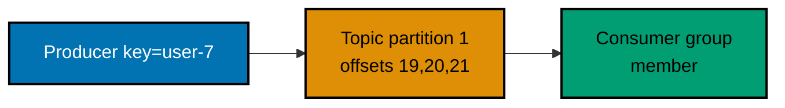

## Assemble a design and keep it honest under stress

Case studies are not component inventories. They connect requirements, calculations, APIs, data
ownership, failure modes, and the user-facing outcome of a compromise.

### Worked Example 39: Design a URL shortener

**Context**: A read-heavy redirect service needs low latency while retaining a durable source of truth.

The design uses `GET /{code}` and an indexed `code → URL` record. At 1,160 peak reads/s, a 99%
cache-hit target leaves roughly 12 database reads/s; writes still go to the durable store first.

**Key takeaway**: A coherent diagram agrees with the API, model, and capacity assumptions.

**Why It Matters**: The cache lowers common-path latency but accepts a stale-or-miss policy. The
durable store, invalidation rule, and redirect error response remain visible in the design. (co-01, co-29)

### Worked Example 40: Generate short codes

**Context**: A compact identifier must be unique before it becomes a public redirect key.

Run: `python learning/code/ex-40-url-shortener-id-generation.py`.

**Key takeaway**: Base62 encodes a numeric ID compactly; a uniqueness constraint handles collisions.

**Why It Matters**: A code generator needs more than a pleasant alphabet. Enumeration risk,
deletion/reuse, retry semantics, and database uniqueness determine whether it is safe to expose.
(co-01)

### Worked Example 41: Compare feed fan-out strategies

**Context**: A news feed can precompute follower inboxes or assemble posts at read time.

| Strategy         | Write cost        | Read cost          | Best fit                     |
| ---------------- | ----------------- | ------------------ | ---------------------------- |
| Fan-out on write | high per follower | low                | many reads, ordinary authors |
| Fan-out on read  | low               | merge many sources | high-follower or fresh feeds |

**Key takeaway**: Select the cost location that fits the workload’s skew and freshness needs.

**Why It Matters**: The trade-off is not binary. A feed can precompute normal authors and merge a
celebrity's posts at read time, which keeps one popular write from becoming a global queue storm.
(co-29)

### Worked Example 42: Handle the celebrity path

**Context**: A celebrity with ten million followers makes fan-out-on-write disproportionate.

`Normal author → fan-out to inboxes; celebrity → append to author timeline; feed read merges it.`

**Key takeaway**: A hybrid path isolates the skewed key instead of penalizing every author.

**Why It Matters**: The reader pays a merge cost for celebrity freshness. That cost needs a latency
budget, pagination, and a fallback when the celebrity timeline is temporarily unavailable. (co-13)

### Worked Example 43: Share a distributed rate limit

**Context**: Several API nodes need one tenant limit, not one bucket per process.

Run: `python learning/code/ex-43-distributed-rate-limiter.py`.

**Key takeaway**: A shared atomic bucket makes all nodes spend from one allowance.

**Why It Matters**: The runnable in-memory store represents the atomic decision boundary. Production
requires an availability decision for the store: fail closed protects capacity; fail open protects
availability but risks overload. (co-22)

### Worked Example 44: Trip a circuit breaker

**Context**: Repeated dependency failures should stop consuming request time until a probe can test recovery.

Run: `python learning/code/ex-44-circuit-breaker.py`.

**Key takeaway**: Closed permits calls, open rejects quickly, and half-open permits a limited probe.

**Why It Matters**: A breaker protects callers and prevents retry storms, but it can hide recovery
or reject healthy requests if thresholds are wrong. Metrics and a fallback response are part of it.
(co-24)

### Worked Example 45: Degrade non-essential work

**Context**: Under overload, a product can preserve its core redirect while omitting analytics and previews.

Run: `python learning/code/ex-45-graceful-degradation.py`.

**Key takeaway**: Shed optional work deliberately, with an observable degraded response.

**Why It Matters**: Graceful degradation is a product decision. It must identify what stays correct,
what becomes delayed, and how clients or operators know the reduced mode is active. (co-24)

### Worked Example 46: Apply backpressure at a bounded queue

**Context**: A producer must receive a quick refusal when a downstream worker cannot keep up.

Run: `python learning/code/ex-46-backpressure.py`.

**Key takeaway**: A bounded queue turns unbounded memory growth into a visible admission decision.

**Why It Matters**: A rejection can trigger retry, delay, or a user-facing error; all need rate and
jitter policies. Blocking indefinitely simply moves the overload to connection pools and threads.
(co-25)

### Worked Example 47: Fence leader failover

**Context**: Two leaders after a partition can both accept writes unless a monotonically increasing lease is checked.

| Step               | Guard                        |
| ------------------ | ---------------------------- |
| Elect new leader   | issue fencing token 42       |
| Old leader resumes | storage rejects its token 41 |
| New leader writes  | storage accepts token 42     |

**Key takeaway**: A fencing token makes stale authority rejectable by the resource being changed.

**Why It Matters**: Health checks alone cannot prove an old leader stopped. The durable resource must
enforce the ordering or split brain remains a data-corruption path. (co-24)

### Worked Example 48: Choose SQL or NoSQL from access patterns

**Context**: A workload should name its consistency and query requirements before naming a database category.

| Workload              | Better first fit   | Reason                                   |
| --------------------- | ------------------ | ---------------------------------------- |
| Ledger transfer       | relational         | transaction and invariant across rows    |
| Product catalog reads | document/cache     | denormalized read shape, flexible fields |
| Time-series events    | wide-column/stream | append and partitioned retention         |

**Key takeaway**: The query and correctness contract choose storage, not the expected scale alone.

**Why It Matters**: A NoSQL system may be the right operational choice, but application-managed joins
and invariants do not vanish. A relational store may scale enough with indexes and replicas. (co-26)

### Worked Example 49: Route through an API gateway

**Context**: One client request can authenticate once and compose several internal capabilities.

Run: `python learning/code/ex-49-microservices-gateway.py`.

**Key takeaway**: A gateway is one entry point, not a replacement for service ownership.

**Why It Matters**: Gateway fan-out increases critical-path dependencies and availability multiplication.
Timeouts, partial responses, and API version ownership must be explicit before aggregation is useful.
(co-27)

### Worked Example 50: Preserve ordering only within a stream partition

**Context**: A durable event log spreads partitions across consumers while retaining per-partition order.

**Key takeaway**: Ordering applies within a partition, so related events need a stable partition key.

**Why It Matters**: A topic-wide order would sacrifice parallelism. Consumers need idempotency and
offset management because replay is a recovery feature, not proof of exactly-once effects. (co-21)

### Worked Example 51: Upload directly to object storage

**Context**: A large file should not consume application-server bandwidth just to be stored elsewhere.

`Client requests presigned URL → client uploads to object store → object event records metadata → CDN serves reads.`

**Key takeaway**: Presigned upload moves bytes directly between client and object storage.

**Why It Matters**: The application still authorizes size, type, and ownership, then verifies the
result. Short-lived signatures and object-scoped permissions prevent the convenience path becoming
an unrestricted storage credential. (co-28)

### Worked Example 52: Compose the full capstone design

**Context**: A complete URL-shortener design must connect every preceding artifact instead of merely listing them.

See [the capstone](./capstone/overview.md) and run its two components:
`python learning/capstone/code/rate_limiter.py` and `python learning/capstone/code/hashing.py`.

**Key takeaway**: Requirements, numbers, API, model, topology, resilience, and trade-offs form one reviewable claim.

**Why It Matters**: A capstone exposes contradictions early—for example, a low-latency redirect path
cannot synchronously fan out to analytics and still meet its budget. The artifact makes the chosen
degradation behaviour inspectable. (co-01, co-03, co-07, co-22, co-24, co-30)

### Worked Example 53: Split by federation

**Context**: One growing database can be divided by business capability rather than by arbitrary tables.

| Service   | Owns                  | Cross-service interaction |
| --------- | --------------------- | ------------------------- |
| Identity  | accounts and sessions | identity API/event        |
| Shortener | codes and redirects   | owner reference only      |
| Analytics | click aggregates      | consume redirect events   |

**Key takeaway**: Functional partitioning gives each service data ownership and removes direct cross-store joins.

**Why It Matters**: Federation reduces one database's coordination burden while adding API and event
contracts. It is justified when independent change, scaling, or ownership pressure is real. (co-14)
