## Goal

Take a small project from an empty directory to a reviewed, merged, pushed change on trunk: a curated
commit history staged in hunks, a resolved three-way merge conflict, a recovered mistake, and a
pull-request-style merge -- proving Git fluency end to end, on one continuous "task tracker" project.
Every mechanism below was already taught, individually, somewhere in the Beginner, Intermediate, or
Advanced tiers of this topic; this capstone is where they all run together on one real (if small)
project, with a local bare repository standing in for the shared, hosted remote a real pull request
would target.

```mermaid
%% Color Palette: Blue #0173B2, Orange #DE8F05, Teal #029E73, Purple #CC78BC, Brown #CA9161
flowchart LR
    accTitle: Goal
    accDescr: Flowchart with 4 nodes and 3 connections. Nodes: Step 1 Hunk-staged commit history, Step 2 Branch + forced conflict + merge, Step 3 Interactive rebase + reflog recovery, Step 4 Pre-commit hook + PR merge + push. Connections: Step 1 Hunk-staged commit history to Step 2 Branch + forced conflict + merge, Step 2 Branch + forced conflict + merge to Step 3 Interactive rebase + reflog recovery, Step 3 Interactive rebase + reflog recovery to Step 4 Pre-commit hook + PR merge + push.
    A["Step 1<br/>Hunk-staged commit<br/>history"]:::blue
    B["Step 2<br/>Branch + forced<br/>conflict + merge"]:::orange
    C["Step 3<br/>Interactive rebase +<br/>reflog recovery"]:::teal
    D["Step 4<br/>Pre-commit hook + PR<br/>merge + push"]:::purple
    A --> B --> C --> D

    classDef blue fill:#0173B2,stroke:#000000,color:#FFFFFF,stroke-width:2px
    classDef orange fill:#DE8F05,stroke:#000000,color:#000000,stroke-width:2px
    classDef teal fill:#029E73,stroke:#000000,color:#000000,stroke-width:2px
    classDef purple fill:#CC78BC,stroke:#000000,color:#000000,stroke-width:2px
    classDef default fill:#FFFFFF,stroke:#000000,color:#000000
```



## Concepts exercised

- [x] object-model inspection (`cat-file` / `log --graph`)
- [x] commits staged in hunks with good messages
- [x] a branch + three-way merge with a resolved conflict
- [x] an interactive rebase
- [x] a `reflog` recovery
- [x] a PR/trunk-based merge to a remote

All colocated code lives under `learning/capstone/code/`: the complete, runnable `setup.sh` and the
full, real, captured output in `transcript.txt`. Every snippet below is copied directly from those two
files -- nothing on this page is paraphrased or fabricated.

## Step 1: Curated Hunk-Staged Commit History

_exercises co-01, co-02, co-03, co-05, co-06, co-07, co-10, co-23_

The project starts from a bare "remote" repository (co-01, co-23) and an ordinary local clone-shaped
working repo. The first two commits track a notes file and a 20-line task list whole; the next two edits
land far enough apart in that file that `git add -p` (co-06) splits them into two separately-stageable
hunks, each becoming its own focused, well-named commit (co-05, co-07).

**`learning/capstone/code/setup.sh`** (Step 1 excerpt)

```bash
git init --bare -q origin.git                    # => co-01, co-23: a BARE "remote" repo -- stands in for
                                                 #    the shared, hosted repository step 4 pushes to
mkdir work && cd work
git -c init.defaultBranch=main init -q
git remote add origin ../origin.git

cat > notes.md <<'NOTES'
# Task Tracker Notes

Track daily tasks in this file.
NOTES
git add notes.md
git commit -q -m "docs: start task tracker notes"           # => co-05, co-07: first real commit

seq 1 20 | sed 's/^/task /' > tasks.txt
git add tasks.txt
git commit -q -m "feat: add initial task list"                # => co-02, co-05, co-07: a 20-line file,
                                                 #    tracked whole -- deliberately long so the next two
                                                 #    unrelated edits land far enough apart to hunk-split

sed -i.bak '1s/.*/task 1 (buy groceries)/' tasks.txt && rm -f tasks.txt.bak # => two edits, far apart --
sed -i.bak '20s/.*/task 20 (plan trip)/' tasks.txt && rm -f tasks.txt.bak  #    Git's default 3-line context keeps
                                                 #    them in two SEPARATE hunks

printf 'y\nn\n' | git add -p                                        # => co-06: stage ONLY the line-1 hunk
git commit -m "fix: label groceries task"                             # => one focused commit per hunk
git add tasks.txt                                                       # => the remaining hunk, staged now
git commit -m "fix: label trip task"                                     # => a second, equally focused commit

git log --graph --oneline                                                  # => co-10: four curated commits,
                                                 #    a clean, linear line so far
git cat-file -p HEAD                                                        # => co-03: resolves the tip
                                                 #    commit down to its raw fields -- "tree <hash>" is the
                                                 #    root snapshot this whole step built up to
git cat-file -p 'HEAD^{tree}'                                                  # => and that tree's own two
                                                 #    blob entries -- notes.md and tasks.txt, content-addressed
```

**Output** (real, captured -- from `code/transcript.txt`):

```text
(1/2) Stage this hunk [y,n,q,a,d,j,J,g,/,e,?]?
@@ -1,4 +1,4 @@
-task 1
+task 1 (buy groceries)
 task 2
 task 3
 task 4
(2/2) Stage this hunk [y,n,q,a,d,K,g,/,e,?]?
@@ -17,4 +17,4 @@ task 16
 task 17
 task 18
 task 19
-task 20
+task 20 (plan trip)
[main f7e7606] fix: label groceries task
 1 file changed, 1 insertion(+), 1 deletion(-)
[main 104e99d] fix: label trip task
 1 file changed, 1 insertion(+), 1 deletion(-)
* 104e99d fix: label trip task
* f7e7606 fix: label groceries task
* eb2c405 feat: add initial task list
* 8a72d0e docs: start task tracker notes
tree ea4fbf7d74b443df06a66a83023fe33542b7167d
parent f7e760607ae8e80aafdb3b8ea0eb2d20066c336b

fix: label trip task
100644 blob 8c743539b7afced64240d31bea99624e42cdd819 notes.md
100644 blob dd9f87851706d8c6e0dd0a98eae081bcbaa69f98 tasks.txt
```

**Key takeaway**: four commits, each doing exactly one thing, is not an accident here -- it is the direct
result of splitting one messy editing session into separately-stageable hunks before ever running
`git commit`.

**Why it matters**: this is the object-model foundation (co-01 through co-10) every later step in this
capstone builds on -- `cat-file` proves the commit graph is not an abstraction but a real, inspectable
tree of blobs and trees.

## Step 2: Branch, Forced Conflict, and Three-Way Merge

_exercises co-11, co-13, co-14_

A short-lived `retitle` branch (co-11) edits the same line of `tasks.txt` that `main` also
independently edits -- a deliberate, unavoidable overlap. Merging surfaces a real conflict (co-14),
resolved by hand into one commit combining both intents, producing a genuine two-parent merge commit
(co-13).

**`learning/capstone/code/setup.sh`** (Step 2 excerpt)

```bash
git switch -c retitle -q                                                       # => co-11: a short-lived
                                                 #    branch for one focused, reviewable change
sed -i.bak '2s/.*/task 2 (write status report)/' tasks.txt && rm -f tasks.txt.bak
git commit -aqm "fix: retitle task 2 on retitle branch"
git switch main -q
sed -i.bak '2s/.*/task 2 (write weekly report)/' tasks.txt && rm -f tasks.txt.bak  # => main independently
                                                 #    rewrites the SAME line -- an unavoidable, deliberate
                                                 #    overlap with what retitle already changed
git commit -aqm "fix: retitle task 2 on main"

git merge retitle || true                                                            # => co-13, co-14:
                                                 #    both sides diverged AND overlap -- a real conflict,
                                                 #    not an automatic three-way merge
git status                                                                              # => "both modified"
sed -i.bak '2s/.*/task 2 (write weekly status report)/' tasks.txt && rm -f tasks.txt.bak  # => the human
                                                 #    resolution, combining both intents into one line
git add tasks.txt
git commit --no-edit                                                                        # => co-14:
                                                 #    resolution complete -- the merge commit is created
git log --oneline --graph                                                                     # => the
                                                 #    fork-and-rejoin shape is now visible in the graph
git cat-file -p HEAD | grep "^parent"                                                            # => co-13:
                                                 #    TWO parent lines -- unambiguous, low-level proof this
                                                 #    is a real merge commit, not an ordinary one
```

**Output** (real, captured):

```text
Auto-merging tasks.txt
CONFLICT (content): Merge conflict in tasks.txt
Automatic merge failed; fix conflicts and then commit the result.
On branch main
You have unmerged paths.
Unmerged paths:
 both modified:   tasks.txt

no changes added to commit (use "git add" and/or "git commit -a")
[main 78228e9] Merge branch 'retitle'
*   78228e9 Merge branch 'retitle'
|\
| * 29e7c11 fix: retitle task 2 on retitle branch
* | 7d3c3c9 fix: retitle task 2 on main
|/
* 104e99d fix: label trip task
* f7e7606 fix: label groceries task
* eb2c405 feat: add initial task list
* 8a72d0e docs: start task tracker notes
parent 7d3c3c924090411d37637c0050bad019dc894db8
parent 29e7c11a82137ff6e2b4c7f829539c78dd521cbb
```

**Key takeaway**: the two `parent` lines in the raw commit object are not a display convenience -- they
are the actual, low-level structure that makes this a merge commit, and `cat-file` confirms it directly.

**Why it matters**: this is the same conflict-resolve-commit loop from Examples 39-40, now exercised on
a real overlapping edit inside a bigger project, with the object-model proof (co-13) attached to
confirm the resolution genuinely produced a two-parent merge.

## Step 3: Interactive Rebase Curation, Then a Reset --Hard Mistake and Reflog Recovery

_exercises co-16, co-18, co-22_

A second branch, `cleanup`, accumulates three messy "wip" commits -- exactly what interactive rebase
exists to curate before landing on trunk. A two-phase rebase (reword, then squash; co-16) turns them
into two clean commits. A deliberate `git reset --hard` mistake then makes the freshly-curated itinerary
commit unreachable (co-18) -- recovered completely via `reflog` (co-22).

**`learning/capstone/code/setup.sh`** (Step 3 excerpt)

```bash
git switch -c cleanup -q                                                                          # => a fresh
                                                 #    branch to hold the messy commits about to be curated
echo "review budget notes" > budget.md; git add budget.md; git commit -qm "wip budget notes"      # => commit 1/3
echo "trip itinerary draft" > itinerary.md; git add itinerary.md; git commit -qm "wip trip itinerary"  # => commit 2/3
echo "final polish on both docs" >> budget.md                                                     # => touches
                                                 #    both files -- staged together in the next commit
echo "final polish" >> itinerary.md
git add budget.md itinerary.md                                                                    # => stages
                                                 #    both edits at once, ahead of the final "wip" commit
git commit -qm "wip polish"                                                                      # => three
                                                 #    messy "wip" commits -- exactly what interactive
                                                 #    rebase exists to curate before landing on trunk

GIT_SEQUENCE_EDITOR="sed -i.bak -e '1s/^pick/reword/'" \
  GIT_EDITOR="bash -c 'echo \"docs: add budget notes\" > \"\$1\"' --" \
  git rebase -i HEAD~3                                                                            # => co-16:
                                                 #    reword ONLY the first commit's message

GIT_SEQUENCE_EDITOR="sed -i.bak -e '2s/^pick/squash/'" \
  GIT_EDITOR="bash -c 'echo \"docs: add trip itinerary\" > \"\$1\"' --" \
  git rebase -i HEAD~2                                                                              # => co-16:
                                                 #    fold the "wip polish" commit into the itinerary commit
git log --oneline                                                                                     # => two
                                                 #    clean, well-named commits replace three messy ones

echo "--- deliberate mistake: reset --hard loses the just-curated itinerary commit ---"           # => a marker
                                                 #    printed to the transcript, not a Git command itself
git reset --hard HEAD~1                                                                                 # => co-18:
                                                 #    HEAD, index, AND working tree all move back -- the
                                                 #    itinerary commit becomes unreachable from any branch
git log --oneline                                                                                  # => only one
                                                 #    "clean" commit remains visible -- the other looks gone

echo "--- recovery via reflog ---"                                                                # => another
                                                 #    transcript marker, printed before the recovery command
git reflog | head -4                                                                                      # => co-22:
                                                 #    the reset shows up as its own reflog entry -- the
                                                 #    itinerary commit's hash is still right there, one step back
git reset --hard 'HEAD@{1}'                                                                                   # => co-22,
                                                 #    co-18: jump HEAD back to exactly where it was one move ago
git log --oneline                                                                                             # => the
                                                 #    "lost" commit is back -- nothing was ever truly deleted
```

**Output** (real, captured):

```text
[detached HEAD e41b53a] docs: add budget notes
Successfully rebased and updated refs/heads/cleanup.
[detached HEAD 809cedc] docs: add trip itinerary
Successfully rebased and updated refs/heads/cleanup.
809cedc docs: add trip itinerary
e41b53a docs: add budget notes
78228e9 Merge branch 'retitle'
7d3c3c9 fix: retitle task 2 on main
29e7c11 fix: retitle task 2 on retitle branch
104e99d fix: label trip task
f7e7606 fix: label groceries task
eb2c405 feat: add initial task list
8a72d0e docs: start task tracker notes
--- deliberate mistake: reset --hard loses the just-curated itinerary commit ---
HEAD is now at e41b53a docs: add budget notes
e41b53a docs: add budget notes
78228e9 Merge branch 'retitle'
... (itinerary commit no longer appears)
--- recovery via reflog ---
e41b53a HEAD@{0}: reset: moving to HEAD~1
809cedc HEAD@{1}: rebase (finish): returning to refs/heads/cleanup
809cedc HEAD@{2}: rebase (squash): docs: add trip itinerary
3254339 HEAD@{3}: rebase (start): checkout HEAD~2
HEAD is now at 809cedc docs: add trip itinerary
809cedc docs: add trip itinerary
e41b53a docs: add budget notes
78228e9 Merge branch 'retitle'
7d3c3c9 fix: retitle task 2 on main
29e7c11 fix: retitle task 2 on retitle branch
104e99d fix: label trip task
f7e7606 fix: label groceries task
eb2c405 feat: add initial task list
8a72d0e docs: start task tracker notes
```

**Key takeaway**: the reflog entry for the reset (`HEAD@{0}: reset: moving to HEAD~1`) is what makes the
recovery deterministic -- `HEAD@{1}` is not a guess, it is the exact, named, previous position, read
straight out of the reflog before acting.

**Why it matters**: this is Examples 46, 61, and 62 combined into one real recovery -- curate history
with interactive rebase, then survive a genuine "I just discarded work" mistake using nothing but a
local, per-repo log Git keeps automatically.

## Step 4: A Passing Pre-Commit Hook, Then Push and Land via a PR-Style Merge

_exercises co-13, co-19, co-23, co-27, co-28_

Before landing `cleanup` on trunk, a pre-commit hook (co-27) is installed and proven to genuinely block
a `TODO`-containing commit -- not merely present, but actually enforced. The branch then merges into
`main` with `--no-ff` (co-13, co-28), exactly the operation a hosted pull request's "merge" button
performs, and the hook runs (and passes cleanly) for that merge commit too. The finished trunk is pushed
to the bare "remote" (co-23), and a final `fsck` pass confirms every intended commit -- including the
reflog-recovered one from Step 3 -- is genuinely reachable, with an honest accounting of the two
harmless dangling objects the earlier squash left behind.

**`learning/capstone/code/setup.sh`** (Step 4 excerpt)

```bash
cat > .git/hooks/pre-commit <<'HOOK'
#!/bin/sh
if git diff --cached | grep -q "TODO"; then
  echo "pre-commit: staged changes contain a TODO marker -- commit blocked"
  exit 1
fi
exit 0
HOOK
chmod +x .git/hooks/pre-commit                                                                                  # => co-27:
                                                 #    installed BEFORE the landing merge -- it will run
                                                 #    automatically on every commit from here on, including a merge commit

echo "--- prove the hook is genuinely enforced, not decorative ---"
echo "TODO: revisit before shipping" >> budget.md
git add budget.md
git commit -m "docs: note a followup" || true                                                                     # => co-27:
                                                 #    blocked -- the hook really does run and really can fail a commit
git restore --staged budget.md && git checkout -- budget.md                                                          # => undo
                                                 #    the deliberately-blocked attempt, returning to a clean state

git switch main -q
git merge --no-ff cleanup -m "Merge pull request: task-tracker cleanup"                                                # => co-28,
                                                 #    co-13: the exact operation a hosted PR's "merge" button
                                                 #    performs -- and the pre-commit hook DOES run for this merge
                                                 #    commit (it is not a fast-forward), passing cleanly this time
git log --oneline --graph

echo "--- push the finished trunk to the shared remote ---"
git push -q origin main                                                                                                  # => co-23
git -C ../origin.git log --oneline --graph                                                                                # => the
                                                 #    remote's own trunk matches local exactly -- the change
                                                 #    genuinely landed, with the full curated history intact

echo "--- final acceptance check: nothing INTENDED is dangling or lost ---"
git fsck --lost-found                                                                                                       # => co-22:
                                                 #    the two dangling commits fsck reports are the ORIGINAL
                                                 #    pre-rebase "wip trip itinerary"/"wip polish" objects
                                                 #    that step 3's squash superseded -- expected, harmless
                                                 #    rebase byproducts, eventually gc'd; every INTENDED
                                                 #    commit (including the reflog-recovered one) remains
                                                 #    reachable from main, confirmed by the log above
git log --oneline --all | grep -c "docs: add trip itinerary"                                                                 # => 1:
                                                 #    the reflog-recovered commit is reachable exactly once
                                                 #    from a real ref -- genuinely restored, not dangling
```

**Output** (real, captured):

```text
--- prove the hook is genuinely enforced, not decorative ---
pre-commit: staged changes contain a TODO marker -- commit blocked
Merge made by the 'ort' strategy.
 budget.md    | 2 ++
 itinerary.md | 2 ++
 2 files changed, 4 insertions(+)
*   3d11cfd Merge pull request: task-tracker cleanup
|\
| * 809cedc docs: add trip itinerary
| * e41b53a docs: add budget notes
|/
*   78228e9 Merge branch 'retitle'
|\
| * 29e7c11 fix: retitle task 2 on retitle branch
* | 7d3c3c9 fix: retitle task 2 on main
|/
* 104e99d fix: label trip task
* f7e7606 fix: label groceries task
* eb2c405 feat: add initial task list
* 8a72d0e docs: start task tracker notes
--- push the finished trunk to the shared remote ---
*   3d11cfd Merge pull request: task-tracker cleanup
|\
| * 809cedc docs: add trip itinerary
| * e41b53a docs: add budget notes
|/
*   78228e9 Merge branch 'retitle'
|\
| * 29e7c11 fix: retitle task 2 on retitle branch
* | 7d3c3c9 fix: retitle task 2 on main
|/
* 104e99d fix: label trip task
* f7e7606 fix: label groceries task
* eb2c405 feat: add initial task list
* 8a72d0e docs: start task tracker notes
--- final acceptance check: nothing INTENDED is dangling or lost ---
dangling tree 00ac74baf0ed48140bd7c922a4be01c34c7eb144
dangling commit 2899891757a8902d40e012f815fed0ce6bb196e3
dangling tree b838fbdecd08fae06df983aaf5d94716a0a4bfa7
dangling commit 69acb597920c82f9ceefd326c6e1a41f30f8c807
1
```

**Key takeaway**: the two `dangling commit`/`dangling tree` pairs `fsck` reports are not lost work -- they
are the exact pre-rebase "wip trip itinerary" and "wip polish" objects Step 3's squash superseded,
confirmed harmless because the final `grep -c` shows the reflog-recovered commit is reachable exactly
once from `main`, and the remote's own log matches local exactly.

**Why it matters**: a real acceptance check does not stop at "the log looks right" -- it verifies, at the
object-storage level, that nothing intended is actually missing, while correctly distinguishing expected
rebase byproducts from a genuine loss. This is the same discipline Example 82 introduced, now applied as
the final gate on an entire multi-step project.

## Acceptance criteria

- The object graph matches intent: `git cat-file -p` on the tip commit resolves to a tree containing
  exactly `notes.md` and `tasks.txt`, and `git log --graph` shows the intended fork-and-rejoin shapes at
  each merge.
- The forced conflict on `tasks.txt` resolves correctly: the merge commit has two `parent` lines
  (verified directly via `cat-file`), and the resolved line combines both branches' intent.
- The interactive rebase produces the curated two-commit history (`docs: add budget notes`,
  `docs: add trip itinerary`) in place of the original three messy "wip" commits.
- The reflog recovery restores the commit a deliberate `reset --hard` made unreachable -- confirmed by
  `git log --oneline` showing it again, by hash, immediately after the recovery.
- The PR-style merge lands on trunk with a passing pre-commit hook: the hook genuinely blocks a
  `TODO`-containing commit earlier in the same script, then passes cleanly for the actual merge commit.
- The push to the bare remote succeeds, and the remote's own `git log --graph` matches the local trunk
  exactly.

## Done bar

This capstone is runnable end to end: `code/setup.sh` is a single, self-contained script that -- given
only a real `git` CLI -- reproduces every step above from a `mktemp -d` scratch directory, with a local
`git init --bare` repository standing in for the shared remote. `code/transcript.txt` is the real,
unedited, captured output of an actual run of that script (control characters and volatile temp paths
stripped for readability; no command's output was hand-written or simulated). The "Output" blocks shown
inline above, per step, are trimmed excerpts of that same real transcript for readability -- the
untrimmed, byte-for-byte file is always available at `code/transcript.txt`. The one honest, fully
explained result on this page that is not a plain "clean pass": the final `git fsck --lost-found` call
reports two dangling commit/tree pairs, and Step 4's own annotation identifies exactly what they are
(the original pre-squash "wip trip itinerary" and "wip polish" objects Step 3 superseded) and confirms,
via a direct `grep -c` count, that the commit that actually matters is reachable exactly once. Every
mechanism this capstone combines -- hunk staging (co-06), three-way merge and conflict resolution
(co-13, co-14), interactive rebase (co-16), reflog recovery (co-22), hooks (co-27), and the PR/trunk-based
merge flow (co-13, co-28) -- was already taught individually earlier in this topic; no new fact was
needed to write this page.

---

← Previous: [Advanced Examples](../advanced.md) · Next: [Drilling](../../drilling/overview.md) →
