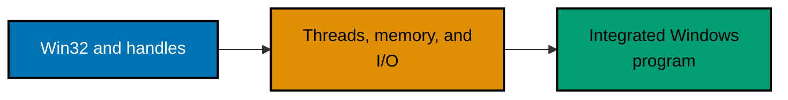

This track has 78 contiguous, runnable, annotated Windows examples. Build each C example on Windows with `cl /W4 /TC example.c`; run each PowerShell inspection example from Windows PowerShell. Do not run them on Linux: the APIs, object model, and observations are deliberately Windows-only.

- [Beginner examples](./beginner.md) — Examples 1–26
- [Intermediate examples](./intermediate.md) — Examples 27–54
- [Advanced examples](./advanced.md) — Examples 55–78
- [Capstone](./capstone/overview.md)
