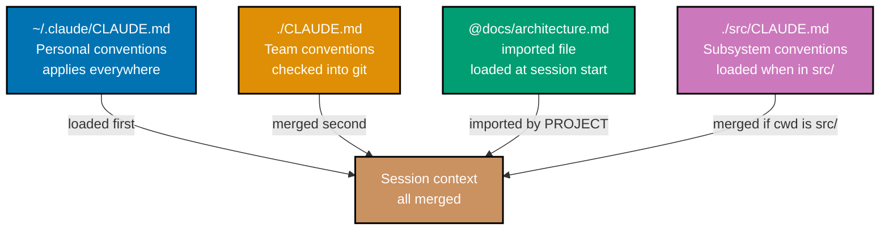
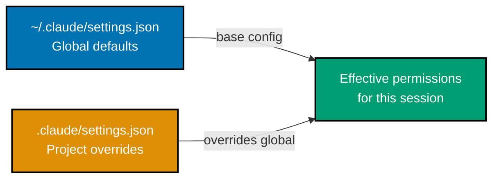
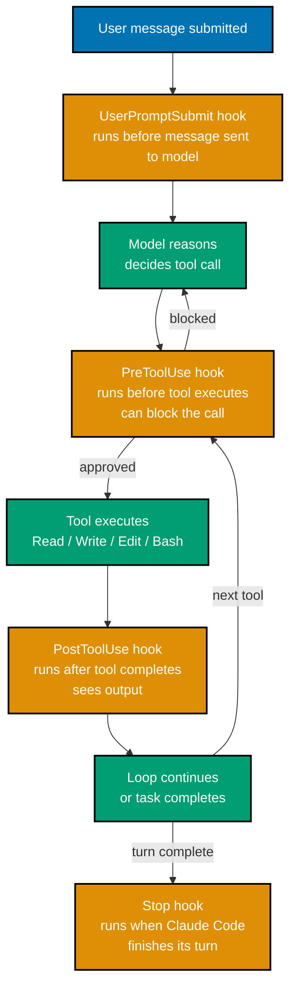
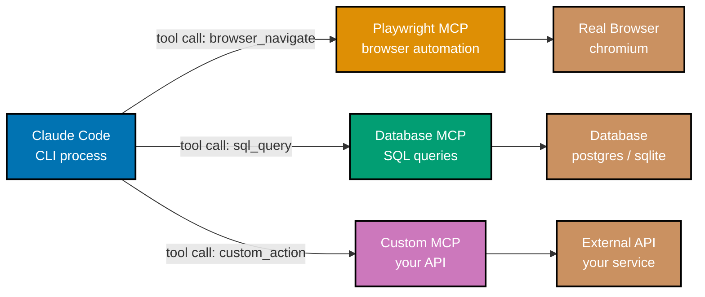
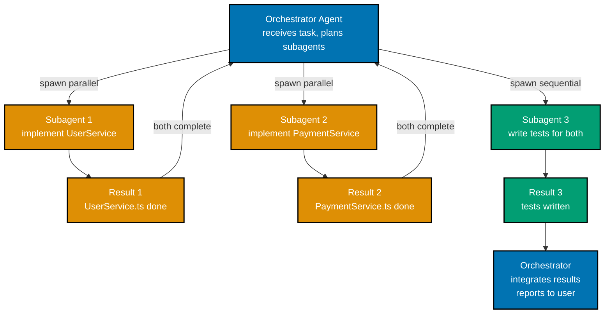
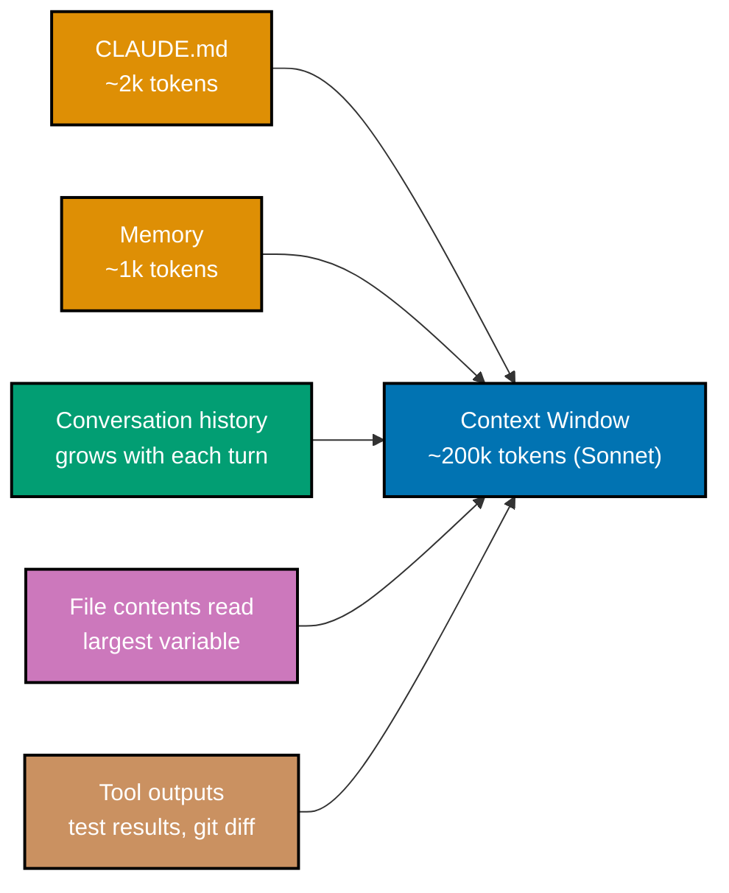
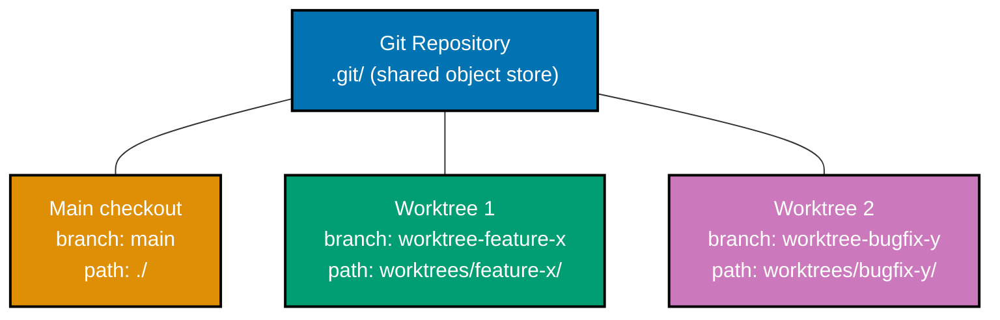
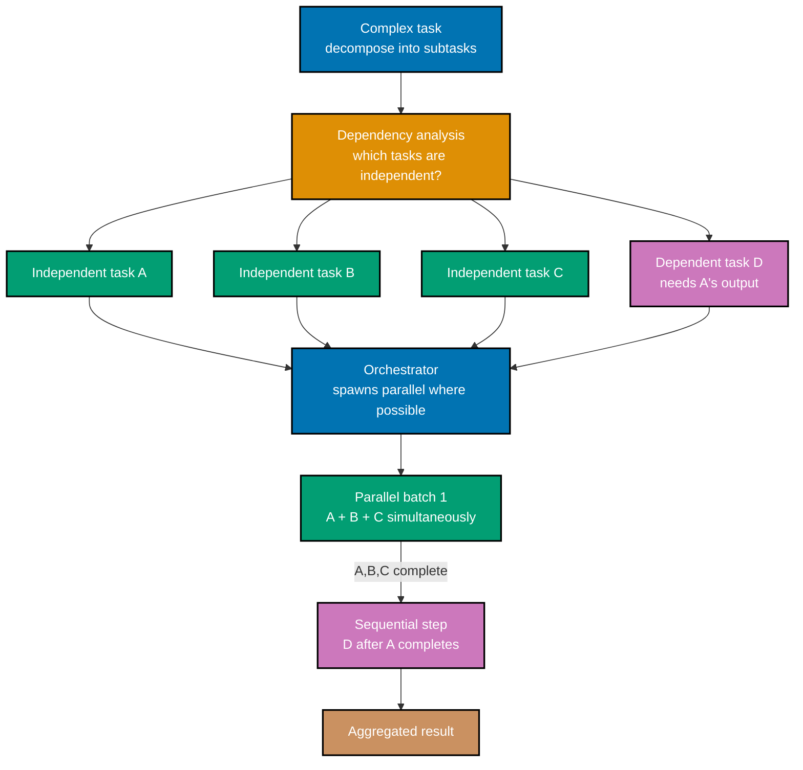

## 1. Writing Effective CLAUDE.md

A well-written `CLAUDE.md` is the highest-leverage configuration investment you can make
in Claude Code. It transforms a generic assistant into one that understands your project's
specific conventions, constraints, and commands — and that knowledge compounds across
every session.

The beginner section introduced `CLAUDE.md` as a place to put commands and conventions.
This section covers what makes a `CLAUDE.md` effective rather than merely present, the
`@`-file import mechanism for composable configurations, and the anti-patterns that make
`CLAUDE.md` counterproductive.



**What to include**: build and test commands (so Claude Code never guesses wrong),
coding conventions (naming patterns, error handling approach, preferred abstractions),
patterns to avoid (legacy APIs, deprecated modules, anti-patterns specific to your
codebase), file structure notes (where services live, how features are organized), and
anything Claude Code repeatedly gets wrong without explicit guidance.

**What not to include**: information that belongs in actual code documentation, secrets
or credentials (never), lengthy reference material that rarely affects Claude Code's
decisions (import via `@` only when needed), and instructions so generic they add no
project-specific value (e.g., "write good code").

```markdown
<!-- CLAUDE.md — effective example for a TypeScript API project -->

# Project: payments-api

## Essential Commands

- Run tests: `npm test`
- Run single test file: `npm test -- --testPathPattern=<filename>`
- Type check: `npm run typecheck`
- Lint: `npm run lint`
- Start dev server: `npm run dev` (port 3000)
- Build: `npm run build`

## Architecture

Services use constructor injection (not service locator).
Repository layer abstracts all database access — routes never query the DB directly.
All external HTTP calls go through src/clients/ — never use fetch() directly in services.

## Conventions

- Error handling: throw AppError (src/errors/AppError.ts), never plain Error
- Logging: use the logger in src/lib/logger.ts, never console.log
- Validation: use Zod schemas in src/schemas/ for all request input
- Tests: co-located with source (UserService.spec.ts next to UserService.ts)
- Branch naming: feat/<ticket>, fix/<ticket>, chore/<description>

## Do Not

- Do not use `any` in TypeScript — use `unknown` and narrow
- Do not import from src/db/ directly in routes — use repositories
- Do not run `npm install` without explicit instruction
- Do not modify .env — suggest additions to .env.example

@docs/architecture/overview.md
@docs/architecture/data-model.md
```

The `@` import at the bottom loads two architecture documents into the session context.
These files contain detailed diagrams and table definitions that would clutter `CLAUDE.md`
but are genuinely useful for Claude Code when working on database-related tasks.

**Anti-patterns**: `CLAUDE.md` that is too long loses signal in noise — Claude Code
weighs all content roughly equally, so a 500-line `CLAUDE.md` filled with tangentially
relevant material dilutes the critical conventions. `CLAUDE.md` that duplicates what is
already clear from the code (e.g., "we use TypeScript") wastes tokens. `CLAUDE.md` that
contradicts the actual codebase (outdated conventions from before a refactor) misleads
Claude Code.

```bash
# Test your CLAUDE.md by starting a fresh session and asking about conventions
claude
> how do I add a new API endpoint in this project?
# => Claude Code should describe the repository pattern, AppError, Zod validation
# => from CLAUDE.md without needing to read multiple files to figure it out
# => If it describes the wrong patterns, update CLAUDE.md to be more explicit
```

**Key Takeaway:** `CLAUDE.md` is most effective when it captures conventions Claude Code
cannot infer from code alone — the "why" and "how we do things here" rather than the
"what" that is already visible in the files.

**Why It Matters:** A `CLAUDE.md` checked into version control is an onboarding document
for both Claude Code and new team members. Every improvement to it compounds across every
session every team member runs. Teams that maintain `CLAUDE.md` diligently report that
Claude Code produces style-consistent, convention-following code from the first message —
eliminating the back-and-forth that otherwise consumes session time aligning the agent to
project standards.

---

## 2. settings.json: Permissions

`settings.json` is Claude Code's permission and configuration layer. It controls which
tools are available, which file paths are accessible, which shell commands run without
approval, and how Claude Code behaves in non-default scenarios.

The file lives at `.claude/settings.json` within your project (project-scoped) or at
`~/.claude/settings.json` (global, applies to all projects). Project-scoped settings
take precedence over global settings for overlapping keys.



```json
// .claude/settings.json — annotated example
{
  "allowedTools": ["Read", "Edit", "Glob", "Grep", "Bash"],
  // => Only these tools may be called; Write and Agent are blocked
  // => Useful when you want Claude Code to propose changes without creating files

  "disallowedTools": ["Bash"],
  // => Explicit block — Bash cannot be called even if in allowedTools
  // => disallowedTools takes precedence over allowedTools
  // => Use for sensitive environments with production credentials

  "additionalDirectories": ["../shared-lib", "/home/<user>/docs"],
  // => Directories outside the project root that Claude Code may read/edit
  // => Useful for monorepo setups or shared documentation

  "autoApprovePatterns": ["Bash(npm test*)", "Bash(npm run lint*)", "Bash(git status)", "Bash(git diff*)"],
  // => Shell commands matching these patterns run without approval prompt
  // => Patterns use glob-style matching against the full command string
  // => "Bash(npm test*)" matches "npm test", "npm test -- --watch", etc.

  "env": {
    "NODE_ENV": "test",
    "DATABASE_URL": "postgres://localhost/myapp_test"
    // => Environment variables injected into Claude Code's process
    // => Useful for pointing Claude Code at a test database, not production
  },

  "mcpServers": {
    "playwright": {
      "command": "npx",
      "args": ["@playwright/mcp@latest"],
      "type": "stdio"
      // => MCP server configuration (covered in section 4)
    }
  }
}
```

The `autoApprovePatterns` field is the most practically useful permission. Without it,
every `npm test` run requires your approval — slowing down sessions where Claude Code
runs tests frequently. Adding your standard read-only and test commands to
`autoApprovePatterns` lets Claude Code run them uninterrupted while still requiring
approval for anything not on the list.

`additionalDirectories` matters in monorepo setups where Claude Code needs to read
libraries or shared code outside the app directory. Without it, Claude Code cannot read
files outside the directory where `claude` was started.

```json
// settings.json for a security-sensitive project
// (machine has production cloud credentials loaded)
{
  "allowedTools": ["Read", "Glob", "Grep"],
  // => Read-only mode: Claude Code can explore but cannot change anything
  // => No Bash means no accidental cloud CLI calls

  "disallowedTools": ["Bash", "Write", "Edit", "Agent"],
  // => Explicitly block all write/execute tools

  "autoApprovePatterns": []
  // => Empty: nothing auto-approved (belt-and-suspenders)
}
```

**Key Takeaway:** `settings.json` controls what Claude Code is allowed to do — use
`autoApprovePatterns` for routine commands, `allowedTools`/`disallowedTools` for
environment-appropriate restrictions, and `additionalDirectories` for multi-repo access.

**Why It Matters:** Permissions are the production safety control. A Claude Code session
running in a developer's local environment with full permissions is appropriate; the same
permissions on a machine with production credentials, live database access, or cloud
provider CLIs is not. `settings.json` is the mechanism for calibrating Claude Code's
access to match the risk profile of the environment it runs in.

---

## 3. Hooks System

Hooks are scripts that Claude Code runs at specific points in its execution lifecycle.
They receive structured JSON data about what Claude Code is about to do or just did, and
they can block tool calls, log activity, or trigger external processes.



Four hook types are available. `PreToolUse` fires before Claude Code executes a tool
call — it receives the tool name and input, and can exit with a non-zero code to block
the call. `PostToolUse` fires after a tool completes — it receives the tool name, input,
and output. `UserPromptSubmit` fires when you submit a message, before it reaches the
model — useful for preprocessing or logging. `Stop` fires when Claude Code finishes
a turn — useful for notifications or cleanup.

Hooks are configured in `settings.json` as shell commands. They receive JSON via stdin.

```json
// .claude/settings.json — hooks configuration
{
  "hooks": {
    "PreToolUse": [
      {
        "matcher": "Bash",
        "hooks": [
          {
            "type": "command",
            "command": "bash .claude/hooks/pre-bash.sh"
            // => Runs before any Bash tool call
            // => Receives JSON on stdin: {"tool": "Bash", "input": {"command": "rm -rf dist"}}
            // => Exit code 0: allow the command
            // => Exit code non-zero: block the command, Claude Code sees the error
          }
        ]
      }
    ],
    "PostToolUse": [
      {
        "matcher": "Write",
        "hooks": [
          {
            "type": "command",
            "command": "bash .claude/hooks/post-write.sh"
            // => Runs after every Write tool call
            // => Receives JSON: {"tool": "Write", "input": {"path": "..."}, "output": {...}}
            // => Can trigger formatting, linting, notifications
          }
        ]
      }
    ],
    "Stop": [
      {
        "hooks": [
          {
            "type": "command",
            "command": "bash .claude/hooks/notify-done.sh"
            // => Runs when Claude Code finishes a turn
            // => Useful for: desktop notification, Slack message, log entry
          }
        ]
      }
    ]
  }
}
```

A concrete `PreToolUse` hook for blocking writes to sensitive files:

```bash
#!/bin/bash
# .claude/hooks/pre-bash.sh
# Blocks shell commands that target production environment

# Read JSON from stdin
INPUT=$(cat)

# Extract the command being run
COMMAND=$(echo "$INPUT" | jq -r '.input.command')
# => .input.command is the shell command Claude Code wants to run

# Block any command that references production
if echo "$COMMAND" | grep -qi "production\|prod\|PROD"; then
    echo "BLOCKED: Command references production environment: $COMMAND" >&2
    # => Error message goes to stderr; Claude Code sees it
    exit 1
    # => Non-zero exit blocks the tool call
    # => Claude Code receives the block signal and reports to user
fi

exit 0
# => Zero exit allows the command to proceed
```

A `PostToolUse` hook for auto-formatting after writes:

```bash
#!/bin/bash
# .claude/hooks/post-write.sh
# Run Prettier after Claude Code writes a TypeScript/JavaScript file

INPUT=$(cat)
FILE_PATH=$(echo "$INPUT" | jq -r '.input.path')
# => .input.path is the file that was just written

# Only format TypeScript and JavaScript files
if echo "$FILE_PATH" | grep -qE '\.(ts|tsx|js|jsx)$'; then
    npx prettier --write "$FILE_PATH" 2>/dev/null
    # => Format the file Claude Code just wrote
    # => Claude Code's next read of this file will see the formatted version
fi

exit 0
# => Always exit 0 for PostToolUse; exit code does not block anything
```

**Key Takeaway:** Hooks intercept Claude Code's tool calls with shell scripts — `PreToolUse`
can block calls before they execute; `PostToolUse` can trigger follow-up actions after
they complete; all hooks receive structured JSON describing what is happening.

**Why It Matters:** Hooks transform Claude Code from a standalone tool into an integrated
part of your team's workflow. Auto-formatting after writes ensures Claude Code always
produces style-compliant code. Blocking commands that reference production prevents
accidents. Sending a notification when a long task finishes frees you to do other work
while Claude Code runs. These integrations are only possible because hooks provide
programmable interception of every tool call.

---

## 4. MCP Servers

MCP (Model Context Protocol) is an open standard that lets Claude Code connect to
external servers that expose additional tools. Where Claude Code's built-in tools cover
filesystem and shell operations, MCP servers extend it to browser automation, database
queries, external APIs, and any other capability a server can expose.



MCP servers are configured in `.claude/settings.json` under `mcpServers`. Each entry
specifies how to start the server process (or connect to an existing one). Claude Code
starts the configured servers when it starts and discovers their available tools, which
then appear alongside the built-in tools in Claude Code's tool set.

```json
// .claude/settings.json — MCP server configuration
{
  "mcpServers": {
    "playwright": {
      "command": "npx",
      "args": ["@playwright/mcp@latest"],
      "type": "stdio"
      // => stdio type: Claude Code communicates with the server via stdin/stdout
      // => Claude Code starts this process automatically on session start
      // => Provides tools: browser_navigate, browser_click, browser_screenshot, etc.
    },
    "sqlite": {
      "command": "uvx",
      "args": ["mcp-server-sqlite", "--db-path", "./local.db"],
      "type": "stdio"
      // => Provides tools: sql_query, list_tables, describe_table
      // => Claude Code can now query your local SQLite database
    },
    "my-api": {
      "url": "http://localhost:8080/mcp",
      "type": "sse"
      // => SSE type: connects to an already-running server via Server-Sent Events
      // => Claude Code connects to the URL rather than spawning a process
    }
  }
}
```

With the Playwright MCP server configured, Claude Code can control a real browser.
This makes E2E test writing dramatically more effective — Claude Code can open your app,
click through a user flow, observe what happens, and write tests that cover what it saw.

```bash
# Using Playwright MCP — Claude Code with browser control

> write an E2E test for the login flow

# => Claude Code calls browser_navigate: "http://localhost:3000/login"
# => Calls browser_screenshot (sees current page state)
# => Calls browser_click: selector="#email-input"
# => Calls browser_fill: value="test@example.com"
# => Calls browser_click: selector="#password-input"
# => Calls browser_fill: value="testpassword"
# => Calls browser_click: selector="button[type=submit]"
# => Calls browser_screenshot (sees post-login state)
# => Calls browser_navigate: "http://localhost:3000/dashboard" (verify redirect)
# => Now has direct visual evidence of the login flow

# => Calls Write: tests/e2e/login.spec.ts
# => Writes Playwright test based on what it actually observed
# => Test matches the real UI behavior, not a guess

# => Calls Bash: npx playwright test tests/e2e/login.spec.ts
# => Test passes on first run (because it was written from direct observation)
```

**Key Takeaway:** MCP servers extend Claude Code's tool set beyond the filesystem and
shell — configure them in `settings.json` under `mcpServers`; Playwright is the most
impactful for web development teams.

**Why It Matters:** E2E tests written from direct browser observation are more reliable
than tests written by inferring behavior from source code. Before Playwright MCP, writing
E2E tests with Claude Code required Claude Code to read route definitions and component
code and reason about what the UI probably does. With Playwright MCP, it observes the
actual behavior. The difference in test accuracy and coverage depth is significant for
any project with a web frontend.

---

## 5. Subagents (Agent Tool)

The `Agent` tool lets Claude Code spawn subagents: separate Claude Code instances with
their own context windows, tool sets, and conversation histories. Subagents handle
isolated subtasks in parallel or in sequence, reporting results back to the parent agent.

Subagents are the mechanism for scaling Claude Code beyond the single-context-window
limit. When a task requires reading and analyzing fifty files simultaneously, or when
four independent components need to be implemented at the same time, spawning subagents
distributes that work across parallel execution contexts.



When Claude Code calls the `Agent` tool, it specifies a task description, an optional
system prompt for the subagent, and optionally a restricted tool set. The subagent runs
with its own fresh context window and the specified tool access. Subagents spawned in the
same model reasoning step run in parallel — Claude Code can spawn three subagents
simultaneously to work on independent problems.

```bash
# Prompting Claude Code to use subagents

> implement the user dashboard feature — create the backend service,
> the frontend component, and the unit tests in parallel

# => Claude Code enters planning mode (implicit for complex tasks)
# => Identifies three independent work streams
# => Calls Agent tool three times in the same reasoning step (parallel spawn):

# Subagent 1: "Implement UserDashboardService in src/services/ following
#              the existing service pattern. Include getStats(), getActivity(),
#              and getSummary() methods."
# => Subagent 1 reads existing services, writes UserDashboardService.ts

# Subagent 2: "Implement the UserDashboard React component in
#              src/components/UserDashboard/ using the existing component patterns.
#              It should display stats, recent activity, and a summary section."
# => Subagent 2 reads existing components, writes UserDashboard.tsx

# Subagent 3: "Write unit tests for UserDashboardService covering the three
#              methods. Mock database calls. Follow the existing spec patterns."
# => Subagent 3 waits for Subagent 1's output, then writes tests

# All three run concurrently (1 and 2) then 3 follows
# Orchestrator receives results, verifies consistency, reports completion
```

Subagents have isolated context windows — they do not share memory with each other or
with the parent. Information passes through the task description (what the orchestrator
tells the subagent) and the result (what the subagent reports back). Design subagent
tasks to be self-contained: specify everything the subagent needs to know in its task
description rather than relying on shared state.

`isolation: "worktree"` is an advanced subagent option that creates a separate git
worktree for the subagent's work, preventing filesystem conflicts when multiple subagents
write to the same repository simultaneously.

```json
// Agent tool call — what it looks like internally
// (you do not write this; Claude Code calls it automatically)
{
  "tool": "Agent",
  "input": {
    "task": "Implement UserDashboardService following the pattern in UserService.ts",
    "system_prompt": "You are implementing a single service. Read the existing
                      UserService.ts for the pattern, then write UserDashboardService.ts.",
    "allowed_tools": ["Read", "Glob", "Grep", "Write"],
    // => Subagent only gets Read, Glob, Grep, Write — no Bash
    // => Constrained tool set limits what the subagent can do
    "isolation": "none"
    // => "none": subagent shares the same working directory
    // => "worktree": subagent gets its own git worktree (parallel file writes)
  }
}
```

**Key Takeaway:** Subagents run isolated subtasks in parallel within their own context
windows — use them to distribute work across independent tasks that would otherwise
overflow a single context or take too long sequentially.

**Why It Matters:** Context window limits are the main constraint on what Claude Code
can accomplish in a single session. Subagents break that constraint by partitioning work.
A feature that involves creating eight new files across the service, component, test,
and API layers can be done in one orchestrated session rather than eight sequential
sessions — compressing what would otherwise take a day of back-and-forth into a single
coordinated execution.

---

## 6. Custom Slash Commands

Custom slash commands let you create project-specific or personal commands that appear
in the Claude Code TUI alongside built-in commands. Each command is a markdown file that
Claude Code injects as a system message when the command is invoked.

Custom commands are useful for recurring task types that need specific framing — code
review checklists, release note generation, migration procedures, deployment preflight
checks. Instead of typing the same detailed prompt repeatedly, you define it once as a
command and invoke it with a short `/command-name`.

```bash
# Custom commands live in .claude/commands/
ls .claude/commands/
# => review.md
# => release-notes.md
# => preflight.md

# Invoke a custom command
/review src/services/PaymentService.ts
# => $ARGUMENTS is replaced by "src/services/PaymentService.ts"
# => Claude Code receives the full command content as its system instruction
# => Proceeds to execute the review task as defined in review.md
```

The `$ARGUMENTS` placeholder in the command file is replaced by anything you type after
the command name. This makes commands parameterizable without requiring separate command
files for each variant.

```markdown
<!-- .claude/commands/review.md -->

Review the file(s) at: $ARGUMENTS

Perform a structured code review covering:

1. **Correctness** — logic errors, edge cases not handled, incorrect assumptions
2. **Security** — injection vulnerabilities, missing auth checks, exposed secrets,
   unvalidated input
3. **Performance** — N+1 queries, unnecessary loops, missing indexes, large payloads
4. **Maintainability** — unclear naming, missing comments on non-obvious logic,
   overly complex functions (>20 lines), missing error handling

For each finding: cite the file and line number, explain the issue, and suggest a fix.
Use severity labels: CRITICAL / HIGH / MEDIUM / LOW.

If no issues are found in a category, write "None found." — do not skip categories.
```

```markdown
<!-- .claude/commands/release-notes.md -->

Generate release notes for the changes since the last git tag.

Steps:

1. Run: git log $(git describe --tags --abbrev=0)..HEAD --oneline
2. Group commits by type: Features, Bug Fixes, Performance, Internal
3. Write release notes in this format:

## [version] — YYYY-MM-DD

### Features

- <user-facing description> (commit: <sha>)

### Bug Fixes

- <user-facing description> (commit: <sha>)

Omit merge commits. Write descriptions for a non-technical audience.
Arguments (if provided) override the version string: $ARGUMENTS
```

```markdown
<!-- .claude/commands/preflight.md -->

Run the deployment preflight checklist for: $ARGUMENTS

1. Run the full test suite: npm test
2. Run TypeScript type checking: npm run typecheck
3. Run the linter: npm run lint
4. Check for any TODO comments in recently changed files
5. Verify environment variables in .env.example are documented

Report each step as PASS or FAIL with details on any failures.
Do not proceed to the next step if a step fails — report immediately.
```

Custom commands stored in the project's `.claude/commands/` directory are available to
all team members who use Claude Code in that project. This makes them a team convention
tool: define the standard code review procedure once, and every team member's `/review`
command uses the same checklist.

```bash
# Commands are visible in /help
/help
# => Built-in commands: /clear, /compact, /cost, /model, /plan, /memory, /share, /fast
# => Project commands: /review, /release-notes, /preflight

# Using /review with a specific file
/review src/auth/middleware.ts
# => Reads src/auth/middleware.ts
# => Produces structured review with CRITICAL/HIGH/MEDIUM/LOW findings
# => Same format every time — consistent review standard
```

**Key Takeaway:** Custom slash commands in `.claude/commands/*.md` are reusable task
templates — define a recurring prompt once, parameterize it with `$ARGUMENTS`, and share
it across the team via version control.

**Why It Matters:** Consistency in recurring tasks — code reviews, release notes, preflight
checks — is a quality multiplier. When every review follows the same checklist, nothing
slips through because the reviewer forgot a category. Defining these procedures as custom
commands enforces the checklist without requiring manual discipline. The team-shared
nature of project commands means a procedure improvement benefits everyone immediately
when merged.

---

## 7. Skills System

Skills are markdown files that provide Claude Code with domain-specific knowledge and
reusable patterns. Where `CLAUDE.md` provides project-wide conventions, skills provide
specialized knowledge for specific tasks — a skill for writing accessible React
components, a skill for the company's API design standard, a skill for generating the
right database migration format.

Skills live in `.claude/skills/<name>/SKILL.md` within your project. Claude Code reads
skills that are relevant to the current task, injecting their content into the session
context. This provides specialized knowledge without permanently occupying context space
with content that is only relevant for specific work.

```bash
# Skills directory structure
ls .claude/skills/
# => react-accessibility/
# => api-design/
# => db-migrations/

ls .claude/skills/react-accessibility/
# => SKILL.md

cat .claude/skills/react-accessibility/SKILL.md
```

````markdown
<!-- .claude/skills/react-accessibility/SKILL.md -->

---

name: react-accessibility
description: WCAG AA compliance standards for React components in this project.
Use when creating or modifying React components that render UI elements.

---

# React Accessibility Standards

## Required for all interactive elements

- Buttons must have explicit `aria-label` when the visible text is ambiguous
  (e.g., icon-only buttons)
- Form inputs must have associated `<label>` elements via `htmlFor`/`id` pairs —
  never use `placeholder` as the only label
- Images must have `alt` text — empty string `alt=""` for decorative images,
  descriptive text for informational images

## Color and contrast

- Never use color alone to convey information — always pair with text or icon
- Text color must meet WCAG AA: 4.5:1 contrast against its background
- Use the project's design token system (see src/design/tokens.ts) — do not
  hardcode colors

## Focus management

- Custom interactive components must be keyboard-navigable (Tab, Enter, Escape)
- Modal dialogs must trap focus and return focus to the trigger on close
- Do not use `tabIndex > 0` — maintain natural DOM focus order

## Component pattern

```tsx
// Accessible button with icon example
<button
  aria-label="Delete user account" // Required: icon-only button needs explicit label
  onClick={handleDelete}
  className={styles.iconButton}
>
  <TrashIcon aria-hidden="true" /> // aria-hidden: icon is decorative, label covers it
</button>
```
````

````

Two context modes govern how skills are used: **inline** and **fork**. In inline mode
(the default), the skill content is injected directly into the current session context
when Claude Code determines the skill is relevant. In fork mode (`context: fork`), the
skill triggers Claude Code to spawn a subagent dedicated to executing the skill's defined
task — the subagent returns a result to the parent agent.

```bash
# Inline mode — skill knowledge available in current session
> create an accessible modal dialog component

# => Claude Code reads .claude/skills/react-accessibility/SKILL.md
# => (Relevance determined by task description matching skill description)
# => Skill content injected into context
# => Component is written following the accessibility standards in the skill

# Fork mode — skill triggers subagent delegation
# (configured with "context: fork" in SKILL.md frontmatter)
> generate API documentation for all routes

# => Claude Code reads the api-docs skill (fork mode)
# => Spawns a subagent configured with the skill's instructions
# => Subagent runs the doc generation task
# => Returns structured documentation to parent
# => Parent incorporates into response
````

**Key Takeaway:** Skills are context-injectable knowledge packages — `.claude/skills/<name>/SKILL.md`
files that Claude Code reads when the current task matches the skill's domain, providing
specialized guidance without permanently occupying the session context.

**Why It Matters:** Project-specific skills encode expertise that transcends any individual
developer's memory. An accessibility skill captures the team's accessibility requirements
precisely; an API design skill captures the exact response format and error schema
conventions. New team members' Claude Code sessions benefit from the accumulated knowledge
immediately. Skill improvements compound across all sessions just as `CLAUDE.md`
improvements do.

---

## 8. Memory System

Claude Code's memory system provides a way to store information that persists across
sessions, separate from the conversation history. Where sessions persist the full
conversation, memory stores deliberate notes that Claude Code can read at the start of
any session.

Memory is most useful for preferences, recurring context, and facts about your work
that are relevant across many sessions but do not belong in `CLAUDE.md` (because they
are personal rather than project-wide, or because they would clutter the project config).

```bash
# View current memory
/memory
# => Shows current memory entries:
# =>   1. "Preferred commit message style: imperative mood, no period"
# =>   2. "This project's staging URL: https://staging.myapp.com"
# =>   3. "The PaymentService was refactored 2026-03-10 — old docs may be outdated"

# Add a memory entry
/memory add "Always run npm run lint:fix before committing — linter has auto-fix rules"
# => Memory entry saved
# => Will be available in future sessions

# Remove a memory entry
/memory remove 3
# => Removes entry #3
# => "The PaymentService was refactored 2026-03-10" deleted

# Memory is stored in ~/.claude/memory.md (human-readable and editable)
cat ~/.claude/memory.md
# => # Claude Code Memory
# =>
# => - Preferred commit message style: imperative mood, no period
# => - This project's staging URL: https://staging.myapp.com
```

Memory content is injected into each session's context at startup, alongside `CLAUDE.md`.
It is personal to you (stored in your home directory, not the project repo) and available
across all projects.

What belongs in memory versus `CLAUDE.md` follows a clear separation. `CLAUDE.md` holds
project-specific conventions shared by the whole team — it belongs in version control.
Memory holds personal preferences and cross-project facts that are specific to you and
your workflow — they belong in your home directory.

```bash
# Good memory entries
/memory add "I prefer TypeScript `const` assertions over type widening"
/memory add "My local Docker setup uses port 5433 for PostgreSQL (not 5432)"
/memory add "Project X deployment requires approval from @senior-dev before merge"

# Entries that belong in CLAUDE.md instead (project-wide, not personal)
# BAD memory entry: "Project X tests run with npm test"
# REASON: this belongs in the project's CLAUDE.md, shared with the team

# Entries that belong in documentation instead
# BAD memory entry: "The authentication architecture uses JWT with refresh rotation"
# REASON: this is project knowledge that belongs in docs/architecture/auth.md
```

**Key Takeaway:** Memory stores personal facts that persist across all sessions — use it
for preferences and cross-project context that does not belong in project `CLAUDE.md`.

**Why It Matters:** Without memory, every session that involves a personal preference or
a fact you told Claude Code last week requires you to repeat it. Memory eliminates this
repetition for the class of information that is stable and personal. The distinction
between memory (personal, global) and `CLAUDE.md` (project-specific, shared) keeps both
systems clean and their purposes clear.

---

## 9. IDE Integration

Claude Code integrates with VS Code and JetBrains IDEs through official extensions,
providing inline AI assistance that complements the terminal-based TUI without replacing it.

The IDE integrations offer inline code suggestions, inline chat, and command palette
access to Claude Code. They use the same underlying session and authentication as the
CLI, so your `CLAUDE.md` and `settings.json` apply equally to IDE-initiated tasks.

```bash
# VS Code extension installation
# Install "Claude Code" from the VS Code Marketplace
# (search "Claude Code" by Anthropic)
# => Extension appears in the VS Code sidebar as a Claude icon
# => Requires Claude Code CLI to be installed and authenticated

# After installation: access from VS Code
# Method 1: Command Palette
#   Cmd+Shift+P (macOS) / Ctrl+Shift+P (Windows/Linux)
#   Type "Claude:" to see available commands
#   > "Claude: Open Chat"       — opens chat panel (same session as CLI)
#   > "Claude: Fix"             — fix selected code in place
#   > "Claude: Explain"         — explain selected code in chat
#   > "Claude: Generate Tests"  — generate tests for selected code

# Method 2: Inline suggestion (Copilot-style)
# While typing code, Claude Code suggests completions
# Tab to accept, Escape to dismiss
# Suggestions come from the current file context + CLAUDE.md

# Method 3: Right-click context menu
# Select code → Right click → "Claude: ..." options
# > "Claude: Explain this code"
# > "Claude: Refactor this code"
# > "Claude: Find bugs"
```

The IDE extension and the terminal TUI share session state — work done in the terminal
updates the context the IDE extension sees, and vice versa. This means you can start a
task in the terminal (for its richer tool output and multi-file editing), then switch to
the IDE extension for a specific code explanation or inline fix.

```bash
# JetBrains plugin (IntelliJ IDEA, WebStorm, GoLand, PyCharm, etc.)
# Install via: Settings → Plugins → search "Claude Code" by Anthropic
# => Same capabilities as VS Code extension
# => Integrates with JetBrains' code intelligence (inspections, refactoring)
# => Available via: Tools → Claude Code

# Recommended workflow: terminal for complex tasks, IDE for quick inline operations
#
# Terminal Claude Code excels at:
# - Multi-file refactoring (watch the full tool output stream)
# - Running build/test cycles
# - Long conversations with multiple rounds of revision
# - Task that need /compact mid-session
#
# IDE Claude Code excels at:
# - Explaining a specific function while viewing it in context
# - Quick inline fixes without opening a terminal
# - Code generation at cursor position
# - Test generation for a specific selected function
```

**Key Takeaway:** IDE extensions provide inline access to Claude Code from VS Code and
JetBrains — use the terminal TUI for complex multi-file tasks and the IDE integration
for quick inline operations.

**Why It Matters:** IDE integration lowers the friction of using Claude Code for small
questions. Explaining a confusing function, generating a quick test, or getting a lint
suggestion no longer requires switching to a terminal window. This makes Claude Code
accessible in the low-interruption form that fits into reading and reviewing code, not
just when you are already in "writing mode" in the terminal.

---

## 10. Context Management

The context window is the amount of information Claude Code can hold in memory for a
single session. Every file read, every tool output, and every message in the conversation
history consumes context. When context fills up, earlier information is truncated or the
session becomes unable to continue. Managing context proactively is what enables long,
productive sessions.



File contents are the largest context consumer. A single 1,000-line TypeScript file
consumes roughly 10,000 tokens — one percent of a 200k context window. Reading 20
files of that size consumes 20% of the context before any conversation has happened.
Sessions that read many large files accumulate context quickly.

`/compact` compresses the conversation history into a summary. It preserves key facts
(what files were read, what changes were made, what decisions were reached) but discards
the raw file contents that have already been processed. After compaction, the token count
drops dramatically while the session remains coherent.

```bash
# Monitor context budget during a session
/cost
# => Input tokens: 145,000 / ~200,000 (72% used)
# => Output tokens: 12,400
# => Warning: context window filling up

# Compact before hitting the limit
/compact
# => Compressing conversation history...
# => Before: 145,000 tokens
# => After:   18,500 tokens
# => Compressed 87% — session continues coherently
# => Note: raw file contents from earlier in session are gone
# =>       Re-read any files Claude Code needs to reference going forward

# After compaction: re-establish key context if needed
> we were implementing the user dashboard — the service is in UserDashboardService.ts
> and we decided to use Redis for caching. Continue with the cache integration.
# => Claude Code's summary retained this decision
# => But confirming it ensures no confusion from the compression
```

Targeted reads are another context management technique. Instead of reading an entire
800-line service file to find one function, ask Claude Code to find and read just the
relevant function. This reduces the tokens consumed by file reads significantly.

```bash
# Context-efficient reading — targeted rather than full file
> update the handleWebhook method in PaymentService
# BAD (implicit): Claude Code reads all 800 lines of PaymentService.ts
# GOOD (explicit): guide Claude Code to read only what it needs

> in PaymentService.ts, find the handleWebhook method and read only that method
# => Calls Grep: "handleWebhook" in src/services/PaymentService.ts
# => Identifies line 342
# => Calls Read: src/services/PaymentService.ts  lines 342-390 only
# => ~50 lines read instead of 800
# => 94% token reduction for this read
```

**Key Takeaway:** `/compact` recovers context budget mid-session by summarizing history;
targeted reads reduce the per-operation context cost — use both to enable long sessions
without hitting the window limit.

**Why It Matters:** Context window management is the difference between completing a
large refactor in one session versus fragmenting it across five sessions with expensive
context rebuilding at the start of each. Developers who understand the context budget
and manage it proactively accomplish significantly more per session than those who hit the
limit and start over. On large codebases, this skill is as important as prompting technique.

---

## 11. Worktrees

Git worktrees let you maintain multiple working trees from a single repository. Claude
Code's `--worktree` flag starts a session in a new worktree, giving that session its own
branch and filesystem state isolated from your main checkout.

Worktrees solve two problems: parallel work (two Claude Code sessions working on
different features simultaneously without file conflicts) and isolation (a session that
makes experimental changes without affecting your main working directory).



```bash
# Start Claude Code in a new worktree
claude --worktree feature-x
# => Creates git worktree at worktrees/feature-x/ (or .claude/worktrees/feature-x/)
# => Creates branch: worktree-feature-x from current HEAD
# => Starts Claude Code session rooted in that worktree
# => Changes in this session affect only the worktree branch

# Simultaneously: work in your main checkout
# Main checkout and worktree share the .git/ object store
# but have completely independent file states
git status
# => main checkout: clean (worktree changes do not appear here)

# List active worktrees
git worktree list
# => /path/to/repo          abc1234  [main]
# => /path/to/repo/worktrees/feature-x  def5678  [worktree-feature-x]

# After Claude Code finishes the feature in the worktree:
# Merge or fast-forward the worktree branch into main
git checkout main
git merge worktree-feature-x --ff-only
# => Fast-forward: worktree branch merges cleanly
# => Feature code is now in main

# Clean up the worktree
git worktree remove worktrees/feature-x
git branch -d worktree-feature-x
```

The practical workflow: you are actively working in your main checkout on one task. A
second task needs attention — a bug report arrives, or a code review requires exploration.
Instead of stashing or branching in your main checkout and losing your context, you start
a Claude Code session in a new worktree. The worktree branch holds the bug fix or
exploration independently, and you merge it back when ready.

```bash
# Parallel work pattern: two Claude Code sessions simultaneously

# Terminal 1: main checkout, implementing feature X
claude --worktree feature-x
# => Session in worktrees/feature-x/ on branch worktree-feature-x

# Terminal 2 (new terminal): main checkout, fixing urgent bug
claude --worktree bugfix-critical
# => Session in worktrees/bugfix-critical/ on branch worktree-bugfix-critical
# => Completely independent from Terminal 1's session

# Both sessions read/write their own working trees
# No file conflicts, no stash needed, no context switching cost in git
```

**Key Takeaway:** `claude --worktree <name>` starts a Claude Code session in an isolated
git worktree — enabling parallel sessions, experimental work, and clean branch isolation
without affecting your main checkout.

**Why It Matters:** Parallel work is a common reality in software development: a new
feature in progress, a bug that needs immediate attention, a code review branch to
explore. Without worktrees, managing this requires stashing, branch switching, and
context rebuilding. With worktrees, each concern lives in its own working directory and
its own Claude Code session — you context-switch at the terminal level rather than the
git level, which is both faster and less error-prone.

---

## 12. Glob and Grep in Depth

The beginner section introduced `Glob` and `Grep` as orientation tools. This section
covers the full capabilities of both — complex patterns, recursive options, output
formats, and how to combine them with `Read` for codebase archaeology.

Glob patterns support several advanced forms beyond the basic `*` and `**`:

```bash
# Advanced Glob patterns

# Match multiple extensions at once (brace expansion)
> find all test files (spec.ts and test.ts)
# => Glob: "src/**/*.{spec,test}.ts"
# => Matches: UserService.spec.ts, auth.test.ts, etc.
# => Does NOT match: UserService.ts, auth.ts

# Match files with specific names at any depth
> find all index files in the project
# => Glob: "**/index.ts"
# => Matches: src/index.ts, src/routes/index.ts, src/utils/index.ts

# Exclude a directory using negation (! prefix)
> find all TypeScript files except test files
# => Glob: "src/**/*.ts" with exclude: "**/*.spec.ts"
# => Note: Glob does not natively support negation — Claude Code uses two calls:
# => Glob: "src/**/*.ts"  (all TS files)
# => Then filters out matches ending in .spec.ts in reasoning step

# Limit to specific directory depth
> find files only in the immediate src/ directory, not subdirectories
# => Glob: "src/*.ts"  (single * does not cross path separators)
# => Matches: src/app.ts, src/index.ts
# => Does NOT match: src/routes/index.ts
```

Grep supports full regular expressions and produces output with file paths and line
numbers. Advanced usage combines regex patterns with the recursive option:

```bash
# Advanced Grep patterns

# Find all TODO comments with assignee
> find all TODO comments with names
# => Grep: "TODO\\(\\w+\\)" recursive=true
# => Matches: "// TODO(alice): handle edge case"
# =>          "// TODO(bob): remove this workaround"

# Find all functions exported from a module (regex)
> find all exported function signatures in src/utils/
# => Grep: "^export (async )?function \\w+" path="src/utils/"
# => Matches: "export function formatDate"
# =>          "export async function fetchUser"
# =>          "export function validateEmail"

# Find uses of a specific pattern across test files only
> find all uses of jest.mock in the test suite
# => Grep: "jest\\.mock\\(" path="src/**/*.spec.ts" recursive=true
# => Reveals which services are being mocked and where

# Combining Grep with Read for context
> find where the rate limiter is configured and read the configuration
# => Step 1: Grep: "rateLimiter\|RateLimiter\|rate_limit" recursive=true
# => Finds: src/middleware/rateLimiter.ts line 8, src/config/index.ts line 34
# => Step 2: Read: src/config/index.ts lines 30-45  (context around line 34)
# => Step 3: Read: src/middleware/rateLimiter.ts lines 1-30  (full module header)
# => Claude Code now understands both where it is configured and how it works
```

The combination of Glob and Grep with Read is the codebase archaeology pattern — finding
all files related to a concern, reading the relevant sections, and building a complete
picture before making changes.

```bash
# Complete archaeology example: understanding the authentication system

> analyze the complete authentication system before I refactor it

# => Grep: "import.*from.*auth" recursive=true
# => Finds 8 files that import from auth modules
# => Grep: "class.*Auth|interface.*Auth" recursive=true
# => Finds 3 type definitions
# => Glob: "src/auth/**/*.ts"
# => Finds 6 files in the auth directory
# => Read: src/auth/middleware.ts, src/auth/strategies/, src/auth/tokens.ts
# => (reads key files to understand the architecture)
# => "The authentication system has three components: JWT token issuance
#     (tokens.ts), middleware guard (middleware.ts), and two strategies
#     (local and OAuth). 8 downstream services depend on the middleware.
#     Safe refactor order: tokens.ts first, then strategies, then middleware."
```

**Key Takeaway:** Glob and Grep compose into a codebase archaeology tool — use complex
patterns, recursive search, and targeted `Read` follow-ups to build complete understanding
of any subsystem before modifying it.

**Why It Matters:** Refactoring without understanding the full blast radius is how bugs
reach production. The Glob/Grep/Read archaeology pattern is what allows Claude Code to
reason about safe change order, identify all affected callers, and approach a refactor
with the same due diligence a senior engineer would apply — but faster, because the
search and cross-referencing are automated.

---

## 13. Parallel Subagent Patterns

Parallel subagents — multiple `Agent` tool calls in the same model reasoning step — are
the most powerful scaling mechanism in Claude Code. This section covers the design
patterns that make parallel subagents effective: task decomposition, result aggregation,
and the common pitfalls.

The fundamental requirement for parallelism is independence: two subagents can run in
parallel only if their tasks do not depend on each other's output. Identifying which parts
of a task are truly independent is the design skill.



Three common parallel patterns:

**Fan-out analysis**: Read multiple independent modules in parallel to build a
comprehensive understanding before making any changes.

```bash
> analyze the entire API layer for security vulnerabilities

# Orchestrator identifies 5 route files, each independent
# Spawns 5 subagents in parallel:
# Subagent 1: "Review src/routes/users.ts for security issues: SQL injection,
#              auth bypass, unvalidated input, exposed data"
# Subagent 2: "Review src/routes/payments.ts for security issues: ..."
# Subagent 3: "Review src/routes/admin.ts for security issues: ..."
# Subagent 4: "Review src/routes/webhooks.ts for security issues: ..."
# Subagent 5: "Review src/routes/reports.ts for security issues: ..."

# All 5 run simultaneously
# Orchestrator collects results, deduplicates, ranks by severity
# Reports consolidated findings: "Found 7 issues across 3 files.
# CRITICAL: SQL injection in users.ts line 34..."
```

**Fan-out implementation**: Implement multiple independent components simultaneously.

```bash
> implement all 4 CRUD endpoints for the inventory module

# Orchestrator identifies: Create, Read, Update, Delete are independent
# Spawns 4 subagents in parallel:
# Subagent 1: "Implement POST /inventory in src/routes/inventory.ts"
# Subagent 2: "Implement GET /inventory/:id in src/routes/inventory.ts"
#   NOTE: File collision risk — both write to the same file
#   FIX: use isolation: "worktree" or have each subagent write to a separate temp file
# ...
# Orchestrator merges results into single file

# Better decomposition to avoid file collision:
# Subagent 1: "Implement InventoryRepository (data layer)"
# Subagent 2: "Implement InventoryService (business logic)"
# Subagent 3: "Implement inventory request schemas (validation)"
# Subagent 4: "Implement inventory API contracts (types)"
# Each writes to its own file — no collision
```

**Aggregate and synthesize**: Collect specialized analyses, then have a final subagent
synthesize the results.

```bash
> generate a comprehensive technical debt report for the codebase

# Batch 1 (parallel): specialized analyzers
# Subagent 1: "List all TODO/FIXME/HACK comments with file and line"
# Subagent 2: "Find all console.log statements that should be logger calls"
# Subagent 3: "Find files over 300 lines that should be split"
# Subagent 4: "Find any deprecated API usage patterns"

# Batch 2 (sequential, depends on batch 1):
# Subagent 5: "Given these findings: [batch 1 results], create a prioritized
#              technical debt report organized by impact and effort"
```

The most important pitfall: **file collision**. Two subagents writing to the same file
concurrently will produce corrupted or partially overwritten results. Decompose tasks so
each subagent writes to its own files, or use `isolation: "worktree"` to give each
subagent a separate working tree.

```bash
# Pitfall: two subagents both edit UserService.ts
# => Last write wins — one subagent's changes are lost
# => Solution: decompose so they write to different files
# => Or: use sequential subagents for the same file
# => Or: have orchestrator merge the results by re-reading both outputs
```

**Key Takeaway:** Parallel subagents require independent tasks — decompose work so each
subagent writes to its own files, run dependent tasks sequentially, and collect results
in the orchestrator for final synthesis.

**Why It Matters:** Parallel subagents can compress multi-hour sequential tasks into
minutes when the underlying work is decomposable. A security review of ten route files,
done sequentially, takes time proportional to ten files; done in parallel, it takes time
proportional to one file. For large codebases where the work decomposes naturally into
independent units, this is the pattern that makes Claude Code competitive with a team of
reviewers.
