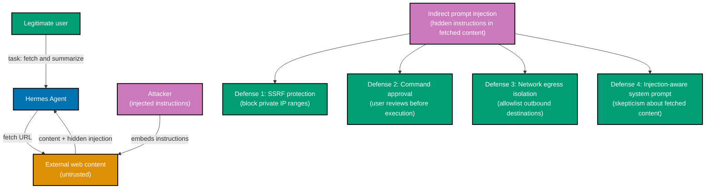
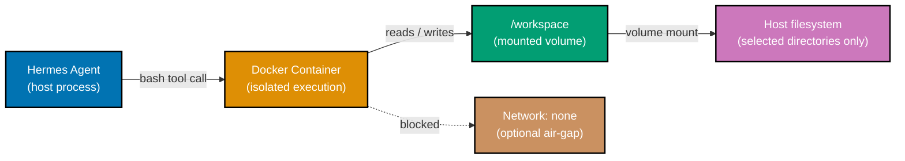

## Section 30: Security Deep Dive

Hermes Agent operates with real tool access — terminal execution, file writes, web requests,
messaging platform connections. This capability makes it genuinely useful and genuinely
dangerous when misused or attacked. The advanced security model addresses the OWASP LLM
Top 10 threat categories relevant to agents with tool access.

The primary attack vector unique to LLM agents is indirect prompt injection: an attacker
embeds instructions in content that Hermes reads — a web page, a file, an email — that
cause Hermes to take actions the user did not authorize. For example, a malicious webpage
might include hidden text instructing Hermes to exfiltrate `~/.hermes/config.yml` to an
attacker-controlled URL.



```yaml
# ~/.hermes/config.yml — comprehensive security configuration

security:
  # --- Command Approval ---
  command_approval:
    interactive # => Never run commands without user confirmation
    # => In automated pipelines, use a dedicated restricted config

  # --- Secret Redaction ---
  secret_redaction: true
  redaction_patterns: # => Additional patterns beyond defaults
    - "ghp_[A-Za-z0-9]{36}" # => GitHub personal access tokens
    - "sk-[A-Za-z0-9]{48}" # => OpenAI API keys
    - "AKIA[A-Z0-9]{16}" # => AWS access key IDs
    - "xoxb-[0-9]+-[A-Za-z0-9]+" # => Slack bot tokens

  # --- SSRF Protection ---
  ssrf_protection: true
  ssrf_blocklist: # => Block requests to these CIDRs in addition to defaults
    - "10.0.0.0/8" # => Private class A
    - "172.16.0.0/12" # => Private class B
    - "192.168.0.0/16" # => Private class C
    - "169.254.0.0/16" # => Link-local (AWS metadata endpoint)
    - "fd00::/8" # => IPv6 ULA

  # --- Network Egress Isolation ---
  network_egress:
    mode:
      allowlist # => Options: open | allowlist | deny
      # =>   open: all outbound connections permitted (default)
      # =>   allowlist: only listed destinations permitted
      # =>   deny: no outbound connections from tool calls
    allowed_hosts:
      - "api.anthropic.com" # => LLM API
      - "api.openai.com" # => Alternative LLM API
      - "*.github.com" # => GitHub API and web
      - "registry.npmjs.org" # => npm registry (for MCP server installs)
    # Any host not listed is blocked when mode: allowlist

  # --- Prompt Injection Defense ---
  prompt_injection_defense: true
  injection_defense_level:
    strict # => Options: basic | strict
    # =>   basic: system prompt reminder to distrust content
    # =>   strict: adds sandboxing markers around fetched content
    # =>     and instructs LLM to treat as untrusted data, not instructions

  # --- MCP Supply Chain ---
  mcp_vetting:
    require_explicit_approval: true # => Never connect to an MCP server not listed in config
    audit_tool_definitions:
      true # => Log all tool definitions received from MCP servers
      # => Review the log before trusting a new server
```

MCP supply chain risk is a specific concern. An MCP server you connect to can define tools
with misleading names and descriptions that cause the LLM to call them in contexts you did
not intend. Before adding any community MCP server, read its tool definitions, review its
npm dependency tree for unusual transitive dependencies, and run it in Docker isolation
rather than directly on your machine.

Link-preview exfiltration is a subtler attack. Some messaging platforms auto-generate
previews for URLs, causing the platform to fetch URLs that appear in messages. An attacker
who can observe Hermes's output (via a shared channel, for example) can exfiltrate data
by having Hermes include a URL containing encoded data in its response, then observing the
platform's preview fetch in their server logs. Mitigation is to disable link previews in
channels where Hermes operates and to use `network_egress: allowlist` mode.

**Key Takeaway:** The four primary defenses — SSRF protection, command approval, network
egress allowlisting, and strict prompt injection defense — form a layered perimeter; MCP
supply chain vetting and link-preview exfiltration awareness address attack vectors
specific to agent architectures.

**Why It Matters:** An AI agent with terminal and network access deployed without egress
controls is a lateral movement vector in any network it can reach. The configuration above
implements defense in depth: each layer catches attacks that slip past the previous one.

---

## Section 31: Voice Mode

Hermes Agent includes a voice interface with ten text-to-speech (TTS) providers and five
speech-to-text (STT) providers. Voice mode enables push-to-talk interaction: hold a key
to record speech, release to transcribe and send, receive a spoken response. This is
particularly useful for mobile contexts (Android Termux), hands-free server administration,
and accessibility use cases.

```yaml
# ~/.hermes/config.yml — voice mode configuration

voice:
  enabled: true

  # --- Speech-to-Text (STT) ---
  stt:
    provider:
      groq # => Options: local | groq | openai | mistral | xai
      # =>   local: runs Whisper locally (no API cost, slower)
      # =>   groq: fast cloud transcription (~$0.0001/min)
      # =>   openai: OpenAI Whisper API
      # =>   mistral: Mistral STT API
      # =>   xai: xAI STT API
    api_key: ${GROQ_API_KEY} # => Required for non-local providers
    language: en # => Transcription language hint (improves accuracy)
    model: whisper-large-v3-turbo # => Provider-specific model (Groq)

  # --- Text-to-Speech (TTS) ---
  tts:
    provider:
      edge_tts # => Options: edge_tts | elevenlabs | openai | minimax |
      # =>   voxtral | gemini | xai | neutts | kittentts | piper
      # =>   edge_tts: free, Microsoft Edge TTS (no API key)
      # =>   elevenlabs: highest quality, most expensive
      # =>   openai: OpenAI TTS, good quality
      # =>   piper: local TTS, no API, runs on device
    voice:
      en-US-AriaNeural # => Voice ID (provider-specific)
      # => edge_tts voices: run `edge-tts --list-voices`
    speed: 1.0 # => Playback speed (1.0 = normal, 1.3 = faster)
    api_key: null # => Not required for edge_tts

  # --- Push-to-Talk ---
  push_to_talk:
    key: ctrl+space # => Hold to record, release to send
    noise_threshold: 0.02 # => Minimum amplitude to start recording (reduce background noise)
    silence_timeout_ms: 1500 # => Auto-stop recording after 1.5s of silence
```

TTS provider comparison by use case:

| Provider   | Quality | Cost      | Latency | Requires API | Best For               |
| ---------- | ------- | --------- | ------- | ------------ | ---------------------- |
| piper      | Good    | Free      | Low     | No           | Offline / air-gapped   |
| edge_tts   | Good    | Free      | Medium  | No           | Default starting point |
| openai     | High    | $0.015/1K | Low     | Yes          | Production quality     |
| elevenlabs | Highest | $0.18/1K  | Low     | Yes          | Highest fidelity       |
| minimax    | High    | Low       | Low     | Yes          | Cost-efficient quality |

STT provider comparison:

| Provider | Quality | Cost         | Latency | Best For                        |
| -------- | ------- | ------------ | ------- | ------------------------------- |
| local    | Good    | Free         | High    | Privacy-sensitive / offline     |
| groq     | High    | ~$0.0001/min | Lowest  | Fast, cheap cloud transcription |
| openai   | High    | $0.006/min   | Low     | Existing OpenAI integration     |
| mistral  | Good    | Low          | Low     | Mistral ecosystem               |

**Key Takeaway:** Voice mode provides push-to-talk interaction through configurable STT
and TTS providers; `edge_tts` (free, no API key) and `groq` STT are the lowest-friction
starting combination.

**Why It Matters:** Voice interaction removes the keyboard barrier for mobile and
hands-free contexts — server rooms, mobile SSH sessions, accessibility requirements.
The pluggable provider model means you can use free local models in offline environments
and switch to higher-quality cloud providers when quality is the priority.

---

## Section 32: Docker Terminal Backend

The Docker terminal backend runs all Hermes bash tool calls inside an isolated container,
using a shared or mounted filesystem to exchange files between the host and the container.
This provides the strongest isolation available without requiring a remote host or cloud
provider. It is the recommended backend for working with untrusted repositories, running
experiments that might damage the local environment, or providing a reproducible execution
context across team members.



```yaml
# ~/.hermes/config.yml — Docker terminal backend (full configuration)

terminal:
  backend: docker

  docker:
    image:
      python:3.12-slim # => Base image; choose to match your workload
      # => python:3.12-slim for Python work
      # => node:24-slim for Node.js work
      # => ubuntu:24.04 for general shell work

    volumes:
      - "${HOME}/projects:/workspace" # => Mount host projects directory as /workspace in container
        # => Container code sees /workspace; host sees ~/projects
      - "/tmp/hermes-cache:/cache" # => Optional: persistent cache across container restarts

    network:
      bridge # => Options: none | bridge | host
      # =>   none: fully air-gapped (most secure)
      # =>   bridge: internet access via Docker NAT (default)
      # =>   host: same network as host (least isolated)

    resource_limits:
      memory: 2g # => Container hard memory cap (OOM-killed if exceeded)
      cpus: 2.0 # => Maximum CPU cores (soft limit)
      pids: 512 # => Maximum process count (prevents fork bombs)

    user:
      1000:1000 # => Run container as non-root UID:GID
      # => Prevents container root from writing root-owned files
      # => to mounted host volumes

    remove_after_session:
      true # => Delete container and its writable layer on session end
      # => Prevents accumulation of stale containers

    persistent_container:
      false # => If true, reuse the same container across sessions
      # =>   Faster startup, but state accumulates between sessions
      # =>   Set true for development containers with heavy deps

    extra_args: # => Raw Docker flags passed to `docker run`
      - "--read-only" # => Container filesystem is read-only (writes only to volumes)
      - "--security-opt=no-new-privileges"
        # => Prevent privilege escalation inside container
      - "--cap-drop=ALL" # => Drop all Linux capabilities (most restrictive)
      - "--cap-add=DAC_OVERRIDE" # => Re-add only what is needed
```

For reproducible team environments, commit the `config.yml` Docker section to your
repository without secrets. Team members pull the config and get the same container
image, volume mounts, and resource limits. Differences in host OS (Linux vs. macOS)
are absorbed by Docker.

A common pitfall with `remove_after_session: true` is losing installed dependencies.
If your container installs Python packages during a session, they are gone when the
container is removed. Use a Dockerfile with dependencies pre-installed and build a
custom image rather than relying on runtime installation in a disposable container.

**Key Takeaway:** The Docker backend runs all bash tool calls in an isolated container
with configurable volume mounts, network mode, resource limits, and security options;
`--cap-drop=ALL`, non-root user, and `network: none` together provide the strongest
isolation available without a remote host.

**Why It Matters:** Untrusted repositories and experimental scripts that might damage
the local environment are a real risk. Running Hermes in Docker mode means a runaway
script or malicious skill can only damage the container — the host filesystem is
protected by the volume mount boundary.

---

## Section 33: Advanced Subagent Patterns

Basic subagent delegation (Intermediate Section 19) covers spawning and waiting for results.
Advanced patterns address orchestration structures that arise in production: the
orchestrator-specialist hierarchy, result aggregation strategies, failure handling across
concurrent agents, and cost attribution.

The orchestrator-specialist pattern uses the parent Hermes agent as a pure coordinator that
decomposes tasks and interprets results, while specialized subagents do the actual work with
minimal toolsets. This separation keeps each agent's context clean and focused.

```yaml
# Example orchestrator task (what you send to the parent Hermes):
# "Audit the three microservices in ./services/ for security issues.
#  Check auth, input validation, and dependency vulnerabilities in each."

# Parent Hermes decomposes this into three concurrent subagent calls:

# Subagent 1: Auth audit for services/auth-service/
# Parameters:
#   task: "Audit auth-service for authentication issues:
#          - Check all endpoints for missing auth guards
#          - Verify JWT validation: expiry, signature, algorithm pinning
#          - Check for hardcoded credentials"
#   toolset: [terminal]                # => Read-only terminal access
#   working_directory: ./services/auth-service
#   model: cheap_model                 # => Cheaper model for systematic pattern matching

# Subagent 2: Input validation audit for services/payment-service/
# Parameters:
#   task: "Audit payment-service for input validation issues:
#          - Find all SQL queries; verify parameterization
#          - Find all user inputs; verify sanitization
#          - Check for path traversal in file operations"
#   toolset: [terminal]
#   working_directory: ./services/payment-service
#   model: cheap_model

# Subagent 3: Dependency audit across all services
# Parameters:
#   task: "Run npm audit in each service directory, collect results,
#          identify critical and high vulnerabilities, group by CVE"
#   toolset: [terminal]
#   model: primary                     # => Primary model for reasoning across results
```

Failure handling across concurrent subagents requires explicit configuration. By default,
if one subagent fails or times out, the parent waits for the remaining agents and reports
the failure alongside successful results. For tasks where partial results are unacceptable,
configure `fail_fast`:

```yaml
# ~/.hermes/config.yml — advanced delegation configuration

delegation:
  max_concurrent: 3
  default_timeout_seconds: 300

  failure_handling:
    mode:
      continue # => Options: continue | fail_fast
      # =>   continue: collect all results, report failures inline
      # =>   fail_fast: kill all agents on first failure
    retry_failed:
      false # => Do not automatically retry failed subagents
      # => Set true + retry_limit: 2 for transient failures

  cost_attribution:
    enabled: true # => Track cost per subagent separately
    label_by: task_name # => Attribute cost to the task name, not just "delegation"
```

Result aggregation strategy determines how the parent synthesizes subagent output.
Three patterns emerge in practice:

- **Merge**: Combine outputs into a unified report (appropriate for audits, searches).
- **Vote**: Take the majority position when subagents give conflicting answers (for MoA-style
  verification tasks).
- **Pipeline**: Pass one subagent's output as the next subagent's input (sequential
  processing with intermediate agents).

```bash
# Example: pipeline aggregation
# Stage 1 subagent: Fetch and parse raw data
# => Output: structured JSON with 500 entries

# Stage 2 subagent (receives stage 1 output):
# Input: structured JSON from stage 1
# Task: "Filter entries where revenue > 50000 and status == 'active', compute totals"
# => Output: filtered dataset, 87 entries, total revenue $5.2M

# Stage 3 subagent (receives stage 2 output):
# Input: filtered dataset from stage 2
# Task: "Format as an executive summary: top 5 accounts, trends, recommendations"
# => Output: formatted report

# Parent returns stage 3 output to the user
```

**Key Takeaway:** The orchestrator-specialist pattern keeps each agent's context focused;
failure handling modes (`continue` vs. `fail_fast`) and result aggregation strategies
(merge, vote, pipeline) are the key design decisions for production multi-agent workflows.

**Why It Matters:** Multi-agent parallelism is the primary technique for reducing
wall-clock time on decomposable production tasks. Getting failure handling right prevents
a single flaky subagent from silently corrupting a merged result or causing unnecessary
full restarts.

---

## Section 34: Custom Tool Development

Hermes Agent supports custom tools written as Python modules. A custom tool extends the
`BaseTool` class, defines its input schema using JSON Schema, implements an `execute` method,
and is registered in a custom toolset. Custom tools appear in `/tools` listing and are
available to the LLM alongside built-in tools.

```python
# ~/.hermes/custom_tools/jira_tool.py
# Custom tool: query Jira issues from within Hermes sessions

from hermes.tools import BaseTool, ToolResult   # => Import base class and result type
from typing import Optional
import httpx                                      # => HTTP client for Jira REST API

class JiraQueryTool(BaseTool):
    """Query Jira issues by project key and status filter."""
                                                  # => Docstring becomes the tool description
                                                  # => shown to the LLM in the tool schema

    name = "jira_query"                          # => Tool name in function-calling schema
    toolset = "jira"                             # => Toolset this tool belongs to

    # JSON Schema defining the tool's input parameters
    # => The LLM reads this schema to understand what arguments to provide
    input_schema = {
        "type": "object",
        "properties": {
            "project_key": {
                "type": "string",               # => e.g., "PROJ"
                "description": "Jira project key (e.g., 'PROJ', 'BACKEND')"
            },
            "status": {
                "type": "string",
                "enum": ["Open", "In Progress", "Done", "Blocked"],
                                                  # => Restrict to valid Jira statuses
                "description": "Filter issues by status"
            },
            "max_results": {
                "type": "integer",
                "default": 10,                   # => Return 10 results unless specified
                "description": "Maximum number of issues to return (default: 10)"
            }
        },
        "required": ["project_key"]             # => Only project_key is required
    }

    async def execute(
        self,
        project_key: str,
        status: Optional[str] = None,
        max_results: int = 10
    ) -> ToolResult:
        """Execute the Jira query and return formatted results."""

        # Build JQL query
        jql = f"project = {project_key}"       # => Base JQL: all issues in project
        if status:
            jql += f" AND status = '{status}'" # => Append status filter if provided

        jql += " ORDER BY updated DESC"         # => Most recently updated first

        # Make Jira REST API call
        async with httpx.AsyncClient() as client:
            response = await client.get(
                f"{self.config.jira_url}/rest/api/3/search",
                                                  # => self.config reads from config.yml custom section
                params={
                    "jql": jql,
                    "maxResults": max_results,
                    "fields": "summary,status,assignee,priority"
                },
                headers={
                    "Authorization": f"Bearer {self.config.jira_api_token}"
                                                  # => Token from config; never hardcoded
                }
            )

        if response.status_code != 200:
            # Return error result — LLM receives this and can report or retry
            return ToolResult.error(
                f"Jira API error {response.status_code}: {response.text}"
            )

        issues = response.json()["issues"]       # => Parse response JSON

        # Format results as readable text for the LLM
        if not issues:
            return ToolResult.success("No issues found matching the query.")

        lines = [f"Found {len(issues)} issues in {project_key}:\n"]
        for issue in issues:
            fields = issue["fields"]
            lines.append(
                f"- {issue['key']}: {fields['summary']} "
                f"[{fields['status']['name']}]"
                f"{'  → ' + fields['assignee']['displayName'] if fields.get('assignee') else ''}"
            )

        return ToolResult.success("\n".join(lines))
```

```yaml
# ~/.hermes/config.yml — register the custom toolset

tools:
  enabled:
    - terminal
    - web
    - jira # => Enable the custom jira toolset

  custom_toolsets:
    jira: # => Toolset name (must match tool.toolset attribute)
      module_path:
        ~/.hermes/custom_tools/jira_tool.py
        # => Path to the Python module defining the tool
      config:
        jira_url:
          https://myorg.atlassian.net
          # => Config values passed to self.config in the tool
        jira_api_token:
          ${JIRA_API_TOKEN}
          # => API token from Jira account settings
```

Test a custom tool locally before enabling it in a session:

```bash
# Test the tool without starting a full Hermes session
hermes tools test --tool jira_query --input '{"project_key": "BACKEND", "status": "In Progress"}'
# => Executes the tool's execute() method directly
# => Prints the ToolResult to stdout
# => Useful for debugging without burning LLM tokens
```

**Key Takeaway:** Custom tools extend `BaseTool`, define a JSON Schema for inputs, and
implement an `async execute` method; they register under a custom toolset name in
`config.yml` and appear in `/tools` alongside built-in tools.

**Why It Matters:** Generic tools cover common use cases. Domain-specific tools — querying
your ticketing system, calling internal APIs, interfacing with proprietary data stores —
make Hermes genuinely useful for your specific workflow. The tool API is stable and
straightforward enough that a custom tool is typically a few hours of work.

---

## Section 35: Production Deployment

Running Hermes Agent reliably in production means converting it from an interactive CLI
into a managed background service. This section covers systemd (Linux) and launchd (macOS)
service configuration, health monitoring, cost budgets, and alerting.

A production Hermes deployment typically runs the messaging gateway as a persistent service
and the cron scheduler as a companion process. The CLI remains available for interactive
sessions but is not part of the production service.

```ini
# /etc/systemd/system/hermes-gateway.service
# systemd unit file for the Hermes messaging gateway

[Unit]
Description=Hermes Agent Messaging Gateway
After=network-online.target              # => Wait for network before starting
Wants=network-online.target
StartLimitIntervalSec=60                 # => Rate-limit restarts: max 3 in 60 seconds
StartLimitBurst=3

[Service]
Type=simple
User=hermes                              # => Run as dedicated non-root user
Group=hermes
WorkingDirectory=/home/hermes            # => Working directory for the process

# Load environment variables from a secrets file (not checked into version control)
EnvironmentFile=/etc/hermes/secrets.env  # => Contains ANTHROPIC_API_KEY=sk-... etc.

ExecStart=/home/hermes/.local/bin/hermes gateway
                                          # => Start the gateway (blocks; systemd manages lifecycle)

Restart=on-failure                       # => Restart only on non-zero exit (not on clean stop)
RestartSec=10                            # => Wait 10 seconds before restarting

# Resource limits at OS level (defense-in-depth alongside config.yml limits)
LimitNOFILE=65536                        # => Maximum open file descriptors
MemoryMax=1G                             # => Hard memory cap via cgroup

# Harden the service process
NoNewPrivileges=true                     # => Prevent privilege escalation
ProtectSystem=strict                     # => /usr, /boot, /etc are read-only
ProtectHome=false                        # => Allow access to /home/hermes (needed for config)
PrivateTmp=true                          # => Isolated /tmp per service instance

[Install]
WantedBy=multi-user.target
```

```bash
# Deploy and start the systemd service
sudo systemctl daemon-reload             # => Reload systemd unit files
sudo systemctl enable hermes-gateway    # => Enable auto-start on boot
sudo systemctl start hermes-gateway     # => Start the service now

# Check service status
sudo systemctl status hermes-gateway
# => Active: active (running) since 2026-05-22 09:00:01 WIB

# Tail service logs (systemd journal)
sudo journalctl -u hermes-gateway -f    # => Follow logs in real time
```

```xml
<!-- ~/Library/LaunchAgents/dev.hermes.gateway.plist -->
<!-- launchd plist for macOS production deployment -->
<?xml version="1.0" encoding="UTF-8"?>
<!DOCTYPE plist PUBLIC "-//Apple//DTD PLIST 1.0//EN"
  "http://www.apple.com/DTDs/PropertyList-1.0.dtd">
<plist version="1.0">
<dict>
  <key>Label</key>
  <string>dev.hermes.gateway</string>    <!-- Unique service identifier -->

  <key>ProgramArguments</key>
  <array>
    <string>/Users/<you>/.local/bin/hermes</string>
    <string>gateway</string>             <!-- Run gateway subcommand -->
  </array>

  <key>EnvironmentVariables</key>
  <dict>
    <key>ANTHROPIC_API_KEY</key>
    <string>sk-ant-...</string>          <!-- Production API key -->
  </dict>

  <key>RunAtLoad</key>
  <true/>                                <!-- Start when user logs in -->

  <key>KeepAlive</key>
  <true/>                                <!-- Restart if process exits -->

  <key>StandardOutPath</key>
  <string>/tmp/hermes-gateway.log</string>
  <key>StandardErrorPath</key>
  <string>/tmp/hermes-gateway-error.log</string>
</dict>
</plist>
```

```bash
# Load the launchd plist (macOS)
launchctl load ~/Library/LaunchAgents/dev.hermes.gateway.plist

# Check status
launchctl list | grep hermes
```

Cost budget alerting in production:

```yaml
# ~/.hermes/config.yml — production cost alerting

cost:
  daily_budget_usd: 10.00 # => Alert threshold
  budget_action: warn # => warn | block
  alert_channel: telegram # => Send budget alert via Telegram
  alert_recipient: 123456789 # => Your Telegram user ID
```

**Key Takeaway:** Production Hermes runs as a systemd (Linux) or launchd (macOS) service
with a dedicated non-root user, hardened process isolation, environment-file secrets
management, and cost budget alerting via the messaging gateway.

**Why It Matters:** An agent that requires manual restart after every server reboot, runs
as root, or stores API keys in the config file is not production-ready. The service
configuration above reflects the baseline operational standards that make a long-running
agent trustworthy.

---

## Section 36: Reinforcement Learning Toolset

The `rl` toolset integrates Hermes Agent with reinforcement learning workflows — logging
task outcomes as reward signals, querying training history, and exporting datasets for
model fine-tuning. This toolset is the mechanism through which Hermes's behavior can be
systematically improved beyond the heuristic skill-creation loop.

The RL toolset does not train models inline — it collects data. The training loop runs
externally (using a framework of your choice) against exported datasets. Hermes generates
the data; your ML pipeline consumes it.

```yaml
# ~/.hermes/config.yml — RL toolset configuration

tools:
  enabled:
    - rl # => Enable the RL toolset

rl:
  storage_path: ~/.hermes/rl_data/ # => Where reward logs and datasets are stored
  auto_log:
    true # => Automatically log all task completions as episodes
    # => Each session becomes an episode with implicit reward
  reward_model:
    binary # => Options: binary | scalar | comparative
    # =>   binary: success/failure (1 or 0)
    # =>   scalar: numeric reward (0.0 to 1.0)
    # =>   comparative: A/B comparison between runs
```

```bash
# Log a reward signal for a completed task (from within a session)
# => Records the current session as a successful episode with reward 1.0
/tools rl.log_reward --reward 1.0 --note "Deployment completed without errors"

# Log a negative reward for a failed task
/tools rl.log_reward --reward 0.0 --note "Deployment failed: TypeScript errors not caught"

# Query recent reward history
/tools rl.history --limit 10
# => Output:
# EPISODE                          REWARD  DATE              NOTE
# ses_20260522_143012_a7b3         1.0     2026-05-22 14:30  Deployment completed without errors
# ses_20260521_091823_c4d2         0.0     2026-05-21 09:18  Deployment failed: TypeScript errors
# ses_20260520_171244_e5f1         1.0     2026-05-20 17:12  Security audit: 3 issues found

# Export collected episodes as a dataset for fine-tuning
hermes rl export --format jsonl --output ./training_data.jsonl
# => Exports all episodes with reward labels to JSONL format
# => Each line: {"messages": [...], "reward": 1.0, "metadata": {...}}
# => Compatible with OpenAI fine-tuning API and most ML frameworks
```

The exported dataset contains the full conversation — system prompt, user messages, agent
responses, tool calls, and tool results — alongside the reward label. This enables
supervised fine-tuning that reinforces successful patterns and demotes unsuccessful ones.

For teams with the resources to run fine-tuning, the RL toolset provides a systematic
data collection pipeline. For most teams, the RL toolset is most useful as a structured
outcome log that informs manual skill editing rather than automated training.

**Key Takeaway:** The RL toolset logs task outcomes as reward signals and exports them as
training datasets compatible with standard ML fine-tuning pipelines — enabling systematic
behavior improvement beyond the heuristic skill-creation loop.

**Why It Matters:** The skill system improves Hermes within the bounds of its current model.
RL-based fine-tuning changes the model itself, compounding improvements at a deeper level.
For teams doing repetitive high-stakes tasks, the data collection investment pays off in
measurably better agent behavior over time.

---

## Section 37: Advanced Memory Architecture

Memory in Hermes Agent has two layers: the human-readable markdown files (`MEMORY.md` and
`USER.md`) and the SQLite-backed FTS5 session store. Understanding both layers — their
schemas, their interaction, and their failure modes — enables effective pruning, backup,
and recovery strategies for long-running production deployments.

The SQLite database lives at `~/.hermes/sessions.db`. Its schema has three primary tables:

```sql
-- sessions table: one row per Hermes session
CREATE TABLE sessions (
  id TEXT PRIMARY KEY, -- Session ID: ses_YYYYMMDD_HHMMSS_xxxx
  started_at TEXT NOT NULL, -- ISO 8601 timestamp
  ended_at TEXT, -- NULL if session is still active
  model TEXT NOT NULL, -- Primary model used
  total_tokens INTEGER DEFAULT 0, -- Cumulative token count
  total_cost_usd REAL DEFAULT 0.0, -- Cumulative cost in USD
  metadata TEXT -- JSON blob for extensible metadata
);

-- messages table: one row per message in any session
CREATE TABLE messages (
  id TEXT PRIMARY KEY,
  session_id TEXT NOT NULL REFERENCES sessions (id),
  role TEXT NOT NULL, -- 'user' | 'assistant' | 'tool'
  content TEXT NOT NULL, -- Full message text (indexed by FTS5)
  tool_name TEXT, -- Non-null for role='tool'
  tokens INTEGER, -- Token count for this message
  created_at TEXT NOT NULL
);

-- FTS5 virtual table: full-text search index over message content
CREATE VIRTUAL TABLE messages_fts USING fts5 (
  content, -- Indexed column (message text)
  content = 'messages', -- Backing table
  content_rowid = 'rowid' -- Row linkage
);
```

Memory pruning strategies for large session stores:

```bash
# Check database size
du -sh ~/.hermes/sessions.db
# => 2.3G

# Count total sessions
hermes db stats
# => Sessions: 1,847
# => Messages: 84,211
# => Database size: 2.3 GB
# => Oldest session: 2025-11-01

# Archive sessions older than 180 days
# => Moves rows to sessions_archive table, removes from main tables and FTS index
hermes db archive --before 180d
# => Archived 412 sessions (2025-11-01 to 2026-02-22)
# => Database size after: 1.1 GB

# Export archived sessions to a compressed file before deleting
hermes db export --archived --output ~/hermes-archive-2026-02.jsonl.gz
# => Exports archived sessions as compressed JSONL

# Delete archived sessions (irreversible)
hermes db purge --archived --confirm
# => Deleted 412 archived sessions
# => Database size after: 0.9 GB

# Rebuild FTS5 index (run after bulk operations to ensure consistency)
hermes db reindex
# => Rebuilds messages_fts from messages table
# => Takes 30-60 seconds for large databases

# Backup the database
cp ~/.hermes/sessions.db ~/backup/hermes-sessions-$(date +%Y%m%d).db
# => SQLite files are safe to copy when Hermes is not running
# => For running Hermes: use hermes db backup --output ~/backup/
```

`MEMORY.md` and `USER.md` pruning is manual. As these files grow, older or superseded
entries accumulate. Review them periodically and remove entries that no longer reflect
current project state or preferences. Hermes does not automatically remove entries —
it only appends.

**Key Takeaway:** The SQLite session store uses FTS5 for search across a three-table schema
(sessions, messages, messages_fts); `hermes db archive`, `export`, and `purge` manage
growth; `MEMORY.md` and `USER.md` require periodic manual review and pruning.

**Why It Matters:** A 2+ GB session database with no pruning strategy is a support
incident waiting to happen. The archive-export-purge cycle keeps the database at a
manageable size while preserving the ability to recover historical context from compressed
exports if needed.

---

## Section 38: Custom LLM Provider

Beyond the built-in provider adapters (Anthropic, OpenAI, Google, DeepSeek) and OpenRouter,
Hermes supports custom LLM providers through a plugin interface. A custom provider
implements the `BaseLLMProvider` class, handles authentication and request formatting for
a proprietary or self-hosted endpoint, and registers in `config.yml`.

```python
# ~/.hermes/custom_providers/vllm_provider.py
# Custom provider: connect to a self-hosted vLLM instance

from hermes.llm import BaseLLMProvider, LLMResponse, LLMMessage
from typing import AsyncIterator
import httpx

class VLLMProvider(BaseLLMProvider):
    """Provider for self-hosted vLLM OpenAI-compatible endpoint."""

    name = "vllm"                        # => Provider name used in config.yml

    def __init__(self, config: dict):
        self.base_url = config["base_url"]          # => e.g., http://gpu-server:8000
        self.model = config["model"]                # => vLLM model name
        self.api_key = config.get("api_key", "none")
                                                      # => vLLM can run without auth

    async def complete(
        self,
        messages: list[LLMMessage],
        stream: bool = True,
        **kwargs
    ) -> AsyncIterator[LLMResponse]:
        """Send messages to vLLM and stream the response."""

        # vLLM exposes an OpenAI-compatible /v1/chat/completions endpoint
        payload = {
            "model": self.model,
            "messages": [{"role": m.role, "content": m.content} for m in messages],
                                                      # => Convert LLMMessage to OpenAI format
            "stream": stream,
            "temperature": kwargs.get("temperature", 0.7)
        }

        async with httpx.AsyncClient(timeout=60.0) as client:
            async with client.stream(
                "POST",
                f"{self.base_url}/v1/chat/completions",
                json=payload,
                headers={"Authorization": f"Bearer {self.api_key}"}
            ) as response:
                async for line in response.aiter_lines():
                    if line.startswith("data: ") and line != "data: [DONE]":
                        chunk = line[6:]             # => Strip "data: " prefix
                        yield LLMResponse.from_openai_chunk(chunk)
                                                      # => Convert OpenAI chunk format to Hermes format

    def count_tokens(self, text: str) -> int:
        """Estimate token count for cost tracking."""
        # => Approximate: 4 characters per token (adjust per model)
        return len(text) // 4
```

```yaml
# ~/.hermes/config.yml — register and use the custom provider

llm:
  primary: llama-3.1-70b # => Model name as vLLM knows it
  provider: vllm # => Selects the custom vllm provider
  cheap_model: llama-3.1-8b

  custom_providers:
    vllm:
      module_path:
        ~/.hermes/custom_providers/vllm_provider.py
        # => Path to the provider Python module
      config:
        base_url:
          http://gpu-server.internal.example:8000
          # => Self-hosted vLLM endpoint
        model: llama-3.1-70b-instruct # => Exact model ID as loaded in vLLM
        api_key: null # => No auth on internal network (not recommended for prod)
```

For truly air-gapped environments, a vLLM or Ollama custom provider enables Hermes to
operate with zero external API calls. Combined with the Docker terminal backend using
`network: none` and local STT/TTS providers, this gives a fully offline Hermes deployment.

**Key Takeaway:** Custom LLM providers implement `BaseLLMProvider` with a `complete` method
and `count_tokens` method, register via `config.yml`, and enable Hermes to work with
self-hosted or proprietary LLM endpoints.

**Why It Matters:** Data residency requirements, cost structures, and air-gap security
policies all drive the need for self-hosted LLM deployment. A custom provider integration
makes Hermes viable in these environments without forking the project.

---

## Section 39: Migrating from OpenClaw Deep Dive

`hermes claw migrate` is a purpose-built migration tool that reads your OpenClaw
installation and produces a Hermes configuration with equivalent settings, memory, skills,
and messaging platform credentials. The Beginner section covered the command overview;
this section covers the internals, directory mapping, format conversion, and edge cases.

The migrator reads from `~/.openclaw/` and writes to `~/.hermes/`. It operates in three
modes: `--dry-run` (inspect, no writes), `--preset user-data` (no secrets), and
`--preset full` (includes secrets). The default is `--preset user-data`.

```bash
# Run a detailed dry-run to see exactly what will happen
hermes claw migrate --dry-run --verbose
# => OUTPUT (example):

# Reading OpenClaw installation at: ~/.openclaw/

# Configuration mapping:
#   openclaw.llm.model            → hermes.llm.primary
#   openclaw.llm.cheap_model      → hermes.llm.cheap_model
#   openclaw.tools.enabled        → hermes.tools.enabled (toolset names remapped)
#   openclaw.security.auto_approve → hermes.security.command_approval: auto
#   openclaw.memory.file          → hermes.memory.memory_file

# Memory migration:
#   ~/.openclaw/MEMORY.md (4.2 KB, 87 lines)
#     → ~/.hermes/MEMORY.md (direct copy, no conversion needed)
#   ~/.openclaw/USER.md (1.1 KB, 23 lines)
#     → ~/.hermes/USER.md (direct copy)

# Skills migration (3 skills found):
#   ~/.openclaw/skills/deploy.yml (OpenClaw format)
#     → ~/.hermes/skills/deploy.yml (converted to Hermes format)
#     DIFF: OpenClaw 'steps[].cmd' renamed to 'steps[].command'
#           OpenClaw 'steps[].check' renamed to 'steps[].verify'
#   ~/.openclaw/skills/test-workflow.yml → ~/.hermes/skills/test-workflow.yml
#   ~/.openclaw/skills/db-backup.yml → ~/.hermes/skills/db-backup.yml

# Platform credentials (preset: user-data — SKIPPED):
#   ~/.openclaw/config.yml: telegram.token → SKIPPED (use --preset full to include)
#   ~/.openclaw/config.yml: discord.token → SKIPPED

# Sessions migration:
#   OpenClaw session format: JSON files in ~/.openclaw/sessions/
#   Hermes session format: SQLite at ~/.hermes/sessions.db
#   312 session files found → will be imported to SQLite and FTS5-indexed
#   NOTE: Session import may take 2-3 minutes for 312 sessions

# Estimated result:
#   ~/.hermes/config.yml         (new file)
#   ~/.hermes/MEMORY.md          (new file, direct copy)
#   ~/.hermes/USER.md            (new file, direct copy)
#   ~/.hermes/skills/            (3 converted skill files)
#   ~/.hermes/sessions.db        (new database, 312 imported sessions)
```

The skill format conversion handles the key differences between OpenClaw and Hermes skill
schemas. OpenClaw uses `cmd` for commands and `check` for verification steps; Hermes uses
`command` and `verify`. The converter renames fields and adds the `level` field (defaulting
to `frequent`) for all migrated skills.

Session import converts OpenClaw's flat JSON file format into Hermes's SQLite schema. The
FTS5 index is built over all imported sessions after import, making historical sessions
searchable immediately.

```bash
# Run the actual migration (user-data preset)
hermes claw migrate --preset user-data
# => Writes config, memory, skills
# => Imports sessions to SQLite (takes 2-3 minutes for large session histories)
# => Does NOT copy API keys

# After migration: add API keys manually to config.yml
# => Open ~/.hermes/config.yml and fill in the api_key fields
# => Reference environment variables: api_key: ${ANTHROPIC_API_KEY}

# Verify the migration
hermes --verify-config
# => Checks config.yml for syntax errors
# => Tests LLM provider connectivity (requires API key)
# => Checks that all referenced skill files exist
# => Reports any issues before you start your first session

# Start your first Hermes session post-migration
hermes
# => Sessions, memory, and skills from OpenClaw are immediately available
```

**Key Takeaway:** `hermes claw migrate --dry-run --verbose` shows a complete migration plan
including field mappings, skill format conversions, and session import scope before writing
anything; `--preset user-data` applies the migration without copying API keys.

**Why It Matters:** Migration tools are only valuable if they are safe to run experimentally.
The dry-run mode with verbose output makes the migration transparent and reversible —
you understand exactly what will change before committing to it.

---

## Section 40: Contributing to Hermes Agent

Hermes Agent is MIT-licensed and maintained by Nous Research with an active open-source
community. Contributing a tool, a bug fix, a skill, or a documentation improvement follows
a standard GitHub PR workflow. Understanding the codebase structure and local development
setup reduces the friction of a first contribution.

The codebase is organized as a Python monorepo:

```
hermes-agent/
├── hermes/                    # Main Python package
│   ├── cli/                   # TUI and CLI entry points (prompt_toolkit)
│   ├── gateway/               # Messaging platform adapters (Telegram, Discord, etc.)
│   ├── tools/                 # Built-in toolset implementations
│   │   ├── terminal.py        # bash, read, write tools
│   │   ├── web.py             # search, fetch tools
│   │   ├── memory.py          # MEMORY.md / USER.md tools
│   │   ├── skills.py          # skill CRUD tools
│   │   └── ...                # one file per toolset
│   ├── llm/                   # LLM provider adapters
│   │   ├── base.py            # BaseLLMProvider abstract class
│   │   ├── anthropic.py       # Anthropic adapter
│   │   ├── openai.py          # OpenAI adapter
│   │   └── ...
│   ├── memory/                # MEMORY.md and USER.md management
│   ├── skills/                # Skill store and progressive disclosure
│   ├── sessions/              # SQLite session store and FTS5 search
│   ├── delegation/            # Subagent spawning and coordination
│   └── security/              # Command approval, SSRF, secret redaction
├── tests/                     # Test suite (pytest)
│   ├── unit/                  # Fast unit tests (no LLM API, no network)
│   ├── integration/           # Integration tests (real LLM API, mocked tools)
│   └── e2e/                   # End-to-end tests (full session)
├── scripts/
│   └── install.sh             # One-line installer
└── pyproject.toml             # Poetry configuration, dependencies, tool config
```

```bash
# Set up a local development environment
git clone https://github.com/NousResearch/hermes-agent.git
cd hermes-agent

# Install Poetry (Python dependency manager) if not present
curl -sSL https://install.python-poetry.org | python3 -

# Install all dependencies including dev dependencies
poetry install --with dev
# => Creates a virtual environment and installs all deps

# Run the test suite
poetry run pytest tests/unit/            # => Fast unit tests only (no API calls)
poetry run pytest tests/integration/     # => Integration tests (requires LLM API key)

# Run Hermes from source (development mode)
poetry run hermes --version              # => Should show dev version

# Run linting
poetry run ruff check hermes/           # => Fast Python linter
poetry run mypy hermes/                 # => Type checking

# Run all quality checks (same as CI)
poetry run make check
```

Contributing a new tool:

1. Create `hermes/tools/mytool.py` implementing `BaseTool` subclasses.
2. Register the toolset in `hermes/tools/__init__.py`.
3. Add unit tests in `tests/unit/tools/test_mytool.py`.
4. Add documentation in `docs/tools/mytool.md`.
5. Open a PR targeting the `main` branch.

The PR template asks for: a description of what the tool does, why it belongs in core
rather than as a custom tool, test coverage, and any security considerations (does it
make network requests? does it write files? does it execute code?).

For skills contributions, the Skills Hub accepts PR submissions directly to the
`skills-hub` branch of the repository. Community skills go through a lightweight review:
the skill must have a summary, must specify a level, and must not contain hardcoded
secrets or URLs.

**Key Takeaway:** Hermes Agent's Python monorepo uses Poetry for dependency management and
pytest for testing; new tools follow the `BaseTool` pattern, include unit tests, and go
through a standard GitHub PR review focused on functionality and security considerations.

**Why It Matters:** Open-source AI agent infrastructure is only as good as its contributor
community. Understanding the contribution path lowers the barrier for teams to upstream
their custom tools, making the ecosystem richer for everyone while reducing the maintenance
burden of carrying internal forks.
