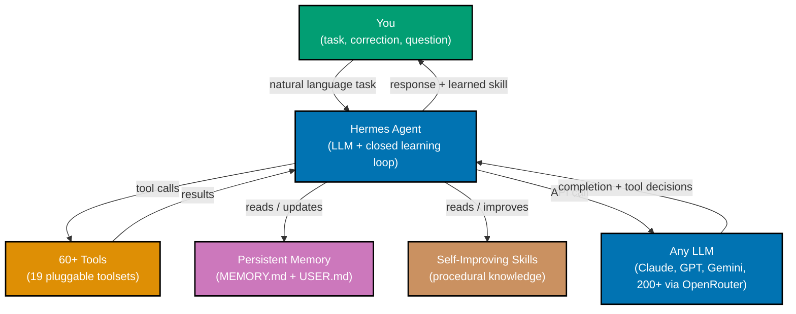
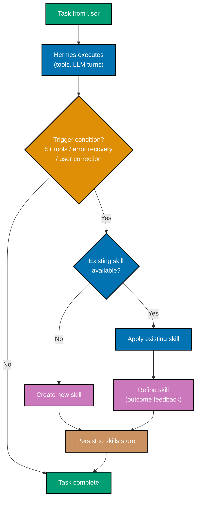

## Section 1: What is Hermes Agent?

Hermes Agent is a free, open-source, self-improving AI agent built by Nous Research and
released under the MIT license. Unlike a standard chatbot that answers one question and
forgets everything when the session ends, Hermes Agent learns from every interaction,
stores knowledge persistently, and applies that knowledge automatically in future sessions.
The agent connects large language models to real tools — file system access, web search,
terminal execution, browser automation — so it can take meaningful action, not just generate
text.

The central design idea that separates Hermes Agent from most AI agent frameworks is the
closed learning loop. Every interaction is a potential learning event. When Hermes uses five
or more tools to accomplish a task, recovers from an error through iteration, or receives a
correction from you, it recognizes that experience as worth codifying. It writes a skill — a
structured piece of procedural knowledge — that it can apply the next time a similar
situation arises. This loop runs continuously: skills are not written once and frozen, they
are refined whenever new evidence arrives.

The agent is not Meta's Hermes JavaScript engine, nor is it a programming language runtime.
It is an autonomous AI agent with a Python-based terminal interface, a messaging gateway
that bridges 20+ communication platforms, and a tool system covering 60+ capabilities
organized into 19 pluggable toolsets.



The practical consequence of this architecture is that your agent becomes more capable and
more personalized over time — automatically, without you writing any code. Tasks that once
required five back-and-forth exchanges take one after the agent has built a skill for them.

**Key Takeaway:** Hermes Agent is a self-improving AI agent — it learns from experience,
stores knowledge persistently, and applies what it has learned in future sessions without
manual configuration.

**Why It Matters:** Most production AI workflows suffer from "context amnesia": every session
starts from zero, and the same corrections are given repeatedly. Hermes Agent's closed
learning loop eliminates that overhead, compounding productivity gains across weeks and months
of use.

---

## Section 2: The Learning Loop

The learning loop is the mechanism that makes Hermes Agent self-improving. Understanding it
precisely tells you when skills are created, how they improve, and how to steer the process.

Skill creation is triggered by one of three conditions. First, if Hermes uses five or more
tool calls to accomplish a single task, the agent infers that the task was non-trivial and
worth remembering procedurally. Second, if Hermes encounters an error and recovers by
iterating — trying an alternative approach, reading documentation, or asking a clarifying
question — the successful recovery path is a candidate skill. Third, if you explicitly
correct Hermes ("that is not what I wanted, do it this way instead"), the correction event
triggers a skill update that encodes your preferred approach.

Skill improvement is continuous. When Hermes applies an existing skill and the outcome
differs from expectation — either better or worse — the skill is refined. If the skill led
to success with fewer steps than it predicted, it is made more concise. If the skill led to
failure, the failure mode is appended and an alternative approach recorded. This means skills
converge toward accuracy and conciseness as they accumulate evidence.



The loop has one important characteristic: it is fully transparent. Skills are written as
human-readable YAML files stored in a directory you can inspect, edit, or delete. Memory is
stored in `MEMORY.md` and `USER.md` files you can open in any text editor. There is no
opaque neural weight update happening behind the scenes — the learning is entirely in
structured text files that you own and control.

A common early misconception is that the learning loop requires you to do something special.
It does not. Simply using Hermes normally — asking it to do tasks, correcting mistakes —
activates the loop. The agent observes its own behavior and decides when to codify it.

**Key Takeaway:** The learning loop creates skills when Hermes uses five or more tools, when
it recovers from errors, or when you correct it — and it refines those skills continuously
as new evidence accumulates.

**Why It Matters:** In production, repeated tasks (deploying a service, formatting a report,
checking a monitoring dashboard) represent a significant fraction of engineering time. The
learning loop converts that repetition into automated skill execution, progressively
eliminating manual overhead across the team.

---

## Section 3: Installation

Hermes Agent installs with a single curl command. The installer provisions all runtime
dependencies — Python, pip packages, and supporting tools — without requiring anything
pre-installed beyond Git and a compatible operating system. Supported platforms are Linux,
macOS, WSL2, and Android Termux. Windows native support is in early beta.

```bash
# Step 1: Download and run the install script
# => Downloads install.sh from the NousResearch GitHub repository
# => Runs the script with bash, which detects your OS and provisions dependencies
# => Creates ~/.hermes/ directory with config, memory, and skills subdirectories
curl -fsSL https://raw.githubusercontent.com/NousResearch/hermes-agent/main/scripts/install.sh | bash

# Step 2: Reload shell so PATH includes the hermes binary
# => install.sh adds hermes to PATH by appending to ~/.bashrc (or ~/.zshrc on macOS)
# => source reloads the current shell without closing and reopening the terminal
source ~/.bashrc   # bash users
# source ~/.zshrc  # zsh users (macOS default)

# Step 3: Verify installation
# => Should print the installed version number, e.g., "hermes 1.x.x"
# => If "command not found", PATH was not updated — re-run source or open a new terminal
hermes --version

# Step 4: Run the setup wizard
# => Interactive prompts collect your LLM provider API key and basic preferences
# => Writes initial config to ~/.hermes/config.yml
# => You can re-run this at any time to change provider settings
hermes setup

# Step 5: Start your first session
# => Opens the TUI (Terminal User Interface) interactive mode
# => Ready for natural language tasks immediately after setup
hermes
```

The setup wizard asks for one LLM provider API key to get started. You can add more
providers later by editing `~/.hermes/config.yml` directly or by running `hermes setup`
again. The wizard does not require you to choose every configuration option upfront — it
applies safe defaults for everything it does not ask about.

After installation, verify that the hermes binary is reachable and that the setup created
the expected directory structure.

```bash
# Verify the hermes binary location
# => Should print a path like /home/<user>/.local/bin/hermes
which hermes

# Inspect the created configuration directory
# => ~/.hermes/ contains: config.yml, memory/, skills/, sessions/
ls ~/.hermes/

# Confirm config.yml was written by the setup wizard
# => Should contain at least the llm.primary and llm.api_key fields
ls ~/.hermes/config.yml
```

**Key Takeaway:** Installation requires only Git and a supported OS — a single curl command
provisions everything else, and `hermes setup` walks through initial configuration in minutes.

**Why It Matters:** Low installation friction matters for team adoption. An agent that requires
manual dependency management before anyone can try it faces organizational resistance.
Hermes Agent's single-command install path means any team member can evaluate it against
their own workflow without waiting for an infrastructure ticket.

---

## Section 4: CLI Basics

The `hermes` command opens a Terminal User Interface (TUI) built with prompt_toolkit, a
Python library for interactive terminal applications. The TUI provides multiline text input,
slash-command autocomplete, streaming output display, and a live token/cost counter.

The input area sits at the bottom of the screen. Press Enter to submit a single-line message.
For multiline input — code blocks, numbered lists, multi-paragraph instructions — press
`Alt+Enter` (or `Escape+Enter` on some terminals) to insert a newline without submitting.
Submit the complete multiline message with Enter on an empty last line.

Slash commands appear when you type `/` in the input area. The TUI shows an autocomplete
dropdown listing available commands. Common commands:

```bash
# View all available slash commands (shown inline when you type /)
/help            # => Prints a summary of all slash commands with descriptions
/tools           # => Lists all enabled toolsets and individual tools
/skills          # => Lists all skills in the skills store with their names and descriptions
/memory          # => Prints current MEMORY.md contents to the conversation
/cost            # => Prints token usage and estimated cost for the current session
/clear           # => Clears conversation history from the display (history still saved)
/exit            # => Gracefully ends the session and saves conversation to SQLite store
```

The streaming output area fills the upper portion of the screen. As Hermes processes your
message, you see the LLM response token by token, with tool calls rendered inline as they
execute. A tool call looks like:

```
[Tool: bash]
echo "hello world"
=> hello world
```

The token counter in the status bar updates after each exchange, showing cumulative context
tokens and estimated cost. This counter is per-session; it resets when you start a new
session.

**Key Takeaway:** The Hermes TUI provides multiline input, streaming output, slash-command
autocomplete, and live cost tracking — all accessible without leaving the terminal.

**Why It Matters:** Streaming output and inline tool display are not cosmetic features. They
let you interrupt a runaway tool chain, understand what the agent is doing before it
finishes, and catch errors at the moment they occur rather than after a long silent wait.

---

## Section 5: YAML Configuration

Hermes Agent reads its configuration from `~/.hermes/config.yml`. This file controls LLM
provider selection, toolset enablement, memory settings, security options, and messaging
gateway connections. The file uses standard YAML syntax; the setup wizard writes the initial
version, and you extend it manually.

```yaml
# ~/.hermes/config.yml — main Hermes Agent configuration file

llm:
  primary:
    claude-3-7-sonnet-20250219 # => Main model for complex, multi-step tasks
    # => Smart routing may switch to cheap_model automatically
  cheap_model:
    claude-haiku-4-5 # => Used for simple classification and routing decisions
    # => Cuts cost ~80% when complexity is low
  temperature: 0.7 # => Response randomness (0.0=deterministic, 1.0=creative)
  api_key:
    ${ANTHROPIC_API_KEY} # => Reference env var rather than hardcoding the key
    # => Hermes reads env vars with ${VAR_NAME} syntax

tools:
  enabled: # => List of toolset names to enable in this session
    - terminal # => Bash execution, file read/write
    - web # => Web search and URL fetch
    - memory # => Read/write MEMORY.md and USER.md
    - skills # => Skill creation and lookup
  # disabled toolsets are completely invisible to the LLM
  # => The LLM cannot call a tool from a disabled toolset even if it tries

memory:
  memory_file: ~/.hermes/MEMORY.md # => Path to persistent project/task memory
  user_file: ~/.hermes/USER.md # => Path to user preferences and profile
  auto_update:
    true # => Hermes updates memory files after relevant sessions
    # => Set false if you want manual control

security:
  command_approval:
    interactive # => Prompt before executing any terminal command
    # => Options: interactive | auto | deny
  secret_redaction: true # => Redact API keys and tokens from logs and memory
```

The `api_key` field accepts both a literal string and an environment variable reference using
`${VAR_NAME}` syntax. Using environment variable references keeps secrets out of the config
file and out of version control if you commit the file to a repository.

The `tools.enabled` list controls which toolsets the LLM can access. Toolsets not in the
list are invisible to the LLM — it cannot call their tools even if it generates a tool-call
request for them. This is the primary mechanism for sandboxing Hermes in sensitive contexts.

**Key Takeaway:** `~/.hermes/config.yml` is the single source of truth for Hermes Agent
behavior — LLM selection, enabled tools, memory paths, and security settings all live here.

**Why It Matters:** Centralizing configuration in a readable YAML file means you can review,
version, and diff your agent's complete behavior. This is particularly important in team
settings where multiple people share configuration templates.

---

## Section 6: Your First Session

Starting a Hermes session means running `hermes` in your terminal. The TUI opens, memory
files are loaded into context, enabled toolsets are registered, and the LLM is ready for
your first message. This section walks through a complete first interaction so you understand
what each step produces.

```bash
# Start an interactive Hermes session
# => Opens TUI, loads config.yml, reads MEMORY.md and USER.md into context
# => Registers enabled toolsets, initializes session in SQLite store
hermes

# -- Inside the TUI --

# Type a task and press Enter
# Input: "List all Python files in the current directory and count lines in each"

# Hermes processes the request:
# 1. LLM decides to use the terminal toolset
# 2. Calls bash: find . -name "*.py" -type f
# 3. Calls bash: wc -l on each result
# 4. Formats and returns the summary

# Example streaming output you will see:
# [Tool: bash]
# find . -name "*.py" -type f
# => ./src/main.py
# => ./src/utils.py
# => ./tests/test_main.py
#
# [Tool: bash]
# wc -l ./src/main.py ./src/utils.py ./tests/test_main.py
# =>  142 ./src/main.py
# =>   87 ./src/utils.py
# =>   63 ./tests/test_main.py
# =>  292 total
#
# Here are the Python files and their line counts:
# - src/main.py: 142 lines
# - src/utils.py: 87 lines
# - tests/test_main.py: 63 lines
# Total: 292 lines

# End the session gracefully
/exit
# => Saves conversation to SQLite session store
# => Session is searchable in future via FTS5
```

After five or more tool calls in a session, Hermes evaluates whether a skill is warranted.
For a simple two-tool task like the one above, no skill is created. For a more complex task
involving many tool calls and iteration, a skill draft appears in the TUI for your review
before it is saved.

The first session also writes an initial entry to `MEMORY.md` if the conversation contained
information worth retaining — project context, preferences you expressed, facts about your
environment. You can inspect this immediately after the session ends.

```bash
# Check what Hermes wrote to memory after the session
# => Shows any new entries added during the session
cat ~/.hermes/MEMORY.md
```

**Key Takeaway:** A Hermes session streams tool execution inline, automatically considers
creating skills from complex interactions, and persists session notes to `MEMORY.md` —
all without any configuration beyond the initial setup.

**Why It Matters:** Seeing exactly what the agent is doing in real time (streaming tool calls)
is the foundation of trust. You do not need to wonder what happened inside a black box —
every action is visible as it occurs.

---

## Section 7: Tools Overview

Hermes Agent ships with 60+ tools organized into 19 named toolsets. A toolset is a logical
grouping of related tools that can be enabled or disabled as a unit in `config.yml`. This
design lets you give Hermes exactly the capabilities a context requires and nothing more.

The 19 toolsets and their primary capabilities:

| Toolset        | Representative Tools                                     |
| -------------- | -------------------------------------------------------- |
| terminal       | bash execution, file read, file write, file edit         |
| web            | web search, URL fetch, content extraction                |
| memory         | read/write MEMORY.md, read/write USER.md                 |
| skills         | list skills, create skill, update skill, delete skill    |
| sessions       | FTS5 search, list sessions, read session history         |
| delegation     | spawn subagent, list active agents, kill agent           |
| browser        | open URL, click, type, screenshot, extract DOM           |
| vision         | analyze image, describe image, compare images            |
| image-gen      | generate image from prompt                               |
| code           | execute Python, execute JavaScript, execute shell script |
| cron           | schedule task, list scheduled tasks, cancel task         |
| mcp            | connect MCP server, call MCP tool, list MCP servers      |
| home-assistant | control device, query device state, list entities        |
| voice          | text-to-speech, speech-to-text, push-to-talk             |
| rl             | log reward, query training history, export dataset       |
| messaging      | send message, read messages (gateway mode)               |
| security       | approve command, redact secret, sandbox check            |
| workspace      | list projects, switch project, set project context       |
| llm            | call model directly, compare model outputs               |

```yaml
# ~/.hermes/config.yml — enabling and disabling toolsets

tools:
  enabled:
    - terminal # => All file and bash tools available
    - web # => Web search and fetch available
    - memory # => Memory read/write available
    - skills # => Skill management available
  # Toolsets NOT listed here are completely absent from the LLM context
  # => browser, vision, image-gen, cron, rl, voice are disabled by default
  # => Add them to enabled: when you need them
```

To inspect available tools at runtime, use `/tools` in the TUI. The output lists every tool
from every enabled toolset with its name and a one-line description.

Disabling a toolset is not just about cost or performance — it is also a security boundary.
An LLM that cannot see the `browser` toolset cannot be tricked by a prompt injection attack
into browsing to an attacker-controlled URL.

**Key Takeaway:** Hermes's 60+ tools are organized into 19 named toolsets; you enable exactly
what you need and the rest is invisible to the LLM, providing both focused capability and
a clean security boundary.

**Why It Matters:** Principle of least privilege is a foundational security practice. An agent
with access to every tool it was ever shipped with is harder to audit and more dangerous
when attacked. Explicit toolset enablement makes the agent's capability surface as small as
the task requires.

---

## Section 8: Memory Basics

Hermes Agent persists knowledge in two plain-text markdown files: `MEMORY.md` and `USER.md`.
Both files are loaded into the LLM context at the start of every session, so information
written in one session is immediately available in the next.

`MEMORY.md` stores project and task knowledge — facts about the current project, preferences
for how tasks should be done, decisions that were made and their rationale, environment
details (paths, versions, topology). Hermes writes to `MEMORY.md` when it encounters
information that would otherwise need to be re-discovered or re-stated in a future session.

`USER.md` stores information about you — your communication preferences, expertise level in
different domains, recurring workflow patterns, tools you prefer. This file is updated by
the Honcho dialectic integration (covered in the intermediate level) but also by Hermes's
direct observation. If you consistently ask for concise responses and correct verbose ones,
that preference ends up in `USER.md`.

```bash
# Example MEMORY.md content after several sessions
# => Hermes writes structured markdown notes, not prose dumps

# PROJECT: ayokoding-web
# Updated: 2026-05-22

## Environment
# => Node.js version used in this project
Node.js: 24.13.1 (managed by Volta)
# => Package manager preference (npm over yarn or pnpm)
Package manager: npm 11.10.1
# => Dev server port, so Hermes does not need to ask or guess
Dev port: 3101

## Preferences
# => Hermes learned this from repeated corrections over three sessions
Test command: nx run ayokoding-web:test:quick (not npm test)
# => Hermes learned not to commit without explicit instruction
Commit policy: never commit unless explicitly asked

## Decisions
# => Why a specific library was chosen; prevents re-litigating the decision
2026-05-10: Chose Mermaid for diagrams (not D3) for markdown compatibility
```

```bash
# Example USER.md content
## Communication
# => Learned from repeated feedback: user cuts off long responses
Response length: concise preferred over comprehensive
# => Learned from session patterns: user rarely wants boilerplate
Boilerplate: skip unless explicitly requested

## Expertise
# => Hermes adjusted explanation depth based on question sophistication
TypeScript: advanced (no need to explain basic types)
YAML: intermediate (explain non-obvious syntax)
```

Both files are plain markdown. You can edit them directly to correct mistakes, add context
Hermes missed, or remove outdated information. Hermes treats your edits as authoritative
and will not overwrite manual changes without a new observation that conflicts with them.

**Key Takeaway:** `MEMORY.md` stores project knowledge and `USER.md` stores personal
preferences — both are loaded at session start, both are plain text you can inspect and edit.

**Why It Matters:** Persistent memory eliminates the "cold start" problem that plagues
session-scoped AI tools. An agent that already knows your project topology, tool preferences,
and communication style from the first message is measurably more efficient than one that
asks the same orientation questions every time.

---

## Section 9: Skills Basics

A skill is a piece of structured procedural knowledge that Hermes Agent creates, stores, and
applies automatically. Skills live in a skills directory as YAML files and are loaded into
the LLM context using a progressive disclosure mechanism — only the skills most relevant to
the current task are shown at their full detail, while others appear as summaries.

Skills have three disclosure levels:

- **Always**: Core instructions that appear in full in every session context. Reserved for
  foundational behavior rules — how to format responses, how to handle errors, when to ask
  for clarification.
- **Frequent**: Skills shown in moderate detail when their name appears in the conversation
  or in retrieved memory. Most domain-specific skills live here.
- **Rarely**: Skills shown only as a one-line summary in context, retrieved in full detail
  only when explicitly needed. Long-tail procedural knowledge lives here.

This three-level hierarchy keeps context window usage proportional to need. An agent with
500 skills does not flood the context window with all 500 — it injects the most relevant
ones and summarizes the rest.

```bash
# View skills in the TUI
/skills
# => Output lists all skills with their name, level (always/frequent/rarely), and summary

# Example output:
# [always]   core-behavior       — Response format, error handling, escalation rules
# [frequent] deploy-ayokoding    — Deploy ayokoding-web: nx build, branch push, Vercel check
# [frequent] nx-test-workflow    — Run nx affected tests before committing; check coverage
# [rarely]   fix-eslint-jsx-key  — Add key prop to React lists when ESLint jsx-key fires
# [rarely]   docker-compose-up   — Start local services: ports, health check commands

# Inspect a skill in full
# => Hermes prints the skill YAML to the conversation
/skills deploy-ayokoding
```

A basic skill YAML file looks like:

```yaml
# ~/.hermes/skills/deploy-ayokoding.yml — auto-generated skill file

name: deploy-ayokoding # => Unique skill identifier
level: frequent # => Show in moderate detail when relevant
summary:
  "Deploy ayokoding-web to Vercel via prod-ayokoding-web branch"
  # => One-line description for context summaries
created: 2026-05-10T14:23:00+07:00 # => When the skill was first created
updated: 2026-05-22T09:11:00+07:00 # => When it was last refined

steps:
  - run: nx build ayokoding-web # => Step 1: production build
    note:
      "Fails if TypeScript errors exist; fix before continuing"
      # => Inline note captures a pitfall learned from experience
  - run: git push origin main:prod-ayokoding-web --force
    note:
      "Force push is safe — prod-ayokoding-web is deployment-only"
      # => Rationale stored so future sessions do not question it
  - verify: "Check Vercel dashboard for build status"
    note: "Build takes ~2 minutes; do not declare success until Vercel shows green"
```

**Key Takeaway:** Skills are structured YAML files created automatically from experience,
organized into three disclosure levels so the LLM receives the right amount of procedural
knowledge without context window bloat.

**Why It Matters:** In a team environment, skills are shareable institutional knowledge.
One team member's hard-won deployment procedure becomes every team member's automatic
skill via Skills Hub (covered in the intermediate level).

---

## Section 10: LLM Provider Configuration

Hermes Agent supports Claude, GPT, Gemini, DeepSeek, Llama, and 200+ additional models via
OpenRouter. Each provider requires an API key and uses a different base URL and authentication
scheme; Hermes abstracts these differences behind a unified configuration block.

```yaml
# ~/.hermes/config.yml — LLM provider configuration examples

# --- Anthropic (Claude) ---
llm:
  primary: claude-3-7-sonnet-20250219 # => Model ID as listed in Anthropic's API docs
  cheap_model: claude-haiku-4-5 # => Fast/cheap model for routing and simple tasks
  provider: anthropic # => Provider name (selects the correct client adapter)
  api_key: ${ANTHROPIC_API_KEY} # => Read from environment variable


# --- OpenAI (GPT) ---
# llm:
#   primary: gpt-4o                      # => OpenAI model ID
#   cheap_model: gpt-4o-mini             # => Cheap model for routing
#   provider: openai
#   api_key: ${OPENAI_API_KEY}

# --- Google (Gemini) ---
# llm:
#   primary: gemini-2.5-pro              # => Google Gemini model ID
#   cheap_model: gemini-2.5-flash        # => Flash variant for cheap routing
#   provider: google
#   api_key: ${GOOGLE_API_KEY}

# --- OpenRouter (200+ models) ---
# OpenRouter acts as a unified proxy — use any supported model ID
# llm:
#   primary: anthropic/claude-3-7-sonnet  # => OpenRouter model path format: provider/model
#   cheap_model: meta-llama/llama-3.1-8b-instruct
#   provider: openrouter
#   api_key: ${OPENROUTER_API_KEY}
#   base_url: https://openrouter.ai/api/v1  # => OpenRouter API endpoint

# --- DeepSeek ---
# llm:
#   primary: deepseek-chat               # => DeepSeek model ID
#   cheap_model: deepseek-chat           # => Same model, DeepSeek has flat pricing
#   provider: deepseek
#   api_key: ${DEEPSEEK_API_KEY}
#   base_url: https://api.deepseek.com   # => DeepSeek base URL
```

You can run `hermes setup` to change providers interactively, or edit `config.yml` directly
and restart Hermes. The config file is reloaded on startup — there is no hot-reload.

To verify a provider is working, start a session and send a simple message. The streaming
output will show the model ID in the status bar and the first token should arrive within a
few seconds for most providers.

**Key Takeaway:** Hermes supports major LLM providers through a unified config block — switch
providers by changing three lines in `config.yml` and restarting.

**Why It Matters:** LLM provider lock-in is a real risk for production systems. An agent that
runs identically on Claude today and can switch to Gemini or an OpenRouter model tomorrow
gives you negotiating leverage on pricing and resilience against outages.

---

## Section 11: Smart Model Routing

Smart model routing lets Hermes use an expensive primary model for complex reasoning and an
inexpensive cheap model for simple decisions — automatically, without you annotating
individual messages. This can reduce inference costs by 60-80% on typical workloads where
many messages are simple continuations, yes/no decisions, or format conversions.

The routing mechanism works as follows. Before sending a message to the primary model, Hermes
runs a fast complexity classifier using the cheap model. The classifier scores the message on
three dimensions: reasoning depth required (is this a multi-step problem?), tool coordination
required (does this need several tool calls?), and novelty (does this resemble something in
memory or skills?). If all three scores are below their thresholds, the cheap model handles
the full response. If any score exceeds its threshold, the primary model handles it.

```yaml
# ~/.hermes/config.yml — smart model routing configuration

llm:
  primary: claude-3-7-sonnet-20250219 # => Handles complex tasks: reasoning, multi-tool, novel
  cheap_model: claude-haiku-4-5 # => Handles simple tasks: format, yes/no, lookups

  routing:
    enabled: true # => Enable smart routing (default: true)
    threshold:
      reasoning:
        0.6 # => Route to primary if reasoning score > 0.6
        # => Lower = more tasks go to primary (safer, more expensive)
        # => Higher = more tasks go to cheap (riskier, cheaper)
      tool_coordination: 0.5 # => Route to primary if multi-tool score > 0.5
      novelty: 0.7 # => Route to primary if novelty score > 0.7
    fallback: primary # => If classifier itself fails, use primary (safe default)
```

The routing decision is logged in the session output. When the cheap model handles a
response, you see `[model: haiku-4-5]` in the status bar instead of the primary model name.
This transparency lets you tune thresholds if you observe cheap-model responses being
inadequate for tasks you expect it to handle.

A common pitfall is setting thresholds too high in an attempt to maximize savings, which
sends complex tasks to the cheap model and produces poor results. Start with the defaults and
lower thresholds only if you observe degraded quality on tasks that the cheap model handled.

**Key Takeaway:** Smart model routing runs a fast complexity classifier before each message
and automatically routes to the cheap model when complexity is low, typically reducing costs
60-80% without changing behavior for complex tasks.

**Why It Matters:** LLM inference cost scales directly with usage in production. An agent
without cost optimization accumulates surprising invoices. Smart routing is the primary lever
for keeping inference costs predictable as usage grows.

---

## Section 12: Context Compression

The context window is finite. As a session grows — more messages, more tool output, more
memory injections — the cumulative token count approaches the model's limit. Hermes Agent
handles this with automatic lossy context compression: a summarization pass that condenses
earlier parts of the conversation while preserving the most recent exchanges and key facts
intact.

Compression is triggered when the running context token count crosses 80% of the model's
context limit. Hermes runs the cheap model over the oldest portion of the conversation and
produces a condensed summary. The summary replaces the original messages; the most recent
N messages (configurable, default 20) are never compressed and remain verbatim.

```yaml
# ~/.hermes/config.yml — context compression configuration

context:
  compression:
    enabled: true # => Enable automatic compression (default: true)
    trigger_threshold:
      0.80 # => Compress when context is 80% full
      # => Lower = more frequent, lighter compression
      # => Higher = less frequent, heavier compression
    preserve_recent:
      20 # => Keep last 20 messages verbatim, never compress
      # => Increase if your tasks have long back-and-forth chains
    summary_model:
      cheap_model # => Use cheap model for summarization pass
      # => Saves cost — summarization does not need high reasoning
```

What gets kept versus dropped during compression follows a priority order. Tool outputs that
produced files or state changes (a write, a git commit, a deployment) are kept because they
represent irreversible actions. Factual discoveries (a file's content, an API response) are
summarized rather than dropped. Pure reasoning turns ("let me think through the approach")
are dropped most aggressively.

The practical implication is that compression is mostly invisible for normal workflows.
You lose some nuance in reasoning chains from the compressed region, but the most important
information — what was done, what was discovered, what decisions were made — survives.

For very long sessions involving extensive exploration, you may notice the agent referring
to compressed-away reasoning. This is the signal to start a fresh session with a focused
scope rather than continuing indefinitely.

**Key Takeaway:** Hermes compresses old conversation segments when the context window
approaches capacity, keeping recent messages and important facts intact while discarding
low-value reasoning turns.

**Why It Matters:** Context overflow is an invisible failure mode. Without compression,
sessions simply fail at the limit with no warning. With compression, sessions continue
gracefully at the cost of some precision in the compressed region — a trade-off that is
almost always acceptable.

---

## Section 13: Security Basics

Hermes Agent can execute terminal commands, write files, fetch URLs, and take other
consequential actions on your behalf. This capability is genuinely useful and genuinely
dangerous if misused. Hermes ships with several security mechanisms that are enabled by
default.

Command approval mode is the first line of defense. In `interactive` mode (the default),
Hermes pauses before executing any terminal command and shows you the exact command it wants
to run. You approve it by pressing `y` or reject it by pressing `n`. Rejection causes Hermes
to try an alternative approach or report that it cannot complete the task.

```yaml
# ~/.hermes/config.yml — security configuration

security:
  command_approval:
    interactive # => Prompt for approval before every bash command
    # => Options:
    # =>   interactive: prompt every time (default, safest)
    # =>   auto: approve all commands silently (fastest, risky)
    # =>   deny: reject all commands (read-only mode)

  secret_redaction:
    true # => Redact API keys and tokens from:
    # =>   - Session logs written to SQLite
    # =>   - MEMORY.md and USER.md
    # =>   - Skill files
    # => Patterns: sk-..., ghp_..., AKIA..., bearer tokens
    # => Does NOT redact from the live conversation stream

  ssrf_protection:
    true # => Block requests to private IP ranges (10.x, 192.168.x)
    # => Prevents prompt injection attacks that redirect fetches
    # => to internal services

  prompt_injection_defense:
    true # => Adds system prompt instructions that resist
    # =>   indirect injection via web content or files
    # =>   Does not provide perfect protection — see Advanced
```

When you run Hermes in a context where you trust all commands — for example, a disposable
Docker container — you can set `command_approval: auto` to remove the pause. This is
appropriate for automated pipelines, not for interactive sessions where Hermes might
receive untrusted input.

Secret redaction scans outgoing writes for patterns matching common API key formats and
replaces them with `[REDACTED]`. This protects against accidentally persisting API keys
to memory files or session logs. It does not redact from the live TUI display, which
remains unfiltered for your own use.

**Key Takeaway:** Command approval, secret redaction, SSRF protection, and prompt injection
defense are all enabled by default — changing `command_approval: auto` is the one setting
most worth reviewing before use in automated pipelines.

**Why It Matters:** An AI agent with terminal access that runs unreviewed commands is a
significant security risk. The default `interactive` approval mode forces a human in the
loop for every destructive action, which is the correct default for a tool you are still
learning to trust.

---

## Section 14: Token and Cost Tracking

Hermes Agent tracks token usage and estimated cost throughout each session and displays the
running total in the TUI status bar. This visibility lets you monitor spend in real time and
catch unexpectedly expensive tasks before they accumulate.

The status bar format is:

```
[model: claude-3-7-sonnet-20250219]  tokens: 14,203 / 200,000  cost: $0.043
```

The token count shows cumulative context tokens for the current session, not just the most
recent message. The cost is calculated from the model's published input and output token
prices, applied separately to input and output counts.

```bash
# Check current session cost at any time using the slash command
/cost
# => Prints a breakdown:
# Session token usage:
#   Input tokens:  12,847   $0.038
#   Output tokens:  1,356   $0.005
#   Total:         14,203   $0.043
#
# Model: claude-3-7-sonnet-20250219
# Cheap model turns: 3 (saved ~$0.012 via routing)

# After the session ends, cost summary is written to the session record
# => Retrievable later via session search: /search --query "cost > 0.10"
```

To monitor daily spend across all sessions, Hermes provides a command-line option:

```bash
# Print daily cost summary for the last 7 days
# => Reads cost records from SQLite session store
# => Groups by day, shows model breakdown per day
hermes --cost-report --days 7

# Example output:
# 2026-05-22:  $0.43   (claude-3-7-sonnet: $0.38, haiku-4-5: $0.05)
# 2026-05-21:  $0.71   (claude-3-7-sonnet: $0.59, haiku-4-5: $0.12)
# 2026-05-20:  $0.18   (claude-3-7-sonnet: $0.14, haiku-4-5: $0.04)
```

For teams, setting a daily spend budget in config produces a warning when the threshold
is crossed and optionally blocks new sessions.

```yaml
# ~/.hermes/config.yml — cost budget configuration

cost:
  daily_budget_usd: 5.00 # => Warn when daily spend exceeds $5
  budget_action:
    warn # => Options: warn | block
    # =>   warn: print warning, allow session to continue
    # =>   block: refuse to start new session until next day
```

**Key Takeaway:** The TUI status bar shows running token count and estimated cost in real
time; `/cost` gives a breakdown, and `hermes --cost-report` shows multi-day trends.

**Why It Matters:** Uncapped LLM spend in production is an organizational risk. Token and
cost tracking — visible during every session, queryable historically — gives you the data
to set appropriate budgets and identify which workflows drive disproportionate costs.

---

## Section 15: Messaging Gateway Basics

Beyond the interactive CLI, Hermes Agent includes a messaging gateway that connects the
agent to external communication platforms. The gateway runs as a persistent server process
that listens for incoming messages from configured platforms and routes them through the
same LLM and tool system as the CLI.

The two most common starting points are Telegram and Discord. Both use a bot token model:
you create a bot through the platform's developer interface, copy the token, add it to
`config.yml`, and start the gateway.

```yaml
# ~/.hermes/config.yml — messaging gateway configuration (Telegram example)

gateway:
  enabled: true # => Start gateway server when hermes gateway is run
  platforms:
    telegram:
      enabled: true
      token:
        ${TELEGRAM_BOT_TOKEN} # => Bot token from @BotFather on Telegram
        # => Create bot: open Telegram, search @BotFather, /newbot
      allowed_users: # => Restrict access to specific Telegram user IDs
        - 123456789 # => Your own Telegram user ID (get it from @userinfobot)
          # => Empty list = anyone who messages the bot can use it
      pairing_required:
        true # => Require DM pairing before the bot accepts tasks
        # => Prevents unauthorized use if token is leaked
```

Starting the gateway runs it in the foreground. For persistent operation, you wrap it in a
system service (covered in the advanced level).

```bash
# Start the messaging gateway in the foreground
# => Connects to all platforms configured in gateway.platforms
# => Prints connection status for each platform
hermes gateway

# Example startup output:
# Hermes Gateway starting...
# [Telegram]  Connected as @my_hermes_bot
# [Gateway]   Listening for messages
# [Gateway]   DM pairing required — send /pair to @my_hermes_bot to authorize

# From your Telegram app, send the pairing command to your bot
# => After pairing, the bot accepts tasks from your account
# /pair

# Send a task via Telegram message to your bot
# Input: "What is the current disk usage on the server?"
# => Hermes receives the message, executes df -h via terminal toolset
# => Sends the formatted result back as a Telegram message
```

The gateway uses the same security model as the CLI. Command approval mode still applies —
in gateway mode, approval requests are sent back to the originating platform as messages
asking you to confirm before execution.

**Key Takeaway:** The messaging gateway lets you send tasks to Hermes from Telegram, Discord,
and 18+ other platforms; it uses the same LLM and tools as the CLI with approval prompts
routed back through the messaging platform.

**Why It Matters:** Many operational tasks — checking server status, triggering deployments,
querying logs — happen in communication tools like Slack or Telegram during on-call rotations.
The gateway brings the agent directly into those workflows without switching context.

---

## Section 16: Hermes vs. OpenClaw

Hermes Agent and OpenClaw are both open-source AI agents with broad tool support and
self-improving capabilities, but they make different architectural choices that suit
different use cases. Understanding the comparison helps you choose the right tool and, for
OpenClaw users, understand what changes when switching to Hermes.

| Dimension           | Hermes Agent                                | OpenClaw                                  |
| ------------------- | ------------------------------------------- | ----------------------------------------- |
| Core differentiator | Closed learning loop, self-improving skills | Tool-chaining DSL, declarative workflows  |
| Memory model        | Persistent MEMORY.md + USER.md (markdown)   | Session-scoped by default, extensible     |
| Skill system        | Auto-created, YAML, progressive disclosure  | Manual workflow definitions               |
| Messaging gateway   | 20+ platforms, built-in                     | Plugin-based                              |
| Terminal backends   | 6 backends (local, Docker, SSH, cloud)      | Local and Docker                          |
| LLM support         | 200+ via OpenRouter, direct provider APIs   | Major providers, no OpenRouter by default |
| Voice mode          | Built-in (10 TTS + 5 STT providers)         | Not built-in                              |
| Security model      | Command approval + container + SSRF         | Command approval + container              |
| Learning mechanism  | Autonomous skill creation from experience   | Manual improvement                        |
| Migration path      | `hermes claw migrate` built-in              | N/A                                       |

For users already running OpenClaw, Hermes provides a built-in migration command that
imports your configuration, memory, skills, and platform credentials.

```bash
# Preview what the migration will do without making any changes
# => Reads OpenClaw config at ~/.openclaw/ and maps each field to Hermes equivalents
# => Prints a diff of what would be created/modified
hermes claw migrate --dry-run

# Example dry-run output:
# OpenClaw config found at: ~/.openclaw/config.yml
# Migration plan:
#   Create: ~/.hermes/config.yml  (LLM and tool settings mapped)
#   Create: ~/.hermes/MEMORY.md   (from ~/.openclaw/MEMORY.md)
#   Create: ~/.hermes/USER.md     (from ~/.openclaw/USER.md)
#   Create: ~/.hermes/skills/     (3 skills converted from OpenClaw workflow format)
#   Skip:   API keys              (use --preset full to include)

# Run the migration (user-data only, excluding API keys for safety)
hermes claw migrate --preset user-data
# => Copies memory, skills, and preferences
# => Does not copy API keys — add them manually to config.yml

# Run the full migration including API keys
# => Only appropriate on a machine you fully trust
hermes claw migrate --preset full
```

**Key Takeaway:** Hermes Agent and OpenClaw share tool-calling architecture but diverge on
the learning model — Hermes auto-creates and improves skills from experience, while OpenClaw
uses manually defined workflows; `hermes claw migrate` handles the transition automatically.

**Why It Matters:** Switching AI agents in production is a real investment. A built-in
migration path with a dry-run preview reduces the risk of that investment significantly and
makes the evaluation decision easier for teams currently on OpenClaw.
