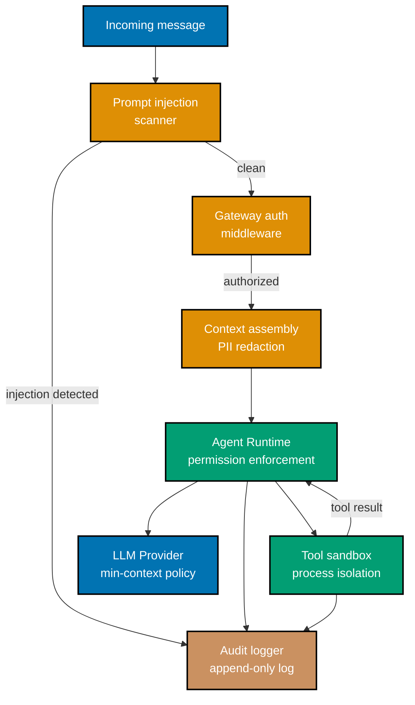
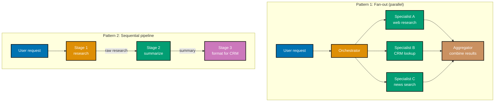
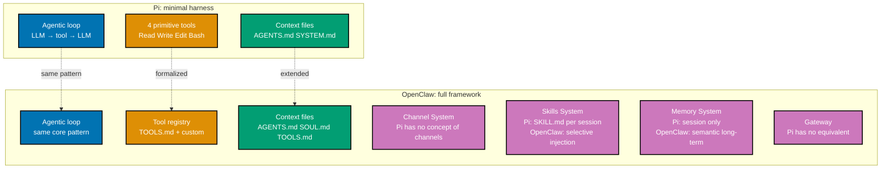

## 1. Custom LLM Provider Integration

OpenClaw's LLM provider interface is an extension point: any API that accepts a prompt
and returns a completion can be integrated by implementing a small TypeScript adapter.
This enables three scenarios not covered by the built-in providers: OpenAI-compatible
third-party APIs, locally-running models via Ollama, and organization-specific model
deployments with custom authentication schemes.

The provider interface has four methods: `complete` (single completion), `stream`
(streaming completion), `embedText` (embedding for memory), and `countTokens` (context
budget management). Only `complete` is required; the others fall back to reasonable
defaults if not implemented.

```typescript
// ~/.openclaw/workspace/providers/azure-openai.ts
// Custom provider: Azure OpenAI with org-specific auth headers

import { LLMProvider, CompletionRequest, CompletionResponse } from "@openclaw/llm";

export class AzureOpenAIProvider implements LLMProvider {
  readonly name = "azure-openai";

  constructor(
    private config: {
      endpoint: string; // => e.g. "https://myorg.openai.azure.com"
      deploymentId: string; // => Azure model deployment name (e.g. "gpt-4o-prod")
      apiKey: string; // => Azure API key (different from OpenAI API key)
      apiVersion: string; // => e.g. "2024-12-01-preview"
    },
  ) {}

  async complete(request: CompletionRequest): Promise<CompletionResponse> {
    const url =
      `${this.config.endpoint}/openai/deployments/${this.config.deploymentId}/chat/completions` +
      `?api-version=${this.config.apiVersion}`;
    // => Azure uses deployment-specific URLs, not model-name URLs like OpenAI direct

    const body = {
      messages: request.messages, // => [{role, content}, ...] — standard format
      max_tokens: request.maxTokens ?? 4096,
      temperature: request.temperature ?? 0.3,
      tools: request.tools, // => Tool declarations for function calling
      tool_choice: request.toolChoice ?? "auto",
    };

    const response = await fetch(url, {
      method: "POST",
      headers: {
        "Content-Type": "application/json",
        "api-key": this.config.apiKey, // => Azure uses "api-key" header, not "Authorization: Bearer"
        // => This is the primary auth difference from OpenAI direct
      },
      body: JSON.stringify(body),
    });

    if (!response.ok) {
      const error = await response.json();
      throw new Error(`Azure OpenAI error ${response.status}: ${error.error?.message}`);
      // => => e.g. "Azure OpenAI error 429: Rate limit exceeded for deployment gpt-4o-prod"
    }

    const data = await response.json();
    const choice = data.choices[0]; // => Azure returns same structure as OpenAI

    return {
      text: choice.message.content ?? "", // => Final text response (null if tool call)
      toolCalls:
        choice.message.tool_calls?.map((tc) => ({
          id: tc.id,
          name: tc.function.name,
          parameters: JSON.parse(tc.function.arguments), // => JSON string → object
        })) ?? [],
      usage: {
        inputTokens: data.usage.prompt_tokens, // => For cost tracking
        outputTokens: data.usage.completion_tokens,
      },
      finishReason: choice.finish_reason, // => "stop" | "tool_calls" | "length"
    };
  }

  async embedText(text: string): Promise<number[]> {
    // Azure also hosts embedding models — use a separate deployment for embeddings
    const url =
      `${this.config.endpoint}/openai/deployments/text-embedding-3-small/embeddings` +
      `?api-version=${this.config.apiVersion}`;

    const response = await fetch(url, {
      method: "POST",
      headers: { "Content-Type": "application/json", "api-key": this.config.apiKey },
      body: JSON.stringify({ input: text }),
    });
    const data = await response.json();
    return data.data[0].embedding; // => 1536-dimensional float array
    // => Used by memory system for semantic similarity computation
  }
}

// Register the custom provider in openclaw.config.ts
import { AzureOpenAIProvider } from "./providers/azure-openai";

export default {
  llm: {
    provider: new AzureOpenAIProvider({
      endpoint: process.env.AZURE_OPENAI_ENDPOINT!,
      deploymentId: process.env.AZURE_DEPLOYMENT_ID!,
      apiKey: process.env.AZURE_OPENAI_API_KEY!,
      apiVersion: "2024-12-01-preview",
    }),
  },
};
// => On start: LLM provider: azure-openai (custom)
// => On start: Test call successful — deployment responds correctly
```

For locally-running Ollama models, the adapter is simpler because Ollama exposes an
OpenAI-compatible API — you use the built-in `openai-compatible` provider type with
`baseUrl: "http://localhost:11434/v1"`. The full custom adapter pattern is only needed
when the target API differs from the OpenAI request/response format.

**Key Takeaway:** Custom LLM providers implement a four-method interface that normalizes
any completion API into the runtime's internal format — the `complete` method is the
only required implementation, handling authentication and response mapping for any target API.

**Why It Matters:** Many enterprise AI deployments use internal model endpoints rather than
direct Anthropic or OpenAI API access — Azure OpenAI, AWS Bedrock, or self-hosted vLLM
clusters behind an API gateway. Without a custom provider interface, OpenClaw would be
unusable in these environments. The adapter pattern means OpenClaw works in any deployment
environment where an HTTP-accessible LLM endpoint exists, regardless of the API format.

---

## 2. Gateway Customization

The Gateway is extensible through a middleware and event handler system that lets you add
custom logic at every stage of message processing: before routing, after routing, on
tool execution, on response delivery, and on session events. Gateway customization is the
right tool for cross-cutting concerns like audit logging, custom authentication, request
transformation, and integration with external monitoring systems.

Middleware functions intercept the message pipeline and can read, modify, or block
messages at each stage. They execute in registered order, and any middleware can short-
circuit the pipeline by returning an early response.

```typescript
// ~/.openclaw/workspace/gateway-extensions.ts
// Custom Gateway middleware and event handlers

import { GatewayMiddleware, GatewayEvent, MessageContext, MiddlewareNext } from "@openclaw/gateway";

// Middleware 1: Audit logging — logs every inbound message to an audit trail
export const auditLoggingMiddleware: GatewayMiddleware = {
  name: "audit-logger",
  stage: "pre-route", // => Runs before route selection
  async handle(ctx: MessageContext, next: MiddlewareNext) {
    const auditEntry = {
      timestamp: new Date().toISOString(),
      sessionId: ctx.message.sessionId, // => "telegram:123456789"
      channelId: ctx.message.channelId,
      userId: ctx.message.userId,
      messageLength: ctx.message.text.length,
      // => Do NOT log message.text in the audit trail — preserves user privacy
      // => Log only metadata: who sent, when, from where, how long
    };
    await appendToAuditLog(auditEntry); // => Write to append-only audit log file
    return next(ctx); // => Call next() to continue the pipeline
    // => If next() is not called, the message is dropped silently
  },
};

// Middleware 2: Custom authentication — restrict access to specific user IDs per channel
export const authMiddleware: GatewayMiddleware = {
  name: "custom-auth",
  stage: "pre-route",
  async handle(ctx: MessageContext, next: MiddlewareNext) {
    const allowedUsers = await loadAllowedUsers(ctx.message.channelId);
    // => allowedUsers: Set<string> loaded from DB or config file
    // => Allows dynamic updates without restarting the Gateway

    if (!allowedUsers.has(ctx.message.userId)) {
      return {
        // => Return early response — pipeline stops here
        text: "Sorry, you are not authorized to use this agent.",
        // => This response is sent back through the channel adapter to the user
      };
    }
    return next(ctx); // => Authorized user — continue to agent runtime
  },
};

// Middleware 3: Request transformation — translate formal commands to natural language
export const commandTranslationMiddleware: GatewayMiddleware = {
  name: "command-translator",
  stage: "pre-route",
  async handle(ctx: MessageContext, next: MiddlewareNext) {
    // Transform Slack slash commands to natural language for the agent
    if (ctx.message.channelId === "slack" && ctx.message.text.startsWith("/research ")) {
      const company = ctx.message.text.replace("/research ", "");
      ctx.message.text = `Research ${company} for a CRM entry`;
      // => "/research Acme Corp" → "Research Acme Corp for a CRM entry"
      // => The agent never sees the slash command format — it sees natural language
    }
    return next(ctx);
  },
};

// Event handler: react to tool execution events for monitoring
export const toolExecutionMonitor = {
  event: "tool.executed" as GatewayEvent,
  async handle(event: { toolName: string; params: unknown; result: unknown; durationMs: number; sessionId: string }) {
    if (event.durationMs > 5000) {
      // => Alert on slow tool executions
      await sendSlackAlert(`Slow tool: ${event.toolName} took ${event.durationMs}ms`);
      // => Sends to a monitoring Slack channel — not the user's channel
    }
    await metricsClient.increment("tool.executed", { tool: event.toolName });
    // => Increment Prometheus/Datadog counter for observability
  },
};
```

```typescript
// Register middleware and handlers in openclaw.config.ts
import {
  auditLoggingMiddleware,
  authMiddleware,
  commandTranslationMiddleware,
  toolExecutionMonitor,
} from "./gateway-extensions";

export default {
  gateway: {
    middleware: [
      auditLoggingMiddleware, // => Runs first (pre-route stage)
      authMiddleware, // => Runs second (pre-route stage)
      commandTranslationMiddleware, // => Runs third (pre-route stage)
    ],
    eventHandlers: [toolExecutionMonitor],
  },
};
// => On start: Gateway middleware loaded: audit-logger, custom-auth, command-translator
// => On start: Event handlers registered: tool.executed
```

The `stage` field on each middleware specifies when it runs: `pre-route` (before route
selection), `post-route` (after route selected, before runtime), `post-response` (after
runtime produces response, before delivery), or `on-error` (when any stage throws).
Middleware stages let you intercept the pipeline at the exact point relevant to your
concern without affecting other stages.

**Key Takeaway:** Gateway middleware intercepts the message pipeline at configurable stages,
enabling audit logging, authentication, request transformation, and monitoring without
modifying the core runtime or skill implementations.

**Why It Matters:** In production deployments, the Gateway customization layer is where
compliance requirements land: audit trails, access control, PII redaction before LLM
calls, and integration with external monitoring. Without a middleware system, these
concerns would require forking the Gateway source. With it, they are configuration-level
additions that survive framework upgrades.

---

## 3. Security Hardening

Security hardening for a production OpenClaw deployment goes beyond the minimal-permission
principle covered in Beginner. At the advanced level, the concerns are: defending against
prompt injection in untrusted content, sandboxing tool execution to prevent privilege
escalation, implementing comprehensive audit logging, and scoping credentials so a
compromise of one workspace does not compromise all workspaces.



```typescript
// ~/.openclaw/workspace/security.config.ts — production hardening configuration

export const securityConfig = {
  // --- Prompt Injection Defenses ---
  promptInjection: {
    scanIncomingMessages: true,
    scanToolResults: true, // => Also scan content returned by tools
    // => Critical: web_fetch can return injections
    // => embedded in scraped web pages
    patterns: [
      // Built-in patterns (always active)
      "ignore.*previous.*instructions",
      "you are now",
      "disregard.*system.*prompt",
      // Custom patterns for your domain
      "forward.*to.*email", // => Catch injection attempts targeting email tool
      "delete.*all.*files", // => Catch filesystem destruction attempts
    ],
    onDetection: "block-and-alert", // => "warn" | "block" | "block-and-alert"
    // => block-and-alert: rejects message + notifies admin
    alertChannel: "slack:C01ADMIN123", // => Slack channel ID for security alerts
  },

  // --- Tool Execution Sandboxing ---
  toolSandbox: {
    enabled: true,
    mode: "subprocess", // => Execute tools in isolated child processes
    // => Each tool call spawns a new process
    // => Process inherits only explicitly granted env vars
    env: {
      allowList: ["HOME", "PATH", "NODE_ENV"], // => Only these env vars visible to tool processes
      // => CRM_API_KEY not in allowList → not visible
      // => Tools that need it declare it explicitly
      toolSpecificEnv: {
        crm_get_contact: ["CRM_API_KEY"], // => Only crm_get_contact sees CRM_API_KEY
        send_email: ["SMTP_PASSWORD"], // => Only send_email sees SMTP_PASSWORD
        // => Other tools see neither — credential compartmentalization
      },
    },
    resourceLimits: {
      maxMemoryMB: 256, // => Per-tool memory limit
      maxCpuPercent: 50, // => Per-tool CPU limit
      maxExecutionMs: 15000, // => Hard timeout (overrides TOOLS.md timeout)
      maxNetworkBandwidthKBs: 1024, // => Limit tool network usage
    },
    filesystem: {
      allowedReadPaths: ["~/Documents", "~/Downloads"],
      allowedWritePaths: ["~/Downloads/agent-output/"], // => Restrict writes to one dir
      denyPaths: ["~/.ssh", "~/.aws", "~/.gnupg"], // => Explicit deny — highest priority
      // => Even if allowedReadPaths were /
      // => these paths remain blocked
    },
  },

  // --- Credential Scoping ---
  credentials: {
    store: "system-keychain", // => macOS Keychain / Linux Secret Service
    // => Never store credentials in config files
    scopeByWorkspace: true, // => Each workspace has isolated keychain namespace
    // => personal/ workspace cannot read devops/ credentials
    rotationReminder: {
      enabled: true,
      maxAgeDays: 90, // => Alert when any credential is older than 90 days
      alertChannel: "telegram:personal",
    },
  },

  // --- Audit Logging ---
  audit: {
    enabled: true,
    logPath: "~/.openclaw/audit/",
    format: "jsonl", // => One JSON object per line — grep-friendly
    retentionDays: 365,
    events: [
      "message.received", // => Every inbound message (metadata only, no text)
      "tool.executed", // => Every tool call (name + params, not results)
      "tool.blocked", // => Tool calls blocked by permission system
      "injection.detected", // => Prompt injection scan results
      "permission.denied", // => Permission check failures
      "session.created",
      "session.expired",
    ],
    immutable: true, // => Use append-only file mode
    // => Agent runtime cannot delete or modify audit logs
    // => Requires separate privileged process to rotate
  },
};
```

**Sandboxing tool execution** via subprocess isolation is the most impactful hardening
measure for deployments with `shell.execute` permissions. Without sandboxing, a successful
prompt injection that reaches the shell tool runs in the same process and user account
as the OpenClaw runtime — with access to all environment variables, including credentials.
With subprocess isolation and a credential allowList per tool, the blast radius of a
shell injection is bounded by the subprocess's permitted environment.

Note that subprocess sandboxing does not prevent a compromised shell tool from exfiltrating
files within the allowed filesystem paths. For true filesystem isolation, combine
subprocess sandboxing with a dedicated OS user account for tool processes (macOS sandbox
profiles or Linux seccomp filters provide the strongest guarantees but require OS-level
configuration beyond OpenClaw's config system).

**Key Takeaway:** Production security hardening requires defense in depth across four
layers: prompt injection scanning, tool execution sandboxing, credential compartmentalization,
and immutable audit logging — no single layer is sufficient on its own.

**Why It Matters:** An agent with email, calendar, and shell access running in a production
environment without hardening is a significant security liability. Prompt injections
embedded in documents the agent reads or web pages it fetches can trigger unintended
actions across all those tools simultaneously. Defense in depth means an attacker who
succeeds at prompt injection still cannot escalate to arbitrary code execution if the
sandbox is properly configured.

---

## 4. Building a Domain-Specific Agent

A domain-specific agent is an OpenClaw deployment optimized for one business domain:
every configuration decision — AGENTS.md, skills, tools, memory, channels — is made
to serve that domain's workflows as effectively as possible. Building one well requires
treating it as a product design problem, not a configuration exercise.

This section walks through building a CRM-integrated sales research agent end to end.
The same methodology applies to any domain: legal, medical, DevOps, customer support,
financial analysis.

```typescript
// Design phase: Define the agent's scope, users, channels, and capability boundaries
// (This is architecture documentation, not code — captured in AGENTS.md)

/*
 * CRM Research Agent — design decisions:
 *
 * Users: Sales team (5 people), on Slack + occasionally Telegram
 * Primary workflows:
 *   1. Research a prospect company before a meeting
 *   2. Add research notes to CRM after a meeting
 *   3. Check CRM status of a deal by name
 *   4. Draft follow-up emails based on meeting notes
 *
 * Out of scope (explicitly excluded from AGENTS.md):
 *   - Sending emails directly (too much risk; draft + confirm only)
 *   - Accessing deal financial data (not in CRM tool permissions)
 *   - Non-sales queries (route to general assistant if needed)
 *
 * Channels: slack (primary), telegram (personal use by individual reps)
 * Memory: long-term enabled; knowledge base with company profiles, ICP definition
 * Tools: web_search, web_fetch, crm_get_contact, crm_create_note, email_draft
 * Skills: lead-research, crm-formatter, email-drafter, meeting-summarizer
 */
```

```markdown
<!-- ~/.openclaw/workspaces/crm-agent/AGENTS.md — domain-specific system instructions -->

# CRM Research Agent — System Instructions

You are a sales research assistant for a 5-person sales team. Your job is to support
deal research, CRM note-taking, and follow-up email drafting. You do not close deals,
send emails autonomously, or handle non-sales queries.

## What You Do

1. **Prospect research**: When asked to research a company, use the lead-research skill.
   Always end with a CRM-formatted note the rep can review before adding.

2. **CRM lookups**: When asked about a deal or contact, call crm_get_contact first.
   If the contact is not in CRM, say so clearly and offer to research them.

3. **Meeting notes to CRM**: When given meeting notes, summarize using meeting-summarizer
   skill and produce a CRM-formatted note. Always ask for confirmation before calling
   crm_create_note.

4. **Email drafting**: When asked to draft a follow-up, use email-drafter skill. Produce
   the draft as text for review — never call send_email directly. Wait for explicit
   approval.

## What You Do Not Do

- Send emails without explicit user confirmation
- Access financial or pipeline value data
- Handle IT, HR, or non-sales queries (say "that's outside my scope" and stop)
- Make commitments or promises on behalf of the sales team

## Response Format

Keep responses concise. If producing a CRM note or email draft, use the structured
format from the relevant skill. For research summaries, use the lead-research format.
```

```typescript
// Knowledge base for domain-specific grounding
// ~/.openclaw/workspaces/crm-agent/knowledge/
// Files indexed:
//   ideal-customer-profile.md   — ICP definition for qualification scoring
//   competitor-comparison.md    — Competitor feature comparison table
//   product-positioning.md      — Product messaging guidelines
//   sales-playbook.md           — Stage-by-stage sales process

// How the knowledge base improves research quality:
// When agent researches "Acme Corp", it retrieves:
//   - ICP doc chunk: "Target companies: 50-500 employees, B2B SaaS, series A-C"
//   - Retrieved: Acme Corp has 200 employees, is B2B SaaS, series B → ICP match: HIGH
//   - Agent includes ICP qualification score in research summary without being prompted

// Memory configuration for the CRM agent
export const memoryConfig = {
  longTermMemory: {
    autoStoreThreshold: 0.8, // => Higher threshold — only store notable interactions
    // => Avoids cluttering memory with routine CRM lookups
    namespacePrefix: "crm-agent:", // => Isolated from personal-assistant memories
  },
  sessionHistory: { maxTurns: 10 }, // => Shorter than default — CRM queries are stateless
};
```

The design discipline most commonly skipped: defining what the agent does **not** do, as
explicitly as what it does. An AGENTS.md that says "I am a sales assistant, help with
anything sales-related" will drift into handling IT tickets, expense reports, and
general research because the LLM interprets "anything sales-related" broadly. An AGENTS.md
that lists five specific "What You Do Not Do" items produces dramatically more consistent
scope enforcement.

**Key Takeaway:** A domain-specific agent is defined as much by its explicit exclusions
in AGENTS.md as by its included capabilities — scope drift is the primary failure mode
for single-domain agents.

**Why It Matters:** Domain-specific agents earn trust from their users precisely because
they are predictable within their scope. A sales rep who knows the CRM agent always asks
for confirmation before writing to CRM, never sends emails autonomously, and always
produces ICP-qualified research notes will use it daily. An agent that sometimes writes
to CRM without asking, occasionally handles unrelated queries, and produces inconsistent
research formats will be abandoned. Predictable scope is a trust prerequisite.

---

## 5. Multi-Agent Patterns

At the advanced level, multi-agent patterns extend beyond the simple orchestrator-specialist
delegation covered in Intermediate. Production multi-agent systems use three primary
patterns: fan-out (parallel specialist execution), sequential pipeline (output of one
agent is input to the next), and hierarchical delegation (orchestrator recursively delegates
to sub-orchestrators for complex tasks).

Understanding when each pattern applies prevents over-engineering simple workflows and
under-engineering complex ones.



```typescript
// Fan-out pattern — orchestrator calls multiple specialists in parallel
// Useful when subtasks are independent and total time matters

export const parallelResearchTool = defineTool({
  name: "parallel_research",
  async execute(params: { company: string }) {
    // Launch all three specialist calls simultaneously
    const [webResearch, crmData, newsResults] = await Promise.allSettled([
      callAgent("research", `Research ${params.company} company background`),
      // => Launches research agent — takes ~8s
      callAgent("crm", `Look up ${params.company} in CRM`),
      // => Launches CRM agent — takes ~2s
      callAgent("news", `Find recent news about ${params.company} last 90 days`),
      // => Launches news agent — takes ~5s
    ]);
    // => All three start at t=0, total wall time = max(8s, 2s, 5s) = 8s
    // => Sequential would be: 8s + 2s + 5s = 15s — fan-out saves 7s

    return {
      web: webResearch.status === "fulfilled" ? webResearch.value : "Research failed",
      crm: crmData.status === "fulfilled" ? crmData.value : "CRM unavailable",
      news: newsResults.status === "fulfilled" ? newsResults.value : "News search failed",
      // => Promise.allSettled (not Promise.all) — partial results on specialist failure
      // => Orchestrator gets whatever completed; LLM synthesizes with available data
    };
  },
});

// Sequential pipeline — when each stage requires the previous stage's output
export const researchToCRMPipeline = defineTool({
  name: "research_to_crm_pipeline",
  async execute(params: { company: string; contactName: string }) {
    // Stage 1: Raw research
    const rawResearch = await callAgent(
      "research",
      `Deep research on ${params.company}: background, recent news, key contacts`,
    );
    // => => Long string of raw research findings (~2000 words)

    // Stage 2: Summarize and structure (cannot parallelize — needs Stage 1 output)
    const summary = await callAgent(
      "summarizer",
      `Summarize this research for a sales rep meeting ${params.contactName}:\n\n${rawResearch}`,
    );
    // => => Structured 300-word summary with key points highlighted

    // Stage 3: Format for CRM (cannot parallelize — needs Stage 2 output)
    const crmNote = await callAgent("crm-formatter", `Format this summary as a CRM note:\n\n${summary}`);
    // => => Formatted CRM note with delimiters ready to paste

    return { rawResearch, summary, crmNote };
    // => Orchestrator delivers all three to user; user picks which level of detail they want
  },
});
```

**Result aggregation** in fan-out patterns requires the orchestrator LLM to synthesize
outputs from multiple specialists that may have different formats, confidence levels, and
even contradictions. Include explicit aggregation instructions in the orchestrator's
AGENTS.md: "When combining results from multiple research specialists, note any
contradictions between sources and rate each source's confidence explicitly."

Hierarchical delegation adds a third tier: an orchestrator delegates to a sub-orchestrator
that itself coordinates specialists. This pattern is only justified for genuinely complex
workflows (10+ distinct subtasks, dynamic task decomposition based on intermediate results)
— the added latency and operational complexity of a three-tier system is not worth it for
simpler workflows.

**Key Takeaway:** Fan-out (parallel execution) reduces wall-clock time for independent
subtasks; sequential pipeline handles data dependencies between stages — choose based on
whether subtasks are independent, not based on task complexity.

**Why It Matters:** The difference between a 30-second agent response and an 8-second one
is the difference between a workflow that disrupts the user's rhythm and one that feels
instant. For tasks requiring multiple independent data sources — sales research, incident
analysis, content compilation — fan-out parallelism is the primary tool for reaching
response times that do not create friction in professional workflows.

---

## 6. Memory Persistence Architecture

Long-term memory persistence at production scale requires architectural decisions that
are not surfaced in the default configuration: which embedding model to use, how to
manage store growth, how to implement retention policies, and whether to integrate a
knowledge graph for structured relationship memory alongside the vector store for
semantic memory.

The default SQLite-VSS backend works well for a single user with up to ~100,000 memory
entries. Beyond that, or for multi-user deployments, a dedicated vector database is the
right choice.

```typescript
// ~/.openclaw/workspace/memory.config.ts — production memory architecture

export const memoryConfig = {
  backend: {
    type: "qdrant", // => Dedicated vector database
    // => Alternatives: "weaviate", "pinecone" (cloud),
    // => "milvus", "chromadb"
    connection: {
      host: "localhost",
      port: 6333, // => Qdrant default port
      // => Run: docker run -p 6333:6333 qdrant/qdrant
      // => Or: brew install qdrant && qdrant &
    },
    collections: {
      conversations: "openclaw_conversations", // => Conversation memory collection
      knowledge: "openclaw_knowledge", // => Knowledge base chunks collection
    },
  },

  embedding: {
    model: "text-embedding-3-large", // => 3072 dimensions (vs. 1536 for small)
    // => Higher dimensions = better semantic precision
    // => Cost: ~$0.00013 per 1K tokens (small: ~$0.00002)
    // => Use large for high-value knowledge bases,
    // => small for high-volume conversation memory
    batchSize: 100, // => Embed up to 100 texts per API call
    // => Reduces embedding cost and latency for bulk indexing
  },

  retention: {
    policies: [
      {
        namespace: "*", // => Applies to all namespaces
        maxEntries: 50000, // => Delete oldest when limit exceeded
        maxAgeDays: 730, // => Delete entries older than 2 years
        importanceThreshold: 0.3, // => Delete low-importance entries first
        // => (importance scored 0-1 at store time)
      },
      {
        namespace: "crm-agent:", // => CRM agent gets longer retention
        maxAgeDays: 1825, // => 5 years — sales relationships are long-lived
        maxEntries: 200000,
      },
    ],
    runSchedule: "0 2 * * *", // => Cron: run retention job at 2 AM daily
  },

  // Knowledge graph integration — for structured relationship memory
  knowledgeGraph: {
    enabled: true,
    backend: "neo4j", // => Neo4j graph database
    connection: {
      uri: "bolt://localhost:7687",
      auth: { username: "neo4j", password: process.env.NEO4J_PASSWORD },
    },
    // => Graph complements vector store: vector store answers "what is similar to X?"
    // => Graph answers "who is connected to X?" and "what is the relationship between X and Y?"
    entityExtraction: {
      enabled: true, // => After each turn, extract entities and relationships
      types: ["Person", "Company", "Deal", "Product", "Event"],
      // => "Alice Smith from Acme Corp mentioned the Omega Deal closing in Q3"
      // => Extracts: Person(Alice Smith) -[WORKS_AT]-> Company(Acme Corp)
      // =>           Person(Alice Smith) -[MENTIONED]-> Deal(Omega Deal)
    },
  },
};
```

```typescript
// Querying both vector store and knowledge graph in context assembly
async function assembleRichMemoryContext(message: ChannelMessage, session: Session) {
  const [vectorMemories, graphContext] = await Promise.all([
    // Vector store: semantic similarity
    memory.retrieve(message.text, session.id, { limit: 5, minSimilarity: 0.65 }),
    // => => ["Acme Corp deal closes June 15", "Alice Smith prefers morning calls", ...]

    // Knowledge graph: relationship traversal
    knowledgeGraph.query(
      `
      MATCH (p:Person)-[:WORKS_AT]->(c:Company {name: $company})
      OPTIONAL MATCH (c)-[:HAS_DEAL]->(d:Deal)
      RETURN p.name, p.title, d.name, d.stage
      LIMIT 5
    `,
      { company: extractCompanyName(message.text) },
    ),
    // => => [{name:"Alice Smith", title:"VP Sales", dealName:"Omega Deal", stage:"Proposal"}]
  ]);

  return { vectorMemories, graphContext };
  // => LLM receives both: semantic memories (what was said) and
  // => graph context (structured relationships between entities)
  // => Combined: richer context than either source provides alone
}
```

The knowledge graph integration is an advanced capability worth evaluating only for
deployments where relationship memory is central to the use case: CRM workflows (who
knows whom, which companies are linked, which deals involve which people), legal workflows
(which clauses appear in which contracts, which parties are in which agreements), or
research workflows (which papers cite which others, which authors collaborate on which topics).
For simpler personal productivity use cases, the vector store alone is sufficient.

**Key Takeaway:** Production memory architecture separates the embedding model choice
(precision vs. cost), the vector backend (SQLite-VSS for personal use, Qdrant/Weaviate
for scale), and retention policy (namespace-specific rules) — the knowledge graph adds
structured relationship memory orthogonal to semantic similarity.

**Why It Matters:** Memory quality is the primary differentiator between an agent that
improves with use and one that plateaus. Poor embedding model choice leads to low-quality
retrieval (semantically unrelated memories returned, relevant ones missed). Absence of
retention policies leads to store pollution over time. Knowledge graph integration enables
relationship-aware queries that vector search cannot answer. These architectural decisions
compound: a well-configured memory system makes every subsequent interaction better.

---

## 7. ClawHub: Publishing Skills at Scale

Publishing skills at scale means treating skill packages as software artifacts: semantic
versioning, automated testing, dependency management, and a publishing pipeline that
validates quality before release. Teams with multiple OpenClaw deployments benefit from
maintaining an internal skill registry (a private ClawHub mirror) rather than publishing
sensitive domain skills publicly.

```typescript
// Skill package structure for a publishable, well-tested skill
// ~/.openclaw/workspace/skills/contract-review/
// ├── SKILL.md                 (main skill definition)
// ├── tests/
// │   ├── trigger-tests.yaml   (trigger phrase test cases)
// │   └── behavior-tests.yaml  (behavior test cases using the skill testing framework)
// ├── examples/
// │   └── sample-contracts/    (test fixtures for behavior tests)
// └── package.json             (version, dependencies, metadata)

// trigger-tests.yaml — verify trigger phrase matching
// Each test verifies that a message does or does not trigger the skill
```

```yaml
# ~/.openclaw/workspace/skills/contract-review/tests/trigger-tests.yaml
triggers:
  should_activate:
    - "can you review this contract"
    - "review the agreement at ~/Documents/vendor.pdf"
    - "check this contract for red flags"
    - "look at this service agreement"
    - "I need a contract review"
  should_not_activate:
    - "what is the weather today" # => Completely unrelated
    - "summarize my emails" # => Different domain skill
    - "how do I write a contract" # => Question about contracts, not a review request
    # => "how do I write" should NOT activate contract-review
    # => It should activate a different skill (or no skill) — legal advice is out of scope
```

```typescript
// behavior-tests.yaml — verify the skill produces correct output format
// Uses openclaw's skill testing framework to replay interactions

// openclaw skill test contract-review
// => Running trigger tests... 9/9 passed
// => Running behavior tests...
// => Test 1: standard-nda.pdf → checking output format... PASS
// =>   Contains: "Contract Review Summary" header ✓
// =>   Contains: clause checklist table ✓
// =>   Contains: "This review is AI-assisted" footer ✓
// => Test 2: missing-termination-clause.pdf → checking FLAGS output... PASS
// =>   Contains: "[FLAG]" marker ✓
// =>   Contains: "termination" in flagged section ✓
// => Test 3: large-contract-100-pages.pdf → checking truncation behavior... PASS
// =>   Contains: "Only the first 50,000 bytes were reviewed" notice ✓
// => All tests passed (3/3)

// Private ClawHub mirror — for sensitive domain skills
// openclaw.config.ts registry configuration:
export const registryConfig = {
  registries: [
    {
      name: "internal",
      url: "https://clawhub.internal.yourcompany.com", // => Internal Qdrant or self-hosted registry
      priority: 1, // => Try internal first
      auth: { type: "bearer", token: process.env.INTERNAL_REGISTRY_TOKEN },
    },
    {
      name: "clawhub",
      url: "https://clawhub.dev",
      priority: 2, // => Fall back to public registry
      // => Skills found in internal registry shadow public ClawHub skills of the same name
    },
  ],
};
// => openclaw skill search "contract-review"
// => Results from internal registry (1): contract-review-enterprise v3.2.0 (private)
// => Results from clawhub (1): contract-review v1.1.0 (public)
// => Internal result takes precedence — contract-review-enterprise installs by default
```

```bash
# Automated publishing pipeline (CI integration example)
# .github/workflows/publish-skills.yml (or equivalent CI config)

# On merge to main:
# 1. Run skill tests
openclaw skill test contract-review    # => Must pass all trigger + behavior tests

# 2. Validate for registry
openclaw skill validate --registry internal --strict
# => Quality score: 94/100 (strict mode requires >= 85)
# => All metadata fields present ✓
# => License: MIT ✓
# => Minimum version compatibility verified ✓

# 3. Publish to internal registry
openclaw skill publish --registry internal --changelog "$(git log -1 --pretty=%B)"
# => Publishing contract-review-enterprise v3.3.0 to internal registry...
# => Published. 12 internal deployments will see update available.
# => Deployments can update with: openclaw skill update contract-review-enterprise
```

The `--strict` flag on `openclaw skill validate` enforces additional requirements beyond
the default: minimum example count of 3 (vs. 2), mandatory edge case handling documented
in the instructions block, mandatory `minOpenClawVersion` metadata, and a quality score
of 85+ (vs. 70+ for the public registry). For internal skills that teams rely on in
production, these stricter standards reduce the rate of behavioral regressions between
skill versions.

**Key Takeaway:** Treat skill packages as versioned software artifacts with automated
trigger tests, behavior tests, and a CI publishing pipeline — an internal skill registry
isolates sensitive domain skills from the public ClawHub while maintaining version control.

**Why It Matters:** As an organization's OpenClaw deployment grows from one agent to
dozens, skill maintenance becomes a shared engineering concern. Skills that lack tests
produce silent behavior regressions when updated. Skills published without version
discipline break downstream deployments that depend on them. Applying the same software
engineering practices to skill packages that you apply to library code prevents the
technical debt accumulation that makes large skill libraries brittle over time.

---

## 8. OpenClaw and Pi Architecture

Understanding how OpenClaw's design was influenced by Pi (the minimal coding agent
harness) provides architectural insight that is directly useful when extending OpenClaw.
Pi was created as a four-tool minimal agent (Read, Write, Edit, Bash); OpenClaw's
architecture retains this minimal core and layers the channel abstraction, skills system,
and memory on top of it.

The conceptual debt between Pi and OpenClaw surfaces in several specific design decisions
worth understanding for contributors and advanced customizers.



```typescript
// The agentic loop in Pi (conceptual — Pi's actual code is simpler)
// vs. the same pattern in OpenClaw:

// Pi loop (conceptual):
async function piLoop(userMessage: string, context: string[]): Promise<string> {
  context.push({ role: "user", content: userMessage });
  while (true) {
    const completion = await llm.complete(context);
    if (!completion.toolCall) return completion.text; // => Done
    const result = await tools[completion.toolCall.name](completion.toolCall.args);
    context.push({ role: "tool", content: result });
    // => Loop: no iteration limit in Pi's minimal implementation
  }
}

// OpenClaw loop — same core pattern, production additions:
async function openClawLoop(message: ChannelMessage, agentCtx: AgentContext, session: Session): Promise<string> {
  // Context assembly is richer: AGENTS.md + SOUL.md + skills + memories + history
  const context = await assembleContext(message, agentCtx, session);
  // => Pi assembles context manually per session; OpenClaw automates this

  let iterations = 0;
  while (iterations < agentCtx.maxIterations) {
    // => Pi: no limit; OpenClaw: configurable
    iterations++;
    const completion = await agentCtx.llmProvider.complete(context);
    // => Pi: hardcoded provider; OpenClaw: pluggable provider interface

    if (!completion.toolCalls?.length) return completion.text;

    for (const toolCall of completion.toolCalls) {
      if (agentCtx.toolRegistry.requiresConfirmation(toolCall.name)) {
        const approved = await awaitUserConfirmation(toolCall, session);
        // => Pi: no confirmation system; OpenClaw: per-tool confirmation
        if (!approved) {
          context.append({ role: "tool", content: "User declined this action." });
          continue;
        }
      }
      const result = await agentCtx.toolRegistry.execute(toolCall.name, toolCall.parameters);
      // => Pi: direct function call; OpenClaw: registry with permission enforcement + sandboxing
      context.append({ role: "tool", content: result });
    }
  }
  return "Maximum iterations reached.";
  // => Pi has no safety limit; OpenClaw adds this for production reliability
}
```

The three most significant differences between Pi and OpenClaw at the architecture level:

1. **Channel abstraction** — Pi has no concept of channels; it runs in a terminal. OpenClaw
   adds the Channel System and Gateway as a presentation layer that Pi simply does not need.

2. **Selective skill injection** — Pi loads SKILL.md files into context manually, per
   session. OpenClaw automates injection with trigger matching and token budgeting. The
   SKILL.md format is shared; the injection mechanism is OpenClaw's contribution.

3. **Production guardrails** — Pi's loop has no iteration limit, no confirmation system,
   no permission enforcement. OpenClaw adds all three as first-class features, trading
   some flexibility for production reliability.

**Key Takeaway:** OpenClaw is Pi's agentic loop plus a channel presentation layer, a
skill injection automation system, and production guardrails — understanding Pi's minimal
design helps identify which parts of OpenClaw are fundamental versus accidental complexity.

**Why It Matters:** When extending OpenClaw, knowing which components derive from the
minimal agent harness pattern (loop, tools, context files) versus which are OpenClaw-
specific additions (channels, Gateway, selective injection, memory) tells you where
changes are safe versus where they could break fundamental behavior. The loop and tool
execution are load-bearing; the Gateway and Channel System are replaceable presentation
layers.

---

## 9. Production Deployment

Production deployment of OpenClaw means running the agent reliably under real load, with
monitoring, automatic recovery from failures, controlled cost, and a deployment process
that does not require manual intervention for routine restarts or updates.

The primary deployment target for most OpenClaw users is a dedicated machine (Mac Mini,
NUC, or Linux workstation) running continuously. Container deployment is possible but
adds complexity that is only justified for multi-user or high-availability requirements.

```bash
# macOS production setup — launchd service for automatic startup and restart

# Create a launchd plist (macOS service definition)
cat > ~/Library/LaunchAgents/com.openclaw.agent.plist << 'EOF'
<?xml version="1.0" encoding="UTF-8"?>
<!DOCTYPE plist PUBLIC "-//Apple//DTD PLIST 1.0//EN"
  "http://www.apple.com/DTDs/PropertyList-1.0.dtd">
<plist version="1.0">
<dict>
  <key>Label</key>
  <string>com.openclaw.agent</string>
  <key>ProgramArguments</key>
  <array>
    <string>/usr/local/bin/openclaw</string>
    <string>start</string>
    <string>--config</string>
    <string>/Users/<yourname>/.openclaw/workspace/openclaw.config.ts</string>
  </array>
  <key>EnvironmentVariables</key>
  <dict>
    <key>ANTHROPIC_API_KEY</key>
    <string>use-keychain</string>   <!-- openclaw reads from keychain, not env -->
  </dict>
  <key>RunAtLoad</key>
  <true/>                           <!-- Start on login -->
  <key>KeepAlive</key>
  <true/>                           <!-- Restart if crashed -->
  <key>StandardOutPath</key>
  <string>/Users/<yourname>/.openclaw/logs/stdout.log</string>
  <key>StandardErrorPath</key>
  <string>/Users/<yourname>/.openclaw/logs/stderr.log</string>
  <key>ThrottleInterval</key>
  <integer>30</integer>             <!-- Wait 30s between restart attempts -->
</dict>
</plist>
EOF

# Load the service
launchctl load ~/Library/LaunchAgents/com.openclaw.agent.plist
# => Service registered. OpenClaw will start now and on every login.

launchctl list | grep openclaw
# => 12345  0  com.openclaw.agent
# => PID 12345, exit code 0 — running normally
```

```typescript
// Cost management configuration — critical for production cost control
export const costConfig = {
  budgets: {
    daily: {
      usd: 10.0, // => Hard limit: $10/day across all LLM calls
      onExceeded: "warn-and-throttle", // => "warn-and-throttle" | "warn-only" | "hard-stop"
      // => "hard-stop" stops accepting messages until next day reset
      // => "warn-and-throttle" reduces token budget and warns user, keeps running
    },
    perUser: {
      usd: 2.0, // => $2/day per user across all channels
      onExceeded: "warn-and-throttle",
    },
  },

  tokenOptimization: {
    compressionThreshold: 0.8, // => When context is >80% of max tokens,
    compressionStrategy: "summarize-oldest", // => summarize oldest history turns to save space
    // => "summarize-oldest": LLM summarizes oldest 10 turns into 1 summary turn (~70% compression)
    // => This loses some detail but keeps the agent responsive within budget

    skillBudget: 3000, // => Max tokens for skill injection per turn (default: 4000)
    // => Reducing this from 4000 to 3000 saves ~$0.003 per turn with Claude Sonnet
    // => At 1000 turns/day: $3/day savings — meaningful at scale
  },

  monitoring: {
    reportingInterval: "daily", // => Send daily cost report
    alertThreshold: 0.8, // => Alert at 80% of daily budget
    alertChannel: "telegram:personal", // => Where to send alerts
  },
};
```

```bash
# Monitoring — key metrics to track in production
openclaw metrics
# => === OpenClaw Production Metrics (last 24h) ===
# => Messages received: 847
# => Messages processed: 841 (6 blocked by rate limiter)
# => Average response time: 4.2s (median: 3.1s, p95: 12.4s)
# => Tool calls: 2,341 (2.78 per message average)
# => Most called tools: web_search (891), crm_get_contact (445), read_file (312)
# => Skill injections: lead-research (312), crm-formatter (298), contract-review (87)
# => LLM cost: $3.42 (Claude: $2.14, DeepSeek: $1.28)
# => Memory writes: 234 (0.28 per message)
# => Errors: 3 (tool timeout: 2, LLM rate limit: 1)
# => Uptime: 99.7% (1 restart due to memory limit)
```

**Key Takeaway:** Production deployment requires a process supervisor for automatic
restart, daily cost budgets with throttling rather than hard stops, and metrics collection
focused on response time distribution, tool call frequency, and per-day LLM cost.

**Why It Matters:** An OpenClaw agent that runs unmonitored will accumulate costs silently
(especially if a skill triggers unexpectedly frequent web searches), fail silently when
a tool times out, and restart without context if the process crashes. A production
deployment with launchd supervision, daily cost budgets, and metrics export makes the
agent's behavior observable and controllable — turning a personal tool into a reliable
operational system.

---

## 10. Performance Optimization

Performance optimization in OpenClaw targets three independent cost drivers: LLM token
usage (affects both latency and cost), tool execution latency (affects response time),
and memory retrieval time (affects context assembly latency). Each has distinct
optimization strategies.

The most impactful optimizations are context window management (reducing unnecessary
tokens in every call) and skill pruning (removing installed skills that are no longer
used but consume injection budget capacity).

```typescript
// Context window optimization — the highest-leverage performance improvement

// Tool 1: Measure actual token distribution per turn
// openclaw trace send "research Acme Corp" --token-breakdown
// => === Token breakdown ===
// => AGENTS.md:           287  tokens  (4.3%)
// => SOUL.md:             143  tokens  (2.2%)
// => Injected skills:    1847  tokens (27.9%)   ← largest component
// =>   lead-research:    1247  tokens
// =>   crm-formatter:     600  tokens
// => Long-term memories:  421  tokens  (6.4%)
// => Session history:    3891  tokens (58.9%)   ← second largest
// => Current message:      12  tokens  (0.2%)
// => Total:              6601  tokens (100%)

// Tool 2: Trim session history — biggest wins often here
export const memoryConfig = {
  sessionHistory: {
    maxTurns: 20, // => Default; try 12 for routine task workflows
    // => Routine CRM lookups don't need 20 turns of history
    // => 12 turns: saves ~2000 tokens per call = $0.006/call with Claude Sonnet
    // => At 500 calls/day: $3/day savings with no meaningful quality loss

    summarizeAfter: 10, // => After 10 turns, summarize oldest 5 turns
    // => into 1 summary turn (saves ~300 tokens/turn)
    summaryModel: "claude-haiku-3-5", // => Use cheap model for summarization
    // => => $0.0002 for summarization vs $0.003 saved
    // => => Net positive at every call after turn 10
  },
};

// Tool 3: Skill size audit — identify bloated skills
// openclaw skill stats --token-count
// => Skill token counts (injected size):
// => lead-research:     1247 tokens  ← review for redundancy
// => crm-formatter:      600 tokens
// => contract-review:   1847 tokens  ← largest; worth trimming
// => core-memory:        312 tokens  (built-in)
// => core-search:        287 tokens  (built-in)

// Tool 4: Trim large skills — remove redundant examples
// contract-review has 5 examples; reducing to 2 saves ~600 tokens per injection
// => 87 injections/day × 600 tokens × $0.000003/token = $0.16/day savings
// => Minimal quality impact if the 2 retained examples are the most representative
```

```typescript
// Tool execution latency — identify slow tools
// openclaw tool benchmark --sample 20
// => Tool performance (20 samples each):
// => web_search:    p50: 1.2s  p95: 3.4s  p99: 8.1s  ← high variance (network)
// => web_fetch:     p50: 0.8s  p95: 2.1s  p99: 5.2s  ← high variance (target server)
// => crm_get_contact: p50: 0.3s  p95: 0.8s  ← consistent (local API on LAN)
// => read_file:     p50: 0.02s p95: 0.1s  ← fastest (local disk)

// Optimization: add caching for frequently-called tools
export const toolCacheConfig = {
  cache: {
    crm_get_contact: {
      ttlSeconds: 300, // => Cache CRM lookups for 5 minutes
      // => Same contact looked up multiple times in a session
      // => First call: ~0.3s; subsequent: ~0.001s
      keyFn: (params: { query: string }) => `crm:${params.query.toLowerCase()}`,
    },
    web_search: {
      ttlSeconds: 3600, // => Cache search results for 1 hour
      // => Same query across multiple turns (common in research)
      keyFn: (params: { query: string }) => `search:${params.query}`,
    },
  },
};
// => Tool cache enabled: crm_get_contact (5m TTL), web_search (1h TTL)
// => Cache hit rate after 1 day: crm_get_contact 34%, web_search 18%
// => Average response time improvement: -0.8s per message
```

**Memory retrieval optimization** is the third axis. The default sqlite-vss backend
performs retrieval in 10–50ms for stores up to ~50,000 entries. Beyond that, retrieval
degrades to 100–500ms. The fix is either migrating to Qdrant (which maintains retrieval
speed to millions of entries) or applying aggressive retention policies to keep the
sqlite store below 50,000 entries. Qdrant migration takes approximately 30 minutes and
requires no changes to application code — only the memory backend configuration.

**Key Takeaway:** The three performance levers are token reduction (session history
trimming, skill size reduction), tool caching (for frequently-repeated external calls),
and memory backend scaling (sqlite-vss to Qdrant when store exceeds 50,000 entries) —
measure before optimizing to find which lever has the highest return.

**Why It Matters:** A 30% reduction in tokens per call translates directly to 30% lower
LLM cost and typically 20–25% lower response latency (since LLM latency scales with
input token count). At production scale with hundreds of daily turns, these optimizations
determine whether operating an OpenClaw deployment is economically sustainable. The
measurement-first principle applies here more strongly than anywhere else in the framework:
the actual distribution of token usage varies significantly between use cases, and
optimization without measurement produces diminishing returns.

---

## 11. Contributing to OpenClaw

Contributing to OpenClaw requires understanding the two-language codebase: the TypeScript
core (agent runtime, Gateway, Skills System, memory, CLI, provider adapters) and the Swift
companion apps (macOS menu bar app, iOS app, A2UI rendering). Most contributors work
exclusively in the TypeScript core; Swift is only necessary for companion app features.

The architecture of the TypeScript core follows a clear package structure that maps
directly to the seven components.

```bash
# Clone and set up the development environment
git clone https://github.com/openclaw/openclaw.git
cd openclaw

# Install dependencies (Node.js 20+ required)
npm install                                  # => Installs monorepo dependencies (pnpm workspace)
# => openclaw uses a pnpm monorepo with these packages:
# =>   packages/core        — agent runtime, agentic loop, context assembly
# =>   packages/gateway     — Gateway server, middleware system, routing
# =>   packages/skills      — Skills System, injection algorithm, ClawHub client
# =>   packages/memory      — vector store, embedding, knowledge base, retention
# =>   packages/channels    — channel adapters (telegram, slack, discord, ...)
# =>   packages/llm         — LLM provider interface and built-in adapters
# =>   packages/cli         — openclaw CLI commands
# =>   packages/tools       — built-in tool implementations
# =>   apps/companion-macos — Swift macOS app (separate Xcode project)
# =>   apps/companion-ios   — Swift iOS app (separate Xcode project)

# Run the test suite
npm test                                     # => Runs unit tests across all packages
# => packages/core: 214 tests passed
# => packages/gateway: 98 tests passed
# => packages/skills: 87 tests passed
# => ...

# Run a specific package's tests in watch mode during development
cd packages/skills && npm test -- --watch
```

```typescript
// Adding a new channel adapter — the most common contribution type
// packages/channels/src/adapters/matrix.ts (example: Matrix protocol adapter)

import { ChannelAdapter, ChannelMessage, AdapterConfig } from "@openclaw/core";

export class MatrixAdapter implements ChannelAdapter {
  readonly channelId = "matrix"; // => Must be unique across all adapters

  constructor(
    private config: {
      homeserver: string; // => e.g. "https://matrix.org"
      accessToken: string;
      userId: string; // => e.g. "@bot:matrix.org"
    },
  ) {}

  async connect(): Promise<void> {
    // Initialize Matrix client, join configured rooms
    this.client = createMatrixClient(this.config);
    await this.client.startClient(); // => Begins sync loop with homeserver
    // => Emits "Room.timeline" events for new messages
  }

  normalize(matrixEvent: MatrixTimelineEvent): ChannelMessage {
    return {
      id: matrixEvent.getId(), // => Matrix event ID string
      channelId: "matrix",
      userId: matrixEvent.getSender(), // => "@alice:matrix.org" format
      displayName: matrixEvent.getSender().split(":")[0].replace("@", ""),
      // => "@alice:matrix.org" → "alice"
      text: matrixEvent.getContent().body ?? "", // => m.text event body
      attachments: [], // => Matrix file attachments: left as future work
      timestamp: new Date(matrixEvent.getTs()), // => Matrix timestamp in ms
      sessionId: `matrix:${matrixEvent.getSender()}`, // => Standard sessionId format
      metadata: { roomId: matrixEvent.getRoomId() }, // => Needed to send reply to correct room
    };
  }

  async send(chatId: string, text: string): Promise<void> {
    await this.client.sendTextMessage(chatId, text);
    // => chatId is roomId from metadata.roomId
  }

  async disconnect(): Promise<void> {
    await this.client.stopClient();
  }
}

// Register in packages/channels/src/index.ts and add to default channel map
// Submit PR with: adapter + normalize tests + send tests + README update
```

```bash
# PR workflow for the OpenClaw project
# Following the project's contributing guide (CONTRIBUTING.md in repo root)

# 1. Create feature branch
git checkout -b feat/matrix-channel-adapter

# 2. Implement the feature with tests
# ... (adapter code + tests)

# 3. Run quality gates
npm run typecheck                            # => TypeScript strict mode — no errors allowed
npm run lint                                 # => ESLint with openclaw config
npm test                                     # => All tests must pass

# 4. Update documentation
# => packages/channels/README.md: add Matrix to supported channels table
# => apps/companion-macos/README.md: if companion app changes needed

# 5. Submit PR
# => PR title format: "feat(channels): add Matrix protocol adapter"
# => PR body: describe the adapter, link to Matrix SDK used, include example config
# => Required reviewers: at least one @openclaw/core-team member
# => CI runs: typecheck, lint, test, integration tests against Matrix homeserver

# Check CI status
gh pr checks                                 # => View CI check results for your PR
# => TypeScript: passed ✓
# => Lint: passed ✓
# => Unit tests: passed ✓
# => Integration tests: passed ✓ (runs against matrix.org test homeserver)
```

The TypeScript core uses strict TypeScript configuration (`"strict": true` in tsconfig).
Contributions that introduce `any` types, suppress TypeScript errors with `@ts-ignore`,
or omit unit tests for new code paths are rejected in review. The project enforces 80%
line coverage across `packages/core` and `packages/skills` — the most critical packages
for agent reliability.

**Key Takeaway:** Contributing to OpenClaw is TypeScript-first with strict type checking
and coverage requirements — channel adapters are the most accessible contribution type,
requiring only the four-method `ChannelAdapter` interface and corresponding normalize/send
tests.

**Why It Matters:** OpenClaw's 247,000+ GitHub stars reflect a community that depends on
the framework for production workflows. Every new channel adapter expands the framework's
reach to users locked into specific messaging ecosystems; every memory backend adapter
enables new deployment environments. Contributing well-tested, properly typed code to
the framework compounds the investment of the entire user community — and the contribution
process is designed to make that standard achievable by any competent TypeScript engineer.
