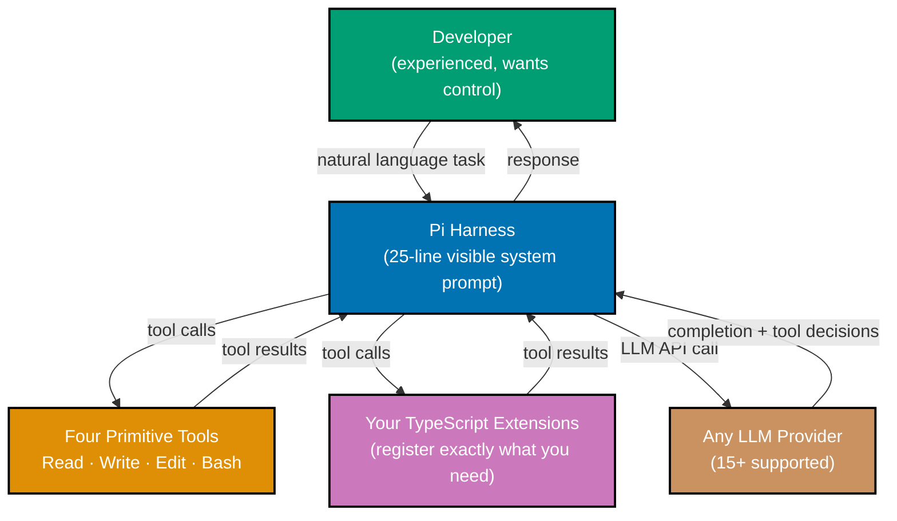
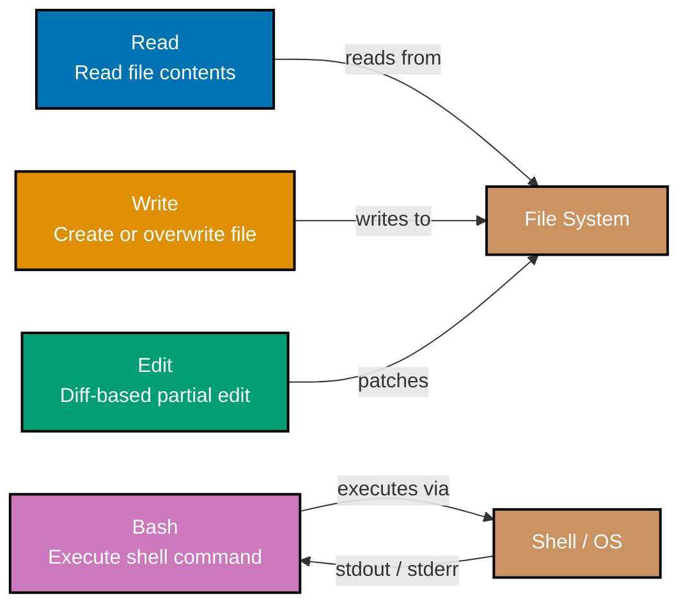
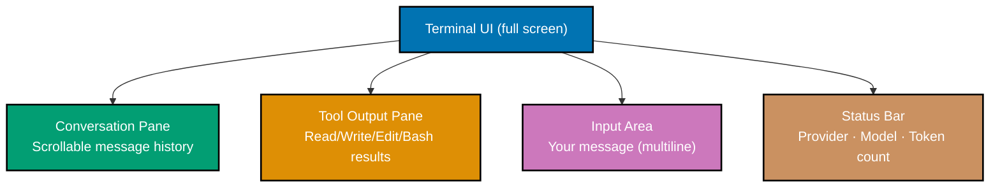
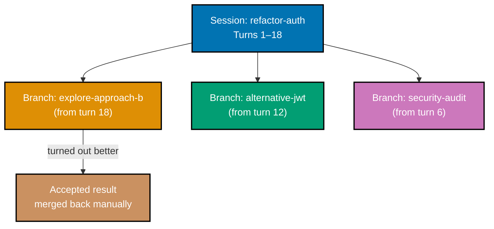
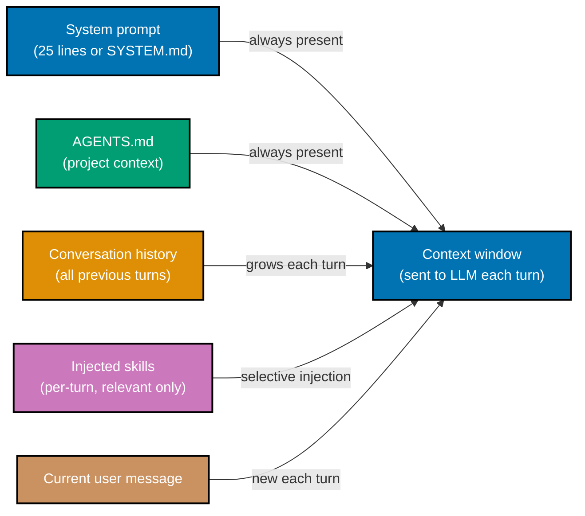

## Section 1: What is Pi?

Pi is a minimal, open-source, terminal-based AI coding agent harness built around the idea
that you should understand and control every part of the system running in your terminal.
Most coding agents ship with dozens of built-in capabilities, hidden system prompts, and
proprietary extension formats. Pi ships with four tools, a 25-line system prompt you can
read and replace, and a TypeScript extension API that lets you add exactly what you need.

Pi was created by Mario Zechner, the Austrian developer who built the libGDX game framework,
and is now maintained by Earendil Inc. The current version is v0.75.4. Pi is not a
programming language, not Raspberry Pi hardware, and not the Pi calculus formalism from
theoretical computer science — it is a TypeScript toolkit for running AI coding agents in
the terminal.

The target audience for Pi is experienced developers who find that existing coding agents do
too much implicitly, hide too much of their behavior, or lock them into a single LLM provider.
Pi gives you the agentic loop in its simplest possible form and trusts you to extend it.



Pi's design philosophy can be summarized as primitives, not features. Where other agents add
capabilities as built-in features you cannot remove or inspect, Pi exposes primitives that
compose into any capability you choose to build. This philosophy has a concrete practical
benefit: when the agent does something unexpected, you can always find the exact line of code
responsible.

**Key Takeaway:** Pi is a minimal agent harness — four tools, a transparent 25-line system
prompt, and a TypeScript extension API — designed for developers who want full visibility and
control over their AI coding assistant.

**Why It Matters:** In production environments, understanding exactly what an agent can and
cannot do is not optional. Pi's minimal, auditable design makes it the right foundation when
you need to explain the agent's capabilities to a security team, customize behavior for a
domain-specific workflow, or run the agent in a restricted environment where hidden system
behaviors are unacceptable.

---

## Section 2: The Four Primitive Tools

Pi exposes exactly four tools to the LLM: Read, Write, Edit, and Bash. This is the complete
tool surface — nothing is hidden, nothing is built into the LLM call itself. Every capability
Pi has comes from one of these four tools or from a TypeScript extension you explicitly
register.

The rationale for four is composability. Any file system operation is a combination of Read,
Write, and Edit. Any system interaction — running a linter, calling an API, querying a
database — is Bash with the right command. The four primitives expose the full power of the
operating system without wrapping it in abstractions that obscure what is actually happening.



**Read** reads file contents and returns them as a string. The LLM uses Read to inspect
source files, configuration, and documentation before making changes. Read accepts a file
path and optional line range parameters so the LLM can fetch only the relevant portion of a
large file without flooding the context window.

**Write** creates a file or completely overwrites an existing one. Write is appropriate when
the LLM is creating a new file from scratch or when the changes are so extensive that a diff
would be larger than the full replacement. The LLM always reads a file before writing it —
Write without a prior Read is a convention violation that Pi's system prompt reinforces.

**Edit** applies a targeted string replacement to a file. It takes an `old_string` and a
`new_string`, finds the exact occurrence of `old_string` in the file, and replaces it. Edit
is the right tool for surgical changes to existing files because it sends only the changed
region rather than the full file content. This keeps token usage proportional to the size of
the change, not the size of the file.

**Bash** executes a shell command and returns stdout and stderr. Bash is Pi's escape hatch to
the full capability of the operating system: run tests, call APIs with curl, format code,
query databases, check git status, compile programs. Because Bash can do anything the shell
can do, it is also the tool most worth auditing in a security review.

A minimal surface area also means a minimal attack surface. When you hand Pi access to an
unfamiliar repository, you can describe the agent's complete capability set in one sentence:
it can read files, write files, edit files, and run shell commands. Any capability beyond that
is registered by an extension you chose to load.

```typescript
// The four primitive tools as they appear in Pi's internal tool schema.
// You do not write this code — it is Pi's core implementation. Reading it
// reveals exactly what the LLM can call and what each call does.

const readTool: Tool = {
  name: "Read", // => LLM calls this by name in function-calling API
  description: "Read file contents from disk", // => LLM reads this to decide when to use Read
  parameters: {
    type: "object",
    properties: {
      file_path: { type: "string" }, // => Absolute or relative path to the file
      offset: { type: "number" }, // => Optional: line number to start reading from
      limit: { type: "number" }, // => Optional: number of lines to read
    },
    required: ["file_path"], // => Only file_path is required
  },
  execute: async ({ file_path, offset, limit }) => {
    // => Reads the file, returns content as string
    // => offset and limit allow partial reads for large files
    return readFileContents(file_path, { offset, limit });
  },
};

const editTool: Tool = {
  name: "Edit",
  description: "Edit part of a file — find old_string and replace with new_string",
  parameters: {
    type: "object",
    properties: {
      file_path: { type: "string" }, // => File to edit
      old_string: { type: "string" }, // => Exact text to find (must be unique in file)
      new_string: { type: "string" }, // => Text to replace it with
    },
    required: ["file_path", "old_string", "new_string"],
  },
  execute: async ({ file_path, old_string, new_string }) => {
    // => Fails if old_string is not found or appears more than once
    // => Fail-fast behavior prevents silent wrong-location edits
    return applyEdit(file_path, old_string, new_string);
  },
};
```

**Key Takeaway:** Four tools — Read, Write, Edit, Bash — compose into every capability Pi
needs; minimal surface area means every agent action is auditable and the security perimeter
is exactly the operating system's own permission model.

**Why It Matters:** When you integrate a coding agent into a team workflow or a CI pipeline,
you need to tell stakeholders what the agent can do. "It can read, write, and edit files,
and run shell commands" is a complete and accurate answer for Pi. That clarity is difficult
to achieve with agents that have dozens of built-in tools, some of which may call external
services you are not aware of.

---

## Section 3: Installation

Pi installs as a global npm package. The CLI package is
`@earendil-works/pi-coding-agent` and provides the `pi` command. Installation requires
Node.js 18 or later; Node.js 20 LTS is recommended for stability.

Before installing, verify your Node.js version meets the requirement. Pi uses modern
JavaScript features including top-level `await` and ES2022 class fields, which require a
current runtime.

```bash
# Check your Node.js version before installing
node --version
# => v20.19.0   (any v18.x or v20.x passes the requirement)

# Check your npm version — npm 9 or later is recommended
npm --version
# => 11.10.1

# Install Pi globally so the pi command is available in any directory
npm install -g @earendil-works/pi-coding-agent
# => added 247 packages in 18s
# => npm notice created a lockfile as package-lock.json
# => (The exact package count varies by Pi version)

# Verify the installation — pi --version prints the installed version
pi --version
# => pi v0.75.4
# => @earendil-works/pi-coding-agent@0.75.4
# => Node.js v20.19.0

# Configure your LLM API key — Pi reads from environment variables
# For Anthropic Claude (recommended for first use):
export ANTHROPIC_API_KEY="sk-ant-..."
# => (Set this in your shell profile to persist across sessions)

# For OpenAI:
export OPENAI_API_KEY="sk-..."

# For Ollama (local model, no API key needed — start Ollama first):
# ollama pull llama3.2   ← downloads the model
# pi --provider ollama --model llama3.2

# Verify Pi can reach your LLM by starting it and checking the provider banner
pi --version
# => pi v0.75.4
# => Provider: anthropic (claude-sonnet-4-5)   ← confirms key is set and valid
```

Pi reads your API key from environment variables at startup. The key is never written to
disk. If you have multiple keys configured, Pi uses the provider specified in your project's
`AGENTS.md` file or the `--provider` flag. Provider configuration is covered in Section 10.

```bash
# Common installation troubleshooting

# If 'pi' is not found after install, npm global bin may not be in PATH
npm config get prefix
# => /Users/<you>/.volta/bin   ← this directory must be in PATH

# Add to PATH in ~/.zshrc or ~/.bashrc if needed:
# export PATH="$(npm config get prefix)/bin:$PATH"

# If you use Volta for Node.js version management (recommended):
# volta install node@20   ← pins Node.js 20 for the project
# npm install -g @earendil-works/pi-coding-agent
# => Volta manages the global install path automatically

# Update Pi to a new version:
npm install -g @earendil-works/pi-coding-agent@latest
# => updated 1 package in 4s
```

**Key Takeaway:** Install Pi with `npm install -g @earendil-works/pi-coding-agent`, set your
LLM API key as an environment variable, and verify with `pi --version` before your first
session.

**Why It Matters:** Global npm installation means Pi is available in any repository without
project-level configuration, which is important for using Pi across multiple codebases. The
environment-variable API key pattern matches standard twelve-factor app conventions and avoids
accidentally committing credentials to version control.

---

## Section 4: Interactive TUI Mode

Pi's default mode is an interactive terminal UI (TUI) that renders directly in your terminal
without requiring a browser or separate window. The TUI gives you a persistent view of the
conversation, tool call outputs, and the input area in a single screen.

The TUI uses differential rendering — only changed regions of the screen are redrawn on each
update. This keeps the display responsive even when the agent is streaming long outputs, and
it means Pi works correctly in slow or narrow terminal connections.



The TUI has four visual regions. The **conversation pane** occupies most of the screen and
shows the full message history, scrollable with arrow keys or mouse wheel. The **tool output
pane** appears below the conversation and shows the raw output of the most recent tool call —
useful for watching Bash commands execute in real time. The **input area** is a multiline
text field at the bottom where you type your messages. The **status bar** at the very bottom
shows the active provider, model name, and approximate token count for the current session.

The most useful keyboard shortcuts in TUI mode:

| Key          | Action                                    |
| ------------ | ----------------------------------------- |
| `Enter`      | Send message (single line) or add newline |
| `Ctrl+Enter` | Send message (always, even in multiline)  |
| `Ctrl+C`     | Interrupt the current agent turn          |
| `Ctrl+D`     | Exit Pi                                   |
| `↑` / `↓`    | Scroll conversation history               |
| `/`          | Enter a slash command (see Section 12)    |
| `Ctrl+L`     | Clear the screen and redraw               |
| `Ctrl+Z`     | Suspend Pi (return with `fg`)             |

```bash
# Start Pi in interactive TUI mode (default — no flags needed)
pi
# => Pi v0.75.4
# => Provider: anthropic · Model: claude-sonnet-4-5 · Context: 0 tokens
# => (TUI renders — type your first message below)

# Start Pi in a specific directory (Pi reads AGENTS.md from this directory)
pi --cwd /path/to/your/project
# => Pi v0.75.4
# => Loaded AGENTS.md (247 tokens)
# => (TUI renders with project context already injected)

# Start Pi with an explicit model override
pi --model claude-opus-4-5
# => Pi v0.75.4
# => Provider: anthropic · Model: claude-opus-4-5 · Context: 0 tokens
```

The TUI is the mode you will spend most of your time in. The other three modes — Print/JSON,
RPC, and SDK — exist for automation and embedding scenarios covered in later sections.

**Key Takeaway:** Pi's TUI gives you conversation history, live tool output, and status in
one terminal window; keyboard shortcuts are minimal by design, with `/` as the entry point
for all commands.

**Why It Matters:** A terminal-first interface means Pi works in SSH sessions, CI environments
with TTY allocation, and any development machine without a GUI — which covers most server-side
development workflows. The differential rendering engine keeps the display correct on slow
connections where full-screen redraws would cause flicker.

---

## Section 5: Your First Session

A Pi session is a conversation with the agent. You send a message, the agent reasons about
what to do, calls tools as needed, and sends a response. This loop — user input, LLM
reasoning, tool calls, LLM response — repeats until you are done. Understanding what happens
in each step of the loop is the foundation for using Pi effectively.

When you start Pi and send your first message, Pi sends your message plus the system prompt
to the LLM. The LLM returns either a plain text response or a tool call request. If the
response is a tool call, Pi executes the tool and sends the result back to the LLM as a
`tool_result` message. The LLM then generates another response, which may be another tool
call or a final text response. This continues until the LLM produces a response with no
tool calls.

```bash
# Start a fresh Pi session in your project directory
cd /path/to/your-project
pi
# => Pi v0.75.4
# => Provider: anthropic · Model: claude-sonnet-4-5 · Context: 0 tokens

# Type this as your first message and press Enter:
# "What files are in the current directory?"

# Pi's internal action sequence:
# 1. Sends your message + 25-line system prompt to Claude
# 2. Claude responds with a Bash tool call: bash("ls -la")
# 3. Pi executes ls -la, captures stdout
# 4. Pi sends tool_result with ls output back to Claude
# 5. Claude reads the directory listing and writes a text response

# You will see in the tool output pane:
# => total 48
# => drwxr-xr-x  8 user staff  256 May 21 09:15 .
# => drwxr-xr-x 42 user staff 1344 May 21 09:00 ..
# => -rw-r--r--  1 user staff  892 May 21 09:15 AGENTS.md
# => -rw-r--r--  1 user staff 3421 May 21 09:10 README.md
# => drwxr-xr-x  4 user staff  128 May 21 09:12 src/
# => (Claude then writes a summary of what it found)

# Send a follow-up message in the same session:
# "Read README.md and summarize what this project does"

# Pi's action sequence for this turn:
# 1. Sends your message + full conversation history + system prompt
# 2. Claude responds with a Read tool call: read("README.md")
# 3. Pi reads the file, returns contents as tool_result
# 4. Claude reads the file content and writes a summary response
```

The session maintains state across turns through the conversation history. Every message you
send and every tool result Pi receives is added to the history and sent to the LLM on the
next turn. This is why the token count in the status bar grows as the session continues —
the LLM sees the entire conversation on every turn.

Understanding this accumulation is important for planning longer sessions. If you ask Pi to
make many small changes across many files, the context window fills with file contents and
tool results from earlier turns. Pi's auto-compaction algorithm (covered in Intermediate
Section 21) handles this, but being aware of it helps you structure tasks efficiently.

**Key Takeaway:** A Pi session is a stateful conversation where each turn sends the full
history to the LLM, which then either responds in text or calls a tool — and the loop
continues until the LLM produces a final text response.

**Why It Matters:** Understanding the agentic loop prevents the common mistake of treating
the agent as a one-shot command executor. The agent builds understanding across turns —
which means a complex task should be broken into a conversation, not a single large prompt.

---

## Section 6: AGENTS.md: Context Configuration

`AGENTS.md` is a markdown file you place in your project directory to inject project-specific
context into every Pi session. When Pi starts, it reads `AGENTS.md` from the current working
directory and includes its content in the first turn, before your first message. Everything
you write in `AGENTS.md` is part of the LLM's context for the entire session.

`AGENTS.md` is Pi's mechanism for making the agent aware of your project without you having
to explain it every time. A well-written `AGENTS.md` tells the agent what the project does,
how it is structured, which commands to use, which files to avoid, and what conventions to
follow. It is the single most important file for making Pi useful in a specific codebase.

The file is per-directory. Pi reads the `AGENTS.md` in the directory where it is started.
If your project has subdirectories with different conventions, you can place `AGENTS.md`
files in those subdirectories and start Pi from there. Pi reads only one `AGENTS.md` — the
one in the current working directory.

```markdown
# Example AGENTS.md for a TypeScript API project

## Project Overview

This is a tRPC API for a task management application, deployed on Vercel.
The stack is: TypeScript, tRPC v11, Prisma 5 (PostgreSQL), Zod, Vitest.

## Repository Structure

- `src/router/` — tRPC routers, one file per domain
- `src/db/` — Prisma schema and migrations
- `src/lib/` — Shared utilities (auth, validation, error types)
- `tests/` — Vitest unit tests, co-located with source
- `prisma/schema.prisma` — Single source of truth for database schema

## Build and Test Commands

- `npm run dev` — Start development server on port 3000
- `npm run test` — Run Vitest unit tests
- `npm run test:integration` — Run integration tests (requires Docker)
- `npm run build` — Build for production
- `npm run typecheck` — Run tsc --noEmit

## Conventions

- All API endpoints use Zod schemas for input validation
- Database access only through Prisma client, never raw SQL
- Error types in `src/lib/errors.ts` — use these, not custom Error subclasses
- No console.log in production code — use the logger in `src/lib/logger.ts`

## Files to Leave Unchanged

- `prisma/migrations/` — Never edit migration files directly
- `src/generated/` — Generated from Prisma, never edit manually
```

This `AGENTS.md` tells Pi the project structure, the commands to run for testing, the
conventions to follow, and which files to leave alone. With this context, Pi can answer
questions about the project, make changes that follow the project's patterns, and run the
right test commands — without you explaining any of it in your messages.

```bash
# Start Pi from your project root — AGENTS.md is loaded automatically
cd /your/project
pi
# => Pi v0.75.4
# => Loaded AGENTS.md (312 tokens)
# => Provider: anthropic · Model: claude-sonnet-4-5 · Context: 312 tokens
# => (The 312-token AGENTS.md is now in context for the entire session)

# You can now ask project-specific questions without re-explaining:
# "Add a new tRPC router for user preferences"
# Pi already knows: where routers live, which schema to use, which patterns to follow
```

Token budget is real. `AGENTS.md` content counts toward your context window on every turn.
A 500-token `AGENTS.md` adds 500 tokens to every LLM call in the session. Keep it focused:
structure, commands, conventions, and constraints. Do not write prose history or rationale
in `AGENTS.md` — save that for documentation files.

**Key Takeaway:** `AGENTS.md` in the current directory is injected at session start, making
the agent aware of project structure, commands, and conventions without repeating them each
turn.

**Why It Matters:** A well-maintained `AGENTS.md` is the difference between a generic coding
assistant and an agent that knows your project. Teams that maintain a shared `AGENTS.md` in
their repository get consistent behavior from Pi across all developers, because the agent
starts with the same context every time.

---

## Section 7: SYSTEM.md: System Prompt Override

Pi's system prompt is 25 lines long, fully readable, and stored as a text file in the Pi
package. `SYSTEM.md` is a file you can place in your project directory to replace Pi's
entire system prompt with your own. When Pi finds a `SYSTEM.md` in the current directory,
it uses your file as the system prompt instead of its own.

This is the most powerful customization available in Pi. The system prompt is the first
instruction the LLM receives, before any user messages or tool results. It defines the
agent's identity, its constraints, its tone, and its core behavioral rules. By replacing it,
you can make Pi behave as a domain-specific agent that follows your organization's exact
conventions.

Pi's default 25-line system prompt covers: identify yourself as Pi, use the four primitive
tools to accomplish tasks, read before writing, prefer Edit over Write for existing files,
ask for clarification when the task is ambiguous, and stop when done. That is the complete
set of behavioral rules. Compare this to other coding agents where the system prompt is
either hidden entirely or consists of hundreds of lines that are not user-accessible.

```bash
# View Pi's built-in system prompt (find it in the package)
cat "$(npm root -g)/@earendil-works/pi-coding-agent/system-prompt.md"
# => You are Pi, a minimal coding agent harness.
# => You have four tools: Read, Write, Edit, and Bash.
# => Always read a file before writing or editing it.
# => Prefer Edit over Write when modifying existing files.
# => Use Bash for any system interaction the other tools cannot handle.
# => Ask for clarification when the task is ambiguous.
# => When you have completed the task, stop and summarize what you did.
# => ...
# => (25 lines total — the complete system prompt is this short)
```

```markdown
# Example SYSTEM.md — overrides Pi's default system prompt

You are a code review agent for the Acme Corp TypeScript API.

Your role is strictly code review — you read files, analyze code quality,
identify bugs, and write findings to `review-report.md`. You do not modify
source files. You do not run tests. You do not make suggestions outside the
scope of the files you are asked to review.

Tools you may use:

- Read: to inspect source files, tests, and configuration
- Write: only to create or update `review-report.md`
- Edit: not permitted (you do not modify source)
- Bash: only for `git log --oneline` and `git diff` to understand context

Format every finding as:
**[SEVERITY]** `file.ts:line` — description
Severity levels: CRITICAL, HIGH, MEDIUM, LOW, INFO

When you have reviewed all requested files, write the final report and stop.
```

A `SYSTEM.md` override is appropriate when you want to create a focused agent with a
narrower capability set than Pi's defaults — for example, a review-only agent that cannot
modify source files, or a documentation agent that only writes markdown. It is also useful
when your organization has specific behavioral rules that must apply to every session in
a given project.

The distinction between `SYSTEM.md` and `AGENTS.md` is important. `SYSTEM.md` replaces the
system prompt — it defines what the agent is and what rules it follows. `AGENTS.md` adds
project context — it tells the agent about the specific project it is working on. Both can
coexist: if both files are present, Pi uses `SYSTEM.md` as the system prompt and prepends
`AGENTS.md` content to the first user turn.

```bash
# Use both SYSTEM.md and AGENTS.md together
ls
# => AGENTS.md   SYSTEM.md   src/   tests/   ...

pi
# => Pi v0.75.4
# => System prompt: SYSTEM.md (387 tokens)
# => Loaded AGENTS.md (312 tokens)
# => Provider: anthropic · Model: claude-sonnet-4-5
# => Context: 699 tokens (387 system + 312 project)
```

**Key Takeaway:** `SYSTEM.md` replaces Pi's entire 25-line system prompt with your own,
enabling domain-specific agents with custom identity and constraints; `AGENTS.md` adds
project context on top of whatever system prompt is active.

**Why It Matters:** The ability to replace the system prompt means you can build agents
with strict capability restrictions — a review agent that cannot write source files, a
security scanner that cannot execute arbitrary bash commands — and audit exactly what rules
govern the agent's behavior. This is not possible with agents that hide their system prompts.

---

## Section 8: Session Persistence

Pi saves every session to disk as it progresses. When you close Pi and reopen it later,
your sessions are still there. You can resume any previous session, inspect its history,
or branch from any point in it to start a new line of investigation.

Sessions are stored as JSON files in `~/.pi/sessions/` by default. Each session file
contains the complete message history — every user message, every tool call, every tool
result, every LLM response — in the order they occurred. The format is standard JSON, which
means you can read session files with any text editor or process them with `jq`.

```bash
# List your saved sessions
ls ~/.pi/sessions/
# => 2026-05-21T09-15-32__refactor-auth.json
# => 2026-05-21T11-42-07__review-pr-142.json
# => 2026-05-20T14-22-55__add-search-endpoint.json
# => (Sessions are named with timestamp + your first message's first few words)

# Resume a specific session by name or partial match
pi --session refactor-auth
# => Pi v0.75.4
# => Resuming session: 2026-05-21T09-15-32__refactor-auth.json
# => Context: 4,231 tokens (18 turns loaded)
# => (TUI renders with full conversation history restored)

# Inspect a session file directly
cat ~/.pi/sessions/2026-05-21T09-15-32__refactor-auth.json | jq '.messages | length'
# => 36   ← 18 user/assistant turn pairs stored as individual messages

# View the first few messages of a session
cat ~/.pi/sessions/2026-05-21T09-15-32__refactor-auth.json | jq '.messages[0:4]'
# => [
# =>   { "role": "user", "content": "Refactor the auth module to use JWT..." },
# =>   { "role": "assistant", "content": null, "tool_calls": [...] },
# =>   { "role": "tool", "content": "...", "tool_call_id": "..." },
# =>   { "role": "assistant", "content": "I've read the auth module. Here is..." }
# => ]
```

The session directory path is configurable. You can set `PI_SESSION_DIR` to store sessions
in a project-specific location, which is useful if you want sessions committed to a
repository for team sharing.

```bash
# Store sessions inside a project (useful for team sharing)
export PI_SESSION_DIR="$(pwd)/.pi-sessions"
mkdir -p .pi-sessions
echo ".pi-sessions/" >> .gitignore  # ← or commit them if you want team sharing

pi
# => Pi v0.75.4
# => Session directory: /your/project/.pi-sessions
# => Provider: anthropic · Model: claude-sonnet-4-5 · Context: 0 tokens
```

Session persistence means you never lose work. If the LLM API times out mid-session, Pi
saves what it has and you can resume. If you close the terminal accidentally, the session
is still there. If you want to pick up tomorrow where you left off on a complex refactor,
the full context — including every file the agent read — is preserved.

**Key Takeaway:** Pi saves every session as a JSON file in `~/.pi/sessions/`; resume any
session with `pi --session <name>` to continue with full conversation history restored.

**Why It Matters:** Session persistence eliminates the context loss that plagues ad-hoc LLM
usage. In a long refactor or debugging session, the agent's accumulated understanding of the
codebase is the most valuable thing in the session — persistence means you do not have to
rebuild that understanding from scratch each time.

---

## Section 9: Tree-Structured Sessions

Most coding agents treat a session as a linear sequence of messages. Pi treats it as a tree:
you can branch from any message in any session, creating a new session that starts with all
the context up to that point. The branch is an independent session — changes made in the
branch do not affect the original, and the original continues from where it was.

Branching is how you explore alternatives without destroying your current state. You have Pi
in the middle of a refactor when you realize there are two different approaches. Instead of
committing to one approach and hoping it works, you branch and try both. When you have
explored both, you decide which result to use and discard the other branch.

```bash
# Branch from the current session at the latest message
/branch explore-approach-b
# => Pi v0.75.4
# => Branched from session: 2026-05-21T09-15-32__refactor-auth
# => New session: 2026-05-21T10-33-44__explore-approach-b
# => Context: 4,231 tokens (18 turns — identical to branch point)
# => (You are now in a new session; the original is untouched)

# Branch from a specific session at a specific turn
pi --session refactor-auth --branch-at 12 --branch-name alternative-jwt
# => Branched from session: refactor-auth, turn 12
# => New session: 2026-05-21T10-35-00__alternative-jwt
# => Context: 2,891 tokens (12 turns loaded)
```

The tree structure is visualized in the session list. Each session file records its parent
session ID and the turn number at which it branched, so you can reconstruct the full tree
from the session directory.



Branching is not limited to decision points within a session. You can branch any session
at any time to create a specialized investigation. For example, branch from a feature
development session to run a security audit on the code produced so far, without mixing
the audit messages into the feature session's history.

**Key Takeaway:** Pi sessions are trees — use `/branch` to fork from any point and explore
alternatives in parallel without affecting the original session.

**Why It Matters:** The tree structure is what separates Pi's session model from a simple
chat log. Complex software changes rarely follow a straight path — you explore, backtrack,
try alternatives. A tree-structured session makes this exploration explicit and reversible,
rather than forcing you to manually undo changes when an approach fails.

---

## Section 10: Multi-Provider LLM Support

Pi routes all LLM calls through `@earendil-works/pi-ai`, a unified API that supports 15+
LLM providers behind a single interface. Switching providers requires changing one line of
configuration — the rest of Pi works identically regardless of which LLM is behind it.

Supported providers include Anthropic (Claude models), OpenAI (GPT-4o family), Google
(Gemini), AWS Bedrock (hosted Claude and other models), Mistral, DeepSeek, Groq, Cohere,
Together AI, Fireworks, Perplexity, and Ollama for locally-running models. Each provider
is configured with its own API key and optional model selection.

```bash
# Configure providers — Pi reads these environment variables at startup

# Anthropic (default if ANTHROPIC_API_KEY is set)
export ANTHROPIC_API_KEY="sk-ant-api03-..."

# OpenAI
export OPENAI_API_KEY="sk-proj-..."

# Google Gemini
export GOOGLE_GENERATIVE_AI_API_KEY="AIza..."

# DeepSeek (strong performance at lower cost than frontier models)
export DEEPSEEK_API_KEY="sk-..."

# Ollama — no API key, but Ollama must be running locally
# Start Ollama: brew install ollama && ollama serve
# Pull a model: ollama pull llama3.2

# Start Pi with a specific provider and model
pi --provider anthropic --model claude-opus-4-5
# => Pi v0.75.4
# => Provider: anthropic · Model: claude-opus-4-5 · Context: 0 tokens

pi --provider openai --model gpt-4o
# => Pi v0.75.4
# => Provider: openai · Model: gpt-4o · Context: 0 tokens

pi --provider ollama --model llama3.2
# => Pi v0.75.4
# => Provider: ollama (local) · Model: llama3.2 · Context: 0 tokens
```

You can also configure the provider in `AGENTS.md` so that Pi uses the right model for a
specific project without requiring a command-line flag:

```markdown
# Example AGENTS.md provider configuration section

## Pi Configuration

provider: deepseek
model: deepseek-coder-v3
context-limit: 64000

<!-- Pi reads the provider and model lines above and applies them at session start -->
```

Switching providers mid-session is supported but starts a new turn — the LLM history
accumulated so far was generated with the previous provider's formatting conventions, and
mixing providers in a single turn context can produce inconsistent results. Use branching
(Section 9) if you want to compare how two different providers handle the same task.

Cost comparison is the most common reason developers switch providers. Ollama eliminates
API costs entirely for tasks that fit within a local model's capability. DeepSeek and
Groq offer strong performance at a fraction of frontier model API costs. For security-sensitive
work on private codebases, AWS Bedrock hosted Claude provides data residency guarantees
that the Anthropic consumer API does not.

**Key Takeaway:** Pi supports 15+ LLM providers through a unified API; set the provider with
`--provider` flag or in `AGENTS.md`, and set your API key as an environment variable.

**Why It Matters:** Provider lock-in is a real operational risk. If your coding agent only
works with one LLM, you are exposed to that provider's pricing changes, availability
incidents, and policy updates. Pi's multi-provider design means you can switch providers
without changing your workflow, your extensions, or your project configuration.

---

## Section 11: Pi vs. Other Coding Agents

Pi is one of several terminal and IDE coding agents. The comparison below focuses on design
decisions that affect daily use and long-term adoption, not feature counts. More features
is not always better — the right question is which design matches your workflow.

| Dimension           | Pi                             | Claude Code             | GitHub Copilot         | Aider                 |
| ------------------- | ------------------------------ | ----------------------- | ---------------------- | --------------------- |
| System prompt       | 25 lines, fully visible        | 207 lines, hidden       | Cloud-managed          | Visible, configurable |
| Built-in tools      | 4 (Read, Write, Edit, Bash)    | Many + hidden built-ins | IDE-integrated         | Many (code-focused)   |
| Custom tools        | TypeScript, hot-reload         | Skills (SKILL.md)       | Extensions marketplace | Scripts, limited      |
| LLM providers       | 15+ (multi-provider)           | Anthropic only          | Copilot models         | Many (multi-provider) |
| Session structure   | Tree (branch from any point)   | Linear                  | Linear                 | Linear                |
| Self-extensibility  | Yes (agent writes own tools)   | No                      | No                     | No                    |
| Embedding as SDK    | Yes (`pi-agent-core` package)  | No                      | No                     | No                    |
| TUI                 | Custom differential TUI        | Custom TUI              | IDE sidebar            | Terminal (basic)      |
| Transparency target | Maximum (every line auditable) | Moderate                | Low                    | High                  |

The comparison against Claude Code is worth expanding because the two tools target similar
workflows. Claude Code ships with a richer out-of-box experience — more built-in tools,
tighter IDE integration options, and a more opinionated workflow. Pi ships with less but
exposes more: you can read the entire system prompt, write TypeScript that the agent itself
can hot-reload, and embed the agent runtime in your own applications.

The comparison against Aider is also instructive. Aider is multi-provider and terminal-based
like Pi, but its extension model is more limited and its session structure is linear. Aider
is excellent for straightforward code changes driven by git diff. Pi is better for complex
exploratory sessions where branching, custom tools, and session persistence matter.

The choice comes down to your priorities:

- **Pi** — maximum transparency and extensibility, multi-provider, tree sessions, SDK
- **Claude Code** — richest out-of-box experience, tight Anthropic integration
- **GitHub Copilot** — IDE-native, low friction for inline suggestions and completions
- **Aider** — simple git-driven changes, multi-provider, minimal setup

**Key Takeaway:** Pi trades out-of-box feature richness for maximum transparency and
extensibility — the right choice when you need full control over agent behavior, multi-provider
flexibility, or the ability to embed the agent runtime in your own tooling.

**Why It Matters:** Choosing the wrong coding agent for your team means either under-using
a powerful tool or fighting against built-in behaviors you cannot disable. Pi's design makes
it the right foundation for teams building custom agent workflows or operating in environments
where the agent's behavior must be fully auditable.

---

## Section 12: Slash Commands

Slash commands are single-line commands you type in the Pi input area, starting with `/`.
They control Pi's behavior — branching sessions, clearing context, sharing sessions, listing
tools — without requiring you to phrase the request as a natural language message to the LLM.

Slash commands are processed by Pi directly, not sent to the LLM. This means they execute
immediately, regardless of what model is active, and do not count against your token budget.

```bash
# Discover all available slash commands
/help
# => Available commands:
# =>   /help          — Show this help message
# =>   /branch <name> — Branch current session at this point
# =>   /clear         — Clear context (start fresh, keep session file)
# =>   /compact       — Manually trigger context compaction
# =>   /share         — Share session as GitHub gist
# =>   /tools         — List all registered tools (built-in + extensions)
# =>   /model <name>  — Switch model within current provider
# =>   /provider <p>  — Switch provider (starts new turn)
# =>   /sessions      — List saved sessions
# =>   /load <name>   — Load and resume a session
# =>   /stats         — Show token usage for current session
# =>   /exit          — Exit Pi

# List all tools currently registered — built-in and extension tools
/tools
# => Built-in tools:
# =>   Read       — Read file contents from disk
# =>   Write      — Create or overwrite a file
# =>   Edit       — Edit part of a file (diff-based)
# =>   Bash       — Execute shell commands
# =>
# => Extension tools (loaded from ~/.pi/extensions/):
# =>   grep_symbols   — Search for a symbol across the codebase
# =>   run_tests      — Run project test suite and return results
# => (No extension tools loaded if no extensions are installed)

# Switch to a faster (and cheaper) model mid-session
/model claude-haiku-4-5
# => Model switched to claude-haiku-4-5
# => (All subsequent turns use this model; history is preserved)

# Check token usage for the current session
/stats
# => Session: 2026-05-21T09-15-32__refactor-auth
# => Turns: 18
# => Total tokens sent: 47,293
# => Total tokens received: 12,847
# => Estimated cost (anthropic): $0.087
```

Extensions can register their own slash commands using the same `register()` API used for
tools. Installed extensions appear in `/help` alongside the built-in commands. This means
the slash command surface grows with your extensions — a test runner extension might add
`/test`, a git extension might add `/diff` and `/commit`.

**Key Takeaway:** Slash commands starting with `/` are processed by Pi directly (not sent
to the LLM); use `/help` to discover all available commands including those added by
installed extensions.

**Why It Matters:** Slash commands separate agent control from agent requests. When you want
to branch a session or check token usage, you do not want to consume tokens asking the LLM
to do it — slash commands give you direct control over Pi's behavior at zero token cost.

---

## Section 13: Session Sharing

Pi includes a built-in session sharing mechanism via the `/share` slash command. When you
run `/share`, Pi uploads the current session to a GitHub gist and returns a URL you can
share with anyone. The gist contains the full conversation in a readable markdown format —
messages, tool calls, tool results, and responses — without requiring the viewer to have
Pi installed.

Session sharing is useful for code review workflows, pair debugging, and documenting agent
sessions for team knowledge bases. The shared gist is static — a snapshot of the session
at the moment you ran `/share`. Subsequent turns in the session do not update the gist;
you run `/share` again to create a new snapshot.

```bash
# Share the current session as a GitHub gist
/share
# => Uploading session to GitHub gist...
# => Session shared: https://gist.github.com/yourusername/a1b2c3d4e5f6...
# => (URL copied to clipboard)

# The gist URL can be shared directly or embedded in a PR description

# Share with a title override (default title is the session name)
/share --title "Auth refactor session — JWT approach"
# => Session shared: https://gist.github.com/yourusername/9z8y7x6w5v4u...
# => Title: Auth refactor session — JWT approach
```

The gist format renders cleanly on GitHub. User messages appear as blockquotes, tool calls
appear as code blocks with the tool name as the language specifier, tool results appear as
collapsed `<details>` blocks (so long file reads do not dominate the view), and LLM
responses appear as prose.

GitHub authentication is required to create gists. Pi reads your GitHub token from the
`GITHUB_TOKEN` environment variable. If `GITHUB_TOKEN` is not set, `/share` prompts you
to authenticate via GitHub's device flow.

```bash
# Set your GitHub token for gist sharing (one-time setup)
export GITHUB_TOKEN="ghp_..."
# => (Add to ~/.zshrc or ~/.bashrc to persist)

# Alternative: authenticate via device flow if token is not set
/share
# => GitHub token not found. Authenticate via device flow:
# => Visit https://github.com/login/device
# => Enter code: ABCD-1234
# => (Waiting for authorization...)
# => Authenticated. Session shared: https://gist.github.com/...
```

**Key Takeaway:** `/share` uploads the current session to a GitHub gist in readable
markdown format; set `GITHUB_TOKEN` for automated sharing without browser authentication.

**Why It Matters:** Shareable sessions make agent-assisted code changes auditable. When a
Pi session produces a significant change, sharing the session gives reviewers visibility
into the agent's reasoning, the files it read, the commands it ran, and the alternatives
it considered — context that is invisible in a standard git diff.

---

## Section 14: Print/JSON Output Mode

Pi's default mode is the interactive TUI. When you need Pi in a non-interactive context —
a shell script, a CI step, a pipeline — use Print or JSON mode. These modes run a single
turn, print the output, and exit. No TUI, no keyboard input, no persistent session.

Print mode runs the task from a command-line argument and prints the LLM's text response
to stdout. JSON mode does the same but wraps the full response (including tool calls) in a
JSON envelope, which is easier to parse programmatically.

```bash
# Run a single Pi turn in print mode — output goes to stdout
pi --print "List all TypeScript files in the src/ directory"
# => Running Pi in print mode...
# => Tool call: Bash("find src/ -name '*.ts' -type f")
# => Tool result: src/index.ts\nsrc/router/auth.ts\nsrc/router/tasks.ts\n...
# =>
# => Here are the TypeScript files in src/:
# => - src/index.ts
# => - src/router/auth.ts
# => - src/router/tasks.ts
# => (Plain text output, suitable for human reading)

# Run a single Pi turn in JSON mode — structured output for scripts
pi --json "Count the number of TODO comments in the codebase"
# => {
# =>   "model": "claude-sonnet-4-5",
# =>   "provider": "anthropic",
# =>   "tool_calls": [
# =>     {
# =>       "name": "Bash",
# =>       "input": { "command": "grep -r 'TODO' src/ | wc -l" },
# =>       "result": "17\n"
# =>     }
# =>   ],
# =>   "response": "There are 17 TODO comments in the src/ directory.",
# =>   "tokens": { "input": 342, "output": 28 }
# => }

# Use JSON mode in a shell script — pipe to jq for extraction
RESULT=$(pi --json "What is the version in package.json?")
VERSION=$(echo "$RESULT" | jq -r '.response')
# => VERSION = "The version in package.json is 2.3.1."

# Combine print mode with shell scripting for automation
pi --print "Generate a one-line git commit message for the staged changes" | git commit -F -
# => [main a1b2c3d] refactor: extract auth middleware to separate module
# => 3 files changed, 87 insertions(+), 124 deletions(-)
```

Print and JSON modes use the same `AGENTS.md` and `SYSTEM.md` loading as interactive mode.
If the working directory has an `AGENTS.md`, it is injected before the task. This means
print-mode Pi has the same project context as interactive Pi, making it suitable for
automated tasks that need project awareness.

Print mode does not persist sessions by default. Add `--persist-session` to save the turn
to a session file that you can resume later in interactive mode.

```bash
# Run in print mode and save the session for later inspection
pi --print "Analyze the database schema for normalization issues" --persist-session
# => (output printed to stdout)
# => Session saved: ~/.pi/sessions/2026-05-21T14-30-00__analyze-the-databas.json
```

**Key Takeaway:** `pi --print` runs a single task and prints the response to stdout;
`pi --json` wraps the full response in a JSON envelope for programmatic parsing; both modes
use the same `AGENTS.md` context as interactive mode.

**Why It Matters:** Print and JSON modes make Pi a composable Unix tool. You can pipe Pi's
output to other commands, call Pi from shell scripts, integrate Pi into CI pipelines, and
use Pi's reasoning capabilities anywhere you can call a command. This composability is a
direct consequence of Pi's terminal-first design.

---

## Section 15: Installing a Community Extension

Pi's extension ecosystem lives on npm under the `pi-ext-` naming convention. Community
extensions register additional tools, slash commands, or TUI components that become
available in every session where the extension is loaded.

Extensions install as npm packages and load from a configured extensions directory. The
default extensions directory is `~/.pi/extensions/`. Any npm package in that directory with
a `pi-extension` field in its `package.json` is loaded automatically when Pi starts.

```bash
# Browse available community extensions
# (Search npm for pi-ext- prefix or check github.com/earendil-works/pi-extensions)
npm search pi-ext-
# => pi-ext-git          — Git tools: diff, log, blame, stash integration
# => pi-ext-test-runner  — Run and parse test suite output (Jest, Vitest, pytest, go test)
# => pi-ext-web-fetch    — HTTP fetch tool for API testing and documentation lookup
# => pi-ext-db-query     — Read-only database query tool (Postgres, MySQL, SQLite)
# => pi-ext-secrets      — Environment secrets injection without exposing values in context

# Install an extension into the Pi extensions directory
npm install --prefix ~/.pi/extensions pi-ext-git
# => added 12 packages in 3s
# => (Extension installed at ~/.pi/extensions/node_modules/pi-ext-git/)

# Start Pi — the extension loads automatically
pi
# => Pi v0.75.4
# => Extensions loaded: pi-ext-git
# => Provider: anthropic · Model: claude-sonnet-4-5 · Context: 0 tokens

# Verify the extension's tools are available
/tools
# => Built-in tools:
# =>   Read, Write, Edit, Bash
# =>
# => Extension tools (pi-ext-git):
# =>   git_diff      — Show diff for staged, unstaged, or between commits
# =>   git_log       — Show commit log with filtering options
# =>   git_blame     — Show which commit last modified each line of a file
# =>   git_stash     — List, apply, or drop stash entries

# Use the extension tool in a session
# "Show me the diff for the changes I made today"
# => Tool call: git_diff({"filter": "today"})
# => (Returns a formatted diff of today's changes)
```

Loading extensions per-project is also supported. Place an `extensions` field in your
`AGENTS.md` to declare which extensions a project needs:

```markdown
# AGENTS.md excerpt — declare project extensions

## Pi Extensions

extensions:

- pi-ext-git
- pi-ext-test-runner

<!-- Pi loads these extensions when started from this directory -->
<!-- Extensions must already be installed in ~/.pi/extensions/ -->
```

**Key Takeaway:** Install community extensions with `npm install --prefix ~/.pi/extensions
<package-name>`; extensions load automatically at startup and appear in `/tools`.

**Why It Matters:** The extension ecosystem means Pi grows with community contribution
without bloating the core. You install only what you need, and the core four tools remain
auditable regardless of which extensions are loaded. This is the practical benefit of the
minimal-core philosophy.

---

## Section 16: Basic Context Engineering

Context engineering is the practice of deliberately managing what information is in the
LLM's context window at each turn. In Pi, context engineering is your primary lever for
improving session quality, reducing cost, and preventing context exhaustion on long tasks.

Everything in the context window costs tokens: your messages, tool results, file contents
the agent has read, and conversation history. The LLM sees all of it on every turn. Good
context engineering means the context contains exactly the information the LLM needs —
not more, not less.



The most common context engineering mistakes:

**1. Reading entire large files when only a section is needed.** When you ask Pi to look
at a specific function, the LLM will typically read the whole file. For large files (5000+
lines), this can use most of your context budget on a single tool call. Break the task
explicitly: "Read lines 120–180 of auth.ts where the JWT validation happens."

**2. Letting conversation history grow unchecked.** A session that starts with a complex
multi-file analysis and then pivots to a different task carries the analysis context into
every subsequent turn. Use `/branch` to start a clean branch for the new task with only
the relevant history.

**3. Putting reference documentation in AGENTS.md.** `AGENTS.md` is in context for every
turn. If you paste your entire API documentation into it, every LLM call in the session
pays the cost of that documentation. Reference docs belong in files that Pi reads on demand.

**4. Not using compaction.** Pi auto-compacts context when it grows large, but you can
also trigger `/compact` manually when you finish a major subtask. Compaction summarizes
older turns, keeping the key facts while reducing token cost.

```bash
# Check current context size before starting a large task
/stats
# => Context: 8,432 tokens (34 turns)
# => Estimated remaining capacity: ~118,000 tokens (claude-sonnet-4-5: 200K limit)

# Manually compact context after completing a major subtask
/compact
# => Compacting context...
# => Before: 8,432 tokens (34 turns)
# => After: 2,104 tokens (summarized older turns, kept last 8 turns verbatim)
# => Saved: 6,328 tokens

# Branch before starting an unrelated task in the same session
/branch add-search-feature
# => (New branch starts with the compacted summary, not the full old history)

# Give Pi a focused task to avoid unnecessary file reads
# BAD:  "Look at the codebase and find any security issues"
# GOOD: "Read src/auth/jwt.ts and check the token expiry validation logic"
```

Context engineering in Pi is explicit. Unlike some agents that silently manage context
behind the scenes, Pi shows you the token count at all times and gives you direct controls
(`/compact`, `/branch`, `/clear`) to manage it. Use them proactively.

**Key Takeaway:** Context engineering means deliberately managing what is in the LLM's
context window — keep `AGENTS.md` focused, use `/branch` for task pivots, use `/compact`
after major subtasks, and give Pi specific rather than broad tasks.

**Why It Matters:** Token cost and session quality are directly linked to context quality.
A bloated context makes the LLM less accurate (relevant information is diluted) and more
expensive (every turn pays for irrelevant history). Good context engineering is the skill
that separates effective Pi users from users who hit context limits and get confused responses.
