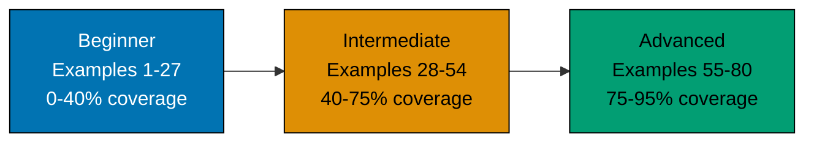

This By Example tutorial teaches Pi Coding Agent through 80 self-contained, heavily annotated examples. Every code block is copy-pasteable and runnable. Every example explains both **what** the code does and **why** it matters.

## Tutorial Structure



## What This Tutorial Covers

**Included (the 95%)**:

- Installation, CLI commands, provider configuration
- Built-in tools (file edit, shell execution, fetch)
- Session management, history, branching, sharing via gist
- Skills and prompt templates
- Multi-mode usage: interactive TUI, print/JSON one-shot, RPC, SDK
- Extension installation and authoring
- Multi-provider model switching (Anthropic, OpenAI, Google, Bedrock, Ollama, etc.)
- Security patterns (approval flows, sandboxing)
- Production patterns (CI integration, embedded usage)

**Excluded (the 5% edge cases)**:

- Internal agent-core protocol implementation details
- Third-party extension internals
- Browser-embed `pi-web-ui` advanced customisation
- Source-level Pi agent-core contribution workflow

## Prerequisites

- **Required**: Command-line proficiency (terminal, shell basics)
- **Required**: Node.js installed (current LTS or newer recommended)
- **Helpful**: TypeScript familiarity for extension authoring
- **Helpful**: Familiarity with at least one LLM API (Anthropic, OpenAI, etc.)
- **Not required**: Prior Pi experience — this tutorial starts from zero

## Learning Path Comparison

| Aspect       | By Example (this tutorial)        | By Concept (narrative)                              |
| ------------ | --------------------------------- | --------------------------------------------------- |
| **Approach** | Code-first, 80 annotated examples | Explanation-first, conceptual chapters              |
| **Pace**     | Fast — copy, run, modify          | Moderate — read, understand, apply                  |
| **Best for** | Experienced devs adopting Pi      | Developers wanting deep architectural understanding |
| **Coverage** | 95% through working examples      | 95% through conceptual explanations                 |

## Installation Quick Start

```bash
# Install Pi via the cross-platform install script
curl -fsSL https://pi.dev/install.sh | sh
                                        # => Installs the pi command
                                        # => Detects platform; chooses sh / ps1 / bat path
                                        # => Drops binary on PATH

# Alternative: install via npm
npm install -g @earendil-works/pi-coding-agent
                                        # => Installs the pi command globally
                                        # => Requires Node.js (current LTS or newer recommended)

# Verify installation
pi --version                            # => Shows pi vX.Y.Z
pi --help                               # => Lists available subcommands and flags
```

## Tutorial Sections

### [Beginner (Examples 1-27)](/en/learn/artificial-intelligence/tools/pi-coding-agent/by-example/beginner)

Foundational Pi usage. Installation, CLI flags, provider configuration, basic tool use, session management. By the end of this section you can have a productive conversation with Pi inside any project directory and pick the right model for the task.

### [Intermediate (Examples 28-54)](/en/learn/artificial-intelligence/tools/pi-coding-agent/by-example/intermediate)

Skills and prompt templates, the four operating modes (interactive, print, RPC, SDK), session branching and sharing, installing community extensions. By the end of this section you can integrate Pi into existing CLI tools and customise its behaviour without writing TypeScript.

### [Advanced (Examples 55-80)](/en/learn/artificial-intelligence/tools/pi-coding-agent/by-example/advanced)

Authoring TypeScript extensions, embedding Pi via the SDK in other Node.js applications, building custom tools that talk to your own services, security hardening (approval modes, sandboxing, secret redaction), production deployment patterns. By the end of this section you can ship a Pi-based feature inside another product.

## Next Steps

Start with [Beginner Examples 1-27](/en/learn/artificial-intelligence/tools/pi-coding-agent/by-example/beginner) to master installation, CLI, and basic Pi usage.
