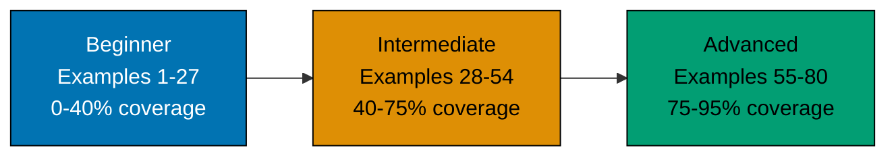

This By Example tutorial teaches Pi Coding Agent through 80 self-contained, heavily annotated examples. Every code block is copy-pasteable and runnable. Every example explains both **what** the code does and **why** it matters.

## Tutorial Structure



## What This Tutorial Covers

**Included (the 95%)**:

- Installation, CLI commands, provider configuration
- Built-in tools (file edit, shell execution, fetch)
- Session management, history, branching, sharing via gist
- Skills and prompt templates
- Multi-mode usage: interactive TUI, print/JSON one-shot, RPC, SDK
- Extension installation and authoring
- Multi-provider model switching (Anthropic, OpenAI, Google, Bedrock, Ollama, etc.)
- Security patterns (approval flows, sandboxing)
- Production patterns (CI integration, embedded usage)

**Excluded (the 5% edge cases)**:

- Internal agent-core protocol implementation details
- Third-party extension internals
- Browser-embed `pi-web-ui` advanced customisation
- Source-level Pi agent-core contribution workflow

## Prerequisites

- **Required**: Command-line proficiency (terminal, shell basics)
- **Required**: Node.js installed (current LTS or newer recommended)
- **Helpful**: TypeScript familiarity for extension authoring
- **Helpful**: Familiarity with at least one LLM API (Anthropic, OpenAI, etc.)
- **Not required**: Prior Pi experience — this tutorial starts from zero

## Learning Path Comparison

| Aspect       | By Example (this tutorial)        | By Concept (narrative)                              |
| ------------ | --------------------------------- | --------------------------------------------------- |
| **Approach** | Code-first, 80 annotated examples | Explanation-first, conceptual chapters              |
| **Pace**     | Fast — copy, run, modify          | Moderate — read, understand, apply                  |
| **Best for** | Experienced devs adopting Pi      | Developers wanting deep architectural understanding |
| **Coverage** | 95% through working examples      | 95% through conceptual explanations                 |

## Installation Quick Start

```bash
# Install Pi via the cross-platform install script
curl -fsSL https://pi.dev/install.sh | sh
                                        # => Installs the pi command
                                        # => Detects platform; chooses sh / ps1 / bat path
                                        # => Drops binary on PATH

# Alternative: install via npm
npm install -g @earendil-works/pi-coding-agent
                                        # => Installs the pi command globally
                                        # => Requires Node.js (current LTS or newer recommended)

# Verify installation
pi --version                            # => Shows pi vX.Y.Z
pi --help                               # => Lists available subcommands and flags
```

## Tutorial Sections

### [Beginner (Examples 1-27)](/en/learn/artificial-intelligence/tools/pi-coding-agent/by-example/beginner)

Foundational Pi usage. Installation, CLI flags, provider configuration, basic tool use, session management. By the end of this section you can have a productive conversation with Pi inside any project directory and pick the right model for the task.

### [Intermediate (Examples 28-54)](/en/learn/artificial-intelligence/tools/pi-coding-agent/by-example/intermediate)

Skills and prompt templates, the four operating modes (interactive, print, RPC, SDK), session branching and sharing, installing community extensions. By the end of this section you can integrate Pi into existing CLI tools and customise its behaviour without writing TypeScript.

### [Advanced (Examples 55-80)](/en/learn/artificial-intelligence/tools/pi-coding-agent/by-example/advanced)

Authoring TypeScript extensions, embedding Pi via the SDK in other Node.js applications, building custom tools that talk to your own services, security hardening (approval modes, sandboxing, secret redaction), production deployment patterns. By the end of this section you can ship a Pi-based feature inside another product.

## Examples by Level

### Beginner (Examples 1–27)

- [Example 1: Installing Pi via the cross-platform script](/en/learn/artificial-intelligence/tools/pi-coding-agent/by-example/beginner#example-1-installing-pi-via-the-cross-platform-script)
- [Example 2: Installing Pi via npm](/en/learn/artificial-intelligence/tools/pi-coding-agent/by-example/beginner#example-2-installing-pi-via-npm)
- [Example 3: Installing Pi via pnpm](/en/learn/artificial-intelligence/tools/pi-coding-agent/by-example/beginner#example-3-installing-pi-via-pnpm)
- [Example 4: Verifying installation and checking platform support](/en/learn/artificial-intelligence/tools/pi-coding-agent/by-example/beginner#example-4-verifying-installation-and-checking-platform-support)
- [Example 5: Configure Anthropic (Claude) provider](/en/learn/artificial-intelligence/tools/pi-coding-agent/by-example/beginner#example-5-configure-anthropic-claude-provider)
- [Example 6: Configure OpenAI provider](/en/learn/artificial-intelligence/tools/pi-coding-agent/by-example/beginner#example-6-configure-openai-provider)
- [Example 7: Configure Google Gemini provider](/en/learn/artificial-intelligence/tools/pi-coding-agent/by-example/beginner#example-7-configure-google-gemini-provider)
- [Example 8: Configure Azure OpenAI provider](/en/learn/artificial-intelligence/tools/pi-coding-agent/by-example/beginner#example-8-configure-azure-openai-provider)
- [Example 9: Configure AWS Bedrock provider](/en/learn/artificial-intelligence/tools/pi-coding-agent/by-example/beginner#example-9-configure-aws-bedrock-provider)
- [Example 10: Configure Ollama (local models)](/en/learn/artificial-intelligence/tools/pi-coding-agent/by-example/beginner#example-10-configure-ollama-local-models)
- [Example 11: Configure OpenRouter (200+ models)](/en/learn/artificial-intelligence/tools/pi-coding-agent/by-example/beginner#example-11-configure-openrouter-200-models)
- [Example 12: List configured providers](/en/learn/artificial-intelligence/tools/pi-coding-agent/by-example/beginner#example-12-list-configured-providers)
- [Example 13: Start an interactive session](/en/learn/artificial-intelligence/tools/pi-coding-agent/by-example/beginner#example-13-start-an-interactive-session)
- [Example 14: Select model for the session](/en/learn/artificial-intelligence/tools/pi-coding-agent/by-example/beginner#example-14-select-model-for-the-session)
- [Example 15: Switch model mid-session](/en/learn/artificial-intelligence/tools/pi-coding-agent/by-example/beginner#example-15-switch-model-mid-session)
- [Example 16: View token and cost tracker](/en/learn/artificial-intelligence/tools/pi-coding-agent/by-example/beginner#example-16-view-token-and-cost-tracker)
- [Example 17: Send a multi-line prompt](/en/learn/artificial-intelligence/tools/pi-coding-agent/by-example/beginner#example-17-send-a-multi-line-prompt)
- [Example 18: Exit a session](/en/learn/artificial-intelligence/tools/pi-coding-agent/by-example/beginner#example-18-exit-a-session)
- [Example 19: Read a file via the file tool](/en/learn/artificial-intelligence/tools/pi-coding-agent/by-example/beginner#example-19-read-a-file-via-the-file-tool)
- [Example 20: Edit a file via the file tool](/en/learn/artificial-intelligence/tools/pi-coding-agent/by-example/beginner#example-20-edit-a-file-via-the-file-tool)
- [Example 21: Run a shell command via the shell tool](/en/learn/artificial-intelligence/tools/pi-coding-agent/by-example/beginner#example-21-run-a-shell-command-via-the-shell-tool)
- [Example 22: Switch approval modes](/en/learn/artificial-intelligence/tools/pi-coding-agent/by-example/beginner#example-22-switch-approval-modes)
- [Example 23: Use the `fetch` tool to read a URL](/en/learn/artificial-intelligence/tools/pi-coding-agent/by-example/beginner#example-23-use-the-fetch-tool-to-read-a-url)
- [Example 24: List saved sessions](/en/learn/artificial-intelligence/tools/pi-coding-agent/by-example/beginner#example-24-list-saved-sessions)
- [Example 25: Resume a session](/en/learn/artificial-intelligence/tools/pi-coding-agent/by-example/beginner#example-25-resume-a-session)
- [Example 26: Branch a session at a previous turn](/en/learn/artificial-intelligence/tools/pi-coding-agent/by-example/beginner#example-26-branch-a-session-at-a-previous-turn)
- [Example 27: Share a session via GitHub gist](/en/learn/artificial-intelligence/tools/pi-coding-agent/by-example/beginner#example-27-share-a-session-via-github-gist)

### Intermediate (Examples 28–54)

- [Example 28: Install a Skill from the Community Registry](/en/learn/artificial-intelligence/tools/pi-coding-agent/by-example/intermediate#example-28-install-a-skill-from-the-community-registry)
- [Example 29: Install a Local Skill from a Directory](/en/learn/artificial-intelligence/tools/pi-coding-agent/by-example/intermediate#example-29-install-a-local-skill-from-a-directory)
- [Example 30: List Installed Skills](/en/learn/artificial-intelligence/tools/pi-coding-agent/by-example/intermediate#example-30-list-installed-skills)
- [Example 31: Invoke a Skill in a Session](/en/learn/artificial-intelligence/tools/pi-coding-agent/by-example/intermediate#example-31-invoke-a-skill-in-a-session)
- [Example 32: Override a Skill with a Local Patch](/en/learn/artificial-intelligence/tools/pi-coding-agent/by-example/intermediate#example-32-override-a-skill-with-a-local-patch)
- [Example 33: Install a Prompt Template](/en/learn/artificial-intelligence/tools/pi-coding-agent/by-example/intermediate#example-33-install-a-prompt-template)
- [Example 34: Write an Inline Template](/en/learn/artificial-intelligence/tools/pi-coding-agent/by-example/intermediate#example-34-write-an-inline-template)
- [Example 35: Parameterized Template Invocation](/en/learn/artificial-intelligence/tools/pi-coding-agent/by-example/intermediate#example-35-parameterized-template-invocation)
- [Example 36: Pull Template Variables from Environment](/en/learn/artificial-intelligence/tools/pi-coding-agent/by-example/intermediate#example-36-pull-template-variables-from-environment)
- [Example 37: Print Mode One-Shot](/en/learn/artificial-intelligence/tools/pi-coding-agent/by-example/intermediate#example-37-print-mode-one-shot)
- [Example 38: JSON Output for Structured Consumption](/en/learn/artificial-intelligence/tools/pi-coding-agent/by-example/intermediate#example-38-json-output-for-structured-consumption)
- [Example 39: Scripting Pi from a Makefile](/en/learn/artificial-intelligence/tools/pi-coding-agent/by-example/intermediate#example-39-scripting-pi-from-a-makefile)
- [Example 40: Piping Pi Output into jq](/en/learn/artificial-intelligence/tools/pi-coding-agent/by-example/intermediate#example-40-piping-pi-output-into-jq)
- [Example 41: Start Pi as an RPC Server](/en/learn/artificial-intelligence/tools/pi-coding-agent/by-example/intermediate#example-41-start-pi-as-an-rpc-server)
- [Example 42: Send a Turn from Another Process](/en/learn/artificial-intelligence/tools/pi-coding-agent/by-example/intermediate#example-42-send-a-turn-from-another-process)
- [Example 43: Stream Tokens via RPC](/en/learn/artificial-intelligence/tools/pi-coding-agent/by-example/intermediate#example-43-stream-tokens-via-rpc)
- [Example 44: RPC Client in Python](/en/learn/artificial-intelligence/tools/pi-coding-agent/by-example/intermediate#example-44-rpc-client-in-python)
- [Example 45: Import pi-agent-core in a Node Script](/en/learn/artificial-intelligence/tools/pi-coding-agent/by-example/intermediate#example-45-import-pi-agent-core-in-a-node-script)
- [Example 46: Embed Pi in a Node CLI Tool](/en/learn/artificial-intelligence/tools/pi-coding-agent/by-example/intermediate#example-46-embed-pi-in-a-node-cli-tool)
- [Example 47: Register a Custom Tool via the SDK](/en/learn/artificial-intelligence/tools/pi-coding-agent/by-example/intermediate#example-47-register-a-custom-tool-via-the-sdk)
- [Example 48: Embed Pi in a Web Server](/en/learn/artificial-intelligence/tools/pi-coding-agent/by-example/intermediate#example-48-embed-pi-in-a-web-server)
- [Example 49: Branch a Session and List Branches](/en/learn/artificial-intelligence/tools/pi-coding-agent/by-example/intermediate#example-49-branch-a-session-and-list-branches)
- [Example 50: Share a Session via GitHub Gist](/en/learn/artificial-intelligence/tools/pi-coding-agent/by-example/intermediate#example-50-share-a-session-via-github-gist)
- [Example 51: Redact Paths Before Sharing](/en/learn/artificial-intelligence/tools/pi-coding-agent/by-example/intermediate#example-51-redact-paths-before-sharing)
- [Example 52: Install a Community Extension](/en/learn/artificial-intelligence/tools/pi-coding-agent/by-example/intermediate#example-52-install-a-community-extension)
- [Example 53: List Installed Extensions](/en/learn/artificial-intelligence/tools/pi-coding-agent/by-example/intermediate#example-53-list-installed-extensions)
- [Example 54: Disable an Extension](/en/learn/artificial-intelligence/tools/pi-coding-agent/by-example/intermediate#example-54-disable-an-extension)

### Advanced (Examples 55–80)

- [Example 55: Scaffold a new extension](/en/learn/artificial-intelligence/tools/pi-coding-agent/by-example/advanced#example-55-scaffold-a-new-extension)
- [Example 56: Register a tool in an extension](/en/learn/artificial-intelligence/tools/pi-coding-agent/by-example/advanced#example-56-register-a-tool-in-an-extension)
- [Example 57: Register a slash command](/en/learn/artificial-intelligence/tools/pi-coding-agent/by-example/advanced#example-57-register-a-slash-command)
- [Example 58: Register a keyboard shortcut](/en/learn/artificial-intelligence/tools/pi-coding-agent/by-example/advanced#example-58-register-a-keyboard-shortcut)
- [Example 59: Register an event handler](/en/learn/artificial-intelligence/tools/pi-coding-agent/by-example/advanced#example-59-register-an-event-handler)
- [Example 60: Register a TUI panel](/en/learn/artificial-intelligence/tools/pi-coding-agent/by-example/advanced#example-60-register-a-tui-panel)
- [Example 61: Define a tool schema](/en/learn/artificial-intelligence/tools/pi-coding-agent/by-example/advanced#example-61-define-a-tool-schema)
- [Example 62: Implement a tool handler](/en/learn/artificial-intelligence/tools/pi-coding-agent/by-example/advanced#example-62-implement-a-tool-handler)
- [Example 63: Declare tool dependencies](/en/learn/artificial-intelligence/tools/pi-coding-agent/by-example/advanced#example-63-declare-tool-dependencies)
- [Example 64: Ship and install your extension](/en/learn/artificial-intelligence/tools/pi-coding-agent/by-example/advanced#example-64-ship-and-install-your-extension)
- [Example 65: Use pi-agent-core directly](/en/learn/artificial-intelligence/tools/pi-coding-agent/by-example/advanced#example-65-use-pi-agent-core-directly)
- [Example 66: Custom message handling](/en/learn/artificial-intelligence/tools/pi-coding-agent/by-example/advanced#example-66-custom-message-handling)
- [Example 67: Embed Pi in an Express server](/en/learn/artificial-intelligence/tools/pi-coding-agent/by-example/advanced#example-67-embed-pi-in-an-express-server)
- [Example 68: Embed Pi in a CLI tool](/en/learn/artificial-intelligence/tools/pi-coding-agent/by-example/advanced#example-68-embed-pi-in-a-cli-tool)
- [Example 69: Tool allow/deny lists](/en/learn/artificial-intelligence/tools/pi-coding-agent/by-example/advanced#example-69-tool-allowdeny-lists)
- [Example 70: Sandboxed shell execution](/en/learn/artificial-intelligence/tools/pi-coding-agent/by-example/advanced#example-70-sandboxed-shell-execution)
- [Example 71: Redact secrets in agent output](/en/learn/artificial-intelligence/tools/pi-coding-agent/by-example/advanced#example-71-redact-secrets-in-agent-output)
- [Example 72: Defend against indirect prompt injection](/en/learn/artificial-intelligence/tools/pi-coding-agent/by-example/advanced#example-72-defend-against-indirect-prompt-injection)
- [Example 73: Pi inside CI](/en/learn/artificial-intelligence/tools/pi-coding-agent/by-example/advanced#example-73-pi-inside-ci)
- [Example 74: Pi behind a webhook](/en/learn/artificial-intelligence/tools/pi-coding-agent/by-example/advanced#example-74-pi-behind-a-webhook)
- [Example 75: Metrics and observability](/en/learn/artificial-intelligence/tools/pi-coding-agent/by-example/advanced#example-75-metrics-and-observability)
- [Example 76: Multi-tenant config](/en/learn/artificial-intelligence/tools/pi-coding-agent/by-example/advanced#example-76-multi-tenant-config)
- [Example 77: Chained tool flow](/en/learn/artificial-intelligence/tools/pi-coding-agent/by-example/advanced#example-77-chained-tool-flow)
- [Example 78: Retry-on-failure pattern](/en/learn/artificial-intelligence/tools/pi-coding-agent/by-example/advanced#example-78-retry-on-failure-pattern)
- [Example 79: Agent → agent delegation](/en/learn/artificial-intelligence/tools/pi-coding-agent/by-example/advanced#example-79-agent--agent-delegation)
- [Example 80: End-to-end automation pattern](/en/learn/artificial-intelligence/tools/pi-coding-agent/by-example/advanced#example-80-end-to-end-automation-pattern)

## Next Steps

Start with [Beginner Examples 1-27](/en/learn/artificial-intelligence/tools/pi-coding-agent/by-example/beginner) to master installation, CLI, and basic Pi usage.
