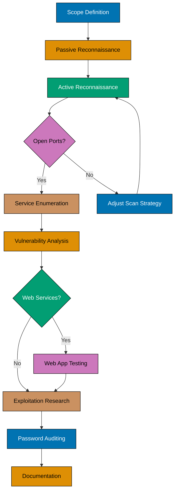
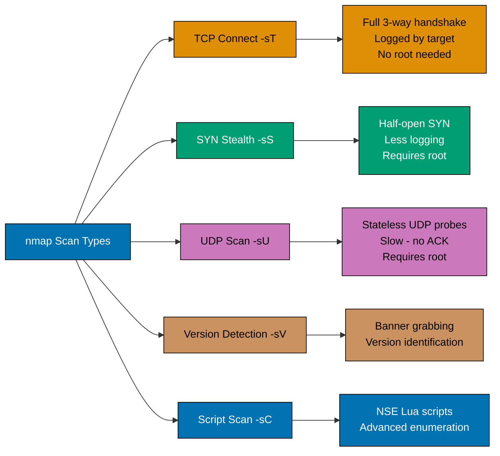
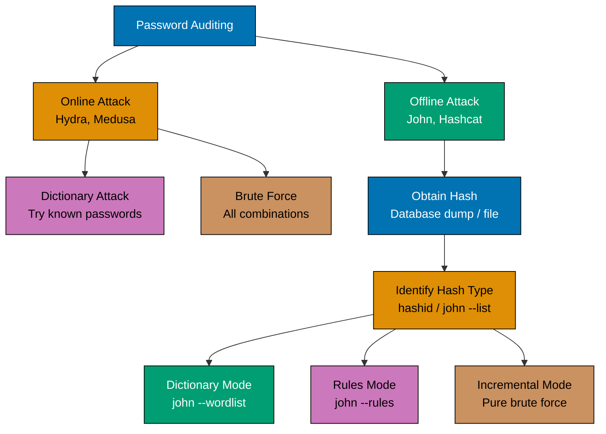

## What You'll Learn

By the end of this tutorial, you'll be able to:

- Perform structured network reconnaissance with nmap
- Enumerate web application attack surface with nikto and gobuster
- Conduct safe password auditing with Hydra and John the Ripper
- Chain tools together in a realistic penetration testing workflow
- Document findings in a reproducible format
- Identify when a tool is the right choice versus an alternative

## Prerequisites

Before starting, ensure you have:

- Completed the [Kali Linux Quick Start](/en/learn/information-security/tools/kali-linux/quick-start)
  tutorial — Kali VM installed, updated, and default password changed
- Basic Linux command-line fluency (pipes, redirects, file permissions)
- A safe practice target — use your own machines, a local Docker lab, or an explicitly
  authorized practice platform (DVWA, HackTheBox with VPN, TryHackMe)
- Understanding that **every example in this tutorial must only run against authorized targets**


**Legal and Ethical Notice**: Penetration testing tools are dual-use. Running them against
systems without written authorization is a criminal offense under laws such as the Computer
Fraud and Abuse Act (US), Computer Misuse Act (UK), and equivalent statutes worldwide.
This tutorial uses loopback addresses, local Docker containers, and explicitly mentioned
authorized practice platforms. Replace example IPs with your own authorized targets only.


## Kali Linux Penetration Testing Workflow

Understanding where each tool fits in a structured workflow prevents wasted effort.



**Workflow Phases**:

1. **Scope Definition** — document exactly which IPs, domains, and ports are authorized
2. **Passive Reconnaissance** — gather info without touching the target (OSINT, DNS lookups)
3. **Active Reconnaissance** — probe the target directly (nmap scans)
4. **Service Enumeration** — identify versions and configurations of open services
5. **Vulnerability Analysis** — map findings to known vulnerabilities (nikto, searchsploit)
6. **Web App Testing** — enumerate and probe HTTP/HTTPS services (gobuster, nikto)
7. **Password Auditing** — test credential strength (Hydra, John the Ripper)
8. **Documentation** — record every finding, command, and output for reporting

## Chapter 1: Network Reconnaissance with nmap

nmap is the de-facto standard for network discovery and port scanning. All subsequent testing
depends on accurate nmap output — understanding its scan types determines result quality.

### Scan Types Compared



### Example 1: Host Discovery Scan

Before scanning ports, confirm which hosts are up on a subnet.

```bash
sudo nmap -sn 192.168.x.0/24
```

- `sudo` — SYN/ICMP probes require raw socket access; root privilege is needed
- `-sn` — **ping scan** (formerly `-sP`): skips port scanning entirely, only checks host liveness
- `192.168.x.0/24` — CIDR notation covering all 254 usable IPs in the 192.168.x range
- Kali's VirtualBox host-only adapter typically uses the 192.168.x range by default

**Sample Output**:

```text
Nmap scan report for 192.168.x.1
Host is up (0.00028s latency).
Nmap scan report for 192.168.x.101
Host is up (0.00045s latency).
Nmap done: 256 IP addresses (2 hosts up) scanned in 1.92 seconds
```

- Each `Host is up` line confirms a responding host
- Latency values indicate network distance (near-zero = local network)
- Run this first to build a target list before launching heavier port scans

### Example 2: Fast Top-Port Scan

```bash
nmap -T4 -F 192.168.x.101
```

- `-T4` — **timing template 4** (Aggressive): reduces per-probe timeouts for faster scanning
  on reliable local networks; never use T5 on production — it causes packet loss
- `-F` — **fast scan**: scans only the top 100 most common ports instead of the default 1000
- `192.168.x.101` — replace with your authorized target's IP address

Use `-F` for initial triage when time is limited; follow up with a full port scan on interesting
targets.

### Example 3: Full Port Scan with Version Detection

```bash
sudo nmap -sS -sV -sC -p- -T4 -oA full_scan 192.168.x.101
```

- `-sS` — **SYN scan**: sends SYN, waits for SYN-ACK (open) or RST (closed), never completes
  the handshake — creates fewer log entries than a full TCP connect scan
- `-sV` — **version detection**: sends crafted probes to extract service banners
- `-sC` — **default NSE scripts**: runs safe enumeration scripts (HTTP titles, SSL info, SMB
  shares, SSH host keys, etc.)
- `-p-` — **all ports**: scans all 65535 TCP ports; slower but catches non-standard service ports
- `-oA full_scan` — **all formats output**: creates `full_scan.nmap` (human), `full_scan.xml`
  (tool-parseable), and `full_scan.gnmap` (grep-friendly) simultaneously
- Always save output — you need the exact versions later for vulnerability matching


Run `-p-` scans in a tmux session or with `nohup` — they take 10-60 minutes on a single host
depending on network speed and firewall rules. A partial scan that times out silently misses
services.


### Example 4: UDP Scan for Common Services

```bash
sudo nmap -sU --top-ports 20 192.168.x.101
```

- `-sU` — **UDP scan**: sends UDP packets to each port; open ports may reply, closed ports
  send ICMP port-unreachable; filtered ports send nothing — making UDP scanning inherently slower
- `--top-ports 20` — limits scan to the 20 most commonly open UDP ports (DNS 53, SNMP 161,
  DHCP 67/68, NTP 123, TFTP 69, NetBIOS 137-139, etc.)
- UDP services are often overlooked and can expose SNMP community strings, DNS zone transfers,
  or TFTP misconfigurations

### Example 5: Targeted Script Scan Against HTTP

```bash
nmap -p 80,443,8080,8443 --script=http-title,http-headers,http-methods 192.168.x.101
```

- `-p 80,443,8080,8443` — scans only the four most common HTTP/HTTPS ports
- `--script=http-title` — extracts the HTML `<title>` tag from each web server response
- `--script=http-headers` — dumps raw HTTP response headers (reveals server software, cookies,
  security headers like CSP and HSTS, and framework hints)
- `--script=http-methods` — probes which HTTP methods the server accepts (GET, POST, PUT, DELETE,
  OPTIONS, TRACE) — dangerous methods like PUT or TRACE indicate misconfiguration

**Sample Output**:

```text
PORT   STATE SERVICE
80/tcp open  http
| http-title: DVWA - Damn Vulnerable Web Application
| http-headers:
|   Date: Tue, 24 Jun 2026 05:00:00 GMT
|   Server: Apache/2.4.57 (Debian)
|   Set-Cookie: PHPSESSID=abc123; path=/
| http-methods:
|   Supported Methods: GET POST OPTIONS HEAD
```

- `Server: Apache/2.4.57` — version string used to search CVE databases next
- `Set-Cookie: PHPSESSID=abc123; path=/` — missing `HttpOnly` and `Secure` flags = session
  hijacking risk

## Chapter 2: Web Application Enumeration

After nmap confirms an HTTP service, the next step is enumerating the web application's attack
surface — finding hidden directories, backup files, API endpoints, and configuration files.

### Example 6: nikto Web Server Scanner

nikto performs automated checks for thousands of known vulnerabilities, misconfigurations, and
dangerous files.

```bash
nikto -h http://192.168.x.101 -o nikto_output.txt -Format txt
```

- `nikto` — invokes the web vulnerability scanner
- `-h http://192.168.x.101` — **host**: target URL including scheme; nikto respects HTTP vs HTTPS
- `-o nikto_output.txt` — **output file**: saves results for later review and reporting
- `-Format txt` — output format; alternatives: `htm`, `csv`, `xml`, `json`
- Nikto's scan is noisy and detectable — it is not stealthy; acceptable in authorized assessments

**Sample Output**:

```text
- Nikto v2.1.6
+ Target IP:          192.168.x.101
+ Target Hostname:    192.168.x.101
+ Target Port:        80
+ Start Time:         2026-06-24 05:00:00 (GMT+7)
+ Server: Apache/2.4.57 (Debian)
+ /phpinfo.php: Output from the phpinfo() function was found.
+ /admin/: This might be interesting...
+ OSVDB-3268: /css/: Directory indexing found.
+ OSVDB-3233: /icons/README: Apache default file found.
+ 8135 requests: 0 error(s) and 6 item(s) reported
```

- `phpinfo.php` found — exposes PHP configuration, loaded modules, and environment variables;
  high-severity finding
- `/admin/` accessible — administrative interface exposed without redirect to authentication
- `Directory indexing found` — server lists files in the directory; information disclosure

### Example 7: nikto Against HTTPS with SSL

```bash
nikto -h https://192.168.x.101 -ssl -Tuning x6
```

- `-ssl` — forces SSL/TLS even if the port would otherwise be treated as plaintext
- `-Tuning x6` — scan tuning: `x` = run all tests except DoS; `6` = run denial-of-service
  checks (use `6` only in isolated lab environments — never on production)
- Alternative tuning values: `1`=interesting files, `2`=misconfiguration, `4`=injection,
  `8`=command execution, `9`=SQL injection, `b`=software ID

### Example 8: gobuster Directory Enumeration

gobuster brute-forces paths using a wordlist — faster and more thorough than nikto for directory
discovery.

```bash
gobuster dir \
  -u http://192.168.x.101 \
  -w /usr/share/wordlists/dirb/common.txt \
  -x php,html,txt,bak \
  -t 20 \
  -o gobuster_dirs.txt
```

- `gobuster dir` — directory/file enumeration mode
- `-u http://192.168.x.101` — target base URL
- `-w /usr/share/wordlists/dirb/common.txt` — wordlist; `common.txt` has ~4600 entries covering
  admin, backup, config, login, and other common paths
- `-x php,html,txt,bak` — **extension fuzzing**: appends each extension to every wordlist entry,
  effectively multiplying discoveries (e.g., `admin.php`, `admin.html`, `admin.bak`)
- `-t 20` — **thread count**: 20 concurrent HTTP requests; increase to 50 on fast local labs,
  keep at 10-20 on remote targets to avoid rate limiting or server overload
- `-o gobuster_dirs.txt` — saves results; useful when piping into further analysis

### Example 9: gobuster with Authentication

Many targets protect interesting directories with basic authentication.

```bash
gobuster dir \
  -u http://192.168.x.101/admin \
  -w /usr/share/wordlists/dirb/common.txt \
  -U admin \
  -P password123 \
  -k
```

- `-U admin` — **username** for HTTP Basic Authentication
- `-P password123` — **password** for HTTP Basic Authentication
- `-k` — **skip TLS verification**: ignores self-signed certificate errors on HTTPS targets;
  only use in controlled lab environments where you own the target

### Example 10: Wordlist Selection Strategy

Choosing the right wordlist dramatically affects discovery quality.

| Wordlist                                                                  | Entries | Use Case                 |
| ------------------------------------------------------------------------- | ------- | ------------------------ |
| `/usr/share/wordlists/dirb/common.txt`                                    | 4,615   | Quick initial sweep      |
| `/usr/share/wordlists/dirb/big.txt`                                       | 20,469  | Thorough web enumeration |
| `/usr/share/seclists/Discovery/Web-Content/raft-medium-directories.txt`   | 30,000  | Production assessment    |
| `/usr/share/seclists/Discovery/Web-Content/directory-list-2.3-medium.txt` | 220,560 | Exhaustive sweep         |

```bash
# Install SecLists (not pre-installed on all Kali images)
sudo apt install seclists -y
```

- `seclists` — the apt package name for the SecLists collection
- After install, wordlists are at `/usr/share/seclists/`
- SecLists is the community standard — prefer it over DIRB lists for real assessments

## Chapter 3: Password Auditing

Password auditing tests credential strength using two primary approaches: **online attacks**
(testing passwords against a live service) and **offline attacks** (cracking captured hash files).


Password auditing generates high authentication traffic. Aggressive online attacks trigger
account lockouts and alert defenders. Always confirm lockout policies with your client before
running online attacks, and use rate limiting flags accordingly.


### Password Attack Taxonomy



### Example 11: Hydra SSH Dictionary Attack

```bash
hydra -l admin -P /usr/share/wordlists/rockyou.txt \
  ssh://192.168.x.101 \
  -t 4 \
  -V \
  -f
```

- `hydra` — invokes the network login cracker
- `-l admin` — **single login**: tests only the username `admin`; use `-L userlist.txt` for a
  list of usernames
- `-P /usr/share/wordlists/rockyou.txt` — **password list**: rockyou.txt contains ~14 million
  real-world passwords leaked from the 2009 RockYou breach; the de-facto standard wordlist
- `ssh://192.168.x.101` — **target URI**: Hydra parses the scheme to select the correct module
  (ssh, ftp, http-form, rdp, smb, etc.)
- `-t 4` — **threads**: 4 parallel connections; SSH servers rate-limit aggressively — keep low
  to avoid triggering fail2ban or similar intrusion prevention
- `-V` — **verbose**: prints each attempt (`[22][ssh] host: ... login: admin password: test`)
  useful for confirming progress but generates large output
- `-f` — **exit on success**: stops immediately when valid credentials are found

**Sample Success Output**:

```text
[22][ssh] host: 192.168.x.101   login: admin   password: password123
[STATUS] attack finished for 192.168.x.101 (valid pair found)
```

### Example 12: Hydra HTTP Form Attack

Web login forms require a different Hydra module and parameter format.

```bash
hydra -l admin -P /usr/share/wordlists/rockyou.txt \
  192.168.x.101 \
  http-post-form \
  "/login.php:username=^USER^&password=^PASS^:Invalid credentials" \
  -t 10
```

- `http-post-form` — Hydra module for HTTP POST form authentication
- `"/login.php:username=^USER^&password=^PASS^:Invalid credentials"` — three colon-separated
  fields:
  - `/login.php` — the form action URL path
  - `username=^USER^&password=^PASS^` — POST body; `^USER^` and `^PASS^` are Hydra's
    placeholders, replaced with each attempt's username and password
  - `Invalid credentials` — the failure string; Hydra reads the server response and marks
    an attempt as failed if this string appears; the absence of this string = success


To find the correct POST body, open the browser's Developer Tools (F12) → Network tab → submit
the login form once with wrong credentials → inspect the POST request body and response text.
Copy the body exactly and paste the failure message into Hydra's third field.


### Example 13: Identify Hash Type Before Cracking

```bash
# hashid determines the hash algorithm from the hash format
hashid '$1$abc12345$XYZ0987654321abcdef0123456'
```

- `hashid` — hash identification tool (pre-installed on Kali)
- The argument is the hash string to identify
- Output lists all matching hash algorithms ordered by probability
- `$1$` prefix confirms MD5-crypt (Linux MD5 shadow file format)

```bash
# Alternative: john's built-in format detection
john --list=formats | grep -i md5
```

- `john --list=formats` — lists all cracking formats John the Ripper supports (200+)
- `grep -i md5` — filters to MD5-related formats; `-i` makes search case-insensitive
- Use the exact format name from this list in the `--format=` flag below

### Example 14: John the Ripper — Dictionary Mode

John the Ripper cracks captured hash files offline, avoiding network noise and lockout risks.

```bash
# Crack a shadow file entry
john --wordlist=/usr/share/wordlists/rockyou.txt \
     --format=sha512crypt \
     shadow_hashes.txt
```

- `john` — invokes John the Ripper
- `--wordlist=/usr/share/wordlists/rockyou.txt` — **wordlist mode**: tries each word as a
  candidate password; faster than brute force, relies on common password patterns
- `--format=sha512crypt` — explicitly sets the hash format; John auto-detects most formats but
  explicit specification prevents misdetection with ambiguous hashes
- `shadow_hashes.txt` — file containing the hash(es) to crack, one per line

```bash
# View cracked passwords
john --show shadow_hashes.txt
```

- `--show` — displays all passwords John has already cracked from its session pot file
- Results persist across sessions in `~/.john/john.pot` — John never re-cracks a known hash

### Example 15: John the Ripper — Rules Mode

Rules apply transformations to wordlist entries — capitalizing, adding numbers, substituting
letters — matching how users commonly create "complex" passwords from simple words.

```bash
john --wordlist=/usr/share/wordlists/rockyou.txt \
     --rules=best64 \
     --format=sha512crypt \
     shadow_hashes.txt
```

- `--rules=best64` — applies the **best64** rule set: 64 high-yield password mangling rules
  derived from analysis of real password breach data; catches patterns like `Password1`,
  `p@ssword`, `password123`, and `P4$$w0rd`
- Other useful rule sets: `--rules=KoreLogic` (comprehensive), `--rules=jumbo` (largest set)
- Rules mode is slower than plain wordlist but cracks significantly more real-world passwords

### Example 16: Crack ZIP File Password

John can crack many non-hash file types by first converting them to a crackable format.

```bash
# Extract the hash from the protected zip
zip2john protected.zip > zip_hash.txt

# Crack the extracted hash
john --wordlist=/usr/share/wordlists/rockyou.txt zip_hash.txt
```

- `zip2john` — Kali utility that extracts the password hash from a ZIP file into John's format
- The output `zip_hash.txt` contains the hash line John can process
- `john ... zip_hash.txt` — cracks the extracted hash; same syntax as shadow file cracking
- Equivalent converters exist for other formats: `rar2john`, `pdf2john`, `ssh2john`, `keepass2john`

## Chapter 4: Putting It Together — Practice Lab Workflow

This chapter chains all previous tools into a realistic, structured assessment workflow against a
local DVWA (Damn Vulnerable Web Application) Docker container — a safe, authorized lab target.

### Lab Setup

```bash
# Pull and run DVWA in Docker
docker run --rm -d \
  -p 80:80 \
  -p 3306:3306 \
  --name dvwa \
  vulnerables/web-dvwa
```

- `docker run` — creates and starts a container
- `--rm` — automatically removes the container when stopped; keeps your system clean
- `-d` — **detached mode**: runs in the background; you get the terminal back immediately
- `-p 80:80` — maps host port 80 to container port 80 (HTTP)
- `-p 3306:3306` — maps host port 3306 to container port 3306 (MySQL — optional for SQL labs)
- `--name dvwa` — assigns a name for easy management (`docker stop dvwa` to shut down)
- `vulnerables/web-dvwa` — the official DVWA Docker image

```bash
# Confirm the container is running
docker ps -f name=dvwa
```

- `docker ps` — lists running containers
- `-f name=dvwa` — filters output to only the dvwa container; confirm `STATUS` shows `Up`

Target IP for all subsequent steps: `127.0.0.1` (container port-mapped to localhost)

### Step 1 — Reconnaissance

```bash
sudo nmap -sS -sV -sC -p 80,3306 -oA dvwa_scan 127.0.0.1
```

- Scans only ports 80 and 3306 — the two we exposed in the Docker run command
- `-oA dvwa_scan` — saves nmap, XML, and gnmap output files for the report

**Expected output confirms**:

- Port 80 open — Apache HTTP server, version extracted by `-sV`
- `http-title` script shows `Damn Vulnerable Web Application (DVWA)` — confirms target identity

### Step 2 — Web Enumeration

```bash
gobuster dir \
  -u http://127.0.0.1 \
  -w /usr/share/wordlists/dirb/common.txt \
  -x php,html,txt,bak \
  -o dvwa_dirs.txt
```

**Key discoveries from DVWA**:

- `/login.php` — authentication entry point
- `/setup.php` — database setup page (should be inaccessible in production)
- `/dvwa/` — application root
- `/phpinfo.php` — exposes server configuration (critical finding)

### Step 3 — nikto Scan

```bash
nikto -h http://127.0.0.1 -o dvwa_nikto.txt -Format txt
```

**Typical DVWA nikto findings**:

- Missing `X-Frame-Options` header — clickjacking risk
- Missing `X-Content-Type-Options` header — MIME-sniffing risk
- `phpinfo.php` exposure — information disclosure
- Directory indexing on `/dvwa/images/` — lists uploaded files

### Step 4 — Password Audit

```bash
# Default DVWA credentials: admin:password
# Verify Hydra finds them:
hydra -l admin -P /usr/share/wordlists/rockyou.txt \
  127.0.0.1 \
  http-post-form \
  "/login.php:username=^USER^&password=^PASS^&Login=Login:Login failed" \
  -t 5 \
  -f
```

- `Login=Login` — the hidden submit field DVWA's form includes; required for a valid POST
- `Login failed` — the exact text DVWA returns on failed authentication; verify in browser first
- `-t 5` — conservative thread count for localhost; rockyou's `password` entry appears early
  and Hydra finds it within seconds

### Step 5 — Document and Clean Up

```bash
# Create a structured findings directory
mkdir -p ~/assessments/dvwa_$(date +%Y%m%d)
mv dvwa_scan.* dvwa_dirs.txt dvwa_nikto.txt ~/assessments/dvwa_$(date +%Y%m%d)/

# Stop the DVWA container
docker stop dvwa
```

- `mkdir -p ~/assessments/dvwa_$(date +%Y%m%d)` — creates a date-stamped folder under home;
  `$(date +%Y%m%d)` expands to today's date in YYYYMMDD format (e.g., `dvwa_20260624`)
- `mv` — moves all output files into the assessment folder; keeps workspace clean
- `docker stop dvwa` — stops the container; `--rm` flag removes it automatically

## Chapter 5: Tool Selection Reference

Choosing the right tool for each situation saves time and reduces noise.

| Task                         | Primary Tool   | Alternative     | When to Switch                                     |
| ---------------------------- | -------------- | --------------- | -------------------------------------------------- |
| Host discovery               | nmap `-sn`     | netdiscover     | Need ARP-based discovery on local subnet           |
| Port scanning                | nmap `-sS`     | masscan         | Scanning /16 or larger — masscan is 100x faster    |
| Service version detection    | nmap `-sV`     | banner grabbing | Single port; `nc -nv <ip> <port>` is faster        |
| Web directory enumeration    | gobuster       | ffuf            | Need parameter fuzzing beyond directories          |
| Web vulnerability scanning   | nikto          | wapiti          | Need AJAX/JavaScript-heavy app scanning            |
| Online password attack (SSH) | Hydra          | Medusa          | Medusa is more modular for exotic protocols        |
| Online password attack (web) | Hydra          | Burp Intruder   | Need detailed HTTP response analysis               |
| Offline hash cracking (CPU)  | John           | hashcat (GPU)   | Have a GPU — hashcat is orders of magnitude faster |
| File password cracking       | john + \*2john | fcrackzip       | Simple ZIP files only (fcrackzip is faster)        |

## Summary

You now have working knowledge of Kali Linux's core penetration testing workflow:

- **nmap** for structured network and service reconnaissance (5 scan types)
- **nikto** and **gobuster** for web application attack surface enumeration
- **Hydra** for authorized online password attacks (SSH and web forms)
- **John the Ripper** for offline hash cracking (dictionary, rules, file converters)
- A complete chain from lab setup → scan → enumerate → audit → document → clean up

**Recommended next steps**:

- Practice on [TryHackMe](https://tryhackme.com) (browser-based, no local VM needed) — the
  Pre-Security and Jr Penetration Tester paths use all tools covered here
- Work through [HackTheBox Starting Point](https://www.hackthebox.com/starting-point) machines
  using exactly this workflow
- Read the `man` page for each tool covered: `man nmap`, `man hydra`, `man john`
