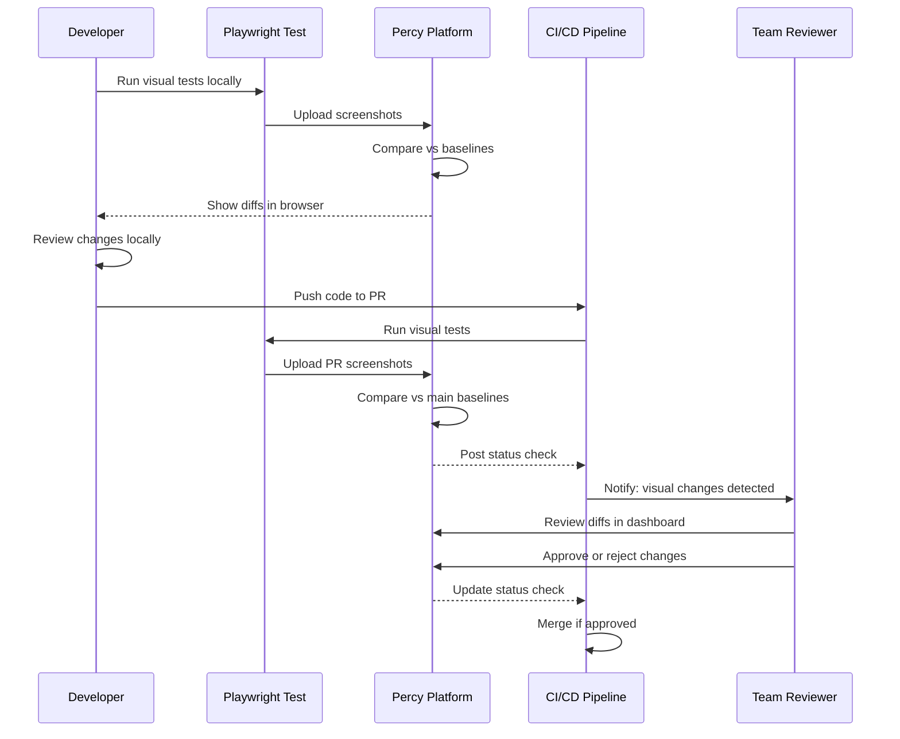

## Why Visual Regression Testing Matters

Production web applications face constant visual changes from code updates, dependency upgrades, and third-party integrations that can break UI layouts without triggering functional test failures. A button might render correctly but shift 50 pixels down, breaking the page design. A CSS change might alter font sizes across the application. A library update might change color schemes. Traditional functional tests verify behavior (button clicks, form submissions) but miss these visual regressions that significantly impact user experience.

Visual regression testing captures screenshots of UI components and pages, comparing them against baseline images to detect unintended visual changes. This enables teams to catch layout breaks, CSS regressions, and rendering issues before users encounter them in production. Automated visual testing provides confidence that UI changes are intentional, not accidental side effects of code modifications.

Production systems need visual regression testing because:

- **Catch CSS regressions**: Detect unintended layout shifts, font changes, color alterations from dependency updates
- **Component-level validation**: Verify isolated component rendering without requiring full E2E flows
- **Cross-browser consistency**: Ensure UI renders identically across Chrome, Firefox, Safari, Edge
- **Responsive design verification**: Validate layouts across mobile, tablet, desktop viewports automatically
- **Prevent production incidents**: Block deployments with visual regressions, preventing user-facing defects

## Standard Library Approach: Playwright toHaveScreenshot()

Playwright's built-in screenshot comparison provides visual regression testing without external services or frameworks.

**Basic screenshot comparison with toHaveScreenshot()**:

```typescript
import { test, expect } from "@playwright/test";
// => Import Playwright test runner and assertions
// => @playwright/test includes screenshot comparison
// => No external visual testing libraries needed

test("homepage visual regression", async ({ page }) => {
  // => Test receives page fixture
  // => Screenshot comparison tied to test case
  // => Baseline stored in test artifacts

  await page.goto("https://example.com");
  // => Navigate to homepage
  // => Wait for page load
  // => Ensures consistent rendering state

  await expect(page).toHaveScreenshot("homepage.png");
  // => Capture full page screenshot
  // => Compare against baseline image
  // => Baseline stored in tests/[test-name]-snapshots/
  // => On first run: creates baseline
  // => On subsequent runs: compares against baseline
  // => Fails if visual differences exceed threshold
});
```

**Component-level screenshot testing**:

```typescript
test("login button visual regression", async ({ page }) => {
  // => Test focused on specific component
  // => Isolates visual validation
  // => Faster than full page comparison

  await page.goto("https://example.com/login");
  // => Navigate to page containing component
  // => Component rendered in real browser

  const loginButton = page.locator('button[type="submit"]');
  // => Locate button element
  // => Selector targets specific component
  // => Locator used for screenshot capture

  await expect(loginButton).toHaveScreenshot("login-button.png");
  // => Capture button screenshot only
  // => Smaller image size (faster comparison)
  // => Isolates component from page layout changes
  // => Baseline stored per component
  // => Fails on button visual changes
});
```

**Responsive screenshot testing across viewports**:

```typescript
test("responsive homepage on mobile", async ({ page }) => {
  // => Test mobile viewport rendering
  // => Separate test per viewport size
  // => Manual viewport management

  await page.setViewportSize({ width: 375, height: 667 });
  // => Set iPhone SE viewport dimensions
  // => Width: 375px, Height: 667px
  // => Must manually configure per test

  await page.goto("https://example.com");
  // => Navigate to homepage
  // => Renders with mobile viewport
  // => CSS media queries apply

  await expect(page).toHaveScreenshot("homepage-mobile.png");
  // => Capture mobile screenshot
  // => Separate baseline from desktop
  // => Compare against mobile baseline
});

test("responsive homepage on desktop", async ({ page }) => {
  // => Second test for desktop viewport
  // => Duplicates navigation logic
  // => Manual viewport configuration

  await page.setViewportSize({ width: 1920, height: 1080 });
  // => Set desktop viewport dimensions
  // => Full HD resolution
  // => Separate test for desktop

  await page.goto("https://example.com");
  // => Same navigation code repeated
  // => Duplication across viewport tests

  await expect(page).toHaveScreenshot("homepage-desktop.png");
  // => Capture desktop screenshot
  // => Separate baseline
  // => Manual test per viewport
});
```

**Limitations for production visual regression testing**:

- **No baseline management UI**: Baselines stored in file system, no web interface to review/approve changes (must review images locally)
- **Limited threshold configuration**: Basic pixel difference detection without perceptual diffing algorithms (sensitive to antialiasing, subpixel rendering)
- **No cross-browser baseline sharing**: Separate baselines required per browser engine (Chrome vs Firefox vs WebKit screenshots differ)
- **Missing dynamic content masking**: No built-in way to mask timestamps, ads, random content (causes false positives)
- **No team collaboration features**: Cannot assign visual reviews, add comments, track approval status
- **Local storage only**: Screenshots stored locally, not centralized for team access (harder to share baselines across CI/local environments)

## Production Framework: Percy and Argos

Production visual regression testing uses cloud platforms like Percy or Argos for centralized baseline management, team collaboration, and intelligent diffing algorithms.

**Percy Installation**:

```bash
npm install --save-dev @percy/cli @percy/playwright
# => Install Percy CLI for screenshot uploads
# => @percy/cli handles baseline management
# => @percy/playwright provides Playwright integration
# => Requires Percy project token from percy.io
```

**Argos Installation** (alternative):

```bash
npm install --save-dev @argos-ci/playwright
# => Install Argos Playwright integration
# => Lighter weight than Percy
# => Open source visual testing platform
# => Requires Argos project setup at argos-ci.com
```

**Percy configuration for production**:

```typescript
// percy.config.js
module.exports = {
  // => Percy configuration file
  // => Defines project-level settings
  // => Committed to repository

  version: 2,
  // => Percy config schema version
  // => Version 2 is current stable

  snapshot: {
    // => Global snapshot settings
    // => Applied to all screenshots
    // => Override per test if needed

    widths: [375, 768, 1280, 1920],
    // => Responsive breakpoints
    // => Captures 4 viewport sizes per screenshot
    // => Mobile (375), tablet (768), laptop (1280), desktop (1920)
    // => Eliminates manual viewport tests

    minHeight: 1024,
    // => Minimum screenshot height
    // => Ensures full content captured
    // => Prevents cut-off screenshots

    percyCSS: `
      .timestamp { visibility: hidden !important; }
      .ad-container { visibility: hidden !important; }
    `,
    // => Custom CSS applied during screenshot
    // => Hides dynamic content (timestamps, ads)
    // => Prevents false positives from changing content
    // => Applied via injected stylesheet

    enableJavaScript: true,
    // => Allow JavaScript execution before screenshot
    // => Waits for JS rendering
    // => Required for React/Vue/Angular apps
  },

  discovery: {
    // => Asset discovery configuration
    // => How Percy captures page resources
    // => Affects screenshot fidelity

    allowedHostnames: ["example.com", "cdn.example.com"],
    // => Whitelist external resources
    // => Percy captures CSS/JS from these domains
    // => Ensures accurate rendering

    networkIdleTimeout: 750,
    // => Wait for network idle before screenshot
    // => 750ms after last network activity
    // => Ensures page fully loaded
  },
};
```

**Production visual regression test with Percy**:

```typescript
// tests/visual/homepage.spec.ts
import { test, expect } from "@playwright/test";
import percySnapshot from "@percy/playwright";
// => Import Percy Playwright integration
// => percySnapshot() uploads to Percy platform
// => Compares against baselines in Percy dashboard

test.describe("Homepage visual regression", () => {
  // => Group related visual tests
  // => Organized by page or feature
  // => Clear test reporting structure

  test("homepage renders correctly", async ({ page }) => {
    // => Test homepage visual state
    // => Percy captures multiple viewports automatically
    // => No manual viewport configuration needed

    await page.goto("https://example.com");
    // => Navigate to homepage
    // => Wait for page load
    // => Ensures stable rendering state

    await page.waitForLoadState("networkidle");
    // => Wait for network idle
    // => Ensures all resources loaded
    // => Prevents comparing partial renders
    // => Critical for accurate baselines

    await percySnapshot(page, "Homepage");
    // => Capture and upload screenshot to Percy
    // => Name: "Homepage"
    // => Percy captures widths defined in percy.config.js
    // => Automatically generates baselines on first run
    // => Compares against approved baselines on subsequent runs
    // => Percy dashboard shows diffs if changes detected
  });

  test("homepage with user logged in", async ({ page }) => {
    // => Test authenticated state visual
    // => Separate baseline from logged-out state
    // => Validates authenticated UI elements

    await page.goto("https://example.com/login");
    await page.fill("#username", "testuser");
    await page.fill("#password", "testpass123");
    await page.click('button[type="submit"]');
    // => Perform login flow
    // => Establishes authenticated session
    // => Required for logged-in screenshot

    await page.waitForURL("https://example.com/dashboard");
    // => Wait for redirect after login
    // => Ensures dashboard loaded
    // => Stable state for screenshot

    await page.waitForLoadState("networkidle");
    // => Wait for all dashboard resources
    // => Avatar images, user data loaded
    // => Consistent screenshot

    await percySnapshot(page, "Homepage - Logged In");
    // => Capture authenticated homepage
    // => Separate baseline name
    // => Percy tracks two baselines: logged-out vs logged-in
    // => Validates user-specific UI elements (avatar, username)
  });
});
```

**Component-level visual testing with Percy**:

```typescript
// tests/visual/components.spec.ts
import { test } from "@playwright/test";
import percySnapshot from "@percy/playwright";
// => Component-focused visual tests
// => Isolated from full page rendering
// => Faster feedback on component changes

test.describe("Button components", () => {
  // => Test button visual states
  // => Primary, secondary, disabled, loading states
  // => Comprehensive component coverage

  test("primary button states", async ({ page }) => {
    // => Test button state variations
    // => Captures all visual states in one test
    // => Efficient component testing

    await page.goto("https://example.com/components/buttons");
    // => Navigate to component showcase page
    // => Page displays all button variations
    // => Storybook or internal component library

    await percySnapshot(page, "Button - Primary Default", {
      // => Capture default primary button
      // => Second parameter: Percy options object
      // => Override global config per screenshot

      scope: 'button[data-testid="primary-button-default"]',
      // => Limit screenshot to specific element
      // => scope: CSS selector for element
      // => Captures only button, not full page
      // => Faster comparison, isolated from layout changes
    });

    await page.hover('button[data-testid="primary-button-default"]');
    // => Trigger hover state
    // => CSS :hover styles apply
    // => Captures interactive state

    await percySnapshot(page, "Button - Primary Hover", {
      scope: 'button[data-testid="primary-button-default"]',
      // => Capture hover state
      // => Separate baseline from default state
      // => Validates hover styles
    });

    await page.click('button[data-testid="toggle-loading"]');
    // => Trigger loading state
    // => Button shows spinner
    // => Tests loading UI

    await percySnapshot(page, "Button - Primary Loading", {
      scope: 'button[data-testid="primary-button-loading"]',
      // => Capture loading button
      // => Validates spinner rendering
      // => Separate baseline per state
    });
  });
});
```

**Responsive visual testing with Percy (automatic)**:

```typescript
test("responsive dashboard layout", async ({ page }) => {
  // => Single test for all viewport sizes
  // => Percy config handles multiple widths
  // => No manual viewport management

  await page.goto("https://example.com/dashboard");
  await page.waitForLoadState("networkidle");
  // => Navigate and wait for stable state
  // => Same pattern for all visual tests

  await percySnapshot(page, "Dashboard Layout", {
    // => Percy captures 4 viewport sizes automatically
    // => Widths defined in percy.config.js: [375, 768, 1280, 1920]
    // => Single test replaces 4 manual tests
    // => Percy generates 4 separate comparisons

    minHeight: 2000,
    // => Override global minHeight for this test
    // => Dashboard has long scrollable content
    // => Captures more vertical space
    // => Per-test configuration override
  });
  // => Percy dashboard shows 4 screenshots:
  // => - Mobile (375px)
  // => - Tablet (768px)
  // => - Laptop (1280px)
  // => - Desktop (1920px)
  // => All compared against their respective baselines
});
```

**Masking dynamic content with Percy**:

```typescript
test("article page with dynamic elements", async ({ page }) => {
  // => Test page with changing content
  // => Timestamps, view counts, ads change frequently
  // => Requires masking to prevent false positives

  await page.goto("https://example.com/articles/123");
  await page.waitForLoadState("networkidle");
  // => Navigate to article page
  // => Wait for content load

  await percySnapshot(page, "Article Page", {
    percyCSS: `
      .timestamp { visibility: hidden !important; }
      .view-count { visibility: hidden !important; }
      .ad-banner { visibility: hidden !important; }
      .social-share-count { visibility: hidden !important; }
    `,
    // => Custom CSS to hide dynamic elements
    // => Percy injects this CSS before screenshot
    // => Elements hidden, not removed (layout preserved)
    // => Prevents false positives from changing content
    // => Override global percyCSS for specific test

    scope: "article.content",
    // => Limit screenshot to article content area
    // => Excludes sidebar, header, footer
    // => Focuses comparison on main content
    // => Reduces screenshot size and comparison time
  });
});
```

## Visual Regression Testing Workflow



## Production Patterns and Best Practices

### Pattern 1: Component-Level Screenshot Testing

Test isolated components in all visual states for comprehensive coverage:

```typescript
// tests/visual/form-components.spec.ts
import { test } from "@playwright/test";
import percySnapshot from "@percy/playwright";
// => Component library visual testing
// => Captures all form component states
// => Prevents component regression across app

test.describe("Input components", () => {
  // => Group input component tests
  // => Test all states: default, focus, error, disabled
  // => Comprehensive component coverage

  test.beforeEach(async ({ page }) => {
    // => Common setup for all component tests
    // => Navigate to component showcase once
    // => Reused across test cases

    await page.goto("https://example.com/components/forms");
    await page.waitForLoadState("networkidle");
    // => Load component showcase page
    // => All form states rendered
    // => Ready for state-based screenshots
  });

  test("text input - default state", async ({ page }) => {
    await percySnapshot(page, "Input - Text Default", {
      scope: '[data-testid="text-input-default"]',
      // => Capture empty text input
      // => Default placeholder text
      // => Baseline for text input appearance
    });
  });

  test("text input - filled state", async ({ page }) => {
    // => Test input with content
    // => Validates text rendering, padding, font
    // => Separate from empty state

    await page.fill('[data-testid="text-input-default"]', "Sample text");
    // => Fill input with text
    // => Trigger filled state styles
    // => Text overflow, truncation visible

    await percySnapshot(page, "Input - Text Filled", {
      scope: '[data-testid="text-input-default"]',
      // => Capture filled input
      // => Shows text rendering
      // => Validates input content styles
    });
  });

  test("text input - focus state", async ({ page }) => {
    // => Test focus ring and styles
    // => Critical for accessibility
    // => Validates focus indicators

    await page.focus('[data-testid="text-input-default"]');
    // => Focus input element
    // => Trigger :focus CSS styles
    // => Focus ring, border color changes visible

    await percySnapshot(page, "Input - Text Focus", {
      scope: '[data-testid="text-input-default"]',
      // => Capture focus state
      // => Shows focus ring
      // => Validates WCAG focus indicators
    });
  });

  test("text input - error state", async ({ page }) => {
    // => Test validation error styling
    // => Red border, error message, icon
    // => Critical for form UX

    await page.click('[data-testid="trigger-error"]');
    // => Trigger validation error
    // => Shows error border and message
    // => Tests error UI

    await percySnapshot(page, "Input - Text Error", {
      scope: '[data-testid="text-input-error"]',
      // => Capture error state
      // => Validates error styling
      // => Error message, icon, red border visible
    });
  });

  test("text input - disabled state", async ({ page }) => {
    // => Test disabled input appearance
    // => Grayed out, reduced opacity
    // => Cursor not-allowed

    await percySnapshot(page, "Input - Text Disabled", {
      scope: '[data-testid="text-input-disabled"]',
      // => Capture disabled input
      // => Shows disabled styling
      // => Validates accessibility indicators
    });
  });
});
```

### Pattern 2: Full-Page Visual Regression with Baseline Management

Comprehensive page visual testing with version control:

```typescript
// tests/visual/critical-pages.spec.ts
import { test } from "@playwright/test";
import percySnapshot from "@percy/playwright";
// => Critical page visual testing
// => Covers key user flows
// => Prevents production visual defects

test.describe("Critical user flows", () => {
  // => Test most important pages
  // => Checkout, signup, dashboard
  // => High-impact visual regression prevention

  test("checkout flow - cart page", async ({ page }) => {
    // => Test shopping cart UI
    // => Product images, prices, quantities
    // => Critical for e-commerce

    await page.goto("https://example.com/cart");
    // => Navigate to cart page
    // => Assumes cart has test data

    await page.evaluate(() => {
      // => Execute JavaScript in page context
      // => Useful for setup, data injection
      // => Runs before screenshot

      localStorage.setItem(
        "cart",
        JSON.stringify([
          { id: 1, name: "Product A", price: 29.99, quantity: 2 },
          { id: 2, name: "Product B", price: 49.99, quantity: 1 },
        ]),
      );
      // => Inject test cart data
      // => Deterministic cart contents
      // => Prevents empty cart screenshot
    });

    await page.reload();
    // => Reload to apply localStorage data
    // => Cart renders with test products
    // => Stable cart state

    await page.waitForLoadState("networkidle");
    // => Wait for product images to load
    // => Network idle ensures complete render
    // => Prevents partial screenshot

    await percySnapshot(page, "Checkout - Cart Page", {
      widths: [375, 1280],
      // => Override global widths for this test
      // => Only test mobile and desktop
      // => Skip tablet views for cart page
      // => Reduces screenshot count

      enableJavaScript: true,
      // => Ensure JS cart logic executes
      // => Cart subtotal calculation runs
      // => Dynamic content rendered
    });
  });

  test("checkout flow - payment page", async ({ page }) => {
    // => Test payment form UI
    // => Credit card fields, billing address
    // => Sensitive visual regression area

    await page.goto("https://example.com/checkout/payment");
    // => Navigate to payment page
    // => Requires previous steps completed

    await page.waitForSelector('[data-testid="payment-form"]');
    // => Wait for payment form render
    // => Ensures Stripe/PayPal widget loaded
    // => Critical for accurate screenshot

    await percySnapshot(page, "Checkout - Payment Page", {
      percyCSS: `
        iframe[name*="stripe"] { visibility: hidden !important; }
        .paypal-button { background: #0070ba !important; }
      `,
      // => Hide third-party iframes
      // => Stripe Elements change frequently
      // => Would cause false positives
      // => Stabilize PayPal button color
    });
  });

  test("user dashboard - overview", async ({ page }) => {
    // => Test authenticated dashboard
    // => User profile, navigation, widgets
    // => High-traffic page

    await page.goto("https://example.com/login");
    await page.fill("#username", "testuser");
    await page.fill("#password", "testpass123");
    await page.click('button[type="submit"]');
    // => Login to establish session
    // => Required for dashboard access

    await page.waitForURL("https://example.com/dashboard");
    await page.waitForLoadState("networkidle");
    // => Wait for dashboard load
    // => All widgets, charts rendered
    // => Stable dashboard state

    await percySnapshot(page, "Dashboard - Overview", {
      percyCSS: `
        .last-login-time { visibility: hidden !important; }
        .realtime-chart { animation: none !important; }
      `,
      // => Hide timestamp (changes every test run)
      // => Disable chart animations
      // => Prevents animation frame differences
      // => Stable screenshot for comparison
    });
  });
});
```

### Pattern 3: Responsive Visual Testing Across Viewports

Automated multi-viewport testing with Percy configuration:

```typescript
// tests/visual/responsive.spec.ts
import { test } from "@playwright/test";
import percySnapshot from "@percy/playwright";
// => Responsive design validation
// => Tests mobile, tablet, desktop layouts
// => Automated viewport testing

const MOBILE_VIEWPORTS = [
  // => Array of mobile device sizes
  // => Common smartphone dimensions
  // => Validates mobile-first design

  { name: "iPhone SE", width: 375, height: 667 },
  { name: "iPhone 12", width: 390, height: 844 },
  { name: "Samsung Galaxy S21", width: 360, height: 800 },
];

test.describe("Responsive navigation menu", () => {
  // => Test navigation across devices
  // => Hamburger menu on mobile
  // => Full menu on desktop

  MOBILE_VIEWPORTS.forEach(({ name, width, height }) => {
    // => Loop through mobile viewports
    // => Generate test per device
    // => Comprehensive mobile coverage

    test(`mobile menu - ${name}`, async ({ page }) => {
      // => Device-specific test name
      // => Identifies device in test results
      // => Clear failure attribution

      await page.setViewportSize({ width, height });
      // => Set device viewport
      // => Mobile-specific rendering
      // => CSS media queries apply

      await page.goto("https://example.com");
      await page.waitForLoadState("networkidle");
      // => Load homepage in mobile viewport
      // => Navigation menu renders in mobile mode

      await percySnapshot(page, `Navigation - Mobile ${name} Closed`, {
        widths: [width],
        // => Single width for this test
        // => Prevents Percy global widths override
        // => Matches viewport size exactly
      });

      await page.click('[data-testid="hamburger-menu"]');
      // => Open mobile hamburger menu
      // => Triggers menu animation
      // => Shows mobile navigation

      await page.waitForSelector('[data-testid="mobile-nav"]', {
        state: "visible",
      });
      // => Wait for menu animation complete
      // => Menu fully expanded
      // => Stable state for screenshot

      await percySnapshot(page, `Navigation - Mobile ${name} Open`, {
        widths: [width],
        // => Capture open menu state
        // => Validates menu items, styling
        // => Separate baseline from closed state
      });
    });
  });

  test("desktop navigation menu", async ({ page }) => {
    // => Test desktop navigation layout
    // => Horizontal menu bar
    // => Dropdowns, hover states

    await page.goto("https://example.com");
    await page.waitForLoadState("networkidle");
    // => Load homepage
    // => Desktop viewport (default Playwright size)

    await percySnapshot(page, "Navigation - Desktop Default", {
      widths: [1280, 1920],
      // => Desktop widths only
      // => Standard laptop and monitor sizes
      // => Percy captures both sizes
    });

    await page.hover('[data-testid="products-menu"]');
    // => Hover over Products menu item
    // => Triggers dropdown menu
    // => Tests hover interaction visual

    await page.waitForSelector('[data-testid="products-dropdown"]', {
      state: "visible",
    });
    // => Wait for dropdown animation
    // => Dropdown fully visible
    // => Stable hover state

    await percySnapshot(page, "Navigation - Desktop Dropdown", {
      widths: [1280, 1920],
      // => Capture dropdown state
      // => Validates dropdown positioning, styling
      // => Tests desktop-specific interaction
    });
  });
});
```

## Trade-offs and When to Use

**Standard Approach (toHaveScreenshot())**:

- **Use when**: Small projects (<50 visual tests), single developer, local-only testing, no team collaboration needed
- **Benefits**: Zero external dependencies, free, local baseline storage, simple setup
- **Costs**: Manual baseline management, no review UI, sensitive to rendering differences, limited collaboration

**Percy/Argos (Cloud Platforms)**:

- **Use when**: Team collaboration, production applications, CI/CD integration, cross-browser testing, >50 visual tests
- **Benefits**: Centralized baselines, review UI, intelligent diffing, team workflows, responsive testing automation, dynamic content masking
- **Costs**: Monthly cost ($99-299/mo for Percy, free tier for Argos), external dependency, requires account setup, network upload time

**Responsive Testing**:

- **Use when**: Mobile-first design, complex responsive layouts, multiple breakpoints, cross-device consistency required
- **Benefits**: Automated viewport testing (Percy), single test covers 4+ viewports, validates media queries
- **Costs**: More screenshots per test (4x with Percy widths), longer comparison time, larger storage requirements

**Production recommendation**: Use Percy or Argos for production applications with teams (>3 developers). The centralized baseline management, review workflows, and automatic responsive testing justify the cost after ~50 visual tests. For personal projects or small teams, Playwright's built-in toHaveScreenshot() suffices with manual baseline management.

## Security Considerations

- **Screenshot storage**: Visual baselines may contain sensitive UI elements (user data, internal layouts); store baselines in private repositories or use Percy/Argos access controls
- **Sensitive data masking**: Mask PII, API keys, tokens visible in UI before screenshots using percyCSS; never commit screenshots with production secrets
- **Baseline access control**: Restrict Percy/Argos project access to authorized team members; use role-based permissions for baseline approval
- **CI/CD token security**: Store Percy/Argos tokens as secrets in CI environment variables; rotate tokens periodically; never commit tokens to repository
- **Third-party script blocking**: Visual tests may execute third-party scripts (analytics, ads); use Content Security Policy to block untrusted domains during testing

## Common Pitfalls

1. **Not masking dynamic content**: Timestamps, ads, random content cause false positives; use percyCSS to hide changing elements or scope screenshots to stable areas
2. **Wrong comparison thresholds**: Default pixel-perfect comparison too strict (antialiasing differences); configure threshold to 0.01-0.05% for production (balances sensitivity vs false positives)
3. **Missing networkidle wait**: Capturing screenshots before resources load causes inconsistent baselines; always waitForLoadState("networkidle") before percySnapshot()
4. **Testing animations**: Animated elements (loading spinners, transitions) vary per frame; disable animations via percyCSS (animation: none !important) before screenshots
5. **Not using scope parameter**: Full-page screenshots slow and fragile to unrelated changes; use scope to capture specific components when possible (10x faster comparison)
6. **Ignoring cross-browser differences**: Chrome vs Firefox vs Safari render text/fonts differently; maintain separate baselines per browser or accept minor rendering variations
