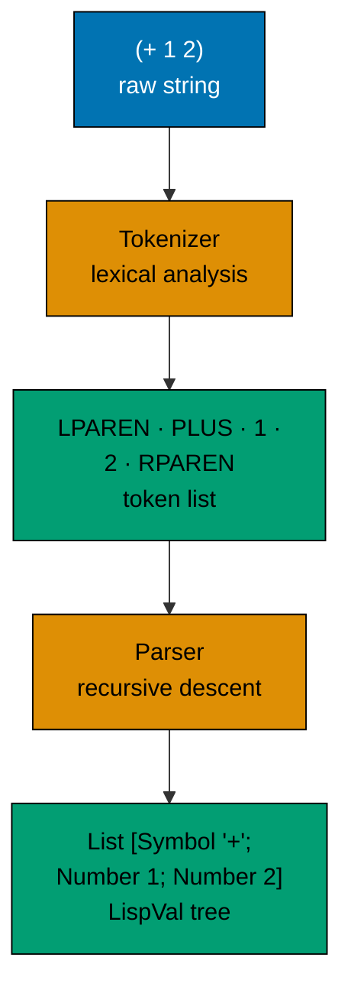
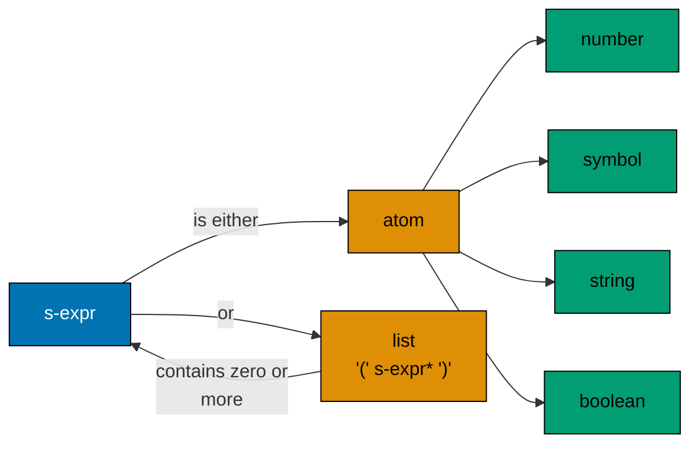
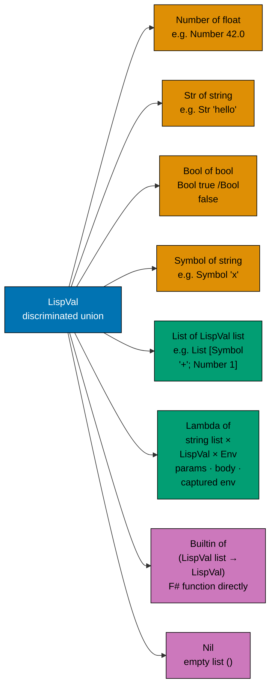
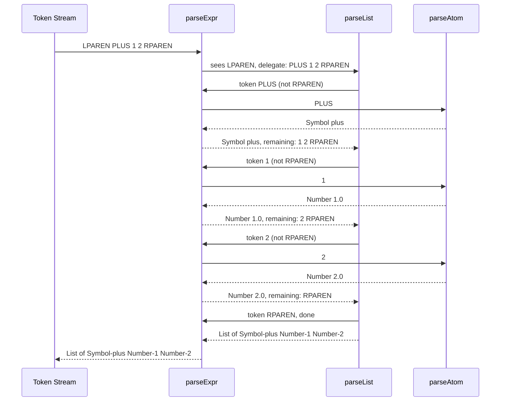
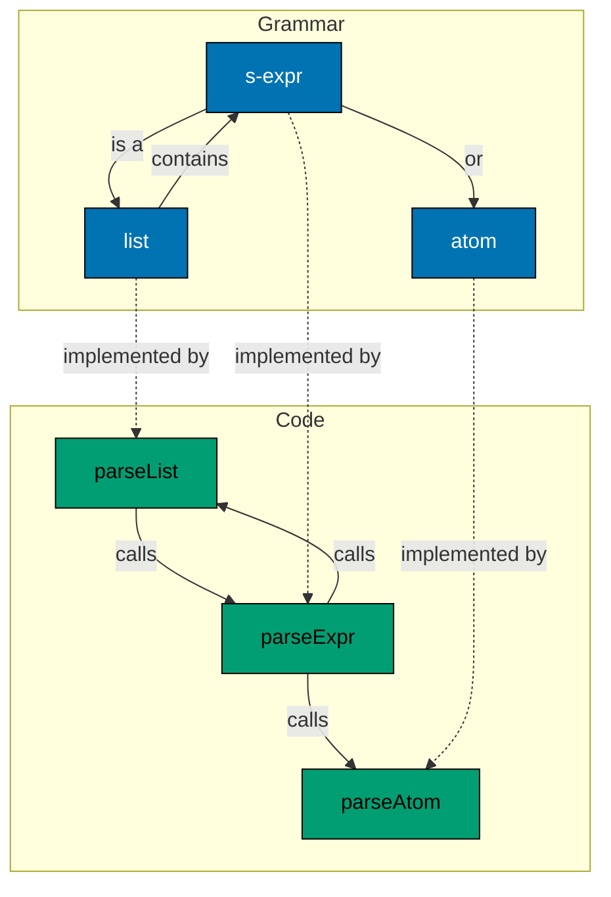
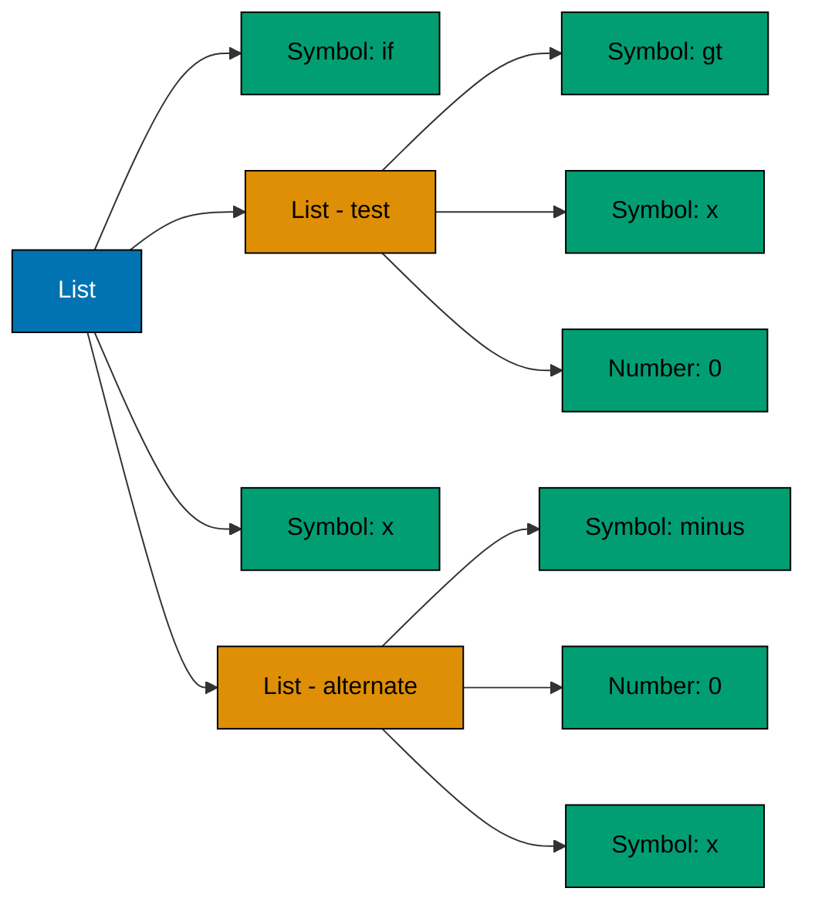

Every interpreter starts the same way: raw text goes in, structured data comes out. This phase has two stages — **tokenizing** (breaking text into tokens) and **reading** (assembling tokens into nested structures). Together they constitute the **front end** of our interpreter.

## The Front-End Pipeline



## CS Concept: Lexical Analysis

**Lexical analysis** (or lexing, or tokenizing) is the process of grouping a stream of characters into meaningful units called **tokens**. A token is the smallest unit of syntax — a number, a string, a symbol, a parenthesis.

Lexical analysis answers: "what are the words?"
Parsing answers: "what do the words mean structurally?"

For Scheme, the token types are:

| Token       | Examples                     |
| ----------- | ---------------------------- |
| Left paren  | `(`                          |
| Right paren | `)`                          |
| Number      | `42`, `-7`, `3.14`           |
| String      | `"hello"`, `"world"`         |
| Boolean     | `#t`, `#f`                   |
| Symbol      | `+`, `define`, `x`, `my-var` |

No keywords — `define`, `if`, `lambda` are just symbols. The interpreter, not the lexer, gives them special meaning.

## CS Concept: Context-Free Grammars

The structure of S-expressions can be described as a **context-free grammar** (CFG):

```
s-expr  ::= atom | list
list    ::= '(' s-expr* ')'
atom    ::= number | string | boolean | symbol
```



This grammar is recursive: a list contains zero or more S-expressions, each of which may itself be a list. This recursive structure is what makes a recursive descent parser the natural implementation strategy.

**Context-free** means the rule for expanding a non-terminal does not depend on what surrounds it. This is a weaker requirement than natural languages but sufficient for all programming languages.

## The LispVal Type

Before parsing, we define the type that represents all Lisp values throughout the interpreter. In F#, this is a **discriminated union** — a sum type with named cases.

```fsharp
type Env = Map<string, LispVal ref>

and LispVal =
    | Number of float
    | Str of string
    | Bool of bool
    | Symbol of string
    | List of LispVal list
    | Lambda of string list * LispVal * Env
    | Builtin of (LispVal list -> LispVal)
    | Nil
```



**Why discriminated unions?** A DU forces the evaluator to handle every case. Pattern matching on a `LispVal` that misses a case produces a compile-time warning. This compiler-enforced exhaustiveness is a genuine correctness tool.

## Tokenizer

The tokenizer takes a string and produces a list of token strings.

```fsharp
let tokenize (input: string) : string list =
    let spaced =
        input
            .Replace("(", " ( ")
            .Replace(")", " ) ")

    spaced.Split([| ' '; '\t'; '\n'; '\r' |], System.StringSplitOptions.RemoveEmptyEntries)
    |> Array.toList
```

**What the tokenizer does NOT do:** it does not assign types to tokens. The string `"42"` comes out as the string `"42"`, not as a number. Typing happens in the next stage.

## Parser: Recursive Descent

The parser converts a flat list of token strings into a nested `LispVal`. The algorithm is a classic **recursive descent parser** — each grammar rule corresponds to a function.

```fsharp
let parseAtom (token: string) : LispVal =
    match token with
    | "#t" -> Bool true
    | "#f" -> Bool false
    | _ ->
        match System.Double.TryParse(token) with
        | true, n -> Number n
        | _ -> Symbol token

let rec parseExpr (tokens: string list) : LispVal * string list =
    match tokens with
    | [] -> failwith "Unexpected end of input"
    | "(" :: rest ->
        let vals, remaining = parseList rest []
        List vals, remaining
    | ")" :: _ -> failwith "Unexpected ')'"
    | token :: rest -> parseAtom token, rest

and parseList (tokens: string list) (acc: LispVal list) : LispVal list * string list =
    match tokens with
    | [] -> failwith "Missing closing ')'"
    | ")" :: rest -> List.rev acc, rest
    | _ ->
        let expr, remaining = parseExpr tokens
        parseList remaining (expr :: acc)
```

## Parsing `(+ 1 2)` Step by Step



## Recursive Descent = Grammar as Code

The mutual recursion between `parseExpr` and `parseList` mirrors the grammar's mutual recursion between `s-expr` and `list`:



## Putting It Together: The Read Function

```fsharp
let read (input: string) : LispVal =
    let tokens = tokenize input
    let expr, remaining = parseExpr tokens
    if remaining <> [] then
        failwith $"Unexpected tokens after expression: {remaining}"
    expr
```

Test it:

```fsharp
read "(+ 1 2)"
// → List [Symbol "+"; Number 1.0; Number 2.0]

read "(define x 10)"
// → List [Symbol "define"; Symbol "x"; Number 10.0]

read "(lambda (x y) (* x y))"
// → List [Symbol "lambda"; List [Symbol "x"; Symbol "y"]; List [Symbol "*"; Symbol "x"; Symbol "y"]]
```

The parser has no knowledge of what `define` or `lambda` mean — those are just symbols. The evaluator (Part 3) gives them meaning.

## CS Concept: Why Recursive Descent?

Recursive descent is not the only parsing algorithm. There are table-driven parsers (LL, LR, LALR) used by most production compiler generators. Why recursive descent here?

1. **Simplicity** — each grammar rule is a function. The code structure mirrors the grammar exactly.
2. **Scheme's grammar is LL(1)** — at every point, one token of lookahead is sufficient to decide which rule applies.
3. **Good error messages** — the call stack tells you exactly where in the grammar parsing failed.
4. **Hand-written = transparent** — reading a hand-written recursive descent parser is much more instructive than reading a generated parser.

## What We Have

After Part 2, we can transform any valid Scheme expression from text into a structured `LispVal` tree:



In [Part 3](/en/learn/software-engineering/compilers-and-interpreters/lisp-interpreter-in-fsharp/part-3-environments-and-evaluation), we implement the environment model and the core `eval`/`apply` loop that gives these trees meaning.
