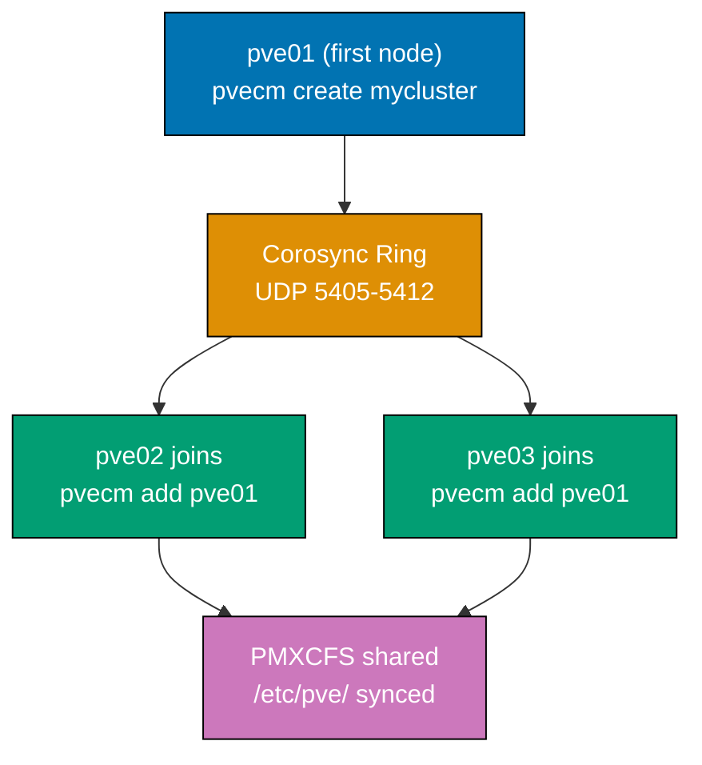
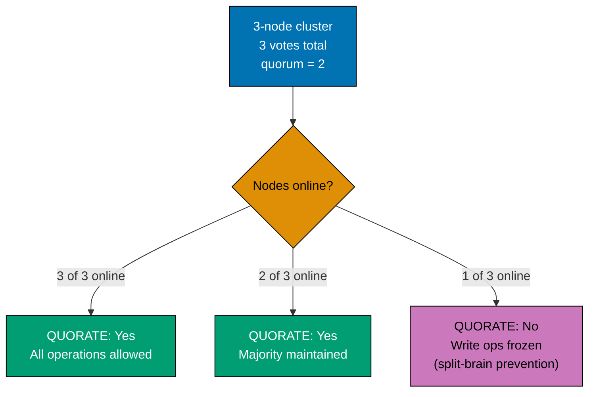
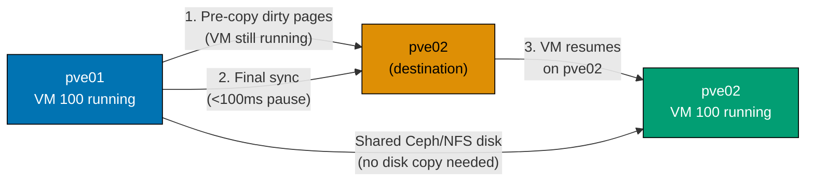
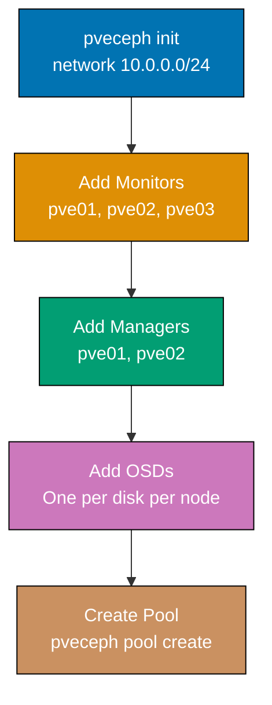
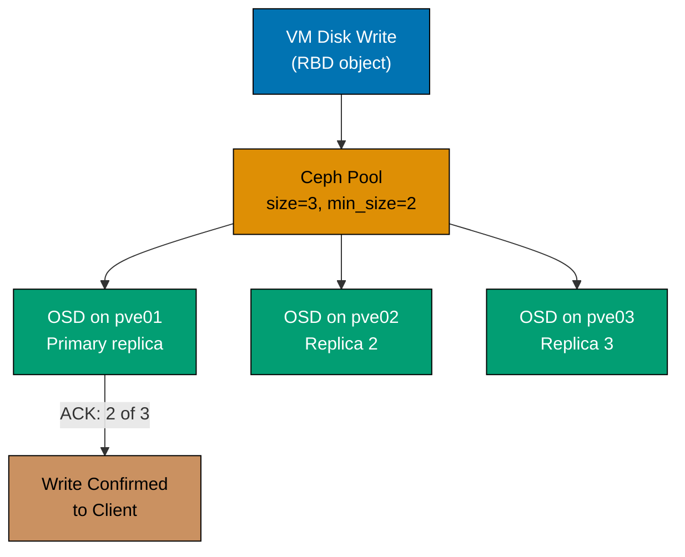
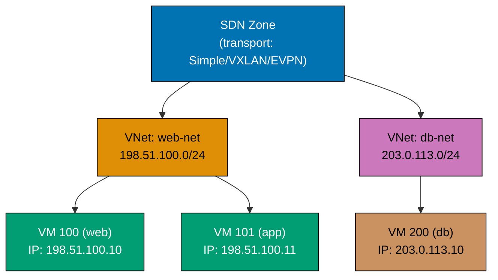
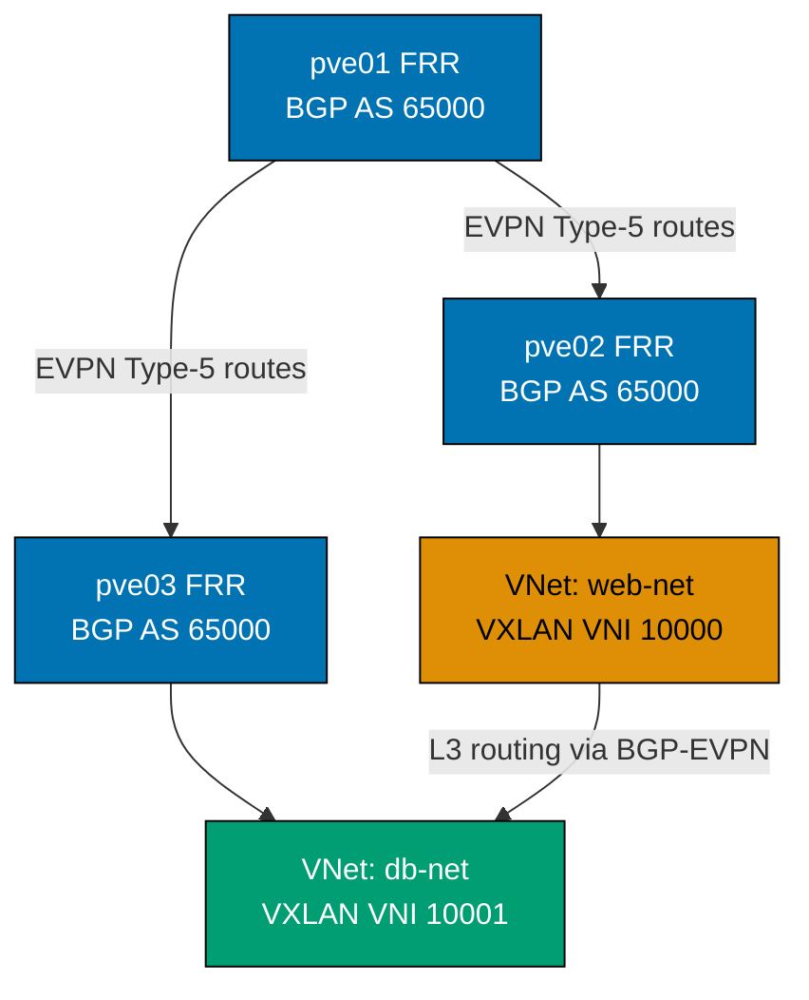
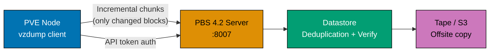
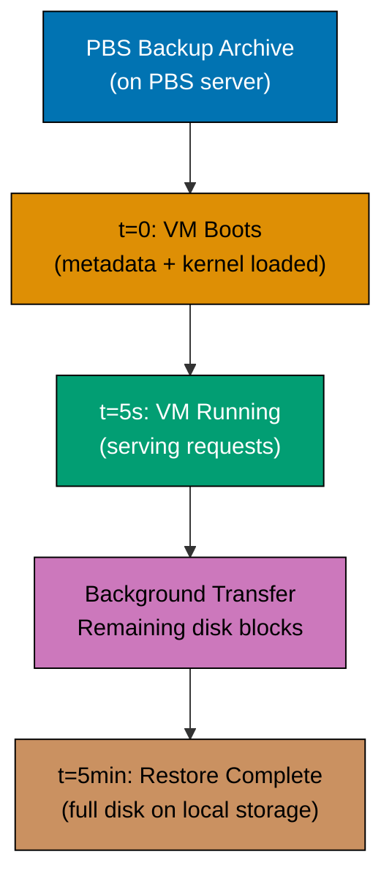

Build on Proxmox fundamentals through 29 annotated examples covering multi-node clustering, distributed Ceph storage, software-defined networking, Proxmox Backup Server integration, and automation workflows.

## Group 8: Clustering

### Example 29: Create and Join a Multi-Node Cluster

Proxmox clustering uses Corosync for distributed state and quorum. All cluster nodes share the same `/etc/pve/` configuration filesystem via PMXCFS (Proxmox Cluster File System).



**Code**:

```bash
# === ON pve01 (first node): Create the cluster ===

# Create a new cluster named 'mycluster'
pvecm create mycluster
# => mycluster created; Corosync listens on UDP 5405-5412 (open in firewall)

# Verify cluster is running on pve01
pvecm status
# => Name: mycluster | Quorate: Yes | Votes: 1

# === ON pve02 and pve03: Join the cluster ===
# Prerequisites: joining node must have no existing VMs (joining wipes local cluster state)
pvecm add 192.0.2.100
# => Node joined; /etc/pve/ content synchronized from pve01

pvecm add 192.0.2.100
# => Node pve03 joined cluster 'mycluster'

# Verify cluster membership from any node
pvecm nodes
# => Node 1 (pve01): 1 vote | Node 2 (pve02): 1 vote | Node 3 (pve03): 1 vote (quorum=2)
```

**Key Takeaway**: Cluster creation must happen before any VMs are created on member nodes—joining a node with existing VMs requires migrating them away first or accepting configuration conflicts.

**Why It Matters**: A three-node cluster is the minimum for production HA—it provides a quorum majority (2 of 3 nodes) that allows the cluster to remain functional when one node fails. Two-node clusters require a QDevice (Example 31) to avoid split-brain. The PMXCFS shared configuration filesystem means VM configurations are visible on all nodes instantly—a VM config created on pve01 is immediately visible on pve02 without replication delay.

---

### Example 30: Inspect Cluster Membership and Quorum Status

Quorum determines whether a cluster partition can make decisions. Understanding quorum prevents accidental cluster split-brain during network partitions.



**Code**:

```bash
# Check complete cluster status including quorum
pvecm status
# => Name: mycluster | Nodes: 3 | Quorate: Yes | Expected votes: 3 | Quorum: 2

# Check Corosync ring status (network connectivity between nodes)
corosync-quorumtool -s
# => Quorate: Yes | pve01: 1 vote online | pve02: 1 vote online | pve03: 1 vote online

# Check if cluster remains quorate after simulated node failure (disconnect pve03)
pvecm status | grep Quorate
# => Quorate: Yes  (2 of 3 nodes sufficient for majority)

# View cluster node health in JSON (useful for monitoring scripts)
pvesh get /cluster/status
# => [{"type":"cluster","quorate":1,"nodes":3}, {"type":"node","name":"pve01","online":1}, ...]
```

**Key Takeaway**: A cluster is quorate when it has more than half its total votes—losing quorum causes all write operations to halt, preventing split-brain data corruption.

**Why It Matters**: Understanding quorum is essential for planning maintenance windows. Taking a node offline in a three-node cluster is safe (2 of 3 votes remain). Taking two nodes offline simultaneously loses quorum and freezes all VM operations across the cluster. Operations teams that misunderstand quorum have caused cascading failures by taking nodes down in the wrong order, locking themselves out of the cluster configuration interface during critical incidents.

---

### Example 31: Configure a Corosync QDevice for 2-Node Clusters

A QDevice is an external tie-breaker that gives 2-node clusters a third vote, preventing split-brain without requiring a third full Proxmox node.

**Code**:

```bash
# === ON a separate Linux machine (not a PVE node): Set up QDevice server ===
# Requirements: Debian/Ubuntu with corosync-qnetd; provides tie-breaking vote
apt install corosync-qnetd
# => QNet daemon installed

# Start and enable the QNet daemon (listens on port 5403)
systemctl enable --now corosync-qnetd
# => corosync-qnetd.service started

# === ON pve01 (one of the two cluster nodes): Configure QDevice ===
apt install corosync-qdevice
# => corosync-qdevice installed

# Add QDevice (copies SSH keys, reconfigures Corosync on all cluster nodes)
pvecm qdevice setup 192.0.2.200
# => QDevice configured; Corosync restarted on all nodes

# Verify QDevice is active (Expected votes: 3 = 2 nodes + 1 QDevice)
pvecm status | grep -A5 "Quorum information"
# => Quorate: Yes | Expected votes: 3 | Flags: Quorate Qdevice

# Check QDevice connection status (State: connected = voting)
corosync-quorumtool -s | grep -i qdevice
# => State: connected | Votes: 1 | Algo: ffsplit
```

**Key Takeaway**: A QDevice allows a 2-node cluster to survive one node failure without split-brain—the surviving node plus the QDevice's vote equals quorum.

**Why It Matters**: Two-node clusters without QDevice are operationally dangerous—if a node fails or reboots for updates, the remaining node loses quorum and halts all VM operations, even though it is perfectly functional. The QDevice can run on minimal hardware (Raspberry Pi, cloud VM) and provides production-grade quorum at very low cost. Many small deployments use a QDevice instead of a third Proxmox node to reduce hardware costs while maintaining HA capabilities.

---

### Example 32: Perform Live Online VM Migration Between Nodes

Online migration moves a running VM between cluster nodes without downtime. It requires shared storage visible to both nodes (NFS, Ceph, iSCSI) or uses local storage with a live copy.



**Code**:

```bash
# Check where VM 100 is currently running
pvesh get /cluster/resources --type vm | python3 -c "
import sys, json
# => GET /cluster/resources?type=vm returns all VMs across all nodes
vms = json.load(sys.stdin)['data']
# => vms: list of dicts with vmid, node, status, cpu, mem fields
for vm in vms:
    # => iterate all VMs in the cluster
    if vm.get('vmid') == 100:
        # => filter to VM 100 only
        print(f\"VM 100 is on node: {vm['node']}, status: {vm['status']}\")
"
# => VM 100 is on node: pve01, status: running

# Live migrate VM 100 from pve01 to pve02 (zero downtime)
# --online 1: iterative pre-copy RAM pages; <100ms final pause for sync
qm migrate 100 pve02 --online 1
# => Precondition: shared storage (Ceph/NFS) required; local-lvm triggers disk copy
# => Migration complete: VM 100 now running on pve02
# => Without --online: VM stopped, disk copied, VM started on target (planned downtime)

# Verify VM is now on pve02
pvesh get /cluster/resources --type vm | python3 -c "
import sys, json
vms = json.load(sys.stdin)['data']
# => same API call; re-fetches current placement after migration
for vm in vms:
    # => iterate all VMs; check each for vmid match
    if vm.get('vmid') == 100:
        print(f\"VM 100 is now on node: {vm['node']}\")
        # => prints current node after migration confirms placement change
"
# => VM 100 is now on node: pve02

# Drain pve01: migrate all running VMs to pve02 before maintenance
# Python one-liner filters running VMs and prints their VMIDs
for vmid in $(pvesh get /nodes/pve01/qemu --output-format json | python3 -c "
import sys, json
vms = json.load(sys.stdin)['data']
# => vms: list of {vmid, name, status, mem, cpu, ...} dicts
for vm in vms:
    # => check each VM's status field
    if vm['status'] == 'running':
        # => only migrate running VMs; stopped VMs stay on pve01
        print(vm['vmid'])
"); do
  # => loop iterates over each running VMID: 100, 105, ...
  qm migrate $vmid pve02 --online 1
  # => live migration: VM stays running on pve02 immediately after
  echo "Migrated VM $vmid to pve02"
  # => prints confirmation per VM
done
# => pve01 drained; safe to reboot for kernel update or hardware maintenance
```

**Key Takeaway**: Online migration requires shared storage between nodes (Ceph, NFS, iSCSI) or triggers a storage migration that copies disk data—the latter takes minutes proportional to disk size.

**Why It Matters**: Live migration is the fundamental operation enabling zero-downtime infrastructure maintenance. Kernel security patches, hardware replacement, and Proxmox upgrades all require rebooting the hypervisor—live migration drains workloads off the node before the reboot, then redistributes them after. Teams that master migration workflows perform maintenance during business hours instead of late-night maintenance windows, reducing operator fatigue and the error rate that comes with exhausted administrators.

---

### Example 33: Migrate an LXC Container Between Nodes

Container migration uses `pct migrate` and is faster than VM migration because containers share the kernel—only the container filesystem and configuration transfer.

**Code**:

```bash
# Check container location
pvesh get /cluster/resources --type lxc | python3 -c "
import sys, json
cts = json.load(sys.stdin)['data']
for ct in cts:
    if ct.get('vmid') == 200:
        print(f\"CT 200 ({ct['name']}) is on node: {ct['node']}, status: {ct['status']}\")
"
# => CT 200 (web-server-01) is on node: pve01, status: running

# Migrate running container (online migration, container stays up)
pct migrate 200 pve02 \
  --target-storage local-lvm \
  --online 1
# => Migrating LXC container 200 from pve01 to pve02
# => --target-storage local-lvm: destination storage for rootfs
# => --online 1: container continues serving requests during migration
# => Syncing container filesystem (rsync initial pass)...
# => Pausing container for final sync (<1 second for most workloads)...
# => Resuming container on pve02...
# => CT 200 migration complete

# For offline migration (container stopped during transfer)
pct shutdown 200
# => CT 200 stopped

pct migrate 200 pve03 --target-storage local-lvm
# => Migrating stopped CT 200 from pve01 to pve03...
# => Copying rootfs (8 GB)... (takes seconds-to-minutes depending on size)
# => Container config updated: pve03 now manages CT 200
# => Starting CT 200 on pve03...
pct start 200
# => CT 200 running on pve03

# Verify container is healthy after migration
pct exec 200 -- systemctl status nginx
# => ● nginx.service - A high performance web server
# =>      Active: active (running) ...
```

**Key Takeaway**: Container online migration causes <1 second interruption vs VM migration's <100ms—both are imperceptible to end users, but containers migrate faster because there is no RAM state to transfer.

**Why It Matters**: Container migration enables flexible workload distribution across cluster nodes. A node that is trending toward CPU saturation can shed containers to underutilized nodes in seconds. Automated load balancing scripts that monitor `pvesh get /cluster/resources` and trigger `pct migrate` when CPU imbalance exceeds a threshold create self-balancing infrastructure—reducing manual intervention and preventing performance degradation before it impacts end users.

---

### Example 34: Configure VLAN-Aware Networking on a Bridge

VLAN-aware bridges allow multiple VLANs to be tagged through a single bridge, with per-VM VLAN assignment—eliminating the need for separate bridge interfaces per VLAN.

**Code**:

```bash
# Enable VLAN awareness on the main bridge vmbr0
# bridge-vlan-aware yes: enables 802.1Q tagging; bridge-vids 2-4094: full range
sed -i '/^auto vmbr0/,/^auto/ { /bridge-stp/a\    bridge-vlan-aware yes\n    bridge-vids 2-4094 }' \
  /etc/network/interfaces
# => vmbr0 now supports 802.1Q VLAN tagging for all VMs

ifreload -a
# => vmbr0 reconfigured with VLAN awareness enabled

# Assign VM to VLAN 100 (web tier); switch port must be a trunk port
qm set 100 --net0 virtio,bridge=vmbr0,tag=100
# => VM 100 sends/receives VLAN 100 traffic; guest sees untagged frames

# Assign VM to VLAN 200 (database tier) — isolated from VLAN 100
qm set 105 --net0 virtio,bridge=vmbr0,tag=200
# => VM 105 NIC on VLAN 200 (no direct L2 path to VLAN 100)

# Trunk port: VM receives tagged traffic (for virtual routers like VyOS/OPNsense)
qm set 150 --net0 virtio,bridge=vmbr0,trunks=100;200;300
# => VM 150 receives tagged frames for VLANs 100, 200, and 300

# Verify VLAN configuration on bridge
bridge vlan show dev vmbr0
# => tap100i0: VLAN 100 PVID | tap105i0: VLAN 200 PVID  (per-VM tap isolation)
```

**Key Takeaway**: VLAN-aware bridges enable network segmentation with a single physical NIC and bridge—VMs on different VLANs cannot communicate directly without a router, providing L2 isolation.

**Why It Matters**: Network micro-segmentation is a zero-trust security principle that limits blast radius when a VM is compromised. A web VM on VLAN 100 breached by an attacker cannot directly reach the database VM on VLAN 200—traffic must traverse a firewall/router (physical or virtual) where security rules apply. VLAN segmentation on Proxmox costs nothing beyond a VLAN-aware switch and is the most impactful single security configuration for multi-VM environments.

---

### Example 35: Set Up Linux Bonding for Network Redundancy

Linux bonding aggregates multiple NICs into a logical interface, providing redundancy (active-backup) or increased throughput (balance-slb, LACP).

**Code**:

```bash
# Configure active-backup bonding (failover: one NIC active, second standby)
cat >> /etc/network/interfaces << 'EOF'

auto bond0
iface bond0 inet manual
    bond-slaves eno1 eno2     # Two physical NICs forming the bond
    bond-mode active-backup   # Only one NIC active at a time; failover on link failure
    bond-miimon 100           # Check link status every 100ms
    bond-primary eno1         # Prefer eno1 as active NIC when both are up

auto vmbr0
iface vmbr0 inet static
    address 192.0.2.100/24
    gateway 192.0.2.1
    bridge-ports bond0        # Bridge uses bonded interface instead of single NIC
    bridge-stp off
    bridge-fd 0
EOF
# => bond0 provides redundancy: if eno1 fails, eno2 becomes active in <200ms

ifreload -a
# => Network interfaces reloaded with bonding configuration

# Verify bonding status
cat /proc/net/bonding/bond0
# => Bonding Mode: fault-tolerance (active-backup)
# => Primary Slave: eno1 (primary_reselect failure)
# => Currently Active Slave: eno1
# => MII Status: up
# => MII Polling Interval (ms): 100
# => Slave Interface: eno1
# =>   MII Status: up
# =>   Speed: 10000 Mbps    (10 GbE NIC)
# =>   Duplex: full
# => Slave Interface: eno2
# =>   MII Status: up
# =>   Speed: 10000 Mbps

# Test failover by disabling the active NIC
ip link set eno1 down
# => bond0 detects eno1 link failure within 100ms
# => eno2 becomes active slave automatically
cat /proc/net/bonding/bond0 | grep "Active Slave"
# => Currently Active Slave: eno2   (failover successful)

ip link set eno1 up
# => eno1 returns; remains standby since eno2 is now active
```

**Key Takeaway**: Active-backup bonding provides transparent NIC failover without requiring switch configuration—unlike LACP (802.3ad), which needs switch-side port-channel configuration.

**Why It Matters**: Network hardware failure is one of the most common causes of unexpected downtime in small-to-medium Proxmox deployments. Bonding adds resilience with equipment already in the server—a second NIC costs $20-50 and eliminates NIC failure as a downtime cause. Teams managing business-critical workloads should consider bonding mandatory; even lab environments benefit from understanding bonding concepts before being surprised by a NIC failure during a production incident.

---

## Group 9: Advanced Storage

### Example 36: Configure NFS Storage Backend

NFS provides shared storage accessible from all cluster nodes—essential for online VM migration and cluster-wide ISO/backup repositories.

**Code**:

```bash
# Add NFS storage to Proxmox (NFS server already configured separately)
pvesh create /storage \
  --storage nfs-share \
  --type nfs \
  --server 192.0.2.50 \
  --export /mnt/proxmox-storage \
  --content images,iso,backup \
  --options vers=4.2,hard,timeo=600 \
  --maxfiles 10
# => NFS storage 'nfs-share' added
# => server: NFS server IP or hostname
# => export: NFS export path on the server
# => content=images: VM disk images stored here (enables shared storage for live migration)
# => content=iso: ISOs available cluster-wide
# => options vers=4.2: NFSv4.2 for best performance (pNFS, sparse file support)
# => options hard: retries I/O indefinitely on timeout (vs soft which returns errors)
# => timeo=600: 60-second timeout before NFS retries (prevents fast-fail on transient network hiccups)
# => maxfiles 10: keep at most 10 backup archives per guest on this storage

# Verify NFS is mounted and accessible
pvesh get /nodes/pve01/storage/nfs-share/status
# => {"total": 1099511627776, "used": 214748364800, "avail": 884763262976, "active": 1}

# Test that NFS storage appears on all cluster nodes
for node in pve01 pve02 pve03; do
  echo -n "$node: "
  # => print node name prefix before each status line
  pvesh get /nodes/$node/storage/nfs-share/status | python3 -c "
import sys, json
d = json.load(sys.stdin)['data']
print(f\"active={'yes' if d.get('active') else 'no'}, avail={d.get('avail', 0)//1024//1024//1024}GB\")
  "
done
# => pve01: active=yes, avail=823GB | pve02: active=yes | pve03: active=yes
# => all nodes can access NFS; live VM migration is now possible

# List VM disk images on NFS storage
pvesh get /nodes/pve01/storage/nfs-share/content --content images
# => Returns list of .qcow2/.raw VM disk images stored on the NFS share
```

**Key Takeaway**: NFS storage shared across all cluster nodes is the minimum requirement for online VM migration—VMs on node-local storage can only be cold-migrated (offline).

**Why It Matters**: NFS is the simplest path to shared storage for small clusters. The tradeoff versus Ceph is complexity: NFS is a single point of failure (the NFS server itself), while Ceph is distributed across multiple OSDs with no single point of failure. Many teams start with NFS and migrate to Ceph as their cluster grows and availability requirements increase. For dev/test environments, NFS is often the right choice; for production HA, Ceph or iSCSI with multipath provides better resilience.

---

### Example 37: Configure iSCSI Storage with LVM

iSCSI provides block storage over TCP/IP—more performant than NFS for VM disks and supports LVM thin pools for space efficiency.

**Code**:

```bash
# Get the iSCSI initiator IQN (unique ID for this node)
cat /etc/iscsi/initiatorname.iscsi
# => InitiatorName=iqn.1993-08.org.debian:01:pve01-iscsi-initiator

# Add iSCSI storage (content=none: use LVM on top of raw block device)
pvesh create /storage \
  --storage iscsi-san \
  --type iscsi \
  --portal 192.0.2.60 \
  --target iqn.2025-01.com.company:storage-target-01 \
  --content none
# => iSCSI storage 'iscsi-san' registered; LUNs appear as raw block devices
# => --portal: IP:port of iSCSI target (default port 3260)
# => --target: iSCSI Qualified Name (IQN) of the storage target
# => --content none: raw block device; add LVM layer on top for VM disk provisioning

# Scan for available LUNs on the iSCSI target
pvesh get /nodes/pve01/storage/iscsi-san/content
# => [{"volid": "iscsi-san:0.0.0.0.0.0.0.0", "size": 1099511627776}]  (1 TB LUN 0)

# Add LVM thin pool on top of the iSCSI LUN (--nodes restricts to specific nodes)
pvesh create /storage \
  --storage iscsi-lvm \
  --type lvmthin \
  --vgname iscsi-vg \
  --thinpool data \
  --content images,rootdir \
  --nodes pve01,pve02,pve03
# => iscsi-lvm registered; all three nodes can provision VM disks here
# => --vgname: LVM volume group name created on the iSCSI LUN
# => --thinpool: thin pool name within the VG (enables thin provisioning / snapshots)
# => --nodes: restrict availability to listed nodes (prevents accidental use from others)

# Verify iSCSI connection and LVM physical volume
iscsiadm -m session
# => tcp: [1] 192.0.2.60:3260 iqn.2025-01.com.company:storage-target-01

pvs
# => /dev/sdb  iscsi-vg  1024.00g (iSCSI LUN) | /dev/sda3  pve  (local)
```

**Key Takeaway**: iSCSI with LVM thin pools provides shared block storage with thin provisioning—better random I/O performance than NFS for database VM workloads.

**Why It Matters**: Storage performance directly impacts VM density and application response times. iSCSI block storage eliminates the NFSv4 protocol overhead for metadata-heavy workloads and provides consistent sub-millisecond latency for random reads—critical for OLTP databases running in VMs. Teams choosing between NFS and iSCSI should benchmark their specific workloads; for sequential workloads (video streaming, log storage), NFS often performs comparably, while database-heavy environments benefit significantly from iSCSI block storage.

---

### Example 38: Create a ZFS Pool via CLI

ZFS provides enterprise storage features (checksumming, compression, deduplication, snapshots, replication) as a kernel module integrated into Proxmox VE.

**Code**:

```bash
# List available disks for ZFS pool creation
lsblk -d -o NAME,SIZE,MODEL | grep -v "loop\|sr"
# => sda   500G   Samsung SSD 870
# => sdb   500G   WD Red Plus
# => sdc   500G   WD Red Plus
# => sdd   500G   WD Red Plus

# Create ZFS mirror pool (RAID-1: 2 drives, 1 drive can fail)
zpool create -f \
  -o ashift=12 \
  -O compression=lz4 \
  -O atime=off \
  -O recordsize=64K \
  tank mirror /dev/sdb /dev/sdc
# => ZFS pool 'tank' created (mirror: RAID-1 equivalent)
# => ashift=12: 4K sector alignment (required for modern SSDs and HDDs)
# => compression=lz4: fast transparent compression (30-50% space savings typical)
# => atime=off: disable access time updates (significant I/O reduction)
# => recordsize=64K: optimal for mixed workloads (databases may prefer 8K)

# Create RAIDZ pool (RAID-5 equivalent: 3 drives, 1 drive can fail)
zpool create -f \
  -o ashift=12 \
  -O compression=lz4 \
  -O atime=off \
  tank-raidz raidz /dev/sdb /dev/sdc /dev/sdd
# => ZFS RAIDZ pool 'tank-raidz' created
# => 3 drives, 1 parity: 66% usable capacity (vs mirror's 50%)
# => RAIDZ2 uses -o raidz2 for 2-parity (survives 2 simultaneous drive failures)

# Check pool health and statistics
zpool status tank
# => pool: tank | state: ONLINE | mirror-0: sdb ONLINE, sdc ONLINE
# => errors: No known data errors

# Register ZFS pool in Proxmox storage
pvesh create /storage \
  --storage tank \
  --type zfspool \
  --pool tank \
  --content images,rootdir \
  --sparse 1
# => ZFS pool 'tank' registered as Proxmox storage
```

**Key Takeaway**: ZFS checksumming detects and (with redundancy) auto-corrects silent data corruption—a critical feature for long-running VM disk images that accumulate bit rot over years of operation.

**Why It Matters**: Silent data corruption ("bit rot") affects spinning hard drives at a measurable rate over years. Without ZFS checksumming, a VM disk can accumulate corrupted sectors that cause intermittent application crashes months after the physical error occurs—making the root cause nearly impossible to diagnose. ZFS scrubs (regular data integrity checks) and self-healing with mirrored or parity pools mean corrupted data is detected and repaired automatically before applications are affected. This is why storage-sensitive deployments (databases, media archives) choose ZFS over ext4/LVM.

---

## Group 10: Ceph Distributed Storage

### Example 39: Initialise and Deploy a Ceph Cluster

Ceph is a distributed, self-healing storage system integrated directly into Proxmox VE. It eliminates the single-point-of-failure of NFS while providing higher performance and automatic data replication.



**Code**:

```bash
# Initialize Ceph on the cluster (run on pve01)
pveceph init \
  --network 10.0.0.0/24 \
  --cluster-network 10.0.1.0/24
# => Initializing Ceph cluster...
# => --network: Ceph public network (client-to-OSD traffic)
# => --cluster-network: Ceph cluster network (OSD replication traffic, separate NIC recommended)
# => Ceph Squid (19.2.3) installed on all nodes

# Add Ceph monitors (MONs) — need 3+ for quorum
pveceph mon create --node pve01
# => Created Ceph MON on pve01

pveceph mon create --node pve02
# => Created Ceph MON on pve02

pveceph mon create --node pve03
# => Created Ceph MON on pve03

# Add Ceph managers (MGRs) — provide dashboards and metrics
pveceph mgr create --node pve01
# => Created Ceph MGR on pve01

pveceph mgr create --node pve02
# => Created Ceph MGR on pve02 (standby)

# Add OSDs (Object Storage Daemons) — one per disk per node
# Each OSD serves one physical disk; OSD manages data distribution
pveceph osd create /dev/sdb --node pve01
# => Created OSD on /dev/sdb (pve01): OSD ID 0

pveceph osd create /dev/sdb --node pve02
# => Created OSD on /dev/sdb (pve02): OSD ID 1

pveceph osd create /dev/sdb --node pve03
# => Created OSD on /dev/sdb (pve03): OSD ID 2

# Check Ceph cluster health
ceph status
# => health: HEALTH_OK
# => mon: 3 daemons quorum pve01,pve02,pve03 | mgr: pve01(active) pve02(standby)
# => osd: 3 up, 3 in | usage: 1.5 GiB used / 1.5 TiB avail
```

**Key Takeaway**: Ceph requires a minimum of 3 MON daemons and 3 OSDs across 3 nodes for fault tolerance—a single node failure leaves 2 MONs and the cluster remains fully operational.

**Why It Matters**: Ceph fundamentally changes the storage resilience model. With NFS, a single NAS failure brings down all VMs on shared storage simultaneously. With Ceph across 3 nodes, an entire node failure causes no data loss or VM downtime—data is replicated across remaining nodes and Ceph automatically re-replicates to restore the configured replication factor. The operational cost is higher complexity; the reward is production-grade storage resilience without expensive enterprise SAN hardware.

---

### Example 40: Create and Configure Ceph Storage Pools

Ceph pools are named storage containers with configurable replication, placement groups, and CRUSH rules. Proxmox uses RBD (RADOS Block Device) pools for VM disk storage.



**Code**:

```bash
# Create a Ceph pool for VM images with 3x replication
# size=3: 3 replicas; min_size=2: writes succeed with 2 copies (1 OSD can fail)
pveceph pool create vm-images \
  --size 3 \
  --min_size 2 \
  --pg_autoscale_mode on \
  --application rbd
# => pool 'vm-images' created; pg_autoscale manages placement group count automatically
# => --application rbd: tag pool for RADOS Block Device use (enables RBD-specific optimizations)
# => --pg_autoscale_mode on: Ceph automatically adjusts placement group count as pool grows

# Register the Ceph pool as Proxmox storage (krbd=0: use QEMU librbd for better perf)
pvesh create /storage \
  --storage ceph-vm \
  --type rbd \
  --pool vm-images \
  --monhost "pve01,pve02,pve03" \
  --content images,rootdir \
  --krbd 0
# => ceph-vm registered; krbd=1 required for LXC containers on Ceph
# => --monhost: comma-separated list of Ceph monitor nodes (for initial connection)
# => --krbd 0: use QEMU in-process librbd (faster); krbd=1 uses kernel RBD module

# Verify pool health and replication
ceph osd pool ls detail | grep vm-images
# => pool 1 'vm-images' replicated size 3 min_size 2 pg_num 32

# Check pool usage and available capacity
ceph df | grep vm-images
# => vm-images  256M stored | 768M used | 0.05% | 1.5TiB available
# => 'used' = raw bytes across all replicas; 'stored' = logical data before replication
```

**Key Takeaway**: Ceph pools with `size=3` and `min_size=2` ensure VM data survives one OSD/node failure while the cluster continues accepting writes—the foundation of production storage resilience.

**Why It Matters**: Pool configuration directly impacts the durability-performance-cost balance. `size=2` halves storage consumption but offers no fault tolerance for simultaneous OSD failures; `size=3` is the production standard. The `pg_autoscale_mode=on` feature (introduced in Ceph Nautilus) eliminates the historically complex placement group calculation—operators no longer need to manually tune PG counts based on OSD count and pool usage.

---

### Example 41: Create a Ceph Erasure-Coded Pool

Erasure coding provides higher storage efficiency than replication (e.g., k=2, m=1 uses only 1.5x storage instead of 3x) at the cost of higher computational overhead.

**Code**:

```bash
# Create an erasure coding profile (k=2 data chunks, m=1 parity chunk)
ceph osd erasure-code-profile set ec-2-1 \
  k=2 \
  m=1 \
  plugin=jerasure \
  technique=reed_sol_van
# => Erasure code profile 'ec-2-1' created
# => k=2: data is split into 2 chunks; 2 OSDs store data
# => m=1: 1 parity chunk stored on a third OSD
# => Total OSDs needed: k+m = 3 (minimum)
# => Usable capacity: k/(k+m) = 2/3 = 66.7% (vs 33.3% with 3x replication)
# => Survives: up to m=1 OSD failure simultaneously

# Create an erasure-coded pool using the profile
pveceph pool create ec-backup \
  --erasure-coding k=2,m=1 \
  --add-storages 1
# => Pool 'ec-backup' created with erasure coding k=2, m=1
# => --add-storages 1: automatically register as Proxmox storage
# => Note: EC pools require a companion replicated pool for metadata (auto-created)

# Alternatively, create EC pool directly with ceph commands
ceph osd pool create ec-pool-2-1 erasure ec-2-1
# => pool 'ec-pool-2-1' created

# Enable RBD on the EC pool
ceph osd pool application enable ec-pool-2-1 rbd
# => enabled application 'rbd' on pool 'ec-pool-2-1'

# Check pool info to verify EC configuration
ceph osd pool get ec-backup erasure_code_profile
# => erasure_code_profile: ec-2-1    (profile applied to pool)

ceph df | grep ec-backup
# => POOL       STORED  OBJECTS  USED    %USED  MAX AVAIL
# => ec-backup  0 B     0        0 B     0      987 GiB   (66% of 1.5TiB raw)
```

**Key Takeaway**: Erasure coding with k=2,m=1 provides single-OSD fault tolerance at 1.5x storage overhead instead of 3x replication—ideal for backup and archive pools where the cost savings justify the CPU overhead.

**Why It Matters**: A 3-node Ceph cluster with 1 TB raw per node provides only 1 TB usable with 3x replication. The same cluster provides 2 TB usable with k=2,m=1 erasure coding—doubling effective capacity without additional hardware. For backup workloads with sequential access patterns (not random IOPS), the computational overhead of erasure coding is negligible. Teams running large media archives or log retention on Ceph EC pools can double their storage efficiency, directly reducing hardware procurement costs.

---

### Example 42: Monitor Ceph Cluster Health and OSD Status

Proactive Ceph monitoring prevents storage failures from becoming data loss. The `ceph` CLI provides detailed cluster health information.

**Code**:

```bash
# Overall cluster health summary
ceph health detail
# => HEALTH_WARN: osd.2 down | PG_DEGRADED: 256 objects 5.0% degraded
# => writes continue (min_size=2 met with 2 remaining OSDs)

# Detailed OSD status and placement
ceph osd tree
# => osd.0 pve01 up | osd.1 pve02 up | osd.2 pve03 down  (failed OSD identified)

# Monitor OSD I/O performance
ceph osd perf
# => osd 0: commit 2ms | osd 1: commit 3ms | osd 2: - (down, no I/O)

# Watch cluster recovery progress in real-time (updates every 5s)
watch -n 5 'ceph status'
# => recovery: 51200 kB/s, 25 objects/s | 156 active+clean, 20 active+recovering

# Check disk usage per OSD (identify overloaded OSDs by high WEIGHT vs disk size)
ceph osd df tree
# => Shows per-OSD usage, PG count, and REWEIGHT factor

# Set OSD back in service after replacement
ceph osd in osd.2
# => osd.2 marked in; cluster begins rebalancing data to restored OSD
```

**Key Takeaway**: Ceph transitions through `HEALTH_WARN` states during OSD failures but continues serving I/O—monitoring the `recovery` rate and PG status shows when data is fully restored.

**Why It Matters**: Ceph health monitoring is not optional—a `HEALTH_WARN` that goes unaddressed becomes `HEALTH_ERR` when a second OSD fails, potentially causing data loss. Teams integrate `ceph health json` output with Prometheus (via ceph-mgr's built-in Prometheus plugin) and alert on `HEALTH_WARN` states. Automated runbooks that page on-call when a single OSD fails—before it becomes a double failure—are the operational difference between "we replaced a failed disk at 9 AM" and "we spent 48 hours recovering data at 3 AM."

---

## Group 11: Software-Defined Networking

### Example 43: Configure SDN: Zone, VNet, and Subnet

Proxmox SDN (Software-Defined Networking) provides declarative L2/L3 overlay network management integrated into the Proxmox cluster. Zones define the transport type; VNets define the virtual networks; Subnets define IP ranges.



**Code**:

```bash
# Create a Simple zone (VLAN-based SDN zone using existing bridge)
pvesh create /cluster/sdn/zones \
  --zone simple-zone \
  --type simple \
  --bridge vmbr0 \
  --mtu 1500
# => SDN zone 'simple-zone' created
# => --type simple: VLAN-based zone; uses existing bridge (simplest SDN type)
# => --bridge vmbr0: physical bridge SDN uses for VLAN tagging
# => --mtu 1500: standard Ethernet MTU; lower if VLANs transit a VXLAN underlay

# Create a VNet in the zone with VLAN tag 100
pvesh create /cluster/sdn/vnets \
  --vnet web-vnet \
  --zone simple-zone \
  --tag 100 \
  --comment "Web application network (VLAN 100)"
# => VNet 'web-vnet' created with VLAN tag 100
# => --tag 100: 802.1Q VLAN ID; VMs on this VNet send/receive tagged frames for VLAN 100

# Create a subnet (snat=1: outbound NAT; dnszoneprefix: DNS registration)
pvesh create /cluster/sdn/vnets/web-vnet/subnets \
  --subnet 10.100.x.0/24 \
  --type subnet \
  --gateway 10.100.x.1 \
  --dnszoneprefix web \
  --snat 1
# => Subnet 10.100.x.0/24 added to web-vnet
# => --dnszoneprefix web: VM hostnames registered as web.<hostname>.internal in DNS
# => --snat 1: masquerade outbound traffic (VMs can reach internet without public IPs)

# Apply SDN configuration (propagates Linux interfaces to all cluster nodes)
pvesh set /cluster/sdn
# => SDN applied; all nodes have matching network interfaces
# => 'pvesh set /cluster/sdn' is the single apply command for all pending SDN changes

# Verify and assign VM to SDN VNet
pvesh get /cluster/sdn/vnets
# => [{"vnet":"web-vnet","zone":"simple-zone","tag":100}]
# => lists all configured VNets with zone and VLAN tag associations
qm set 100 --net0 virtio,bridge=web-vnet
# => VM 100 connected; SDN handles VLAN tagging automatically
```

**Key Takeaway**: SDN VNets provide a declarative abstraction over VLAN-tagged bridges—network topology is defined once in the cluster, applied consistently to all nodes, and VMs connect by VNet name rather than bridge+tag combinations.

**Why It Matters**: Manual VLAN bridge configuration is error-prone and inconsistent across nodes—one node might have `bridge-vids 100` configured while another does not, causing VM migration to fail silently. SDN centralizes network definitions so that adding a new VLAN requires one API call, not editing `/etc/network/interfaces` on every node. For teams managing networks programmatically (Terraform, Ansible), the SDN API is the authoritative interface that eliminates node-specific configuration drift.

---

### Example 44: Set Up a VXLAN Zone for Multi-Node L2 Overlay

VXLAN encapsulates L2 Ethernet frames in UDP packets, creating L2 domains that span multiple nodes without VLAN switch configuration. MTU adjustment is critical to prevent fragmentation.

**Code**:

```bash
# Create a VXLAN SDN zone (mtu=1450: physical 1500 minus 50-byte VXLAN header)
# CRITICAL: wrong MTU causes large packets to silently fragment/drop
pvesh create /cluster/sdn/zones \
  --zone vxlan-overlay \
  --type vxlan \
  --peers 192.0.2.100,192.0.2.101,192.0.2.102 \
  --mtu 1450
# => VXLAN zone 'vxlan-overlay' created (all node IPs must be listed as peers)
# => --type vxlan: encapsulates L2 frames in UDP (no switch VLAN configuration needed)
# => --peers: all participating node IPs; each node creates a VXLAN FDB entry per peer

# Create VNet with VNI 1001 (VNI = VXLAN equivalent of VLAN ID, 24-bit range)
pvesh create /cluster/sdn/vnets \
  --vnet vxlan-app-net \
  --zone vxlan-overlay \
  --tag 1001 \
  --comment "Application network via VXLAN (VNI 1001)"
# => VNet 'vxlan-app-net' with VNI 1001 created
# => --tag 1001: VXLAN Network Identifier (VNI); 24-bit range supports up to 16 million segments

pvesh create /cluster/sdn/vnets/vxlan-app-net/subnets \
  --subnet 172.16.x.0/24 \
  --gateway 172.16.x.1
# => Subnet 172.16.x.0/24 added
# => --gateway: L3 gateway IP created on each node (distributed anycast routing)

pvesh set /cluster/sdn
# => VXLAN interfaces created on all nodes at mtu 1450
# => applies the pending SDN config; creates vxlan<VNI> interfaces on every cluster node

# Verify VXLAN interfaces and test cross-node L2 connectivity
ip link show type vxlan
# => vxlan1001: mtu 1450 | vxlan id 1001 local 192.0.2.100 port 4789
qm agent 100 exec -- bash -c "ping -c3 172.16.x.20"
# => 64 bytes from 172.16.x.20: ttl=64 time=0.8 ms (traverses VXLAN tunnel)
# => uses QEMU guest agent to run ping inside VM without console access
```

**Key Takeaway**: VXLAN MTU must be set to physical MTU minus 50 bytes—failure to do so causes silently dropped large packets that manifest as intermittent TCP connection failures and degraded application performance.

**Why It Matters**: VXLAN enables multi-node L2 domains without VLAN switch provisioning—critical for environments where the network team cannot configure trunk ports on demand. Container-native environments (Kubernetes on Proxmox, for example) depend on overlay networks like VXLAN to implement pod networking across nodes. The MTU configuration is the most common operational mistake: applications work fine for small payloads but fail mysteriously for large HTTP responses or file transfers because jumbo frames fragment at the VXLAN boundary.

---

### Example 45: Configure BGP-EVPN Zone for Routed L3 SDN

BGP-EVPN (Border Gateway Protocol with Ethernet VPN) provides L3 routing between VNets using FRRouting, enabling inter-VXLAN routing without centralized gateway bottlenecks.



**Code**:

```bash
# BGP-EVPN requires FRRouting installed on all cluster nodes
apt install frr frr-pythontools
# => FRRouting installed (BGP, OSPF, VXLAN/EVPN control plane)
systemctl enable frr
# => FRR enabled; provides the BGP control plane for EVPN

# Create BGP-EVPN SDN zone (vrf-vxlan: L3 VRF; exitnodes: border nodes for external traffic)
pvesh create /cluster/sdn/zones \
  --zone evpn-fabric \
  --type evpn \
  --controller evpn-controller \
  --vrf-vxlan 4000 \
  --mac-prefix "42:00:00:" \
  --exitnodes "pve01,pve02" \
  --peers 192.0.2.100,192.0.2.101,192.0.2.102
# => EVPN zone 'evpn-fabric' created with anycast GW MAC prefix
# => --type evpn: BGP-EVPN zone using VXLAN data plane with BGP control plane
# => --controller: references the SDN controller that manages BGP sessions
# => --vrf-vxlan 4000: VNI used for the L3 VRF (inter-VNet routing traffic)
# => --mac-prefix "42:00:00:": anycast gateway MAC prefix; same MAC on all nodes = local routing
# => --exitnodes: nodes acting as border gateways for north-south traffic to external networks

# Create SDN controller (BGP ASN 65000; all nodes are IBGP peers)
pvesh create /cluster/sdn/controllers \
  --controller evpn-controller \
  --type evpn \
  --asn 65000 \
  --peers 192.0.2.100,192.0.2.101,192.0.2.102
# => BGP ASN 65000 configured; nodes act as route reflectors to each other
# => --asn 65000: private BGP AS number (64512-65534 range for private use)
# => --peers: all node IPs form a full IBGP mesh for EVPN route exchange

# Create VNet and subnet in EVPN zone (automatically routable between VNets)
pvesh create /cluster/sdn/vnets \
  --vnet evpn-app \
  --zone evpn-fabric \
  --tag 2001
# => VNet 'evpn-app' created; --tag 2001 is the VXLAN VNI for this segment
# => EVPN VNets are automatically routable to other VNets in the same zone (no gateway VM needed)

pvesh create /cluster/sdn/vnets/evpn-app/subnets \
  --subnet 10.200.x.0/24 \
  --gateway 10.200.x.1 \
  --dhcp-range start-address=10.200.x.100,end-address=10.200.x.200
# => Subnet configured with DHCP range .100-.200; gateway is anycast across all nodes
# => --dhcp-range: built-in DHCP server allocates IPs in this range to VMs on the VNet

pvesh set /cluster/sdn
# => EVPN configuration applied; FRR BGP sessions establishing
# => FRR on each node generates BGP OPEN messages; sessions go Idle → Connect → Established

# Verify BGP sessions (Established = routing working between nodes)
vtysh -c "show bgp summary"
# => 192.0.2.101 AS65000 Established | 192.0.2.102 AS65000 Established
# => vtysh: FRRouting CLI; "show bgp summary" lists all BGP peer states
# => Established state = BGP UPDATE messages exchanging EVPN routes between nodes
```

**Key Takeaway**: BGP-EVPN distributes routing information between VXLAN segments, enabling VMs on different VNets to communicate through distributed routing without a centralized gateway bottleneck.

**Why It Matters**: Centralized gateways (a single VM or appliance routing between VNets) create performance bottlenecks and single points of failure. BGP-EVPN's anycast gateway model places a copy of the default gateway MAC/IP on every hypervisor node—VMs route locally without tromboning traffic through a central device. This architecture scales linearly with node count and eliminates inter-VNET routing as a bottleneck, critical for east-west traffic-heavy microservices architectures.

---

### Example 46: Configure a Fabric for SDN (New in PVE 9.0)

SDN Fabrics define the physical underlay network topology (spine-leaf) using OpenFabric or OSPF. Fabrics automate BGP-EVPN peering configuration based on physical topology.

**Code**:

```bash
# Create an OpenFabric underlay fabric (spine-leaf topology)
pvesh create /cluster/sdn/controllers \
  --controller fabric-01 \
  --type openfabric \
  --fabric-id 1 \
  --loopback 10.255.x.0/24
# => OpenFabric controller 'fabric-01' created (fabric-id range: 1-65535)
# => --type openfabric: IS-IS-based link-state routing protocol optimized for data centers
# => --fabric-id 1: unique fabric identifier; nodes with same fabric-id form one routing domain
# => --loopback 10.255.x.0/24: /24 pool; each node gets one /32 loopback from this range

# Add spine node and leaf nodes to the fabric
pvesh create /cluster/sdn/controllers/fabric-01/nodes \
  --node pve01 \
  --role spine \
  --loopback 10.255.x.1
# => pve01 = spine with loopback 10.255.x.1
# => /cluster/sdn/controllers/fabric-01/nodes: API path adds a node to the named fabric
# => spine role: central routing node; connects to all leaf nodes (hub in hub-and-spoke)

pvesh create /cluster/sdn/controllers/fabric-01/nodes \
  --node pve02 \
  --role leaf \
  --loopback 10.255.x.2 \
  --uplink-interface eno2
# => pve02 = leaf; uplinks to spine via eno2
# => --role leaf: edge node; connects to servers/VMs and upstream to spine
# => --uplink-interface eno2: physical NIC connecting this leaf to the spine node

pvesh create /cluster/sdn/controllers/fabric-01/nodes \
  --node pve03 \
  --role leaf \
  --loopback 10.255.x.3 \
  --uplink-interface eno2
# => pve03 = leaf; uplinks to spine via eno2
# => loopback 10.255.x.3: unique /32 address from the 10.255.x.0/24 pool assigned to pve03

pvesh set /cluster/sdn
# => OpenFabric routing sessions initializing on all nodes
# => SDN writes FRRouting config files and restarts frr service on each node

# Verify fabric routing sessions (spine should see both leaf neighbors)
vtysh -c "show openfabric summary"
# => Area: backbone | Neighbors: pve02, pve03 (spine sees both leaves)
# => backbone: OpenFabric default routing area (all nodes in same fabric share one area)
# => each neighbor entry confirms bidirectional routing adjacency is established
# => "2-Way" or "Full" state = routing tables exchanged; traffic can flow between nodes
```

**Key Takeaway**: SDN Fabrics (new in PVE 9.0) automate underlay network configuration for spine-leaf topologies, replacing manual FRRouting configuration files with declarative SDN API calls.

**Why It Matters**: Spine-leaf is the modern data center network architecture for consistent, scalable L3 connectivity. Proxmox SDN Fabrics bring this architecture within reach of smaller deployments by automating the FRRouting configuration that previously required dedicated network engineering expertise. Teams building dedicated Proxmox clusters for private cloud workloads use Fabric SDN to match the network architecture of the public clouds they are replacing, enabling consistent operational runbooks across hybrid environments.

---

### Example 47: Configure Distributed Firewall with Security Groups

SDN-integrated firewall security groups apply consistent rules across VMs on the same VNet, with IP sets providing reusable host group definitions.

**Code**:

```bash
# Create an IP set for application servers
pvesh create /cluster/firewall/ipset \
  --name app-servers \
  --comment "Application server IP addresses"
# => IP set 'app-servers' created; use +app-servers as source/dest in firewall rules
# => /cluster/firewall/ipset: cluster-wide IP set visible to all nodes and VMs

pvesh create /cluster/firewall/ipset/app-servers --cidr 10.100.x.10
# => 10.100.x.10 added to set (web-server-01)
pvesh create /cluster/firewall/ipset/app-servers --cidr 10.100.x.11
# => 10.100.x.11 added to set (web-server-02)
pvesh create /cluster/firewall/ipset/app-servers --cidr 10.100.x.12
# => Three app server IPs added to set 'app-servers'
# => CIDR notation supported: --cidr 10.100.x.0/24 adds entire subnet to the set

# Create a security group (reusable rule set)
pvesh create /cluster/firewall/groups \
  --group web-tier \
  --comment "Rules for public web tier VMs"
# => Security group 'web-tier' created
# => /cluster/firewall/groups: cluster-scoped; groups visible on all nodes and VMs
# => groups are reusable rule sets; apply to multiple VMs with a single reference

pvesh create /cluster/firewall/groups/web-tier \
  --type in --action ACCEPT --proto tcp --dport 80 --comment "Allow HTTP"
# => rule 1: inbound TCP port 80 accepted (web traffic)
pvesh create /cluster/firewall/groups/web-tier \
  --type in --action ACCEPT --proto tcp --dport 443 --comment "Allow HTTPS"
# => rule 2: inbound TCP port 443 accepted (TLS web traffic)
pvesh create /cluster/firewall/groups/web-tier \
  --type in --action ACCEPT --proto tcp --dport 22 \
  --source '+management-nets' --comment "SSH from management only"
# => rule 3: SSH allowed only from +management-nets IP set (limits attack surface)
# => +management-nets: references an IP set named 'management-nets' (+ prefix = IP set ref)
pvesh create /cluster/firewall/groups/web-tier \
  --type in --action DROP --comment "Default deny all other inbound"
# => rule 4: catch-all DROP; rules evaluated in order; unmatched traffic denied
# => DROP silently discards packets (vs REJECT which sends back an error to the sender)
# => Four rules added to security group 'web-tier'

# Apply security group to a VM (updating 'web-tier' propagates to all VMs using it)
pvesh create /nodes/pve01/qemu/100/firewall/rules \
  --type group \
  --action web-tier \
  --comment "Apply web-tier security group"
# => VM 100 uses all rules from 'web-tier'; group changes apply immediately cluster-wide
# => --type group: inserts the entire security group's rule set at this position in VM's chain
# => changes to 'web-tier' group automatically propagate to all VMs referencing it

# Create alias for cleaner rule definitions
pvesh create /cluster/firewall/aliases \
  --name db-cluster \
  --cidr 10.200.x.0/24 \
  --comment "Database cluster subnet"
# => Alias 'db-cluster' created; use in rules as source/dest
# => /cluster/firewall/aliases: cluster-scoped; alias resolves on all nodes at rule evaluation
# => aliases make rules readable: "source=db-cluster" vs "source=10.200.x.0/24"
```

**Key Takeaway**: Security groups apply consistent firewall rules across multiple VMs—updating one security group propagates changes to all VMs using it immediately, eliminating per-VM rule management.

**Why It Matters**: Per-VM firewall rule management does not scale. A fleet of 50 web servers each with individually managed firewall rules is a configuration management nightmare—rules diverge over time, exceptions accumulate, and audit reviews become multi-day exercises. Security groups enforce uniform policy: all web tier VMs have identical inbound rules by definition. When a new port must be opened (or closed), one security group update applies to all 50 VMs simultaneously, making security changes fast and auditable.

---

## Group 12: Backup and PBS Integration

### Example 48: Integrate Proxmox Backup Server (PBS 4.2)

Proxmox Backup Server provides incremental, deduplicated backups with significantly smaller backup sizes and faster completion than vzdump-to-directory.



**Code**:

```bash
# PBS 4.2 required for PVE 9; access PBS web UI at https://<pbs-server>:8007

# Add PBS as a storage backend (fingerprint from PBS dashboard)
pvesh create /storage \
  --storage pbs-main \
  --type pbs \
  --server 192.0.2.80 \
  --datastore main \
  --username backup@pbs \
  --password 'PBSBackupPassword!' \
  --fingerprint "XX:XX:XX:XX:..." \
  --content backup
# => pbs-main added; content=backup means VM disk images not stored here
# => --datastore main: PBS datastore name (configured on the PBS server)
# => --username backup@pbs: PBS realm user with Datastore.Backup privilege
# => --fingerprint: TLS certificate fingerprint; prevents MITM attacks on backup traffic
# => --content backup: storage type is backup-only (no VM disk images stored directly)

# Verify PBS connection (active=1 = PVE reaches PBS and authenticates successfully)
pvesh get /nodes/pve01/storage/pbs-main/status
# => total: 10 TB | used: 512 GB | avail: 9.5 TB | active: 1
# => active: 1 confirms TLS connection and authentication succeeded; 0 = connection failure

# Create daily backup job (first backup = full; subsequent = incremental changed-blocks only)
pvesh create /cluster/backup \
  --storage pbs-main \
  --schedule "0 1 * * *" \
  --mode snapshot \
  --prune-backups 'keep-daily=14,keep-weekly=8,keep-monthly=6' \
  --vmid all
# => backup job at 01:00; subsequent backups typically 5-20% of VM size
# => --schedule "0 1 * * *": cron syntax; runs at 01:00 every day
# => --mode snapshot: live snapshot (no VM downtime); needs thin-provisioned or ZFS storage
# => --prune-backups: automatic retention; keep 14 daily, 8 weekly, 6 monthly backups
# => --vmid all: back up all VMs and containers on the cluster
```

**Key Takeaway**: PBS incremental backups with deduplication reduce backup storage consumption by 60-90% compared to vzdump full backups, while enabling faster backup windows.

**Why It Matters**: A 100 GB VM backed up daily with vzdump full backup consumes 700 GB per week. The same VM backed up with PBS incremental deduplication consumes 100-150 GB per week for typical database workloads—a 5-7x storage efficiency improvement. This means the same backup storage hardware retains more history, enabling longer retention windows without additional cost. Teams with large VM fleets often find that migrating to PBS is the single highest-ROI storage optimization available.

---

### Example 49: Use vzdump for Manual Backup and Schedule Backup Jobs

vzdump remains the underlying backup tool for local backups and offline archives. Understanding its operation mode options enables appropriate backup strategy selection.

**Code**:

```bash
# Manual backup with all VMs and containers on this node
vzdump --all \
  --storage local \
  --mode snapshot \
  --compress zstd \
  --notes-template "Weekly backup - {{guestname}} - {{node}}"
# => backup archive per guest: vzdump-qemu-100-2026_04_29-02_00_00.vma.zst (5.2 GB → 3.1 GB compressed)
# => --all: backs up all running and stopped guests; excludes templates
# => --storage local: write archives to local storage (/var/lib/vz/dump/)
# => --compress zstd: zstd compression (better ratio than lzo, faster than gzip)
# => --notes-template: backup description embedded in archive metadata for identification

# Backup modes: snapshot=VM runs (needs thin-pool/ZFS); suspend=brief pause; stop=safest for DB
# snapshot (default): VM stays running; disk snapshot taken | suspend: 1-30s pause
# stop: VM stopped then restarted; maximum consistency; use for critical databases

# Backup a specific VM with retention policy
vzdump 100 \
  --storage pbs-main \
  --mode snapshot \
  --compress zstd \
  --remove 0
# => --remove 0: skip pruning after this job; manage retention via separate prune policy
# => vzdump 100: back up only VM 100; replaces --all for targeted backup

# View backup job status and history
pvesh get /cluster/backup --output-format json | python3 -c "
import sys, json
jobs = json.load(sys.stdin)['data']
# => jobs: list of backup job configs including schedule, storage, mode
for job in jobs:
    # => extract key fields: id, storage, schedule, mode
    print(f\"Job {job['id']}: storage={job['storage']}, schedule={job.get('schedule','manual')}, mode={job['mode']}\")
"
# => Job backup-abc123: storage=pbs-main, schedule=0 1 * * *, mode=snapshot
```

**Key Takeaway**: Snapshot mode backups allow VMs to remain online during backup; stop mode provides maximum consistency for databases that require filesystem quiescence but causes VM downtime.

**Why It Matters**: Backup mode selection is a tradeoff between availability and consistency. PostgreSQL with WAL archiving enabled is crash-consistent in snapshot mode—the database applies WAL on restore. MySQL without binary logging enabled may have transactions in an inconsistent state in snapshot mode. Understanding which VMs require application-consistent backups (using guest agent hooks that run `fsfreeze`/`fsthaw`) prevents silent data inconsistency that only surfaces during actual disaster recovery.

---

### Example 50: Restore a VM Backup with Live-Restore from PBS

PBS's live-restore feature starts VMs immediately during restore, making restore time independent of VM disk size—the VM boots while remaining disk data transfers in the background.



**Code**:

```bash
# List backups available in PBS for VM 100
pvesh get /nodes/pve01/storage/pbs-main/content --vmid 100
# => [{"volid":"pbs-main:backup/vm/100/2026-04-29T01:00:00Z","format":"pbs-vm","size":5497558138880},
# =>  {"volid":"pbs-main:backup/vm/100/2026-04-28T01:00:00Z", ...}]

# Restore VM with live-restore: VM starts immediately; remaining disk pages load on-demand
# --live-restore 1: VM boots in seconds; full disk present locally after ~20 min per 100 GB
qmrestore pbs-main:backup/vm/100/2026-04-29T01:00:00Z 100 \
  --storage local-lvm \
  --live-restore 1 \
  --force 1
# => VM 100 RUNNING immediately; disk restore proceeds in background from PBS
# => vs traditional restore: VM unavailable for the full 20-minute transfer duration

# Monitor live restore progress (poll tasks API for restore task status)
pvesh get /nodes/pve01/tasks --limit 5 | python3 -c "
import sys, json
# => GET /nodes/pve01/tasks returns last 5 tasks across this node
tasks = json.load(sys.stdin)['data']
# => tasks: list of {type, status, upid, starttime} dicts
for t in tasks:
    if 'restore' in t.get('type', ''):
        # => filter to restore-type tasks only
        print(f\"Restore task: {t['status']} progress: {t.get('upid', '')}\")
        # => status: 'running' while in progress; 'OK' when complete
"
# => Restore task: running progress: UPID:pve01:...

# Verify VM is running while restore proceeds in background
qm status 100
# => status: running  (VM serving requests; disk restore completes asynchronously)
```

**Key Takeaway**: PBS live-restore reduces effective RTO (Recovery Time Objective) to seconds for VMs regardless of disk size—the VM accepts traffic while remaining data pages load on-demand.

**Why It Matters**: Traditional backup restore is a two-phase operation: wait for all data to copy, then start the VM. For a 1 TB VM, this means 30-60 minutes of unavailability during restoration. PBS live-restore inverts this: the VM starts in seconds and accesses remaining data from PBS on-demand as pages are requested. For RTO-sensitive applications (customer-facing APIs, payment processing), live-restore is transformative—the difference between "30-minute outage" and "30-second outage followed by gradual performance normalization."

---

### Example 51: Configure Backup Encryption and Pruning in PBS

PBS supports AES-256-CBC encryption for backups, ensuring that data on the backup server is unreadable without the encryption key.

**Code**:

```bash
# Generate AES-256 encryption key (CRITICAL: store separately — lost key = permanent data loss)
proxmox-backup-client key create \
  --master-pubkey /etc/proxmox-backup/master.pem
# => key saved to /etc/proxmox-backup/encryption-key.pem
# => --master-pubkey: wraps the encryption key with an RSA master key (enables key recovery)

# Configure PVE node to encrypt all backups to pbs-main
pvesh set /storage/pbs-main \
  --encryption-key /etc/proxmox-backup/encryption-key.pem
# => all new backups to pbs-main encrypted with AES-256
# => existing backups remain unencrypted; only new backups use the key

# Dry-run prune to preview retention (--dry-run: shows decisions without deleting)
proxmox-backup-client prune \
  --repository backup@pbs@192.0.2.80:main \
  --ns vm/100 \
  --keep-last 3 --keep-daily 14 --keep-weekly 8 --keep-monthly 6 --keep-yearly 2 \
  --dry-run
# => 33 kept | expired entries shown but NOT deleted
# => --ns vm/100: prune only the namespace for VM 100's backups

# Apply pruning (remove --dry-run)
proxmox-backup-client prune \
  --repository backup@pbs@192.0.2.80:main \
  --ns vm/100 \
  --keep-last 3 --keep-daily 14 --keep-weekly 8 --keep-monthly 6
# => 12 expired snapshots pruned | 45.2 GB freed
# => --repository format: user@realm@host:datastore (same as PBS web UI connection string)

# Run garbage collection to reclaim pruned space
proxmox-backup-client garbage-collect \
  --repository backup@pbs@192.0.2.80:main
# => 23,456 orphaned chunks removed | 38.7 GB freed
# => garbage-collect removes chunks no longer referenced by any snapshot (pruning only marks expired)
```

**Key Takeaway**: Backup encryption keys must be stored separately from the backups themselves—if the Proxmox node is destroyed in a disaster, the encryption key stored only on that node makes backups permanently inaccessible.

**Why It Matters**: Unencrypted backups on a PBS server represent a significant data breach risk—an attacker who gains access to the backup server has access to all VM disk images in plaintext. Encryption-at-rest on PBS ensures backup media is useless without the key. The key management discipline (separate secure storage, documented recovery procedure, tested key recovery) is as important as the encryption itself. Teams that encrypt backups but store the key in the same system as the backups have negated the security benefit.

---

## Group 13: Containers and Cloud-Init

### Example 52: Manage LXC Container Resource Limits

LXC containers use Linux cgroup v2 for resource enforcement. CPU and memory limits prevent noisy-neighbor problems in multi-tenant environments.

**Code**:

```bash
# View current resource limits for container 200
pct config 200
# => cores: 1 | cpulimit: 0 (unlimited) | memory: 512 | swap: 512

# Set CPU limit (0.5 = 50% of one core; enforced via cgroup v2 cpu.max)
pct set 200 --cpulimit 0.5
# => cgroup v2 cpu.max: 50000/100000 (50ms of each 100ms period)

# Set CPU units (lower = lower priority under contention; default 1024)
pct set 200 --cpuunits 512
# => container with 2048 units gets 4x CPU time vs this container during saturation

# Set memory hard limit (OOM-killed if exceeded)
pct set 200 --memory 1024 --swap 256
# => 1 GB RAM + 256 MB swap = 1280 MB total before OOM fires

# Enable memory ballooning (container gives back unused pages to host)
pct set 200 --memory 2048
# => dynamic: up to 2 GB; host reclaims unused pages from idle containers

# Add disk mount point with quota
pct set 200 --mp0 /var/data,disk=/dev/vg/data,quota=1,size=20G
# => mount /var/data with 20 GB size limit

# Verify effective cgroup limits inside the container
pct exec 200 -- cat /sys/fs/cgroup/cpu.max
# => 50000 100000  (50% of one core confirmed)
pct exec 200 -- cat /sys/fs/cgroup/memory.max
# => 1073741824  (1 GB = 2^30 bytes)

# Monitor container resource usage in real-time
pct monitor 200
# => CPU: 12.3%  MEM: 456/1024 MB  NET in: 1.2 MB/s out: 0.3 MB/s
```

**Key Takeaway**: cgroup v2 enforces container resource limits strictly—a container exceeding its memory limit is OOM-killed rather than consuming host memory and degrading other containers.

**Why It Matters**: Resource limits are the operational foundation of multi-tenant container hosting. Without CPU limits, a container running a CPU-intensive task (build server, log processing) can starve other containers on the same node. Without memory limits, a memory leak in one container can cause the host to swap or OOM-kill the kernel itself. Setting limits is not optional in production multi-tenant environments—it converts noisy-neighbor resource contention from a random performance issue into a predictable, container-scoped event.

---

### Example 53: Configure Cloud-Init for Automated VM Provisioning

Cloud-init automates VM first-boot configuration: setting hostname, SSH keys, network, and running arbitrary scripts. Combined with templates, it creates a zero-touch VM provisioning pipeline.

**Code**:

```bash
# Attach cloud-init drive to a VM (stores cloud-init configuration as a small ISO)
qm set 100 \
  --ide2 local-lvm:cloudinit \
  --boot order=scsi0 \
  --serial0 socket \
  --vga serial0 \
  --ipconfig0 ip=dhcp \
  --nameserver 8.8.8.8 \
  --searchdomain lab.internal.example \
  --ciuser ubuntu \
  --cipassword 'CloudInitPass123!' \
  --sshkeys ~/.ssh/id_ed25519.pub
# => Cloud-init drive created at local-lvm:vm-100-cloudinit
# => On first boot: VM reads cloud-init config, sets root password and SSH key
# => --ide2 local-lvm:cloudinit: creates a small ISO on local-lvm with the cloud-init data
# => --boot order=scsi0: ensure VM boots from disk, not cloud-init ISO
# => --serial0 socket: enables serial console (required for cloud-init console output)
# => --vga serial0: redirects video to serial (works with cloud images that lack VGA drivers)
# => --ipconfig0 ip=dhcp: configure first NIC via DHCP
# => --nameserver 8.8.8.8: DNS resolver injected into guest via cloud-init
# => --searchdomain lab.internal.example: DNS search domain appended to short hostnames
# => --ciuser: default user account created in guest
# => --sshkeys: public key authorized for SSH login (no password needed)

# For static IP configuration:
qm set 100 \
  --ipconfig0 ip=192.0.2.150/24,gw=192.0.2.1
# => Static IP 192.0.2.150 configured via cloud-init
# => format: ip=<address>/<prefix>,gw=<gateway> (cloud-init network config v1)

# Custom cloud-init configuration (advanced: override with cicustom)
# Create custom user-data file
cat > /var/lib/vz/snippets/user-data-webserver.yml << 'EOF'
#cloud-config
packages:
  - nginx
  # => install nginx web server on first boot
  - fail2ban
  # => install fail2ban for SSH brute-force protection
  - unattended-upgrades
  # => enable automatic security updates
runcmd:
  - systemctl enable nginx
  # => enable nginx service to start on reboot
  - systemctl start nginx
  # => start nginx immediately after cloud-init runs
  - echo "Server configured by cloud-init" > /var/www/html/index.html
  # => write test page to confirm cloud-init ran successfully
users:
  - name: devops
    groups: sudo
    # => add user to sudo group for administrative access
    sudo: ALL=(ALL) NOPASSWD:ALL
    # => passwordless sudo (appropriate for automation; restrict in production)
    ssh_authorized_keys:
      - ssh-ed25519 AAAA... devops@company.com
      # => public key allows SSH login without password
EOF
# => Custom user-data YAML saved to /var/lib/vz/snippets/

# Apply custom cloud-init to VM (overrides web UI cloud-init settings)
qm set 100 --cicustom "user=local:snippets/user-data-webserver.yml"
# => VM 100 will execute custom cloud-init on next boot
# => local:snippets/ maps to /var/lib/vz/snippets/ on the PVE node

# Regenerate cloud-init ISO after changes
qm cloudinit update 100
# => Cloud-init ISO regenerated with current configuration

# Clone template and set unique cloud-init config per VM
qm clone 100 200 --name production-web-02 --full 1 --storage local-lvm
# => full clone: independent copy (--full 1); linked clone (--full 0) shares base disk
qm set 200 \
  --ipconfig0 ip=192.0.2.151/24,gw=192.0.2.1 \
  --ciuser ubuntu \
  --sshkeys ~/.ssh/id_ed25519.pub
# => VM 200 ready with unique IP; starts configured on first boot
```

**Key Takeaway**: Cloud-init enables VM templates to produce individually configured instances without manual post-boot intervention—each cloned VM gets its own IP, hostname, and SSH key automatically.

**Why It Matters**: Cloud-init bridges the gap between static VM templates and dynamic provisioning. Without cloud-init, cloning a template creates VMs with identical SSH host keys (security vulnerability) and identical IP configurations (network conflict). With cloud-init, the same template can produce 100 unique, correctly configured VMs in minutes—the same workflow used by AWS EC2, GCP Compute Engine, and Azure VM—making Proxmox private cloud provisioning operationally equivalent to public cloud.

---

## Group 14: CLI Automation

### Example 54: Use pvesh to Query and Modify Cluster Resources

`pvesh` is the official CLI wrapper for the Proxmox REST API, enabling scripted cluster management without curl or JSON parsing.

**Code**:

```bash
# Get comprehensive cluster resource inventory (--output-format json: raw JSON for piping)
pvesh get /cluster/resources --type vm --output-format json | python3 -c "
import sys, json
# => GET /cluster/resources?type=vm returns all VMs across all nodes
data = json.load(sys.stdin)['data']
# => data: list of dicts with node, vmid, name, status, cpu (0.0-1.0), mem, maxmem
for vm in data:
    # => iterate each VM dict in the list
    cpu_pct = vm.get('cpu', 0) * 100
    # => cpu field is 0.0-1.0 fraction; multiply by 100 for percentage
    mem_mb = vm.get('mem', 0) // 1024 // 1024
    # => mem is in bytes; divide twice to get MB
    max_mem_mb = vm.get('maxmem', 0) // 1024 // 1024
    # => maxmem is also in bytes; convert to MB for the ratio display
    print(f\"{vm['node']}/{vm['vmid']:5d} {vm['name']:<25} {vm['status']:<10} CPU:{cpu_pct:5.1f}% MEM:{mem_mb:5d}/{max_mem_mb:5d}MB\")
    # => formatted output: node/vmid name status CPU% MEM used/max
"
# => pve01/100   ubuntu-24-server    running    CPU:  2.3% MEM: 1024/ 2048MB
# => pve02/105   db-postgres         running    CPU: 15.2% MEM: 4096/ 8192MB

# Modify a VM configuration using pvesh (memory takes effect on next reboot; CPU immediate)
pvesh set /nodes/pve01/qemu/100/config \
  --memory 4096 \
  --cores 4 \
  --description "Upgraded: 4 vCPU, 4GB RAM for increased web traffic"
# => VM 100 config updated; same as web UI config tab
# => --memory 4096: set RAM to 4 GB (takes effect on next reboot)
# => --cores 4: hot-plug vCPUs to 4 (takes effect immediately for running VMs)

# Trigger an action via pvesh (returns UPID to track async task progress)
pvesh create /nodes/pve01/qemu/100/status/start
# => {"data": "UPID:pve01:...:qmstart:100:root@pam:"}  (poll with /tasks/UPID/status)
# => /status/start: POST triggers VM start; other verbs: stop, shutdown, reboot, suspend

# Query storage usage across all nodes (filter nodes with maxdisk set)
pvesh get /cluster/resources --type storage --output-format json | python3 -c "
import sys, json
# => GET /cluster/resources?type=storage returns per-node storage metrics
stores = json.load(sys.stdin)['data']
for s in stores:
    # => iterate each storage entry (may have multiple per node)
    if s.get('maxdisk'):
        # => skip entries without capacity info (e.g., PBS remotes)
        used_pct = s.get('disk', 0) * 100 // s['maxdisk']
        # => disk field = bytes used; maxdisk = total bytes; integer division for percent
        print(f\"{s['node']}/{s['storage']:<15} {used_pct:3d}% used ({s.get('disk',0)//1024**3}GB/{s['maxdisk']//1024**3}GB)\")
"
# => pve01/local  12% | pve01/local-lvm  53% | pve02/ceph-vm  31%

# List recent cluster tasks with timestamp (useful for CI/CD audit)
pvesh get /cluster/tasks --limit 20 --output-format json | python3 -c "
import sys, json, datetime
# => GET /cluster/tasks returns last N tasks across all nodes
tasks = json.load(sys.stdin)['data']
for t in tasks:
    # => iterate each task dict; convert epoch starttime to human-readable
    st = datetime.datetime.fromtimestamp(t['starttime']).strftime('%H:%M:%S')
    # => format epoch starttime to HH:MM:SS for readability
    print(f\"[{st}] {t['node']}/{t['type']:<15} {t.get('id',''):<5} {t['status']}\")
    # => formatted: [time] node/type  id  status (OK/FAIL)
"
# => [02:00:01] pve01/vzdump  100  OK | [01:59:58] pve02/vzdump  200  OK
```

**Key Takeaway**: `pvesh` outputs valid JSON that can be piped into `python3`, `jq`, or shell variables—enabling fully automated cluster management scripts without screen-scraping the web UI.

**Why It Matters**: The Proxmox REST API is the control plane for all automation. Teams that build cluster management scripts with `pvesh` instead of web UI point-and-click create reproducible operational procedures that run identically in CI/CD pipelines, cron jobs, and on-call runbooks. The API's stability across PVE versions (documented breaking changes only at major versions) means automation scripts written for PVE 8 work on PVE 9 with minor updates.

---

### Example 55: Configure RBAC with Pools

Pools group VMs and containers for access control. A developer team gets access to their pool without seeing other teams' infrastructure.

**Code**:

```bash
# Create a pool for the frontend team's VMs
pvesh create /pools \
  --poolid frontend-team \
  --comment "Frontend development team VM pool"
# => Pool 'frontend-team' created
# => pools are cluster-wide; visible from all nodes via the web UI left panel

# Add VMs to the pool
pvesh set /pools/frontend-team --vms 100,101,102
# => VMs 100, 101, 102 added to pool 'frontend-team'

# Add storage to the pool (restricts team to their storage quota)
pvesh set /pools/frontend-team --storage local-lvm
# => local-lvm storage added to pool (team can create VMs using this storage)

# Grant a user access to the pool only (not the entire cluster)
pvesh create /access/acl \
  --path /pool/frontend-team \
  --users frontend-dev@pve \
  --roles PVEVMUser \
  --propagate 1
# => frontend-dev@pve has PVEVMUser rights on all VMs in frontend-team pool
# => --propagate 1: ACL applies recursively to all VMs/storage within the pool
# => Users can: console, start, stop, reboot VMs in their pool
# => Users cannot: access other pools, create VMs, modify config, delete VMs

# Grant pool admin access to a team lead (can configure VMs in pool)
pvesh create /access/acl \
  --path /pool/frontend-team \
  --users frontend-lead@pve \
  --roles PVEVMAdmin
# => frontend-lead@pve has PVEVMAdmin rights on frontend-team pool
# => PVEVMAdmin role: full VM lifecycle management (create/modify/delete/migrate)
# => Team lead can: create, modify, delete, migrate VMs within the pool

# Verify pool ACL configuration
pvesh get /access/acl | python3 -c "
import sys, json
acls = json.load(sys.stdin)['data']
# => acls: list of all ACL entries across the entire cluster (path, ugid, roleid, propagate)
for acl in acls:
    # => filter to entries whose path contains 'frontend'
    if 'frontend' in acl.get('path', ''):
        print(f\"{acl['path']}: {acl['ugid']} -> {acl['roleid']}\")
"
# => /pool/frontend-team: frontend-dev@pve -> PVEVMUser
# => /pool/frontend-team: frontend-lead@pve -> PVEVMAdmin
```

**Key Takeaway**: Pools with RBAC provide multi-tenancy on shared Proxmox infrastructure—teams see and manage only their VMs, without visibility into or accidental interference with other teams' workloads.

**Why It Matters**: Shared hypervisor infrastructure without access control is a daily operational hazard—developers accidentally stopping the wrong VM, operations engineers modifying configurations they didn't intend to change. Pool-based RBAC implements the organizational boundary in the infrastructure layer, matching the org chart to the access control model. As teams scale (5 developers -> 50 developers), RBAC pools prevent the "everyone is root" anti-pattern that grows naturally in small teams and becomes a security and operational crisis as the organization grows.

---

### Example 56: Configure Unattended Installation Using Answer File

The `proxmox-auto-install-assistant` enables fully automated PVE node provisioning—critical for deploying multiple cluster nodes with identical configuration.

**Code**:

```bash
# Install the assistant tool (run on a workstation, not on PVE)
apt install proxmox-auto-install-assistant
# => installed on Debian/Ubuntu tools machine

# Create a comprehensive answer.toml for a production node
cat > node-pve01-answer.toml << 'EOF'
[global]
# => [global]: installer-wide settings applied before disk and network setup
keyboard = "en-us"
# => keyboard layout (matches installer screen selection)
country = "us"
# => country code sets locale and NTP server defaults
fqdn = "pve01.prod.company.com"
# => fully qualified domain name written to /etc/hostname
mailto = "infra-alerts@company.com"
# => alert email; used for smartmontools and cron job failure emails
timezone = "UTC"
# => use UTC for servers; avoids daylight-saving ambiguity in log timestamps
root_password = "ProductionRootP@ss!"
# => root password set during unattended install

[disk-setup]
# => [disk-setup]: storage configuration for the Proxmox OS installation
filesystem = "zfs"
# => filesystem: zfs provides checksumming, compression, and snapshots for the OS disk
disk_list = ["sda", "sdb"]
# => ZFS mirror across two disks (RAID-1 equivalent)
zfs.raid = "mirror"
zfs.ashift = 12
# => ashift=12: 4K sector alignment (required for modern SSDs and HDDs)
zfs.compress = "lz4"
# => lz4 compression: fast with 30-50% space savings on typical workloads
zfs.checksum = "sha256"
# => sha256: stronger checksum (default fletcher4); use for critical data
zfs.copies = 2
# => copies=2: store two copies of data on each disk (extra redundancy within mirror)

[network]
# => [network]: NIC selection and addressing for the management interface
source = "from-answer"
# => source=from-answer: use the NIC specified in filter (vs auto-detect)
filter.ID_NET_NAME = "eno1"
# => select NIC by stable interface name (not bus position)

[network.network-settings]
cidr = "192.0.2.100/24"
# => static IP assigned during installation
gateway = "192.0.2.1"
# => default gateway for the management network
dns = "192.0.2.1"
# => DNS resolver; use router or internal DNS server
EOF
# => complete answer file: ZFS mirror on sda+sdb, static IP 192.0.2.100, hostname pve01

# Validate the answer file before embedding in ISO
proxmox-auto-install-assistant validate-answer node-pve01-answer.toml
# => Answer file is valid!  (catches TOML syntax errors and missing required fields)

# Embed answer file into PVE ISO for zero-touch installation
proxmox-auto-install-assistant prepare-iso proxmox-ve_9.2-1.iso \
  --fetch-from iso \
  --answer-file node-pve01-answer.toml \
  --output proxmox-pve01-auto.iso
# => proxmox-pve01-auto.iso (1.2 GB); boot this ISO to install without any interaction
# => --fetch-from iso: answer file embedded in ISO (single bootable image per node)
# => --answer-file: path to the validated TOML answer file

# PXE-based deployment: fetch unique per-node answer file from HTTP server by MAC
proxmox-auto-install-assistant prepare-iso proxmox-ve_9.2-1.iso \
  --fetch-from http \
  --url http://192.0.2.50/pxe/answers/pve01-answer.toml \
  --output proxmox-pve01-pxe.iso
# => ISO fetches answer file at boot; serve unique files per MAC for fleet provisioning
# => --fetch-from http: ISO downloads answer at boot time (one ISO for all nodes)
# => --url: HTTP endpoint serving per-MAC answer files (named by MAC address)
```

**Key Takeaway**: Answer files make PVE installation reproducible and documentable—the install configuration is version-controlled TOML, not a sequence of interactive wizard clicks.

**Why It Matters**: Hardware replacement and cluster expansion events require installing PVE on new nodes under time pressure. An operator who must install PVE interactively under pressure will make mistakes—wrong disk selected, wrong subnet mask, hostname typo. Answer files eliminate human error from the installation phase and make the installation itself part of the infrastructure-as-code repository. Combined with post-install Ansible playbooks (Example 65), teams achieve fully automated server provisioning from bare metal to cluster member.

---

### Example 57: Set Up Notification Endpoints

Proxmox VE 8.1+ supports multiple notification targets beyond email: Gotify (push notifications), Webhooks (PagerDuty, Slack, OpsGenie), and SMTP.

**Code**:

```bash
# Configure SMTP email (uses system sendmail; configure postfix for external relay)
pvesh create /cluster/notifications/endpoints/sendmail \
  --name smtp-alerts \
  --type sendmail \
  --mailto admin@company.com \
  --author "Proxmox Cluster" \
  --comment "Primary alert email endpoint"
# => smtp-alerts endpoint created
# => /cluster/notifications/endpoints/sendmail: API path creates a sendmail-type endpoint
# => --type sendmail: uses local MTA (postfix/exim); configure relay in /etc/postfix/main.cf
# => --mailto: destination address for all notifications sent to this endpoint
# => --author: From: display name in email headers

# Configure Gotify push (token from Gotify dashboard; sends push to mobile app)
pvesh create /cluster/notifications/endpoints/gotify \
  --name gotify-push \
  --url https://gotify.company.com \
  --token "AbCdEfGhIjKlMnOp" \
  --comment "Gotify push notification server"
# => gotify-push endpoint created
# => Gotify is an open-source self-hosted push notification server (alternative to FCM/APNs)
# => --url: Gotify server base URL (self-hosted push notification server)
# => --token: application token from Gotify dashboard (authenticates PVE to push)

# Configure Webhook for Slack ({{title}} and {{message}} substituted by PVE)
pvesh create /cluster/notifications/endpoints/webhook \
  --name slack-infra \
  --url "https://hooks.slack.com/services/T.../B.../..." \
  --method POST \
  --header '{"Content-Type": "application/json"}' \
  --body '{"text": "Proxmox Alert: {{title}}\n{{message}}"}' \
  --comment "Slack #infra-alerts channel webhook"
# => slack-infra webhook endpoint created
# => Slack incoming webhook URL generated in Slack App settings (Incoming Webhooks feature)
# => --method POST: Slack incoming webhooks require HTTP POST
# => --header: Content-Type header required by Slack webhook API
# => --body: JSON payload; {{title}} and {{message}} replaced by PVE at send time

# Route critical alerts to Slack and Gotify (match-field filters by severity)
pvesh create /cluster/notifications/matchers \
  --name critical-matcher \
  --match-field "severity:critical" \
  --target slack-infra,gotify-push \
  --comment "Route critical alerts to Slack and Gotify"
# => critical alerts → Slack + Gotify; non-critical → email only
# => matchers evaluate in order; first match wins; unmatched alerts go to default endpoint
# => --match-field "severity:critical": matches PVE alerts with severity=critical
# => --target: comma-separated list of endpoint names to notify

# Test endpoint and attach to backup job
pvesh create /cluster/notifications/endpoints/gotify/test \
  --target gotify-push
# => test notification sent; verify receipt in Gotify mobile app
# => /endpoints/gotify/test: built-in test action; sends a test message with mock title/body
pvesh set /cluster/backup/backup-1234abcd \
  --notification-mode notification-system \
  --notification-target smtp-alerts
# => backup job notifies via smtp-alerts on completion and failure
# => --notification-target smtp-alerts: override default routing for this specific backup job
# => --notification-mode notification-system: use the configured notification router (vs legacy email only)
```

**Key Takeaway**: Webhook notifications to Slack or PagerDuty provide faster alert response than email—operations teams see backup failures and hardware events in real-time without checking email.

**Why It Matters**: Alert fatigue from email notifications is a well-documented phenomenon—operators stop reading infrastructure emails when the signal-to-noise ratio drops below a useful threshold. Routing critical alerts (OSD failures, backup failures, HA events) to Slack/PagerDuty and non-critical alerts (successful backup completions) to email creates a tiered alerting strategy. When a Ceph OSD fails at 3 AM, a PagerDuty notification wakes the on-call engineer; successful nightly backups are silently logged for morning review.
