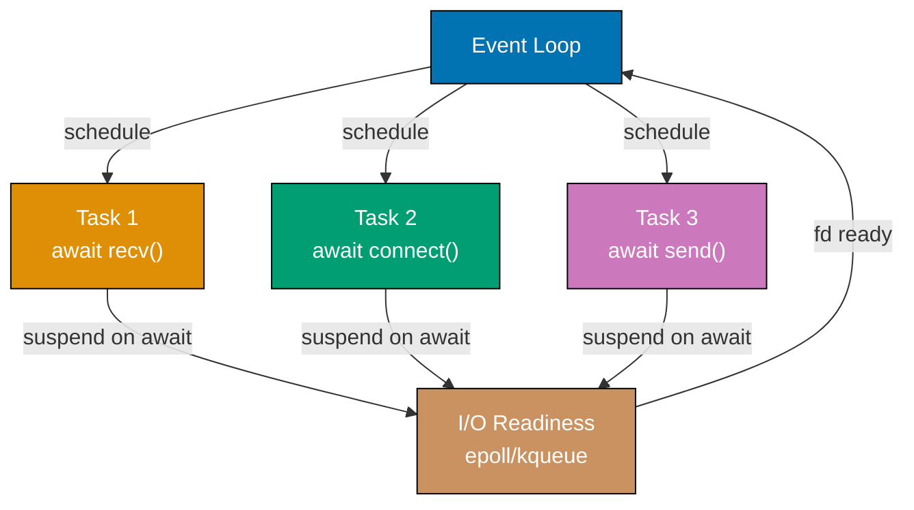
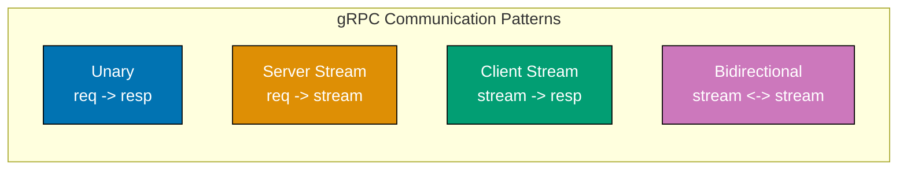
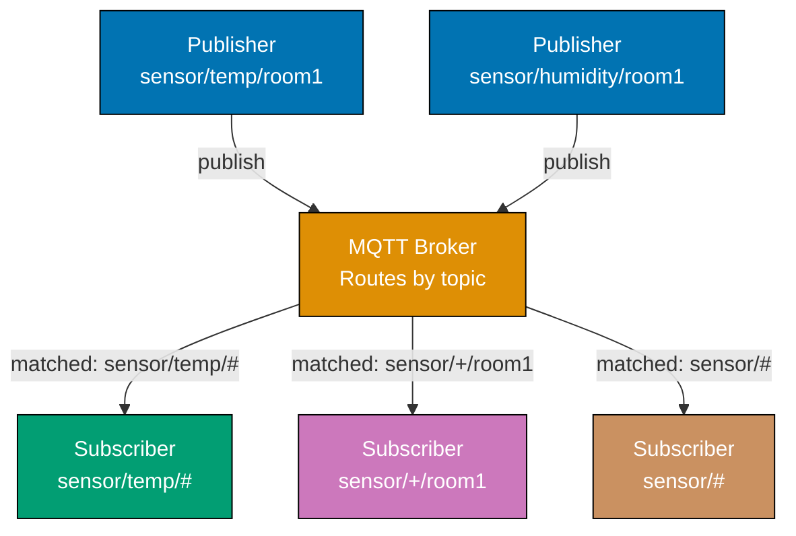
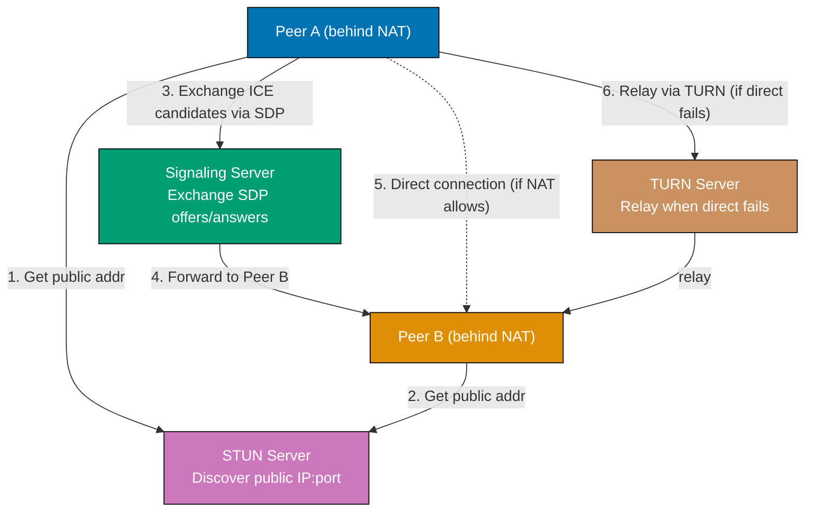
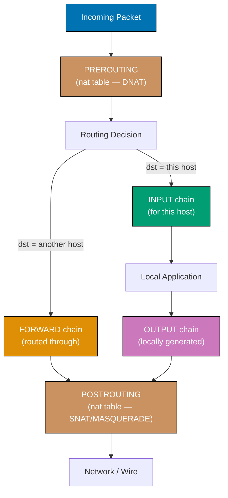
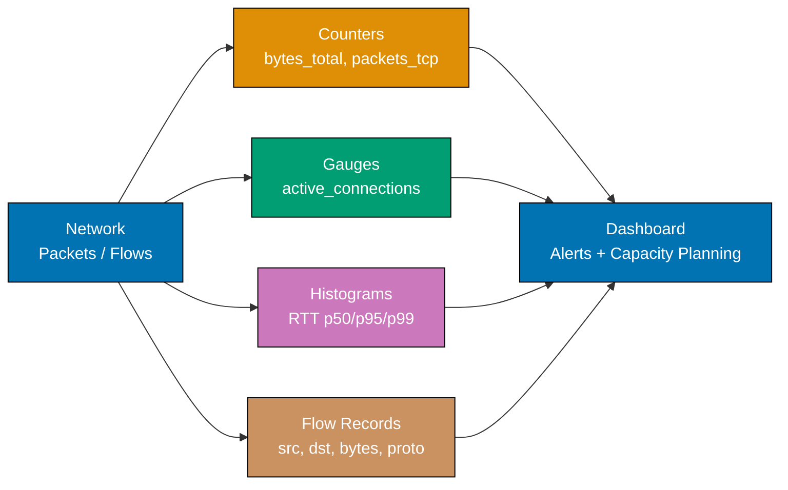
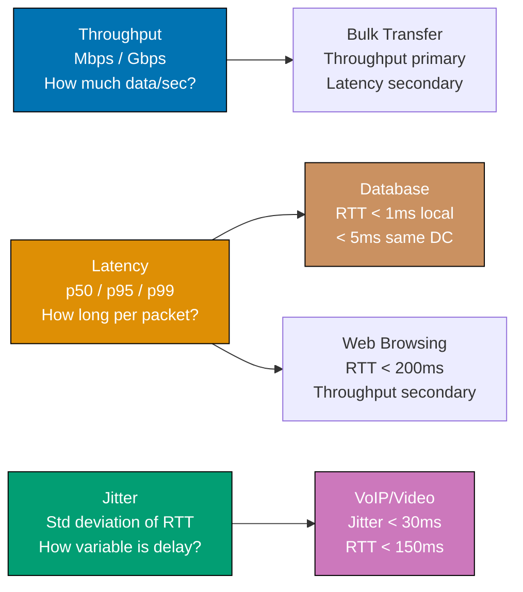
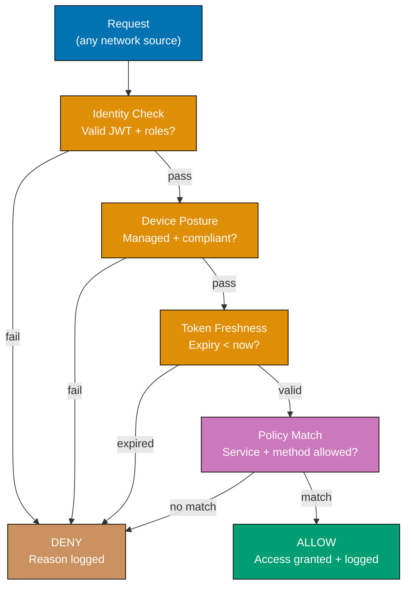
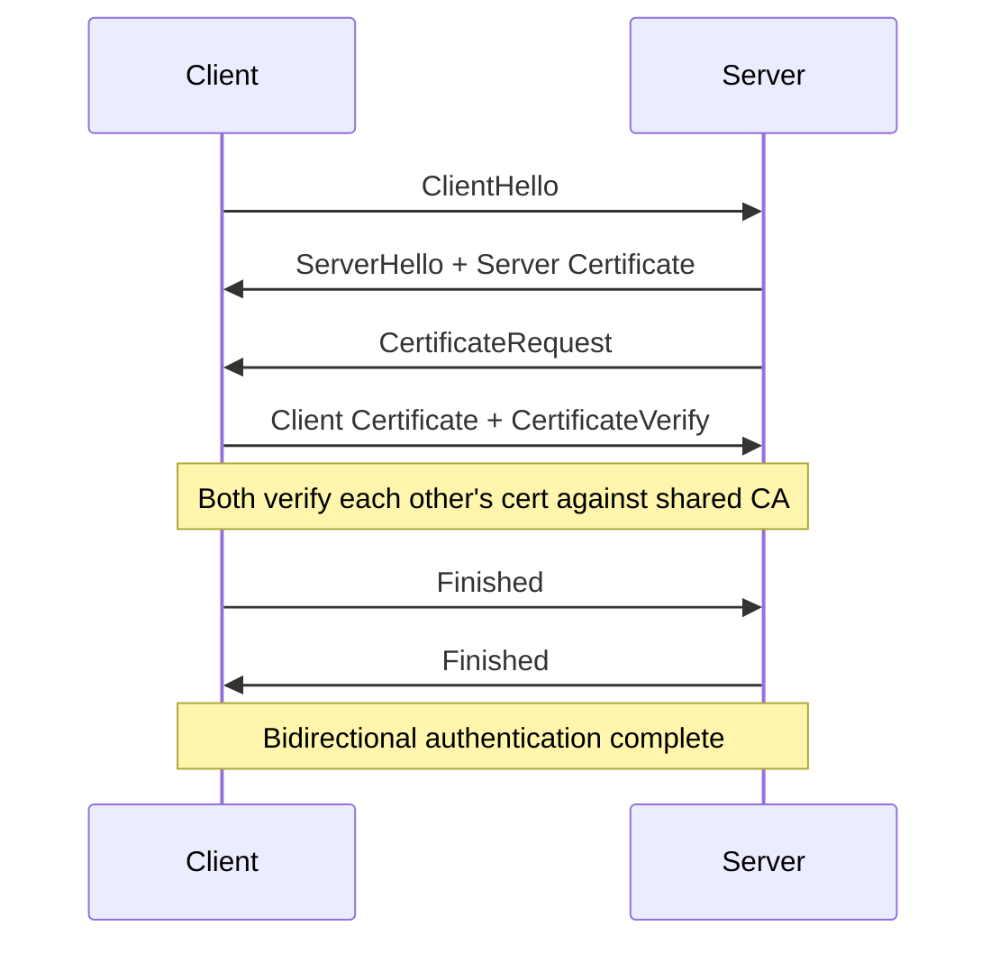
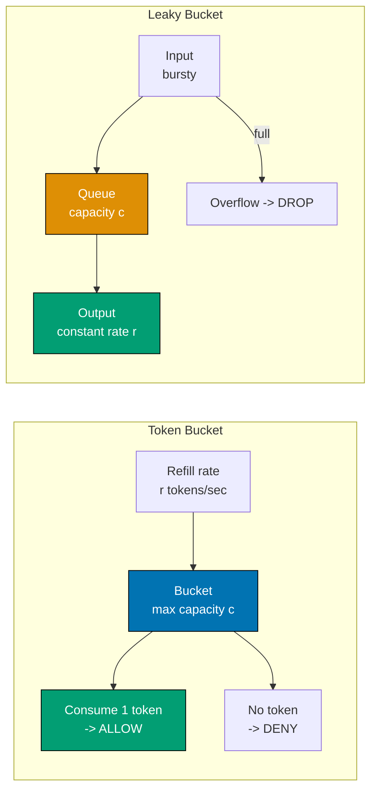

## Example 57: Raw Sockets — Python

Raw sockets bypass the transport layer, giving direct access to IP packets. They require root/administrator privileges and allow crafting arbitrary packets for diagnostics and security research.

```python
import socket   # => socket: provides SOCK_RAW for low-level IP access
import struct   # => struct: pack/unpack binary protocol headers
import os       # => os: used for privilege checks on some platforms
import sys      # => sys: access to interpreter info (unused here, kept for extensibility)

def explain_raw_sockets():  # => Prints protocol constants and their capabilities
    # => Raw sockets: SOCK_RAW bypasses TCP/UDP, receives/sends IP packets directly
    # => Requires: root on Linux, admin on Windows, CAP_NET_RAW capability

    print("Raw Socket Capabilities:\n")  # => Section header for output
    # => Protocol constants used with SOCK_RAW determine which packets the socket receives
    capabilities = {
        "IPPROTO_ICMP": "Receive and send ICMP packets (ping, traceroute)",
        # => Used by ping and traceroute implementations; type=8 for request, type=0 for reply
        "IPPROTO_TCP":  "Receive all TCP packets on the interface",
        # => Promiscuous TCP: see all TCP flows, not just those on your port
        "IPPROTO_UDP":  "Receive all UDP packets on the interface",
        # => Raw UDP: bypass socket layer to see all datagrams including fragmented ones
        "IPPROTO_RAW":  "Send packets with self-crafted IP header (IP_HDRINCL)",
        # => IP_HDRINCL: application provides complete IP header; enables IP spoofing
        "AF_PACKET":    "Linux only: receive raw Ethernet frames (Layer 2)",
        # => AF_PACKET: receives all Ethernet frames including non-IP protocols (ARP, VLAN)
    }
    for proto, description in capabilities.items():
        # => Print each protocol constant and its capability description
        # => dict preserves insertion order (Python 3.7+): output order matches definition order
        print(f"  {proto:15s}: {description}")
    # => Output:   IPPROTO_ICMP   : Receive and send ICMP packets (ping, traceroute)
    #              AF_PACKET      : Linux only: receive raw Ethernet frames (Layer 2)

def build_icmp_echo(identifier, sequence, payload=b"PingPayload"):  # => Returns binary ICMP packet
    # => Build ICMP Echo Request packet (type 8, code 0)
    icmp_type = 8     # => Echo Request
    icmp_code = 0     # => Code is always 0 for Echo Request/Reply
    checksum = 0      # => Will be computed after packing

    # Pack header with zero checksum first
    header = struct.pack("BBHHH", icmp_type, icmp_code, checksum, identifier, sequence)
    # => B=1 byte, H=2 bytes: type(1)+code(1)+checksum(2)+id(2)+seq(2) = 8 bytes

    packet = header + payload  # => Combine header and payload for checksum computation

    # Compute checksum: one's complement of one's complement sum of 16-bit words
    def checksum_calc(data):  # => Nested: only used here for ICMP checksum
        # => RFC 1071 checksum: sum 16-bit words, fold carries, bitwise NOT the result
        if len(data) % 2:
            data += b"\x00"       # => Pad to even length
        s = 0                     # => Accumulator for 16-bit word sum
        for i in range(0, len(data), 2):
            s += (data[i] << 8) + data[i + 1]  # => Add each 16-bit word
        s = (s >> 16) + (s & 0xFFFF)  # => Fold carry
        s += s >> 16              # => Fold carry again (handles single carry)
        return ~s & 0xFFFF        # => One's complement; mask to 16 bits

    cs = checksum_calc(packet)    # => Compute final checksum over header+payload
    # => Repack with correct checksum
    header = struct.pack("BBHHH", icmp_type, icmp_code, cs, identifier, sequence)
    return header + payload  # => Complete ICMP Echo Request packet

# Attempt to create raw socket (will fail without root — show the concept)
try:  # => Root check: raw socket creation raises PermissionError without privilege
    raw = socket.socket(socket.AF_INET, socket.SOCK_RAW, socket.IPPROTO_ICMP)
    # => AF_INET + SOCK_RAW + IPPROTO_ICMP: receive all ICMP packets
    print("\nRaw ICMP socket created successfully (running as root/admin)")

    pkt = build_icmp_echo(identifier=1234, sequence=1)  # => Build Echo Request
    # => sendto: raw sockets use sendto (connectionless); port argument is ignored
    raw.sendto(pkt, ("127.0.0.1", 0))
    # => Port ignored for raw sockets (no transport layer)
    raw.settimeout(1.0)  # => 1 second to receive ICMP Echo Reply
    try:  # => Inner try: handle timeout for the recv call
        data, addr = raw.recvfrom(65535)
        # => data includes full IP header (20 bytes) + ICMP packet
        ip_header = data[:20]   # => First 20 bytes: IPv4 fixed header
        icmp_data = data[20:]   # => Remainder: ICMP header + payload
        ttl = ip_header[8]         # => TTL field at byte offset 8 in IP header
        src_ip = socket.inet_ntoa(ip_header[12:16])  # => bytes 12-15: source IPv4
        # => Source IP at bytes 12-15
        print(f"Received ICMP from {src_ip}, TTL={ttl}, ICMP type={icmp_data[0]}")
        # => type=0: Echo Reply (response to our type=8 request)
    except socket.timeout:
        print("No ICMP reply received")  # => Timeout = no reply within 1s
    raw.close()  # => Release raw socket descriptor
except PermissionError:  # => Expected on non-root: demonstrate concept only
    print("\nRaw socket requires root/admin privileges")
    print("Run with: sudo python3 example.py")
    # => Normal behavior — show the concept without requiring elevated privileges
    pkt = build_icmp_echo(identifier=1234, sequence=1)  # => Build packet for display
    print(f"Built ICMP packet: {len(pkt)} bytes, type={pkt[0]}, checksum={struct.unpack('!H', pkt[2:4])[0]:#06x}")
    # => Shows packet was constructed correctly even without root

explain_raw_sockets()  # => Print capability table
```

**Key Takeaway**: Raw sockets (`SOCK_RAW`) bypass TCP/UDP, providing direct IP packet access for custom protocol implementation, diagnostics, and security tools — at the cost of requiring elevated privileges.

**Why It Matters**: Network monitoring tools, intrusion detection systems, and security scanners use raw sockets. Understanding raw sockets explains how ping, traceroute, and packet analyzers work at the OS level. The privilege requirement reflects the security boundary — raw sockets can forge source IP addresses (IP spoofing), enabling DDoS amplification attacks if misused.

---

## Example 58: Packet Crafting with struct Module

The `struct` module packs and unpacks binary data matching C struct layouts. This is essential for parsing and crafting network protocol headers.

```python
import struct   # => struct: binary pack/unpack for C-compatible layouts
import socket   # => socket: inet_aton/inet_ntoa for IP address conversion

def craft_ip_header(src_ip, dst_ip, protocol, payload_len):  # => Returns 20-byte IPv4 header
    # => Craft an IPv4 header manually using struct.pack
    # => IP header format (RFC 791): 20 bytes minimum

    version_ihl = (4 << 4) | 5
    # => version=4 (IPv4) in upper nibble, IHL=5 (20 bytes/4=5 32-bit words) in lower
    tos = 0               # => Type of Service / DSCP: 0 = normal priority
    total_length = 20 + payload_len  # => IP header + payload
    identification = 0xABCD          # => Used for fragment reassembly identification
    flags_frag = 0x4000              # => DF bit set (0x4000 = Don't Fragment)
    ttl = 64                         # => Time To Live: max hops (decremented by each router)
    checksum = 0                     # => Calculated after header is assembled

    src_bytes = socket.inet_aton(src_ip)   # => "192.0.2.10" -> 4 bytes
    dst_bytes = socket.inet_aton(dst_ip)   # => "198.51.100.1" -> 4 bytes
    # => inet_aton: name mirrors inet_ntoa (network-to-ASCII); aton = ASCII-to-network

    header = struct.pack(
        "!BBHHHBBH4s4s",    # => ! = network byte order (big-endian)
        version_ihl,         # => B: 1 byte — version + IHL
        tos,                 # => B: 1 byte — type of service
        total_length,        # => H: 2 bytes — total packet length
        identification,      # => H: 2 bytes — fragment ID
        flags_frag,          # => H: 2 bytes — flags + fragment offset
        ttl,                 # => B: 1 byte — TTL
        protocol,            # => B: 1 byte — protocol (6=TCP, 17=UDP, 1=ICMP)
        checksum,            # => H: 2 bytes — header checksum (0 initially)
        src_bytes,           # => 4s: 4 bytes — source IP
        dst_bytes,           # => 4s: 4 bytes — destination IP
    )
    return header  # => 20-byte packed header ready to prepend to payload

def parse_ip_header(data):  # => Decodes 20-byte bytes into a named-field dict
    # => Parse raw bytes into IP header fields
    # => Same format string used for both pack and unpack: symmetry is a self-check
    fields = struct.unpack("!BBHHHBBH4s4s", data[:20])
    # => Unpack 20 bytes into 10 fields matching the pack format above

    version_ihl, tos, total_len, ident, flags_frag, ttl, proto, chksum, src, dst = fields
    # => Destructure all 10 fields at once; mirrors the pack format order
    return {
        "version":    version_ihl >> 4,         # => Upper nibble: IP version
        "ihl":        (version_ihl & 0xF) * 4,  # => Lower nibble * 4 = header length in bytes
        "tos":        tos,                       # => DSCP/ECN byte
        "total_len":  total_len,                 # => Entire IP datagram length
        "ident":      ident,                     # => Fragment group ID
        "df":         bool(flags_frag & 0x4000), # => DF flag at bit 14
        "mf":         bool(flags_frag & 0x2000), # => MF flag at bit 13
        "frag_off":   flags_frag & 0x1FFF,       # => Lower 13 bits = fragment offset
        "ttl":        ttl,                       # => Remaining hop count
        "protocol":   proto,                     # => Layer-4 protocol number
        "src":        socket.inet_ntoa(src),      # => 4 bytes -> "x.x.x.x"
        "dst":        socket.inet_ntoa(dst),      # => destination address string
    }

# Craft and immediately parse back
header = craft_ip_header("192.0.2.10", "198.51.100.1", protocol=17, payload_len=8)
# => protocol=17: UDP
print(f"Crafted IP header: {len(header)} bytes")  # => 20 bytes: minimum IPv4 header
print(f"Raw hex: {header.hex()}")
# => Raw hex: 4500001cabcd400040110000c000020ac6336401

parsed = parse_ip_header(header)  # => Decode back to verify correctness
print("\nParsed IP header:")
for k, v in parsed.items():  # => Print each field name and decoded value
    print(f"  {k:10s}: {v}")
# => version: 4, ihl: 20, total_len: 28, ttl: 64, protocol: 17
# => src: 192.0.2.10, dst: 198.51.100.1, df: True
```

**Key Takeaway**: `struct.pack`/`unpack` with network byte order (`!`) serializes Python values into binary protocol headers; format strings map directly to C struct field types.

**Why It Matters**: Protocol parsers, VPN implementations, and packet forgers all use struct-based binary serialization. Understanding format strings (`B`=uint8, `H`=uint16, `I`=uint32, `4s`=4-byte string) is essential for reading RFCs and implementing protocols without external libraries. When Wireshark lacks a dissector, parsing raw pcap bytes with struct is the diagnostic path. Engineers who can translate an RFC field table into a struct format string can implement or debug any binary protocol — this is the bridge between specification and working code.

---

## Example 59: Python asyncio for Async Networking

`asyncio` provides cooperative multitasking through coroutines and an event loop. Network I/O operations yield control while waiting, allowing the event loop to process other tasks concurrently.



```python
import asyncio  # => asyncio: Python's built-in cooperative multitasking library
import time     # => time: wall-clock measurement to compare sequential vs concurrent

async def fetch_with_delay(name, delay):  # => Simulates async I/O with a timed delay
    # => async def: coroutine function — returns a coroutine object, not a result
    # => print before await: runs immediately when coroutine is first scheduled
    print(f"[{name}] Starting (will wait {delay}s)")
    await asyncio.sleep(delay)
    # => await: suspend this coroutine, yield control to event loop
    # => Event loop runs other tasks while this coroutine waits
    # => asyncio.sleep is non-blocking — unlike time.sleep which blocks all tasks
    print(f"[{name}] Done after {delay}s")
    return f"{name}-result"  # => Coroutine result returned to the awaiter

async def main():  # => Top-level coroutine: orchestrates sequential and concurrent runs
    # => async def main: entry point for asyncio programs
    start = time.time()  # => Record start to measure elapsed time

    # Sequential execution (wrong way for I/O concurrency)
    print("=== Sequential (slow) ===")
    r1 = await fetch_with_delay("task1", 0.1)  # => Waits 0.1s, THEN starts task2
    # => r1 is assigned only after task1 fully completes — sequential blocks here
    r2 = await fetch_with_delay("task2", 0.1)  # => Waits another 0.1s
    seq_time = time.time() - start  # => Total elapsed: ~0.2s
    print(f"Sequential: {seq_time:.2f}s total (0.1 + 0.1 = 0.2s expected)\n")
    # => Sequential: ~0.20s — tasks run one after another

    # Concurrent execution (correct way)
    print("=== Concurrent (fast) ===")
    start = time.time()  # => Reset timer for concurrent measurement
    results = await asyncio.gather(
        fetch_with_delay("task3", 0.1),
        fetch_with_delay("task4", 0.1),
        fetch_with_delay("task5", 0.1),
    )
    # => asyncio.gather: schedules all coroutines concurrently
    # => All three start simultaneously, all await asyncio.sleep(0.1) at same time
    # => Event loop handles all three; total time = max(0.1, 0.1, 0.1) = 0.1s
    conc_time = time.time() - start  # => Total elapsed: ~0.1s (3x speedup)
    print(f"Concurrent: {conc_time:.2f}s total (~0.1s expected)")
    # => Output: Concurrent: ~0.10s — 3x speedup over sequential

    print(f"Results: {results}")
    # => Results: ['task3-result', 'task4-result', 'task5-result']
    # => gather preserves input order in results even though tasks finish in any order

asyncio.run(main())
# => asyncio.run: creates event loop, runs main(), closes loop
# => Python 3.7+: preferred entry point for asyncio programs
```

**Key Takeaway**: `asyncio.gather()` runs multiple coroutines concurrently within a single thread; `await` suspends the current coroutine and yields to the event loop, enabling non-blocking I/O.

**Why It Matters**: A single-threaded asyncio server handles thousands of concurrent connections with lower memory than a thread-per-connection model. FastAPI, aiohttp, and modern Python networking libraries all build on asyncio. Understanding the event loop model explains why blocking calls (`time.sleep`, synchronous DB queries) inside async code stall the entire server — not just the current request.

---

## Example 60: Async TCP Server with asyncio

`asyncio.start_server()` creates a fully asynchronous TCP server using coroutines for each client. The event loop handles all connection and data events without threads.

```python
import asyncio  # => asyncio: event-loop I/O — one thread handles many connections

async def handle_client(reader, writer):  # => Spawned by asyncio for each accepted conn
    # => Called by asyncio for each new connection
    # => reader: StreamReader — async interface for receiving data
    # => writer: StreamWriter — async interface for sending data

    addr = writer.get_extra_info("peername")
    # => peername: (host, port) of connected client
    print(f"[{addr}] Connected")  # => Log new connection for visibility

    try:  # => Guard I/O loop against cancellation and reset errors
        while True:  # => Echo loop: read, echo, repeat until disconnect
            data = await reader.read(1024)
            # => await reader.read: suspends until data arrives
            # => Returns empty bytes b"" on EOF (client disconnected)
            if not data:
                break     # => Client disconnected gracefully

            message = data.decode("utf-8", errors="replace").strip()  # => Decode bytes
            print(f"[{addr}] Received: {message}")  # => Log received message

            response = f"Echo: {message}\n"  # => Prefix echoed message
            writer.write(response.encode())
            # => writer.write: buffers data (does not block)
            await writer.drain()  # => Flush: block if client is slow (backpressure)
            # => drain(): await until buffer is flushed to OS
            # => Without drain(): buffer grows unboundedly under backpressure
    except asyncio.CancelledError:  # => Task cancelled: server is shutting down
        pass       # => Server shutting down
    except ConnectionResetError:  # => Client sent RST (e.g., forceful disconnect)
        pass       # => Client disconnected abruptly
    finally:  # => Always clean up the writer, even on error
        writer.close()  # => Initiate close
        await writer.wait_closed()
        # => wait_closed(): await until connection fully closed
        print(f"[{addr}] Disconnected")

async def run_server(host, port, duration=2.0):  # => Starts server, runs for duration s
    server = await asyncio.start_server(
        handle_client,   # => Coroutine called for each new connection
        host, port,
    )
    # => start_server: binds, listens, and registers accept callback with event loop

    addr = server.sockets[0].getsockname()  # => Bound address tuple
    print(f"Async server on {addr}")

    async with server:  # => Context manager: clean server shutdown on exit
        await asyncio.sleep(duration)  # => Serve for duration seconds
        # => Event loop handles all client connections while we await here

async def test_client(host, port):  # => Sends one message and reads echo response
    reader, writer = await asyncio.open_connection(host, port)
    # => open_connection: async TCP connect + returns (StreamReader, StreamWriter)
    writer.write(b"Hello async server\n")  # => Send test message
    await writer.drain()  # => Flush send buffer

    response = await reader.read(256)  # => Read echo response
    print(f"Client received: {response.decode().strip()}")
    # => Output: Client received: Echo: Hello async server
    writer.close()  # => Signal end of connection
    await writer.wait_closed()  # => Wait for OS to confirm close

async def main():  # => Orchestrates server + client in a single event loop run
    # => Run server and client concurrently
    server_task = asyncio.create_task(run_server("127.0.0.1", 9040))
    # => create_task: schedules run_server immediately without awaiting it
    await asyncio.sleep(0.1)  # => Let server start
    await test_client("127.0.0.1", 9040)  # => Connect and exchange data
    await server_task          # => Wait for server task to finish

asyncio.run(main())  # => Launch event loop; all async code runs here
```

**Key Takeaway**: `asyncio.start_server()` creates a non-blocking TCP server; each connection runs in its own coroutine, and `await reader.read()` / `await writer.drain()` yield to the event loop between I/O operations.

**Why It Matters**: Asyncio servers handle C10K (10,000 concurrent connections) efficiently in Python. Understanding `drain()` prevents memory exhaustion from unbounded write buffers. This pattern underpins FastAPI's async request handling, aiohttp's HTTP client, and asyncpg's PostgreSQL driver. A missing `await writer.drain()` in a high-throughput handler causes write buffers to grow unbounded under backpressure — eventually consuming all available memory and crashing the process. Backpressure propagation (slow client -> write buffer fill -> drain() blocks -> receive buffer stops -> sender slows) is the mechanism by which asyncio servers protect themselves from being overwhelmed, and it only works when drain() is called consistently.

---

## Example 61: Async HTTP Client with asyncio

An async HTTP client makes multiple requests concurrently without threads, using the event loop for connection management and I/O. This pattern replaces the 10x latency cost of sequential requests with near-single-request wall-clock time, enabling efficient API fan-out in microservice architectures.

```python
import asyncio  # => asyncio: cooperative I/O without threads
import ssl      # => ssl: TLS context for HTTPS connections

async def async_http_get(host, path, port=80, use_tls=False):  # => Returns status/body dict
    # => Async HTTP/1.0 GET request using low-level asyncio streams
    if use_tls:  # => Branch: HTTPS needs TLS context
        ssl_ctx = ssl.create_default_context()  # => Load system CA bundle for cert verification
        reader, writer = await asyncio.open_connection(host, port, ssl=ssl_ctx)
        # => open_connection with ssl=: performs TLS handshake asynchronously
    else:
        reader, writer = await asyncio.open_connection(host, port)  # => Plain TCP
        # => Port 80 default; no TLS context needed for unencrypted HTTP

    # Build minimal HTTP/1.0 request (1.0 = server closes after response, simpler parsing)
    request = (  # => Multi-line string: concatenated at runtime before encode()
        f"GET {path} HTTP/1.0\r\n"   # => Request line: method, path, version
        f"Host: {host}\r\n"           # => Host header: required for virtual hosting
        f"Accept: text/html\r\n"      # => Accept header: hint preferred MIME type
        f"\r\n"                       # => Blank line terminates HTTP headers
    ).encode()  # => Convert str to bytes for the writer

    writer.write(request)  # => Buffer the HTTP request
    await writer.drain()   # => Flush request to OS
    # => drain() is essential: without it, write() may buffer data and never reach the server

    # Read full response
    response_bytes = await reader.read(8192)  # => Up to 8KB; HTTP/1.0 closes after response
    # => read(n): returns up to n bytes; HTTP/1.0 server closes after sending
    writer.close()          # => Begin connection teardown
    await writer.wait_closed()  # => Ensure OS releases the socket

    # Split headers from body
    header_end = response_bytes.find(b"\r\n\r\n")
    # => \r\n\r\n: blank line separating HTTP headers from body
    if header_end == -1:
        return None  # => Malformed or truncated response
    headers_raw = response_bytes[:header_end].decode(errors="replace")
    # => Decode header bytes; replace bad UTF-8 to avoid crash
    body = response_bytes[header_end + 4:]  # => Skip 4-byte blank line delimiter

    status_line = headers_raw.split("\r\n")[0]
    # => "HTTP/1.0 200 OK"
    status_code = int(status_line.split()[1])
    # => Extract numeric status code
    # => split()[1]: index 1 is the status code string; [0]="HTTP/1.0", [2]="OK"

    return {"status": status_code, "body_len": len(body), "host": host}
    # => Compact result: status, body size, and host for reporting

async def fetch_multiple(targets):  # => Launch all requests; yield as each completes
    # => Fetch multiple URLs concurrently — total time ≈ slowest individual request
    tasks = [
        asyncio.create_task(async_http_get(host, path))  # => Schedule each request
        for host, path in targets  # => One task per (host, path) pair
    ]
    # => create_task: schedules coroutine immediately (vs gather which waits for all)

    results = []  # => Collect successful responses
    # => as_completed returns an iterator of futures in completion order, not submission order
    for task in asyncio.as_completed(tasks):
        # => as_completed: yield tasks as they finish (not necessarily in order)
        result = await task  # => Await the next finished task
        if result:  # => Skip failed/None results
            print(f"  {result['host']}: status={result['status']} body={result['body_len']}B")
            results.append(result)  # => Accumulate successful results
    return results  # => List of completed responses

async def main():  # => Entry point: define targets and print results
    targets = [
        ("example.com", "/"),    # => Target 1: IANA example domain
        ("httpbin.org", "/get"),  # => Target 2: public HTTP test endpoint
    ]
    print("Fetching concurrently:")  # => Announce concurrent fetch
    import time         # => time: measure total wall-clock elapsed
    start = time.time()  # => Capture start time before launching tasks
    results = await fetch_multiple(targets)  # => Run all requests concurrently
    elapsed = time.time() - start  # => Total time ≈ slowest single request
    print(f"  Fetched {len(results)} URLs in {elapsed:.2f}s")
    # => Both requests run concurrently: total ≈ max(t1, t2), not t1+t2
    # => elapsed ≈ 0.2-0.5s for these public endpoints; sequential would be 2x

try:  # => Guard asyncio.run against DNS/network failures
    asyncio.run(main())  # => Start event loop and run main coroutine
except Exception as e:
    print(f"Network error: {e}")  # => Network unavailable in offline environments
```

**Key Takeaway**: `asyncio.create_task()` schedules multiple HTTP requests concurrently; `as_completed()` processes results as they arrive rather than waiting for all to finish.

**Why It Matters**: Concurrent async HTTP requests power web crawlers, API aggregators, and microservice fan-out patterns. A blocking HTTP client making 10 sequential 200ms requests takes 2 seconds; async concurrent requests take 200ms. Production async HTTP libraries (aiohttp, httpx async) build on these primitives with connection pooling and retry logic. Unbounded concurrency is a hidden risk — production code must apply `asyncio.Semaphore` to cap concurrent connections and avoid overwhelming DNS resolvers.

---

## Example 62: gRPC Concepts — Protobuf and Streams

gRPC is a high-performance RPC framework using Protocol Buffers (protobuf) for serialization and HTTP/2 for transport. It supports four communication patterns: unary, server streaming, client streaming, and bidirectional streaming.



```python
# gRPC concepts — full implementation requires grpcio (external)
# This example demonstrates protobuf wire format and gRPC concepts using struct

import struct  # => struct: binary serialization; mirrors protobuf's wire encoding approach

def explain_grpc():  # => Prints five gRPC key concepts with explanations
    print("gRPC Key Concepts:\n")  # => Section header

    concepts = {  # => Dict: concept name -> tuple of explanation sentences
        # => Each entry: gRPC concept name -> multi-sentence explanation string
        "Protocol Buffers (protobuf)": (  # => Key protobuf concepts
            "Binary serialization format — smaller and faster than JSON. "
            "Schema defined in .proto files: fields have type + field number. "
            "Field numbers (not names) used in binary format — enables schema evolution. "
            "Python: pip install grpcio-tools generates Python classes from .proto."
        ),
        # => protobuf field numbers: removing field 3, adding field 5 — old clients skip unknown fields
        "HTTP/2 Transport": (  # => gRPC transport layer concepts
            "gRPC uses HTTP/2 multiplexed streams — one TCP connection for all RPCs. "
            "Each RPC call uses one HTTP/2 stream (odd stream IDs for client-initiated). "
            "Flow control at both HTTP/2 stream and connection level. "
            "Trailers (end-of-stream headers) carry gRPC status code."
        ),
        # => Trailers: end-of-stream HTTP/2 headers; gRPC status/message sent after response body
        "Service Definition (.proto)": (  # => .proto file defines the service contract
            "service Greeter { rpc SayHello(HelloRequest) returns (HelloReply); } "
            "message HelloRequest { string name = 1; } "
            "Field number = 1: wire encoding uses field number, not field name. "
            "Backward compatible: add new fields with new numbers; old clients ignore."
        ),
        # => .proto file is the contract: client and server must agree on field numbers
        "Streaming patterns": (  # => Four RPC communication patterns
            "Unary: single request, single response (like HTTP REST). "
            "Server streaming: client sends one request, server streams many responses. "
            "Client streaming: client streams many requests, server sends one response. "
            "Bidirectional: both sides stream independently (chat, real-time sync)."
        ),
        # => Bidirectional streaming: used for real-time telemetry, collaborative editing
        "gRPC-Web and gRPC-Gateway": (  # => Browser and REST interoperability
            "gRPC-Web: allows browsers to call gRPC services (requires proxy translation). "
            "gRPC-Gateway: generates REST/JSON proxy from .proto annotations. "
            "Enables REST and gRPC from single service definition."
        ),
        # => gRPC-Gateway: annotate .proto with HTTP options; generates JSON REST proxy automatically
    }  # => End of 5-concept dict
    for concept, explanation in concepts.items():  # => Iterate 5 gRPC concepts
        # => Print each gRPC concept with its explanation indented
        print(f"  {concept}:")  # => Concept name as sub-header
        print(f"    {explanation}\n")  # => Explanation + blank line
    # => Output:   Protocol Buffers (protobuf):
    #                Binary serialization format...
    # => five gRPC concepts cover protocol, transport, service definition, streaming, and interop

# Simulate protobuf varint encoding (fundamental to protobuf wire format)
def encode_varint(value):  # => Returns bytes: variable-length integer encoding
    # => Varint: variable-length integer encoding
    # => Small values (< 128) use 1 byte; larger values use more bytes
    # => MSB of each byte: 1 = more bytes follow, 0 = last byte
    result = bytearray()  # => Accumulate encoded bytes
    while value > 0x7F:   # => Need more than 7 bits
        result.append((value & 0x7F) | 0x80)  # => Set MSB, take 7 bits
        # => MSB=1 signals "more bytes follow" — continuation bit
        value >>= 7  # => Shift out the 7 bits just encoded
    # => loop exits when value fits in 7 bits (value <= 0x7F)
    result.append(value)   # => Final byte (MSB=0)
    return bytes(result)   # => Immutable bytes for safe concatenation

def encode_protobuf_string(field_number, value):  # => Encodes string as proto wire type 2
    # => Protobuf wire type 2: length-delimited (strings, bytes, embedded messages)
    encoded_value = value.encode("utf-8")  # => Protobuf strings are always UTF-8
    field_tag = encode_varint((field_number << 3) | 2)  # => Compute wire tag: number<<3 | type
    # => Tag = (field_number << 3) | wire_type
    # => wire_type 2 = length-delimited
    # => Example: field_number=1, wire_type=2 -> (1<<3)|2 = 10 -> varint 0x0a
    length = encode_varint(len(encoded_value))  # => Varint-encoded byte count
    # => Wire format is always: tag varint + length varint + raw UTF-8 bytes
    return field_tag + length + encoded_value   # => Tag + length + value = wire format

# Encode a simple protobuf message: HelloRequest { string name = 1; }
# => This mirrors exactly what grpcio-tools generates from .proto
# => module-level code runs on import; in practice wrap in if __name__ == "__main__"
name = "World"  # => Test string to encode
proto_msg = encode_protobuf_string(field_number=1, value=name)
# => proto_msg: [tag=0x0a, length=0x05, 'W','o','r','l','d']
# => Total: 7 bytes; equivalent JSON {"name":"World"} is 17 bytes — 2.4x larger
print(f"Protobuf encoded 'name=\"{name}\"': {proto_msg.hex()}")
# => 0a05576f726c64
# => 0a = field 1, wire type 2; 05 = length 5; 576f726c64 = "World"
print(f"  Tag byte: {proto_msg[0]:#04x} (field=1, wire_type=2)")
# => 0x0a = 0b00001010: field_number=1 (bits 3-7), wire_type=2 (bits 0-2)
print(f"  Length:   {proto_msg[1]} bytes")  # => 5: length of "World"
print(f"  Value:    {proto_msg[2:].decode()}")  # => "World"
# => proto_msg[2:]: slice starting after tag byte and length byte = raw UTF-8 payload

explain_grpc()  # => Print all gRPC concept explanations
```

**Key Takeaway**: gRPC uses protobuf binary encoding over HTTP/2, supporting four streaming patterns — the binary format and multiplexed transport make it significantly more efficient than REST+JSON for service-to-service communication.

**Why It Matters**: gRPC is the standard for microservice RPC in polyglot environments. Protobuf's field-number-based encoding enables schema evolution without breaking existing clients — add a new field without changing old clients. Understanding the wire format helps debug serialization issues and explains why gRPC payloads are 3-10x smaller than equivalent JSON, cutting both bandwidth and serialization CPU cost.

---

## Example 63: MQTT Protocol — Pub/Sub for IoT

MQTT is a lightweight publish-subscribe protocol for constrained devices. Clients publish messages to topics; subscribers receive messages matching their topic subscriptions. A central broker routes all messages.



```python
# MQTT concepts and packet structure
# Full implementation requires paho-mqtt (external); this shows wire format concepts

import struct  # => struct: pack keepalive and string lengths into MQTT binary fields

def explain_mqtt():  # => Prints five MQTT concepts with explanations
    print("MQTT Protocol Key Concepts:\n")  # => Section header

    concepts = {  # => Dict: MQTT concept name -> tuple of explanation sentences
        # => Each entry: MQTT concept name -> multi-sentence explanation
        "Topics and wildcards": (  # => MQTT topic hierarchy and filter patterns
            "Topics: hierarchical strings like 'home/living_room/temperature'. "
            "+ wildcard: matches single level — 'home/+/temperature' matches any room. "
            "# wildcard: matches all remaining levels — 'home/#' matches everything under home. "
            "Subscribers filter by topic pattern; broker routes by exact + wildcard match."
        ),
        # => # wildcard: powerful but broad — 'sensor/#' receives ALL sensor messages to that client
        "QoS levels": (  # => Three delivery guarantees; trade-off between reliability and speed
            "QoS 0: At most once — fire and forget, no acknowledgment (fastest, lossy). "
            "QoS 1: At least once — acknowledged; duplicates possible on retry. "
            "QoS 2: Exactly once — four-step handshake; guaranteed single delivery (slowest). "
            "IoT sensors often use QoS 0; commands use QoS 1 or 2."
        ),
        # => QoS 1 duplicate handling: message handlers MUST be idempotent for QoS 1
        "Retained messages": (  # => Broker stores last message; new subscribers get it immediately
            "Retained=True: broker stores last message on topic. "
            "New subscriber immediately receives retained message — no need to wait for next publish. "
            "Useful for device status topics: last known state available on subscribe."
        ),
        # => Retained: publish with retained=True replaces previous retained message on that topic
        "Last Will and Testament (LWT)": (  # => Client pre-declares offline notification
            "Client declares LWT message at connect time. "
            "If client disconnects unexpectedly (no DISCONNECT packet), broker publishes LWT. "
            "Enables 'device offline' notification in distributed IoT systems."
        ),
        # => LWT topic convention: 'devices/{id}/status' with payload 'offline' as LWT
        "MQTT vs HTTP for IoT": (  # => Protocol choice for constrained devices
            "MQTT: persistent TCP connection, tiny 2-byte fixed header, pub-sub. "
            "HTTP: new connection per request, verbose headers, request-response. "
            "MQTT wins for battery-constrained devices sending many small updates. "
            "HTTP wins for occasional large payload uploads (firmware, logs)."
        ),
        # => 2-byte fixed header: critical for devices sending temperature readings every second
    }
    for concept, explanation in concepts.items():  # => Iterate 5 MQTT concepts
        # => Print each MQTT concept with its explanation indented
        # => concepts.items(): five MQTT concepts from topics to HTTP comparison
        print(f"  {concept}:")  # => Concept name as sub-header
        print(f"    {explanation}\n")  # => Explanation + blank line
    # => Output:   Topics and wildcards:
    #                Topics: hierarchical strings like 'home/living_room/temperature'...

def build_mqtt_connect(client_id, keepalive=60):  # => Returns raw MQTT CONNECT packet bytes
    # => MQTT CONNECT packet — first packet sent after TCP connection
    protocol_name = b"\x00\x04MQTT"  # => Length-prefixed protocol name
    # => 0x0004 = length 4, then "MQTT" bytes
    protocol_level = 4               # => MQTT version 3.1.1 = level 4
    connect_flags = 0b00000010       # => Clean session bit set
    # => Bit 1: CleanSession=1 (no persistent state from previous sessions)
    # => Other flags: Will flag, Will QoS, Will Retain, Password, Username (bits 2-7)

    keepalive_bytes = struct.pack(">H", keepalive)  # => 2 bytes, big-endian
    # => keepalive: broker disconnects client if no packet received within this many seconds
    # => send PINGREQ packets within keepalive interval to keep connection alive

    # Variable header: protocol name + level + flags + keepalive
    variable_header = protocol_name + bytes([protocol_level, connect_flags]) + keepalive_bytes
    # => bytes(): converts int fields to single bytes; concatenate with + operator
    # => Combine: 6-byte name + 1-byte level + 1-byte flags + 2-byte keepalive = 10 bytes

    # Payload: client ID (length-prefixed UTF-8 string)
    client_id_bytes = client_id.encode("utf-8")  # => MQTT requires UTF-8 client IDs
    # => client_id must be unique per broker; duplicate client_id forces previous session off
    payload = struct.pack(">H", len(client_id_bytes)) + client_id_bytes
    # => All strings in MQTT: 2-byte length prefix + UTF-8 bytes
    # => ">H": big-endian unsigned short (2 bytes); MQTT requires big-endian for lengths

    # Fixed header: packet type + remaining length
    remaining_length = len(variable_header) + len(payload)
    # => Remaining length: all bytes after fixed header
    # => MQTT uses variable-length encoding for remaining_length > 127 (omitted here)
    fixed_header = bytes([0x10, remaining_length])
    # => 0x10 = packet type 1 (CONNECT) in upper nibble, flags in lower
    # => lower nibble for CONNECT is always 0; upper nibble encodes packet type

    packet = fixed_header + variable_header + payload  # => Concatenate all three sections
    # => Total: 2 (fixed) + 10 (variable) + 2+len(client_id) (payload) bytes
    # => Bytes always: bytes1 + bytes2 => new bytes object (Python string-like concatenation)
    print(f"MQTT CONNECT packet: {len(packet)} bytes, client_id={client_id!r}")
    # => Output: "MQTT CONNECT packet: 28 bytes, client_id='sensor-device-001'"
    print(f"  Fixed header: {fixed_header.hex()}")  # => "1012" for this example
    print(f"  Protocol: MQTT 3.1.1, keepalive={keepalive}s")  # => Version confirmation
    return packet  # => Ready to send over TCP socket
    # => packet: fixed_header + variable_header + payload; ready for sock.sendall(packet)

build_mqtt_connect("sensor-device-001")  # => Build and print MQTT CONNECT for demo
# => "sensor-device-001": 16-character client ID; MQTT allows up to 23 chars per spec
explain_mqtt()  # => Print all MQTT concept explanations
```

**Key Takeaway**: MQTT routes messages by topic patterns using a central broker; QoS levels balance delivery guarantees against overhead; LWT enables presence detection.

**Why It Matters**: MQTT powers IoT deployments with millions of devices — smart home, industrial sensors, vehicle telemetry — where battery life and bandwidth matter. Its publish-subscribe model decouples producers from consumers, enabling flexible architectures where new subscribers can be added without changing publishers. Understanding QoS levels prevents data loss (QoS 0 for fire-and-forget) or duplicate processing (QoS 1 requires idempotent message handlers). LWT enables real-time device presence detection without polling.

---

## Example 64: WebRTC Overview — ICE, STUN, TURN

WebRTC enables browser-to-browser real-time communication (audio, video, data) without a server intermediary. ICE (Interactive Connectivity Establishment) finds the best path between peers, using STUN to discover public addresses and TURN as a relay fallback.



```python
def explain_webrtc():  # => Prints 5 WebRTC components and a sample SDP offer
    print("WebRTC Architecture:\n")  # => Section header for output

    components = {  # => Dict: 5 WebRTC components with multi-sentence explanations
        # => Each entry: WebRTC component name -> multi-sentence explanation
        "SDP (Session Description Protocol)": (  # => Negotiation format for media params
            "Text format describing media capabilities and network connectivity. "  # => offer/answer model
            "Offer: initiating peer's capabilities (codecs, ICE candidates, DTLS fingerprint). "
            "Answer: responding peer's selected capabilities and its ICE candidates. "
            "Exchanged via signaling server — WebRTC doesn't define the signaling channel."
        ),
        # => Signaling channel: WebSocket, HTTP, or any transport — WebRTC is agnostic
        "ICE (Interactive Connectivity Establishment)": (  # => Path-finding algorithm
            "Process to find the best network path between peers. "  # => priority: direct > STUN > TURN
            "Collects ICE candidates: host (local IP), srflx (STUN-reflexive), relay (TURN). "
            "Performs connectivity checks on all candidate pairs. "
            "Selects best working path — prefers direct over relay."
        ),
        # => ICE trickle: candidates sent incrementally as discovered — speeds connection setup
        "STUN (Session Traversal Utilities for NAT)": (  # => Discover public IP:port
            "Simple protocol: client asks server 'what is my public IP:port?'. "
            "Server reflects client's address back. "
            "Enables NAT hole-punching: both peers learn their public address. "
            "STUN servers are lightweight; many public servers available."
        ),
        # => STUN response: reflects observed IP:port — allows peer to discover NAT mapping
        "TURN (Traversal Using Relays around NAT)": (  # => Relay fallback server
            "Relay server when direct connection fails (symmetric NAT, enterprise firewall). "
            "TURN server receives from one peer, forwards to other. "
            "Last resort: uses bandwidth and server resources. "
            "~15-20% of WebRTC connections require TURN relay."  # => Most connections go direct via ICE
        ),
        # => TURN cost: relay bandwidth × 2 (both directions routed through TURN server)
        "DTLS + SRTP": (  # => Mandatory encryption for WebRTC
            "DTLS (Datagram TLS): TLS over UDP — encrypts WebRTC data channels. "
            "SRTP (Secure RTP): encrypts media (audio/video) streams. "
            "WebRTC requires encryption — no plaintext media permitted by spec. "
            "DTLS fingerprint in SDP enables certificate verification without CA."
        ),
        # => DTLS fingerprint: self-signed cert SHA-256 hash in SDP — prevents MITM without CA
    }

    for component, explanation in components.items():  # => 5 WebRTC components
        # => Print each WebRTC component with its explanation indented
        # => components.items(): yields (name, explanation) tuples in insertion order
        print(f"  {component}:")   # => Component name as sub-header
        print(f"    {explanation}\n")  # => Indented explanation; \n adds blank line
    # => Output:   SDP (Session Description Protocol):
    #                Text format describing media capabilities...

    # Simulate SDP offer structure
    # => SDP: plain-text negotiation format; each line: single-letter type=value
    # => v=0: protocol version; o=: origin (session ID, address)
    # => s=-: session name (dash = no meaningful name)
    # => t=0 0: timing (0 0 = permanent session)
    # => a=group:BUNDLE: all media flows share one ICE/DTLS context
    # => m=audio: media description; UDP/TLS/RTP/SAVPF = secure SRTP with DTLS
    # => c=IN IP4 0.0.0.0: connection address (overridden by ICE candidates)
    # => a=ice-ufrag + a=ice-pwd: ICE credentials for authentication
    # => a=fingerprint: DTLS certificate hash for mutual auth without PKI CA
    # => a=setup:actpass: both sides negotiate who is DTLS client vs server
    # => a=rtpmap:111 opus: RTP payload type 111 = Opus codec at 48kHz stereo
    # => a=candidate: ICE candidate — this is a host candidate (direct local IP)
    sdp_offer_example = (  # => SDP offer as concatenated string; \n = line separator
        "v=0\no=- 123456789 2 IN IP4 127.0.0.1\ns=-\nt=0 0\n"  # => Version and session headers
        "a=group:BUNDLE audio video data\nm=audio 9 UDP/TLS/RTP/SAVPF 111\n"  # => BUNDLE: mux all media on one transport
        "c=IN IP4 0.0.0.0\na=rtcp:9 IN IP4 0.0.0.0\na=ice-ufrag:abc123\n"   # => 0.0.0.0: ICE candidates override this
        "a=ice-pwd:secretpassword123456789012\n"  # => ICE password for credential verification
        "a=fingerprint:sha-256 AA:BB:CC:DD:EE:FF:...\na=setup:actpass\n"  # => DTLS fingerprint: cert hash
        "a=mid:audio\na=rtpmap:111 opus/48000/2\n"  # => mid: media ID used in BUNDLE; rtpmap: codec
        "a=candidate:1 1 udp 2122260223 192.0.2.10 54321 typ host"  # => Host candidate: local LAN IP
    )  # => Concatenated SDP lines; avoids multi-line string line counting

    print("  Example SDP offer (simplified):")  # => Sub-section header
    # => Print SDP line-by-line to show the structure
    # => split("\n"): each SDP line is newline-separated; strip() removes trailing newline
    for line in sdp_offer_example.strip().split("\n"):  # => One SDP line per iteration
        print(f"    {line}")  # => Each SDP line indented for readability
    # => SDP lines always end with \r\n per RFC but \n used here for readability

explain_webrtc()  # => Print all WebRTC components and SDP example
```

**Key Takeaway**: WebRTC uses ICE to discover connectivity paths, STUN to find public addresses through NAT, and TURN as relay fallback; all media is encrypted via DTLS/SRTP.

**Why It Matters**: WebRTC powers video conferencing, real-time collaboration, and peer-to-peer file transfer in browsers. Understanding ICE explains why WebRTC connections sometimes take several seconds to establish (ICE candidate gathering + connectivity checks) and why TURN server capacity directly affects call quality when symmetric NAT prevents direct connections. TURN servers relay all audio and video through their network — running them without bandwidth planning causes video quality degradation at scale. ICE candidate trickle (sending candidates as discovered) reduces setup latency from seconds to hundreds of milliseconds in best-case scenarios, a critical user experience improvement for modern video applications.

---

## Example 65: VPN — Tunnel and Encryption Overview

A VPN (Virtual Private Network) creates an encrypted tunnel between endpoints, making remote traffic appear to originate from the VPN server's network. TUN/TAP virtual interfaces capture traffic for encapsulation.


```python
def explain_vpn_types():  # => Prints OpenVPN, WireGuard, IPSec comparison and TUN/TAP
    print("VPN Protocol Comparison:\n")  # => Section header

    vpn_types = {  # => Three protocols: OpenVPN, WireGuard, IPSec/IKEv2
        # => Each VPN protocol: dict of transport, encryption, auth, port, features, weakness
        "OpenVPN": {
            # => OpenVPN: the most widely deployed VPN protocol (client + server software)
            "transport": "UDP (preferred) or TCP",
            # => TCP mode: use when UDP is blocked; adds double-ACK overhead (TCP over TCP)
            "encryption": "OpenSSL — TLS for control channel, AES-GCM for data",
            # => Control channel: negotiates session keys; data channel: encrypts actual traffic
            "auth": "X.509 certificates + optional username/password",
            # => Certificate-based auth: each client gets unique cert — revocation is clean
            "port": "UDP 1194 (configurable, often 443 UDP/TCP for firewall bypass)",
            # => Port 443: indistinguishable from HTTPS at port level (but DPI can detect)
            "features": "Mature, widely supported, configurable. Custom protocol.",
            # => Custom protocol: not IETF standard; proprietary wire format
            "weakness": "OpenVPN traffic identifiable by DPI — fingerprinting possible",
            # => DPI fingerprinting: deep packet inspection identifies OpenVPN by header patterns
        },
        "WireGuard": {
            # => WireGuard: modern VPN with minimal codebase — easier to audit for vulnerabilities
            "transport": "UDP only",
            # => UDP only: no TCP mode; if UDP 51820 blocked, must use obfuscation tool
            "encryption": "ChaCha20-Poly1305 (data), Curve25519 (key exchange), BLAKE2s (hash)",
            # => ChaCha20: faster than AES on CPUs without hardware AES acceleration
            "auth": "Public key pairs (like SSH keys) — no certificates, no CA",
            # => No CA: simpler setup but key distribution requires separate mechanism
            "port": "UDP 51820 (default, configurable)",
            # => Configurable: can run on any UDP port; common to use 443/UDP for bypass
            "features": "Minimal codebase (~4000 lines vs OpenVPN's ~70000). Fast. Kernel integration.",
            # => Kernel integration: WireGuard module in Linux kernel since 5.6 — lowest latency path
            "weakness": "UDP only — blocked by some networks. No TCP fallback.",
            # => Restricted networks: corporate firewalls often block non-standard UDP
        },
        "IPSec/IKEv2": {
            # => IPSec: IETF standard; native OS support without additional software
            "transport": "UDP 500/4500 (NAT traversal)",
            # => NAT-T: port 4500 encapsulates ESP in UDP when NAT is detected
            "encryption": "AES-GCM, ChaCha20-Poly1305 (IKEv2 negotiated)",
            # => IKEv2 negotiation: algorithm selected from both sides' proposals during handshake
            "auth": "Certificates, PSK, EAP (username/password)",
            # => PSK: Pre-Shared Key — simpler but weak if key is short or leaked
            "port": "UDP 500 (IKE), UDP 4500 (NAT-T), IP protocol 50 (ESP)",
            # => IP protocol 50: ESP is a protocol number like TCP(6) or UDP(17), not a port
            "features": "Native OS support (iOS, Android, Windows, Linux). Standard protocol.",
            # => Native support: no app install needed on iOS/Android — built into OS VPN settings
            "weakness": "Complex implementation. UDP 500/4500 sometimes blocked.",
            # => Complex: IKEv2 has many configuration options; misconfiguration weakens security
        },
    }

    for name, info in vpn_types.items():
        # => Print VPN protocol name and its key-value attributes
        # => vpn_types is a nested dict: outer key=protocol name, inner keys=attributes
        print(f"  {name}:")  # => Protocol name as sub-section header
        for key, value in info.items():  # => Iterate each attribute of the protocol
            print(f"    {key:12s}: {value}")
            # => Each attribute aligned at 12 chars for readability
            # => Alignment makes transport/encryption/auth columns easy to scan
        print()  # => Blank line separates protocols for readability
    # => Output:   OpenVPN:
    #                transport   : UDP (preferred) or TCP
    #                encryption  : OpenSSL — TLS for control channel...

    # TUN/TAP interface concept
    print("TUN/TAP Virtual Interface:")  # => Sub-section: virtual network interfaces
    print("  TUN (network TUNnel): Layer 3 — passes IP packets")
    # => TUN: used by WireGuard, OpenVPN; VPN app reads/writes raw IP packets
    # => /dev/tun0: character device; VPN app opens it like a file and reads/writes packets
    print("    Application reads/writes IP packets via /dev/tun0")
    print("    VPN client: read IP packet from TUN, encrypt, send over UDP")
    # => VPN send path: app reads from TUN -> encrypts -> sends via real UDP socket
    print("    VPN client: receive UDP, decrypt, write IP packet to TUN")
    # => VPN recv path: real UDP socket -> decrypt -> write to TUN -> OS routes
    print()
    print("  TAP (network TAP): Layer 2 — passes Ethernet frames")
    # => TAP: includes Ethernet header; used when bridging (e.g., remote VLAN member)
    print("    Application reads/writes Ethernet frames (includes MAC header)")
    # => Ethernet frame: 14-byte header (6 dst MAC + 6 src MAC + 2 EtherType)
    # => TUN vs TAP: choose TUN for routing (L3), TAP for bridging (L2)
    print("    Used for bridging: remote host appears on local Ethernet segment")
    # => Bridge mode: VPN creates a virtual switch; remote host joins LAN segment

explain_vpn_types()  # => Print comparison table and TUN/TAP explanation
```

**Key Takeaway**: VPNs encapsulate and encrypt network traffic inside a tunnel; TUN interfaces capture IP packets for encryption while the outer packet traverses the internet to the VPN endpoint.

**Why It Matters**: VPN selection affects performance, security, and reliability. WireGuard's minimal codebase (~4000 lines) dramatically reduces attack surface compared to OpenVPN. Split-tunneling routes only sensitive traffic through VPN, reducing latency for non-sensitive requests. Misconfigured DNS in a VPN client causes a leak — DNS queries bypass the tunnel, exposing browsing history to the ISP despite VPN encryption.

---

## Example 66: Firewall Rules — iptables Concepts

Firewalls filter packets based on source/destination IP, port, protocol, and connection state. Linux `iptables` organizes rules into chains (INPUT, OUTPUT, FORWARD) within tables (filter, nat, mangle).



```python
def explain_iptables():  # => Prints tables, chains, rules, and nftables comparison
    # => iptables: Linux kernel packet filtering framework; rules evaluated top-to-bottom
    print("iptables Architecture:\n")  # => Section header

    tables = {  # => Dict of three tables; each has purpose + chains list
        # => Three main tables: filter (allow/deny), nat (address rewriting), mangle (modification)
        "filter": {
            "purpose": "Packet filtering — allow or deny traffic",
            # => filter table: the most used table; -j ACCEPT, DROP, REJECT
            "chains": ["INPUT (packets destined for this host)",
                       # => INPUT: handles traffic arriving for local applications
                       "OUTPUT (packets originating from this host)",
                       # => OUTPUT: handles traffic generated by local processes
                       "FORWARD (packets routed through this host)"],
                       # => FORWARD: handles transit traffic (router behavior)
        },
        "nat": {
            "purpose": "Network Address Translation — modify source/destination",
            # => nat table: rewrite IP/port before or after routing decision
            "chains": ["PREROUTING (before routing — DNAT)",
                       # => DNAT: change destination IP/port — port forwarding
                       "POSTROUTING (after routing — SNAT/MASQUERADE)",
                       # => MASQUERADE: rewrite source IP to match outbound interface
                       "OUTPUT (locally generated packets)"],
                       # => nat OUTPUT: handles locally generated packets needing NAT
                       # => Three-chain nat table mirrors filter table structure
        },
        "mangle": {
            "purpose": "Packet modification — TTL, TOS, mark for routing",
            # => mangle: advanced uses — mark packets for policy routing, QoS
            "chains": ["PREROUTING, INPUT, FORWARD, OUTPUT, POSTROUTING"],
            # => mangle has all 5 chains: can modify packets at any traversal point
        },
    }  # => End of tables dict: three entries with purpose + chains

    for table, info in tables.items():  # => Iterate over filter, nat, mangle
        # => Print each table with its purpose and chains
        # => tables dict: three entries (filter, nat, mangle) in definition order
        print(f"  Table: {table}")  # => Table name as sub-header
        print(f"    Purpose: {info['purpose']}")  # => One-line purpose statement
        for chain in info["chains"]:  # => Each table has 3 chains
            print(f"    Chain: {chain}")  # => Chain name with description
        print()  # => Blank line between tables
    # => Output:   Table: filter
    #                Purpose: Packet filtering — allow or deny traffic
    #                Chain: INPUT (packets destined for this host)

    # Common iptables rule examples
    # => rules list: 8 (command, explanation) tuples covering the most important patterns
    rules = [
        # => Each rule: (iptables command string, human explanation)
        ("iptables -A INPUT -m state --state ESTABLISHED,RELATED -j ACCEPT",
         "Allow established connections — stateful inspection, permits return traffic"),
        # => ESTABLISHED: existing connections; RELATED: related connections (FTP data, ICMP errors)

        ("iptables -A INPUT -p tcp --dport 80 -j ACCEPT",
         "Allow inbound TCP to port 80 (HTTP)"),
        # => -A INPUT: append to INPUT chain; -p tcp: TCP only; --dport: destination port

        ("iptables -A INPUT -p tcp --dport 22 -s 10.0.0.0/8 -j ACCEPT",
         "Allow SSH only from 10.x.x.x/8 private network"),
        # => -s source address: restrict by CIDR; strong security control for admin ports

        ("iptables -A INPUT -j DROP",
         "Default deny all — place AFTER specific ACCEPT rules"),
        # => Default deny: appended last; matches everything not matched above

        ("iptables -t nat -A POSTROUTING -o eth0 -j MASQUERADE",
         "NAT masquerade: rewrite source IP for outbound traffic (outbound NAT)"),
        # => MASQUERADE: like SNAT but auto-detects outbound IP; required for NAT routing

        ("iptables -t nat -A PREROUTING -p tcp --dport 80 -j DNAT --to-destination 10.0.x.5:8080",
         "Port forward: redirect inbound :80 to internal host:8080"),
        # => DNAT: changes destination before routing; enables port forwarding

        ("iptables -A INPUT -p tcp --dport 22 -m limit --limit 3/min -j ACCEPT",
         "Rate limit SSH: max 3 new connections per minute (brute-force mitigation)"),
        # => -m limit: token bucket rate limiting; prevents automated password attacks

        ("iptables -A INPUT -p icmp --icmp-type echo-request -j ACCEPT",
         "Allow ping (ICMP echo request) — do NOT block all ICMP"),
        # => Blocking all ICMP breaks PMTUD and traceroute; allow echo-request selectively
    ]  # => End of 8-element rules list

    print("Common iptables Rules:")  # => Sub-section header for rule examples
    for rule, explanation in rules:  # => Iterate 8 annotated rule examples
        # => Print each rule and explanation
        # => rules list: 8 tuples; each (command_string, human_explanation)
        print(f"  $ {rule}")  # => Shell prompt prefix signals a command
        print(f"    => {explanation}\n")  # => Explanation indented + blank line
    # => Output:   $ iptables -A INPUT -m state...
    #                => Allow established connections...

    print("nftables (modern replacement for iptables):")
    # => nftables: successor to iptables in modern Linux (kernel 3.13+)
    # => nftables uses a single binary 'nft' instead of separate iptables/ip6tables/arptables
    print("  nftables consolidates iptables/ip6tables/arptables into one framework")
    # => Single tool replaces four separate legacy tools — cleaner administration
    print("  Better performance, atomic rule updates, cleaner syntax")
    # => Atomic updates: rule set applied all-at-once, no partial state during updates
    print("  iptables remains standard; nftables adoption growing in new systems")
    # => Still dominant: most distros ship iptables; nftables is the future path
    # => Migration: 'iptables-translate' converts existing rules to nftables syntax

explain_iptables()  # => Print full iptables reference
# => Prints iptables tables, chains, common rules, and nftables comparison
```

**Key Takeaway**: iptables organizes firewall rules into tables (filter, nat, mangle) and chains (INPUT, OUTPUT, FORWARD); rules are evaluated top-to-bottom with first-match semantics.

**Why It Matters**: Misconfigured firewall rules cause security breaches (too permissive) or service outages (too restrictive). Stateful connection tracking (`-m state`) prevents blocking return traffic. The "default deny" pattern — accept specific traffic then drop everything else — is the correct security baseline. Container platforms (Docker, Kubernetes) automatically manage iptables rules for port mapping and pod networking.

---

## Example 67: eBPF Basics for Networking

eBPF (extended Berkeley Packet Filter) allows running sandboxed programs in the Linux kernel. For networking, eBPF programs attach to network events — XDP (eXpress Data Path) processes packets at the NIC driver level before the kernel network stack.

```python
def explain_ebpf_networking():  # => Prints eBPF concepts and XDP rate-limiter example
    # => Explains eBPF (extended Berkeley Packet Filter) networking architecture
    print("eBPF Networking Architecture:\n")  # => Section header for output

    concepts = {  # => Dict: 5 eBPF concepts with multi-sentence explanations
        # => Each entry: concept name -> multi-sentence explanation string
        "What is eBPF": (  # => Core eBPF architecture: safe in-kernel programs
            "Extended BPF: run sandboxed bytecode programs in the Linux kernel. "  # => BPF bytecode: safe subset
            "Programs are verified by the kernel verifier before loading — no crashes. "
            "JIT-compiled to native code — near-native performance. "
            "No kernel module needed; loaded/unloaded at runtime."  # => Dynamic: no recompile/reboot
        ),
        # => eBPF verifier: proves program termination and memory safety before loading
        "XDP (eXpress Data Path)": (  # => Earliest kernel hook: before sk_buff allocation
            "eBPF hook at NIC driver level — before sk_buff allocation. "  # => Fastest possible intercept point
            "Actions: XDP_DROP (discard), XDP_PASS (continue), XDP_TX (reflect), XDP_REDIRECT. "
            "Drop malicious packets at ~100Gbps with minimal CPU — DDoS mitigation. "
            "Used in high-throughput DDoS defense and traffic filtering at line rate."
        ),
        # => XDP_DROP: packet dropped before sk_buff allocated — saves ~1000 bytes per packet
        "TC (Traffic Control)": (  # => Later hook: full packet available including L4
            "eBPF at Traffic Control layer — after sk_buff, more packet info available. "  # => sk_buff allocated
            "Can modify packet headers, redirect to other interfaces. "
            "Kubernetes CNI plugins (Cilium) use TC eBPF for pod-to-pod routing. "
            "Replaces complex iptables chains with efficient eBPF maps."
        ),
        # => TC eBPF: access full packet including L4 headers; XDP only reaches L3
        "eBPF Maps": (  # => Shared state between kernel programs and userspace
            "Shared data structures between eBPF programs and userspace. "  # => Key kernel<->user IPC mechanism
            "Types: hash maps, arrays, LRU maps, per-CPU maps, ring buffers. "
            "Userspace reads map via bpf() syscall — zero-copy for ring buffer. "
            "Used for: connection tracking, metrics, policy lookup tables."
        ),
        # => eBPF maps: kernel-resident hash tables; per-CPU maps avoid lock contention
        "Observability with eBPF": (  # => Dynamic tracing without modifying kernel
            "kprobes/uprobes: attach to kernel/userspace function entry/exit. "  # => Dynamic: any function
            "tracepoints: stable kernel hooks at defined events (syscalls, scheduler). "
            "socket filters: capture packets matching BPF filter (basis of tcpdump). "
            "Tools: bpftool, bcc, bpftrace, Cilium Hubble, Pixie."
        ),
        # => kprobes: dynamic — any function; tracepoints: stable ABI — prefer for production
    }  # => End of 5-concept dict

    for concept, explanation in concepts.items():  # => Iterate 5 eBPF concepts
        # => Print each concept with its explanation indented
        print(f"  {concept}:")  # => Concept name as sub-header
        print(f"    {explanation}\n")  # => Multi-sentence explanation + blank line
    # => Output:   What is eBPF:
    #                Extended BPF: run sandboxed bytecode programs...

    # Conceptual eBPF XDP program in pseudocode (C-like, compiled with clang + libbpf)
    # => xdp_example: C source compiled with clang -O2 -target bpf
    # => SEC(".maps"): macro places the map definition in the BPF maps ELF section
    # => BPF_MAP_TYPE_LRU_HASH: hash map with LRU eviction — no unbounded growth
    # => SEC("xdp"): marks xdp_prog as an XDP hook function
    # => bpf_map_lookup_elem: O(1) hash lookup in the kernel map
    # => XDP_DROP: packet dropped at NIC, before sk_buff allocation (~1000 bytes saved)
    # => XDP_PASS: packet forwarded to the regular kernel network stack
    xdp_example = (  # => XDP C pseudocode as concatenated Python strings
        "  // XDP program: rate-limit traffic per source IP\n"  # => C comment in XDP source
        "  struct { __uint(type, BPF_MAP_TYPE_LRU_HASH);\n"  # => eBPF map definition
        "    __type(key, __be32);  // src IP\n"  # => key type: big-endian IPv4 address
        "    __type(value, __u64); // pkt count\n"  # => value type: 64-bit packet counter
        "    __uint(max_entries, 65536); } pkt_count SEC(\".maps\");\n"  # => 64K IPs tracked
        "  SEC(\"xdp\") int xdp_prog(struct xdp_md *ctx) {\n"  # => XDP hook entry point
        "    struct iphdr *ip = parse_ip(ctx);\n"  # => Parse IP header from packet context
        "    if (!ip) return XDP_PASS;\n"  # => Non-IP: forward to kernel stack
        "    __u64 *count = bpf_map_lookup_elem(&pkt_count, &ip->saddr);\n"  # => O(1) hash lookup
        "    if (count && *count > RATE_LIMIT) return XDP_DROP;\n"  # => Rate exceeded: drop at NIC
        "    return XDP_PASS; }"  # => Under limit: forward to kernel stack
    )  # => Single string with embedded newlines; avoids multi-line string line counting
    print("  Conceptual XDP rate-limiter (C pseudocode):")  # => Sub-section header
    # => Print each line of the XDP C program indented for readability
    # => xdp_example is a Python string containing C pseudocode; split on \n for display
    for line in xdp_example.strip().split("\n"):  # => One C line per iteration
        print(f"  {line}")  # => Indented for code appearance
    # => XDP program: compiled to BPF bytecode by clang; loaded into kernel by bpftool
    # => loading command: bpftool prog load xdp_prog.o /sys/fs/bpf/xdp_prog

explain_ebpf_networking()
# => Prints full eBPF architecture, concepts, and XDP rate-limiter pseudocode
```

**Key Takeaway**: eBPF runs verified programs in the kernel for high-performance packet processing; XDP enables line-rate DDoS mitigation by dropping packets before the kernel network stack allocates resources.

**Why It Matters**: eBPF is transforming networking infrastructure. Cilium uses eBPF to replace iptables with efficient policy enforcement, while observability tools provide deep visibility without kernel modification. iptables evaluates rules linearly — eBPF hash maps are O(1) regardless of policy count. DDoS mitigation services like Cloudflare use XDP to drop attack traffic at 100+ Gbps, orders of magnitude beyond the kernel stack's capacity. Proficiency with eBPF tools (bpftrace, bcc) is a differentiating infrastructure engineering skill.

---

## Example 68: DPDK and Kernel Bypass Overview

DPDK (Data Plane Development Kit) bypasses the Linux kernel network stack entirely, allowing applications to read packets directly from NIC hardware. This achieves packet processing rates impossible with the kernel stack.

```python
def explain_dpdk():  # => Prints kernel bypass concepts, performance numbers, and DPDK pipeline
    # => Explains DPDK (Data Plane Development Kit) kernel bypass networking
    print("DPDK and Kernel Bypass:\n")  # => Section header

    print("Why kernel bypass?")  # => Motivation sub-section
    # => Traditional kernel path has many serial steps that cap throughput
    print("  Linux kernel path per packet:")  # => Show each kernel path step
    print("  NIC -> driver interrupt -> kernel sk_buff alloc -> TCP/IP stack ->")
    # => sk_buff: kernel socket buffer; ~1000 bytes per packet; allocated on every receive
    print("  socket buffer -> syscall -> userspace copy")
    # => Each step adds latency: interrupt (~1-5μs), memory alloc, cache miss, context switch
    print("  => Each step: memory allocation, cache misses, context switches")
    # => Cache miss: packet data moved from NIC to CPU cache on every recv path
    print("  => Kernel path limits: ~10-15 Mpps (million packets per second) on modern CPU")
    # => At 10 Gbps with 64-byte packets: need ~14.8 Mpps — kernel is already at its limit
    print()  # => Blank line for readability

    dpdk_concepts = {  # => Dict: 5 DPDK concepts with explanations
        # => Each concept: name -> multi-sentence explanation string
        "Poll Mode Drivers (PMD)": (  # => Eliminates interrupt overhead
            "CPU core polls NIC memory directly — no interrupts. "  # => Polling vs interrupt-driven I/O
            "Interrupt overhead eliminated: interrupt -> kernel context switch -> handler. "
            "Busy-polling is CPU-intensive but deterministic latency. "
            "Practical for dedicated packet processing cores."
        ),
        # => PMD: core spins in tight loop checking NIC descriptor ring — 100% CPU usage
        "Hugepages": (  # => Large pages reduce TLB pressure
            "DPDK uses 2MB or 1GB hugepages instead of 4KB pages. "  # => 512x fewer TLB entries needed
            "Reduces TLB misses when processing large packet buffers. "
            "Memory pinned: not swapped out by kernel — deterministic access time. "
            "Allocated at boot: echo 1024 > /sys/kernel/mm/hugepages/hugepages-2048kB/nr_hugepages"
        ),
        # => Hugepages reduce TLB entries needed: 1024x2MB = 2GB with 1 TLB entry vs 524288 entries
        "Memory pools (mempool)": (  # => Pre-allocated buffer pool for zero-copy
            "Pre-allocated pool of mbuf (memory buffer) objects. "  # => Fixed-size objects reused
            "Avoids malloc/free per packet — cache-friendly reuse. "
            "Lock-free ring buffer for producer/consumer separation. "
            "rte_mempool_alloc: O(1) constant time allocation."
        ),
        # => mbuf pool eliminates per-packet malloc overhead (40-100ns per malloc)
        "Performance numbers": (  # => Quantified comparison: kernel vs XDP vs DPDK
            "Kernel stack: ~10-15 Mpps per core. "  # => Baseline; capped by interrupt + copy overhead
            "DPDK: 80-100 Mpps per core (10x improvement). "
            "XDP (eBPF): 20-50 Mpps per core — middle ground, no kernel bypass. "
            "Use case threshold: >10 Gbps line rate processing typically benefits from DPDK."
        ),
        # => Real-world: DPDK firewall handles 100Gbps on 4-8 cores; kernel needs 40+ cores
        "DPDK alternatives": (  # => Other high-performance options
            "AF_XDP: Linux kernel interface for zero-copy packet processing (userspace + eBPF). "  # => No hugepages
            "io_uring: kernel async I/O — reduces syscall overhead for socket operations. "
            "netmap: BSD kernel bypass framework, simpler than DPDK. "
            "DPDK most mature for carrier-grade and high-frequency trading use cases."
        ),
        # => AF_XDP: newer, no hugepages required, works with existing kernel drivers
    }  # => End of 5-concept dict

    for concept, explanation in dpdk_concepts.items():  # => Iterate 5 DPDK concepts
        # => Print each concept name followed by its explanation
        # => dpdk_concepts dict: 5 key DPDK concepts from PMD to alternatives
        print(f"  {concept}:")  # => Concept name as sub-header
        print(f"    {explanation}\n")  # => Multi-sentence explanation + blank line
    # => Output: Poll Mode Drivers (PMD):
    #              CPU core polls NIC memory directly...

    print("DPDK Application Architecture:")  # => Pipeline sub-section
    # => Pipeline: NIC hardware -> PMD -> ring buffer -> worker cores -> TX
    arch = [  # => 6-step processing pipeline, each component annotated
        ("NIC Hardware",           "DMA directly to hugepage memory — no kernel copy"),  # => Step 1: receive
        # => DMA: NIC writes packet directly to pre-allocated hugepage buffer
        ("PMD (Poll Mode Driver)", "Userspace driver: poll descriptor ring, no interrupts"),  # => Step 2: poll
        # => PMD: userspace code that communicates with NIC hardware directly
        ("rte_ring",               "Lock-free multi-producer/multi-consumer ring buffer"),  # => Step 3: queue
        # => rte_ring: passes packet pointers (not copies) between cores at ~100ns
        ("Worker cores",           "Dedicated CPU cores: classify, filter, forward packets"),  # => Step 4: process
        # => CPU affinity: isolate cores from OS scheduler — no context switches
        ("rte_table",              "Exact/LPM/ACL match: route lookup, ACL policy"),  # => Step 5: lookup
        # => LPM: Longest Prefix Match for IP routing; ACL: access control lists
        ("TX path",                "Write to TX ring -> NIC DMA to wire without kernel"),  # => Step 6: transmit
        # => TX: worker writes descriptor to NIC ring; NIC DMAs frame to wire
    ]
    for component, description in arch:  # => Print 6 pipeline components
        # => arch list: 6 pipeline stages from NIC hardware receive to wire transmit
        print(f"  {component:30s}: {description}")  # => Component aligned at 30 chars
    # => Output:   NIC Hardware                  : DMA directly to hugepage memory...
    #              PMD (Poll Mode Driver)         : Userspace driver: poll descriptor ring...

explain_dpdk()  # => Print full DPDK architecture
# => Prints full DPDK architecture explanation
```

**Key Takeaway**: DPDK bypasses the kernel by polling NICs directly from userspace, eliminating interrupt overhead and memory copies — achieving 10x higher packet rates than the kernel network stack.

**Why It Matters**: Telecommunications, financial trading, and network security appliances use DPDK for performance requirements that the kernel cannot meet. Understanding kernel bypass explains trade-offs between programmability (Linux stack), performance (DPDK), and middle ground (XDP/AF_XDP) — choices that infrastructure engineers make when building high-throughput systems. A 10 Gbps firewall processing 64-byte packets needs 14.8 Mpps throughput — above the ~10-15 Mpps kernel ceiling, making DPDK the only viable option. AF_XDP provides 80% of DPDK performance without hugepages or kernel bypass, and is now the preferred choice for new deployments that require standard kernel networking alongside high-performance paths.

---

## Example 69: TCP BBR Congestion Control

TCP BBR (Bottleneck Bandwidth and Round-trip time) replaces loss-based congestion control with a model-based approach. Instead of reacting to packet loss, BBR continuously estimates available bandwidth and minimum RTT to maintain optimal sending rate.


```python
def explain_bbr():  # => Prints BBR vs AIMD comparison, state machine, and Linux config
    # => Compare BBR vs AIMD congestion control approaches
    print("TCP BBR vs Traditional AIMD:\n")  # => Section header

    comparison = {  # => Two algorithms: Traditional AIMD and BBR
        # => Each entry: algorithm name -> dict of key characteristics
        "Traditional (AIMD / Reno / CUBIC)": {  # => Loss-based algorithms
            "signal": "Packet loss = congestion signal",  # => Loss = the only feedback signal
            # => AIMD: Additive Increase Multiplicative Decrease — halves window on loss
            "problem": "Loss-based control equates packet loss with congestion.",
            # => Wi-Fi random corruption loss != congestion; AIMD incorrectly backs off
            "issue": "On lossy links (Wi-Fi, satellite), random loss causes unnecessary slowdown.",
            # => Wi-Fi retransmits look like congestion to AIMD; it throttles unnecessarily
            "issue2": "CUBIC overshoots bandwidth then backs off — oscillating throughput.",
            # => CUBIC: cubic function growth; still loss-triggered; still oscillates on lossy links
            "scenario": "Satellite link: 50ms RTT, 1% random loss -> CUBIC achieves ~30% of capacity",
            # => 1% loss = frequent CUBIC halving -> chronically underutilized capacity
        },
        "BBR (Bottleneck Bandwidth and RTT)": {  # => Model-based algorithm
            "signal": "Bandwidth + RTT estimates (model-based)",
            # => BBR: builds a model of bottleneck bandwidth and minimum RTT
            "approach": "Continuously estimates BtlBw (bottleneck bandwidth) and RTprop (min RTT).",
            # => BtlBw: max delivery rate observed; RTprop: minimum RTT over a sliding window
            "mechanism": "Sends at estimated BtlBw; probes for more bandwidth periodically.",
            # => Sends at BtlBw rate — neither under nor over; probes every 8 RTTs
            # => Pacing: spread packets evenly at BtlBw rate, not burst-then-wait
            "advantage": "Maintains high throughput on lossy links (loss != congestion).",
            # => Random loss: BBR doesn't misinterpret it as congestion signal
            "scenario": "Same satellite link -> BBR achieves ~90% of capacity",
            # => 3x improvement over CUBIC on the same lossy link
        },
    }  # => End of comparison dict: two algorithms with multiple attributes each

    for name, details in comparison.items():  # => AIMD then BBR
        # => Print algorithm name followed by its characteristics
        # => comparison dict: two algorithms — AIMD first, then BBR (insertion order)
        print(f"  {name}:")  # => Algorithm name as sub-header
        for key, value in details.items():  # => Each attribute of the algorithm
            print(f"    {key:10s}: {value}")  # => Attribute key + value aligned at 10
        print()  # => Blank line between algorithms
    # => Output:   Traditional (AIMD / Reno / CUBIC):
    #                signal    : Packet loss = congestion signal
    #                problem   : Loss-based control equates packet loss...

    # BBR state machine
    # => Four states: STARTUP (ramp up) -> DRAIN (clear queue) -> PROBE_BW (cruise) -> PROBE_RTT (measure)
    bbr_states = {
        # => BBR transitions through 4 states to maintain optimal throughput
        "STARTUP": (
            "Exponential growth (like slow start) until bandwidth stops growing. "
            "Detects BtlBw by checking if delivery rate grew by 25% over 3 RTTs. "
            "Fills the pipe quickly — similar to slow start but more accurate."
        ),  # => STARTUP: pacing_gain=2.89; doubles inflight every RTT until BtlBw plateaus
        # => STARTUP ends when bandwidth probe shows no improvement for 3 consecutive RTTs
        "DRAIN": (
            "After STARTUP: drains excess packets in queue built during startup. "
            "Sends below BtlBw until RTT returns to RTprop (queue drained). "
            "Avoids bufferbloat: excessive queuing that increases latency."
        ),  # => DRAIN: sends at 1/2.89 of BtlBw; exits when inflight reaches BDP
        # => DRAIN: sends at 1/pacing_gain of BtlBw until inflight matches BDP
        "PROBE_BW": (
            "Steady state: cycles through gain ratios [1.25, 0.75, 1.0, 1.0, 1.0, 1.0, 1.0, 1.0]. "
            "1.25x: probe for more bandwidth. "
            "0.75x: drain any queue built during probe. "
            "1.0x: cruise at estimated BtlBw."
        ),  # => PROBE_BW occupies 99% of connection lifetime after startup
        # => PROBE_BW: 8-cycle pattern repeats every ~8 RTTs; modest bandwidth probing
        "PROBE_RTT": (
            "Every 10 seconds: reduce cwnd to 4 packets to measure min RTT. "
            "Prevents RTprop estimate from inflating due to queuing delay. "
            "Lasts ~200ms then resumes PROBE_BW."
        ),  # => PROBE_RTT: cwnd=4 forces drain; RTprop measured at minimum inflight
        # => PROBE_RTT: ~2% overhead every 10s; necessary to keep RTprop estimate accurate
    }  # => End of 4-state dict

    print("  BBR State Machine:")
    # => bbr_states dict: 4 states in transition order — STARTUP, DRAIN, PROBE_BW, PROBE_RTT
    for state, description in bbr_states.items():  # => 4 states: STARTUP, DRAIN, PROBE_BW, PROBE_RTT
        # => Print each BBR state and its description
        print(f"    {state}:")  # => State name indented two levels
        print(f"      {description}\n")  # => Description indented three levels + blank line
    # => Output:     STARTUP:
    #                  Exponential growth (like slow start)...

    print("  Enabling BBR on Linux:")  # => Configuration sub-section
    # => One-line command to switch congestion control algorithm
    # => sysctl write: /proc/sys/net/ipv4/ exposes kernel network parameters as files
    # => the change applies to all NEW connections; existing connections keep their algorithm
    print("    echo bbr > /proc/sys/net/ipv4/tcp_congestion_control")  # => Write to sysctl knob
    # => Requires: kernel >= 4.9 (BBR added 2016); takes effect for new connections
    print("    sysctl net.core.default_qdisc=fq  # Fair queuing required for BBR")
    # => FQ qdisc: per-flow pacing — BBR needs FQ to implement its pacing mechanism
    print("    => Check current: sysctl net.ipv4.tcp_congestion_control")
    # => Verify: should print 'bbr' after setting
    # => persistent: add to /etc/sysctl.conf or /etc/sysctl.d/ to survive reboots

explain_bbr()
# => Prints BBR vs AIMD comparison, state machine, and Linux configuration
```

**Key Takeaway**: BBR replaces loss-based congestion signals with bandwidth and RTT estimation, achieving significantly higher throughput on links with random packet loss (Wi-Fi, satellite, long-distance WAN).

**Why It Matters**: BBR is now the default congestion control in many Linux distributions and cloud providers (Google has used BBR since 2016 for YouTube CDN, reporting 4% throughput improvement on average). It dramatically improves throughput for long-distance or lossy connections — satellite links, mobile networks, and intercontinental WAN paths. Applications that do large file transfers, video streaming, or bulk data replication over the internet benefit most from BBR's model-based approach. Enabling BBR is a one-line configuration change with measurable production impact.

---

## Example 70: QUIC Implementation Concepts

QUIC implements reliable, ordered delivery per stream on top of UDP. Each stream is independent — a lost packet only blocks its own stream, not others (unlike TCP where one loss blocks the entire connection).

```python
import os      # => os.urandom: generate random Connection IDs
import struct  # => struct: pack QUIC header fields
import hashlib # => hashlib: available for token hash computation (not used here)

def explain_quic_internals():  # => Prints 5 QUIC internals concepts + Initial header
    # => Explains QUIC internal design concepts (RFC 9000 — QUIC version 1)
    print("QUIC Internal Design:\n")  # => Section header

    concepts = {  # => Dict: 5 QUIC concepts with multi-sentence explanations
        # => Each concept: name -> multi-sentence explanation of QUIC internals
        "Connection IDs": (  # => CID-based addressing enables connection migration
            "QUIC connections identified by Connection ID, not 4-tuple. "  # => Unlike TCP's IP:port binding
            "Client chooses initial Destination CID; server picks its own. "
            "Multiple CIDs per endpoint for migration privacy. "
            "NAT rebinding: new port same connection — no reconnect needed."
        ),
        # => CID length: variable, 0-20 bytes per RFC 9000 §17.2; not fixed 64-bit
        "Packet number spaces": (  # => Three isolated number sequences
            "Initial, Handshake, Application data: each has own packet number sequence. "  # => Prevents replay across spaces
            "Prevents cross-space decryption attacks. "
            "QUIC acknowledges specific packet numbers (not bytes like TCP). "
            "Allows distinguishing original transmission from retransmission."
        ),
        # => Three spaces use different encryption keys: Initial/Handshake/1-RTT keys
        "Stream multiplexing": (  # => Independent streams on one QUIC connection
            "Each stream: independent receive buffer and flow control. "  # => No head-of-line blocking
            "Stream types: 0=bidi client-init, 1=bidi server-init, 2=uni client, 3=uni server. "
            "Stream ID encodes initiator and directionality in lower 2 bits. "
            "HTTP/3 maps each request to a unique bidirectional QUIC stream."
        ),
        # => Stream independence: loss on stream 3 doesn't block stream 5 — no HoL blocking
        "Loss recovery": (  # => QUIC-native reliable delivery
            "ACK frames contain ranges of received packets. "  # => SACK-like by default in QUIC
            "Retransmit: lost packets re-sent on same stream, new packet numbers. "
            "QUIC ACK delay: negotiated ACK delay avoids spurious retransmits. "
            "Fast retransmit: after 3 out-of-order ACKs (similar to TCP SACK)."
        ),
        # => New packet numbers on retransmit: disambiguates original from retry (no ambiguity)
        "CRYPTO frames": (  # => TLS 1.3 integrated into QUIC transport
            "TLS handshake messages carried in CRYPTO frames (not STREAM). "  # => Not application data
            "TLS 1.3 built into QUIC — no separate TLS connection. "
            "0-RTT data: application can send before handshake completes (with limitations). "
            "0-RTT replay protection: server maintains anti-replay state."
        ),
        # => 0-RTT: application data sent with ClientHello — saves one full RTT for reconnects
    }  # => End of 5-concept dict

    for concept, explanation in concepts.items():  # => 5 QUIC internal design concepts
        # => Print each QUIC concept with its explanation
        # => concepts dict: 5 RFC 9000 design concepts from CIDs to CRYPTO frames
        print(f"  {concept}:")  # => Concept name as sub-header
        print(f"    {explanation}\n")  # => Explanation + blank line
    # => Output:   Connection IDs:
    #                QUIC connections identified by Connection ID, not 4-tuple...

def build_quic_initial_header(dcid, scid, pkt_number, payload_len):
    # => QUIC Initial packet long header (simplified — RFC 9000)
    first_byte = 0xC3
    # => 0xC3 = 1100 0011
    # => Bit 7: 1 = long header form
    # => Bit 6: 1 = fixed bit (always 1, enables QUIC identification)
    # => Bits 4-5: 00 = Initial packet type
    # => Bits 0-1: 11 = packet number length - 1 = 3 (4-byte packet number)

    version = struct.pack(">I", 0x00000001)  # => QUIC version 1

    dcid_len = len(dcid)  # => DCID length in bytes (1-byte field before DCID bytes)
    scid_len = len(scid)  # => SCID length in bytes (1-byte field before SCID bytes)

    # Token (empty for initial client hello)
    token_len = 0  # => 0: no token in initial client hello; server uses tokens for anti-amplification

    # Payload length (variable-length integer — simplified to 2-byte form)
    total_len = len(payload_len if isinstance(payload_len, bytes) else b"")
    # => total_len: length of CRYPTO frame + padding; QUIC uses variable-length integers
    pkt_num_bytes = struct.pack(">I", pkt_number)  # => 4-byte packet number

    header = bytes([first_byte]) + version  # => Start with first byte + version
    # => bytes([int]): creates 1-byte bytes object from integer; required for single-byte fields
    header += bytes([dcid_len]) + dcid          # => DCID length + bytes
    header += bytes([scid_len]) + scid          # => SCID length + bytes
    header += bytes([token_len])                # => Token length (0 = no token)
    # Length and packet number follow (omitted for brevity in this demo)
    # => Full header includes: length (varint) + pkt_num_bytes (4 bytes)

    return header  # => QUIC Initial long header bytes (partial: length+pktnum omitted)

dcid = os.urandom(8)   # => Random 8-byte Destination Connection ID
scid = os.urandom(8)   # => Random 8-byte Source Connection ID

header = build_quic_initial_header(dcid, scid, pkt_number=0, payload_len=b"")
# => header: built QUIC Initial long header bytes
print(f"QUIC Initial packet header: {len(header)} bytes")
# => 1 (first_byte) + 4 (version) + 1+8 (dcid) + 1+8 (scid) + 1 (token_len) = 24 bytes
print(f"  First byte:  {header[0]:#04x} (long header, Initial type)")
# => 0xc3: bit7=1(long form), bit6=1(fixed), bits4-5=00(Initial), bits0-1=11(4-byte pktnum)
print(f"  Version:     {header[1:5].hex()} (QUIC v1)")
# => 00000001: QUIC version 1 (RFC 9000); 0x6b3343cf would indicate version negotiation
print(f"  DCID length: {header[5]}")  # => Byte at offset 5: DCID length field
# => 8: DCID is 8 bytes; clients choose 8-20 bytes for connection-level privacy
print(f"  DCID:        {dcid.hex()}")  # => 16 hex chars = 8 bytes
# => 16 hex chars representing the 8-byte random Destination Connection ID
print(f"  SCID:        {scid.hex()}")  # => Server uses SCID to route responses
# => Source Connection ID: used by server to identify this connection in responses

explain_quic_internals()
# => Prints QUIC connection ID, packet number, stream, loss recovery, and CRYPTO frame concepts
# => running this file requires Python 3.6+ (os.urandom and struct always available)
```

**Key Takeaway**: QUIC implements per-stream independent loss recovery over UDP, using connection IDs for migration, and builds TLS 1.3 into the transport to achieve 0-RTT or 1-RTT connection establishment.

**Why It Matters**: HTTP/3 adoption means QUIC is now a mainstream protocol. Stream independence explains why HTTP/3 page loads stay fast under packet loss. Connection migration lets mobile clients switch networks without reconnecting. Firewall rules blocking UDP 443 silently prevent HTTP/3, forcing fallback to HTTP/2 TCP — an invisible performance regression. Understanding these internals is necessary for diagnosing QUIC-related incidents in production.

---

## Example 71: Network Observability — Metrics, Flow Data

Network observability combines metrics (counters/gauges), flow data (NetFlow/IPFIX), and traces to understand traffic patterns, detect anomalies, and troubleshoot performance. The three pillars — counters for totals, gauges for current state, histograms for distributions — together reveal problems that any single measurement type misses.



```python
import time        # => time: timestamp for flow records
import collections # => collections.defaultdict: auto-initialize counters and histogram lists
import statistics  # => statistics: stdev and mean for jitter calculations (unused here, available)
import random      # => random: generate synthetic packet data for the demo

class NetworkMetricsCollector:  # => Three-pillar observability: counters, gauges, histograms
    def __init__(self):  # => Initialize all four data stores
        self.counters = collections.defaultdict(int)
        # => counters: monotonically increasing values (bytes_in, packets_dropped)
        self.gauges = {}
        # => gauges: point-in-time values (active_connections, queue_depth)
        self.histograms = collections.defaultdict(list)
        # => histograms: distributions for percentile calculation (RTT, packet sizes)
        self.flows = []
        # => flows: NetFlow-style records (src, dst, protocol, bytes, packets)

    def record_packet(self, src_ip, dst_ip, protocol, size_bytes, rtt_ms=None):
        # => Called for each observed packet; updates all three metric types
        self.counters["packets_total"] += 1  # => Global packet count
        self.counters["bytes_total"] += size_bytes  # => Cumulative bytes in
        # => counters never decrease — rates calculated by comparing samples over time

        proto_name = {6: "tcp", 17: "udp", 1: "icmp"}.get(protocol, str(protocol))
        # => Map protocol numbers to names; fallback to str for unknown protocols
        self.counters[f"packets_{proto_name}"] += 1  # => Per-protocol breakdown
        # => f-string key: e.g., "packets_tcp", "packets_udp", "packets_icmp"

        self.histograms["packet_size_bytes"].append(size_bytes)
        # => Histogram enables p50/p95/p99 packet size analysis
        # => p99 packet size helps identify jumbo frames and MTU violations

        if rtt_ms is not None:  # => RTT only recorded when measurement available
            self.histograms["rtt_ms"].append(rtt_ms)
            # => RTT samples: high p99 indicates congestion

        self.flows.append({  # => NetFlow record: one entry per packet
            "src": src_ip, "dst": dst_ip,   # => Source and destination addresses
            "protocol": proto_name, "bytes": size_bytes,  # => Protocol name + size
            "timestamp": time.time(),  # => Unix timestamp for temporal analysis
        })

    def update_gauge(self, name, value):  # => Set any gauge by name
        self.gauges[name] = value  # => Overwrites previous value (gauge = current state)

    def report(self):  # => Print all four metric categories
        print("Network Metrics Report:")  # => Report header
        print("\nCounters:")  # => Cumulative totals
        for name, value in sorted(self.counters.items()):  # => Sorted for stable output
            print(f"  {name:30s}: {value}")  # => Counter name + value aligned
        print("\nGauges:")  # => Current point-in-time values
        for name, value in sorted(self.gauges.items()):  # => Sorted by name
            print(f"  {name:30s}: {value}")  # => Gauge name + current value
        print("\nHistograms (RTT):")  # => Percentile distribution from collected samples
        for name in ["rtt_ms"]:  # => Could extend to packet_size_bytes etc.
            samples = sorted(self.histograms[name])  # => Sort ascending for percentile indexing
            if samples:  # => Skip if no data
                p50 = samples[len(samples) // 2]  # => Median: 50th percentile
                p95 = samples[int(len(samples) * 0.95)]  # => 95th percentile tail latency
                print(f"  {name}: p50={p50:.1f}ms p95={p95:.1f}ms count={len(samples)}")
                # => p95 reveals tail latency that p50 hides — real user impact
        print("\nTop 3 flows by bytes:")  # => Top bandwidth consumers
        for flow in sorted(self.flows, key=lambda f: f["bytes"], reverse=True)[:3]:
            # => Sort flows by bytes descending; slice top 3
            print(f"  {flow['src']:15s} -> {flow['dst']:15s} [{flow['protocol']:3s}] {flow['bytes']:6d}B")
            # => Format: src -> dst [proto] bytes

random.seed(42)  # => Reproducible demo output
collector = NetworkMetricsCollector()  # => Create empty collector
for _ in range(50):  # => Simulate 50 packets
    collector.record_packet(
        src_ip=f"10.0.{random.randint(0,3)}.{random.randint(1,254)}",  # => Random src IP
        dst_ip=f"10.0.10.{random.randint(1,5)}",   # => 5 possible destinations
        protocol=random.choice([6, 6, 17]),          # => TCP 2x more likely than UDP
        size_bytes=random.choice([64, 512, 1460, 9000]),  # => Realistic sizes: ACK to jumbo
        rtt_ms=random.gauss(5, 1.5),                 # => Normal distribution around 5ms
    )
collector.update_gauge("active_connections", 42)  # => Set current connection count
collector.report()  # => Print all metrics
```

**Key Takeaway**: Network observability combines counters (totals), gauges (current state), histograms (distributions), and flow records to provide multi-level visibility into network behavior.

**Why It Matters**: Without observability, network problems are diagnosed by guesswork. Counters reveal trends, RTT histograms catch latency spikes, and flow data identifies bandwidth consumers. Together they enable capacity planning, anomaly detection, and rapid incident response. Percentile metrics (p99 RTT) reveal tail latency that averages hide. NetFlow records enable post-incident forensics — after a breach, flow data identifies which hosts communicated with attacker infrastructure.

---

## Example 72: tcpdump and Wireshark Concepts

`tcpdump` and Wireshark capture packets using the pcap library. BPF (Berkeley Packet Filter) expressions efficiently filter which packets to capture at the kernel level before they reach userspace.

```python
import subprocess  # => subprocess: run tcpdump --version to check availability

def explain_packet_capture():  # => Prints BPF filters, tcpdump flags, and Wireshark filters
    # => Reference guide to BPF filter syntax, tcpdump flags, and Wireshark display filters
    bpf_filters = {  # => 9 common BPF filter expressions; dict preserves insertion order
        # => BPF: Berkeley Packet Filter — evaluated in kernel before packets reach userspace
        "host 192.0.2.10":                  "All packets to/from 192.0.2.10",
        # => Matches src OR dst — bidirectional; use 'src host' or 'dst host' for directional
        "tcp port 443":                        "HTTPS traffic only",
        # => Matches both TCP SYN/ACK and data; use 'tcp dst port 443' for client->server only
        "udp port 53":                         "DNS queries and responses",
        # => DNS uses UDP for standard queries; TCP for zone transfers and large responses
        "icmp":                                "All ICMP (ping, traceroute, errors)",
        # => Captures ping replies, TTL-expired (traceroute), port-unreachable, etc.
        "not port 22":                         "Exclude SSH traffic (reduce noise)",
        # => Boolean operators: 'and', 'or', 'not' compose filters
        "tcp[tcpflags] & tcp-syn != 0":        "TCP SYN packets only (new connections)",
        # => Bit-level filter: tcp[tcpflags] reads TCP flags byte; tcp-syn = 0x02 mask
        "greater 1400":                        "Packets near MTU (fragmentation check)",
        # => Useful for diagnosing MTU mismatch causing fragmentation or PMTUD failures
        "net 10.0.0.0/8":                      "All traffic to/from 10.x.x.x network",
        # => CIDR-aware; matches entire subnet; useful for capturing all private network traffic
        "src host 10.0.x.1 and dst port 80":   "HTTP from specific host",
        # => Compound filter: 'and'/'or' combine conditions; parentheses for grouping
    }
    print("BPF Filter Expressions:")
    # => BPF filters compiled to bytecode and evaluated in kernel — zero-copy filtering
    for expr, desc in bpf_filters.items():
        # => Print each filter expression aligned with description
        # => bpf_filters dict: 9 filters ordered from simple host match to compound
        print(f"  {expr:45s}: {desc}")
        # => Alignment at 45 chars makes filter and description easy to compare visually
    # => Output:   host 192.0.2.10                             : All packets to/from...
    #              tcp port 443                                   : HTTPS traffic only

    print("\ntcpdump Common Flags:")
    # => Flags combine to build precise capture commands for specific diagnostic scenarios
    flags = {
        # => tcpdump flags control capture interface, output format, and storage
        "-i eth0":         "Capture on interface (-i any = all)",
        # => '-i any' captures on all interfaces simultaneously (Linux only)
        "-n":              "No DNS resolution (show IPs)",
        # => Speeds up capture; avoids DNS lookup latency for each captured IP
        "-w capture.pcap": "Write to pcap file for Wireshark",
        # => pcap format: universal packet capture format; open in Wireshark for analysis
        "-r capture.pcap": "Read from pcap file",
        # => Replay/analyze captured packets; apply BPF filters during read too
        "-c 100":          "Capture exactly 100 packets",
        # => Stops automatically; useful for scripted captures
        "-A":              "Print payload as ASCII",
        # => See HTTP headers, plain-text protocols; useless for encrypted traffic
        "-X":              "Print payload as hex+ASCII",
        # => Full byte-level view; useful for binary protocol analysis
        "-vv":             "Very verbose output",
        # => Shows full packet decode including TTL, checksums, flags
    }
    for flag, desc in flags.items():
        # => Print tcpdump flag and its description aligned to consistent width
        # => flags dict: 8 common tcpdump flags from interface to verbosity
        print(f"  tcpdump {flag:20s}: {desc}")
    # => Output:   tcpdump -i eth0             : Capture on interface (-i any = all)
    #              tcpdump -w capture.pcap      : Write to pcap file for Wireshark

    print("\nWireshark Display Filters (different syntax from BPF):")
    # => Wireshark display filters: field-based protocol dissection (not kernel-level)
    # => Display filters applied after capture; BPF filters applied before capture
    ws_filters = {
        "http.request.method == GET":  "HTTP GET requests",
        # => Protocol.field syntax; Wireshark dissects protocols and exposes each field
        "tls.handshake.type == 1":     "TLS ClientHello",
        # => Type 1 = ClientHello; type 2 = ServerHello; type 11 = Certificate
        "tcp.analysis.retransmission": "TCP retransmissions (loss indicator)",
        # => Wireshark detects retransmissions by tracking sequence numbers
        "tcp.analysis.zero_window":    "Zero window (receiver buffer full)",
        # => Zero window: receiver buffer full — sender must wait; indicates backpressure
        "dns.flags.response == 0":     "DNS queries only",
        # => DNS flags.response bit: 0 = query, 1 = response
    }
    for expr, desc in ws_filters.items():
        # => Print Wireshark display filter aligned with description
        # => ws_filters dict: 5 display filters covering HTTP, TLS, TCP analysis, DNS
        print(f"  {expr:38s}: {desc}")
    # => Output:   http.request.method == GET            : HTTP GET requests
    #              tls.handshake.type == 1               : TLS ClientHello

explain_packet_capture()
# => Prints all BPF filters, tcpdump flags, and Wireshark display filters

try:  # => Check if tcpdump is installed; gracefully handle missing binary
    result = subprocess.run(
        ["tcpdump", "--version"], capture_output=True, text=True, timeout=2
    )  # => capture_output=True: stdout/stderr available in result object
    # => result.stdout: first line contains tcpdump version string
    print(f"\ntcpdump available: {result.stdout.split(chr(10))[0]}")
    # => Output: tcpdump version 4.99.4 (or similar)
except (FileNotFoundError, subprocess.TimeoutExpired):
    print("\ntcpdump not available on this system (normal on macOS without install)")
    # => Install on macOS: brew install tcpdump; on Ubuntu: apt install tcpdump
```

**Key Takeaway**: BPF filters select packets at the kernel level, minimizing capture overhead; `tcpdump` flags control verbosity and pcap file output for offline Wireshark analysis.

**Why It Matters**: Packet capture is the ground truth of network debugging. When logs show errors but the cause is unclear, tcpdump reveals actual bytes exchanged — retransmissions show packet loss, zero-window events show buffer saturation, TLS failures show certificate problems. A service timing out from one region but not another has a network-layer problem only packet capture can isolate. BPF filters run in the kernel, adding minimal overhead. Keep a library of filter expressions ready for incident use.

---

## Example 73: Network Performance Testing — Throughput, Latency, Jitter

Network performance metrics quantify path quality. Throughput measures data rate, latency measures delay, and jitter measures latency variation — all matter for different application types.



```python
import socket, time, threading, statistics  # => socket: TCP; time: perf_counter; threading: server+client parallel; statistics: stdev

def measure_loopback_throughput(port=9050, duration=0.5):  # => Returns {throughput_mbps, bytes}
    result = {}  # => Shared dict: server writes results; client reads after join

    def server():  # => Receives data; measures actual bytes received in elapsed time
        srv = socket.socket(socket.AF_INET, socket.SOCK_STREAM)  # => TCP server socket
        srv.setsockopt(socket.SOL_SOCKET, socket.SO_REUSEADDR, 1)  # => Allow restart on same port
        srv.bind(("127.0.0.1", port))  # => Bind to loopback on test port
        srv.listen(1)  # => Accept queue depth 1: only one client connects
        srv.settimeout(3)  # => 3s wait for client to connect
        conn, _ = srv.accept()  # => Blocks until client connects
        # => accept() returns when client connects
        bytes_received = 0  # => Accumulate total bytes for throughput calculation
        start = time.perf_counter()  # => High-resolution timer for accurate measurement
        conn.settimeout(2.0)  # => 2s for each recv; client closes after duration
        try:  # => Read loop: recv until client closes
            while True:
                data = conn.recv(65536)  # => Large recv buffer maximizes throughput measurement
                if not data:
                    break  # => EOF: client closed connection
                bytes_received += len(data)  # => Count received bytes
        except socket.timeout:
            pass  # => Client stopped sending; normal end of measurement
        finally:  # => Always compute result even if exception
            elapsed = time.perf_counter() - start  # => Wall clock for the receive period
            result["throughput_mbps"] = (bytes_received * 8) / (elapsed * 1_000_000)
            # => Convert bytes to megabits: bytes * 8 / 1_000_000 = Mbps
            result["bytes"] = bytes_received  # => Store for reporting
            conn.close()   # => Close accepted connection
            srv.close()    # => Release listen socket

    def client():  # => Sends 64KB chunks continuously for duration seconds
        c = socket.socket(socket.AF_INET, socket.SOCK_STREAM)  # => TCP client socket
        c.connect(("127.0.0.1", port))  # => Connect to server
        chunk = b"X" * 65536  # => 64KB chunk per send; fills TCP send buffer
        deadline = time.perf_counter() + duration  # => Stop time
        try:  # => Send loop: saturate TCP until deadline
            while time.perf_counter() < deadline:  # => Send until duration expires
                c.sendall(chunk)
                # => sendall saturates the TCP send buffer — measures max throughput
        except (BrokenPipeError, OSError):
            pass  # => Server closed early; measurement still valid
        finally:
            c.close()  # => Close sends EOF to server recv loop

    srv_t = threading.Thread(target=server, daemon=True)  # => Daemon: exits if main thread exits
    srv_t.start()  # => Start server before client connects
    # => server thread starts first: it must be listening before client calls connect()
    time.sleep(0.05)  # => 50ms: give server time to bind and listen
    client()  # => Run client in main thread
    srv_t.join(timeout=3)  # => Wait for server to finish computing throughput
    return result  # => {throughput_mbps, bytes}

res = measure_loopback_throughput()  # => Run the throughput test
print(f"Loopback throughput: {res.get('throughput_mbps', 0):.0f} Mbps")  # => Typically 1,000-40,000 Mbps
print(f"Bytes transferred:   {res.get('bytes', 0):,}")  # => Comma-formatted byte count
# => Loopback typically 1,000-40,000 Mbps depending on hardware

# Latency distribution simulation (actual measurement requires running server)
# => simulated_rtts: 10 ping RTTs, one spike at 8.1ms (models a retransmission event)
print("\nLatency measurement concepts:")  # => Sub-section header
simulated_rtts = [2.1, 2.3, 2.0, 2.5, 2.2, 8.1, 2.1, 2.3, 2.4, 2.2]
# => Simulates 9 normal RTTs + 1 spike (packet retransmission)
s = sorted(simulated_rtts)  # => Sort ascending for percentile indexing
print(f"  Samples: {simulated_rtts}")  # => Show raw data
print(f"  Min:    {min(s):.1f}ms")   # => Best case RTT
print(f"  p50:    {s[len(s)//2]:.1f}ms")  # => Median: typical user experience
print(f"  p95:    {s[int(len(s)*0.95)]:.1f}ms  (spike captured here)")
# => p95 reveals outlier at 8.1ms; average (2.7ms) would miss it
print(f"  Max:    {max(s):.1f}ms")   # => Worst case single packet
print(f"  Jitter: {statistics.stdev(s):.2f}ms  (std dev = latency variance)")
# => High jitter (>10% of mean) indicates congestion or variable routing
# => statistics.stdev: sample standard deviation (n-1 denominator, correct for samples)
print("\nApplication latency requirements:")  # => Per-application thresholds
print("  VoIP/Video:   jitter < 30ms, RTT < 150ms")  # => ITU G.114 recommendation
print("  Web browsing: RTT < 200ms acceptable")       # => Human perception threshold
print("  Database:     RTT < 1ms (local), < 5ms (same DC)")  # => Query latency budget
print("  Bulk transfer: throughput matters most, not latency")  # => TCP window size dominates
# => Use these thresholds to set alerting; p99 latency is the right metric for all
```

**Key Takeaway**: Throughput measures bytes/second, latency measures milliseconds of delay, jitter measures latency standard deviation — each captures a distinct dimension of network quality for different application types.

**Why It Matters**: A 1 Gbps network with 200ms jitter is unusable for video conferencing, while a 100 Mbps low-latency link handles database queries better than a high-throughput link with 50ms latency. Measuring all three dimensions with percentiles (p50, p95, p99) rather than averages reveals intermittent spikes that represent real user experience at the tail. Choose the metric that matches your application's requirements.

---

## Example 74: Zero Trust Networking Model

Zero Trust replaces perimeter-based security with continuous verification. Every request requires authentication and authorization regardless of network source.



```python
import time, hashlib, base64  # => time: token expiry check; hashlib/base64: available for token validation extensions

class ZeroTrustPolicyEngine:  # => Simple policy engine: policies + audit log
    # => Simulates a Zero Trust policy engine evaluating access requests
    def __init__(self):  # => Initialize empty policy store and audit trail
        self.policies = []     # => List of policy rules (evaluated in order)
        self.audit_log = []    # => All access decisions logged

    def add_policy(self, service, method, require_role, require_device_trust=True):  # => Append a new policy rule
        # => Register a policy: which service+method needs which role+device posture
        self.policies.append({  # => Append immutable policy dict
            "service": service,           # => e.g., "payments-api"
            "method": method,             # => e.g., "POST /charge"
            "require_role": require_role, # => e.g., "payments-writer"
            "require_device": require_device_trust,  # => default True: require managed device
        })

    def evaluate(self, request):  # => Returns (allowed: bool, reason: str)
        # => Evaluate access request against all policies
        # => request: {service, method, identity, roles, device_trusted, source_ip}
        matched = [p for p in self.policies
                   if p["service"] == request["service"] and p["method"] == request["method"]]
        # => Linear scan; production systems use hash lookup for O(1) matching
        # => list comprehension: builds list of all matching policies for this service+method

        if not matched:  # => No policy = default deny (Zero Trust: explicit allow required)
            self._log(request, "DENY", "no policy matches")  # => Audit every denial
            return False, "no policy for this resource"  # => Caller gets clear reason

        policy = matched[0]  # => First matching policy wins
        # => matched[0]: use first match; design policies so at most one matches per service+method

        # Check role
        if policy["require_role"] not in request.get("roles", []):
            # => roles: list of claimed roles; must contain the required role
            self._log(request, "DENY", f"missing role: {policy['require_role']}")
            return False, f"missing required role: {policy['require_role']}"
            # => Even internal services: must present correct role claim
            # => Role mismatch logged with exact required role for fast debugging

        # Check device trust
        if policy["require_device"] and not request.get("device_trusted", False):
            # => device_trusted: set by device posture check agent (MDM compliance)
            self._log(request, "DENY", "untrusted device")  # => Log before return
            return False, "device posture check failed"
            # => Compromised/unmanaged device denied even with valid credentials

        # Check token expiry
        # => token_exp=0 default: missing token_exp field always fails the expiry check
        if time.time() > request.get("token_exp", 0):
            # => token_exp: Unix timestamp; compare to current time
            self._log(request, "DENY", "expired token")  # => Log expiry denial
            return False, "token expired"  # => Caller must refresh token
            # => Short-lived tokens (15 min) limit blast radius of stolen credentials

        self._log(request, "ALLOW", "all checks passed")  # => All three checks passed
        return True, "access granted"  # => Return (True, reason) tuple

    def _log(self, request, decision, reason):  # => Append entry to audit trail
        # => _log called for every evaluate() decision: both ALLOW and DENY
        self.audit_log.append({
            "time": time.strftime("%H:%M:%S"),  # => Human-readable timestamp
            "identity": request.get("identity"),  # => Caller identity (service name or user)
            "service": request["service"],         # => Target service name
            "method": request["method"],           # => HTTP method + path
            "decision": decision,                  # => "ALLOW" or "DENY"
            "reason": reason,                      # => Why the decision was made
            # => Every access decision logged — complete audit trail
        })  # => Immutable log entry: dict appended to list

engine = ZeroTrustPolicyEngine()  # => Create fresh engine with no policies
engine.add_policy("payments-api", "POST /charge", require_role="payments-writer")
# => Policy 1: POST /charge requires payments-writer role + trusted device
engine.add_policy("user-api", "GET /profile", require_role="user-reader", require_device_trust=False)
# => Policy 2: GET /profile only needs user-reader role; device trust not required

future_exp = int(time.time()) + 900  # => Token valid for 15 minutes

test_requests = [
    # (description, request dict)
    # => Each request: (human label, request dict with all Zero Trust fields)
    ("Authorized request", {
        "service": "payments-api", "method": "POST /charge",
        "identity": "service-checkout", "roles": ["payments-writer"],
        "device_trusted": True, "token_exp": future_exp,  # => All fields valid
    }),  # => All checks pass: correct role, trusted device, valid token
    ("Wrong role", {
        "service": "payments-api", "method": "POST /charge",
        "identity": "service-analytics", "roles": ["reader"],
        "device_trusted": True, "token_exp": future_exp,
    }),  # => Fails: "reader" role lacks "payments-writer" required role
    ("Untrusted device", {
        "service": "payments-api", "method": "POST /charge",
        "identity": "service-checkout", "roles": ["payments-writer"],
        "device_trusted": False, "token_exp": future_exp,
    }),  # => Fails: device_trusted=False; device posture check required
    ("Expired token", {
        "service": "payments-api", "method": "POST /charge",
        "identity": "service-checkout", "roles": ["payments-writer"],
        "device_trusted": True, "token_exp": int(time.time()) - 1,
    }),  # => Fails: token_exp in the past; token expired
]  # => 4 test cases: one passing, three different failure modes

print("Zero Trust Policy Evaluation:")
# => Evaluate four requests: one authorized, three with different failure modes
for desc, req in test_requests:  # => Test each scenario
    # => test_requests: 4 scenarios covering happy path + 3 distinct failure modes
    allowed, reason = engine.evaluate(req)
    # => evaluate(): checks role, device trust, and token expiry in sequence
    status = "ALLOW" if allowed else "DENY "
    # => status string: 5 chars aligned — ALLOW or DENY with trailing space
    print(f"  {status}: {desc:25s} -> {reason}")
    # => Tabular output: status + description + reason per line
# => Output:
# =>   ALLOW: Authorized request         -> access granted
# =>   DENY : Wrong role                 -> missing required role: payments-writer
# =>   DENY : Untrusted device           -> device posture check failed
# =>   DENY : Expired token              -> token expired

print("\nAudit Log:")
# => Audit log: every decision recorded — essential for security incident reconstruction
for entry in engine.audit_log:  # => Iterate all log entries in order
    # => Each log entry: timestamp, decision, identity, target service+method, reason
    print(f"  [{entry['time']}] {entry['decision']:5s} {entry['identity']:20s} -> {entry['service']} {entry['method']}: {entry['reason']}")
    # => Format: [time] DECISION identity -> service method: reason
# => Output:   [HH:MM:SS] ALLOW service-checkout      -> payments-api POST /charge: all checks passed
#              [HH:MM:SS] DENY  service-analytics     -> payments-api POST /charge: missing role...
```

**Key Takeaway**: Zero Trust evaluates every request against identity, role, device posture, and token freshness — no implicit trust is granted based on network location alone.

**Why It Matters**: Perimeter security fails when attackers gain initial access via phishing or supply chain compromise. Zero Trust limits lateral movement by requiring explicit authorization for every service-to-service call. Short-lived tokens limit the window of stolen-credential misuse. The SolarWinds breach demonstrated how broad implicit trust enables massive impact — per-request authorization constrains blast radius even after initial compromise. Implementation requires mTLS or JWT auth, centralized policy evaluation, and audit logging.

---

## Example 75: mTLS — Mutual TLS

Mutual TLS (mTLS) requires both client and server to present and verify X.509 certificates, providing bidirectional authentication without passwords.



```python
import ssl, socket, subprocess, tempfile, os, threading, time
# => ssl: Python TLS; socket: TCP transport; subprocess: invoke openssl
# => tempfile: temp dir for keys/certs; os: path.join; threading: parallel server+client

def generate_test_certs(tmpdir):  # => Generate CA, server cert, client cert via openssl
    ca_key = os.path.join(tmpdir, "ca.key")  # => CA private key path
    ca_crt = os.path.join(tmpdir, "ca.crt")  # => CA self-signed certificate path
    srv_key = os.path.join(tmpdir, "srv.key")  # => Server private key path
    srv_crt = os.path.join(tmpdir, "srv.crt")  # => Server certificate path
    cli_key = os.path.join(tmpdir, "cli.key")  # => Client private key path
    cli_crt = os.path.join(tmpdir, "cli.crt")  # => Client certificate path

    def run(cmd):  # => Execute shell command; check=True raises on non-zero exit
        subprocess.run(cmd, check=True, capture_output=True)

    run(["openssl", "genrsa", "-out", ca_key, "2048"])  # => Generate 2048-bit RSA CA key
    run(["openssl", "req", "-x509", "-new", "-key", ca_key, "-out", ca_crt,
         "-days", "1", "-subj", "/CN=TestCA", "-nodes"])
    # => Self-signed CA: signs both server and client certificates
    # => -x509: output certificate (not CSR); -nodes: no passphrase on private key

    for key, crt, cn in [(srv_key, srv_crt, "localhost"), (cli_key, cli_crt, "client")]:
        # => Generate server cert and client cert in the same loop
        csr = crt.replace(".crt", ".csr")  # => CSR path: same name, .csr extension
        run(["openssl", "genrsa", "-out", key, "2048"])  # => Generate leaf private key
        run(["openssl", "req", "-new", "-key", key, "-out", csr, "-subj", f"/CN={cn}"])
        # => CSR: certificate signing request with common name
        # => CN=localhost for server, CN=client for client cert
        run(["openssl", "x509", "-req", "-in", csr, "-CA", ca_crt, "-CAkey", ca_key,
             "-CAcreateserial", "-out", crt, "-days", "1"])
        # => Sign CSR with CA key; output DER certificate valid for 1 day
        # => Each cert signed by the shared CA — both parties trust the same CA
        # => -CAcreateserial: auto-creates serial file for tracking issued certs

    return ca_crt, srv_key, srv_crt, cli_key, cli_crt  # => Return 5 file paths

try:
    tmpdir = tempfile.mkdtemp()  # => Unique temp dir for this run
    ca_crt, srv_key, srv_crt, cli_key, cli_crt = generate_test_certs(tmpdir)
    # => All 6 PEM files written to tmpdir

    def mtls_server(port):  # => Listens; requires client to present a CA-signed cert
        ctx = ssl.SSLContext(ssl.PROTOCOL_TLS_SERVER)
        ctx.load_cert_chain(srv_crt, srv_key)       # => Server presents its certificate
        ctx.load_verify_locations(ca_crt)            # => Verify client certs against CA
        ctx.verify_mode = ssl.CERT_REQUIRED          # => Reject clients without valid cert
        # => ssl.CERT_REQUIRED is the mTLS-enabling line — server mandates client cert

        raw = socket.socket(socket.AF_INET, socket.SOCK_STREAM)  # => Plain TCP socket
        raw.setsockopt(socket.SOL_SOCKET, socket.SO_REUSEADDR, 1)  # => Allow port reuse
        raw.bind(("127.0.0.1", port))  # => Bind to loopback
        raw.listen(1)   # => Accept queue depth 1
        raw.settimeout(3)  # => 3s wait for client
        try:  # => Accept, handshake, verify client cert
            conn, _ = raw.accept()  # => TCP connection accepted
            tls = ctx.wrap_socket(conn, server_side=True)  # => TLS handshake; verifies client cert
            peer = tls.getpeercert()  # => Client's parsed certificate dict
            cn = dict(x[0] for x in peer.get("subject", [])).get("commonName")
            # => Extract CN from subject; should be "client"
            print(f"mTLS server: client CN={cn}")  # => Verified: "client"
            tls.sendall(b"mTLS OK")  # => Send confirmation to client
            tls.close()  # => Close TLS session
        except ssl.SSLError as e:  # => Client cert not signed by CA, or missing
            print(f"mTLS server error: {e}")  # => Client cert missing or invalid
        finally:  # => Always close listen socket
            raw.close()  # => Release listen socket

    def mtls_client(port):  # => Connects with client cert; verifies server cert
        ctx = ssl.SSLContext(ssl.PROTOCOL_TLS_CLIENT)  # => Client-side TLS context
        ctx.load_cert_chain(cli_crt, cli_key)  # => Client presents its certificate
        ctx.load_verify_locations(ca_crt)       # => Verify server cert against CA
        ctx.check_hostname = False              # => Disabled for localhost test only
        # => Production: enable check_hostname; use hostname matching server cert CN/SAN

        raw = socket.socket(socket.AF_INET, socket.SOCK_STREAM)  # => Plain TCP socket
        raw.settimeout(3)  # => 3s connect timeout
        raw.connect(("127.0.0.1", port))  # => TCP connect
        tls = ctx.wrap_socket(raw)  # => Upgrade to TLS; mutual auth happens here
        # => TLS handshake: both sides verify each other's certs
        print(f"mTLS client: TLS={tls.version()}")  # => Should be TLSv1.3 or TLSv1.2
        data = tls.recv(256)  # => Receive server's "mTLS OK" message
        print(f"mTLS client received: {data.decode()}")  # => Should print "mTLS OK"
        tls.close()  # => Graceful TLS shutdown

    port = 9060  # => Test port
    srv = threading.Thread(target=mtls_server, args=(port,), daemon=True)
    # => daemon=True: thread exits when main program exits
    srv.start()  # => Start server before client connects
    time.sleep(0.2)  # => Wait for server to bind and listen
    mtls_client(port)  # => Connect with client cert; mutual authentication
    srv.join(timeout=4)  # => Wait for server thread to finish

except (subprocess.CalledProcessError, FileNotFoundError):  # => openssl not installed
    print("openssl not available — key concept:")
    # => openssl not installed: show the code pattern instead
    print("  Server: ssl.CERT_REQUIRED + load_verify_locations(ca) = require client cert")
    print("  Client: load_cert_chain(cert, key) = present client cert")
    print("  Result: both sides cryptographically verify each other's identity")
```

**Key Takeaway**: mTLS requires `ssl.CERT_REQUIRED` on the server and `load_cert_chain()` on the client — both sides present certificates signed by a shared CA for bidirectional authentication.

**Why It Matters**: mTLS is the standard for service-to-service authentication in microservices (Istio, Linkerd automate it). It prevents unauthorized services from calling internal APIs even with network access. Each service gets a unique certificate (SPIFFE/SVID), making service impersonation cryptographically infeasible. In a breached container, the attacker gets the container's network identity but cannot impersonate other services without their private keys — mTLS provides identity isolation even after perimeter compromise. Certificate rotation, handled automatically by service mesh sidecar proxies, eliminates the operational burden that previously made mTLS impractical without automation.

---

## Example 76: SOCKS Proxy Protocol

SOCKS5 is a proxy protocol that routes TCP connections through a proxy server without the proxy needing to understand the application protocol. Unlike HTTP CONNECT proxies that parse the HTTP protocol, SOCKS5 operates at the TCP connection level, making it protocol-agnostic and usable for any TCP-based application.

```python
import socket, struct  # => socket: TCP connections; struct: pack SOCKS5 binary fields

def explain_socks5():  # => Prints 4-step SOCKS5 handshake with byte representations
    print("SOCKS5 Handshake (RFC 1928):\n")  # => Section header

    steps = [  # => 4-step SOCKS5 handshake; each tuple has name, description, bytes
        # => Each tuple: (step_name, description, raw_bytes or None)
        ("Client Greeting",  # => Step 1: client announces supported auth methods
         "Client sends: VER=5, NMETHODS=1, METHODS=[0x00 (no auth)]",  # => No-auth method list
         bytes([5, 1, 0])),  # => 3 bytes: VER, NMETHODS, METHOD
        # => 3 bytes: VER=0x05, NMETHODS=0x01, METHOD=0x00 (no authentication)
        ("Server Method Selection",
         "Server responds: VER=5, METHOD=0x00 (no auth required)",
         bytes([5, 0])),  # => 2 bytes: VER, selected METHOD
        # => 2 bytes: server selects METHOD 0x00; other methods: 0x02=username/password
        ("Client Connection Request",
         "Client sends: VER=5, CMD=1(CONNECT), RSV=0, ATYP=3(domain), DST.ADDR, DST.PORT",
         None),  # => Variable length: depends on ATYP and hostname length
        # => ATYP: 0x01=IPv4, 0x03=domain (with 1-byte length prefix), 0x04=IPv6
        ("Server Reply",
         "Server responds: VER=5, REP=0(success), RSV=0, BND.ADDR, BND.PORT",
         None),  # => Variable length: includes bound address
        # => REP: 0=succeeded, 1=general failure, 2=connection not allowed, 3=network unreachable
    ]

    for step, description, data in steps:  # => Iterate 4 handshake steps
        # => Print each handshake step with its description and hex bytes if available
        print(f"  {step}:")  # => Step name as sub-header
        print(f"    {description}")  # => Step description
        if data:  # => Only some steps have fixed byte representations
            print(f"    Bytes: {data.hex()}")
            # => hex string: "050100" for greeting bytes [5, 1, 0]
        print()  # => Blank line between steps

def build_socks5_request(target_host, target_port):  # => Returns SOCKS5 CONNECT bytes
    # => Build SOCKS5 CONNECT request for a domain name target
    host_bytes = target_host.encode("utf-8")  # => Domain name as UTF-8 bytes
    request = struct.pack("BBB", 5, 1, 0)  # => VER=5, CMD=CONNECT, RSV=0
    request += bytes([3])                   # => ATYP=3: domain name
    request += struct.pack("B", len(host_bytes)) + host_bytes
    # => 1-byte length prefix + domain name bytes
    request += struct.pack(">H", target_port)
    # => Port: 2 bytes big-endian
    return request  # => Complete SOCKS5 CONNECT request bytes

req = build_socks5_request("example.com", 80)  # => Build request for testing
print(f"SOCKS5 CONNECT request: {len(req)} bytes")  # => 10+len("example.com") = 21 bytes
print(f"  VER={req[0]}, CMD={req[1]}(CONNECT), ATYP={req[3]}(domain)")
# => VER=5, CMD=1, ATYP=3: standard SOCKS5 CONNECT with domain name
print(f"  Target: {req[5:5+req[4]].decode()}:{struct.unpack('>H', req[-2:])[0]}")
# => Target: example.com:80

print("\nSOCKS5 vs SOCKS4:")  # => Version comparison sub-section
print("  SOCKS4:  IPv4 only, no auth, no UDP associate")  # => Original 1990s protocol
print("  SOCKS4a: Added domain name support")  # => Intermediate version
print("  SOCKS5:  IPv4+IPv6+domain, auth methods, UDP ASSOCIATE")  # => Current standard

print("\nCommon SOCKS5 applications:")
# => SOCKS5 used in these production scenarios across different trust contexts
print("  Tor:          localhost:9050 SOCKS5 proxy for anonymous routing")
# => Tor Browser configures all traffic through SOCKS5 on port 9050 to the Tor network
print("  SSH -D 1080:  creates SOCKS5 proxy through SSH tunnel")
# => SSH -D: dynamic port forwarding; all SOCKS5 traffic tunneled through SSH connection
print("  Corporate:    outbound internet access through proxy")
# => Corporate SOCKS5: logs all connections for compliance; enforces allow-lists
print("  Testing:      simulate connections from different network locations")
# => Testing: route requests through SOCKS5 in different regions to test geo-restrictions

explain_socks5()  # => Print SOCKS5 handshake and application examples
```

**Key Takeaway**: SOCKS5 negotiates authentication method, then proxies TCP connections to arbitrary hosts — the proxy makes the actual connection while the client communicates through it.

**Why It Matters**: SOCKS proxies appear in enterprise outbound access control, Tor anonymization, SSH dynamic port forwarding, and security testing. Understanding SOCKS explains why some applications support proxy settings (`--socks5 localhost:9050`) while others do not — applications must be explicitly written to use SOCKS, unlike HTTP proxies which can be transparently intercepted. SSH `-D` creates versatile on-demand SOCKS5 tunnels that route all traffic through an SSH connection, enabling secure access to remote networks without a dedicated VPN.

---

## Example 77: DNS Security — DNSSEC

DNSSEC adds cryptographic signatures to DNS responses, allowing resolvers to verify authenticity and detect tampering. Without DNSSEC, an attacker who poisons a DNS cache can redirect users to a malicious server with no visible indication to the user or their browser.

```python
import subprocess  # => subprocess: run dig for DNSSEC validation check

def explain_dnssec():  # => Prints record types, chain of trust, and DoH/DoT comparison
    print("DNSSEC Architecture:\n")  # => Section header

    # => DNSSEC adds five new record types to DNS's existing record type set
    record_types = {  # => Dict: DNSSEC record type -> description
        "RRSIG": "Cryptographic signature over a DNS RRset (record set)",
        # => RRSIG: signs one specific record type (A records, MX records, etc.) with zone's private key
        "DNSKEY": "Public key used to verify RRSIG signatures in a zone",
        # => DNSKEY: KSK (Key Signing Key) signs DNSKEY; ZSK (Zone Signing Key) signs other records
        "DS": "Delegation Signer — hash of child zone's DNSKEY in parent zone",
        # => DS: hash of child's KSK stored in parent zone; links trust chain downward
        "NSEC": "Authenticated denial of existence (lists next name in zone)",
        # => NSEC: proves a name doesn't exist; reveals all names in zone (zone walking risk)
        "NSEC3": "Hashed NSEC — prevents zone enumeration (walking)",
        # => NSEC3: hashes names before listing; attacker can't enumerate zone contents
    }
    print("  DNSSEC Record Types:")  # => Sub-section header
    for rtype, desc in record_types.items():  # => Iterate 5 DNSSEC record types
        # => Print each record type aligned with its description
        # => record_types dict: 5 types — RRSIG, DNSKEY, DS, NSEC, NSEC3 — all added by DNSSEC
        print(f"    {rtype:8s}: {desc}")  # => Record type aligned at 8 chars
    # => Output:     RRSIG   : Cryptographic signature over a DNS RRset...
    #                DS      : Delegation Signer — hash of child zone's DNSKEY...

    print("\n  Chain of Trust:")  # => Sub-section: how trust flows from root to leaf
    # => Trust propagates from root down through each zone boundary via DS records
    chain = [  # => 4-level trust chain: root -> TLD -> domain -> RRset
        ("Root zone (.)",        "Has trust anchor (KSK) distributed in resolver software"),
        # => Root trust anchor: distributed with BIND, Unbound, all resolvers — the origin of DNSSEC trust
        ("TLD zone (.com)",      "Root signs .com DNSKEY via DS record in root zone"),
        # => Root zone contains DS record for each TLD's KSK hash
        ("Domain (example.com)", ".com signs example.com DNSKEY via DS record in .com zone"),
        # => Domain registrar must submit KSK hash to TLD registry to establish DS record
        ("RRset (A record)",     "example.com signs its records with RRSIG using its DNSKEY"),
        # => Zone operator uses DNSKEY private key to sign each RRset; resolver verifies chain
    ]
    for level, description in chain:  # => Iterate 4 trust chain levels
        # => Print each chain level aligned with its description
        # => chain list: 4 levels from root anchor to leaf RRset signature
        print(f"    {level:30s}: {description}")  # => Level aligned at 30 chars
    # => Output:     Root zone (.)                 : Has trust anchor (KSK)...

    print("\n  DNSSEC vs DoH/DoT:")
    # => Two different security properties: authentication (DNSSEC) vs confidentiality (DoH/DoT)
    print("    DoH/DoT:  Encrypts DNS transport — hides queries from eavesdroppers")
    # => DoH/DoT: prevents ISP from seeing which domains you query
    print("    DNSSEC:   Authenticates DNS data — detects forged/tampered responses")
    # => DNSSEC: prevents attacker from forging DNS responses even with query visibility
    print("    Both:     Complementary — use together for complete DNS security")
    # => Together: encrypted AND authenticated DNS queries

    print("\n  Limitations:")
    # => DNSSEC has operational complexity that limits adoption
    print("    DNSSEC signs existence but not confidentiality (queries still visible)")
    # => Queries visible: DNSSEC doesn't encrypt; combine with DoH for both properties
    print("    NSEC enables zone walking — enumerate all names in a zone")
    # => Zone walking: attacker walks NSEC chain to discover all hostnames in zone
    print("    Key management complexity: rollover procedures, timing constraints")
    # => Key rollover: KSK rollover requires coordination with parent zone; timing errors break chain

# Check DNSSEC via dig
# => dig +dnssec: include DNSSEC records (RRSIG) in response
try:  # => dig may not be installed; gracefully degrade
    result = subprocess.run(
        ["dig", "+dnssec", "+short", "example.com", "A"],
        capture_output=True, text=True, timeout=5
    )  # => +short: condensed output; timeout=5: limit network wait
    if result.stdout.strip():  # => Non-empty output means dig succeeded
        print(f"\ndig +dnssec example.com A:\n  {result.stdout.strip()[:200]}")
        # => Shows IP address + RRSIG record if DNSSEC is enabled on example.com
    else:
        print("\ndig returned no output")  # => DNS server may not support DNSSEC
except FileNotFoundError:
    print("\ndig not available (install bind-utils or dnsutils)")  # => dig not installed
except subprocess.TimeoutExpired:
    print("\ndig timed out")  # => Network unreachable or DNS unresponsive

explain_dnssec()  # => Print DNSSEC architecture
```

**Key Takeaway**: DNSSEC chains cryptographic signatures from the root trust anchor through TLD and authoritative zones; resolvers verify the chain to detect forged DNS responses.

**Why It Matters**: DNS cache poisoning redirects users to attacker-controlled servers without visible indication — a technique used in BGP hijacking incidents to intercept traffic at internet scale. DNSSEC-signed domains prevent this entire class of attack by making forged DNS responses cryptographically detectable. Financial institutions and government domains benefit most from DNSSEC adoption. DNSSEC does not encrypt queries (queries still visible) — combine with DoH/DoT for both integrity and privacy. Key rollover management is the main operational complexity of running DNSSEC.

---

## Example 78: Anycast Routing

Anycast assigns one IP address to multiple servers. Routers forward to the nearest instance based on BGP metrics, enabling geographic distribution and automatic failover.

```python
def explain_anycast():  # => Prints addressing modes, BGP route selection, and anycast apps
    # => Explains anycast routing: one IP address, multiple servers, nearest wins
    print("Anycast vs Other Addressing Modes:\n")  # => Section header

    modes = {  # => Four IP addressing modes; dict preserves insertion order
        # => Four IP addressing modes: unicast, broadcast, multicast, anycast
        "Unicast":   "1 sender -> 1 specific receiver (normal TCP/HTTP)",
        # => Unicast: standard addressing; every host has a unique IP
        "Broadcast": "1 sender -> all receivers on subnet (ARP, DHCP)",
        # => Broadcast: reaches all hosts on local segment; doesn't cross routers
        "Multicast": "1 sender -> subscribed group (streaming, routing protocols)",
        # => Multicast: IGMP subscription model; OSPF uses 224.0.0.5 multicast
        "Anycast":   "1 sender -> nearest receiver (DNS, NTP, CDN)",
        # => Anycast: routing picks nearest; no change needed in sender's socket code
    }
    for mode, desc in modes.items():  # => Iterate all four modes
        # => Print each mode with its description
        print(f"  {mode:12s}: {desc}")  # => Mode name aligned at 12 chars
    # => Output:   Unicast     : 1 sender -> 1 specific receiver...
    #              Anycast     : 1 sender -> nearest receiver...

    print("\nHow Anycast Works with BGP:")  # => Sub-section: BGP mechanism
    # => BGP (Border Gateway Protocol) is the mechanism that makes anycast work
    print("  1. Multiple data centers advertise the same IP prefix (e.g., 1.2.3.0/24)")
    # => Same prefix from multiple ASes: each router sees multiple paths to the same IP
    print("  2. Each advertisement has a different AS_PATH length to any given router")
    # => AS_PATH: list of ASes traversed; shorter = closer = preferred by default
    print("  3. Router selects shortest AS_PATH -> forwards to nearest DC")
    # => BGP best-path selection: first prefers Local Preference, then AS_PATH length
    print("  4. DC fails: BGP withdrawal -> traffic reroutes to next-nearest")
    # => BGP convergence: ~30-60s for withdrawal to propagate; no client action needed

    # Simulate BGP route selection for anycast
    anycast_ip = "198.41.0.4"  # => a.root-servers.net (real anycast DNS)
    print(f"\nBGP routes for anycast {anycast_ip} from router in SE Asia:")
    routes = [
        # => (location, AS_PATH, hop count, is_best_route)
        ("Tokyo DC",   "AS4713 AS2914 AS1", 3, True),
        # => Tokyo: 3 AS hops from SE Asia; selected as nearest
        ("Sydney DC",  "AS4713 AS2914 AS2", 4, False),
        # => Sydney: 4 hops; reachable but not shortest
        ("London DC",  "AS4713 AS2914 AS3 AS4", 6, False),
        # => London: 6 hops; geographically distant from SE Asia
        ("Virginia DC","AS4713 AS2914 AS3 AS5 AS6", 8, False),
        # => Virginia: 8 hops; longest path = last resort if others fail
    ]
    print(f"  {'Location':15s} {'AS_PATH':30s} {'Hops':5s} {'Selected'}")
    for loc, path, hops, best in routes:  # => Iterate 4 routes
        mark = "<-- BEST" if best else ""
        # => "<-- BEST" marks the route with shortest AS_PATH
        print(f"  {loc:15s} {path:30s} {hops:5d} {mark}")  # => Tabular route display
    # => Tokyo selected: fewest AS hops = nearest

    print("\nAnycast applications:")  # => Real-world examples sub-section
    # => Real-world deployments using anycast for global scale
    apps = [
        ("DNS root servers",  "13 root IPs, 1000+ instances via anycast globally"),
        # => Root servers: each lettered root (a.root-servers.net) has 100+ instances
        ("Public DNS resolvers", "8.8.8.8, 1.1.1.1: anycast routes to nearest PoP"),
        # => 8.8.8.8: Google anycast; you connect to a PoP within ~10ms regardless of location
        ("NTP pools",         "pool.ntp.org: nearest NTP server per region"),
        # => NTP anycast: low latency time sync; critical for TLS certificates and logging
        ("CDN edge selection", "Anycast + GeoDNS together for minimum latency cache"),
        # => CDN combines anycast (routing) with GeoDNS (DNS-based selection) for cache hits
        ("DDoS mitigation",   "Attack traffic distributed across all PoPs simultaneously"),
        # => DDoS: 1 Tbps attack split 200+ ways = each PoP sees only ~5 Gbps — absorb-able
    ]
    for app, desc in apps:  # => 5 anycast use cases
        print(f"  {app:25s}: {desc}")  # => App name aligned at 25 chars
    # => Output:   DNS root servers          : 13 root IPs, 1000+ instances...

explain_anycast()
# => Prints addressing modes, BGP route selection, and anycast applications
```

**Key Takeaway**: Anycast routes one IP to the nearest server via BGP path selection; routing infrastructure handles failover automatically when an anycast node withdraws its advertisement.

**Why It Matters**: Anycast makes DNS root servers, NTP, and CDN infrastructure resilient to regional failures and DDoS attacks — a single regional outage causes automatic rerouting to the next-nearest instance without any client intervention. Understanding anycast explains why `traceroute 8.8.8.8` from Tokyo and from London shows completely different paths to the same IP address, and why DDoS attacks against anycast addresses are distributed automatically across many points of presence rather than concentrated on a single target.

---

## Example 79: SR-IOV and Virtualized Networking

SR-IOV exposes hardware NIC virtual functions directly to VMs, bypassing the hypervisor for near-bare-metal network performance. This PCIe hardware standard enables network-intensive VM workloads — NFV appliances, high-frequency trading, and 100 Gbps data pipelines — that traditional virtio-based networking cannot satisfy at required throughput levels.

```python
def explain_sriov():  # => Prints SR-IOV paths, concepts, setup commands, and cloud equivalents
    # => SR-IOV: Single Root I/O Virtualization — PCIe standard for hardware NIC virtualization
    print("SR-IOV Architecture:\n")  # => Section header

    print("Traditional VM Networking Path (high overhead):")
    # => Traditional path: VM packet crosses two kernel stacks and hypervisor trap
    print("  VM app -> guest kernel TCP/IP -> virtio driver -> hypervisor vSwitch ->")
    # => virtio: paravirtual interface; every TX/RX requires VMM trap
    print("  host kernel -> physical NIC")
    # => virtio driver: paravirtual driver requiring hypervisor trap for each TX/RX operation
    print("  => Two kernel network stacks + VMM trap per packet")
    # => VMM trap: VM-exit + VM-enter costs ~1000-5000ns per packet (expensive)
    print("  => Performance: ~40-60% of bare metal\n")

    print("SR-IOV Direct Assignment Path (low overhead):")
    # => SR-IOV path: VM writes directly to NIC hardware via IOMMU-mapped memory
    print("  VM app -> guest kernel TCP/IP -> VF driver -> NIC hardware DMA -> wire")
    # => VF driver: runs in VM; talks directly to NIC hardware — no hypervisor in data path
    print("  => Hypervisor bypassed in data path")
    print("  => Performance: >95% of bare metal\n")

    sriov_concepts = {
        # => Key SR-IOV components: each entry name -> single-line explanation
        "Physical Function (PF)": "Full NIC with management capabilities; owned by hypervisor",
        # => PF: the 'real' NIC PCIe function; hypervisor uses PF to create/manage VFs
        "Virtual Function (VF)": "Lightweight PCIe function with TX/RX queues; assigned to VM",
        # => VF: stripped-down NIC function with its own TX/RX descriptor rings; PCIe passthrough to VM
        "IOMMU": "Maps DMA between VF and VM memory without hypervisor mediation",
        # => IOMMU (Intel VT-d / AMD-Vi): isolates VF DMA to VM's address space — security boundary
        "VF count": "Typically 8-64 VFs per physical port depending on NIC model",
        # => Mellanox ConnectX-6: up to 1024 VFs; Intel X550: up to 64 VFs per port
        "Live migration": "NOT possible with SR-IOV VF assigned (hardware state non-migratable)",
        # => VF hardware state (queues, buffers) cannot be copied to another host — must detach first
    }
    for concept, desc in sriov_concepts.items():  # => 5 SR-IOV components
        # => Print each concept aligned with its description
        # => sriov_concepts dict: 5 components — PF, VF, IOMMU, VF count, live migration
        print(f"  {concept:30s}: {desc}")  # => Concept name aligned at 30 chars
    # => Output:   Physical Function (PF)         : Full NIC with management capabilities...
    #              Virtual Function (VF)          : Lightweight PCIe function...

    print("\nSR-IOV setup (Linux, requires root + capable NIC):")
    # => Setup sequence: verify support -> create VFs -> configure -> assign to VMs
    cmds = [  # => 4 setup commands in order
        ("cat /sys/class/net/eth0/device/sriov_totalvfs", "Check max VFs supported"),
        # => Returns an integer: number of VFs the NIC hardware supports
        ("echo 4 > /sys/class/net/eth0/device/sriov_numvfs", "Create 4 VFs"),
        # => Kernel creates VF PCIe functions; they appear as separate network interfaces
        ("ip link show", "VFs appear as eth0v0, eth0v1, eth0v2, eth0v3"),
        # => Each VF has its own MAC, VLAN, and rate limit settings
        ("ip link set eth0 vf 0 mac AA:BB:CC:DD:EE:FF", "Assign MAC to VF 0"),
        # => Assign specific MAC to VF 0 before passing it to a VM
    ]
    for cmd, desc in cmds:  # => Print each setup command with explanation
        # => cmds list: 4 commands in order — check -> create -> verify -> configure
        print(f"  $ {cmd}")  # => Shell prompt prefix for command
        print(f"    => {desc}")  # => Indented explanation
    # => Output:   $ cat /sys/class/net/eth0/device/sriov_totalvfs
    #                => Check max VFs supported

    print("\nCloud equivalents:")
    # => Cloud providers implement SR-IOV-equivalent under different product names
    print("  AWS: Elastic Network Adapter (ENA) — Enhanced Networking")
    # => ENA: custom AWS SR-IOV driver; enables up to 100 Gbps on c5n/p4 instances
    print("  Azure: Accelerated Networking — FPGA SmartNIC offload")
    # => Azure: FPGA offloads vSwitch onto SmartNIC; near-zero CPU for networking
    print("  GCP: gVNIC — virtio-based with SR-IOV-like performance")
    # => gVNIC: Google's virtio extension achieving SR-IOV-equivalent throughput

explain_sriov()
# => Prints SR-IOV paths, concepts, setup commands, and cloud equivalents
```

**Key Takeaway**: SR-IOV presents hardware NIC virtual functions directly to VMs via IOMMU, bypassing the hypervisor data path and achieving near-bare-metal throughput — at the cost of live migration capability.

**Why It Matters**: Network-intensive workloads (NFV, high-frequency trading, video streaming at scale) require SR-IOV to meet line-rate performance requirements that traditional virtio-based networking cannot satisfy. Cloud providers implement equivalent bypass as default for modern instance types — AWS Enhanced Networking, Azure Accelerated Networking, and GCP gVNIC all use SR-IOV-equivalent techniques. Understanding SR-IOV explains why some VM instance types offer 100 Gbps network throughput while others cap at 10 Gbps, and why SR-IOV-enabled VMs cannot be live-migrated between hosts.

---

## Example 80: IPv6 Migration Strategies

IPv6 migration requires transition mechanisms because IPv4 and IPv6 are not directly compatible. Dual-stack, tunneling, and translation handle the transition period.

```python
import ipaddress, socket  # => ipaddress: IPv4/IPv6 address parsing; socket: check IPv6 availability

def explain_ipv6_migration():  # => Prints 4 migration strategies and address categories
    strategies = {  # => Dict: strategy name -> multi-sentence explanation tuple
        # => Each migration strategy: name -> multi-sentence explanation of the approach
        "Dual Stack": (  # => Run IPv4 and IPv6 simultaneously
            "Host runs both IPv4 and IPv6 simultaneously. "  # => No breaking change for IPv4 apps
            "Applications use whichever is available. "
            "Standard for new deployments — most modern OSes default to this. "
            "Requires managing two address spaces and routing tables."
        ),
        # => Dual stack: preferred; applications can be IPv6-first without losing IPv4 reach
        "6in4 Tunneling": (  # => Encapsulate IPv6 inside IPv4
            "IPv6 packets encapsulated inside IPv4 for transport over IPv4 backbone. "  # => Protocol 41
            "Adds 20-byte IPv4 overhead; reduces effective MTU. "
            "Used for connecting IPv6 islands across IPv4 core infrastructure."
        ),
        # => MTU reduction: Ethernet 1500 - 20 (IPv4 header) = 1480 bytes effective IPv6 MTU
        "NAT64 + DNS64": (  # => Translation for IPv6-only clients
            "IPv6-only clients reach IPv4 servers via translation. "  # => NAT64 gateway translates packets
            "DNS64 synthesizes AAAA records for IPv4-only domains. "
            "Used in mobile networks and IPv6-only data centers."
        ),
        # => DNS64: returns 64:ff9b::/96 prefix + IPv4 address as fake AAAA record
        "Happy Eyeballs (RFC 8305)": (  # => Client-side IPv6/IPv4 fallback
            "Try IPv6 first; fall back to IPv4 if no response in ~250ms. "  # => Race condition winner
            "Transparent to users — hides IPv6 failures. "
            "Implemented in browsers, curl, and modern HTTP clients."
        ),
        # => 250ms delay: long enough to detect IPv6 success; short enough users don't notice
    }
    print("IPv6 Migration Strategies:\n")  # => Section header
    for strategy, explanation in strategies.items():  # => 4 strategies
        # => Print each strategy name followed by its explanation
        # => strategies dict: 4 approaches — Dual Stack, 6in4, NAT64, Happy Eyeballs
        print(f"  {strategy}:")  # => Strategy name as sub-header
        print(f"    {explanation}\n")  # => Explanation + blank line
    # => Output:   Dual Stack:
    #                Host runs both IPv4 and IPv6 simultaneously...

# IPv4-mapped IPv6 addresses (dual-stack representation)
# => ::ffff:0:0/96: IPv4-mapped range; AF_INET6 sockets may receive IPv4 in this form
ipv4 = ipaddress.IPv4Address("192.0.2.100")  # => Parse dotted-decimal IPv4
ipv4_mapped = ipaddress.IPv6Address(f"::ffff:{ipv4}")  # => Construct IPv4-mapped form
# => ::ffff:192.0.2.100: IPv4 address represented in IPv6 space
print(f"IPv4: {ipv4}")  # => 192.0.2.100
print(f"IPv4-mapped IPv6: {ipv4_mapped}")  # => ::ffff:c000:264
# => Linux dual-stack sockets may present IPv4 connections as IPv4-mapped IPv6

# IPv6 address categories
addresses = {  # => Five representative IPv6 addresses with their categories
    # => Each entry: IPv6 address string -> description of its category and behavior
    "::1":                                   "loopback (= 127.0.0.1 in IPv4)",
    # => ::1: only valid on same host; services binding ::1 are not reachable over network
    "fe80::1":                               "link-local (not routable)",
    # => fe80::/10: auto-configured on every IPv6 interface; used for neighbor discovery
    "fc00::1":                               "unique local (= RFC1918 in IPv6)",
    # => fc00::/7 (fc00 and fd00): private range; not globally routed; replace RFC1918 in IPv6
    "2001:db8::1":                           "documentation range (not real)",
    # => 2001:db8::/32: reserved for examples in RFCs and tutorials — never route in production
    "2606:2800:220:1:248:1893:25c8:1946":    "global unicast (routable)",
    # => Global unicast: 2000::/3 range; publicly routable IPv6 addresses assigned by IANA/RIRs
}
print("\nIPv6 address categories:")  # => Sub-section header
for addr_str, desc in addresses.items():  # => Parse and print each address
    addr = ipaddress.IPv6Address(addr_str)  # => Parse string to IPv6Address object
    # => compressed: removes leading zeros and collapses :: for shortest representation
    # => addr.compressed: e.g., "::ffff:c0a8:164" for the IPv4-mapped address
    print(f"  {addr.compressed:45s}: {desc}")  # => Compressed form aligned at 45 chars
# => Output:   ::1                                          : loopback (= 127.0.0.1 in IPv4)
#              fe80::1                                      : link-local (not routable)

# Check IPv6 availability
# => try/except pattern: attempt socket creation and catch OSError on IPv4-only systems
try:  # => IPv6 socket creation fails on IPv4-only systems
    s = socket.socket(socket.AF_INET6, socket.SOCK_STREAM)  # => Try IPv6 TCP socket
    s.close()  # => Close immediately; just testing availability
    print("\nIPv6 sockets: available on this system")  # => IPv6 enabled
except OSError:
    print("\nIPv6 sockets: not available on this system")  # => IPv6 disabled in kernel

explain_ipv6_migration()  # => Print strategy comparison and address categories
```

**Key Takeaway**: IPv6 migration uses dual-stack (both protocols), tunneling (IPv6 over IPv4), or NAT64/DNS64 (translation); Happy Eyeballs RFC 8305 provides transparent client-side fallback.

**Why It Matters**: New cloud deployments increasingly use IPv6-primary addressing — AWS, GCP, and Azure all support IPv6-first VPC configurations. Mobile networks (especially in regions with IPv4 exhaustion) use IPv6-only with NAT64 translation for legacy services. Applications that hardcode IPv4 assumptions — using `AF_INET` exclusively, parsing four-octet strings, or ignoring `AAAA` DNS records — break silently in these environments. IPv6 addresses appearing in logs have different formatting (colon-separated hex with `::` compression) — monitoring tools, regex patterns, and firewall rules must handle both formats correctly.

---

## Example 81: Network Simulation — Python Socket Tricks

Simulating network conditions in Python reveals application resilience to latency, packet loss, and bandwidth constraints before deployment.

```python
import socket, threading, time, random
# => socket: TCP sockets; threading: concurrent server+proxy; time: latency + deadlines; random: loss simulation

class ImpairedProxy:  # => Bidirectional TCP proxy with configurable latency and packet loss
    # => TCP proxy introducing artificial network conditions for testing
    def __init__(self, listen_port, backend_port, latency_ms=0, loss_pct=0):
        # => Initialize with listen port, backend port, and impairment settings
        self.listen_port = listen_port   # => Port clients connect to
        self.backend_port = backend_port  # => Port of the real backend server
        self.latency_ms = latency_ms   # => Added delay per forwarded chunk
        self.loss_pct = loss_pct        # => Percentage of chunks to drop [0-100]

    def _relay(self, src, dst):  # => Forward data from src to dst with impairments
        while True:  # => Relay loop: read, maybe drop, maybe delay, forward
            try:  # => Guard relay against closed socket OSError
                data = src.recv(4096)  # => Read up to 4KB from source
                if not data:
                    break  # => EOF: source closed connection
                if random.randint(1, 100) <= self.loss_pct:
                    continue  # => Simulate packet loss: silently discard
                    # => Probabilistic drop: loss_pct=5 drops ~5% of chunks
                    # => TCP handles retransmit; this simulates link-layer loss
                if self.latency_ms:  # => Apply latency if configured
                    time.sleep(self.latency_ms / 1000)
                    # => Simulate latency: sleep before forwarding
                dst.sendall(data)  # => Forward to destination
            except OSError:
                break  # => Connection reset or closed
        try: dst.close()  # => Close destination when source closes
        except: pass      # => Ignore double-close errors

    def _handle(self, client):  # => Set up bidirectional relay for one client
        try:  # => Connect to backend; both directions relay concurrently
            backend = socket.socket(socket.AF_INET, socket.SOCK_STREAM)  # => Connect to real backend
            backend.connect(("127.0.0.1", self.backend_port))
            # => backend: fresh TCP connection per proxied client connection
            # => t1: client -> backend (forward direction with impairments)
            t1 = threading.Thread(target=self._relay, args=(client, backend), daemon=True)
            # => t2: backend -> client (return direction with impairments)
            t2 = threading.Thread(target=self._relay, args=(backend, client), daemon=True)
            t1.start(); t2.start()  # => Start both relay threads
            t1.join(); t2.join()    # => Wait for both to finish
        except OSError as e:
            print(f"Proxy connect error: {e}")  # => Backend unavailable
        finally:
            client.close()  # => Always close client socket

    def serve(self, duration=1.5):  # => Accept connections until duration expires
        srv = socket.socket(socket.AF_INET, socket.SOCK_STREAM)  # => Listen socket
        srv.setsockopt(socket.SOL_SOCKET, socket.SO_REUSEADDR, 1)  # => Allow restart
        srv.bind(("127.0.0.1", self.listen_port))  # => Bind to proxy port
        srv.listen(5)        # => Accept queue depth 5
        srv.settimeout(0.3)  # => 0.3s poll for new connections
        deadline = time.time() + duration  # => Stop accepting after duration
        while time.time() < deadline:  # => Serve until deadline
            try:  # => Short timeout allows deadline check on each iteration
                conn, _ = srv.accept()  # => New client connected
                threading.Thread(target=self._handle, args=(conn,), daemon=True).start()
                # => Each client handled in its own thread
                # => daemon=True: thread exits automatically when serve() returns
            except socket.timeout:
                continue  # => No new client; check deadline
        srv.close()  # => Stop accepting

# Backend echo server
def echo_server(port, duration=3):  # => Simple echo: recv + prepend "ECHO:" + send
    srv = socket.socket(socket.AF_INET, socket.SOCK_STREAM)  # => Listen socket
    srv.setsockopt(socket.SOL_SOCKET, socket.SO_REUSEADDR, 1)  # => Allow restart
    srv.bind(("127.0.0.1", port))  # => Bind to backend port
    srv.listen(5)        # => Accept queue depth 5
    srv.settimeout(0.2)  # => Poll for connections
    deadline = time.time() + duration  # => Run for duration seconds
    while time.time() < deadline:  # => Accept loop: runs until deadline
        try:  # => Guard against timeout when checking deadline
            conn, _ = srv.accept()  # => New connection
            data = conn.recv(1024)  # => Read request
            conn.sendall(b"ECHO:" + data)  # => Echo with prefix
            conn.close()  # => Close after single exchange
        except socket.timeout:
            continue  # => No new connection; check deadline
    srv.close()  # => Stop listening

backend_port, proxy_port = 9072, 9073  # => Backend on 9072; proxy on 9073
# => different ports: backend and proxy must not share the same port

# Start backend and proxy
threading.Thread(target=echo_server, args=(backend_port,), daemon=True).start()
# => Backend runs in daemon thread; exits when main exits
proxy = ImpairedProxy(proxy_port, backend_port, latency_ms=30, loss_pct=0)
# => 30ms added latency; 0% packet loss for this test
threading.Thread(target=proxy.serve, daemon=True).start()  # => Start proxy
time.sleep(0.2)  # => Wait for both to bind and listen

# Test through impaired proxy
start = time.perf_counter()  # => High-res timer before connect
c = socket.socket(socket.AF_INET, socket.SOCK_STREAM)  # => Test client socket
c.connect(("127.0.0.1", proxy_port))  # => Connect through proxy
c.sendall(b"test message")  # => Send test data
resp = c.recv(256)   # => Receive echoed response
elapsed = (time.perf_counter() - start) * 1000  # => Convert to milliseconds
c.close()  # => Close test socket
print(f"Response: {resp.decode()}")  # => Output: b"ECHO:test message" decoded to str
print(f"RTT with 30ms simulated latency: {elapsed:.0f}ms")  # => Should be ~60-70ms
# => ~60ms (30ms each direction) + processing

print("\nProduction chaos testing alternatives:")
# => Tools for network simulation in CI/production
# => tc netem: applied at kernel level, affects all traffic on the interface uniformly
print("  tc netem (Linux): tc qdisc add dev eth0 root netem delay 100ms loss 5%")
# => tc netem: kernel traffic shaper; no proxy overhead; works with any socket
print("  Toxiproxy: programmable network conditions proxy")
# => Toxiproxy: REST-configured proxy; add/remove impairments via HTTP API
print("  Chaos engineering tools: random service termination for resilience testing")
# => Chaos Monkey: terminate pods randomly; tests service resilience under failure
```

**Key Takeaway**: Proxy-based network simulation adds latency and packet loss between test clients and servers, revealing application timeout handling bugs and resilience gaps before deployment.

**Why It Matters**: Applications that work on local networks fail under packet loss (mobile) or high latency (geographic distance). Simulated adverse conditions reveal missing retry logic, incorrect timeouts, and cascading failures. An app that works on 0.1ms loopback but times out under 5% packet loss has invisible bugs without adverse-condition testing. tc netem provides production-grade traffic shaping without proxy overhead — the preferred tool for pre-deployment resilience testing in CI pipelines.

---

## Example 82: Rate Limiting Algorithms — Token Bucket and Leaky Bucket

Token bucket allows bursts within capacity; leaky bucket smooths bursty traffic to constant output rate. Both prevent resource exhaustion from traffic spikes.



```python
import time, threading, random  # => time: monotonic clock; threading: Lock for thread safety; random: unused here

class TokenBucket:  # => Token bucket: allows bursts up to capacity, then rate-limits
    def __init__(self, capacity, refill_rate):  # => capacity: max burst; refill_rate: tokens/sec
        self.capacity = capacity         # => Burst size: max tokens in bucket
        self.tokens = float(capacity)    # => Start full
        self.refill_rate = refill_rate   # => Tokens added per second
        self.last_refill = time.monotonic()  # => Monotonic: not affected by system clock adjustments
        self._lock = threading.Lock()    # => Lock: prevent race conditions in multi-threaded use

    def consume(self, tokens=1):  # => Returns True (ALLOW) or False (DENY)
        with self._lock:  # => Thread-safe: only one thread reads/writes tokens at a time
            now = time.monotonic()
            elapsed = now - self.last_refill  # => Time since last consume/check
            self.tokens = min(self.capacity, self.tokens + elapsed * self.refill_rate)
            # => Tokens earned since last call: elapsed * rate, capped at capacity
            self.last_refill = now  # => Update last_refill for next call

            if self.tokens >= tokens:  # => Sufficient tokens available
                self.tokens -= tokens    # => Deduct token(s) for this request
                return True              # => ALLOW
            return False                 # => DENY: bucket empty

class LeakyBucket:  # => Leaky bucket: enforces constant output rate, smooths bursts
    def __init__(self, capacity, leak_rate):  # => capacity: queue depth; leak_rate: requests/sec
        self.capacity = capacity         # => Max queue depth (burst tolerance)
        self.water = 0.0                 # => Current fill level
        self.leak_rate = leak_rate       # => Requests processed per second
        self.last_leak = time.monotonic()  # => Monotonic timestamp of last check
        self._lock = threading.Lock()    # => Thread-safe access to water level

    def add(self, amount=1):  # => Returns True (ACCEPT) or False (REJECT)
        with self._lock:  # => Atomic read-modify-write of water level
            now = time.monotonic()
            elapsed = now - self.last_leak  # => Time since last add/check
            self.water = max(0, self.water - elapsed * self.leak_rate)
            # => Drain: water that flowed out while we weren't checking
            self.last_leak = now  # => Update for next call

            if self.water + amount <= self.capacity:  # => Space in queue
                self.water += amount     # => Queue the request
                return True              # => ACCEPT
            return False                 # => REJECT: queue full

# Demonstration
print("Token Bucket (capacity=5, rate=2/sec):")  # => Show burst then rate-limit behavior
tb = TokenBucket(capacity=5, refill_rate=2)  # => 5-token burst; 2 tokens/sec refill
for i in range(8):  # => 8 requests: shows burst, depletion, and partial refill
    if i == 5:
        time.sleep(0.6)   # => Wait 0.6s -> refill ~1.2 tokens
    result = "ALLOW" if tb.consume() else "DROP "  # => Try to consume 1 token
    print(f"  Request {i+1}: {result}  (tokens_remaining={tb.tokens:.1f})")
# => Requests 1-5: ALLOW (consume all 5 tokens)
# => Request 6: DROP  (bucket empty)
# => After 0.6s: ~1.2 tokens refilled
# => Requests 7-8: ALLOW, DROP (1 token available)

print("\nLeaky Bucket (capacity=5, rate=10/sec):")  # => Show fill and overflow behavior
lb = LeakyBucket(capacity=5, leak_rate=10)  # => Queue depth 5; drain 10/sec
for i in range(8):  # => 8 rapid requests: fills queue to capacity then rejects
    result = "ACCEPT" if lb.add() else "DROP  "  # => Try to add to queue
    print(f"  Request {i+1}: {result}  (queue={lb.water:.1f})")
# => Queue fills: 1, 2, 3, 4, 5 -> at capacity -> DROP
```

**Key Takeaway**: Token bucket allows bursts (tokens accumulate up to capacity) suitable for APIs tolerating short spikes; leaky bucket enforces a constant processing rate, smoothing all bursts to uniform output.

**Why It Matters**: API gateways use token bucket to allow bursty clients while blocking sustained abuse; CDN origins use leaky bucket to smooth traffic spikes. Rate limit headers (`X-RateLimit-Remaining`, `Retry-After`) communicate state to clients for intelligent retry. Distributed rate limiting requires coordination — per-instance buckets allow N times the intended rate across N instances. Redis atomic Lua scripts provide the production solution for accurate distributed rate limiting.

---

## Example 83: Production Networking Checklist and Patterns

Production network readiness requires systematic verification across security, performance, observability, and resilience dimensions.

```python
def production_checklist():  # => Prints full production networking checklist and patterns
    # => Structured checklist across four dimensions: security, performance, observability, resilience
    categories = {  # => Four categories: Security, Performance, Observability, Resilience
        # => Each category: list of (item_name, description) tuples
        "Security": [
            # => Security: prevent unauthorized access, data exposure, and service compromise
            ("TLS everywhere",           "All service-to-service: TLS 1.2+ (prefer TLS 1.3)"),
            # => TLS 1.3: 0-RTT for reconnects, mandatory forward secrecy — no legacy ciphers
            ("Certificate automation",   "cert-manager or Let's Encrypt; alert 30 days before expiry"),
            # => Manual cert renewal is error-prone; automation prevents expiry outages
            ("mTLS internal services",   "Service mesh (Istio/Linkerd) for east-west authentication"),
            # => mTLS: service-to-service authentication; prevents compromised pod from calling others
            ("Default deny firewall",    "Allow specific ports; DROP everything else"),
            # => Default-deny: if a rule is missing, traffic is blocked — fail secure
            ("Port audit",               "nmap -sT from external; no unexpected open ports"),
            # => Regular port audits catch accidental service exposure (dev services left running)
            ("DNSSEC + DoH",             "Sign zones; use encrypted resolver"),
            # => DNSSEC prevents cache poisoning; DoH prevents eavesdropping of DNS queries
            ("Secrets management",       "No credentials in config files; use Vault/Secrets Manager"),
            # => Credentials in git history are compromised forever; rotate after any exposure
            ("Rate limiting at edge",    "Token bucket per client IP and per API key"),
            # => Per-IP + per-key: prevents both volumetric attacks and key-theft abuse
        ],
        "Performance": [
            # => Performance: maximize throughput and minimize latency under load
            ("Connection pooling",       "Pool size = workers * 2-4; reuse connections to DB/APIs"),
            # => Pool too small: requests queue; pool too large: DB connection limit exhausted
            ("SO_REUSEADDR on servers",  "Prevents TIME_WAIT bind failure on restart"),
            # => Without SO_REUSEADDR: server restart fails for ~60s after crash
            ("TCP_NODELAY for RPC",      "Enable for Redis, DB, gRPC — disables Nagle batching"),
            # => Nagle adds 40ms latency for small writes; harmful for request-response protocols
            ("BBR congestion control",   "echo bbr > /proc/sys/net/ipv4/tcp_congestion_control"),
            # => BBR: model-based control; better than CUBIC on lossy links (satellite, WAN)
            ("MTU optimization",         "Jumbo frames (9000) in DC; PMTUD enabled externally"),
            # => Jumbo frames: reduce per-packet overhead for large transfers within DC
            ("HTTP/2 or HTTP/3",         "Multiplexing; avoid per-request connection overhead"),
            # => HTTP/2: 1 TCP connection per host; HTTP/3: 0-RTT reconnects, no HoL blocking
            ("Buffer size tuning",       "SO_RCVBUF/SO_SNDBUF = BDP (bandwidth * RTT)"),
            # => BDP = bandwidth-delay product: buffer must hold one pipe-full of data in flight
        ],
        "Observability": [
            # => Observability: detect and diagnose problems before users notice
            ("Latency histograms",       "p50/p95/p99 per endpoint; alert on p99 threshold"),
            # => p99 captures tail latency that p50/p95 hides — worst 1% affects real users
            ("Error rate tracking",      "HTTP 5xx rate; alert at >1% sustained error rate"),
            # => 5xx rate > 1% sustained = actionable signal; transient spikes are noise
            ("Connection tracking",      "Active connections, accept queue depth, TIME_WAIT count"),
            # => Accept queue full: new connections silently dropped; TIME_WAIT high: port exhaustion
            ("Retransmission rate",      "TCP retransmit > 0.1% warrants investigation"),
            # => Retransmission reveals congestion, packet loss, or misconfigured MTU
            ("Flow data",                "NetFlow/IPFIX or eBPF for traffic pattern analysis"),
            # => Flow data reveals bandwidth consumers, unexpected connections, DDoS patterns
            ("Distributed tracing",      "OpenTelemetry spans include network RTT"),
            # => Trace network RTT per hop: reveals which service-to-service call is slow
        ],
        "Resilience": [
            # => Resilience: continue operating despite failures, partial outages, and spikes
            ("Health checks",            "TCP probe + HTTP /health for load balancer"),
            # => Dual probe: TCP confirms port open; HTTP /health confirms app logic works
            ("Circuit breakers",         "Open at >50% errors; half-open after cooldown period"),
            # => Open circuit: fast-fail instead of waiting for timeout — prevents cascade failure
            ("Timeout budgets",          "Connect: 1-5s; read: 30s; budget < caller's timeout"),
            # => Budget < caller timeout: ensures downstream completes before upstream gives up
            ("Retry with backoff",       "Exponential + jitter; only retry idempotent operations"),
            # => Jitter: prevent thundering herd (all clients retry at same moment)
            ("Graceful shutdown",        "SIGTERM: drain connections, wait, exit (30s max)"),
            # => Drain: stop accepting new connections, finish in-flight requests, then exit
            ("Chaos testing",            "tc netem: test under packet loss, delay, corruption"),
            # => tc netem: kernel traffic shaper; simulate 100ms latency, 5% loss without hardware
        ],
    }

    print("Production Networking Checklist\n")  # => Report header
    for category, items in categories.items():  # => Security, Performance, Observability, Resilience
        # => Print each category header followed by its checklist items
        # => categories dict: 4 dimensions — Security, Performance, Observability, Resilience
        print(f"  {category}:")  # => Category name as sub-header
        for item, desc in items:  # => Each (item_name, description) tuple
            print(f"    [ ] {item:30s}: {desc}")
            # => [ ] prefix: item is unchecked — verify each before production deployment
        print()  # => Blank line between categories
    # => Output:   Security:
    #                [ ] TLS everywhere              : All service-to-service: TLS 1.2+...
    #              Performance:
    #                [ ] Connection pooling          : Pool size = workers * 2-4...

    print("Core Production Patterns:")
    # => Architectural patterns that encode multiple checklist items
    patterns = {
        "Sidecar proxy":    "Envoy/nginx sidecar handles TLS, retries, circuit breaking, telemetry",
        # => Sidecar pattern: app focuses on business logic; proxy handles all networking concerns
        "Service mesh":     "Istio/Linkerd: mTLS + load balancing + observability without app changes",
        # => Service mesh: zero-code changes for mTLS, retries, and distributed tracing
        "API gateway":      "Single entry: auth, rate limiting, routing, protocol translation",
        # => Gateway: centralizes cross-cutting concerns; avoids duplicating them per-service
        "Zero downtime":    "Rolling deploy + connection drain + health check before traffic shift",
        # => Rolling: replace pods gradually; drain: finish in-flight before removing from LB
        "Canary deploy":    "Route 5% traffic to new version; compare error rates before full rollout",
        # => Canary: limits blast radius of bad deploys; automated rollback if p99 spikes
        "Blue/green":       "Two identical environments; instant cutover; instant rollback",
        # => Blue/green: swap DNS/LB in seconds; rollback = swap back — no partial state
    }
    for pattern, desc in patterns.items():  # => 6 production patterns
        # => patterns dict: 6 architectural patterns from sidecar to blue/green
        print(f"  {pattern:20s}: {desc}")  # => Pattern name aligned at 20 chars
    # => Output:   Sidecar proxy       : Envoy/nginx sidecar handles TLS, retries...
    #              Service mesh        : Istio/Linkerd: mTLS + load balancing...

production_checklist()
# => Prints complete production networking checklist with all categories and patterns
# => checklist covers 27 items across 4 categories + 6 architectural patterns
```

**Key Takeaway**: Production networking requires systematic verification of security (TLS, certificates, firewalls), performance (pooling, TCP tuning), observability (metrics, tracing), and resilience (health checks, circuit breakers, chaos testing).

**Why It Matters**: Networking failures in production are often invisible until they cause outages. Expired certificates cause complete outages at the moment of expiry. Missing keepalives cause silent connection death. Absent rate limits enable cascade failures. This checklist encodes hard-won production incident lessons. Systematically verifying each dimension before deployment prevents the most common classes of network-related production failures.
