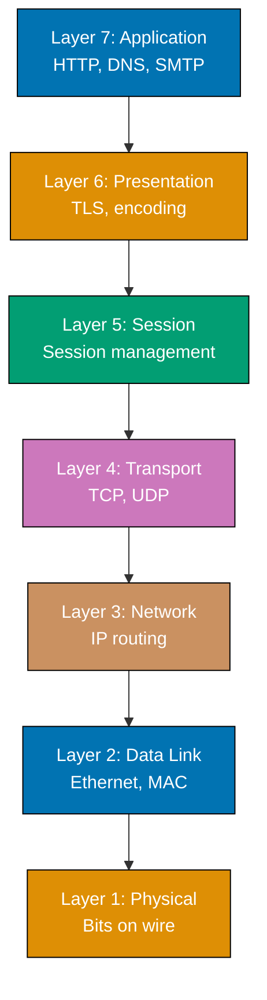
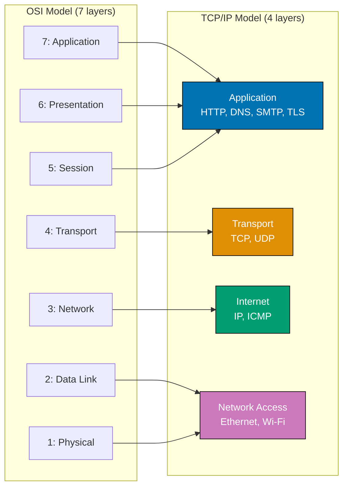
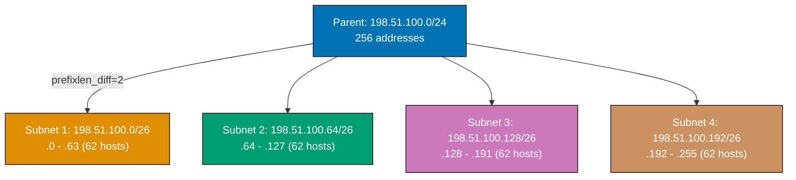
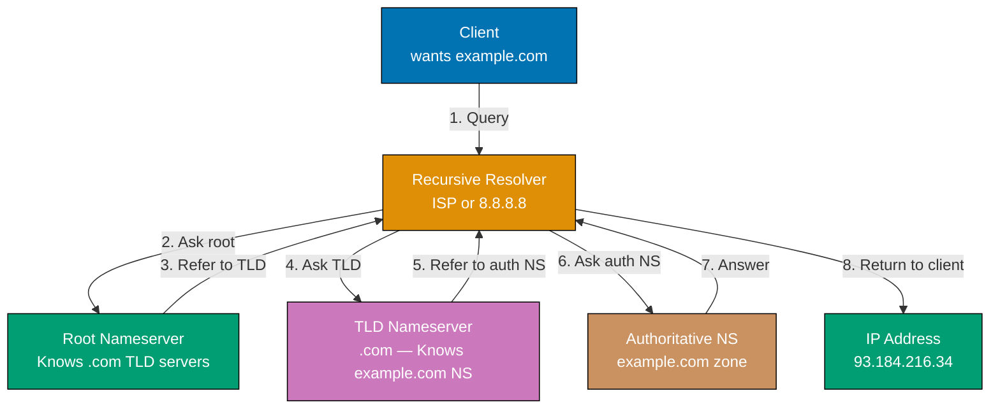
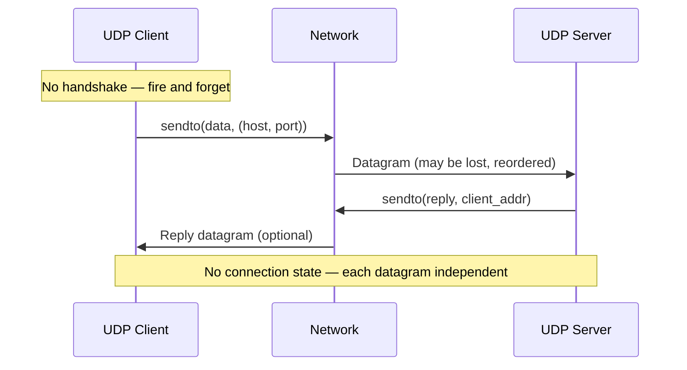
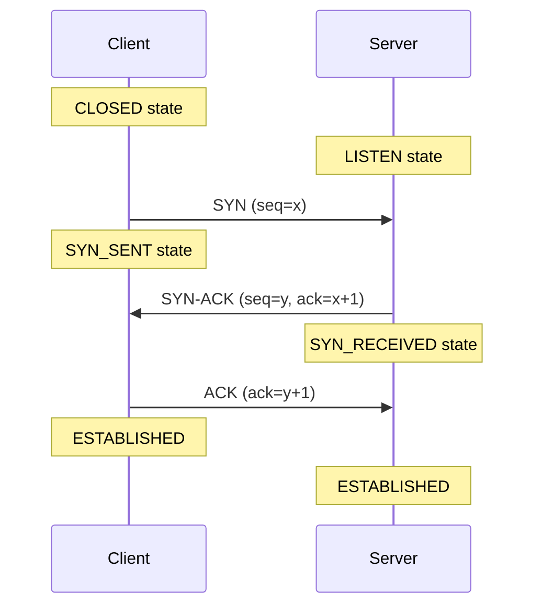
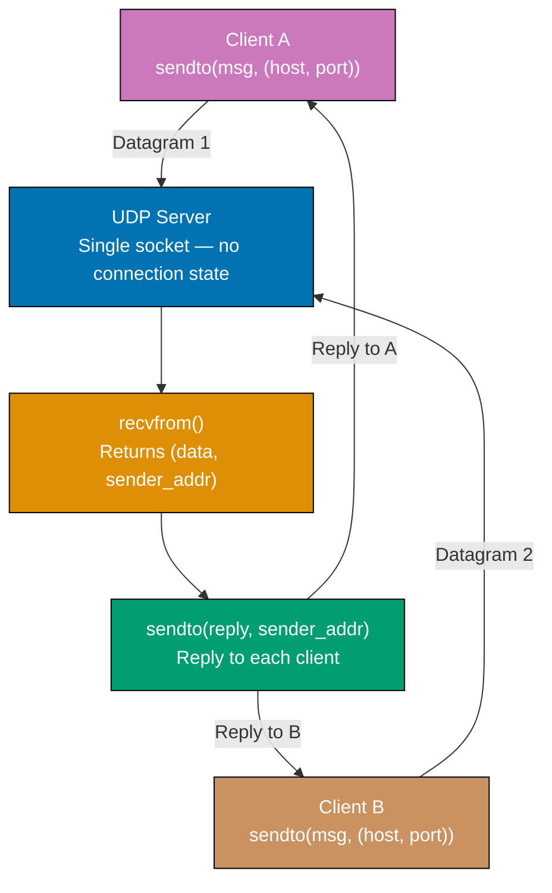
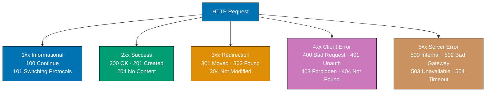

## Example 1: What Is a Network — Hosts, Packets, Links

A network connects devices (hosts) that communicate by breaking data into packets and sending them across links. Every piece of data you send — an HTTP request, a DNS query, a video stream — travels as a sequence of discrete packets through physical or wireless links.

```python
# Conceptual representation of a network message being packetized
# No socket needed — demonstrates the fundamental abstraction

message = "Hello, server!"
# => message: "Hello, server!" (14 bytes of data)

# Networks break data into fixed-size packets for transmission
MAX_PACKET_SIZE = 8  # => Simulates an 8-byte maximum transmission unit (MTU)
                     # => Real Ethernet MTU is 1500 bytes; IP can fragment larger data

# Simulate splitting a message into packets
packets = []                               # => packets: [] (empty list to hold fragments)
for i in range(0, len(message), MAX_PACKET_SIZE):
    # => i iterates: 0, 8 — two chunks for our 14-byte message
    packet = message[i:i + MAX_PACKET_SIZE]  # => First iteration: "Hello, s"
                                              # => Second iteration: "erver!"
    packets.append(packet)                    # => Adds each chunk to the list

print("Original message:", message)        # => Output: Original message: Hello, server!
print("Packet count:", len(packets))       # => Output: Packet count: 2
for idx, pkt in enumerate(packets):
    print(f"  Packet {idx}: {repr(pkt)}")  # => Output: Packet 0: 'Hello, s'
                                            # => Output: Packet 1: 'erver!'

# Reassemble at the destination
reassembled = "".join(packets)             # => reassembled: "Hello, server!"
print("Reassembled:", reassembled)         # => Output: Reassembled: Hello, server!
print("Intact:", message == reassembled)   # => Output: Intact: True
```

**Key Takeaway**: Networks transmit data by fragmenting it into packets that travel independently and are reassembled at the destination.

**Why It Matters**: Every networked application — web server, database client, streaming service — sends and receives packets. Understanding packetization explains why large transfers are split, why packet loss causes retransmissions, and why MTU tuning matters for performance-sensitive systems. Misconfigured MTU causes silent throughput degradation that is difficult to diagnose without this mental model.

---

## Example 2: OSI Model Layers

The OSI model defines seven layers of abstraction for network communication. Each layer adds its own header to data (encapsulation) as it travels down the stack, and strips headers as data travels up at the receiver.



```python
# Simulate the OSI encapsulation model in Python
# Each layer wraps the payload with its own header

# => encapsulate(payload, layer_name, header): wraps payload with a named header string
def encapsulate(payload, layer_name, header):
    # => Simulates a layer adding its header to the payload
    # => Real encapsulation prepends binary headers; this uses strings for clarity
    # => Returns "[layer_name header: header] payload" — outer wraps inner
    return f"[{layer_name} header: {header}] {payload}"

# Starting payload: application data
data = "GET / HTTP/1.1"                # => data: "GET / HTTP/1.1" (Layer 7 application data)

# Each layer wraps the data as it travels down the stack
# => encapsulate adds TLS presentation layer header around the HTTP application data
presentation = encapsulate(data, "TLS", "encrypt=AES256")
# => presentation: "[TLS header: encrypt=AES256] GET / HTTP/1.1"

transport = encapsulate(presentation, "TCP", "src_port=54321 dst_port=443 seq=1")
# => transport: "[TCP header: src_port=54321 dst_port=443 seq=1] [TLS header...]"

network = encapsulate(transport, "IP", "src=192.0.2.10 dst=93.184.216.34")
# => network: "[IP header: src=... dst=...] [TCP header...] ..."

datalink = encapsulate(network, "Ethernet", "src_mac=AA:BB:CC dst_mac=DD:EE:FF")
# => datalink: "[Ethernet header:...] [IP header...] ..."

# => print the fully encapsulated frame as it would appear on the wire
print("Final frame sent on wire:")
# => datalink holds the complete Ethernet frame wrapping all inner headers
print(datalink)
# => Output: [Ethernet header: src_mac=AA:BB:CC dst_mac=DD:EE:FF]
#            [IP header: src=192.0.2.10 dst=93.184.216.34]
#            [TCP header: src_port=54321 dst_port=443 seq=1]
#            [TLS header: encrypt=AES256] GET / HTTP/1.1

# Decapsulation at receiver (reverse order)
# => layers list holds the frame; each iteration strips one header layer
layers = [datalink]
print("\nDecapsulation at receiver:")
# => range(4): loop 4 times — one for each encapsulation layer added above
for i in range(4):
    # => Strips outermost header at each layer
    print(f"  Layer stripped: {layers[-1].split(']')[0]}]")
```

**Key Takeaway**: The OSI model layers add headers during encapsulation (sending) and strip them during decapsulation (receiving), giving each layer a clean abstraction boundary.

**Why It Matters**: When debugging network issues, layer-by-layer thinking narrows the problem space. A ping that works but HTTP fails means the issue is at Layer 7, not Layer 3. A TCP connection that establishes but TLS fails means the issue is at the presentation layer. Every network tool — Wireshark, tcpdump, traceroute — maps to specific OSI layers, making the model practically essential for diagnosis.

---

## Example 3: TCP/IP Model vs OSI Model

The TCP/IP model collapses the OSI seven layers into four practical layers used by the modern internet. Understanding both models helps you map protocol documentation to actual implementations.



```python
# Mapping between OSI and TCP/IP models

OSI_LAYERS = {             # => Seven-layer theoretical model
    7: "Application",      # => User-facing protocols: HTTP, SMTP, DNS, FTP
    6: "Presentation",     # => Data format, encryption (TLS often placed here)
    5: "Session",          # => Session establishment and management
    4: "Transport",        # => TCP/UDP — reliable or unreliable delivery
    3: "Network",          # => IP routing across networks
    2: "Data Link",        # => MAC addressing, frame delivery on local network
    1: "Physical",         # => Bits on wire, electrical signals
}

TCPIP_LAYERS = {           # => Four-layer practical model used by the internet
    4: ("Application", ["HTTP", "HTTPS", "DNS", "SMTP", "FTP", "SSH", "TLS"]),
    # => Combines OSI layers 5, 6, 7 — application protocols live here
    3: ("Transport", ["TCP", "UDP", "SCTP"]),
    # => Same as OSI Layer 4 — TCP and UDP
    2: ("Internet", ["IPv4", "IPv6", "ICMP", "BGP", "OSPF"]),
    # => Same as OSI Layer 3 — IP routing
    1: ("Network Access", ["Ethernet", "Wi-Fi", "PPP", "ARP"]),
    # => Combines OSI layers 1 and 2 — physical and data link
}

# => print each TCP/IP layer with its associated protocol list in descending order
print("TCP/IP Layer -> Protocols:")
# => sorted(..., reverse=True): iterates layers 4 → 1 (Application down to Network Access)
for layer_num in sorted(TCPIP_LAYERS.keys(), reverse=True):
    # => unpack tuple: name = layer name string, protocols = list of protocol strings
    name, protocols = TCPIP_LAYERS[layer_num]
    print(f"  Layer {layer_num} ({name}): {', '.join(protocols)}")
# => Output:
# => Layer 4 (Application): HTTP, HTTPS, DNS, SMTP, FTP, SSH, TLS
# => Layer 3 (Transport): TCP, UDP, SCTP
# => Layer 2 (Internet): IPv4, IPv6, ICMP, BGP, OSPF
# => Layer 1 (Network Access): Ethernet, Wi-Fi, PPP, ARP
```

**Key Takeaway**: The TCP/IP model's four layers map directly to internet protocols in use today; the OSI model provides finer conceptual granularity useful for understanding and debugging.

**Why It Matters**: Protocol documentation and RFCs reference both models. Network engineers think in OSI layers when diagnosing — "is this a Layer 3 routing issue or a Layer 4 TCP issue?" — but implement systems using the TCP/IP four-layer model. Tools like Wireshark, tcpdump, and traceroute map directly to specific OSI layers. Knowing both models prevents confusion when reading protocol specs, tool documentation, and architecture diagrams, and is foundational for any networking role.

---

## Example 4: IP Addresses — IPv4 and CIDR Notation

IPv4 addresses are 32-bit numbers written as four decimal octets (0-255). CIDR notation appends a prefix length (`/24`) indicating how many bits identify the network versus the host portion.

```python
import ipaddress  # => Standard library module for IP address manipulation
                  # => Available since Python 3.3 — no external deps needed

# Create an IPv4 address object
addr = ipaddress.IPv4Address("192.0.2.100")
# => addr: IPv4Address('192.0.2.100')
# => Internally stored as 32-bit integer: 3221226084

print("Address:", addr)                        # => Output: 192.0.2.100
print("Packed (bytes):", addr.packed)          # => Output: b'\xc0\x00\x02d'
print("Integer:", int(addr))                   # => Output: 3221226084
print("Is private:", addr.is_private)          # => Output: True (192.0.2.0/24 is an IANA special-purpose block)
print("Is loopback:", addr.is_loopback)        # => Output: False

# CIDR notation: network + prefix length
network = ipaddress.IPv4Network("192.0.2.0/24")
# => network: IPv4Network('192.0.2.0/24')
# => /24 means first 24 bits are network part, last 8 bits are host part

print("\nNetwork:", network)                   # => Output: 192.0.2.0/24
print("Netmask:", network.netmask)             # => Output: 255.255.255.0
print("Network address:", network.network_address)  # => Output: 192.0.2.0
print("Broadcast:", network.broadcast_address)      # => Output: 192.0.2.255
print("Num hosts:", network.num_addresses - 2)      # => Output: 254
# => -2 because .0 (network) and .255 (broadcast) are reserved

# Check if an address belongs to a network
test_addr = ipaddress.IPv4Address("192.0.2.50")
# => test_addr: IPv4Address('192.0.2.50')
print("\n192.0.2.50 in 192.0.2.0/24:", test_addr in network)
# => Output: True

outside_addr = ipaddress.IPv4Address("198.51.100.1")
# => outside_addr: IPv4Address('198.51.100.1') (different network)
print("198.51.100.1 in 192.0.2.0/24:", outside_addr in network)
# => Output: False
```

**Key Takeaway**: IPv4 addresses are 32-bit integers expressed as dotted-decimal notation; CIDR prefix length defines the network/host boundary.

**Why It Matters**: Every firewall rule, routing table entry, and access control list uses CIDR notation. Miscalculating network ranges causes security holes (too-broad rules) or connectivity failures (too-narrow rules). Cloud VPC configuration, Kubernetes pod CIDR, and security group rules all require confident CIDR arithmetic. Engineers who cannot perform subnet math quickly must pause to use tools during incidents, adding minutes of mean-time-to-resolution when seconds matter. CIDR is the vocabulary of infrastructure networking — fluency in it separates engineers who configure confidently from those who guess.

---

## Example 5: Subnet Masks and Subnetting

Subnetting divides a larger network into smaller sub-networks. The subnet mask determines which portion of an IP address identifies the network and which identifies the host.



```python
import ipaddress

# Subnetting: divide a /24 into four /26 subnets
parent_network = ipaddress.IPv4Network("198.51.100.0/24")
# => parent_network: 198.51.100.0/24 (256 addresses total)

# Split into 4 equal subnets (each becomes /26 = 64 addresses, 62 usable)
subnets = list(parent_network.subnets(prefixlen_diff=2))
# => prefixlen_diff=2 adds 2 bits to prefix: /24 + 2 = /26
# => subnets: list of 4 IPv4Network objects

print(f"Parent network: {parent_network}")
# => Output: Parent network: 198.51.100.0/24
print(f"Divided into {len(subnets)} subnets:\n")
# => Output: Divided into 4 subnets:

# => enumerate(subnets): yields (index, subnet) pairs for numbered subnet display
for i, subnet in enumerate(subnets):
    usable = subnet.num_addresses - 2  # => Subtract network and broadcast addresses
    # => subnet.num_addresses = 64 for /26; usable = 62 after removing .0 and .63
    print(f"  Subnet {i+1}: {subnet}")
    # => network_address: first IP; broadcast_address: last IP of this subnet
    print(f"    Range: {subnet.network_address} - {subnet.broadcast_address}")
    print(f"    Usable hosts: {usable}")
    print()
# => Output:
# =>   Subnet 1: 198.51.100.0/26
# =>     Range: 198.51.100.0 - 198.51.100.63    (62 usable)
# =>   Subnet 2: 203.0.113.0/26
# =>     Range: 203.0.113.0 - 203.0.113.63  (62 usable -- wait, /26 gives .0-.63)

# Actually subnets of 198.51.100.0/24 with /26:
# Subnet 1: 198.51.100.0/26   => .0 to .63
# Subnet 2: 198.51.100.64/26  => .64 to .127
# Subnet 3: 198.51.100.128/26 => .128 to .191
# Subnet 4: 198.51.100.192/26 => .192 to .255

# Determine which subnet an IP belongs to
target = ipaddress.IPv4Address("198.51.100.150")
# => target: 198.51.100.150
for subnet in subnets:
    if target in subnet:
        # => 198.51.100.150 falls in 198.51.100.128/26 (.128 to .191)
        print(f"{target} belongs to subnet: {subnet}")
        # => Output: 198.51.100.150 belongs to subnet: 198.51.100.128/26
```

**Key Takeaway**: Subnetting divides a network by borrowing bits from the host portion, creating multiple smaller networks with isolated broadcast domains.

**Why It Matters**: Data center and cloud network design relies on subnetting to isolate environments (production vs staging), control broadcast traffic, and apply security policies per subnet. Misaligned subnets prevent hosts from communicating or accidentally route traffic across security boundaries. Kubernetes assigns a dedicated CIDR block to each node for pod IPs — the cluster administrator must plan subnets to avoid overlap with corporate VPNs and on-premises ranges. Incorrect subnet planning during cloud VPC setup requires a complete tear-down to fix, making upfront correctness essential.

---

## Example 6: IPv6 Addresses

IPv6 uses 128-bit addresses written as eight groups of four hexadecimal digits. It solves IPv4 exhaustion and simplifies address autoconfiguration.

```python
import ipaddress

# IPv6 address representation
addr6 = ipaddress.IPv6Address("2001:0db8:85a3:0000:0000:8a2e:0370:7334")
# => addr6: IPv6Address('2001:db8:85a3::8a2e:370:7334')
# => Python automatically compresses consecutive zero groups with ::

print("Full address:", addr6.exploded)
# => Output: 2001:0db8:85a3:0000:0000:8a2e:0370:7334
# => exploded shows all 8 groups without compression

print("Compressed:", addr6.compressed)
# => Output: 2001:db8:85a3::8a2e:370:7334
# => :: replaces the longest run of consecutive zero groups

# Special IPv6 addresses
loopback6 = ipaddress.IPv6Address("::1")
# => loopback6: IPv6Address('::1')
# => Equivalent to 127.0.0.1 in IPv4

link_local = ipaddress.IPv6Address("fe80::1")
# => link_local: starts with fe80::/10 — only valid on local network segment
# => Not routable beyond the local link (used for neighbor discovery)

print("\nLoopback:", loopback6, "| is_loopback:", loopback6.is_loopback)
# => Output: ::1 | is_loopback: True
print("Link-local:", link_local, "| is_link_local:", link_local.is_link_local)
# => Output: fe80::1 | is_link_local: True

# IPv6 network notation
net6 = ipaddress.IPv6Network("2001:db8::/32")
# => net6: IPv6Network('2001:db8::/32')
# => /32 prefix leaves 96 bits for host addressing (2^96 hosts)
print("\nIPv6 network:", net6)
# => Output: 2001:db8::/32
print("Prefix length:", net6.prefixlen)
# => Output: 32
print("Num addresses:", net6.num_addresses)
# => Output: 79228162514264337593543950336 (2^96 — vastly more than IPv4's 2^32)
```

**Key Takeaway**: IPv6 expands the address space from 32 bits to 128 bits and uses colon-separated hexadecimal groups with `::` compression for consecutive zero groups.

**Why It Matters**: IPv4 address exhaustion drove IPv6 adoption — ISPs and mobile carriers now allocate IPv6-primary addresses. Modern infrastructure increasingly operates dual-stack (both IPv4 and IPv6), but some mobile networks and cloud environments are IPv6-only. Applications that hardcode IPv4 assumptions — parsing addresses as four octets, using `AF_INET` exclusively, or ignoring `AAAA` DNS records — break silently in these environments. Engineers who understand both protocols avoid these pitfalls during service design.

---

## Example 7: MAC Addresses and ARP

MAC (Media Access Control) addresses are 48-bit hardware identifiers assigned to network interfaces. ARP (Address Resolution Protocol) maps IP addresses to MAC addresses on a local network segment.

```python
import struct  # => Standard library for binary data packing/unpacking

# Simulate a MAC address
mac_bytes = bytes([0xAA, 0xBB, 0xCC, 0xDD, 0xEE, 0xFF])
# => mac_bytes: b'\xaa\xbb\xcc\xdd\xee\xff' (6 bytes = 48 bits)

# Format MAC address as colon-separated hex string
# => join each byte formatted as two-digit lowercase hex with ":" separator
mac_str = ":".join(f"{b:02x}" for b in mac_bytes)
# => mac_str: "aa:bb:cc:dd:ee:ff"
# => :02x format pads single-digit hex values with leading zero
print("MAC address:", mac_str)  # => Output: aa:bb:cc:dd:ee:ff

# The first byte's least-significant bit indicates unicast vs multicast
first_byte = mac_bytes[0]           # => first_byte: 0xAA = 10101010 in binary
is_multicast = bool(first_byte & 1) # => Bit 0 of first byte: 0 = unicast, 1 = multicast
                                     # => 0xAA & 0x01 = 0 => unicast
print("Is multicast:", is_multicast)  # => Output: Is multicast: False

# The second least-significant bit of first byte: 0=globally unique, 1=locally administered
# => first_byte & 2 isolates bit 1; 0xAA = 0b10101010, bit 1 = 1 → locally administered
is_local = bool(first_byte & 2)     # => 0xAA & 0x02 = 0x02 => locally administered
print("Is locally administered:", bool(first_byte & 2))  # => Output: True

# Simulate ARP table (IP -> MAC mapping)
# => dict maps IP strings to MAC strings; OS kernel uses similar structure in memory
arp_table = {
    "192.0.2.1":   "aa:bb:cc:11:22:33",  # => Gateway router's MAC
    "192.0.2.100": "aa:bb:cc:44:55:66",  # => Host A's MAC
    "192.0.2.101": "aa:bb:cc:77:88:99",  # => Host B's MAC
}
# => ARP table maintained by OS; entries expire (typically 20 min)

def arp_lookup(ip):
    # => Simulates ARP cache lookup; real ARP sends broadcast if not found
    mac = arp_table.get(ip)
    if mac:
        return f"ARP cache hit: {ip} -> {mac}"  # => Found in local cache
    return f"ARP broadcast needed for {ip}"      # => Must broadcast to find MAC

# => lookup known IP: expect cache hit; lookup unknown IP: expect broadcast message
print(arp_lookup("192.0.2.1"))    # => Output: ARP cache hit: 192.0.2.1 -> aa:bb:cc:11:22:33
print(arp_lookup("192.0.2.200"))  # => Output: ARP broadcast needed for 192.0.2.200
```

**Key Takeaway**: MAC addresses identify network interfaces at Layer 2; ARP resolves IP addresses to MAC addresses so frames can be delivered on a local network segment.

**Why It Matters**: ARP cache poisoning is a common network attack — an attacker sends fake ARP replies to redirect traffic. Understanding ARP explains why switches learn MAC addresses, why VLAN isolation is important, and why some cloud environments prohibit ARP for security (using DHCP or static mappings instead). Kubernetes and cloud VPCs use overlay networks that bypass ARP entirely, using central registries for IP-to-MAC mapping — a direct consequence of ARP's inherent insecurity at scale. Gratuitous ARP (a host announcing its own MAC) is used by load balancers for failover and by container orchestrators for virtual IP migration.

---

## Example 8: DNS Resolution — Query Lifecycle

DNS translates human-readable domain names into IP addresses. A query travels from the client's resolver to root nameservers, TLD nameservers, and finally authoritative nameservers.



```python
import socket  # => Standard library for DNS and network operations

# Resolve a hostname to its IP addresses
hostname = "example.com"
# => hostname: "example.com" (human-readable domain name)

# getaddrinfo returns comprehensive address info (works for both IPv4 and IPv6)
results = socket.getaddrinfo(hostname, 80)
# => results: list of (family, type, proto, canonname, sockaddr) tuples
# => port 80 specified to get HTTP-relevant entries

# => print header line before iterating through DNS result tuples
print(f"DNS results for {hostname}:")
# => unpack each 5-tuple returned by getaddrinfo into named variables
for family, stype, proto, canonname, sockaddr in results:
    ip = sockaddr[0]   # => IP address extracted from sockaddr tuple
    port = sockaddr[1] # => Port number (80 as requested)
    # => ternary selects address family label based on integer constant
    family_name = "IPv4" if family == socket.AF_INET else "IPv6"
    # => AF_INET = 2 (IPv4), AF_INET6 = 10 (IPv6)
    print(f"  {family_name}: {ip}:{port}")
# => Output: IPv4: 93.184.216.34:80 (actual result may differ)

# Simple hostname-to-IP (IPv4 only)
# => gethostbyname: simpler but IPv4-only; does not return port information
ip4 = socket.gethostbyname(hostname)
# => ip4: "93.184.216.34" — one IPv4 address
print(f"\ngethostbyname: {hostname} -> {ip4}")
# => Output: gethostbyname: example.com -> 93.184.216.34

# Reverse DNS: IP to hostname
# => gethostbyaddr: PTR record lookup — resolves IP back to hostname
try:
    reverse = socket.gethostbyaddr("8.8.8.8")
    # => reverse: ('dns.google', [], ['8.8.8.8'])
    print(f"Reverse DNS: 8.8.8.8 -> {reverse[0]}")
    # => Output: Reverse DNS: 8.8.8.8 -> dns.google
except socket.herror as e:
    print(f"No reverse DNS: {e}")  # => Some IPs have no PTR record
```

**Key Takeaway**: DNS resolution is hierarchical — clients query resolvers, which recursively ask root, TLD, and authoritative nameservers, then cache the result for the TTL duration.

**Why It Matters**: DNS is the internet's phone book. DNS misconfiguration breaks all services that depend on it. TTL values control cache duration — too short increases resolver load; too long slows propagation of IP changes. DNS failure is a common root cause of outages because it affects every hostname-based connection in the system. During DNS incidents, diagnostic sequence matters: confirm DNS resolution works (`dig example.com`) before investigating TCP connectivity or application errors. Local resolver caching means DNS changes can take TTL duration to propagate — reduce TTL before planned IP changes, not after.

---

## Example 9: DNS Record Types

DNS supports multiple record types beyond simple A records. Each type serves a specific purpose in routing, mail delivery, service discovery, and domain verification.

```python
import socket  # => need socket for gethostbyname and getaddrinfo DNS lookups

# Demonstrate different DNS record types conceptually
# Python's socket module provides basic DNS lookups
# For full record-type queries, dnspython is needed (external); we use socket here

# A Record: hostname -> IPv4 address
# => gethostbyname resolves A record; returns one IPv4 address as string
try:  # => wrap in try/except because DNS lookup may fail (offline, NXDOMAIN)
    a_record = socket.gethostbyname("example.com")
    # => a_record: "93.184.216.34" (IPv4)
    print(f"A record (example.com): {a_record}")
except socket.gaierror as e:
    print(f"A record lookup failed: {e}")
    # => gaierror covers all getaddrinfo/gethostbyname failures

# AAAA Record: hostname -> IPv6 address
# => getaddrinfo with AF_INET6 filters results to IPv6 addresses only
try:  # => separate try block — IPv6 may fail even when IPv4 works
    aaaa_results = socket.getaddrinfo("example.com", None, socket.AF_INET6)
    # => Filter to IPv6 only (AF_INET6)
    if aaaa_results:
        aaaa = aaaa_results[0][4][0]  # => Extract IPv6 address string
        print(f"AAAA record (example.com): {aaaa}")
    # => Output: AAAA record: 2606:2800:220:1:248:1893:25c8:1946 (example value)
except socket.gaierror as e:
    print(f"AAAA lookup failed or no IPv6: {e}")

# MX Record: mail exchange hostname for a domain
# socket module doesn't support MX directly; show structure conceptually
# => mx_records_example: list of (priority, server) tuples simulating MX lookup result
mx_records_example = [  # => list of (priority, server) tuples for sorting
    # => (priority, mail_server) — lower priority number = preferred server
    (10, "mail1.example.com"),  # => Primary mail server
    (20, "mail2.example.com"),  # => Backup mail server
]
# => print header before iterating MX record tuples
print("\nMX records (conceptual):")
# => sorted() sorts by first tuple element (priority); lower number = higher preference
for priority, server in sorted(mx_records_example):
    # => sorted() by priority; lowest number wins in MX selection
    print(f"  Priority {priority}: {server}")
# => Output:
# =>   Priority 10: mail1.example.com
# =>   Priority 20: mail2.example.com

# Show record types reference
# => dns_record_types: reference dict covering all major DNS record types
dns_record_types = {  # => dict maps record type name to its role description
    "A":     "IPv4 address mapping (hostname -> 32-bit IP)",
    # => A record: most fundamental; directly maps name to IPv4; cached for TTL seconds
    "AAAA":  "IPv6 address mapping (hostname -> 128-bit IP)",
    # => AAAA record: same as A but for IPv6; dual-stack hosts have both A and AAAA
    "CNAME": "Canonical name alias (alias -> real hostname)",
    # => CNAME: alias follows the chain; www.example.com CNAME -> example.com -> A record
    "MX":    "Mail exchange server (domain -> mail server)",
    # => MX: priority value selects among multiple mail servers (lower = higher priority)
    "TXT":   "Arbitrary text (SPF, DKIM, domain verification)",
    # => TXT: critical for email auth; SPF says which IPs may send, DKIM signs message headers
    "NS":    "Authoritative nameservers for a zone",
    # => NS: delegating a zone means changing NS records at parent and pointing to new servers
    "PTR":   "Reverse DNS (IP -> hostname)",
    # => PTR: lives in in-addr.arpa zone; mail servers check PTR to reject spam from dynamic IPs
    "SOA":   "Start of Authority (zone metadata, serial number)",
    # => SOA serial: incremented on each zone change; secondary servers check it to know when to sync
    "SRV":   "Service location (protocol, port, hostname)",
    # => SRV: '_xmpp-client._tcp.example.com SRV 5 0 5222 xmpp.example.com' — automatic discovery
}
# => print label before iterating all record type entries
print("\nDNS Record Types:")
for rtype, description in dns_record_types.items():
    # => Print each record type aligned with its description
    print(f"  {rtype:6s}: {description}")
# => Output:   A     : IPv4 address mapping (hostname -> 32-bit IP)
#              AAAA  : IPv6 address mapping...
```

**Key Takeaway**: DNS record types serve distinct roles — A/AAAA for addresses, CNAME for aliases, MX for mail, TXT for verification, and SRV for service discovery.

**Why It Matters**: Incorrect DNS records cause email delivery failures (wrong MX), broken HTTPS (wrong A/CNAME pointing to wrong server), and failed service discovery. CNAME chains add latency to resolution because each alias requires an additional DNS lookup. TXT records hold SPF and DKIM data that determines whether email gets delivered or marked as spam — missing or malformed TXT records cause bulk mail rejection. Every production deployment that changes a hostname needs careful DNS record verification across all record types, not just A records.

---

## Example 10: UDP Basics — Python Socket

UDP (User Datagram Protocol) is connectionless. Packets are sent without establishing a connection first, with no delivery guarantee or ordering. This makes UDP fast and suitable for time-sensitive applications.



```python
import socket      # => Standard library for socket programming
import threading   # => Standard library for running server in background thread
import time        # => Standard library for timing

# UDP is connectionless — no handshake, just send and receive datagrams

# => udp_server: binds a SOCK_DGRAM socket and waits for one datagram
def udp_server(port):
    # => Creates a UDP server socket that receives messages
    sock = socket.socket(socket.AF_INET, socket.SOCK_DGRAM)
    # => AF_INET: IPv4 address family
    # => SOCK_DGRAM: UDP socket type (datagram, not stream)
    sock.bind(("127.0.0.1", port))  # => Bind to localhost on specified port
    sock.settimeout(2.0)             # => 2-second timeout to avoid blocking forever

    try:  # => single recv — server handles one datagram per call in this demo
        data, addr = sock.recvfrom(1024)
        # => recvfrom returns (data_bytes, (sender_ip, sender_port))
        # => 1024 = max bytes to receive in one call
        print(f"Server received: {data.decode()} from {addr}")
        # => Output: Server received: Hello UDP! from ('127.0.0.1', <ephemeral_port>)
        sock.sendto(b"ACK", addr)
        # => Send acknowledgment back to sender (application-level, not UDP built-in)
    except socket.timeout:
        print("Server: no data received (timeout)")
        # => timeout after 2.0 s means no client sent a datagram
    finally:
        sock.close()  # => Release the socket resource

# => udp_client: creates SOCK_DGRAM socket, sends one datagram, waits for reply
def udp_client(port):
    # => Creates a UDP client socket that sends a message
    sock = socket.socket(socket.AF_INET, socket.SOCK_DGRAM)
    # => No connect() call needed — UDP is connectionless
    sock.settimeout(2.0)  # => raises socket.timeout if server does not reply

    try:  # => fire message then wait for optional reply
        message = b"Hello UDP!"               # => Message as bytes
        # => sendto dispatches datagram immediately; no prior connection established
        sock.sendto(message, ("127.0.0.1", port))
        # => sendto(data, (host, port)) — sends datagram to destination
        # => No connection required; fire and forget (or wait for response)

        response, server_addr = sock.recvfrom(1024)
        # => Wait for response from server
        print(f"Client received: {response.decode()} from {server_addr}")
        # => Output: Client received: ACK from ('127.0.0.1', <server_port>)
    except socket.timeout:
        print("Client: no response received (timeout)")
        # => UDP delivers no guarantee — response may never arrive
    finally:
        sock.close()  # => always close to free the OS socket descriptor

# Run server in background thread, then client
# => port 9001: arbitrary unprivileged port chosen for this demo
port = 9001                                          # => Arbitrary port for this demo
# => Thread wraps udp_server so it runs concurrently with the main thread
server_thread = threading.Thread(target=udp_server, args=(port,), daemon=True)
# => daemon=True: thread exits when main program exits (no blocking join needed)
server_thread.start()  # => Start server in background
# => sleep(0.1): gives server thread time to complete bind() before client sends
time.sleep(0.1)        # => Brief pause to let server bind before client sends
udp_client(port)       # => send datagram and print ACK reply
# => join(timeout=3): wait up to 3 s for server to clean up after receiving datagram
server_thread.join(timeout=3)  # => wait up to 3 s for server thread to finish
```

**Key Takeaway**: UDP sockets use `SOCK_DGRAM` and `sendto()`/`recvfrom()` — no connection establishment, just datagrams with source and destination addresses.

**Why It Matters**: UDP powers DNS queries, video streaming, VoIP, and online gaming — applications where a dropped packet is preferable to waiting for retransmission. Understanding UDP helps you choose the right transport protocol for latency-sensitive applications and implement application-level reliability when needed. QUIC, the transport protocol underlying HTTP/3, runs over UDP and implements its own reliability and ordering — an example of exactly this pattern applied at internet scale. Protocols like RTP (real-time transport for video) show that application-layer reliability is practical and widely deployed.

---

## Example 11: TCP Basics — Python Socket

TCP (Transmission Control Protocol) provides reliable, ordered, connection-oriented communication. A connection must be established before data flows, and the protocol guarantees delivery and ordering.

```python
import socket    # => need socket for SOCK_STREAM TCP sockets
import threading  # => run server in background so client can connect
import time       # => time.sleep lets server bind before client connects

def tcp_server(port):
    # => Creates a TCP server that listens for connections
    server_sock = socket.socket(socket.AF_INET, socket.SOCK_STREAM)
    # => SOCK_STREAM: TCP socket type (stream, not datagram)
    server_sock.setsockopt(socket.SOL_SOCKET, socket.SO_REUSEADDR, 1)
    # => SO_REUSEADDR: allows reuse of port immediately after server closes
    # => Without this, you get "Address already in use" for ~60 seconds

    server_sock.bind(("127.0.0.1", port))  # => Bind to address:port
    server_sock.listen(1)                   # => Queue up to 1 pending connection
    server_sock.settimeout(3.0)             # => timeout so demo doesn't hang

    try:  # => wait for exactly one client connection then handle it
        conn, addr = server_sock.accept()
        # => accept() blocks until a client connects
        # => Returns (connection_socket, client_address)
        # => conn is a NEW socket dedicated to this one client
        print(f"Server: connection from {addr}")
        # => Output: Server: connection from ('127.0.0.1', <client_port>)

        data = conn.recv(1024)
        # => recv(1024): receive up to 1024 bytes — blocks until data arrives
        print(f"Server: received '{data.decode()}'")
        # => Output: Server: received 'Hello TCP!'

        conn.sendall(b"World!")
        # => sendall ensures all bytes are sent (retries if partial send)
        conn.close()  # => Close this client's connection
    except socket.timeout:
        print("Server: timeout waiting for connection")
        # => no client connected within 3 s
    finally:
        server_sock.close()  # => release listening socket

def tcp_client(port):
    # => TCP client: connect, send, receive, close
    client_sock = socket.socket(socket.AF_INET, socket.SOCK_STREAM)
    # => SOCK_STREAM creates a TCP socket
    client_sock.settimeout(3.0)  # => fail fast if server unreachable

    try:  # => perform three-way handshake then exchange data
        client_sock.connect(("127.0.0.1", port))
        # => connect() performs TCP three-way handshake: SYN -> SYN-ACK -> ACK
        # => Blocks until handshake completes or timeout

        client_sock.sendall(b"Hello TCP!")
        # => sendall sends all bytes reliably (TCP handles retransmit if needed)

        response = client_sock.recv(1024)
        # => Receive server's response
        print(f"Client: received '{response.decode()}'")
        # => Output: Client: received 'World!'
    except (socket.timeout, ConnectionRefusedError) as e:
        print(f"Client error: {e}")
        # => ConnectionRefusedError if server not listening on port
    finally:
        client_sock.close()  # => always close to release file descriptor

port = 9002  # => pick port not used by other examples
server_thread = threading.Thread(target=tcp_server, args=(port,), daemon=True)
# => daemon=True: server thread exits when main thread finishes
server_thread.start()  # => begin listening before client tries to connect
time.sleep(0.1)        # => let server reach accept() before client calls connect()
tcp_client(port)       # => connect, send "Hello TCP!", receive "World!"
server_thread.join(timeout=4)  # => wait for server thread to clean up
```

**Key Takeaway**: TCP sockets use `SOCK_STREAM`, require `connect()` (client) and `accept()` (server), and guarantee reliable ordered delivery.

**Why It Matters**: HTTP, database protocols, SSH, and most application protocols run over TCP because reliability matters more than latency. Understanding raw TCP sockets reveals what frameworks like Flask, Django, and Express abstract — helping you debug connection issues, tune buffer sizes, and understand why TCP connection overhead matters in high-throughput systems. When a microservice unexpectedly drops connections, the first debug step is isolating whether the failure is at the TCP layer (connection refused, reset) or application layer (HTTP 500) — impossible without knowing how TCP sockets work beneath the framework. Raw socket knowledge makes framework behavior predictable and debuggable.

---

## Example 12: TCP Three-Way Handshake

TCP establishes a connection with a three-step handshake: SYN (client initiates), SYN-ACK (server acknowledges and synchronizes), ACK (client confirms). This synchronizes sequence numbers for reliable delivery.



```python
import socket    # => need socket for TCP stream sockets
import threading  # => run server in background thread
import time       # => time.sleep gives server time to reach listen()

# Observe TCP connection states conceptually via socket operations

def handshake_demo_server(port):
    # => server side: create listening socket and wait for handshake to complete
    srv = socket.socket(socket.AF_INET, socket.SOCK_STREAM)
    srv.setsockopt(socket.SOL_SOCKET, socket.SO_REUSEADDR, 1)
    # => SO_REUSEADDR: avoid "Address already in use" on restart
    srv.bind(("127.0.0.1", port))  # => bind to loopback before listening
    srv.listen(5)         # => listen() puts server in LISTEN state
                          # => OS now responds to SYN packets automatically
    srv.settimeout(3.0)   # => stop waiting after 3 s if no client arrives
    print("Server: LISTEN state — waiting for SYN")
    # => SYN queue: holds half-open connections (received SYN, sent SYN-ACK, awaiting ACK)
    # => accept queue: holds fully established connections awaiting accept()

    try:  # => accept() blocks until OS completes three-way handshake
        conn, addr = srv.accept()
        # => accept() completes when 3-way handshake finishes
        # => OS handled SYN, SYN-ACK, ACK automatically at kernel level
        # => We only see the completed ESTABLISHED connection
        print(f"Server: ESTABLISHED — connection from {addr}")
        # => Output: Server: ESTABLISHED — connection from ('127.0.0.1', <port>)

        # TCP sequence numbers synchronized during handshake
        # Client chose random ISN (Initial Sequence Number) x
        # Server chose random ISN y
        # After handshake: client sends with seq starting at x+1
        #                  server sends with seq starting at y+1
        conn.sendall(b"CONNECTED")  # => notify client that connection succeeded
        conn.close()  # => close this connection socket (not listening socket)
    except socket.timeout:
        pass  # => no client connected within timeout — exit cleanly
    finally:
        srv.close()  # => always release listening socket

def handshake_demo_client(port):
    # => client side: open socket and trigger three-way handshake via connect()
    client = socket.socket(socket.AF_INET, socket.SOCK_STREAM)
    client.settimeout(3.0)  # => abort if handshake takes longer than 3 s

    print("Client: initiating TCP handshake (SYN)")
    # => connect() triggers: client sends SYN with random seq=x
    client.connect(("127.0.0.1", port))
    # => Server responds: SYN-ACK with seq=y, ack=x+1
    # => Client sends: ACK with ack=y+1
    # => connect() returns when ACK sent — connection is ESTABLISHED
    print("Client: ESTABLISHED — handshake complete")
    # => Output: Client: ESTABLISHED — handshake complete

    data = client.recv(64)  # => receive server's "CONNECTED" confirmation
    print(f"Client received: {data.decode()}")
    # => Output: Client received: CONNECTED
    client.close()
    # => close() initiates four-way teardown (FIN-ACK sequence)

port = 9003  # => port used only in this example
srv_thread = threading.Thread(target=handshake_demo_server, args=(port,), daemon=True)
srv_thread.start()  # => start server before client attempts connection
time.sleep(0.1)     # => ensure server is in LISTEN state before client calls connect()
handshake_demo_client(port)  # => triggers SYN -> SYN-ACK -> ACK
srv_thread.join(timeout=4)   # => wait for server thread to finish cleanup
```

**Key Takeaway**: The TCP three-way handshake synchronizes sequence numbers between client and server before any data flows, enabling reliable ordered delivery.

**Why It Matters**: The handshake adds one round-trip time (RTT) of latency to every new TCP connection. HTTP/1.1 multiplies this cost by creating one connection per resource. HTTP/2 solves this with connection reuse. TLS adds further handshake RTTs. Understanding the handshake cost drives decisions about connection pooling, keep-alive settings, and protocol selection. At a 50ms RTT (typical cross-continental path), each new TCP connection costs 50ms before any data flows — 200ms for a TLS 1.2 connection. Persistent connections and connection pools exist specifically to amortize this fixed overhead across many requests.

---

## Example 13: TCP Four-Way Teardown

TCP connection termination uses a four-step process: each side independently signals it has no more data to send (FIN), and the other side acknowledges. This allows half-close — one side can stop sending while still receiving.

```python
import socket    # => need socket for TCP and shutdown() calls
import threading  # => run server concurrently with client
import time       # => time.sleep ensures server is ready before client connects

# Demonstrate TCP teardown: FIN-ACK-FIN-ACK sequence

# => teardown_server: accepts connection, exchanges data, then initiates half-close with FIN
def teardown_server(port):
    # => server initiates the teardown by sending the first FIN
    srv = socket.socket(socket.AF_INET, socket.SOCK_STREAM)
    srv.setsockopt(socket.SOL_SOCKET, socket.SO_REUSEADDR, 1)
    # => SO_REUSEADDR: skip TIME_WAIT delay when restarting
    srv.bind(("127.0.0.1", port))  # => bind to loopback port
    # => listen(1): queue up to 1 pending connection (one client in this demo)
    srv.listen(1)  # => backlog of 1 — only one client in this demo
    srv.settimeout(3.0)  # => don't block forever if client never comes

    try:  # => accept, exchange data, then half-close with shutdown
        conn, addr = srv.accept()
        # => accept() returns after TCP handshake completes
        # => conn.settimeout: set per-operation timeout on the accepted connection socket
        conn.settimeout(2.0)  # => short timeout for reading client's FIN

        data = conn.recv(64)                # => Receive client's data
        print(f"Server: received '{data.decode()}'")
        # => Output: Server: received 'CLIENT DATA'

        conn.sendall(b"SERVER DATA")        # => Send response
        # => Server calls shutdown(SHUT_WR) to send FIN to client
        # => This signals "I have no more data to send" but can still receive
        conn.shutdown(socket.SHUT_WR)       # => Step 1: Server sends FIN
        print("Server: sent FIN (SHUT_WR)")
        # => Output: Server: sent FIN (SHUT_WR)

        # Server can still receive after sending FIN (half-close)
        try:  # => wait for client to acknowledge and send its own FIN
            remaining = conn.recv(64)       # => Wait for client's FIN
            if not remaining:
                print("Server: received client FIN (empty recv = connection closed)")
                # => Empty recv means client sent FIN and closed its send side
        except socket.timeout:
            pass  # => client FIN didn't arrive in time — still proceed

        conn.close()    # => Step 4: Final close — releases all resources
        print("Server: connection fully closed")  # => FIN-ACK-FIN-ACK sequence done
    except socket.timeout:
        pass  # => no client connected within timeout
    finally:
        srv.close()  # => always release the listening socket

# => teardown_client: connects, exchanges data, receives server FIN, sends own FIN
def teardown_client(port):
    # => client connects, exchanges data, then follows server-initiated teardown
    client = socket.socket(socket.AF_INET, socket.SOCK_STREAM)
    client.settimeout(3.0)  # => abort if server doesn't respond
    # => connect() completes TCP three-way handshake before returning
    client.connect(("127.0.0.1", port))  # => establish connection first

    client.sendall(b"CLIENT DATA")
    # => Client sends data, then initiates teardown

    data = client.recv(64)  # => receive server's response
    print(f"Client: received '{data.decode()}'")
    # => Output: Client: received 'SERVER DATA'

    # Client receives server's FIN (SHUT_WR above = empty recv here)
    # => empty recv (b"") signals server closed its send side via SHUT_WR
    remaining = client.recv(64)         # => Receive server's FIN
    # => not remaining: empty bytes means server's send side is closed (FIN received)
    if not remaining:
        print("Client: received server FIN")
        # => Output: Client: received server FIN

    # Client sends its own FIN
    # => shutdown(SHUT_WR): closes client's send side; server's recv will return empty
    client.shutdown(socket.SHUT_WR)     # => Step 3: Client sends FIN
    print("Client: sent FIN — entering TIME_WAIT")
    # => TIME_WAIT lasts 2*MSL (Maximum Segment Lifetime) = ~60-120 seconds
    # => Ensures delayed packets don't confuse future connections on same port

    client.close()  # => complete teardown; OS handles final ACK

port = 9004  # => unique port for this teardown example
# => Thread runs teardown_server concurrently so client can connect and complete teardown
srv_thread = threading.Thread(target=teardown_server, args=(port,), daemon=True)
# => daemon=True: thread won't block program exit if teardown stalls
srv_thread.start()   # => server must be listening before client connects
time.sleep(0.1)      # => give server time to reach accept()
teardown_client(port)  # => run the full FIN-ACK-FIN-ACK sequence
srv_thread.join(timeout=4)  # => wait for server thread to finish cleanup
```

**Key Takeaway**: TCP teardown is a four-step process (FIN-ACK-FIN-ACK) allowing each side to independently close its send channel while potentially still receiving.

**Why It Matters**: TIME_WAIT state causes "Address already in use" errors when restarting servers quickly. `SO_REUSEADDR` mitigates this. Understanding teardown explains why closing database connections properly matters — unclosed connections leave their ports in TIME_WAIT, exhausting the server's connection pool and eventually preventing new connections from being accepted. Half-close (`shutdown(SHUT_WR)`) enables graceful protocols like HTTP where one side finishes sending before the other responds.

---

## Example 14: Port Numbers — Well-Known vs Ephemeral

Ports identify specific services on a host. Well-known ports (0-1023) are assigned to standard services. Registered ports (1024-49151) are for common applications. Ephemeral ports (49152-65535) are assigned temporarily by the OS to clients.

```python
import socket  # => need socket for bind(), getsockname(), and getservbyport()

# Well-known port assignments
WELL_KNOWN_PORTS = {  # => dict: port number -> service description
    20:  "FTP (data)",       # => File Transfer Protocol data channel
    21:  "FTP (control)",    # => File Transfer Protocol command channel
    22:  "SSH",              # => Secure Shell
    25:  "SMTP",             # => Simple Mail Transfer Protocol (outbound email)
    53:  "DNS",              # => Domain Name System queries
    80:  "HTTP",             # => HyperText Transfer Protocol (web)
    110: "POP3",             # => Post Office Protocol (email retrieval)
    143: "IMAP",             # => Internet Message Access Protocol
    443: "HTTPS",            # => HTTP over TLS (secure web)
    465: "SMTPS",            # => SMTP over TLS
    993: "IMAPS",            # => IMAP over TLS
    3306: "MySQL",           # => MySQL database (registered, not well-known)
    5432: "PostgreSQL",      # => PostgreSQL database
    6379: "Redis",           # => Redis cache
    27017: "MongoDB",        # => MongoDB database
}  # => 15 common ports spanning FTP through MongoDB

# => iterate WELL_KNOWN_PORTS in ascending port-number order for human-readable output
print("Common port assignments:")
for port, service in sorted(WELL_KNOWN_PORTS.items()):
    # => sorted() by key (port number) to output in ascending order
    # => category string labels port range: "well-known" for ≤1023, "registered" for higher
    category = "well-known" if port <= 1023 else "registered"
    # => Ports 0-1023 require root/admin privileges to bind on Unix
    print(f"  {port:5d} ({category:10s}): {service}")
    # => :5d right-aligns port number in 5-char field for readable table

# Get an ephemeral port from the OS
# Bind to port 0 — OS assigns an available ephemeral port
# => SOCK_STREAM: TCP socket; ephemeral assignment mechanism is identical for UDP
ephemeral_sock = socket.socket(socket.AF_INET, socket.SOCK_STREAM)
# => TCP socket — ephemeral port assignment works the same for UDP
ephemeral_sock.bind(("127.0.0.1", 0))   # => Port 0 = let OS choose
# => getsockname()[1]: index 1 extracts port from (host, port) tuple
ephemeral_port = ephemeral_sock.getsockname()[1]
# => getsockname() returns (host, port) tuple of bound address
# => ephemeral_port: some value in range 32768-60999 (Linux) or 49152-65535 (IANA)
print(f"\nOS-assigned ephemeral port: {ephemeral_port}")
# => Output: OS-assigned ephemeral port: 54321 (varies per OS and run)

# Look up service name for a port
# => getservbyport(80, "tcp"): reads /etc/services to map port 80 + TCP to "http"
try:  # => getservbyport may raise OSError on some platforms
    service_name = socket.getservbyport(80, "tcp")
    # => getservbyport looks up /etc/services for port -> service name
    print(f"\nPort 80/tcp = {service_name}")  # => Output: http
except OSError:
    print("Service lookup not available")
    # => some stripped-down environments omit /etc/services

ephemeral_sock.close()  # => release the socket after reading its port
```

**Key Takeaway**: Ports 0-1023 are well-known and require elevated privileges; ports 1024-49151 are registered for common services; ports 49152-65535 are ephemeral, assigned by the OS for outgoing connections.

**Why It Matters**: Security scanners enumerate open ports to discover running services — `nmap` scans well-known port ranges first, so any unintended open port is quickly detected by attackers. Firewall rules reference ports to permit or deny traffic, making correct port knowledge essential for writing effective rules. Running privileged services on non-standard ports does not meaningfully improve security (security by obscurity fails) but does aid in avoiding automated scans of well-known ports. Ephemeral port exhaustion is a real production problem when connection pool sizes exceed OS limits.

---

## Example 15: Socket Programming — TCP Server

A production-pattern TCP server listens on a port, accepts connections, handles each client, and cleans up resources. This example shows the minimal correct pattern.

```python
import socket    # => need socket for TCP listening socket
import threading  # => one thread per client for concurrent handling

# => handle_client: runs in dedicated thread; reads from conn until client disconnects
def handle_client(conn, addr):
    # => This function runs in its own thread for each connected client
    # => Isolation prevents one slow client from blocking others
    print(f"[{addr}] Connected")  # => log new connection with client address
    try:  # => echo loop: receive until client disconnects
        while True:  # => read in a loop — TCP is a stream, data arrives in chunks
            data = conn.recv(1024)
            # => recv() blocks until data arrives or connection closes
            # => Returns empty bytes b"" when client disconnects
            if not data:
                break          # => Client disconnected — exit loop
            # => decode with errors="replace": bad UTF-8 bytes become replacement char
            message = data.decode("utf-8", errors="replace")
            # => Decode bytes to string; replace invalid UTF-8 sequences
            print(f"[{addr}] Received: {message.strip()}")
            response = f"Echo: {message}".encode("utf-8")
            # => Encode response back to bytes for transmission
            conn.sendall(response)
            # => sendall guarantees all bytes sent (handles partial writes)
    except (ConnectionResetError, BrokenPipeError) as e:
        # => ConnectionResetError: client closed abruptly
        # => BrokenPipeError: client gone before we could send
        print(f"[{addr}] Connection error: {e}")
    finally:
        conn.close()     # => Always close connection in finally block
        print(f"[{addr}] Disconnected")  # => log cleanup

# => run_tcp_server: creates listening socket, loops accepting clients, spawns threads
def run_tcp_server(host="127.0.0.1", port=9005, max_clients=5):
    # => listen-accept-dispatch loop: the core pattern of every TCP server
    server = socket.socket(socket.AF_INET, socket.SOCK_STREAM)
    server.setsockopt(socket.SOL_SOCKET, socket.SO_REUSEADDR, 1)
    # => SO_REUSEADDR lets us restart quickly without waiting for TIME_WAIT
    server.bind((host, port))  # => claim the port before starting accept loop
    server.listen(max_clients)  # => start accepting connections; OS queues up to max_clients
    # => listen(backlog): backlog = pending connection queue size
    print(f"TCP server listening on {host}:{port}")  # => confirm server is ready

    server.settimeout(2.0)  # => For demo: timeout so loop can exit
    try:  # => run accept loop until timeout
        while True:  # => accept one connection per iteration
            try:  # => inner try catches per-accept timeout
                conn, addr = server.accept()
                # => accept() blocks until new client connects
                # => new Thread: one thread per client; simple model, limited to ~1000 clients
                t = threading.Thread(target=handle_client, args=(conn, addr), daemon=True)
                # => new Thread per client: simple but not scalable past ~1000 clients
                t.start()  # => start handler thread immediately
                # => Each client gets its own thread — simple but not scalable
                # => For high concurrency: use asyncio or thread pool instead
            except socket.timeout:
                break  # => Demo: exit after timeout
    finally:
        server.close()  # => release listening socket

# Run server briefly for demonstration
import time  # => need time.sleep to let server start before client connects
# => Thread wraps run_tcp_server; daemon=True ensures it exits with the main program
srv = threading.Thread(target=run_tcp_server, daemon=True)
# => daemon=True: server thread exits when main thread finishes
srv.start()     # => start listening
time.sleep(0.1)  # => let server reach accept() before client connects

# Quick test client
# => create a fresh TCP socket for the test client
c = socket.socket(socket.AF_INET, socket.SOCK_STREAM)
c.connect(("127.0.0.1", 9005))  # => connect to our server
c.sendall(b"hello server\n")    # => send test message
resp = c.recv(256)              # => receive echo response
print(f"Client got: {resp.decode()}")  # => Output: Client got: Echo: hello server\n
c.close()           # => close client connection
srv.join(timeout=3)  # => wait for server to finish
```

**Key Takeaway**: A correct TCP server creates a listening socket, accepts connections in a loop, and handles each client in a separate thread (or coroutine) to allow concurrent clients.

**Why It Matters**: Web servers, database servers, and microservices all implement this accept-loop pattern. Understanding it explains connection pool sizing, backlog tuning, and why `SO_REUSEADDR` is essential for server restarts. The threading model here is the simplest approach but does not scale past thousands of connections — that limitation motivates asyncio and event loops.

---

## Example 16: Socket Programming — TCP Client

A TCP client connects to a server, sends a request, reads the response, and closes the connection. Proper error handling and timeouts prevent clients from hanging indefinitely.

```python
import socket  # => need socket for TCP stream socket and timeout handling

# => tcp_client: connects to server, sends message, reads full chunked response
def tcp_client(host, port, message, timeout=5.0):
    # => Creates a TCP client with proper timeout and error handling
    sock = socket.socket(socket.AF_INET, socket.SOCK_STREAM)
    # => SOCK_STREAM: TCP, reliable ordered stream
    sock.settimeout(timeout)
    # => settimeout sets timeout for ALL socket operations: connect, send, recv
    # => After timeout, operations raise socket.timeout exception

    try:  # => connect, send, receive, then return decoded response
        sock.connect((host, port))
        # => Performs TCP three-way handshake
        # => Raises ConnectionRefusedError if server not listening
        # => Raises socket.timeout if server doesn't respond within timeout

        # => message.encode: convert string to UTF-8 bytes before sending
        sock.sendall(message.encode("utf-8"))
        # => encode: string -> bytes (UTF-8 encoding)
        # => sendall: blocks until all bytes are sent to kernel buffer

        # Receive response in chunks (important for large responses)
        # => chunks list accumulates recv() calls until server closes connection
        chunks = []                       # => Accumulate response chunks
        # => loop because large responses may arrive across multiple recv() calls
        while True:  # => loop until server closes connection
            chunk = sock.recv(4096)       # => Receive up to 4096 bytes at a time
            # => recv returns empty bytes when connection is closed by server
            if not chunk:
                break                     # => Server closed connection
            chunks.append(chunk)          # => Append chunk to list

        response = b"".join(chunks)       # => Join all chunks into complete response
        return response.decode("utf-8", errors="replace")
        # => errors="replace" prevents UnicodeDecodeError on non-UTF-8 bytes
    except socket.timeout:
        return f"Error: connection to {host}:{port} timed out"
        # => timed out during connect, send, or recv
    except ConnectionRefusedError:
        return f"Error: connection refused to {host}:{port}"
        # => server not listening on this port
    except OSError as e:
        return f"Error: {e}"
        # => catch-all for other network errors (network unreachable, etc.)
    finally:
        sock.close()  # => Always close socket — releases OS file descriptor

# Connect to a simple echo server (from Example 15)
# For demonstration, show the pattern — server may not be running
result = tcp_client("127.0.0.1", 9005, "Hello from client")
# => result: full server response string (or error message)
print(f"Response: {result}")
# => Output: Response: Echo: Hello from client (if server running)
# => Or:     Response: Error: connection refused to 127.0.0.1:9005

# Connecting to a real server (HTTP — just show TCP connect)
# => demonstrate raw HTTP/1.0 request over a manually created TCP socket
try:  # => wrapped in try so network failure doesn't crash the script
    http_sock = socket.socket(socket.AF_INET, socket.SOCK_STREAM)
    http_sock.settimeout(5)  # => 5-second timeout for real network
    http_sock.connect(("example.com", 80))
    # => Successfully connected via TCP to example.com:80
    http_sock.sendall(b"GET / HTTP/1.0\r\nHost: example.com\r\n\r\n")
    # => Minimal HTTP/1.0 request — server will close connection after response
    response_head = http_sock.recv(512)  # => read first 512 bytes of response
    print(f"\nHTTP response head: {response_head[:80].decode(errors='replace')}")
    # => Output: HTTP response head: HTTP/1.0 200 OK\r\nContent-Type: text/html...
    http_sock.close()  # => release connection after reading
except Exception as e:
    print(f"HTTP test: {e}")
    # => catches DNS failure, timeout, or connection refused
```

**Key Takeaway**: TCP clients must handle timeouts, connection errors, and chunk-based reception — HTTP responses and database results rarely arrive in a single `recv()` call.

**Why It Matters**: Most production bugs in network clients come from incorrect timeout handling (hanging forever on network failure) or assuming single-chunk reception (truncating large responses). Missing timeouts cause threads to block indefinitely when servers fail, exhausting thread pools and triggering cascading service failures. These patterns apply to every TCP client: HTTP clients, database drivers, message queue consumers, and gRPC stubs — learning them in raw socket code makes higher-level library behavior predictable and debuggable.

---

## Example 17: Socket Programming — UDP Server and Client

UDP server and client use `recvfrom` and `sendto` instead of `accept` and `connect`. A single socket can receive from and reply to multiple clients without establishing separate connections.



```python
import socket    # => need socket for SOCK_DGRAM UDP sockets
import threading  # => run server in background so client can send
import time       # => time.sleep lets server bind before client sends

def udp_echo_server(host, port):
    # => UDP server: single socket handles all clients
    sock = socket.socket(socket.AF_INET, socket.SOCK_DGRAM)
    # => SOCK_DGRAM: UDP — datagram-based, connectionless
    sock.bind((host, port))     # => Bind to receive datagrams on this port
    sock.settimeout(2.0)        # => Timeout for demo purposes

    print(f"UDP server listening on {host}:{port}")  # => confirm server is ready
    received_count = 0          # => Track number of datagrams received

    try:  # => receive loop — run until timeout signals no more clients
        while True:  # => process one datagram per iteration
            try:  # => inner try catches per-recv timeout
                data, addr = sock.recvfrom(65535)
                # => recvfrom(bufsize): receives one complete UDP datagram
                # => UDP datagram is atomic: you receive the whole thing or nothing
                # => 65535 = max UDP payload size (limited by 16-bit length field)
                received_count += 1  # => count datagrams for echo numbering
                message = data.decode("utf-8")  # => decode payload bytes to string
                print(f"Server [{addr}]: {message}")
                # => Each datagram includes the sender's address — no connection needed

                reply = f"Echo ({received_count}): {message}".encode()
                # => prefix reply with count so client can verify ordering
                sock.sendto(reply, addr)
                # => sendto(data, address): send datagram to specific address
                # => No connection state; server and client are symmetric
            except socket.timeout:
                break  # => no datagram arrived within 2 s — stop serving
    finally:
        sock.close()  # => release socket resource

def udp_client(host, port, messages):
    # => sends multiple datagrams and prints each echo reply
    sock = socket.socket(socket.AF_INET, socket.SOCK_DGRAM)
    # => UDP client socket: no connect() required — just sendto
    sock.settimeout(2.0)  # => if server doesn't reply in 2 s, give up

    for msg in messages:  # => iterate over list of messages to send
        sock.sendto(msg.encode(), (host, port))
        # => sendto can be called multiple times to different addresses
        # => No connect() needed — stateless operation
        try:  # => attempt to receive echo reply
            reply, server_addr = sock.recvfrom(65535)
            print(f"Client reply from {server_addr}: {reply.decode()}")
            # => Output: Client reply from ('127.0.0.1', 9006): Echo (N): <msg>
        except socket.timeout:
            print(f"Client: no reply for '{msg}' (timeout)")
            # => UDP provides no guarantee — packet may be lost silently

    sock.close()  # => done sending; release socket

host, port = "127.0.0.1", 9006  # => loopback address, unique port
srv = threading.Thread(target=udp_echo_server, args=(host, port), daemon=True)
# => daemon=True: thread exits automatically when main program finishes
srv.start()       # => begin listening for datagrams
time.sleep(0.1)   # => ensure server is bound before client sends

udp_client(host, port, ["ping", "hello", "test"])  # => send 3 test messages
# => Output:
# => Server [('127.0.0.1', <port>)]: ping
# => Client reply from ('127.0.0.1', 9006): Echo (1): ping
# => Server [('127.0.0.1', <port>)]: hello
# => Client reply from ('127.0.0.1', 9006): Echo (2): hello
srv.join(timeout=3)  # => wait for server thread to finish
```

**Key Takeaway**: UDP's `recvfrom`/`sendto` pair handles all clients through a single socket without connection state — each datagram is independent and carries source address information.

**Why It Matters**: DNS resolvers, NTP servers, SNMP monitoring, and DHCP all use UDP. Understanding UDP programming is essential for implementing or debugging these protocols. Game servers often use UDP for position updates, implementing their own reliability mechanisms on top to avoid TCP's head-of-line blocking. When diagnosing why a DNS query succeeds from one machine but fails from another, knowing the socket pattern — SOCK_DGRAM, sendto, recvfrom — helps you write targeted capture filters and verify the query reaches the resolver. Syslog also uses UDP by default; engineers who understand this pattern can quickly implement lightweight metrics pipelines without extra dependencies.

---

## Example 18: HTTP/1.1 Request Structure

HTTP/1.1 requests are plain text with a method, request URI, version, headers, and optional body. Understanding the raw format helps when debugging proxies, custom clients, and protocol-level issues.

```python
import socket  # => need socket for the TCP connection to example.com

def build_http_request(method, path, host, headers=None, body=None):
    # => Constructs a raw HTTP/1.1 request as bytes
    lines = []  # => build lines list then join with \r\n

    # Request line: METHOD SP Request-URI SP HTTP-Version CRLF
    lines.append(f"{method} {path} HTTP/1.1")
    # => Example: "GET / HTTP/1.1"
    # => Method: GET, POST, PUT, DELETE, PATCH, HEAD, OPTIONS
    # => Path: must start with "/" or be "*" for OPTIONS

    # Required Host header in HTTP/1.1 (allows virtual hosting)
    lines.append(f"Host: {host}")
    # => Host header enables one IP to serve multiple domains (virtual hosting)

    # Connection header
    lines.append("Connection: close")
    # => "close": server closes connection after response
    # => "keep-alive": reuse connection for multiple requests (HTTP/1.1 default)

    # Optional additional headers
    if headers:  # => only iterate if caller supplied extra headers
        for name, value in headers.items():
            lines.append(f"{name}: {value}")
            # => Headers are case-insensitive per HTTP spec
            # => Standard format: "Header-Name: value"

    # Empty line separates headers from body (CRLFCRLF = end of headers)
    lines.append("")  # => adds blank line that becomes \r\n\r\n after join
    lines.append("")
    # => \r\n\r\n is the header terminator
    # => HTTP/1.1 uses CRLF (\r\n) line endings, NOT just \n

    request = "\r\n".join(lines)
    # => Join with CRLF as HTTP spec requires
    if body:  # => append body after the double CRLF header terminator
        request = request.rstrip("\r\n") + "\r\n\r\n" + body

    return request.encode("utf-8")  # => convert string to bytes for socket.sendall

# Build a GET request
get_request = build_http_request(
    method="GET",
    path="/",
    host="example.com",
    headers={"Accept": "text/html", "User-Agent": "MyClient/1.0"},
)
print("HTTP GET request:")
print(get_request.decode())  # => decode bytes back to string for human-readable display
# => Output:
# => GET / HTTP/1.1\r\n
# => Host: example.com\r\n
# => Connection: close\r\n
# => Accept: text/html\r\n
# => User-Agent: MyClient/1.0\r\n
# => \r\n

# Send it to a real server
try:  # => real network request; may fail if offline
    sock = socket.socket(socket.AF_INET, socket.SOCK_STREAM)
    sock.settimeout(5)  # => 5-second timeout for real network
    sock.connect(("example.com", 80))  # => TCP connect to port 80
    sock.sendall(get_request)  # => send our hand-crafted request
    response = sock.recv(2048)  # => read start of response (headers + partial body)
    print("First 200 bytes of response:")
    print(response[:200].decode(errors="replace"))
    # => Output: HTTP/1.1 200 OK\r\nContent-Type: text/html...
    sock.close()  # => done reading
except Exception as e:
    print(f"Connection failed: {e}")
    # => catches DNS errors, timeout, or connection refused
```

**Key Takeaway**: HTTP/1.1 requests are CRLF-delimited text with a mandatory `Host` header; the blank line (`\r\n\r\n`) separates headers from body.

**Why It Matters**: Understanding the raw HTTP request format is essential for implementing API clients, debugging proxy issues, crafting custom headers, and analyzing security vulnerabilities like HTTP request smuggling. Every HTTP library — requests, aiohttp, httpx — sends these bytes; knowing the wire format empowers you to diagnose issues when library abstractions fail. HTTP request smuggling attacks exploit discrepancies in how frontends and backends parse the same request — ambiguity in `Content-Length` vs `Transfer-Encoding` headers. Engineers who know the wire format can read security advisories and understand the vulnerability mechanism rather than treating fixes as black-box patches.

---

## Example 19: HTTP/1.1 Response Structure

HTTP/1.1 responses include a status line, headers, and body. Parsing responses correctly requires handling chunked transfer encoding, content-length, and various header combinations.

```python
# => parse_http_response: splits raw bytes at double-CRLF into headers and body
def parse_http_response(raw_response):
    # => Parses raw HTTP response bytes into structured components
    # => HTTP spec: CRLF separates lines; double CRLF ends headers

    # Split headers from body at the first double CRLF
    # => partition(b"\r\n\r\n"): splits at first blank line — HTTP header terminator
    header_section, _, body = raw_response.partition(b"\r\n\r\n")
    # => partition splits at first occurrence of separator
    # => header_section: everything before \r\n\r\n
    # => body: everything after

    # Parse status line and headers
    # => split("\r\n"): splits header section into individual lines
    header_lines = header_section.decode("utf-8", errors="replace").split("\r\n")
    # => header_lines[0] = "HTTP/1.1 200 OK" (status line)
    # => header_lines[1:] = individual header lines

    status_line = header_lines[0]
    # => status_line: "HTTP/1.1 200 OK"
    # => split(" ", 2): split on spaces; maxsplit=2 keeps reason phrase intact
    parts = status_line.split(" ", 2)
    # => parts: ["HTTP/1.1", "200", "OK"] — split on first two spaces
    http_version = parts[0]      # => "HTTP/1.1"
    status_code = int(parts[1])  # => 200 (integer)
    reason_phrase = parts[2] if len(parts) > 2 else ""  # => "OK"

    # Parse headers into dict
    # => headers dict: lowercase keys allow case-insensitive access per HTTP spec
    headers = {}  # => will hold lowercase-keyed header dict
    for line in header_lines[1:]:  # => skip status line; parse each header line
        if ": " in line:  # => skip empty lines and malformed lines
            name, _, value = line.partition(": ")
            # => "Content-Type: text/html" -> name="Content-Type", value="text/html"
            headers[name.lower()] = value
            # => Store keys lowercase for case-insensitive lookup

    return {
        "version": http_version,    # => "HTTP/1.1"
        "status": status_code,      # => 200
        "reason": reason_phrase,    # => "OK"
        "headers": headers,         # => {"content-type": "text/html", ...}
        "body": body,               # => Response body bytes
    }

# Simulate a typical HTTP response
# => sample_response: bytes concatenated to build a complete HTTP/1.1 response
sample_response = (
    b"HTTP/1.1 200 OK\r\n"
    b"Content-Type: text/html; charset=UTF-8\r\n"
    b"Content-Length: 13\r\n"
    b"Server: ExampleServer/1.0\r\n"
    b"Cache-Control: max-age=3600\r\n"
    b"\r\n"            # => End of headers
    b"Hello, World!"  # => Response body (13 bytes matching Content-Length)
)

# => call parse_http_response to split the sample into structured components
parsed = parse_http_response(sample_response)
print(f"Version: {parsed['version']}")    # => Output: HTTP/1.1
print(f"Status:  {parsed['status']}")     # => Output: 200
print(f"Reason:  {parsed['reason']}")     # => Output: OK
print(f"Headers:")  # => print header section label before iterating
for name, value in parsed["headers"].items():
    print(f"  {name}: {value}")  # => print each lowercase header name and value
# => content-type: text/html; charset=UTF-8
# => content-length: 13
# => server: ExampleServer/1.0
# => cache-control: max-age=3600
print(f"Body: {parsed['body'].decode()}")  # => Output: Hello, World!
```

**Key Takeaway**: HTTP responses follow the format `status-line CRLF headers CRLF CRLF body`; correct parsing requires splitting at `\r\n\r\n` and handling the status line format.

**Why It Matters**: Knowing the HTTP response format enables you to parse API responses without a library, debug proxy behavior, implement HTTP clients for embedded systems, and understand why certain HTTP response parsing bugs (off-by-one in Content-Length, missing CRLF) cause truncated or malformed responses in production. When a service returns partial JSON that crashes a downstream parser, the root cause is often mismatched Content-Length or premature connection close — both visible only at the wire level. Protocol-level knowledge transforms opaque library errors into diagnosable root causes.

---

## Example 20: HTTP Methods

HTTP defines methods (verbs) that describe the intended action on a resource. GET, POST, PUT, DELETE, and PATCH are the most common; each has semantic meaning that REST APIs rely on.

```python
import http.client  # => Standard library HTTP client
import json         # => Standard library JSON parsing

# Demonstrate HTTP method semantics using httpbin.org or a mock

def show_http_methods():
    # => Conceptual guide to HTTP method semantics
    methods = {  # => dict keyed by method name; each value holds semantic properties
        # => Each method: purpose, idempotent flag, safe flag, and usage example
        "GET": {
            "purpose": "Retrieve resource — no body sent",  # => read-only fetch
            # => GET has no body; query parameters in URL only
            "idempotent": True,   # => Calling multiple times produces same result
            "safe": True,         # => Does not modify server state
            "example": "GET /users/123 — retrieve user 123",  # => typical read endpoint
            # => GET is the only method browsers automatically retry on network failure
        },
        "POST": {
            "purpose": "Create new resource or submit data",  # => write operation
            # => POST body carries the resource representation; response body has created resource
            "idempotent": False,  # => Multiple calls create multiple resources
            "safe": False,        # => Modifies server state
            "example": "POST /users — create new user from request body",  # => create endpoint
            # => Retry risk: double-POST creates duplicate resources; use idempotency keys
        },
        "PUT": {
            "purpose": "Replace entire resource",  # => full replacement, not partial
            # => PUT replaces completely; fields not included are deleted
            "idempotent": True,   # => Calling multiple times leaves same state
            "safe": False,        # => modifies state but idempotently
            "example": "PUT /users/123 — replace user 123 completely",  # => full replace
            # => Idempotent: PUT /users/123 with same body twice = same server state
        },
        "PATCH": {
            "purpose": "Partially update resource",  # => merge, not replace
            # => PATCH sends only the fields to change; server merges with existing resource
            "idempotent": False,  # => Depends on implementation
            "safe": False,        # => modifies existing resource fields
            "example": "PATCH /users/123 — update only changed fields",  # => partial update
            # => PATCH idempotency: 'set name=Alice' is idempotent; 'increment count' is not
        },
        "DELETE": {
            "purpose": "Remove resource",  # => permanent deletion
            # => DELETE with no request body; success returns 204 No Content
            "idempotent": True,   # => Deleting already-deleted resource: still no-op
            "safe": False,        # => permanently removes the resource
            "example": "DELETE /users/123 — remove user 123",  # => delete endpoint
            # => Second DELETE of same resource: 204 or 404, not 500 — idempotent
        },
        "HEAD": {
            "purpose": "Retrieve headers only — no body",  # => metadata probe
            # => HEAD response identical to GET but without body bytes transmitted
            "idempotent": True,   # => multiple HEAD requests produce same headers
            "safe": True,         # => read-only; no state change
            "example": "HEAD /file.zip — check size/metadata without downloading",  # => size check
            # => Use case: check Content-Length before deciding whether to download
        },
        "OPTIONS": {
            "purpose": "Query allowed methods and CORS headers",  # => capability probe
            # => Browser sends preflight OPTIONS before cross-origin requests (CORS)
            "idempotent": True,   # => always returns same allowed methods
            "safe": True,         # => discovery only; no state change
            "example": "OPTIONS /users — discover allowed methods",  # => CORS preflight
            # => Allow header in response: 'GET, POST, PUT, DELETE'
        },
    }

    print("HTTP Method Semantics:")  # => header line before per-method output
    for method, info in methods.items():
        # => Print each method with its properties
        print(f"\n  {method}:")  # => method name as section header
        print(f"    Purpose:     {info['purpose']}")   # => human description
        print(f"    Idempotent:  {info['idempotent']}")  # => True/False
        print(f"    Safe:        {info['safe']}")  # => True/False
        print(f"    Example:     {info['example']}")  # => usage example URL
    # => Output:   GET:
    #                Purpose:     Retrieve resource — no body sent
    #                Idempotent:  True  Safe: True

show_http_methods()  # => print all method semantics to console

# Practical: make a GET and POST via http.client
try:  # => real network call; may fail if httpbin.org unreachable
    conn = http.client.HTTPConnection("httpbin.org", timeout=5)
    # => HTTPConnection: reusable connection object for HTTP/1.1
    conn.request("GET", "/get")  # => send GET /get HTTP/1.1
    response = conn.getresponse()  # => read status line + headers
    # => response.status: 200, response.reason: "OK"
    body = json.loads(response.read())  # => parse JSON response body
    print(f"\nGET /get -> status: {response.status}, url: {body.get('url')}")
    # => Output: GET /get -> status: 200, url: http://httpbin.org/get
    conn.close()  # => release TCP connection
except Exception as e:
    print(f"HTTP request: {e}")
    # => catches timeout, DNS failure, or network error
```

**Key Takeaway**: HTTP methods convey semantic intent — GET retrieves, POST creates, PUT replaces, PATCH updates, DELETE removes; idempotency determines safe retry behavior.

**Why It Matters**: REST API design depends on correct method usage. Idempotent methods (GET, PUT, DELETE) can be safely retried on network failure; non-idempotent methods (POST) require deduplication logic to avoid double-processing. Caches only cache GET/HEAD responses. API gateways route based on methods. Choosing the wrong method creates correctness bugs and security issues.

---

## Example 21: HTTP Status Codes

HTTP status codes are three-digit integers grouped into five classes. Each class signals a different category of result. Correct status codes allow clients to make informed decisions about retrying, caching, or surfacing errors.



```python
# HTTP status code reference organized by class

STATUS_CODES = {  # => dict: integer code -> (phrase, description) tuple
    # 1xx: Informational — request received, processing continues
    100: ("Continue", "Server received request headers; client should send body"),
    # => 100: used with Expect: 100-continue header to avoid sending large body to rejecting server
    101: ("Switching Protocols", "Server is switching to protocol requested by client"),
    # => 101: returned for WebSocket Upgrade handshake — connection switches protocol after this

    # 2xx: Success — request received, understood, and accepted
    200: ("OK", "Standard success response"),
    # => 200: most common; body content depends on method (GET has body, DELETE usually empty)
    201: ("Created", "Resource created (POST/PUT) — Location header has URI"),
    # => 201: Location header should contain URI of newly created resource
    204: ("No Content", "Success but no body — common for DELETE"),
    # => 204: correct for DELETE and PATCH with no return data; do NOT send a body
    206: ("Partial Content", "Range request successful — used for resumable downloads"),
    # => 206: response to Range: bytes=0-1023 request; enables video streaming and resume

    # 3xx: Redirection — further action needed
    301: ("Moved Permanently", "Resource permanently at new URI — update bookmarks"),
    # => 301: browsers cache permanently; use 308 if method must not change (POST stays POST)
    302: ("Found", "Temporary redirect — use same method at new URI"),
    # => 302: browsers may change POST to GET on redirect; prefer 307 for method preservation
    304: ("Not Modified", "Cached version is current — use cache, no body sent"),
    # => 304: response to If-None-Match or If-Modified-Since; saves bandwidth
    307: ("Temporary Redirect", "Temporary redirect — MUST use same method"),
    # => 307: POST to 307 stays POST at new URL; unlike 302 which browsers rewrite to GET
    308: ("Permanent Redirect", "Permanent redirect — MUST use same method"),
    # => 308: like 301 but method preserved; use for permanent redirect of POST endpoints

    # 4xx: Client Error — request contains bad syntax or cannot be fulfilled
    400: ("Bad Request", "Malformed request syntax or invalid parameters"),
    # => 400: return with error body explaining what was wrong in the request
    401: ("Unauthorized", "Authentication required (name misleading — means 'unauthenticated')"),
    # => 401: must include WWW-Authenticate header; name 'Unauthorized' is historical misnomer
    403: ("Forbidden", "Authenticated but not authorized to access resource"),
    # => 403: identity confirmed but permission denied; distinct from 401 (not authenticated)
    404: ("Not Found", "Resource does not exist"),
    # => 404: also returned to hide existence of unauthorized resources (security pattern)
    405: ("Method Not Allowed", "HTTP method not supported for this endpoint"),
    # => 405: must include Allow header listing permitted methods
    409: ("Conflict", "Request conflicts with current state — duplicate create"),
    # => 409: correct for duplicate resource creation attempts; enables client deduplication logic
    422: ("Unprocessable Entity", "Validation failed — body understood but semantically invalid"),
    # => 422: body was parseable but failed domain validation (e.g., future date in past-only field)
    429: ("Too Many Requests", "Rate limit exceeded — check Retry-After header"),
    # => 429: include Retry-After header so clients back off correctly without guessing

    # 5xx: Server Error — server failed to fulfill valid request
    500: ("Internal Server Error", "Unhandled exception or server bug"),
    # => 500: log the root cause internally; expose only generic message to clients
    502: ("Bad Gateway", "Upstream server returned invalid response"),
    # => 502: proxy received invalid response from upstream; check upstream service logs
    503: ("Service Unavailable", "Server overloaded or down for maintenance"),
    # => 503: include Retry-After header; load balancers remove 503-returning instances
    504: ("Gateway Timeout", "Upstream server did not respond in time"),
    # => 504: upstream timeout; check upstream service latency and load balancer timeout settings
}

# => categorize_status: maps integer code to its class name using range checks
def categorize_status(code):
    # => Determines status code class from first digit
    if 100 <= code < 200: return "Informational"  # => 1xx
    if 200 <= code < 300: return "Success"         # => 2xx
    if 300 <= code < 400: return "Redirection"     # => 3xx
    if 400 <= code < 500: return "Client Error"    # => 4xx
    if 500 <= code < 600: return "Server Error"    # => 5xx
    return "Unknown"  # => code outside 100-599

# => print label before starting status code table
print("HTTP Status Codes:\n")  # => print header with blank line
# => current_class: tracks which class banner was last printed to avoid duplicates
current_class = None  # => track current class to print class headers once
# => sorted(STATUS_CODES.items()): iterates codes in ascending order (100 first)
for code, (phrase, description) in sorted(STATUS_CODES.items()):
    # => iterate in ascending code order
    cls = categorize_status(code)  # => e.g. "Success" for 200-299
    # => print a class banner the first time we encounter a new class
    if cls != current_class:
        current_class = cls  # => Print class header on first code of each class
        # => code//100: integer division extracts first digit (e.g. 200//100 = 2)
        print(f"\n--- {code//100}xx {cls} ---")  # => e.g. "--- 2xx Success ---"
    print(f"  {code} {phrase}")    # => e.g. "  200 OK"
    print(f"       {description}")  # => e.g. "       Standard success response"
```

**Key Takeaway**: Status codes are grouped 1xx-5xx; 2xx signals success, 4xx signals client mistakes, 5xx signals server failures — the class determines retry logic.

**Why It Matters**: Incorrect status codes cause subtle bugs: returning 200 for errors prevents clients from retrying; returning 500 for validation failures prevents clients from correcting input; returning 401 instead of 403 confuses authentication state. Monitoring systems use status codes to alert on error rates. CDNs cache 200/301/404 but not 500. Returning 200 with an error body is a common anti-pattern that silently breaks clients relying on status code for control flow — retry logic, circuit breakers, and error dashboards all depend on the status code being correct. Consistent, spec-compliant status codes are a contractual obligation in any public API.

---

## Example 22: HTTP Headers — Common Ones

HTTP headers carry metadata about requests and responses. Correct header usage enables caching, authentication, content negotiation, CORS, and security controls.

```python
# Reference: essential HTTP headers and their semantics
# => Each entry: header name -> human-readable description of purpose and example value

# => REQUEST_HEADERS: dict of 13 headers sent by clients to servers
REQUEST_HEADERS = {
    # => Request headers sent by the client to the server
    "Host": "Required in HTTP/1.1; virtual hosting; e.g. 'example.com'",
    # => Mandatory since HTTP/1.1; allows one server IP to host many domains
    "User-Agent": "Client software identifier; 'Mozilla/5.0 (compatible; MyBot/1.0)'",
    # => Identifies browser/client version; servers log it; bots should set a recognizable string
    "Accept": "MIME types client accepts; 'text/html,application/json;q=0.9'",
    # => q=quality factor (0-1); q=0.9 means JSON is acceptable but slightly less preferred
    "Accept-Encoding": "Compression algorithms; 'gzip, deflate, br'",
    # => br = Brotli (modern, smaller); gzip = widely supported; server picks one
    "Accept-Language": "Preferred language; 'en-US,en;q=0.9,id;q=0.8'",
    # => Used for content negotiation — servers may return different language content
    "Authorization": "Credentials; 'Bearer <token>' or 'Basic <base64>'",
    # => Bearer: OAuth2 JWT token; Basic: base64(user:password) — use HTTPS only
    "Content-Type": "MIME type of request body; 'application/json; charset=utf-8'",
    # => Required when sending a body (POST/PUT/PATCH); tells server how to parse body
    "Content-Length": "Size of request body in bytes; '42'",
    # => Required for non-chunked request bodies; mismatched length causes parse errors
    "Cookie": "Stored cookies; 'session=abc123; pref=dark-mode'",
    # => Browser automatically sends matching cookies; server set them via Set-Cookie
    "Referer": "Page that linked to current request (intentional typo in spec)",
    # => Useful for analytics; omitted for HTTPS->HTTP transitions (security)
    "If-None-Match": "ETag for conditional GET; server returns 304 if unchanged",
    # => Conditional request: saves bandwidth when cached version is still fresh
    "If-Modified-Since": "Date for conditional GET; server returns 304 if unchanged",
    # => Weaker than ETag; used when ETag not available
    "X-Request-ID": "Unique request identifier for distributed tracing",
    # => Propagated across services for correlation in logs and traces
}

# => RESPONSE_HEADERS: dict of 15 headers sent by servers to clients
RESPONSE_HEADERS = {
    # => Response headers sent by the server to the client
    "Content-Type": "MIME type of response body; 'application/json; charset=utf-8'",
    # => Missing Content-Type causes browsers to guess MIME type (security risk)
    "Content-Length": "Body size in bytes; required unless chunked transfer",
    # => Allows client to know when full body received; omit for streaming responses
    "Content-Encoding": "Applied compression; 'gzip' — client must decompress",
    # => Client decompress before parsing; Accept-Encoding request header selects algorithm
    "Transfer-Encoding": "'chunked' means body sent in variable-size chunks",
    # => Used when Content-Length unknown upfront; each chunk has hex size prefix
    "Cache-Control": "Caching directives; 'max-age=3600, must-revalidate'",
    # => Controls CDN and browser cache; no-store prevents caching of sensitive data
    "ETag": "Resource version identifier for conditional requests; '\"abc123\"'",
    # => Strong ETag: exact match; weak ETag (W/\"abc\") allows equivalent content
    "Last-Modified": "Last modification time; 'Wed, 21 Oct 2015 07:28:00 GMT'",
    # => Used with If-Modified-Since for cache validation
    "Location": "Redirect target (3xx) or new resource URI (201)",
    # => Redirect: absolute URI; 201 Created: URI of the newly created resource
    "Set-Cookie": "Set cookie; 'session=xyz; HttpOnly; Secure; SameSite=Strict'",
    # => HttpOnly: no JS access; Secure: HTTPS only; SameSite=Strict: no cross-site send
    "WWW-Authenticate": "Auth scheme required; 'Bearer realm=\"api\"'",
    # => Returned with 401; tells client what auth mechanism to use
    "Strict-Transport-Security": "HSTS; 'max-age=31536000; includeSubDomains'",
    # => Forces HTTPS for 1 year; includeSubDomains extends to all subdomains
    "X-Content-Type-Options": "Prevent MIME sniffing; 'nosniff'",
    # => Stops browsers from guessing MIME type — prevents XSS via uploaded files
    "X-Frame-Options": "Clickjacking protection; 'DENY' or 'SAMEORIGIN'",
    # => DENY: never embed; SAMEORIGIN: allow same domain iframe only
    "Access-Control-Allow-Origin": "CORS allowed origins; '*' or 'https://app.example.com'",
    # => CORS: browser blocks cross-origin XHR unless this header permits it
    "Retry-After": "Seconds to wait before retry; used with 429 and 503",
    # => Signals client how long to back off; enables polite retry without hammering
}

# => print label then iterate REQUEST_HEADERS to display each name and description
print("Common Request Headers:")  # => section label for request headers
# => Iterate and display all request headers with descriptions
for header, description in REQUEST_HEADERS.items():
    # => :25s left-aligns header name in 25-char field for aligned column output
    print(f"  {header:25s}: {description}")  # => :25s pads header name to 25 chars
# => Output: Host                     : Required in HTTP/1.1; virtual hosting...
#            User-Agent               : Client software identifier...

# => print separator then iterate RESPONSE_HEADERS to display server-sent headers
print("\nCommon Response Headers:")
# => Iterate and display all response headers with descriptions
for header, description in RESPONSE_HEADERS.items():
    print(f"  {header:35s}: {description}")
# => Output: Content-Type                       : MIME type of response body...
#            Cache-Control                      : Caching directives...

# Parse headers from a realistic response
raw_headers = """Content-Type: application/json; charset=utf-8
Content-Length: 256
Cache-Control: no-cache, no-store, must-revalidate
X-Request-ID: 550e8400-e29b-41d4-a716-446655440000"""
# => raw_headers: multi-line string simulating HTTP response header block

# => parsed dict: built by splitting each line at ": " and lowercasing the key
parsed = {}
# => parsed: will hold {lowercase_name: value} pairs
# => strip().split("\n"): remove leading/trailing whitespace then split at each newline
for line in raw_headers.strip().split("\n"):
    # => Split by newline; each line is one header
    # => ": " in line: skip empty lines and non-header lines that lack the colon-space separator
    if ": " in line:
        name, _, value = line.partition(": ")
        # => partition splits at first ": " — handles values that contain ":"
        parsed[name.lower()] = value.strip()
        # => Lowercase key for case-insensitive lookup (HTTP spec: headers are case-insensitive)

# => iterate parsed dict and print each header name and value
print("\nParsed headers:")
for k, v in parsed.items():
    print(f"  {k}: {v}")
# => Output:
# =>   content-type: application/json; charset=utf-8
# =>   content-length: 256
# =>   cache-control: no-cache, no-store, must-revalidate
# =>   x-request-id: 550e8400-e29b-41d4-a716-446655440000
```

**Key Takeaway**: HTTP headers carry metadata controlling caching, authentication, content negotiation, CORS, and security; every header has semantic purpose beyond mere information.

**Why It Matters**: Incorrect headers cause a range of production issues: missing `Content-Type` causes parsers to guess wrong MIME type; missing `Cache-Control` causes CDNs to cache private data; missing security headers expose applications to clickjacking and XSS. Security audits examine headers as a first pass because they reveal misconfiguration quickly. Tools like `curl -I` and browser developer tools surface headers instantly; knowing what each header does allows engineers to triage issues in seconds. Missing `Strict-Transport-Security` means browsers allow downgrade from HTTPS to HTTP — an attacker on the same network can silently intercept traffic. Header hygiene is a foundational production security discipline.

---

## Example 23: URL Parsing — Python urllib.parse

URLs are structured identifiers with scheme, authority, path, query, and fragment components. The `urllib.parse` module parses and constructs URLs correctly, handling encoding of special characters.

```python
from urllib.parse import (
    urlparse,      # => Parse URL into components
    urlencode,     # => Encode query parameters
    urljoin,       # => Resolve relative URLs against base
    quote,         # => Percent-encode a string
    unquote,       # => Decode percent-encoded string
    parse_qs,      # => Parse query string into dict
    urlunparse,    # => Reassemble components into URL
)

# Parse a complete URL into components
# => urlparse splits the URL string into a named ParseResult namedtuple
url = "https://api.example.com:8443/v2/users?page=1&limit=10&q=hello+world#section"
# => urlparse(url): decomposes into scheme, netloc, path, params, query, fragment
parsed = urlparse(url)
# => parsed: ParseResult(scheme='https', netloc='api.example.com:8443', ...)

# => print each URL component on its own line for inspection
print("URL Components:")
print(f"  scheme:   {parsed.scheme}")    # => https
print(f"  netloc:   {parsed.netloc}")    # => api.example.com:8443
print(f"  hostname: {parsed.hostname}")  # => api.example.com
print(f"  port:     {parsed.port}")      # => 8443
print(f"  path:     {parsed.path}")      # => /v2/users
print(f"  query:    {parsed.query}")     # => page=1&limit=10&q=hello+world
print(f"  fragment: {parsed.fragment}")  # => section

# Parse query string into dict
# => parse_qs: decodes percent-encoding and "+" as space; always returns {key: [list]}
params = parse_qs(parsed.query)  # => parse query string into {key: [values]} dict
# => parse_qs always returns lists (handles multi-value params)
# => params: {'page': ['1'], 'limit': ['10'], 'q': ['hello world']}
print(f"\nQuery params: {params}")
# => Note: 'hello+world' decoded to 'hello world' (+ = space in query strings)

# Build query string from dict
# => new_params: dict with Unicode values ("café") that urlencode must percent-encode
new_params = {"page": 2, "limit": 20, "sort": "created_at", "q": "café résumé"}
# => urlencode: encodes dict into "key=value&..." format with proper percent-encoding
query_string = urlencode(new_params)
# => urlencode handles encoding of special chars including non-ASCII
# => query_string: "page=2&limit=20&sort=created_at&q=caf%C3%A9+r%C3%A9sum%C3%A9"
print(f"\nEncoded params: {query_string}")
# => URL-safe encoding: spaces -> +, é -> %C3%A9

# Percent-encoding for path segments
# => path_segment contains spaces and slashes that must be encoded for safe URL use
path_segment = "user name with spaces/and slashes"
# => quote(safe=""): encodes ALL special chars including "/" (unlike default safe="/")
encoded = quote(path_segment, safe="")
# => safe="" encodes everything including /
# => encoded: "user%20name%20with%20spaces%2Fand%20slashes"
print(f"\nPath encoding: {encoded}")
# => unquote: reverses percent-encoding back to original string
decoded = unquote(encoded)
# => decoded: "user name with spaces/and slashes"
print(f"Decoded: {decoded}")

# Resolve relative URLs (important for HTML link following)
# => urljoin: merges base URL with relative reference following RFC 3986 rules
base = "https://example.com/v1/users/123/"
relative = "../orders"
absolute = urljoin(base, relative)
# => urljoin correctly resolves: go up one directory from /v1/users/123/ -> /v1/users/
# => Then append orders -> https://example.com/v1/users/orders
print(f"\nurljoin: {absolute}")
# => Output: https://example.com/v1/users/orders
```

**Key Takeaway**: `urllib.parse` correctly handles URL encoding, component parsing, and relative URL resolution — operations that are subtly incorrect when done with string manipulation.

**Why It Matters**: URL injection vulnerabilities arise from incorrect URL construction. A `%2F` in a path component that gets decoded too early can bypass access controls. Incorrect percent-encoding of user input in query strings causes search failures and XSS vulnerabilities. Libraries like `urllib.parse` handle these edge cases correctly. Path traversal attacks (`../../../etc/passwd`) depend on servers incorrectly normalizing URLs before access control checks. Understanding URL component boundaries — especially the difference between path encoding and query encoding — is essential for building secure APIs and preventing injection attacks in URL-driven routing systems.

---

## Example 24: Making HTTP Requests — Python http.client

Python's `http.client` module provides a low-level HTTP/1.1 client that reveals exactly what goes over the wire. Higher-level libraries like `urllib.request` and `requests` build on top of this.

```python
import http.client  # => Standard library low-level HTTP/1.1 client
import json         # => Standard library JSON parsing

# => http_get: sends GET request to host:path using http.client; returns parsed response dict
def http_get(host, path, port=80, use_ssl=False):
    # => Makes a raw HTTP GET request and returns parsed response
    if use_ssl:  # => branch on SSL flag to pick right connection class
        import ssl  # => ssl needed for HTTPSConnection certificate verification
        conn = http.client.HTTPSConnection(host, port, timeout=10)
        # => HTTPSConnection wraps HTTPConnection with TLS
    else:
        conn = http.client.HTTPConnection(host, port, timeout=10)
        # => Creates TCP connection to host:port (not connected yet)

    try:  # => send request and read response; close connection in finally
        conn.request(
            "GET",      # => HTTP method
            path,       # => URL path
            headers={
                "Accept": "application/json",  # => Tell server we want JSON
                "User-Agent": "PythonHttpClient/1.0",  # => identify our client
            }
        )
        # => request() sends: "GET {path} HTTP/1.1\r\nHost: {host}\r\n..."

        response = conn.getresponse()
        # => getresponse() reads status line and headers
        # => Does NOT read body yet (lazy reading for efficiency)

        status = response.status      # => 200, 404, 500, etc.
        reason = response.reason      # => "OK", "Not Found", etc.
        # => dict(getheaders()): convert list of (name, value) tuples to dict for easy access
        headers = dict(response.getheaders())
        # => getheaders() returns list of (name, value) tuples
        # => Converting to dict (note: loses duplicate headers)

        body_bytes = response.read()  # => Read complete response body
        # => response.read() must be called before making another request

        # Attempt JSON decode
        content_type = headers.get("Content-Type", "")  # => empty string if absent
        # => "json" in content_type: substring check handles "application/json; charset=utf-8"
        if "json" in content_type:  # => check for "application/json" substring
            body = json.loads(body_bytes)  # => parse JSON bytes into Python dict
        else:
            body = body_bytes.decode("utf-8", errors="replace")
            # => non-JSON: return as string

        return {"status": status, "reason": reason, "headers": headers, "body": body}
        # => return structured dict with all response components
        # => caller can check result["status"] before accessing result["body"]
    finally:
        conn.close()  # => Always close — frees TCP connection

# Make a real HTTP request
# => http_get("httpbin.org", "/get"): sends GET to httpbin which echoes request back as JSON
try:  # => network may be unavailable; catch all exceptions
    result = http_get("httpbin.org", "/get")
    # => result: dict with status, reason, headers, body
    print(f"Status: {result['status']} {result['reason']}")
    # => Output: Status: 200 OK
    # => headers.get("Content-Type", "none"): safe lookup; returns "none" if header missing
    print(f"Content-Type: {result['headers'].get('Content-Type', 'none')}")
    # => Output: Content-Type: application/json
    # => .get() with default 'none' prevents KeyError if header absent
    # => isinstance(..., dict): True only if JSON parse succeeded; guards against string body
    if isinstance(result["body"], dict):  # => True if JSON was parsed
        print(f"Response URL: {result['body'].get('url', 'N/A')}")
        # => Output: Response URL: http://httpbin.org/get
except Exception as e:
    print(f"Request failed: {e}")
    # => common causes: DNS failure, timeout, SSL error
```

**Key Takeaway**: `http.client.HTTPConnection` provides a direct, low-level HTTP/1.1 client that explicitly shows the request-response cycle without magic abstractions.

**Why It Matters**: When debugging API issues, understanding what your HTTP client actually sends is critical. `http.client` is the foundation of `urllib.request` and indirectly `requests`. Knowing this layer helps debug proxy configurations, SSL verification failures, and keep-alive connection reuse issues that higher-level libraries hide. When a third-party API responds inconsistently, dropping to `http.client` lets you manually craft requests that isolate the problem from library behavior. Engineers who understand the full stack — from raw TCP through http.client up to requests — can debug at the right layer instead of replacing libraries and hoping the problem goes away.

---

## Example 25: HTTPS and TLS Basics

HTTPS wraps HTTP in TLS (Transport Layer Security), providing encryption, authentication, and integrity. Python's `ssl` module adds TLS to any socket.

```python
import ssl           # => Standard library TLS/SSL wrapper
import http.client   # => Standard library HTTP client
import socket  # => need socket.create_connection for the raw TCP socket

# Verify TLS certificate information for a domain
def inspect_tls_cert(hostname, port=443):
    # => Create default SSL context — verifies certificates by default
    context = ssl.create_default_context()
    # => context holds CA bundle, protocol version, and cipher preferences
    # => create_default_context() sets:
    # =>   verify_mode = CERT_REQUIRED (reject invalid/expired certs)
    # =>   check_hostname = True (verify cert matches hostname)
    # =>   Uses system's trusted CA bundle

    with socket.create_connection((hostname, port), timeout=5) as raw_sock:
        # => raw_sock: plain TCP connection (not encrypted yet)
        with context.wrap_socket(raw_sock, server_hostname=hostname) as tls_sock:
            # => wrap_socket performs TLS handshake:
            # =>   1. Client sends ClientHello (supported ciphers, TLS version)
            # =>   2. Server sends ServerHello + certificate
            # =>   3. Client verifies certificate against CA bundle
            # =>   4. Key exchange establishes session keys
            # =>   5. Both sides send Finished — encrypted channel open

            cert = tls_sock.getpeercert()
            # => getpeercert() returns dict of certificate fields
            # => Available after successful TLS handshake

            print(f"TLS Certificate for {hostname}:")
            print(f"  Subject: {cert.get('subject', 'N/A')}")
            # => Subject: ((('commonName', 'example.com'),),)
            print(f"  Issuer:  {cert.get('issuer', 'N/A')}")
            # => Issuer: CA organization that signed this certificate
            print(f"  Valid from:  {cert.get('notBefore', 'N/A')}")
            # => notBefore: start of certificate validity period
            print(f"  Valid until: {cert.get('notAfter', 'N/A')}")
            # => notAfter: certificate expiry — expires = HTTPS breaks
            print(f"  TLS version: {tls_sock.version()}")
            # => TLSv1.2 or TLSv1.3 — TLS 1.3 is faster (1-RTT handshake)
            print(f"  Cipher:      {tls_sock.cipher()}")
            # => (cipher_name, protocol, key_bits) tuple

try:  # => TLS handshake may fail if cert expired or hostname mismatch
    inspect_tls_cert("example.com")
except ssl.SSLError as e:
    print(f"TLS error: {e}")
    # => SSLCertVerificationError: certificate verify failed (expired, self-signed, etc.)
except Exception as e:
    print(f"Connection error: {e}")
    # => DNS failure or TCP connection refused

# HTTPS request via http.client (automatic TLS)
try:
    conn = http.client.HTTPSConnection("example.com", timeout=5)
    # => HTTPSConnection handles TLS transparently
    conn.request("GET", "/")
    resp = conn.getresponse()
    print(f"\nHTTPS GET example.com: {resp.status} {resp.reason}")
    # => Output: HTTPS GET example.com: 200 OK
    conn.close()
except Exception as e:
    print(f"HTTPS failed: {e}")
```

**Key Takeaway**: TLS wraps a TCP socket with encryption and certificate verification; `ssl.create_default_context()` enables secure defaults — certificate verification and hostname checking.

**Why It Matters**: Disabling certificate verification (`ssl.CERT_NONE`) to "fix" TLS errors creates man-in-the-middle vulnerabilities — an attacker can impersonate any server. Understanding TLS basics helps you correctly configure certificates, debug "certificate verify failed" errors, and understand why Let's Encrypt changed the industry by making HTTPS free and automated. Knowing TLS 1.3 versus TLS 1.2 tradeoffs helps choose the right protocol version based on client compatibility requirements and performance goals.

---

## Example 26: Cookies and Sessions Overview

Cookies are small key-value pairs the server stores in the client's browser, identified by domain and path. Sessions use a random cookie value to reference server-side state.

```python
from http.cookiejar import CookieJar  # => Standard library cookie storage
import urllib.request                  # => Standard library HTTP client with cookie support
import http.cookiejar  # => needed for CookieJar and HTTPCookieProcessor

# Simulate HTTP cookie handling
# => demonstrate_cookies: parses three Set-Cookie strings and explains session model
def demonstrate_cookies():
    # => Cookie structure: name=value; attributes
    # => cookie_examples: list of Set-Cookie header strings at increasing security levels
    cookie_examples = [  # => three cookie strings demonstrating different security levels
        # Session cookie (no Max-Age/Expires — deleted when browser closes)
        "session_id=abc123xyz; Path=/; HttpOnly",
        # => HttpOnly: JavaScript cannot access this cookie (XSS protection)

        # Persistent cookie (survives browser close)
        "user_pref=dark-mode; Path=/; Max-Age=2592000; SameSite=Lax",
        # => Max-Age=2592000 = 30 days in seconds
        # => SameSite=Lax: sent with same-site requests and top-level navigation

        # Secure, SameSite Strict cookie (highest security)
        "auth_token=tok_xxx; Path=/api; HttpOnly; Secure; SameSite=Strict",
        # => Secure: only sent over HTTPS connections
        # => SameSite=Strict: never sent on cross-site requests (CSRF protection)
    ]

    # => print each cookie string then parse its parts for inspection
    print("Cookie examples:\n")
    for cookie_str in cookie_examples:  # => parse each Set-Cookie string
        print(f"  Set-Cookie: {cookie_str}")
        # => list comprehension splits on ";" and strips whitespace from each part
        parts = [p.strip() for p in cookie_str.split(";")]
        # => split on ";" to separate name=value from attributes
        # => split("=", 1): maxsplit=1 keeps "=" in cookie values like tokens
        name, value = parts[0].split("=", 1)
        # => split on first "=" only — cookie values may contain "="
        attributes = parts[1:]  # => remaining parts are cookie attributes
        print(f"    Name:       {name}")   # => e.g. "session_id"
        print(f"    Value:      {value}")  # => e.g. "abc123xyz"
        print(f"    Attributes: {attributes}")  # => e.g. ['Path=/', 'HttpOnly']
        print()

    # Session vs Cookie: conceptual distinction
    # => session_model: shows client holds only token; server stores actual data
    session_model = {
        "session_cookie": "session_id=abc123 (random, unguessable token)",
        # => Client stores only the session ID, not the actual session data
        "server_storage": {"abc123": {"user_id": 42, "role": "admin", "cart": [...]}},
        # => Server stores actual data keyed by session ID
        # => If session ID stolen => attacker gets full session (use HttpOnly+Secure)
    }

    print("Session model:")
    print(f"  Client cookie: {session_model['session_cookie']}")
    # => shows only the random token the client holds
    print(f"  Server stores: {{'abc123': {{user_id: 42, role: 'admin', ...}}}}")
    print("  => Cookie carries only identifier; data stays server-side")

# => call demonstrate_cookies to print all parsing examples
demonstrate_cookies()  # => print all cookie parsing examples and session model

# Using CookieJar for automatic cookie management in urllib
# => CookieJar: in-memory store that accumulates cookies from HTTP responses
jar = http.cookiejar.CookieJar()
# => CookieJar stores and automatically sends cookies for subsequent requests
# => build_opener with HTTPCookieProcessor: creates an opener that auto-manages cookies
opener = urllib.request.build_opener(urllib.request.HTTPCookieProcessor(jar))
# => HTTPCookieProcessor intercepts Set-Cookie headers and stores them
# => Subsequent requests to same domain automatically include Cookie header

try:  # => real network request to set a cookie
    resp = opener.open("http://httpbin.org/cookies/set?test=value", timeout=5)
    # => httpbin.org responds with Set-Cookie: test=value
    print(f"\nCookies stored: {[(c.name, c.value) for c in jar]}")
    # => Output: [('test', 'value')]
except Exception as e:
    print(f"Cookie demo: {e}")
    # => catches network errors without crashing the script
```

**Key Takeaway**: Cookies are key-value pairs stored client-side with security attributes (`HttpOnly`, `Secure`, `SameSite`) that control access and transmission; sessions store actual state server-side, referenced by a cookie token.

**Why It Matters**: Cookie misconfiguration is a leading source of web vulnerabilities. Missing `HttpOnly` exposes session tokens to XSS. Missing `Secure` sends tokens over HTTP. Missing `SameSite` enables CSRF. Understanding the session-cookie relationship is essential for secure authentication implementation. Session fixation attacks — where an attacker pre-sets the session ID before login — are only possible when servers fail to rotate the session token on privilege changes. Modern frameworks handle rotation automatically, but engineers who understand the underlying mechanism can audit third-party code and identify gaps that automated tools miss.

---

## Example 27: Network Interfaces — Loopback and LAN

Network interfaces are the connection points between a host and a network. The loopback interface (`127.0.0.1`, `::1`) allows local communication without physical network hardware. LAN interfaces connect to local and external networks.

```python
import socket  # => need socket for gethostname, getaddrinfo, and TCP demo
import struct  # => struct needed for potential ioctl-based interface queries
import fcntl  # => Standard library for ioctl system calls (Linux/macOS only)

# Get local hostname and primary IP
# => gethostname(): reads the kernel's hostname, typically set via /etc/hostname
hostname = socket.gethostname()
# => hostname: machine's configured hostname (e.g., "myserver.localdomain")
print(f"Hostname: {hostname}")  # => print configured system hostname

# Get all IPs associated with this hostname
# => getaddrinfo(hostname, None): resolves all address families (IPv4 + IPv6)
ips = socket.getaddrinfo(hostname, None)
# => Returns list of (family, type, proto, canonname, sockaddr) for all interfaces
# => unique_ips set: filters out duplicates that arise because getaddrinfo returns entries per socket type
unique_ips = set()  # => use set to deduplicate repeated addresses
# => *_: unpacks remaining fields (type, proto, canonname) into ignored variable
for family, *_, sockaddr in ips:  # => unpack tuple; ignore type/proto/canonname
    ip = sockaddr[0]  # => sockaddr[0] is the IP address string
    if ip not in unique_ips:  # => skip duplicates (multiple socket types return same IP)
        unique_ips.add(ip)
        family_name = "IPv4" if family == socket.AF_INET else "IPv6"
        # => AF_INET = 2 (IPv4), AF_INET6 = 10 (IPv6)
        print(f"  {family_name}: {ip}")  # => e.g. "IPv4: 192.0.2.50"

# Loopback interface
loopback = "127.0.0.1"  # => loopback address — always present, no physical hardware
# => Loopback: traffic stays within the OS — never hits physical network
# => Useful for local inter-process communication (database connections, IPC)
# => "localhost" resolves to 127.0.0.1 (IPv4) or ::1 (IPv6)

# Demonstrate loopback: connect to ourselves
# => create SOCK_STREAM TCP socket for loopback demo
srv = socket.socket(socket.AF_INET, socket.SOCK_STREAM)
srv.setsockopt(socket.SOL_SOCKET, socket.SO_REUSEADDR, 1)
# => SO_REUSEADDR: allow reuse of port immediately after close
srv.bind((loopback, 0))          # => Bind to loopback, let OS pick port
srv.listen(1)  # => listen for one connection
# => getsockname()[1]: index 1 of (host, port) tuple gives the OS-assigned port
local_port = srv.getsockname()[1]
# => getsockname() returns (ip, port) bound to this socket

import threading, time  # => threading for server thread; time for sleep
# => quick_accept: minimal server function run in daemon thread
def quick_accept():
    # => minimal server: accept one connection, send message, close
    conn, _ = srv.accept()  # => accept client connection
    conn.sendall(b"loopback works")  # => send test message
    conn.close()   # => close client connection
    srv.close()    # => close server socket

t = threading.Thread(target=quick_accept, daemon=True)
# => daemon=True: thread exits when main thread exits
t.start()         # => start server thread
time.sleep(0.05)  # => give server time to reach accept()

# => client socket connects to loopback — traffic handled entirely in kernel
client = socket.socket(socket.AF_INET, socket.SOCK_STREAM)
client.connect((loopback, local_port))
# => Connection to 127.0.0.1 never leaves the machine — kernel-internal
data = client.recv(64)  # => receive server's test message
client.close()  # => close client socket
print(f"\nLoopback test: {data.decode()}")
# => Output: Loopback test: loopback works

# Network interface information
# => print summary of common interface types and their roles
print("\nInterface concepts:")  # => print header for interface reference table
print("  lo/loopback: 127.0.0.1 — kernel-internal, no physical hardware")
print("  eth0/en0:    LAN IP (e.g. 192.168.1.x) — physical or virtual NIC")
print("  docker0:     172.17.0.1 — virtual bridge for container networking")
print("  tun0/wg0:    VPN tunnel interface — virtual, encrypted")
```

**Key Takeaway**: The loopback interface (`127.0.0.1`) provides intra-machine communication without network hardware; LAN interfaces connect to external networks with real IP addresses.

**Why It Matters**: Services bound to `127.0.0.1` are only accessible locally — a security boundary. Services bound to `0.0.0.0` accept connections on all interfaces including public ones. Misconfiguring bind address exposes internal services. Database servers should always bind to `127.0.0.1` unless remote access is explicitly required. Shodan and similar internet scanners continuously probe all public IPs for open database ports — a MongoDB or Redis instance accidentally bound to `0.0.0.0` is typically discovered and accessed within hours. Default Docker networking exposes mapped ports on all interfaces unless `127.0.0.1:port:port` is explicitly specified, a frequent source of unintended exposure.

---

## Example 28: Ping and ICMP

ICMP (Internet Control Message Protocol) is used for network diagnostics. Ping sends ICMP Echo Request packets and measures round-trip time. ICMP operates at Layer 3 (Network) and does not use ports.

```python
import os         # => os available for potential privilege checks
import subprocess  # => need subprocess to call system ping binary
import struct     # => struct.pack for binary ICMP header construction
import socket     # => socket needed if sending raw ICMP directly

# Python ping using subprocess (most portable — uses OS ping binary)
def ping_host(host, count=3):
    # => Uses system ping — raw ICMP requires root/admin privileges
    # => subprocess.run is the safe way to call external programs
    import platform  # => detect OS to choose correct flag
    flag = "-n" if platform.system() == "Windows" else "-c"
    # => -n on Windows, -c on Unix for specifying packet count

    cmd = ["ping", flag, str(count), host]
    # => cmd: ["ping", "-c", "3", "8.8.8.8"]
    result = subprocess.run(
        cmd,
        capture_output=True,   # => Capture stdout and stderr
        text=True,             # => Decode bytes to string automatically
        timeout=10,            # => Kill process if takes longer than 10 seconds
    )
    return result.stdout, result.returncode
    # => returncode: 0 = host reachable, 1 = unreachable, 2 = other error

output, code = ping_host("127.0.0.1", count=3)  # => ping loopback — always reachable
print(f"Ping 127.0.0.1 (exit code {code}):")
# => exit code 0 = host reachable
print(output[:300] if output else "No output")  # => truncate to 300 chars for readability
# => Output: PING 127.0.0.1 (127.0.0.1): 56 data bytes
# =>         64 bytes from 127.0.0.1: icmp_seq=0 ttl=64 time=0.042 ms

# ICMP packet structure (conceptual — raw ICMP requires root)
def build_icmp_echo_request(identifier=1, seq=1, data=b"PingData"):
    # => ICMP Echo Request packet structure (RFC 792)
    icmp_type = 8      # => Type 8 = Echo Request (0 = Echo Reply)
    icmp_code = 0      # => Code 0 for echo request
    checksum = 0       # => Placeholder — will be calculated
    header = struct.pack("BBHHH", icmp_type, icmp_code, checksum, identifier, seq)
    # => B: unsigned char (1 byte), H: unsigned short (2 bytes)
    # => type(1) + code(1) + checksum(2) + id(2) + seq(2) = 8 bytes header

    # Calculate ICMP checksum (one's complement sum)
    packet = header + data  # => combine header bytes with payload data
    print(f"ICMP Echo Request: type={icmp_type}, id={identifier}, seq={seq}")
    print(f"  Packet bytes: {len(packet)} total")  # => 8 header + len(data) bytes
    # => ICMP packet: 8-byte header + data payload
    return packet  # => bytes ready to send via raw socket (requires root)

pkt = build_icmp_echo_request(identifier=42, seq=1)  # => build example packet
print(f"  First 8 bytes (header): {pkt[:8].hex()}")
# => Output: 0800... (08 = type 8, 00 = code 0, then checksum, id, seq)
```

**Key Takeaway**: Ping uses ICMP Echo Request (type 8) and Echo Reply (type 0) to test host reachability and measure round-trip time without port numbers.

**Why It Matters**: Ping is the first diagnostic tool when a service is unreachable. No ping response means either the host is down, firewall blocks ICMP, or a routing problem exists. However, ICMP can be blocked at firewalls while TCP still works — no ping response does not definitively mean the host is down. Cloud providers often block ICMP by default in security groups; monitoring tools that rely solely on ping produce false positives. RTT from ping is the baseline for diagnosing latency regressions — comparing ping RTT against application RTT isolates network overhead from processing time, an essential performance triage step.

---

## Example 29: Traceroute Concept

Traceroute discovers the network path between two hosts by sending packets with increasing TTL (Time To Live) values. Each router that decrements TTL to zero sends an ICMP "Time Exceeded" message back, revealing the hop.

```python
import subprocess  # => need subprocess to call system traceroute binary
import platform    # => detect OS to choose traceroute vs tracert
import socket      # => socket available for address resolution if needed

# => traceroute: dispatches OS traceroute/tracert with platform-specific flags
def traceroute(host, max_hops=15):
    # => Traceroute works by exploiting TTL expiry:
    # => TTL=1: first router receives packet, decrements TTL to 0, sends ICMP back
    # => TTL=2: first router forwards, second router sends ICMP back
    # => TTL=3: ...and so on until destination reached

    # Use system traceroute/tracert
    # => platform.system(): returns "Windows", "Linux", or "Darwin" for OS detection
    if platform.system() == "Windows":  # => different command on Windows vs Unix
        cmd = ["tracert", "-h", str(max_hops), host]
        # => tracert on Windows, max hops flag is -h
    else:
        cmd = ["traceroute", "-m", str(max_hops), "-n", host]
        # => -m max_hops, -n means no reverse DNS lookup (faster)

    # => print header before running subprocess
    print(f"Traceroute to {host} (max {max_hops} hops):\n")
    try:  # => traceroute binary may not exist on minimal Docker images
        result = subprocess.run(
            cmd,
            capture_output=True,  # => capture stdout and stderr
            text=True,            # => decode bytes to string automatically
            timeout=30,    # => Traceroute can take a while for distant hosts
        )
        print(result.stdout[:1000] if result.stdout else "No output")
        # => truncate output to 1000 chars for readable demo
    except FileNotFoundError:
        print("traceroute not available on this system")
        # => Some minimal Docker images don't have traceroute installed
    except subprocess.TimeoutExpired:
        print("Traceroute timed out")
        # => 30-second timeout exceeded — very slow network or many hops

# Conceptual TTL explanation
# => explain_ttl: prints a simulated 5-hop path with RTT and common pattern guide
def explain_ttl():
    # => demonstrates what traceroute output looks like for a 5-hop path
    print("TTL-based Path Discovery:")  # => section heading
    # => hops_example: 5-entry list representing a typical home-to-datacenter path
    hops_example = [  # => (ttl_sent, responding_ip, hop_description)
        (1, "192.0.2.1",    "Home gateway/router"),     # => TTL=1: first hop
        (2, "198.51.100.1",       "ISP CPE router"),          # => TTL=2: ISP entry
        (3, "203.0.113.1",    "ISP backbone router"),     # => TTL=3: backbone
        (4, "198.51.100.5",   "Peering exchange"),        # => TTL=4: peering point
        (5, "93.184.216.34",  "Destination (example.com)"),  # => TTL=5: target
    ]
    # => Each row: TTL sent, router IP that responded, description
    for ttl, ip, description in hops_example:
        # => iterate each hop and compute simulated RTT
        # => rtt_ms = ttl * 5 + 2: each hop adds ~5ms in this simulation
        rtt_ms = ttl * 5 + 2  # => Simulated RTT increases with hop count
        print(f"  TTL={ttl}: {ip:18s} ({description}) RTT={rtt_ms}ms")
        # => format: "  TTL=N: <ip padded> (<description>) RTT=<ms>ms"
        # => Real RTT shows network latency per hop
        # => :18s pads IP address to 18 chars for aligned table

    print("\nCommon patterns:")  # => print diagnostic pattern guide
    print("  * * * = router blocks ICMP (firewall — hop exists but silent)")
    # => three stars mean router discards ICMP; hop is there but doesn't respond
    print("  Same IP repeated = routing loop (serious misconfiguration)")
    # => same router appearing twice = packet cycling back to same device
    print("  RTT decreases = asymmetric routing (path differs return vs forward)")
    # => forward and return paths differ — RTT reflects return path, not forward

# => call explain_ttl then run real traceroute to Google DNS (8.8.8.8)
explain_ttl()  # => print example TTL path and pattern guide
traceroute("8.8.8.8", max_hops=5)  # => trace to Google DNS, limit to 5 hops
```

**Key Takeaway**: Traceroute reveals the path packets take by exploiting ICMP TTL expiry — each hop is discovered by incrementing TTL from 1 to N until the destination responds.

**Why It Matters**: Traceroute diagnoses latency spikes (high RTT at specific hops), routing issues, and connectivity problems. In cloud environments, VPC routing rules and security groups may appear as silent `* * *` hops. Understanding traceroute output is essential for network performance investigation. Asymmetric routing — where packets take a different return path — causes traceroute to show hops in unexpected geographic locations. A latency spike at hop 5 followed by lower latency at hops 6-8 indicates the spike was caused by that router's ICMP processing, not the link. This distinction prevents wasted time investigating the wrong network segment.
