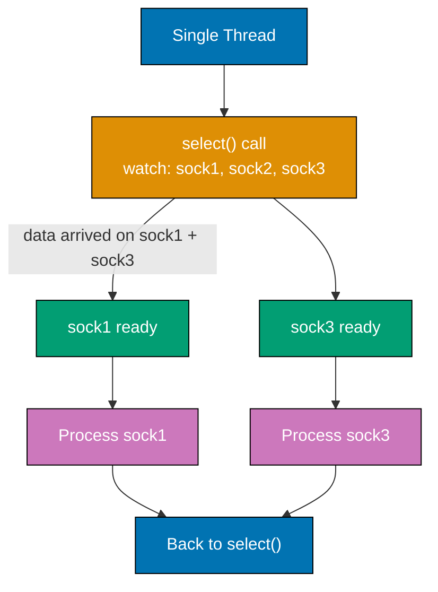
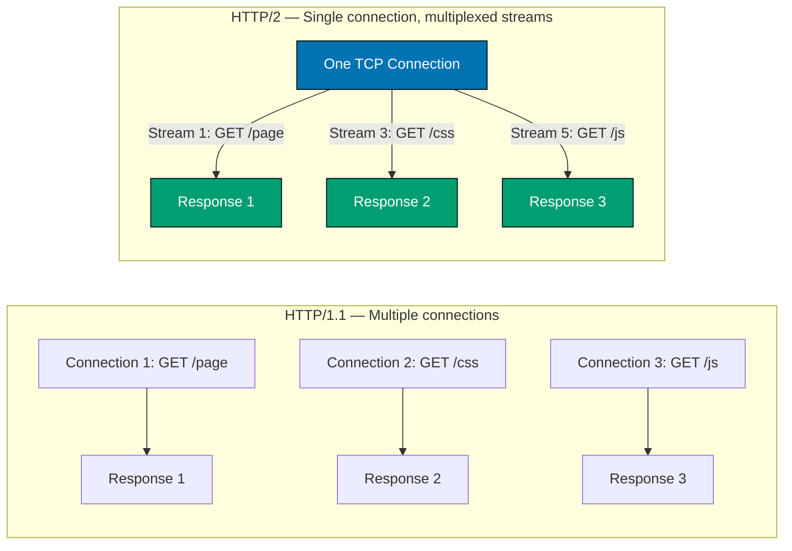
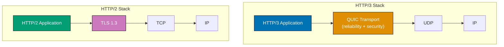
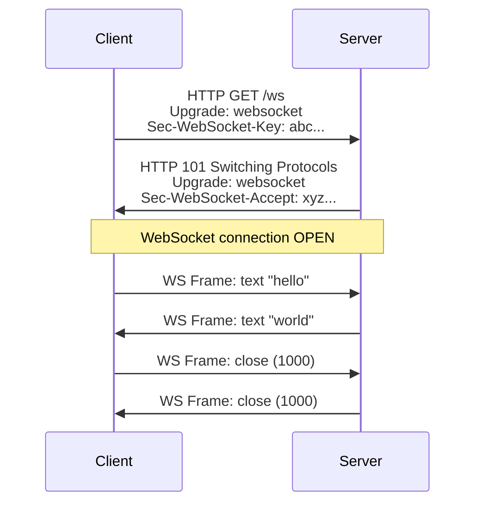
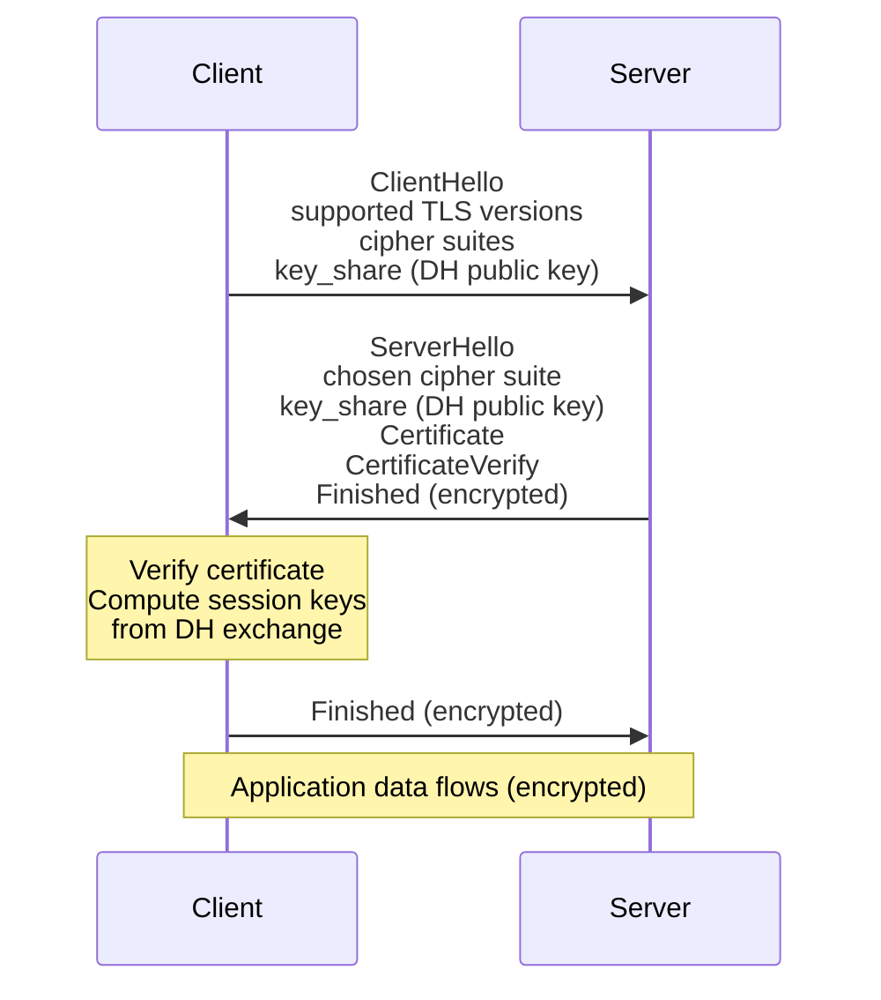
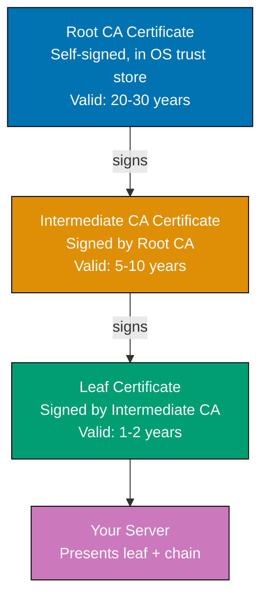
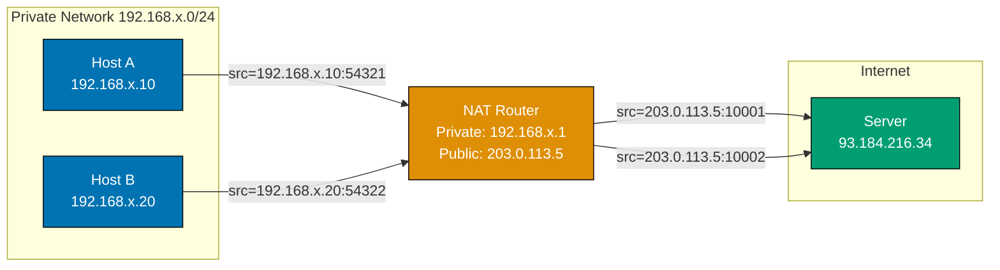
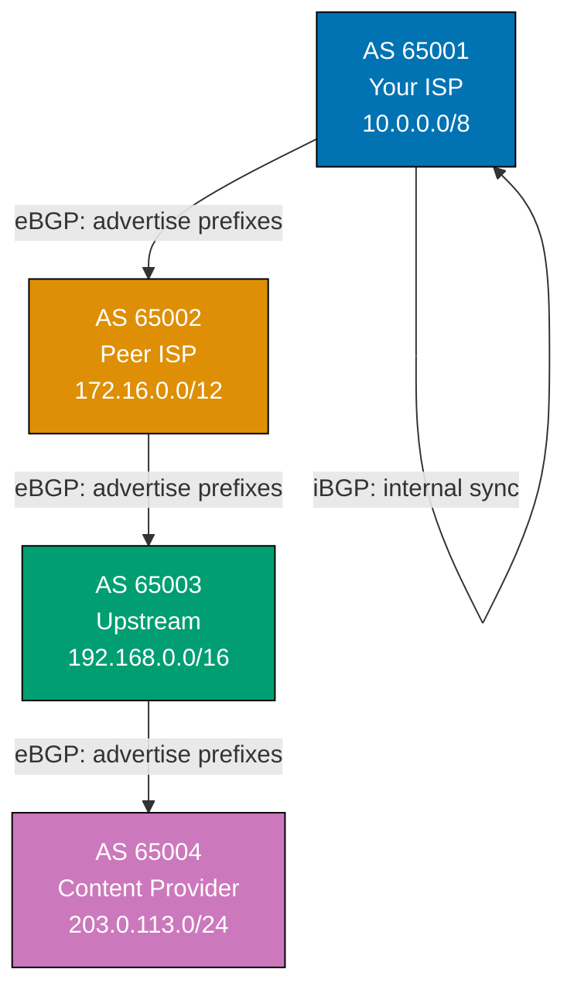
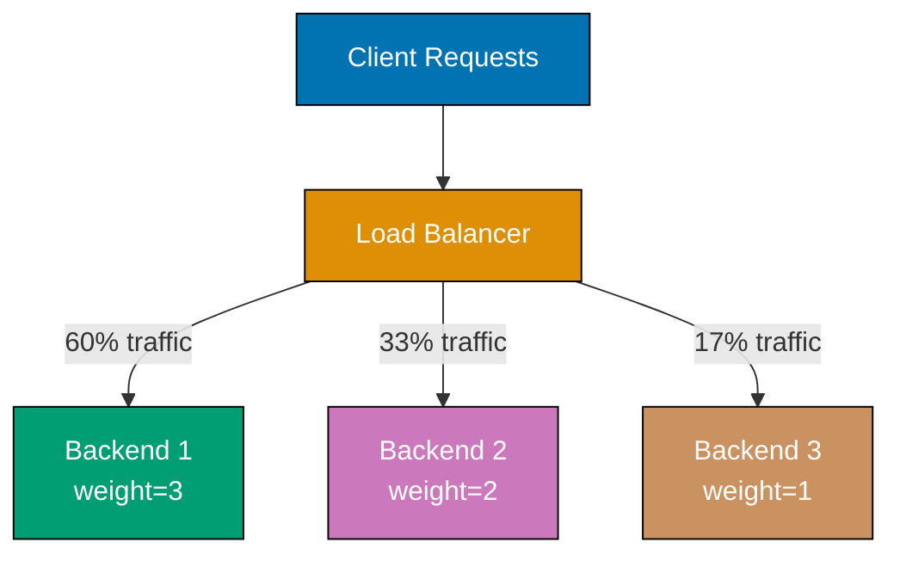
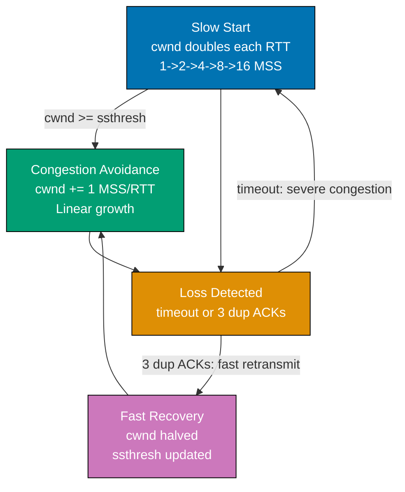

## Example 30: TCP Socket Options — SO_REUSEADDR and TCP_NODELAY

Socket options modify socket behavior at the OS level. `SO_REUSEADDR` enables fast server restarts; `TCP_NODELAY` disables Nagle's algorithm for low-latency applications.

```python
import socket

def demonstrate_socket_options():
    sock = socket.socket(socket.AF_INET, socket.SOCK_STREAM)

    # SO_REUSEADDR: allow binding to a port that is in TIME_WAIT state
    sock.setsockopt(socket.SOL_SOCKET, socket.SO_REUSEADDR, 1)
    # => SOL_SOCKET: options at socket layer (not protocol-specific)
    # => SO_REUSEADDR value 1: enable the option
    # => Without this, restarting a server within ~60s of the previous run
    # => fails with "Address already in use" because the port is in TIME_WAIT

    # SO_RCVBUF / SO_SNDBUF: kernel buffer sizes
    sock.setsockopt(socket.SOL_SOCKET, socket.SO_RCVBUF, 262144)
    # => SO_RCVBUF: receive buffer size in bytes (default ~87380 bytes on Linux)
    # => 262144 = 256 KB — larger buffers improve throughput on high-latency links
    # => TCP window size is limited by buffer size

    actual_rcvbuf = sock.getsockopt(socket.SOL_SOCKET, socket.SO_RCVBUF)
    # => getsockopt reads current option value
    # => OS may double the value: "Linux doubles buffer size for overhead"
    print(f"Receive buffer: {actual_rcvbuf} bytes")
    # => Output: Receive buffer: 524288 (Linux doubles to 512 KB)

    # TCP_NODELAY: disable Nagle's algorithm
    sock.setsockopt(socket.IPPROTO_TCP, socket.TCP_NODELAY, 1)
    # => IPPROTO_TCP: options at TCP protocol layer
    # => TCP_NODELAY = 1: send data immediately, don't wait to batch small packets
    # => Nagle's algorithm (default): batches small packets to reduce overhead
    # => Useful for interactive apps: SSH, games, trading systems, databases

    # SO_KEEPALIVE: enable TCP keepalive probes
    sock.setsockopt(socket.SOL_SOCKET, socket.SO_KEEPALIVE, 1)
    # => TCP keepalive: send periodic probes on idle connections
    # => Detects dead connections (e.g., client crashed without sending FIN)
    # => Without keepalive: server holds dead connections indefinitely

    print("Socket options set:")
    print(f"  SO_REUSEADDR: {sock.getsockopt(socket.SOL_SOCKET, socket.SO_REUSEADDR)}")
    # => Output: SO_REUSEADDR: 1
    print(f"  TCP_NODELAY:  {sock.getsockopt(socket.IPPROTO_TCP, socket.TCP_NODELAY)}")
    # => Output: TCP_NODELAY: 1
    print(f"  SO_KEEPALIVE: {sock.getsockopt(socket.SOL_SOCKET, socket.SO_KEEPALIVE)}")
    # => Output: SO_KEEPALIVE: 1

    sock.close()

demonstrate_socket_options()
```

**Key Takeaway**: Socket options like `SO_REUSEADDR` and `TCP_NODELAY` tune OS-level TCP behavior — essential for server reliability and low-latency applications.

**Why It Matters**: Production servers without `SO_REUSEADDR` fail to restart after crashes, leaving a service down for 60 seconds while the kernel waits for TIME_WAIT to expire. Applications without `TCP_NODELAY` experience 40ms Nagle delays that make interactive protocols (database queries, Redis commands) feel sluggish — a common performance bug in new services. These settings are non-default because they trade off throughput efficiency for responsiveness; understanding when to apply them separates senior from junior networking engineers.

---

## Example 31: Non-Blocking Sockets

Non-blocking sockets return immediately instead of waiting for data or connections. A non-blocking `accept()` raises `BlockingIOError` if no client is waiting, allowing the program to do other work between checks.

```python
import socket      # => TCP/UDP socket API
import time        # => time.time() for elapsed-time loop
import errno       # => errno.EAGAIN constant for non-blocking error codes

def non_blocking_server_demo():
    server = socket.socket(socket.AF_INET, socket.SOCK_STREAM)
    # => AF_INET: IPv4; SOCK_STREAM: TCP (reliable, ordered)
    server.setsockopt(socket.SOL_SOCKET, socket.SO_REUSEADDR, 1)
    # => SO_REUSEADDR: allow reuse of port in TIME_WAIT — fast server restart
    server.bind(("127.0.0.1", 9010))
    # => bind: reserve 127.0.0.1:9010 for this server socket
    server.listen(5)
    # => listen(5): accept up to 5 pending connections in OS backlog queue
    server.setblocking(False)
    # => setblocking(False): all operations return immediately
    # => If operation would block: raises BlockingIOError (errno EAGAIN/EWOULDBLOCK)

    print("Non-blocking server started (will accept for 2 seconds)")  # => Status message
    connections = []    # => Track accepted connections
    start = time.time()
    # => Record start time to limit demo to 2 seconds

    while time.time() - start < 2.0:  # => Run for 2 seconds
        # => Poll for new connections without blocking
        try:
            conn, addr = server.accept()
            # => accept() returns immediately: either a connection or BlockingIOError
            # => Non-blocking accept: succeeds instantly if a client is waiting
            conn.setblocking(False)        # => Make client socket non-blocking too
            connections.append((conn, addr))
            # => Store (socket, address) tuple for subsequent I/O polling
            print(f"  Accepted connection from {addr}")  # => Log accepted client
        except BlockingIOError:
            # => No connection waiting — this is normal, not an error
            # => errno.EAGAIN = "try again" — no data/connection ready yet
            pass  # => Continue loop; try again next iteration

        # => While waiting for connections, do other work here
        # => In production: event loop handles this more efficiently
        for conn, addr in connections[:]:
            # => connections[:]: copy of list so we can remove while iterating
            try:
                data = conn.recv(1024)        # => Non-blocking recv
                # => Non-blocking recv returns data, b"", or raises BlockingIOError
                if data:
                    print(f"  Data from {addr}: {data.decode()}")  # => Log received data
                    conn.sendall(b"OK")
                    # => sendall: sends all bytes even if write buffer fills
                elif data == b"":             # => Empty = client disconnected
                    connections.remove((conn, addr))  # => Drop from tracked list
                    conn.close()  # => Release socket resources
            except BlockingIOError:
                pass     # => No data ready yet — check again next iteration
            except OSError:
                connections.remove((conn, addr))
                # => OSError: connection reset or broken pipe — remove from list

        time.sleep(0.01)  # => Tiny sleep to avoid 100% CPU spin
        # => 0.01s sleep yields CPU; prevents busy-wait consuming 100% of one core

    for conn, _ in connections:
        # => Iterate remaining open connections after loop exits
        conn.close()
        # => Close all remaining open connections before exiting
    server.close()
    # => Release the bound port
    # => server.close() stops accepting new connections and frees the port
    print("Server stopped")  # => Confirmation that server loop exited

# Run briefly
import threading  # => Thread for running server while main thread acts as client
# => Run server in background thread so main thread can act as client
t = threading.Thread(target=non_blocking_server_demo, daemon=True)
# => daemon=True: thread dies automatically when main program exits
t.start()  # => Launch server thread
time.sleep(0.1)
# => Brief pause: let server bind and listen before client connects

# Connect a quick client
c = socket.socket(socket.AF_INET, socket.SOCK_STREAM)
# => Blocking TCP socket for the client (client stays blocking for simplicity)
c.connect(("127.0.0.1", 9010))
# => connect: performs TCP 3-way handshake with the server
c.sendall(b"hello")
# => Send bytes; server's non-blocking recv will pick this up
resp = c.recv(64)  # => Read server's "OK" response
print(f"Client got: {resp.decode()}")  # => Output: Client got: OK
c.close()  # => Close client socket
t.join(timeout=3)
# => Wait up to 3s for server thread to finish
```

**Key Takeaway**: Non-blocking sockets allow a single thread to handle I/O without waiting — polling for readiness instead of blocking; this is the foundation of event-loop-based concurrency.

**Why It Matters**: Non-blocking I/O is how high-performance servers (nginx, Node.js, asyncio) handle thousands of concurrent connections with a single thread — a key technique for systems that must handle C10K (10,000 connections) or beyond. Blocking sockets in multi-connection servers require one thread per connection, which does not scale past thousands of connections due to memory (each thread uses 1-8 MB of stack) and context-switching overhead. Recognizing when to use non-blocking I/O versus blocking I/O is fundamental to building scalable network services.

---

## Example 32: select() for I/O Multiplexing

`select()` monitors multiple file descriptors simultaneously and returns which ones are ready to read, write, or have errors. This enables a single thread to handle multiple sockets efficiently.



```python
import select     # => POSIX select(): OS-level I/O readiness notification
import socket     # => TCP socket API
import threading  # => Run server in background for demo
import time       # => Elapsed-time loop control

def select_server(port):
    server = socket.socket(socket.AF_INET, socket.SOCK_STREAM)
    # => Create TCP server socket
    server.setsockopt(socket.SOL_SOCKET, socket.SO_REUSEADDR, 1)
    # => SO_REUSEADDR: prevent "Address already in use" on restart
    server.bind(("127.0.0.1", port))
    # => Reserve port on loopback interface
    server.listen(5)
    # => Start listening; OS queues up to 5 pending connections
    server.setblocking(False)
    # => setblocking(False): required for select() server pattern

    inputs = [server]    # => Sockets to monitor for readability
    # => inputs: server socket + all connected client sockets
    outputs = []         # => Sockets with pending writes (unused here)
    message_log = []     # => Track received messages for test verification
    # => message_log: accumulates all messages received during server lifetime

    print(f"select() server on port {port}")  # => Status: server ready
    start = time.time()  # => Record start for duration-based loop

    while time.time() - start < 3.0 and inputs:  # => Run for 3s or until all sockets closed
        # => Loop until time limit or no sockets left to monitor
        readable, writable, exceptional = select.select(
            inputs,    # => Watch these for incoming data / new connections
            outputs,   # => Watch these for write-readiness (empty here)
            inputs,    # => Watch these for errors
            0.5,       # => Timeout: 0.5 seconds (return even if nothing ready)
        )
        # => select() returns three lists of ready sockets
        # => Blocks until at least one socket is ready OR timeout expires

        for sock in readable:  # => Iterate over ready-to-read sockets
            if sock is server:  # => Distinguish: is this the listening socket?
                # => Server socket readable = new connection waiting
                conn, addr = server.accept()
                # => Accept completes 3-way handshake, returns client socket
                conn.setblocking(False)
                # => Non-blocking so recv won't stall the select loop
                inputs.append(conn)       # => Add to monitored set
                # => Now select() watches this client for readability too
                print(f"  New connection: {addr}")  # => Log accepted client
            else:
                # => Client socket readable = data or disconnection
                data = sock.recv(1024)
                # => recv on ready socket: guaranteed non-blocking (data is available)
                if data:
                    msg = data.decode(errors="replace").strip()
                    # => Decode bytes; replace invalid UTF-8 with replacement char
                    print(f"  Received: '{msg}'")  # => Log received message
                    message_log.append(msg)  # => Record for return value
                    sock.sendall(f"Echo: {msg}".encode())
                    # => Echo back: prefix "Echo: " + original message
                else:
                    # => Empty read = client closed connection
                    inputs.remove(sock)
                    # => Remove from monitored set to prevent repeated empty reads
                    sock.close()  # => Release socket resources

        for sock in exceptional:  # => Handle error conditions
            # => Socket in error state — remove and close
            inputs.remove(sock)  # => Stop monitoring errored socket
            sock.close()  # => Free socket resources

    for sock in inputs:  # => Clean up remaining open sockets
        # => Close any sockets still open when time limit reached
        sock.close()
        # => Close all remaining sockets when loop exits
    return message_log  # => Return list of received messages for test verification

# Run server and send two simultaneous clients
received = []  # => Shared list; server will extend it with received messages
def run_srv():
    received.extend(select_server(9011))
    # => Collect messages returned by server for verification

srv_thread = threading.Thread(target=run_srv, daemon=True)
# => daemon=True: background thread won't prevent program exit
srv_thread.start()  # => Start select() server
time.sleep(0.2)
# => Wait for server to bind before clients connect

def send_client(msg):
    c = socket.socket(socket.AF_INET, socket.SOCK_STREAM)
    # => Fresh TCP socket per client
    c.connect(("127.0.0.1", 9011))
    # => 3-way handshake to server
    c.sendall(msg.encode())
    # => encode(): str -> bytes (UTF-8)
    resp = c.recv(128)
    # => Read echo response from server
    # => Server echoes "Echo: <msg>" back via sendall
    c.close()  # => Close client after exchange
    print(f"  Client '{msg}' got: {resp.decode()}")
    # => Output:   Client 'hello' got: Echo: hello

threads = [threading.Thread(target=send_client, args=(m,)) for m in ["hello", "world"]]
# => Two concurrent clients: both connect while select() monitors both
for t in threads: t.start()  # => Launch both client threads simultaneously
for t in threads: t.join()   # => Wait for both clients to finish
srv_thread.join(timeout=4)
# => Wait for server to finish processing all connections
```

**Key Takeaway**: `select()` enables one thread to monitor multiple sockets simultaneously, processing whichever become ready — the foundation of event-driven I/O.

**Why It Matters**: Web servers like nginx and databases like Redis use `select()` or its more scalable descendants (`epoll` on Linux, `kqueue` on macOS) to handle thousands of connections with minimal threads — often just one or a small fixed pool. Python's `asyncio` abstracts `epoll`/`kqueue` behind coroutines, making asynchronous code readable while maintaining the same performance characteristics. Understanding `select()` demystifies how event loops work and why blocking calls inside async code freeze all connections simultaneously.

---

## Example 33: Threading Model — One Thread Per Connection

The one-thread-per-connection model is the simplest way to handle multiple clients concurrently. Each accepted connection gets its own thread, allowing parallel handling without non-blocking I/O complexity.

```python
import socket     # => TCP socket API
import threading  # => One thread per accepted connection
import time       # => Elapsed-time loop control

class ThreadedTCPServer:
    # => Manages server socket + a list of per-connection handler threads
    def __init__(self, host, port, handler):  # => Constructor: store host, port, handler
        self.host = host
        # => Bind address
        self.port = port
        # => Bind port
        self.handler = handler            # => Callable: handler(conn, addr)
        self.active_threads = []          # => Track threads for cleanup
        self._lock = threading.Lock()     # => Protect shared list from race conditions

    def serve(self, max_clients=10, duration=3.0):
        # => Accept loop: runs for `duration` seconds, accepting clients
        server = socket.socket(socket.AF_INET, socket.SOCK_STREAM)  # => TCP server socket
        # => Create TCP server socket
        server.setsockopt(socket.SOL_SOCKET, socket.SO_REUSEADDR, 1)
        # => SO_REUSEADDR: allow immediate restart without TIME_WAIT delay
        server.bind((self.host, self.port))
        # => Bind to address/port; exclusive ownership of this endpoint
        server.listen(max_clients)
        # => max_clients: OS backlog queue size for pending connections
        server.settimeout(0.5)   # => Non-zero timeout lets loop check duration
        # => settimeout(0.5): accept() returns after 0.5s so loop can check duration

        print(f"Threaded server on {self.host}:{self.port}")  # => Log server start
        start = time.time()  # => Record start for duration-limited loop

        while time.time() - start < duration:  # => Loop until duration exceeded
            # => Accept new clients until duration expires
            try:
                conn, addr = server.accept()
                # => Each accepted connection spawns a new thread
                t = threading.Thread(
                    target=self._client_thread,
                    args=(conn, addr),
                    daemon=True,           # => Daemon: dies when main program exits
                )
                t.start()
                # => Thread starts: _client_thread runs concurrently
                with self._lock:
                    # => Lock: protect active_threads list from concurrent modification
                    self.active_threads.append(t)  # => Track new thread
                    # => Prune finished threads from list
                    self.active_threads = [x for x in self.active_threads if x.is_alive()]
                    # => is_alive(): False after thread's run() returns
                    # => Pruning prevents list from growing unbounded with finished threads
                print(f"  Active threads: {len(self.active_threads)}")
                # => Thread count grows as clients connect, shrinks as they disconnect
            except socket.timeout:
                continue  # => No new connections — loop back to check duration

        server.close()  # => Stop accepting new connections
        # => server.close(): new connections get Connection Refused after this
        # => Wait for active threads to finish handling their clients
        for t in self.active_threads:  # => Clean up each handler thread
            t.join(timeout=1.0)
            # => join: wait up to 1s per thread; prevents abrupt cleanup

    def _client_thread(self, conn, addr):
        # => Runs in its own thread — completely independent
        # => Thread safety: each thread has its own conn object
        try:
            self.handler(conn, addr)
            # => Delegate to user-provided handler function
        finally:
            conn.close()  # => Ensure connection closed even on exception
            # => finally block: conn.close() runs even if handler raises an exception

def echo_handler(conn, addr):  # => handler function: receives message, echoes with thread ID
    # => Simple echo: receive message, send it back with thread ID
    tid = threading.get_ident()   # => Current thread ID
    data = conn.recv(1024)
    # => Receive up to 1024 bytes from client
    if data:  # => Non-empty: client sent data
        response = f"Thread-{tid}: {data.decode()}".encode()
        # => Include thread ID to prove each connection runs on a different thread
        conn.sendall(response)  # => Send echo response back to client

srv = ThreadedTCPServer("127.0.0.1", 9012, echo_handler)
# => Instantiate server bound to 127.0.0.1:9012
srv_thread = threading.Thread(target=srv.serve, daemon=True)
# => Run server loop in background thread
srv_thread.start()  # => Launch server thread
time.sleep(0.2)
# => Allow server to bind before clients attempt to connect

# Connect 3 concurrent clients
def connect_and_send(message):  # => Client function: connect, send message, print response
    c = socket.socket(socket.AF_INET, socket.SOCK_STREAM)  # => TCP socket for client
    c.connect(("127.0.0.1", 9012))  # => Connect to threaded server
    # => Each client gets its own server thread upon acceptance
    c.sendall(message.encode())  # => encode: str -> UTF-8 bytes
    resp = c.recv(256)
    # => Response contains thread ID proving per-connection threading
    print(f"  Response for '{message}': {resp.decode()}")  # => Log response
    c.close()  # => Release client socket

threads = [threading.Thread(target=connect_and_send, args=(f"msg{i}",)) for i in range(3)]
# => 3 concurrent clients; server spawns 3 separate handler threads
for t in threads: t.start()   # => Start all 3 clients simultaneously
for t in threads: t.join()    # => Wait for all clients to complete
srv_thread.join(timeout=4)  # => Wait for server loop to finish
```

**Key Takeaway**: One-thread-per-connection is simple and correct for low concurrency; each connection runs independently without non-blocking I/O complexity, but memory grows linearly with connection count.

**Why It Matters**: This model works well for hundreds of concurrent connections but struggles at thousands due to thread stack memory (~1-8MB per thread) and context-switching overhead. Understanding its trade-offs explains why high-traffic servers use thread pools or async I/O instead, and why connection limits exist in application servers. Gunicorn with sync workers uses exactly this pattern — each worker handles one request at a time. When traffic spikes, new connections queue in the OS accept buffer until workers are available; exceeding backlog drops connections silently. Knowing the underlying model explains observed Gunicorn behavior during load and informs capacity planning decisions.

---

## Example 34: Python Threading with Sockets

Python's GIL (Global Interpreter Lock) limits CPU-bound parallelism, but I/O operations release the GIL, making threading effective for socket-bound work. A thread pool server reuses a fixed number of worker threads to handle connections, bounding memory usage and providing backpressure when connections arrive faster than they can be processed.

```python
import socket     # => TCP socket API
import threading  # => Worker thread creation
import queue      # => Thread-safe producer/consumer queue
import time       # => Elapsed-time loop control

class ThreadPoolServer:
    # => Worker thread pool: fixed number of threads handle all connections
    # => More efficient than one-thread-per-connection for high concurrency

    def __init__(self, host, port, num_workers=4):  # => num_workers: fixed pool size
        self.host = host   # => Bind address (e.g., "127.0.0.1")
        self.port = port   # => Bind port number
        self.work_queue = queue.Queue(maxsize=100)
        # => Bounded queue: prevents memory exhaustion from connection bursts
        # => maxsize=100: if 100 connections pending, new ones are dropped (or blocked)
        self.workers = []  # => Track worker thread objects
        for i in range(num_workers):  # => Create num_workers worker threads
            t = threading.Thread(target=self._worker, args=(i,), daemon=True)
            # => daemon=True: worker dies when main thread exits
            t.start()
            # => Thread starts immediately; blocks on queue.get() waiting for work
            self.workers.append(t)
            # => Each worker thread loops, pulling connections from queue

    def _worker(self, worker_id):
        # => Worker runs indefinitely, processing connections from queue
        while True:  # => Infinite loop: process one connection at a time
            conn, addr = self.work_queue.get()
            # => queue.get() blocks until work is available
            # => GIL released during blocking I/O: other threads run concurrently
            # => Blocking here: no CPU wasted while waiting for a connection
            if conn is None:
                break  # => Sentinel value: signal to shut down
            try:
                data = conn.recv(1024)
                # => Receive up to 1024 bytes from client
                if data:  # => Non-empty: process the request
                    resp = f"Worker-{worker_id}: {data.decode()}".encode()
                    # => Prepend worker ID to prove which thread handled request
                    conn.sendall(resp)
                    # => sendall: blocks until all bytes sent to client
            except OSError:
                pass
                # => Connection reset or closed unexpectedly — skip gracefully
            finally:
                conn.close()
                # => Always close the connection socket when done
                self.work_queue.task_done()
                # => task_done() signals queue.join() that item is processed
                # => Without task_done(): queue.join() would block forever

    def serve(self, duration=3.0):  # => Accept loop: runs for duration seconds
        server = socket.socket(socket.AF_INET, socket.SOCK_STREAM)
        # => Create listening TCP socket
        server.setsockopt(socket.SOL_SOCKET, socket.SO_REUSEADDR, 1)  # => Fast port reuse
        # => Allow reuse of port immediately after server stops
        server.bind((self.host, self.port))  # => Reserve host:port
        # => Bind to address; reserve the port
        server.listen(10)  # => Max 10 pending connections in backlog
        # => OS backlog: queue up to 10 unaccepted connections
        server.settimeout(0.5)
        # => settimeout: accept() raises socket.timeout after 0.5s if no new connections
        start = time.time()  # => Record start for duration-based loop

        while time.time() - start < duration:  # => Loop until duration expires
            try:
                conn, addr = server.accept()
                # => accept() completes 3-way handshake; returns client socket
                self.work_queue.put((conn, addr))
                # => put() adds connection to queue for a worker to pick up
                # => Non-blocking with maxsize: raises queue.Full if overloaded
                # => Workers pick up connections from queue as they finish current work
            except socket.timeout:
                continue
                # => No client connected in 0.5s; check duration and loop
            except queue.Full:
                conn.close()  # => Overloaded: reject connection gracefully
                print("  Queue full — connection rejected")  # => Log rejection

        # Shutdown workers
        for _ in self.workers:  # => Send one sentinel per worker
            # => One sentinel per worker: each worker breaks on its None item
            self.work_queue.put((None, None))  # => Sentinel to stop workers
        server.close()
        # => Release the listening port

pool_server = ThreadPoolServer("127.0.0.1", 9013, num_workers=3)
# => 3 workers: handles up to 3 connections concurrently
srv_t = threading.Thread(target=pool_server.serve, daemon=True)
srv_t.start()  # => Start server in background thread
time.sleep(0.2)
# => Let server start before clients connect

# Send 6 requests to 3 workers
results = []  # => Collect worker responses for display
def client_req(msg):  # => Client function: send message, collect response
    c = socket.socket(socket.AF_INET, socket.SOCK_STREAM)  # => TCP socket for client
    c.connect(("127.0.0.1", 9013))  # => Connect to thread pool server
    c.sendall(msg.encode())
    # => Send message bytes to server
    resp = c.recv(256)
    # => Get response from whichever worker handled this connection
    results.append(resp.decode())  # => Store response for display
    c.close()  # => Release client socket

threads = [threading.Thread(target=client_req, args=(f"req{i}",)) for i in range(6)]
# => 6 clients but only 3 workers: 3 requests queue while first 3 are handled
for t in threads: t.start()  # => Launch all 6 clients simultaneously
for t in threads: t.join()   # => Wait for all 6 to finish
for r in results:
    print(f"  {r}")  # => Print each worker response
# => Output: Worker-0: req0, Worker-1: req1, Worker-2: req2, etc.
srv_t.join(timeout=4)  # => Wait for server to complete
```

**Key Takeaway**: A thread pool bounds memory usage by reusing a fixed number of worker threads; the bounded work queue provides backpressure when connections arrive faster than workers process them.

**Why It Matters**: Production servers use thread pools (Gunicorn workers, Java thread pools, Tomcat executor) to handle concurrent requests without unbounded memory growth. Understanding queue-based work distribution explains connection timeout behavior, backpressure, and why saturating a server's thread pool causes requests to queue then time out. When a downstream dependency slows, threads hold connections longer, filling the pool — new requests queue, then time out from the caller's perspective before the pool even processes them. This cascade is the root cause of most web service outage post-mortems. Thread pool sizing and queue depth are the first tuning levers when scaling under load.

---

## Example 35: HTTP/2 Concepts — Multiplexing and Frames

HTTP/2 multiplexes multiple requests over a single TCP connection using binary frames and streams. This eliminates HTTP/1.1's head-of-line blocking at the application layer.



```python
# HTTP/2 concepts demonstrated conceptually (requires h2 library for full impl)
# Python's http.client does not support HTTP/2 — we show the wire format concepts

def explain_http2_frames():
    # => HTTP/2 is binary, not text — all communication is frames
    frame_types = {
        # => Each entry: frame type name -> purpose description
        "DATA (0x0)":        "Carries request/response body — can be split across frames",
        # => DATA frames carry body bytes; large bodies span multiple frames
        "HEADERS (0x1)":     "Carries compressed headers (HPACK compression)",
        # => HEADERS: first frame of any HTTP/2 request or response
        "PRIORITY (0x2)":    "Client hints which streams are more important",
        # => PRIORITY: allows browsers to load critical resources (HTML, CSS) before images
        "RST_STREAM (0x3)":  "Cancels a specific stream without closing connection",
        # => RST_STREAM: cancel a slow request; other streams continue unaffected
        "SETTINGS (0x4)":    "Negotiates connection parameters (initial window size, etc.)",
        # => SETTINGS: exchanged at connection start; sets max concurrent streams, window size
        "PUSH_PROMISE (0x5)":"Server push: server tells client it will send resource",
        # => PUSH_PROMISE: server preemptively sends CSS/JS before browser requests them
        "PING (0x6)":        "Measures round-trip time, keepalive",
        # => PING: connection-level keepalive; also used to measure RTT accurately
        "GOAWAY (0x7)":      "Graceful connection shutdown",
        # => GOAWAY: signals last stream ID processed; client retries higher streams elsewhere
        "WINDOW_UPDATE (0x8)":"Flow control: increase stream or connection window",
        # => WINDOW_UPDATE: receiver grants sender permission to send more bytes
        "CONTINUATION (0x9)":"Continues a HEADERS frame if too large for one frame",
        # => CONTINUATION: rare; occurs when header block > SETTINGS_MAX_FRAME_SIZE
    }

    print("HTTP/2 Frame Types:")
    for frame_type, description in frame_types.items():
        # => Print each frame type with description aligned
        print(f"  {frame_type:22s}: {description}")
    # => Output lists all 10 frame types with their descriptions

    # Simulated HTTP/2 frame header structure (9 bytes)
    import struct
    # => struct: binary packing/unpacking for wire-format construction
    length = 100     # => Payload length: 24 bits (0-16384 default, up to 16MB with negotiation)
    ftype = 0x1      # => Frame type: HEADERS (0x1)
    flags = 0x4      # => END_HEADERS flag: this is the last HEADERS frame for this request
    stream_id = 3    # => Stream ID: always odd for client-initiated (1, 3, 5...)
                     # => Stream 0 = connection-level frame (SETTINGS, PING, etc.)

    # Pack frame header: 3-byte length + 1-byte type + 1-byte flags + 4-byte stream ID
    frame_header = struct.pack(">I", length)[1:]  # => 3 bytes: strip top byte of 4-byte int
    # => ">I": big-endian unsigned int; [1:] discards most-significant byte for 3-byte field
    frame_header += struct.pack("BB", ftype, flags)
    # => Pack type (1 byte) and flags (1 byte) as unsigned bytes
    frame_header += struct.pack(">I", stream_id & 0x7FFFFFFF)
    # => stream_id MSB must be 0 (reserved bit per spec)
    # => & 0x7FFFFFFF: clear MSB bit to comply with RFC 7540 §4.1 reserved field

    print(f"\nSimulated HEADERS frame header (9 bytes):")
    print(f"  Length:    {length}")       # => Payload will follow this 9-byte header
    print(f"  Type:      {ftype:#04x} (HEADERS)")
    # => #04x: format as 0x01 (hex with 0x prefix, minimum 4 chars)
    print(f"  Flags:     {flags:#04x} (END_HEADERS)")
    # => END_HEADERS (0x4): no CONTINUATION frames follow; header block is complete
    print(f"  Stream ID: {stream_id}")    # => This request is on stream 3
    print(f"  Raw:       {frame_header.hex()}")
    # => hex(): bytes as hex string — shows actual wire representation

explain_http2_frames()
# => Call explain_http2_frames() to print all frame types and a simulated header
```

**Key Takeaway**: HTTP/2 multiplexes independent streams over one TCP connection using binary frames, eliminating HTTP/1.1's head-of-line blocking and reducing connection overhead.

**Why It Matters**: HTTP/2 improves web performance for asset-heavy pages by eliminating connection setup overhead per resource. Server push eliminates round trips for predictable dependencies. Understanding HTTP/2 streams explains why `RST_STREAM` errors in logs mean individual request cancellations, not connection failures. HPACK header compression reduces header overhead on high-frequency API calls — important for microservices making thousands of small requests per second. When HTTP/2 connection-level flow control stalls, all streams halt simultaneously — a single slow reader can block the entire connection, a subtle failure mode not present in HTTP/1.1 where each connection is independent.

---

## Example 36: HTTP/3 and QUIC Overview

HTTP/3 runs over QUIC instead of TCP. QUIC is a UDP-based transport protocol that provides reliability, ordering, and security built into the transport layer, eliminating TCP's head-of-line blocking even at the transport level.



```python
# HTTP/3 and QUIC conceptual explanation
# Full QUIC implementation requires aioquic (external) — this shows concepts

def explain_quic():  # => Prints QUIC feature breakdown and protocol comparison table
    # => Prints a feature-by-feature breakdown of QUIC advantages over TCP
    print("QUIC Protocol Key Features:\n")  # => Section heading

    quic_features = {
        # => Each entry: feature name -> multi-sentence explanation
        "0-RTT / 1-RTT connection setup": (
            "First connection: 1-RTT (vs TCP+TLS: 2-3 RTTs). "  # => saves ~1 RTT vs TCP+TLS
            "Reconnecting known server: 0-RTT (send data immediately). "  # => 0-RTT: no handshake needed
            "Achieved by building TLS 1.3 into QUIC at transport level."  # => TLS built into QUIC
        ),
        # => 0-RTT saves one full round trip on reconnects; critical for mobile users on flaky networks
        # => Session ticket from prior connection enables 0-RTT without re-authentication
        "Multiplexed streams without HoL blocking": (
            "HTTP/2 over TCP: if one TCP packet lost, ALL streams stall (TCP HoL). "  # => TCP HoL problem
            "QUIC: each stream independently sequenced. "  # => per-stream ordering, not connection-level
            "Lost packet only blocks its own stream — others continue unaffected."
        ),
        # => HoL blocking: head-of-line blocking; QUIC eliminates it at transport level, not just app
        # => Each QUIC stream has independent sequence numbers; no shared TCP sequence space
        "Connection migration": (
            "TCP connections are identified by 4-tuple (src_ip, src_port, dst_ip, dst_port). "
            "When IP changes (WiFi to cellular), TCP connections break. "  # => forces reconnect
            "QUIC uses variable-length Connection IDs (0–20 bytes, per RFC 9000 §17.2) — survive IP changes. "
            "Mobile users stay connected through network transitions."  # => seamless handoff
        ),
        # => Connection ID: QUIC's alternative to TCP 4-tuple identity; survives NAT rebinding
        "Built-in encryption": (
            "QUIC encrypts packet headers AND payload from the start. "  # => full packet encryption
            "TCP+TLS: TCP headers visible (sequence numbers, flags). "  # => observable by network devices
            "QUIC: middleboxes see only connection ID and minimal metadata. "  # => minimal exposure
            "Enables protocol evolution: ossification prevented."  # => encrypted = can change without breakage
        ),
        # => Ossification prevention: encrypted headers can be changed without middlebox breakage
        # => TCP ossification: middleboxes assume TCP semantics; changes break them; QUIC avoids this
        "UDP-based transport": (
            "QUIC runs over UDP (no OS-level connection state per stream). "  # => UDP: userspace control
            "Implementation in userspace: faster iteration than modifying TCP kernel code. "
            "Multiple versions possible without OS upgrades."  # => OS doesn't need to change
        ),
        # => Userspace implementation: Google shipped QUIC improvements without waiting for kernel updates
    }

    for feature, explanation in quic_features.items():  # => Iterate over each feature
        # => Print each feature and its explanation
        print(f"  {feature}:")  # => Feature name as section heading
        print(f"    {explanation}\n")
        # => Blank line between features for readability
        # => Each feature tuple auto-concatenated by Python: separate strings join without \n
    # => Output:   0-RTT / 1-RTT connection setup:
    #                First connection: 1-RTT...

    # Comparison table
    comparison = [  # => List of tuples: (attribute, http1.1, http2, http3)
        ("Protocol",          "HTTP/1.1",          "HTTP/2",            "HTTP/3"),  # => header row
        # => Row format: (dimension, http1.1_value, http2_value, http3_value)
        ("Transport",         "TCP",               "TCP",               "QUIC (UDP)"),
        # => HTTP/3 over QUIC/UDP: bypasses TCP's limitations entirely
        ("Multiplexing",      "No (1 req/conn)",   "Yes (streams)",     "Yes (QUIC streams)"),
        # => HTTP/1.1: one outstanding request per connection (pipelining rarely works)
        ("HoL Blocking",      "App+Transport",     "Transport only",    "None"),
        # => HTTP/2 fixes app-layer HoL but TCP HoL remains; QUIC fixes both layers
        ("Connection Setup",  "1-RTT + TLS",       "1-RTT + TLS",       "0/1-RTT"),
        # => HTTP/3 1-RTT on first connect; 0-RTT on reconnect to known server
        ("Header Compression","None",              "HPACK",             "QPACK"),
        # => QPACK: HPACK adapted for QUIC's out-of-order delivery characteristics
    ]
    # => comparison: list of rows; first row is the header
    # => 7 rows total: 1 header + 6 comparison dimensions

    print("Protocol Comparison:")  # => Section heading for comparison table
    for row in comparison:  # => Print header row + 6 data rows
        # => Print each comparison row aligned to columns
        print(f"  {row[0]:20s}: {row[1]:20s} {row[2]:20s} {row[3]}")
        # => :20s: pad each column to 20 chars for alignment
    # => Output:   Protocol            : HTTP/1.1             HTTP/2               HTTP/3

explain_quic()
# => Call explain_quic() to run the explanation and comparison table
# => Output: 5 feature blocks + 7-row comparison table
```

**Key Takeaway**: QUIC eliminates TCP's head-of-line blocking by implementing per-stream sequencing over UDP, and reduces connection latency with 0-RTT reconnects to known servers.

**Why It Matters**: HTTP/3 adoption is rapidly increasing — all major browsers support it, and CDNs like Cloudflare and Fastly serve traffic over QUIC by default. Mobile applications benefit most from connection migration, which enables seamless handoffs between WiFi and cellular networks without reconnecting. Understanding QUIC explains why traditional TCP-level performance optimizations (Nagle, SO_SNDBUF tuning) do not apply at the HTTP/3 layer, and why firewall rules blocking UDP port 443 silently prevent HTTP/3 from working and cause automatic fallback to HTTP/2.

---

## Example 37: WebSockets — Handshake and Frames

WebSockets provide full-duplex communication over a single TCP connection. The connection starts as an HTTP/1.1 upgrade request, then switches to the WebSocket framing protocol for bidirectional messaging.



```python
import socket    # => TCP socket (used by full WebSocket server, not shown here)
import base64    # => Base64 encode/decode for handshake key derivation
import hashlib   # => SHA-1 for Sec-WebSocket-Accept computation
import struct    # => Binary packing for frame header fields
import threading # => Background thread for server demo
import time      # => Timing utilities

# WebSocket handshake implementation (server side)
WS_MAGIC = "258EAFA5-E914-47DA-95CA-C5AB0DC85B11"
# => This GUID is defined in RFC 6455 — fixed value in the WebSocket spec
# => Used to prevent cross-protocol attacks

def compute_accept_key(client_key):  # => Derives Sec-WebSocket-Accept from client key
    # => WebSocket handshake key derivation
    combined = client_key + WS_MAGIC  # => String concatenation (not bytes)
    # => Concatenate client's key with magic GUID
    sha1_hash = hashlib.sha1(combined.encode()).digest()  # => SHA-1 returns 20 bytes
    # => SHA-1 hash of the concatenated string
    return base64.b64encode(sha1_hash).decode()
    # => Base64-encode: return as accept key in 101 response

def parse_ws_frame(data):  # => Returns (frame_dict, bytes_consumed) tuple
    # => Parse a WebSocket frame according to RFC 6455
    if len(data) < 2:  # => Need at least 2 bytes for header
        return None, 0
        # => Minimum frame is 2 bytes (no payload, no mask)

    byte1, byte2 = data[0], data[1]
    # => First two bytes contain FIN, RSV, opcode, MASK, and initial length
    fin = (byte1 >> 7) & 1          # => FIN bit: 1 = last frame of message
    opcode = byte1 & 0x0F           # => Opcode: 1=text, 2=binary, 8=close, 9=ping, 10=pong
    masked = (byte2 >> 7) & 1       # => MASK bit: 1 = client->server frames are masked
    payload_len = byte2 & 0x7F      # => Payload length (first 7 bits)
    # => payload_len 0-125: actual length; 126: 16-bit follows; 127: 64-bit follows

    offset = 2
    # => offset: current read position in data bytes
    if payload_len == 126:
        payload_len = struct.unpack(">H", data[offset:offset+2])[0]
        offset += 2  # => 16-bit extended length
        # => ">H": big-endian unsigned short; covers payloads 126-65535 bytes
    elif payload_len == 127:
        payload_len = struct.unpack(">Q", data[offset:offset+8])[0]
        offset += 8  # => 64-bit extended length

    mask_key = b""  # => Default empty mask; set below if masked=1
    if masked:
        mask_key = data[offset:offset+4]    # => 4-byte XOR mask key
        offset += 4
        # => Clients MUST mask frames sent to server (RFC 6455 §5.3)

    payload = bytearray(data[offset:offset+payload_len])
    # => Extract raw payload bytes (still masked if masked=1)
    if masked:
        for i in range(len(payload)):
            payload[i] ^= mask_key[i % 4]  # => Unmask: XOR each byte with mask key
            # => Masking prevents cache poisoning attacks on proxies
            # => i % 4: cycles through 4-byte mask key for XOR unmasking

    return {"fin": fin, "opcode": opcode, "payload": bytes(payload)}, offset + payload_len
    # => Return parsed frame dict + number of bytes consumed

def build_ws_frame(payload, opcode=1):
    # => Build a server->client WebSocket frame (unmasked — server frames are not masked)
    payload_bytes = payload.encode() if isinstance(payload, str) else payload
    # => str -> bytes (UTF-8); bytes pass through unchanged
    length = len(payload_bytes)  # => Payload byte count determines which length encoding to use
    header = bytes([0x80 | opcode])  # => FIN=1 + opcode
    # => 0x80 = 10000000 (FIN bit set), OR with opcode
    if length < 126:  # => Short payload: length in 7 bits (0-125)
        header += bytes([length])    # => Length fits in 7 bits
        # => Single byte: MASK=0 (server->client) + 7-bit length
    elif length < 65536:
        header += bytes([126]) + struct.pack(">H", length)  # => 16-bit length
    else:
        header += bytes([127]) + struct.pack(">Q", length)  # => 64-bit length
    return header + payload_bytes
    # => Complete frame: header bytes + payload bytes

# Test the frame parsing
test_frame = build_ws_frame("Hello WebSocket!")
# => Build a text frame (opcode=1) containing the string
frame_info, consumed = parse_ws_frame(test_frame)
# => Parse it back: frame_info dict + bytes consumed
print(f"Built frame: {len(test_frame)} bytes")
# => 2-byte header + 16-byte payload = 18 bytes total
print(f"Opcode: {frame_info['opcode']} (1=text)")  # => Output: Opcode: 1 (text)
print(f"Payload: {frame_info['payload'].decode()}")  # => Output: Payload: Hello WebSocket!
```

**Key Takeaway**: WebSockets start with an HTTP upgrade handshake (101 Switching Protocols), then use a binary framing protocol with opcodes for text, binary, ping, pong, and close operations.

**Why It Matters**: WebSockets power real-time features: chat, collaborative editing, live dashboards, notifications, and multiplayer games — replacing inefficient HTTP polling patterns that waste bandwidth and add latency. Understanding the framing protocol explains WebSocket library behavior, masking requirements (security against cache-poisoning attacks), and why some HTTP proxies break WebSocket connections by buffering entire frames before forwarding. Correct error handling for close frames prevents connection leaks in long-running servers.

---

## Example 38: TLS Handshake Deep-Dive

The TLS 1.3 handshake establishes an encrypted channel in one round trip. It negotiates cipher suites, authenticates the server (and optionally the client), and derives session keys using Diffie-Hellman key exchange.



```python
import ssl     # => Python TLS/SSL wrapper for sockets
import socket  # => TCP connection before TLS wrapping

def tls_handshake_inspector(hostname, port=443):
    # => Performs TLS handshake and extracts negotiated parameters
    context = ssl.create_default_context()
    # => Default context: CERT_REQUIRED + check_hostname=True + strong ciphers

    # Enable verbose session info (TLS 1.3 key logging for analysis)
    # context.keylog_filename = "/tmp/tls_keys.log"  # Wireshark can use this

    with socket.create_connection((hostname, port), timeout=10) as tcp_sock:
        # => TCP connection established (3-way handshake done)
        # => timeout=10: abort if server doesn't respond within 10 seconds
        with context.wrap_socket(tcp_sock, server_hostname=hostname) as tls_sock:
            # => wrap_socket triggers TLS handshake:
            # => 1. Client sends ClientHello (supported ciphers, TLS versions, DH key share)
            # => 2. Server sends ServerHello (chosen params, its DH share, certificate)
            # => 3. Client verifies certificate, computes shared secret
            # => 4. Both derive session keys from shared secret (HKDF)
            # => 5. Finished messages confirm both sides derived same keys

            version = tls_sock.version()
            # => "TLSv1.3" or "TLSv1.2" — TLS 1.0/1.1 deprecated
            cipher = tls_sock.cipher()
            # => (cipher_name, protocol, key_bits) tuple
            # => e.g. ("TLS_AES_256_GCM_SHA384", "TLSv1.3", 256)
            cert = tls_sock.getpeercert()
            # => getpeercert(): dict with subject, issuer, SANs, validity dates

            print(f"TLS Handshake Results for {hostname}:{port}")
            print(f"  TLS Version:  {version}")
            # => TLS 1.3 preferred — 1-RTT handshake, forward secrecy always on
            print(f"  Cipher Suite: {cipher[0]}")
            # => TLS_AES_256_GCM_SHA384: AES-256-GCM for encryption, SHA-384 for MAC
            print(f"  Key Bits:     {cipher[2]}")
            # => 256-bit key — computationally infeasible to brute-force

            # Certificate details
            subject = dict(x[0] for x in cert.get("subject", []))
            # => cert["subject"]: list of ((attr, value),) tuples; flatten to dict
            print(f"  Cert Subject: {subject.get('commonName', 'N/A')}")
            print(f"  Cert Issuer:  {dict(x[0] for x in cert.get('issuer', []))}")
            # => issuer: dict with organizationName, commonName of the CA
            print(f"  Cert Expiry:  {cert.get('notAfter', 'N/A')}")
            # => notAfter: expiry timestamp; monitor this to avoid unexpected expiry

            # SANs (Subject Alternative Names) — modern certs use these, not CN
            sans = cert.get("subjectAltName", [])
            # => subjectAltName: list of (type, value) pairs; DNS type = hostname
            if sans:
                print(f"  SANs:         {[v for t, v in sans if t == 'DNS'][:3]}")
                # => DNS SANs: hostnames this certificate is valid for

try:
    tls_handshake_inspector("example.com")
except Exception as e:
    print(f"TLS inspection failed: {e}")
    # => Common failures: network timeout, certificate verify failed
```

**Key Takeaway**: TLS 1.3 performs its handshake in one round trip using ephemeral Diffie-Hellman key exchange, providing forward secrecy and strong authentication.

**Why It Matters**: TLS configuration errors — expired certificates, weak cipher suites, TLS 1.0/1.1 enabled — cause security vulnerabilities and compliance failures (PCI DSS, HIPAA mandate TLS 1.2+). Understanding the handshake process helps debug `certificate verify failed` errors, configure TLS termination correctly in load balancers, and understand why certificate pinning exists as a defense against rogue CAs. TLS 1.3's mandatory forward secrecy means past traffic cannot be decrypted even if the private key is later compromised.

---

## Example 39: TLS Certificates — Chain of Trust

TLS certificates form a chain of trust from root Certificate Authorities (CA) through intermediate CAs to the leaf certificate. Browsers and OS trust stores contain root CAs; all other certificates derive trust from them.



```python
import ssl     # => TLS/SSL context and socket wrapping
import socket  # => TCP connections

def inspect_cert_chain(hostname, port=443):
    # => Retrieve and display the certificate chain for a host
    context = ssl.create_default_context()
    # => Default context verifies chain against OS trust store

    # To inspect full chain (not just verified cert), disable hostname check temporarily
    inspect_context = ssl.SSLContext(ssl.PROTOCOL_TLS_CLIENT)
    # => PROTOCOL_TLS_CLIENT: client-side TLS with sane defaults
    inspect_context.check_hostname = False
    # => Disable hostname verification — inspection only, never disable in production
    inspect_context.verify_mode = ssl.CERT_NONE
    # => CERT_NONE: don't verify — only for inspection, never for production

    with socket.create_connection((hostname, port), timeout=10) as sock:
        # => TCP connection to host:443 (TLS not yet started)
        with inspect_context.wrap_socket(sock, server_hostname=hostname) as tls_sock:
            # DER-encoded cert chain
            der_certs = tls_sock.getpeercert(binary_form=True)
            # => binary_form=True: returns DER-encoded certificate bytes
            # => This is only the leaf cert; full chain needs SSL_get_peer_cert_chain

            # Verified cert dict (from default context)
    with socket.create_connection((hostname, port), timeout=10) as sock2:
        # => Second connection uses verified context for cert validation
        with ssl.create_default_context().wrap_socket(sock2, server_hostname=hostname) as tls_sock2:
            cert = tls_sock2.getpeercert()
            # => getpeercert(): returns parsed cert as dict (verified chain)
            # => Dict contains: subject, issuer, subjectAltName, notBefore, notAfter, OCSP

            print(f"Certificate Chain Analysis for {hostname}:")  # => Section heading

            # Subject
            subject = {k: v for pair in cert.get("subject", []) for k, v in pair}
            # => Flatten list of ((attr, value),) tuples into a flat dict
            print(f"\nLeaf Certificate:")  # => Leaf = end-entity cert presented by server
            print(f"  CommonName: {subject.get('commonName', 'N/A')}")
            # => commonName: traditional hostname field; deprecated in favor of SANs
            print(f"  ValidFrom:  {cert.get('notBefore')}")
            # => notBefore: certificate validity start date
            print(f"  ValidUntil: {cert.get('notAfter')}")
            # => notAfter: expiry; alert 30 days before to avoid outage
            # => Certificate expiry monitoring is mandatory — expired cert causes 100% client failure

            # Subject Alternative Names
            sans = [v for t, v in cert.get("subjectAltName", []) if t == "DNS"]
            # => Filter for DNS type SANs; there may also be IP type SANs
            print(f"  SANs:       {sans[:5]}")
            # => Modern certificates use SANs; commonName alone is deprecated
            # => SANs can include wildcard entries like *.example.com

            # Issuer (signs this certificate)
            issuer = {k: v for pair in cert.get("issuer", []) for k, v in pair}
            # => issuer dict contains organizationName, commonName of the signing CA
            print(f"\nIssuing CA (Intermediate):")  # => The CA that directly signed the leaf cert
            print(f"  Org:  {issuer.get('organizationName', 'N/A')}")  # => CA organization name
            print(f"  CN:   {issuer.get('commonName', 'N/A')}")  # => CA common name

            # OCSP and CRL distribution points (revocation checking)
            print(f"\nRevocation info:")  # => How to check if this cert is revoked
            print(f"  OCSP:  {cert.get('OCSP', ['N/A'])[0] if cert.get('OCSP') else 'N/A'}")
            # => OCSP: Online Certificate Status Protocol endpoint; real-time revocation check
            # => OCSP stapling: server caches OCSP response and sends it with cert in handshake
            print(f"  CRLs:  {cert.get('crlDistributionPoints', ['N/A'])[0] if cert.get('crlDistributionPoints') else 'N/A'}")
            # => CRL: Certificate Revocation List; downloaded periodically (larger, less real-time)

try:
    inspect_cert_chain("example.com")
except Exception as e:
    print(f"Chain inspection failed: {e}")
    # => Network unreachable or cert errors — expected in restricted environments
```

**Key Takeaway**: Certificate trust flows from root CAs through intermediates to leaf certificates; the chain must be complete and valid for TLS verification to succeed.

**Why It Matters**: "Certificate verify failed" errors occur when the chain is broken — missing intermediate, expired certificate, wrong hostname in SAN. Servers must send the full chain (leaf + intermediates) because clients may not have intermediates cached. Let's Encrypt automated certificate renewal eliminates the operational burden of manual certificate management. A missing intermediate certificate causes every client to fail until the chain is corrected — nginx's `ssl_certificate` must include the full chain in the right order. Certificate transparency logs (required by all modern CAs) make misissued certificates publicly auditable within minutes of issuance, enabling rapid detection of rogue certificates.

---

## Example 40: Python ssl Module — Wrapping Sockets

The `ssl` module wraps any TCP socket with TLS. Configuring SSL contexts correctly determines security level, certificate requirements, and protocol version restrictions.

```python
import ssl       # => TLS/SSL context and socket wrapping
import socket    # => Raw TCP socket before TLS wrapping
import threading # => Run TLS server in background for demo
import time      # => Timing for server startup delay
import tempfile  # => Create temp directory for generated cert files
import os        # => Build file paths within temp directory

# Create a self-signed certificate for testing
# (In production: use proper CA-signed certificates)
def create_test_certs():  # => Generates self-signed cert via openssl subprocess
    # => Use OpenSSL to generate self-signed cert (subprocess)
    import subprocess  # => Lazy import: only needed when function is called
    tmpdir = tempfile.mkdtemp()
    # => mkdtemp: create a uniquely-named temp directory
    keyfile = os.path.join(tmpdir, "server.key")
    # => Path for the private key file
    certfile = os.path.join(tmpdir, "server.crt")
    # => Path for the self-signed certificate file

    try:
        subprocess.run([
            "openssl", "req", "-x509", "-newkey", "rsa:2048",  # => openssl command
            "-keyout", keyfile, "-out", certfile,  # => output files
            "-days", "1", "-nodes",  # => 1-day cert, no passphrase
            "-subj", "/CN=localhost"  # => cert subject
        ], check=True, capture_output=True)
        # => -x509: self-signed (no CA needed)
        # => -newkey rsa:2048: generate 2048-bit RSA key
        # => -nodes: no passphrase on private key
        # => -subj: certificate subject (CN=localhost for local testing)
        return keyfile, certfile
        # => Return paths to generated key and cert files
    except (subprocess.CalledProcessError, FileNotFoundError):
        return None, None  # => openssl not available

keyfile, certfile = create_test_certs()
# => keyfile, certfile: paths on success; None, None if openssl absent

if keyfile and certfile:  # => Only run TLS demo if openssl generated certs successfully
    def tls_server(port, keyfile, certfile):  # => TLS server: accepts one client, echoes
        # => Server-side SSL context
        server_context = ssl.SSLContext(ssl.PROTOCOL_TLS_SERVER)
        # => PROTOCOL_TLS_SERVER: server-side TLS
        server_context.load_cert_chain(certfile, keyfile)
        # => Load certificate and private key from files
        server_context.minimum_version = ssl.TLSVersion.TLSv1_2
        # => Minimum TLS 1.2 — reject older, insecure versions

        raw_server = socket.socket(socket.AF_INET, socket.SOCK_STREAM)
        # => Plain TCP socket; will be wrapped with TLS on each accepted connection
        raw_server.setsockopt(socket.SOL_SOCKET, socket.SO_REUSEADDR, 1)
        # => SO_REUSEADDR: allow immediate rebind after server stops
        raw_server.bind(("127.0.0.1", port))  # => Reserve the port on loopback
        raw_server.listen(1)
        # => listen(1): accept one pending connection at a time
        raw_server.settimeout(3)  # => 3s timeout to avoid blocking forever
        # => settimeout(3): prevents server from blocking indefinitely in demo

        try:
            raw_conn, addr = raw_server.accept()
            # => Accept raw TCP connection (TLS handshake not yet done)
            # => At this point: TCP handshake done, TLS handshake about to start
            # => wrap incoming TCP connection with TLS
            tls_conn = server_context.wrap_socket(raw_conn, server_side=True)
            # => server_side=True: present certificate, expect ClientHello
            # => wrap_socket: performs TLS handshake; blocks until complete
            data = tls_conn.recv(1024)
            # => recv after wrap: data is decrypted transparently
            print(f"TLS server received: {data.decode()}")  # => Log decrypted message
            tls_conn.sendall(b"Hello from TLS server")
            # => Response encrypted with negotiated session key
            tls_conn.close()  # => Close TLS connection (sends close_notify)
        except ssl.SSLError as e:
            print(f"TLS server error: {e}")  # => Log TLS-level error (cert mismatch, etc.)
        finally:
            raw_server.close()  # => Release listening port regardless of success

    def tls_client(port, certfile):  # => TLS client: connect, send, receive, print
        # => Client-side SSL context
        client_context = ssl.SSLContext(ssl.PROTOCOL_TLS_CLIENT)
        client_context.load_verify_locations(certfile)
        # => Trust this specific cert (for self-signed testing)
        client_context.check_hostname = False
        # => Disable hostname check for localhost testing (never disable in production)
        # => In production: always keep check_hostname=True to verify server identity

        raw_sock = socket.socket(socket.AF_INET, socket.SOCK_STREAM)
        raw_sock.settimeout(3)  # => 3s timeout before giving up
        raw_sock.connect(("127.0.0.1", port))
        # => TCP 3-way handshake; TLS not yet started
        tls_sock = client_context.wrap_socket(raw_sock)
        # => wrap_socket triggers TLS handshake with server
        print(f"TLS version: {tls_sock.version()}")  # => TLSv1.2 or TLSv1.3
        tls_sock.sendall(b"Hello from TLS client")
        # => Data encrypted end-to-end
        resp = tls_sock.recv(1024)  # => Receive encrypted response
        print(f"TLS client received: {resp.decode()}")  # => Log decrypted response
        tls_sock.close()  # => Send TLS close_notify and close socket

    port = 9020  # => Port for TLS server demo
    srv = threading.Thread(target=tls_server, args=(port, keyfile, certfile), daemon=True)
    srv.start()  # => Launch TLS server in background
    time.sleep(0.2)
    # => Let server start before client connects
    tls_client(port, certfile)  # => Connect as TLS client
    srv.join(timeout=4)  # => Wait for server thread to finish
else:
    print("openssl not available — showing context configuration only")  # => Fallback message
    # => Show context configuration reference
    ctx = ssl.create_default_context()  # => Default context with OS trust store
    print(f"Default context verify mode: {ctx.verify_mode}")  # => VerifyMode.CERT_REQUIRED
    print(f"Default minimum version:     {ctx.minimum_version}")  # => TLSVersion.TLSv1_2
```

**Key Takeaway**: `ssl.SSLContext` configures TLS parameters — minimum version, certificate loading, and verification mode — before wrapping sockets with `wrap_socket()`.

**Why It Matters**: Custom TLS configuration appears in mutual TLS (mTLS) setups, internal microservice communication, IoT device authentication, and custom certificate authorities. Incorrect context configuration — trusting all certificates (`CERT_NONE`) — is a serious security vulnerability that bypasses server authentication entirely. Developers frequently disable certificate verification to "fix" TLS errors during development, then accidentally deploy that code to production where it silently accepts any certificate — including attacker-controlled ones. The correct fix is always to add the CA to the trust store, never to disable verification. Code review policies should flag any occurrence of `CERT_NONE` or `check_hostname=False` outside test code.

---

## Example 41: DNS over HTTPS (DoH) Overview

DNS over HTTPS sends DNS queries inside HTTPS connections, providing privacy and authentication. Traditional DNS is unencrypted — anyone on the network path can see and modify queries.

```python
import urllib.request  # => Standard library HTTP client (no external deps)
import json            # => Parse JSON response from DoH endpoint
import ssl             # => TLS context for HTTPS connection

def dns_over_https(hostname, record_type="A"):
    # => DoH sends DNS queries as HTTPS requests to a DoH resolver
    # => Cloudflare: https://cloudflare-dns.com/dns-query
    # => Google: https://dns.google/dns-query

    # Wire format (application/dns-message) or JSON (application/dns-json)
    # Using JSON format for readability
    url = f"https://dns.google/resolve?name={hostname}&type={record_type}"
    # => Query Google's DoH endpoint in JSON format
    # => name=hostname: domain to resolve
    # => type=A: record type (A=IPv4, AAAA=IPv6, MX=mail, TXT=text)

    req = urllib.request.Request(
        url,
        headers={
            "Accept": "application/dns-json",  # => Request JSON response format
            # => Alternative: application/dns-message for binary wire format
        }
    )
    # => req: Request object with URL and Accept header configured

    try:
        with urllib.request.urlopen(req, timeout=10) as resp:
            # => urlopen: performs HTTPS GET; timeout=10 prevents indefinite hang
            data = json.loads(resp.read())
            # => Response JSON structure:
            # => { "Status": 0, "Answer": [{"name": "...", "type": 1, "data": "..."}] }

            status = data.get("Status", -1)
            # => Status 0 = NOERROR (success)
            # => Status 2 = SERVFAIL, Status 3 = NXDOMAIN (no such domain)
            # => -1 default: returned if "Status" key absent (malformed response)

            if status == 0:  # => NOERROR: query succeeded
                answers = data.get("Answer", [])
                # => answers: list of DNS records matching the query
                # => Each record: {"name": str, "type": int, "TTL": int, "data": str}
                print(f"DoH query: {hostname} {record_type}")  # => Log query header
                for record in answers:  # => Print each DNS record
                    rtype_map = {1: "A", 28: "AAAA", 5: "CNAME", 15: "MX", 16: "TXT"}
                    # => Map numeric type codes to human-readable names
                    rtype_name = rtype_map.get(record["type"], str(record["type"]))  # => Type name
                    print(f"  {rtype_name:6s} TTL={record['TTL']:5d}: {record['data']}")
                    # => data: IP address for A records, hostname for CNAME, etc.
                    # => TTL: time-to-live in seconds; how long resolvers may cache this result
            else:
                print(f"DNS error status: {status}")  # => Non-zero RCODE

    except urllib.error.URLError as e:
        print(f"DoH request failed: {e}")
        # => URLError: network failure, DNS resolution of resolver itself, TLS error
    except Exception as e:
        print(f"Error: {e}")  # => Any other error (JSON parse, etc.)

# Traditional DNS for comparison
import socket  # => socket.getaddrinfo uses system resolver
def traditional_dns(hostname):  # => Compare with system resolver output
    # => System resolver: uses /etc/resolv.conf; typically unencrypted UDP port 53
    try:
        results = socket.getaddrinfo(hostname, None)
        # => getaddrinfo: returns list of (family, type, proto, canonname, sockaddr)
        ips = list(set(r[4][0] for r in results))
        # => r[4][0]: IP address from the sockaddr tuple; dedup with set()
        print(f"\nTraditional DNS: {hostname} -> {ips}")
        # => Uses OS resolver — may use plain UDP port 53 (unencrypted)
        # => Same IP results as DoH but via cleartext resolver (observible on network)
    except Exception as e:
        print(f"Traditional DNS failed: {e}")

dns_over_https("example.com", "A")
# => Resolve IPv4 address via DoH
dns_over_https("example.com", "MX")
# => Resolve mail exchange records via DoH
traditional_dns("example.com")
# => Compare: same result, but unencrypted by default
```

**Key Takeaway**: DNS over HTTPS encrypts DNS queries inside HTTPS, preventing surveillance and tampering by network intermediaries; it uses standard HTTPS ports (443) avoiding DNS blocking.

**Why It Matters**: Unencrypted DNS reveals browsing history to ISPs, Wi-Fi operators, and on-path attackers who can see every domain you query. DNS hijacking redirects users to malicious servers — a common man-in-the-middle technique on public Wi-Fi and in censored networks. DoH and DoT (DNS over TLS, port 853) both encrypt queries and authenticate the resolver, preventing both surveillance and tampering. Enterprise DNS monitoring becomes harder with DoH, requiring explicit policy configuration to maintain visibility into internal name resolution.

---

## Example 42: NAT — Network Address Translation

NAT allows multiple devices on a private network to share one public IP address. The NAT device rewrites packet headers, mapping private addresses to the public IP and tracking connections in a translation table.



```python
# Simulate NAT translation table behavior
import ipaddress  # => ipaddress: derives each private host's address from its LAN network


class NATTable:  # => Simulates a NAT router's translation table
    # => Models a simplified NAPT (Network Address Port Translation) table
    def __init__(self, public_ip):  # => public_ip: the single routable address
        self.public_ip = public_ip          # => Single public IP shared by all private hosts
        self.translations = {}               # => private (ip, port) -> public port
        self.reverse = {}                    # => public_port -> private (ip, port)
        self._next_port = 10000             # => Next available ephemeral port on public side

    def translate_outbound(self, private_ip, private_port, dst_ip, dst_port):  # => Outbound: private -> public
        # => Rewrite source: private address -> public address:new_port
        key = (private_ip, private_port, dst_ip, dst_port)
        # => 4-tuple uniquely identifies a connection; same 4-tuple reuses existing mapping

        if key not in self.translations:  # => New connection: create mapping
            pub_port = self._next_port       # => Assign new public port for this connection
            self._next_port += 1
            # => Increment: each new connection gets a distinct public port
            self.translations[key] = pub_port
            # => Forward mapping: 4-tuple -> assigned public port
            self.reverse[pub_port] = (private_ip, private_port)
            # => Reverse mapping: public port -> original private address
            print(f"  NAT: {private_ip}:{private_port} -> {self.public_ip}:{pub_port}")

        pub_port = self.translations[key]  # => Get assigned port (new or existing)
        return self.public_ip, pub_port
        # => Return rewritten source address for the packet

    def translate_inbound(self, public_port):
        # => Reverse lookup: rewrite destination back to private address
        if public_port in self.reverse:
            private_ip, private_port = self.reverse[public_port]
            print(f"  NAT reverse: {self.public_ip}:{public_port} -> {private_ip}:{private_port}")
            return private_ip, private_port
        return None, None
        # => No entry: packet dropped (no active connection — this is NAT's firewall behavior)
        # => NAT as firewall: blocks all unsolicited inbound traffic by design

nat = NATTable("203.0.113.5")
# => Create NAT router with public IP 203.0.113.5
lan = ipaddress.ip_network("192.168.1.0/24")
# => The diagram's private 192.168.x.0/24 network; lan[10] and lan[20] are Host A and Host B

# Two private hosts initiate connections
pub_ip1, pub_port1 = nat.translate_outbound(str(lan[10]), 54321, "93.184.216.34", 80)
# => NAT: 192.168.x.10:54321 -> 203.0.113.5:10000
pub_ip2, pub_port2 = nat.translate_outbound(str(lan[20]), 54322, "93.184.216.34", 80)
# => NAT: 192.168.x.20:54322 -> 203.0.113.5:10001
# => Both hosts now appear to the server as the same IP (203.0.113.5)

# Server responds to public IP; NAT routes back
priv_ip, priv_port = nat.translate_inbound(pub_port1)
# => Look up pub_port1 (10000) in reverse table
print(f"  Deliver to: {priv_ip}:{priv_port}")
# => Deliver to: 192.168.x.10:54321

# Unsolicited inbound (no connection in table) — dropped
ip, port = nat.translate_inbound(9999)
# => Port 9999 not in reverse table (no connection from private side)
print(f"  Unsolicited inbound lookup: {ip}, {port}")
# => None, None — NAT blocks it (no connection initiated from private side)
# => This implicit firewall effect prevents internet hosts from initiating connections to private hosts
```

**Key Takeaway**: NAT rewrites packet source addresses, allowing many private hosts to share one public IP; it implicitly acts as a firewall by dropping unsolicited inbound packets.

**Why It Matters**: NAT is why IPv6 adoption is necessary — NAT breaks end-to-end connectivity required by peer-to-peer protocols, VoIP, and IoT. NAT traversal (STUN, TURN, hole-punching) exists specifically to work around NAT. Cloud infrastructure uses NAT gateways for private subnet outbound access; misconfigured NAT prevents outbound connectivity. Symmetric NAT (where each destination gets a different port mapping) breaks WebRTC peer-to-peer connections — the TURN relay fallback in WebRTC exists entirely to handle this case. NAT also hides the number of hosts behind it, making it a primitive security measure that prevents direct inbound connections to internal hosts without explicit port-forwarding rules.

---

## Example 43: DHCP — Dynamic Host Configuration

DHCP automatically assigns IP addresses, subnet masks, gateways, and DNS servers to hosts joining a network. The DORA process (Discover, Offer, Request, Acknowledge) uses broadcast UDP.

```python
import socket   # => Not used directly here; imported for context completeness
import struct   # => Binary packing for DHCP packet construction
import os       # => os.urandom() for cryptographically random transaction ID

# DHCP packet structure (simplified) — RFC 2131
# DHCP uses UDP: client port 68, server port 67
# Initial messages are broadcast (client has no IP yet)

def build_dhcp_discover(mac_address=None):
    # => DHCP Discover: broadcast packet sent by new host seeking configuration
    if mac_address is None:
        mac_address = bytes([0xAA, 0xBB, 0xCC, 0xDD, 0xEE, 0xFF])
    # => mac_address: client's hardware address (6 bytes for Ethernet)
    # => Default: AA:BB:CC:DD:EE:FF — a placeholder MAC for testing

    xid = os.urandom(4)  # => Transaction ID: random 4 bytes to match replies to requests
    # => os.urandom(4): cryptographically random 4 bytes; prevents collision with other clients

    # DHCP message format (RFC 2131 fixed fields)
    bootp_msg = struct.pack(
        "BBBBIH",
        # => Format: B=uint8, I=uint32 big-endian, H=uint16 big-endian
        1,      # op: 1=BOOTREQUEST (client->server), 2=BOOTREPLY
        # => op=1: client is sending a request to the server
        1,      # htype: 1=Ethernet
        # => htype=1: hardware type Ethernet (most common; ARP uses same codes)
        6,      # hlen: hardware address length (6 bytes for MAC)
        # => hlen=6: Ethernet MAC is always 6 bytes
        0,      # hops: 0 for direct requests, incremented by relay agents
        # => hops: relay agents increment this; limits propagation distance
        int.from_bytes(xid, "big"),  # xid: transaction ID
        # => xid: 4-byte random value; client matches server replies using this ID
        0,      # secs: seconds since client started process
        # => secs: informational; some servers use this to prioritize stalled clients
    )
    bootp_msg += struct.pack("H", 0x8000)  # flags: 0x8000 = BROADCAST flag
    # => BROADCAST flag: ask server to broadcast reply (client has no IP to receive unicast)
    # => 0x8000: only MSB set; bits 1-15 are reserved (must be zero)

    bootp_msg += b"\x00" * 4  # ciaddr: client IP (0.0.0.0 — client doesn't know its IP yet)
    # => ciaddr=0.0.0.0: client has no current IP; server uses broadcast to reply
    bootp_msg += b"\x00" * 4  # yiaddr: your IP (server fills this in OFFER)
    # => yiaddr: "your IP address" — server fills with offered IP in OFFER/ACK packets
    bootp_msg += b"\x00" * 4  # siaddr: server IP
    # => siaddr: next server IP (for BOOTP boot file); often unused in DHCP
    bootp_msg += b"\x00" * 4  # giaddr: relay agent IP
    # => giaddr: filled by relay agents; 0.0.0.0 = direct request (no relay)

    bootp_msg += mac_address + b"\x00" * 10  # chaddr: 16-byte hardware address field
    # => chaddr: 16 bytes total (6 MAC + 10 padding); server sends reply to this MAC
    bootp_msg += b"\x00" * 192               # sname + file: server name + boot file (unused)
    # => sname (64B) + file (128B) = 192 bytes; legacy BOOTP fields; zero in most DHCP

    # DHCP magic cookie (identifies this as DHCP, not plain BOOTP)
    magic_cookie = bytes([99, 130, 83, 99])  # => 0x63825363 per RFC 2131
    bootp_msg += magic_cookie
    # => magic_cookie: 4 bytes that distinguish DHCP from plain BOOTP; always 0x63825363

    # DHCP Options (TLV: type-length-value format)
    options = bytearray()
    options += bytes([53, 1, 1])    # => Option 53: DHCP message type = 1 (DISCOVER)
    # => TLV: type=53, length=1, value=1 (DISCOVER); always first option
    options += bytes([55, 4, 1, 3, 6, 15])
    # => Option 55: Parameter Request List
    # => Requesting: subnet mask(1), router(3), DNS(6), domain name(15)
    # => Server includes these options in OFFER/ACK based on this request list
    options += bytes([255])          # => Option 255: END (terminates options)
    # => END option: signals no more options follow; required by RFC 2131

    return bootp_msg + bytes(options)
    # => Return complete DHCP Discover packet bytes
    # => Total: ~300 bytes (fixed fields + magic cookie + options)

discover_pkt = build_dhcp_discover()
# => Build a DHCP Discover packet with default MAC address
print(f"DHCP Discover packet: {len(discover_pkt)} bytes")
# => Typical size: ~300 bytes (DHCP minimum is 300 bytes per RFC 2131 §2)
print(f"  Magic cookie: {discover_pkt[236:240].hex()}")  # => 63825363
# => Offset 236: fixed field section is 236 bytes; magic cookie starts here
print(f"  First option: type={discover_pkt[240]}, len={discover_pkt[241]}, val={discover_pkt[242]}")
# => type=53 (DHCP msg type), len=1, val=1 (DISCOVER)

print("\nDHCP DORA Process:")
# => Four broadcast messages complete the IP assignment; all use UDP port 67 (server), 68 (client)
dora_steps = [
    ("DISCOVER", "Client broadcasts: 'Anyone have an IP for me?'  src=0.0.0.0 dst=255.255.255.255"),
    # => DISCOVER src=0.0.0.0: client has no IP yet; broadcast reaches all DHCP servers on segment
    ("OFFER",    "Server broadcasts: 'Here, take 192.0.2.50 for 24h' with options"),
    # => OFFER includes: offered IP, lease duration, subnet mask, default gateway, DNS servers
    ("REQUEST",  "Client broadcasts: 'I accept 192.0.2.50 from that server'"),
    # => REQUEST broadcast: notifies ALL servers which offer was chosen; others release their holds
    ("ACK",      "Server broadcasts: 'It's yours — here are DNS, gateway, etc.'"),
    # => ACK: final confirmation; client can now configure the interface and start routing
]
for step, desc in dora_steps:
    # => Print each DORA step aligned with its description
    print(f"  {step:10s}: {desc}")
# => Output:   DISCOVER  : Client broadcasts: 'Anyone have an IP for me?'...
#              OFFER     : Server broadcasts: 'Here, take 192.0.2.50 for 24h'...
```

**Key Takeaway**: DHCP uses a four-step broadcast exchange (DORA) to automatically assign IP configuration to hosts without manual setup.

**Why It Matters**: DHCP starvation attacks flood the server with fake DISCOVER packets, exhausting the IP pool and preventing legitimate clients from connecting. DHCP snooping on managed switches mitigates rogue DHCP servers. Kubernetes uses DHCP-like mechanisms (IPAM) to assign pod IPs — the same DORA logic at a different scale. A rogue DHCP server on a corporate network can redirect all new connections by advertising itself as the default gateway and DNS server — a trivial man-in-the-middle attack. DHCP has no authentication for server identity, so the first OFFER wins regardless of source.

---

## Example 44: BGP Basics — Autonomous Systems

BGP (Border Gateway Protocol) is the routing protocol that holds the internet together. It exchanges reachability information between Autonomous Systems (AS) — independently operated networks with their own routing policies.



```python
# BGP concepts simulation — BGP uses TCP port 179 for session establishment

def explain_bgp():
    # => Prints each BGP concept with its explanation and a sample routing table entry
    print("BGP (Border Gateway Protocol) Key Concepts:\n")

    bgp_concepts = {
        # => Each entry: concept name -> multi-sentence explanation string
        "Autonomous System (AS)": (  # => First key: AS definition
            "A network or group of networks under a single administrative domain. "  # => basic definition
            "Each AS has a unique AS Number (ASN): 1-65535 public, 64512-65535 private. "  # => public range
            "Example: ISP uses ASN 65001 for their entire network."  # => private ASN for internal use
        ),
        # => ASN allocation: IANA assigns public ASNs; private ASNs (64512-65535) for internal use only
        "BGP Peers (Neighbors)": (  # => Second key: BGP session setup
            "BGP sessions established manually between routers via TCP port 179. "  # => TCP for reliability
            "eBGP (external): between different ASes. "  # => eBGP crosses AS boundary
            "iBGP (internal): within same AS for synchronization. "  # => internal sync, not route ads
            "Unlike IGPs (OSPF/IS-IS), BGP neighbors must be configured explicitly."  # => manual configuration
        ),
        # => TCP port 179: BGP uses TCP for reliable delivery; session establishment is the bottleneck
        "BGP Routes (Prefixes)": (  # => Third key: what BGP advertises
            "BGP advertises IP prefixes (CIDR blocks) with path attributes. "  # => CIDR = network range
            "AS_PATH: list of ASes the route passed through (loop prevention). "  # => loop detection
            "NEXT_HOP: IP address to forward packets toward destination. "  # => next hop IP
            "LOCAL_PREF: within AS, higher = preferred (default 100)."  # => intra-AS routing policy
        ),
        # => AS_PATH loop prevention: if own ASN appears in path, discard (prevents routing loops)
        "Route Selection": (  # => Fourth key: BGP decision process
            "BGP selects best route via decision process (simplified): "
            "1. Highest LOCAL_PREF -> 2. Shortest AS_PATH -> 3. Lowest MED -> "  # => ordered criteria
            "4. eBGP over iBGP -> 5. Lowest router ID (tiebreaker). "  # => eBGP preferred over iBGP
            "Policy: ISPs use route maps to influence selection."  # => route maps set LOCAL_PREF, MED
        ),
        # => LOCAL_PREF: set by receiving AS for inbound traffic engineering (which exit to use)
        "BGP Security Issues": (  # => Fifth key: BGP attack vectors
            "BGP hijacking: malicious AS advertises someone else's prefixes. "  # => prefix hijacking
            "Accidental misconfiguration causes same problem. "  # => route leak == same as hijack
            "RPKI (Resource Public Key Infrastructure) cryptographically validates prefix ownership. "
            "Route origin validation (ROV) checks RPKI before accepting routes."  # => ROV drops invalid ROAs
        ),
        # => RPKI ROAs (Route Origin Authorizations): cryptographic proof that ASN owns a prefix
    }
    # => bgp_concepts: ordered dict of 5 key BGP topics

    for concept, explanation in bgp_concepts.items():  # => Iterate over all 5 concepts
        # => Print each BGP concept with its explanation indented
        print(f"  {concept}:")
        print(f"    {explanation}\n")
        # => Blank line separates concepts for readability
        # => Tuple strings auto-concatenate: each parenthesized string joins without separator
    # => Output:   Autonomous System (AS):
    #                A network or group of networks under a single administrative domain...

    # Simulated BGP routing table entry
    bgp_route = {  # => Dict representing one BGP route entry
        "prefix": "203.0.113.0/24",       # => Network being advertised
        # => /24 prefix: 256 addresses; smaller prefix = more specific route (preferred)
        "nexthop": "10.0.x.1",             # => Forward packets to this IP
        "as_path": [65003, 65002, 65001],  # => Route passed through these ASes
        # => as_path: [65003, 65002, 65001] = 3 hops; shorter path wins in selection
        "local_pref": 100,                 # => Default preference value
        "med": 0,                          # => Multi-Exit Discriminator (lower = preferred)
        "origin": "IGP",                   # => i=IGP, e=EGP, ?=incomplete
    }
    # => bgp_route: dict representing one row of 'show ip bgp' output

    print("  Sample BGP route entry:")  # => Section heading for route display
    for k, v in bgp_route.items():  # => Print each route attribute
        # => Print each attribute aligned
        print(f"    {k:12s}: {v}")
    # => Output:   prefix      : 203.0.113.0/24
    #              nexthop     : 10.0.x.1

explain_bgp()
# => Call explain_bgp() to print all BGP concepts and sample route
```

**Key Takeaway**: BGP is a path-vector protocol that exchanges IP prefix reachability between Autonomous Systems using TCP sessions; route selection is policy-driven via attributes like LOCAL_PREF and AS_PATH length.

**Why It Matters**: BGP route leaks and hijacks cause large-scale internet outages affecting entire countries or content providers. Understanding BGP explains why internet routing is not purely optimal (policy overrides performance), why anycast works, and why RPKI adoption matters for routing security. The 2010 China Telecom incident hijacked 15% of internet traffic for 18 minutes by advertising more-specific prefixes — legitimate routers selected the shorter AS_PATH without any verification. Engineers who understand BGP path selection can interpret `mtr` and `traceroute` output, diagnose asymmetric routing, and evaluate whether RPKI deployment by their upstream ISP meaningfully protects their prefixes.

---

## Example 45: Load Balancing Strategies

Load balancers distribute traffic across multiple backend servers to improve availability and throughput. Different algorithms suit different workload characteristics.



```python
import random    # => random.choice() for weighted round robin sampling
import itertools # => itertools.cycle() for infinite round-robin sequence

class LoadBalancer:  # => Implements four load balancing algorithms
    def __init__(self, backends):  # => backends: list of (server, weight) tuples
        # => backends: list of (server, weight) tuples
        self.backends = backends        # => [("server1", 3), ("server2", 2), ("server3", 1)]
        self._rr_iter = None           # => Round-robin iterator state

    def round_robin(self):  # => Sequential rotation ignoring weights
        # => Distributes requests sequentially: 1, 2, 3, 1, 2, 3...
        # => Ignores backend weights and current load
        servers = [s for s, _ in self.backends]
        # => Extract just server names from (server, weight) tuples
        if self._rr_iter is None:  # => Initialize iterator on first call
            self._rr_iter = itertools.cycle(servers)
            # => cycle(): wraps around to first server after last
        return next(self._rr_iter)
        # => next(): advance one step in the cycle

    def weighted_round_robin(self):  # => Random selection proportional to weights
        # => Creates weighted pool: server1 appears 3x, server2 2x, server3 1x
        # => Distributes proportional to weights — better for heterogeneous backends
        pool = []  # => Build weighted pool by repeating servers by weight
        for server, weight in self.backends:  # => Iterate to build weighted pool
            pool.extend([server] * weight)  # => Repeat server 'weight' times
        # => pool: [s1, s1, s1, s2, s2, s3] for weights [3, 2, 1]
        return random.choice(pool)           # => Random pick from weighted pool

    def least_connections(self, connection_counts):
        # => Routes to backend with fewest active connections
        # => Best for workloads with variable request processing time
        server, _ = min(
            [(s, connection_counts.get(s, 0)) for s, _ in self.backends],
            # => Build list of (server, conn_count); default 0 if not in dict
            key=lambda x: x[1]
            # => Compare by connection count (index 1 of each tuple)
        )
        return server
        # => Returns server name with minimum active connections

    def ip_hash(self, client_ip):
        # => Routes same client IP to same backend (session affinity)
        # => Required for stateful applications without distributed sessions
        ip_int = sum(int(b) for b in client_ip.split("."))
        # => Simple hash: sum the four octets of the IP address
        servers = [s for s, _ in self.backends]
        return servers[ip_int % len(servers)]
        # => Consistent mapping: same IP always routes to same server

backends = [("server1", 3), ("server2", 2), ("server3", 1)]
# => backends: list of (server_name, weight) tuples — weight used by weighted_round_robin
lb = LoadBalancer(backends)  # => Instantiate with 3 backends and respective weights

print("Round Robin (10 requests):")  # => Section heading
rr = [lb.round_robin() for _ in range(10)]
# => rr: list of 10 server selections cycling 1,2,3,1,2,3...
for s in set(rr):
    # => set(rr): unique servers; count shows distribution
    print(f"  {s}: {rr.count(s)} requests")
# => Output:   server1: 4 requests, server2: 3, server3: 3 (evenly distributed)

print("\nWeighted RR distribution (100 requests):")
wrr = [lb.weighted_round_robin() for _ in range(100)]
# => 100 samples: server1 ~50%, server2 ~33%, server3 ~17% (weights 3:2:1)
for s, w in backends:
    print(f"  {s} (weight={w}): {wrr.count(s)} requests (~{w/6*100:.0f}% expected)")
# => Output:   server1 (weight=3): ~50 requests (~50% expected)
#              server2 (weight=2): ~33 requests (~33% expected)

print("\nLeast Connections:")
conn_counts = {"server1": 50, "server2": 10, "server3": 25}
# => Simulate active connection counts per backend
print(f"  Active: {conn_counts}")
print(f"  Chosen: {lb.least_connections(conn_counts)}")
# => server2 has fewest connections (10) -> chosen

print("\nIP Hash (session affinity):")
for ip in ["1.2.3.4", "5.6.7.8", "1.2.3.4"]:
    # => Same IP (1.2.3.4) must route to same server on repeated requests
    print(f"  {ip} -> {lb.ip_hash(ip)}")
# => Same IP always routes to same server
# => Output:   1.2.3.4 -> server1, 5.6.7.8 -> server2, 1.2.3.4 -> server1 (consistent)
```

**Key Takeaway**: Load balancing algorithms — round robin, weighted round robin, least connections, IP hash — each optimize for different goals: simplicity, proportional distribution, active-load awareness, and session affinity.

**Why It Matters**: Wrong load balancing strategy causes uneven load distribution. Stateful applications without IP hash or sticky sessions break when users hit different backends with incompatible state. Least-connections matters for long-lived connections (WebSockets, streaming) where round-robin would overload a slow backend. A single slow backend in round-robin rotation accumulates connections until it degrades further — a self-reinforcing failure. Least-connections prevents this by naturally routing new connections away from an already-loaded instance. Understanding algorithm trade-offs is essential when configuring nginx upstream blocks, HAProxy backends, or cloud load balancer policies — the default algorithm may not fit the workload.

---

## Example 46: Reverse Proxy Concept

A reverse proxy sits in front of backend servers, accepting client connections and forwarding requests. It provides load balancing, TLS termination, caching, and header manipulation.

```python
import socket    # => TCP socket for both client and backend connections
import threading # => Concurrent relay threads + background server
import time      # => Elapsed-time loop for demo duration

class SimpleReverseProxy:
    # => Minimal reverse proxy: accepts client connections, forwards to backend
    # => Production proxies (nginx, HAProxy) add caching, TLS, health checks

    def __init__(self, listen_host, listen_port, backend_host, backend_port):  # => Store endpoint config
        self.listen = (listen_host, listen_port)
        # => (host, port) tuple: where proxy listens for clients
        self.backend = (backend_host, backend_port)
        # => Single backend for simplicity; production proxies have backend pools

    def proxy_connection(self, client_conn, client_addr):  # => Handle one client connection
        # => Handles one client: connect to backend, relay data both ways
        try:
            backend_conn = socket.socket(socket.AF_INET, socket.SOCK_STREAM)
            # => Fresh TCP socket for each client->backend connection
            backend_conn.settimeout(10)  # => 10s timeout: avoid blocking forever on slow backend
            backend_conn.connect(self.backend)  # => Proxy opens connection to backend
            # => Open connection to backend on behalf of client
            # => Client doesn't know backend's address — only proxy's address

            # Modify request: add X-Forwarded-For header
            first_chunk = client_conn.recv(4096)  # => Read initial request bytes
            # => Receive client's request
            if first_chunk:  # => Non-empty: modify and forward
                # => Insert proxy header before forwarding
                # => X-Forwarded-For: tells backend the real client IP
                # => Without this, backend sees only proxy's IP as client
                insert = f"X-Forwarded-For: {client_addr[0]}\r\n".encode()
                # => Insert after first header line (before second header)
                modified = first_chunk.replace(b"\r\n", b"\r\n" + insert, 1)
                # => replace(..., 1): only replace first occurrence — first CRLF after request line
                backend_conn.sendall(modified)
                # => Forward modified request to backend

            # Relay data in both directions concurrently
            stop_event = threading.Event()
            # => stop_event: shared flag; either relay finishing stops the other
            # => threading.Event: set()/is_set() allows one thread to signal another

            def relay(src, dst, direction):  # => direction="C->B" or "B->C" for logging
                # => Reads from src, writes to dst until connection closes
                try:
                    while not stop_event.is_set():  # => Keep relaying until stop signaled
                        data = src.recv(4096)  # => Read up to 4096 bytes chunk
                        # => 4096 bytes: common chunk size balancing syscall overhead vs latency
                        if not data:  # => Empty = connection closed
                            break
                            # => Empty read: connection closed on this side
                        dst.sendall(data)
                        # => Forward data to other side
                        # => sendall blocks until all bytes sent; proxy is transparent to both sides
                except OSError:
                    pass  # => Connection reset — exit relay loop
                finally:
                    stop_event.set()  # => Signal other relay thread to stop
                    # => When one direction closes, signal stops the other direction too

            t1 = threading.Thread(target=relay, args=(client_conn, backend_conn, "C->B"), daemon=True)
            t2 = threading.Thread(target=relay, args=(backend_conn, client_conn, "B->C"), daemon=True)
            # => Two threads: one each direction for full-duplex relay
            t1.start(); t2.start()  # => Start both relay threads simultaneously
            t1.join(timeout=10); t2.join(timeout=10)
            # => Wait for both relay threads; 10s timeout prevents stalled connections

        except (OSError, ConnectionRefusedError) as e:
            print(f"Proxy error for {client_addr}: {e}")
            # => ConnectionRefusedError: backend not running
        finally:
            client_conn.close()  # => Release client socket resources
            try: backend_conn.close()
            except: pass  # => backend_conn may not exist if connect failed

    def serve(self, duration=2.0):  # => Accept loop: runs for duration seconds
        srv = socket.socket(socket.AF_INET, socket.SOCK_STREAM)
        # => Proxy listening socket
        srv.setsockopt(socket.SOL_SOCKET, socket.SO_REUSEADDR, 1)  # => Allow port reuse
        srv.bind(self.listen)
        # => Bind to the proxy's listening address
        srv.listen(10)  # => Accept up to 10 pending connections
        srv.settimeout(0.5)  # => Allow loop to check duration periodically
        start = time.time()  # => Record start for duration-limited loop
        print(f"Reverse proxy: {self.listen} -> {self.backend}")  # => Log proxy endpoints
        while time.time() - start < duration:  # => Run until duration expires
            try:
                conn, addr = srv.accept()  # => Accept incoming client connection
                # => Accept client connection; spawn proxy thread
                threading.Thread(target=self.proxy_connection, args=(conn, addr), daemon=True).start()
                # => daemon: thread dies if main exits
            except socket.timeout:
                continue  # => No new clients; check duration and loop
        srv.close()  # => Release proxy listening socket

print("Reverse proxy features:")
# => Proxy consolidates cross-cutting concerns that would otherwise repeat in each backend service
features = {
    "TLS termination":      "Proxy handles HTTPS; backend uses plain HTTP internally",
    # => TLS at proxy: one certificate location; backends need no TLS config changes
    "Load balancing":       "Distribute requests across multiple backend instances",
    # => Load balancing: nginx upstream block; HAProxy backend; cloud ALB target group
    "Health checking":      "Remove unhealthy backends from rotation automatically",
    # => Health check: HTTP /health endpoint; TCP probe; ICMP ping — proxy picks based on config
    "Request routing":      "Route /api/* to API servers, /static/* to CDN or file servers",
    # => Location-based routing: nginx `location /api/ { proxy_pass http://api; }`
    "Header manipulation":  "Add X-Forwarded-For, X-Real-IP, strip internal headers",
    # => Strip internal headers: remove X-Internal-Token before forwarding to untrusted backends
    "Caching":              "Cache static responses to reduce backend load",
    # => Cache at proxy: nginx proxy_cache; Varnish; reduces origin requests 80-95% for static
    "Rate limiting":        "Enforce request rate limits before requests hit backend",
    # => Rate limit at proxy: nginx limit_req_zone; reject before backend spends any CPU
    "Authentication":       "Verify JWT/API keys at proxy; backend trusts proxy",
    # => Auth at proxy: backend receives pre-verified identity; no auth logic in each service
}
# => features: 8 proxy capabilities; each addressed in one location rather than in each microservice
for feature, desc in features.items():
    # => Print each feature aligned with its description
    print(f"  {feature:25s}: {desc}")
# => Output:   TLS termination          : Proxy handles HTTPS; backend uses plain HTTP...
#              Load balancing           : Distribute requests across multiple backend...
```

**Key Takeaway**: A reverse proxy intercepts client connections, adds headers (X-Forwarded-For), and forwards to backends — clients never communicate directly with backend servers.

**Why It Matters**: Reverse proxies enable TLS termination at one place, simplifying certificate management. They decouple client-facing IP addresses from backend servers, allowing backend migration without DNS changes. Understanding proxy header forwarding prevents security issues where backends incorrectly trust `X-Forwarded-For` headers inserted by clients. An attacker can send `X-Forwarded-For: 127.0.0.1` to bypass IP-based access controls on backends that trust this header blindly — the proxy must strip client-provided forwarding headers before adding its own. Nginx's `real_ip_header` and `set_real_ip_from` directives exist precisely to handle this correctly, overwriting only headers from trusted proxy IPs.

---

## Example 47: CDN Fundamentals

A CDN (Content Delivery Network) distributes cached content across geographically distributed servers (edge nodes), serving clients from the nearest node to reduce latency. By caching static assets like images, CSS, and JavaScript at the edge, CDNs reduce both response time and origin server load dramatically.

```python
import hashlib  # => MD5 for simulated ETag generation
import time     # => time.time() for cache expiry timestamps

# Simulate CDN edge node behavior

class CDNEdgeNode:  # => Simulates one CDN pop (point of presence)
    # => Represents one CDN edge server in a geographic region
    def __init__(self, region, origin_url):  # => region: geo label; origin_url: upstream
        self.region = region                  # => e.g., "us-east-1", "eu-west-1"
        self.origin_url = origin_url          # => Backend origin server
        self.cache = {}                        # => {url: (content, expires_at, etag)}
        self.stats = {"hits": 0, "misses": 0} # => Cache performance metrics

    def _is_cacheable(self, cache_control):  # => Returns (should_cache, ttl_in_seconds)
        # => Check Cache-Control header for caching eligibility
        if not cache_control:  # => Missing header: don't cache by default
            return False, 0
            # => No Cache-Control header: don't cache (safe default)
            # => Missing Cache-Control is one of the most common CDN misconfiguration causes
        directives = {d.strip().split("=")[0]: d.strip().split("=")[1] if "=" in d else True
                      for d in cache_control.split(",")}  # => Dict comprehension: parse directives
        # => Parse: "public, max-age=3600" -> {"public": True, "max-age": "3600"}

        if directives.get("no-store") or directives.get("private"):  # => Forbidden directives
            return False, 0  # => Never cache: private data or explicit no-store
            # => no-store: absolute prohibition; private: browser-only, not shared caches

        max_age = int(directives.get("max-age", 0))
        # => max-age value in seconds; 0 means no caching
        return max_age > 0, max_age
        # => Return (should_cache, ttl_seconds)

    def fetch(self, url, cache_control="public, max-age=3600"):  # => Primary cache lookup method
        # => Simulate CDN cache lookup and origin fetch
        now = time.time()
        # => Current Unix timestamp for freshness comparison

        if url in self.cache:  # => Check if URL is in local cache
            content, expires_at, etag = self.cache[url]
            # => Unpack cached tuple: content, expiry, entity tag
            if now < expires_at:  # => Still within TTL window
                self.stats["hits"] += 1
                # => Cache HIT: content still fresh (within max-age)
                # => HIT: no origin request made; response served directly from edge
                return {
                    "content": content,
                    "x-cache": "HIT",          # => CDN served from cache
                    "x-edge": self.region,
                    "age": int(now - (expires_at - 3600)),  # => Seconds in cache
                }

        # Cache miss: fetch from origin
        self.stats["misses"] += 1  # => Track miss count
        # => In production: HTTP request to origin server
        content = f"Content for {url} from origin"  # => Simulated origin response
        etag = hashlib.md5(content.encode()).hexdigest()[:8]  # => Simulated ETag
        # => ETag: first 8 hex chars of MD5; in production, server generates this

        cacheable, max_age = self._is_cacheable(cache_control)  # => Check cacheability
        if cacheable:  # => Only store in cache if directive allows it
            self.cache[url] = (content, now + max_age, etag)
            # => Store in edge cache for max_age seconds
            # => now + max_age: absolute expiry timestamp for freshness comparison

        return {
            "content": content,
            "x-cache": "MISS",            # => Fetched from origin
            "x-edge": self.region,
            "etag": etag,
        }

edge = CDNEdgeNode("us-east-1", "https://origin.example.com")
# => Instantiate edge node for US East region

# First request: cache miss
r1 = edge.fetch("/image.jpg", "public, max-age=86400")
# => max-age=86400: cache for 24 hours
print(f"Request 1: X-Cache={r1['x-cache']}, region={r1['x-edge']}")
# => Output: Request 1: X-Cache=MISS, region=us-east-1

# Second request: cache hit
r2 = edge.fetch("/image.jpg")
# => Same URL: found in cache, still fresh
print(f"Request 2: X-Cache={r2['x-cache']}")
# => Output: Request 2: X-Cache=HIT

print(f"Cache stats: {edge.stats}")  # => Shows ratio of hits to misses
# => Output: Cache stats: {'hits': 1, 'misses': 1}
```

**Key Takeaway**: CDN edge nodes cache content close to users, serving cache HITs locally and only forwarding cache MISSes to the origin server.

**Why It Matters**: CDN reduces latency from 200ms (cross-continent) to 5-20ms (nearest edge), which directly impacts user experience and conversion rates. CDN misconfiguration — caching private responses (missing `Cache-Control: private`) — causes data leakage across users. Cache-busting via URL versioning (e.g., `app.v1.2.3.js`) is essential for deploying updated assets. The `X-Cache: HIT/MISS` header is the primary observable for CDN effectiveness in production — a consistently low HIT ratio on static assets indicates misconfigured `Cache-Control` or cache key collisions. CDN purge APIs allow instant invalidation of stale content after deployments, avoiding the wait for TTL expiry on incorrect cached responses.

---

## Example 48: TCP Congestion Control — Slow Start and AIMD

TCP congestion control prevents senders from overwhelming the network. Slow start exponentially increases the sending rate until a loss occurs; AIMD (Additive Increase Multiplicative Decrease) then grows linearly and halves on loss.



```python
def simulate_congestion_control(initial_cwnd=1, ssthresh=16, max_rounds=20):
    # => Simulate TCP Reno congestion control over multiple RTTs
    # => cwnd: congestion window (segments that can be in flight)
    # => ssthresh: slow start threshold (when to switch from exponential to linear)
    # => MSS: Maximum Segment Size (typically 1460 bytes for Ethernet)

    cwnd = initial_cwnd   # => Start at 1 MSS — slow start begins
    ssthresh = ssthresh   # => Initial slow start threshold
    phase = "slow_start"  # => Current congestion control phase
    history = []
    # => history: list of (rtt, cwnd, phase, ssthresh) tuples for printing

    for rtt in range(1, max_rounds + 1):
        history.append((rtt, cwnd, phase, ssthresh))
        # => Record state at start of each RTT before updates

        if phase == "slow_start":
            if cwnd >= ssthresh:
                phase = "congestion_avoidance"
                # => Switch to linear growth when cwnd reaches ssthresh
            else:
                cwnd = min(cwnd * 2, ssthresh)
                # => Slow start: double cwnd each RTT (exponential growth)
                # => "Slow" refers to starting at 1 MSS, not the growth rate

        if phase == "congestion_avoidance":
            cwnd += 1  # => Additive Increase: +1 MSS per RTT
            # => Linear growth probes for available bandwidth carefully

            # Simulate packet loss at cwnd=18 (network bottleneck)
            if cwnd >= 18:
                ssthresh = max(cwnd // 2, 2)
                # => Multiplicative Decrease: halve cwnd (TCP Reno on 3 dup ACKs)
                # => max(..., 2): ssthresh floor at 2 MSS
                cwnd = ssthresh           # => Fast recovery: set cwnd to ssthresh
                phase = "congestion_avoidance"
                # => TCP Reno: after 3 dup ACKs, cwnd = ssthresh (not 1)
                # => TCP Tahoe (older): cwnd = 1, restart slow start

    print(f"{'RTT':>4} {'cwnd':>6} {'ssthresh':>9} {'Phase'}")
    # => Column headers: RTT number, congestion window size, slow-start threshold, current phase
    print("-" * 40)
    for rtt, cwnd_val, p, sst in history:
        # => Print each RTT row: round-trip number, window size, threshold, phase
        print(f"{rtt:>4} {cwnd_val:>6} {sst:>9} {p}")
    # => Output shows cwnd doubling in slow_start then linear growth in congestion_avoidance
    # => Look for cwnd reset to ssthresh at loss event: shows AIMD multiplicative decrease

simulate_congestion_control()
# => Runs simulation with default parameters; prints cwnd evolution over 20 RTTs
```

**Key Takeaway**: TCP slow start doubles cwnd each RTT until reaching ssthresh, then switches to AIMD's +1 per RTT growth and halving on loss — balancing throughput with network fairness.

**Why It Matters**: TCP congestion control directly affects bulk data transfer performance. Long-distance transfers (high BDP = bandwidth-delay product) are limited by slow start. TCP BBR (used by default in newer kernels) replaces loss-based AIMD with model-based control, achieving significantly higher throughput on high-latency links. A 1 Gbps link with 100ms RTT has a bandwidth-delay product of 12.5 MB — the sender must keep that much data in flight to fully utilize the link. CUBIC's slow start wastes throughput on every new connection. Enabling window scaling and increasing initial congestion window (`initcwnd 10`) improves large file transfer performance in cross-continental deployments.

---

## Example 49: TCP Flow Control — Window Size

Flow control prevents a fast sender from overwhelming a slow receiver. The receiver advertises its available buffer space (receive window) in ACK packets; the sender limits in-flight bytes to the window size.

```python
def simulate_flow_control():  # => Simulates TCP flow control across 7 steps
    # => TCP flow control simulation: receiver advertises window size
    # => Sender limits outstanding data to min(cwnd, rwnd)

    BUFFER_SIZE = 65535   # => Receiver's socket buffer (bytes)
    # => Default SO_RCVBUF; application reads at its own pace

    sender_bytes_sent = 0      # => Total bytes sent by sender
    receiver_bytes_read = 0    # => Total bytes read by application
    receiver_buffer = 0        # => Bytes in receiver's buffer (unread by app)

    def receiver_window():  # => Compute available receive buffer space
        # => Available receive buffer space = what sender can send
        available = BUFFER_SIZE - receiver_buffer
        # => available = BUFFER_SIZE - currently_buffered
        return max(0, available)   # => Never negative

    print("TCP Flow Control Simulation:")  # => Section heading
    print(f"{'Step':>4} {'Sent':>8} {'Buf':>8} {'RWnd':>8} {'Event'}")
    # => Column headers: step number, cumulative bytes sent, buffer used, window remaining
    print("-" * 55)  # => Separator line

    steps = [
        # => Each step: (description, bytes_sent_this_step, bytes_read_by_app_this_step)
        ("Sender sends 20000 bytes", 20000, 0),  # => First send
        ("Sender sends 20000 more", 20000, 0),  # => Buffer now 40000 bytes
        # => After two sends: 40000 bytes in buffer; rwnd = 65535 - 40000 = 25535
        ("App reads 15000 bytes",    0, 15000),  # => App drains 15000 bytes
        # => App reads 15000: buffer shrinks; rwnd grows; sender can send more
        ("Sender sends 20000",       20000, 0),  # => Buffer now 45000 bytes
        ("Buffer full — sender stops", 0, 0),  # => Near max: rwnd very small
        # => Buffer at limit; rwnd=0; sender must wait for window update
        ("App reads 30000 bytes",    0, 30000),  # => App drains 30000 bytes
        # => App drains 30000: buffer falls; sender receives window update
        ("Sender can send again",    15000, 0),  # => Window re-opened
    ]

    for step, send, read in steps:  # => Simulate each step
        receiver_buffer = max(0, receiver_buffer + send - read)
        # => Update buffer: add sent bytes, subtract bytes app consumed
        sender_bytes_sent += send  # => Accumulate total sent
        receiver_bytes_read += read  # => Accumulate total read
        rwnd = receiver_window()
        # => Compute advertised window after this step
        print(f"{len(steps):>4} {sender_bytes_sent:>8} {receiver_buffer:>8} {rwnd:>8} {step}")
        # => When rwnd=0: sender must stop until receiver sends window update

    print(f"\nFinal state:")  # => Summary after all steps
    print(f"  Bytes sent:    {sender_bytes_sent}")  # => Total bytes the sender transmitted
    print(f"  Bytes read:    {receiver_bytes_read}")  # => Total bytes the app consumed
    print(f"  Buffer used:   {receiver_buffer}")  # => Bytes still in receiver buffer
    print(f"  Window open:   {receiver_window()}")  # => Available buffer space

    # Window scale option (RFC 7323)
    print("\nTCP Window Scale option:")  # => TCP extension for large windows
    print("  Base window: 16-bit field = max 65535 bytes")
    print("  Window scale: negotiated in SYN/SYN-ACK (shift factor 0-14)")
    print("  Scaled window: 65535 * 2^14 = 1 GB maximum receive window")
    print("  Required for high-bandwidth, high-latency links (BDP > 64KB)")
    # => BDP = bandwidth * RTT: 100Mbps * 100ms = 1.25 MB > 64KB limit
    # => Without window scaling: throughput capped at ~5 Mbps on 100ms latency link

simulate_flow_control()
# => Call simulate_flow_control() to print the 7-step flow control walkthrough
```

**Key Takeaway**: Flow control uses the receiver's advertised window (rwnd) to prevent buffer overflow; the sender limits in-flight bytes to `min(cwnd, rwnd)`.

**Why It Matters**: A zero receive window causes the sender to stall ("TCP window zero" in Wireshark), manifesting as throughput suddenly dropping to zero. Tuning socket buffer sizes (`SO_RCVBUF`) and application read loops addresses this. High-latency wide-area transfers require window scaling for full bandwidth utilization. In microservices, a slow downstream consumer with a full receive buffer propagates backpressure upstream — the network enforces the slow consumer's rate on the entire pipeline. Backpressure in reactive streaming systems is TCP flow control made visible at the application layer.

---

## Example 50: Packet Fragmentation and MTU

The MTU (Maximum Transmission Unit) limits packet size. IP fragments packets that exceed the link's MTU. Path MTU Discovery (PMTUD) finds the smallest MTU along a path to avoid fragmentation.

```python
import struct  # => Binary packing (used in extension, imported for completeness)
import socket  # => socket module (imported for completeness)

def explain_fragmentation():  # => Prints MTU/MSS calculations and fragmentation walkthrough
    # => Demonstrates IP fragmentation arithmetic and PMTUD process
    print("IP Fragmentation Concepts:\n")  # => Section heading

    # Ethernet MTU = 1500 bytes (payload, not including 14-byte Ethernet header)
    # IP header = 20 bytes minimum (no options)
    # TCP header = 20 bytes minimum (no options)
    # Maximum TCP payload per packet = 1500 - 20 - 20 = 1460 bytes (MSS)

    MTU = 1500       # => Ethernet MTU (most common)
    IP_HDR = 20      # => Minimum IP header size
    TCP_HDR = 20     # => Minimum TCP header size
    MSS = MTU - IP_HDR - TCP_HDR  # => Maximum Segment Size
    # => MSS = 1460 bytes — negotiated in TCP SYN/SYN-ACK

    print(f"  Ethernet MTU: {MTU} bytes")  # => Base link MTU
    print(f"  IP header:    {IP_HDR} bytes")  # => Fixed 20-byte IP overhead
    print(f"  TCP header:   {TCP_HDR} bytes")  # => Fixed 20-byte TCP overhead
    print(f"  TCP MSS:      {MSS} bytes  (MTU - IP_HDR - TCP_HDR)")
    # => MSS is 1460; each TCP segment carries at most 1460 bytes of application data

    # IP fragmentation (when IP layer must fragment)
    large_payload = 3000  # => 3000-byte UDP payload
    fragment_size = MTU - IP_HDR  # => 1480 bytes per fragment (includes 8-byte UDP header in first)
    # => fragment_size: max payload per fragment (MTU minus IP header overhead)
    # => 1480 = 1500 MTU - 20 IP header; each fragment adds its own 20-byte IP header

    print(f"\n  Fragmenting {large_payload}-byte UDP datagram:")  # => Show fragmentation
    offset = 0
    # => offset: fragment offset in bytes (stored in IP header as offset/8)
    # => IP Fragment Offset field is 13 bits in units of 8 bytes (max offset = 65528 bytes)
    frag_num = 0  # => Fragment sequence counter
    remaining = large_payload + 8  # => +8 for UDP header (in first fragment only)
    # => Total bytes to fragment: payload + UDP header
    while remaining > 0:  # => Loop until all bytes fragmented
        frag_data = min(fragment_size, remaining)
        # => Take as much as fits in a fragment, up to fragment_size
        # => Align to 8 bytes (IP fragment offset is in 8-byte units)
        frag_data = (frag_data // 8) * 8  # => Round down to multiple of 8
        # => 8-byte alignment: IP Fragment Offset counts 8-byte units, not bytes
        more_frags = remaining - frag_data > 0  # => MF flag: more fragments follow
        print(f"  Fragment {frag_num}: offset={offset:5d} length={frag_data:5d} MF={int(more_frags)}")
        # => IP header fields: Fragment Offset + MF flag enable reassembly
        offset += frag_data  # => Advance offset by bytes in this fragment
        remaining -= frag_data  # => Remaining bytes to fragment
        frag_num += 1
        # => Increment fragment counter for display

    # Path MTU Discovery
    print("\n  Path MTU Discovery (PMTUD):")
    print("  1. Send packets with DF (Don't Fragment) bit set")
    # => DF bit: instruct routers not to fragment; return ICMP if too big
    print("  2. If router must fragment: drops packet, sends ICMP 'Fragmentation Needed'")
    print("     ICMP type=3 code=4, includes MTU of the link that can't handle the packet")
    # => ICMP type=3 code=4: critical for PMTUD; firewall blocking this causes PMTUD black holes
    print("  3. Sender reduces packet size to discovered MTU")
    print("  4. TCP uses MSS negotiation; UDP relies on PMTUD or application-level sizing")
    print("\n  PMTUD failure: firewalls blocking ICMP cause 'PMTUD black hole'")
    print("  Symptom: small packets work, large packets silently drop")
    print("  Fix: clamp MSS at firewall: iptables --clamp-mss-to-pmtu")
    # => clamp-mss-to-pmtu: firewall rewrites TCP MSS in SYN packets to fit path MTU

explain_fragmentation()
# => Print fragmentation examples and PMTUD explanation
```

**Key Takeaway**: MTU limits packet size; IP fragments larger packets into smaller ones; Path MTU Discovery avoids fragmentation by probing the path with DF-bit-set packets and respecting ICMP "Fragmentation Needed" messages.

**Why It Matters**: MTU mismatches cause mysterious connectivity problems — large packets silently drop while small ones work. VPN tunnels add overhead headers, reducing effective MTU; misconfigured MTU causes slow file transfers but working web browsing. PMTUD black holes affect applications connecting through ICMP-blocking firewalls. Kubernetes overlays (VXLAN, Geneve) add 50-100 bytes of tunnel overhead — operators must configure pod MTU or face silent bulk-transfer failures that do not appear in health checks. The diagnostic pattern (ping works, large curl fails) immediately points to an MTU problem.

---

## Example 51: ICMP Error Messages

ICMP carries control messages between network devices. Error messages report routing failures, fragmentation needs, and TTL expiry — providing diagnostic information back to senders.

```python
import struct  # => Binary packing for ICMP Echo Request packet construction

def explain_icmp_types():  # => Prints ICMP type table and constructs an Echo Request
    # => ICMP Type/Code reference (IPv4, RFC 792 and extensions)
    # => Key: (type, code) tuple; Value: (name, description) tuple
    icmp_types = {
        (0, 0):  ("Echo Reply",           "Ping reply — destination is reachable"),
        # => Type 0: response to type 8 Echo Request; RTT measured between Request and Reply
        (3, 0):  ("Dest Unreachable: Net Unreachable",  "No route to destination network"),
        # => Type 3 Code 0: routing table has no path; usually misconfigured gateway
        (3, 1):  ("Dest Unreachable: Host Unreachable", "Host exists but unreachable"),
        # => Type 3 Code 1: ARP failed or host down; different from Code 0 (network reachable)
        (3, 2):  ("Dest Unreachable: Proto Unreachable","Protocol not supported at host"),
        # => Type 3 Code 2: host doesn't support the IP protocol number in the packet
        (3, 3):  ("Dest Unreachable: Port Unreachable", "UDP port not listening"),
        # => Type 3 Code 3: most common; returned when UDP port has no listener
        (3, 4):  ("Dest Unreachable: Frag Needed",      "Packet too big, DF set — PMTUD"),
        # => Type 3 Code 4: critical for PMTUD; firewall blocking this causes PMTUD black holes
        (3, 13): ("Dest Unreachable: Administratively", "Firewall blocked this packet"),
        # => Type 3 Code 13: firewall explicitly rejected packet; allows diagnosis of policy
        (8, 0):  ("Echo Request",         "Ping request — sent by sender"),
        # => Type 8: sent by ping; sequence number increments with each probe
        (11, 0): ("Time Exceeded: TTL=0 in transit",    "Traceroute hop discovery"),
        # => Type 11 Code 0: TTL expired; source is the router that decremented TTL to 0
        (11, 1): ("Time Exceeded: Frag reassembly",     "Fragment timeout"),
        # => Type 11 Code 1: fragment reassembly window expired; fragments arrived incomplete
        (12, 0): ("Parameter Problem",    "Malformed IP header"),
        # => Type 12: IP header has invalid field; pointer byte indicates which octet is bad
    }
    # => icmp_types: reference table of operational ICMP messages engineers encounter most

    print("ICMP Type/Code Reference:")  # => Section heading for type table
    for (t, c), (name, desc) in sorted(icmp_types.items()):  # => Sorted by type/code
        # => sorted(): iterate in type/code numeric order for readability
        # => Print each type/code pair with name and description aligned
        print(f"  Type {t:2d} Code {c:2d}: {name}")  # => First line: type/code and name
        print(f"               {desc}")  # => Second line: description indented
    # => Output:   Type  0 Code  0: Echo Reply
    #                              Ping reply — destination is reachable

    # Build an ICMP Echo Request packet header
    def icmp_checksum(data):  # => Compute one's complement checksum for ICMP
        # => One's complement checksum (RFC 792)
        if len(data) % 2 == 1:  # => Must have even byte count for 16-bit pairs
            data += b"\x00"           # => Pad to even length
        s = 0  # => Running sum
        for i in range(0, len(data), 2):  # => Step through 16-bit words
            w = (data[i] << 8) + data[i+1]
            # => Combine two bytes into 16-bit word: high byte shifted left 8
            s += w
            # => Accumulate sum of all 16-bit words
        s = (s >> 16) + (s & 0xFFFF) # => Fold carry bits
        s += s >> 16  # => Add any remaining carry
        return ~s & 0xFFFF            # => One's complement

    icmp_type = 8   # => Echo Request
    icmp_code = 0
    # => Code 0: only valid code for Echo Request
    checksum = 0
    # => Placeholder: recalculated after initial pack
    identifier = 1  # => Session identifier (e.g., PID of ping)
    sequence = 1
    # => sequence: increments per Echo Request; used to match Reply to Request
    payload = b"ABCDEFGHIJKLMNOP"  # => 16-byte test payload

    header = struct.pack("BBHHH", icmp_type, icmp_code, checksum, identifier, sequence)
    # => Pack: type(1B) + code(1B) + checksum(2B) + id(2B) + seq(2B) = 8 bytes
    packet = header + payload  # => Concatenate header and payload for checksum
    checksum = icmp_checksum(packet)
    # => Recalculate with correct checksum
    header = struct.pack("BBHHH", icmp_type, icmp_code, checksum, identifier, sequence)
    # => Re-pack with real checksum value
    packet = header + payload  # => Final packet with correct checksum

    print(f"\nICMP Echo Request packet ({len(packet)} bytes):")  # => 8-byte header + payload
    print(f"  Type:       {packet[0]} (Echo Request)")  # => byte[0]: type field
    print(f"  Code:       {packet[1]}")  # => byte[1]: code field (0 for Echo Request)
    print(f"  Checksum:   {struct.unpack('!H', packet[2:4])[0]:#06x}")
    # => !H: network byte order (big-endian) unsigned short
    print(f"  Identifier: {struct.unpack('!H', packet[4:6])[0]}")  # => bytes 4-5
    print(f"  Sequence:   {struct.unpack('!H', packet[6:8])[0]}")  # => bytes 6-7
    print(f"  Payload:    {packet[8:].decode()}")  # => bytes 8+: test payload string

explain_icmp_types()
# => Print ICMP reference table then a sample Echo Request packet
```

**Key Takeaway**: ICMP error messages (type 3 for unreachable, type 11 for TTL expiry) carry diagnostic information from network devices back to senders; blocking ICMP breaks PMTUD and disables traceroute.

**Why It Matters**: Blanket ICMP blocking breaks PMTUD (causing PMTUD black holes), disables ping (impairing monitoring), and prevents traceroute. Only rate-limiting ICMP and allowing specific types (type 3 code 4, type 11) provides security without breaking legitimate network functions. PMTUD black holes cause a specific symptom: small-data connections work (web headers, SSH login) while large transfers fail silently (file downloads, bulk database queries). The fix is to allow ICMP type 3 code 4 through firewalls or clamp TCP MSS — both require understanding which ICMP types are operationally necessary.

---

## Example 52: Port Scanning Concepts — Python Socket

Port scanning probes a host's ports to discover running services. Understanding port scanning helps build intrusion detection and write more secure network applications.

```python
import socket              # => TCP socket for connect scan
import concurrent.futures  # => ThreadPoolExecutor for parallel scanning
import time                # => Elapsed time measurement

def scan_port(host, port, timeout=0.5):
    # => TCP connect scan: attempt full TCP handshake
    # => If port is open: connect() succeeds
    # => If port is closed: connect() raises ConnectionRefusedError
    # => If filtered (firewall): connect() raises socket.timeout
    sock = socket.socket(socket.AF_INET, socket.SOCK_STREAM)
    # => Fresh socket per port — sockets are cheap to create
    sock.settimeout(timeout)
    # => timeout=0.5s: filtered ports return after 0.5s rather than waiting indefinitely
    try:
        result = sock.connect_ex((host, port))
        # => connect_ex: returns error code instead of raising exception
        # => 0 = success (port open), non-zero = failure (closed or filtered)
        return port, result == 0
        # => Return (port_number, is_open_bool) tuple
    except (socket.timeout, OSError):
        return port, False  # => Filtered or unreachable
    finally:
        sock.close()
        # => Always close the socket to release resources

def tcp_port_scan(host, ports, max_workers=50):  # => Returns (sorted_open_ports, elapsed_time)
    # => Parallel port scanner using thread pool
    open_ports = []  # => Accumulate open port numbers
    start = time.time()  # => Record start for elapsed time calculation

    with concurrent.futures.ThreadPoolExecutor(max_workers=max_workers) as executor:
        # => Submit all port scans in parallel — much faster than sequential
        # => max_workers=50: 50 concurrent connect attempts
        futures = {executor.submit(scan_port, host, port): port for port in ports}
        # => Dict comprehension: future -> port_number for tracking

        for future in concurrent.futures.as_completed(futures):
            # => as_completed: yield futures as they finish (faster reporting)
            port, is_open = future.result()  # => Unpack (port, bool) from scan_port
            if is_open:  # => Port responded to connect
                open_ports.append(port)  # => Add to open port list
                try:
                    service = socket.getservbyport(port, "tcp")
                    # => Look up service name from /etc/services
                except OSError:
                    service = "unknown"
                    # => Port not in /etc/services — custom or uncommon service
                print(f"  {port:5d}/tcp OPEN ({service})")  # => Log open port

    elapsed = time.time() - start  # => Total scan duration
    return sorted(open_ports), elapsed
    # => Return sorted list of open ports + elapsed time

# Scan localhost common ports
print("Scanning localhost common ports:")  # => Section heading
common_ports = list(range(1, 1025))  # => Ports 1-1024 (well-known port range)
open_ports, elapsed = tcp_port_scan("127.0.0.1", common_ports[:100], max_workers=30)
# => Limit to first 100 for demo speed

print(f"\nOpen ports on 127.0.0.1 (first 100): {open_ports}")  # => Results
print(f"Scan completed in {elapsed:.2f} seconds")
# => Parallel scan of 100 ports takes ~0.5s; sequential would take 50s

# UDP scan is harder — no connection refusal for closed ports
print("\nUDP scan challenge:")  # => Contrast with TCP scanning
print("  TCP closed: ConnectionRefusedError (immediate feedback)")  # => Immediate response
print("  UDP closed: ICMP Port Unreachable or nothing (ambiguous)")  # => May not respond
print("  UDP open:   Application sends response or silence")  # => Hard to distinguish
print("  => UDP scanning requires application-layer probing for accuracy")
# => UDP ambiguity: silence could mean open (no response) or filtered (firewall drops)
```

**Key Takeaway**: TCP port scanning uses `connect_ex()` to attempt connections — open ports return 0, closed ports return `ConnectionRefusedError`, filtered ports time out.

**Why It Matters**: Security scanners (nmap, masscan) work on this principle. Understanding port scanning motivates firewall rule design — only exposing necessary ports. Rate-limiting new TCP connections mitigates scan attempts. masscan can scan the entire IPv4 address space in under 6 minutes — any service on a public IP is discovered within hours. Internal red team exercises reveal services accidentally left listening on 0.0.0.0 that should be restricted to 127.0.0.1 or a management VLAN. Port scanning your own infrastructure is a mandatory baseline security practice before production deployment.

---

## Example 53: HTTP Caching — Cache-Control and ETag

HTTP caching reduces origin server load and improves response time. `Cache-Control` headers control caching behavior; `ETag` and `Last-Modified` enable conditional requests that return `304 Not Modified` when content is unchanged.

```python
import time     # => time.time() for expiry timestamps; time.strftime() for Last-Modified header
import hashlib  # => MD5 for simulated ETag generation (not cryptographically secure)

class HTTPCacheSimulator:  # => Simulates browser/CDN cache with ETag and Last-Modified
    def __init__(self):  # => Initialize empty cache and zero origin call counter
        self.cache = {}   # => {url: {content, etag, expires, last_modified}}
        self.origin_calls = 0  # => Count origin server requests

    def origin_request(self, url):  # => Simulates a full origin server response (200 OK)
        # => Simulates an origin server response
        self.origin_calls += 1
        # => Increment to give each call unique content (simulating content change)
        content = f"Content of {url} version {self.origin_calls}"  # => Unique content per call
        etag = f'"{hashlib.md5(content.encode()).hexdigest()[:8]}"'
        # => ETag: strong validator, changes when content changes
        return {
            "status": 200,  # => HTTP 200 OK
            "content": content,  # => Response body
            "etag": etag,  # => Entity tag for conditional requests
            "last_modified": time.strftime("%a, %d %b %Y %H:%M:%S GMT", time.gmtime()),
            # => Last-Modified: RFC 7231 format; fallback if ETag absent
            "cache_control": "public, max-age=60",
            # => max-age=60: cached for 60 seconds before revalidation needed
        }

    def fetch(self, url, force_revalidate=False):  # => Cache lookup + conditional origin request
        now = time.time()  # => Get current Unix timestamp
        # => Current timestamp for freshness comparison
        cached = self.cache.get(url)  # => Returns None if url not cached
        # => cached: dict if previously cached, None on first request
        # => self.cache: shared across all fetch() calls; simulates persistent edge cache

        if cached and not force_revalidate:  # => Short-circuit: skip revalidation if fresh
            if now < cached["expires"]:  # => Still within max-age window
                # => Cache HIT: content still fresh (within max-age)
                # => HIT response: no network request to origin; age header shows staleness
                return {"status": 200, "content": cached["content"], "x-cache": "HIT",
                        "age": int(now - cached["cached_at"])}  # => Age: seconds since cached

        # Cache MISS or stale: make conditional request to origin
        conditional_headers = {}  # => Build conditional headers for revalidation request
        if cached:  # => Only add conditional headers if we have a previous version
            if cached.get("etag"):
                conditional_headers["If-None-Match"] = cached["etag"]
                # => If-None-Match: send cached ETag, server returns 304 if unchanged
                # => 304 response saves bandwidth: header only, no body retransmitted
            elif cached.get("last_modified"):
                conditional_headers["If-Modified-Since"] = cached["last_modified"]
                # => If-Modified-Since: alternative to ETag for time-based revalidation

        # Simulate origin response
        origin_resp = self.origin_request(url)
        # => In production: HTTP GET with conditional_headers

        if cached and origin_resp["etag"] == cached.get("etag"):  # => ETag match = content unchanged
            # => 304 Not Modified: content unchanged, reuse cached body
            origin_resp["content"] = cached["content"]  # => Reuse body from cache
            origin_resp["status"] = 304  # => 304: not modified, body not resent
            result = {"status": 304, "content": cached["content"], "x-cache": "REVALIDATED"}
            # => REVALIDATED: made origin request but saved bandwidth (no body transfer)
        else:
            result = {"status": 200, "content": origin_resp["content"], "x-cache": "MISS"}
            # => MISS: new content fetched; full response body transferred

        # Update cache
        self.cache[url] = {
            "content": origin_resp["content"],  # => Store response body
            "etag": origin_resp["etag"],  # => Store ETag for future conditional requests
            "expires": now + 60,  # => Cache for 60 seconds (from max-age)
            "cached_at": now,
            # => cached_at: start time for Age calculation in HIT responses
            "last_modified": origin_resp["last_modified"],  # => Store for If-Modified-Since
        }
        return result  # => Return HIT/MISS/REVALIDATED response dict

cache = HTTPCacheSimulator()
# => Single cache simulator instance

print("HTTP Caching Simulation:")  # => Section heading
for i in range(4):  # => 4 requests to show caching behavior
    resp = cache.fetch("/api/data")
    # => Four fetches: first is MISS, subsequent are HITs within 60s
    print(f"  Request {i+1}: status={resp['status']} x-cache={resp['x-cache']} "
          f"content='{resp['content'][:30]}...'")  # => Show first 30 chars of content
    if i == 0:
        time.sleep(0.01)  # => Small delay after first request
# => Request 1: MISS (first request, fetch from origin)
# => Request 2-4: HIT (within max-age, no origin call)
print(f"  Origin calls: {cache.origin_calls} (only 1 for {4} requests)")
# => Only 1 origin call despite 4 requests — cache served 3 from local store
# => Cache efficiency: 75% hit rate on this workload (3 HITs / 4 total requests)
```

**Key Takeaway**: `Cache-Control: max-age` sets freshness duration; `ETag` enables conditional requests (`If-None-Match`) so unchanged content returns `304 Not Modified` without resending the body.

**Why It Matters**: Effective HTTP caching reduces origin server load by 80-95% for static content. Incorrect `Cache-Control` causes stale data (too long) or unnecessary origin requests (too short). Missing `ETag` causes full response retransmission even when content is unchanged. A CDN accidentally serving `Cache-Control: private` sends every request to origin, eliminating the CDN's cost benefit. Conversely, caching a private API response publicly exposes one user's data to another. Correct cache semantics require understanding the full client-proxy-origin interaction, not just the header names.

---

## Example 54: HTTP Authentication — Basic and Bearer Tokens

HTTP authentication uses the `Authorization` header to carry credentials. Basic auth encodes username/password in base64; Bearer tokens carry opaque or structured (JWT) tokens.

```python
import base64   # => Base64 encode/decode for Basic auth and JWT encoding
import json     # => JSON serialization for JWT header and payload
import time     # => time.time() for JWT expiry timestamp
import hmac     # => HMAC for JWT signature computation
import hashlib  # => SHA-256 hash algorithm for HMAC

# Basic Authentication
def encode_basic_auth(username, password):  # => Returns "Basic <base64(user:pass)>" header value
    # => Basic auth: base64(username:password)
    # => RFC 7617: credentials MUST be sent over HTTPS (base64 is not encryption)
    credentials = f"{username}:{password}"
    # => Concatenate with colon separator per RFC 7617
    encoded = base64.b64encode(credentials.encode("utf-8")).decode("utf-8")
    # => base64 encodes bytes to ASCII string (A-Z, a-z, 0-9, +, /, =)
    return f"Basic {encoded}"
    # => Authorization header value: "Basic dXNlcjpwYXNzd29yZA=="

def decode_basic_auth(header_value):
    # => Parse Authorization: Basic <credentials>
    if not header_value.startswith("Basic "):
        raise ValueError("Not Basic auth")
    encoded = header_value[6:]                        # => Strip "Basic " prefix
    decoded = base64.b64decode(encoded).decode("utf-8")
    # => base64 decode reverses the encoding
    username, _, password = decoded.partition(":")    # => Split on first colon
    # => partition(":"): handles passwords that contain colons
    return username, password

auth_header = encode_basic_auth("admin", "secret123")  # => Encode admin:secret123
print(f"Basic auth header: {auth_header}")
# => Output: Basic YWRtaW46c2VjcmV0MTIz

user, pwd = decode_basic_auth(auth_header)  # => Decode back to verify correctness
print(f"Decoded: username={user}, password={pwd}")
# => Output: username=admin, password=secret123

# JWT-like Bearer Token (simplified — not using PyJWT to avoid external dep)
def create_simple_token(payload, secret):
    # => Simplified JWT structure: header.payload.signature (base64url encoded)
    header = {"alg": "HS256", "typ": "JWT"}
    # => alg: signing algorithm; typ: token type (always "JWT")

    def b64url(data):
        # => Base64url encoding (URL-safe, no padding)
        if isinstance(data, dict):
            data = json.dumps(data, separators=(",", ":")).encode()
            # => separators: compact JSON (no spaces)
        return base64.urlsafe_b64encode(data).rstrip(b"=").decode()
        # => urlsafe: replace + with - and / with _; rstrip "=" padding

    header_b64 = b64url(header)       # => Encoded header
    payload_b64 = b64url(payload)     # => Encoded payload (claims)
    signing_input = f"{header_b64}.{payload_b64}"
    # => JWT signing input: header + "." + payload (both base64url)
    # => Signing covers both header and payload; tampering either invalidates signature

    signature = hmac.new(
        secret.encode(), signing_input.encode(), hashlib.sha256
    ).digest()
    # => HMAC-SHA256: server verifies token hasn't been tampered with
    # => digest(): returns raw bytes; b64url() then encodes to URL-safe string

    return f"{signing_input}.{b64url(signature)}"
    # => Token: base64url(header).base64url(payload).base64url(signature)

payload = {"sub": "user_42", "role": "admin", "exp": int(time.time()) + 3600}
# => sub: subject (user ID), exp: expiry (Unix timestamp)
# => exp + 3600: token valid for 1 hour
# => role: custom claim; server reads this to make authorization decisions
token = create_simple_token(payload, "my-secret-key")  # => Sign with HMAC-SHA256
print(f"\nBearer token (simplified JWT): Bearer {token[:50]}...")  # => First 50 chars
print(f"Authorization header: Bearer {token[:30]}...")  # => First 30 chars

print("\nAuthentication comparison:")
# => Three auth schemes: Basic (simplest), Bearer (scalable), OAuth2 (delegated)
print("  Basic:  Simple, widely supported, credentials in every request")
# => Basic: encode user:pass in base64; every request sends full credentials
print("          MUST use HTTPS — base64 is trivially reversible")
# => base64 decode: 'echo dXNlcjpwYXNz | base64 -d' reveals 'user:pass' instantly
print("  Bearer: Stateless, scalable, tokens contain claims (no DB lookup)")
# => Bearer: server verifies JWT signature; no session DB lookup needed
print("          Token expiry and revocation require careful design")
# => Revocation challenge: JWTs are stateless; revoke by blocklist or short expiry
print("  OAuth2: Delegation protocol — user grants third-party limited access")
# => OAuth2: user authorizes scope (read-only, write); third-party gets scoped token
print("          Uses Bearer tokens from authorization server")
# => Authorization server: issues tokens; resource server validates them independently
```

**Key Takeaway**: Basic auth encodes credentials in base64 (not encryption — requires HTTPS); Bearer tokens are opaque or structured (JWT) credentials verified without database lookup.

**Why It Matters**: Basic auth over HTTP exposes credentials to network observers. Leaked Bearer tokens grant access until expiry or explicit revocation. JWT design errors — `alg: none`, too-long expiry, missing validation — are common security vulnerabilities. The `alg: none` attack lets an attacker forge any JWT by removing the signature — libraries must enforce a fixed algorithm, not trust the header. Token expiry limits blast radius: 15-minute expiry constrains stolen-token exposure versus unlimited access from a permanent API key. Short-lived tokens with refresh flows are the modern best practice.

---

## Example 55: Multicast and Broadcast

Broadcast sends packets to all hosts on a subnet; multicast sends to a specific group of interested hosts. Both avoid repeated unicast transmissions for one-to-many communication.

```python
import socket    # => UDP socket for broadcast and multicast
import struct    # => Struct packing for multicast group join (IP_ADD_MEMBERSHIP)
import threading # => Run sender in background thread
import time      # => time.sleep() to let receiver bind before sender fires

# UDP Broadcast example
def broadcast_demo():  # => Demonstrates UDP broadcast on local subnet
    # => Broadcast: send to 255.255.255.255 or subnet broadcast (e.g., 192.0.2.255 for 192.0.2.0/24)
    # => All hosts on subnet receive the packet (limited to LAN segment)

    # Receiver
    recv_sock = socket.socket(socket.AF_INET, socket.SOCK_DGRAM)
    # => SOCK_DGRAM: UDP socket (connectionless)
    recv_sock.setsockopt(socket.SOL_SOCKET, socket.SO_REUSEADDR, 1)
    # => SO_REUSEADDR: allow multiple sockets to bind the same port
    recv_sock.bind(("", 9030))              # => Bind to all interfaces on port 9030
    recv_sock.settimeout(1.0)
    # => 1.0s timeout: don't wait forever if broadcast doesn't arrive

    # Sender
    send_sock = socket.socket(socket.AF_INET, socket.SOCK_DGRAM)  # => UDP sender socket
    send_sock.setsockopt(socket.SOL_SOCKET, socket.SO_BROADCAST, 1)
    # => SO_BROADCAST: required to send to broadcast address (safety flag)

    def send_broadcast():  # => Sends broadcast after short delay
        time.sleep(0.1)
        # => Wait for receiver to be ready before sending
        send_sock.sendto(b"Hello broadcast", ("255.255.255.255", 9030))
        # => 255.255.255.255: limited broadcast (not routed beyond local network)
        # => sendto: UDP send to specific address + port without prior connect()
        print("Broadcast sent")  # => Log that broadcast was sent
        send_sock.close()  # => Close sender socket after sending

    t = threading.Thread(target=send_broadcast, daemon=True)
    t.start()  # => Send broadcast in background thread
    # => Background thread: sends after 0.1s delay while main thread waits to receive

    try:
        data, addr = recv_sock.recvfrom(1024)
        # => recvfrom: receive UDP datagram + sender's (ip, port)
        # => Returns (data_bytes, (sender_ip, sender_port)) tuple
        print(f"Broadcast received: {data.decode()} from {addr}")
        # => Output: Broadcast received: Hello broadcast from ('127.0.0.1', <port>)
    except socket.timeout:
        print("Broadcast not received (may not work on loopback)")  # => Loopback broadcast varies by OS
        # => Loopback broadcast behavior is OS-dependent; works on Linux, may fail on macOS
    finally:
        recv_sock.close()  # => Always close receiver socket

broadcast_demo()  # => Run the broadcast demo

# Multicast concepts
print("\nMulticast Address Ranges:")  # => Section heading for address reference
# => IANA-assigned multicast address space: 224.0.0.0/4 for IPv4
multicast_ranges = {  # => Key: CIDR range; Value: description and use case
    "224.0.0.0/24":    "Link-local multicast (not routed): routing protocols, mDNS",
    # => Link-local: TTL=1; never forwarded by routers; OSPF uses 224.0.0.5/6
    "224.0.0.1":       "All hosts on subnet (like broadcast)",
    # => All-hosts: analogous to broadcast; delivered to every IPv4 multicast-capable host
    "224.0.0.2":       "All routers on subnet",
    # => All-routers: routers receive IGMP queries and routing protocol messages here
    "224.0.0.251":     "mDNS (Bonjour/Avahi service discovery)",
    # => mDNS: Apple Bonjour and Linux Avahi use UDP port 5353 to this address
    "224.0.1.0/24":    "Internetwork control: NTP (224.0.1.1), etc.",
    # => NTP multicast: time servers announce time to 224.0.1.1 for local synchronization
    "239.0.0.0/8":     "Organization-local (private multicast, not globally routed)",
    # => Private multicast: safe for internal use; analogous to RFC1918 private unicast addresses
    "232.0.0.0/8":     "Source-specific multicast (SSM)",
    # => SSM: receiver specifies both group AND source IP — prevents unwanted traffic injection
    "ff00::/8":        "IPv6 multicast (all addresses starting with ff)",
    # => IPv6: ff02::1 = all-nodes link-local; ff02::2 = all-routers; ff02::fb = mDNS
}
# => 8 multicast ranges covering link-local, site-local, SSM, and IPv6 address spaces
for addr_range, desc in multicast_ranges.items():  # => Iterate over address table
    # => Print each address range aligned with its description
    print(f"  {addr_range:20s}: {desc}")  # => :20s: pad range to 20 chars for alignment
# => Output:   224.0.0.0/24        : Link-local multicast (not routed): routing protocols...
#              224.0.0.251         : mDNS (Bonjour/Avahi service discovery)

print("\nJoining multicast group (IGMP):")  # => Section showing IP_ADD_MEMBERSHIP syntax
print("  socket.setsockopt(socket.IPPROTO_IP, socket.IP_ADD_MEMBERSHIP,")
print("      struct.pack('4s4s', socket.inet_aton('224.0.1.1'), socket.inet_aton('0.0.0.0')))")
# => IP_ADD_MEMBERSHIP: tells kernel to join this multicast group on the default interface
print("  => Host sends IGMP Join to inform router it wants 224.0.1.1 traffic")
print("  => Router replicates multicast packets to subscribing segments")
```

**Key Takeaway**: Broadcast delivers to all hosts on a subnet; multicast delivers only to subscribed hosts via IGMP group membership — multicast scales to many receivers without repeated unicast.

**Why It Matters**: mDNS uses 224.0.0.251 for local service discovery (printers, Bonjour). Network management protocols (OSPF, PIM-SM) use specific multicast addresses. Multicast is essential for IPTV and financial data feeds where one source must reach thousands of receivers. Without multicast, a feed to 5,000 trading desks requires 5,000 unicast streams — bandwidth scales linearly. With multicast, the source sends one stream and the network replicates it only where subscribers exist. Enterprise switches require IGMP snooping to prevent multicast flooding; cloud providers disable IP multicast, requiring pub-sub alternatives.

---

## Example 56: Network Namespaces Overview

Linux network namespaces provide isolated network stacks — each namespace has its own interfaces, routing table, iptables rules, and sockets. Containers use network namespaces for network isolation.

```python
import subprocess  # => Run `ip` commands to inspect host network namespaces
import os          # => os.getpid() could be used to find own namespace (not used here)

def explain_network_namespaces():
    # => Print namespace concepts, then inspect current namespace, then show commands
    print("Linux Network Namespaces:\n")  # => Status heading

    concepts = {
        # => Each concept: name -> multi-sentence explanation of network namespace behavior
        "What they provide": (
            "Each namespace: own network interfaces, routing table, iptables rules, sockets. "  # => full isolation
            "Processes in different namespaces cannot see each other's network state. "  # => isolation
            "Foundation of container networking (Docker, Kubernetes pods)."  # => containers use this
        ),
        # => Isolation: `ss -tlnp` inside a container shows only the container's sockets
        "Default namespace": (
            "All processes start in root network namespace. "  # => all processes start in root
            "Has physical interfaces (eth0, wlan0), loopback (lo), routing tables. "  # => real interfaces
            "Container runtimes create new namespaces for each container."  # => new ns per container
        ),
        # => Root namespace: host's `ip link show` reveals all veth pairs created by Docker
        "veth pairs": (
            "Virtual Ethernet pairs: two virtual interfaces connected like a pipe. "  # => virtual pipe
            "One end in container namespace, other in host/bridge namespace. "  # => spans two ns
            "Traffic sent on one end emerges from other — bidirectional pipe."  # => full duplex
        ),
        # => veth: one end named veth0abc inside container, other end visible in host namespace
        "Docker networking model": (
            "Each container: own namespace + veth pair + loopback. "  # => three components
            "docker0 bridge: connects all container veth ends in host namespace. "  # => L2 bridge
            "NAT: container traffic masqueraded to host IP for external access. "  # => iptables MASQUERADE
            "Port mapping: iptables DNAT redirects host:port to container:port."  # => -p 80:8080
        ),
        # => docker0 bridge: 172.17.x.1 by default; each container gets its own 172.17.x.y address
        "Kubernetes networking": (
            "Pod = group of containers sharing one network namespace. "  # => key pod property
            "All containers in a pod: share loopback + same IP address. "  # => share 127.0.0.1
            "Container-to-container in pod: communicate via localhost. "  # => no port conflicts
            "Pod-to-pod: direct IP routing (no NAT) via CNI plugin (Calico, Flannel)."  # => flat network
        ),
        # => Shared namespace: why sidecar containers (Envoy, Istio) can intercept app traffic
    }
    # => concepts: ordered dict of 5 namespace topics

    for concept, explanation in concepts.items():  # => Print all 5 concepts
        # => Print each concept name followed by its explanation
        print(f"  {concept}:")  # => Section heading for this concept
        print(f"    {explanation}\n")  # => Explanation indented; newline adds blank line
        # => Blank line separates concepts for readability
    # => Output:   What they provide:
    #                Each namespace: own network interfaces, routing table...

    # Show current network namespace info (works on Linux)
    print("Current namespace network interfaces:")  # => Section heading for live inspection
    try:  # => ip command may not exist on non-Linux platforms
        result = subprocess.run(
            ["ip", "link", "show"],
            # => "ip link show": list all network interfaces in current namespace
            capture_output=True, text=True, timeout=5
            # => capture_output: suppress stdout/stderr to variables; text: decode to str
        )
        if result.returncode == 0:  # => 0: command succeeded
            for line in result.stdout.split("\n")[:10]:  # => Show first 10 lines only
                # => Split output into lines; show first 10 to avoid flooding output
                if line.strip():  # => Skip blank lines
                    print(f"  {line}")  # => Print each interface line indented
        else:
            print("  (ip command not available)")  # => Non-zero return: command failed
    except (FileNotFoundError, subprocess.TimeoutExpired):
        print("  (Linux ip command not available on this platform)")
        # => FileNotFoundError: ip binary not in PATH (macOS, Windows)

    # Create and delete a network namespace (requires root on Linux)
    print("\nNamespace management commands (requires root/CAP_NET_ADMIN):")  # => Commands section
    commands = [
        # => Each tuple: (shell command, description of what it does)
        ("ip netns add myns",                  "Create namespace 'myns'"),  # => allocates new ns
        # => Creates /var/run/netns/myns; empty namespace with only loopback
        ("ip netns list",                       "List all namespaces"),  # => shows all named ns
        # => Shows named namespaces created by ip netns add
        ("ip netns exec myns ip link show",     "Run command inside namespace"),  # => enter ns
        # => exec: enter namespace for one command; equivalent to nsenter --net
        ("ip link add veth0 type veth peer veth1", "Create veth pair"),  # => creates both ends
        # => Both veth0 and veth1 exist in root namespace initially
        ("ip link set veth1 netns myns",        "Move veth1 into myns"),  # => move one end into ns
        # => After this: veth0 in root, veth1 in myns — connected pair across namespaces
        ("ip netns del myns",                   "Delete namespace"),  # => cleans up the namespace
        # => Removes namespace; processes still in it revert to root namespace
    ]
    for cmd, desc in commands:  # => Print each command with its description
        # => Print each command with its description
        print(f"  {cmd}")  # => Print the shell command
        print(f"    => {desc}")  # => Print the description indented

explain_network_namespaces()
# => Call explain_network_namespaces() to run the full explanation
```

**Key Takeaway**: Linux network namespaces provide isolated network stacks enabling containers to have independent network identities while sharing the kernel; veth pairs connect namespaces together.

**Why It Matters**: Understanding network namespaces explains Docker and Kubernetes networking: why `kubectl exec` into a pod and running `ip addr` shows the pod's IP (namespace-local), why containers in the same pod share `localhost`, and how CNI plugins like Calico implement pod-to-pod routing without NAT. Debugging container connectivity issues requires namespace awareness — tools like `nsenter`, `ip netns exec`, and `/proc/<pid>/ns/net` let operators inspect and modify the network stack of a running container without stopping it, which is essential for live troubleshooting in production environments.
