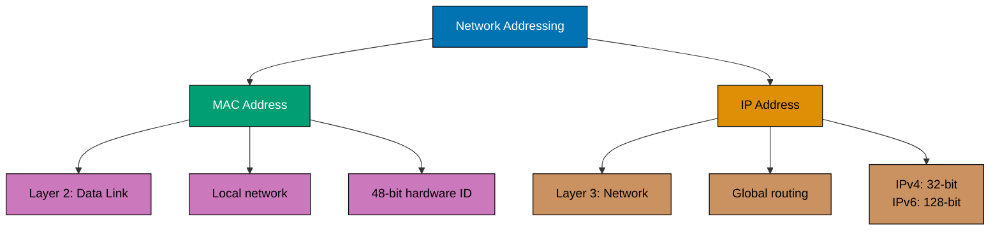
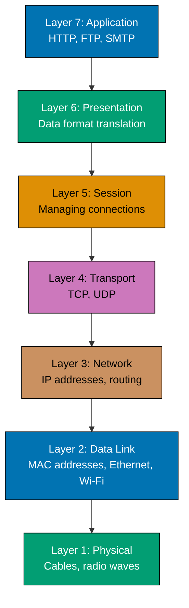
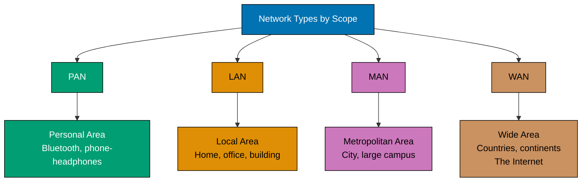
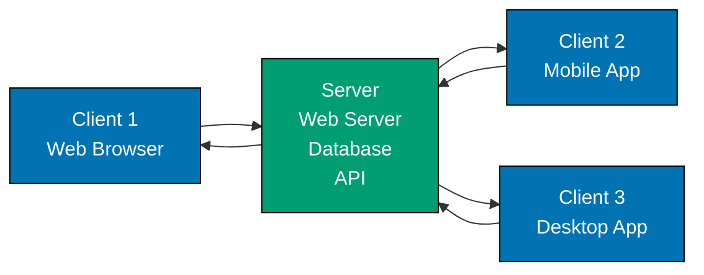
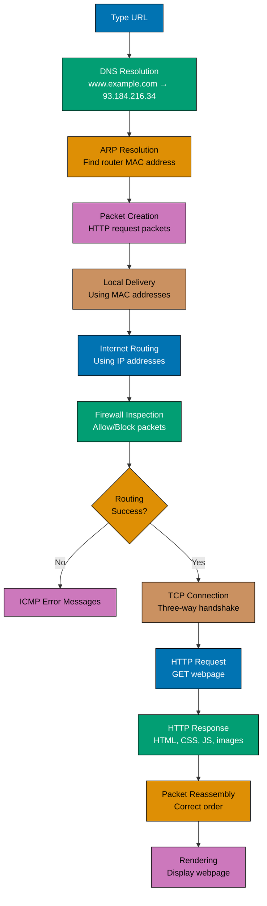

Computer networking forms the foundation of modern computing, enabling devices to communicate and share resources across local areas and the entire globe. Understanding networking is essential for software engineers, as virtually all modern applications rely on network communication.

## What is Computer Networking?

Computer networking is the practice of connecting computing devices to share data and resources. From your smartphone connecting to Wi-Fi to massive data centers serving billions of users, networks enable the digital world we interact with daily.

Think of a network like a postal system. Just as the postal service routes letters from sender to recipient using addresses and sorting facilities, computer networks route data packets from source to destination using addresses and routing devices. The key difference is speed - networks transfer data at the speed of light through fiber optic cables.

## Why Learn Networking?

Software engineers benefit from networking knowledge in several ways:

**Application Development**: Modern applications are networked by default. Whether building web applications, mobile apps, or microservices, you'll work with HTTP requests, WebSockets, REST APIs, and other network protocols.

**Troubleshooting**: When users report "the app is slow" or "I can't connect," networking knowledge helps you diagnose whether the issue lies in your code, the network infrastructure, or external services.

**Performance Optimization**: Understanding how data travels across networks helps you make better architectural decisions. Should you use HTTP/2 or HTTP/3? When should you implement caching? How do CDNs improve performance?

**Security**: Many security vulnerabilities involve network protocols. Understanding concepts like TLS/SSL, firewalls, and VPNs helps you build secure applications and protect user data.

**Cloud and Distributed Systems**: Cloud platforms like AWS, Azure, and GCP are fundamentally networking services. Concepts like virtual private clouds, load balancers, and service meshes all require networking understanding.

## How Networks Transmit Data

### Packets

Networks don't send data as continuous streams. Instead, they break data into small chunks called **packets**. Each packet contains:

- **Payload**: The actual data being transmitted
- **Header**: Metadata including source address, destination address, and protocol information
- **Trailer**: Error-checking information to detect corruption

When you download a file, it's divided into thousands of packets that travel independently across the network. The receiving device reassembles them in the correct order. This packet-switching approach makes networks efficient and resilient - if one path fails, packets can take alternate routes.

## Network Addressing

Networks use two types of addresses to identify and locate devices: MAC addresses at the physical level and IP addresses at the network level.

### MAC Addresses

A **MAC (Media Access Control) address** is a unique hardware identifier assigned to every network interface card (NIC) at manufacturing time. MAC addresses operate at Layer 2 (Data Link Layer) of the network stack.

MAC addresses are 48-bit identifiers written as six pairs of hexadecimal digits, like `00:1A:2B:3C:4D:5E`. The first three pairs identify the manufacturer, while the last three pairs uniquely identify the specific device.

**How MAC Addresses Work**: When devices communicate on a local network (like your home Wi-Fi), they use MAC addresses to identify each other directly. Your router maintains a table mapping IP addresses to MAC addresses using ARP (Address Resolution Protocol).

**MAC Address Spoofing**: While MAC addresses are intended as permanent identifiers, software can change them - a technique called **MAC address spoofing**. Security professionals might spoof MAC addresses during penetration testing, while attackers might use it to bypass MAC-based access controls or impersonate other devices. Modern network security relies on multiple layers beyond MAC filtering for this reason.

### IP Addresses

**IP (Internet Protocol) addresses** identify devices on networks and enable routing across the internet. Unlike MAC addresses which work locally, IP addresses function globally.

IP addresses come in two versions:

**IPv4**: The original internet addressing system uses 32-bit addresses divided into four **octets** (8-bit segments). Each octet ranges from 0 to 255, creating addresses like `192.0.2.1`. An IPv4 address written as `192.0.2.1` consists of four octets: `192`, `0`, `2`, and `1`.

IPv4 provides approximately 4.3 billion unique addresses. While this seemed vast in the 1980s, internet growth exhausted available IPv4 addresses, driving IPv6 adoption.

**IPv6**: The next-generation addressing system uses 128-bit addresses like `2001:0db8:85a3:0000:0000:8a2e:0370:7334`. IPv6 provides 340 undecillion unique addresses - essentially unlimited for practical purposes. IPv6 adoption continues growing as IPv4 addresses become scarce.

### Public vs Private Networks

IP addresses divide into two categories based on accessibility:

**Private Networks**: Use reserved IP address ranges that don't route on the public internet:

- `10.x.x.x` (`10/8`, 16.7 million addresses)
- `172.16.x.x` to `172.31.x.x` (`172.16/12`, 1 million addresses)
- `192.168.x.x` (`192.168/16`, 65,536 addresses)

Private networks enable organizations to reuse these addresses internally. Your home devices likely use `192.168.x.x` addresses. Multiple homes can use identical private addresses because they're isolated from each other.

**Public Networks**: Use globally unique IP addresses routable on the internet. Your internet service provider assigns your router a public IP address, enabling communication with the rest of the internet. NAT (Network Address Translation) allows multiple private devices to share a single public IP address.

## Network Layers

The OSI (Open Systems Interconnection) model organizes networking into seven conceptual layers, each handling specific responsibilities:

In practice, most engineers work primarily with the application, transport, and network layers. Understanding that MAC addresses operate at Layer 2 while IP addresses operate at Layer 3 clarifies why both are necessary.

## Network Communication Protocols

### Core Protocols

Protocols are standardized rules that define how devices communicate. Just as humans need a common language to communicate, computers need protocols.

**HTTP/HTTPS**: The foundation of the web, defining how browsers and servers exchange data. When you visit a website, your browser sends HTTP requests and receives HTTP responses.

**TCP/IP**: The fundamental protocol suite of the internet. TCP (Transmission Control Protocol) ensures reliable, ordered data delivery, while IP (Internet Protocol) handles addressing and routing.

**DNS**: The Domain Name System translates human-readable domain names (like google.com) into IP addresses that computers use to locate each other.

### ICMP and Ping

**ICMP (Internet Control Message Protocol)** operates at the network layer alongside IP, handling diagnostic and error reporting. Unlike TCP or UDP which transport application data, ICMP communicates information about the network itself.

**Ping** is a network diagnostic tool that uses ICMP to test connectivity and measure round-trip time to remote hosts. When you run `ping google.com`, your computer:

1. Sends an ICMP "echo request" packet to Google's servers
2. Google's servers receive the request and send an ICMP "echo reply"
3. Your computer measures the time between request and reply

Ping results show:

- **Reachability**: Can your computer communicate with the target?
- **Latency**: How long do packets take to travel round-trip?
- **Packet Loss**: Are any packets failing to arrive?

Network engineers use ping constantly to diagnose connectivity issues. Response times like `10ms` indicate excellent local connections, while `150ms` might indicate overseas routing. Timeouts suggest network problems or firewall blocking.

## Network Security

### Firewalls

**Firewalls** act as security barriers between networks, filtering traffic based on predefined rules. They examine packets and decide whether to allow or block them based on criteria like:

- **Source and destination IP addresses**: Block traffic from known malicious IPs
- **Ports and protocols**: Allow HTTP (port 80) but block vulnerable services
- **Application-level content**: Deep packet inspection examining actual data
- **Connection state**: Track ongoing connections to detect anomalies

Firewalls protect networks in multiple ways:

**Network Firewalls** sit at network boundaries (between your internal network and the internet), protecting all devices behind them. Corporate firewalls might block social media sites or restrict file sharing protocols.

**Host-based Firewalls** run on individual computers, providing per-device protection. Your operating system includes a built-in firewall that blocks incoming connections by default.

Modern firewalls combine traditional packet filtering with intrusion detection, malware scanning, and application-aware controls. Cloud platforms like AWS provide virtual firewalls (Security Groups) that control traffic to cloud resources.

### MAC Address Spoofing

As mentioned earlier, **MAC address spoofing** changes a device's MAC address through software. While MAC addresses are burned into hardware, operating systems allow overriding them.

Legitimate uses include:

- **Privacy**: Preventing tracking based on MAC addresses in public Wi-Fi
- **Testing**: Network administrators testing MAC-based access controls
- **Compatibility**: Working around network restrictions

Security concerns:

- **Access control bypass**: Impersonating authorized devices to gain network access
- **Attack attribution**: Hiding attacker identity during network intrusions
- **ARP spoofing attacks**: Redirecting network traffic to attacker-controlled devices

Modern networks implement port security, 802.1X authentication, and network access control (NAC) systems that don't rely solely on MAC addresses, recognizing that MAC addresses alone provide weak security.

## Network Types

Networks are categorized by geographic scope:

**LAN (Local Area Network)**: Covers a small geographic area like a home, office, or building. Your home Wi-Fi is a LAN where devices communicate directly using MAC addresses and private IP addresses.

**WAN (Wide Area Network)**: Spans large geographic areas, connecting multiple LANs. The internet is the largest WAN, using public IP addresses and routing protocols to connect networks worldwide.

**MAN (Metropolitan Area Network)**: Covers a city or large campus, bridging the gap between LANs and WANs.

**PAN (Personal Area Network)**: Very small networks, like Bluetooth connections between your phone and headphones.

## Routing and Switching

**Switches** connect devices within the same network (LAN), forwarding packets to the correct destination using MAC addresses. When you send data to another computer on your office network, switches ensure it reaches the right device.

**Routers** connect different networks and determine the best path for packets to travel from source to destination using IP addresses. When you access a website hosted in another country, your packets pass through multiple routers, each deciding the next hop based on routing tables and network conditions.

The key difference: switches operate at Layer 2 using MAC addresses for local communication, while routers operate at Layer 3 using IP addresses for inter-network communication.

## Client-Server Architecture

Most networked applications follow the client-server model:

**Clients** initiate requests (your web browser, mobile app).

**Servers** respond to requests (web servers, database servers, API servers).

This architecture scales well because many clients can share powerful centralized servers. However, modern systems increasingly use peer-to-peer, distributed, and edge computing models alongside traditional client-server.

## Network Programming

Software engineers interact with networks through various abstractions:

**Sockets**: Low-level network programming interfaces. You create a socket, bind it to an IP address and port, connect to a remote address, and send/receive packets.

**HTTP Libraries**: Higher-level abstractions for web communication. Libraries like `requests` (Python), `fetch` (JavaScript), or `HttpClient` (Java) handle HTTP details including packet assembly and connection management.

**Web Frameworks**: Even higher-level tools like Express.js, Django, or Spring Boot abstract networking further, letting you focus on application logic while the framework handles network communication.

**Message Queues**: Systems like RabbitMQ, Kafka, or Redis enable asynchronous network communication between services, managing packet delivery and reliability.

## Real-World Example

Consider what happens when you type a URL into your browser:

1. **DNS Resolution**: Your computer queries DNS servers to convert `www.example.com` into an IP address like `93.184.216.34`

2. **ARP Resolution**: Your computer uses ARP to find the router's MAC address for the next hop

3. **Packet Creation**: Your browser creates HTTP request packets with proper headers and addressing

4. **Local Delivery**: Packets travel from your network card to your router using MAC addresses

5. **Internet Routing**: Routers use IP addresses to forward packets across the internet, selecting optimal paths

6. **Firewall Inspection**: Firewalls at both ends examine packets, allowing HTTP traffic

7. **ICMP Messages**: If routing fails, ICMP messages report errors back to your computer

8. **TCP Connection**: Your browser establishes a TCP connection with the server using a three-way handshake

9. **HTTP Request**: Your browser sends an HTTP GET request for the web page

10. **HTTP Response**: The server sends back HTML, CSS, JavaScript, and images as packets

11. **Packet Reassembly**: Your computer reassembles packets in correct order

12. **Rendering**: Your browser renders the web page

All of this happens in milliseconds. You can use ping to measure just the round-trip time to the server, typically 10-100ms for domestic sites.

## Learning Path

Building networking expertise follows a progressive path:

**Fundamentals First**: Start with core concepts like packets, MAC addresses, IP addressing (including octets, IPv4/IPv6), public vs private networks, and basic protocols. Understanding these basics provides context for everything else.

**Diagnostic Tools**: Learn to use ping, traceroute, and other tools to diagnose network issues. Practice interpreting ICMP messages and understanding network latency.

**Protocol Deep Dives**: Study important protocols in detail - HTTP/HTTPS, TCP, UDP, DNS, ICMP. Learn when and why to use each.

**Security Fundamentals**: Understand firewalls, packet filtering, MAC address security, and basic network security concepts.

**Hands-On Practice**: Implement network programs using sockets. Build simple chat applications, file transfer tools, or HTTP servers. Experiment with packet capture tools like Wireshark.

**Real-World Applications**: Explore how production systems use networking - load balancing, CDNs, API gateways, service meshes.

**Advanced Topics**: Study distributed systems, network security, performance optimization, and emerging technologies like QUIC and HTTP/3.

## Summary

Computer networking enables all modern distributed computing. Understanding fundamental concepts - packets, MAC addresses, IP addressing with octets, public and private networks, IPv4 and IPv6, ICMP and ping, firewalls, and routing - provides the foundation for building robust networked applications.

Networks transmit data as packets addressed using both MAC addresses (local, Layer 2) and IP addresses (global, Layer 3). Tools like ping leverage ICMP to diagnose connectivity, while firewalls protect networks by filtering packets. Understanding these concepts helps you build better applications, debug issues faster, make informed architectural decisions, and advance your career as a software engineer.

The networking learning path covers everything from fundamental protocols to advanced distributed systems, providing the knowledge you need to build robust, scalable networked applications.
