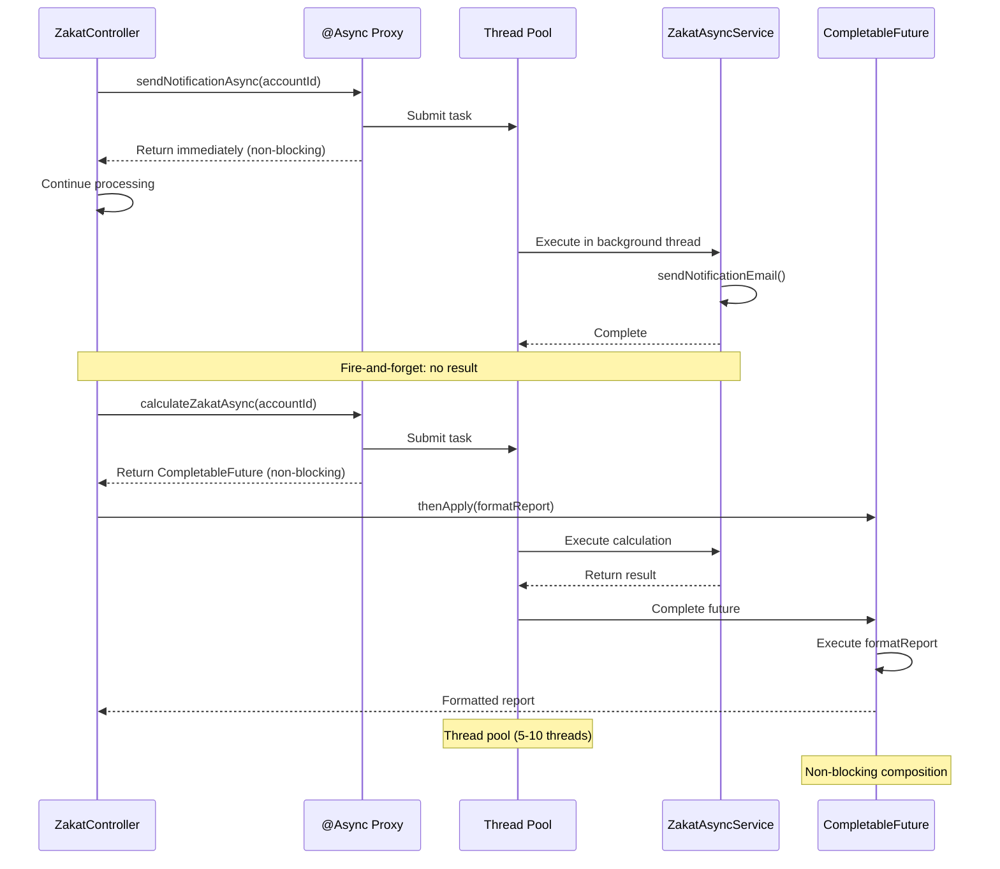

## Why Async Processing Matters

Production applications require non-blocking operations for responsiveness and throughput—generating zakat reports while serving API requests, sending notification emails without blocking response, and parallel data fetching from multiple sources. Manual async with Thread or ExecutorService requires explicit thread management, error handling, and result aggregation—verbose and error-prone. In production systems processing thousands of concurrent zakat calculations requiring parallel database queries, external API calls, and report generation, Spring's @Async annotation with CompletableFuture provides declarative asynchronous execution with automatic thread pool management, exception propagation, and result composition—eliminating manual thread coordination that causes deadlocks, thread leaks, and uncaught exceptions.

## Manual Thread/ExecutorService Baseline

Manual async processing requires explicit thread and executor management:

```java
import java.util.concurrent.*;
import java.util.*;

// => Manual async with Thread class
public class ManualThreadAsync {

    // => Send zakat notification asynchronously
    public void sendNotificationAsync(String accountId, double amount) {
        // => Create new thread for async execution
        // => PROBLEM: One thread per task (resource intensive)
        Thread thread = new Thread(() -> {
            try {
                // => Async task: send notification
                System.out.println("Sending notification: " + accountId);
                sendNotificationEmail(accountId, amount);
                System.out.println("Notification sent: " + accountId);

            } catch (Exception e) {
                // => PROBLEM: Exception handling scattered
                System.err.println("Failed to send notification: " + e.getMessage());
                // => PROBLEM: Caller cannot access exception
            }
        });

        // => Start thread: begins execution
        // => PROBLEM: No control over thread lifecycle
        thread.start();

        // => PROBLEM: Cannot wait for completion or get result
        // => PROBLEM: Caller continues immediately (fire-and-forget)
    }

    // => Wait for thread completion
    public void sendNotificationSync(String accountId, double amount) throws InterruptedException {
        Thread thread = new Thread(() -> {
            sendNotificationEmail(accountId, amount);
        });

        thread.start();

        // => join: blocks until thread completes
        // => PROBLEM: Blocking defeats purpose of async
        thread.join();
    }

    private void sendNotificationEmail(String accountId, double amount) {
        // => Simulate email sending (slow operation)
        try {
            Thread.sleep(2000);
            System.out.println("Email sent to " + accountId);
        } catch (InterruptedException e) {
            Thread.currentThread().interrupt();
        }
    }
}

// => Manual async with ExecutorService
public class ManualExecutorAsync {

    // => Thread pool: reuses threads for multiple tasks
    // => 10 threads: limits concurrent execution
    // => PROBLEM: Must manage executor lifecycle
    private final ExecutorService executor = Executors.newFixedThreadPool(10);

    // => Submit task: returns Future for result access
    public Future<Double> calculateZakatAsync(String accountId, double nisab) {
        // => submit: executes task asynchronously
        // => Callable: task returning value
        return executor.submit(() -> {
            try {
                System.out.println("Calculating zakat: " + accountId);

                // => Simulate calculation (slow operation)
                Thread.sleep(1000);

                // => Business logic
                double wealth = getAccountWealth(accountId);
                double zakat = wealth >= nisab ? wealth * 0.025 : 0.0;

                System.out.println("Zakat calculated: " + accountId + " = " + zakat);
                return zakat;

            } catch (InterruptedException e) {
                Thread.currentThread().interrupt();
                throw new RuntimeException("Calculation interrupted", e);
            }
        });
    }

    // => Wait for result: blocks until task completes
    public double calculateZakatBlocking(String accountId, double nisab) {
        Future<Double> future = calculateZakatAsync(accountId, nisab);

        try {
            // => get: blocks until result available
            // => PROBLEM: Blocking defeats async purpose
            return future.get();

        } catch (InterruptedException | ExecutionException e) {
            // => PROBLEM: Exception handling boilerplate
            throw new RuntimeException("Failed to calculate zakat", e);
        }
    }

    // => Wait for result with timeout
    public double calculateZakatWithTimeout(String accountId, double nisab, long timeoutSeconds) {
        Future<Double> future = calculateZakatAsync(accountId, nisab);

        try {
            // => get with timeout: throws TimeoutException if exceeds limit
            return future.get(timeoutSeconds, TimeUnit.SECONDS);

        } catch (TimeoutException e) {
            // => Cancel task if timeout exceeded
            future.cancel(true);
            throw new RuntimeException("Calculation timeout", e);

        } catch (InterruptedException | ExecutionException e) {
            throw new RuntimeException("Failed to calculate zakat", e);
        }
    }

    // => Parallel execution: multiple tasks concurrently
    public List<Double> calculateMultipleZakatAsync(List<String> accountIds, double nisab) {
        // => Submit all tasks
        List<Future<Double>> futures = new ArrayList<>();
        for (String accountId : accountIds) {
            Future<Double> future = calculateZakatAsync(accountId, nisab);
            futures.add(future);
        }

        // => Wait for all results
        // => PROBLEM: Sequential get() blocks for each task
        List<Double> results = new ArrayList<>();
        for (Future<Double> future : futures) {
            try {
                results.add(future.get());
            } catch (InterruptedException | ExecutionException e) {
                System.err.println("Failed to get result: " + e.getMessage());
                results.add(0.0);  // Default on error
            }
        }

        return results;
    }

    // => Combine results: async tasks with dependencies
    public double calculateTotalZakat(String accountId1, String accountId2, double nisab) {
        // => Start both calculations in parallel
        Future<Double> future1 = calculateZakatAsync(accountId1, nisab);
        Future<Double> future2 = calculateZakatAsync(accountId2, nisab);

        try {
            // => Wait for both results
            double zakat1 = future1.get();
            double zakat2 = future2.get();

            // => Combine results
            return zakat1 + zakat2;

        } catch (InterruptedException | ExecutionException e) {
            // => PROBLEM: Complex error handling for multiple futures
            throw new RuntimeException("Failed to calculate total zakat", e);
        }
    }

    private double getAccountWealth(String accountId) {
        // => Mock database query
        return 100000.0;
    }

    public void shutdown() {
        // => Shutdown executor: reject new tasks
        executor.shutdown();

        try {
            // => Wait for tasks to complete
            if (!executor.awaitTermination(30, TimeUnit.SECONDS)) {
                // => Force shutdown if timeout
                executor.shutdownNow();
            }
        } catch (InterruptedException e) {
            executor.shutdownNow();
            Thread.currentThread().interrupt();
        }
    }
}

// => Usage: manual lifecycle management
public class Application {

    public static void main(String[] args) throws InterruptedException {
        ManualThreadAsync threadAsync = new ManualThreadAsync();
        // => Fire-and-forget: no result access
        threadAsync.sendNotificationAsync("ACC001", 250.0);

        ManualExecutorAsync executorAsync = new ManualExecutorAsync();
        // => Get result: blocks caller
        double zakat = executorAsync.calculateZakatBlocking("ACC002", 85.0);
        System.out.println("Zakat: " + zakat);

        // => PROBLEM: Must manually shutdown executor
        executorAsync.shutdown();
    }
}
```

**Limitations:**

- **Manual thread management**: Create/start/join threads explicitly
- **Manual executor lifecycle**: Must create/shutdown executor service
- **Blocking result access**: Future.get() blocks caller thread
- **Complex error handling**: Exception handling scattered across code
- **No result composition**: Combining multiple async results verbose
- **No Spring integration**: Cannot inject dependencies or use transactions
- **Resource leaks**: Forgot executor.shutdown() leaves threads running

## Spring @Async Solution

Spring provides declarative async execution with @Async annotation:

### Configuration and Simple Async Methods

```java
import org.springframework.context.annotation.*;
import org.springframework.scheduling.annotation.*;
import org.springframework.scheduling.concurrent.ThreadPoolTaskExecutor;
import java.util.concurrent.Executor;

// => Spring async configuration
@Configuration
// => @EnableAsync: activates @Async annotation processing
// => Spring: creates proxy for @Async methods
@EnableAsync
public class AsyncConfig {

    // => TaskExecutor bean: thread pool for async execution
    // => Optional: Spring creates default if not provided
    @Bean(name = "taskExecutor")
    public Executor taskExecutor() {
        ThreadPoolTaskExecutor executor = new ThreadPoolTaskExecutor();

        // => Core pool size: minimum threads
        executor.setCorePoolSize(5);

        // => Max pool size: maximum threads
        executor.setMaxPoolSize(10);

        // => Queue capacity: pending tasks queue
        // => If queue full and threads at max, reject task
        executor.setQueueCapacity(100);

        // => Thread name prefix: for debugging
        executor.setThreadNamePrefix("zakat-async-");

        // => Wait for tasks on shutdown: graceful termination
        executor.setWaitForTasksToCompleteOnShutdown(true);

        // => Await termination: max 60 seconds
        executor.setAwaitTerminationSeconds(60);

        // => Initialize executor
        executor.initialize();

        return executor;
    }
}
```

### Fire-and-Forget Async Methods

```java
import org.springframework.scheduling.annotation.Async;
import org.springframework.stereotype.Service;

// => Async service
@Service
public class ZakatAsyncService {

    // => @Async: method executes asynchronously
    // => Spring: invokes method in thread pool
    // => Caller: continues immediately (non-blocking)
    @Async
    public void sendNotificationAsync(String accountId, double amount) {
        // => Method executes in separate thread
        System.out.println("Sending notification: " + accountId +
            " (thread: " + Thread.currentThread().getName() + ")");

        // => Simulate slow operation
        try {
            Thread.sleep(2000);
        } catch (InterruptedException e) {
            Thread.currentThread().interrupt();
        }

        // => Business logic
        sendNotificationEmail(accountId, amount);

        System.out.println("Notification sent: " + accountId);

        // => BENEFIT: No return value, fire-and-forget
        // => BENEFIT: Exceptions logged by Spring (no manual catch)
    }

    // => Async method with custom executor
    // => "taskExecutor": bean name from AsyncConfig
    @Async("taskExecutor")
    public void sendHighPriorityNotification(String accountId, double amount) {
        // => Executes in specified executor
        System.out.println("High-priority notification: " + accountId);
        sendNotificationEmail(accountId, amount);
    }

    private void sendNotificationEmail(String accountId, double amount) {
        System.out.println("Email sent to " + accountId + " for amount " + amount);
    }
}

// => Usage: non-blocking calls
@RestController
@RequestMapping("/api/zakat")
public class ZakatController {

    private final ZakatAsyncService asyncService;

    public ZakatController(ZakatAsyncService asyncService) {
        this.asyncService = asyncService;
    }

    @PostMapping("/notify")
    public String notify(@RequestParam String accountId, @RequestParam double amount) {
        // => Async call: returns immediately (non-blocking)
        asyncService.sendNotificationAsync(accountId, amount);

        // => BENEFIT: API responds instantly, notification sent in background
        return "Notification queued";
    }
}
```

### CompletableFuture for Result Access

```java
import org.springframework.scheduling.annotation.Async;
import org.springframework.stereotype.Service;
import java.util.concurrent.CompletableFuture;

@Service
public class ZakatCalculationAsyncService {

    // => @Async with CompletableFuture: non-blocking result access
    // => CompletableFuture: modern Future alternative (non-blocking)
    @Async
    public CompletableFuture<Double> calculateZakatAsync(String accountId, double nisab) {
        // => Method executes in separate thread
        System.out.println("Calculating zakat: " + accountId +
            " (thread: " + Thread.currentThread().getName() + ")");

        try {
            // => Simulate slow calculation
            Thread.sleep(1000);

            // => Business logic
            double wealth = getAccountWealth(accountId);
            double zakat = wealth >= nisab ? wealth * 0.025 : 0.0;

            System.out.println("Zakat calculated: " + accountId + " = " + zakat);

            // => Return result wrapped in CompletableFuture
            // => completedFuture: creates completed future with value
            // => BENEFIT: Non-blocking result propagation
            return CompletableFuture.completedFuture(zakat);

        } catch (InterruptedException e) {
            Thread.currentThread().interrupt();
            // => Return failed future: propagates exception
            return CompletableFuture.failedFuture(e);
        }
    }

    // => Calculate multiple accounts in parallel
    @Async
    public CompletableFuture<Double> calculateZakatForAccount(String accountId, double nisab) {
        double wealth = getAccountWealth(accountId);
        double zakat = wealth >= nisab ? wealth * 0.025 : 0.0;
        return CompletableFuture.completedFuture(zakat);
    }

    private double getAccountWealth(String accountId) {
        return 100000.0;  // Mock implementation
    }
}

// => Usage: non-blocking result composition
@Service
public class ZakatReportService {

    private final ZakatCalculationAsyncService calculationService;

    public ZakatReportService(ZakatCalculationAsyncService calculationService) {
        this.calculationService = calculationService;
    }

    // => Calculate total zakat for multiple accounts (parallel)
    public CompletableFuture<Double> calculateTotalZakat(
            String accountId1, String accountId2, double nisab) {

        // => Start both calculations in parallel (non-blocking)
        CompletableFuture<Double> future1 = calculationService.calculateZakatAsync(accountId1, nisab);
        CompletableFuture<Double> future2 = calculationService.calculateZakatAsync(accountId2, nisab);

        // => Combine results: non-blocking composition
        // => thenCombine: combines two futures when both complete
        // => BENEFIT: No blocking, no manual thread coordination
        return future1.thenCombine(future2, (zakat1, zakat2) -> {
            // => Executes when both futures complete
            System.out.println("Combining results: " + zakat1 + " + " + zakat2);
            return zakat1 + zakat2;
        });
    }

    // => Sequential async operations: dependent tasks
    public CompletableFuture<String> generateZakatReport(String accountId, double nisab) {
        // => Step 1: Calculate zakat (async)
        return calculationService.calculateZakatAsync(accountId, nisab)
            // => Step 2: Format report (after calculation completes)
            // => thenApply: transform result (non-blocking)
            .thenApply(zakat -> {
                System.out.println("Formatting report for " + accountId);
                return String.format("Zakat Report: Account %s = %.2f", accountId, zakat);
            })
            // => Step 3: Save report (after formatting completes)
            // => thenApply: another transformation
            .thenApply(report -> {
                System.out.println("Saving report: " + report);
                saveReport(report);
                return report;
            });
        // => BENEFIT: Sequential async operations without blocking
    }

    // => Error handling with CompletableFuture
    public CompletableFuture<Double> calculateZakatWithFallback(String accountId, double nisab) {
        return calculationService.calculateZakatAsync(accountId, nisab)
            // => exceptionally: handles exceptions (non-blocking)
            .exceptionally(ex -> {
                // => Fallback on error
                System.err.println("Calculation failed: " + ex.getMessage());
                return 0.0;  // Default value
            });
    }

    // => Timeout handling
    public CompletableFuture<Double> calculateZakatWithTimeout(String accountId, double nisab) {
        return calculationService.calculateZakatAsync(accountId, nisab)
            // => orTimeout: fails future if exceeds timeout
            .orTimeout(5, java.util.concurrent.TimeUnit.SECONDS)
            // => exceptionally: handle timeout exception
            .exceptionally(ex -> {
                System.err.println("Calculation timeout: " + accountId);
                return 0.0;
            });
    }

    // => All-of pattern: wait for all futures
    public CompletableFuture<Double> calculateTotalForAccounts(List<String> accountIds, double nisab) {
        // => Start all calculations in parallel
        List<CompletableFuture<Double>> futures = accountIds.stream()
            .map(accountId -> calculationService.calculateZakatAsync(accountId, nisab))
            .collect(java.util.stream.Collectors.toList());

        // => CompletableFuture.allOf: completes when all futures complete
        CompletableFuture<Void> allFutures = CompletableFuture.allOf(
            futures.toArray(new CompletableFuture[0])
        );

        // => Sum all results (after all complete)
        return allFutures.thenApply(v -> {
            return futures.stream()
                .map(CompletableFuture::join)  // Get result (non-blocking here)
                .reduce(0.0, Double::sum);
        });
    }

    private void saveReport(String report) {
        System.out.println("Report saved: " + report);
    }
}
```

**Benefits:**

- **Declarative async**: @Async annotation, no manual thread management
- **Non-blocking results**: CompletableFuture for result composition
- **Automatic thread pooling**: Spring manages thread pool lifecycle
- **Exception propagation**: Exceptions propagated to caller via CompletableFuture
- **Result composition**: Combine multiple async operations declaratively
- **Spring integration**: Inject dependencies, use transactions
- **Graceful shutdown**: Thread pool shuts down with Spring context

## Async Execution Model Diagram



## Production Patterns

### Exception Handling in Async Methods

```java
import org.springframework.scheduling.annotation.Async;
import org.springframework.stereotype.Service;
import java.util.concurrent.CompletableFuture;

@Service
public class RobustAsyncService {

    // => Async with exception handling
    @Async
    public CompletableFuture<Double> calculateZakatRobust(String accountId, double nisab) {
        try {
            // => Business logic
            double wealth = getAccountWealth(accountId);
            double zakat = wealth >= nisab ? wealth * 0.025 : 0.0;

            return CompletableFuture.completedFuture(zakat);

        } catch (Exception e) {
            // => Log exception
            System.err.println("Calculation failed: " + accountId + " - " + e.getMessage());

            // => Return failed future: propagates exception to caller
            return CompletableFuture.failedFuture(e);
        }
    }

    // => Custom exception handler
    @Async
    public CompletableFuture<Double> calculateZakatWithRetry(String accountId, double nisab) {
        return CompletableFuture.supplyAsync(() -> {
            int retries = 3;
            Exception lastException = null;

            for (int i = 0; i < retries; i++) {
                try {
                    // => Attempt calculation
                    double wealth = getAccountWealth(accountId);
                    return wealth >= nisab ? wealth * 0.025 : 0.0;

                } catch (Exception e) {
                    lastException = e;
                    System.err.println("Retry " + (i + 1) + " failed: " + e.getMessage());
                }
            }

            // => All retries failed: throw exception
            throw new RuntimeException("Calculation failed after " + retries + " retries", lastException);
        });
    }

    private double getAccountWealth(String accountId) {
        return 100000.0;
    }
}
```

### Async with Spring Transaction Management

```java
import org.springframework.scheduling.annotation.Async;
import org.springframework.transaction.annotation.Transactional;
import org.springframework.stereotype.Service;
import java.util.concurrent.CompletableFuture;

@Service
public class TransactionalAsyncService {

    private final ZakatPaymentRepository paymentRepository;

    public TransactionalAsyncService(ZakatPaymentRepository paymentRepository) {
        this.paymentRepository = paymentRepository;
    }

    // => @Async with @Transactional: async database operations
    // => IMPORTANT: Transaction bound to async thread, not caller thread
    @Async
    @Transactional
    public CompletableFuture<Void> saveZakatPaymentAsync(String accountId, double amount) {
        // => Database operation executes in async thread
        ZakatPayment payment = new ZakatPayment();
        payment.setAccountId(accountId);
        payment.setAmount(amount);
        payment.setTimestamp(java.time.LocalDateTime.now());

        // => Save to database
        paymentRepository.save(payment);

        System.out.println("Payment saved asynchronously: " + accountId);

        return CompletableFuture.completedFuture(null);
    }
}
```

### Rate Limiting with Semaphore

```java
import org.springframework.scheduling.annotation.Async;
import org.springframework.stereotype.Service;
import java.util.concurrent.*;

@Service
public class RateLimitedAsyncService {

    // => Semaphore: limits concurrent executions
    // => 5 permits: max 5 concurrent operations
    private final Semaphore semaphore = new Semaphore(5);

    @Async
    public CompletableFuture<Double> calculateZakatRateLimited(String accountId, double nisab) {
        try {
            // => Acquire permit: blocks if none available
            semaphore.acquire();

            try {
                // => Business logic
                System.out.println("Calculating (rate-limited): " + accountId);
                double wealth = getAccountWealth(accountId);
                return CompletableFuture.completedFuture(wealth >= nisab ? wealth * 0.025 : 0.0);

            } finally {
                // => Release permit: allow another operation
                semaphore.release();
            }

        } catch (InterruptedException e) {
            Thread.currentThread().interrupt();
            return CompletableFuture.failedFuture(e);
        }
    }

    private double getAccountWealth(String accountId) {
        return 100000.0;
    }
}
```

### Monitoring Async Execution

```java
import org.springframework.scheduling.annotation.Async;
import org.springframework.stereotype.Service;
import io.micrometer.core.instrument.*;
import java.util.concurrent.CompletableFuture;

@Service
public class MonitoredAsyncService {

    private final MeterRegistry meterRegistry;
    private final Timer asyncTimer;
    private final Counter asyncCounter;

    public MonitoredAsyncService(MeterRegistry meterRegistry) {
        this.meterRegistry = meterRegistry;

        // => Timer: tracks execution duration
        this.asyncTimer = Timer.builder("async.execution.duration")
            .tag("operation", "zakatCalculation")
            .register(meterRegistry);

        // => Counter: tracks execution count
        this.asyncCounter = Counter.builder("async.execution.count")
            .tag("operation", "zakatCalculation")
            .register(meterRegistry);
    }

    @Async
    public CompletableFuture<Double> calculateZakatMonitored(String accountId, double nisab) {
        // => Increment counter
        asyncCounter.increment();

        // => Measure execution time
        return asyncTimer.record(() -> {
            try {
                double wealth = getAccountWealth(accountId);
                double zakat = wealth >= nisab ? wealth * 0.025 : 0.0;
                return CompletableFuture.completedFuture(zakat);

            } catch (Exception e) {
                // => Track errors
                meterRegistry.counter("async.execution.errors",
                    "operation", "zakatCalculation",
                    "error", e.getClass().getSimpleName()
                ).increment();
                return CompletableFuture.failedFuture(e);
            }
        });
    }

    private double getAccountWealth(String accountId) {
        return 100000.0;
    }
}
```

## Trade-offs and When to Use

| Approach                   | Setup Complexity | Result Access | Error Handling | Spring Integration | Production Ready |
| -------------------------- | ---------------- | ------------- | -------------- | ------------------ | ---------------- |
| Thread                     | Low              | None          | Manual         | None               | No               |
| ExecutorService + Future   | Medium           | Blocking      | Manual         | None               | Limited          |
| Spring @Async (void)       | Low              | None          | Automatic      | Full               | Yes              |
| Spring @Async (CF)         | Low              | Non-blocking  | Declarative    | Full               | Yes              |
| Reactive (Project Reactor) | High             | Non-blocking  | Declarative    | Full               | Yes (streaming)  |

**When to Use Thread:**

- Learning threading fundamentals
- Simple one-off async task
- Educational purposes only

**When to Use ExecutorService + Future:**

- No Spring dependency
- Simple async with result access
- Limited concurrent operations

**When to Use Spring @Async (void):**

- **Fire-and-forget operations** (notifications, logging, analytics)
- No result required
- Spring-managed application
- Production deployments

**When to Use Spring @Async (CompletableFuture):**

- **Production applications** (default choice for result access)
- Non-blocking result composition
- Multiple dependent async operations
- Spring-managed application

**When to Use Reactive (Project Reactor):**

- Streaming data (large datasets, real-time events)
- Backpressure handling required
- Very high concurrency (>10K operations/sec)
- Reactive stack (WebFlux)

## Best Practices

**1. Use CompletableFuture for Result Access**

```java
// ✅ Non-blocking result access
@Async
public CompletableFuture<Double> calculate(String accountId) {
    return CompletableFuture.completedFuture(result);
}

// ❌ Blocking result access
@Async
public Future<Double> calculate(String accountId) {
    // Future.get() blocks caller
}
```

**2. Configure Thread Pool Size**

```java
@Bean
public Executor taskExecutor() {
    ThreadPoolTaskExecutor executor = new ThreadPoolTaskExecutor();
    executor.setCorePoolSize(5);   // Min threads
    executor.setMaxPoolSize(10);   // Max threads
    executor.setQueueCapacity(100); // Pending task queue
    return executor;
}
```

**3. Handle Exceptions in Async Methods**

```java
@Async
public CompletableFuture<Double> calculate(String accountId) {
    try {
        return CompletableFuture.completedFuture(performCalculation(accountId));
    } catch (Exception e) {
        logger.error("Calculation failed", e);
        return CompletableFuture.failedFuture(e);
    }
}
```

**4. Use @Async on Interface Methods**

```java
// ✅ @Async on implementation method
@Service
public class ZakatServiceImpl implements ZakatService {
    @Async
    public CompletableFuture<Double> calculate(String accountId) { }
}

// ⚠️ Doesn't work: @Async on same-class method call
public void caller() {
    this.calculate("ACC001");  // Not async (same-class call)
}
```

**5. Monitor Thread Pool Health**

```java
@Bean
public Executor taskExecutor() {
    ThreadPoolTaskExecutor executor = new ThreadPoolTaskExecutor();
    executor.setCorePoolSize(5);
    executor.setMaxPoolSize(10);

    // Monitor thread pool metrics
    executor.setThreadNamePrefix("monitored-async-");
    executor.setWaitForTasksToCompleteOnShutdown(true);

    return executor;
}
```

## See Also

- [Scheduling](/en/learn/software-engineering/platforms/web/tools/jvm-spring/in-the-field/scheduling) - @Scheduled for periodic background tasks
- [Messaging](/en/learn/software-engineering/platforms/web/tools/jvm-spring/in-the-field/messaging) - JMS for asynchronous messaging
- [Events](/en/learn/software-engineering/platforms/web/tools/jvm-spring/in-the-field/events) - ApplicationEvent for async event handling
- [Transaction Management](/en/learn/software-engineering/platforms/web/tools/jvm-spring/in-the-field/transaction-management) - @Transactional with @Async
- Reactive Programming - Project Reactor for reactive streams
