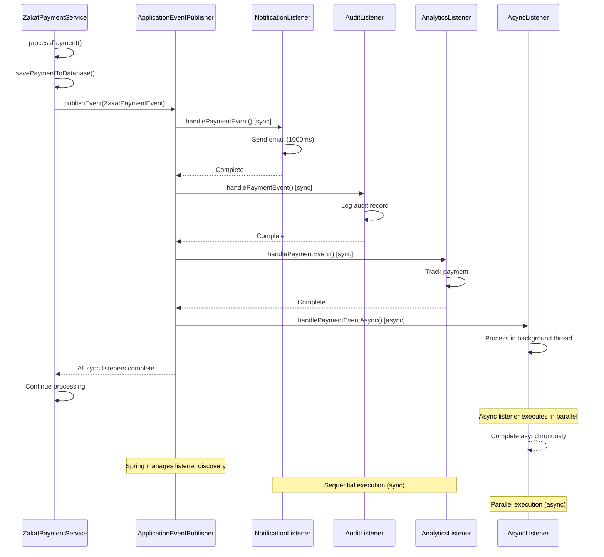

## Why Event-Driven Architecture Matters

Production applications require loose coupling between components—when zakat payment completes, multiple subsystems (notification service, audit logger, analytics tracker, report generator) need to react without direct dependencies. Manual Observer pattern requires maintaining listener lists, manual registration/unregistration, and thread-safe notification—verbose and error-prone. In production systems processing thousands of zakat payment events with multiple listeners requiring transactional consistency, async execution, and ordering guarantees, Spring's ApplicationEvent with @EventListener provides declarative event publishing and subscription with automatic listener discovery, transaction integration, and async propagation—eliminating manual observer management that causes memory leaks, race conditions, and notification failures.

## Manual Observer Pattern Baseline

Manual event-driven architecture requires explicit observer management:

```java
import java.util.*;
import java.util.concurrent.*;

// => Manual event class
// => Event: represents something that happened
public class ZakatPaymentEvent {
    private final String accountId;
    private final double amount;
    private final long timestamp;

    public ZakatPaymentEvent(String accountId, double amount) {
        this.accountId = accountId;
        this.amount = amount;
        this.timestamp = System.currentTimeMillis();
    }

    public String getAccountId() { return accountId; }
    public double getAmount() { return amount; }
    public long getTimestamp() { return timestamp; }
}

// => Manual listener interface
// => Observer: reacts to events
public interface ZakatPaymentListener {
    void onPaymentReceived(ZakatPaymentEvent event);
}

// => Manual event publisher (Subject in Observer pattern)
public class ManualEventPublisher {

    // => Listener list: registered observers
    // => CopyOnWriteArrayList: thread-safe, no ConcurrentModificationException
    // => PROBLEM: Must manually manage thread safety
    private final CopyOnWriteArrayList<ZakatPaymentListener> listeners = new CopyOnWriteArrayList<>();

    // => Register listener: add observer
    // => PROBLEM: Caller must remember to register
    public void addListener(ZakatPaymentListener listener) {
        listeners.add(listener);
        System.out.println("Listener registered: " + listener.getClass().getSimpleName());
    }

    // => Unregister listener: remove observer
    // => PROBLEM: Easy to forget unregistration (memory leak)
    public void removeListener(ZakatPaymentListener listener) {
        listeners.remove(listener);
        System.out.println("Listener unregistered: " + listener.getClass().getSimpleName());
    }

    // => Publish event: notify all observers
    public void publishPaymentEvent(String accountId, double amount) {
        // => Create event
        ZakatPaymentEvent event = new ZakatPaymentEvent(accountId, amount);

        System.out.println("Publishing event: " + accountId + " = " + amount);

        // => Notify all listeners
        // => PROBLEM: Sequential execution blocks publisher
        for (ZakatPaymentListener listener : listeners) {
            try {
                // => Invoke listener: synchronous
                // => If listener slow, blocks all subsequent listeners
                listener.onPaymentReceived(event);

            } catch (Exception e) {
                // => PROBLEM: Exception in one listener doesn't affect others
                // => But no standardized error handling
                System.err.println("Listener failed: " + listener.getClass().getSimpleName());
                e.printStackTrace();
            }
        }

        System.out.println("Event published to " + listeners.size() + " listeners");
    }

    // => Async event publishing: non-blocking notification
    // => PROBLEM: Must manually manage thread pool
    private final ExecutorService executorService = Executors.newFixedThreadPool(5);

    public void publishPaymentEventAsync(String accountId, double amount) {
        ZakatPaymentEvent event = new ZakatPaymentEvent(accountId, amount);

        // => Notify each listener in separate thread
        for (ZakatPaymentListener listener : listeners) {
            // => Submit to thread pool: asynchronous
            executorService.submit(() -> {
                try {
                    listener.onPaymentReceived(event);
                } catch (Exception e) {
                    System.err.println("Async listener failed: " + listener.getClass().getSimpleName());
                    e.printStackTrace();
                }
            });
        }
        // => PROBLEM: No ordering guarantee across listeners
        // => PROBLEM: Publisher doesn't wait for completion
    }

    public void shutdown() {
        // => PROBLEM: Must manually shutdown executor
        executorService.shutdown();
    }
}

// => Concrete listener implementations
public class NotificationListener implements ZakatPaymentListener {

    @Override
    public void onPaymentReceived(ZakatPaymentEvent event) {
        // => Send notification email
        System.out.println("NotificationListener: Sending email for " + event.getAccountId());

        // => Simulate slow operation
        try {
            Thread.sleep(1000);
        } catch (InterruptedException e) {
            Thread.currentThread().interrupt();
        }

        System.out.println("NotificationListener: Email sent");
    }
}

public class AuditListener implements ZakatPaymentListener {

    @Override
    public void onPaymentReceived(ZakatPaymentEvent event) {
        // => Log audit record
        System.out.println("AuditListener: Recording payment " +
            event.getAccountId() + " = " + event.getAmount());
    }
}

public class AnalyticsListener implements ZakatPaymentListener {

    @Override
    public void onPaymentReceived(ZakatPaymentEvent event) {
        // => Track analytics
        System.out.println("AnalyticsListener: Tracking payment for " + event.getAccountId());
    }
}

// => Usage: manual listener registration
public class Application {

    public static void main(String[] args) {
        // => Create publisher
        ManualEventPublisher publisher = new ManualEventPublisher();

        // => Register listeners
        // => PROBLEM: Must manually register each listener
        publisher.addListener(new NotificationListener());
        publisher.addListener(new AuditListener());
        publisher.addListener(new AnalyticsListener());

        // => Publish event: triggers all listeners
        publisher.publishPaymentEvent("ACC001", 250.0);

        // => PROBLEM: Slow listener blocks entire chain
        // => NotificationListener takes 1 second, blocks AuditListener and AnalyticsListener

        // => Async publishing
        publisher.publishPaymentEventAsync("ACC002", 500.0);

        // => PROBLEM: Must manually unregister to prevent memory leaks
        // => Easy to forget, especially in long-running applications

        // => PROBLEM: Must shutdown executor
        publisher.shutdown();
    }
}
```

**Limitations:**

- **Manual listener management**: Must register/unregister observers explicitly
- **Memory leaks**: Forgot unregistration keeps listeners in memory
- **No automatic discovery**: Cannot scan for listeners automatically
- **Sequential execution**: Synchronous notification blocks publisher
- **Manual thread management**: Async requires explicit executor service
- **No transaction integration**: Cannot coordinate events with database transactions
- **No ordering guarantees**: Async listeners execute in arbitrary order
- **No Spring integration**: Cannot inject dependencies into listeners

## Spring ApplicationEvent Solution

Spring provides declarative event-driven architecture with ApplicationEvent:

### Event Definition and Publishing

```java
import org.springframework.context.ApplicationEvent;
import org.springframework.context.ApplicationEventPublisher;
import org.springframework.stereotype.Service;

// => Spring event class
// => Extends ApplicationEvent: Spring event base class
public class ZakatPaymentEvent extends ApplicationEvent {

    // => Event data
    private final String accountId;
    private final double amount;
    private final long timestamp;

    // => Constructor: source required by ApplicationEvent
    // => source: object that published event (typically service)
    public ZakatPaymentEvent(Object source, String accountId, double amount) {
        super(source);  // Pass source to ApplicationEvent
        this.accountId = accountId;
        this.amount = amount;
        this.timestamp = System.currentTimeMillis();
    }

    public String getAccountId() { return accountId; }
    public double getAmount() { return amount; }
    public long getTimestamp() { return timestamp; }
}

// => Event publisher service
@Service
public class ZakatPaymentService {

    // => ApplicationEventPublisher: Spring event publishing
    // => Spring: auto-injects publisher
    private final ApplicationEventPublisher eventPublisher;

    public ZakatPaymentService(ApplicationEventPublisher eventPublisher) {
        this.eventPublisher = eventPublisher;
    }

    // => Process payment and publish event
    public void processPayment(String accountId, double amount) {
        // => Business logic: process payment
        System.out.println("Processing payment: " + accountId + " = " + amount);
        savePaymentToDatabase(accountId, amount);

        // => Publish event: notify listeners
        // => BENEFIT: No manual listener registration
        ZakatPaymentEvent event = new ZakatPaymentEvent(this, accountId, amount);
        eventPublisher.publishEvent(event);
        // => Spring: automatically delivers event to all @EventListener methods

        System.out.println("Payment processed and event published");
        // => BENEFIT: Publisher doesn't know about listeners (loose coupling)
    }

    private void savePaymentToDatabase(String accountId, double amount) {
        System.out.println("Payment saved to database: " + accountId);
    }
}
```

### Declarative Event Listeners

```java
import org.springframework.context.event.EventListener;
import org.springframework.stereotype.Component;

// => Event listener component
// => Spring: automatically detects @EventListener methods
@Component
public class NotificationEventListener {

    // => @EventListener: declarative event subscription
    // => Spring: invokes method when ZakatPaymentEvent published
    // => BENEFIT: No manual registration/unregistration
    @EventListener
    public void handlePaymentEvent(ZakatPaymentEvent event) {
        // => Listener logic: send notification
        System.out.println("NotificationListener: Sending email for " + event.getAccountId());

        // => Simulate slow operation
        try {
            Thread.sleep(1000);
        } catch (InterruptedException e) {
            Thread.currentThread().interrupt();
        }

        System.out.println("NotificationListener: Email sent for " + event.getAccountId());
        // => BENEFIT: Exceptions don't affect other listeners
    }
}

@Component
public class AuditEventListener {

    // => Multiple listeners automatically discovered
    @EventListener
    public void handlePaymentEvent(ZakatPaymentEvent event) {
        System.out.println("AuditListener: Recording payment " +
            event.getAccountId() + " = " + event.getAmount());

        // => Audit logging logic
        logAuditRecord(event.getAccountId(), event.getAmount(), event.getTimestamp());
    }

    private void logAuditRecord(String accountId, double amount, long timestamp) {
        System.out.println("Audit record saved: " + accountId + " at " + timestamp);
    }
}

@Component
public class AnalyticsEventListener {

    @EventListener
    public void handlePaymentEvent(ZakatPaymentEvent event) {
        System.out.println("AnalyticsListener: Tracking payment for " + event.getAccountId());

        // => Analytics tracking logic
        trackPayment(event.getAccountId(), event.getAmount());
    }

    private void trackPayment(String accountId, double amount) {
        System.out.println("Analytics tracked: " + accountId + " = " + amount);
    }
}
```

### Conditional Event Listeners

```java
import org.springframework.context.event.EventListener;
import org.springframework.stereotype.Component;

@Component
public class ConditionalEventListeners {

    // => Conditional listener: only processes high-value payments
    // => condition: SpEL expression for filtering
    // => BENEFIT: Listener-side filtering, no boilerplate
    @EventListener(condition = "#event.amount > 1000")
    public void handleHighValuePayment(ZakatPaymentEvent event) {
        System.out.println("HighValueListener: Processing high-value payment: " +
            event.getAccountId() + " = " + event.getAmount());

        // => Special handling for high-value payments
        escalateToManagement(event.getAccountId(), event.getAmount());
    }

    // => Multiple condition example
    @EventListener(condition = "#event.amount > 500 and #event.accountId.startsWith('VIP')")
    public void handleVipPayment(ZakatPaymentEvent event) {
        System.out.println("VipListener: Processing VIP payment");
        sendVipNotification(event.getAccountId());
    }

    private void escalateToManagement(String accountId, double amount) {
        System.out.println("Management notified: " + accountId + " = " + amount);
    }

    private void sendVipNotification(String accountId) {
        System.out.println("VIP notification sent: " + accountId);
    }
}
```

### Async Event Listeners

```java
import org.springframework.context.annotation.*;
import org.springframework.context.event.EventListener;
import org.springframework.scheduling.annotation.*;
import org.springframework.scheduling.concurrent.ThreadPoolTaskExecutor;
import org.springframework.stereotype.Component;
import java.util.concurrent.Executor;

// => Async event configuration
@Configuration
@EnableAsync
public class AsyncEventConfig {

    // => TaskExecutor for async event listeners
    @Bean(name = "eventExecutor")
    public Executor eventExecutor() {
        ThreadPoolTaskExecutor executor = new ThreadPoolTaskExecutor();
        executor.setCorePoolSize(5);
        executor.setMaxPoolSize(10);
        executor.setQueueCapacity(100);
        executor.setThreadNamePrefix("event-async-");
        executor.initialize();
        return executor;
    }
}

@Component
public class AsyncEventListeners {

    // => Async event listener: non-blocking execution
    // => @Async: executes listener in separate thread
    // => BENEFIT: Doesn't block event publisher or other listeners
    @EventListener
    @Async("eventExecutor")
    public void handlePaymentEventAsync(ZakatPaymentEvent event) {
        System.out.println("AsyncListener: Processing payment " + event.getAccountId() +
            " (thread: " + Thread.currentThread().getName() + ")");

        // => Slow operation: doesn't block publisher
        try {
            Thread.sleep(2000);
        } catch (InterruptedException e) {
            Thread.currentThread().interrupt();
        }

        System.out.println("AsyncListener: Processing complete for " + event.getAccountId());
    }

    // => Multiple async listeners execute in parallel
    @EventListener
    @Async("eventExecutor")
    public void handleReportGeneration(ZakatPaymentEvent event) {
        System.out.println("ReportListener: Generating report for " + event.getAccountId());

        // => Generate report asynchronously
        generateReport(event.getAccountId(), event.getAmount());
    }

    private void generateReport(String accountId, double amount) {
        try {
            Thread.sleep(1500);
            System.out.println("Report generated: " + accountId);
        } catch (InterruptedException e) {
            Thread.currentThread().interrupt();
        }
    }
}
```

**Benefits:**

- **Automatic listener discovery**: Spring scans for @EventListener methods
- **No manual registration**: Listeners automatically subscribed
- **Loose coupling**: Publishers don't know about listeners
- **Conditional processing**: SpEL expressions filter events
- **Async execution**: @Async runs listeners in separate threads
- **Transaction integration**: Events published within transactions
- **Spring integration**: Inject dependencies into listeners
- **No memory leaks**: Spring manages listener lifecycle

## Event Propagation Flow Diagram



## Production Patterns

### Transactional Event Listeners

```java
import org.springframework.context.event.EventListener;
import org.springframework.stereotype.Component;
import org.springframework.transaction.annotation.Transactional;
import org.springframework.transaction.event.*;

@Component
public class TransactionalEventListeners {

    // => @TransactionalEventListener: executes within transaction
    // => phase = AFTER_COMMIT: executes only if transaction commits
    // => BENEFIT: Event processing tied to transaction outcome
    @TransactionalEventListener(phase = TransactionPhase.AFTER_COMMIT)
    public void handlePaymentAfterCommit(ZakatPaymentEvent event) {
        // => Executes only if payment transaction commits
        System.out.println("TransactionalListener: Payment committed, sending confirmation");

        // => Safe to send notification: payment guaranteed in database
        sendConfirmationEmail(event.getAccountId(), event.getAmount());
    }

    // => AFTER_ROLLBACK: executes only if transaction rolls back
    @TransactionalEventListener(phase = TransactionPhase.AFTER_ROLLBACK)
    public void handlePaymentRollback(ZakatPaymentEvent event) {
        System.out.println("TransactionalListener: Payment rolled back for " + event.getAccountId());

        // => Log rollback, alert operations
        logRollback(event.getAccountId(), event.getAmount());
    }

    // => BEFORE_COMMIT: executes before transaction commits
    // => Use case: validation, enrichment
    @TransactionalEventListener(phase = TransactionPhase.BEFORE_COMMIT)
    public void validateBeforeCommit(ZakatPaymentEvent event) {
        System.out.println("TransactionalListener: Validating before commit");

        // => Validate business rules
        // => Exception here rolls back transaction
        validatePayment(event.getAccountId(), event.getAmount());
    }

    // => AFTER_COMPLETION: executes after commit or rollback
    @TransactionalEventListener(phase = TransactionPhase.AFTER_COMPLETION)
    public void cleanupAfterCompletion(ZakatPaymentEvent event) {
        System.out.println("TransactionalListener: Cleaning up resources");

        // => Release resources regardless of outcome
        releaseTemporaryResources(event.getAccountId());
    }

    private void sendConfirmationEmail(String accountId, double amount) {
        System.out.println("Confirmation email sent: " + accountId + " = " + amount);
    }

    private void logRollback(String accountId, double amount) {
        System.out.println("Rollback logged: " + accountId + " = " + amount);
    }

    private void validatePayment(String accountId, double amount) {
        if (amount < 0) {
            throw new IllegalArgumentException("Invalid payment amount");
        }
    }

    private void releaseTemporaryResources(String accountId) {
        System.out.println("Resources released: " + accountId);
    }
}
```

### Event Listener Ordering

```java
import org.springframework.context.event.EventListener;
import org.springframework.core.annotation.Order;
import org.springframework.stereotype.Component;

@Component
public class OrderedEventListeners {

    // => @Order: controls listener execution order
    // => Lower value = higher priority (executes first)
    // => BENEFIT: Guaranteed execution order for sync listeners
    @EventListener
    @Order(1)  // Executes first
    public void validatePayment(ZakatPaymentEvent event) {
        System.out.println("OrderedListener: Validating payment (Order 1)");

        // => Validation logic
        // => Exception here prevents subsequent listeners
        if (event.getAmount() <= 0) {
            throw new IllegalArgumentException("Invalid payment amount");
        }
    }

    @EventListener
    @Order(2)  // Executes second
    public void processPayment(ZakatPaymentEvent event) {
        System.out.println("OrderedListener: Processing payment (Order 2)");

        // => Processing logic
        processPaymentLogic(event.getAccountId(), event.getAmount());
    }

    @EventListener
    @Order(3)  // Executes third
    public void notifyUser(ZakatPaymentEvent event) {
        System.out.println("OrderedListener: Notifying user (Order 3)");

        // => Notification logic
        sendNotification(event.getAccountId());
    }

    private void processPaymentLogic(String accountId, double amount) {
        System.out.println("Payment processed: " + accountId);
    }

    private void sendNotification(String accountId) {
        System.out.println("Notification sent: " + accountId);
    }
}
```

### Generic Event Publishing

```java
import org.springframework.context.ApplicationEventPublisher;
import org.springframework.context.event.EventListener;
import org.springframework.stereotype.*;

// => POJO event: no ApplicationEvent inheritance required
// => Spring 4.2+: supports plain objects as events
public class ZakatCalculationCompletedEvent {
    private final String accountId;
    private final double zakatAmount;

    public ZakatCalculationCompletedEvent(String accountId, double zakatAmount) {
        this.accountId = accountId;
        this.zakatAmount = zakatAmount;
    }

    public String getAccountId() { return accountId; }
    public double getZakatAmount() { return zakatAmount; }
}

@Service
public class ZakatCalculationService {

    private final ApplicationEventPublisher eventPublisher;

    public ZakatCalculationService(ApplicationEventPublisher eventPublisher) {
        this.eventPublisher = eventPublisher;
    }

    public void calculateZakat(String accountId, double nisab) {
        // => Business logic
        double wealth = getAccountWealth(accountId);
        double zakatAmount = wealth >= nisab ? wealth * 0.025 : 0.0;

        // => Publish POJO event: no ApplicationEvent inheritance
        // => BENEFIT: Domain events don't depend on Spring
        ZakatCalculationCompletedEvent event = new ZakatCalculationCompletedEvent(accountId, zakatAmount);
        eventPublisher.publishEvent(event);
    }

    private double getAccountWealth(String accountId) {
        return 100000.0;
    }
}

@Component
public class CalculationEventListener {

    // => Listen to POJO event
    @EventListener
    public void handleCalculationCompleted(ZakatCalculationCompletedEvent event) {
        System.out.println("Calculation completed: " + event.getAccountId() +
            " = " + event.getZakatAmount());
    }
}
```

### Event Listener Error Handling

```java
import org.springframework.context.event.EventListener;
import org.springframework.stereotype.Component;
import org.slf4j.*;

@Component
public class RobustEventListener {

    private static final Logger logger = LoggerFactory.getLogger(RobustEventListener.class);

    // => Robust error handling in listener
    @EventListener
    public void handlePaymentWithErrorHandling(ZakatPaymentEvent event) {
        try {
            // => Business logic
            processPayment(event);

        } catch (Exception e) {
            // => Log error: exception doesn't propagate to publisher
            logger.error("Failed to process payment event: accountId={}, amount={}",
                event.getAccountId(), event.getAmount(), e);

            // => Fallback logic
            handlePaymentFailure(event.getAccountId(), e.getMessage());
        }
    }

    // => Retry logic in listener
    @EventListener
    public void handlePaymentWithRetry(ZakatPaymentEvent event) {
        int maxRetries = 3;
        Exception lastException = null;

        for (int i = 0; i < maxRetries; i++) {
            try {
                processPayment(event);
                return;  // Success

            } catch (Exception e) {
                lastException = e;
                logger.warn("Retry {} failed for accountId={}: {}",
                    i + 1, event.getAccountId(), e.getMessage());

                // => Wait before retry
                try {
                    Thread.sleep(1000 * (i + 1));
                } catch (InterruptedException ie) {
                    Thread.currentThread().interrupt();
                    break;
                }
            }
        }

        // => All retries failed
        logger.error("All retries exhausted for accountId={}", event.getAccountId(), lastException);
        handlePaymentFailure(event.getAccountId(), lastException.getMessage());
    }

    private void processPayment(ZakatPaymentEvent event) {
        System.out.println("Processing payment: " + event.getAccountId());
    }

    private void handlePaymentFailure(String accountId, String errorMessage) {
        System.err.println("Payment failure handled: " + accountId + " - " + errorMessage);
    }
}
```

## Trade-offs and When to Use

| Approach                         | Setup Complexity | Loose Coupling | Async Support | Transaction Integration | Production Ready  |
| -------------------------------- | ---------------- | -------------- | ------------- | ----------------------- | ----------------- |
| Manual Observer Pattern          | High             | Low            | Manual        | None                    | No                |
| Spring ApplicationEvent          | Low              | High           | Manual        | Full                    | Yes               |
| Spring ApplicationEvent + @Async | Low              | High           | Declarative   | Full                    | Yes               |
| Messaging (JMS/Kafka)            | Medium           | Very High      | Built-in      | Limited                 | Yes (distributed) |

**When to Use Manual Observer Pattern:**

- Learning Observer pattern fundamentals
- Simple in-memory event notification
- No Spring dependency
- Educational purposes only

**When to Use Spring ApplicationEvent:**

- **Production in-process events** (default choice)
- Loose coupling within application
- Transaction-aware event processing
- Synchronous event propagation required

**When to Use Spring ApplicationEvent + @Async:**

- **Production non-blocking events** (common choice)
- Async event processing required
- Background tasks triggered by events
- Multiple listeners processing in parallel

**When to Use Messaging (JMS/Kafka):**

- **Distributed systems** (microservices)
- Cross-application event propagation
- Event persistence required
- Guaranteed delivery across services

## Best Practices

**1. Use POJO Events (Spring 4.2+)**

```java
// ✅ POJO event: no Spring dependency
public class ZakatPaymentEvent {
    private final String accountId;
    private final double amount;
    // Constructor, getters
}

// ❌ ApplicationEvent inheritance: couples to Spring
public class ZakatPaymentEvent extends ApplicationEvent {
    // Requires source parameter
}
```

**2. Use @TransactionalEventListener for Database Operations**

```java
// ✅ Transactional: event after DB commit
@TransactionalEventListener(phase = TransactionPhase.AFTER_COMMIT)
public void handlePayment(ZakatPaymentEvent event) {
    sendConfirmation(event);  // Safe: payment in DB
}

// ❌ Regular listener: may execute before commit
@EventListener
public void handlePayment(ZakatPaymentEvent event) {
    sendConfirmation(event);  // Risk: payment may rollback
}
```

**3. Use @Async for Long-Running Listeners**

```java
// ✅ Async: doesn't block publisher
@EventListener
@Async
public void generateReport(ZakatPaymentEvent event) {
    // Slow operation
    reportGenerator.generate(event);
}

// ❌ Sync: blocks publisher and other listeners
@EventListener
public void generateReport(ZakatPaymentEvent event) {
    reportGenerator.generate(event);  // Blocks
}
```

**4. Use Conditional Listeners for Filtering**

```java
// ✅ Condition: listener-side filtering
@EventListener(condition = "#event.amount > 1000")
public void handleHighValue(ZakatPaymentEvent event) {
    // Only processes high-value payments
}

// ❌ Manual filtering: boilerplate
@EventListener
public void handleHighValue(ZakatPaymentEvent event) {
    if (event.getAmount() > 1000) {
        // Process
    }
}
```

**5. Handle Exceptions in Listeners**

```java
// ✅ Robust: catch exceptions
@EventListener
public void handlePayment(ZakatPaymentEvent event) {
    try {
        process(event);
    } catch (Exception e) {
        logger.error("Event processing failed", e);
    }
}

// ❌ Uncaught exceptions: may affect other listeners
@EventListener
public void handlePayment(ZakatPaymentEvent event) {
    process(event);  // Exception propagates
}
```

## See Also

- [Async Processing](/en/learn/software-engineering/platforms/web/tools/jvm-spring/in-the-field/async-processing) - @Async for async event listeners
- [Messaging](/en/learn/software-engineering/platforms/web/tools/jvm-spring/in-the-field/messaging) - JMS for distributed events
- [Transaction Management](/en/learn/software-engineering/platforms/web/tools/jvm-spring/in-the-field/transaction-management) - @Transactional with events
- [AOP Basics](/en/learn/software-engineering/platforms/web/tools/jvm-spring/in-the-field/aop-basics) - Cross-cutting concerns and aspects
- [Scheduling](/en/learn/software-engineering/platforms/web/tools/jvm-spring/in-the-field/scheduling) - @Scheduled for periodic event generation
