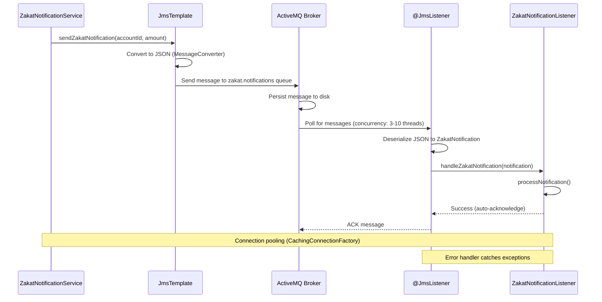

## Why JMS Messaging Matters

Production applications require asynchronous communication for decoupling services, handling workload spikes, and ensuring reliable message delivery. Manual JMS requires creating ConnectionFactory, Session, MessageProducer, and MessageConsumer for every operation—verbose, error-prone, and difficult to manage. In production systems processing thousands of zakat notification messages with guaranteed delivery, retry policies, and transaction support, Spring JMS's @JmsListener and JmsTemplate provide declarative message handling with automatic connection pooling, error recovery, and Spring transaction integration—eliminating manual resource management that causes connection leaks and message loss.

## Manual JMS Baseline

Manual JMS messaging requires explicit resource management and connection handling:

```java
import javax.jms.*;
import org.apache.activemq.ActiveMQConnectionFactory;
import java.util.Enumeration;

// => Manual JMS message sender
public class ManualJmsProducer {

    private ConnectionFactory connectionFactory;
    // => Connection: TCP connection to message broker
    // => Production: shared across application
    private Connection connection;

    public ManualJmsProducer(String brokerUrl) throws JMSException {
        // => Create connection factory: broker configuration
        // => ActiveMQ: popular open-source message broker
        this.connectionFactory = new ActiveMQConnectionFactory(brokerUrl);

        // => Create connection: TCP connection to broker
        // => PROBLEM: Must remember to close connection
        this.connection = connectionFactory.createConnection();

        // => Start connection: enables message delivery
        // => PROBLEM: Easy to forget start() call
        connection.start();
    }

    // => Send zakat notification message
    public void sendZakatNotification(String accountId, double amount) throws JMSException {
        // => Session: context for producing/consuming messages
        // => Session.AUTO_ACKNOWLEDGE: automatic message acknowledgment
        // => PROBLEM: Must create session for each operation
        Session session = connection.createSession(false, Session.AUTO_ACKNOWLEDGE);

        try {
            // => Destination: queue for messages
            // => Queue: point-to-point messaging (one consumer receives message)
            // => PROBLEM: String-based queue name, no type safety
            Destination destination = session.createQueue("zakat.notifications");

            // => MessageProducer: sends messages to destination
            // => PROBLEM: Must create producer for each operation
            MessageProducer producer = session.createProducer(destination);

            try {
                // => TextMessage: string-based message
                // => JMS: supports TextMessage, ObjectMessage, BytesMessage, MapMessage
                TextMessage message = session.createTextMessage();

                // => Set message body: JSON string
                // => PROBLEM: Manual JSON serialization
                String json = String.format(
                    "{\"accountId\":\"%s\",\"amount\":%.2f,\"type\":\"zakat_notification\"}",
                    accountId, amount
                );
                message.setText(json);

                // => Set message properties: metadata
                // => Used for message filtering and routing
                message.setStringProperty("accountId", accountId);
                message.setStringProperty("messageType", "zakat_notification");
                message.setLongProperty("timestamp", System.currentTimeMillis());

                // => Send message to queue
                // => Broker: persists message to disk for durability
                producer.send(message);

                // => PROBLEM: No error logging, hard to debug failures
                System.out.println("Message sent: " + accountId + " = " + amount);

            } finally {
                // => Close producer: release resources
                // => PROBLEM: Must remember to close in finally block
                producer.close();
            }

        } finally {
            // => Close session: release resources
            // => PROBLEM: Resource leak if forgot to close
            session.close();
        }
    }

    // => Close connection: release resources
    public void close() throws JMSException {
        // => PROBLEM: Application must remember to call close()
        // => Connection leak if forgot
        if (connection != null) {
            connection.close();
        }
    }
}

// => Manual JMS message consumer
public class ManualJmsConsumer {

    private ConnectionFactory connectionFactory;
    private Connection connection;
    // => MessageConsumer: receives messages from queue
    private MessageConsumer consumer;

    public ManualJmsConsumer(String brokerUrl, String queueName) throws JMSException {
        this.connectionFactory = new ActiveMQConnectionFactory(brokerUrl);
        this.connection = connectionFactory.createConnection();
        connection.start();

        // => Create session for consuming messages
        Session session = connection.createSession(false, Session.AUTO_ACKNOWLEDGE);

        // => Create destination
        Destination destination = session.createQueue(queueName);

        // => Create consumer: listens to queue
        // => PROBLEM: Manual threading for async consumption
        this.consumer = session.createConsumer(destination);
    }

    // => Synchronous message consumption
    // => PROBLEM: Blocks thread until message arrives
    public void receiveMessage() throws JMSException {
        // => Receive message: blocks until message available
        // => receive(timeout): blocks for max timeout ms
        Message message = consumer.receive(5000);

        if (message instanceof TextMessage) {
            TextMessage textMessage = (TextMessage) message;
            // => Extract message body
            String text = textMessage.getText();

            // => Extract message properties
            String accountId = textMessage.getStringProperty("accountId");
            String messageType = textMessage.getStringProperty("messageType");
            long timestamp = textMessage.getLongProperty("timestamp");

            // => Process message
            // => PROBLEM: No error handling, exceptions abort processing
            System.out.println("Received message:");
            System.out.println("  Account: " + accountId);
            System.out.println("  Type: " + messageType);
            System.out.println("  Timestamp: " + timestamp);
            System.out.println("  Body: " + text);

            // => PROBLEM: Manual JSON deserialization
            // => PROBLEM: No retry on failure
            // => PROBLEM: No dead letter queue for poison messages
            processZakatNotification(text);
        }
    }

    // => Asynchronous message consumption with MessageListener
    public void receiveAsync() throws JMSException {
        // => Set message listener: callback for messages
        // => PROBLEM: Manual error handling in callback
        consumer.setMessageListener(message -> {
            try {
                if (message instanceof TextMessage) {
                    TextMessage textMessage = (TextMessage) message;
                    String text = textMessage.getText();

                    // => Process message
                    processZakatNotification(text);
                }
            } catch (JMSException e) {
                // => PROBLEM: Exception handling scattered
                System.err.println("Error processing message: " + e.getMessage());
                // => PROBLEM: No retry, message lost
            }
        });
    }

    private void processZakatNotification(String json) {
        // => Business logic: process zakat notification
        System.out.println("Processing zakat notification: " + json);
    }

    public void close() throws JMSException {
        if (consumer != null) {
            consumer.close();
        }
        if (connection != null) {
            connection.close();
        }
    }
}

// => Usage: manual resource management
public class Application {

    public static void main(String[] args) {
        String brokerUrl = "tcp://localhost:61616";

        // => Send message
        ManualJmsProducer producer = null;
        try {
            producer = new ManualJmsProducer(brokerUrl);
            producer.sendZakatNotification("ACC001", 250.0);

        } catch (JMSException e) {
            System.err.println("Failed to send message: " + e.getMessage());
        } finally {
            // => PROBLEM: Easy to forget cleanup
            if (producer != null) {
                try {
                    producer.close();
                } catch (JMSException e) {
                    System.err.println("Failed to close producer: " + e.getMessage());
                }
            }
        }

        // => Receive message
        ManualJmsConsumer consumer = null;
        try {
            consumer = new ManualJmsConsumer(brokerUrl, "zakat.notifications");
            // => PROBLEM: Blocking call, ties up thread
            consumer.receiveMessage();

        } catch (JMSException e) {
            System.err.println("Failed to receive message: " + e.getMessage());
        } finally {
            if (consumer != null) {
                try {
                    consumer.close();
                } catch (JMSException e) {
                    System.err.println("Failed to close consumer: " + e.getMessage());
                }
            }
        }
    }
}
```

**Limitations:**

- **Manual resource management**: Must create/close Connection, Session, Producer, Consumer
- **No connection pooling**: Creates new resources for each operation
- **No error recovery**: Connection failures abort application
- **No retry logic**: Failed messages lost
- **No dead letter queue**: Poison messages block queue processing
- **Manual JSON serialization**: Verbose, error-prone string handling
- **No transaction integration**: Cannot coordinate JMS with database transactions
- **Blocking consumption**: Synchronous receive() blocks thread

## Spring JMS Solution

Spring JMS provides declarative messaging with automatic resource management:

### Configuration and JmsTemplate

```java
import org.springframework.context.annotation.*;
import org.springframework.jms.annotation.*;
import org.springframework.jms.config.*;
import org.springframework.jms.connection.CachingConnectionFactory;
import org.springframework.jms.core.JmsTemplate;
import org.springframework.jms.support.converter.*;
import org.apache.activemq.ActiveMQConnectionFactory;
import javax.jms.ConnectionFactory;

// => Spring JMS configuration
@Configuration
// => @EnableJms: activates @JmsListener annotation processing
@EnableJms
public class JmsConfig {

    // => ConnectionFactory bean: broker connection
    // => Spring: injects into JmsTemplate and listeners
    @Bean
    public ConnectionFactory connectionFactory() {
        // => ActiveMQ connection factory
        ActiveMQConnectionFactory factory = new ActiveMQConnectionFactory();
        factory.setBrokerURL("tcp://localhost:61616");
        // => Authentication
        factory.setUserName("admin");
        factory.setPassword("admin");

        // => Wrap with CachingConnectionFactory: connection pooling
        // => Reuses connections, sessions, producers/consumers
        // => BENEFIT: No manual resource management
        CachingConnectionFactory cachingFactory = new CachingConnectionFactory(factory);
        // => Session cache size: 10 sessions per connection
        cachingFactory.setSessionCacheSize(10);
        return cachingFactory;
    }

    // => JmsTemplate bean: simplifies message sending
    // => Spring: auto-manages connections and sessions
    @Bean
    public JmsTemplate jmsTemplate(ConnectionFactory connectionFactory) {
        JmsTemplate template = new JmsTemplate(connectionFactory);

        // => Message converter: automatic JSON serialization
        // => BENEFIT: No manual JSON handling
        template.setMessageConverter(messageConverter());

        // => Delivery mode: persistent (survives broker restart)
        template.setDeliveryPersistent(true);

        // => Time-to-live: 24 hours (messages expire after)
        template.setTimeToLive(86400000);

        return template;
    }

    // => Message converter bean: JSON serialization
    // => Spring: uses Jackson for automatic conversion
    @Bean
    public MessageConverter messageConverter() {
        // => MappingJackson2MessageConverter: JSON <-> Java objects
        MappingJackson2MessageConverter converter = new MappingJackson2MessageConverter();
        // => Type ID property: includes class name in message
        // => Enables polymorphic deserialization
        converter.setTypeIdPropertyName("_type");
        return converter;
    }

    // => JMS listener container factory: configures message listeners
    // => Spring: creates listeners from @JmsListener methods
    @Bean
    public DefaultJmsListenerContainerFactory jmsListenerContainerFactory(
            ConnectionFactory connectionFactory,
            MessageConverter messageConverter) {

        DefaultJmsListenerContainerFactory factory = new DefaultJmsListenerContainerFactory();

        // => Connection factory: reuses pooled connections
        factory.setConnectionFactory(connectionFactory);

        // => Message converter: automatic deserialization
        factory.setMessageConverter(messageConverter);

        // => Concurrency: 3-10 concurrent consumers per queue
        // => BENEFIT: Parallel message processing
        factory.setConcurrency("3-10");

        // => Error handler: centralized error handling
        factory.setErrorHandler(t -> {
            System.err.println("JMS Error: " + t.getMessage());
        });

        return factory;
    }
}
```

### Declarative Message Sending with JmsTemplate

```java
import org.springframework.jms.core.JmsTemplate;
import org.springframework.stereotype.Service;

// => Message DTO: simple Java object
// => Spring: auto-converts to JSON
public class ZakatNotification {
    private String accountId;
    private double amount;
    private String type;
    private long timestamp;

    public ZakatNotification() {}

    public ZakatNotification(String accountId, double amount) {
        this.accountId = accountId;
        this.amount = amount;
        this.type = "zakat_notification";
        this.timestamp = System.currentTimeMillis();
    }

    // => Getters and setters
    public String getAccountId() { return accountId; }
    public void setAccountId(String accountId) { this.accountId = accountId; }
    public double getAmount() { return amount; }
    public void setAmount(double amount) { this.amount = amount; }
    public String getType() { return type; }
    public void setType(String type) { this.type = type; }
    public long getTimestamp() { return timestamp; }
    public void setTimestamp(long timestamp) { this.timestamp = timestamp; }
}

// => JMS producer service
@Service
public class ZakatNotificationService {

    // => JmsTemplate: Spring-managed messaging operations
    // => BENEFIT: No manual connection/session management
    private final JmsTemplate jmsTemplate;

    public ZakatNotificationService(JmsTemplate jmsTemplate) {
        this.jmsTemplate = jmsTemplate;
    }

    // => Send message: one-liner, no resource management
    public void sendZakatNotification(String accountId, double amount) {
        // => Create notification object
        ZakatNotification notification = new ZakatNotification(accountId, amount);

        // => Send message: auto-converts to JSON, manages resources
        // => convertAndSend: uses MessageConverter for serialization
        // => BENEFIT: No try-catch-finally, no manual cleanup
        jmsTemplate.convertAndSend("zakat.notifications", notification);

        System.out.println("Zakat notification sent: " + accountId + " = " + amount);
    }

    // => Send with custom headers
    public void sendWithHeaders(String accountId, double amount, String priority) {
        ZakatNotification notification = new ZakatNotification(accountId, amount);

        // => convertAndSend with MessagePostProcessor: customize message
        jmsTemplate.convertAndSend("zakat.notifications", notification, message -> {
            // => Set custom properties
            message.setStringProperty("priority", priority);
            message.setStringProperty("source", "zakat-service");
            return message;
        });
    }

    // => Send to topic: pub-sub messaging
    // => Topic: multiple consumers receive same message
    public void broadcastZakatReport(String reportData) {
        // => setPubSubDomain(true): switch to topic mode
        jmsTemplate.setPubSubDomain(true);
        jmsTemplate.convertAndSend("zakat.reports", reportData);
        jmsTemplate.setPubSubDomain(false);  // Reset to queue mode
    }
}
```

### Declarative Message Receiving with @JmsListener

```java
import org.springframework.jms.annotation.JmsListener;
import org.springframework.messaging.handler.annotation.*;
import org.springframework.stereotype.Component;
import javax.jms.JMSException;
import javax.jms.Message;

// => JMS message consumer
@Component
public class ZakatNotificationListener {

    // => @JmsListener: declarative message consumption
    // => Spring: creates consumer, manages connections, threads
    // => destination: queue name
    // => BENEFIT: No manual consumer creation or thread management
    @JmsListener(destination = "zakat.notifications")
    public void handleZakatNotification(ZakatNotification notification) {
        // => Parameter: auto-deserialized from JSON
        // => BENEFIT: Type-safe message handling

        System.out.println("Received zakat notification:");
        System.out.println("  Account: " + notification.getAccountId());
        System.out.println("  Amount: " + notification.getAmount());
        System.out.println("  Timestamp: " + notification.getTimestamp());

        // => Process message: business logic
        processNotification(notification);

        // => BENEFIT: No manual acknowledgment (auto-acknowledge)
        // => BENEFIT: Exceptions trigger retry (with error handler)
    }

    // => Access message headers with @Header
    @JmsListener(destination = "zakat.notifications")
    public void handleWithHeaders(
            ZakatNotification notification,
            @Header("priority") String priority,
            @Header(value = "source", required = false) String source) {

        System.out.println("Priority: " + priority);
        System.out.println("Source: " + source);

        processNotification(notification);
    }

    // => Access raw JMS message
    @JmsListener(destination = "zakat.notifications")
    public void handleRawMessage(Message message) throws JMSException {
        // => Raw Message: access all JMS properties
        String accountId = message.getStringProperty("accountId");
        long timestamp = message.getLongProperty("timestamp");

        System.out.println("Raw message: " + accountId + " at " + timestamp);
    }

    // => Message selector: filter messages at broker
    // => Only receives messages matching selector
    @JmsListener(
        destination = "zakat.notifications",
        selector = "priority = 'HIGH'"
    )
    public void handleHighPriorityNotifications(ZakatNotification notification) {
        // => Only processes high-priority messages
        System.out.println("High priority notification: " + notification.getAccountId());
        processNotification(notification);
    }

    // => Concurrent consumers: parallel processing
    // => concurrency: 3-5 threads process messages in parallel
    @JmsListener(
        destination = "zakat.notifications",
        concurrency = "3-5"
    )
    public void handleConcurrent(ZakatNotification notification) {
        // => Multiple threads process messages simultaneously
        // => BENEFIT: Higher throughput
        processNotification(notification);
    }

    private void processNotification(ZakatNotification notification) {
        // => Business logic: send email, update database, etc.
        System.out.println("Processing notification for: " + notification.getAccountId());
    }
}
```

**Benefits:**

- **Automatic resource management**: No manual connection/session/producer/consumer handling
- **Connection pooling**: CachingConnectionFactory reuses connections
- **Automatic JSON conversion**: MappingJackson2MessageConverter handles serialization
- **Declarative consumers**: @JmsListener creates message listeners automatically
- **Concurrent processing**: Multiple threads process messages in parallel
- **Centralized error handling**: ErrorHandler receives all exceptions
- **Message selectors**: Broker-side filtering reduces network traffic
- **Transaction integration**: Coordinates JMS with Spring transactions

## JMS Message Flow Diagram



## Production Patterns

### Error Handling and Dead Letter Queue

```java
import org.springframework.jms.annotation.JmsListener;
import org.springframework.jms.core.JmsTemplate;
import org.springframework.stereotype.Component;

@Component
public class RobustMessageListener {

    private final JmsTemplate jmsTemplate;

    public RobustMessageListener(JmsTemplate jmsTemplate) {
        this.jmsTemplate = jmsTemplate;
    }

    // => Robust message handling with retry
    @JmsListener(destination = "zakat.notifications")
    public void handleWithRetry(ZakatNotification notification, Message message) throws JMSException {
        try {
            // => Business logic
            processNotification(notification);

        } catch (Exception e) {
            // => Check retry count
            int retryCount = message.getIntProperty("retryCount");

            if (retryCount < 3) {
                // => Retry: increment count and resend
                jmsTemplate.convertAndSend("zakat.notifications", notification, msg -> {
                    msg.setIntProperty("retryCount", retryCount + 1);
                    return msg;
                });
                System.out.println("Retry attempt " + (retryCount + 1) + " for " + notification.getAccountId());

            } else {
                // => Max retries exceeded: send to dead letter queue
                jmsTemplate.convertAndSend("zakat.notifications.dlq", notification, msg -> {
                    msg.setStringProperty("error", e.getMessage());
                    msg.setStringProperty("originalQueue", "zakat.notifications");
                    return msg;
                });
                System.err.println("Message sent to DLQ: " + notification.getAccountId());
            }
        }
    }

    private void processNotification(ZakatNotification notification) {
        // => Business logic
        System.out.println("Processing: " + notification.getAccountId());
    }
}
```

### Transaction Coordination with Database

```java
import org.springframework.jms.annotation.JmsListener;
import org.springframework.transaction.annotation.Transactional;
import org.springframework.stereotype.Service;

@Service
public class TransactionalMessageHandler {

    private final ZakatPaymentRepository paymentRepository;

    public TransactionalMessageHandler(ZakatPaymentRepository paymentRepository) {
        this.paymentRepository = paymentRepository;
    }

    // => @Transactional: coordinates JMS and database transactions
    // => If processPayment() fails, message NOT acknowledged (redelivered)
    // => If database commit fails, message NOT acknowledged
    @Transactional
    @JmsListener(destination = "zakat.payments")
    public void handlePayment(ZakatNotification notification) {
        // => Database operation: insert payment record
        ZakatPayment payment = new ZakatPayment();
        payment.setAccountId(notification.getAccountId());
        payment.setAmount(notification.getAmount());
        payment.setTimestamp(notification.getTimestamp());

        // => Save to database
        // => If exception thrown: database rollback AND JMS redelivery
        paymentRepository.save(payment);

        System.out.println("Payment recorded: " + notification.getAccountId());

        // => Both operations succeed or both fail (atomic)
    }
}
```

### Request-Reply Messaging Pattern

```java
import org.springframework.jms.core.JmsTemplate;
import org.springframework.stereotype.Service;

@Service
public class ZakatCalculationClient {

    private final JmsTemplate jmsTemplate;

    public ZakatCalculationClient(JmsTemplate jmsTemplate) {
        this.jmsTemplate = jmsTemplate;
    }

    // => Request-reply: send request, wait for response
    public double calculateZakat(String accountId, double nisab) {
        // => Create request object
        ZakatCalculationRequest request = new ZakatCalculationRequest(accountId, nisab);

        // => convertSendAndReceive: sends message, waits for reply
        // => Blocks until response received (timeout: 5 seconds default)
        ZakatCalculationResponse response = (ZakatCalculationResponse) jmsTemplate
            .convertSendAndReceive("zakat.calculations.requests", request);

        if (response != null) {
            return response.getZakatAmount();
        } else {
            throw new RuntimeException("No response received");
        }
    }
}

@Component
public class ZakatCalculationServer {

    // => Reply server: processes requests and sends responses
    @JmsListener(destination = "zakat.calculations.requests")
    @SendTo("zakat.calculations.responses")  // => Reply destination
    public ZakatCalculationResponse handleCalculationRequest(ZakatCalculationRequest request) {
        // => Business logic: calculate zakat
        double wealth = getAccountWealth(request.getAccountId());
        double zakatAmount = wealth >= request.getNisab() ? wealth * 0.025 : 0.0;

        // => Return response: Spring sends to reply destination
        return new ZakatCalculationResponse(request.getAccountId(), zakatAmount);
    }

    private double getAccountWealth(String accountId) {
        return 100000.0;  // Mock implementation
    }
}
```

## Trade-offs and When to Use

| Approach     | Setup Complexity | Resource Management | Error Handling | Transaction Support | Production Ready |
| ------------ | ---------------- | ------------------- | -------------- | ------------------- | ---------------- |
| Manual JMS   | High             | Manual              | Manual         | Manual              | No               |
| Spring JMS   | Low              | Automatic           | Declarative    | Integrated          | Yes              |
| Spring Kafka | Medium           | Automatic           | Declarative    | Limited             | Yes (streaming)  |

**When to Use Manual JMS:**

- Learning JMS fundamentals
- Simple proof-of-concept without Spring
- Educational purposes only

**When to Use Spring JMS:**

- **Production applications** (default choice)
- Traditional message queues (ActiveMQ, IBM MQ)
- Transaction coordination with databases
- Request-reply messaging patterns
- Point-to-point or pub-sub messaging

**When to Use Spring Kafka:**

- Event streaming (log aggregation, metrics)
- High-throughput messaging (>10K msg/sec)
- Event sourcing and CQRS patterns
- Message retention beyond consumption

## Best Practices

**1. Use Connection Pooling**

```java
@Bean
public ConnectionFactory connectionFactory() {
    ActiveMQConnectionFactory factory = new ActiveMQConnectionFactory("tcp://localhost:61616");
    // Wrap with CachingConnectionFactory: reuses connections
    CachingConnectionFactory cachingFactory = new CachingConnectionFactory(factory);
    cachingFactory.setSessionCacheSize(10);  // Cache 10 sessions
    return cachingFactory;
}
```

**2. Set Message TTL**

```java
@Bean
public JmsTemplate jmsTemplate(ConnectionFactory cf) {
    JmsTemplate template = new JmsTemplate(cf);
    template.setTimeToLive(86400000);  // 24 hours
    return template;
}
```

**3. Use Dead Letter Queue**

```java
@JmsListener(destination = "zakat.notifications")
public void handle(ZakatNotification notification) {
    try {
        process(notification);
    } catch (Exception e) {
        jmsTemplate.convertAndSend("zakat.notifications.dlq", notification);
    }
}
```

**4. Configure Concurrency**

```java
@JmsListener(destination = "zakat.notifications", concurrency = "3-10")
public void handle(ZakatNotification notification) {
    // 3-10 threads process messages in parallel
    process(notification);
}
```

**5. Use Message Selectors for Filtering**

```java
@JmsListener(
    destination = "zakat.notifications",
    selector = "priority = 'HIGH'"
)
public void handleHighPriority(ZakatNotification notification) {
    // Only receives high-priority messages
    process(notification);
}
```

## See Also

- [Async Processing](/en/learn/software-engineering/platforms/web/tools/jvm-spring/in-the-field/async-processing) - @Async and CompletableFuture for async operations
- [Events](/en/learn/software-engineering/platforms/web/tools/jvm-spring/in-the-field/events) - ApplicationEvent and @EventListener for in-process events
- [Scheduling](/en/learn/software-engineering/platforms/web/tools/jvm-spring/in-the-field/scheduling) - @Scheduled for periodic tasks
- [Transaction Management](/en/learn/software-engineering/platforms/web/tools/jvm-spring/in-the-field/transaction-management) - @Transactional for JMS-database coordination
- Spring Integration - Advanced messaging patterns and EIP
