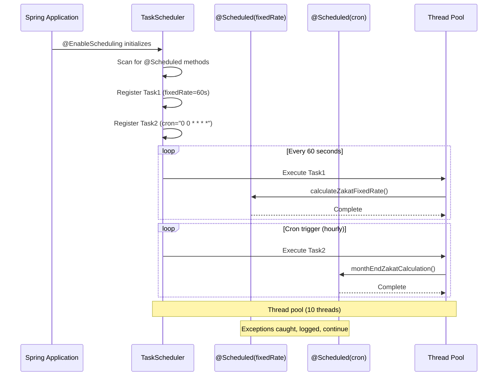

## Why Task Scheduling Matters

Production applications require periodic background tasks—calculating zakat at month end, generating reports, cleaning expired data, and health checks. Manual scheduling with java.util.Timer or ScheduledExecutorService requires explicit thread management, error handling, and no support for cron expressions or distributed coordination. In production systems running hundreds of scheduled zakat calculations with complex timing requirements (last day of Hijri month, business hours only, distributed across instances), Spring's @Scheduled annotation provides declarative scheduling with cron expressions, fixed-rate/fixed-delay semantics, and Quartz integration for distributed task coordination—eliminating manual thread pools and calendar calculations that cause duplicate executions and missed deadlines.

## Manual Timer/ScheduledExecutorService Baseline

Manual task scheduling requires explicit thread management and timing logic:

```java
import java.util.*;
import java.util.concurrent.*;
import java.time.*;

// => Manual scheduling with java.util.Timer
public class ManualTimerScheduler {

    // => Timer: simple task scheduling
    // => Single background thread: all tasks execute sequentially
    private final Timer timer = new Timer("ZakatScheduler", true);

    // => Schedule zakat calculation: fixed-rate execution
    public void scheduleZakatCalculation() {
        // => TimerTask: task to execute
        TimerTask task = new TimerTask() {
            @Override
            public void run() {
                // => Task logic
                System.out.println("Calculating zakat: " + LocalDateTime.now());
                calculateZakat();
                // => PROBLEM: Exception kills entire Timer
                // => All future tasks cancelled
            }
        };

        // => scheduleAtFixedRate: executes every period
        // => delay: 0 (start immediately)
        // => period: 86400000ms = 24 hours
        // => PROBLEM: No cron expressions (cannot specify "last day of month")
        // => PROBLEM: Fixed rate in milliseconds only (verbose)
        timer.scheduleAtFixedRate(task, 0, 86400000);
    }

    // => Schedule at specific time: manual date calculation
    public void scheduleAtEndOfMonth() {
        // => Calculate next end-of-month
        // => PROBLEM: Manual date arithmetic, error-prone
        LocalDateTime now = LocalDateTime.now();
        LocalDateTime endOfMonth = now.withDayOfMonth(now.toLocalDate().lengthOfMonth())
            .withHour(23)
            .withMinute(59)
            .withSecond(0);

        if (endOfMonth.isBefore(now)) {
            // => If end-of-month passed, schedule for next month
            endOfMonth = endOfMonth.plusMonths(1)
                .withDayOfMonth(endOfMonth.plusMonths(1).toLocalDate().lengthOfMonth());
        }

        // => Convert to Date: Timer uses legacy Date API
        // => PROBLEM: Date API verbose, deprecated
        Date endOfMonthDate = Date.from(endOfMonth.atZone(ZoneId.systemDefault()).toInstant());

        // => Schedule task
        TimerTask task = new TimerTask() {
            @Override
            public void run() {
                System.out.println("End-of-month zakat calculation: " + LocalDateTime.now());
                calculateMonthlyZakat();

                // => PROBLEM: Must manually reschedule for next month
                scheduleAtEndOfMonth();
            }
        };

        timer.schedule(task, endOfMonthDate);
        System.out.println("Scheduled monthly zakat calculation for: " + endOfMonth);
    }

    private void calculateZakat() {
        // => Business logic: calculate zakat
        System.out.println("Zakat calculation running...");
    }

    private void calculateMonthlyZakat() {
        // => Business logic: monthly calculation
        System.out.println("Monthly zakat calculation running...");
    }

    public void shutdown() {
        // => Cancel all tasks and terminate timer thread
        timer.cancel();
    }
}

// => Manual scheduling with ScheduledExecutorService
// => More robust than Timer: multiple threads, better error handling
public class ManualExecutorScheduler {

    // => ScheduledExecutorService: thread pool for scheduling
    // => 5 threads: tasks execute concurrently
    // => PROBLEM: Must manage thread pool lifecycle
    private final ScheduledExecutorService executor = Executors.newScheduledThreadPool(5);

    // => Schedule fixed-rate task
    public void scheduleFixedRate() {
        // => Runnable: task to execute
        Runnable task = () -> {
            try {
                System.out.println("Fixed-rate zakat calculation: " + LocalDateTime.now());
                calculateZakat();

            } catch (Exception e) {
                // => PROBLEM: Must catch exceptions manually
                // => Uncaught exceptions terminate task scheduling
                System.err.println("Task failed: " + e.getMessage());
            }
        };

        // => scheduleAtFixedRate: fixed-rate execution
        // => initialDelay: 0 (start immediately)
        // => period: 1 day
        // => TimeUnit.DAYS: more readable than milliseconds
        // => PROBLEM: Still no cron expressions
        executor.scheduleAtFixedRate(task, 0, 1, TimeUnit.DAYS);
    }

    // => Schedule fixed-delay task
    public void scheduleFixedDelay() {
        Runnable task = () -> {
            try {
                System.out.println("Fixed-delay report generation: " + LocalDateTime.now());
                generateReport();  // May take variable time

            } catch (Exception e) {
                System.err.println("Report generation failed: " + e.getMessage());
            }
        };

        // => scheduleWithFixedDelay: delay between executions
        // => Waits for task completion before scheduling next execution
        // => BENEFIT: Prevents overlapping executions
        // => 1 hour delay between task completion and next execution
        executor.scheduleWithFixedDelay(task, 0, 1, TimeUnit.HOURS);
    }

    // => Schedule one-time delayed task
    public void scheduleOnce() {
        Runnable task = () -> {
            System.out.println("One-time cleanup task: " + LocalDateTime.now());
            cleanupExpiredData();
        };

        // => schedule: executes once after delay
        // => 10 seconds delay
        executor.schedule(task, 10, TimeUnit.SECONDS);
    }

    private void calculateZakat() {
        System.out.println("Zakat calculation running...");
    }

    private void generateReport() {
        System.out.println("Generating zakat report (may take time)...");
        try {
            Thread.sleep(5000);  // Simulate long-running task
        } catch (InterruptedException e) {
            Thread.currentThread().interrupt();
        }
    }

    private void cleanupExpiredData() {
        System.out.println("Cleaning up expired data...");
    }

    public void shutdown() {
        // => Shutdown executor: reject new tasks, complete existing tasks
        executor.shutdown();

        try {
            // => Wait for tasks to complete (30 seconds timeout)
            if (!executor.awaitTermination(30, TimeUnit.SECONDS)) {
                // => Force shutdown if tasks don't complete
                executor.shutdownNow();
            }
        } catch (InterruptedException e) {
            executor.shutdownNow();
            Thread.currentThread().interrupt();
        }
    }
}

// => Usage: manual lifecycle management
public class Application {

    public static void main(String[] args) {
        // => Timer-based scheduler
        ManualTimerScheduler timerScheduler = new ManualTimerScheduler();
        timerScheduler.scheduleZakatCalculation();
        timerScheduler.scheduleAtEndOfMonth();

        // => Executor-based scheduler
        ManualExecutorScheduler executorScheduler = new ManualExecutorScheduler();
        executorScheduler.scheduleFixedRate();
        executorScheduler.scheduleFixedDelay();
        executorScheduler.scheduleOnce();

        // => PROBLEM: Must manually register shutdown hooks
        Runtime.getRuntime().addShutdownHook(new Thread(() -> {
            timerScheduler.shutdown();
            executorScheduler.shutdown();
        }));
    }
}
```

**Limitations:**

- **No cron expressions**: Cannot specify "last day of month" or "Monday-Friday 9-5"
- **Manual date arithmetic**: Complex calendar calculations error-prone
- **Manual thread pool management**: Must create/shutdown executor service
- **Manual error handling**: Exceptions can terminate scheduling
- **No Spring integration**: Cannot inject dependencies into tasks
- **No distributed coordination**: Multiple instances run duplicate tasks
- **Legacy Date API**: Timer uses java.util.Date (verbose, deprecated)

## Spring @Scheduled Solution

Spring provides declarative task scheduling with @Scheduled annotation:

### Configuration and Simple Scheduling

```java
import org.springframework.context.annotation.*;
import org.springframework.scheduling.annotation.*;
import org.springframework.scheduling.concurrent.ThreadPoolTaskScheduler;

// => Spring scheduling configuration
@Configuration
// => @EnableScheduling: activates @Scheduled annotation processing
// => Spring: creates TaskScheduler and scans for @Scheduled methods
@EnableScheduling
public class SchedulingConfig {

    // => TaskScheduler bean: thread pool for scheduled tasks
    // => Optional: Spring creates default if not provided
    @Bean
    public ThreadPoolTaskScheduler taskScheduler() {
        ThreadPoolTaskScheduler scheduler = new ThreadPoolTaskScheduler();

        // => Pool size: 10 concurrent tasks
        scheduler.setPoolSize(10);

        // => Thread name prefix: for debugging
        scheduler.setThreadNamePrefix("zakat-scheduler-");

        // => Wait for tasks on shutdown: graceful termination
        scheduler.setWaitForTasksToCompleteOnShutdown(true);

        // => Await termination: max 60 seconds
        scheduler.setAwaitTerminationSeconds(60);

        return scheduler;
    }
}
```

### Fixed-Rate and Fixed-Delay Scheduling

```java
import org.springframework.scheduling.annotation.Scheduled;
import org.springframework.stereotype.Component;
import java.time.LocalDateTime;

// => Scheduled task component
// => Spring: automatically detects @Scheduled methods
@Component
public class ZakatScheduledTasks {

    // => @Scheduled: declarative scheduling
    // => fixedRate: executes every N milliseconds
    // => Starts next execution exactly N ms after previous start
    // => BENEFIT: No manual thread pool management
    @Scheduled(fixedRate = 60000)  // 60 seconds = 1 minute
    public void calculateZakatFixedRate() {
        System.out.println("Fixed-rate zakat calculation: " + LocalDateTime.now());
        // => Business logic
        performZakatCalculation();

        // => BENEFIT: Exceptions don't terminate scheduling
        // => Spring: catches exceptions, logs, continues scheduling
    }

    // => fixedDelay: delay between executions
    // => Waits N ms after task completion before next execution
    // => BENEFIT: Prevents overlapping executions
    @Scheduled(fixedDelay = 60000)  // 60 seconds after completion
    public void generateReportFixedDelay() {
        System.out.println("Fixed-delay report generation: " + LocalDateTime.now());
        // => Task may take variable time
        generateZakatReport();
        // => Next execution starts 60 seconds after this method returns
    }

    // => initialDelay: delay before first execution
    // => Prevents immediate execution on application startup
    @Scheduled(initialDelay = 10000, fixedRate = 60000)
    public void delayedStart() {
        System.out.println("Delayed start task: " + LocalDateTime.now());
        // => First execution: 10 seconds after startup
        // => Subsequent executions: every 60 seconds
        performDelayedTask();
    }

    // => fixedRateString: supports property placeholders
    // => ${zakat.calculation.interval}: reads from application.properties
    // => BENEFIT: Externalized configuration
    @Scheduled(fixedRateString = "${zakat.calculation.interval:60000}")
    public void configurableRate() {
        System.out.println("Configurable-rate task: " + LocalDateTime.now());
        performZakatCalculation();
    }

    private void performZakatCalculation() {
        System.out.println("Calculating zakat...");
    }

    private void generateZakatReport() {
        System.out.println("Generating report...");
        try {
            Thread.sleep(5000);  // Simulate long-running task
        } catch (InterruptedException e) {
            Thread.currentThread().interrupt();
        }
    }

    private void performDelayedTask() {
        System.out.println("Performing delayed task...");
    }
}
```

### Cron Expression Scheduling

```java
import org.springframework.scheduling.annotation.Scheduled;
import org.springframework.stereotype.Component;

@Component
public class CronScheduledTasks {

    // => cron: cron expression scheduling
    // => Format: second minute hour day-of-month month day-of-week
    // => "0 0 0 * * *": every day at midnight
    // => BENEFIT: Complex schedules in one expression
    @Scheduled(cron = "0 0 0 * * *")
    public void calculateDailyZakat() {
        System.out.println("Daily zakat calculation (midnight): " + LocalDateTime.now());
        performDailyCalculation();
    }

    // => "0 0 9 * * MON-FRI": every weekday at 9 AM
    // => BENEFIT: Business hours scheduling built-in
    @Scheduled(cron = "0 0 9 * * MON-FRI")
    public void weekdayMorningReport() {
        System.out.println("Weekday morning report: " + LocalDateTime.now());
        generateMorningReport();
    }

    // => "0 0 23 L * *": last day of month at 11 PM
    // => L: last day of month
    // => BENEFIT: No manual date arithmetic
    @Scheduled(cron = "0 0 23 L * *")
    public void monthEndZakatCalculation() {
        System.out.println("Month-end zakat calculation: " + LocalDateTime.now());
        performMonthEndCalculation();
    }

    // => "0 0 0 1 * *": first day of month at midnight
    @Scheduled(cron = "0 0 0 1 * *")
    public void monthlyReport() {
        System.out.println("Monthly zakat report: " + LocalDateTime.now());
        generateMonthlyReport();
    }

    // => "0 */15 * * * *": every 15 minutes
    // => */15: every 15th value
    @Scheduled(cron = "0 */15 * * * *")
    public void quarterHourlyHealthCheck() {
        System.out.println("Health check: " + LocalDateTime.now());
        performHealthCheck();
    }

    // => cron with timezone
    // => zone: specifies timezone for cron expression
    // => BENEFIT: Consistent scheduling across distributed instances
    @Scheduled(cron = "0 0 0 * * *", zone = "Asia/Jakarta")
    public void timezoneAwareTask() {
        System.out.println("Timezone-aware task (Jakarta): " + LocalDateTime.now());
        performTimezoneTask();
    }

    // => cron with property placeholder
    // => Externalized cron expression
    @Scheduled(cron = "${zakat.calculation.cron:0 0 0 * * *}")
    public void configurableCronTask() {
        System.out.println("Configurable cron task: " + LocalDateTime.now());
        performConfigurableTask();
    }

    private void performDailyCalculation() {
        System.out.println("Daily calculation running...");
    }

    private void generateMorningReport() {
        System.out.println("Morning report generating...");
    }

    private void performMonthEndCalculation() {
        System.out.println("Month-end calculation running...");
    }

    private void generateMonthlyReport() {
        System.out.println("Monthly report generating...");
    }

    private void performHealthCheck() {
        System.out.println("Health check running...");
    }

    private void performTimezoneTask() {
        System.out.println("Timezone task running...");
    }

    private void performConfigurableTask() {
        System.out.println("Configurable task running...");
    }
}
```

**Benefits:**

- **Declarative scheduling**: @Scheduled annotation, no manual thread management
- **Cron expressions**: Complex schedules in readable format
- **Property placeholders**: Externalized configuration
- **Automatic error handling**: Exceptions don't terminate scheduling
- **Spring integration**: Inject dependencies into scheduled methods
- **Timezone support**: Consistent scheduling across distributed instances
- **Graceful shutdown**: Waits for tasks to complete

## Scheduling Execution Model Diagram



## Production Patterns

### Distributed Scheduling with Quartz

```java
import org.springframework.context.annotation.*;
import org.springframework.scheduling.quartz.*;
import org.quartz.*;

// => Quartz configuration for distributed scheduling
// => Quartz: persists job state to database
// => Multiple instances coordinate to avoid duplicate execution
@Configuration
public class QuartzConfig {

    // => JobDetail: defines job to execute
    // => JobDetail persisted to database
    @Bean
    public JobDetail zakatCalculationJobDetail() {
        // => JobDataMap: pass parameters to job
        JobDataMap jobDataMap = new JobDataMap();
        jobDataMap.put("zakatService", "zakatCalculationService");

        return JobBuilder.newJob(ZakatCalculationJob.class)
            .withIdentity("zakatCalculationJob")
            .withDescription("Monthly zakat calculation")
            .usingJobData(jobDataMap)
            // => storeDurably: persist job even if no triggers
            .storeDurably()
            .build();
    }

    // => Trigger: defines when job executes
    // => CronTrigger: uses cron expression
    @Bean
    public Trigger zakatCalculationTrigger(JobDetail zakatCalculationJobDetail) {
        // => Last day of month at 11 PM
        return TriggerBuilder.newTrigger()
            .forJob(zakatCalculationJobDetail)
            .withIdentity("zakatCalculationTrigger")
            .withDescription("Last day of month trigger")
            .withSchedule(
                CronScheduleBuilder.cronSchedule("0 0 23 L * ?")
                    .inTimeZone(java.util.TimeZone.getTimeZone("Asia/Jakarta"))
            )
            .build();
    }

    // => Quartz Job implementation
    // => Job: executed by Quartz scheduler
    public static class ZakatCalculationJob implements Job {

        @Override
        public void execute(JobExecutionContext context) throws JobExecutionException {
            // => Get job data
            JobDataMap dataMap = context.getJobDetail().getJobDataMap();
            String serviceName = dataMap.getString("zakatService");

            System.out.println("Quartz job executing: " + serviceName);
            System.out.println("Fire time: " + context.getFireTime());
            System.out.println("Scheduled fire time: " + context.getScheduledFireTime());

            // => Business logic
            // => Get Spring beans from ApplicationContext
            // => Quartz: integrates with Spring for dependency injection
            performZakatCalculation();
        }

        private void performZakatCalculation() {
            System.out.println("Calculating zakat (Quartz)...");
        }
    }
}
```

### Conditional Scheduling with @Conditional

```java
import org.springframework.boot.autoconfigure.condition.*;
import org.springframework.context.annotation.Conditional;
import org.springframework.scheduling.annotation.Scheduled;
import org.springframework.stereotype.Component;

// => Conditional scheduling: only enable on specific profiles
@Component
// => @ConditionalOnProperty: enable based on property
// => scheduled.tasks.enabled=true: activates scheduling
@ConditionalOnProperty(name = "scheduled.tasks.enabled", havingValue = "true")
public class ConditionalScheduledTasks {

    @Scheduled(cron = "0 0 0 * * *")
    public void conditionalTask() {
        System.out.println("Conditional task executing...");
        // => Only runs if scheduled.tasks.enabled=true
    }
}

// => Profile-based scheduling
@Component
// => @Profile: only active on production profile
@Profile("production")
public class ProductionOnlyTasks {

    @Scheduled(cron = "0 0 0 * * *")
    public void productionTask() {
        System.out.println("Production-only task executing...");
        // => Only runs on production environment
    }
}
```

### Scheduled Task Monitoring

```java
import org.springframework.scheduling.annotation.Scheduled;
import org.springframework.stereotype.Component;
import io.micrometer.core.instrument.*;
import org.slf4j.*;

@Component
public class MonitoredScheduledTasks {

    private static final Logger logger = LoggerFactory.getLogger(MonitoredScheduledTasks.class);

    private final MeterRegistry meterRegistry;
    private final Counter taskExecutionCounter;
    private final Timer taskExecutionTimer;

    public MonitoredScheduledTasks(MeterRegistry meterRegistry) {
        this.meterRegistry = meterRegistry;

        // => Counter: tracks task execution count
        this.taskExecutionCounter = Counter.builder("scheduled.task.executions")
            .tag("task", "zakatCalculation")
            .register(meterRegistry);

        // => Timer: tracks task execution duration
        this.taskExecutionTimer = Timer.builder("scheduled.task.duration")
            .tag("task", "zakatCalculation")
            .register(meterRegistry);
    }

    @Scheduled(cron = "0 0 0 * * *")
    public void monitoredZakatCalculation() {
        // => Record task execution
        taskExecutionCounter.increment();

        // => Measure execution duration
        taskExecutionTimer.record(() -> {
            try {
                logger.info("Starting zakat calculation");
                performZakatCalculation();
                logger.info("Zakat calculation completed successfully");

            } catch (Exception e) {
                logger.error("Zakat calculation failed", e);
                // => Increment error counter
                meterRegistry.counter("scheduled.task.errors",
                    "task", "zakatCalculation",
                    "error", e.getClass().getSimpleName()
                ).increment();
                throw e;
            }
        });
    }

    private void performZakatCalculation() {
        System.out.println("Calculating zakat with monitoring...");
    }
}
```

### Dynamic Task Scheduling

```java
import org.springframework.scheduling.TaskScheduler;
import org.springframework.scheduling.support.CronTrigger;
import org.springframework.stereotype.Service;
import java.time.Instant;
import java.util.concurrent.ScheduledFuture;

@Service
public class DynamicSchedulingService {

    private final TaskScheduler taskScheduler;
    // => ScheduledFuture: reference to scheduled task
    // => Used to cancel task
    private ScheduledFuture<?> scheduledTask;

    public DynamicSchedulingService(TaskScheduler taskScheduler) {
        this.taskScheduler = taskScheduler;
    }

    // => Schedule task programmatically
    public void scheduleTask(String cronExpression) {
        // => Cancel existing task
        if (scheduledTask != null && !scheduledTask.isCancelled()) {
            scheduledTask.cancel(false);
        }

        // => Create new cron trigger
        CronTrigger trigger = new CronTrigger(cronExpression);

        // => Schedule task with trigger
        scheduledTask = taskScheduler.schedule(
            this::performDynamicTask,
            trigger
        );

        System.out.println("Task scheduled with cron: " + cronExpression);
    }

    // => Schedule one-time task
    public void scheduleOnce(long delaySeconds) {
        Instant startTime = Instant.now().plusSeconds(delaySeconds);

        taskScheduler.schedule(
            this::performOneTimeTask,
            startTime
        );

        System.out.println("One-time task scheduled for: " + startTime);
    }

    private void performDynamicTask() {
        System.out.println("Dynamic task executing...");
    }

    private void performOneTimeTask() {
        System.out.println("One-time task executing...");
    }
}
```

## Trade-offs and When to Use

| Approach                     | Cron Support | Distributed | Spring Integration | Setup Complexity | Production Ready |
| ---------------------------- | ------------ | ----------- | ------------------ | ---------------- | ---------------- |
| java.util.Timer              | No           | No          | None               | Low              | No               |
| ScheduledExecutorService     | No           | No          | None               | Low              | Limited          |
| Spring @Scheduled            | Yes          | No          | Full               | Low              | Yes              |
| Spring @Scheduled + Quartz   | Yes          | Yes         | Full               | Medium           | Yes (enterprise) |
| Spring @Scheduled + ShedLock | Yes          | Yes         | Full               | Low              | Yes (simple)     |

**When to Use java.util.Timer:**

- Learning scheduling fundamentals
- Simple proof-of-concept
- Educational purposes only

**When to Use ScheduledExecutorService:**

- No Spring dependency
- Simple fixed-rate/fixed-delay tasks
- No cron expression requirement

**When to Use Spring @Scheduled:**

- **Production applications** (default choice)
- Cron expression scheduling required
- Single instance deployment
- Spring-managed application

**When to Use Spring @Scheduled + Quartz:**

- **Distributed deployment** (multiple instances)
- Complex job orchestration
- Job persistence required
- Clustered scheduling coordination

**When to Use Spring @Scheduled + ShedLock:**

- Distributed deployment (simpler than Quartz)
- Prevent duplicate execution across instances
- No complex job orchestration

## Best Practices

**1. Use Cron Expressions for Complex Schedules**

```java
// ✅ Readable cron expression
@Scheduled(cron = "0 0 23 L * *")  // Last day of month at 11 PM
public void monthEnd() {}

// ❌ Manual date arithmetic
@Scheduled(fixedRate = 86400000)
public void daily() {
    if (isLastDayOfMonth()) {  // Complex logic
        // ...
    }
}
```

**2. Externalize Configuration**

```java
// application.properties
// zakat.calculation.cron=0 0 0 * * *

@Scheduled(cron = "${zakat.calculation.cron}")
public void configurable() {
    // Cron expression configurable per environment
}
```

**3. Use Fixed Delay for Variable-Duration Tasks**

```java
// ✅ Fixed delay: waits for task completion
@Scheduled(fixedDelay = 60000)
public void variableDuration() {
    // Task may take 5-10 seconds
}

// ❌ Fixed rate: may cause overlapping executions
@Scheduled(fixedRate = 60000)
public void variableDuration() {
    // Risk: next execution starts before previous completes
}
```

**4. Add Initial Delay to Prevent Startup Load**

```java
@Scheduled(initialDelay = 30000, fixedRate = 60000)
public void delayedStart() {
    // Waits 30 seconds after startup before first execution
}
```

**5. Monitor Scheduled Tasks**

```java
@Scheduled(cron = "0 0 0 * * *")
public void monitored() {
    try {
        logger.info("Task starting");
        perform();
        logger.info("Task completed");
    } catch (Exception e) {
        logger.error("Task failed", e);
        throw e;
    }
}
```

## See Also

- [Async Processing](/en/learn/software-engineering/platforms/web/tools/jvm-spring/in-the-field/async-processing) - @Async for asynchronous method execution
- [Events](/en/learn/software-engineering/platforms/web/tools/jvm-spring/in-the-field/events) - ApplicationEvent for event-driven architecture
- [Messaging](/en/learn/software-engineering/platforms/web/tools/jvm-spring/in-the-field/messaging) - JMS for asynchronous messaging
- [Transaction Management](/en/learn/software-engineering/platforms/web/tools/jvm-spring/in-the-field/transaction-management) - @Transactional for scheduled task transactions
- [Configuration](/en/learn/software-engineering/platforms/web/tools/jvm-spring/in-the-field/configuration) - Externalized scheduling configuration
