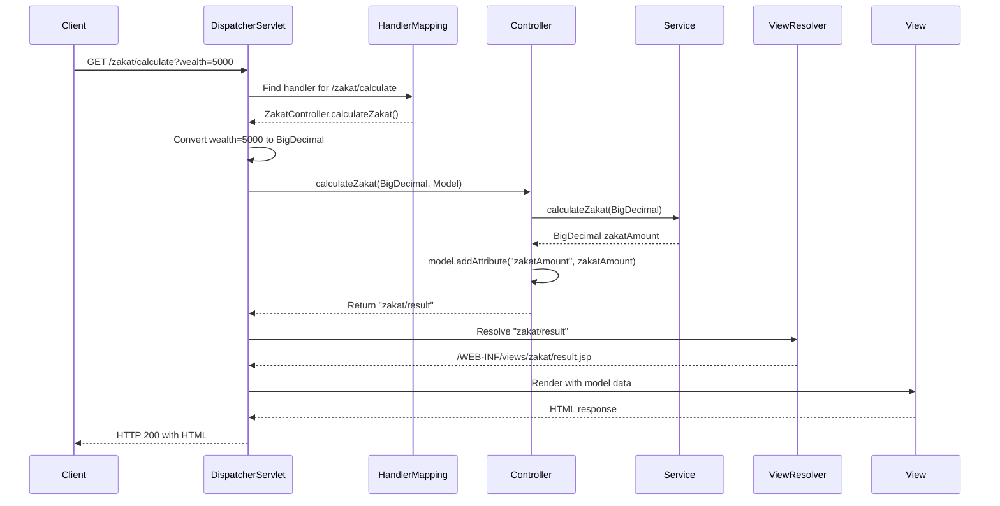

## Why Spring MVC Matters

Web applications require request routing, parameter binding, view rendering, and response handling. Raw Servlet API requires verbose setup for each endpoint with manual request parsing and response writing. In production web applications serving thousands of concurrent requests, Spring MVC eliminates boilerplate through annotations while providing sophisticated features like model binding, view resolution, and type-safe parameter extraction.

## Servlet API Baseline

Manual servlet programming requires explicit configuration and request handling:

```java
import jakarta.servlet.http.*;
import jakarta.servlet.ServletException;
import java.io.IOException;
import java.io.PrintWriter;

// => Zakat calculation servlet: manual request/response handling
public class ZakatCalculationServlet extends HttpServlet {

    // => doGet(): handles HTTP GET requests
    // => HttpServletRequest: contains request data (parameters, headers, session)
    // => HttpServletResponse: writes response (status, headers, body)
    @Override
    protected void doGet(HttpServletRequest request, HttpServletResponse response)
            throws ServletException, IOException {

        // => Manual parameter extraction: returns String or null
        String wealthParam = request.getParameter("wealth");
        // => No type safety: must manually parse and validate
        // => No validation: null check required, NumberFormatException possible

        // => Manual validation: check for missing parameters
        if (wealthParam == null || wealthParam.isEmpty()) {
            // => Manual error response: set status code and write message
            response.setStatus(HttpServletResponse.SC_BAD_REQUEST);
            // => Must set content type manually
            response.setContentType("text/plain");
            PrintWriter out = response.getWriter();
            out.println("Missing required parameter: wealth");
            return;
        }

        try {
            // => Manual parsing: String to BigDecimal
            // => NumberFormatException if invalid format
            BigDecimal wealth = new BigDecimal(wealthParam);

            // => Business logic: calculate zakat (2.5%)
            BigDecimal nisab = new BigDecimal("3000");  // => Minimum threshold
            // => Check if wealth exceeds nisab
            if (wealth.compareTo(nisab) < 0) {
                // => Below threshold: no zakat due
                response.setStatus(HttpServletResponse.SC_OK);
                response.setContentType("text/html");
                PrintWriter out = response.getWriter();
                out.println("<html><body>");
                out.println("<h1>Zakat Calculation</h1>");
                out.println("<p>Wealth below nisab threshold. No zakat due.</p>");
                out.println("</body></html>");
                return;
            }

            // => Calculate zakat: 2.5% of wealth
            BigDecimal zakatRate = new BigDecimal("0.025");
            BigDecimal zakatAmount = wealth.multiply(zakatRate);

            // => Manual response writing: set content type and write HTML
            response.setStatus(HttpServletResponse.SC_OK);
            response.setContentType("text/html; charset=UTF-8");
            PrintWriter out = response.getWriter();
            // => Manual HTML construction: prone to XSS vulnerabilities
            out.println("<html><body>");
            out.println("<h1>Zakat Calculation</h1>");
            out.println("<p>Wealth: $" + wealth + "</p>");
            out.println("<p>Zakat Due (2.5%): $" + zakatAmount + "</p>");
            out.println("</body></html>");

        } catch (NumberFormatException e) {
            // => Manual exception handling: return error response
            response.setStatus(HttpServletResponse.SC_BAD_REQUEST);
            response.setContentType("text/plain");
            PrintWriter out = response.getWriter();
            out.println("Invalid wealth parameter: must be numeric");
        }
    }

    // => doPost(): handles HTTP POST requests
    @Override
    protected void doPost(HttpServletRequest request, HttpServletResponse response)
            throws ServletException, IOException {

        // => Manual parameter extraction from POST body
        String accountId = request.getParameter("accountId");
        String wealthParam = request.getParameter("wealth");

        // => Manual validation for multiple parameters
        if (accountId == null || accountId.isEmpty()) {
            response.setStatus(HttpServletResponse.SC_BAD_REQUEST);
            response.setContentType("text/plain");
            response.getWriter().println("Missing required parameter: accountId");
            return;
        }

        if (wealthParam == null || wealthParam.isEmpty()) {
            response.setStatus(HttpServletResponse.SC_BAD_REQUEST);
            response.setContentType("text/plain");
            response.getWriter().println("Missing required parameter: wealth");
            return;
        }

        try {
            BigDecimal wealth = new BigDecimal(wealthParam);

            // => Business logic: save calculation result
            BigDecimal zakatAmount = wealth.multiply(new BigDecimal("0.025"));
            // => Manual database interaction (not shown)
            // zakatRepository.save(accountId, wealth, zakatAmount);

            // => Manual redirect: 302 status with Location header
            response.setStatus(HttpServletResponse.SC_FOUND);
            response.setHeader("Location", "/zakat/result?accountId=" + accountId);

        } catch (NumberFormatException e) {
            response.setStatus(HttpServletResponse.SC_BAD_REQUEST);
            response.setContentType("text/plain");
            response.getWriter().println("Invalid wealth parameter: must be numeric");
        }
    }
}

// => web.xml configuration: manual servlet registration
// <servlet>
//     <servlet-name>zakatCalculation</servlet-name>
//     <servlet-class>com.example.ZakatCalculationServlet</servlet-class>
// </servlet>
// <servlet-mapping>
//     <servlet-name>zakatCalculation</servlet-name>
//     <url-pattern>/zakat/calculate</url-pattern>
// </servlet-mapping>
```

**Limitations:**

- **Boilerplate**: 60+ lines to handle one endpoint with two HTTP methods
- **No type safety**: Manual String parsing, no automatic conversion
- **Manual validation**: Must check every parameter for null/empty
- **Verbose error handling**: Repetitive status code and response writing
- **No view abstraction**: HTML embedded in Java code (XSS risk)
- **XML configuration**: Must declare every servlet in web.xml

## Spring MVC Solution

Spring MVC eliminates boilerplate with annotations and automatic binding:

```java
import org.springframework.stereotype.Controller;
import org.springframework.ui.Model;
import org.springframework.web.bind.annotation.*;
import org.springframework.validation.BindingResult;
import jakarta.validation.Valid;
import java.math.BigDecimal;

// => Controller: Spring MVC request handler
@Controller  // => Marks class as Spring MVC controller
@RequestMapping("/zakat")  // => Base URL: all methods prefixed with /zakat
public class ZakatController {

    private final ZakatService zakatService;

    // => Constructor injection: Spring provides service
    public ZakatController(ZakatService zakatService) {
        this.zakatService = zakatService;
    }

    // => @GetMapping: handles GET requests to /zakat/calculate
    // => @RequestParam: automatic parameter extraction and type conversion
    @GetMapping("/calculate")  // => GET /zakat/calculate
    public String calculateZakat(
            // => @RequestParam: extracts "wealth" query parameter
            // => BigDecimal: automatic String to BigDecimal conversion
            // => required=true (default): returns 400 if missing
            @RequestParam BigDecimal wealth,
            // => Model: container for view data
            Model model) {

        // => Business logic: calculate zakat
        BigDecimal nisab = new BigDecimal("3000");
        // => Add data to model: available in view template
        model.addAttribute("wealth", wealth);

        if (wealth.compareTo(nisab) < 0) {
            // => Below threshold
            model.addAttribute("message", "Wealth below nisab threshold. No zakat due.");
            // => Return view name: Spring resolves to /WEB-INF/views/zakat/result.jsp
            // => ViewResolver maps logical view name to template
            return "zakat/result";
        }

        // => Calculate zakat: delegate to service layer
        BigDecimal zakatAmount = zakatService.calculateZakat(wealth);
        // => Add to model: both values available in view
        model.addAttribute("zakatAmount", zakatAmount);

        // => Return view name: DispatcherServlet renders view with model data
        return "zakat/result";
    }

    // => @PostMapping: handles POST requests
    // => @Valid: triggers Bean Validation on request object
    @PostMapping("/submit")  // => POST /zakat/submit
    public String submitZakat(
            // => @Valid: validates ZakatRequest object before method execution
            // => @ModelAttribute: binds form parameters to object
            @Valid @ModelAttribute ZakatRequest request,
            // => BindingResult: contains validation errors
            BindingResult bindingResult,
            Model model) {

        // => Check validation errors: triggered by @Valid
        if (bindingResult.hasErrors()) {
            // => Has errors: re-display form with error messages
            // => BindingResult contains field errors for display
            return "zakat/form";
        }

        // => No errors: process request
        BigDecimal zakatAmount = zakatService.calculateAndSave(
            request.getAccountId(),
            request.getWealth()
        );

        // => Add result to model
        model.addAttribute("accountId", request.getAccountId());
        model.addAttribute("zakatAmount", zakatAmount);

        // => Return view name
        return "zakat/confirmation";
    }

    // => @GetMapping with path variable: /zakat/account/ACC123
    @GetMapping("/account/{accountId}")  // => {accountId}: path variable placeholder
    public String getAccountZakat(
            // => @PathVariable: extracts value from URL path
            // => accountId: extracted from {accountId} placeholder
            @PathVariable String accountId,
            Model model) {

        // => Service call: retrieve zakat history
        List<ZakatRecord> records = zakatService.getAccountHistory(accountId);
        model.addAttribute("accountId", accountId);
        model.addAttribute("records", records);

        // => Return view name: renders list
        return "zakat/history";
    }

    // => Exception handler: handles exceptions thrown by controller methods
    @ExceptionHandler(InsufficientWealthException.class)
    // => Handles InsufficientWealthException: returns error view
    public String handleInsufficientWealth(InsufficientWealthException ex, Model model) {
        // => Exception handling: add error message to model
        model.addAttribute("error", ex.getMessage());
        // => Return error view
        return "zakat/error";
    }
}

// => Request object: binds form parameters
// => Bean Validation annotations: automatic validation
public class ZakatRequest {

    // => @NotBlank: must not be null, empty, or whitespace
    @NotBlank(message = "Account ID is required")
    private String accountId;

    // => @NotNull: must not be null
    // => @DecimalMin: must be >= 0
    @NotNull(message = "Wealth is required")
    @DecimalMin(value = "0", message = "Wealth must be non-negative")
    private BigDecimal wealth;

    // => Getters/setters: Spring binds parameters via setters
    public String getAccountId() { return accountId; }
    public void setAccountId(String accountId) { this.accountId = accountId; }
    public BigDecimal getWealth() { return wealth; }
    public void setWealth(BigDecimal wealth) { this.wealth = wealth; }
}

// => Configuration: enables Spring MVC
@Configuration
@EnableWebMvc  // => Enables Spring MVC features (DispatcherServlet, ViewResolver)
public class WebConfig {

    // => ViewResolver: maps logical view names to JSP templates
    @Bean
    public ViewResolver viewResolver() {
        // => InternalResourceViewResolver: resolves JSP views
        InternalResourceViewResolver resolver = new InternalResourceViewResolver();
        resolver.setPrefix("/WEB-INF/views/");  // => Prefix: view folder
        resolver.setSuffix(".jsp");  // => Suffix: file extension
        // => "zakat/result" → /WEB-INF/views/zakat/result.jsp
        return resolver;
    }
}
```

**Benefits:**

- **90% less code**: 10 lines per endpoint vs 60+ lines
- **Type safety**: Automatic parameter conversion (String to BigDecimal)
- **Automatic validation**: @Valid triggers Bean Validation
- **Model abstraction**: Separation of data and view
- **ViewResolver**: Logical view names instead of hardcoded paths
- **Annotation-based**: No XML configuration needed

## Request Lifecycle with DispatcherServlet

Spring MVC uses DispatcherServlet as front controller:



## Production Patterns

### Content Negotiation for JSON and HTML

```java
@Controller
@RequestMapping("/api/zakat")
public class ZakatApiController {

    private final ZakatService zakatService;

    // => Content negotiation: produces JSON or HTML based on Accept header
    @GetMapping(value = "/calculate", produces = MediaType.APPLICATION_JSON_VALUE)
    // => @ResponseBody: return value serialized to JSON (not view name)
    @ResponseBody  // => Serializes return value to JSON
    public ZakatCalculationResponse calculateZakatJson(
            @RequestParam BigDecimal wealth) {

        // => Business logic
        BigDecimal zakatAmount = zakatService.calculateZakat(wealth);

        // => Return object: Spring serializes to JSON automatically
        // => Content-Type: application/json
        return new ZakatCalculationResponse(wealth, zakatAmount);
    }

    // => Same URL, different Accept header: returns HTML
    @GetMapping(value = "/calculate", produces = MediaType.TEXT_HTML_VALUE)
    public String calculateZakatHtml(
            @RequestParam BigDecimal wealth,
            Model model) {

        // => Same business logic
        BigDecimal zakatAmount = zakatService.calculateZakat(wealth);
        model.addAttribute("wealth", wealth);
        model.addAttribute("zakatAmount", zakatAmount);

        // => Return view name: renders HTML
        return "zakat/result";
    }
}

// => Response DTO: serialized to JSON
public class ZakatCalculationResponse {
    private BigDecimal wealth;
    private BigDecimal zakatAmount;

    // => Constructor, getters: Jackson uses for serialization
    public ZakatCalculationResponse(BigDecimal wealth, BigDecimal zakatAmount) {
        this.wealth = wealth;
        this.zakatAmount = zakatAmount;
    }

    public BigDecimal getWealth() { return wealth; }
    public BigDecimal getZakatAmount() { return zakatAmount; }
}
```

### Form Validation with Custom Messages

```java
@Controller
@RequestMapping("/zakat")
public class ZakatFormController {

    // => GET: display form
    @GetMapping("/form")
    public String showForm(Model model) {
        // => Add empty form object: enables validation error display
        model.addAttribute("zakatRequest", new ZakatRequest());
        return "zakat/form";
    }

    // => POST: process form submission
    @PostMapping("/form")
    public String processForm(
            // => @Valid: triggers Bean Validation
            @Valid @ModelAttribute("zakatRequest") ZakatRequest request,
            // => BindingResult: MUST be immediately after @Valid parameter
            BindingResult bindingResult,
            Model model) {

        // => Custom validation: business rule
        if (request.getWealth().compareTo(new BigDecimal("0")) == 0) {
            // => reject(): adds custom error to BindingResult
            bindingResult.rejectValue("wealth", "wealth.zero", "Wealth cannot be zero");
        }

        // => Check for errors: Bean Validation + custom validation
        if (bindingResult.hasErrors()) {
            // => Return form view: displays validation errors
            // => Spring automatically adds errors to model
            return "zakat/form";
        }

        // => No errors: process submission
        BigDecimal zakatAmount = zakatService.calculateZakat(request.getWealth());
        model.addAttribute("zakatAmount", zakatAmount);
        return "zakat/success";
    }
}
```

### Session Attributes for Multi-Step Forms

```java
@Controller
@RequestMapping("/zakat/wizard")
// => @SessionAttributes: stores attributes in HTTP session across requests
@SessionAttributes("wizardData")  // => "wizardData" stored in session
public class ZakatWizardController {

    // => Step 1: personal info
    @GetMapping("/step1")
    public String step1(Model model) {
        // => Create wizard data: stored in session via @SessionAttributes
        model.addAttribute("wizardData", new ZakatWizardData());
        return "zakat/wizard/step1";
    }

    // => Step 2: wealth info
    @PostMapping("/step2")
    public String step2(
            // => @ModelAttribute: retrieves from session (if exists)
            @ModelAttribute("wizardData") ZakatWizardData wizardData,
            @RequestParam String name,
            @RequestParam String accountId) {

        // => Update wizard data: stored in session
        wizardData.setName(name);
        wizardData.setAccountId(accountId);
        // => Modifications automatically saved to session
        return "zakat/wizard/step2";
    }

    // => Step 3: calculate
    @PostMapping("/calculate")
    public String calculate(
            // => @ModelAttribute: retrieves from session
            @ModelAttribute("wizardData") ZakatWizardData wizardData,
            @RequestParam BigDecimal wealth,
            // => SessionStatus: controls session lifecycle
            SessionStatus sessionStatus,
            Model model) {

        // => Complete wizard data
        wizardData.setWealth(wealth);

        // => Business logic
        BigDecimal zakatAmount = zakatService.calculateZakat(wealth);
        model.addAttribute("zakatAmount", zakatAmount);

        // => setComplete(): removes session attributes
        // => Clean up after wizard completion
        sessionStatus.setComplete();

        return "zakat/wizard/result";
    }
}

// => Wizard data: stored in session
public class ZakatWizardData {
    private String name;
    private String accountId;
    private BigDecimal wealth;

    // => Getters/setters
    public String getName() { return name; }
    public void setName(String name) { this.name = name; }
    public String getAccountId() { return accountId; }
    public void setAccountId(String accountId) { this.accountId = accountId; }
    public BigDecimal getWealth() { return wealth; }
    public void setWealth(BigDecimal wealth) { this.wealth = wealth; }
}
```

### Interceptors for Cross-Cutting Concerns

```java
// => Interceptor: executes before/after controller methods
public class AuthenticationInterceptor implements HandlerInterceptor {

    // => preHandle(): executes before controller method
    // => Returns true: continue to controller
    // => Returns false: stop processing, return response
    @Override
    public boolean preHandle(
            HttpServletRequest request,
            HttpServletResponse response,
            Object handler) throws Exception {

        // => Check authentication: session contains user?
        HttpSession session = request.getSession(false);
        if (session == null || session.getAttribute("user") == null) {
            // => Not authenticated: redirect to login
            response.sendRedirect("/login");
            return false;  // => Stop processing
        }

        // => Authenticated: continue to controller
        return true;
    }

    // => postHandle(): executes after controller, before view rendering
    @Override
    public void postHandle(
            HttpServletRequest request,
            HttpServletResponse response,
            Object handler,
            ModelAndView modelAndView) throws Exception {

        // => Add common data to all views
        if (modelAndView != null) {
            // => Add user info to model: available in all views
            HttpSession session = request.getSession();
            modelAndView.addObject("currentUser", session.getAttribute("user"));
        }
    }

    // => afterCompletion(): executes after view rendering
    @Override
    public void afterCompletion(
            HttpServletRequest request,
            HttpServletResponse response,
            Object handler,
            Exception ex) throws Exception {

        // => Cleanup: log request completion
        // => Always executes, even if exception thrown
    }
}

// => Configuration: register interceptor
@Configuration
@EnableWebMvc
public class WebConfig implements WebMvcConfigurer {

    // => addInterceptors(): register interceptors
    @Override
    public void addInterceptors(InterceptorRegistry registry) {
        registry.addInterceptor(new AuthenticationInterceptor())
            // => Apply to /zakat/** paths
            .addPathPatterns("/zakat/**")
            // => Exclude login/logout paths
            .excludePathPatterns("/login", "/logout");
    }
}
```

## Progression Diagram

```mermaid
graph LR
    accTitle: Progression Diagram
    accDescr: Graph with 12 nodes and 9 connections. Nodes: Servlet API Manual Handling, Boilerplate, No Type Safety, Verbose Setup, Spring MVC @Controller, Automatic Binding, Type Safety, No XML, Advanced MVC Interceptors + Sessions, JSON/HTML, Multi-Step Forms, Cross-Cutting. Connections: Servlet API Manual Handling to Boilerplate (60+ Lines/Endpoint), Servlet API Manual Handling to No Type Safety (Manual Parsing), Servlet API Manual Handling to Verbose Setup (XML Configuration), Spring MVC @Controller to Automatic Binding (10 Lines/Endpoint), Spring MVC @Controller to Type Safety (Type Conversion), Spring MVC @Controller to No XML (Annotations), Advanced MVC Interceptors + Sessions to JSON/HTML (Content Negotiation), Advanced MVC Interceptors + Sessions to Multi-Step Forms (@SessionAttributes), Advanced MVC Interceptors + Sessions to Cross-Cutting (HandlerInterceptor).
    A[Servlet API<br/>Manual Handling] -->|60+ Lines/Endpoint| B[Boilerplate]
    A -->|Manual Parsing| C[No Type Safety]
    A -->|XML Configuration| D[Verbose Setup]

    E[Spring MVC<br/>@Controller] -->|10 Lines/Endpoint| F[Automatic Binding]
    E -->|Type Conversion| G[Type Safety]
    E -->|Annotations| H[No XML]

    I[Advanced MVC<br/>Interceptors +<br/>Sessions] -->|Content Negotiation| J[JSON/HTML]
    I -->|@SessionAttributes| K[Multi-Step Forms]
    I -->|HandlerInterceptor| L[Cross-Cutting]

    classDef pal-DE8F05 fill:#DE8F05,stroke:#000000,color:#000000,stroke-width:2px
    class A pal-DE8F05
    classDef pal-029E73 fill:#029E73,stroke:#000000,color:#000000,stroke-width:2px
    class E pal-029E73
    classDef pal-0173B2 fill:#0173B2,stroke:#000000,color:#FFFFFF,stroke-width:2px
    class I pal-0173B2
    classDef default fill:#FFFFFF,stroke:#000000,color:#000000
```

## Trade-offs and When to Use

| Approach          | Boilerplate | Type Safety | Validation | View Abstraction | Learning Curve |
| ----------------- | ----------- | ----------- | ---------- | ---------------- | -------------- |
| Servlet API       | Very High   | None        | Manual     | None             | Low            |
| Spring MVC        | Low         | Automatic   | Automatic  | ViewResolver     | Medium         |
| Spring Boot + MVC | Very Low    | Automatic   | Automatic  | Auto-configured  | Low            |

**When to Use Servlet API:**

- Learning servlet fundamentals
- Simple filter/listener implementation
- Performance-critical single endpoint
- No framework dependencies allowed

**When to Use Spring MVC:**

- Production web applications (HTML rendering)
- Form-based user interfaces
- Multi-step workflows with sessions
- Content negotiation (JSON/HTML)
- Server-side rendering with templates

**When to Use Spring Boot + MVC:**

- Modern web applications (auto-configuration)
- Rapid development with defaults
- Embedded server deployment
- Microservices with web UI

## Best Practices

**1. Use @Controller for HTML, @RestController for JSON**

Separate concerns clearly:

```java
@Controller  // => HTML views
public class ZakatViewController { }

@RestController  // => JSON responses
public class ZakatApiController { }
```

**2. Validate Request Objects with Bean Validation**

Centralize validation logic:

```java
public class ZakatRequest {
    @NotBlank(message = "Account ID required")
    private String accountId;

    @NotNull(message = "Wealth required")
    @DecimalMin(value = "0")
    private BigDecimal wealth;
}
```

**3. Use Path Variables for Resource Identifiers**

RESTful URL design:

```java
@GetMapping("/account/{accountId}")  // => /account/ACC123
public String getAccount(@PathVariable String accountId) { }
```

**4. Handle Exceptions with @ExceptionHandler**

Centralized error handling:

```java
@ExceptionHandler(ResourceNotFoundException.class)
public String handleNotFound(ResourceNotFoundException ex, Model model) {
    model.addAttribute("error", ex.getMessage());
    return "error/404";
}
```

**5. Use Interceptors for Cross-Cutting Concerns**

Authentication, logging, metrics:

```java
public class AuthInterceptor implements HandlerInterceptor {
    @Override
    public boolean preHandle(HttpServletRequest request, ...) {
        // Check authentication
    }
}
```

## See Also

- [REST APIs](/en/learn/software-engineering/platforms/web/tools/jvm-spring/in-the-field/rest-apis) - RESTful API design with @RestController
- [Exception Handling](/en/learn/software-engineering/platforms/web/tools/jvm-spring/in-the-field/exception-handling) - @ExceptionHandler and @ControllerAdvice
- [Validation](/en/learn/software-engineering/platforms/web/tools/jvm-spring/in-the-field/validation) - Bean Validation patterns
- [Configuration](/en/learn/software-engineering/platforms/web/tools/jvm-spring/in-the-field/configuration) - WebMvcConfigurer setup
- Java Servlets - Servlet API baseline
