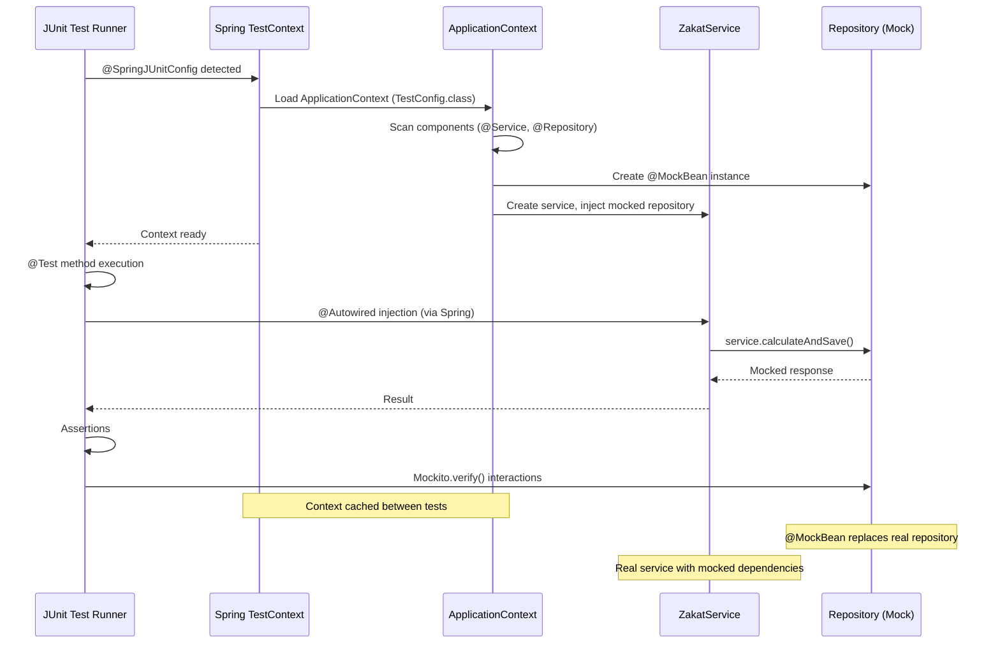

## Why Spring Testing Matters

Production Spring applications require comprehensive integration testing to validate framework behavior—verifying dependency injection wiring, database transactions, REST endpoints, security configurations, and message listeners. Manual test setup with new instances requires creating entire application contexts, manually wiring dependencies, and duplicating production configuration—verbose, error-prone, and slow. In production systems processing zakat calculations with Spring Data repositories, transactional services, and REST controllers, Spring Test's @ContextConfiguration with test slices (@WebMvcTest, @DataJpaTest) provides declarative test context loading, automatic dependency injection, and focused testing—eliminating manual context creation that causes configuration drift, slow test suites, and missed integration bugs.

## Manual Test Setup Baseline

Manual Spring testing requires creating and wiring components explicitly:

```java
import org.junit.jupiter.api.Test;
import static org.junit.jupiter.api.Assertions.*;

// => Domain model: zakat calculation
public class ZakatCalculation {
    private String accountId;
    private double wealth;
    private double nisab;
    private double zakatAmount;

    public ZakatCalculation(String accountId, double wealth, double nisab) {
        this.accountId = accountId;
        this.wealth = wealth;
        this.nisab = nisab;
        this.zakatAmount = calculateZakat(wealth, nisab);
    }

    private double calculateZakat(double wealth, double nisab) {
        return wealth >= nisab ? wealth * 0.025 : 0.0;
    }

    // => Getters
    public String getAccountId() { return accountId; }
    public double getWealth() { return wealth; }
    public double getNisab() { return nisab; }
    public double getZakatAmount() { return zakatAmount; }
}

// => Repository interface: data access
public interface ZakatCalculationRepository {
    ZakatCalculation save(ZakatCalculation calculation);
    ZakatCalculation findByAccountId(String accountId);
}

// => Manual repository implementation for testing
// => PROBLEM: Must create test implementation, duplicates production code
public class InMemoryZakatCalculationRepository implements ZakatCalculationRepository {
    // => In-memory storage: simple map
    private final Map<String, ZakatCalculation> storage = new HashMap<>();

    @Override
    public ZakatCalculation save(ZakatCalculation calculation) {
        // => Store calculation by account ID
        storage.put(calculation.getAccountId(), calculation);
        return calculation;
    }

    @Override
    public ZakatCalculation findByAccountId(String accountId) {
        // => Retrieve calculation
        return storage.get(accountId);
    }
}

// => Service class: business logic
public class ZakatCalculationService {
    // => Dependency: repository
    // => PROBLEM: Manual dependency management
    private final ZakatCalculationRepository repository;

    public ZakatCalculationService(ZakatCalculationRepository repository) {
        this.repository = repository;
    }

    // => Business method: calculate and save
    public ZakatCalculation calculateAndSave(String accountId, double wealth, double nisab) {
        // => Create calculation
        ZakatCalculation calculation = new ZakatCalculation(accountId, wealth, nisab);

        // => Save to repository
        repository.save(calculation);

        return calculation;
    }

    // => Retrieve calculation
    public ZakatCalculation getCalculation(String accountId) {
        return repository.findByAccountId(accountId);
    }
}

// => Manual test: explicit wiring
public class ManualZakatCalculationServiceTest {

    // => Test fields: manually created dependencies
    // => PROBLEM: Must create all dependencies manually
    private ZakatCalculationRepository repository;
    private ZakatCalculationService service;

    // => Setup method: runs before each test
    // => PROBLEM: Duplicates production wiring logic
    @org.junit.jupiter.api.BeforeEach
    public void setUp() {
        // => Create repository instance
        // => PROBLEM: Test implementation differs from production (JPA)
        repository = new InMemoryZakatCalculationRepository();

        // => Create service with repository
        // => PROBLEM: Must manually wire dependencies
        service = new ZakatCalculationService(repository);
    }

    @Test
    public void calculateAndSave_shouldStoreCalculation() {
        // => Arrange: test data
        String accountId = "ACC001";
        double wealth = 100000.0;
        double nisab = 85.0;

        // => Act: call service method
        ZakatCalculation result = service.calculateAndSave(accountId, wealth, nisab);

        // => Assert: verify calculation stored
        assertNotNull(result);
        // => Verify account ID
        assertEquals(accountId, result.getAccountId());
        // => Verify zakat amount: 100000 * 0.025 = 2500
        assertEquals(2500.0, result.getZakatAmount(), 0.01);

        // => Verify retrieval
        ZakatCalculation retrieved = service.getCalculation(accountId);
        // => Retrieved calculation should match saved
        assertNotNull(retrieved);
        assertEquals(accountId, retrieved.getAccountId());
    }

    @Test
    public void calculateAndSave_belowNisab_shouldCalculateZero() {
        // => Arrange: wealth below nisab threshold
        String accountId = "ACC002";
        double wealth = 50.0;
        double nisab = 85.0;

        // => Act
        ZakatCalculation result = service.calculateAndSave(accountId, wealth, nisab);

        // => Assert: zakat should be 0
        assertEquals(0.0, result.getZakatAmount(), 0.01);
    }
}
```

**Limitations:**

- **Manual dependency creation**: Must instantiate all dependencies explicitly
- **Test implementation divergence**: Test repository differs from production (JPA)
- **Configuration duplication**: Production Spring config not used in tests
- **No Spring features**: Cannot test transactions, caching, security
- **Slow test development**: Boilerplate wiring for every test class
- **Integration gaps**: Tests miss Spring-specific behavior (proxies, AOP)
- **No mock injection**: Must manually create and wire mocks

## Spring Test Solution

Spring Test provides declarative test context management with dependency injection:

### Configuration and @ContextConfiguration

```java
import org.springframework.context.annotation.*;
import org.springframework.stereotype.Repository;
import org.springframework.stereotype.Service;
import javax.persistence.*;
import java.util.Map;
import java.util.concurrent.ConcurrentHashMap;

// => Spring configuration for testing
@Configuration
// => @ComponentScan: auto-discovers components
@ComponentScan(basePackages = "com.example.zakat")
public class TestConfig {
    // => Configuration beans can be defined here
    // => BENEFIT: Centralized test configuration
}

// => Spring Data repository: production implementation
// => @Repository: Spring component for data access
@Repository
public class JpaZakatCalculationRepository implements ZakatCalculationRepository {
    // => EntityManager: JPA database access
    @PersistenceContext
    private EntityManager entityManager;

    @Override
    public ZakatCalculation save(ZakatCalculation calculation) {
        // => JPA persist: saves to database
        entityManager.persist(calculation);
        return calculation;
    }

    @Override
    public ZakatCalculation findByAccountId(String accountId) {
        // => JPA query: retrieves from database
        TypedQuery<ZakatCalculation> query = entityManager.createQuery(
            "SELECT z FROM ZakatCalculation z WHERE z.accountId = :accountId",
            ZakatCalculation.class
        );
        query.setParameter("accountId", accountId);
        return query.getSingleResult();
    }
}

// => Service with Spring annotations
// => @Service: Spring component for business logic
@Service
public class SpringZakatCalculationService {
    // => Dependency injection: Spring autowires repository
    // => BENEFIT: No manual wiring
    private final ZakatCalculationRepository repository;

    // => Constructor injection: recommended pattern
    public SpringZakatCalculationService(ZakatCalculationRepository repository) {
        this.repository = repository;
    }

    public ZakatCalculation calculateAndSave(String accountId, double wealth, double nisab) {
        ZakatCalculation calculation = new ZakatCalculation(accountId, wealth, nisab);
        return repository.save(calculation);
    }

    public ZakatCalculation getCalculation(String accountId) {
        return repository.findByAccountId(accountId);
    }
}

// => Spring Test: declarative context loading
import org.springframework.beans.factory.annotation.Autowired;
import org.springframework.test.context.junit.jupiter.SpringJUnitConfig;
import org.junit.jupiter.api.Test;
import static org.junit.jupiter.api.Assertions.*;

// => @SpringJUnitConfig: loads Spring context for tests
// => Combines @ExtendWith(SpringExtension.class) + @ContextConfiguration
// => BENEFIT: One annotation for Spring test setup
@SpringJUnitConfig(classes = TestConfig.class)
public class SpringZakatCalculationServiceTest {

    // => @Autowired: Spring injects dependency
    // => BENEFIT: No manual service creation
    @Autowired
    private SpringZakatCalculationService service;

    // => @Autowired: Spring injects repository
    // => Useful for verifying repository state
    @Autowired
    private ZakatCalculationRepository repository;

    @Test
    public void calculateAndSave_shouldStoreCalculation() {
        // => Arrange
        String accountId = "ACC001";
        double wealth = 100000.0;
        double nisab = 85.0;

        // => Act: service already wired by Spring
        // => BENEFIT: No manual dependency creation
        ZakatCalculation result = service.calculateAndSave(accountId, wealth, nisab);

        // => Assert
        assertNotNull(result);
        assertEquals(accountId, result.getAccountId());
        assertEquals(2500.0, result.getZakatAmount(), 0.01);

        // => Verify via repository: tests full integration
        ZakatCalculation retrieved = repository.findByAccountId(accountId);
        assertNotNull(retrieved);
        assertEquals(accountId, retrieved.getAccountId());
    }

    @Test
    public void calculateAndSave_belowNisab_shouldCalculateZero() {
        // => Arrange
        String accountId = "ACC002";
        double wealth = 50.0;
        double nisab = 85.0;

        // => Act
        ZakatCalculation result = service.calculateAndSave(accountId, wealth, nisab);

        // => Assert
        assertEquals(0.0, result.getZakatAmount(), 0.01);
    }
}
```

### Mock Beans with @MockBean

```java
import org.springframework.boot.test.mock.mockito.MockBean;
import org.springframework.test.context.junit.jupiter.SpringJUnitConfig;
import org.junit.jupiter.api.Test;
import org.mockito.Mockito;
import static org.mockito.ArgumentMatchers.*;
import static org.junit.jupiter.api.Assertions.*;

// => Spring Test with mocks
@SpringJUnitConfig(classes = TestConfig.class)
public class SpringZakatCalculationServiceMockTest {

    // => @Autowired: real service instance
    @Autowired
    private SpringZakatCalculationService service;

    // => @MockBean: Spring creates and injects mock
    // => Replaces real repository with mock in context
    // => BENEFIT: No manual mock creation or wiring
    @MockBean
    private ZakatCalculationRepository repository;

    @Test
    public void calculateAndSave_shouldCallRepository() {
        // => Arrange: mock behavior
        String accountId = "ACC001";
        double wealth = 100000.0;
        double nisab = 85.0;

        ZakatCalculation expected = new ZakatCalculation(accountId, wealth, nisab);

        // => Mockito: stub repository.save()
        // => When save() called, return expected calculation
        Mockito.when(repository.save(any(ZakatCalculation.class)))
            .thenReturn(expected);

        // => Act: call service
        // => Service uses mocked repository
        ZakatCalculation result = service.calculateAndSave(accountId, wealth, nisab);

        // => Assert: verify result
        assertNotNull(result);
        assertEquals(accountId, result.getAccountId());

        // => Mockito verify: ensure save() called once
        // => BENEFIT: Verifies service-repository interaction
        Mockito.verify(repository, Mockito.times(1)).save(any(ZakatCalculation.class));
    }

    @Test
    public void getCalculation_shouldCallRepository() {
        // => Arrange: mock repository response
        String accountId = "ACC001";
        ZakatCalculation expected = new ZakatCalculation(accountId, 100000.0, 85.0);

        Mockito.when(repository.findByAccountId(accountId))
            .thenReturn(expected);

        // => Act
        ZakatCalculation result = service.getCalculation(accountId);

        // => Assert
        assertNotNull(result);
        assertEquals(accountId, result.getAccountId());

        // => Verify repository interaction
        Mockito.verify(repository, Mockito.times(1)).findByAccountId(accountId);
    }
}
```

### Test Slices for Focused Testing

```java
import org.springframework.boot.test.autoconfigure.web.servlet.WebMvcTest;
import org.springframework.boot.test.autoconfigure.orm.jpa.DataJpaTest;
import org.springframework.boot.test.mock.mockito.MockBean;
import org.springframework.beans.factory.annotation.Autowired;
import org.springframework.test.web.servlet.MockMvc;
import org.springframework.test.web.servlet.request.MockMvcRequestBuilders;
import org.springframework.test.web.servlet.result.MockMvcResultMatchers;
import org.junit.jupiter.api.Test;
import org.mockito.Mockito;

// => REST Controller: web layer
@org.springframework.web.bind.annotation.RestController
@org.springframework.web.bind.annotation.RequestMapping("/api/zakat")
public class ZakatController {
    private final SpringZakatCalculationService service;

    public ZakatController(SpringZakatCalculationService service) {
        this.service = service;
    }

    // => POST endpoint: calculate zakat
    @org.springframework.web.bind.annotation.PostMapping("/calculate")
    public ZakatCalculation calculate(
            @org.springframework.web.bind.annotation.RequestParam String accountId,
            @org.springframework.web.bind.annotation.RequestParam double wealth,
            @org.springframework.web.bind.annotation.RequestParam double nisab) {
        return service.calculateAndSave(accountId, wealth, nisab);
    }
}

// => @WebMvcTest: loads only web layer components
// => Spring: creates MockMvc, loads controllers, excludes services/repositories
// => BENEFIT: Fast tests, focused on web layer
@WebMvcTest(ZakatController.class)
public class ZakatControllerTest {

    // => @Autowired MockMvc: simulates HTTP requests
    // => Spring Test: provides MockMvc for controller testing
    @Autowired
    private MockMvc mockMvc;

    // => @MockBean: mocks service layer
    // => Controller depends on service, but we test controller in isolation
    @MockBean
    private SpringZakatCalculationService service;

    @Test
    public void calculate_shouldReturnZakatCalculation() throws Exception {
        // => Arrange: mock service behavior
        String accountId = "ACC001";
        double wealth = 100000.0;
        double nisab = 85.0;
        ZakatCalculation expected = new ZakatCalculation(accountId, wealth, nisab);

        Mockito.when(service.calculateAndSave(accountId, wealth, nisab))
            .thenReturn(expected);

        // => Act & Assert: HTTP POST request
        // => MockMvc: performs request, verifies response
        mockMvc.perform(
                MockMvcRequestBuilders.post("/api/zakat/calculate")
                    .param("accountId", accountId)
                    .param("wealth", String.valueOf(wealth))
                    .param("nisab", String.valueOf(nisab))
            )
            // => Expect HTTP 200 OK
            .andExpect(MockMvcResultMatchers.status().isOk())
            // => Expect JSON field: accountId
            .andExpect(MockMvcResultMatchers.jsonPath("$.accountId").value(accountId))
            // => Expect JSON field: zakatAmount
            .andExpect(MockMvcResultMatchers.jsonPath("$.zakatAmount").value(2500.0));

        // => Verify service interaction
        Mockito.verify(service, Mockito.times(1)).calculateAndSave(accountId, wealth, nisab);
    }
}

// => @DataJpaTest: loads only JPA components
// => Spring: creates in-memory database, loads repositories, excludes controllers/services
// => BENEFIT: Fast tests, focused on data layer
@DataJpaTest
public class JpaZakatCalculationRepositoryTest {

    // => @Autowired: Spring injects repository
    // => Uses in-memory H2 database for testing
    @Autowired
    private ZakatCalculationRepository repository;

    @Test
    public void save_shouldPersistCalculation() {
        // => Arrange
        ZakatCalculation calculation = new ZakatCalculation("ACC001", 100000.0, 85.0);

        // => Act: save to database
        // => Spring Data JPA: auto-commits transaction
        ZakatCalculation saved = repository.save(calculation);

        // => Assert: verify saved
        assertNotNull(saved);
        assertEquals("ACC001", saved.getAccountId());

        // => Verify retrieval
        ZakatCalculation retrieved = repository.findByAccountId("ACC001");
        assertNotNull(retrieved);
        assertEquals("ACC001", retrieved.getAccountId());
        assertEquals(2500.0, retrieved.getZakatAmount(), 0.01);
    }
}
```

**Benefits:**

- **Declarative context loading**: @SpringJUnitConfig loads Spring context automatically
- **Automatic dependency injection**: @Autowired injects dependencies
- **Mock integration**: @MockBean creates and injects mocks
- **Test slices**: @WebMvcTest, @DataJpaTest load only necessary components
- **Production configuration**: Tests use actual Spring configuration
- **Integration testing**: Verifies Spring-specific behavior (DI, transactions)
- **Fast test development**: Minimal boilerplate, no manual wiring

## Spring Test Context Lifecycle Diagram



## Production Patterns

### Test Property Sources

```java
import org.springframework.test.context.TestPropertySource;
import org.springframework.test.context.junit.jupiter.SpringJUnitConfig;
import org.springframework.beans.factory.annotation.Value;
import org.junit.jupiter.api.Test;
import static org.junit.jupiter.api.Assertions.*;

// => @TestPropertySource: overrides application properties
// => Spring: loads test-specific configuration
@SpringJUnitConfig(classes = TestConfig.class)
@TestPropertySource(properties = {
    "zakat.nisab=85.0",
    "zakat.rate=0.025",
    "spring.datasource.url=jdbc:h2:mem:testdb"
})
public class ZakatServiceWithPropertiesTest {

    // => @Value: injects property values
    // => Spring: resolves from @TestPropertySource
    @Value("${zakat.nisab}")
    private double nisab;

    @Value("${zakat.rate}")
    private double rate;

    @Test
    public void properties_shouldBeLoaded() {
        // => Verify test properties loaded
        assertEquals(85.0, nisab, 0.01);
        assertEquals(0.025, rate, 0.0001);
    }
}
```

### Transactional Tests with Rollback

```java
import org.springframework.transaction.annotation.Transactional;
import org.springframework.test.context.junit.jupiter.SpringJUnitConfig;
import org.springframework.beans.factory.annotation.Autowired;
import org.junit.jupiter.api.Test;
import static org.junit.jupiter.api.Assertions.*;

// => @Transactional: wraps each test in transaction
// => Spring: rolls back transaction after test (no database pollution)
@SpringJUnitConfig(classes = TestConfig.class)
@Transactional
public class TransactionalZakatServiceTest {

    @Autowired
    private SpringZakatCalculationService service;

    @Autowired
    private ZakatCalculationRepository repository;

    @Test
    public void calculateAndSave_shouldRollbackAfterTest() {
        // => Arrange
        String accountId = "ACC001";

        // => Act: save calculation
        service.calculateAndSave(accountId, 100000.0, 85.0);

        // => Assert: calculation exists in transaction
        ZakatCalculation retrieved = repository.findByAccountId(accountId);
        assertNotNull(retrieved);

        // => BENEFIT: Transaction rolls back after test
        // => Next test sees clean database (no ACC001)
    }

    @Test
    public void secondTest_shouldNotSeeFirstTestData() {
        // => Previous test data rolled back
        // => BENEFIT: Test isolation, no cleanup needed
        ZakatCalculation retrieved = repository.findByAccountId("ACC001");
        assertNull(retrieved);  // ACC001 not found (rolled back)
    }
}
```

### Integration Testing with @SpringBootTest

```java
import org.springframework.boot.test.context.SpringBootTest;
import org.springframework.boot.test.web.client.TestRestTemplate;
import org.springframework.beans.factory.annotation.Autowired;
import org.springframework.http.ResponseEntity;
import org.springframework.http.HttpStatus;
import org.junit.jupiter.api.Test;
import static org.junit.jupiter.api.Assertions.*;

// => @SpringBootTest: loads full application context
// => Spring Boot: starts embedded server, loads all components
// => BENEFIT: Full integration testing (all layers)
@SpringBootTest(webEnvironment = SpringBootTest.WebEnvironment.RANDOM_PORT)
public class ZakatIntegrationTest {

    // => @Autowired TestRestTemplate: HTTP client for testing
    // => Spring Boot: provides TestRestTemplate for REST testing
    @Autowired
    private TestRestTemplate restTemplate;

    @Test
    public void calculateEndpoint_shouldReturnZakatCalculation() {
        // => Arrange: request parameters
        String url = "/api/zakat/calculate?accountId=ACC001&wealth=100000&nisab=85";

        // => Act: HTTP POST request
        // => TestRestTemplate: real HTTP call to embedded server
        ResponseEntity<ZakatCalculation> response = restTemplate.postForEntity(
            url,
            null,
            ZakatCalculation.class
        );

        // => Assert: verify HTTP response
        assertEquals(HttpStatus.OK, response.getStatusCode());
        assertNotNull(response.getBody());
        assertEquals("ACC001", response.getBody().getAccountId());
        assertEquals(2500.0, response.getBody().getZakatAmount(), 0.01);
    }
}
```

## Trade-offs and When to Use

| Approach                 | Setup Complexity | Spring Features | Test Speed | Production Accuracy | Isolation |
| ------------------------ | ---------------- | --------------- | ---------- | ------------------- | --------- |
| Manual Test Setup        | High             | None            | Fast       | Low                 | High      |
| @SpringJUnitConfig       | Low              | Full            | Medium     | High                | Medium    |
| @WebMvcTest              | Low              | Web Layer       | Fast       | High (web)          | High      |
| @DataJpaTest             | Low              | Data Layer      | Fast       | High (data)         | High      |
| @SpringBootTest (full)   | Low              | Full            | Slow       | Very High           | Low       |
| @SpringBootTest (webEnv) | Low              | Full + Server   | Slowest    | Production-like     | None      |

**When to Use Manual Test Setup:**

- Unit testing POJOs (no Spring dependencies)
- Testing utility classes
- Learning testing fundamentals

**When to Use @SpringJUnitConfig:**

- **Testing service layer** with real dependencies
- Verifying Spring DI wiring
- Integration testing multiple components

**When to Use @WebMvcTest:**

- **Testing REST controllers** in isolation
- Verifying HTTP request handling
- Fast web layer tests with mocked services

**When to Use @DataJpaTest:**

- **Testing JPA repositories** in isolation
- Verifying database queries and mappings
- Fast data layer tests with in-memory database

**When to Use @SpringBootTest:**

- **Full integration testing** (all layers)
- End-to-end testing with embedded server
- Testing component interactions (controller → service → repository)

## Best Practices

**1. Use Test Slices for Focused Testing**

```java
// ✅ Fast web layer test
@WebMvcTest(ZakatController.class)
public class ZakatControllerTest { }

// ✅ Fast data layer test
@DataJpaTest
public class ZakatRepositoryTest { }

// ❌ Slow full context (use only when needed)
@SpringBootTest
public class FullContextTest { }
```

**2. Mock External Dependencies**

```java
@SpringJUnitConfig(classes = TestConfig.class)
public class ZakatServiceTest {
    @Autowired
    private ZakatService service;

    // ✅ Mock external repository
    @MockBean
    private ZakatRepository repository;
}
```

**3. Use @Transactional for Database Tests**

```java
// ✅ Automatic rollback (no cleanup needed)
@SpringJUnitConfig
@Transactional
public class ZakatServiceTest { }
```

**4. Use @TestPropertySource for Test Configuration**

```java
@SpringJUnitConfig
@TestPropertySource(properties = {
    "spring.datasource.url=jdbc:h2:mem:testdb",
    "zakat.nisab=85.0"
})
public class ZakatServiceTest { }
```

**5. Verify Mock Interactions**

```java
@Test
public void test_shouldCallRepository() {
    service.calculateAndSave("ACC001", 100000.0, 85.0);

    // ✅ Verify repository called
    Mockito.verify(repository, Mockito.times(1))
        .save(any(ZakatCalculation.class));
}
```

## See Also

- Test-Driven Development - Red-Green-Refactor TDD workflow
- Behavior-Driven Development - Cucumber and Gherkin for BDD
- [Transaction Management](/en/learn/software-engineering/platforms/web/tools/jvm-spring/in-the-field/transaction-management) - @Transactional for database transactions
- [Dependency Injection](/en/learn/software-engineering/platforms/web/tools/jvm-spring/in-the-field/dependency-injection) - Spring DI and @Autowired
- [Spring Data JPA](/en/learn/software-engineering/platforms/web/tools/jvm-spring/in-the-field/spring-data-jpa) - Repository pattern and JPA integration
