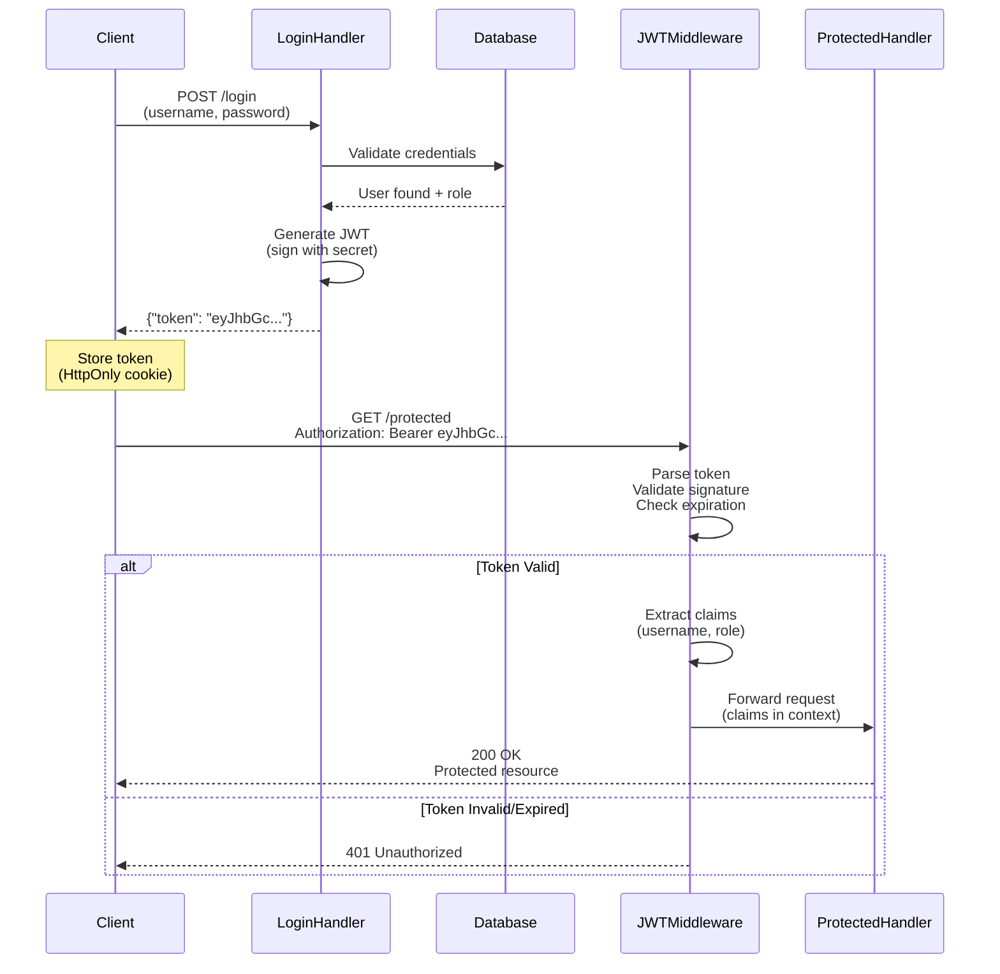

## Why Authentication & Authorization Matter

Authentication (verifying identity) and authorization (verifying permissions) are critical security controls in production systems. Without proper authentication, anyone can impersonate users. Without authorization, authenticated users can access resources they shouldn't. Understanding Go's authentication patterns prevents security breaches, protects sensitive data, and ensures compliance with security standards.

**Core benefits**:

- **Identity verification**: Ensures users are who they claim to be
- **Access control**: Limits what authenticated users can do
- **Audit trails**: Tracks who accessed what resources
- **Compliance**: Meets regulatory requirements (GDPR, HIPAA, SOC 2)

**Problem**: Standard library provides basic HTTP authentication but no JWT validation, session management, or OAuth2 flows. Manual implementation is error-prone and insecure.

**Solution**: Start with net/http Basic Auth to understand fundamentals, identify limitations (no JWT, no sessions), then use production libraries (golang-jwt/jwt for tokens, OAuth2 packages) for comprehensive authentication.

## JWT Authentication Flow



**Authentication flow steps**:

- **Login**: Client sends credentials, server validates, generates signed JWT
- **Token storage**: Client stores token (HttpOnly cookie for XSS protection)
- **Protected request**: Client sends token in Authorization header
- **Validation**: Middleware verifies signature, expiration, extracts claims
- **Authorization**: Handler checks claims (username, role) for access control

## Standard Library: Basic Authentication

Go's net/http supports Basic Authentication through Authorization header parsing.

**Pattern from standard library**:

```go
package main

import (
    "encoding/base64"
    // => Standard library for Base64 decoding
    // => Basic Auth encodes credentials as Base64
    "fmt"
    // => Standard library for formatted output
    "net/http"
    // => Standard library HTTP server
    // => No external dependencies
    "strings"
    // => String manipulation (splitting)
)

func basicAuthMiddleware(next http.HandlerFunc) http.HandlerFunc {
    // => Middleware pattern: wraps handler
    // => Returns new handler that checks auth first
    // => next is called only if auth succeeds

    return func(w http.ResponseWriter, r *http.Request) {
        // => Inner handler checks Authorization header
        // => r.Header.Get() case-insensitive

        auth := r.Header.Get("Authorization")
        // => auth is "Basic base64(username:password)"
        // => Example: "Basic YWRtaW46cGFzczEyMzQ="
        // => Empty if header not present

        if auth == "" {
            // => No Authorization header

            w.Header().Set("WWW-Authenticate", `Basic realm="restricted"`)
            // => WWW-Authenticate tells client to send credentials
            // => realm describes protected area
            // => Browser shows login dialog

            http.Error(w, "Unauthorized", http.StatusUnauthorized)
            // => 401 Unauthorized response
            // => Client should retry with credentials
            return
            // => Stop processing (don't call next)
        }

        if !strings.HasPrefix(auth, "Basic ") {
            // => Authorization header must start with "Basic "
            // => Other schemes: Bearer, Digest, etc.

            http.Error(w, "Invalid auth scheme", http.StatusUnauthorized)
            return
        }

        payload := auth[len("Basic "):]
        // => payload is "YWRtaW46cGFzczEyMzQ=" (base64 encoded)
        // => Removes "Basic " prefix
        // => Contains base64(username:password)

        decoded, err := base64.StdEncoding.DecodeString(payload)
        // => decoded is []byte("admin:pass1234")
        // => Decodes Base64 to username:password
        // => err non-nil if invalid Base64

        if err != nil {
            // => Invalid Base64 encoding

            http.Error(w, "Invalid encoding", http.StatusUnauthorized)
            return
        }

        credentials := string(decoded)
        // => credentials is "admin:pass1234"
        // => Convert bytes to string

        parts := strings.SplitN(credentials, ":", 2)
        // => parts is ["admin", "pass1234"]
        // => SplitN limits to 2 parts (username and password)
        // => Password may contain : character

        if len(parts) != 2 {
            // => Invalid format (missing colon)

            http.Error(w, "Invalid credentials", http.StatusUnauthorized)
            return
        }

        username, password := parts[0], parts[1]
        // => username is "admin"
        // => password is "pass1234"
        // => Extract from parts array

        if !validateCredentials(username, password) {
            // => Check against stored credentials
            // => validateCredentials queries database

            http.Error(w, "Invalid credentials", http.StatusUnauthorized)
            return
        }

        // Authentication succeeded
        next(w, r)
        // => Call next handler in chain
        // => User is authenticated at this point
    }
}

func validateCredentials(username, password string) bool {
    // => Validates username/password
    // => Production: query database, check bcrypt hash
    // => This is simplified example

    return username == "admin" && password == "pass1234"
    // => Hardcoded for demo (NEVER do this in production)
    // => Production: hash password, query database
}

func protectedHandler(w http.ResponseWriter, r *http.Request) {
    // => Handler only called if auth succeeds
    // => No auth logic needed here

    fmt.Fprintln(w, "Welcome to protected resource!")
    // => Response: Welcome to protected resource!
    // => Only authenticated users see this
}

func main() {
    // => Sets up HTTP server with auth

    http.HandleFunc("/protected", basicAuthMiddleware(protectedHandler))
    // => Wraps handler with auth middleware
    // => basicAuthMiddleware checks auth before protectedHandler
    // => Middleware pattern (decorates handler)

    fmt.Println("Server starting on :8080")
    http.ListenAndServe(":8080", nil)
    // => Starts HTTP server
    // => Blocks forever (until interrupted)
}
```

**Testing Basic Auth**:

```bash
# Without credentials (401)
curl http://localhost:8080/protected
# => Response: Unauthorized
# => Status: 401

# With valid credentials (200)
curl -u admin:pass1234 http://localhost:8080/protected
# => Response: Welcome to protected resource!
# => -u flag encodes credentials as Basic Auth
# => Status: 200
```

**Limitations for production authentication**:

- No JWT support (stateless tokens)
- No session management (stateful sessions)
- No OAuth2 flows (third-party authentication)
- No token expiration (credentials never expire)
- No refresh tokens (long-lived tokens)
- Credentials sent on every request (performance overhead)
- No role-based access control (RBAC)

## Production Framework: JWT with golang-jwt/jwt

JSON Web Tokens (JWT) provide stateless authentication for APIs. golang-jwt/jwt is the standard library for JWT in Go.

**Adding golang-jwt/jwt**:

```bash
go get github.com/golang-jwt/jwt/v5
# => Installs JWT library
# => v5 is latest version (2023+)
```

**Pattern: JWT Authentication**:

```go
package main

import (
    "fmt"
    // => Standard library for formatted output
    "net/http"
    // => Standard library HTTP server
    "time"
    // => Standard library for time operations

    "github.com/golang-jwt/jwt/v5"
    // => JWT library for token creation/validation
    // => v5 latest version (December 2023+)
)

var jwtSecret = []byte("your-secret-key")
// => SECRET KEY for signing tokens
// => CRITICAL: must be random, kept secret
// => Production: load from environment variable
// => Same key signs and validates tokens

type Claims struct {
    Username string `json:"username"`
    // => Username embedded in token
    // => Available without database lookup
    // => Public claim (not secret)

    Role     string `json:"role"`
    // => User role for authorization
    // => role is "admin", "user", "guest"
    // => Used for RBAC checks

    jwt.RegisteredClaims
    // => Embeds standard JWT claims
    // => ExpiresAt, IssuedAt, Issuer, Subject, Audience
    // => Provides expiration validation
}

func generateToken(username, role string) (string, error) {
    // => Creates JWT token for authenticated user
    // => Returns signed token string
    // => Token includes username, role, expiration

    claims := Claims{
        Username: username,
        // => Username stored in token
        Role:     role,
        // => Role stored in token
        RegisteredClaims: jwt.RegisteredClaims{
            ExpiresAt: jwt.NewNumericDate(time.Now().Add(24 * time.Hour)),
            // => Token expires in 24 hours
            // => After expiration, token invalid
            // => Client must request new token

            IssuedAt: jwt.NewNumericDate(time.Now()),
            // => Token creation timestamp
            // => Used to track token age

            Issuer: "auth-service",
            // => Identifies token issuer
            // => Validates token origin
        },
    }
    // => Claims object with user info and metadata

    token := jwt.NewWithClaims(jwt.SigningMethodHS256, claims)
    // => Creates token with HS256 signing method
    // => HS256 uses HMAC with SHA-256
    // => Symmetric key (same key signs and validates)
    // => Token not yet signed

    return token.SignedString(jwtSecret)
    // => Signs token with secret key
    // => Returns token string (3 parts: header.payload.signature)
    // => Example: eyJhbGc...eyJ1c2V...SflKxw
    // => err non-nil if signing fails
}

func loginHandler(w http.ResponseWriter, r *http.Request) {
    // => Handles POST /login requests
    // => Validates credentials, returns JWT

    username := r.FormValue("username")
    // => username from form data
    // => Example: "admin"

    password := r.FormValue("password")
    // => password from form data
    // => Production: never log passwords

    if !validateCredentials(username, password) {
        // => Check credentials against database
        // => Production: bcrypt compare

        http.Error(w, "Invalid credentials", http.StatusUnauthorized)
        return
    }

    role := getUserRole(username)
    // => Query database for user role
    // => role is "admin", "user", "guest"
    // => Used for authorization decisions

    token, err := generateToken(username, role)
    // => Create signed JWT
    // => token is "eyJhbGc..."

    if err != nil {
        http.Error(w, "Token generation failed", http.StatusInternalServerError)
        return
    }

    w.Header().Set("Content-Type", "application/json")
    // => JSON response

    fmt.Fprintf(w, `{"token": "%s"}`, token)
    // => Response: {"token": "eyJhbGc..."}
    // => Client stores token (localStorage, cookie)
    // => Client sends token on subsequent requests
}

func jwtMiddleware(next http.HandlerFunc) http.HandlerFunc {
    // => Middleware validates JWT on each request
    // => Extracts claims, adds to request context

    return func(w http.ResponseWriter, r *http.Request) {
        authHeader := r.Header.Get("Authorization")
        // => authHeader is "Bearer eyJhbGc..."
        // => Bearer scheme indicates JWT

        if authHeader == "" {
            http.Error(w, "Missing token", http.StatusUnauthorized)
            return
        }

        tokenString := authHeader[len("Bearer "):]
        // => tokenString is "eyJhbGc..."
        // => Removes "Bearer " prefix

        claims := &Claims{}
        // => Empty claims object to receive parsed claims

        token, err := jwt.ParseWithClaims(tokenString, claims, func(token *jwt.Token) (interface{}, error) {
            // => Validation function called during parsing
            // => Must return signing key
            // => Validates signing method

            if _, ok := token.Method.(*jwt.SigningMethodHMAC); !ok {
                // => Ensure token signed with HMAC (HS256)
                // => Rejects tokens signed with other methods
                // => Prevents algorithm confusion attacks

                return nil, fmt.Errorf("unexpected signing method: %v", token.Header["alg"])
            }

            return jwtSecret, nil
            // => Return secret key for signature validation
            // => Same key used for signing
        })
        // => token is parsed JWT object
        // => err non-nil if signature invalid or token expired

        if err != nil || !token.Valid {
            // => Invalid signature or expired token
            // => token.Valid checks expiration

            http.Error(w, "Invalid token", http.StatusUnauthorized)
            return
        }

        // Token valid, user authenticated
        // => claims.Username and claims.Role available
        // => Use for authorization checks

        next(w, r)
        // => Call next handler
        // => Handler can access claims (add to context in production)
    }
}

func protectedHandler(w http.ResponseWriter, r *http.Request) {
    fmt.Fprintln(w, "Access granted to protected resource")
}

func getUserRole(username string) string {
    // => Query database for user role
    // => Production: SELECT role FROM users WHERE username = ?

    if username == "admin" {
        return "admin"
    }
    return "user"
}

func main() {
    http.HandleFunc("/login", loginHandler)
    // => POST /login returns JWT

    http.HandleFunc("/protected", jwtMiddleware(protectedHandler))
    // => GET /protected requires valid JWT

    fmt.Println("Server starting on :8080")
    http.ListenAndServe(":8080", nil)
}
```

**Testing JWT Authentication**:

```bash
# Login to get token
TOKEN=$(curl -X POST -d "username=admin&password=pass1234" \
    http://localhost:8080/login | jq -r '.token')
# => TOKEN is "eyJhbGc..."
# => Stores token in variable

# Access protected resource with token
curl -H "Authorization: Bearer $TOKEN" \
    http://localhost:8080/protected
# => Response: Access granted to protected resource
# => Status: 200
```

**Pattern: Role-Based Access Control (RBAC)**:

```go
package main

import (
    "fmt"
    "net/http"

    "github.com/golang-jwt/jwt/v5"
)

func requireRole(role string) func(http.HandlerFunc) http.HandlerFunc {
    // => Higher-order function: returns middleware
    // => Configurable middleware (role parameter)
    // => Checks if user has required role

    return func(next http.HandlerFunc) http.HandlerFunc {
        // => Middleware function
        // => Wraps next handler

        return func(w http.ResponseWriter, r *http.Request) {
            // => Extract claims from token (JWT middleware runs first)
            // => Production: get claims from request context

            authHeader := r.Header.Get("Authorization")
            tokenString := authHeader[len("Bearer "):]

            claims := &Claims{}
            jwt.ParseWithClaims(tokenString, claims, func(token *jwt.Token) (interface{}, error) {
                return jwtSecret, nil
            })
            // => Parses token to extract claims
            // => Production: get from context (avoid re-parsing)

            if claims.Role != role {
                // => User doesn't have required role
                // => claims.Role is "user", role is "admin"

                http.Error(w, "Forbidden: insufficient permissions", http.StatusForbidden)
                // => 403 Forbidden (authenticated but not authorized)
                // => Different from 401 (not authenticated)
                return
            }

            // Authorization passed
            next(w, r)
            // => Call next handler
            // => User has required role
        }
    }
}

func adminHandler(w http.ResponseWriter, r *http.Request) {
    // => Handler only for admin role

    fmt.Fprintln(w, "Admin access granted")
}

func main() {
    http.HandleFunc("/admin",
        jwtMiddleware(requireRole("admin")(adminHandler)))
    // => Middleware chain: jwtMiddleware → requireRole("admin") → adminHandler
    // => First validates JWT, then checks role

    fmt.Println("Server starting on :8080")
    http.ListenAndServe(":8080", nil)
}
```

## Production Framework: OAuth2

OAuth2 enables third-party authentication (Google, GitHub, Facebook) without handling passwords.

**Adding OAuth2 library**:

```bash
go get golang.org/x/oauth2
# => Official Go OAuth2 client library
# => Handles OAuth2 flows
```

**Pattern: OAuth2 Google Login**:

```go
package main

import (
    "context"
    "fmt"
    "net/http"

    "golang.org/x/oauth2"
    "golang.org/x/oauth2/google"
    // => Google OAuth2 configuration
    // => Predefined endpoints
)

var googleOAuthConfig = &oauth2.Config{
    ClientID:     "your-client-id",
    // => OAuth2 client ID from Google Console
    // => Public identifier

    ClientSecret: "your-client-secret",
    // => OAuth2 client secret from Google Console
    // => CRITICAL: keep secret, load from env

    RedirectURL:  "http://localhost:8080/callback",
    // => URL Google redirects to after auth
    // => Must match registered URL in Google Console

    Scopes: []string{
        "https://www.googleapis.com/auth/userinfo.email",
        // => Scope: access user email
        // => Scopes define permissions requested
    },

    Endpoint: google.Endpoint,
    // => Google OAuth2 endpoints
    // => AuthURL and TokenURL
}

func handleGoogleLogin(w http.ResponseWriter, r *http.Request) {
    // => Redirects user to Google login page
    // => Step 1 of OAuth2 flow

    url := googleOAuthConfig.AuthCodeURL("state-token", oauth2.AccessTypeOffline)
    // => Builds authorization URL
    // => "state-token" prevents CSRF attacks
    // => AccessTypeOffline requests refresh token
    // => url is "https://accounts.google.com/o/oauth2/auth?..."

    http.Redirect(w, r, url, http.StatusTemporaryRedirect)
    // => Redirects browser to Google
    // => User authenticates with Google
    // => Google redirects back to /callback
}

func handleGoogleCallback(w http.ResponseWriter, r *http.Request) {
    // => Handles redirect from Google
    // => Step 2 of OAuth2 flow

    code := r.URL.Query().Get("code")
    // => Authorization code from Google
    // => code is one-time-use code
    // => Exchange for access token

    state := r.URL.Query().Get("state")
    // => state is "state-token" (from AuthCodeURL)
    // => Verify to prevent CSRF

    if state != "state-token" {
        // => State mismatch (possible CSRF attack)

        http.Error(w, "Invalid state", http.StatusBadRequest)
        return
    }

    token, err := googleOAuthConfig.Exchange(context.Background(), code)
    // => Exchange authorization code for access token
    // => Makes HTTP POST to Google token endpoint
    // => token contains AccessToken, RefreshToken, Expiry

    if err != nil {
        http.Error(w, "Token exchange failed", http.StatusInternalServerError)
        return
    }

    // token.AccessToken can access Google APIs
    // => Use token to call Google APIs (userinfo, gmail, etc.)
    // => Store token in session or database

    fmt.Fprintf(w, "Login successful! Token: %s", token.AccessToken)
    // => In production: create session, redirect to app
}

func main() {
    http.HandleFunc("/login/google", handleGoogleLogin)
    // => Initiates OAuth2 flow

    http.HandleFunc("/callback", handleGoogleCallback)
    // => Handles OAuth2 redirect

    fmt.Println("Server starting on :8080")
    fmt.Println("Visit http://localhost:8080/login/google")
    http.ListenAndServe(":8080", nil)
}
```

## Trade-offs: When to Use Each

**Comparison table**:

| Approach       | Token Type   | Statefulness | Use Case                            |
| -------------- | ------------ | ------------ | ----------------------------------- |
| **Basic Auth** | Credentials  | Stateless    | Internal tools, simple APIs         |
| **JWT**        | Signed token | Stateless    | Microservices, mobile apps, SPAs    |
| **OAuth2**     | Access token | Stateful     | Third-party login, delegated auth   |
| **Sessions**   | Session ID   | Stateful     | Traditional web apps, high security |

**When to use Basic Auth**:

- Internal tools (admin panels)
- Simple APIs (no token management)
- Legacy systems (backward compatibility)
- Low security requirements

**When to use JWT**:

- Microservices (stateless authentication)
- Mobile apps (long-lived tokens)
- Single-page applications (token in localStorage)
- API gateways (token validation without database)

**When to use OAuth2**:

- Third-party authentication (Google, GitHub, Facebook)
- Delegated authorization (access user's Gmail)
- Avoid password handling (OAuth2 provider manages credentials)
- Social login features

**When to use sessions**:

- Traditional web applications (server-rendered HTML)
- High security requirements (revoke sessions immediately)
- Short-lived sessions (banking, healthcare)
- Session storage available (Redis, database)

## Production Best Practices

**Never store JWT in localStorage (XSS vulnerability)**:

```go
// GOOD: HttpOnly cookie (JavaScript can't access)
http.SetCookie(w, &http.Cookie{
    Name:     "token",
    Value:    token,
    HttpOnly: true,  // Prevents JavaScript access
    Secure:   true,  // HTTPS only
    SameSite: http.SameSiteStrictMode,  // CSRF protection
})

// BAD: returning token in JSON (client stores in localStorage)
// => localStorage accessible by JavaScript (XSS risk)
```

**Use strong secrets (256-bit random)**:

```go
// GOOD: load from environment variable
import "os"

var jwtSecret = []byte(os.Getenv("JWT_SECRET"))
// => 256-bit random string
// => Generate with: openssl rand -base64 32

// BAD: hardcoded secret
var jwtSecret = []byte("secret123")  // Predictable, insecure
```

**Implement token refresh**:

```go
// GOOD: short-lived access token + long-lived refresh token
type TokenPair struct {
    AccessToken  string `json:"access_token"`   // 15 minutes
    RefreshToken string `json:"refresh_token"`  // 7 days
}

// BAD: long-lived access token
// => If stolen, attacker has access until expiration
```

**Validate token expiration**:

```go
// GOOD: jwt library validates expiration automatically
token, err := jwt.ParseWithClaims(tokenString, claims, keyFunc)
if err != nil {
    // Handles expired tokens
}

// BAD: manual expiration check (error-prone)
if time.Now().After(claims.ExpiresAt.Time) {
    // Custom expiration logic (use library instead)
}
```

## Summary

Authentication verifies identity, authorization verifies permissions. Standard library provides Basic Auth through Authorization header parsing, but lacks JWT validation, session management, and OAuth2 support. Production systems use golang-jwt/jwt for stateless tokens, OAuth2 for third-party authentication, and role-based access control for authorization. Use JWT for microservices and APIs, OAuth2 for social login, sessions for traditional web apps. Always use strong secrets, HttpOnly cookies, and short-lived tokens.

**Key takeaways**:

- Basic Auth sends credentials on every request (stateless)
- JWT provides stateless authentication with signed tokens
- OAuth2 enables third-party authentication without handling passwords
- RBAC checks user roles for authorization decisions
- Store JWT in HttpOnly cookies (not localStorage)
- Use 256-bit random secrets for JWT signing
- Implement token refresh with short-lived access tokens
