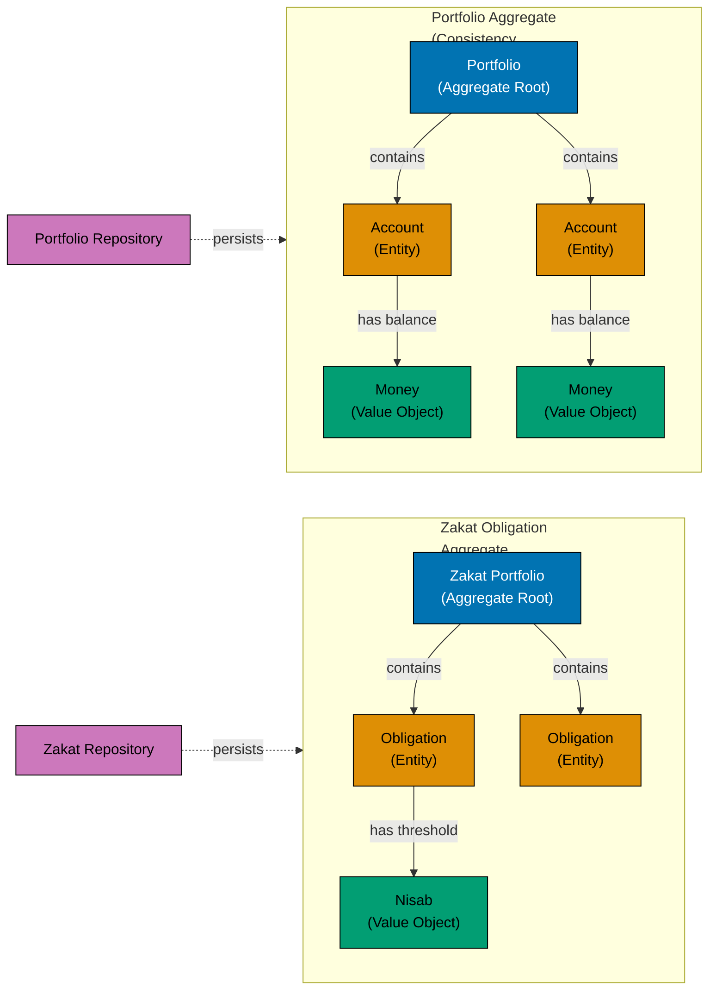

## Why Domain-Driven Design Matters

Domain-Driven Design (DDD) structures complex business domains through explicit modeling of concepts, behaviors, and boundaries. In financial systems like Islamic banking, zakat calculation, or investment portfolios, DDD ensures business rules remain clear, consistent, and protected from technical concerns.

**Core benefits**:

- **Business clarity**: Domain concepts visible in code structure
- **Consistency boundaries**: Aggregates enforce invariants automatically
- **Protected logic**: Domain rules encapsulated in entities and value objects
- **Team communication**: Ubiquitous language shared between developers and domain experts

**Problem**: Without DDD, business logic scatters across services, validation rules duplicate, invariants break, and domain knowledge becomes implicit rather than explicit.

**Solution**: Model domain explicitly with value objects (immutable validated data), entities (identity-based objects), aggregates (consistency boundaries), and repositories (persistence abstraction).

## DDD Building Blocks and Boundaries



**Aggregate pattern**:

- **Aggregate Root** (Portfolio, Zakat Portfolio): Entry point for all modifications
- **Entities** (Account, Obligation): Identity-based objects within aggregate
- **Value Objects** (Money, Nisab): Immutable validated data
- **Consistency Boundary**: Aggregate enforces invariants across entity graph
- **Repository**: Persists entire aggregate as unit (atomic save/load)

## Standard Library Approach: Structs and Methods

Go's standard library demonstrates DDD patterns through structs, methods, and composition. No classes or inheritance needed - just structs and interfaces.

### Value Objects: Immutable Validated Data

```go
package domain

import (
    "errors"
    "fmt"
)

// Money represents a monetary amount with currency
// => Value object (immutable, no identity)
// => Equality based on value, not reference
type Money struct {
    amount   int64  // => Private field (stored in cents/smallest unit)
    currency string // => Private field (ISO 4217 code)
}
// => Struct with private fields enforces immutability
// => Cannot modify after creation

// NewMoney creates validated Money value object
// => Constructor pattern (Go convention for validation)
// => Returns pointer to avoid copying
func NewMoney(amount int64, currency string) (*Money, error) {
    // => Factory function enforces validation
    // => No public struct fields prevents invalid state

    if amount < 0 {
        // => Domain rule: money cannot be negative
        return nil, errors.New("amount cannot be negative")
    }

    if currency == "" {
        // => Domain rule: currency required
        return nil, errors.New("currency is required")
    }

    if len(currency) != 3 {
        // => Domain rule: ISO 4217 currency codes are 3 letters
        return nil, fmt.Errorf("invalid currency code: %s", currency)
    }

    return &Money{
        amount:   amount,
        currency: currency,
    }, nil
    // => Returns immutable value object
    // => Cannot modify amount or currency after creation
}

// Amount returns monetary amount in smallest unit
// => Getter method (no setter - immutability)
// => Returns copy, not reference
func (m *Money) Amount() int64 {
    // => Method receiver (pointer for consistency)
    return m.amount
    // => Exposes private field safely
}

// Currency returns currency code
// => Getter method
func (m *Money) Currency() string {
    return m.currency
}

// Add creates new Money by adding amounts
// => Value object operations return new instances (immutability)
// => Does not modify receiver
func (m *Money) Add(other *Money) (*Money, error) {
    // => Accepts pointer to other Money
    // => Returns new Money (immutability)

    if m.currency != other.currency {
        // => Domain rule: cannot add different currencies
        return nil, fmt.Errorf("currency mismatch: %s != %s", m.currency, other.currency)
    }

    return &Money{
        amount:   m.amount + other.amount,
        currency: m.currency,
    }, nil
    // => New instance (original unchanged)
    // => Immutability preserved
}

// Equals checks value equality
// => Value objects compared by value, not identity
func (m *Money) Equals(other *Money) bool {
    // => Domain concept: money equality
    if other == nil {
        return false
    }
    return m.amount == other.amount && m.currency == other.currency
    // => Compares values, not pointers
}
```

**Value object characteristics**:

- Private fields (enforced immutability)
- Constructor with validation
- Methods return new instances (no mutation)
- Equality based on values

### Entities: Identity-Based Objects

```go
package domain

import (
    "errors"
    "time"
)

// Account represents a bank account entity
// => Entity (has identity, mutable state)
// => Equality based on ID, not values
type Account struct {
    id        string    // => Unique identifier (private)
    balance   *Money    // => Current balance (value object)
    owner     string    // => Account owner name
    createdAt time.Time // => Creation timestamp
}
// => Entity wraps value objects and state

// NewAccount creates account with initial balance
// => Constructor enforces invariants
func NewAccount(id, owner string, initialBalance *Money) (*Account, error) {
    // => Factory function validates creation

    if id == "" {
        // => Domain rule: ID required
        return nil, errors.New("account ID is required")
    }

    if owner == "" {
        // => Domain rule: owner required
        return nil, errors.New("owner is required")
    }

    if initialBalance.Amount() < 0 {
        // => Domain rule: initial balance cannot be negative
        return nil, errors.New("initial balance cannot be negative")
    }

    return &Account{
        id:        id,
        balance:   initialBalance,
        owner:     owner,
        createdAt: time.Now(),
    }, nil
    // => Entity created with valid state
}

// ID returns account identifier
// => Exposes identity
func (a *Account) ID() string {
    return a.id
}

// Balance returns current balance
// => Returns copy to prevent modification
func (a *Account) Balance() *Money {
    return a.balance
    // => Returning pointer (value object already immutable)
}

// Deposit adds money to account
// => Entity behavior (domain operation)
// => Modifies entity state
func (a *Account) Deposit(amount *Money) error {
    // => Method encapsulates business logic
    // => Validates before state change

    if amount.Amount() <= 0 {
        // => Domain rule: deposit must be positive
        return errors.New("deposit amount must be positive")
    }

    if amount.Currency() != a.balance.Currency() {
        // => Domain rule: currency must match
        return fmt.Errorf("currency mismatch: account uses %s", a.balance.Currency())
    }

    newBalance, err := a.balance.Add(amount)
    // => Uses value object method
    // => Immutable addition
    if err != nil {
        return err
    }

    a.balance = newBalance
    // => State change (entity mutation)
    // => Invariants maintained
    return nil
}

// Withdraw removes money from account
// => Entity behavior (domain operation)
func (a *Account) Withdraw(amount *Money) error {
    // => Validates before state change

    if amount.Amount() <= 0 {
        // => Domain rule: withdrawal must be positive
        return errors.New("withdrawal amount must be positive")
    }

    if amount.Currency() != a.balance.Currency() {
        // => Domain rule: currency must match
        return fmt.Errorf("currency mismatch: account uses %s", a.balance.Currency())
    }

    if a.balance.Amount() < amount.Amount() {
        // => Domain rule: insufficient funds
        return fmt.Errorf("insufficient funds: balance %d, withdrawal %d", a.balance.Amount(), amount.Amount())
    }

    newBalance, err := a.balance.Add(&Money{amount: -amount.Amount(), currency: amount.Currency()})
    // => Subtract by adding negative (reuses Add logic)
    if err != nil {
        return err
    }

    a.balance = newBalance
    // => State change after validation
    return nil
}

// Equals checks entity equality by ID
// => Entities equal if IDs match (identity-based)
func (a *Account) Equals(other *Account) bool {
    if other == nil {
        return false
    }
    return a.id == other.id
    // => Compare IDs, not values
    // => Two accounts with same balance are NOT equal
}
```

**Entity characteristics**:

- Unique identity (ID field)
- Mutable state (balance changes)
- Behavior methods (Deposit, Withdraw)
- Equality based on ID

### Aggregates: Consistency Boundaries

```go
package domain

import (
    "errors"
    "fmt"
)

// Portfolio represents investment portfolio aggregate
// => Aggregate root (consistency boundary)
// => Enforces invariants across entity graph
type Portfolio struct {
    id       string     // => Aggregate root ID
    owner    string     // => Portfolio owner
    accounts []*Account // => Entities within aggregate
    // => Private slice prevents external modification
}
// => Aggregate contains entities
// => Controls all access to children

// NewPortfolio creates portfolio aggregate
// => Constructor creates aggregate root
func NewPortfolio(id, owner string) (*Portfolio, error) {
    if id == "" {
        return nil, errors.New("portfolio ID is required")
    }
    if owner == "" {
        return nil, errors.New("owner is required")
    }

    return &Portfolio{
        id:       id,
        owner:    owner,
        accounts: make([]*Account, 0),
    }, nil
}

// AddAccount adds account to portfolio
// => Aggregate method controls child entities
// => Enforces aggregate invariants
func (p *Portfolio) AddAccount(account *Account) error {
    // => Validates before modification

    if account == nil {
        return errors.New("account cannot be nil")
    }

    // Domain invariant: no duplicate accounts
    for _, existing := range p.accounts {
        // => Iterate existing accounts
        if existing.ID() == account.ID() {
            // => Check for duplicate ID
            return fmt.Errorf("account %s already exists", account.ID())
        }
    }

    // Domain invariant: all accounts must have same owner
    if account.owner != p.owner {
        // => Access private field (same package)
        return fmt.Errorf("account owner mismatch: expected %s, got %s", p.owner, account.owner)
    }

    p.accounts = append(p.accounts, account)
    // => Add to aggregate
    // => Invariants maintained
    return nil
}

// TotalBalance calculates portfolio total value
// => Aggregate method aggregates child state
func (p *Portfolio) TotalBalance() (*Money, error) {
    // => Returns aggregate calculation
    // => Requires all accounts same currency

    if len(p.accounts) == 0 {
        // => No accounts case
        return NewMoney(0, "USD")
        // => Default currency
    }

    currency := p.accounts[0].Balance().Currency()
    // => Use first account's currency as base
    total := int64(0)

    for _, account := range p.accounts {
        // => Iterate child entities
        if account.Balance().Currency() != currency {
            // => Invariant: mixed currencies not allowed
            return nil, errors.New("cannot calculate total: mixed currencies")
        }
        total += account.Balance().Amount()
        // => Aggregate amounts
    }

    return NewMoney(total, currency)
    // => Return aggregate value object
}

// Transfer moves money between accounts in portfolio
// => Aggregate operation (maintains consistency)
// => Transaction across entities
func (p *Portfolio) Transfer(fromID, toID string, amount *Money) error {
    // => Finds entities, performs operation, maintains invariants

    var fromAccount, toAccount *Account

    for _, account := range p.accounts {
        // => Find source account
        if account.ID() == fromID {
            fromAccount = account
        }
        // => Find destination account
        if account.ID() == toID {
            toAccount = account
        }
    }

    if fromAccount == nil {
        // => Validation: source exists
        return fmt.Errorf("source account %s not found", fromID)
    }

    if toAccount == nil {
        // => Validation: destination exists
        return fmt.Errorf("destination account %s not found", toID)
    }

    // Perform transfer (atomic within aggregate)
    err := fromAccount.Withdraw(amount)
    // => Withdraw from source
    if err != nil {
        // => Insufficient funds or validation error
        return fmt.Errorf("transfer failed: %w", err)
    }

    err = toAccount.Deposit(amount)
    // => Deposit to destination
    if err != nil {
        // => Deposit failed (should not happen after withdraw)
        // In production: rollback withdraw
        return fmt.Errorf("transfer failed: %w", err)
    }

    return nil
    // => Transfer complete (aggregate consistency maintained)
}
```

**Aggregate characteristics**:

- Root entity controls child entities
- Private collections prevent external modification
- Methods enforce invariants across entity graph
- Transactional consistency boundary

### Repositories: Persistence Abstraction

```go
package domain

import "context"

// PortfolioRepository defines persistence interface
// => Repository interface in domain package
// => Abstracts persistence mechanism
type PortfolioRepository interface {
    // => Interface defined in domain (not infrastructure)
    // => Dependency inversion principle

    Save(ctx context.Context, portfolio *Portfolio) error
    // => Persist aggregate root
    // => Implementation in infrastructure layer

    FindByID(ctx context.Context, id string) (*Portfolio, error)
    // => Retrieve by identity
    // => Returns nil if not found

    FindByOwner(ctx context.Context, owner string) ([]*Portfolio, error)
    // => Query by owner
    // => Returns collection
}
// => Repository operates on aggregates, not individual entities
// => Hides database details from domain
```

**Repository characteristics**:

- Interface defined in domain
- Operates on aggregate roots
- Returns domain objects (not database rows)
- Implementation in infrastructure layer

**Limitations of standard library approach**:

- Manual struct composition (no inheritance)
- Verbose validation in constructors
- No framework-generated repositories
- Testing requires manual mocks

## Production Pattern: DDD with sqlc

Production DDD often uses sqlc for type-safe SQL generation while maintaining domain model purity.

### Installing sqlc

```bash
go install github.com/sqlc-dev/sqlc/cmd/sqlc@latest
# => Installs sqlc code generator
# => Generates type-safe Go from SQL
```

### Domain Model (unchanged)

```go
// File: internal/domain/money.go
package domain

// Money, Account, Portfolio remain pure domain objects
// => No database tags or annotations
// => Domain models independent of persistence
```

### sqlc Configuration

```yaml
# File: sqlc.yaml
version: "2"
sql:
  - engine: "postgresql"
    queries: "internal/infrastructure/queries"
    schema: "internal/infrastructure/schema.sql"
    gen:
      go:
        package: "db"
        out: "internal/infrastructure/db"
        emit_json_tags: false
        # => No JSON tags (domain models separate)
```

### Repository Implementation with sqlc

```go
// File: internal/infrastructure/portfolio_repository.go
package infrastructure

import (
    "context"
    "database/sql"
    "project/internal/domain"
    "project/internal/infrastructure/db"
    // => sqlc-generated code
)

// PortfolioRepo implements domain.PortfolioRepository
// => Infrastructure layer implements domain interface
type PortfolioRepo struct {
    queries *db.Queries
    // => sqlc-generated queries struct
}

// NewPortfolioRepo creates repository
func NewPortfolioRepo(database *sql.DB) domain.PortfolioRepository {
    // => Returns domain interface
    return &PortfolioRepo{
        queries: db.New(database),
        // => sqlc provides New() constructor
    }
}

// Save persists portfolio aggregate
// => Maps domain model to database
func (r *PortfolioRepo) Save(ctx context.Context, portfolio *domain.Portfolio) error {
    // => Transaction for aggregate consistency
    tx, err := r.queries.db.BeginTx(ctx, nil)
    if err != nil {
        return err
    }
    defer tx.Rollback()
    // => Rollback on error

    qtx := r.queries.WithTx(tx)
    // => sqlc queries with transaction

    // Insert portfolio (aggregate root)
    err = qtx.InsertPortfolio(ctx, db.InsertPortfolioParams{
        ID:    portfolio.ID(),
        Owner: portfolio.Owner(),
    })
    if err != nil {
        return err
    }

    // Insert accounts (child entities)
    for _, account := range portfolio.Accounts() {
        // => Iterate aggregate children
        err = qtx.InsertAccount(ctx, db.InsertAccountParams{
            ID:          account.ID(),
            PortfolioID: portfolio.ID(),
            Balance:     account.Balance().Amount(),
            Currency:    account.Balance().Currency(),
        })
        if err != nil {
            return err
        }
    }

    return tx.Commit()
    // => Commit transaction (atomic aggregate save)
}
```

**Trade-offs table**:

| Aspect            | Standard Library (Structs) | Production (DDD + sqlc)          |
| ----------------- | -------------------------- | -------------------------------- |
| **Complexity**    | Low (just structs)         | Medium (domain + infrastructure) |
| **Type safety**   | Manual SQL                 | sqlc-generated queries           |
| **Domain purity** | Manual separation          | Framework supports separation    |
| **Boilerplate**   | High (manual mapping)      | Low (sqlc generates)             |
| **Testing**       | Mock repositories manually | Mock domain interface            |
| **When to use**   | Simple CRUD                | Complex business logic           |

## Best Practices

1. **No database in domain**: Domain models should not reference database packages
2. **Validation in constructors**: Use NewX() factory functions for validation
3. **Composition over inheritance**: Go has no inheritance - use struct embedding
4. **Aggregate transactions**: Save/load entire aggregate as unit
5. **Repository interfaces in domain**: Define in domain, implement in infrastructure
6. **Value object immutability**: Private fields + no setters

## Real-World Example: Zakat Domain Model

```go
// Value object: Nisab threshold
type Nisab struct {
    amount   int64
    currency string
}

func (n *Nisab) IsReached(wealth *Money) bool {
    // => Domain rule: wealth must meet nisab
    return wealth.Amount() >= n.amount && wealth.Currency() == n.currency
}

// Entity: Zakat obligation
type ZakatObligation struct {
    id          string
    muslim      string
    wealth      *Money
    nisab       *Nisab
    calculatedAt time.Time
}

func (z *ZakatObligation) Calculate() (*Money, error) {
    // => Domain calculation
    if !z.nisab.IsReached(z.wealth) {
        return NewMoney(0, z.wealth.Currency())
    }
    zakatAmount := z.wealth.Amount() * 25 / 1000 // 2.5%
    return NewMoney(zakatAmount, z.wealth.Currency())
}

// Aggregate: Zakat portfolio
type ZakatPortfolio struct {
    id          string
    obligations []*ZakatObligation
}

func (p *ZakatPortfolio) TotalZakatDue() (*Money, error) {
    // => Aggregate calculation across entities
    total := int64(0)
    currency := ""

    for _, obl := range p.obligations {
        zakat, err := obl.Calculate()
        if err != nil {
            return nil, err
        }
        if currency == "" {
            currency = zakat.Currency()
        }
        total += zakat.Amount()
    }

    return NewMoney(total, currency)
}
```

**DDD benefits demonstrated**:

- Business rules explicit in domain model
- Zakat calculation logic encapsulated
- Aggregate maintains consistency across obligations
- Repository abstracts persistence (PostgreSQL, MongoDB, or in-memory)
- Testable without database
