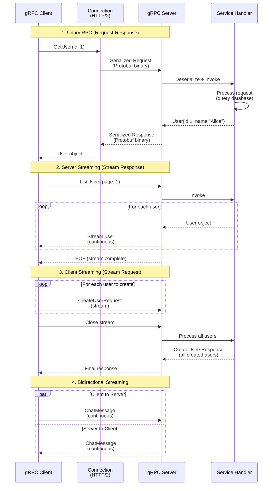

## Why gRPC & Protobuf Matter

gRPC is a high-performance RPC framework using Protocol Buffers (binary serialization) for microservice communication. Understanding gRPC prevents common REST API limitations (verbose JSON, no type safety, no streaming) while recognizing trade-offs (tooling complexity, browser support).

**Core benefits**:

- **Type-safe contracts**: Protocol Buffers define service interface (compile-time safety)
- **Binary serialization**: Smaller payloads and faster than JSON (3-5x)
- **Bi-directional streaming**: Server/client streaming, full-duplex communication
- **Language-agnostic**: Generate clients/servers for 10+ languages from single proto file
- **Built-in features**: Load balancing, authentication, deadlines, cancellation

**Problem**: Many teams default to REST without considering gRPC for service-to-service communication, leading to inefficient JSON parsing, manual client generation, and lack of streaming support.

**Solution**: Use gRPC for microservice communication (efficiency, type safety), REST for public APIs (browser support, simplicity). Master proto3 syntax before code generation.

## gRPC Client-Server Communication



**gRPC communication patterns**:

- **Unary RPC**: Single request → single response (like REST)
- **Server Streaming**: Single request → stream of responses (real-time updates)
- **Client Streaming**: Stream of requests → single response (bulk upload)
- **Bidirectional Streaming**: Both directions stream concurrently (chat, real-time collaboration)
- **HTTP/2 Multiplexing**: Multiple RPCs over single connection (efficient)

## Protocol Buffers First: Service Definition

Protocol Buffers (proto3) is interface definition language for gRPC services. Define messages (data structures) and services (RPC methods) in `.proto` files, then generate Go code.

**Installing protoc and Go plugins**:

```bash
# Install protoc (Protocol Buffer compiler)
# macOS:
brew install protobuf

# Linux:
apt-get install -y protobuf-compiler

# Install Go plugins for protoc
go install google.golang.org/protobuf/cmd/protoc-gen-go@latest
go install google.golang.org/grpc/cmd/protoc-gen-go-grpc@latest
# => protoc-gen-go generates Go structs from .proto
# => protoc-gen-go-grpc generates gRPC service code

# Add to PATH (if not already)
export PATH="$PATH:$(go env GOPATH)/bin"
```

**Basic proto3 syntax**:

```protobuf
// File: user.proto
syntax = "proto3";
// => proto3 is current Protocol Buffers version
// => proto2 is legacy (avoid for new projects)

package user;
// => package defines namespace
// => Prevents naming conflicts
// => Maps to Go package

option go_package = "example.com/myapp/user";
// => go_package sets generated Go package path
// => Required for Go code generation

// Message definition (data structure)
message User {
  // => message is like struct in Go

  int64 id = 1;
  // => int64 is field type (64-bit integer)
  // => id is field name
  // => 1 is field number (tag for binary encoding)
  // => Field numbers unique within message
  // => Field numbers 1-15 use 1 byte (use for frequent fields)

  string name = 2;
  // => string is UTF-8 text
  // => Field number 2

  string email = 3;
  repeated string tags = 4;
  // => repeated: field can have 0+ values (slice in Go)
  // => tags is array of strings
}

// Service definition (RPC interface)
service UserService {
  // => service defines RPC methods

  rpc GetUser(GetUserRequest) returns (GetUserResponse);
  // => rpc defines method
  // => GetUser is method name
  // => GetUserRequest is input message
  // => GetUserResponse is output message
  // => Unary RPC: single request, single response

  rpc ListUsers(ListUsersRequest) returns (stream User);
  // => stream User: server streaming
  // => Server sends multiple User messages
  // => Client receives stream of users

  rpc CreateUsers(stream CreateUserRequest) returns (CreateUsersResponse);
  // => stream CreateUserRequest: client streaming
  // => Client sends multiple requests
  // => Server returns single response

  rpc ChatUsers(stream ChatMessage) returns (stream ChatMessage);
  // => stream on both sides: bidirectional streaming
  // => Client and server send messages concurrently
}

// Request/Response messages
message GetUserRequest {
  int64 id = 1;
}

message GetUserResponse {
  User user = 1;
  // => user is nested message type
}

message ListUsersRequest {
  int32 page_size = 1;
  // => int32 is 32-bit integer
  // => Snake_case convention for proto fields
  int32 page = 2;
}

message CreateUserRequest {
  string name = 1;
  string email = 2;
  repeated string tags = 3;
}

message CreateUsersResponse {
  repeated User users = 1;
  // => repeated User: array of User messages
}

message ChatMessage {
  int64 user_id = 1;
  string text = 2;
  int64 timestamp = 3;
}
```

**Generating Go code**:

```bash
protoc --go_out=. --go-grpc_out=. user.proto
# => protoc is Protocol Buffer compiler
# => --go_out=. generates Go structs in current directory
# => --go-grpc_out=. generates gRPC service code
# => user.proto is proto file

# Generates:
# user.pb.go - message types (User, GetUserRequest, etc.)
# user_grpc.pb.go - service interface and client/server code
```

## gRPC Server Implementation

Implement server by defining struct that satisfies generated service interface.

**Basic unary server**:

```go
// File: server.go
package main

import (
    "context"
    // => Standard library for context
    "fmt"
    "log"
    "net"
    // => Standard library for network operations

    "google.golang.org/grpc"
    // => gRPC library
    pb "example.com/myapp/user"
    // => Import generated protobuf code
    // => pb is common alias for protobuf package
)

// UserServiceServer implements generated UserServiceServer interface
type UserServiceServer struct {
    pb.UnimplementedUserServiceServer
    // => Embed UnimplementedUserServiceServer for forward compatibility
    // => Provides default implementations for new methods
    // => Prevents compilation errors when proto updated

    users map[int64]*pb.User
    // => In-memory user storage (production: use database)
}

func NewUserServiceServer() *UserServiceServer {
    return &UserServiceServer{
        users: make(map[int64]*pb.User),
    }
}

// GetUser implements unary RPC
func (s *UserServiceServer) GetUser(ctx context.Context, req *pb.GetUserRequest) (*pb.GetUserResponse, error) {
    // => ctx is context for cancellation/timeout
    // => req is *GetUserRequest (pointer to request message)
    // => Returns *GetUserResponse and error

    log.Printf("GetUser called with ID: %d", req.GetId())
    // => req.GetId() is generated getter method
    // => Returns int64 value
    // => Returns zero value if field not set

    user, exists := s.users[req.GetId()]
    if !exists {
        return nil, fmt.Errorf("user %d not found", req.GetId())
        // => Return error (gRPC converts to status code)
        // => Client receives gRPC error
    }

    return &pb.GetUserResponse{User: user}, nil
    // => Return response message
    // => User field set to found user
}

func main() {
    lis, err := net.Listen("tcp", ":50051")
    // => net.Listen creates TCP listener
    // => :50051 is default gRPC port
    // => lis is net.Listener (accepts connections)

    if err != nil {
        log.Fatalf("Failed to listen: %v", err)
    }

    grpcServer := grpc.NewServer()
    // => grpc.NewServer creates gRPC server
    // => No default middleware (add manually)
    // => Safe for concurrent use

    userService := NewUserServiceServer()
    pb.RegisterUserServiceServer(grpcServer, userService)
    // => RegisterUserServiceServer registers service implementation
    // => Generated registration function
    // => grpcServer now handles UserService RPCs

    log.Println("gRPC server listening on :50051")
    if err := grpcServer.Serve(lis); err != nil {
        // => Serve accepts connections and handles RPCs
        // => Blocks until error or shutdown
        log.Fatalf("Failed to serve: %v", err)
    }
}
```

**Server-side streaming**:

```go
// ListUsers implements server streaming RPC
func (s *UserServiceServer) ListUsers(req *pb.ListUsersRequest, stream pb.UserService_ListUsersServer) error {
    // => req is request message
    // => stream is server stream (send multiple responses)
    // => Returns error when done or error occurs

    log.Printf("ListUsers called: page=%d, page_size=%d", req.GetPage(), req.GetPageSize())

    pageSize := req.GetPageSize()
    if pageSize <= 0 {
        pageSize = 10
        // => Default page size
    }

    start := (req.GetPage() - 1) * pageSize
    // => Calculate offset

    count := int32(0)
    for id, user := range s.users {
        // => Iterate over users

        if count >= pageSize {
            break
            // => Stop after pageSize users
        }

        if int64(start) > id {
            continue
            // => Skip users before offset
        }

        if err := stream.Send(user); err != nil {
            // => stream.Send sends User message to client
            // => Client receives message asynchronously
            // => Returns error if connection broken
            return fmt.Errorf("send failed: %w", err)
        }

        count++
    }

    return nil
    // => Return nil when done sending
    // => Client receives EOF (end of stream)
}
```

**Client-side streaming**:

```go
// CreateUsers implements client streaming RPC
func (s *UserServiceServer) CreateUsers(stream pb.UserService_CreateUsersServer) error {
    // => stream is bidirectional (receive from client, send response)
    // => Returns error when done or error occurs

    var createdUsers []*pb.User
    nextID := int64(len(s.users) + 1)

    for {
        // => Loop receives messages until client closes stream

        req, err := stream.Recv()
        // => stream.Recv receives next message from client
        // => Blocks until message available or stream closed
        // => Returns io.EOF when client closes stream

        if err == io.EOF {
            // => io.EOF indicates client finished sending
            // => Server should send final response

            return stream.SendAndClose(&pb.CreateUsersResponse{
                Users: createdUsers,
            })
            // => SendAndClose sends response and closes stream
            // => Client receives response
        }

        if err != nil {
            return fmt.Errorf("recv failed: %w", err)
        }

        user := &pb.User{
            Id:    nextID,
            Name:  req.GetName(),
            Email: req.GetEmail(),
            Tags:  req.GetTags(),
        }

        s.users[nextID] = user
        createdUsers = append(createdUsers, user)
        nextID++

        log.Printf("Created user: %s", user.GetName())
    }
}
```

**Bidirectional streaming**:

```go
// ChatUsers implements bidirectional streaming RPC
func (s *UserServiceServer) ChatUsers(stream pb.UserService_ChatUsersServer) error {
    // => stream is bidirectional (both send and receive)
    // => Returns error when done or error occurs

    for {
        msg, err := stream.Recv()
        // => Receive message from client
        // => Blocks until message available

        if err == io.EOF {
            // => Client closed stream
            return nil
        }

        if err != nil {
            return fmt.Errorf("recv failed: %w", err)
        }

        log.Printf("Received chat from user %d: %s", msg.GetUserId(), msg.GetText())

        // Echo message back to client
        response := &pb.ChatMessage{
            UserId:    0,
            // => Server user ID (e.g., 0 for system)
            Text:      fmt.Sprintf("Echo: %s", msg.GetText()),
            Timestamp: time.Now().Unix(),
        }

        if err := stream.Send(response); err != nil {
            // => Send message to client
            return fmt.Errorf("send failed: %w", err)
        }
    }
}
```

## gRPC Client Implementation

Generated client code provides type-safe methods for calling RPCs.

**Basic unary client**:

```go
// File: client.go
package main

import (
    "context"
    "log"
    "time"

    "google.golang.org/grpc"
    "google.golang.org/grpc/credentials/insecure"
    // => insecure credentials for development (production: use TLS)
    pb "example.com/myapp/user"
)

func main() {
    conn, err := grpc.Dial("localhost:50051", grpc.WithTransportCredentials(insecure.NewCredentials()))
    // => grpc.Dial creates client connection
    // => localhost:50051 is server address
    // => WithTransportCredentials specifies security (insecure for dev)
    // => Production: use TLS credentials
    // => Connection multiplexes RPCs (reuse for all calls)

    if err != nil {
        log.Fatalf("Failed to connect: %v", err)
    }
    defer conn.Close()
    // => Close connection when done

    client := pb.NewUserServiceClient(conn)
    // => NewUserServiceClient creates gRPC client
    // => Generated client constructor
    // => client provides typed methods for RPCs

    ctx, cancel := context.WithTimeout(context.Background(), 5*time.Second)
    // => ctx with 5-second timeout
    // => RPC fails if exceeds timeout
    defer cancel()

    // Call GetUser RPC
    req := &pb.GetUserRequest{Id: 1}
    // => Create request message

    resp, err := client.GetUser(ctx, req)
    // => client.GetUser calls RPC
    // => ctx for cancellation/timeout
    // => req is request message
    // => Returns response and error

    if err != nil {
        log.Fatalf("GetUser failed: %v", err)
    }

    log.Printf("User: %+v", resp.GetUser())
    // => resp.GetUser() returns *User
}
```

**Server streaming client**:

```go
func listUsersClient(client pb.UserServiceClient) {
    ctx := context.Background()

    req := &pb.ListUsersRequest{
        Page:     1,
        PageSize: 10,
    }

    stream, err := client.ListUsers(ctx, req)
    // => client.ListUsers returns stream
    // => stream receives User messages from server
    // => stream is pb.UserService_ListUsersClient

    if err != nil {
        log.Fatalf("ListUsers failed: %v", err)
    }

    for {
        user, err := stream.Recv()
        // => stream.Recv receives next User message
        // => Blocks until message available or stream closed

        if err == io.EOF {
            // => io.EOF indicates server finished sending
            break
        }

        if err != nil {
            log.Fatalf("Recv failed: %v", err)
        }

        log.Printf("Received user: %s", user.GetName())
    }
}
```

**Client streaming client**:

```go
func createUsersClient(client pb.UserServiceClient) {
    ctx := context.Background()

    stream, err := client.CreateUsers(ctx)
    // => client.CreateUsers returns stream
    // => stream sends CreateUserRequest messages to server

    if err != nil {
        log.Fatalf("CreateUsers failed: %v", err)
    }

    users := []*pb.CreateUserRequest{
        {Name: "Alice", Email: "alice@example.com", Tags: []string{"admin"}},
        {Name: "Bob", Email: "bob@example.com", Tags: []string{"user"}},
    }

    for _, user := range users {
        if err := stream.Send(user); err != nil {
            // => stream.Send sends message to server
            log.Fatalf("Send failed: %v", err)
        }
        log.Printf("Sent user: %s", user.GetName())
    }

    resp, err := stream.CloseAndRecv()
    // => CloseAndRecv closes stream and receives final response
    // => Server sends CreateUsersResponse
    // => Blocks until server responds

    if err != nil {
        log.Fatalf("CloseAndRecv failed: %v", err)
    }

    log.Printf("Created %d users", len(resp.GetUsers()))
}
```

**Bidirectional streaming client**:

```go
func chatUsersClient(client pb.UserServiceClient) {
    ctx := context.Background()

    stream, err := client.ChatUsers(ctx)
    // => Bidirectional stream
    // => Both send and receive concurrently

    if err != nil {
        log.Fatalf("ChatUsers failed: %v", err)
    }

    // Send messages in goroutine
    go func() {
        messages := []string{"Hello", "How are you?", "Goodbye"}

        for _, text := range messages {
            msg := &pb.ChatMessage{
                UserId:    1,
                Text:      text,
                Timestamp: time.Now().Unix(),
            }

            if err := stream.Send(msg); err != nil {
                log.Printf("Send failed: %v", err)
                return
            }

            time.Sleep(time.Second)
            // => Wait between messages
        }

        stream.CloseSend()
        // => CloseSend signals no more messages
        // => Server receives EOF on Recv
    }()

    // Receive messages in main goroutine
    for {
        msg, err := stream.Recv()

        if err == io.EOF {
            break
        }

        if err != nil {
            log.Fatalf("Recv failed: %v", err)
        }

        log.Printf("Received: %s", msg.GetText())
    }
}
```

## gRPC vs REST Comparison

**Use gRPC when**:

- **Service-to-service communication**: Microservices, backend APIs
- **Performance critical**: Low latency, high throughput required
- **Type safety important**: Compile-time contract enforcement
- **Streaming needed**: Server/client/bidirectional streaming
- **Polyglot systems**: Multiple languages (Go, Java, Python, etc.)

**Use REST when**:

- **Public APIs**: Browser clients, third-party integrations
- **Human-readable**: Debugging, testing with curl
- **Simplicity priority**: No protobuf tooling
- **Legacy compatibility**: Existing REST infrastructure

## Streaming Patterns

**Unary RPC**: Single request → single response (like REST)

- Use for: Simple queries, CRUD operations
- Example: GetUser, CreateUser

**Server streaming**: Single request → stream of responses

- Use for: Large result sets, real-time updates
- Example: ListUsers, StreamLogs, WatchEvents

**Client streaming**: Stream of requests → single response

- Use for: Bulk uploads, aggregation
- Example: CreateUsers, UploadFile

**Bidirectional streaming**: Stream ↔ stream (concurrent)

- Use for: Chat, real-time collaboration
- Example: Chat, VideoCall, GameSync

## Trade-offs Comparison

| Aspect                | gRPC                        | REST                           |
| --------------------- | --------------------------- | ------------------------------ |
| **Serialization**     | Binary (Protobuf)           | Text (JSON)                    |
| **Payload Size**      | Small (3-5x smaller)        | Large (verbose JSON)           |
| **Type Safety**       | Strong (compile-time)       | Weak (runtime)                 |
| **Streaming**         | Built-in (bi-directional)   | Limited (SSE, WebSocket)       |
| **Browser Support**   | Limited (grpc-web)          | Native                         |
| **Debugging**         | Requires tools (grpcurl)    | Easy (curl, browser)           |
| **Human Readability** | Binary (not readable)       | JSON (readable)                |
| **Code Generation**   | Required (protoc)           | Optional (OpenAPI)             |
| **HTTP Version**      | HTTP/2 (multiplexing)       | HTTP/1.1 (or HTTP/2)           |
| **Learning Curve**    | Medium (protobuf, tooling)  | Low (familiar)                 |
| **Performance**       | High (binary, multiplexing) | Medium (JSON parsing overhead) |

## Best Practices

**Proto file best practices**:

1. **Use proto3**: Modern syntax, better language support
2. **Reserve field numbers**: When removing fields, reserve numbers to prevent conflicts
3. **Use enums for constants**: Type-safe alternatives to magic numbers
4. **Document messages**: Add comments for fields and services
5. **Version services**: Include version in package name (v1, v2)
6. **Use descriptive names**: CamelCase for messages, snake_case for fields
7. **Group related messages**: Keep request/response together

**Server best practices**:

1. **Use context for cancellation**: Respect client cancellation
2. **Set timeouts**: Prevent long-running RPCs
3. **Validate input**: Check request fields before processing
4. **Handle errors properly**: Return appropriate status codes
5. **Log RPCs**: Record method, duration, status
6. **Use interceptors**: For auth, logging, metrics (middleware)
7. **Implement health checks**: For load balancers and orchestration
8. **Test streaming**: Verify stream handling (close, errors)

**Client best practices**:

1. **Reuse connections**: Create client once, reuse for all calls
2. **Set deadlines**: Use context.WithTimeout
3. **Handle stream errors**: Check both Recv and Send errors
4. **Implement retry logic**: With exponential backoff
5. **Use connection pooling**: For high-concurrency scenarios
6. **Monitor latency**: Track RPC duration and success rate
7. **Close streams**: Always close client streams (CloseAndRecv, CloseSend)

**Security best practices**:

1. **Use TLS**: Always in production (credentials.NewTLS)
2. **Authenticate clients**: Token-based auth, mTLS
3. **Validate permissions**: Authorization interceptor
4. **Rate limit**: Prevent abuse
5. **Input validation**: Sanitize and validate all inputs
