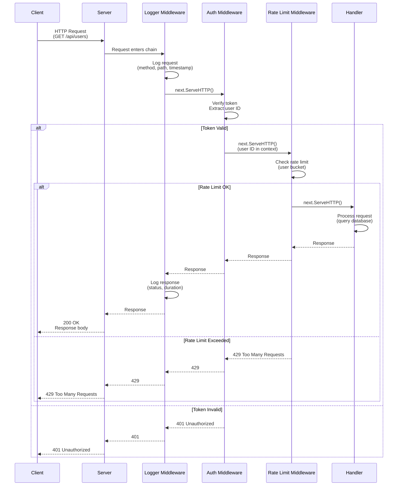

## Why HTTP Services Matter in Go

Go's `net/http` package is production-grade HTTP implementation used by major companies (Google, Uber, Cloudflare). Understanding standard library HTTP handling before adopting frameworks prevents over-engineering simple services and enables informed framework selection for complex APIs.

**Core benefits**:

- **Built-in production quality**: No external dependencies for basic HTTP servers
- **Concurrency built-in**: Each request handled in separate goroutine
- **HTTP/2 support**: Modern protocol support in standard library
- **Battle-tested**: Powers millions of production servers

**Problem**: Many developers immediately reach for frameworks without understanding standard library capabilities and limitations. This leads to unnecessary dependencies for simple services or poor framework choices for complex APIs.

**Solution**: Start with `net/http` for fundamentals, recognize limitations (routing, middleware), then introduce production frameworks (Gin/Echo) with clear rationale for specific use cases.

## HTTP Request Lifecycle with Middleware



**Middleware chain execution**:

- **Logger**: First middleware logs request details (timing starts)
- **Auth**: Validates token, adds user ID to context or returns 401
- **Rate Limit**: Checks user's rate bucket, allows or returns 429
- **Handler**: Business logic executes if all middleware passes
- **Response**: Flows back through middleware chain (logging duration)

## Standard Library First: net/http Basics

Go's `net/http` package provides HTTP server and client primitives. The core abstraction is `http.Handler`, an interface with a single method.

**Basic HTTP server pattern**:

```go
package main

import (
    "fmt"
    // => Standard library for formatted output
    "net/http"
    // => Standard library for HTTP server and client
    // => Includes Handler, HandlerFunc, ListenAndServe
    "log"
    // => Standard library for logging
)

// http.Handler interface has one method: ServeHTTP(ResponseWriter, *Request)
// => Any type implementing ServeHTTP is an http.Handler
// => ResponseWriter writes response data
// => *Request contains request data (method, URL, headers, body)

type HelloHandler struct{}
// => Custom handler type
// => Empty struct (no state)
// => Will implement ServeHTTP method

func (h HelloHandler) ServeHTTP(w http.ResponseWriter, r *http.Request) {
    // => w is http.ResponseWriter (output stream)
    // => r is *http.Request (input data)
    // => This method called for every request

    fmt.Fprintf(w, "Hello, %s!", r.URL.Path[1:])
    // => fmt.Fprintf writes formatted string to w
    // => r.URL.Path is request path (e.g., "/world")
    // => [1:] skips leading slash
    // => Output: Hello, world!
    // => Response automatically sent with status 200
}

func main() {
    handler := HelloHandler{}
    // => handler implements http.Handler

    log.Fatal(http.ListenAndServe(":8080", handler))
    // => ListenAndServe binds to port 8080
    // => handler.ServeHTTP called for every request
    // => Blocks until server errors
    // => log.Fatal logs error and exits
    // => Server runs in main goroutine
    // => Each request handled in separate goroutine (automatic)
}
```

**HandlerFunc adapter pattern**:

```go
package main

import (
    "fmt"
    "net/http"
    "log"
    // => Standard library imports
)

// http.HandlerFunc converts function to http.Handler
// => Allows using functions instead of types with methods
// => More concise for simple handlers
// => Still satisfies http.Handler interface

func helloHandler(w http.ResponseWriter, r *http.Request) {
    // => Regular function, not a method
    // => Same signature as ServeHTTP
    // => w is response writer, r is request

    name := r.URL.Query().Get("name")
    // => r.URL.Query() parses query string
    // => Get("name") retrieves "name" parameter
    // => Returns "" if parameter not present
    // => Example: /hello?name=Alice → name is "Alice"

    if name == "" {
        name = "World"
        // => Default value if parameter missing
    }

    fmt.Fprintf(w, "Hello, %s!", name)
    // => Output: Hello, Alice!
    // => Content-Type: text/plain (default)
}

func main() {
    http.HandleFunc("/hello", helloHandler)
    // => Registers helloHandler for path "/hello"
    // => http.HandleFunc converts func to http.HandlerFunc
    // => Uses default ServeMux (router)
    // => Exact path match (/hello matches, /hello/world does not)

    log.Fatal(http.ListenAndServe(":8080", nil))
    // => nil means use http.DefaultServeMux
    // => DefaultServeMux is global router
    // => Registered handlers (/hello) active
}
```

**JSON API pattern**:

```go
package main

import (
    "encoding/json"
    // => Standard library for JSON encoding/decoding
    "net/http"
    "log"
)

type User struct {
    ID   int    `json:"id"`
    // => json:"id" sets JSON field name
    // => Lowercase for external API consistency

    Name string `json:"name"`
    // => Name exported (capitalized) for encoding
    // => JSON field is "name" (lowercase)
}

func userHandler(w http.ResponseWriter, r *http.Request) {
    // => Handle GET /users

    user := User{ID: 1, Name: "Alice"}
    // => user is User struct
    // => Create sample data

    w.Header().Set("Content-Type", "application/json")
    // => w.Header() returns http.Header (map)
    // => Set("Content-Type", ...) sets response header
    // => Tells client response is JSON
    // => Must set before writing body

    json.NewEncoder(w).Encode(user)
    // => json.NewEncoder(w) creates encoder writing to w
    // => Encode(user) serializes user to JSON
    // => Writes: {"id":1,"name":"Alice"}
    // => Automatically flushes to client
    // => Error silently ignored (production: check error)
}

func main() {
    http.HandleFunc("/users", userHandler)
    // => Register handler for /users path

    log.Fatal(http.ListenAndServe(":8080", nil))
    // => Start server on port 8080
}
```

**HTTP methods and routing**:

```go
package main

import (
    "encoding/json"
    "fmt"
    "net/http"
    "log"
)

type User struct {
    ID   int    `json:"id"`
    Name string `json:"name"`
}

func usersHandler(w http.ResponseWriter, r *http.Request) {
    // => Single handler for multiple HTTP methods
    // => r.Method contains HTTP method (GET, POST, etc.)

    switch r.Method {
    case http.MethodGet:
        // => http.MethodGet is "GET" constant
        // => Handle GET /users (list users)

        users := []User{
            {ID: 1, Name: "Alice"},
            {ID: 2, Name: "Bob"},
        }
        // => users is slice of User

        w.Header().Set("Content-Type", "application/json")
        json.NewEncoder(w).Encode(users)
        // => Encode slice to JSON array
        // => Output: [{"id":1,"name":"Alice"},{"id":2,"name":"Bob"}]

    case http.MethodPost:
        // => Handle POST /users (create user)

        var user User
        // => user is zero-value User

        if err := json.NewDecoder(r.Body).Decode(&user); err != nil {
            // => json.NewDecoder(r.Body) reads from request body
            // => Decode(&user) parses JSON into user
            // => err is non-nil if JSON invalid

            http.Error(w, err.Error(), http.StatusBadRequest)
            // => http.Error sends error response
            // => err.Error() is error message
            // => http.StatusBadRequest is 400
            // => Sets Content-Type: text/plain
            return
        }
        defer r.Body.Close()
        // => Close request body after reading
        // => Prevents resource leak
        // => defer executes after function returns

        user.ID = 3
        // => Simulate ID assignment (production: database generates)

        w.Header().Set("Content-Type", "application/json")
        w.WriteHeader(http.StatusCreated)
        // => w.WriteHeader sets status code
        // => http.StatusCreated is 201
        // => Must call before writing body

        json.NewEncoder(w).Encode(user)
        // => Return created user with ID

    default:
        // => Handle unsupported methods (PUT, DELETE, etc.)

        http.Error(w, "Method not allowed", http.StatusMethodNotAllowed)
        // => http.StatusMethodNotAllowed is 405
    }
}

func main() {
    http.HandleFunc("/users", usersHandler)
    log.Fatal(http.ListenAndServe(":8080", nil))
}
```

**HTTP client pattern**:

```go
package main

import (
    "encoding/json"
    "fmt"
    "io"
    // => Standard library for I/O operations
    "net/http"
    "log"
)

type Post struct {
    ID     int    `json:"id"`
    Title  string `json:"title"`
    Body   string `json:"body"`
    UserID int    `json:"userId"`
}

func fetchPost(id int) (*Post, error) {
    // => Returns pointer to Post and error
    // => Pointer to avoid copying large struct

    url := fmt.Sprintf("https://jsonplaceholder.typicode.com/posts/%d", id)
    // => url is formatted string
    // => Example: https://jsonplaceholder.typicode.com/posts/1

    resp, err := http.Get(url)
    // => http.Get performs GET request
    // => resp is *http.Response (includes status, headers, body)
    // => err is non-nil if network error
    // => Uses http.DefaultClient (no timeout configuration)

    if err != nil {
        return nil, fmt.Errorf("request failed: %w", err)
        // => %w wraps error for error chain
        // => Caller can use errors.Is/As
    }
    defer resp.Body.Close()
    // => resp.Body is io.ReadCloser
    // => Must close to release connection
    // => defer ensures closure even if error occurs

    if resp.StatusCode != http.StatusOK {
        // => resp.StatusCode is HTTP status code (200, 404, 500, etc.)
        // => http.StatusOK is 200

        body, _ := io.ReadAll(resp.Body)
        // => io.ReadAll reads entire body
        // => Returns []byte
        // => Ignoring error for simplicity (production: handle it)

        return nil, fmt.Errorf("unexpected status %d: %s", resp.StatusCode, body)
        // => Return descriptive error with status and body
    }

    var post Post
    // => post is zero-value Post

    if err := json.NewDecoder(resp.Body).Decode(&post); err != nil {
        // => Decode response body into post
        return nil, fmt.Errorf("decode failed: %w", err)
    }

    return &post, nil
    // => Return pointer to post
}

func main() {
    post, err := fetchPost(1)
    // => Fetch post with ID 1

    if err != nil {
        log.Fatalf("Error: %v", err)
        // => Log error and exit
    }

    fmt.Printf("Post: %s\n", post.Title)
    // => Output: Post: sunt aut facere repellat provident occaecati...
}
```

**Limitations for production**:

- **No routing parameters**: Cannot extract `/users/:id` pattern (manual parsing required)
- **No middleware chaining**: Must manually wrap handlers for logging, auth, etc.
- **Global ServeMux**: `http.DefaultServeMux` is global (testing difficult)
- **Limited request validation**: No automatic validation or binding
- **No automatic error handling**: Must manually handle errors consistently
- **No built-in rate limiting**: Must implement custom middleware
- **No request timeouts by default**: Must configure `http.Client` manually

## Production Framework: Progression Strategy

For production REST APIs, progress through routing libraries to full frameworks based on application complexity.

**Progression pattern**:

1. **net/http** → Simple services (1-5 endpoints, no complex routing)
2. **chi/gorilla/mux** → Moderate services (routing parameters, middleware, 5-20 endpoints)
3. **Gin/Echo** → Complex services (validation, auto-binding, 20+ endpoints)

### chi: Lightweight Router with Middleware

`chi` is a lightweight, idiomatic router compatible with `net/http`. Use for services needing routing parameters and middleware without framework overhead.

**Installing chi**:

```bash
go get -u github.com/go-chi/chi/v5
# => Downloads chi v5 package
# => -u updates to latest version
# => Adds to go.mod dependencies
```

**chi routing pattern**:

```go
package main

import (
    "encoding/json"
    "net/http"
    "github.com/go-chi/chi/v5"
    // => chi router package
    // => v5 is version 5
    "github.com/go-chi/chi/v5/middleware"
    // => chi middleware (Logger, Recoverer, etc.)
    "log"
)

type User struct {
    ID   string `json:"id"`
    Name string `json:"name"`
}

func main() {
    r := chi.NewRouter()
    // => r is *chi.Mux (router)
    // => Compatible with http.Handler
    // => Supports middleware and route parameters

    r.Use(middleware.Logger)
    // => Logs all requests
    // => Logger is chi middleware (logs to stdout)
    // => Applied to all routes registered after this

    r.Use(middleware.Recoverer)
    // => Recovers from panics
    // => Returns 500 instead of crashing server
    // => Production safety (prevents panic crashes)

    r.Get("/users/{id}", func(w http.ResponseWriter, r *http.Request) {
        // => r.Get registers GET handler
        // => {id} is route parameter (extracted from path)

        userID := chi.URLParam(r, "id")
        // => chi.URLParam extracts route parameter
        // => "id" matches {id} in route pattern
        // => userID is string (e.g., "123")
        // => No type conversion (manual parsing needed)

        user := User{ID: userID, Name: "Alice"}
        // => Create user with extracted ID

        w.Header().Set("Content-Type", "application/json")
        json.NewEncoder(w).Encode(user)
        // => Encode user to JSON response
    })

    r.Post("/users", func(w http.ResponseWriter, r *http.Request) {
        // => r.Post registers POST handler
        // => Separate method handlers (more explicit than switch)

        var user User
        if err := json.NewDecoder(r.Body).Decode(&user); err != nil {
            http.Error(w, err.Error(), http.StatusBadRequest)
            return
        }
        defer r.Body.Close()

        user.ID = "123"
        // => Simulate ID generation

        w.Header().Set("Content-Type", "application/json")
        w.WriteHeader(http.StatusCreated)
        json.NewEncoder(w).Encode(user)
    })

    log.Fatal(http.ListenAndServe(":8080", r))
    // => r is http.Handler (chi.Mux implements it)
    // => All registered routes active
}
```

**chi middleware pattern**:

```go
package main

import (
    "context"
    "net/http"
    "github.com/go-chi/chi/v5"
    "log"
)

func authMiddleware(next http.Handler) http.Handler {
    // => Middleware wraps http.Handler
    // => Returns new handler that calls next after processing
    // => Standard middleware pattern (compatible with net/http)

    return http.HandlerFunc(func(w http.ResponseWriter, r *http.Request) {
        // => http.HandlerFunc converts function to http.Handler

        token := r.Header.Get("Authorization")
        // => Extract Authorization header
        // => Returns "" if header not present

        if token != "Bearer secret" {
            // => Simple token validation (production: JWT verification)

            http.Error(w, "Unauthorized", http.StatusUnauthorized)
            // => Return 401 Unauthorized
            return
            // => Request stops here (next not called)
        }

        ctx := context.WithValue(r.Context(), "userID", "123")
        // => r.Context() is request context
        // => WithValue adds key-value pair
        // => ctx is new context (original unchanged)
        // => userID available in handlers via context

        next.ServeHTTP(w, r.WithContext(ctx))
        // => r.WithContext(ctx) creates new request with ctx
        // => next.ServeHTTP calls next handler
        // => Request continues to actual handler
    })
}

func protectedHandler(w http.ResponseWriter, r *http.Request) {
    // => Handler for protected endpoint

    userID := r.Context().Value("userID").(string)
    // => r.Context() retrieves request context
    // => Value("userID") gets value set by middleware
    // => .(string) type assertion (convert interface{} to string)
    // => Panics if userID not string (production: check with two-value assertion)

    w.Write([]byte("Hello, user " + userID))
    // => w.Write writes []byte to response
    // => Output: Hello, user 123
}

func main() {
    r := chi.NewRouter()

    r.Use(authMiddleware)
    // => Apply authMiddleware to all routes
    // => All handlers protected by authentication

    r.Get("/protected", protectedHandler)
    // => GET /protected requires valid Authorization header

    log.Fatal(http.ListenAndServe(":8080", r))
}
```

### Gin: Production Framework for Complex APIs

Gin is a high-performance web framework with routing, validation, error handling, and automatic JSON binding. Use for complex APIs with many endpoints and rich request/response patterns.

**Installing Gin**:

```bash
go get -u github.com/gin-gonic/gin
# => Downloads Gin framework
# => Includes router, middleware, validation
```

**Gin basics**:

```go
package main

import (
    "net/http"
    "github.com/gin-gonic/gin"
    // => Gin web framework
    // => Includes router, middleware, context
)

type User struct {
    ID   string `json:"id" binding:"required"`
    // => binding:"required" validates field not empty
    // => Gin automatically validates on ShouldBindJSON

    Name string `json:"name" binding:"required,min=3"`
    // => binding:"required,min=3" requires non-empty string ≥3 chars
    // => Comma-separated validation rules
}

func main() {
    r := gin.Default()
    // => gin.Default() creates router with Logger and Recovery middleware
    // => gin.New() creates router without default middleware
    // => r is *gin.Engine (router)

    r.GET("/users/:id", func(c *gin.Context) {
        // => c is *gin.Context (request context)
        // => Wrapper around http.ResponseWriter and *http.Request
        // => Provides convenience methods (JSON, Param, etc.)

        userID := c.Param("id")
        // => c.Param extracts route parameter
        // => userID is string
        // => Same as chi.URLParam but more concise

        user := User{ID: userID, Name: "Alice"}

        c.JSON(http.StatusOK, user)
        // => c.JSON sends JSON response
        // => Sets Content-Type: application/json
        // => Automatically marshals user to JSON
        // => Returns: {"id":"123","name":"Alice"}
        // => More concise than json.NewEncoder
    })

    r.POST("/users", func(c *gin.Context) {
        var user User

        if err := c.ShouldBindJSON(&user); err != nil {
            // => c.ShouldBindJSON parses and validates JSON
            // => Checks binding tags (required, min, etc.)
            // => Returns error if validation fails
            // => Does NOT send error response (manual control)

            c.JSON(http.StatusBadRequest, gin.H{
                "error": err.Error(),
            })
            // => gin.H is shorthand for map[string]interface{}
            // => Returns: {"error":"validation message"}
            return
        }

        user.ID = "123"
        // => Assign ID (production: database generates)

        c.JSON(http.StatusCreated, user)
        // => Return created user with 201 status
    })

    r.Run(":8080")
    // => r.Run starts server
    // => Equivalent to http.ListenAndServe(":8080", r)
    // => Blocks until server errors
}
```

**Gin middleware and error handling**:

```go
package main

import (
    "net/http"
    "github.com/gin-gonic/gin"
)

func authMiddleware() gin.HandlerFunc {
    // => Returns gin.HandlerFunc (Gin middleware type)
    // => Similar to http.Handler but uses gin.Context

    return func(c *gin.Context) {
        // => c is *gin.Context

        token := c.GetHeader("Authorization")
        // => c.GetHeader is shorthand for c.Request.Header.Get

        if token != "Bearer secret" {
            c.JSON(http.StatusUnauthorized, gin.H{
                "error": "Unauthorized",
            })
            // => Send JSON error response

            c.Abort()
            // => c.Abort stops handler chain
            // => Remaining handlers not called
            // => Different from http.Handler (manual return)
            return
        }

        c.Set("userID", "123")
        // => c.Set stores value in gin.Context
        // => Available in all subsequent handlers
        // => Simpler than context.WithValue

        c.Next()
        // => c.Next calls next handler
        // => Optional (automatic if not called)
        // => Explicit call useful for measuring timing
    }
}

func protectedHandler(c *gin.Context) {
    userID, exists := c.Get("userID")
    // => c.Get retrieves value from context
    // => exists is false if key not found
    // => userID is interface{} (requires type assertion)

    if !exists {
        c.JSON(http.StatusInternalServerError, gin.H{
            "error": "User ID not found",
        })
        return
    }

    c.JSON(http.StatusOK, gin.H{
        "message": "Hello, user " + userID.(string),
    })
    // => userID.(string) type assertion
}

func main() {
    r := gin.Default()

    protected := r.Group("/api")
    // => protected is *gin.RouterGroup
    // => Groups routes with common prefix
    // => Middleware applied to group only

    protected.Use(authMiddleware())
    // => Apply authMiddleware to all routes in group
    // => /api/* endpoints require authentication

    protected.GET("/protected", protectedHandler)
    // => GET /api/protected (group prefix + route path)

    r.Run(":8080")
}
```

**Echo alternative**: Echo is similar to Gin with slightly different API design. Choose based on team preference.

```go
// Echo example (similar pattern)
package main

import (
    "net/http"
    "github.com/labstack/echo/v4"
    // => Echo web framework
    "github.com/labstack/echo/v4/middleware"
    // => Echo middleware
)

type User struct {
    ID   string `json:"id" validate:"required"`
    // => validate tag (Echo uses go-playground/validator)
    Name string `json:"name" validate:"required,min=3"`
}

func main() {
    e := echo.New()
    // => e is *echo.Echo (router)

    e.Use(middleware.Logger())
    // => Echo Logger middleware
    e.Use(middleware.Recover())
    // => Echo Recover middleware

    e.GET("/users/:id", func(c echo.Context) error {
        // => c is echo.Context
        // => Handler returns error (Echo pattern)

        userID := c.Param("id")
        user := User{ID: userID, Name: "Alice"}

        return c.JSON(http.StatusOK, user)
        // => c.JSON returns error (nil if successful)
        // => Echo handlers return error for centralized error handling
    })

    e.POST("/users", func(c echo.Context) error {
        var user User

        if err := c.Bind(&user); err != nil {
            // => c.Bind parses request body
            // => Returns error if binding fails
            return c.JSON(http.StatusBadRequest, map[string]string{
                "error": err.Error(),
            })
        }

        if err := c.Validate(user); err != nil {
            // => c.Validate checks validate tags
            // => Must register validator in Echo setup
            return c.JSON(http.StatusBadRequest, map[string]string{
                "error": err.Error(),
            })
        }

        user.ID = "123"
        return c.JSON(http.StatusCreated, user)
    })

    e.Start(":8080")
    // => Start Echo server
}
```

## Trade-offs Comparison

| Aspect               | net/http                        | chi                                | Gin                          | Echo                         |
| -------------------- | ------------------------------- | ---------------------------------- | ---------------------------- | ---------------------------- |
| **Dependencies**     | None (stdlib)                   | 1 (chi)                            | 30+ packages                 | 20+ packages                 |
| **Performance**      | High (baseline)                 | High (minimal overhead)            | Very High (optimized)        | Very High (optimized)        |
| **Route Parameters** | Manual parsing                  | `URLParam(r, "id")`                | `c.Param("id")`              | `c.Param("id")`              |
| **Middleware**       | Manual wrapping                 | Standard pattern                   | Framework API                | Framework API                |
| **Validation**       | Manual                          | Manual                             | Built-in (binding tags)      | Built-in (validate tags)     |
| **JSON Handling**    | `json.Encoder`                  | `json.Encoder`                     | `c.JSON()`                   | `c.JSON()`                   |
| **Error Handling**   | Manual                          | Manual                             | Manual                       | Return error                 |
| **Learning Curve**   | Medium                          | Low (extends stdlib)               | Medium                       | Medium                       |
| **Testing**          | Standard testing                | Standard testing                   | Test helpers                 | Test helpers                 |
| **Community**        | Huge (stdlib)                   | Growing                            | Large                        | Large                        |
| **When to Use**      | Simple services (1-5 endpoints) | Moderate services (5-20 endpoints) | Complex APIs (20+ endpoints) | Complex APIs (20+ endpoints) |

## Best Practices

**Use net/http when**:

- Service has 1-5 simple endpoints
- No complex routing patterns needed
- Minimizing dependencies is priority
- Team very familiar with standard library

**Use chi when**:

- Need routing parameters and middleware
- Want stdlib-compatible patterns
- Moderate complexity (5-20 endpoints)
- Prefer lightweight dependencies

**Use Gin/Echo when**:

- Complex API with many endpoints (20+)
- Need automatic validation and binding
- Want consistent error handling
- Team benefits from framework conventions

**HTTP server best practices**:

1. **Always set timeouts**: Configure `ReadTimeout`, `WriteTimeout`, `IdleTimeout`
2. **Use structured logging**: Log request ID, method, path, status, duration
3. **Implement health checks**: `/health` and `/ready` endpoints for orchestration
4. **Return proper status codes**: 200 (OK), 201 (Created), 400 (Bad Request), 404 (Not Found), 500 (Internal Server Error)
5. **Set security headers**: `Content-Type`, `X-Content-Type-Options`, `X-Frame-Options`
6. **Handle shutdown gracefully**: Use `server.Shutdown(ctx)` for graceful shutdown
7. **Test with httptest**: Use `httptest.NewRecorder()` and `httptest.NewRequest()` for testing

**HTTP client best practices**:

1. **Configure timeouts**: Set `Client.Timeout` (default: no timeout)
2. **Reuse http.Client**: Create once, reuse (connection pooling)
3. **Close response bodies**: Always defer `resp.Body.Close()`
4. **Check status codes**: Verify `resp.StatusCode` before processing body
5. **Handle retries**: Implement exponential backoff for transient failures
6. **Use context for cancellation**: Pass `ctx` to `req.WithContext(ctx)`
