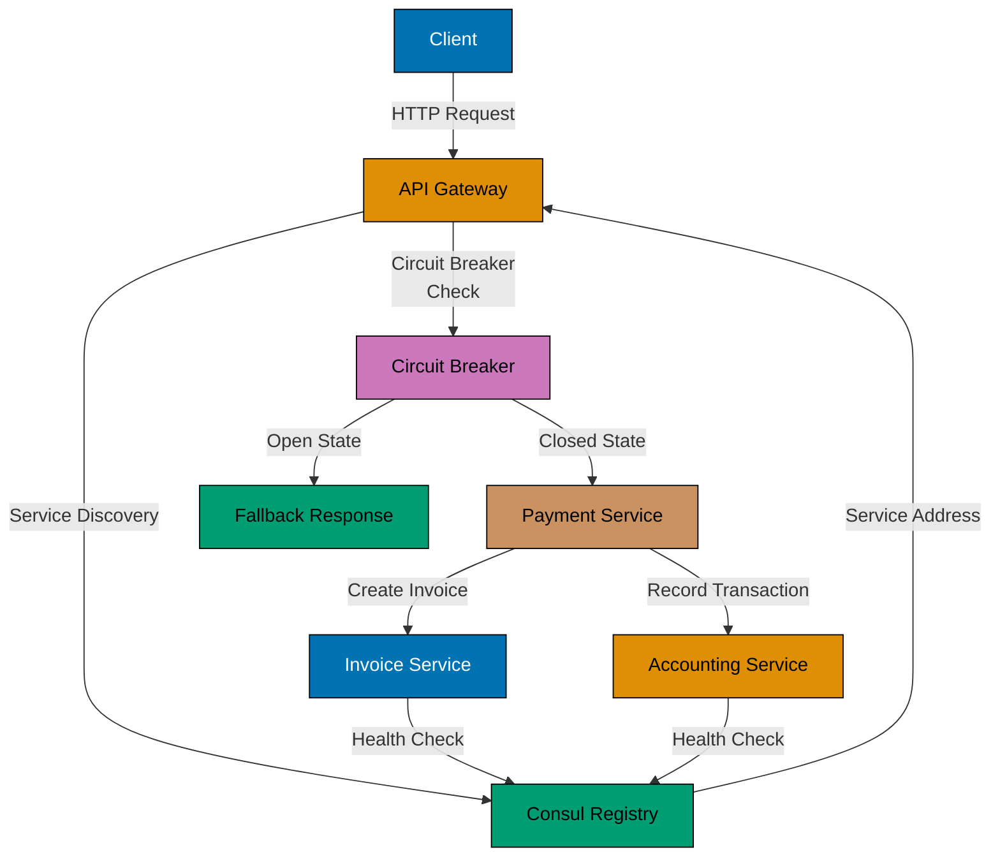

## Why Microservices Patterns Matter

Microservices decompose systems into independently deployable services, requiring careful attention to communication, resilience, and discovery. In financial systems like payment processing or accounting services, microservices enable independent scaling, team autonomy, and fault isolation, but introduce distributed system challenges.

**Core benefits**:

- **Independent deployment**: Update payment service without touching invoicing
- **Fault isolation**: Zakat calculator failure doesn't crash entire system
- **Technology flexibility**: Use Go for high-throughput services, Python for ML
- **Team autonomy**: Each service owned by different team

**Problem**: Without proper patterns, microservices create cascading failures, lost requests, configuration chaos, and debugging nightmares across distributed logs.

**Solution**: Apply service discovery, circuit breakers, rate limiting, retries with backoff, health checks, and graceful shutdown patterns using Go's standard library and production-grade libraries.

## Microservices Communication Flow



**Flow explanation**:

- **Client** sends request to **API Gateway** (single entry point)
- **Gateway** queries **Consul** for service locations (dynamic discovery)
- **Circuit Breaker** prevents cascading failures (fail fast when service unhealthy)
- **Payment Service** coordinates invoice and accounting calls
- Services register health status with **Consul** (automated health monitoring)

## Standard Library Approach: HTTP Services with Timeouts

Go's standard library provides http.Server, http.Client, and context for building resilient HTTP services without external dependencies.

### Service with Health Checks

```go
package main

import (
    "context"
    "encoding/json"
    // => Standard library JSON encoding
    "fmt"
    "log"
    "net/http"
    // => Standard library HTTP server
    "os"
    "os/signal"
    // => Signal handling for graceful shutdown
    "syscall"
    "time"
)

// ZakatService represents business service
// => Microservice component
type ZakatService struct {
    startTime time.Time
    // => Service start time for health check
}

// NewZakatService creates service instance
func NewZakatService() *ZakatService {
    return &ZakatService{
        startTime: time.Now(),
    }
}

// HealthCheck returns service health status
// => Health check endpoint pattern
func (s *ZakatService) HealthCheck(w http.ResponseWriter, r *http.Request) {
    // => HTTP handler signature
    // => w writes response, r contains request

    health := map[string]interface{}{
        "status": "healthy",
        // => Service status (healthy/unhealthy/degraded)
        "uptime": time.Since(s.startTime).String(),
        // => Uptime for monitoring
        "timestamp": time.Now().Unix(),
        // => Current timestamp
    }
    // => Health check response structure

    w.Header().Set("Content-Type", "application/json")
    // => Set response content type
    w.WriteHeader(http.StatusOK)
    // => 200 status code (healthy)
    json.NewEncoder(w).Encode(health)
    // => Write JSON response
    // => Standard library JSON encoder
}

// Calculate handles zakat calculation requests
// => Business endpoint
func (s *ZakatService) Calculate(w http.ResponseWriter, r *http.Request) {
    // => HTTP POST handler

    if r.Method != http.MethodPost {
        // => Validate HTTP method
        http.Error(w, "method not allowed", http.StatusMethodNotAllowed)
        // => 405 status code
        return
    }

    var req struct {
        Wealth float64 `json:"wealth"`
        Nisab  float64 `json:"nisab"`
    }
    // => Request structure

    err := json.NewDecoder(r.Body).Decode(&req)
    // => Decode JSON request body
    // => Standard library JSON decoder
    if err != nil {
        // => Invalid JSON
        http.Error(w, "invalid request", http.StatusBadRequest)
        // => 400 status code
        return
    }

    // Business logic (simplified)
    zakatDue := 0.0
    if req.Wealth >= req.Nisab {
        zakatDue = (req.Wealth - req.Nisab) * 0.025
    }

    response := map[string]interface{}{
        "wealth":      req.Wealth,
        "nisab":       req.Nisab,
        "zakat_due":   zakatDue,
        "is_eligible": req.Wealth >= req.Nisab,
    }

    w.Header().Set("Content-Type", "application/json")
    w.WriteHeader(http.StatusOK)
    json.NewEncoder(w).Encode(response)
}

func main() {
    service := NewZakatService()
    // => Create service instance

    mux := http.NewServeMux()
    // => Standard library router
    mux.HandleFunc("/health", service.HealthCheck)
    // => Health check endpoint
    mux.HandleFunc("/calculate", service.Calculate)
    // => Business endpoint

    server := &http.Server{
        Addr:         ":8080",
        // => Listen on port 8080
        Handler:      mux,
        // => Request router
        ReadTimeout:  10 * time.Second,
        // => Prevent slow client attacks
        WriteTimeout: 10 * time.Second,
        // => Prevent slow response attacks
        IdleTimeout:  60 * time.Second,
        // => Keep-alive timeout
    }
    // => Configure HTTP server with timeouts

    // Graceful shutdown handling
    // => Shutdown pattern for production services
    go func() {
        // => Goroutine for signal handling
        sigint := make(chan os.Signal, 1)
        // => Buffered channel for signals
        signal.Notify(sigint, os.Interrupt, syscall.SIGTERM)
        // => Register signal handlers
        // => SIGINT (Ctrl+C), SIGTERM (kill)

        <-sigint
        // => Block until signal received
        log.Println("shutting down server...")

        ctx, cancel := context.WithTimeout(context.Background(), 30*time.Second)
        // => Shutdown timeout context
        // => 30 seconds to finish in-flight requests
        defer cancel()

        if err := server.Shutdown(ctx); err != nil {
            // => Graceful shutdown
            // => Stops accepting new requests
            // => Waits for in-flight requests to complete
            log.Printf("server shutdown error: %v", err)
        }
        log.Println("server stopped")
    }()

    log.Printf("starting server on %s", server.Addr)
    if err := server.ListenAndServe(); err != http.ErrServerClosed {
        // => Start HTTP server
        // => Blocks until shutdown
        log.Fatalf("server error: %v", err)
    }
}
```

### HTTP Client with Retries

```go
package main

import (
    "bytes"
    "context"
    "encoding/json"
    "errors"
    "fmt"
    "net/http"
    "time"
)

// InvoiceClient calls invoice microservice
// => Client for inter-service communication
type InvoiceClient struct {
    baseURL string
    // => Target service URL
    client  *http.Client
    // => Reusable HTTP client (connection pooling)
}

// NewInvoiceClient creates configured client
func NewInvoiceClient(baseURL string) *InvoiceClient {
    return &InvoiceClient{
        baseURL: baseURL,
        client: &http.Client{
            Timeout: 5 * time.Second,
            // => Total request timeout
            // => Prevents hanging requests
        },
    }
}

// CreateInvoice sends request to invoice service with retry
// => Retry pattern with exponential backoff
func (c *InvoiceClient) CreateInvoice(ctx context.Context, invoice map[string]interface{}) error {
    // => context.Context for cancellation
    // => Propagates deadlines across services

    maxRetries := 3
    // => Maximum retry attempts
    backoff := 100 * time.Millisecond
    // => Initial backoff duration

    var lastErr error

    for attempt := 0; attempt < maxRetries; attempt++ {
        // => Retry loop

        if attempt > 0 {
            // => Wait before retry (not on first attempt)
            select {
            case <-time.After(backoff):
                // => Wait for backoff duration
            case <-ctx.Done():
                // => Context cancelled (timeout, cancellation)
                return ctx.Err()
            }

            backoff *= 2
            // => Exponential backoff
            // => 100ms → 200ms → 400ms
        }

        err := c.doRequest(ctx, invoice)
        // => Attempt request
        if err == nil {
            // => Success
            return nil
        }

        lastErr = err
        // => Save error for last attempt

        if !isRetryable(err) {
            // => Check if error is retryable
            // => Don't retry 4xx errors
            return err
        }

        log.Printf("attempt %d failed: %v, retrying...", attempt+1, err)
    }

    return fmt.Errorf("max retries exceeded: %w", lastErr)
    // => All retries failed
}

// doRequest performs single HTTP request
// => Separated for retry logic
func (c *InvoiceClient) doRequest(ctx context.Context, invoice map[string]interface{}) error {
    // => Single request attempt

    body, err := json.Marshal(invoice)
    // => Encode request body
    if err != nil {
        return err
    }

    req, err := http.NewRequestWithContext(ctx, "POST", c.baseURL+"/invoices", bytes.NewReader(body))
    // => Create request with context
    // => Context enables cancellation
    if err != nil {
        return err
    }

    req.Header.Set("Content-Type", "application/json")
    // => Set content type header

    resp, err := c.client.Do(req)
    // => Execute HTTP request
    // => Reuses connection pool
    if err != nil {
        return fmt.Errorf("request failed: %w", err)
    }
    defer resp.Body.Close()
    // => Always close response body

    if resp.StatusCode >= 500 {
        // => Server error (retryable)
        return fmt.Errorf("server error: %d", resp.StatusCode)
    }

    if resp.StatusCode >= 400 {
        // => Client error (not retryable)
        return fmt.Errorf("client error: %d", resp.StatusCode)
    }

    return nil
    // => Success (2xx status)
}

// isRetryable determines if error should be retried
// => Retry strategy
func isRetryable(err error) bool {
    // Check for server errors (5xx) or network errors
    // Don't retry client errors (4xx)
    // => Network errors: connection refused, timeout
    // => Server errors: 500, 502, 503, 504
    return true // Simplified for example
}
```

**Limitations of standard library approach**:

- Manual retry logic (boilerplate)
- No circuit breaker (failures cascade)
- No rate limiting (can overwhelm services)
- Manual service discovery (hardcoded URLs)
- No distributed tracing (debugging difficult)

## Production Patterns: Circuit Breaker, Rate Limiting, Service Discovery

Production microservices use specialized libraries for resilience patterns.

### Circuit Breaker with gobreaker

```bash
go get github.com/sony/gobreaker
# => Circuit breaker library
# => Prevents cascading failures
```

```go
package main

import (
    "context"
    "errors"
    "fmt"
    "github.com/sony/gobreaker"
    // => Circuit breaker library
    "net/http"
    "time"
)

// ResilientInvoiceClient wraps client with circuit breaker
// => Resilient communication pattern
type ResilientInvoiceClient struct {
    baseURL string
    client  *http.Client
    cb      *gobreaker.CircuitBreaker
    // => Circuit breaker state machine
}

// NewResilientInvoiceClient creates client with circuit breaker
func NewResilientInvoiceClient(baseURL string) *ResilientInvoiceClient {
    settings := gobreaker.Settings{
        Name:        "invoice-service",
        // => Circuit breaker name (for metrics)
        MaxRequests: 3,
        // => Max requests in half-open state
        // => Test if service recovered
        Interval:    10 * time.Second,
        // => Reset failure count interval
        Timeout:     30 * time.Second,
        // => Open state timeout before half-open
        // => Wait before retry
        ReadyToTrip: func(counts gobreaker.Counts) bool {
            // => Determines when to open circuit
            failureRatio := float64(counts.TotalFailures) / float64(counts.Requests)
            // => Calculate failure rate
            return counts.Requests >= 3 && failureRatio >= 0.6
            // => Open if ≥3 requests and ≥60% failure rate
        },
    }

    return &ResilientInvoiceClient{
        baseURL: baseURL,
        client: &http.Client{
            Timeout: 5 * time.Second,
        },
        cb: gobreaker.NewCircuitBreaker(settings),
        // => Create circuit breaker with settings
    }
}

// CreateInvoice sends request through circuit breaker
// => Circuit breaker prevents cascading failures
func (c *ResilientInvoiceClient) CreateInvoice(ctx context.Context, invoice map[string]interface{}) error {
    // => Wraps request in circuit breaker

    _, err := c.cb.Execute(func() (interface{}, error) {
        // => Circuit breaker executes function
        // => Tracks success/failure
        return nil, c.doRequest(ctx, invoice)
        // => Actual HTTP request
    })

    if err != nil {
        // => Request failed or circuit open
        if errors.Is(err, gobreaker.ErrOpenState) {
            // => Circuit breaker open (too many failures)
            return fmt.Errorf("invoice service unavailable (circuit open): %w", err)
        }
        return err
    }

    return nil
}

func (c *ResilientInvoiceClient) doRequest(ctx context.Context, invoice map[string]interface{}) error {
    // => Same implementation as before
    // => HTTP request with context
    return nil // Simplified
}
```

**Circuit breaker states**:

- **Closed**: Normal operation, requests pass through
- **Open**: Too many failures, requests rejected immediately (fail fast)
- **Half-Open**: Testing if service recovered, limited requests allowed

### Rate Limiting with golang.org/x/time/rate

```bash
go get golang.org/x/time/rate
# => Rate limiter from Go extended library
# => Token bucket algorithm
```

```go
package main

import (
    "context"
    "fmt"
    "golang.org/x/time/rate"
    // => Rate limiter (token bucket)
    "net/http"
)

// RateLimitedClient limits outgoing request rate
// => Prevents overwhelming downstream services
type RateLimitedClient struct {
    baseURL string
    client  *http.Client
    limiter *rate.Limiter
    // => Token bucket rate limiter
}

// NewRateLimitedClient creates client with rate limit
func NewRateLimitedClient(baseURL string, requestsPerSecond float64) *RateLimitedClient {
    return &RateLimitedClient{
        baseURL: baseURL,
        client:  &http.Client{},
        limiter: rate.NewLimiter(rate.Limit(requestsPerSecond), 1),
        // => rate.Limit: requests per second
        // => 1: burst size (max tokens)
        // => Token bucket: 10 req/sec, burst of 1
    }
}

// CreateInvoice sends rate-limited request
// => Waits for token before sending
func (c *RateLimitedClient) CreateInvoice(ctx context.Context, invoice map[string]interface{}) error {
    // => Rate-limited request

    err := c.limiter.Wait(ctx)
    // => Wait for token (blocks until available)
    // => Respects context cancellation
    // => Token consumed on return
    if err != nil {
        // => Context cancelled or deadline exceeded
        return fmt.Errorf("rate limit wait failed: %w", err)
    }

    // Proceed with request
    // => Token acquired, safe to send request
    return c.doRequest(ctx, invoice)
}

func (c *RateLimitedClient) doRequest(ctx context.Context, invoice map[string]interface{}) error {
    // => HTTP request implementation
    return nil // Simplified
}
```

### Service Discovery with Consul

```bash
go get github.com/hashicorp/consul/api
# => Consul client library
# => Service registry and discovery
```

```go
package main

import (
    "fmt"
    consulapi "github.com/hashicorp/consul/api"
    // => Consul API client
)

// ServiceRegistry handles service registration and discovery
// => Dynamic service location
type ServiceRegistry struct {
    client *consulapi.Client
    // => Consul client
}

// NewServiceRegistry creates Consul registry client
func NewServiceRegistry(consulAddr string) (*ServiceRegistry, error) {
    config := consulapi.DefaultConfig()
    // => Default Consul configuration
    config.Address = consulAddr
    // => Consul agent address (localhost:8500)

    client, err := consulapi.NewClient(config)
    // => Create Consul client
    if err != nil {
        return nil, fmt.Errorf("consul client creation failed: %w", err)
    }

    return &ServiceRegistry{client: client}, nil
}

// Register registers service with Consul
// => Service announces itself on startup
func (r *ServiceRegistry) Register(serviceID, serviceName, address string, port int) error {
    registration := &consulapi.AgentServiceRegistration{
        ID:      serviceID,
        // => Unique service instance ID
        Name:    serviceName,
        // => Service name (e.g., "zakat-service")
        Address: address,
        // => Service IP address
        Port:    port,
        // => Service port
        Check: &consulapi.AgentServiceCheck{
            HTTP:     fmt.Sprintf("http://%s:%d/health", address, port),
            // => Health check endpoint
            Interval: "10s",
            // => Check every 10 seconds
            Timeout:  "2s",
            // => Health check timeout
        },
        // => Consul health check configuration
    }

    err := r.client.Agent().ServiceRegister(registration)
    // => Register with Consul agent
    // => Service visible to other services
    if err != nil {
        return fmt.Errorf("service registration failed: %w", err)
    }

    return nil
}

// Discover finds healthy service instances
// => Dynamic service location
func (r *ServiceRegistry) Discover(serviceName string) (string, error) {
    services, _, err := r.client.Health().Service(serviceName, "", true, nil)
    // => Query healthy instances
    // => true: only passing health checks
    if err != nil {
        return "", fmt.Errorf("service discovery failed: %w", err)
    }

    if len(services) == 0 {
        // => No healthy instances
        return "", fmt.Errorf("no healthy instances of %s", serviceName)
    }

    // Simple load balancing: first healthy instance
    service := services[0]
    // => Production: round-robin, least connections
    address := fmt.Sprintf("http://%s:%d", service.Service.Address, service.Service.Port)
    // => Construct service URL
    return address, nil
}

// Deregister removes service from Consul
// => Called on graceful shutdown
func (r *ServiceRegistry) Deregister(serviceID string) error {
    err := r.client.Agent().ServiceDeregister(serviceID)
    // => Remove from registry
    if err != nil {
        return fmt.Errorf("service deregistration failed: %w", err)
    }
    return nil
}
```

**Trade-offs table**:

| Aspect                | Standard Library (HTTP + Context) | Production (Circuit Breaker + Rate Limit + Discovery) |
| --------------------- | --------------------------------- | ----------------------------------------------------- |
| **Resilience**        | Manual retries only               | Circuit breaker prevents cascading failures           |
| **Rate limiting**     | None (can overwhelm services)     | Token bucket limits request rate                      |
| **Service discovery** | Hardcoded URLs                    | Dynamic discovery with health checks                  |
| **Complexity**        | Low (HTTP + context)              | Medium (multiple libraries)                           |
| **Observability**     | Manual logging                    | Library metrics integration                           |
| **When to use**       | Single service                    | Microservices (>3 services)                           |

## Best Practices

1. **Health checks mandatory**: Every service must expose /health endpoint
2. **Graceful shutdown**: Handle SIGTERM, finish in-flight requests
3. **Context propagation**: Pass context.Context through all service calls
4. **Circuit breaker for external calls**: Wrap all inter-service HTTP calls
5. **Rate limiting outbound**: Protect downstream services from overload
6. **Timeouts everywhere**: Set read, write, idle, and request timeouts
7. **Structured logging**: Use JSON logs for aggregation (ELK, Splunk)

## Real-World Example: Payment Processing Microservices

```go
// Payment service with full resilience patterns
type PaymentService struct {
    invoiceClient    *ResilientInvoiceClient    // Circuit breaker
    accountingClient *RateLimitedClient         // Rate limiting
    registry         *ServiceRegistry           // Service discovery
}

func (s *PaymentService) ProcessPayment(ctx context.Context, payment Payment) error {
    // 1. Create invoice (with circuit breaker)
    err := s.invoiceClient.CreateInvoice(ctx, payment.Invoice())
    if err != nil {
        return fmt.Errorf("invoice creation failed: %w", err)
    }

    // 2. Record transaction (with rate limiting)
    err = s.accountingClient.RecordTransaction(ctx, payment.Transaction())
    if err != nil {
        // Compensating transaction (rollback invoice)
        return fmt.Errorf("accounting failed: %w", err)
    }

    return nil
}
```

**Microservices patterns demonstrated**:

- Circuit breaker isolates invoice service failures
- Rate limiting protects accounting service
- Service discovery enables dynamic routing
- Context propagation enables request cancellation
- Graceful shutdown prevents data loss
- Health checks enable automated recovery
