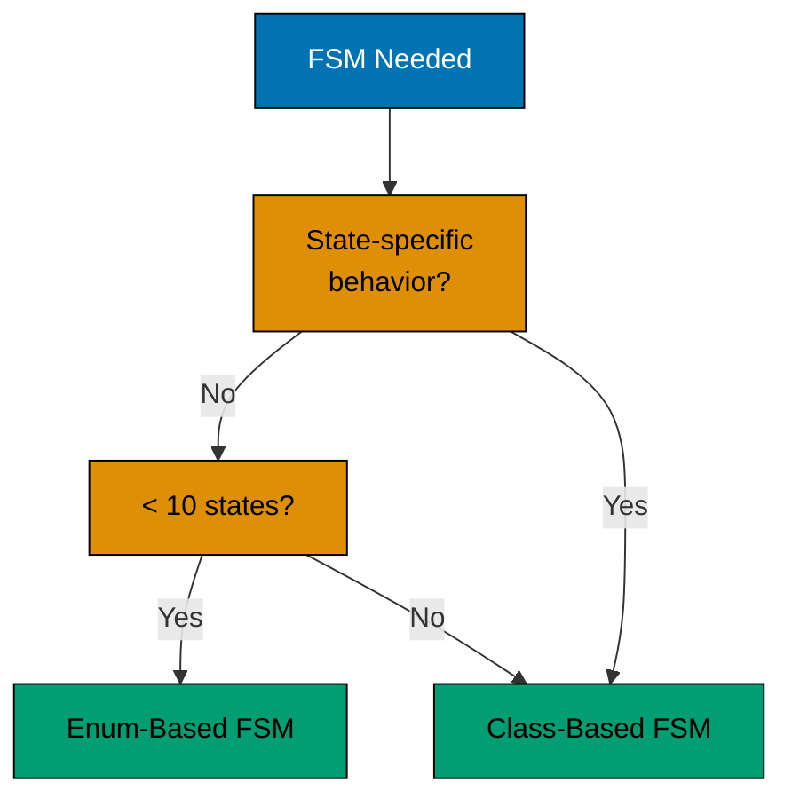

## Understanding Finite State Machines

Finite State Machines (FSMs) model systems with a finite number of states and well-defined transitions. They're essential for workflows, protocols, UI states, and any system where behavior depends on current state.

**Why use FSMs:**

- **Clarity**: All states and transitions explicit
- **Validation**: Illegal transitions prevented at design time
- **Testing**: Each state testable in isolation
- **Maintenance**: State logic centralized, not scattered

This guide covers enum-based FSMs for simple cases and class-based FSMs for complex state-dependent behavior.

## Enum-Based FSM Pattern

**Problem**: State management with boolean flags or string constants is error-prone. No compile-time verification of valid transitions.

**Recognition signals:**

- Multiple boolean flags tracking state
- String constants for states ("PENDING", "ACTIVE")
- Nested if-else checking current state
- No validation of state transitions
- Scattered state logic across methods

**Solution**: Enum-based FSM with explicit transition methods.

| Characteristic  | Boolean Flags                  | Enum-Based FSM                   |
| --------------- | ------------------------------ | -------------------------------- |
| Type safety     | None (any boolean combination) | Compile-time verified states     |
| Transitions     | Scattered if-else              | Centralized transition logic     |
| Invalid states  | Possible (contradictory flags) | Impossible (only one enum value) |
| Discoverability | Grep for flag usage            | All states in one enum           |

**Example transformation:**

```java
// => PROBLEMATIC: Boolean flag soup (anti-pattern)
public class Order {
    private boolean pending = true;
    private boolean confirmed = false;
    private boolean shipped = false;
    private boolean delivered = false;
    private boolean cancelled = false;
    // => PROBLEM 1: Can have contradictory states (pending=true, delivered=true)
    // => PROBLEM 2: No compile-time guarantee only one state active
    // => PROBLEM 3: No transition validation

    public void confirm() {
        pending = false;
        // => Sets pending false
        confirmed = true;
        // => Sets confirmed true
        // => DANGER: What if someone forgets to set pending=false?
        // => DANGER: No validation that current state is actually PENDING
    }
}

// => SOLUTION: Enum-based FSM (finite state machine)
public class Order {
    public enum State {
        PENDING, CONFIRMED, SHIPPED, DELIVERED, CANCELLED
        // => All possible states defined explicitly
        // => GUARANTEE: Only ONE state at a time (enum property)
    }

    private State state = State.PENDING;
    // => Single state field (not multiple booleans)
    // => INITIAL STATE: PENDING

    public void confirm() {
        validateTransition(State.PENDING, State.CONFIRMED);
        // => VALIDATE: Can only confirm if currently PENDING
        // => THROWS: IllegalStateException if invalid transition
        state = State.CONFIRMED;
        // => TRANSITION: PENDING → CONFIRMED
        // => ATOMIC: State change is single assignment
    }

    public void ship() {
        validateTransition(State.CONFIRMED, State.SHIPPED);
        // => VALIDATE: Can only ship if currently CONFIRMED
        state = State.SHIPPED;
        // => TRANSITION: CONFIRMED → SHIPPED
    }

    private void validateTransition(State expected, State next) {
        if (state != expected) {
            // => INVALID TRANSITION: Current state doesn't match expected
            throw new IllegalStateException(
                "Cannot transition from " + state + " to " + next);
            // => ERROR MESSAGE: Shows current and attempted transition
            // => PREVENTS: Invalid state changes (e.g., DELIVERED → PENDING)
        }
        // => VALID TRANSITION: Current state matches expected, allow change
    }
}
```

**State transition diagram:**

```mermaid
stateDiagram-v2
    accTitle: Enum-Based FSM Pattern
    accDescr: State diagram with 6 items: start or end, PENDING, CONFIRMED, CANCELLED, SHIPPED, DELIVERED. Relationships: start or end to PENDING; PENDING to CONFIRMED: confirm(); PENDING to CANCELLED: cancel(); CONFIRMED to SHIPPED: ship(); CONFIRMED to CANCELLED: cancel(); SHIPPED to DELIVERED: deliver(); DELIVERED to start or end; CANCELLED to start or end.
    [*] --> PENDING
    PENDING --> CONFIRMED: confirm()
    PENDING --> CANCELLED: cancel()
    CONFIRMED --> SHIPPED: ship()
    CONFIRMED --> CANCELLED: cancel()
    SHIPPED --> DELIVERED: deliver()
    DELIVERED --> [*]
    CANCELLED --> [*]

    classDef pal-0173B2 fill:#0173B2,stroke:#000000,color:#FFFFFF
    class PENDING pal-0173B2
    classDef pal-029E73 fill:#029E73,stroke:#000000,color:#000000
    class CONFIRMED pal-029E73
    classDef pal-DE8F05 fill:#DE8F05,stroke:#000000,color:#000000
    class SHIPPED pal-DE8F05
    class DELIVERED pal-029E73
    class CANCELLED pal-DE8F05
```

### Enum-Based Patterns

**Allowed transitions map:**

```java
public enum OrderState {
    PENDING(Set.of(CONFIRMED, CANCELLED)),
    CONFIRMED(Set.of(SHIPPED, CANCELLED)),
    SHIPPED(Set.of(DELIVERED)),
    DELIVERED(Set.of()),
    CANCELLED(Set.of());

    private final Set<OrderState> allowedTransitions;

    OrderState(Set<OrderState> allowedTransitions) {
        this.allowedTransitions = allowedTransitions;
    }

    public boolean canTransitionTo(OrderState target) {
        return allowedTransitions.contains(target);
    }
}

// USAGE
public void transition(OrderState newState) {
    if (!currentState.canTransitionTo(newState)) {
        throw new IllegalStateException(
            "Cannot transition from " + currentState + " to " + newState);
    }
    currentState = newState;
}
```

**Benefits:**

- Compile-time safety (only valid states)
- Self-documenting (enum lists all states)
- Centralized transition validation
- No contradictory state combinations

## Class-Based FSM Pattern

**Problem**: Complex FSMs need state-specific behavior. Enum-based FSMs with switch statements become unwieldy.

**Recognition signals:**

- Large switch statements on state enum
- State-specific logic scattered across methods
- Conditional behavior based on state
- Need for state-specific data
- Complicated state transition rules

**Solution**: State Pattern - each state is a class with state-specific behavior.

| Characteristic      | Enum with Switch        | State Pattern                |
| ------------------- | ----------------------- | ---------------------------- |
| State behavior      | Centralized switch      | Distributed in state classes |
| Adding states       | Modify all switches     | Add new state class          |
| State-specific data | Extra fields in context | Fields in state class        |
| Polymorphism        | Manual dispatch         | Automatic via inheritance    |

**Example:**

```java
// => STATE INTERFACE: Contract for all connection states
public interface ConnectionState {
    void connect(Connection context);
    // => Attempt to connect (behavior varies by state)
    void disconnect(Connection context);
    // => Attempt to disconnect (behavior varies by state)
    void send(Connection context, String data);
    // => Send data (behavior varies by state)
    String getStateName();
    // => Return state name for debugging
}

// => CONCRETE STATE: Disconnected state implementation
public class DisconnectedState implements ConnectionState {
    @Override
    public void connect(Connection context) {
        System.out.println("Connecting...");
        // => STATE-SPECIFIC BEHAVIOR: Connecting is valid when disconnected
        context.setState(new ConnectedState());
        // => TRANSITION: Change state to ConnectedState
        // => Context now holds ConnectedState instance
    }

    @Override
    public void disconnect(Connection context) {
        throw new IllegalStateException("Already disconnected");
        // => INVALID OPERATION: Can't disconnect when already disconnected
        // => STATE ENFORCEMENT: Prevents invalid operations
    }

    @Override
    public void send(Connection context, String data) {
        throw new IllegalStateException("Cannot send when disconnected");
        // => INVALID OPERATION: Can't send data without connection
        // => BUSINESS RULE: Enforced by state pattern
    }

    @Override
    public String getStateName() { return "DISCONNECTED"; }
    // => Returns: "DISCONNECTED" for logging/debugging
}

// => CONCRETE STATE: Connected state implementation
public class ConnectedState implements ConnectionState {
    @Override
    public void connect(Connection context) {
        throw new IllegalStateException("Already connected");
        // => INVALID OPERATION: Can't connect when already connected
    }

    @Override
    public void disconnect(Connection context) {
        System.out.println("Disconnecting...");
        // => STATE-SPECIFIC BEHAVIOR: Disconnecting is valid when connected
        context.setState(new DisconnectedState());
        // => TRANSITION: Change state to DisconnectedState
    }

    @Override
    public void send(Connection context, String data) {
        System.out.println("Sending: " + data);
        // => STATE-SPECIFIC BEHAVIOR: Sending allowed in connected state
        // => Example output: "Sending: Hello"
    }

    @Override
    public String getStateName() { return "CONNECTED"; }
}

// CONTEXT: Maintains current state
public class Connection {
    private ConnectionState state = new DisconnectedState();

    public void setState(ConnectionState state) {
        this.state = state;
    }

    public void connect() { state.connect(this); }
    public void disconnect() { state.disconnect(this); }
    public void send(String data) { state.send(this, data); }
    public String getStateName() { return state.getStateName(); }
}
```

**Usage:**

```java
Connection conn = new Connection();  // DISCONNECTED

conn.send("data");  // THROWS: Cannot send when disconnected
conn.connect();  // TRANSITION: DISCONNECTED → CONNECTED
conn.send("Hello");  // OUTPUT: Sending: Hello
conn.disconnect();  // TRANSITION: CONNECTED → DISCONNECTED
```

### State Pattern with Guards

**Problem**: Transitions may depend on conditions beyond current state.

**Solution**: Guard conditions in transition methods.

```java
public class AuthenticatedState implements LoginState {
    private int failedAttempts = 0;

    @Override
    public void login(LoginContext context, String password) {
        throw new IllegalStateException("Already authenticated");
    }

    @Override
    public void logout(LoginContext context) {
        context.setState(new LoggedOutState());
    }

    @Override
    public void failAuthentication(LoginContext context) {
        failedAttempts++;
        if (failedAttempts >= 3) {  // GUARD CONDITION
            context.setState(new LockedState());  // CONDITIONAL TRANSITION
        }
    }
}
```

## Choosing Between Patterns

| Factor            | Enum-Based FSM          | Class-Based FSM                 |
| ----------------- | ----------------------- | ------------------------------- |
| Complexity        | Simple state management | Complex state-specific behavior |
| State count       | Few states (< 10)       | Many states                     |
| Behavior variance | Minimal per state       | Significant per state           |
| Transition rules  | Simple                  | Complex with guards             |
| State data        | None or context-wide    | State-specific data needed      |

**Decision flowchart:**



## Practical Patterns

### FSM with Event Queue

Handle events while in transition:

```java
public class StatefulService {
    private State state = State.IDLE;
    private final Queue<Event> eventQueue = new ArrayDeque<>();
    private boolean processing = false;

    public void handleEvent(Event event) {
        eventQueue.add(event);
        if (!processing) {
            processEvents();
        }
    }

    private void processEvents() {
        processing = true;
        while (!eventQueue.isEmpty()) {
            Event event = eventQueue.poll();
            state = state.transition(event);  // STATE TRANSITION
        }
        processing = false;
    }
}
```

### FSM with History

Track state history for debugging or undo:

```java
public class StatefulConnection {
    private ConnectionState state;
    private final List<StateTransition> history = new ArrayList<>();

    public void setState(ConnectionState newState) {
        history.add(new StateTransition(
            state,
            newState,
            Instant.now()
        ));
        state = newState;
    }

    public List<StateTransition> getHistory() {
        return Collections.unmodifiableList(history);
    }
}
```

### Hierarchical FSM

States contain sub-FSMs:

```java
public class OrderState {
    enum Phase { PROCESSING, SHIPPING, COMPLETED }
    enum ProcessingSubState { PENDING, CONFIRMED, PREPARING }
    enum ShippingSubState { DISPATCHED, IN_TRANSIT, DELIVERED }

    private Phase phase;
    private ProcessingSubState processingSubState;
    private ShippingSubState shippingSubState;

    // Transition logic considers both parent and sub-state
}
```

## Testing FSMs

**Enum-based FSM testing:**

```java
@Test
void shouldTransitionFromPendingToConfirmed() {
    Order order = new Order();
    assertEquals(State.PENDING, order.getState());

    order.confirm();
    assertEquals(State.CONFIRMED, order.getState());
}

@Test
void shouldRejectInvalidTransition() {
    Order order = new Order();
    order.confirm();  // PENDING → CONFIRMED

    assertThrows(IllegalStateException.class, () -> order.ship());
    // CANNOT: CONFIRMED → SHIPPED requires intermediate state
}
```

**State pattern testing:**

```java
@Test
void shouldTransitionStates() {
    Connection conn = new Connection();
    assertEquals("DISCONNECTED", conn.getStateName());

    conn.connect();
    assertEquals("CONNECTED", conn.getStateName());
}

@Test
void shouldEnforceStateSpecificBehavior() {
    Connection conn = new Connection();

    assertThrows(IllegalStateException.class,
        () -> conn.send("data"));  // CANNOT SEND WHEN DISCONNECTED
}
```

## Migration Strategy

Transform boolean flags to FSM incrementally:

**Phase 1**: Identify states from flags

```java
// BEFORE: Boolean flags
boolean pending, active, completed;

// AFTER: Enum states
enum State { PENDING, ACTIVE, COMPLETED }
```

**Phase 2**: Replace flag checks with state checks

```java
// BEFORE
if (pending && !active) {
    // logic
}

// AFTER
if (state == State.PENDING) {
    // logic
}
```

**Phase 3**: Add transition validation

```java
public void activate() {
    if (state != State.PENDING) {
        throw new IllegalStateException("Must be PENDING to activate");
    }
    state = State.ACTIVE;
}
```

**Phase 4**: Extract state-specific behavior (if complex)

```java
// Refactor to State Pattern if behavior varies significantly by state
```

## Guidelines

**When to use FSMs:**

- ✓ Workflows with defined stages
- ✓ Network protocol implementations
- ✓ UI state management
- ✓ Game character states
- ✓ Document approval flows

**When to avoid:**

- ✗ Simple on/off toggles (single boolean sufficient)
- ✗ No transitions (just independent states)
- ✗ State is purely data with no behavior

**Best practices:**

1. **Start with enum-based**: Simplest working solution first
2. **Validate transitions**: Prevent illegal state changes
3. **Document state diagram**: Visual representation aids understanding
4. **Test all transitions**: Verify valid and invalid transitions
5. **Consider immutability**: Return new state objects instead of mutation

## Conclusion

Finite State Machines provide:

- **Explicit state management**: All states and transitions clear
- **Compile-time safety**: Invalid states prevented
- **Maintainability**: State logic centralized
- **Testability**: Each state verifiable independently

Start with enum-based FSMs for simple state management. Graduate to class-based State Pattern when state-specific behavior dominates. FSMs eliminate boolean flag confusion and make state transitions explicit, preventing bugs and improving code clarity.
