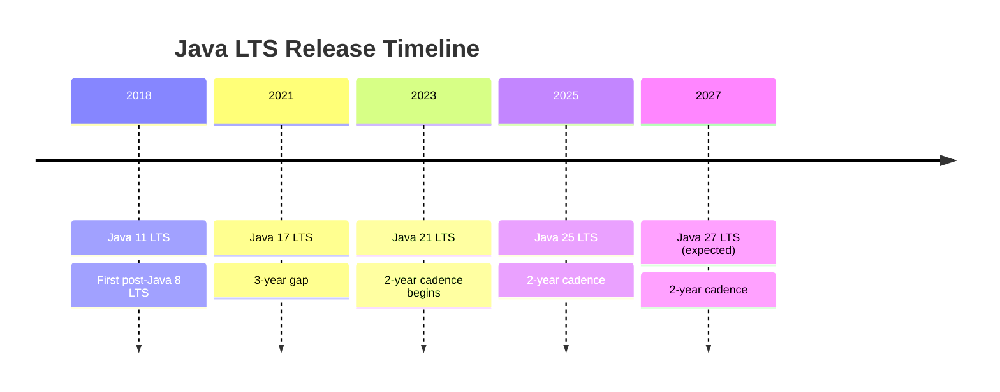

## Release Coverage

This section provides **comprehensive coverage** of all Java releases from the **last 5 years** (2020-2025), including both LTS (Long-Term Support) and non-LTS releases. While LTS versions are highlighted for production use, non-LTS releases are documented to show feature evolution and preview stages.

**Complete release coverage:** Java 14, 15, 16, 17 LTS, 18, 19, 20, 21 LTS, 22, 23, and 25 LTS.

## LTS Release Strategy

Oracle's Long-Term Support (LTS) strategy provides predictable, stable Java versions for enterprise applications.

## Primary LTS Releases

The three major LTS releases from the last 5 years:

- **[Java 17 LTS](/en/learn/software-engineering/programming-languages/java/release-highlights/java-17-lts)** (September 2021) - Sealed classes, pattern matching preview, enhanced PRNG
- **[Java 21 LTS](/en/learn/software-engineering/programming-languages/java/release-highlights/java-21-lts)** (September 2023) - Virtual threads, sequenced collections, pattern matching finalized
- **[Java 25 LTS](/en/learn/software-engineering/programming-languages/java/release-highlights/java-25-lts)** (September 2025) - Stream gatherers, compact headers, performance optimizations

## LTS Cadence

Oracle delivers LTS releases every **2 years** (reduced from 3 years in 2023):

## Why LTS Matters

**Long-Term Support** provides:

- **8+ years** of security updates and bug fixes
- **Stability** for production applications
- **Predictable** upgrade cycles
- **Enterprise-ready** releases with extensive testing
- **Ecosystem support** from frameworks, libraries, and tools

## Feature Evolution

Key features evolve across LTS releases:

| Feature                   | Java 17 (2021) | Java 21 (2023) | Java 25 (2025) |
| ------------------------- | -------------- | -------------- | -------------- |
| **Sealed Classes**        | ✅ Finalized   | ✅ Available   | ✅ Available   |
| **Pattern Matching**      | 🔬 Preview     | ✅ Finalized   | ✅ Enhanced    |
| **Virtual Threads**       | ❌ None        | ✅ Finalized   | ✅ Optimized   |
| **Sequenced Collections** | ❌ None        | ✅ Finalized   | ✅ Available   |
| **Stream Gatherers**      | ❌ None        | ❌ None        | ✅ Finalized   |
| **Compact Headers**       | ❌ None        | ❌ None        | ✅ Finalized   |

Legend:

- ✅ **Finalized** - Production-ready
- 🔬 **Preview** - Feature complete, requires `--enable-preview`
- ❌ **None** - Not available

## Choosing Your LTS Version

**For new projects in 2026:**

- **Start with Java 21** - Virtual threads essential for modern concurrency
- **Consider Java 25** - If cutting-edge performance and latest features needed

**For existing applications:**

- **Java 8/11 → Java 17** - Solid foundation, mature ecosystem
- **Java 17 → Java 21** - Virtual threads unlock massive concurrency
- **Java 21 → Java 25** - Performance optimization (20-40% gains)

## Support Timeline

| Version | Release Date | Premier Support Until | Extended Support Until |
| ------- | ------------ | --------------------- | ---------------------- |
| Java 17 | Sep 2021     | Sep 2026              | Sep 2029               |
| Java 21 | Sep 2023     | Sep 2028              | Sep 2031               |
| Java 25 | Sep 2025     | Sep 2030              | Sep 2033               |

**Note:** Oracle provides 8 years of support (5 years premier + 3 years extended).

## Non-LTS Releases

Non-LTS releases deliver features every 6 months, often in preview stages before finalizing in LTS versions:

**2020:** [Java 14](/en/learn/software-engineering/programming-languages/java/release-highlights/java-14), [Java 15](/en/learn/software-engineering/programming-languages/java/release-highlights/java-15)

**2021:** [Java 16](/en/learn/software-engineering/programming-languages/java/release-highlights/java-16)

**2022:** [Java 18](/en/learn/software-engineering/programming-languages/java/release-highlights/java-18), [Java 19](/en/learn/software-engineering/programming-languages/java/release-highlights/java-19) (Virtual Threads preview)

**2023:** [Java 20](/en/learn/software-engineering/programming-languages/java/release-highlights/java-20)

**2024:** [Java 22](/en/learn/software-engineering/programming-languages/java/release-highlights/java-22), [Java 23](/en/learn/software-engineering/programming-languages/java/release-highlights/java-23)

**Why document non-LTS releases?** Understanding feature evolution from preview to finalization helps developers anticipate LTS capabilities and make informed decisions.

## Indonesian Translation Status

Indonesian (`/id/`) translations for release highlights are **pending**. English versions provide complete coverage of all releases from Java 14 to Java 25.

## Next Steps

**For production systems (LTS focus):**

1. **[Java 17 Highlights](/en/learn/software-engineering/programming-languages/java/release-highlights/java-17-lts)** - Foundation features (sealed classes, pattern matching preview)
2. **[Java 21 Highlights](/en/learn/software-engineering/programming-languages/java/release-highlights/java-21-lts)** - Concurrency revolution (virtual threads)
3. **[Java 25 Highlights](/en/learn/software-engineering/programming-languages/java/release-highlights/java-25-lts)** - Performance optimization (compact headers, stream gatherers)

**For comprehensive understanding (all releases):**

Explore releases chronologically from [Java 14](/en/learn/software-engineering/programming-languages/java/release-highlights/java-14) through [Java 25](/en/learn/software-engineering/programming-languages/java/release-highlights/java-25-lts) to see complete feature evolution and preview stages.
