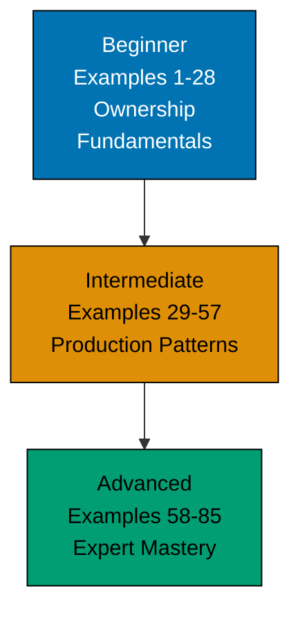
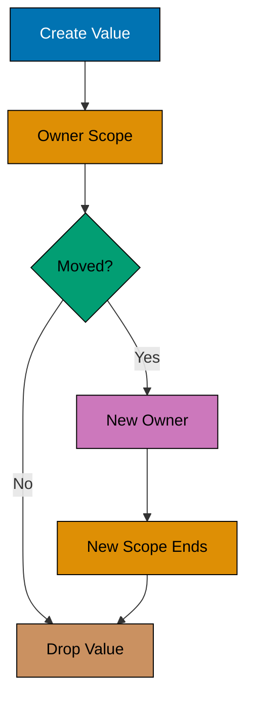

## What is By-Example Learning?

By-example learning is a **code-first approach** designed for experienced developers switching to Rust. Instead of lengthy explanations, you see working code first, run it second, and understand through direct interaction.

### Philosophy: Show, Don't Tell

Every example in this tutorial follows a simple principle: **the code speaks for itself**. You'll learn Rust by:

1. **Reading annotated code** with inline explanations of what happens at each step
2. **Running examples** to see outputs and behavior immediately
3. **Understanding patterns** through repetition and variation across 85 examples

This tutorial assumes you're familiar with programming concepts (variables, functions, control flow) but new to Rust's unique ownership model and systems programming approach.

## Learning Path



Progress from ownership fundamentals through production patterns to expert mastery. Each level builds on the previous, with ownership understanding being the critical foundation.

## Coverage Philosophy

This tutorial covers core language features comprehensively through practical, annotated examples. The coverage percentage reflects concept breadth, not a time estimate—focus is on **outcomes and understanding**, not duration.

### What's Covered

- Core syntax: variables, functions, control flow, pattern matching
- Ownership system: borrowing, lifetimes, moves
- Type system: structs, enums, traits, generics
- Standard library: collections, iterators, I/O, strings
- Error handling: Result, Option, panic, error propagation
- Concurrency: threads, channels, Arc, Mutex
- Modern features: closures, trait objects, async/await
- Testing and documentation
- Performance patterns and optimization
- Common ecosystem patterns (Serde, Tokio basics)

### What's NOT Covered

This guide focuses on **learning-oriented examples**, not problem-solving recipes or production deployment. For additional topics:

- **Compiler internals and MIR** - Implementation details beyond the language
- **Nightly-only features** - Unstable features not ready for production
- **Embedded systems specifics** - no_std advanced patterns for bare metal
- **Low-level assembly integration** - inline assembly and architecture specifics
- **Custom allocators and panic handlers** - Advanced runtime customization
- **Advanced macro_rules edge cases** - Obscure macro patterns

The comprehensive coverage goal maintains humility—no tutorial can cover everything. This guide teaches the **core concepts that continue learning beyond this tutorial** through your own exploration and project work.

## Tutorial Structure: 85 Examples Across 3 Levels

### Beginner (Examples 1-28, fundamental concepts)

**Focus**: Rust fundamentals and the ownership model

Learn variables, functions, structs, enums, pattern matching, and Rust's unique approach to memory safety through ownership and borrowing. By example 28, you'll understand why Rust doesn't need a garbage collector.

**Key topics**: Hello World, variables, types, functions, ownership, borrowing, slices, structs, enums, pattern matching, error handling (Result/Option), basic testing.

### Intermediate (Examples 29-57, production patterns)

**Focus**: Production patterns and idiomatic Rust

Master lifetimes, traits, generics, iterators, closures, smart pointers, and concurrent programming. Learn how to write safe, performant Rust that leverages the type system for correctness.

**Key topics**: Lifetimes, trait definitions and implementations, generics, iterators, closures, Box/Rc/Arc, RefCell, threads, channels, Mutex, error handling patterns, common crates.

### Advanced (Examples 58-85): Advanced mastery

**Focus**: Expert mastery and performance optimization

Explore unsafe code, procedural macros, async/await, advanced trait patterns, FFI, zero-cost abstractions, and performance tuning. Learn when to break Rust's safety guarantees responsibly.

**Key topics**: Unsafe code, raw pointers, FFI, procedural macros, async/await, Pin, advanced traits (associated types, GATs), performance optimization, profiling, advanced patterns.

## Prerequisites

**Required**:

- Experience with at least one programming language
- Ability to run Rust programs (`rustc` or `cargo`)

**Recommended (helpful but not required)**:

- Familiarity with systems programming concepts (memory, pointers)
- Experience with statically typed languages (C, C++, Java, Go)
- Understanding of compilation and linking basics

**No prior Rust experience required** - This guide assumes you're new to Rust but experienced with programming in general. You should be comfortable reading code, understanding basic programming concepts (variables, functions, loops), and learning through hands-on experimentation.

## How to Use This Tutorial

### Run Every Example

Each example is **self-contained and runnable**. Copy the code, save it as `example.rs`, and run:

```bash
rustc example.rs && ./example    # Compile and run
# or use Cargo for workspace examples
cargo new example && cd example  # Create new project
# Replace src/main.rs with example code
cargo run                        # Build and run
```

Most examples include a `main()` function and are ready to compile immediately.

### Read the Annotations

Rust code uses `// =>` comments to show outputs, ownership transfers, and state changes:

```rust
let x = 5;                       // => x is 5 (i32), owned by current scope
let y = x;                       // => y is 5 (ownership copied, x still valid - i32 is Copy)
println!("{}", x);               // => Output: 5 (x still accessible)

let s1 = String::from("hello");  // => s1 owns heap-allocated "hello"
let s2 = s1;                     // => s2 now owns "hello", s1 invalidated (move)
// println!("{}", s1);           // => ERROR: s1 no longer valid
```

These annotations explain:

- **Variable states**: Value, type, and ownership status
- **Ownership transfers**: When values move vs. copy
- **Outputs**: What prints to stdout/stderr
- **Compiler errors**: What won't compile and why

### Follow the Progression

Start with **Beginner** even if you're an experienced developer. Rust's ownership model is unique and requires building intuition from fundamentals. The examples progress deliberately:

- **Examples 1-10**: Basic syntax (feels familiar)
- **Examples 11-20**: Ownership emerges (feels different)
- **Examples 21-28**: Borrowing patterns (feels natural)

Skipping ahead may leave gaps in ownership understanding that cause confusion later.

### Experiment and Break Things

After reading each example:

1. **Modify values** - Change inputs and predict outputs
2. **Break ownership rules** - Uncomment error cases to see compiler messages
3. **Extend examples** - Add features using patterns you've learned

Rust's compiler is your teacher. Error messages explain what's wrong and often suggest fixes.

## Five-Part Example Format

Every example follows a consistent structure:

### 1. Brief Explanation (2-3 sentences)

Context and motivation: What is this concept? Why does it matter? When should you use it?

### 2. Mermaid Diagram (30-50% of examples)

Visual representation of data flow, ownership transfers, state transitions, or concurrency patterns. Diagrams use color-blind friendly colors and focus on non-obvious concepts.

### 3. Heavily Annotated Code

Runnable Rust code with inline `// =>` comments showing outputs, ownership states, and side effects. Every significant line is explained.

### 4. Key Takeaway (1-2 sentences)

The core insight distilled: most important pattern, when to apply it, common pitfalls to avoid.

### 5. Why It Matters (2-3 sentences)

Production relevance connecting the concept to real-world systems, comparing to alternatives, and explaining consequences for quality, performance, or safety.

## Example Template

Here's what a typical example looks like:

### Example N: Concept Name

Rust's ownership system ensures memory safety without garbage collection by enforcing rules at compile time. Each value has a single owner, and when the owner goes out of scope, the value is dropped automatically.



```rust
fn main() {
    let s1 = String::from("hello");  // => s1 owns heap string "hello"
    let s2 = s1;                     // => Ownership moved to s2, s1 invalidated

    println!("{}", s2);              // => Output: hello
    // println!("{}", s1);           // => ERROR: s1 no longer valid
}                                    // => s2 dropped, heap memory freed
```

**Key Takeaway**: Rust's move semantics prevent use-after-free bugs by invalidating the original binding when ownership transfers, ensuring only one owner can access heap-allocated data at a time.

**Why It Matters**: Move semantics eliminate double-free and use-after-free vulnerabilities at compile time—bug classes that account for 70% of security vulnerabilities in C/C++ codebases according to Microsoft research. The zero-runtime-cost ownership model makes Rust ideal for performance-critical systems where garbage collection pauses are unacceptable.

## Learning Strategies

### For Python/JavaScript Developers

You're used to garbage collection and mutable data everywhere. Rust will feel restrictive at first:

- **No GC**: You control memory explicitly through ownership
- **Immutable by default**: Use `mut` keyword for mutation
- **Explicit error handling**: No exceptions, use `Result<T, E>`

Focus on Examples 11-20 (ownership) and Examples 23-25 (error handling) to build new mental models.

### For C/C++ Developers

You understand manual memory management and pointers. Rust formalizes what you do manually:

- **Ownership = RAII**: Automatic cleanup when scope ends
- **References = Safe pointers**: Compiler-checked lifetime validity
- **No null pointers**: Use `Option<T>` instead

Focus on Examples 29-35 (lifetimes) and Examples 58-65 (unsafe code) to see how Rust codifies C++ best practices.

### For Java/C# Developers

You're used to objects, interfaces, and OOP patterns. Rust uses different abstractions:

- **Traits = Interfaces**: But with powerful default implementations
- **Composition over inheritance**: Prefer struct embedding and traits
- **No null**: Use `Option<T>` and pattern matching

Focus on Examples 36-42 (traits and generics) and Examples 52-57 (smart pointers) to learn Rust's approach to abstraction.

## Code-First Philosophy

This tutorial prioritizes working code over theoretical discussion:

- **No lengthy prose**: Concepts are demonstrated, not explained at length
- **Runnable examples**: Every example compiles and runs (or shows expected errors)
- **Learn by doing**: Understanding comes from running and modifying code
- **Pattern recognition**: See the same patterns in different contexts across 85 examples

If you prefer narrative explanations, consider the by-concept path instead. By-example learning works best when you learn through experimentation.

## Next Steps

Ready to start? Head to **[Beginner](/en/learn/software-engineering/programming-languages/rust/by-example/beginner)** for Examples 1-28.

Already familiar with basics? Jump to **[Intermediate](/en/learn/software-engineering/programming-languages/rust/by-example/intermediate)** for Examples 29-57.

Expert looking for advanced patterns? Go to **[Advanced](/en/learn/software-engineering/programming-languages/rust/by-example/advanced)** for Examples 58-85.

**Remember**: Each example is self-contained. If you don't understand something, the answer is in the code and its annotations. Run it, modify it, break it, and learn by doing.

## Examples by Level

### Beginner (Examples 1–28)

- [Example 1: Hello World](/en/learn/software-engineering/programming-languages/rust/by-example/beginner#example-1-hello-world)
- [Example 2: Variables and Mutability](/en/learn/software-engineering/programming-languages/rust/by-example/beginner#example-2-variables-and-mutability)
- [Example 3: Variable Shadowing](/en/learn/software-engineering/programming-languages/rust/by-example/beginner#example-3-variable-shadowing)
- [Example 4: Data Types](/en/learn/software-engineering/programming-languages/rust/by-example/beginner#example-4-data-types)
- [Example 5: Functions](/en/learn/software-engineering/programming-languages/rust/by-example/beginner#example-5-functions)
- [Example 6: Control Flow - If/Else](/en/learn/software-engineering/programming-languages/rust/by-example/beginner#example-6-control-flow---ifelse)
- [Example 7: Control Flow - Loops](/en/learn/software-engineering/programming-languages/rust/by-example/beginner#example-7-control-flow---loops)
- [Example 8: Ownership Basics](/en/learn/software-engineering/programming-languages/rust/by-example/beginner#example-8-ownership-basics)
- [Example 9: Move Semantics](/en/learn/software-engineering/programming-languages/rust/by-example/beginner#example-9-move-semantics)
- [Example 10: Clone for Deep Copy](/en/learn/software-engineering/programming-languages/rust/by-example/beginner#example-10-clone-for-deep-copy)
- [Example 11: References and Borrowing](/en/learn/software-engineering/programming-languages/rust/by-example/beginner#example-11-references-and-borrowing)
- [Example 12: Mutable References](/en/learn/software-engineering/programming-languages/rust/by-example/beginner#example-12-mutable-references)
- [Example 13: Borrowing Rules](/en/learn/software-engineering/programming-languages/rust/by-example/beginner#example-13-borrowing-rules)
- [Example 14: Slices](/en/learn/software-engineering/programming-languages/rust/by-example/beginner#example-14-slices)
- [Example 15: Structs](/en/learn/software-engineering/programming-languages/rust/by-example/beginner#example-15-structs)
- [Example 16: Tuple Structs](/en/learn/software-engineering/programming-languages/rust/by-example/beginner#example-16-tuple-structs)
- [Example 17: Methods](/en/learn/software-engineering/programming-languages/rust/by-example/beginner#example-17-methods)
- [Example 18: Associated Functions](/en/learn/software-engineering/programming-languages/rust/by-example/beginner#example-18-associated-functions)
- [Example 19: Enums](/en/learn/software-engineering/programming-languages/rust/by-example/beginner#example-19-enums)
- [Example 20: Pattern Matching with Match](/en/learn/software-engineering/programming-languages/rust/by-example/beginner#example-20-pattern-matching-with-match)
- [Example 21: Option Enum](/en/learn/software-engineering/programming-languages/rust/by-example/beginner#example-21-option-enum)
- [Example 22: If Let Syntax](/en/learn/software-engineering/programming-languages/rust/by-example/beginner#example-22-if-let-syntax)
- [Example 23: Result for Error Handling](/en/learn/software-engineering/programming-languages/rust/by-example/beginner#example-23-result-for-error-handling)
- [Example 24: Unwrap and Expect](/en/learn/software-engineering/programming-languages/rust/by-example/beginner#example-24-unwrap-and-expect)
- [Example 25: Question Mark Operator](/en/learn/software-engineering/programming-languages/rust/by-example/beginner#example-25-question-mark-operator)
- [Example 26: Vectors](/en/learn/software-engineering/programming-languages/rust/by-example/beginner#example-26-vectors)
- [Example 27: Strings](/en/learn/software-engineering/programming-languages/rust/by-example/beginner#example-27-strings)
- [Example 28: Hash Maps](/en/learn/software-engineering/programming-languages/rust/by-example/beginner#example-28-hash-maps)

### Intermediate (Examples 29–57)

- [Example 29: Lifetime Annotations Basics](/en/learn/software-engineering/programming-languages/rust/by-example/intermediate#example-29-lifetime-annotations-basics)
- [Example 30: Lifetime Elision Rules](/en/learn/software-engineering/programming-languages/rust/by-example/intermediate#example-30-lifetime-elision-rules)
- [Example 31: Struct Lifetimes](/en/learn/software-engineering/programming-languages/rust/by-example/intermediate#example-31-struct-lifetimes)
- [Example 32: Static Lifetime](/en/learn/software-engineering/programming-languages/rust/by-example/intermediate#example-32-static-lifetime)
- [Example 33: Traits Basics](/en/learn/software-engineering/programming-languages/rust/by-example/intermediate#example-33-traits-basics)
- [Example 34: Default Trait Implementations](/en/learn/software-engineering/programming-languages/rust/by-example/intermediate#example-34-default-trait-implementations)
- [Example 35: Trait Bounds](/en/learn/software-engineering/programming-languages/rust/by-example/intermediate#example-35-trait-bounds)
- [Example 36: Generics with Structs and Enums](/en/learn/software-engineering/programming-languages/rust/by-example/intermediate#example-36-generics-with-structs-and-enums)
- [Example 37: Iterator Trait](/en/learn/software-engineering/programming-languages/rust/by-example/intermediate#example-37-iterator-trait)
- [Example 38: Closures Basics](/en/learn/software-engineering/programming-languages/rust/by-example/intermediate#example-38-closures-basics)
- [Example 39: Closure Type Inference](/en/learn/software-engineering/programming-languages/rust/by-example/intermediate#example-39-closure-type-inference)
- [Example 40: Iterator Methods](/en/learn/software-engineering/programming-languages/rust/by-example/intermediate#example-40-iterator-methods)
- [Example 41: Box Smart Pointer](/en/learn/software-engineering/programming-languages/rust/by-example/intermediate#example-41-box-smart-pointer)
- [Example 42: Rc Smart Pointer](/en/learn/software-engineering/programming-languages/rust/by-example/intermediate#example-42-rc-smart-pointer)
- [Example 43: RefCell and Interior Mutability](/en/learn/software-engineering/programming-languages/rust/by-example/intermediate#example-43-refcell-and-interior-mutability)
- [Example 44: Rc and RefCell Combined](/en/learn/software-engineering/programming-languages/rust/by-example/intermediate#example-44-rc-and-refcell-combined)
- [Example 45: Thread Basics](/en/learn/software-engineering/programming-languages/rust/by-example/intermediate#example-45-thread-basics)
- [Example 46: Move Semantics with Threads](/en/learn/software-engineering/programming-languages/rust/by-example/intermediate#example-46-move-semantics-with-threads)
- [Example 47: Message Passing with Channels](/en/learn/software-engineering/programming-languages/rust/by-example/intermediate#example-47-message-passing-with-channels)
- [Example 48: Shared State with Mutex](/en/learn/software-engineering/programming-languages/rust/by-example/intermediate#example-48-shared-state-with-mutex)
- [Example 49: Arc and Mutex Combined](/en/learn/software-engineering/programming-languages/rust/by-example/intermediate#example-49-arc-and-mutex-combined)
- [Example 50: Send and Sync Traits](/en/learn/software-engineering/programming-languages/rust/by-example/intermediate#example-50-send-and-sync-traits)
- [Example 51: Error Propagation Patterns](/en/learn/software-engineering/programming-languages/rust/by-example/intermediate#example-51-error-propagation-patterns)
- [Example 52: Custom Error Types](/en/learn/software-engineering/programming-languages/rust/by-example/intermediate#example-52-custom-error-types)
- [Example 53: Panic and Unwinding](/en/learn/software-engineering/programming-languages/rust/by-example/intermediate#example-53-panic-and-unwinding)
- [Example 54: Testing Basics](/en/learn/software-engineering/programming-languages/rust/by-example/intermediate#example-54-testing-basics)
- [Example 55: Documentation Tests](/en/learn/software-engineering/programming-languages/rust/by-example/intermediate#example-55-documentation-tests)
- [Example 56: Common Traits (Debug, Clone, Copy)](/en/learn/software-engineering/programming-languages/rust/by-example/intermediate#example-56-common-traits-debug-clone-copy)
- [Example 57: PartialEq and Eq Traits](/en/learn/software-engineering/programming-languages/rust/by-example/intermediate#example-57-partialeq-and-eq-traits)

### Advanced (Examples 58–85)

- [Example 58: Unsafe Code Basics](/en/learn/software-engineering/programming-languages/rust/by-example/advanced#example-58-unsafe-code-basics)
- [Example 59: Unsafe Functions](/en/learn/software-engineering/programming-languages/rust/by-example/advanced#example-59-unsafe-functions)
- [Example 60: FFI (Foreign Function Interface)](/en/learn/software-engineering/programming-languages/rust/by-example/advanced#example-60-ffi-foreign-function-interface)
- [Example 61: Global Mutable State](/en/learn/software-engineering/programming-languages/rust/by-example/advanced#example-61-global-mutable-state)
- [Example 62: Union Types](/en/learn/software-engineering/programming-languages/rust/by-example/advanced#example-62-union-types)
- [Example 63: Declarative Macros (macro_rules!)](/en/learn/software-engineering/programming-languages/rust/by-example/advanced#example-63-declarative-macros-macro_rules)
- [Example 64: Procedural Macros Introduction](/en/learn/software-engineering/programming-languages/rust/by-example/advanced#example-64-procedural-macros-introduction)
- [Example 65: Async/Await Basics](/en/learn/software-engineering/programming-languages/rust/by-example/advanced#example-65-asyncawait-basics)
- [Example 66: Futures and Executors](/en/learn/software-engineering/programming-languages/rust/by-example/advanced#example-66-futures-and-executors)
- [Example 67: Async Concurrency with Join](/en/learn/software-engineering/programming-languages/rust/by-example/advanced#example-67-async-concurrency-with-join)
- [Example 68: Async Task Spawning](/en/learn/software-engineering/programming-languages/rust/by-example/advanced#example-68-async-task-spawning)
- [Example 69: Select and Race Conditions](/en/learn/software-engineering/programming-languages/rust/by-example/advanced#example-69-select-and-race-conditions)
- [Example 70: Channels in Async Context](/en/learn/software-engineering/programming-languages/rust/by-example/advanced#example-70-channels-in-async-context)
- [Example 71: Pin and Unpin](/en/learn/software-engineering/programming-languages/rust/by-example/advanced#example-71-pin-and-unpin)
- [Example 72: Associated Types in Traits](/en/learn/software-engineering/programming-languages/rust/by-example/advanced#example-72-associated-types-in-traits)
- [Example 73: Generic Associated Types (GATs)](/en/learn/software-engineering/programming-languages/rust/by-example/advanced#example-73-generic-associated-types-gats)
- [Example 74: Trait Objects and Dynamic Dispatch](/en/learn/software-engineering/programming-languages/rust/by-example/advanced#example-74-trait-objects-and-dynamic-dispatch)
- [Example 75: Object Safety and Trait Objects](/en/learn/software-engineering/programming-languages/rust/by-example/advanced#example-75-object-safety-and-trait-objects)
- [Example 76: Specialization (Unstable Feature)](/en/learn/software-engineering/programming-languages/rust/by-example/advanced#example-76-specialization-unstable-feature)
- [Example 77: Const Generics](/en/learn/software-engineering/programming-languages/rust/by-example/advanced#example-77-const-generics)
- [Example 78: Zero-Cost Abstractions](/en/learn/software-engineering/programming-languages/rust/by-example/advanced#example-78-zero-cost-abstractions)
- [Example 79: Inline and Optimization Hints](/en/learn/software-engineering/programming-languages/rust/by-example/advanced#example-79-inline-and-optimization-hints)
- [Example 80: SIMD and Portable SIMD](/en/learn/software-engineering/programming-languages/rust/by-example/advanced#example-80-simd-and-portable-simd)
- [Example 81: Memory Layout and Alignment](/en/learn/software-engineering/programming-languages/rust/by-example/advanced#example-81-memory-layout-and-alignment)
- [Example 82: Drop Order and Destructors](/en/learn/software-engineering/programming-languages/rust/by-example/advanced#example-82-drop-order-and-destructors)
- [Example 83: PhantomData and Marker Types](/en/learn/software-engineering/programming-languages/rust/by-example/advanced#example-83-phantomdata-and-marker-types)
- [Example 84: Cargo Features and Conditional Compilation](/en/learn/software-engineering/programming-languages/rust/by-example/advanced#example-84-cargo-features-and-conditional-compilation)
- [Example 85: Performance Profiling and Benchmarking](/en/learn/software-engineering/programming-languages/rust/by-example/advanced#example-85-performance-profiling-and-benchmarking)
